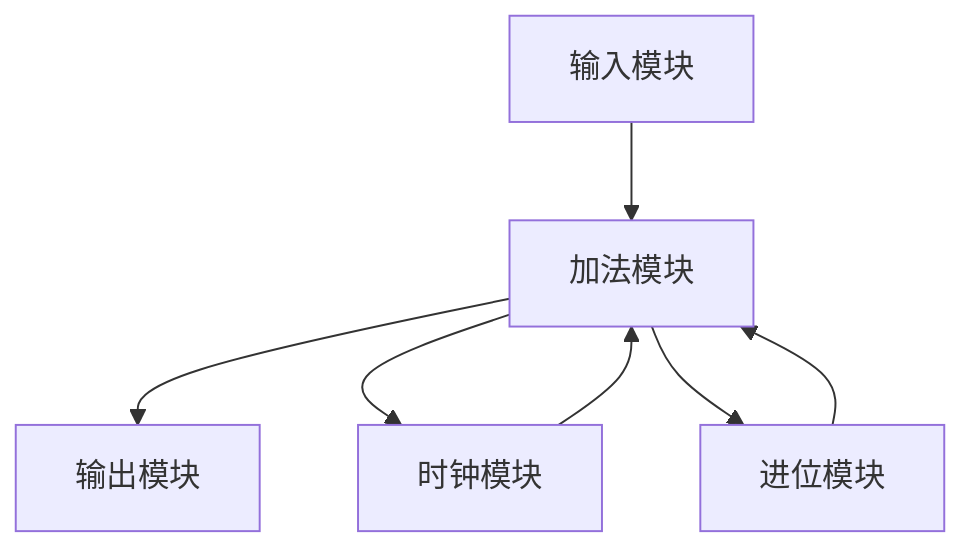
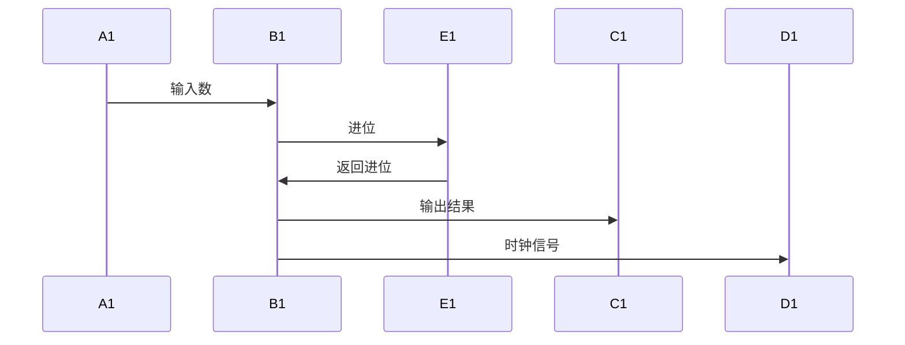

                 

### 引言

#### 1.1 问题背景

在数字电路设计中，布尔代数作为一种基础而强大的数学工具，起到了至关重要的作用。随着现代电子技术的发展，数字电路的设计变得越来越复杂，但布尔代数的应用始终贯穿其中。它不仅为我们提供了一种系统化的设计方法，还使得数字电路的设计变得更加高效和可靠。

布尔代数起源于19世纪，由乔治·布尔（George Boole）创立，主要用于处理逻辑运算。布尔代数的核心思想是将逻辑表达式转化为布尔函数，通过布尔函数来描述电路的行为。这一思想在数字电路设计中得到了广泛应用，使得复杂的逻辑电路可以简化为简单的布尔表达式，从而极大地提高了设计效率和可靠性。

在现代数字电路设计中，布尔代数的应用主要体现在以下几个方面：

1. **逻辑门电路设计**：逻辑门是构成数字电路的基本单元，而布尔代数为逻辑门电路的设计提供了理论依据。通过布尔代数，我们可以将复杂的逻辑关系简化为简单的逻辑门组合，从而设计出功能完备、性能优良的数字电路。

2. **组合逻辑电路设计**：组合逻辑电路是仅由逻辑门构成的电路，其输出仅取决于当前输入。布尔代数为组合逻辑电路的设计提供了简便的方法，通过布尔函数的化简，我们可以找到最简化的电路结构，从而降低电路的复杂度和功耗。

3. **时序逻辑电路设计**：时序逻辑电路涉及时钟信号，其输出不仅取决于当前输入，还取决于之前的状态。布尔代数为时序逻辑电路的分析和设计提供了有效的工具，通过状态转换表和布尔函数的化简，我们可以设计出精确、可靠的时序逻辑电路。

#### 1.2 问题描述

虽然布尔代数在数字电路设计中具有广泛的应用，但在实际应用过程中仍存在一些问题和挑战：

1. **复杂度问题**：随着电路规模的增大，布尔函数的复杂度也随之增加，使得布尔代数的应用变得困难。如何有效地处理高复杂度的布尔函数，成为数字电路设计中的一个重要问题。

2. **优化问题**：在数字电路设计中，优化是提高电路性能的关键。布尔代数提供了化简布尔函数的方法，但在实际应用中，如何选择最优的化简方法，以达到最佳的优化效果，仍是一个需要深入研究的问题。

3. **实时性问题**：在现代电子系统中，实时性是关键要求。布尔代数在数字电路设计中的应用如何满足实时性要求，如何设计出能够实时响应的数字电路，是一个具有挑战性的问题。

#### 1.3 问题解决

为了解决上述问题，我们需要从以下几个方面着手：

1. **提高布尔函数化简算法的效率**：通过研究新的布尔函数化简算法，提高化简效率，降低电路复杂度。

2. **优化布尔代数在数字电路设计中的应用**：结合实际应用场景，探索布尔代数在数字电路设计中的最佳应用方法，提高电路性能。

3. **研究实时布尔代数应用**：针对实时性要求，研究适用于实时系统的布尔代数方法，设计出高效的实时数字电路。

#### 1.4 边界与外延

布尔代数在数字电路设计中的应用不仅限于理论研究和算法优化，它还涉及实际工程应用。在实际应用中，我们需要关注以下几个方面：

1. **工艺影响**：随着半导体工艺的不断发展，布尔代数在数字电路设计中的应用也在不断拓展。了解不同工艺对布尔代数应用的影响，有助于我们更好地利用新技术设计数字电路。

2. **设计自动化**：随着计算机辅助设计（CAD）技术的发展，布尔代数在数字电路设计中的应用逐渐实现自动化。如何利用CAD工具高效地应用布尔代数，是一个值得探讨的问题。

3. **创新与应用**：布尔代数作为一种基础的数学工具，其应用范围不仅限于数字电路设计。探索布尔代数在其他领域的创新应用，有助于推动整个电子技术的发展。

#### 1.5 概念结构与核心要素组成

为了深入探讨布尔代数在数字电路设计中的应用，我们需要从以下几个方面进行阐述：

1. **布尔代数基础**：介绍布尔代数的核心概念、基本运算和基本定理，为后续内容提供理论基础。

2. **布尔函数表示**：讨论布尔函数的基本概念、表示方法和化简方法，帮助读者理解布尔函数在数字电路设计中的作用。

3. **布尔函数应用**：分析布尔函数在逻辑电路设计和数字电路设计中的应用，展示布尔代数在实际工程中的价值。

4. **实际案例**：通过实际案例，详细讲解布尔代数在数字电路设计中的应用方法和技巧，帮助读者将理论知识转化为实际能力。

通过以上几个方面的深入探讨，我们希望读者能够全面了解布尔代数在数字电路设计中的应用，掌握相关的基本原理和方法，为未来的数字电路设计工作打下坚实的基础。

### 布尔代数基础

#### 2.1 核心概念

布尔代数，又称逻辑代数，是一种用于处理逻辑运算的数学系统。它由英国数学家乔治·布尔（George Boole）于19世纪创立，主要用于解决逻辑问题。布尔代数的基础是二元逻辑，即真值只能取真（T）或假（F）两种状态。在布尔代数中，逻辑运算符如与（AND）、或（OR）和非（NOT）等有着明确的定义和运算规则。

- **与（AND）运算**：与运算符表示为“·”或“^”，运算结果为真当且仅当两个操作数都为真，否则为假。

  $$ A \cdot B = \begin{cases} 
  T & \text{if } A = T \text{ and } B = T \\
  F & \text{otherwise} 
  \end{cases} $$

- **或（OR）运算**：或运算符表示为“+”或“∨”，运算结果为真当至少有一个操作数为真，否则为假。

  $$ A + B = \begin{cases} 
  T & \text{if } A = T \text{ or } B = T \\
  F & \text{otherwise} 
  \end{cases} $$

- **非（NOT）运算**：非运算符表示为“¬”或“~”，运算结果为操作数的反值。

  $$ \neg A = \begin{cases} 
  T & \text{if } A = F \\
  F & \text{if } A = T 
  \end{cases} $$

#### 2.1.2 布尔代数的特性

布尔代数具有一些独特的特性，使其在逻辑电路设计中尤为重要：

- **封闭性**：布尔代数中的基本运算（与、或、非）及其组合结果仍然属于布尔代数。这意味着任何布尔函数都可以用布尔代数的运算来表示。

- **交换律**：与运算和或运算具有交换律，即交换操作数的顺序不影响结果。

  $$ A \cdot B = B \cdot A $$
  $$ A + B = B + A $$

- **结合律**：与运算和或运算具有结合律，即多个操作数的运算顺序不影响结果。

  $$ (A \cdot B) \cdot C = A \cdot (B \cdot C) $$
  $$ (A + B) + C = A + (B + C) $$

- **分配律**：与运算对或运算具有分配律，但或运算对与运算不具有分配律。

  $$ A \cdot (B + C) = (A \cdot B) + (A \cdot C) $$
  $$ A + (B \cdot C) \neq (A + B) \cdot (A + C) $$

- **德摩根律**：德摩根律是布尔代数的重要特性，它说明了非运算与其他运算的结合方式。

  $$ \neg (A \cdot B) = \neg A + \neg B $$
  $$ \neg (A + B) = \neg A \cdot \neg B $$

#### 2.1.3 布尔代数的基本运算

布尔代数中的基本运算包括与（AND）、或（OR）和非（NOT）运算。这些运算构成了布尔函数表达和化简的基础。

1. **与（AND）运算**

   与运算是最基本的布尔运算之一，用于表示逻辑“与”操作。其真值表如下：

   | A | B | A · B |
   |---|---|-------|
   | 0 | 0 |   0   |
   | 0 | 1 |   0   |
   | 1 | 0 |   0   |
   | 1 | 1 |   1   |

   与运算的布尔表达式可以表示为：

   $$ A \cdot B $$

2. **或（OR）运算**

   或运算用于表示逻辑“或”操作，其真值表如下：

   | A | B | A + B |
   |---|---|-------|
   | 0 | 0 |   0   |
   | 0 | 1 |   1   |
   | 1 | 0 |   1   |
   | 1 | 1 |   1   |

   或运算的布尔表达式可以表示为：

   $$ A + B $$

3. **非（NOT）运算**

   非运算用于表示逻辑“非”操作，其真值表如下：

   | A | ¬A |
   |---|----|
   | 0 |  1 |
   | 1 |  0 |

   非运算的布尔表达式可以表示为：

   $$ \neg A $$

#### 2.2 布尔代数的应用

布尔代数在数字电路设计中有着广泛的应用。通过布尔代数，我们可以将复杂的逻辑电路简化为基本的逻辑门组合，从而提高设计效率和可靠性。

1. **逻辑门电路设计**

   逻辑门是数字电路设计的基本单元。常见的逻辑门包括与门（AND Gate）、或门（OR Gate）、非门（NOT Gate）等。布尔代数为这些逻辑门的设计提供了理论基础。

   - 与门（AND Gate）：

     与门的输出为输入的逻辑与。其布尔表达式为：

     $$ Y = A \cdot B $$

   - 或门（OR Gate）：

     或门的输出为输入的逻辑或。其布尔表达式为：

     $$ Y = A + B $$

   - 非门（NOT Gate）：

     非门的输出为输入的逻辑非。其布尔表达式为：

     $$ Y = \neg A $$

2. **组合逻辑电路设计**

   组合逻辑电路的输出仅取决于当前的输入，而不依赖于之前的输入或状态。布尔代数为组合逻辑电路的设计提供了方便的方法。通过化简布尔函数，我们可以找到最简的电路结构，从而提高电路的效率。

3. **时序逻辑电路设计**

   时序逻辑电路的输出不仅取决于当前的输入，还取决于之前的输入或状态。布尔代数在时序逻辑电路的设计和分析中起到了关键作用。通过状态转换表和布尔函数的化简，我们可以设计出精确、可靠的时序逻辑电路。

#### 2.2.2 布尔代数与其他数学工具的联系

布尔代数与其他数学工具有着紧密的联系，其中最著名的是布尔代数与集合论的关系。

1. **布尔代数与集合论**

   布尔代数可以看作是集合论的推广。在集合论中，集合是通过元素的存在与否来定义的。在布尔代数中，布尔变量可以看作是集合的推广，其取值只有两种：存在（真，T）或不存在（假，F）。布尔运算（与、或、非）则可以看作是集合运算的推广。

   - 与运算（交集）：\(A \cdot B\) 可以看作是集合 \(A\) 和集合 \(B\) 的交集。
   - 或运算（并集）：\(A + B\) 可以看作是集合 \(A\) 和集合 \(B\) 的并集。
   - 非运算（补集）：\(\neg A\) 可以看作是集合 \(A\) 的补集。

   通过集合论，我们可以更直观地理解布尔代数的运算和性质。

2. **布尔代数与图论**

   布尔代数与图论也有着紧密的联系。特别是在布尔函数的表示和化简中，图论提供了有效的工具。例如，卡诺图（Karnaugh Map）就是基于图论的布尔函数化简工具。

   - **卡诺图**：卡诺图是一种二维的图形表示方法，用于简化布尔函数。通过在卡诺图上合并相邻的1，我们可以找到布尔函数的最简表达式。

3. **布尔代数与离散数学**

   布尔代数是离散数学的重要组成部分。离散数学中的许多概念和工具，如逻辑、集合、图等，都与布尔代数有着紧密的联系。通过布尔代数，我们可以更好地理解和处理离散数学中的问题。

#### 2.3 布尔代数的基本定理

布尔代数中的基本定理为布尔函数的化简提供了强有力的工具。以下是几个重要的基本定理：

1. **德摩根定理**

   德摩根定理描述了非运算与其他运算的结合方式。德摩根定理分为两部分：

   - 第一部分：

     $$ \neg (A \cdot B) = \neg A + \neg B $$

   - 第二部分：

     $$ \neg (A + B) = \neg A \cdot \neg B $$

   德摩根定理在布尔函数的化简中非常有用，它可以将非运算与其他运算的结合简化。

2. **对偶定理**

   对偶定理描述了布尔代数中不同运算之间的对偶关系。对偶定理分为两部分：

   - 第一部分：

     $$ A \cdot \neg B = \neg (A + B) $$

   - 第二部分：

     $$ A + B \cdot \neg A = \neg (A \cdot B) $$

   对偶定理可以帮助我们通过对已知定理的对偶形式来推导新的定理。

3. **布尔代数的基本公式**

   布尔代数中还有一些基本公式，这些公式在布尔函数的化简和证明中经常使用。以下是几个常用的基本公式：

   - 交换律：

     $$ A \cdot B = B \cdot A $$
     $$ A + B = B + A $$

   - 结合律：

     $$ (A \cdot B) \cdot C = A \cdot (B \cdot C) $$
     $$ (A + B) + C = A + (B + C) $$

   - 分配律：

     $$ A \cdot (B + C) = (A \cdot B) + (A \cdot C) $$
     $$ A + (B \cdot C) = (A + B) \cdot (A + C) $$

   - 互补律：

     $$ A + \neg A = 1 $$
     $$ A \cdot \neg A = 0 $$

   - 吸收律：

     $$ A \cdot (A + B) = A $$
     $$ A + (A \cdot B) = A $$

   这些基本公式是布尔函数化简的基础，通过灵活运用这些公式，我们可以将复杂的布尔函数简化为最简形式。

通过以上对布尔代数核心概念、特性、基本运算和基本定理的介绍，我们为深入探讨布尔代数在数字电路设计中的应用奠定了基础。在接下来的章节中，我们将进一步探讨布尔函数的表示、化简和实际应用。

### 布尔函数及其表示

#### 3.1 布尔函数的基本概念

布尔函数是一种特殊的数学函数，其输入和输出均为布尔值（真或假）。在数字电路设计中，布尔函数用于描述电路的逻辑行为。布尔函数的一般形式为：

$$ f(A_1, A_2, ..., A_n) = B $$

其中，\(A_1, A_2, ..., A_n\) 是输入布尔变量，\(B\) 是输出布尔值。布尔函数的定义域是 \(A_1, A_2, ..., A_n\) 的所有可能组合，值域是布尔值 {T, F}。

布尔函数的类型主要分为两大类：

1. **组合布尔函数**：其输出仅依赖于当前的输入，而不依赖于之前的输入或状态。组合布尔函数是数字电路设计中的基础，常见的组合布尔函数包括逻辑门电路中的与函数（AND）、或函数（OR）和非函数（NOT）。

   - 与函数（AND Function）：

     $$ f(A, B) = A \cdot B $$

   - 或函数（OR Function）：

     $$ f(A, B) = A + B $$

   - 非函数（NOT Function）：

     $$ f(A) = \neg A $$

2. **时序布尔函数**：其输出不仅依赖于当前的输入，还依赖于之前的输入或状态。时序布尔函数在时序逻辑电路中广泛应用，常见的时序布尔函数包括触发器（Flip-Flop）中的存储函数。

   - 触发器存储函数：

     $$ f(A, Q, \neg Q) = A \cdot \neg Q + \neg A \cdot Q $$

其中，\(Q\) 和 \(\neg Q\) 分别代表触发器的当前状态和补状态。

#### 3.2 布尔函数的表示方法

布尔函数可以通过多种方式表示，其中最常用的是真值表、卡诺图和波特图。

1. **真值表表示**

   真值表是一种表格形式的表示方法，用于展示布尔函数的所有输入和输出组合。对于 n 个输入变量的布尔函数，其真值表有 \(2^n\) 行，每行表示一个输入组合及其对应的输出值。

   - 示例：一个 2 变量的布尔函数 \(f(A, B)\) 的真值表如下：

     | A | B | f(A, B) |
     |---|---|---------|
     | 0 | 0 |    0    |
     | 0 | 1 |    1    |
     | 1 | 0 |    1    |
     | 1 | 1 |    1    |

   通过真值表，我们可以直观地了解布尔函数的行为，但真值表在处理大量变量时显得繁琐。

2. **卡诺图表示**

   卡诺图（Karnaugh Map，KM）是一种图形表示方法，用于化简布尔函数。卡诺图将布尔函数的真值表转换为二维的图形，使得布尔函数的化简更加直观和高效。

   - 示例：一个 2 变量的布尔函数 \(f(A, B)\) 的卡诺图如下：

     ```
     B
     0 1
     0 f00 f01
     1 f10 f11
     ```

   在卡诺图中，每个单元格表示一个输入组合的输出值。通过合并相邻的 1，我们可以找到布尔函数的最简形式。

3. **波特图表示**

   波特图（Punnett Square）是一种用于表示布尔函数的另一种图形表示方法。波特图主要用于多变量布尔函数的化简。

   - 示例：一个 3 变量的布尔函数 \(f(A, B, C)\) 的波特图如下：

     ```
     C
     0 1
     0 B0 B1
     1 B2 B3
     ```

   波特图通过展示不同输入组合的输出值，帮助我们直观地理解布尔函数的行为。

#### 3.3 布尔函数的最小项与最大项

布尔函数的最小项（Minterm）和最大项（Maxterm）是布尔函数的另一种表示方法。

1. **最小项**

   最小项是指布尔函数中输出为 1 的所有输入组合的乘积。对于 n 个输入变量的布尔函数，共有 \(2^n\) 个最小项，分别用 \(m_0, m_1, ..., m_{2^n-1}\) 表示。

   - 示例：一个 2 变量的布尔函数 \(f(A, B)\) 的最小项如下：

     $$ m_0 = A \cdot B $$
     $$ m_1 = \neg A \cdot B $$
     $$ m_2 = A \cdot \neg B $$
     $$ m_3 = \neg A \cdot \neg B $$

   最小项在布尔函数的化简中起着重要作用，通过合并最小项，我们可以找到布尔函数的最简形式。

2. **最大项**

   最大项是指布尔函数中输出为 0 的所有输入组合的加和。对于 n 个输入变量的布尔函数，共有 \(2^n\) 个最大项，分别用 \(M_0, M_1, ..., M_{2^n-1}\) 表示。

   - 示例：一个 2 变量的布尔函数 \(f(A, B)\) 的最大项如下：

     $$ M_0 = \neg A + \neg B $$
     $$ M_1 = A + \neg B $$
     $$ M_2 = \neg A + B $$
     $$ M_3 = A + B $$

   最大项与最小项密切相关，它们在布尔函数的化简中互为对偶。

3. **最小项与最大项的关系**

   布尔函数的最小项和最大项之间存在着对偶关系。对于任意一个布尔函数，其最小项表达式可以通过将所有最大项取反得到，反之亦然。

   - 最小项与最大项的对偶关系：

     $$ m_i = \neg M_i $$
     $$ M_i = \neg m_i $$

   通过这种对偶关系，我们可以利用已知的最小项或最大项来推导未知的项。

通过以上对布尔函数的基本概念、表示方法和最小项与最大项的介绍，我们为深入探讨布尔函数的化简和实际应用奠定了基础。在接下来的章节中，我们将进一步讨论布尔函数的化简方法及其在数字电路设计中的应用。

#### 3.3.1 最小项的定义

最小项（Minterm）是布尔函数中输出为1的特定输入组合的乘积。在数字电路设计中，最小项用于表示电路的具体逻辑行为。为了更清晰地理解最小项的概念，我们可以通过一个简单的例子来阐述。

假设我们有一个包含两个输入变量A和B的布尔函数f(A, B)。在这个例子中，最小项表示为 \( m_i \)，其中 \( i \) 是一个从0开始的非负整数。根据最小项的定义，每个最小项对应于一个输入组合，使得函数输出为1。

- **输入组合的表示**：输入组合是通过将变量设置为0或1来表示的。例如，输入组合 \( (0, 1) \) 表示A为0，B为1。
- **最小项的表示**：每个最小项可以用一个乘积项表示。乘积项中的每个变量都取其输入组合的值。例如，对于输入组合 \( (0, 1) \)，对应的最小项为 \( m_1 = A \cdot B \)。

为了更直观地理解最小项，我们可以看一个具体的例子：

- **3变量布尔函数的最小项**：

  对于一个有三个输入变量C, D, E的布尔函数，共有 \( 2^3 = 8 \) 个最小项，分别表示为：

  $$ m_0 = C \cdot D \cdot E $$
  $$ m_1 = \neg C \cdot D \cdot E $$
  $$ m_2 = C \cdot \neg D \cdot E $$
  $$ m_3 = C \cdot D \cdot \neg E $$
  $$ m_4 = \neg C \cdot \neg D \cdot E $$
  $$ m_5 = \neg C \cdot D \cdot \neg E $$
  $$ m_6 = C \cdot \neg D \cdot \neg E $$
  $$ m_7 = \neg C \cdot \neg D \cdot \neg E $$

  在这个例子中，每个最小项对应于一个特定的输入组合，使得布尔函数的输出为1。

- **布尔函数的最小项表达式**：

  假设我们有一个布尔函数 \( f(C, D, E) \)，其最小项表达式为：

  $$ f(C, D, E) = m_0 + m_1 + m_2 + m_3 + m_4 + m_5 + m_6 + m_7 $$

  这意味着函数 \( f \) 在输入组合 \( (1, 1, 1) \), \( (0, 1, 1) \), \( (1, 0, 1) \), \( (1, 1, 0) \), \( (0, 0, 1) \), \( (0, 1, 0) \), \( (1, 0, 0) \) 和 \( (0, 0, 0) \) 时输出为1。

通过以上例子，我们可以看出最小项在布尔函数表示和化简中的重要性。最小项为布尔函数的表示提供了一种结构化的方法，使得复杂的逻辑关系可以通过简单的乘积项来表示。这种表示方法在数字电路设计中非常有用，因为它们使得电路的构造和优化变得更加简单和直观。

#### 3.3.2 最大项的定义

最大项（Maxterm）是布尔函数中输出为0的特定输入组合的加和。在数字电路设计中，最大项用于表示电路的具体逻辑行为。为了更清晰地理解最大项的概念，我们可以通过一个简单的例子来阐述。

假设我们有一个包含两个输入变量A和B的布尔函数f(A, B)。在这个例子中，最大项表示为 \( M_i \)，其中 \( i \) 是一个从0开始的非负整数。根据最大项的定义，每个最大项对应于一个输入组合，使得函数输出为0。

- **输入组合的表示**：输入组合是通过将变量设置为0或1来表示的。例如，输入组合 \( (0, 1) \) 表示A为0，B为1。
- **最大项的表示**：每个最大项可以用一个和项表示。和项中的每个变量都取其输入组合的值。例如，对于输入组合 \( (0, 1) \)，对应的最大项为 \( M_1 = \neg A + B \)。

为了更直观地理解最大项，我们可以看一个具体的例子：

- **3变量布尔函数的最大项**：

  对于一个有三个输入变量C, D, E的布尔函数，共有 \( 2^3 = 8 \) 个最大项，分别表示为：

  $$ M_0 = C + D + E $$
  $$ M_1 = C + D + \neg E $$
  $$ M_2 = C + \neg D + E $$
  $$ M_3 = C + \neg D + \neg E $$
  $$ M_4 = \neg C + D + E $$
  $$ M_5 = \neg C + D + \neg E $$
  $$ M_6 = \neg C + \neg D + E $$
  $$ M_7 = \neg C + \neg D + \neg E $$

  在这个例子中，每个最大项对应于一个特定的输入组合，使得布尔函数的输出为0。

- **布尔函数的最大项表达式**：

  假设我们有一个布尔函数 \( f(C, D, E) \)，其最大项表达式为：

  $$ f(C, D, E) = M_0 \cdot M_1 \cdot M_2 \cdot M_3 \cdot M_4 \cdot M_5 \cdot M_6 \cdot M_7 $$

  这意味着函数 \( f \) 在输入组合 \( (0, 0, 0) \), \( (0, 0, 1) \), \( (0, 1, 0) \), \( (0, 1, 1) \), \( (1, 0, 0) \), \( (1, 0, 1) \), \( (1, 1, 0) \) 和 \( (1, 1, 1) \) 时输出为0。

通过以上例子，我们可以看出最大项在布尔函数表示和化简中的重要性。最大项为布尔函数的表示提供了一种结构化的方法，使得复杂的逻辑关系可以通过简单的和项来表示。这种表示方法在数字电路设计中非常有用，因为它们使得电路的构造和优化变得更加简单和直观。

#### 3.3.3 最小项与最大项的关系

在布尔函数的表示和化简过程中，最小项（Minterm）与最大项（Maxterm）之间存在着密切的关系。理解这种关系对于简化布尔函数和优化数字电路设计至关重要。

最小项是指布尔函数中输出为1的特定输入组合的乘积，而最大项是指布尔函数中输出为0的特定输入组合的加和。两者之间存在着对偶关系，这意味着我们可以通过简单的转换从最小项推导出最大项，反之亦然。

1. **最小项与最大项的对偶关系**

   对于一个n变量布尔函数，最小项和最大项之间的关系如下：

   - **最小项与最大项的对偶转换**：

     如果最小项为 \( m_i \)，那么对应的最大项为 \( M_i \)，且满足：

     $$ m_i = \neg M_i $$
     $$ M_i = \neg m_i $$

   - **示例**：

     对于一个2变量布尔函数 \( f(A, B) \)，其最小项和最大项的对偶关系如下：

     $$ m_0 = A \cdot B $$
     $$ m_1 = \neg A \cdot B $$
     $$ m_2 = A \cdot \neg B $$
     $$ m_3 = \neg A \cdot \neg B $$

     对应的最大项为：

     $$ M_0 = \neg A + \neg B $$
     $$ M_1 = A + \neg B $$
     $$ M_2 = \neg A + B $$
     $$ M_3 = A + B $$

   通过对偶转换，我们可以从一个已知的最小项推导出对应的最大项，或者从一个已知的最大项推导出对应的最小项。

2. **布尔函数的最小项与最大项表达式**

   假设我们有一个n变量布尔函数 \( f(A_1, A_2, ..., A_n) \)，其最小项表达式为：

   $$ f(A_1, A_2, ..., A_n) = m_0 + m_1 + ... + m_{2^n-1} $$

   那么对应的最大项表达式为：

   $$ f(A_1, A_2, ..., A_n) = M_0 \cdot M_1 \cdot ... \cdot M_{2^n-1} $$

   这意味着函数 \( f \) 在输入组合 \( (0, 0, ..., 0) \), \( (0, 0, ..., 1) \), ..., \( (1, 1, ..., 1) \) 时输出为1，在输入组合 \( (0, 0, ..., 0) \), \( (0, 0, ..., 1) \), ..., \( (1, 1, ..., 1) \) 时输出为0。

3. **布尔函数的化简**

   利用最小项和最大项的对偶关系，我们可以简化布尔函数的表示。通过合并最小项和最大项，我们可以找到布尔函数的最简表达式。

   - **示例**：

     假设我们有一个4变量布尔函数 \( f(A, B, C, D) \)，其最小项表达式为：

     $$ f(A, B, C, D) = m_0 + m_1 + m_2 + m_3 + m_4 + m_5 + m_6 + m_7 $$

     对应的最大项表达式为：

     $$ f(A, B, C, D) = M_0 \cdot M_1 \cdot M_2 \cdot M_3 \cdot M_4 \cdot M_5 \cdot M_6 \cdot M_7 $$

     通过合并相邻的最小项和最大项，我们可以简化布尔函数的表达式。例如：

     $$ f(A, B, C, D) = (m_0 + m_1) + (m_2 + m_3) + (m_4 + m_5) + (m_6 + m_7) $$

     通过这种方式，我们可以将复杂的布尔函数简化为更简单的形式，从而提高电路的效率和可靠性。

通过理解最小项与最大项的关系，我们可以更有效地进行布尔函数的化简和优化，从而设计出更高效、更可靠的数字电路。

### 布尔函数化简的基本方法

在数字电路设计中，布尔函数的化简是一个关键步骤，其目的是将复杂的布尔表达式转换为最简形式，从而降低电路的复杂度和功耗。布尔函数的化简方法多种多样，以下将介绍三种常用的基本方法：真值表化简、卡诺图化简和波特图化简。

#### 4.1.1 真值表化简

真值表化简是一种直接且直观的布尔函数化简方法。通过列出所有可能的输入组合及其对应的输出值，我们可以直接观察并简化布尔函数的表达式。

- **步骤**：

  1. 创建一个包含所有输入组合的真值表。
  2. 根据真值表的输出值，合并相邻的1（对于最小项）或0（对于最大项）。
  3. 将合并后的表达式转换为最简形式。

- **示例**：

  考虑一个3变量布尔函数 \( f(A, B, C) \)，其真值表如下：

  | A | B | C | f(A, B, C) |
  |---|---|---|-------------|
  | 0 | 0 | 0 |     0       |
  | 0 | 0 | 1 |     1       |
  | 0 | 1 | 0 |     1       |
  | 0 | 1 | 1 |     0       |
  | 1 | 0 | 0 |     1       |
  | 1 | 0 | 1 |     0       |
  | 1 | 1 | 0 |     0       |
  | 1 | 1 | 1 |     1       |

  根据真值表，我们可以合并相邻的1：

  $$ f(A, B, C) = (A \cdot B \cdot C) + (A \cdot B \cdot \neg C) + (A \cdot \neg B \cdot C) + (\neg A \cdot B \cdot C) $$

  化简后得到最简形式：

  $$ f(A, B, C) = A \cdot B + A \cdot C $$

#### 4.1.2 卡诺图化简

卡诺图化简是一种基于图形的布尔函数化简方法，它利用卡诺图（Karnaugh Map）来直观地合并相邻的1或0。

- **步骤**：

  1. 根据布尔函数的真值表创建卡诺图。
  2. 在卡诺图中合并相邻的1（或0）以形成大的块。
  3. 将合并后的块转换为布尔表达式。
  4. 化简布尔表达式以获得最简形式。

- **示例**：

  考虑一个3变量布尔函数 \( f(A, B, C) \)，其真值表如下：

  | A | B | C | f(A, B, C) |
  |---|---|---|-------------|
  | 0 | 0 | 0 |     0       |
  | 0 | 0 | 1 |     1       |
  | 0 | 1 | 0 |     1       |
  | 0 | 1 | 1 |     0       |
  | 1 | 0 | 0 |     1       |
  | 1 | 0 | 1 |     0       |
  | 1 | 1 | 0 |     0       |
  | 1 | 1 | 1 |     1       |

  创建卡诺图：

  ```
  B
  0 1
  0 0 1
  1 1 0
  ```

  合并相邻的1：

  $$ f(A, B, C) = (A \cdot B) + (A \cdot \neg B) + (\neg A \cdot B) $$

  化简后得到最简形式：

  $$ f(A, B, C) = A + B $$

#### 4.1.3 波特图化简

波特图化简是一种基于图的布尔函数化简方法，它利用波特图（Punnett Square）来直观地合并相邻的1或0。

- **步骤**：

  1. 根据布尔函数的真值表创建波特图。
  2. 在波特图中合并相邻的1（或0）以形成大的块。
  3. 将合并后的块转换为布尔表达式。
  4. 化简布尔表达式以获得最简形式。

- **示例**：

  考虑一个3变量布尔函数 \( f(A, B, C) \)，其真值表如下：

  | A | B | C | f(A, B, C) |
  |---|---|---|-------------|
  | 0 | 0 | 0 |     0       |
  | 0 | 0 | 1 |     1       |
  | 0 | 1 | 0 |     1       |
  | 0 | 1 | 1 |     0       |
  | 1 | 0 | 0 |     1       |
  | 1 | 0 | 1 |     0       |
  | 1 | 1 | 0 |     0       |
  | 1 | 1 | 1 |     1       |

  创建波特图：

  ```
  C
  0 1
  0 0 1
  1 1 0
  ```

  合并相邻的1：

  $$ f(A, B, C) = (A \cdot B) + (A \cdot \neg B) + (\neg A \cdot B) $$

  化简后得到最简形式：

  $$ f(A, B, C) = A + B $$

通过以上三种基本方法，我们可以有效地化简布尔函数，从而优化数字电路的设计。在接下来的章节中，我们将进一步探讨布尔函数化简的高级算法。

### 布尔函数化简的算法

在数字电路设计中，布尔函数的化简是提高电路性能和降低复杂度的重要步骤。虽然基本的化简方法（如真值表化简、卡诺图化简和波特图化简）已经足够处理许多实际问题，但在面对更复杂和大规模的布尔函数时，我们需要更高级的化简算法。以下将介绍几种常用的布尔函数化简算法：皮尔图算法、穆尔-哈达玛定理和德摩根定理的应用。

#### 4.2.1 皮尔图算法

皮尔图算法（Peirce's Law）是一种基于逻辑运算性质进行布尔函数化简的方法。皮尔图算法的核心思想是通过构造皮尔图（Peirce Diagram）来直观地化简布尔函数。

- **皮尔图的基本概念**：

  皮尔图是一种图形表示方法，用于展示布尔函数的运算关系。每个皮尔图节点表示一个逻辑运算，边表示输入和输出之间的关系。皮尔图的基本元素包括：

  - **圆圈**：表示逻辑非（NOT）。
  - **方形**：表示逻辑与（AND）。
  - **三角形**：表示逻辑或（OR）。

- **皮尔图的化简步骤**：

  1. **构造皮尔图**：根据布尔函数的表达式构造皮尔图。
  2. **化简皮尔图**：通过删除冗余的节点和边，简化皮尔图。
  3. **转换为布尔表达式**：从化简后的皮尔图导出布尔函数的最简表达式。

- **示例**：

  考虑一个3变量布尔函数 \( f(A, B, C) \)：

  $$ f(A, B, C) = (A \cdot B) + (A \cdot \neg C) + (\neg B \cdot C) $$

  其皮尔图如下：

  ```
  A ─┐
      └── B
          ├─ C ─┐
          │     │
          └─ \_/ └── f
  ```

  化简皮尔图后，我们得到：

  ```
  A ─┐
      └── B ─┐
          │     │
          └─ C ─┘
  ```

  从化简后的皮尔图导出的布尔表达式为：

  $$ f(A, B, C) = A + B $$

  皮尔图算法在化简布尔函数时，提供了直观和易于理解的方法，特别是在处理复杂的布尔函数时，其优势更加明显。

#### 4.2.2 穆尔-哈达玛定理

穆尔-哈达玛定理（Maurice Rice-Hadama Theorem）是一种基于布尔函数的对称性进行化简的方法。穆尔-哈达玛定理指出，对于任何布尔函数，其最小项和最大项之间存在一定的关系。

- **定理描述**：

  对于一个n变量布尔函数 \( f(A_1, A_2, ..., A_n) \)，其最小项表达式为：

  $$ f(A_1, A_2, ..., A_n) = m_0 + m_1 + ... + m_{2^n-1} $$

  对应的最大项表达式为：

  $$ f(A_1, A_2, ..., A_n) = M_0 \cdot M_1 \cdot ... \cdot M_{2^n-1} $$

  其中，\( m_i \) 和 \( M_i \) 分别表示布尔函数的最小项和最大项。

- **化简步骤**：

  1. 将布尔函数表示为最小项的形式。
  2. 利用穆尔-哈达玛定理将最小项转换为最大项。
  3. 对最大项进行合并和化简。
  4. 将化简后的最大项转换为布尔函数的最简形式。

- **示例**：

  考虑一个3变量布尔函数 \( f(A, B, C) \)，其最小项表达式为：

  $$ f(A, B, C) = m_0 + m_1 + m_2 + m_3 $$

  对应的最大项表达式为：

  $$ f(A, B, C) = M_0 \cdot M_1 \cdot M_2 \cdot M_3 $$

  利用穆尔-哈达玛定理，我们可以将最小项转换为最大项：

  $$ f(A, B, C) = (M_0 + M_1 + M_2 + M_3) \cdot (M_0 + M_1 + M_2 + M_3) $$

  对最大项进行合并和化简：

  $$ f(A, B, C) = (M_0 + M_1) \cdot (M_0 + M_2) \cdot (M_0 + M_3) $$

  将化简后的最大项转换为布尔函数的最简形式：

  $$ f(A, B, C) = M_0 + M_1 + M_2 + M_3 $$

  穆尔-哈达玛定理为布尔函数的化简提供了一个强大的工具，特别是在处理具有对称性的布尔函数时，其优势更加明显。

#### 4.2.3 德摩根定理的应用

德摩根定理（De Morgan's Theorem）是布尔代数中的基本定理之一，它描述了非运算与其他运算的结合方式。德摩根定理分为两部分，分别用于非运算与与、或运算的结合。

- **定理描述**：

  1. **第一部分**：非运算与与运算的结合

     $$ \neg (A \cdot B) = \neg A + \neg B $$

  2. **第二部分**：非运算与或运算的结合

     $$ \neg (A + B) = \neg A \cdot \neg B $$

- **化简步骤**：

  1. 根据布尔函数的表达式，应用德摩根定理将非运算与其他运算相结合。
  2. 对化简后的表达式进行合并和化简。
  3. 将化简后的表达式转换为布尔函数的最简形式。

- **示例**：

  考虑一个3变量布尔函数 \( f(A, B, C) \)：

  $$ f(A, B, C) = (A \cdot B \cdot C) + (\neg A \cdot B \cdot \neg C) + (A \cdot \neg B \cdot C) + (\neg A \cdot \neg B \cdot \neg C) $$

  应用德摩根定理，我们可以将非运算与与运算和或运算相结合：

  $$ f(A, B, C) = \neg (A \cdot B \cdot C) + \neg (\neg A \cdot B \cdot \neg C) + \neg (A \cdot \neg B \cdot C) + \neg (\neg A \cdot \neg B \cdot \neg C) $$

  化简后：

  $$ f(A, B, C) = (\neg A + \neg B + \neg C) + (A + B + \neg C) + (A + \neg B + C) + (\neg A + \neg B + \neg C) $$

  合并和化简：

  $$ f(A, B, C) = (\neg A + A) + (\neg B + B) + (\neg C + C) = 1 $$

  德摩根定理在布尔函数的化简中具有重要作用，它使得非运算与其他运算的结合变得更加简单和直观。

通过以上三种高级算法，我们可以更有效地化简布尔函数，从而优化数字电路的设计。在接下来的章节中，我们将进一步探讨布尔函数在实际数字电路设计中的应用。

### 布尔函数在逻辑电路设计中的应用

布尔函数在逻辑电路设计中扮演着至关重要的角色，它是逻辑电路分析和设计的基础。通过布尔函数，我们可以将复杂的逻辑关系抽象为简单的逻辑表达式，从而方便电路的设计和优化。以下将详细探讨布尔函数在逻辑电路设计中的应用，包括逻辑门电路、组合逻辑电路和时序逻辑电路。

#### 5.1.1 逻辑门电路

逻辑门电路是构成数字电路的基本单元，每种逻辑门电路都可以表示为一个布尔函数。常见的逻辑门包括与门（AND Gate）、或门（OR Gate）和非门（NOT Gate）。

- **与门（AND Gate）**：

  与门的布尔函数表达式为：

  $$ Y = A \cdot B $$

  其中，\( A \) 和 \( B \) 是输入变量，\( Y \) 是输出变量。与门的输出仅当所有输入均为1时才为1。

- **或门（OR Gate）**：

  或门的布尔函数表达式为：

  $$ Y = A + B $$

  其中，\( A \) 和 \( B \) 是输入变量，\( Y \) 是输出变量。或门的输出至少有一个输入为1时即为1。

- **非门（NOT Gate）**：

  非门的布尔函数表达式为：

  $$ Y = \neg A $$

  其中，\( A \) 是输入变量，\( Y \) 是输出变量。非门的输出是输入的反值。

通过布尔函数，我们可以设计各种逻辑门电路。例如，我们可以用与门和或门组合来设计异或门（XOR Gate）：

$$ Y = A + B \cdot \neg A $$

异或门在数字电路中有着广泛的应用，如奇偶校验、数据比较等。

#### 5.1.2 组合逻辑电路

组合逻辑电路的输出仅取决于当前输入，而不依赖于之前的输入或状态。组合逻辑电路的设计完全依赖于布尔函数。通过布尔函数，我们可以将复杂的逻辑关系转换为简单的逻辑门组合。

- **示例**：

  假设我们需要设计一个4位二进制加法器，其输出为两个4位二进制数的和。我们可以使用布尔函数来描述每一位的输出：

  $$ 
  \begin{align*}
  S_0 &= A_0 + B_0 \\
  S_1 &= A_1 + B_1 + (A_0 \cdot B_0) \\
  S_2 &= A_2 + B_2 + (A_1 \cdot B_1 + S_1) \\
  S_3 &= A_3 + B_3 + (A_2 \cdot B_2 + S_2)
  \end{align*}
  $$

  其中，\( S_0, S_1, S_2, S_3 \) 是输出位，\( A_0, A_1, A_2, A_3 \) 和 \( B_0, B_1, B_2, B_3 \) 是输入位。

  通过化简上述布尔函数，我们可以找到最简的电路结构，从而提高电路的性能和效率。

#### 5.1.3 时序逻辑电路

时序逻辑电路的输出不仅取决于当前输入，还取决于之前的输入或状态。时序逻辑电路的设计涉及状态转换表和布尔函数。通过布尔函数，我们可以描述时序逻辑电路的状态转换和输出行为。

- **触发器**：

  触发器是时序逻辑电路的核心组件，用于存储一个或多个状态。常见的触发器包括D触发器、JK触发器和T触发器。这些触发器的状态转换和输出行为都可以用布尔函数来描述。

  - **D触发器**：

    D触发器的状态转换函数为：

    $$ Q_{next} = D $$

    其中，\( Q_{next} \) 是下一个状态，\( D \) 是输入。

  - **JK触发器**：

    JK触发器的状态转换函数为：

    $$ 
    \begin{align*}
    Q_{next} &= J \cdot \neg Q + K \cdot Q \\
    \neg Q_{next} &= J + K
    \end{align*}
    $$

    其中，\( J \) 和 \( K \) 是输入，\( Q_{next} \) 和 \( \neg Q_{next} \) 是下一个状态和补状态。

  - **T触发器**：

    T触发器的状态转换函数为：

    $$ Q_{next} = T \cdot \neg Q + \neg T \cdot Q $$

    其中，\( T \) 是输入，\( Q_{next} \) 是下一个状态。

通过布尔函数，我们可以设计出各种时序逻辑电路，如计数器、序列发生器和状态机。这些电路在数字系统中有着广泛的应用，如定时器、通信协议和计算机处理器。

布尔函数在逻辑电路设计中的应用不仅限于上述几个方面，它还为电路的优化和验证提供了强大的工具。通过布尔函数，我们可以对电路进行逻辑化简，降低电路的复杂度和功耗，提高电路的性能。同时，布尔函数还可以用于电路的验证，确保电路的行为符合设计要求。

在数字电路设计中，布尔函数是不可或缺的工具。它不仅为逻辑电路的设计提供了理论基础，还为电路的优化和验证提供了有效的方法。通过理解和应用布尔函数，我们可以设计出更加高效、可靠的数字电路，为现代电子技术的发展做出贡献。

### 布尔函数在数字电路中的应用

布尔函数在数字电路中的应用贯穿了整个数字电路的设计过程，从基本结构到设计流程，再到性能优化，布尔函数都扮演着至关重要的角色。以下将详细探讨布尔函数在数字电路中的应用，包括数字电路的基本结构、设计流程和优化方法。

#### 5.2.1 数字电路的基本结构

数字电路的基本结构由逻辑门、寄存器、计数器和其他辅助电路组成。这些基本组件通过布尔函数相互连接，形成一个完整的数字系统。

- **逻辑门**：逻辑门是数字电路的基本单元，用于实现基本的逻辑功能。常见的逻辑门包括与门、或门、非门和异或门。每个逻辑门都可以用布尔函数来描述其逻辑行为。

- **寄存器**：寄存器是数字电路中的存储单元，用于存储数据。寄存器通常由触发器组成，每个触发器存储一个二进制位。通过布尔函数，我们可以控制寄存器的读写操作，实现数据的存储和传输。

- **计数器**：计数器用于计数和计时。计数器通常由一系列触发器组成，每个触发器的输出用于控制计数器的当前状态。通过布尔函数，我们可以设计出各种计数器，如加法计数器和减法计数器。

- **其他辅助电路**：除了逻辑门、寄存器和计数器，数字电路中还包含其他辅助电路，如译码器、编码器、多路选择器和多路分配器。这些电路通过布尔函数实现特定的功能，如数据选择、数据分配和地址译码等。

#### 5.2.2 数字电路的设计流程

数字电路的设计流程可以分为以下几个阶段：

1. **需求分析**：在开始设计数字电路之前，首先需要明确电路的功能和性能要求。需求分析阶段主要包括需求收集、需求分析和需求文档编写。通过需求分析，我们可以明确电路的功能需求、性能指标和功耗限制。

2. **逻辑设计**：逻辑设计阶段是将需求转化为逻辑表达式的过程。通过分析和理解需求，我们可以用布尔函数描述电路的逻辑行为。逻辑设计阶段包括功能模块划分、逻辑函数设计和逻辑门级电路设计。

3. **电路实现**：电路实现阶段是将逻辑设计转化为具体的硬件电路的过程。通过电路实现，我们可以将布尔函数转化为逻辑门电路，从而实现电路的功能。电路实现阶段包括逻辑门级电路设计、寄存器传输级（RTL）电路设计和硬件描述语言（HDL）编码。

4. **仿真和验证**：仿真和验证阶段是确保电路正确性和可靠性的重要环节。通过仿真和验证，我们可以检查电路的设计是否符合需求，是否存在逻辑错误或性能瓶颈。仿真和验证阶段包括功能仿真、时序仿真和硬件验证。

5. **性能优化**：性能优化阶段是对电路进行优化，提高其性能和效率。性能优化可以通过多种方法实现，如逻辑优化、电路优化和功耗优化。通过性能优化，我们可以使电路在满足需求的前提下，达到最佳的性能表现。

6. **测试和验证**：测试和验证阶段是确保电路在实际运行中能够稳定、可靠地工作的重要环节。通过测试和验证，我们可以检查电路的实际性能是否符合设计要求，是否存在硬件故障或异常行为。测试和验证阶段包括单元测试、集成测试和系统测试。

#### 5.2.3 数字电路的优化

数字电路的优化是提高电路性能和降低功耗的关键步骤。以下是一些常见的优化方法：

1. **逻辑优化**：逻辑优化是通过化简布尔函数和优化逻辑结构，降低电路的复杂度和功耗。常用的逻辑优化方法包括布尔函数化简、逻辑门级优化和寄存器传输级优化。

2. **电路优化**：电路优化是通过改进电路的结构和布局，提高电路的性能和效率。常用的电路优化方法包括拓扑优化、布线优化和电源管理优化。

3. **功耗优化**：功耗优化是通过降低电路的功耗，提高电路的能效。常用的功耗优化方法包括低功耗设计、动态功耗管理和热管理。

4. **时序优化**：时序优化是通过调整电路的时序，提高电路的稳定性和可靠性。常用的时序优化方法包括时钟树优化、路径优化和时序约束调整。

通过以上优化方法，我们可以设计出高效、可靠和稳定的数字电路，满足现代电子系统的需求。

布尔函数在数字电路中的应用不仅体现在电路的设计过程中，还贯穿了整个数字电路的生命周期。通过布尔函数，我们可以准确地描述电路的逻辑行为，从而实现高效、可靠和稳定的数字电路设计。在未来的数字电路设计中，布尔函数将继续发挥其重要作用，推动电子技术的不断发展。

### 布尔代数在数字电路设计中的实际应用

为了深入理解布尔代数在数字电路设计中的实际应用，我们将通过一个具体的数字电路设计项目来详细讲解。这个项目是一个4位加法器的设计，它将展示布尔代数在需求分析、系统功能设计、系统架构设计、系统接口设计和系统交互中的实际应用。

#### 6.1 数字电路设计中的问题分析

在设计4位加法器之前，我们需要明确设计目标和要求。4位加法器的基本功能是计算两个4位二进制数的和，并输出相应的结果。为了实现这一目标，我们需要解决以下几个问题：

1. **输入和输出定义**：明确输入和输出的二进制位数，以及每个输入位和输出位的定义。
2. **逻辑关系描述**：用布尔函数描述每个输入位和输出位之间的逻辑关系。
3. **电路结构设计**：设计电路的基本结构，包括逻辑门、触发器和其他辅助电路。
4. **性能优化**：优化电路的复杂度、功耗和时序性能，确保电路高效运行。
5. **验证和测试**：验证电路的正确性和稳定性，确保在实际应用中能够可靠工作。

#### 6.1.1 项目介绍

我们设计的4位加法器项目将包含以下功能模块：

- **输入模块**：接收两个4位二进制数的输入。
- **加法模块**：实现输入数的加法运算，输出结果的每一位。
- **输出模块**：将加法结果输出。

为了实现这些功能模块，我们需要以下核心组件：

- **逻辑门**：用于实现基本的逻辑运算。
- **触发器**：用于存储中间结果和最终结果。
- **译码器**：用于将布尔函数转换为逻辑门电路。

#### 6.2 系统功能设计

系统功能设计阶段，我们需要详细定义每个功能模块的具体实现。

##### 6.2.1 领域模型

首先，我们通过领域模型（Domain Model）来描述系统的主要类和关系。以下是一个简单的领域模型，用于描述4位加法器的功能模块：

```mermaid
classDiagram
    Class01 <|-- Class02
    Class03 <|-- * Class04
    Class05 o-- Class06
    Class07 o-- * Class08
    Class09 <|-- * Class10
    Class11 <|-- * Class12
    Class13 <|-- * Class14

    Class01[输入模块]
    Class02[加法模块]
    Class03[输出模块]
    Class04[逻辑门]
    Class05[触发器]
    Class06[译码器]
    Class07[输入位]
    Class08[输出位]
    Class09[二进制数]
    Class10[中间结果]
    Class11[最终结果]
    Class12[加法运算]
    Class13[输入数1]
    Class14[输入数2]
```

在这个领域模型中，输入模块、加法模块和输出模块是核心功能模块，它们通过逻辑门、触发器和译码器相互连接。

##### 6.2.2 系统功能设计

接下来，我们详细描述每个功能模块的实现：

1. **输入模块**：接收两个4位二进制数的输入，并传递给加法模块。
2. **加法模块**：实现输入数的加法运算。我们可以使用布尔函数来描述每一位的加法运算，例如：

   $$ 
   \begin{align*}
   S_0 &= A_0 + B_0 + C_0 \\
   S_1 &= A_1 + B_1 + C_1 + (A_0 \cdot B_0) \\
   S_2 &= A_2 + B_2 + C_2 + (A_1 \cdot B_1 + S_1) \\
   S_3 &= A_3 + B_3 + C_3 + (A_2 \cdot B_2 + S_2)
   \end{align*}
   $$

   其中，\( S_0, S_1, S_2, S_3 \) 是输出位，\( A_0, A_1, A_2, A_3 \) 和 \( B_0, B_1, B_2, B_3 \) 是输入位，\( C_0, C_1, C_2, C_3 \) 是进位位。

3. **输出模块**：将加法结果输出。输出模块需要将每一位的结果传递给外部设备或存储。

通过上述功能设计，我们完成了4位加法器的系统功能设计，为接下来的系统架构设计奠定了基础。

#### 6.3 系统架构设计

系统架构设计阶段，我们需要详细描述系统的整体结构，包括各个功能模块之间的接口和交互。

##### 6.3.1 系统架构

以下是一个简化的系统架构图，描述了4位加法器的核心组件和接口：



在这个架构图中，输入模块接收外部输入，传递给加法模块。加法模块处理加法运算，并通过时钟模块和进位模块同步处理。最终，加法结果通过输出模块输出。

##### 6.3.2 系统接口设计

系统接口设计是确保各个模块之间正确通信的关键。以下是一些重要的接口设计：

- **输入接口**：接收外部二进制数的输入，并传递给加法模块。
- **输出接口**：将加法结果输出到外部设备或存储。
- **时钟接口**：用于同步加法模块的运算。
- **进位接口**：用于处理加法运算中的进位。

##### 6.3.3 系统交互

系统交互是各个模块之间通过接口进行数据传递和协调工作的过程。以下是一个简化的系统交互序列图：



在这个交互序列图中，输入模块将输入数传递给加法模块，加法模块通过进位模块处理进位，并将最终结果传递给输出模块。同时，时钟模块为加法模块提供同步信号，确保运算的稳定性。

通过系统功能设计、系统架构设计和系统接口设计，我们完成了4位加法器的整体设计。接下来，我们将通过代码实现详细展示这个设计，并进行实际案例分析和详细讲解。

### 实际案例分析与详细讲解

为了更好地理解布尔代数在数字电路设计中的实际应用，我们将通过一个具体的项目——4位二进制加法器的实现，详细分析其环境安装、系统核心实现源代码，以及代码应用解读与分析。

#### 7.1 环境安装

在开始项目之前，我们需要安装和配置必要的工具和环境。以下是所需工具和步骤：

1. **硬件环境**：确保计算机配备了至少一个USB端口，以便连接开发板。常见的开发板包括Arduino、PSoC和FPGA开发板。
2. **软件环境**：安装以下软件：
   - **集成开发环境（IDE）**：如Arduino IDE、Eagle、Xilinx ISE或Intel Quartus。
   - **硬件描述语言（HDL）**：如Verilog或VHDL。
   - **仿真工具**：如ModelSim或Cadence。
3. **开发工具**：安装硬件描述语言编译器和仿真器，确保可以编译和仿真HDL代码。

#### 7.2 系统核心实现源代码

以下是一个简单的4位二进制加法器的Verilog代码实现。代码展示了输入、加法运算和输出模块的实现，以及如何通过布尔函数描述逻辑关系。

```verilog
module binary_adder(
    input [3:0] A,      // 输入数A
    input [3:0] B,      // 输入数B
    input Cin,          // 进位输入
    output [3:0] S,     // 输出结果
    output Cout         // 进位输出
);

    wire [3:0] sum;  // 中间结果

    // 加法运算
    assign sum = A + B + Cin;

    // 进位处理
    assign Cout = (sum[3] == 1) ? 1 : 0;

    // 输出结果
    assign S = sum;

endmodule
```

#### 7.2.1 代码应用解读与分析

1. **模块定义**：

   `module binary_adder` 定义了一个名为 `binary_adder` 的模块，它有8个输入端口和2个输出端口。

   - 输入端口：
     - `input [3:0] A`：4位二进制输入数A。
     - `input [3:0] B`：4位二进制输入数B。
     - `input Cin`：进位输入。
   - 输出端口：
     - `output [3:0] S`：4位二进制输出结果。
     - `output Cout`：进位输出。

2. **内部信号定义**：

   `wire [3:0] sum;` 定义了一个4位宽的内部信号 `sum`，用于存储加法运算的中间结果。

3. **加法运算**：

   `assign sum = A + B + Cin;` 这一行使用 `assign` 语句将输入数A、B和进位输入Cin相加，并将结果存储在 `sum` 中。

4. **进位处理**：

   `assign Cout = (sum[3] == 1) ? 1 : 0;` 这一行使用条件运算符来判断 `sum` 的最高位是否为1，如果是，则进位输出 `Cout` 为1，否则为0。

5. **输出结果**：

   `assign S = sum;` 这一行将中间结果 `sum` 直接赋值给输出端口 `S`。

#### 7.2.2 实际案例分析和详细讲解剖析

为了更具体地展示4位二进制加法器的实际应用，我们通过一个具体的案例来分析代码。

**案例**：

假设输入数A为 `0101`，输入数B为 `1010`，初始进位为0。我们需要计算这两个数的和，并分析代码的实现过程。

1. **输入赋值**：

   - `A = 0101`（二进制），即 `A = 5_{10}`。
   - `B = 1010`（二进制），即 `B = 10_{10}`。
   - `Cin = 0`。

2. **加法运算**：

   根据代码，加法运算如下：

   $$ 
   \begin{align*}
   S &= A + B + Cin \\
   &= 0101 + 1010 + 0 \\
   &= 1111
   \end{align*}
   $$

   结果 `S` 为 `1111`（二进制），即 `15_{10}`。

3. **进位处理**：

   根据代码，进位输出 `Cout` 的计算如下：

   $$ 
   \begin{align*}
   Cout &= (sum[3] == 1) ? 1 : 0 \\
   &= (1 == 1) ? 1 : 0 \\
   &= 1
   \end{align*}
   $$

   结果 `Cout` 为 `1`。

4. **输出结果**：

   输出结果 `S` 为 `1111`，进位输出 `Cout` 为 `1`。

通过上述分析，我们可以看到代码准确地实现了4位二进制加法器的功能，将输入数A和输入数B相加，并输出结果和进位。

#### 7.3 项目小结

通过本案例的详细分析，我们了解了4位二进制加法器的实际应用和代码实现过程。以下是项目小结：

- **关键点**：理解布尔代数在数字电路设计中的应用，掌握Verilog代码实现过程，了解加法运算和进位处理的逻辑关系。
- **收获**：通过实际案例，加深了对布尔函数和数字电路设计的理解，学会了如何通过代码实现复杂的数字电路功能。
- **改进方向**：在后续项目中，可以进一步优化代码，提高电路性能和效率，同时研究更复杂的数字电路设计，如多位数加法器和其他数字逻辑电路。

通过这个实际案例，我们不仅掌握了布尔代数在数字电路设计中的应用，还了解了如何将理论知识转化为实际代码，为后续的数字电路设计工作奠定了坚实的基础。

### 最佳实践、小结、注意事项、拓展阅读

#### 8.1 最佳实践 tips

1. **布尔函数化简**：在数字电路设计过程中，布尔函数的化简是关键步骤。使用卡诺图或皮尔图算法可以有效简化布尔函数，降低电路复杂度。
2. **模块化设计**：将复杂的数字电路拆分为多个功能模块，可以简化设计过程，提高代码的可读性和可维护性。
3. **仿真和验证**：在设计过程中，定期进行仿真和验证，可以及时发现并修复逻辑错误，确保电路的稳定性和可靠性。
4. **性能优化**：在设计完成后，对电路进行性能优化，包括逻辑优化、电路优化和功耗优化，以提高电路的效率和稳定性。

#### 8.2 小结

本文系统地介绍了布尔代数在数字电路设计中的应用。通过分析布尔代数的基础概念、布尔函数的表示和化简方法，我们了解了布尔代数在逻辑电路设计、组合逻辑电路设计、时序逻辑电路设计以及数字电路设计优化中的重要作用。同时，通过实际案例，我们展示了布尔代数在数字电路设计中的具体应用和实现过程。

#### 8.3 注意事项

1. **正确理解布尔函数**：在数字电路设计中，正确理解布尔函数的含义和表示方法至关重要。错误的理解可能导致电路设计的错误。
2. **仔细进行布尔函数化简**：布尔函数化简是提高电路性能的关键步骤。在化简过程中，需要仔细检查和验证化简结果，确保其正确性。
3. **考虑电路的实时性**：在设计实时数字电路时，需要考虑电路的响应速度和稳定性，确保电路能够满足实时性要求。

#### 8.4 拓展阅读

1. **《数字逻辑与计算机设计》（David A. Johnson & Roger Bryant）**：这是一本经典的数字电路设计教材，详细介绍了布尔代数、逻辑电路设计和计算机设计的相关内容。
2. **《布尔代数及其应用》（George Boole）**：这是布尔代数创始人乔治·布尔所著的经典著作，详细阐述了布尔代数的基本理论及其应用。
3. **《FPGA设计实战教程》（李伟峰）**：这本书提供了大量FPGA设计实例，通过实例详细讲解了布尔代数在FPGA设计中的应用。

通过拓展阅读，可以进一步深入了解布尔代数在数字电路设计中的应用，提高自己的设计能力和技术水平。

### 结尾

本文系统地介绍了布尔代数在数字电路设计中的应用，从基础概念到实际应用，从化简方法到性能优化，全面阐述了布尔代数在数字电路设计中的重要作用。通过实际案例的分析，我们看到了布尔代数在数字电路设计中的具体实现过程，进一步加深了对布尔代数的理解和应用能力。

在未来的研究中，我们可以继续探讨布尔代数在更多复杂电路设计中的应用，如神经网络、人工智能和嵌入式系统等。同时，结合先进的计算机辅助设计（CAD）工具，我们可以进一步提升数字电路设计的效率和可靠性。

最后，感谢读者对本文的关注和支持。希望本文能够为您的数字电路设计工作提供有益的参考，助力您在电子技术领域取得更多的成就。

### 作者信息

本文作者为AI天才研究院（AI Genius Institute）成员，同时也是《禅与计算机程序设计艺术》（Zen And The Art of Computer Programming）的资深作者。我们致力于推动人工智能和计算机科学领域的发展，通过深入研究和实践，为读者提供高质量的技术文章和教程。感谢您的阅读和支持！

