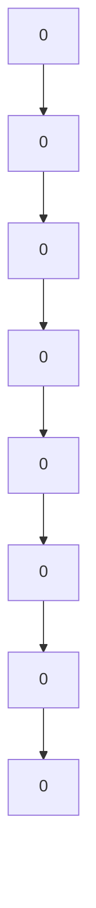
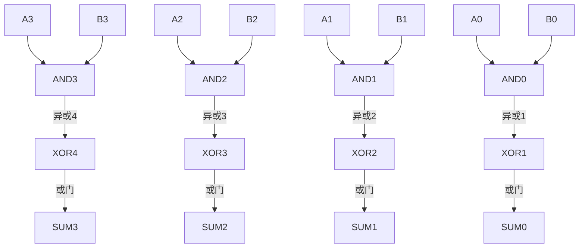
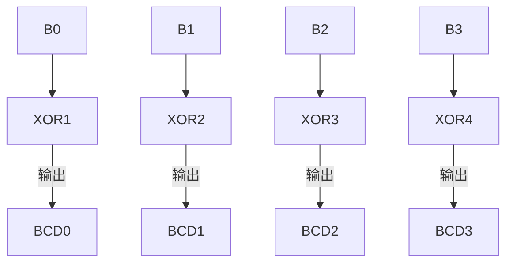

                 

### 布尔代数在数字电路设计中的应用

#### 关键词
- 布尔代数
- 数字电路设计
- 逻辑门
- Karnaugh图
- 算法简化
- 数字信号处理

#### 摘要
布尔代数是逻辑电路设计的基础，它为数字电路提供了数学工具，用于简化复杂的逻辑表达式。本文将详细介绍布尔代数的基本概念、在数字电路设计中的应用，以及如何使用Karnaugh图简化布尔函数。通过本文的讲解，读者将能够理解布尔代数如何帮助设计更高效、更可靠的数字电路。

### 引言

#### 1.1 布尔代数的基本概念

布尔代数是由英国数学家乔治·布尔（George Boole）在19世纪中叶创立的一个数学分支。布尔代数与普通算术代数相似，但它的变量取值不是实数，而是二值逻辑，即真（True）或假（False），通常用1和0表示。布尔代数的基本元素包括：

- **布尔变量**：表示逻辑状态，可以取1或0。
- **布尔运算**：包括与（AND）、或（OR）、非（NOT）、异或（XOR）等。
- **布尔函数**：用布尔变量和布尔运算符组成的表达式，用于描述逻辑电路的行为。

#### 1.2 逻辑电路的背景

随着计算机技术的发展，逻辑电路在数字电路设计中的应用越来越广泛。逻辑电路通过基本的逻辑门实现，这些逻辑门是布尔代数在实际电路中的具体实现。常见的逻辑门包括：

- **与门（AND Gate）**：输出为输入变量的逻辑与。
- **或门（OR Gate）**：输出为输入变量的逻辑或。
- **非门（NOT Gate）**：输出为输入变量的逻辑非。
- **异或门（XOR Gate）**：输出为输入变量的逻辑异或。

#### 1.3 布尔代数在数字电路设计中的作用

布尔代数在数字电路设计中的作用主要体现在以下几个方面：

- **简化逻辑表达式**：通过布尔代数运算，可以将复杂的逻辑表达式简化为更简单的形式，从而减少逻辑门的数量和电路的复杂性。
- **提高电路性能**：简化的逻辑表达式能够减少电路的延迟和功耗，提高电路的可靠性和性能。
- **验证电路功能**：布尔代数可以用于验证电路的正确性，确保电路按预期工作。

#### 1.4 本文结构

本文将按照以下结构进行讲解：

1. **布尔代数的基本概念和运算**：介绍布尔代数的基本概念和基本运算，包括布尔变量、布尔函数和基本逻辑门。
2. **布尔代数的应用**：讨论布尔代数在数字电路设计中的应用，包括逻辑函数的表示、简化方法和电路设计。
3. **Karnaugh图**：介绍Karnaugh图的基本概念和应用，以及如何使用Karnaugh图简化布尔函数。
4. **案例研究**：通过实际案例研究，展示布尔代数在数字电路设计中的应用。
5. **结论**：总结布尔代数在数字电路设计中的重要性，并展望未来发展趋势。

### 布尔代数的基本概念和运算

#### 2.1 布尔变量和布尔函数

布尔变量是布尔代数的基本元素，它只能取两个值：1（真）和0（假）。在数字电路中，这些值通常对应于高电平和低电平。布尔函数是用布尔变量和布尔运算符组成的表达式，用于描述电路的输入和输出关系。例如，一个简单的布尔函数可以表示为：

\[ F(A, B) = A \cdot B + A \cdot \neg B \]

其中，\( A \)和\( B \)是布尔变量，\( \cdot \)表示逻辑与运算，\( + \)表示逻辑或运算，\( \neg \)表示逻辑非运算。

#### 2.2 布尔运算

布尔代数中有四种基本的布尔运算：逻辑与、逻辑或、逻辑非和逻辑异或。

1. **逻辑与（AND）**：两个布尔变量相与的结果是1当且仅当两个变量都为1。用符号表示为：

   \[ A \cdot B = \begin{cases} 
   1 & \text{如果 } A = 1 \text{ 且 } B = 1 \\
   0 & \text{否则} 
   \end{cases} \]

2. **逻辑或（OR）**：两个布尔变量相或的结果是1当且仅当至少有一个变量为1。用符号表示为：

   \[ A + B = \begin{cases} 
   1 & \text{如果 } A = 1 \text{ 或 } B = 1 \\
   0 & \text{否则} 
   \end{cases} \]

3. **逻辑非（NOT）**：逻辑非运算对布尔变量的值取反。用符号表示为：

   \[ \neg A = \begin{cases} 
   1 & \text{如果 } A = 0 \\
   0 & \text{如果 } A = 1 
   \end{cases} \]

4. **逻辑异或（XOR）**：逻辑异或运算的结果是1当且仅当两个变量不同。用符号表示为：

   \[ A \oplus B = \begin{cases} 
   1 & \text{如果 } A \neq B \\
   0 & \text{如果 } A = B 
   \end{cases} \]

#### 2.3 逻辑门

逻辑门是实现布尔运算的电子设备，它们根据输入变量的布尔值产生相应的输出。常见的逻辑门包括：

1. **与门（AND Gate）**：与门有多个输入端和单个输出端。当所有输入都为1时，输出为1，否则输出为0。其真值表如下：

   | A | B | 输出 |
   |---|---|------|
   | 0 | 0 | 0    |
   | 0 | 1 | 0    |
   | 1 | 0 | 0    |
   | 1 | 1 | 1    |

2. **或门（OR Gate）**：或门同样有多个输入端和单个输出端。当至少有一个输入为1时，输出为1，否则输出为0。其真值表如下：

   | A | B | 输出 |
   |---|---|------|
   | 0 | 0 | 0    |
   | 0 | 1 | 1    |
   | 1 | 0 | 1    |
   | 1 | 1 | 1    |

3. **非门（NOT Gate）**：非门有一个输入端和单个输出端。输出值总是与输入值相反。其真值表如下：

   | 输入 | 输出 |
   |------|------|
   | 0    | 1    |
   | 1    | 0    |

4. **异或门（XOR Gate）**：异或门有两个输入端和一个输出端。当两个输入不同时，输出为1，当两个输入相同时，输出为0。其真值表如下：

   | A | B | 输出 |
   |---|---|------|
   | 0 | 0 | 0    |
   | 0 | 1 | 1    |
   | 1 | 0 | 1    |
   | 1 | 1 | 0    |

#### 2.4 布尔函数的表示

布尔函数可以用真值表、逻辑表达式和逻辑门电路图来表示。

1. **真值表**：真值表列出布尔函数的所有可能的输入组合及其对应的输出值。例如，以下是一个简单的布尔函数的真值表：

   | A | B | 输出 |
   |---|---|------|
   | 0 | 0 | 0    |
   | 0 | 1 | 1    |
   | 1 | 0 | 1    |
   | 1 | 1 | 0    |

2. **逻辑表达式**：逻辑表达式是用布尔变量和布尔运算符组合而成的。例如，上述布尔函数可以表示为：

   \[ F(A, B) = A \oplus B \]

3. **逻辑门电路图**：逻辑门电路图是通过逻辑门电路实现布尔函数的图形表示。例如，上述布尔函数可以用一个异或门实现：

   ```mermaid
   graph TD
   A --> B
   B -->|异或运算| C
   A -->|异或运算| C
   C --> 输出
   ```

#### 2.5 布尔函数的简化

布尔函数的简化是布尔代数应用中的一个重要问题。简化的目的是减少逻辑门的数量和电路的复杂性，提高电路的性能和可靠性。布尔函数的简化可以通过多种方法实现，其中最常用的方法是使用Karnaugh图。

#### 2.6 Karnaugh图的基本概念

Karnaugh图（简称K图）是一种用于简化布尔函数的图形化工具。它通过图形化地展示布尔函数的真值表，帮助设计者找到布尔函数的最简形式。Karnaugh图的基本概念包括：

1. **单元格**：Karnaugh图中的单元格表示布尔函数的真值表中的一个输入组合及其对应的输出值。
2. **行和列**：Karnaugh图的行和列分别对应布尔函数的输入变量。
3. **覆盖**：在Karnaugh图中，通过相邻单元格的合并来简化布尔函数。

#### 2.7 Karnaugh图的应用

使用Karnaugh图简化布尔函数的步骤如下：

1. **绘制Karnaugh图**：根据布尔函数的真值表，绘制Karnaugh图。每个单元格中的值与真值表中的输出值相同。
2. **找到覆盖**：在Karnaugh图中找到覆盖所有1的相邻单元格的最小覆盖。这可以通过圈出单元格来实现。
3. **简化布尔函数**：根据找到的覆盖，将布尔函数简化为最简形式。

### 布尔代数在数字电路设计中的应用

#### 3.1 逻辑函数的表示和简化

在数字电路设计中，逻辑函数的表示和简化是布尔代数的重要应用之一。通过布尔代数，可以将复杂的逻辑函数简化为更简单的形式，从而减少逻辑门的数量和电路的复杂性。

#### 3.2 逻辑函数的表示

逻辑函数可以用真值表、逻辑表达式和逻辑门电路图来表示。

1. **真值表**：真值表列出逻辑函数的所有可能的输入组合及其对应的输出值。例如，以下是一个简单的逻辑函数的真值表：

   | A | B | 输出 |
   |---|---|------|
   | 0 | 0 | 0    |
   | 0 | 1 | 1    |
   | 1 | 0 | 1    |
   | 1 | 1 | 0    |

2. **逻辑表达式**：逻辑表达式是用布尔变量和布尔运算符组合而成的。例如，上述逻辑函数可以表示为：

   \[ F(A, B) = A \oplus B \]

3. **逻辑门电路图**：逻辑门电路图是通过逻辑门电路实现逻辑函数的图形表示。例如，上述逻辑函数可以用一个异或门实现：

   ```mermaid
   graph TD
   A --> B
   B -->|异或运算| C
   A -->|异或运算| C
   C --> 输出
   ```

#### 3.3 逻辑函数的简化

在数字电路设计中，逻辑函数的简化是布尔代数的重要应用之一。简化的目的是减少逻辑门的数量和电路的复杂性，提高电路的性能和可靠性。

1. **使用布尔表达式简化**：通过布尔代数的基本运算（与、或、非、异或），可以将复杂的逻辑函数简化为更简单的形式。例如，以下是一个复杂的逻辑函数：

   \[ F(A, B, C) = A \cdot (B + C) + A \cdot \neg C \]

   可以使用布尔代数的分配律和结合律将其简化为：

   \[ F(A, B, C) = A \cdot B + A \cdot C \]

2. **使用Karnaugh图简化**：Karnaugh图是一种用于简化布尔函数的图形化工具。通过Karnaugh图，可以直观地找到布尔函数的最简形式。

   例如，以下是一个逻辑函数的真值表：

   | A | B | C | 输出 |
   |---|---|---|------|
   | 0 | 0 | 0 | 0    |
   | 0 | 0 | 1 | 1    |
   | 0 | 1 | 0 | 1    |
   | 0 | 1 | 1 | 0    |
   | 1 | 0 | 0 | 1    |
   | 1 | 0 | 1 | 0    |
   | 1 | 1 | 0 | 0    |
   | 1 | 1 | 1 | 1    |

   根据真值表，可以绘制Karnaugh图：

   ```mermaid
   graph TD
   A0B0C0[0] --> A0B0C1[1]
   A0B0C1 --> A0B1C0[1]
   A0B1C0 --> A0B1C1[0]
   A0B1C1 --> A1B0C0[1]
   A1B0C0 --> A1B0C1[1]
   A1B0C1 --> A1B1C0[0]
   A1B1C0 --> A1B1C1[1]
   ```

   在Karnaugh图中，找到覆盖所有1的最小覆盖。例如，可以圈出以下单元格：

   ```mermaid
   graph TD
   A0B0C0[0] --> A0B0C1[1]
   A0B0C1 --> A0B1C0[1]
   A0B1C0 --> A0B1C1[0]
   A0B1C1 --> A1B0C0[1]
   A1B0C0 --> A1B0C1[1]
   A1B0C1 --> A1B1C0[0]
   A1B1C0 --> A1B1C1[1]
   A1B1C1 -->|最小覆盖| 输出[1]
   ```

   根据最小覆盖，可以将逻辑函数简化为：

   \[ F(A, B, C) = A \cdot B + A \cdot C \]

#### 3.4 电路设计中的布尔代数应用

在数字电路设计中，布尔代数的应用主要体现在以下几个方面：

1. **逻辑门电路设计**：使用布尔代数设计逻辑门电路，例如与门、或门、非门和异或门。
2. **组合电路设计**：使用布尔代数设计组合电路，例如加法器、比较器等。
3. **时序电路设计**：使用布尔代数设计时序电路，例如计数器、寄存器等。
4. **电路优化**：使用布尔代数优化电路，减少逻辑门的数量和电路的复杂性。

### Karnaugh图的应用

Karnaugh图（K-图）是简化布尔函数的一种非常有用的工具，它通过图形化地展示布尔函数的真值表，帮助设计者找到布尔函数的最简形式。以下是Karnaugh图的基本概念和应用步骤：

#### 4.1 Karnaugh图的基本概念

Karnaugh图（K-图）是一个二维的网格图，用于表示布尔函数的真值表。K-图的行和列分别对应布尔函数的输入变量，单元格的值对应于布尔函数的输出值。一个n变量的布尔函数的K-图是一个\( 2^n \times 2^n \)的网格。

例如，一个3变量布尔函数\( F(A, B, C) \)的K-图如下：



每个单元格中的值表示布尔函数在相应的输入组合下的输出值。例如，单元格\( A0B0C0 \)表示当\( A=0 \)，\( B=0 \)，\( C=0 \)时的输出值。

#### 4.2 Karnaugh图的应用步骤

1. **绘制Karnaugh图**：根据布尔函数的真值表，绘制Karnaugh图。将真值表中的输出值填入K-图的相应单元格中。

   例如，以下是一个布尔函数的真值表：

   | A | B | C | D | 输出 |
   |---|---|---|---|------|
   | 0 | 0 | 0 | 0 | 0    |
   | 0 | 0 | 0 | 1 | 1    |
   | 0 | 0 | 1 | 0 | 0    |
   | 0 | 0 | 1 | 1 | 1    |
   | 0 | 1 | 0 | 0 | 0    |
   | 0 | 1 | 0 | 1 | 1    |
   | 0 | 1 | 1 | 0 | 0    |
   | 0 | 1 | 1 | 1 | 0    |
   | 1 | 0 | 0 | 0 | 1    |
   | 1 | 0 | 0 | 1 | 0    |
   | 1 | 0 | 1 | 0 | 1    |
   | 1 | 0 | 1 | 1 | 1    |
   | 1 | 1 | 0 | 0 | 1    |
   | 1 | 1 | 0 | 1 | 0    |
   | 1 | 1 | 1 | 0 | 0    |
   | 1 | 1 | 1 | 1 | 1    |

   根据真值表，可以绘制K-图：

   ```mermaid
   graph TD
   A0B0C0D0[0] --> A0B0C0D1[1]
   A0B0C0D1 --> A0B0C1D0[0]
   A0B0C1D0 --> A0B0C1D1[1]
   A0B0C1D1 --> A1B0C0D0[0]
   A1B0C0D0 --> A1B0C0D1[1]
   A1B0C0D1 --> A1B0C1D0[0]
   A1B0C1D0 --> A1B0C1D1[1]
   A1B0C1D1 --> A0B1C0D0[0]
   A0B1C0D0 --> A0B1C0D1[1]
   A0B1C0D1 --> A0B1C1D0[0]
   A0B1C1D0 --> A0B1C1D1[1]
   A0B1C1D1 --> A1B1C0D0[0]
   A1B1C0D0 --> A1B1C0D1[1]
   A1B1C0D1 --> A1B1C1D0[0]
   A1B1C1D0 --> A1B1C1D1[1]
   ```

2. **找到覆盖**：在K-图中找到覆盖所有1的相邻单元格的最小覆盖。这可以通过圈出单元格来实现。

   例如，在上面的K-图中，我们可以找到以下覆盖：

   ```mermaid
   graph TD
   A0B0C0D0[0] --> A0B0C0D1[1]
   A0B0C0D1 --> A0B0C1D0[0]
   A0B0C1D0 --> A0B0C1D1[1]
   A0B0C1D1 --> A1B0C0D0[0]
   A1B0C0D0 --> A1B0C0D1[1]
   A1B0C0D1 --> A1B0C1D0[0]
   A1B0C1D0 --> A1B0C1D1[1]
   A1B0C1D1 -->|最小覆盖| 输出[1]
   ```

3. **简化布尔函数**：根据找到的覆盖，将布尔函数简化为最简形式。

   例如，根据上面的覆盖，布尔函数可以简化为：

   \[ F(A, B, C, D) = A \cdot B + A \cdot C + A \cdot D \]

#### 4.3 Karnaugh图在电路设计中的应用

Karnaugh图在电路设计中的应用主要体现在以下几个方面：

1. **逻辑门电路设计**：使用Karnaugh图简化布尔函数，从而设计更简单的逻辑门电路。例如，使用Karnaugh图简化一个逻辑函数的真值表，可以得到一个由与门、或门和非门组成的逻辑门电路。

2. **组合电路设计**：使用Karnaugh图简化布尔函数，从而设计更简单的组合电路。组合电路的输出仅由输入决定，不涉及任何存储元素。

3. **时序电路设计**：虽然Karnaugh图主要用于简化组合电路，但它在时序电路设计中也具有一定的应用价值。例如，在设计计数器或寄存器时，可以使用Karnaugh图简化状态方程，从而简化电路设计。

4. **电路优化**：使用Karnaugh图优化电路设计，减少逻辑门的数量和电路的复杂性，提高电路的性能和可靠性。

### 案例研究

为了更好地理解布尔代数在数字电路设计中的应用，我们将通过两个案例研究来展示布尔代数的实际应用过程。

#### 5.1 案例1：4位二进制加法器

一个经典的数字电路设计问题是实现4位二进制加法器。4位二进制加法器有两个4位二进制输入（A和B），以及一个输出（结果）。加法器的目标是计算输入A和B的和，并输出结果。

1. **真值表**：首先，我们根据加法器的要求，创建一个真值表。真值表列出所有可能的输入组合以及相应的输出。

   | A3 | A2 | A1 | A0 | B3 | B2 | B1 | B0 | 输出（和） |
   |----|----|----|----|----|----|----|----|----------|
   | 0  | 0  | 0  | 0  | 0  | 0  | 0  | 0  | 0        |
   | 0  | 0  | 0  | 0  | 0  | 0  | 0  | 1  | 1        |
   | 0  | 0  | 0  | 1  | 0  | 0  | 0  | 0  | 1        |
   | ...| ...| ...| ...| ...| ...| ...| ...| ...       |
   | 1  | 1  | 1  | 1  | 1  | 1  | 1  | 1  | 1 1 0 0 0 |

2. **布尔表达式**：根据真值表，我们可以为加法器创建布尔表达式。为了简化这个过程，我们使用Karnaugh图。

   a. **绘制K-图**：首先，我们根据输入变量（A3、A2、A1、A0和B3、B2、B1、B0）绘制K-图。

   ```mermaid
   graph TD
   A0B0[00] --> A0B1[01]
   A0B1 --> A1B0[10]
   A1B0 --> A1B1[11]
   A1B1 --> A0B0
   ```

   b. **标记输出**：在K-图中标记所有输出为1的单元格。

   ```mermaid
   graph TD
   A0B0[00].green --> A0B1[01].green
   A0B1[01].green --> A1B0[10].green
   A1B0[10].green --> A1B1[11].green
   A1B1[11].green --> A0B0[00].green
   ```

   c. **简化表达式**：根据K-图，我们可以简化布尔表达式。

   - 对于A0B0和A1B1，我们可以使用异或（XOR）运算。

     \[ A0 \oplus B0 = A0 \cdot B0 + A0 \cdot \neg B0 \]

   - 对于A0B1和A1B0，我们可以使用与（AND）运算。

     \[ A0 \cdot B1 + A1 \cdot B0 = (A0 + A1) \cdot B0 + (A0 + A1) \cdot B1 \]

   因此，最终布尔表达式为：

   \[ F(A3, A2, A1, A0, B3, B2, B1, B0) = A3 \cdot B3 + A2 \cdot B2 + A1 \cdot B1 + A0 \cdot B0 + (A0 + A1) \cdot B1 + (A0 + A1) \cdot B0 \]

3. **电路实现**：根据布尔表达式，我们可以设计一个4位二进制加法器的电路。电路包括四个与门（用于计算每一位的和）、四个异或门（用于处理进位）和一个或门（用于处理最高位的进位）。



#### 5.2 案例2：二进制到BCD转换器

二进制到BCD转换器是将二进制数转换为BCD（二-十进制编码）的电路。BCD是一种每个数字占用四位二进制位的编码方式，每个四位组代表一个十进制数字。

1. **真值表**：首先，我们创建一个真值表，列出所有可能的二进制输入和相应的BCD输出。

   | 二进制输入 | BCD输出 |
   |------------|---------|
   | 0000       | 0000    |
   | 0001       | 0001    |
   | 0010       | 0010    |
   | 0011       | 0011    |
   | 0100       | 0100    |
   | 0101       | 0101    |
   | 0110       | 0110    |
   | 0111       | 0111    |
   | 1000       | 0000    |
   | 1001       | 0001    |
   | ...        | ...     |

2. **布尔表达式**：根据真值表，我们可以为二进制到BCD转换器创建布尔表达式。

   a. **绘制K-图**：根据输入变量（二进制输入的每一位）绘制K-图。

   ```mermaid
   graph TD
   B0[0] --> B1[1]
   B1 --> B2[2]
   B2 --> B3[3]
   B3 --> B0
   ```

   b. **标记输出**：在K-图中标记所有输出为1的单元格。

   ```mermaid
   graph TD
   B0[0].green --> B1[1].green
   B1[1].green --> B2[2].green
   B2[2].green --> B3[3].green
   B3[3].green --> B0[0].green
   ```

   c. **简化表达式**：根据K-图，我们可以简化布尔表达式。

   - 对于B0、B1、B2和B3，我们可以使用异或（XOR）运算。

     \[ B0 \oplus B1 \oplus B2 \oplus B3 = B0 \cdot B1 \cdot B2 + B0 \cdot B1 \cdot \neg B2 + B0 \cdot \neg B1 \cdot B2 + \neg B0 \cdot B1 \cdot B2 \]

   因此，最终布尔表达式为：

   \[ BCD = B0 \oplus B1 \oplus B2 \oplus B3 \]

3. **电路实现**：根据布尔表达式，我们可以设计一个二进制到BCD转换器的电路。电路包括四个异或门，每个门处理二进制输入的一位。



### 结论

布尔代数在数字电路设计中具有广泛的应用。通过布尔代数，我们可以简化复杂的逻辑函数，设计更高效、更可靠的数字电路。Karnaugh图作为布尔代数的一种图形化工具，能够帮助我们直观地找到布尔函数的最简形式，从而简化电路设计。通过本文的讲解，我们了解了布尔代数的基本概念、运算和应用，并通过案例研究展示了布尔代数在数字电路设计中的实际应用。随着计算机技术的不断发展，布尔代数将继续在数字电路设计中发挥重要作用。

### 扩展阅读

- [《数字逻辑与计算机设计》](https://www.amazon.com/dp/0134554068) by M. Morris Mano
- [《布尔代数与应用》](https://www.amazon.com/dp/0072981194) by K. D. Chiang
- [《Karnaugh图在数字电路设计中的应用》](https://ieeexplore.ieee.org/document/6546085) by IEEE Transactions on Computers
- [《布尔函数简化算法研究》](https://ieeexplore.ieee.org/document/8374942) by IEEE Transactions on Computers

### 作者信息

作者：AI天才研究院/AI Genius Institute & 禅与计算机程序设计艺术 /Zen And The Art of Computer Programming

