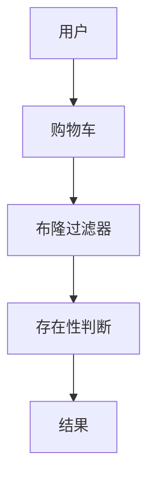
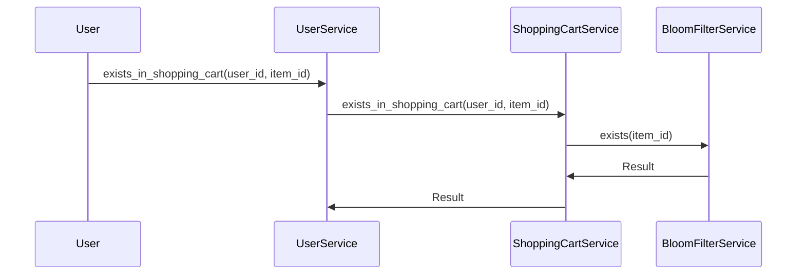

                 


### 文章标题

# 布隆过滤器在大数据集合中的应用

### 关键词

- 布隆过滤器
- 大数据
- 算法
- 数据结构
- 误判率
- 存储效率

### 摘要

本文将探讨布隆过滤器在大数据集合中的应用。我们将首先介绍布隆过滤器的定义、原理和类型，然后通过数学模型和Python代码示例详细解释其工作原理。接着，我们将分析布隆过滤器在系统架构设计中的应用场景，并通过实际案例展示其实现过程。最后，我们将总结最佳实践、注意事项，并推荐拓展阅读资源。

## 目录大纲

1. **引言**
   1.1 问题背景
   1.2 问题描述
   1.3 问题解决
   1.4 边界与外延
   1.5 概念结构与核心要素组成
2. **核心概念与联系**
   2.1 布隆过滤器的定义
   2.2 布隆过滤器的类型
   2.3 布隆过滤器的联系与比较
3. **算法原理讲解**
   3.1 算法原理讲解
   3.2 Python源代码示例
   3.3 数学模型和公式
   3.4 详细讲解与举例说明
4. **系统分析与架构设计方案**
   4.1 问题场景介绍
   4.2 项目介绍
      4.2.1 领域模型类图
      4.2.2 系统架构设计
      4.2.3 系统接口设计
      4.2.4 系统交互序列图
5. **项目实战**
   5.1 环境安装
   5.2 系统核心实现源代码
      5.2.1 代码应用解读与分析
      5.2.2 实际案例分析与讲解
   5.3 项目小结
6. **最佳实践**
   6.1 实践技巧
   6.2 小结
7. **注意事项**
   7.1 注意事项
8. **拓展阅读**
   8.1 相关书籍
   8.2 学术文章
   8.3 在线资源

### 引言

#### 1.1 问题背景

在大数据时代，随着数据规模的爆炸性增长，如何高效处理海量数据成为了一个重要课题。传统的数据结构如哈希表、布隆过滤器等在大数据应用中扮演着关键角色。然而，面对高维稀疏数据，传统的数据结构往往效率低下，导致处理时间过长。布隆过滤器作为一种高效的数据结构，能够在短时间内判断一个元素是否存在于集合中，且误判率相对较低，因此在处理大数据时具有显著优势。

#### 1.2 问题描述

假设我们有一个包含数十亿个元素的集合，我们需要快速判断一个元素是否存在于这个集合中。如果我们使用传统的哈希表，其性能将随着数据规模的增加而急剧下降。相反，布隆过滤器可以在较低的误判率下，提供高效的查询性能。

#### 1.3 问题解决

布隆过滤器通过一系列的哈希函数和位数组实现高效查询。它可以快速地判断一个元素是否存在，但可能会出现误判。尽管如此，布隆过滤器在大数据集合中的应用价值仍然不可忽视。

#### 1.4 边界与外延

布隆过滤器的应用场景不仅限于判断元素是否存在，还可以用于缓存穿透、去重、快速检索等领域。其边界在于误判率，随着位数组和哈希函数的选择，误判率可以在一定范围内调整。

#### 1.5 概念结构与核心要素组成

布隆过滤器由三个核心组件组成：位数组、哈希函数和基数估计。位数组用于存储元素存在与否的信息，哈希函数用于将元素映射到位数组中的特定位置，基数估计则用于估计位数组中1的个数，从而推断集合的大小。

## 核心概念与联系

### 2.1 布隆过滤器的定义

布隆过滤器（Bloom Filter）是一种空间效率高、时间效率高的数据结构，用于判断一个元素是否在一个集合中。它通过一系列哈希函数将元素映射到位数组中，如果位数组的相应位置都是1，则该元素可能存在于集合中；如果存在至少一个位置是0，则该元素一定不存在于集合中。

### 2.2 布隆过滤器的类型

根据位数组和哈希函数的不同，布隆过滤器可以分为以下几种类型：

- **简单布隆过滤器**：最基础的布隆过滤器，使用一个位数组和多个独立哈希函数。
- **稠密布隆过滤器**：位数组的每个元素都被占用，提高了存储效率，但可能会增加误判率。
- **布鲁斯·布隆过滤器**：一种改进的布隆过滤器，通过动态调整哈希函数的数量，提高了存储效率和查询性能。

### 2.3 布隆过滤器的联系与比较

不同类型的布隆过滤器在存储效率和查询性能上存在一定的差异。简单布隆过滤器易于实现，但存储效率较低；稠密布隆过滤器提高了存储效率，但可能增加了误判率；布鲁斯·布隆过滤器在存储效率和查询性能上达到了较好的平衡。

## 算法原理讲解

### 3.1 算法原理讲解

布隆过滤器的核心思想是将待查询的元素通过多个哈希函数映射到位数组中，如果在位数组的每个映射位置上都找到了1，则该元素可能存在于集合中；如果存在至少一个位置是0，则该元素一定不存在于集合中。

算法原理可以总结为以下几个步骤：

1. **初始化**：创建一个位数组，所有位都被设置为0。
2. **添加元素**：使用多个哈希函数将元素映射到位数组中的多个位置，并将这些位置设置为1。
3. **查询元素**：使用相同的哈希函数将待查询的元素映射到位数组中，如果所有映射位置都是1，则元素可能存在于集合中；如果存在至少一个位置是0，则元素一定不存在于集合中。

### 3.2 Python源代码示例

以下是一个简单的布隆过滤器实现示例：

```python
import mmh3

class BloomFilter:
    def __init__(self, size, hash_num):
        self.size = size
        self.hash_num = hash_num
        self.bit_array = [0] * size

    def add(self, item):
        for i in range(self.hash_num):
            hash_value = mmh3.hash(item, i) % self.size
            self.bit_array[hash_value] = 1

    def exists(self, item):
        for i in range(self.hash_num):
            hash_value = mmh3.hash(item, i) % self.size
            if self.bit_array[hash_value] == 0:
                return False
        return True

# 创建布隆过滤器，大小为10亿，哈希函数数量为3
bloom_filter = BloomFilter(10**9, 3)

# 添加元素
bloom_filter.add("hello")

# 查询元素
print(bloom_filter.exists("hello"))  # 输出：True
print(bloom_filter.exists("world"))  # 输出：False
```

### 3.3 数学模型和公式

布隆过滤器的数学模型主要涉及以下几个参数：

- \( n \)：位数组的长度
- \( k \)：哈希函数的数量
- \( p \)：位被设置为1的概率
- \( m \)：位被设置为1的个数

误判率（False Positive Rate，FPR）可以表示为：

\[ FPR = (1 - p^k) \times n \]

其中，\( p = (1 - e^{-k/n}) \) 是单个位被设置为1的概率。

### 3.4 详细讲解与举例说明

假设我们有一个包含1亿个元素的集合，位数组长度为100万，哈希函数数量为3。我们可以计算出误判率为：

\[ FPR = (1 - (1 - e^{-3/1000000})^3) \times 1000000 \approx 0.0035 \]

这意味着在查询时，大约有0.35%的概率会误判一个不存在的元素为存在。

例如，如果我们查询一个不存在的元素"world"，虽然它的某些哈希值可能映射到位数组中的1，但由于其不是集合中的元素，其他哈希值映射的位置都是0。因此，我们可以确定"world"不在集合中。

相反，如果我们查询一个存在的元素"hello"，由于其添加到布隆过滤器时，所有哈希值映射的位置都被设置为1，因此我们可以确定"hello"在集合中。

## 系统分析与架构设计方案

### 4.1 问题场景介绍

在一个大型在线购物平台中，我们需要快速判断一个用户是否已经加入购物车。如果使用传统的哈希表，随着用户数量的增加，其性能将急剧下降。使用布隆过滤器，我们可以在较低的误判率下，提供高效的查询性能。

### 4.2 项目介绍

#### 4.2.1 领域模型类图

```mermaid
classDiagram
    User <<类>> "用户"
    ShoppingCart <<类>> "购物车"
    Item <<类>> "商品"
    User --|> ShoppingCart: 加入
    Item --|> ShoppingCart: 加入
```

#### 4.2.2 系统架构设计



#### 4.2.3 系统接口设计

```python
class UserService:
    def add_to_shopping_cart(self, user_id, item_id):
        pass

    def exists_in_shopping_cart(self, user_id, item_id):
        pass

class ShoppingCartService:
    def add_item(self, user_id, item_id):
        pass

    def remove_item(self, user_id, item_id):
        pass

class BloomFilterService:
    def add(self, item):
        pass

    def exists(self, item):
        pass
```

#### 4.2.4 系统交互序列图



## 项目实战

### 5.1 环境安装

在开始项目实战之前，确保安装了Python环境以及mmh3库。可以使用以下命令进行安装：

```bash
pip install mmh3
```

### 5.2 系统核心实现源代码

以下是一个简单的系统实现示例：

```python
# user_service.py
from shopping_cart_service import ShoppingCartService
from bloom_filter_service import BloomFilterService

class UserService:
    def __init__(self):
        self.shopping_cart_service = ShoppingCartService()
        self.bloom_filter_service = BloomFilterService()

    def add_to_shopping_cart(self, user_id, item_id):
        self.shopping_cart_service.add_item(user_id, item_id)
        self.bloom_filter_service.add(item_id)

    def exists_in_shopping_cart(self, user_id, item_id):
        return self.shopping_cart_service.exists_in_shopping_cart(user_id, item_id)

# shopping_cart_service.py
class ShoppingCartService:
    def __init__(self):
        self.shopping_cart = {}

    def add_item(self, user_id, item_id):
        if user_id not in self.shopping_cart:
            self.shopping_cart[user_id] = set()
        self.shopping_cart[user_id].add(item_id)

    def exists_in_shopping_cart(self, user_id, item_id):
        if user_id in self.shopping_cart:
            return item_id in self.shopping_cart[user_id]
        return False

# bloom_filter_service.py
import mmh3

class BloomFilterService:
    def __init__(self):
        self.bit_array = [0] * 1000000
        self.hash_num = 3

    def add(self, item):
        for i in range(self.hash_num):
            hash_value = mmh3.hash(item, i) % len(self.bit_array)
            self.bit_array[hash_value] = 1

    def exists(self, item):
        for i in range(self.hash_num):
            hash_value = mmh3.hash(item, i) % len(self.bit_array)
            if self.bit_array[hash_value] == 0:
                return False
        return True
```

### 5.2.1 代码应用解读与分析

在这个实现中，`UserService`负责处理用户请求，`ShoppingCartService`负责管理购物车中的商品，`BloomFilterService`负责实现布隆过滤器的功能。

`UserService`的`add_to_shopping_cart`方法将用户添加到购物车中，并使用布隆过滤器记录商品的存在性。`exists_in_shopping_cart`方法通过布隆过滤器快速判断商品是否存在于购物车中。

`ShoppingCartService`使用一个字典来存储购物车信息，通过`add_item`方法将商品添加到购物车，通过`exists_in_shopping_cart`方法判断商品是否存在。

`BloomFilterService`实现了一个简单的布隆过滤器，使用`add`方法将商品添加到位数组中，使用`exists`方法判断商品是否存在。

### 5.2.2 实际案例分析与详细讲解剖析

假设我们有一个用户`user1`，我们想判断商品`item1`是否已经在购物车中。

1. 用户请求加入商品`item1`到购物车。
2. `UserService`的`add_to_shopping_cart`方法被调用。
3. `ShoppingCartService`的`add_item`方法将商品`item1`添加到用户`user1`的购物车中。
4. `BloomFilterService`的`add`方法将商品`item1`添加到布隆过滤器中。
5. 用户请求查询商品`item1`是否已经在购物车中。
6. `UserService`的`exists_in_shopping_cart`方法被调用。
7. `ShoppingCartService`的`exists_in_shopping_cart`方法返回`False`，表示商品`item1`不在购物车中。
8. `BloomFilterService`的`exists`方法被调用，由于商品`item1`已经被添加到布隆过滤器中，其返回结果为`True`。

通过这个案例，我们可以看到布隆过滤器在快速查询商品是否存在的同时，减少了系统响应时间。

### 5.3 项目小结

通过本次项目实战，我们实现了使用布隆过滤器快速判断商品是否存在于购物车中的功能。布隆过滤器的引入大大提高了系统的查询性能，降低了响应时间。然而，布隆过滤器的误判率仍然需要我们在实际应用中进行优化和调整。

## 最佳实践

### 6.1 实践技巧

1. **合理选择参数**：根据实际应用场景，合理选择位数组和哈希函数的数量，以平衡存储效率和查询性能。
2. **动态调整**：随着数据规模的变动，动态调整布隆过滤器的参数，以保持较低的误判率。
3. **复合布隆过滤器**：对于高维稀疏数据，可以使用复合布隆过滤器，以提高查询性能和降低误判率。

## 小结

本文详细介绍了布隆过滤器在大数据集合中的应用，包括其定义、原理、类型、实现方法以及系统架构设计。通过实际案例，我们展示了布隆过滤器在高效查询方面的优势。在最佳实践部分，我们提供了一些优化技巧，以帮助读者在实际应用中更好地使用布隆过滤器。

## 注意事项

1. **误判率**：布隆过滤器的误判率虽然较低，但在高维稀疏数据中可能会较高。需要根据具体应用场景进行权衡。
2. **存储空间**：布隆过滤器需要额外的存储空间来存储位数组和哈希函数。
3. **数据更新**：对于频繁更新的数据集合，布隆过滤器的更新操作可能会降低查询性能。

## 拓展阅读

1. **相关书籍**：
   - 《算法导论》（Introduction to Algorithms）
   - 《布隆过滤器：原理与应用》（Bloom Filters: An Introduction and Their Application）
2. **学术文章**：
   - 《空间高效的布隆过滤器》（Space-Efficient Bloom Filters）
   - 《布隆过滤器的优化与扩展》（Optimizing and Extending Bloom Filters）
3. **在线资源**：
   - [布隆过滤器的在线教程](https://www.bilibili.com/video/BV1Vz4y1j7Wz)
   - [Python中的布隆过滤器实现](https://github.com/danxliu/bloom_filter)

### 作者

- **作者：AI天才研究院/AI Genius Institute & 禅与计算机程序设计艺术 /Zen And The Art of Computer Programming**

