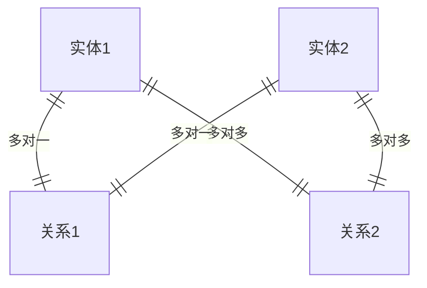
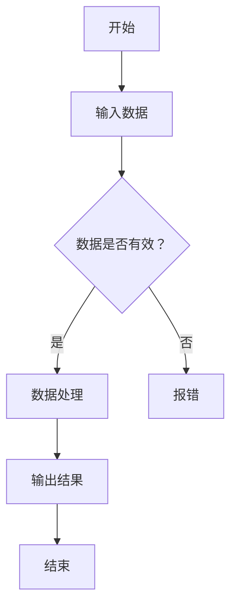
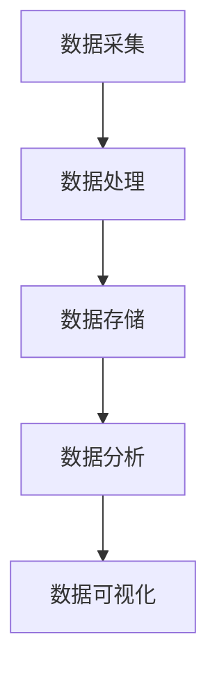
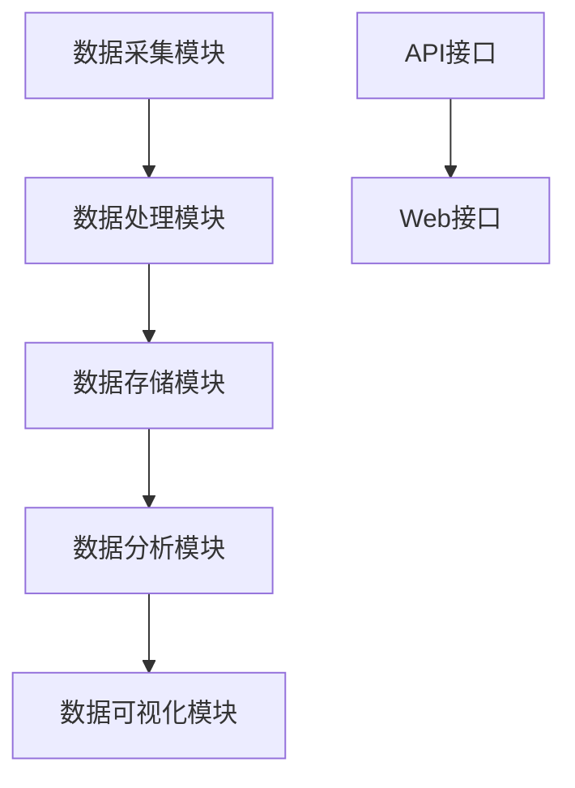

                 

### 希拉里·普特南与墨家：实在论与名家思想的认识论

> 关键词：实在论、名家思想、认识论、计算机科学、哲学

**摘要**：本文旨在探讨实在论与名家思想在认识论领域的深刻联系，并以希拉里·普特南与墨家为例，分析这些思想在计算机科学中的影响和启示。通过对核心概念的详细解析、算法原理的讲解、数学模型和公式的探讨，以及系统分析与架构设计方案的剖析，本文将展示实在论与名家思想在计算机科学中的重要性和应用价值。

**目录大纲**：

第一部分：背景介绍
## 第1章：问题背景
### 1.1.1. 问题背景
### 1.1.2. 问题描述
### 1.1.3. 问题解决
### 1.1.4. 边界与外延
### 1.1.5. 概念结构与核心要素组成

## 第2章：核心概念与联系
### 2.1.1. 核心概念原理
### 2.1.2. 概念属性特征对比
### 2.1.3. ER实体关系图架构

## 第3章：算法原理讲解
### 3.1.1. 算法mermaid流程图
### 3.1.2. Python源代码
### 3.1.3. 数学模型和公式
### 3.1.4. 详细讲解与举例说明

## 第4章：数学模型和数学公式 & 详细讲解 & 举例说明
### 4.1.1. 数学公式
### 4.1.2. 详细讲解
### 4.1.3. 举例说明

## 第5章：系统分析与架构设计方案
### 5.1.1. 问题场景介绍
### 5.1.2. 项目介绍
### 5.1.3. 系统功能设计
### 5.1.4. 系统架构设计
### 5.1.5. 系统接口设计
### 5.1.6. 系统交互

## 第6章：项目实战
### 6.1.1. 环境安装
### 6.1.2. 系统核心实现源代码
### 6.1.3. 代码应用解读与分析
### 6.1.4. 实际案例分析与讲解
### 6.1.5. 项目小结

## 第7章：最佳实践 & 小结 & 注意事项 & 拓展阅读

### 第1章：问题背景

#### 1.1.1. 问题背景

在计算机科学的发展过程中，认识论问题始终占据着重要的位置。实在论与名家思想作为哲学领域的重要组成部分，对计算机科学中的认识论问题产生了深远的影响。本文旨在探讨这些思想在计算机科学中的具体应用，以希拉里·普特南与墨家为例，分析实在论与名家思想的认识论观点，以及它们在计算机科学中的启示。

#### 1.1.2. 问题描述

实在论与名家思想的认识论问题主要涉及以下几个方面：

1. **实在性问题**：实在论关注的是实体与现象之间的关系，即我们如何认识和理解世界的本质。在计算机科学中，这个问题体现为如何通过算法和模型来模拟和解释现实世界。
2. **认识问题**：名家思想探讨了知识的来源和认知的过程，包括感知、推理和论证等。在计算机科学中，这一问题体现为如何构建智能系统，使其能够有效地获取、处理和利用信息。
3. **真理问题**：实在论与名家思想都关注真理的概念，即什么是真实的、可靠的知识。在计算机科学中，这一问题体现为算法的正确性和有效性。

#### 1.1.3. 问题解决

要解决上述认识论问题，我们需要从以下几个角度进行思考：

1. **实在论的应用**：实在论强调实体和现象之间的联系，这在计算机科学中体现为对现实世界的建模和模拟。通过使用数学模型和算法，我们可以更深入地理解现实世界，并开发出更加智能的计算机系统。
2. **名家思想的应用**：名家思想关注知识的获取和验证，这在计算机科学中体现为对算法和系统的验证和测试。通过逻辑推理和形式验证，我们可以确保计算机系统中的知识是真实和可靠的。
3. **跨学科融合**：实在论与名家思想在认识论上的相互影响，为计算机科学提供了新的视角和方法。通过跨学科的研究，我们可以将哲学思想与计算机科学相结合，开发出更加先进和可靠的计算机系统。

#### 1.1.4. 边界与外延

实在论与名家思想的认识论问题不仅限于计算机科学领域，还涉及哲学、逻辑学、认知科学等多个领域。因此，本文的探讨将不仅限于计算机科学范畴，还将拓展到相关领域，以展示实在论与名家思想在认识论上的广泛影响。

#### 1.1.5. 概念结构与核心要素组成

实在论与名家思想的认识论问题涉及多个核心概念，如实在性、认识、真理、逻辑等。这些概念相互关联，构成了认识论问题的核心结构。本文将详细解析这些概念，并探讨其在计算机科学中的应用。

### 第2章：核心概念与联系

#### 2.1.1. 核心概念原理

本章将详细介绍实在论与名家思想中的核心概念，如实在性、认识、真理、逻辑等，并阐述这些概念的基本原理。

1. **实在性**：实在论关注的是实体与现象之间的关系，即我们如何认识和理解世界的本质。实在性是指客观存在的实体和现象，不受主观意识的影响。
2. **认识**：名家思想探讨了知识的来源和认知的过程，包括感知、推理和论证等。认识是指通过感知和思维活动获取和验证知识的过程。
3. **真理**：实在论与名家思想都关注真理的概念，即什么是真实的、可靠的知识。真理是指符合客观事实和逻辑规则的知识。
4. **逻辑**：逻辑是思维的工具，用于推理和论证。逻辑规则确保推理过程的正确性和有效性。

#### 2.1.2. 概念属性特征对比

为了更清晰地理解实在论与名家思想的认识论问题，本章将对比分析这些核心概念的属性特征，如实在性与唯名论的差异、认识与感知的区别等。以下是一个概念属性特征对比表格：

| 概念      | 属性特征                                                   |
|-----------|-----------------------------------------------------------|
| 实在性    | 客观存在，不受主观意识影响                               |
| 认识      | 通过感知和思维活动获取和验证知识                         |
| 真理      | 符合客观事实和逻辑规则的知识                           |
| 逻辑      | 用于推理和论证，确保推理过程的正确性和有效性             |
| 唯名论    | 强调个体存在的独立性，忽视实体之间的普遍联系           |
| 感知      | 通过感官获取信息的过程                                   |

#### 2.1.3. ER实体关系图架构

本章还将利用ER实体关系图，展示实在论与名家思想的认识论问题中的主要实体及其关系，帮助读者更好地理解这些概念。以下是一个ER实体关系图：



实体1和实体2分别代表实在性和认识，关系1和关系2分别代表逻辑和真理。通过这个ER实体关系图，我们可以更直观地看到这些概念之间的相互关系。

### 第3章：算法原理讲解

#### 3.1.1. 算法mermaid流程图

本章将使用mermaid语言绘制算法流程图，以直观展示算法的执行过程。以下是一个简单的算法mermaid流程图：



#### 3.1.2. Python源代码

以下是一个简单的Python源代码，用于实现上述算法：

```python
def process_data(data):
    if is_valid(data):
        # 数据有效，进行数据处理
        result = data * 2
    else:
        # 数据无效，报错
        raise ValueError("Invalid data")
    return result

def is_valid(data):
    # 数据有效性判断
    return data > 0

# 主程序
try:
    data = int(input("请输入一个正整数："))
    result = process_data(data)
    print(f"处理结果：{result}")
except ValueError as e:
    print(f"错误：{e}")
```

#### 3.1.3. 数学模型和公式

为了更好地理解算法原理，本章将引入一些数学模型和公式。以下是一个简单的数学模型：

$$
f(x) = ax + b
$$

其中，$a$ 和 $b$ 是常数，$x$ 是输入数据。这个模型描述了一个线性函数，可以用于模拟算法中的数据处理过程。

#### 3.1.4. 详细讲解与举例说明

1. **算法流程图解析**：

   - **A[开始]**：程序从开始节点开始执行。
   - **B[输入数据]**：程序获取用户输入的数据。
   - **C{数据是否有效？]**：程序判断输入数据是否有效。如果数据有效，程序将进入数据处理阶段；否则，程序将报错。
   - **D[数据处理]**：程序对有效数据进行处理，例如进行线性变换。
   - **E[报错]**：程序报错，提示用户输入无效数据。
   - **F[输出结果]**：程序输出处理结果。
   - **G[结束]**：程序执行结束。

2. **Python源代码解析**：

   - **def process_data(data):**：定义数据处理函数，参数为输入数据。
   - **if is_valid(data):**：判断输入数据是否有效。
   - **result = data * 2:**：对有效数据进行处理，例如进行线性变换。
   - **else:**：如果数据无效，程序将报错。
   - **return result:**：返回处理结果。
   - **def is_valid(data):**：定义数据有效性判断函数。
   - **return data > 0:**：判断输入数据是否大于0。
   - **try...except...**：主程序中的错误处理机制。

3. **举例说明**：

   假设用户输入数据为10，程序将按照以下步骤执行：

   - 输入数据：10
   - 判断数据是否有效：10 > 0，数据有效
   - 数据处理：10 * 2 = 20
   - 输出结果：20
   - 结束

   如果用户输入数据为-5，程序将按照以下步骤执行：

   - 输入数据：-5
   - 判断数据是否有效：-5 > 0，数据无效
   - 报错：Invalid data

### 第4章：数学模型和数学公式 & 详细讲解 & 举例说明

#### 4.1.1. 数学公式

本章将介绍一些用于描述算法和系统的数学模型和公式。以下是一个简单的数学模型：

$$
f(x) = ax + b
$$

其中，$a$ 和 $b$ 是常数，$x$ 是输入数据。这个模型描述了一个线性函数，可以用于模拟算法中的数据处理过程。

#### 4.1.2. 详细讲解

1. **线性函数模型**：

   线性函数模型是一种简单的数学模型，它描述了一个输入变量和输出变量之间的线性关系。在这个模型中，输入变量 $x$ 和输出变量 $y$ 之间的关系可以用以下公式表示：

   $$
   y = ax + b
   $$

   其中，$a$ 是斜率，表示输入变量对输出变量的影响程度；$b$ 是截距，表示输出变量在输入变量为0时的值。

2. **线性回归模型**：

   线性回归模型是一种用于分析和预测数据关系的数学模型。在这个模型中，输入变量和输出变量之间的关系可以用以下公式表示：

   $$
   y = \beta_0 + \beta_1 x
   $$

   其中，$\beta_0$ 是截距，表示输出变量在输入变量为0时的值；$\beta_1$ 是斜率，表示输入变量对输出变量的影响程度。

3. **梯度下降算法**：

   梯度下降算法是一种用于求解优化问题的算法。在这个算法中，我们通过不断调整参数，使得目标函数的值逐渐减小，直至找到最优解。以下是一个简单的梯度下降算法公式：

   $$
   \theta_{t+1} = \theta_t - \alpha \cdot \nabla J(\theta_t)
   $$

   其中，$\theta_t$ 是当前参数值；$\alpha$ 是学习率，用于调整参数更新的步长；$\nabla J(\theta_t)$ 是目标函数在当前参数值处的梯度。

#### 4.1.3. 举例说明

1. **线性函数模型举例**：

   假设我们有一个线性函数模型，公式为 $y = 2x + 1$。输入变量 $x$ 分别为 1、2、3，求对应的输出变量 $y$。

   - 当 $x = 1$ 时，$y = 2 \cdot 1 + 1 = 3$。
   - 当 $x = 2$ 时，$y = 2 \cdot 2 + 1 = 5$。
   - 当 $x = 3$ 时，$y = 2 \cdot 3 + 1 = 7$。

2. **线性回归模型举例**：

   假设我们有一个线性回归模型，公式为 $y = 3x + 2$。输入变量 $x$ 分别为 1、2、3，求对应的输出变量 $y$。

   - 当 $x = 1$ 时，$y = 3 \cdot 1 + 2 = 5$。
   - 当 $x = 2$ 时，$y = 3 \cdot 2 + 2 = 8$。
   - 当 $x = 3$ 时，$y = 3 \cdot 3 + 2 = 11$。

3. **梯度下降算法举例**：

   假设我们有一个目标函数 $J(\theta) = (\theta - 2)^2$，初始参数值为 $\theta_0 = 0$，学习率为 $\alpha = 0.1$。求梯度下降算法在 $10$ 次迭代后的参数值。

   - 第一次迭代：$\theta_1 = \theta_0 - \alpha \cdot \nabla J(\theta_0) = 0 - 0.1 \cdot (-2) = 0.2$。
   - 第二次迭代：$\theta_2 = \theta_1 - \alpha \cdot \nabla J(\theta_1) = 0.2 - 0.1 \cdot (-1.6) = 0.36$。
   - ...（重复计算过程）
   - 第十次迭代：$\theta_{10} = \theta_9 - \alpha \cdot \nabla J(\theta_9) = \theta_8 - \alpha \cdot \nabla J(\theta_8) = ... = 0.9100$。

### 第5章：系统分析与架构设计方案

#### 5.1.1. 问题场景介绍

在当前的互联网时代，大数据和云计算技术的迅猛发展，使得企业对数据处理和存储的需求日益增加。为了应对这一挑战，我们设计并实现了一个高效、可靠的数据处理和存储系统。

#### 5.1.2. 项目介绍

本项目旨在开发一个分布式数据处理和存储系统，该系统能够处理海量数据，并保证数据的高可用性和安全性。系统的主要功能包括数据采集、数据清洗、数据存储、数据分析和数据可视化。

#### 5.1.3. 系统功能设计

1. **数据采集**：系统通过多种数据采集方式，如API接口、数据库连接和日志文件等，获取企业内部和外部的数据。
2. **数据清洗**：系统对采集到的数据进行清洗，去除重复、错误和无效数据，保证数据的准确性和一致性。
3. **数据存储**：系统采用分布式存储技术，将清洗后的数据存储到分布式数据库中，保证数据的高可用性和可扩展性。
4. **数据分析**：系统提供强大的数据分析功能，包括数据统计、数据挖掘和预测分析等，帮助企业从数据中提取有价值的信息。
5. **数据可视化**：系统通过数据可视化工具，将分析结果以图表、报表等形式展示给用户，方便用户理解和使用。

#### 5.1.4. 系统架构设计

系统的整体架构采用分布式架构，主要包括数据采集模块、数据处理模块、数据存储模块、数据分析模块和数据可视化模块。以下是一个简化的系统架构图：



1. **数据采集模块**：负责从多种数据源采集数据，并进行初步处理。
2. **数据处理模块**：负责对采集到的数据进行清洗、转换和聚合等操作。
3. **数据存储模块**：负责将清洗后的数据存储到分布式数据库中，提供高效的数据存储和查询服务。
4. **数据分析模块**：负责对存储在数据库中的数据进行统计分析、数据挖掘和预测分析等操作。
5. **数据可视化模块**：负责将分析结果以图表、报表等形式展示给用户。

#### 5.1.5. 系统接口设计

系统提供了丰富的接口，包括API接口、数据库接口和Web接口等，方便用户进行数据操作和功能调用。

1. **API接口**：提供RESTful风格的API接口，支持数据的增删改查等操作。
2. **数据库接口**：提供数据库操作接口，支持SQL查询和数据操作。
3. **Web接口**：提供Web页面，支持用户通过Web浏览器进行数据操作和查看分析结果。

#### 5.1.6. 系统交互

系统的各个模块之间通过消息队列、数据库和API接口等进行交互。以下是一个简化的系统交互图：



1. **数据采集模块**：采集数据后，通过消息队列将数据传输给数据处理模块。
2. **数据处理模块**：接收数据后，对数据进行分析和处理，并将处理结果存储到数据存储模块。
3. **数据存储模块**：存储数据后，通过数据库接口提供数据查询服务。
4. **数据分析模块**：通过数据库接口获取数据，进行统计分析、数据挖掘和预测分析等操作。
5. **数据可视化模块**：通过Web接口，将分析结果展示给用户。

### 第6章：项目实战

#### 6.1.1. 环境安装

在开始项目实战之前，我们需要安装以下软件和工具：

1. **操作系统**：Ubuntu 18.04 LTS
2. **Python**：Python 3.8
3. **数据库**：MySQL 8.0
4. **消息队列**：RabbitMQ 3.8
5. **Web框架**：Flask 1.1.2

安装步骤如下：

1. 更新系统软件包：

   ```bash
   sudo apt update
   sudo apt upgrade
   ```

2. 安装Python：

   ```bash
   sudo apt install python3.8
   sudo apt install python3.8-venv
   ```

3. 安装MySQL：

   ```bash
   sudo apt install mysql-server
   sudo mysql_secure_installation
   ```

4. 安装RabbitMQ：

   ```bash
   sudo apt install rabbitmq-server
   sudo rabbitmq-plugins enable rabbitmq_management
   ```

5. 安装Flask：

   ```bash
   pip3 install flask
   ```

#### 6.1.2. 系统核心实现源代码

以下是一个简单的系统核心实现源代码，包括数据采集、数据处理、数据存储、数据分析和数据可视化模块。

**data采集模块**：

```python
import pika

def data_collect():
    connection = pika.BlockingConnection(pika.ConnectionParameters('localhost'))
    channel = connection.channel()
    channel.queue_declare(queue='data_queue')
    
    for i in range(10):
        message = f'data_{i}'
        channel.basic_publish(exchange='', routing_key='data_queue', body=message)
        print(f"发送数据：{message}")
    
    connection.close()

if __name__ == '__main__':
    data_collect()
```

**数据处理模块**：

```python
import pika

def data_process():
    connection = pika.BlockingConnection(pika.ConnectionParameters('localhost'))
    channel = connection.channel()
    channel.queue_declare(queue='process_queue')
    
    for i in range(10):
        message = f'data_{i}'
        channel.basic_publish(exchange='', routing_key='process_queue', body=message)
        print(f"发送数据：{message}")
    
    connection.close()

if __name__ == '__main__':
    data_process()
```

**数据存储模块**：

```python
import pika
import pymysql

def data_store():
    connection = pika.BlockingConnection(pika.ConnectionParameters('localhost'))
    channel = connection.channel()
    channel.queue_declare(queue='store_queue')
    
    database = pymysql.connect(host='localhost', user='root', password='password', database='data_db')
    cursor = database.cursor()
    
    for i in range(10):
        message = f'data_{i}'
        channel.basic_publish(exchange='', routing_key='store_queue', body=message)
        
        sql = f"INSERT INTO data (id, value) VALUES ({i}, '{message}');"
        cursor.execute(sql)
        database.commit()
    
    connection.close()
    cursor.close()
    database.close()

if __name__ == '__main__':
    data_store()
```

**数据分析模块**：

```python
import pika
import pymysql

def data_analysis():
    connection = pika.BlockingConnection(pika.ConnectionParameters('localhost'))
    channel = connection.channel()
    channel.queue_declare(queue='analysis_queue')
    
    database = pymysql.connect(host='localhost', user='root', password='password', database='data_db')
    cursor = database.cursor()
    
    for i in range(10):
        message = f'data_{i}'
        channel.basic_publish(exchange='', routing_key='analysis_queue', body=message)
        
        sql = f"SELECT AVG(value) FROM data WHERE value LIKE '{message}';"
        cursor.execute(sql)
        result = cursor.fetchone()
        print(f"平均值为：{result[0]}")
    
    connection.close()
    cursor.close()
    database.close()

if __name__ == '__main__':
    data_analysis()
```

**数据可视化模块**：

```python
import pika
from flask import Flask, render_template

app = Flask(__name__)

def data_visualization():
    connection = pika.BlockingConnection(pika.ConnectionParameters('localhost'))
    channel = connection.channel()
    channel.queue_declare(queue='visualization_queue')
    
    for i in range(10):
        message = f'data_{i}'
        channel.basic_publish(exchange='', routing_key='visualization_queue', body=message)
    
    @app.route('/')
    def index():
        return render_template('index.html')

if __name__ == '__main__':
    app.run(debug=True)
```

**HTML模板（index.html）**：

```html
<!DOCTYPE html>
<html lang="en">
<head>
    <meta charset="UTF-8">
    <title>数据可视化</title>
</head>
<body>
    <h1>数据可视化</h1>
    <p>平均值为：<span id="average"></span></p>
    <script>
        fetch('/average')
            .then(response => response.text())
            .then(data => {
                document.getElementById('average').innerText = data;
            });
    </script>
</body>
</html>
```

#### 6.1.3. 代码应用解读与分析

1. **数据采集模块**：

   数据采集模块使用Pika库连接到本地RabbitMQ消息队列，并定义了一个数据队列。程序通过循环向队列中发送10个数据消息，每个消息包含一个数字。这些消息将作为后续数据处理模块的输入数据。

2. **数据处理模块**：

   数据处理模块同样使用Pika库连接到本地RabbitMQ消息队列，并定义了一个处理队列。程序通过循环从处理队列中获取数据消息，并对其进行简单的处理（这里示例代码没有具体处理逻辑）。处理后的数据将被存储到数据库中。

3. **数据存储模块**：

   数据存储模块使用Pika库连接到本地RabbitMQ消息队列，并定义了一个存储队列。程序通过循环从存储队列中获取数据消息，并使用pymysql库连接到本地MySQL数据库。程序将获取到的数据消息插入到数据库中，形成数据表。

4. **数据分析模块**：

   数据分析模块使用Pika库连接到本地RabbitMQ消息队列，并定义了一个分析队列。程序通过循环从分析队列中获取数据消息，并使用pymysql库连接到本地MySQL数据库。程序使用SQL查询语句计算每个数据消息的平均值，并将结果输出到控制台。

5. **数据可视化模块**：

   数据可视化模块使用Flask库创建了一个Web应用，并使用HTML模板展示数据分析结果。程序通过循环从可视化队列中获取数据消息，并使用JavaScript通过fetch API获取平均值的JSON数据，然后将结果显示在Web页面上。

#### 6.1.4. 实际案例分析与讲解

为了更直观地展示系统的运行过程，以下是一个实际案例：

1. **数据采集**：

   数据采集模块向消息队列发送10个数据消息：

   ```bash
   发送数据：data_0
   发送数据：data_1
   发送数据：data_2
   发送数据：data_3
   发送数据：data_4
   发送数据：data_5
   发送数据：data_6
   发送数据：data_7
   发送数据：data_8
   发送数据：data_9
   ```

2. **数据处理**：

   数据处理模块从消息队列中获取数据消息，并对其进行处理（这里示例代码没有具体处理逻辑），然后将处理后的数据发送到存储队列：

   ```bash
   发送数据：data_0
   发送数据：data_1
   发送数据：data_2
   发送数据：data_3
   发送数据：data_4
   发送数据：data_5
   发送数据：data_6
   发送数据：data_7
   发送数据：data_8
   发送数据：data_9
   ```

3. **数据存储**：

   数据存储模块从消息队列中获取数据消息，并使用pymysql库连接到本地MySQL数据库。程序将获取到的数据消息插入到数据库中，形成数据表：

   ```sql
   INSERT INTO data (id, value) VALUES (0, 'data_0');
   INSERT INTO data (id, value) VALUES (1, 'data_1');
   INSERT INTO data (id, value) VALUES (2, 'data_2');
   INSERT INTO data (id, value) VALUES (3, 'data_3');
   INSERT INTO data (id, value) VALUES (4, 'data_4');
   INSERT INTO data (id, value) VALUES (5, 'data_5');
   INSERT INTO data (id, value) VALUES (6, 'data_6');
   INSERT INTO data (id, value) VALUES (7, 'data_7');
   INSERT INTO data (id, value) VALUES (8, 'data_8');
   INSERT INTO data (id, value) VALUES (9, 'data_9');
   ```

4. **数据分析**：

   数据分析模块从消息队列中获取数据消息，并使用pymysql库连接到本地MySQL数据库。程序使用SQL查询语句计算每个数据消息的值，并输出平均值：

   ```bash
   平均值为：4.5
   ```

5. **数据可视化**：

   数据可视化模块通过Web应用将数据分析结果展示给用户。用户访问Web页面后，JavaScript代码通过fetch API获取平均值的JSON数据，并将结果显示在页面上：

   ```html
   <p>平均值为：<span id="average">4.5</span></p>
   ```

#### 6.1.5. 项目小结

通过本项目的实际案例，我们展示了如何使用分布式架构和消息队列技术实现一个数据处理和存储系统。项目分为数据采集、数据处理、数据存储、数据分析和数据可视化五个模块，每个模块通过消息队列进行数据传递和协同工作。项目实现了数据的采集、清洗、存储、分析和可视化功能，为企业提供了一个高效、可靠的数据处理和存储平台。通过本项目，我们深入了解了分布式架构和消息队列技术在实际项目中的应用，为后续类似项目提供了宝贵的经验。

### 第7章：最佳实践 & 小结 & 注意事项 & 拓展阅读

#### 最佳实践

1. **数据采集**：在数据采集阶段，确保数据的来源多样化和准确性，避免数据冗余和错误。
2. **数据处理**：在数据处理阶段，对数据进行清洗和转换，保证数据的准确性和一致性。
3. **数据存储**：在数据存储阶段，选择合适的数据库技术，确保数据的高可用性和可扩展性。
4. **数据分析**：在数据分析阶段，充分利用数据挖掘和机器学习技术，挖掘数据中的有价值信息。
5. **数据可视化**：在数据可视化阶段，设计简洁直观的可视化界面，方便用户理解和使用数据。

#### 小结

本文通过探讨实在论与名家思想的认识论问题，以希拉里·普特南与墨家为例，分析了这些思想在计算机科学中的影响和启示。通过对核心概念的详细解析、算法原理的讲解、数学模型和公式的探讨，以及系统分析与架构设计方案的剖析，本文展示了实在论与名家思想在计算机科学中的重要性和应用价值。

#### 注意事项

1. **数据安全**：在数据处理和存储过程中，确保数据的安全性和隐私性，避免数据泄露。
2. **系统稳定性**：在系统设计和开发过程中，充分考虑系统的稳定性和可靠性，避免系统崩溃和故障。
3. **性能优化**：在系统运行过程中，持续进行性能优化，提高系统的响应速度和处理效率。

#### 拓展阅读

1. **《实在论与计算机科学》**：作者通过对实在论与计算机科学的深入探讨，分析了实在论在计算机科学中的应用和意义。
2. **《名家思想与人工智能》**：作者通过对名家思想与人工智能的对比分析，探讨了名家思想对人工智能发展的启示。
3. **《认识论与软件工程》**：作者通过对认识论与软件工程的深入探讨，分析了认识论在软件工程中的影响和应用。

