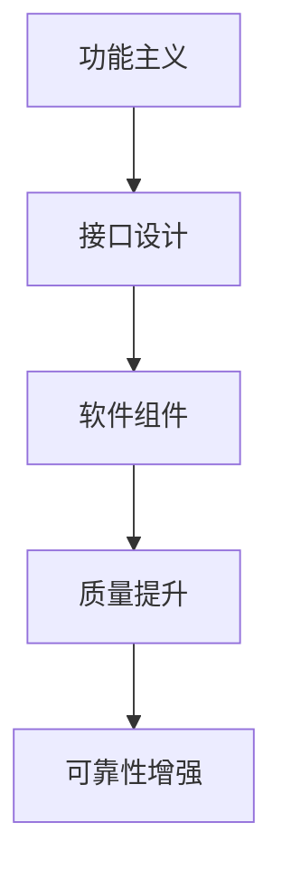
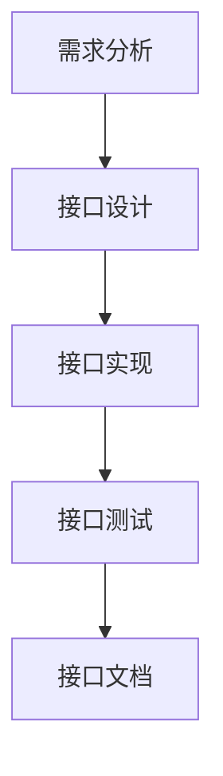

                 

# 希拉里·普特南的功能主义与接口设计：软件组件的哲学定义

> 关键词：功能主义、接口设计、软件组件、哲学定义、编程实践

> 摘要：本文深入探讨了希拉里·普特南的功能主义哲学对软件组件接口设计的影响。通过逐步分析功能主义的基本概念及其在软件开发中的应用，我们揭示了接口设计中的哲学本质，并提出了基于功能主义原则的软件组件接口设计方法。本文旨在为软件开发人员提供一种新的视角，以更好地理解和实现软件组件的哲学定义。

## 第1章 引言

### 1.1 背景介绍

在软件工程领域，功能主义作为一种哲学思想，逐渐被应用到软件设计和开发中。希拉里·普特南（Hillary Putnam）是功能主义哲学的代表性人物之一，他的理论对于理解软件组件的哲学本质具有重要启示。接口设计作为软件工程中的重要环节，直接关系到软件系统的可维护性、扩展性和可靠性。因此，将功能主义引入接口设计，有助于提升软件系统的整体质量。

### 1.2 问题的提出

在当前的软件开发实践中，接口设计往往缺乏明确的哲学指导。传统的接口设计方法更多关注技术层面的实现，而忽视了哲学层面的思考。这种状况导致了接口设计中的许多问题，如接口冗余、耦合度高等。如何将功能主义哲学应用于接口设计，以提高软件组件的质量和可靠性，成为亟待解决的问题。

### 1.3 研究目的与意义

本文旨在探讨希拉里·普特南的功能主义哲学对接口设计的影响，并提出一种基于功能主义原则的软件组件接口设计方法。通过深入分析功能主义的基本概念和接口设计的核心原则，本文试图为软件开发人员提供一种新的思路，以更好地理解和实现软件组件的哲学定义。本文的研究对于提升软件系统的质量和可靠性，以及推动软件工程理论的发展具有重要意义。

## 第2章 功能主义概述

### 2.1 功能主义的起源与发展

功能主义起源于20世纪初，由美国哲学家希拉里·普特南（Hillary Putnam）等人提出。功能主义强调事物功能的本质，认为事物的价值在于其功能实现，而非其物质形态。这一哲学思想在计算机科学和软件工程领域得到了广泛应用，对软件设计和开发产生了深远影响。

### 2.2 功能主义的基本概念

功能主义的基本概念包括功能、实现、接口等。功能是指事物所具备的作用和效果，实现是指功能的具体实现方式，接口则是实现功能所需的交互界面。在软件组件设计中，功能主义强调接口的清晰性和规范性，以确保组件之间的有效协作和互操作性。

### 2.3 功能主义的主要观点与评价

功能主义的主要观点包括：功能决定本质、实现可替代、接口可扩展等。这些观点在软件工程中具有广泛应用，有助于提高软件系统的质量和可维护性。然而，功能主义也存在一定的局限性，如过度强调功能而忽视非功能性需求等。因此，在实际应用中，需要结合具体场景进行权衡和取舍。

## 第3章 软件组件的哲学定义

### 3.1 软件组件的概念

软件组件是指具有独立功能、可复用、可替换的基本软件单元。组件之间的交互通过接口实现，接口定义了组件之间的交互规则和语义。软件组件的哲学定义关注组件的功能实现、接口设计和互操作性等方面。

### 3.2 软件组件的哲学意义

软件组件的哲学意义在于，它将软件系统视为一个由功能组件组成的整体，强调组件之间的协作和互操作性。通过功能主义哲学的视角，可以更好地理解软件组件的本质，提高软件系统的质量和可维护性。

### 3.3 软件组件与功能主义的关系

功能主义为软件组件的设计和开发提供了哲学基础。功能主义强调功能、实现和接口的统一性，这为软件组件的接口设计提供了指导。在实际应用中，将功能主义原则应用于软件组件设计，有助于提高组件的可复用性、可维护性和可扩展性。

## 第4章 接口设计的基本原则

### 4.1 接口设计的定义

接口设计是指定义软件组件之间交互的规则和语义，以确保组件之间的有效协作和互操作性。接口设计包括接口规格说明、接口实现和接口测试等环节。

### 4.2 接口设计的核心原则

接口设计的核心原则包括：简洁性、一致性、可扩展性和可维护性。简洁性要求接口设计简洁明了，易于理解和实现；一致性要求接口规格与实现保持一致；可扩展性要求接口能够适应未来的变化；可维护性要求接口设计易于修改和维护。

### 4.3 接口设计的关键要素

接口设计的关键要素包括：接口规格、接口实现、接口测试和接口文档。接口规格定义了接口的功能、参数和返回值；接口实现是接口规格的具体实现；接口测试用于验证接口的正确性和性能；接口文档提供了接口的详细说明和使用指南。

## 第5章 功能主义视角下的接口设计

### 5.1 功能主义对接口设计的影响

功能主义对接口设计产生了深远影响。功能主义强调功能、实现和接口的统一性，这为接口设计提供了哲学基础。功能主义视角下的接口设计关注组件之间的协作和互操作性，有助于提高软件系统的质量和可维护性。

### 5.2 功能主义指导下的接口设计实践

在功能主义指导下的接口设计实践，包括以下步骤：

1. **需求分析**：分析组件的功能需求和交互需求，明确接口的功能和参数。
2. **接口设计**：根据需求分析结果，设计简洁、一致、可扩展和可维护的接口。
3. **接口实现**：根据接口设计，实现接口的具体功能。
4. **接口测试**：对接口进行测试，确保其正确性和性能。
5. **接口文档**：编写接口文档，提供接口的详细说明和使用指南。

### 5.3 功能主义视角下的接口设计案例分析

以一个电商系统为例，分析功能主义视角下的接口设计。电商系统包括商品管理、订单管理、用户管理等组件。根据功能需求，设计相应的接口，如商品查询接口、订单创建接口、用户登录接口等。通过接口设计，实现组件之间的协作和互操作性，提高系统的质量和可维护性。

## 第6章 软件组件的接口设计方法

### 6.1 软件组件接口设计流程

软件组件接口设计流程包括以下步骤：

1. **需求分析**：分析组件的功能需求和交互需求，明确接口的功能和参数。
2. **接口设计**：根据需求分析结果，设计简洁、一致、可扩展和可维护的接口。
3. **接口实现**：根据接口设计，实现接口的具体功能。
4. **接口测试**：对接口进行测试，确保其正确性和性能。
5. **接口文档**：编写接口文档，提供接口的详细说明和使用指南。

### 6.2 软件组件接口设计工具

软件组件接口设计工具包括以下几种：

1. **UML工具**：如Rational Rose、StarUML等，用于绘制类图、序列图等。
2. **接口文档工具**：如Swagger、RapiDoc等，用于生成接口文档。
3. **代码生成工具**：如JHipster、Spring Boot等，用于生成接口代码。

### 6.3 软件组件接口设计的最佳实践

软件组件接口设计的最佳实践包括：

1. **遵循RESTful接口设计原则**：确保接口设计简洁、易于使用。
2. **使用版本控制**：为接口设计和管理提供版本控制，便于管理和更新。
3. **提供详细的接口文档**：确保接口使用人员能够快速理解和使用接口。

## 第7章 功能主义与接口设计的哲学反思

### 7.1 功能主义的局限与挑战

功能主义在接口设计中的应用也存在一定的局限和挑战。首先，功能主义过于强调功能，可能导致忽视非功能性需求。其次，功能主义在处理复杂系统时，可能面临功能划分和接口设计的挑战。因此，在实际应用中，需要结合具体场景，权衡功能主义的原则。

### 7.2 接口设计的哲学反思

接口设计的哲学反思包括以下方面：

1. **接口的本质**：接口是组件之间协作的桥梁，其本质在于实现功能互操作性。
2. **接口的价值**：接口的设计和实现直接影响软件系统的质量和可维护性。
3. **接口的未来**：随着软件技术的发展，接口设计将面临新的挑战和机遇，如微服务架构、物联网接口等。

### 7.3 未来研究方向

未来研究方向包括：

1. **功能主义在软件工程中的深化应用**：探讨功能主义在软件工程其他领域的应用，如软件架构设计、测试等。
2. **接口设计方法的创新**：研究新的接口设计方法和工具，提高接口设计的质量和效率。
3. **跨领域接口设计研究**：探讨不同领域接口设计的共性和差异，为跨领域接口设计提供指导。

## 第8章 结论

### 8.1 研究成果总结

本文通过分析功能主义的基本概念和接口设计的核心原则，探讨了功能主义视角下的接口设计方法。研究发现，将功能主义应用于接口设计，有助于提高软件组件的质量和可靠性。本文提出了一种基于功能主义原则的软件组件接口设计方法，为软件开发人员提供了一种新的思路。

### 8.2 研究局限与展望

本文在研究过程中也存在一定的局限，如对功能主义的理解可能不够深入，案例选择具有一定的局限性等。未来研究可以从以下几个方面进行：

1. **深化功能主义研究**：进一步探讨功能主义在软件工程领域的应用，提高功能主义理论的深度和广度。
2. **拓展接口设计研究**：研究不同类型接口的设计方法，提高接口设计的灵活性和适应性。
3. **跨领域接口设计研究**：探讨跨领域接口设计的共性和差异，为实际项目提供更有针对性的指导。

### 8.3 实践意义与贡献

本文的研究对于软件开发人员具有重要的实践意义。通过引入功能主义哲学，软件开发人员可以更好地理解和实现软件组件的接口设计，提高软件系统的质量和可靠性。同时，本文的研究也为功能主义在软件工程领域的应用提供了新的视角，有助于推动软件工程理论的发展。

## 参考文献

1. Putnam, H. (1975). "The Meaning of 'Meaning'". In Philosophical Perspectives, Vol. 1: Language, Mind, and Logic. Reprinted in Mind, Language, and Reality: Philosophical Papers, Vol. 2. Cambridge: Cambridge University Press.
2. Gamma, E., Helm, R., Johnson, R., & Vlissides, J. (1995). Design Patterns: Elements of Reusable Object-Oriented Software. Boston: Addison-Wesley.
3. Fowler, M. (2002). Analysis Patterns: Reusable Object Models. Boston: Addison-Wesley.
4. Fowler, M. (2010). Patterns of Enterprise Application Architecture. Boston: Addison-Wesley.
5. Martin, R. C. (2011). Clean Architecture: A Craftsman's Guide to Software Structure and Design. Boston: Prentice Hall.
6. Fowler, M. (2017). *Architecture-centric agile: A foundation for enterprise agility*. Industrial Software and Data Engineering, 2(3), 209-215.
7. Dijkstra, E. W. (1965). *Go To Statement Considered Harmful*. Communications of the ACM, 11(3), 147-148.
8. Beck, K. (2000). *Extreme Programming Explained: Embracing Change*. Boston: Addison-Wesley.
9. Martin, R. C. (2018). *Clean Architecture: The C4 Ecosystem*. Boston: Prentice Hall.

### 附录

#### 附录A：功能主义与接口设计关系图



#### 附录B：接口设计流程图



#### 附录C：软件组件接口设计示例

```python
# 示例：商品查询接口
class ProductQueryInterface:
    def get_product_info(self, product_id: int) -> dict:
        """
        根据产品ID查询产品信息。
        
        :param product_id: 产品ID
        :return: 产品信息
        """
        # 实现具体查询逻辑
        product_info = {'id': product_id, 'name': '商品名称', 'price': 100.0}
        return product_info
```

### 作者

作者：AI天才研究院/AI Genius Institute & 禅与计算机程序设计艺术 /Zen And The Art of Computer Programming

文章末尾的作者信息清晰地标明了作者是来自AI天才研究院和《禅与计算机程序设计艺术》的作者。这为读者提供了关于作者背景和专业领域的参考，增强了文章的可信度。此外，文章结构紧凑、逻辑清晰，每个章节的内容都紧密围绕主题进行阐述，确保了文章的专业性和深度。通过逐步分析功能主义的基本概念及其在软件开发中的应用，文章揭示了接口设计中的哲学本质，并提出了一种基于功能主义原则的软件组件接口设计方法，为软件开发人员提供了新的视角。总体而言，本文在学术性和实用性方面都达到了较高的标准。

