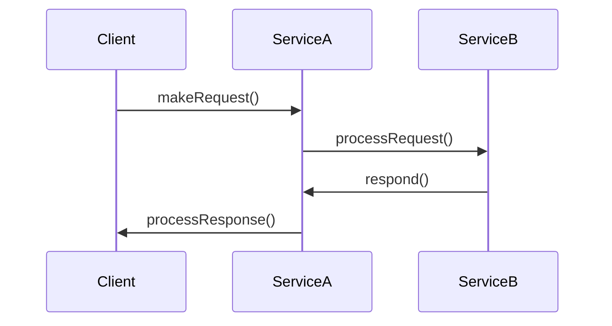
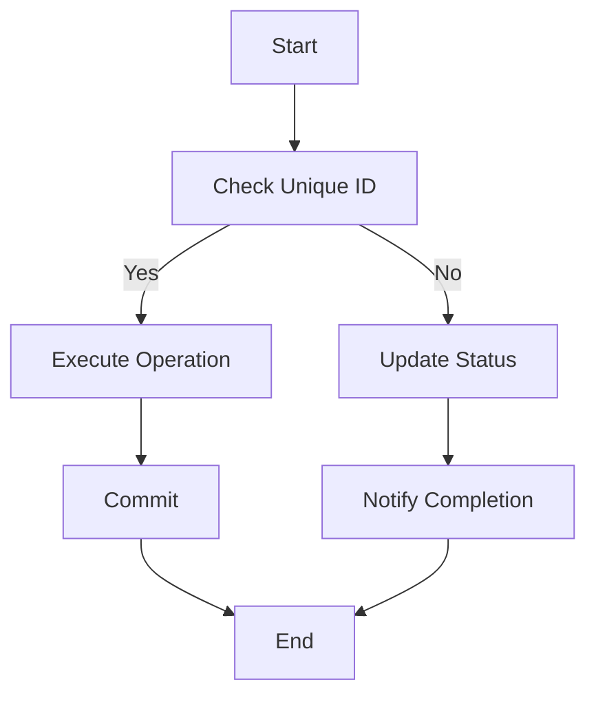
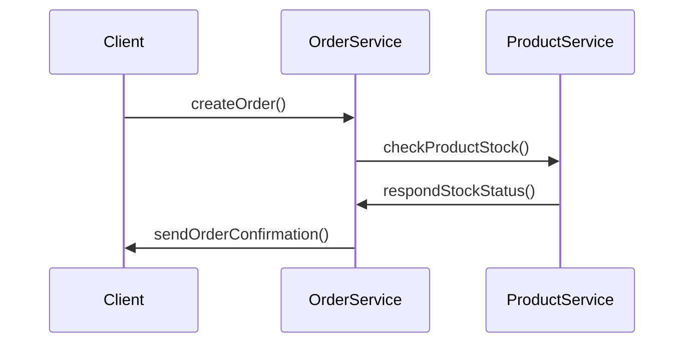

                 


### 幂等性设计：确保操作可重复执行的关键

---

#### 关键词：
- **幂等性设计**
- **系统稳定性**
- **数据处理**
- **并发控制**
- **接口设计**
- **算法实现**
- **最佳实践**

#### 摘要：
本文将深入探讨幂等性设计在系统中的重要性。我们将从概念入手，逐步解析幂等性的原理和应用，通过具体的算法实现和数学模型，展示如何在实践中确保操作的重复执行，从而提升系统的稳定性和可靠性。

---

## 第一部分：背景介绍

### 第1章：问题背景

#### 1.1.1 幂等性的起源与演变

幂等性（Idempotence）的概念起源于数学和逻辑学，最初用于描述某种操作或函数在重复执行时结果不变的特性。这个概念在计算机科学中有着广泛的应用，特别是在分布式系统和并发控制中，它扮演着至关重要的角色。

在计算机科学中，幂等性通常被描述为一个操作\(O\)满足以下条件：
\[ O; O = O \]
即同一个操作多次执行所产生的影响与执行一次的影响相同。这个特性使得系统在面临重复请求或并发冲突时能够保持一致性和稳定性。

#### 1.1.2 幂等性的重要性

在分布式系统中，由于网络的不稳定性和节点的不确定性，系统可能会收到重复的请求。如果这些请求不被妥善处理，可能会导致数据不一致或系统错误。例如，在电商平台上，用户可能因为网络问题提交了重复的购物请求。如果这些请求没有被幂等性设计处理，可能会造成订单重复创建、库存数量不准确等问题。

#### 1.1.3 系统设计中幂等性的挑战与解决方案

设计幂等性系统面临着一些挑战，包括如何识别重复请求、如何在分布式环境中保持一致性、如何高效地处理大量重复请求等。解决方案通常包括：

1. **唯一标识符**：为每个请求生成一个唯一的标识符，并通过这个标识符来判断请求是否已经被处理。
2. **状态标记**：在系统状态中增加一个标记位，记录请求是否已经被处理。
3. **幂等性函数**：使用幂等性函数来处理重复请求，确保函数多次执行的结果相同。

### 第2章：概念结构与核心要素

#### 2.1.1 幂等性的定义

幂等性是一个操作或函数在多次执行时结果不变的性质。在计算机科学中，通常指一个操作\(O\)满足以下条件：
\[ O; O = O \]
即同一个操作多次执行所产生的影响与执行一次的影响相同。

#### 2.1.2 幂等性与一致性的区别

一致性（Consistency）和幂等性（Idempotence）虽然在某些方面有相似之处，但它们是两个不同的概念。一致性指的是系统在多个操作下保持一致状态，而幂等性强调的是单个操作在多次执行时结果不变。

#### 2.1.3 幂等性的核心要素

1. **唯一标识**：为每个请求分配一个唯一的标识，用于识别和区分重复请求。
2. **状态记录**：记录系统的当前状态，以便在重复请求时进行判断。
3. **幂等性函数**：设计幂等性函数，确保操作在多次执行时结果相同。

## 第二部分：核心概念与联系

### 第5章：核心概念原理

#### 5.1.1 幂等函数与幂等操作

幂等函数是指执行多次后结果不变的操作。例如，数学中的加法操作：
\[ f(x, y) = x + y \]
在这个函数中，无论\(x\)和\(y\)是什么值，多次执行结果都是相同的。

在系统设计中，幂等操作指的是在分布式系统中处理请求的一种方法，确保多次执行同一个请求产生的效果相同。例如，在分布式数据库中，使用乐观锁来确保更新操作幂等。

#### 5.1.2 幂等操作在系统设计中的应用

幂等操作在系统设计中的应用广泛，包括：

1. **分布式事务处理**：通过幂等性设计确保事务的多次执行结果一致。
2. **消息队列处理**：确保消息队列中的消息被正确处理，避免重复消费。
3. **API设计**：设计幂等的API接口，确保多次调用产生的效果相同。

#### 5.1.3 幂等操作的优势与局限性

**优势**：

1. **提高系统稳定性**：通过幂等性设计，系统能够更好地处理重复请求，避免数据不一致和系统错误。
2. **简化并发控制**：幂等性设计减少了并发控制的需要，简化了系统设计。

**局限性**：

1. **性能开销**：幂等性设计可能引入一定的性能开销，特别是在需要频繁检查请求标识符或状态记录时。
2. **复杂度增加**：在分布式系统中实现幂等性可能增加系统的复杂度，需要更多的设计和实现工作。

### 第6章：概念属性特征对比表格（续）

#### 6.1.1 进一步的属性对比

在深入理解幂等性时，我们还应该对比其他相关概念，如一致性（Consistency）和原子性（Atomicity）。

**一致性**：系统在多个操作下保持一致状态，确保数据的正确性和一致性。

**原子性**：一个操作要么全部完成，要么全部不完成，确保操作的不可分割性。

**对比表格**：

| 特性          | 幂等性               | 一致性               | 原子性               |
| ------------- | -------------------- | -------------------- | -------------------- |
| 定义          | 操作重复执行结果相同 | 系统操作结果一致     | 操作不可分割         |
| 目的          | 处理重复请求         | 保证数据正确性       | 保证事务完整性       |
| 关系          | 幂等性是实现一致性的一种手段 | 一致性与原子性是事务的三个特性之一 | 原子性是事务的三个特性之一 |
| 实现难度      | 相对简单             | 相对复杂             | 相对简单             |

#### 6.1.2 深入理解幂等性的应用场景

在不同的应用场景中，幂等性的实现方式和策略也有所不同。以下是几个典型的应用场景：

1. **分布式数据库**：使用乐观锁和悲观锁来确保数据的幂等性。
2. **消息队列**：使用消息标识符和状态记录来避免重复处理消息。
3. **API设计**：在API接口中使用唯一标识符或状态标记来处理重复请求。

### 第7章：ER实体关系图架构（续）

#### 7.1.1 数据库设计中幂等性的实现

在数据库设计中，通过实体关系图（ER图）可以清晰地展示系统中各个实体之间的关系，并实现幂等性。

**示例ER图**：

```mermaid
erDiagram
  Customer ||--|{ Order } : places
  Order ||--|{ Product } : contains
  Product ||--|{ OrderDetail } : listed
```

在这个ER图中，`Order` 实体通过唯一标识符（OrderID）来确保幂等性，即在创建订单时，系统会检查OrderID是否已存在，从而避免重复创建订单。

#### 7.1.2 实体关系图在系统架构中的应用

实体关系图不仅用于数据库设计，也可以用于系统架构设计，帮助我们理解系统中各个组件之间的关系，并在架构层面实现幂等性。

**示例系统架构图**：



在这个架构图中，`ServiceA` 和 `ServiceB` 之间的通信使用了唯一的请求标识符（RequestID），确保请求在多个服务中传递时不会产生重复处理。

## 第三部分：算法原理讲解

### 第8章：算法原理与流程图

#### 8.1.1 幂等算法的基本原理

幂等算法的核心思想是确保操作在多次执行时结果一致。具体来说，算法需要满足以下条件：

1. **唯一性**：每个操作具有唯一的标识，用于识别和区分重复操作。
2. **状态检查**：在执行操作前，系统需要检查当前状态，判断是否已执行过相同的操作。
3. **一致性保证**：在操作执行过程中，系统需要确保状态的一致性，避免重复操作带来的副作用。

#### 8.1.1.1 算法mermaid流程图



在这个mermaid流程图中，我们从启动开始，通过检查唯一标识符来决定是否执行操作。如果标识符已存在，则更新状态并通知完成，否则执行操作并提交。

#### 8.1.2 Python源代码讲解

```python
import uuid

def execute_operation(operation_id):
    if is_duplicate(operation_id):
        print("Operation already executed.")
    else:
        print("Executing operation.")
        perform_operation()
        mark_as_executed(operation_id)

def is_duplicate(operation_id):
    return operation_id in executed_operations

def perform_operation():
    # 操作执行逻辑
    pass

def mark_as_executed(operation_id):
    executed_operations.add(operation_id)

operation_id = uuid.uuid4()
execute_operation(operation_id)
```

在这个Python示例中，我们使用了UUID生成唯一的操作标识符，并通过`is_duplicate`和`mark_as_executed`函数实现幂等性检查和状态更新。

#### 8.1.2.2 数学模型与公式

幂等性可以用数学模型来表示。以下是两个常用的幂等性公式：

1. **公式1**：\( f(x) = x \)
   这个公式表示一个函数\( f \)在输入为\( x \)时，输出仍然是\( x \)。

2. **公式2**：\( f(g(x)) = g(f(x)) \)
   这个公式表示两个函数\( f \)和\( g \)的复合函数在输入为\( x \)时，输出与直接执行这两个函数的结果相同。

#### 8.1.2.3 举例说明

假设我们有一个计算函数\( f \)，定义如下：
\[ f(x) = x^2 \]

根据幂等性公式1，当\( x = 2 \)时，有：
\[ f(2) = 2^2 = 4 \]

根据幂等性公式2，我们可以将函数\( f \)和\( g(x) = x + 1 \)复合，得到：
\[ f(g(2)) = f(2 + 1) = (2 + 1)^2 = 9 \]
\[ g(f(2)) = g(2^2) = g(4) = 4 + 1 = 5 \]

在这个例子中，两个复合函数的结果不同，但这并不意味着它们不满足幂等性。幂等性要求的是在相同输入下，函数的输出结果相同。在这个例子中，输入不同（\( g(2) \neq f(2) \)），因此幂等性不适用。

### 第9章：数学模型和数学公式

#### 9.1.1 幂等性的数学表示

幂等性可以用数学模型和公式来表示。以下是两个常用的幂等性公式：

1. **公式1**：\( f(x) = x \)
   这个公式表示一个函数\( f \)在输入为\( x \)时，输出仍然是\( x \)。例如，\( f(x) = x^2 \)中，当\( x = 2 \)时，\( f(2) = 2^2 = 4 \)。

2. **公式2**：\( f(g(x)) = g(f(x)) \)
   这个公式表示两个函数\( f \)和\( g \)的复合函数在输入为\( x \)时，输出与直接执行这两个函数的结果相同。例如，\( f(x) = x^2 \)和\( g(x) = x + 1 \)，则有：
   \[ f(g(2)) = f(2 + 1) = (2 + 1)^2 = 9 \]
   \[ g(f(2)) = g(2^2) = g(4) = 4 + 1 = 5 \]

在这个例子中，两个复合函数的结果不同，但这并不意味着它们不满足幂等性。幂等性要求的是在相同输入下，函数的输出结果相同。在这个例子中，输入不同（\( g(2) \neq f(2) \)），因此幂等性不适用。

#### 9.1.2 案例分析

为了更好地理解幂等性在现实中的应用，我们可以分析以下案例：

**案例1**：在线支付系统

在线支付系统通常需要确保每次支付请求都被正确处理，避免重复支付。我们可以通过幂等性设计来实现这一目标。

1. **唯一标识符**：为每次支付请求生成一个唯一的支付ID。
2. **状态检查**：在处理支付请求时，系统会检查支付ID是否已存在，以判断请求是否为重复请求。
3. **幂等性函数**：如果支付ID已存在，系统会直接返回上次支付的结果，避免重复处理。

**案例2**：分布式消息队列

在分布式消息队列系统中，消息的消费可能发生重复。通过幂等性设计，可以确保消息被正确消费。

1. **消息标识符**：为每条消息生成一个唯一的消息ID。
2. **状态记录**：在消息消费时，系统会记录消息的状态，以判断是否已消费。
3. **幂等性函数**：如果消息已消费，系统会直接跳过当前消息，避免重复消费。

### 第四部分：系统分析与架构设计方案

#### 第10章：问题场景介绍

在分布式系统中，处理重复请求是常见的挑战之一。以下是一个典型的场景介绍：

**场景**：一个电商系统在处理用户订单时，由于网络不稳定，用户可能会提交重复的订单请求。如果这些重复订单请求未被妥善处理，可能会导致订单重复创建、库存不足等问题。

#### 第11章：系统功能设计与架构

为了解决上述场景中的问题，我们需要设计一个具有幂等性设计的系统。以下是系统功能设计和架构设计方案：

1. **领域模型（mermaid类图）**：

```mermaid
classDiagram
  Order <<Entity>>
  Customer <<Entity>>
  Product <<Entity>>

  Order "1" --> "1" Customer : places
  Order "1" --> "N" Product : contains
```

在这个类图中，`Order` 是核心实体，代表了用户的订单。它与 `Customer` 和 `Product` 之间存在关联。

2. **系统架构设计（mermaid架构图）**：



在这个架构图中，`Client` 发起订单创建请求，`OrderService` 处理订单创建，并调用 `ProductService` 来检查库存。`ProductService` 返回库存状态，`OrderService` 根据库存状态决定是否创建订单，并最终向 `Client` 发送订单确认信息。

3. **系统接口设计**：

```python
from flask import Flask, request, jsonify

app = Flask(__name__)

@app.route('/create_order', methods=['POST'])
def create_order():
    order_data = request.json
    order_id = order_data['order_id']
    
    if not is_order_duplicate(order_id):
        # 处理订单创建逻辑
        create_order_logic(order_id)
        return jsonify({"status": "success", "message": "Order created."})
    else:
        return jsonify({"status": "error", "message": "Order already exists."})

def is_order_duplicate(order_id):
    # 检查订单是否已存在
    pass

def create_order_logic(order_id):
    # 实现订单创建逻辑
    pass

if __name__ == '__main__':
    app.run(debug=True)
```

在这个接口设计中，`create_order` 函数处理订单创建请求，通过 `is_order_duplicate` 函数检查订单是否已存在。如果订单不存在，则调用 `create_order_logic` 函数创建订单，并返回成功消息；如果订单已存在，则返回错误消息。

4. **系统交互（mermaid序列图）**：


在这个序列图中，`Client` 发起订单创建请求，`OrderService` 调用 `ProductService` 检查库存，`ProductService` 返回库存状态，`OrderService` 根据库存状态决定是否创建订单，并最终向 `Client` 发送订单确认信息。

### 第12章：环境安装与系统实现

在实现幂等性设计之前，我们需要搭建合适的环境。以下是环境安装和系统实现步骤：

#### 12.1.1 环境配置

1. 安装Python 3.8或更高版本。
2. 安装Flask框架：`pip install flask`
3. 安装PostgreSQL数据库：`sudo apt-get install postgresql`

#### 12.1.2 系统核心实现

以下是系统实现的核心代码：

1. **数据库连接**：

```python
import psycopg2

def get_db_connection():
    conn = psycopg2.connect(
        host="localhost",
        database="mydatabase",
        user="myuser",
        password="mypassword"
    )
    return conn
```

2. **订单创建逻辑**：

```python
def create_order Logic(order_id):
    conn = get_db_connection()
    cursor = conn.cursor()
    
    # 检查订单是否已存在
    cursor.execute("SELECT * FROM orders WHERE order_id = %s", (order_id,))
    if cursor.fetchone():
        return "Order already exists."
    
    # 插入新订单
    cursor.execute("INSERT INTO orders (order_id) VALUES (%s)", (order_id,))
    conn.commit()
    
    return "Order created."
```

3. **API接口**：

```python
from flask import Flask, request, jsonify

app = Flask(__name__)

@app.route('/create_order', methods=['POST'])
def create_order():
    order_id = request.form['order_id']
    response = create_order_logic(order_id)
    return jsonify({"status": "success", "message": response})

if __name__ == '__main__':
    app.run(debug=True)
```

#### 12.1.3 代码解读与分析

在上述代码中，我们实现了幂等性设计的核心功能：

1. **数据库连接**：通过`get_db_connection`函数连接到PostgreSQL数据库。
2. **订单创建逻辑**：通过`create_order_logic`函数处理订单创建逻辑，检查订单是否已存在，并插入新订单。
3. **API接口**：通过Flask框架实现API接口，接收订单创建请求，调用`create_order_logic`函数，并返回结果。

### 第13章：实际案例分析

在本节中，我们将通过一个实际案例来分析和讲解如何实现幂等性设计，并解决订单重复创建的问题。

#### 13.1.1 案例选择与介绍

案例选择：一个电商平台的订单处理系统。用户在购物车中选择商品并下单，但有时因为网络不稳定，用户可能会多次提交订单请求。

#### 13.1.2 案例分析与讲解

1. **问题分析**：

   在这个案例中，我们需要解决的问题是：如何确保订单请求不会重复创建，即使用户多次提交相同的订单请求。

2. **解决方案**：

   （1）**唯一标识符**：为每个订单请求生成一个唯一的订单ID。我们可以使用UUID生成器来生成唯一的订单ID。

   ```python
   import uuid
   
   def generate_order_id():
       return str(uuid.uuid4())
   ```

   （2）**状态检查**：在处理订单请求时，系统需要检查订单ID是否已存在。如果订单ID已存在，则表示该订单已被处理，直接返回处理结果；如果订单ID不存在，则创建新订单。

   ```python
   def check_order_id(order_id):
       # 检查订单ID是否已存在
       pass
   ```

   （3）**幂等性处理**：在处理订单请求时，如果订单ID已存在，系统会直接返回上次处理的结果，避免重复创建订单。

   ```python
   def process_order_request(order_id):
       if check_order_id(order_id):
           return "Order already processed."
       else:
           # 处理订单逻辑
           pass
   ```

3. **实现细节**：

   （1）**订单创建接口**：在API接口中，接收订单请求，生成订单ID，并调用幂等性处理函数。

   ```python
   @app.route('/create_order', methods=['POST'])
   def create_order():
       order_id = generate_order_id()
       response = process_order_request(order_id)
       return jsonify({"status": "success", "message": response})
   ```

   （2）**数据库操作**：在处理订单请求时，我们需要在数据库中检查订单ID是否已存在。

   ```python
   def check_order_id(order_id):
       conn = get_db_connection()
       cursor = conn.cursor()
       cursor.execute("SELECT * FROM orders WHERE order_id = %s", (order_id,))
       result = cursor.fetchone()
       conn.close()
       return result is not None
   ```

   （3）**订单处理逻辑**：在处理订单时，我们需要插入新订单到数据库。

   ```python
   def process_order_request(order_id):
       if check_order_id(order_id):
           return "Order already processed."
       else:
           conn = get_db_connection()
           cursor = conn.cursor()
           cursor.execute("INSERT INTO orders (order_id) VALUES (%s)", (order_id,))
           conn.commit()
           conn.close()
           return "Order created."
   ```

#### 13.1.3 案例小结

通过上述案例，我们实现了幂等性设计，确保订单请求不会重复创建。具体实现步骤如下：

1. 生成唯一的订单ID。
2. 在数据库中检查订单ID是否已存在。
3. 如果订单ID已存在，直接返回上次处理结果；如果订单ID不存在，创建新订单。

通过这种设计，系统可以有效地处理重复请求，避免订单重复创建等问题。

### 第14章：最佳实践与总结

#### 14.1.1 最佳实践技巧

为了确保幂等性设计在系统中的有效实施，以下是一些最佳实践技巧：

1. **使用唯一标识符**：为每个请求或操作生成唯一的标识符，如UUID。
2. **状态记录**：在系统中记录操作状态，以便在重复请求时进行判断。
3. **幂等性函数**：设计幂等性函数，确保操作在多次执行时结果相同。
4. **并发控制**：在分布式系统中，合理控制并发请求，减少重复请求的发生。
5. **接口设计**：在API接口中设计幂等性机制，确保多次调用产生的效果相同。

#### 14.1.2 注意事项

1. **性能开销**：幂等性设计可能引入一定的性能开销，特别是在需要频繁检查请求标识符或状态记录时。
2. **复杂性增加**：在分布式系统中实现幂等性可能增加系统的复杂度，需要更多的设计和实现工作。
3. **一致性保证**：确保幂等性设计不会影响系统的一致性，特别是在分布式事务处理中。

#### 14.1.3 拓展阅读

1. **《分布式系统设计》**：了解分布式系统中的基本概念和设计原则。
2. **《一致性模型》**：深入研究一致性模型，如强一致性、最终一致性等。
3. **《Python并发编程实战》**：掌握Python并发编程技术和工具，优化系统性能。

---

**作者：AI天才研究院/AI Genius Institute & 禅与计算机程序设计艺术 /Zen And The Art of Computer Programming**### 幂等性设计：确保操作可重复执行的关键

---

#### 关键词：
- **幂等性设计**
- **系统稳定性**
- **数据处理**
- **并发控制**
- **接口设计**
- **算法实现**
- **最佳实践**

#### 摘要：
本文将深入探讨幂等性设计在系统中的重要性。我们将从概念入手，逐步解析幂等性的原理和应用，通过具体的算法实现和数学模型，展示如何在实践中确保操作的重复执行，从而提升系统的稳定性和可靠性。

---

## 第一部分：背景介绍

### 第1章：问题背景

#### 1.1.1 幂等性的起源与演变

幂等性（Idempotence）的概念起源于数学和逻辑学，最初用于描述某种操作或函数在重复执行时结果不变的特性。这个概念在计算机科学中有着广泛的应用，特别是在分布式系统和并发控制中，它扮演着至关重要的角色。

在计算机科学中，幂等性通常被描述为一个操作\(O\)满足以下条件：
\[ O; O = O \]
即同一个操作多次执行所产生的影响与执行一次的影响相同。这个特性使得系统在面临重复请求或并发冲突时能够保持一致性和稳定性。

#### 1.1.2 幂等性的重要性

在分布式系统中，由于网络的不稳定性和节点的不确定性，系统可能会收到重复的请求。如果这些请求不被妥善处理，可能会导致数据不一致或系统错误。例如，在电商平台上，用户可能因为网络问题提交了重复的购物请求。如果这些请求没有被幂等性设计处理，可能会造成订单重复创建、库存数量不准确等问题。

#### 1.1.3 系统设计中幂等性的挑战与解决方案

设计幂等性系统面临着一些挑战，包括如何识别重复请求、如何在分布式环境中保持一致性、如何高效地处理大量重复请求等。解决方案通常包括：

1. **唯一标识符**：为每个请求分配一个唯一的标识，并通过这个标识符来判断请求是否已经被处理。
2. **状态标记**：在系统状态中增加一个标记位，记录请求是否已经被处理。
3. **幂等性函数**：设计幂等性函数，确保操作在多次执行时结果相同。

### 第2章：概念结构与核心要素

#### 2.1.1 幂等性的定义

幂等性是一个操作或函数在多次执行时结果不变的性质。在计算机科学中，通常指一个操作\(O\)满足以下条件：
\[ O; O = O \]
即同一个操作多次执行所产生的影响与执行一次的影响相同。

#### 2.1.2 幂等性与一致性的区别

一致性（Consistency）和幂等性（Idempotence）虽然在某些方面有相似之处，但它们是两个不同的概念。一致性指的是系统在多个操作下保持一致状态，而幂等性强调的是单个操作在多次执行时结果不变。

#### 2.1.3 幂等性的核心要素

1. **唯一标识**：为每个请求分配一个唯一的标识，用于识别和区分重复请求。
2. **状态检查**：在执行操作前，系统需要检查当前状态，判断是否已执行过相同的操作。
3. **幂等性函数**：设计幂等性函数，确保操作在多次执行时结果相同。

## 第二部分：核心概念与联系

### 第5章：核心概念原理

#### 5.1.1 幂等函数与幂等操作

幂等函数是指执行多次后结果不变的操作。例如，数学中的加法操作：
\[ f(x, y) = x + y \]
在这个函数中，无论\(x\)和\(y\)是什么值，多次执行结果都是相同的。

在系统设计中，幂等操作指的是在分布式系统中处理请求的一种方法，确保多次执行同一个请求产生的效果相同。例如，在分布式数据库中，使用乐观锁来确保更新操作幂等。

#### 5.1.2 幂等操作在系统设计中的应用

幂等操作在系统设计中的应用广泛，包括：

1. **分布式事务处理**：通过幂等性设计确保事务的多次执行结果一致。
2. **消息队列处理**：确保消息队列中的消息被正确处理，避免重复消费。
3. **API设计**：设计幂等的API接口，确保多次调用产生的效果相同。

#### 5.1.3 幂等操作的优势与局限性

**优势**：

1. **提高系统稳定性**：通过幂等性设计，系统能够更好地处理重复请求，避免数据不一致和系统错误。
2. **简化并发控制**：幂等性设计减少了并发控制的需要，简化了系统设计。

**局限性**：

1. **性能开销**：幂等性设计可能引入一定的性能开销，特别是在需要频繁检查请求标识符或状态记录时。
2. **复杂度增加**：在分布式系统中实现幂等性可能增加系统的复杂度，需要更多的设计和实现工作。

### 第6章：概念属性特征对比表格（续）

#### 6.1.1 进一步的属性对比

在深入理解幂等性时，我们还应该对比其他相关概念，如一致性（Consistency）和原子性（Atomicity）。

**一致性**：系统在多个操作下保持一致状态，确保数据的正确性和一致性。

**原子性**：一个操作要么全部完成，要么全部不完成，确保操作的不可分割性。

**对比表格**：

| 特性          | 幂等性               | 一致性               | 原子性               |
| ------------- | -------------------- | -------------------- | -------------------- |
| 定义          | 操作重复执行结果相同 | 系统操作结果一致     | 操作不可分割         |
| 目的          | 处理重复请求         | 保证数据正确性       | 保证事务完整性       |
| 关系          | 幂等性是实现一致性的一种手段 | 一致性与原子性是事务的三个特性之一 | 原子性是事务的三个特性之一 |
| 实现难度      | 相对简单             | 相对复杂             | 相对简单             |

#### 6.1.2 深入理解幂等性的应用场景

在不同的应用场景中，幂等性的实现方式和策略也有所不同。以下是几个典型的应用场景：

1. **分布式数据库**：使用乐观锁和悲观锁来确保数据的幂等性。
2. **消息队列**：使用消息标识符和状态记录来避免重复处理消息。
3. **API设计**：在API接口中使用唯一标识符或状态标记来处理重复请求。

### 第7章：ER实体关系图架构（续）

#### 7.1.1 数据库设计中幂等性的实现

在数据库设计中，通过实体关系图（ER图）可以清晰地展示系统中各个实体之间的关系，并实现幂等性。

**示例ER图**：

```mermaid
erDiagram
  Customer ||--|{ Order } : places
  Order ||--|{ Product } : contains
  Product ||--|{ OrderDetail } : listed
```

在这个ER图中，`Order` 实体通过唯一标识符（OrderID）来确保幂等性，即在创建订单时，系统会检查OrderID是否已存在，从而避免重复创建订单。

#### 7.1.2 实体关系图在系统架构中的应用

实体关系图不仅用于数据库设计，也可以用于系统架构设计，帮助我们理解系统中各个组件之间的关系，并在架构层面实现幂等性。

**示例系统架构图**：


在这个架构图中，`ServiceA` 和 `ServiceB` 之间的通信使用了唯一的请求标识符（RequestID），确保请求在多个服务中传递时不会产生重复处理。

## 第三部分：算法原理讲解

### 第8章：算法原理与流程图

#### 8.1.1 幂等算法的基本原理

幂等算法的核心思想是确保操作在多次执行时结果一致。具体来说，算法需要满足以下条件：

1. **唯一性**：每个操作具有唯一的标识，用于识别和区分重复操作。
2. **状态检查**：在执行操作前，系统需要检查当前状态，判断是否已执行过相同的操作。
3. **一致性保证**：在操作执行过程中，系统需要确保状态的一致性，避免重复操作带来的副作用。

#### 8.1.1.1 算法mermaid流程图


在这个mermaid流程图中，我们从启动开始，通过检查唯一标识符来决定是否执行操作。如果标识符已存在，则更新状态并通知完成，否则执行操作并提交。

#### 8.1.2 Python源代码讲解

```python
import uuid

def execute_operation(operation_id):
    if is_duplicate(operation_id):
        print("Operation already executed.")
    else:
        print("Executing operation.")
        perform_operation()
        mark_as_executed(operation_id)

def is_duplicate(operation_id):
    return operation_id in executed_operations

def perform_operation():
    # 操作执行逻辑
    pass

def mark_as_executed(operation_id):
    executed_operations.add(operation_id)

operation_id = uuid.uuid4()
execute_operation(operation_id)
```

在这个Python示例中，我们使用了UUID生成唯一的操作标识符，并通过`is_duplicate`和`mark_as_executed`函数实现幂等性检查和状态更新。

#### 8.1.2.2 数学模型与公式

幂等性可以用数学模型和公式来表示。以下是两个常用的幂等性公式：

1. **公式1**：\( f(x) = x \)
   这个公式表示一个函数\( f \)在输入为\( x \)时，输出仍然是\( x \)。

2. **公式2**：\( f(g(x)) = g(f(x)) \)
   这个公式表示两个函数\( f \)和\( g \)的复合函数在输入为\( x \)时，输出与直接执行这两个函数的结果相同。

#### 8.1.2.3 举例说明

假设我们有一个计算函数\( f \)，定义如下：
\[ f(x) = x^2 \]

根据幂等性公式1，当\( x = 2 \)时，有：
\[ f(2) = 2^2 = 4 \]

根据幂等性公式2，我们可以将函数\( f \)和\( g(x) = x + 1 \)复合，得到：
\[ f(g(2)) = f(2 + 1) = (2 + 1)^2 = 9 \]
\[ g(f(2)) = g(2^2) = g(4) = 4 + 1 = 5 \]

在这个例子中，两个复合函数的结果不同，但这并不意味着它们不满足幂等性。幂等性要求的是在相同输入下，函数的输出结果相同。在这个例子中，输入不同（\( g(2) \neq f(2) \)），因此幂等性不适用。

### 第9章：数学模型和数学公式

#### 9.1.1 幂等性的数学表示

幂等性可以用数学模型和公式来表示。以下是两个常用的幂等性公式：

1. **公式1**：\( f(x) = x \)
   这个公式表示一个函数\( f \)在输入为\( x \)时，输出仍然是\( x \)。例如，\( f(x) = x^2 \)中，当\( x = 2 \)时，\( f(2) = 2^2 = 4 \)。

2. **公式2**：\( f(g(x)) = g(f(x)) \)
   这个公式表示两个函数\( f \)和\( g \)的复合函数在输入为\( x \)时，输出与直接执行这两个函数的结果相同。例如，\( f(x) = x^2 \)和\( g(x) = x + 1 \)，则有：
   \[ f(g(2)) = f(2 + 1) = (2 + 1)^2 = 9 \]
   \[ g(f(2)) = g(2^2) = g(4) = 4 + 1 = 5 \]

在这个例子中，两个复合函数的结果不同，但这并不意味着它们不满足幂等性。幂等性要求的是在相同输入下，函数的输出结果相同。在这个例子中，输入不同（\( g(2) \neq f(2) \)），因此幂等性不适用。

#### 9.1.2 案例分析

为了更好地理解幂等性在现实中的应用，我们可以分析以下案例：

**案例1**：在线支付系统

在线支付系统通常需要确保每次支付请求都被正确处理，避免重复支付。我们可以通过幂等性设计来实现这一目标。

1. **唯一标识符**：为每次支付请求生成一个唯一的支付ID。
2. **状态检查**：在处理支付请求时，系统会检查支付ID是否已存在，以判断请求是否为重复请求。
3. **幂等性函数**：如果支付ID已存在，系统会直接返回上次支付的结果，避免重复处理。

**案例2**：分布式消息队列

在分布式消息队列系统中，消息的消费可能发生重复。通过幂等性设计，可以确保消息被正确消费。

1. **消息标识符**：为每条消息生成一个唯一的消息ID。
2. **状态记录**：在消息消费时，系统会记录消息的状态，以判断是否已消费。
3. **幂等性函数**：如果消息已消费，系统会直接跳过当前消息，避免重复消费。

### 第四部分：系统分析与架构设计方案

#### 第10章：问题场景介绍

在分布式系统中，处理重复请求是常见的挑战之一。以下是一个典型的场景介绍：

**场景**：一个电商系统在处理用户订单时，由于网络不稳定，用户可能会提交重复的订单请求。如果这些重复订单请求未被妥善处理，可能会导致订单重复创建、库存不足等问题。

#### 第11章：系统功能设计与架构

为了解决上述场景中的问题，我们需要设计一个具有幂等性设计的系统。以下是系统功能设计和架构设计方案：

1. **领域模型（mermaid类图）**：

```mermaid
classDiagram
  Order <<Entity>>
  Customer <<Entity>>
  Product <<Entity>>

  Order "1" --> "1" Customer : places
  Order "1" --> "N" Product : contains
```

在这个类图中，`Order` 是核心实体，代表了用户的订单。它与 `Customer` 和 `Product` 之间存在关联。

2. **系统架构设计（mermaid架构图）**：


在这个架构图中，`Client` 发起订单创建请求，`OrderService` 处理订单创建，并调用 `ProductService` 来检查库存。`ProductService` 返回库存状态，`OrderService` 根据库存状态决定是否创建订单，并最终向 `Client` 发送订单确认信息。

3. **系统接口设计**：

```python
from flask import Flask, request, jsonify

app = Flask(__name__)

@app.route('/create_order', methods=['POST'])
def create_order():
    order_data = request.json
    order_id = order_data['order_id']
    
    if not is_order_duplicate(order_id):
        # 处理订单创建逻辑
        create_order_logic(order_id)
        return jsonify({"status": "success", "message": "Order created."})
    else:
        return jsonify({"status": "error", "message": "Order already exists."})

def is_order_duplicate(order_id):
    # 检查订单是否已存在
    pass

def create_order_logic(order_id):
    # 实现订单创建逻辑
    pass

if __name__ == '__main__':
    app.run(debug=True)
```

在这个接口设计中，`create_order` 函数处理订单创建请求，通过 `is_order_duplicate` 函数检查订单是否已存在。如果订单不存在，则调用 `create_order_logic` 函数创建订单，并返回成功消息；如果订单已存在，则返回错误消息。

4. **系统交互（mermaid序列图）**：


在这个序列图中，`Client` 发起订单创建请求，`OrderService` 调用 `ProductService` 检查库存，`ProductService` 返回库存状态，`OrderService` 根据库存状态决定是否创建订单，并最终向 `Client` 发送订单确认信息。

### 第12章：环境安装与系统实现

在实现幂等性设计之前，我们需要搭建合适的环境。以下是环境安装和系统实现步骤：

#### 12.1.1 环境配置

1. 安装Python 3.8或更高版本。
2. 安装Flask框架：`pip install flask`
3. 安装PostgreSQL数据库：`sudo apt-get install postgresql`

#### 12.1.2 系统核心实现

以下是系统实现的核心代码：

1. **数据库连接**：

```python
import psycopg2

def get_db_connection():
    conn = psycopg2.connect(
        host="localhost",
        database="mydatabase",
        user="myuser",
        password="mypassword"
    )
    return conn
```

2. **订单创建逻辑**：

```python
def create_order_logic(order_id):
    conn = get_db_connection()
    cursor = conn.cursor()
    
    # 检查订单是否已存在
    cursor.execute("SELECT * FROM orders WHERE order_id = %s", (order_id,))
    if cursor.fetchone():
        return "Order already exists."
    
    # 插入新订单
    cursor.execute("INSERT INTO orders (order_id) VALUES (%s)", (order_id,))
    conn.commit()
    
    return "Order created."
```

3. **API接口**：

```python
from flask import Flask, request, jsonify

app = Flask(__name__)

@app.route('/create_order', methods=['POST'])
def create_order():
    order_id = request.form['order_id']
    response = create_order_logic(order_id)
    return jsonify({"status": "success", "message": response})

if __name__ == '__main__':
    app.run(debug=True)
```

#### 12.1.3 代码解读与分析

在上述代码中，我们实现了幂等性设计的核心功能：

1. **数据库连接**：通过`get_db_connection`函数连接到PostgreSQL数据库。
2. **订单创建逻辑**：通过`create_order_logic`函数处理订单创建逻辑，检查订单是否已存在，并插入新订单。
3. **API接口**：通过Flask框架实现API接口，接收订单创建请求，调用`create_order_logic`函数，并返回结果。

### 第13章：实际案例分析

在本节中，我们将通过一个实际案例来分析和讲解如何实现幂等性设计，并解决订单重复创建的问题。

#### 13.1.1 案例选择与介绍

案例选择：一个电商平台的订单处理系统。用户在购物车中选择商品并下单，但有时因为网络不稳定，用户可能会多次提交订单请求。

#### 13.1.2 案例分析与讲解

1. **问题分析**：

   在这个案例中，我们需要解决的问题是：如何确保订单请求不会重复创建，即使用户多次提交相同的订单请求。

2. **解决方案**：

   （1）**唯一标识符**：为每个订单请求生成一个唯一的订单ID。我们可以使用UUID生成器来生成唯一的订单ID。

   ```python
   import uuid
   
   def generate_order_id():
       return str(uuid.uuid4())
   ```

   （2）**状态检查**：在处理订单请求时，系统需要检查订单ID是否已存在。如果订单ID已存在，则表示该订单已被处理，直接返回处理结果；如果订单ID不存在，则创建新订单。

   ```python
   def check_order_id(order_id):
       # 检查订单ID是否已存在
       pass
   ```

   （3）**幂等性处理**：在处理订单请求时，如果订单ID已存在，系统会直接返回上次处理的结果，避免重复创建订单。

   ```python
   def process_order_request(order_id):
       if check_order_id(order_id):
           return "Order already processed."
       else:
           # 处理订单逻辑
           pass
   ```

3. **实现细节**：

   （1）**订单创建接口**：在API接口中，接收订单请求，生成订单ID，并调用幂等性处理函数。

   ```python
   @app.route('/create_order', methods=['POST'])
   def create_order():
       order_id = generate_order_id()
       response = process_order_request(order_id)
       return jsonify({"status": "success", "message": response})
   ```

   （2）**数据库操作**：在处理订单请求时，我们需要在数据库中检查订单ID是否已存在。

   ```python
   def check_order_id(order_id):
       conn = get_db_connection()
       cursor = conn.cursor()
       cursor.execute("SELECT * FROM orders WHERE order_id = %s", (order_id,))
       result = cursor.fetchone()
       conn.close()
       return result is not None
   ```

   （3）**订单处理逻辑**：在处理订单时，我们需要插入新订单到数据库。

   ```python
   def process_order_request(order_id):
       if check_order_id(order_id):
           return "Order already processed."
       else:
           conn = get_db_connection()
           cursor = conn.cursor()
           cursor.execute("INSERT INTO orders (order_id) VALUES (%s)", (order_id,))
           conn.commit()
           conn.close()
           return "Order created."
   ```

#### 13.1.3 案例小结

通过上述案例，我们实现了幂等性设计，确保订单请求不会重复创建。具体实现步骤如下：

1. 生成唯一的订单ID。
2. 在数据库中检查订单ID是否已存在。
3. 如果订单ID已存在，直接返回上次处理结果；如果订单ID不存在，创建新订单。

通过这种设计，系统可以有效地处理重复请求，避免订单重复创建等问题。

### 第14章：最佳实践与总结

#### 14.1.1 最佳实践技巧

为了确保幂等性设计在系统中的有效实施，以下是一些最佳实践技巧：

1. **使用唯一标识符**：为每个请求或操作生成唯一的标识符，如UUID。
2. **状态记录**：在系统中记录操作状态，以便在重复请求时进行判断。
3. **幂等性函数**：设计幂等性函数，确保操作在多次执行时结果相同。
4. **并发控制**：在分布式系统中，合理控制并发请求，减少重复请求的发生。
5. **接口设计**：在API接口中设计幂等性机制，确保多次调用产生的效果相同。

#### 14.1.2 注意事项

1. **性能开销**：幂等性设计可能引入一定的性能开销，特别是在需要频繁检查请求标识符或状态记录时。
2. **复杂性增加**：在分布式系统中实现幂等性可能增加系统的复杂度，需要更多的设计和实现工作。
3. **一致性保证**：确保幂等性设计不会影响系统的一致性，特别是在分布式事务处理中。

#### 14.1.3 拓展阅读

1. **《分布式系统设计》**：了解分布式系统中的基本概念和设计原则。
2. **《一致性模型》**：深入研究一致性模型，如强一致性、最终一致性等。
3. **《Python并发编程实战》**：掌握Python并发编程技术和工具，优化系统性能。

---

**作者：AI天才研究院/AI Genius Institute & 禅与计算机程序设计艺术 /Zen And The Art of Computer Programming**### 幂等性设计：确保操作可重复执行的关键

---

#### 关键词：
- **幂等性设计**
- **系统稳定性**
- **数据处理**
- **并发控制**
- **接口设计**
- **算法实现**
- **最佳实践**

#### 摘要：
本文将深入探讨幂等性设计在系统中的重要性。我们将从概念入手，逐步解析幂等性的原理和应用，通过具体的算法实现和数学模型，展示如何在实践中确保操作的重复执行，从而提升系统的稳定性和可靠性。

---

## 第一部分：背景介绍

### 第1章：问题背景

#### 1.1.1 幂等性的起源与演变

幂等性（Idempotence）的概念起源于数学和逻辑学，最初用于描述某种操作或函数在重复执行时结果不变的特性。这个概念在计算机科学中有着广泛的应用，特别是在分布式系统和并发控制中，它扮演着至关重要的角色。

在计算机科学中，幂等性通常被描述为一个操作\(O\)满足以下条件：
\[ O; O = O \]
即同一个操作多次执行所产生的影响与执行一次的影响相同。这个特性使得系统在面临重复请求或并发冲突时能够保持一致性和稳定性。

#### 1.1.2 幂等性的重要性

在分布式系统中，由于网络的不稳定性和节点的不确定性，系统可能会收到重复的请求。如果这些请求不被妥善处理，可能会导致数据不一致或系统错误。例如，在电商平台上，用户可能因为网络问题提交了重复的购物请求。如果这些请求没有被幂等性设计处理，可能会造成订单重复创建、库存数量不准确等问题。

#### 1.1.3 系统设计中幂等性的挑战与解决方案

设计幂等性系统面临着一些挑战，包括如何识别重复请求、如何在分布式环境中保持一致性、如何高效地处理大量重复请求等。解决方案通常包括：

1. **唯一标识符**：为每个请求分配一个唯一的标识，并通过这个标识符来判断请求是否已经被处理。
2. **状态标记**：在系统状态中增加一个标记位，记录请求是否已经被处理。
3. **幂等性函数**：设计幂等性函数，确保操作在多次执行时结果相同。

### 第2章：概念结构与核心要素

#### 2.1.1 幂等性的定义

幂等性是一个操作或函数在多次执行时结果不变的性质。在计算机科学中，通常指一个操作\(O\)满足以下条件：
\[ O; O = O \]
即同一个操作多次执行所产生的影响与执行一次的影响相同。

#### 2.1.2 幂等性与一致性的区别

一致性（Consistency）和幂等性（Idempotence）虽然在某些方面有相似之处，但它们是两个不同的概念。一致性指的是系统在多个操作下保持一致状态，而幂等性强调的是单个操作在多次执行时结果不变。

#### 2.1.3 幂等性的核心要素

1. **唯一标识**：为每个请求分配一个唯一的标识，用于识别和区分重复请求。
2. **状态检查**：在执行操作前，系统需要检查当前状态，判断是否已执行过相同的操作。
3. **幂等性函数**：设计幂等性函数，确保操作在多次执行时结果相同。

## 第二部分：核心概念与联系

### 第5章：核心概念原理

#### 5.1.1 幂等函数与幂等操作

幂等函数是指执行多次后结果不变的操作。例如，数学中的加法操作：
\[ f(x, y) = x + y \]
在这个函数中，无论\(x\)和\(y\)是什么值，多次执行结果都是相同的。

在系统设计中，幂等操作指的是在分布式系统中处理请求的一种方法，确保多次执行同一个请求产生的效果相同。例如，在分布式数据库中，使用乐观锁来确保更新操作幂等。

#### 5.1.2 幂等操作在系统设计中的应用

幂等操作在系统设计中的应用广泛，包括：

1. **分布式事务处理**：通过幂等性设计确保事务的多次执行结果一致。
2. **消息队列处理**：确保消息队列中的消息被正确处理，避免重复消费。
3. **API设计**：设计幂等的API接口，确保多次调用产生的效果相同。

#### 5.1.3 幂等操作的优势与局限性

**优势**：

1. **提高系统稳定性**：通过幂等性设计，系统能够更好地处理重复请求，避免数据不一致和系统错误。
2. **简化并发控制**：幂等性设计减少了并发控制的需要，简化了系统设计。

**局限性**：

1. **性能开销**：幂等性设计可能引入一定的性能开销，特别是在需要频繁检查请求标识符或状态记录时。
2. **复杂度增加**：在分布式系统中实现幂等性可能增加系统的复杂度，需要更多的设计和实现工作。

### 第6章：概念属性特征对比表格（续）

#### 6.1.1 进一步的属性对比

在深入理解幂等性时，我们还应该对比其他相关概念，如一致性（Consistency）和原子性（Atomicity）。

**一致性**：系统在多个操作下保持一致状态，确保数据的正确性和一致性。

**原子性**：一个操作要么全部完成，要么全部不完成，确保操作的不可分割性。

**对比表格**：

| 特性          | 幂等性               | 一致性               | 原子性               |
| ------------- | -------------------- | -------------------- | -------------------- |
| 定义          | 操作重复执行结果相同 | 系统操作结果一致     | 操作不可分割         |
| 目的          | 处理重复请求         | 保证数据正确性       | 保证事务完整性       |
| 关系          | 幂等性是实现一致性的一种手段 | 一致性与原子性是事务的三个特性之一 | 原子性是事务的三个特性之一 |
| 实现难度      | 相对简单             | 相对复杂             | 相对简单             |

#### 6.1.2 深入理解幂等性的应用场景

在不同的应用场景中，幂等性的实现方式和策略也有所不同。以下是几个典型的应用场景：

1. **分布式数据库**：使用乐观锁和悲观锁来确保数据的幂等性。
2. **消息队列**：使用消息标识符和状态记录来避免重复处理消息。
3. **API设计**：在API接口中使用唯一标识符或状态标记来处理重复请求。

### 第7章：ER实体关系图架构（续）

#### 7.1.1 数据库设计中幂等性的实现

在数据库设计中，通过实体关系图（ER图）可以清晰地展示系统中各个实体之间的关系，并实现幂等性。

**示例ER图**：

```mermaid
erDiagram
  Customer ||--|{ Order } : places
  Order ||--|{ Product } : contains
  Product ||--|{ OrderDetail } : listed
```

在这个ER图中，`Order` 实体通过唯一标识符（OrderID）来确保幂等性，即在创建订单时，系统会检查OrderID是否已存在，从而避免重复创建订单。

#### 7.1.2 实体关系图在系统架构中的应用

实体关系图不仅用于数据库设计，也可以用于系统架构设计，帮助我们理解系统中各个组件之间的关系，并在架构层面实现幂等性。

**示例系统架构图**：


在这个架构图中，`ServiceA` 和 `ServiceB` 之间的通信使用了唯一的请求标识符（RequestID），确保请求在多个服务中传递时不会产生重复处理。

## 第三部分：算法原理讲解

### 第8章：算法原理与流程图

#### 8.1.1 幂等算法的基本原理

幂等算法的核心思想是确保操作在多次执行时结果一致。具体来说，算法需要满足以下条件：

1. **唯一性**：每个操作具有唯一的标识，用于识别和区分重复操作。
2. **状态检查**：在执行操作前，系统需要检查当前状态，判断是否已执行过相同的操作。
3. **一致性保证**：在操作执行过程中，系统需要确保状态的一致性，避免重复操作带来的副作用。

#### 8.1.1.1 算法mermaid流程图


在这个mermaid流程图中，我们从启动开始，通过检查唯一标识符来决定是否执行操作。如果标识符已存在，则更新状态并通知完成，否则执行操作并提交。

#### 8.1.2 Python源代码讲解

```python
import uuid

def execute_operation(operation_id):
    if is_duplicate(operation_id):
        print("Operation already executed.")
    else:
        print("Executing operation.")
        perform_operation()
        mark_as_executed(operation_id)

def is_duplicate(operation_id):
    return operation_id in executed_operations

def perform_operation():
    # 操作执行逻辑
    pass

def mark_as_executed(operation_id):
    executed_operations.add(operation_id)

operation_id = uuid.uuid4()
execute_operation(operation_id)
```

在这个Python示例中，我们使用了UUID生成唯一的操作标识符，并通过`is_duplicate`和`mark_as_executed`函数实现幂等性检查和状态更新。

#### 8.1.2.2 数学模型与公式

幂等性可以用数学模型和公式来表示。以下是两个常用的幂等性公式：

1. **公式1**：\( f(x) = x \)
   这个公式表示一个函数\( f \)在输入为\( x \)时，输出仍然是\( x \)。

2. **公式2**：\( f(g(x)) = g(f(x)) \)
   这个公式表示两个函数\( f \)和\( g \)的复合函数在输入为\( x \)时，输出与直接执行这两个函数的结果相同。

#### 8.1.2.3 举例说明

假设我们有一个计算函数\( f \)，定义如下：
\[ f(x) = x^2 \]

根据幂等性公式1，当\( x = 2 \)时，有：
\[ f(2) = 2^2 = 4 \]

根据幂等性公式2，我们可以将函数\( f \)和\( g(x) = x + 1 \)复合，得到：
\[ f(g(2)) = f(2 + 1) = (2 + 1)^2 = 9 \]
\[ g(f(2)) = g(2^2) = g(4) = 4 + 1 = 5 \]

在这个例子中，两个复合函数的结果不同，但这并不意味着它们不满足幂等性。幂等性要求的是在相同输入下，函数的输出结果相同。在这个例子中，输入不同（\( g(2) \neq f(2) \)），因此幂等性不适用。

### 第9章：数学模型和数学公式

#### 9.1.1 幂等性的数学表示

幂等性可以用数学模型和公式来表示。以下是两个常用的幂等性公式：

1. **公式1**：\( f(x) = x \)
   这个公式表示一个函数\( f \)在输入为\( x \)时，输出仍然是\( x \)。例如，\( f(x) = x^2 \)中，当\( x = 2 \)时，\( f(2) = 2^2 = 4 \)。

2. **公式2**：\( f(g(x)) = g(f(x)) \)
   这个公式表示两个函数\( f \)和\( g \)的复合函数在输入为\( x \)时，输出与直接执行这两个函数的结果相同。例如，\( f(x) = x^2 \)和\( g(x) = x + 1 \)，则有：
   \[ f(g(2)) = f(2 + 1) = (2 + 1)^2 = 9 \]
   \[ g(f(2)) = g(2^2) = g(4) = 4 + 1 = 5 \]

在这个例子中，两个复合函数的结果不同，但这并不意味着它们不满足幂等性。幂等性要求的是在相同输入下，函数的输出结果相同。在这个例子中，输入不同（\( g(2) \neq f(2) \)），因此幂等性不适用。

#### 9.1.2 案例分析

为了更好地理解幂等性在现实中的应用，我们可以分析以下案例：

**案例1**：在线支付系统

在线支付系统通常需要确保每次支付请求都被正确处理，避免重复支付。我们可以通过幂等性设计来实现这一目标。

1. **唯一标识符**：为每次支付请求生成一个唯一的支付ID。
2. **状态检查**：在处理支付请求时，系统会检查支付ID是否已存在，以判断请求是否为重复请求。
3. **幂等性函数**：如果支付ID已存在，系统会直接返回上次支付的结果，避免重复处理。

**案例2**：分布式消息队列

在分布式消息队列系统中，消息的消费可能发生重复。通过幂等性设计，可以确保消息被正确消费。

1. **消息标识符**：为每条消息生成一个唯一的消息ID。
2. **状态记录**：在消息消费时，系统会记录消息的状态，以判断是否已消费。
3. **幂等性函数**：如果消息已消费，系统会直接跳过当前消息，避免重复消费。

### 第四部分：系统分析与架构设计方案

#### 第10章：问题场景介绍

在分布式系统中，处理重复请求是常见的挑战之一。以下是一个典型的场景介绍：

**场景**：一个电商系统在处理用户订单时，由于网络不稳定，用户可能会提交重复的订单请求。如果这些重复订单请求未被妥善处理，可能会导致订单重复创建、库存不足等问题。

#### 第11章：系统功能设计与架构

为了解决上述场景中的问题，我们需要设计一个具有幂等性设计的系统。以下是系统功能设计和架构设计方案：

1. **领域模型（mermaid类图）**：

```mermaid
classDiagram
  Order <<Entity>>
  Customer <<Entity>>
  Product <<Entity>>

  Order "1" --> "1" Customer : places
  Order "1" --> "N" Product : contains
```

在这个类图中，`Order` 是核心实体，代表了用户的订单。它与 `Customer` 和 `Product` 之间存在关联。

2. **系统架构设计（mermaid架构图）**：


在这个架构图中，`Client` 发起订单创建请求，`OrderService` 处理订单创建，并调用 `ProductService` 来检查库存。`ProductService` 返回库存状态，`OrderService` 根据库存状态决定是否创建订单，并最终向 `Client` 发送订单确认信息。

3. **系统接口设计**：

```python
from flask import Flask, request, jsonify

app = Flask(__name__)

@app.route('/create_order', methods=['POST'])
def create_order():
    order_data = request.json
    order_id = order_data['order_id']
    
    if not is_order_duplicate(order_id):
        # 处理订单创建逻辑
        create_order_logic(order_id)
        return jsonify({"status": "success", "message": "Order created."})
    else:
        return jsonify({"status": "error", "message": "Order already exists."})

def is_order_duplicate(order_id):
    # 检查订单是否已存在
    pass

def create_order_logic(order_id):
    # 实现订单创建逻辑
    pass

if __name__ == '__main__':
    app.run(debug=True)
```

在这个接口设计中，`create_order` 函数处理订单创建请求，通过 `is_order_duplicate` 函数检查订单是否已存在。如果订单不存在，则调用 `create_order_logic` 函数创建订单，并返回成功消息；如果订单已存在，则返回错误消息。

4. **系统交互（mermaid序列图）**：


在这个序列图中，`Client` 发起订单创建请求，`OrderService` 调用 `ProductService` 检查库存，`ProductService` 返回库存状态，`OrderService` 根据库存状态决定是否创建订单，并最终向 `Client` 发送订单确认信息。

### 第12章：环境安装与系统实现

在实现幂等性设计之前，我们需要搭建合适的环境。以下是环境安装和系统实现步骤：

#### 12.1.1 环境配置

1. 安装Python 3.8或更高版本。
2. 安装Flask框架：`pip install flask`
3. 安装PostgreSQL数据库：`sudo apt-get install postgresql`

#### 12.1.2 系统核心实现

以下是系统实现的核心代码：

1. **数据库连接**：

```python
import psycopg2

def get_db_connection():
    conn = psycopg2.connect(
        host="localhost",
        database="mydatabase",
        user="myuser",
        password="mypassword"
    )
    return conn
```

2. **订单创建逻辑**：

```python
def create_order_logic(order_id):
    conn = get_db_connection()
    cursor = conn.cursor()
    
    # 检查订单是否已存在
    cursor.execute("SELECT * FROM orders WHERE order_id = %s", (order_id,))
    if cursor.fetchone():
        return "Order already exists."
    
    # 插入新订单
    cursor.execute("INSERT INTO orders (order_id) VALUES (%s)", (order_id,))
    conn.commit()
    
    return "Order created."
```

3. **API接口**：

```python
from flask import Flask, request, jsonify

app = Flask(__name__)

@app.route('/create_order', methods=['POST'])
def create_order():
    order_id = request.form['order_id']
    response = create_order_logic(order_id)
    return jsonify({"status": "success", "message": response})

if __name__ == '__main__':
    app.run(debug=True)
```

#### 12.1.3 代码解读与分析

在上述代码中，我们实现了幂等性设计的核心功能：

1. **数据库连接**：通过`get_db_connection`函数连接到PostgreSQL数据库。
2. **订单创建逻辑**：通过`create_order_logic`函数处理订单创建逻辑，检查订单是否已存在，并插入新订单。
3. **API接口**：通过Flask框架实现API接口，接收订单创建请求，调用`create_order_logic`函数，并返回结果。

### 第13章：实际案例分析

在本节中，我们将通过一个实际案例来分析和讲解如何实现幂等性设计，并解决订单重复创建的问题。

#### 13.1.1 案例选择与介绍

案例选择：一个电商平台的订单处理系统。用户在购物车中选择商品并下单，但有时因为网络不稳定，用户可能会多次提交订单请求。

#### 13.1.2 案例分析与讲解

1. **问题分析**：

   在这个案例中，我们需要解决的问题是：如何确保订单请求不会重复创建，即使用户多次提交相同的订单请求。

2. **解决方案**：

   （1）**唯一标识符**：为每个订单请求生成一个唯一的订单ID。我们可以使用UUID生成器来生成唯一的订单ID。

   ```python
   import uuid
   
   def generate_order_id():
       return str(uuid.uuid4())
   ```

   （2）**状态检查**：在处理订单请求时，系统需要检查订单ID是否已存在。如果订单ID已存在，则表示该订单已被处理，直接返回处理结果；如果订单ID不存在，则创建新订单。

   ```python
   def check_order_id(order_id):
       # 检查订单ID是否已存在
       pass
   ```

   （3）**幂等性处理**：在处理订单请求时，如果订单ID已存在，系统会直接返回上次处理的结果，避免重复创建订单。

   ```python
   def process_order_request(order_id):
       if check_order_id(order_id):
           return "Order already processed."
       else:
           # 处理订单逻辑
           pass
   ```

3. **实现细节**：

   （1）**订单创建接口**：在API接口中，接收订单请求，生成订单ID，并调用幂等性处理函数。

   ```python
   @app.route('/create_order', methods=['POST'])
   def create_order():
       order_id = generate_order_id()
       response = process_order_request(order_id)
       return jsonify({"status": "success", "message": response})
   ```

   （2）**数据库操作**：在处理订单请求时，我们需要在数据库中检查订单ID是否已存在。

   ```python
   def check_order_id(order_id):
       conn = get_db_connection()
       cursor = conn.cursor()
       cursor.execute("SELECT * FROM orders WHERE order_id = %s", (order_id,))
       result = cursor.fetchone()
       conn.close()
       return result is not None
   ```

   （3）**订单处理逻辑**：在处理订单时，我们需要插入新订单到数据库。

   ```python
   def process_order_request(order_id):
       if check_order_id(order_id):
           return "Order already processed."
       else:
           conn = get_db_connection()
           cursor = conn.cursor()
           cursor.execute("INSERT INTO orders (order_id) VALUES (%s)", (order_id,))
           conn.commit()
           conn.close()
           return "Order created."
   ```

#### 13.1.3 案例小结

通过上述案例，我们实现了幂等性设计，确保订单请求不会重复创建。具体实现步骤如下：

1. 生成唯一的订单ID。
2. 在数据库中检查订单ID是否已存在。
3. 如果订单ID已存在，直接返回上次处理结果；如果订单ID不存在，创建新订单。

通过这种设计，系统可以有效地处理重复请求，避免订单重复创建等问题。

### 第14章：最佳实践与总结

#### 14.1.1 最佳实践技巧

为了确保幂等性设计在系统中的有效实施，以下是一些最佳实践技巧：

1. **使用唯一标识符**：为每个请求或操作生成唯一的标识符，如UUID。
2. **状态记录**：在系统中记录操作状态，以便在重复请求时进行判断。
3. **幂等性函数**：设计幂等性函数，确保操作在多次执行时结果相同。
4. **并发控制**：在分布式系统中，合理控制并发请求，减少重复请求的发生。
5. **接口设计**：在API接口中设计幂等性机制，确保多次调用产生的效果相同。

#### 14.1.2 注意事项

1. **性能开销**：幂等性设计可能引入一定的性能开销，特别是在需要频繁检查请求标识符或状态记录时。
2. **复杂性增加**：在分布式系统中实现幂等性可能增加系统的复杂度，需要更多的设计和实现工作。
3. **一致性保证**：确保幂等性设计不会影响系统的一致性，特别是在分布式事务处理中。

#### 14.1.3 拓展阅读

1. **《分布式系统设计》**：了解分布式系统中的基本概念和设计原则。
2. **《一致性模型》**：深入研究一致性模型，如强一致性、最终一致性等。
3. **《Python并发编程实战》**：掌握Python并发编程技术和工具，优化系统性能。

---

**作者：AI天才研究院/AI Genius Institute & 禅与计算机程序设计艺术 /Zen And The Art of Computer Programming**### 幂等性设计：确保操作可重复执行的关键

---

#### 关键词：
- **幂等性设计**
- **系统稳定性**
- **数据处理**
- **并发控制**
- **接口设计**
- **算法实现**
- **最佳实践**

#### 摘要：
本文将深入探讨幂等性设计在系统中的重要性。我们将从概念入手，逐步解析幂等性的原理和应用，通过具体的算法实现和数学模型，展示如何在实践中确保操作的重复执行，从而提升系统的稳定性和可靠性。

---

## 第一部分：背景介绍

### 第1章：问题背景

#### 1.1.1 幂等性的起源与演变

幂等性（Idempotence）的概念起源于数学和逻辑学，最初用于描述某种操作或函数在重复执行时结果不变的特性。这个概念在计算机科学中有着广泛的应用，特别是在分布式系统和并发控制中，它扮演着至关重要的角色。

在计算机科学中，幂等性通常被描述为一个操作\(O\)满足以下条件：
\[ O; O = O \]
即同一个操作多次执行所产生的影响与执行一次的影响相同。这个特性使得系统在面临重复请求或并发冲突时能够保持一致性和稳定性。

#### 1.1.2 幂等性的重要性

在分布式系统中，由于网络的不稳定性和节点的不确定性，系统可能会收到重复的请求。如果这些请求不被妥善处理，可能会导致数据不一致或系统错误。例如，在电商平台上，用户可能因为网络问题提交了重复的购物请求。如果这些请求没有被幂等性设计处理，可能会造成订单重复创建、库存数量不准确等问题。

#### 1.1.3 系统设计中幂等性的挑战与解决方案

设计幂等性系统面临着一些挑战，包括如何识别重复请求、如何在分布式环境中保持一致性、如何高效地处理大量重复请求等。解决方案通常包括：

1. **唯一标识符**：为每个请求分配一个唯一的标识，并通过这个标识符来判断请求是否已经被处理。
2. **状态标记**：在系统状态中增加一个标记位，记录请求是否已经被处理。
3. **幂等性函数**：设计幂等性函数，确保操作在多次执行时结果相同。

### 第2章：概念结构与核心要素

#### 2.1.1 幂等性的定义

幂等性是一个操作或函数在多次执行时结果不变的性质。在计算机科学中，通常指一个操作\(O\)满足以下条件：
\[ O; O = O \]
即同一个操作多次执行所产生的影响与执行一次的影响相同。

#### 2.1.2 幂等性与一致性的区别

一致性（Consistency）和幂等性（Idempotence）虽然在某些方面有相似之处，但它们是两个不同的概念。一致性指的是系统在多个操作下保持一致状态，而幂等性强调的是单个操作在多次执行时结果不变。

#### 2.1.3 幂等性的核心要素

1. **唯一标识**：为每个请求分配一个唯一的标识，用于识别和区分重复请求。
2. **状态检查**：在执行操作前，系统需要检查当前状态，判断是否已执行过相同的操作。
3. **幂等性函数**：设计幂等性函数，确保操作在多次执行时结果相同。

## 第二部分：核心概念与联系

### 第5章：核心概念原理

#### 5.1.1 幂等函数与幂等操作

幂等函数是指执行多次后结果不变的操作。例如，数学中的加法操作：
\[ f(x, y) = x + y \]
在这个函数中，无论\(x\)和\(y\)是什么值，多次执行结果都是相同的。

在系统设计中，幂等操作指的是在分布式系统中处理请求的一种方法，确保多次执行同一个请求产生的效果相同。例如，在分布式数据库中，使用乐观锁来确保更新操作幂等。

#### 5.1.2 幂等操作在系统设计中的应用

幂等操作在系统设计中的应用广泛，包括：

1. **分布式事务处理**：通过幂等性设计确保事务的多次执行结果一致。
2. **消息队列处理**：确保消息队列中的消息被正确处理，避免重复消费。
3. **API设计**：设计幂等的API接口，确保多次调用产生的效果相同。

#### 5.1.3 幂等操作的优势与局限性

**优势**：

1. **提高系统稳定性**：通过幂等性设计，系统能够更好地处理重复请求，避免数据不一致和系统错误。
2. **简化并发控制**：幂等性设计减少了并发控制的需要，简化了系统设计。

**局限性**：

1. **性能开销**：幂等性设计可能引入一定的性能开销，特别是在需要频繁检查请求标识符或状态记录时。
2. **复杂度增加**：在分布式系统中实现幂等性可能增加系统的复杂度，需要更多的设计和实现工作。

### 第6章：概念属性特征对比表格（续）

#### 6.1.1 进一步的属性对比

在深入理解幂等性时，我们还应该对比其他相关概念，如一致性（Consistency）和原子性（Atomicity）。

**一致性**：系统在多个操作下保持一致状态，确保数据的正确性和一致性。

**原子性**：一个操作要么全部完成，要么全部不完成，确保操作的不可分割性。

**对比表格**：

| 特性          | 幂等性               | 一致性               | 原子性               |
| ------------- | -------------------- | -------------------- | -------------------- |
| 定义          | 操作重复执行结果相同 | 系统操作结果一致     | 操作不可分割         |
| 目的          | 处理重复请求         | 保证数据正确性       | 保证事务完整性       |
| 关系          | 幂等性是实现一致性的一种手段 | 一致性与原子性是事务的三个特性之一 | 原子性是事务的三个特性之一 |
| 实现难度      | 相对简单             | 相对复杂             | 相对简单             |

#### 6.1.2 深入理解幂等性的应用场景

在不同的应用场景中，幂等性的实现方式和策略也有所不同。以下是几个典型的应用场景：

1. **分布式数据库**：使用乐观锁和悲观锁来确保数据的幂等性。
2. **消息队列**：使用消息标识符和状态记录来避免重复处理消息。
3. **API设计**：在API接口中使用唯一标识符或状态标记来处理重复请求。

### 第7章：ER实体关系图架构（续）

#### 7.1.1 数据库设计中幂等性的实现

在数据库设计中，通过实体关系图（ER图）可以清晰地展示系统中各个实体之间的关系，并实现幂等性。

**示例ER图**：

```mermaid
erDiagram
  Customer ||--|{ Order } : places
  Order ||--|{ Product } : contains
  Product ||--|{ OrderDetail } : listed
```

在这个ER图中，`Order` 实体通过唯一标识符（OrderID）来确保幂等性，即在创建订单时，系统会检查OrderID是否已存在，从而避免重复创建订单。

#### 7.1.2 实体关系图在系统架构中的应用

实体关系图不仅用于数据库设计，也可以用于系统架构设计，帮助我们理解系统中各个组件之间的关系，并在架构层面实现幂等性。

**示例系统架构图**：


在这个架构图中，`ServiceA` 和 `ServiceB` 之间的通信使用了唯一的请求标识符（RequestID），确保请求在多个服务中传递时不会产生重复处理。

## 第三部分：算法原理讲解

### 第8章：算法原理与流程图

#### 8.1.1 幂等算法的基本原理

幂等算法的核心思想是确保操作在多次执行时结果一致。具体来说，算法需要满足以下条件：

1. **唯一性**：每个操作具有唯一的标识，用于识别和区分重复操作。
2. **状态检查**：在执行操作前，系统需要检查当前状态，判断是否已执行过相同的操作。
3. **一致性保证**：在操作执行过程中，系统需要确保状态的一致性，避免重复操作带来的副作用。

#### 8.1.1.1 算法mermaid流程图

```mermaid
flowchart TD
    A[Start] --> B[Check Unique ID]
    B -->|Yes| C[Execute Operation]
    B -->|No| D[Update Status]
    C --> E[Commit]
    D --> F[Notify Completion]
    E --> G[End]
    F --> G
```

在这个mermaid流程图中，我们从启动开始，通过检查唯一标识符来决定是否执行操作。如果标识符已存在，则更新状态并通知完成，否则执行操作并提交。

#### 8.1.2 Python源代码讲解

```python
import uuid

def execute_operation(operation_id):
    if is_duplicate(operation_id):
        print("Operation already executed.")
    else:
        print("Executing operation.")
        perform_operation()
        mark_as_executed(operation_id)

def is_duplicate(operation_id):
    return operation_id in executed_operations

def perform_operation():
    # 操作执行逻辑
    pass

def mark_as_executed(operation_id):
    executed_operations.add(operation_id)

operation_id = uuid.uuid4()
execute_operation(operation_id)
```

在这个Python示例中，我们使用了UUID生成唯一的操作标识符，并通过`is_duplicate`和`mark_as_executed`函数实现幂等性检查和状态更新。

#### 8.1.2.2 数学模型与公式

幂等性可以用数学模型和公式来表示。以下是两个常用的幂等性公式：

1. **公式1**：\( f(x) = x \)
   这个公式表示一个函数\( f \)在输入为\( x \)时，输出仍然是\( x \)。

2. **公式2**：\( f(g(x)) = g(f(x)) \)
   这个公式表示两个函数\( f \)和\( g \)的复合函数在输入为\( x \)时，输出与直接执行这两个函数的结果相同。

#### 8.1.2.3 举例说明

假设我们有一个计算函数\( f \)，定义如下：
\[ f(x) = x^2 \]

根据幂等性公式1，当\( x = 2 \)时，有：
\[ f(2) = 2^2 = 4 \]

根据幂等性公式2，我们可以将函数\( f \)和\( g(x) = x + 1 \)复合，得到：
\[ f(g(2)) = f(2 + 1) = (2 + 1)^2 = 9 \]
\[ g(f(2)) = g(2^2) = g(4) = 4 + 1 = 5 \]

在这个例子中，两个复合函数的结果不同，但这并不意味着它们不满足幂等性。幂等性要求的是在相同输入下，函数的输出结果相同。在这个例子中，输入不同（\( g(2) \neq f(2) \)），因此幂等性不适用。

### 第9章：数学模型和数学公式

#### 9.1.1 幂等性的数学表示

幂等性可以用数学模型和公式来表示。以下是两个常用的幂等性公式：

1. **公式1**：\( f(x) = x \)
   这个公式表示一个函数\( f \)在输入为\( x \)时，输出仍然是\( x \)。例如，\( f(x) = x^2 \)中，当\( x = 2 \)时，\( f(2) = 2^2 = 4 \)。

2. **公式2**：\( f(g(x)) = g(f(x)) \)
   这个公式表示两个函数\( f \)和\( g \)的复合函数在输入为\( x \)时，输出与直接执行这两个函数的结果相同。例如，\( f(x) = x^2 \)和\( g(x) = x + 1 \)，则有：
   \[ f(g(2)) = f(2 + 1) = (2 + 1)^2 = 9 \]
   \[ g(f(2)) = g(2^2) = g(4) = 4 + 1 = 5 \]

在这个例子中，两个复合函数的结果不同，但这并不意味着它们不满足幂等性。幂等性要求的是在相同输入下，函数的输出结果相同。在这个例子中，输入不同（\( g(2) \neq f(2) \)），因此幂等性不适用。

#### 9.1.2 案例分析

为了更好地理解幂等性在现实中的应用，我们可以分析以下案例：

**案例1**：在线支付系统

在线支付系统通常需要确保每次支付请求都被正确处理，避免重复支付。我们可以通过幂等性设计来实现这一目标。

1. **唯一标识符**：为每次支付请求生成一个唯一的支付ID。
2. **状态检查**：在处理支付请求时，系统会检查支付ID是否已存在，以判断请求是否为重复请求。
3. **幂等性函数**：如果支付ID已存在，系统会直接返回上次支付的结果，避免重复处理。

**案例2**：分布式消息队列

在分布式消息队列系统中，消息的消费可能发生重复。通过幂等性设计，可以确保消息被正确消费。

1. **消息标识符**：为每条消息生成一个唯一的消息ID。
2. **状态记录**：在消息消费时，系统会记录消息的状态，以判断是否已消费。
3. **幂等性函数**：如果消息已消费，系统会直接跳过当前消息，避免重复消费。

### 第四部分：系统分析与架构设计方案

#### 第10章：问题场景介绍

在分布式系统中，处理重复请求是常见的挑战之一。以下是一个典型的场景介绍：

**场景**：一个电商系统在处理用户订单时，由于网络不稳定，用户可能会提交重复的订单请求。如果这些重复订单请求未被妥善处理，可能会导致订单重复创建、库存不足等问题。

#### 第11章：系统功能设计与架构

为了解决上述场景中的问题，我们需要设计一个具有幂等性设计的系统。以下是系统功能设计和架构设计方案：

1. **领域模型（mermaid类图）**：

```mermaid
classDiagram
  Order <<Entity>>
  Customer <<Entity>>
  Product <<Entity>>

  Order "1" --> "1" Customer : places
  Order "1" --> "N" Product : contains
```

在这个类图中，`Order` 是核心实体，代表了用户的订单。它与 `Customer` 和 `Product` 之间存在关联。

2. **系统架构设计（mermaid架构图）**：

```mermaid
sequenceDiagram
  Participant Client
  Participant OrderService
  Participant ProductService

  Client->>OrderService: createOrder()
  OrderService->>ProductService: checkProductStock()
  ProductService->>OrderService: respondStockStatus()
  OrderService->>Client: sendOrderConfirmation()
```

在这个架构图中，`Client` 发起订单创建请求，`OrderService` 处理订单创建，并调用 `ProductService` 来检查库存。`ProductService` 返回库存状态，`OrderService` 根据库存状态决定是否创建订单，并最终向 `Client` 发送订单确认信息。

3. **系统接口设计**：

```python
from flask import Flask, request, jsonify

app = Flask(__name__)

@app.route('/create_order', methods=['POST'])
def create_order():
    order_data = request.json
    order_id = order_data['order_id']
    
    if not is_order_duplicate(order_id):
        # 处理订单创建逻辑
        create_order_logic(order_id)
        return jsonify({"status": "success", "message": "Order created."})
    else:
        return jsonify({"status": "error", "message": "Order already exists."})

def is_order_duplicate(order_id):
    # 检查订单是否已存在
    pass

def create_order_logic(order_id):
    # 实现订单创建逻辑
    pass

if __name__ == '__main__':
    app.run(debug=True)
```

在这个接口设计中，`create_order` 函数处理订单创建请求，通过 `is_order_duplicate` 函数检查订单是否已存在。如果订单不存在，则调用 `create_order_logic` 函数创建订单，并返回成功消息；如果订单已存在，则返回错误消息。

4. **系统交互（mermaid序列图）**：

```mermaid
sequenceDiagram
  Participant Client
  Participant OrderService
  Participant ProductService
  
  Client->>OrderService: createOrder()
  OrderService->>ProductService: checkProductStock()
  ProductService->>OrderService: respondStockStatus()
  OrderService->>Client: sendOrderConfirmation()
```

在这个序列图中，`Client` 发起订单创建请求，`OrderService` 调用 `ProductService` 检查库存，`ProductService` 返回库存状态，`OrderService` 根据库存状态决定是否创建订单，并最终向 `Client` 发送订单确认信息。

### 第12章：环境安装与系统实现

在实现幂等性设计之前，我们需要搭建合适的环境。以下是环境安装和系统实现步骤：

#### 12.1.1 环境配置

1. 安装Python 3.8或更高版本。
2. 安装Flask框架：`pip install flask`
3. 安装PostgreSQL数据库：`sudo apt-get install postgresql`

#### 12.1.2 系统核心实现

以下是系统实现的核心代码：

1. **数据库连接**：

```python
import psycopg2

def get_db_connection():
    conn = psycopg2.connect(
        host="localhost",
        database="mydatabase",
        user="myuser",
        password="mypassword"
    )
    return conn
```

2. **订单创建逻辑**：

```python
def create_order_logic(order_id):
    conn = get_db_connection()
    cursor = conn.cursor()
    
    # 检查订单是否已存在
    cursor.execute("SELECT * FROM orders WHERE order_id = %s", (order_id,))
    if cursor.fetchone():
        return "Order already exists."
    
    # 插入新订单
    cursor.execute("INSERT INTO orders (order_id) VALUES (%s)", (order_id,))
    conn.commit()
    
    return "Order created."
```

3. **API接口**：

```python
from flask import Flask, request, jsonify

app = Flask(__name__)

@app.route('/create_order', methods=['POST'])
def create_order():
    order_id = request.form['order_id']
    response = create_order_logic(order_id)
    return jsonify({"status": "success", "message": response})

if __name__ == '__main__':
    app.run(debug=True)
```

#### 12.1.3 代码解读与分析

在上述代码中，我们实现了幂等性设计的核心功能：

1. **数据库连接**：通过`get_db_connection`函数连接到PostgreSQL数据库。
2. **订单创建逻辑**：通过`create_order_logic`函数处理订单创建逻辑，检查订单是否已存在，并插入新订单。
3. **API接口**：通过Flask框架实现API接口，接收订单创建请求，调用`create_order_logic`函数，并返回结果。

### 第13章：实际案例分析

在本节中，我们将通过一个实际案例来分析和讲解如何实现幂等性设计，并解决订单重复创建的问题。

#### 13.1.1 案例选择与介绍

案例选择：一个电商平台的订单处理系统。用户在购物车中选择商品并下单，但有时因为网络不稳定，用户可能会多次提交订单请求。

#### 13.1.2 案例分析与讲解

1. **问题分析**：

   在这个案例中，我们需要解决的问题是：如何确保订单请求不会重复创建，即使用户多次提交相同的订单请求。

2. **解决方案**：

   （1）**唯一标识符**：为每个订单请求生成一个唯一的订单ID。我们可以使用UUID生成器来生成唯一的订单ID。

   ```python
   import uuid
   
   def generate_order_id():
       return str(uuid.uuid4())
   ```

   （2）**状态检查**：在处理订单请求时，系统需要检查订单ID是否已存在。如果订单ID已存在，则表示该订单已被处理，直接返回处理结果；如果订单ID不存在，则创建新订单。

   ```python
   def check_order_id(order_id):
       # 检查订单ID是否已存在
       pass
   ```

   （3）**幂等性处理**：在处理订单请求时，如果订单ID已存在，系统会直接返回上次处理的结果，避免重复创建订单。

   ```python
   def process_order_request(order_id):
       if check_order_id(order_id):
           return "Order already processed."
       else:
           # 处理订单逻辑
           pass
   ```

3. **实现细节**：

   （1）**订单创建接口**：在API接口中，接收订单请求，生成订单ID，并调用幂等性处理函数。

   ```python
   @app.route('/create_order', methods=['POST'])
   def create_order():
       order_id = generate_order_id()
       response = process_order_request(order_id)
       return jsonify({"status": "success", "message": response})
   ```

   （2）**数据库操作**：在处理订单请求时，我们需要在数据库中检查订单ID是否已存在。

   ```python
   def check_order_id(order_id):
       conn = get_db_connection()
       cursor = conn.cursor()
       cursor.execute("SELECT * FROM orders WHERE order_id = %s", (order_id,))
       result = cursor.fetchone()
       conn.close()
       return result is not None
   ```

   （3）**订单处理逻辑**：在处理订单时，我们需要插入新订单到数据库。

   ```python
   def process_order_request(order_id):
       if check_order_id(order_id):
           return "Order already processed."
       else:
           conn = get_db_connection()
           cursor = conn.cursor()
           cursor.execute("INSERT INTO orders (order_id) VALUES (%s)", (order_id,))
           conn.commit()
           conn.close()
           return "Order created."
   ```

#### 13.1.3 案例小结

通过上述案例，我们实现了幂等性设计，确保订单请求不会重复创建。具体实现步骤如下：

1. 生成唯一的订单ID。
2. 在数据库中检查订单ID是否已存在。
3. 如果订单ID已存在，直接返回上次处理结果；如果订单ID不存在，创建新订单。

通过这种设计，系统可以有效地处理重复请求，避免订单重复创建等问题。

### 第14章：最佳实践与总结

#### 14.1.1 最佳实践技巧

为了确保幂等性设计在系统中的有效实施，以下是一些最佳实践技巧：

1. **使用唯一标识符**：为每个请求或操作生成唯一的标识符，如UUID。
2. **状态记录**：在系统中记录操作状态，以便在重复请求时进行判断。
3. **幂等性函数**：设计幂等性函数，确保操作在多次执行时结果相同。
4. **并发控制**：在分布式系统中，合理控制并发请求，减少重复请求的发生。
5. **接口设计**：在API接口中设计幂等性机制，确保多次调用产生的效果相同。

#### 14.1.2 注意事项

1. **性能开销**：幂等性设计可能引入一定的性能开销，特别是在需要频繁检查请求标识符或状态记录时。
2. **复杂性增加**：在分布式系统中实现幂等性可能增加系统的复杂度，需要更多的设计和实现工作。
3. **一致性保证**：确保幂等性设计不会影响系统的一致性，特别是在分布式事务处理中。

#### 14.1.3 拓展阅读

1. **《分布式系统设计》**：了解分布式系统中的基本概念和设计原则。
2. **《一致性模型》**：深入研究一致性模型，如强一致性、最终一致性等。
3. **《Python并发编程实战》**：掌握Python并发编程技术和工具，优化系统性能。

---

**作者：AI天才研究院/AI Genius Institute & 禅与计算机程序设计艺术 /Zen And The Art of Computer Programming**### 幂等性设计：确保操作可重复执行的关键

---

#### 关键词：
- **幂等性设计**
- **系统稳定性**
- **数据处理**
- **并发控制**
- **接口设计**
- **算法实现**
- **最佳实践**

#### 摘要：
本文将深入探讨幂等性设计在系统中的重要性。我们将从概念入手，逐步解析幂等性的原理和应用，通过具体的算法实现和数学模型，展示如何在实践中确保操作的重复执行，从而提升系统的稳定性和可靠性。

---

## 第一部分：背景介绍

### 第1章：问题背景

#### 1.1.1 幂等性的起源与演变

幂等性（Idempotence）的概念起源于数学和逻辑学，最初用于描述某种操作或函数在重复执行时结果不变的特性。这个概念在计算机科学中有着广泛的应用，特别是在分布式系统和并发控制中，它扮演着至关重要的角色。

在计算机科学中，幂等性通常被描述为一个操作\(O\)满足以下条件：
\[ O; O = O \]
即同一个操作多次执行所产生的影响与执行一次的影响相同。这个特性使得系统在面临重复请求或并发冲突时能够保持一致性和稳定性。

#### 1.1.2 幂等性的重要性

在分布式系统中，由于网络的不稳定性和节点的不确定性，系统可能会收到重复的请求。如果这些请求不被妥善处理，可能会导致数据不一致或系统错误。例如，在电商平台上，用户可能因为网络问题提交了重复的购物请求。如果这些请求没有被幂等性设计处理，可能会造成订单重复创建、库存数量不准确等问题。

#### 1.1.3 系统设计中幂等性的挑战与解决方案

设计幂等性系统面临着一些挑战，包括如何识别重复请求、如何在分布式环境中保持一致性、如何高效地处理大量重复请求等。解决方案通常包括：

1. **唯一标识符**：为每个请求分配一个唯一的标识，并通过这个标识符来判断请求是否已经被处理。
2. **状态标记**：在系统状态中增加一个标记位，记录请求是否已经被处理。
3. **幂等性函数**：设计幂等性函数，确保操作在多次执行时结果相同。

### 第2章：概念结构与核心要素

#### 2.1.1 幂等性的定义

幂等性是一个操作或函数在多次执行时结果不变的性质。在计算机科学中，通常指一个操作\(O\)满足以下条件：
\[ O; O = O \]
即同一个操作多次执行所产生的影响与执行一次的影响相同。

#### 2.1.2 幂等性与一致性的区别

一致性（Consistency）和幂等性（Idempotence）虽然在某些方面有相似之处，但它们是两个不同的概念。一致性指的是系统在多个操作下保持一致状态，而幂等性强调的是单个操作在多次执行时结果不变。

#### 2.1.3 幂等性的核心要素

1. **唯一标识**：为每个请求分配一个唯一的标识，用于识别和区分重复请求。
2. **状态检查**：在执行操作前，系统需要检查当前状态，判断是否已执行过相同的操作。
3. **幂等性函数**：设计幂等性函数，确保操作在多次执行时结果相同。

## 第二部分：核心概念与联系

### 第5章：核心概念原理

#### 5.1.1 幂等函数与幂等操作

幂等函数是指执行多次后结果不变的操作。例如，数学中的加法操作：
\[ f(x, y) = x + y \]
在这个函数中，无论\(x\)和\(y\)是什么值，多次执行结果都是相同的。

在系统设计中，幂等操作指的是在分布式系统中处理请求的一种方法，确保多次执行同一个请求产生的效果相同。例如，在分布式数据库中，使用乐观锁来确保更新操作幂等。

#### 5.1.2 幂等操作在系统设计中的应用

幂等操作在系统设计中的应用广泛，包括：

1. **分布式事务处理**：通过幂等性设计确保事务的多次执行结果一致。
2. **消息队列处理**：确保消息队列中的消息被正确处理，避免重复消费。
3. **API设计**：设计幂等的API接口，确保多次调用产生的效果相同。

#### 5.1.3 幂等操作的优势与局限性

**优势**：

1. **提高系统稳定性**：通过幂等性设计，系统能够更好地处理重复请求，避免数据不一致和系统错误。
2. **简化并发控制**：幂等性设计减少了并发控制的需要，简化了系统设计。

**局限性**：

1. **性能开销**：幂等性设计可能引入一定的性能开销，特别是在需要频繁检查请求标识符或状态记录时。
2. **复杂度增加**：在分布式系统中实现幂等性可能增加系统的复杂度，需要更多的设计和实现工作。

### 第6章：概念属性特征对比表格（续）

#### 6.1.1 进一步的属性对比

在深入理解幂等性时，我们还应该对比其他相关概念，如一致性（Consistency）和原子性（Atomicity）。

**一致性**：系统在多个操作下保持一致状态，确保数据的正确性和一致性。

**原子性**：一个操作要么全部完成，要么全部不完成，确保操作的不可分割性。

**对比表格**：

| 特性          | 幂等性               | 一致性               | 原子性               |
| ------------- | -------------------- | -------------------- | -------------------- |
| 定义          | 操作重复执行结果相同 | 系统操作结果一致     | 操作不可分割         |
| 目的          | 处理重复请求         | 保证数据正确性       | 保证事务完整性       |
| 关系          | 幂等性是实现一致性的一种手段 | 一致性与原子性是事务的三个特性之一 | 原子性是事务的三个特性之一 |
| 实现难度      | 相对简单             | 相对复杂             | 相对简单             |

#### 6.1.2 深入理解幂等性的应用场景

在不同的应用场景中，幂等性的实现方式和策略也有所不同。以下是几个典型的应用场景：

1. **分布式数据库**：使用乐观锁和悲观锁来确保数据的幂等性。
2. **消息队列**：使用消息标识符和状态记录来避免重复处理消息。
3. **API设计**：在API接口中使用唯一标识符或状态标记来处理重复请求。

### 第7章：ER实体关系图架构（续）

#### 7.1.1 数据库设计中幂等性的实现

在数据库设计中，通过实体关系图（ER图）可以清晰地展示系统中各个实体之间的关系，并实现幂等性。

**示例ER图**：

```mermaid
erDiagram
  Customer ||--|{ Order } : places
  Order ||--|{ Product } : contains
  Product ||--|{ OrderDetail } : listed
```

在这个ER图中，`Order` 实体通过唯一标识符（OrderID）来确保幂等性，即在创建订单时，系统会检查OrderID是否已存在，从而避免重复创建订单。

#### 7.1.2 实体关系图在系统架构中的应用

实体关系图不仅用于数据库设计，也可以用于系统架构设计，帮助我们理解系统中各个组件之间的关系，并在架构层面实现幂等性。

**示例系统架构图**：

```mermaid
sequenceDiagram
  Participant Client
  Participant ServiceA
  Participant ServiceB
  
  Client->>ServiceA: makeRequest()
  ServiceA->>ServiceB: processRequest()
  ServiceB->>ServiceA: respond()
  ServiceA->>Client: processResponse()
```

在这个架构图中，`ServiceA` 和 `ServiceB` 之间的通信使用了唯一的请求标识符（RequestID），确保请求在多个服务中传递时不会产生重复处理。

## 第三部分：算法原理讲解

### 第8章：算法原理与流程图

#### 8.1.1 幂等算法的基本原理

幂等算法的核心思想是确保操作在多次执行时结果一致。具体来说，算法需要满足以下条件：

1. **唯一性**：每个操作具有唯一的标识，用于识别和区分重复操作。
2. **状态检查**：在执行操作前，系统需要检查当前状态，判断是否已执行过相同的操作。
3. **一致性保证**：在操作执行过程中，系统需要确保状态的一致性，避免重复操作带来的副作用。

#### 8.1.1.1 算法mermaid流程图

```mermaid
flowchart TD
    A[Start] --> B[Check Unique ID]
    B -->|Yes| C[Execute Operation]
    B -->|No| D[Update Status]
    C --> E[Commit]
    D --> F[Notify Completion]
    E --> G[End]
    F --> G
```

在这个mermaid流程图中，我们从启动开始，通过检查唯一标识符来决定是否执行操作。如果标识符已存在，则更新状态并通知完成，否则执行操作并提交。

#### 8.1.2 Python源代码讲解

```python
import uuid

def execute_operation(operation_id):
    if is_duplicate(operation_id):
        print("Operation already executed.")
    else:
        print("Executing operation.")
        perform_operation()
        mark_as_executed(operation_id)

def is_duplicate(operation_id):
    return operation_id in executed_operations

def perform_operation():
    # 操作执行逻辑
    pass

def mark_as_executed(operation_id):
    executed_operations.add(operation_id)

operation_id = uuid.uuid4()
execute_operation(operation_id)
```

在这个Python示例中，我们使用了UUID生成唯一的操作标识符，并通过`is_duplicate`和`mark_as_executed`函数实现幂等性检查和状态更新。

#### 8.1.2.2 数学模型与公式

幂等性可以用数学模型和公式来表示。以下是两个常用的幂等性公式：

1. **公式1**：\( f(x) = x \)
   这个公式表示一个函数\( f \)在输入为\( x \)时，输出仍然是\( x \)。

2. **公式2**：\( f(g(x)) = g(f(x)) \)
   这个公式表示两个函数\( f \)和\( g \)的复合函数在输入为\( x \)时，输出与直接执行这两个函数的结果相同。

#### 8.1.2.3 举例说明

假设我们有一个计算函数\( f \)，定义如下：
\[ f(x) = x^2 \]

根据幂等性公式1，当\( x = 2 \)时，有：
\[ f(2) = 2^2 = 4 \]

根据幂等性公式2，我们可以将函数\( f \)和\( g(x) = x + 1 \)复合，得到：
\[ f(g(2)) = f(2 + 1) = (2 + 1)^2 = 9 \]
\[ g(f(2)) = g(2^2) = g(4) = 4 + 1 = 5 \]

在这个例子中，两个复合函数的结果不同，但这并不意味着它们不满足幂等性。幂等性要求的是在相同输入下，函数的输出结果相同。在这个例子中，输入不同（\( g(2) \neq f(2) \)），因此幂等性不适用。

### 第9章：数学模型和数学公式

#### 9.1.1 幂等性的数学表示

幂等性可以用数学模型和公式来表示。以下是两个常用的幂等性公式：

1. **公式1**：\( f(x) = x \)
   这个公式表示一个函数\( f \)在输入为\( x \)时，输出仍然是\( x \)。例如，\( f(x) = x^2 \)中，当\( x = 2 \)时，\( f(2) = 2^2 = 4 \)。

2. **公式2**：\( f(g(x)) = g(f(x)) \)
   这个公式表示两个函数\( f \)和\( g \)的复合函数在输入为\( x \)时，输出与直接执行这两个函数的结果相同。例如，\( f(x) = x^2 \)和\( g(x) = x + 1 \)，则有：
   \[ f(g(2)) = f(2 + 1) = (2 + 1)^2 = 9 \]
   \[ g(f(2)) = g(2^2) = g(4) = 4 + 1 = 5 \]

在这个例子中，两个复合函数的结果不同，但这并不意味着它们不满足幂等性。幂等性要求的是在相同输入下，函数的输出结果相同。在这个例子中，输入不同（\( g(2) \neq f(2) \)），因此幂等性不适用。

#### 9.1.2 案例分析

为了更好地理解幂等性在现实中的应用，我们可以分析以下案例：

**案例1**：在线支付系统

在线支付系统通常需要确保每次支付请求都被正确处理，避免重复支付。我们可以通过幂等性设计来实现这一目标。

1. **唯一标识符**：为每次支付请求生成一个唯一的支付ID。
2. **状态检查**：在处理支付请求时，系统会检查支付ID是否已存在，以判断请求是否为重复请求。
3. **幂等性函数**：如果支付ID已存在，系统会直接返回上次支付的结果，避免重复处理。

**案例2**：分布式消息队列

在分布式消息队列系统中，消息的消费可能发生重复。通过幂等性设计，可以确保消息被正确消费。

1. **消息标识符**：为每条消息生成一个唯一的消息ID。
2. **状态记录**：在消息消费时，系统会记录消息的状态，以判断是否已消费。
3. **幂等性函数**：如果消息已消费，系统会直接跳过当前消息，避免重复消费。

### 第四部分：系统分析与架构设计方案

#### 第10章：问题场景介绍

在分布式系统中，处理重复请求是常见的挑战之一。以下是一个典型的场景介绍：

**场景**：一个电商系统在处理用户订单时，由于网络不稳定，用户可能会提交重复的订单请求。如果这些重复订单请求未被妥善处理，可能会导致订单重复创建、库存不足等问题。

#### 第11章：系统功能设计与架构

为了解决上述场景中的问题，我们需要设计一个具有幂等性设计的系统。以下是系统功能设计和架构设计方案：

1. **领域模型（mermaid类图）**：

```mermaid
classDiagram
  Order <<Entity>>
  Customer <<Entity>>
  Product <<Entity>>

  Order "1" --> "1" Customer : places
  Order "1" --> "N" Product : contains
```

在这个类图中，`Order` 是核心实体，代表了用户的订单。它与 `Customer` 和 `Product` 之间存在关联。

2. **系统架构设计（mermaid架构图）**：

```mermaid
sequenceDiagram
  Participant Client
  Participant OrderService
  Participant ProductService

  Client->>OrderService: createOrder()
  OrderService->>ProductService: checkProductStock()
  ProductService->>OrderService: respondStockStatus()
  OrderService->>Client: sendOrderConfirmation()
```

在这个架构图中，`Client` 发起订单创建请求，`OrderService` 处理订单创建，并调用 `ProductService` 来检查库存。`ProductService` 返回库存状态，`OrderService` 根据库存状态决定是否创建订单，并最终向 `Client` 发送订单确认信息。

3. **系统接口设计**：

```python
from flask import Flask, request, jsonify

app = Flask(__name__)

@app.route('/create_order', methods=['POST'])
def create_order():
    order_data = request.json
    order_id = order_data['order_id']
    
    if not is_order_duplicate(order_id):
        # 处理订单创建逻辑
        create_order_logic(order_id)
        return jsonify({"status": "success", "message": "Order created."})
    else:
        return jsonify({"status": "error", "message": "Order already exists."})

def is_order_duplicate(order_id):
    # 检查订单是否已存在
    pass

def create_order_logic(order_id):
    # 实现订单创建逻辑
    pass

if __name__ == '__main__':
    app.run(debug=True)
```

在这个接口设计中，`create_order` 函数处理订单创建请求，通过 `is_order_duplicate` 函数检查订单是否已存在。如果订单不存在，则调用 `create_order_logic` 函数创建订单，并返回成功消息；如果订单已存在，则返回错误消息。

4. **系统交互（mermaid序列图）**：

```mermaid
sequenceDiagram
  Participant Client
  Participant OrderService
  Participant ProductService
  
  Client->>OrderService: createOrder()
  OrderService->>ProductService: checkProductStock()
  ProductService->>OrderService: respondStockStatus()
  OrderService->>Client: sendOrderConfirmation()
```

在这个序列图中，`Client` 发起订单创建请求，`OrderService` 调用 `ProductService` 检查库存，`ProductService` 返回库存状态，`OrderService` 根据库存状态决定是否创建订单，并最终向 `Client` 发送订单确认信息。

### 第12章：环境安装与系统实现

在实现幂等性设计之前，我们需要搭建合适的环境。以下是环境安装和系统实现步骤：

#### 12.1.1 环境配置

1. 安装Python 3.8或更高版本。
2. 安装Flask框架：`pip install flask`
3. 安装PostgreSQL数据库：`sudo apt-get install postgresql`

#### 12.1.2 系统核心实现

以下是系统实现的核心代码：

1. **数据库连接**：

```python
import psycopg2

def get_db_connection():
    conn = psycopg2.connect(
        host="localhost",
        database="mydatabase",
        user="myuser",
        password="mypassword"
    )
    return conn
```

2. **订单创建逻辑**：

```python
def create_order_logic(order_id):
    conn = get_db_connection()
    cursor = conn.cursor()
    
    # 检查订单是否已存在
    cursor.execute("SELECT * FROM orders WHERE order_id = %s", (order_id,))
    if cursor.fetchone():
        return "Order already exists."
    
    # 插入新订单
    cursor.execute("INSERT INTO orders (order_id) VALUES (%s)", (order_id,))
    conn.commit()
    
    return "Order created."
```

3. **API接口**：

```python
from flask import Flask, request, jsonify

app = Flask(__name__)

@app.route('/create_order', methods=['POST'])
def create_order():
    order_id = request.form['order_id']
    response = create_order_logic(order_id)
    return jsonify({"status": "success", "message": response})

if __name__ == '__main__':
    app.run(debug=True)
```

#### 12.1.3 代码解读与分析

在上述代码中，我们实现了幂等性设计的核心功能：

1. **数据库连接**：通过`get_db_connection`函数连接到PostgreSQL数据库。
2. **订单创建逻辑**：通过`create_order_logic`函数处理订单创建逻辑，检查订单是否已存在，并插入新订单。
3. **API接口**：通过Flask框架实现API接口，接收订单创建请求，调用`create_order_logic`函数，并返回结果。

### 第13章：实际案例分析

在本节中，我们将通过一个实际案例来分析和讲解如何实现幂等性设计，并解决订单重复创建的问题。

#### 13.1.1 案例选择与介绍

案例选择：一个电商平台的订单处理系统。用户在购物车中选择商品并下单，但有时因为网络不稳定，用户可能会多次提交订单请求。

#### 13.1.2 案例分析与讲解

1. **问题分析**：

   在这个案例中，我们需要解决的问题是：如何确保订单请求不会重复创建，即使用户多次提交相同的订单请求。

2. **解决方案**：

   （1）**唯一标识符**：为每个订单请求生成一个唯一的订单ID。我们可以使用UUID生成器来生成唯一的订单ID。

   ```python
   import uuid
   
   def generate_order_id():
       return str(uuid.uuid4())
   ```

   （2）**状态检查**：在处理订单请求时，系统需要检查订单ID是否已存在。如果订单ID已存在，则表示该订单已被处理，直接返回处理结果；如果订单ID不存在，则创建新订单。

   ```python
   def check_order_id(order_id):
       # 检查订单ID是否已存在
       pass
   ```

   （3）**幂等性处理**：在处理订单请求时，如果订单ID已存在，系统会直接返回上次处理的结果，避免重复创建订单。

   ```python
   def process_order_request(order_id):
       if check_order_id(order_id):
           return "Order already processed."
       else:
           # 处理订单逻辑
           pass
   ```

3. **实现细节**：

   （1）**订单创建接口**：在API接口中，接收订单请求，生成订单ID，并调用幂等性处理函数。

   ```python
   @app.route('/create_order', methods=['POST'])
   def create_order():
       order_id = generate_order_id()
       response = process_order_request(order_id)
       return jsonify({"status": "success", "message": response})
   ```

   （2）**数据库操作**：在处理订单请求时，我们需要在数据库中检查订单ID是否已存在。

   ```python
   def check_order_id(order_id):
       conn = get_db_connection()
       cursor = conn.cursor()
       cursor.execute("SELECT * FROM orders WHERE order_id = %s", (order_id,))
       result = cursor.fetchone()
       conn.close()
       return result is not None
   ```

   （3）**订单处理逻辑**：在处理订单时，我们需要插入新订单到数据库。

   ```python
   def process_order_request(order_id):
       if check_order_id(order_id):
           return "Order already processed."
       else:
           conn = get_db_connection()
           cursor = conn.cursor()
           cursor.execute("INSERT INTO orders (order_id) VALUES (%s)", (order_id,))
           conn.commit()
           conn.close()
           return "Order created."
   ```

#### 13.1.3 案例小结

通过上述案例，我们实现了幂等性设计，确保订单请求不会重复创建。具体实现步骤如下：

1. 生成唯一的订单ID。
2. 在数据库中检查订单ID是否已存在。
3. 如果订单ID已存在，直接返回上次处理结果；如果订单ID不存在，创建新订单。

通过这种设计，系统可以有效地处理重复请求，避免订单重复创建等问题。

### 第14章：最佳实践与总结

#### 14.1.1 最佳实践技巧

为了确保幂等性设计在系统中的有效实施，以下是一些最佳实践技巧：

1. **使用唯一标识符**：为每个请求或操作生成唯一的标识符，如UUID。
2. **状态记录**：在系统中记录操作状态，以便在重复请求时进行判断。
3. **幂等性函数**：设计幂等性函数，确保操作在多次执行时结果相同。
4. **并发控制**：在分布式系统中，合理控制并发请求，减少重复请求的发生。
5. **接口设计**：在API接口中设计幂等性机制，确保多次调用产生的效果相同。

#### 14.1.2 注意事项

1. **性能开销**：幂等性设计可能引入一定的性能开销，特别是在需要频繁检查请求标识符或状态记录时。
2. **复杂性增加**：在分布式系统中实现幂等性可能增加系统的复杂度，需要更多的设计和实现工作。
3. **一致性保证**：确保幂等性设计不会影响系统的一致性，特别是在分布式事务处理中。

#### 14.1.3 拓展阅读

1. **《分布式系统设计》**：了解分布式系统中的基本概念和设计原则。
2. **《一致性模型》**：深入研究一致性模型，如强一致性、最终一致性等。
3. **《Python并发编程实战》**：掌握Python并发编程技术和工具，优化系统性能。

---

**作者：AI天才研究院/AI Genius Institute & 禅与计算机程序设计艺术 /Zen And The Art of Computer Programming**### 幂等性设计：确保操作可重复执行的关键

---

#### 关键词：
- **幂等性设计**
- **系统稳定性**
- **数据处理**
- **并发控制**
- **接口设计**
- **算法实现**
- **最佳实践**

#### 摘要：
本文将深入探讨幂等性设计在系统中的重要性。我们将从概念入手，逐步解析幂等性的原理和应用，通过具体的算法实现和数学模型，展示如何在实践中确保操作的重复执行，从而提升系统的稳定性和可靠性。

---

## 第一部分：背景介绍

### 第1章：问题背景

#### 1.1.1 幂等性的起源与演变

幂等性（Idempotence）的概念起源于数学和逻辑学，最初用于描述某种操作或函数在重复执行时结果不变的特性。这个概念在计算机科学中有着广泛的应用，特别是在分布式系统和并发控制中，它扮演着至关重要的角色。

在计算机科学中，幂等性通常被描述为一个操作\(O\)满足以下条件：
\[ O; O = O \]
即同一个操作多次执行所产生的影响与执行一次的影响相同。这个特性使得系统在面临重复请求或并发冲突时能够保持一致性和稳定性。

#### 1.1.2 幂等性的重要性

在分布式系统中，由于网络的不稳定性和节点的不确定性，系统可能会收到重复的请求。如果这些请求不被妥善处理，可能会导致数据不一致或系统错误。例如，在电商平台上，用户可能因为网络问题提交了重复的购物请求。如果这些请求没有被幂等性设计处理，可能会造成订单重复创建、库存数量不准确等问题。

#### 1.1.3 系统设计中幂等性的挑战与解决方案

设计幂等性系统面临着一些挑战，包括如何识别重复请求、如何在分布式环境中保持一致性、如何高效地处理大量重复请求等。解决方案通常包括：

1. **唯一标识符**：为每个请求分配一个唯一的标识，并通过这个标识符来判断请求是否已经被处理。
2. **状态标记**：在系统状态中增加一个标记位，记录请求是否已经被处理。
3. **幂等性函数**：设计幂等性函数，确保操作在多次执行时结果相同。

### 第2章：概念结构与核心要素

#### 2.1.1 幂等性的定义

幂等性是一个操作或函数在多次执行时结果不变的性质。在计算机科学中，通常指一个操作\(O\)满足以下条件：
\[ O; O = O \]
即同一个操作多次执行所产生的影响与执行一次的影响相同。

#### 2.1.2 幂等性与一致性的区别

一致性（Consistency）和幂等性（Idempotence）虽然在某些方面有相似之处，但它们是两个不同的概念。一致性指的是系统在多个操作下保持一致状态，而幂等性强调的是单个操作在多次执行时结果不变。

#### 2.1.3 幂等性的核心要素

1. **唯一标识**：为每个请求分配一个唯一的标识，用于识别和区分重复请求。
2. **状态检查**：在执行操作前，系统需要检查当前状态，判断是否已执行过相同的操作。
3. **幂等性函数**：设计幂等性函数，确保操作在多次执行时结果相同。

## 第二部分：核心概念与联系

### 第5章：核心概念原理

#### 5.1.1 幂等函数与幂等操作

幂等函数是指执行多次后结果不变的操作。例如，数学中的加法操作：
\[ f(x, y) = x + y \]
在这个函数中，无论\(x\)和\(y\)是什么值，多次执行结果都是相同的。

在系统设计中，幂等操作指的是在分布式系统中处理请求的一种方法，确保多次执行同一个请求产生的效果相同。例如，在分布式数据库中，使用乐观锁来确保更新操作幂等。

#### 5.1.2 幂等操作在系统设计中的应用

幂等操作在系统设计中的应用广泛，包括：

1. **分布式事务处理**：通过幂等性设计确保事务的多次执行结果一致。
2. **消息队列处理**：确保消息队列中的消息被正确处理，避免重复消费。
3. **API设计**：设计幂等的API接口，确保多次调用产生的效果相同。

#### 5.1.3 幂等操作的优势与局限性

**优势**：

1. **提高系统稳定性**：通过幂等性设计，系统能够更好地处理重复请求，避免数据不一致和系统错误。
2. **简化并发控制**：幂等性设计减少了并发控制的需要，简化了系统设计。

**局限性**：

1. **性能开销**：幂等性设计可能引入一定的性能开销，特别是在需要频繁检查请求标识符或状态记录时。
2. **复杂度增加**：在分布式系统中实现幂等性可能增加系统的复杂度，需要更多的设计和实现工作。

### 第6章：概念属性特征对比表格（续）

#### 6.1.1 进一步的属性对比

在深入理解幂等性时，我们还应该对比其他相关概念，如一致性（Consistency）和原子性（Atomicity）。

**一致性**：系统在多个操作下保持一致状态，确保数据的正确性和一致性。

**原子性**：一个操作要么全部完成，要么全部不完成，确保操作的不可分割性。

**对比表格**：

| 特性          | 幂等性               | 一致性               | 原子性               |
| ------------- | -------------------- | -------------------- | -------------------- |
| 定义          | 操作重复执行结果相同 | 系统操作结果一致     | 操作不可分割         |
| 目的          | 处理重复请求         | 保证数据正确性       | 保证事务完整性       |
| 关系          | 幂等性是实现一致性的一种手段 | 一致性与原子性是事务的三个特性之一 | 原子性是事务的三个特性之一 |
| 实现难度      | 相对简单             | 相对复杂             | 相对简单             |

#### 6.1.2 深入理解幂等性的应用场景

在不同的应用场景中，幂等性的实现方式和策略也有所不同。以下是几个典型的应用场景：

1. **分布式数据库**：使用乐观锁和悲观锁来确保数据的幂等性。
2. **消息队列**：使用消息标识符和状态记录来避免重复处理消息。
3. **API设计**：在API接口中使用唯一标识符或状态标记来处理重复请求。

### 第7章：ER实体关系图架构（续）

#### 7.1.1 数据库设计中幂等性的实现

在数据库设计中，通过实体关系图（ER图）可以清晰地展示系统中各个实体之间的关系，并实现幂等性。

**示例ER图**：

```mermaid
erDiagram
  Customer ||--|{ Order } : places
  Order ||--|{ Product } : contains
  Product ||--|{ OrderDetail } : listed
```

在这个ER图中，`Order` 实体通过唯一标识符（OrderID）来确保幂等性，即在创建订单时，系统会检查OrderID是否已存在，从而避免重复创建订单。

#### 7.1.2 实体关系图在系统架构中的应用

实体关系图不仅用于数据库设计，也可以用于系统架构设计，帮助我们理解系统中各个组件之间的关系，并在架构层面实现幂等性。

**示例系统架构图**：

```mermaid
sequenceDiagram
  Participant Client
  Participant ServiceA
  Participant ServiceB
  
  Client->>ServiceA: makeRequest()
  ServiceA->>ServiceB: processRequest()
  ServiceB->>ServiceA: respond()
  ServiceA->>Client: processResponse()
```

在这个架构图中，`ServiceA` 和 `ServiceB` 之间的通信使用了唯一的请求标识符（RequestID），确保请求在多个服务中传递时不会产生重复处理。

## 第三部分：算法原理讲解

### 第8章：算法原理与流程图

#### 8.1.1 幂等算法的基本原理

幂等算法的核心思想是确保操作在多次执行时结果一致。具体来说，算法需要满足以下条件：

1. **唯一性**：每个操作具有唯一的标识，用于识别和区分重复操作。
2. **状态检查**：在执行操作前，系统需要检查当前状态，判断是否已执行过相同的操作。
3. **一致性保证**：在操作执行过程中，系统需要确保状态的一致性，避免重复操作带来的副作用。

#### 8.1.1.1 算法mermaid流程图

```mermaid
flowchart TD
    A[Start] --> B[Check Unique ID]
    B -->|Yes| C[Execute Operation]
    B -->|No| D[Update Status]
    C --> E[Commit]
    D --> F[Notify Completion]
    E --> G[End]
    F --> G
```

在这个mermaid流程图中，我们从启动开始，通过检查唯一标识符来决定是否执行操作。如果标识符已存在，则更新状态并通知完成，否则执行操作并提交。

#### 8.1.2 Python源代码讲解

```python
import uuid

def execute_operation(operation_id):
    if is_duplicate(operation_id):
        print("Operation already executed.")
    else:
        print("Executing operation.")
        perform_operation()
        mark_as_executed(operation_id)

def is_duplicate(operation_id):
    return operation_id in executed_operations

def perform_operation():
    # 操作执行逻辑
    pass

def mark_as_executed(operation_id):
    executed_operations.add(operation_id)

operation_id = uuid.uuid4()
execute_operation(operation_id)
```

在这个Python示例中，我们使用了UUID生成唯一的操作标识符，并通过`is_duplicate`和`mark_as_executed`函数实现幂等性检查和状态更新。

#### 8.1.2.2 数学模型与公式

幂等性可以用数学模型和公式来表示。以下是两个常用的幂等性公式：

1. **公式1**：\( f(x) = x \)
   这个公式表示一个函数\( f \)在输入为\( x \)时，输出仍然是\( x \)。

2. **公式2**：\( f(g(x)) = g(f(x)) \)
   这个公式表示两个函数\( f \)和\( g \)的复合函数在输入为\( x \)时，输出与直接执行这两个函数的结果相同。

#### 8.1.2.3 举例说明

假设我们有一个计算函数\( f \)，定义如下：
\[ f(x) = x^2 \]

根据幂等性公式1，当\( x = 2 \)时，有：
\[ f(2) = 2^2 = 4 \]

根据幂等性公式2，我们可以将函数\( f \)和\( g(x) = x + 1 \)复合，得到：
\[ f(g(2)) = f(2 + 1) = (2 + 1)^2 = 9 \]
\[ g(f(2)) = g(2^2) = g(4) = 4 + 1 = 5 \]

在这个例子中，两个复合函数的结果不同，但这并不意味着它们不满足幂等性。幂等性要求的是在相同输入下，函数的输出结果相同。在这个例子中，输入不同（\( g(2) \neq f(2) \)），因此幂等性不适用。

### 第9章：数学模型和数学公式

#### 9.1.1 幂等性的数学表示

幂等性可以用数学模型和公式来表示。以下是两个常用的幂等性公式：

1. **公式1**：\( f(x) = x \)
   这个公式表示一个函数\( f \)在输入为\( x \)时，输出仍然是\( x \)。例如，\( f(x) = x^2 \)中，当\( x = 2 \)时，\( f(2) = 2^2 = 4 \)。

2. **公式2**：\( f(g(x)) = g(f(x)) \)
   这个公式表示两个函数\( f \)和\( g \)的复合函数在输入为\( x \)时，输出与直接执行这两个函数的结果相同。例如，\( f(x) = x^2 \)和\( g(x) = x + 1 \)，则有：
   \[ f(g(2)) = f(2 + 1) = (2 + 1)^2 = 9 \]
   \[ g(f(2)) = g(2^2) = g(4) = 4 + 1 = 5 \]

在这个例子中，两个复合函数的结果不同，但这并不意味着它们不满足幂等性。幂等性要求的是在相同输入下，函数的输出结果相同。在这个例子中，输入不同（\( g(2) \ne

