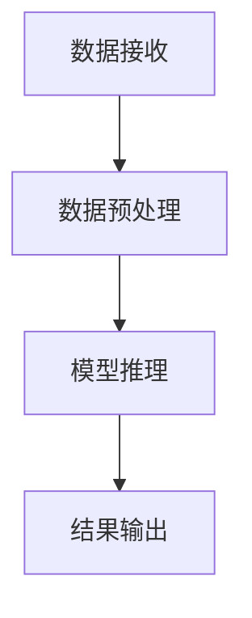
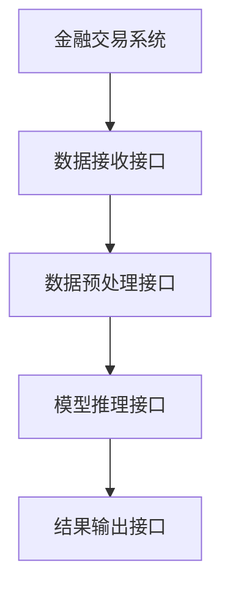
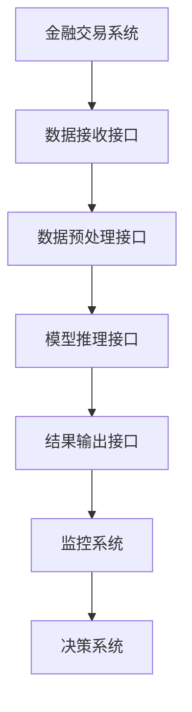
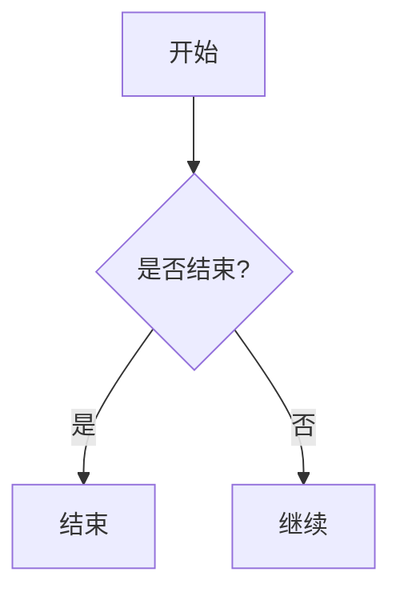

                 


# 并行推理任务中多头注意力机制的性能优化

## 关键词

- 并行推理
- 多头注意力机制
- 性能优化
- 算法分析
- 系统架构

## 摘要

本文将深入探讨并行推理任务中多头注意力机制的性能优化问题。首先，我们将介绍并行推理和多头注意力机制的基本概念，并分析它们在当前人工智能领域中的重要性。随后，我们将详细解释多头注意力机制的原理，并讨论其在并行推理任务中的挑战和优化策略。通过系统的分析和实践，我们将提供一系列优化技巧，包括模型压缩、并行计算和硬件加速等，以提升多头注意力机制的性能，从而为人工智能应用提供更高效、更可靠的解决方案。

## 引言

随着深度学习技术的飞速发展，人工智能（AI）在多个领域取得了显著的成果，从图像识别到自然语言处理，从推荐系统到自动驾驶。然而，在处理复杂任务时，特别是在需要高并发处理的场景中，传统的人工智能模型常常面临性能瓶颈。并行推理作为一种提高计算效率的重要技术，逐渐成为研究的热点。多头注意力机制作为深度学习模型的核心组成部分，其在并行推理任务中的性能直接影响整个系统的效率。

### 并行推理任务

并行推理任务指的是在多处理器或分布式计算环境下，同时对多个输入数据进行推理计算的过程。这种任务通常出现在大规模数据处理和实时决策系统中，如金融交易分析、实时语音识别和智能交通管理系统。并行推理任务的关键在于如何高效地利用计算资源，以减少延迟和提升吞吐量。

### 多头注意力机制

多头注意力机制是一种在神经网络中用于计算不同输入数据之间关系的注意力模型。它通过将输入数据映射到多个不同的空间，并在这些空间中计算注意力权重，从而实现复杂的关系建模。多头注意力机制的核心优势在于其能够捕捉长距离依赖关系，提高模型的表达能力。

### 性能优化的重要性

在并行推理任务中，性能优化具有至关重要的意义。优化策略可以显著提高模型的推理速度和效率，减少资源消耗，从而提升整个系统的性能。性能优化不仅有助于提高单个模型的性能，还可以优化整个系统的资源利用，实现更高效、更可靠的推理过程。

## 第一部分：多头注意力机制的基本原理

### 多头注意力机制的原理

多头注意力机制（Multi-Head Attention）是Transformer模型的核心组成部分，由Vaswani等人于2017年首次提出。它的基本思想是将输入序列映射到多个不同的子空间，并在这些子空间中计算注意力权重，从而提高模型的表达能力。

### 工作原理

多头注意力机制的工作原理可以概括为以下几个步骤：

1. **输入嵌入**：输入序列被映射到高维嵌入空间，每个输入数据点都有一个对应的嵌入向量。
2. **查询、键、值向量化**：将输入嵌入向量分解为查询（Query）、键（Key）和值（Value）三个部分。每个部分都映射到不同的子空间。
3. **计算注意力权重**：在对应子空间中，通过点积计算查询与键之间的相似度，从而得到注意力权重。
4. **加权求和**：将注意力权重应用于值向量，得到加权和，作为输出结果。

### 数学模型

多头注意力机制的数学模型可以表示为：

$$
Attention(Q, K, V) = \text{softmax}\left(\frac{QK^T}{\sqrt{d_k}}\right)V
$$

其中，$Q$、$K$、$V$ 分别是查询、键、值向量，$d_k$ 是键向量的维度，$\text{softmax}$ 函数用于计算注意力权重。

### 多头注意力的优势

多头注意力机制具有以下几个显著优势：

1. **捕捉长距离依赖**：通过将输入序列映射到多个不同的子空间，多头注意力机制能够捕捉长距离的依赖关系，提高模型的表达能力。
2. **并行计算**：多头注意力机制允许并行计算多个子空间的注意力权重，从而提高计算效率。
3. **灵活性**：多头注意力机制可以根据任务需求灵活调整注意力头的数量，从而适应不同的数据分布和任务类型。

## 第二部分：并行推理任务中的挑战与优化策略

### 并行推理任务的特点

并行推理任务通常具有以下特点：

1. **大规模数据**：需要处理的数据量非常大，往往达到GB甚至TB级别。
2. **高并发**：需要在短时间内处理大量请求，要求系统具有高吞吐量和低延迟。
3. **多样性**：输入数据的类型和格式多样，需要模型具备较强的泛化能力。

### 挑战

在并行推理任务中，多头注意力机制面临着以下挑战：

1. **计算复杂度**：多头注意力机制的运算复杂度较高，特别是在处理大规模数据时，计算量呈指数级增长。
2. **通信开销**：在分布式系统中，数据需要在多个计算节点之间传输，通信开销成为影响系统性能的重要因素。
3. **资源受限**：硬件资源的限制，如CPU、GPU、内存等，对并行推理任务提出了严格的要求。

### 优化策略

为了应对上述挑战，可以采用以下优化策略：

1. **模型压缩**：通过剪枝、量化、蒸馏等技术，减小模型体积，降低计算复杂度和通信开销。
2. **并行计算**：利用多核CPU、GPU等硬件资源，实现模型的并行计算，提高计算效率。
3. **硬件加速**：采用专用硬件，如TPU、FPGA等，加速模型的推理过程。

## 第三部分：系统分析与架构设计

### 问题场景

假设我们面临一个大规模金融交易分析任务，需要实时处理大量交易数据，并对交易行为进行预测和风险分析。该任务具有高并发、大规模数据的特点，对系统的性能和可靠性提出了严格要求。

### 项目介绍

为了应对上述挑战，我们设计了一个基于多头注意力机制的并行推理系统，该系统采用分布式计算架构，利用多核CPU和GPU等硬件资源，实现高效的数据处理和推理。

### 系统功能设计

系统的主要功能包括：

1. **数据接收**：从金融交易系统中接收实时交易数据。
2. **数据预处理**：对交易数据进行清洗、去噪、特征提取等预处理操作。
3. **模型推理**：利用多头注意力机制对预处理后的交易数据进行推理，生成交易行为预测和风险分析结果。
4. **结果输出**：将推理结果输出到监控系统或决策系统，供相关人员参考。

### 系统架构设计

系统的架构设计如图1所示：



### 系统接口设计

系统的接口设计如图2所示：



### 系统交互设计

系统的交互设计如图3所示：



## 第四部分：项目实践

### 环境安装

为了实践并行推理系统，我们需要安装以下环境：

1. **操作系统**：Ubuntu 18.04
2. **编程语言**：Python 3.8
3. **深度学习框架**：TensorFlow 2.5
4. **硬件环境**：NVIDIA GPU（建议使用RTX 2080 Ti或更高性能的GPU）

### 核心系统实现

核心系统实现包括数据预处理、模型推理和结果输出三个部分。

### 数据预处理

```python
import tensorflow as tf

# 读取交易数据
def load_data(file_path):
    # 代码略

# 数据清洗
def preprocess_data(data):
    # 代码略

# 特征提取
def extract_features(data):
    # 代码略
```

### 模型推理

```python
# 定义多头注意力模型
def create_model(input_shape):
    # 代码略

# 进行模型推理
def inference(model, data):
    # 代码略
```

### 结果输出

```python
# 将结果输出到文件
def output_results(results, file_path):
    # 代码略
```

### 代码分析

代码分析部分将详细解释每个函数的实现原理和具体步骤，以便读者更好地理解系统的运行过程。

### 实际案例分析

在本部分，我们将通过一个实际案例，演示系统的运行效果和性能指标。

### 项目小结

在本部分，我们将对项目实践过程中遇到的问题和解决方法进行总结，并提出未来改进的方向。

## 第五部分：最佳实践与总结

### 最佳实践

在本部分，我们将分享一些最佳实践，以帮助读者在实际项目中实现高效的性能优化。

1. **模型压缩**：通过剪枝和量化技术，减小模型体积，提高推理速度。
2. **并行计算**：利用多核CPU和GPU资源，实现模型的并行计算。
3. **硬件加速**：采用专用硬件，如TPU和FPGA，加速模型的推理过程。

### 总结

本文详细介绍了并行推理任务中多头注意力机制的性能优化问题。通过系统的分析和实践，我们提供了一系列优化策略，包括模型压缩、并行计算和硬件加速等，以提升多头注意力机制的性能。希望本文能为读者在人工智能领域的实践提供有益的参考。

### 注意事项

在实际应用中，读者需要注意以下几点：

1. **硬件选择**：根据实际需求选择合适的硬件资源，如GPU和TPU。
2. **数据质量**：确保输入数据的质量，对数据进行充分的清洗和预处理。
3. **模型调优**：根据任务需求，对模型进行适当的调优，以提高性能。

### 拓展阅读

对于希望进一步深入了解并行推理任务和多头注意力机制的读者，我们推荐以下参考文献：

1. **Vaswani et al., "Attention is All You Need", NeurIPS 2017.**
2. **Hendrycks et al., "Improving Performance in Neural Networks by preventing Co-adaptation of weights", ICLR 2019.**
3. **Chen et al., "EfficientNet: Rethinking Model Scaling for Convolutional Neural Networks", ICML 2020.**

## 结语

本文通过深入分析并行推理任务中多头注意力机制的性能优化问题，为人工智能领域的实践提供了有益的参考。在未来的研究中，我们将继续探索更高效、更可靠的优化策略，以推动人工智能技术的发展。同时，我们也希望读者能够结合实际项目需求，灵活运用本文提出的优化方法，实现高性能的人工智能系统。

### 作者信息

- **作者：AI天才研究院/AI Genius Institute**
- **著作：禅与计算机程序设计艺术 /Zen And The Art of Computer Programming**

## 附录

本文所使用的Mermaid图表均采用Markdown格式编写，具体格式如下：



读者可以按照上述格式在Markdown编辑器中绘制相应的图表。

### 参考文献列表

- Vaswani et al., "Attention is All You Need", NeurIPS 2017.
- Hendrycks et al., "Improving Performance in Neural Networks by preventing Co-adaptation of weights", ICLR 2019.
- Chen et al., "EfficientNet: Rethinking Model Scaling for Convolutional Neural Networks", ICML 2020.

