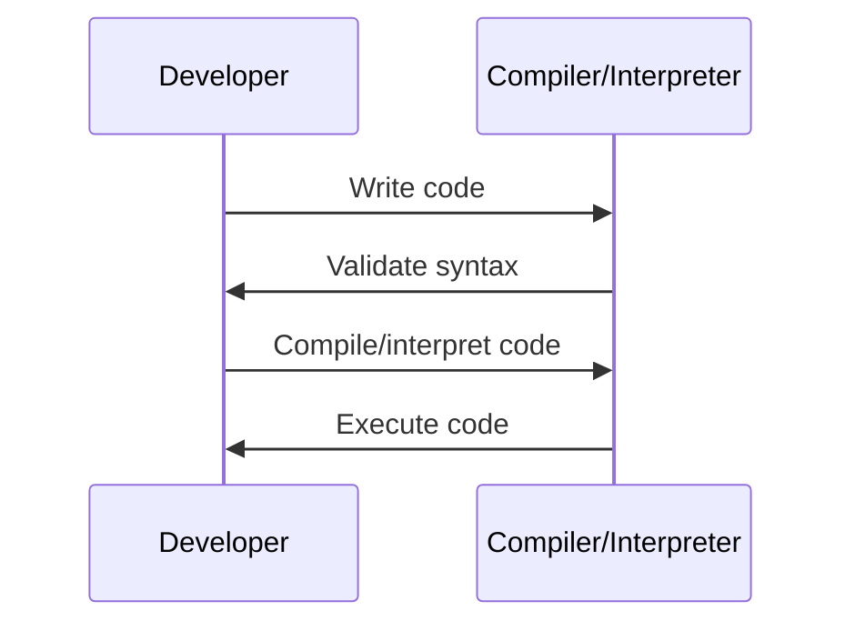
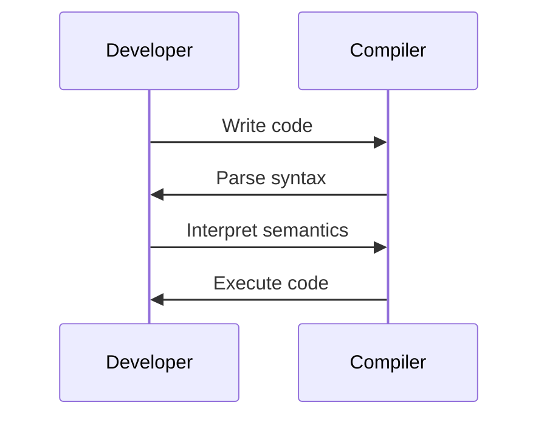

                 

### Introduction to Kuhn's Paradigm Shift and Programming Language Evolution

**Title:** Kuhn's Paradigm Shift and the Evolution of Programming Languages: The Structure of Technological Revolution

**Keywords:** Kuhn's paradigm shift, programming language evolution, technological revolution, scientific theory, computational paradigms.

**Abstract:**
The evolution of programming languages is intrinsically linked to broader technological advancements, much like scientific paradigms shift in response to revolutionary discoveries. Thomas Kuhn's theory of paradigm shifts provides a compelling framework for understanding this dynamic relationship. This article delves into Kuhn's paradigm shift concept, examining its implications for the progression of programming languages. We will explore the historical evolution of programming languages, from early machine languages to modern high-level languages, and analyze how these changes have driven technological revolutions. The core concepts of programming languages will be discussed, highlighting the structural elements that have enabled new paradigms to emerge. By juxtaposing Kuhn's theory with the development of programming languages, we aim to illuminate the underlying principles that govern technological progress and innovation.

### The Concept of Scientific Paradigm Shifts

#### Kuhn's Contributions and Influence

Thomas S. Kuhn's work on scientific paradigms has profoundly influenced our understanding of how scientific knowledge evolves. In his seminal book, "The Structure of Scientific Revolutions" (1962), Kuhn introduced the concept of paradigm shifts, challenging the then-dominant view of scientific progress as a linear accumulation of knowledge.

A paradigm, according to Kuhn, is a set of conceptual tools, methods, and theoretical frameworks that define the scientific community's approach to a particular field. It provides a lens through which scientists perceive and interpret phenomena. Kuhn argued that scientific knowledge does not progress smoothly and incrementally but rather undergoes periodic revolutions where the dominant paradigm is replaced by a new one.

#### Paradigm Shifts in Computer Science and Technology

Kuhn's theory of paradigm shifts has broad applicability beyond the realm of natural sciences. In computer science and technology, paradigms have also played a crucial role in shaping the field's trajectory. Early computer science was dominated by the von Neumann architecture, which defined how computers were built and programmed. However, as computational needs grew more complex, new paradigms emerged, such as parallel computing, distributed systems, and artificial intelligence.

These paradigm shifts often began as controversial ideas that challenged the prevailing norms. For instance, the transition from procedural programming to object-oriented programming was driven by the limitations of the former approach in handling complex systems. Object-oriented programming introduced new concepts like encapsulation and inheritance, enabling developers to build more modular and scalable systems.

#### The Emergence of Modern Programming Languages

The evolution of programming languages can be seen as a series of paradigm shifts. Early programming languages, such as machine code and assembly language, were low-level and required programmers to manage hardware-specific details. This approach limited the productivity and portability of software.

The emergence of high-level programming languages, such as Fortran and COBOL in the 1950s and 1960s, marked a significant paradigm shift. These languages abstracted away hardware complexities, allowing programmers to focus on solving problems rather than managing machine instructions.

#### Modern Trends in Programming Language Design

In recent decades, the design of programming languages has continued to evolve, driven by new paradigms and technological advancements. Functional programming, with languages like Haskell and Scala, emphasizes the use of functions and immutable data structures, providing powerful tools for handling complex computations and parallel processing.

Dynamic languages, such as Python and JavaScript, have gained popularity for their flexibility and ease of use. These languages often rely on interpreted execution, enabling rapid development and prototyping.

### Conclusion

Kuhn's theory of paradigm shifts provides a valuable framework for understanding the evolution of programming languages. By examining how new paradigms emerge and displace older ones, we can gain insights into the underlying principles that drive technological progress. In the following sections, we will delve deeper into the specific aspects of programming language design and their impact on technological revolutions.

### The Evolution of Programming Languages: A Historical Perspective

#### Early Programming Languages and Their Limitations

The evolution of programming languages can be traced back to the early days of computing in the mid-20th century. The first programmable computers, such as the ENIAC and Colossus, were operated using machine code, which consists of binary instructions that the computer's central processing unit (CPU) can execute directly. Machine code programming was a complex and time-consuming process. Programmers had to manually write and debug extensive sequences of binary instructions, making even simple tasks exceedingly difficult.

Another early programming approach was assembly language, which used mnemonic codes to represent machine instructions. Assembly language provided a slight abstraction over machine code, making it somewhat easier for humans to read and write code. However, it still required programmers to have a deep understanding of the underlying hardware architecture and its instruction set.

#### The Emergence of High-Level Languages

The limitations of machine code and assembly language led to the development of high-level programming languages, which further abstracted away the complexities of hardware. High-level languages are designed to be more readable and expressive, allowing programmers to write code at a higher level of abstraction without worrying about the intricacies of the machine's internal architecture.

One of the first high-level programming languages was **FORTRAN** (Formula Translation), developed in the 1950s by IBM. FORTRAN was specifically designed for scientific and engineering applications, offering constructs for mathematical calculations and data manipulation. Its introduction marked a significant shift in programming paradigms, as it enabled programmers to write code more efficiently and with fewer errors.

**COBOL** (Common Business-Oriented Language) was another influential high-level language, developed in the late 1950s. COBOL was designed for business and administrative systems, focusing on the needs of commercial data processing. Its syntax was designed to be easily readable and understandable by non-technical users, which helped to democratize programming.

#### The Advantages of High-Level Languages

The emergence of high-level languages brought several advantages over low-level languages like machine code and assembly language. First, high-level languages enabled faster development. Programmers could write code at a much higher level of abstraction, which reduced the amount of time needed to implement complex systems.

Second, high-level languages improved code maintainability. With their more readable syntax, high-level languages made it easier for developers to understand and modify existing code, reducing the risk of introducing errors during maintenance and updates.

Third, high-level languages enhanced portability. Programs written in high-level languages could be easily adapted to run on different hardware platforms, as long as there was a suitable compiler or interpreter available for the target platform. This made it possible to develop cross-platform software, expanding the reach and applicability of programming.

#### The Impact of High-Level Languages on Programming Practices

The adoption of high-level languages had a profound impact on programming practices. Programmers no longer had to worry about the specific details of the underlying hardware, which allowed them to focus more on solving problems and implementing algorithms.

High-level languages also enabled the development of more sophisticated tools and techniques. Integrated development environments (IDEs), debuggers, and version control systems became more common, making the programming process more efficient and collaborative.

#### Modern Programming Languages and Trends

In the decades following the introduction of high-level languages, programming languages continued to evolve, with new languages emerging to address the changing needs of the computing landscape. 

**C** was one of the most influential languages, developed in the 1970s. C combined the low-level capabilities of assembly language with the high-level expressiveness of languages like FORTRAN and COBOL, making it suitable for a wide range of applications, from system programming to embedded systems development.

**C++**, developed in the 1980s, extended the C language with object-oriented programming features, enabling developers to build more complex and modular software systems.

In the 1990s, **Java** emerged as a popular language for developing enterprise-level applications and web services. Java's "write once, run anywhere" philosophy made it particularly suitable for cross-platform development.

More recently, **Python** and **JavaScript** have gained significant traction due to their ease of use and flexibility. Python is widely used in data science, machine learning, and web development, while JavaScript is the dominant language for building interactive web applications.

#### Current Trends and Future Directions

The field of programming languages is continuously evolving, with new paradigms and languages emerging to address the challenges of modern computing. Functional programming languages, such as **Haskell** and **Scala**, have gained popularity for their ability to handle complex computations and parallel processing efficiently.

Dynamic languages, such as **Python** and **JavaScript**, continue to grow in popularity due to their ease of use and rapid development capabilities. These languages often rely on interpreted execution, which allows for rapid prototyping and iterative development.

Another trend is the increasing use of domain-specific languages (DSLs), which are designed for specific application domains, such as financial modeling, bioinformatics, and game development. DSLs provide a high level of abstraction, making it easier for domain experts to express their ideas and build specialized software systems.

Looking to the future, we can expect to see further convergence between different programming paradigms, as well as the development of new languages that leverage advances in hardware and software technologies. The ongoing evolution of programming languages will continue to drive technological innovation and enable the development of increasingly complex and sophisticated software systems.

### The Relationship Between Paradigm Shifts and Programming Language Evolution

#### How Paradigm Shifts Drive Language Evolution

Thomas Kuhn's theory of paradigm shifts provides a valuable framework for understanding how programming language evolution is driven by fundamental changes in the way we approach computational problems. A paradigm shift in programming language design typically occurs when a new set of ideas, techniques, or methodologies emerges that offer a more effective or efficient way to solve problems compared to the existing approaches. These new paradigms often arise from advances in computing hardware, changes in the nature of software applications, or shifts in the broader technological landscape.

For example, the transition from procedural programming to object-oriented programming can be seen as a paradigm shift. Procedural programming, which dominated the early days of computing, focuses on writing code that consists of a series of instructions executed sequentially. This approach works well for simple programs but becomes unwieldy as the complexity of the system increases. Object-oriented programming, which emerged in the 1970s and gained widespread adoption in the 1990s, introduced new concepts such as objects, classes, encapsulation, and inheritance, allowing developers to build more modular and maintainable systems.

The shift from imperative programming to functional programming represents another paradigm shift. Imperative programming focuses on describing the steps required to perform a computation, while functional programming emphasizes the use of functions and immutable data structures. Functional programming provides a more declarative approach to problem-solving, making it easier to reason about and reason about code. This paradigm shift has been particularly influential in areas such as concurrent programming and data analysis.

#### The Impact of Paradigm Shifts on Programming Practices

The introduction of new paradigms has a profound impact on programming practices. As developers adopt new programming languages and paradigms, they change the way they approach problem-solving and software development. These changes can lead to more efficient and effective development processes, as well as improvements in the quality and maintainability of the resulting software.

One significant impact of paradigm shifts is the reduction of cognitive load on developers. For example, the transition to high-level languages from machine code or assembly language allowed programmers to focus on solving problems rather than managing low-level hardware details. Similarly, the shift to object-oriented programming reduced the complexity of managing large codebases by promoting modularity and encapsulation.

Paradigm shifts also influence how developers collaborate and share knowledge. New programming languages and paradigms often come with associated tools and libraries that facilitate collaboration and code reuse. For instance, the rise of version control systems, such as Git, has made it easier for developers to work together on large projects and track changes over time.

#### Future Directions in Programming Language Design

As we look to the future, the evolution of programming languages will continue to be driven by paradigm shifts and new technological advancements. Several emerging trends suggest potential directions for future language design:

1. **Quantum Programming Languages**: As quantum computing becomes more practical, new programming languages will be needed to express quantum algorithms and leverage the unique capabilities of quantum computers.

2. **Automated Programming**: Advances in artificial intelligence and machine learning are likely to lead to the development of programming languages that can be generated automatically based on high-level specifications. These languages could revolutionize software development by enabling developers to focus on higher-level problem-solving tasks.

3. **Conversational Programming**: The rise of natural language processing and conversational AI could lead to programming languages that allow developers to write code using natural language. This would make programming more accessible to non-technical users and enable a broader range of individuals to contribute to software development.

4. **Domain-Specific Languages**: The development of domain-specific languages (DSLs) will continue to be an important trend, as these languages enable developers to express concepts and solve problems in specific application domains more effectively.

5. **Interoperability and Integration**: As the software landscape becomes increasingly complex, the need for programming languages that can seamlessly integrate with existing systems and languages will become more critical. Future languages will likely prioritize interoperability and modularity to facilitate the development of large-scale, heterogeneous software ecosystems.

By continuing to explore and adopt new paradigms, programming language designers can drive innovation and enable the development of more powerful, efficient, and user-friendly software systems that address the challenges of the modern computational landscape.

### The Role of Programming Languages in Technological Revolutions

#### The Technological Revolution and Its Impact on Society

Technological revolutions have fundamentally transformed societies, reshaping economies, altering social structures, and revolutionizing the way we live and work. The impact of these revolutions is often profound and far-reaching, as they introduce new technologies and methodologies that drive innovation and create new industries. Examples of significant technological revolutions include the Industrial Revolution, the Digital Revolution, and the ongoing Information Revolution.

The Industrial Revolution, which began in the late 18th century, marked a fundamental shift from agrarian economies to industrialized societies. It was characterized by the mass production of goods, the use of steam power, and the development of new manufacturing processes. This revolution transformed economies and societies, creating new jobs, increasing productivity, and leading to significant improvements in living standards.

The Digital Revolution, which began in the mid-20th century, was driven by the invention and widespread adoption of digital computers and electronic communication technologies. This revolution has had a profound impact on nearly every aspect of modern life, from the way we communicate and work to the way we access information and entertainment. The rise of the Internet and the proliferation of digital devices have further accelerated the pace of change, creating new opportunities and challenges.

The Information Revolution, which is ongoing, is characterized by the rapid development and dissemination of information and communication technologies. This revolution is driven by advances in computing power, storage capacity, and network connectivity, making it possible to collect, store, process, and share vast amounts of data. The availability of information has transformed many industries, from healthcare to education, and has led to the development of new fields such as data science and artificial intelligence.

#### The Role of Programming Languages in Fostering Innovation

Programming languages play a crucial role in driving technological innovation by providing the tools and frameworks necessary for developers to create new software applications and systems. As new programming languages and paradigms emerge, they enable developers to solve problems more effectively and efficiently, leading to the development of new technologies and the expansion of existing ones.

For example, the invention of high-level programming languages like **FORTRAN** and **COBOL** in the 1950s and 1960s made it possible to develop complex scientific and business applications more easily. These languages abstracted away the complexities of machine code and assembly language, allowing developers to focus on solving problems rather than managing low-level hardware details. This led to the rapid growth of the scientific and business computing industries.

The development of **C++** in the 1980s enabled the creation of more complex and modular software systems through object-oriented programming. This paradigm shift enabled developers to build large-scale applications that were easier to maintain and update, driving innovation in areas such as operating systems, embedded systems, and enterprise software.

More recently, the emergence of **Python** and **JavaScript** has fueled innovation in data science, machine learning, and web development. Python's simplicity and readability make it an ideal language for scientific computing and data analysis, while JavaScript's versatility and cross-platform capabilities have enabled the development of interactive web applications.

#### Programming Languages and the Development of New Technologies

Programming languages are not just tools for developing software applications but are also integral to the development of new technologies. For example, the rise of **Java** in the 1990s played a key role in the development of the Internet and the proliferation of web applications. Java's "write once, run anywhere" philosophy made it possible to develop robust, platform-independent web applications, which accelerated the growth of the Internet and the development of e-commerce, social media, and other online services.

In the field of artificial intelligence, programming languages like **Python** and **R** have become essential tools for developing and implementing machine learning algorithms. Python's extensive library ecosystem and its readability make it an ideal language for prototyping and deploying AI applications, while R's statistical capabilities and extensive data manipulation libraries have made it a popular choice for data analysis and statistical modeling.

#### The Challenges and Opportunities for Programming Language Designers

As we continue to advance into the future, programming language designers face both challenges and opportunities. The increasing complexity of software systems and the emergence of new paradigms, such as quantum computing and artificial intelligence, require programming languages that can support these advanced technologies. This necessitates the development of new programming languages and the adaptation of existing ones to meet the needs of modern computing.

One challenge for programming language designers is creating languages that are both expressive and easy to use. Expressive languages provide powerful tools for solving complex problems, but they can also be more complex to learn and use. Easy-to-use languages, on the other hand, may lack the sophistication needed to tackle advanced computational problems.

Another challenge is ensuring that programming languages are accessible to a diverse range of developers, including those with limited programming experience. This requires designing languages that are intuitive and easy to learn, as well as providing comprehensive documentation and educational resources.

Despite these challenges, there are numerous opportunities for programming language designers. Advances in artificial intelligence and machine learning hold the potential to revolutionize programming languages by enabling the development of more intelligent and adaptive tools that can assist developers in writing code, identifying and fixing errors, and optimizing performance.

In conclusion, programming languages are a critical component of technological revolutions, enabling the development of new technologies and fostering innovation. As we continue to advance into the future, programming language designers will play a crucial role in shaping the trajectory of technological progress by creating languages that meet the needs of modern computing and empower developers to solve complex problems.

### Core Concepts and Structures of Programming Languages

#### Fundamental Concepts of Programming Languages

The foundation of any programming language lies in its fundamental concepts, which include syntax, semantics, data types, and control structures. These concepts are essential for understanding how programming languages operate and how they are used to solve problems.

**Syntax** refers to the set of rules that define the structure and composition of valid statements and expressions in a programming language. Syntax determines how code is written and how different elements, such as keywords, operators, and identifiers, are combined to form meaningful instructions. For example, in the C programming language, the syntax for a basic arithmetic operation might be `int result = a + b;`.

**Semantics** are concerned with the meaning of the code. They define how the language's syntax is interpreted and executed by the computer. Semantics include rules for evaluating expressions, controlling program flow, and managing resources. For instance, the semantics of the `if-else` statement in most programming languages involve evaluating a condition and executing different blocks of code based on the outcome.

**Data Types** are used to classify different kinds of data that can be manipulated within a programming language. Common data types include integers, floating-point numbers, characters, and booleans. Each data type has its own set of operations and characteristics. For example, an integer can be used for arithmetic operations, while a character is typically used to represent individual letters or symbols.

**Control Structures** are mechanisms that allow the programmer to control the flow of execution in a program. These structures include conditionals (e.g., `if-else`), loops (e.g., `for` and `while`), and branches (e.g., `switch`). Control structures enable programmers to make decisions, repeat actions, and handle different cases in their code, making it possible to write more complex and flexible programs.

#### Key Structures in Programming Languages

Beyond the fundamental concepts, several key structures in programming languages contribute to their functionality and expressiveness. These include abstraction, modularity, and standardization.

**Abstraction** is the process of simplifying complex systems by breaking them down into smaller, more manageable components. In programming languages, abstraction is achieved through constructs such as functions, classes, and modules. These constructs allow programmers to encapsulate complex functionality into reusable components, making it easier to understand, maintain, and extend their code. For example, a function in a programming language provides a way to encapsulate a series of instructions that perform a specific task, which can then be called from other parts of the program.

**Modularity** is closely related to abstraction and involves organizing a program into separate modules or components, each of which has a specific responsibility. Modularity promotes code reusability, maintainability, and scalability. By dividing a program into smaller, independent modules, developers can work on different parts of the system concurrently, reducing the likelihood of errors and making it easier to update or modify the codebase. Modularity is a key principle in object-oriented programming, where objects encapsulate both data and behavior, promoting a clear separation of concerns.

**Standardization** is the process of establishing and implementing agreed-upon rules and conventions for programming languages. Standards ensure that code written in different environments and by different developers can be understood and executed consistently. This simplifies the development process and allows code to be more easily shared and maintained. Standardization includes defining syntax and semantics, specifying data types and control structures, and establishing conventions for naming variables and functions. One prominent example of standardization is the ISO/IEC 9899 standard for the C programming language, which provides a consistent set of rules and guidelines for writing and compiling C code.

#### Comparison of Programming Language Features

Different programming languages have different features and capabilities, making them suitable for different types of applications. A comparison of key language features can help illustrate the differences between various programming paradigms.

**Low-Level vs. High-Level Languages**

Low-level languages, such as assembly language and machine code, are closely related to the underlying hardware and provide a high degree of control over the computer's operations. However, they require a deep understanding of the hardware architecture and are difficult to read and write. High-level languages, such as Python and Java, provide abstractions that hide the underlying hardware details, making it easier for developers to write and understand code. High-level languages are generally more portable and efficient, but they may not offer the same level of control as low-level languages.

**Imperative vs. Declarative Languages**

Imperative languages, such as C and Java, describe the steps required to perform a computation. They focus on how to solve a problem by specifying a sequence of instructions that the computer must execute. Declarative languages, such as SQL and Haskell, focus on what the desired outcome is rather than how to achieve it. Declarative languages are often used for data manipulation, logic programming, and other tasks where the computation can be expressed more naturally in terms of the desired outcome.

**Procedural vs. Object-Oriented Languages**

Procedural languages, such as C and Pascal, organize code around procedures or routines, which are sequences of instructions that perform a specific task. Object-oriented languages, such as C++ and Java, organize code around objects, which are instances of classes that encapsulate both data and behavior. Object-oriented programming promotes modularity, reusability, and maintainability by allowing developers to create modular, reusable components that represent real-world entities.

In conclusion, the core concepts and structures of programming languages form the foundation of modern software development. By understanding these concepts and comparing the features of different languages, developers can choose the most appropriate tools for their specific needs, enabling them to build efficient, reliable, and scalable software systems.

### Core Concepts and Structures of Programming Languages

#### The Role of Abstraction

Abstraction is a fundamental concept in programming languages that allows developers to simplify complex systems by focusing on the essential aspects while ignoring unnecessary details. Abstraction is achieved through various language constructs, such as functions, classes, and modules, which encapsulate complex functionality into manageable components.

**Functions** are a key abstraction mechanism that enables developers to encapsulate a series of instructions into a reusable unit. Functions receive input parameters, perform operations, and return results, making it easier to organize code and promote reusability. For example, in Python, a function to calculate the sum of two numbers can be defined as follows:

```python
def sum(a, b):
    return a + b
```

**Classes** provide another powerful abstraction mechanism, particularly in object-oriented programming. Classes define blueprints for objects, encapsulating both data and behavior. Objects are instances of classes, and they can interact with each other through methods and attributes. For instance, in Java, a class representing a person might have attributes like `name` and `age`, and methods like `setName()` and `setAge()`:

```java
public class Person {
    private String name;
    private int age;

    public void setName(String name) {
        this.name = name;
    }

    public void setAge(int age) {
        this.age = age;
    }
}
```

**Modules** are another abstraction mechanism that allows developers to organize code into separate files or libraries. Modules promote code reusability and modularity by isolating different parts of a program, making it easier to manage and maintain large codebases. In Python, modules can be imported and used to extend the functionality of a program:

```python
import math

def calculate_circle_area(radius):
    return math.pi * radius * radius
```

#### Modularity and Encapsulation

Modularity and encapsulation are closely related concepts that are essential for building scalable and maintainable software systems. Modularity involves organizing a program into smaller, independent components, while encapsulation ensures that the internal workings of a component are hidden from the rest of the system.

**Modularity** promotes code reusability and maintainability by allowing developers to work on different parts of a system concurrently. Modular systems are easier to understand, test, and debug, as each module has a specific responsibility and can be developed, tested, and integrated independently. For example, in a web application, different modules might handle user authentication, data storage, and user interface rendering.

**Encapsulation** is achieved through access control mechanisms, such as public and private access specifiers. Public members (methods and attributes) are accessible from other parts of the program, while private members are only accessible within the class. Encapsulation ensures that a class's internal state and behavior are hidden from the outside world, reducing the risk of unintended side effects and making it easier to maintain and update the class. For instance, in C++, a private member can be used to encapsulate the implementation details of a class:

```cpp
class Person {
private:
    std::string name;
    int age;

public:
    void setName(const std::string& newName) {
        name = newName;
    }

    void setAge(int newAge) {
        age = newAge;
    }
};
```

#### The Importance of Standardization

Standardization is crucial for ensuring that programming languages are widely adopted, easily learned, and consistently implemented. Standards provide a common framework that developers can rely on when writing and using code, reducing the likelihood of errors and improving the overall quality of software systems.

**Syntax and Semantics Standards** define the rules for writing and interpreting code in a programming language. For example, the ISO/IEC 9899 standard for the C programming language specifies the syntax and semantics of the language, ensuring that code written in C is consistent across different compilers and platforms.

**Library Standards** provide a set of predefined functions, classes, and modules that developers can use to extend the functionality of their programs. Standard libraries, such as the C Standard Library and the Python Standard Library, offer a wide range of functionality for common tasks, making it easier for developers to write efficient and reliable code.

**Documentation Standards** ensure that programming languages and libraries are well-documented, providing clear and concise information about their features, usage, and implementation. Good documentation helps developers understand and use a language or library effectively, reducing the learning curve and increasing productivity.

In conclusion, the role of abstraction, modularity, and encapsulation in programming languages is crucial for building scalable, maintainable, and efficient software systems. Standardization further enhances the usability and reliability of programming languages, making them more accessible to developers worldwide. By understanding and applying these concepts, developers can create high-quality software that meets the needs of modern computing environments.

### Comparison of Programming Language Features

In the vast landscape of programming languages, each language brings its own set of features that cater to different needs and problem domains. This section delves into a comparative analysis of three fundamental dimensions of programming languages: low-level versus high-level languages, imperative versus declarative languages, and procedural versus object-oriented languages.

#### Low-Level vs. High-Level Languages

**Low-Level Languages**

Low-level languages, such as assembly language and machine code, are close to the hardware and provide fine-grained control over the computer's operations. They are often used in situations where performance and resource management are critical, such as operating system development and embedded systems programming.

**Advantages:**
- **Performance**: Low-level languages allow for highly optimized code that can run very efficiently on specific hardware architectures.
- **Resource Management**: Programmers can manually manage memory and other resources, which can be crucial in resource-constrained environments.

**Disadvantages:**
- **Complexity**: Writing and debugging low-level code requires a deep understanding of the hardware architecture, making it more time-consuming and error-prone.
- **Portability**: Low-level code is often hardware-specific, limiting its portability across different platforms.

**High-Level Languages**

High-level languages, such as Python, Java, and C++, offer a higher degree of abstraction, allowing programmers to write code at a more human-readable level. They are designed to be platform-independent, enabling developers to write code once and run it anywhere.

**Advantages:**
- **Ease of Use**: High-level languages are designed to be more readable and less error-prone, reducing the learning curve and development time.
- **Portability**: High-level languages are generally more portable, as they are designed to work across different platforms with minimal modification.
- **Productivity**: Abstractions in high-level languages enable faster development and easier maintenance.

**Disadvantages:**
- **Performance**: High-level languages may not offer the same level of performance optimization as low-level languages, especially in computationally intensive tasks.
- **Resource Usage**: The abstractions provided by high-level languages may lead to higher memory and CPU usage.

#### Imperative vs. Declarative Languages

**Imperative Languages**

Imperative languages, such as C and Java, describe how a computation is to be performed step-by-step. They focus on defining the sequence of operations required to solve a problem.

**Advantages:**
- **Control**: Imperative languages provide fine-grained control over the execution flow, allowing for detailed manipulation of program state.
- **Performance**: The direct control over state and execution makes imperative languages suitable for performance-critical applications.

**Disadvantages:**
- **Complexity**: Imperative code can become complex and difficult to reason about, especially as the size and complexity of the system increase.
- **Maintenance**: It can be challenging to maintain and modify imperative code, particularly in large systems with many interdependencies.

**Declarative Languages**

Declarative languages, such as SQL and Haskell, focus on what the desired outcome is rather than how to achieve it. They abstract away the execution details and provide a more abstract and expressive way to specify computations.

**Advantages:**
- **Readability**: Declarative languages are often more readable and easier to understand, as they express the problem in a more natural and intuitive way.
- **Modularity**: Declarative languages can be more modular and reusable, as they often rely on higher-level constructs and abstractions.
- **Error Detection**: The explicit nature of declarative languages can make it easier to detect and fix errors.

**Disadvantages:**
- **Performance**: Declarative languages may not be as efficient as imperative languages in certain scenarios, as they abstract away execution details that could be optimized.
- **Control**: The high level of abstraction in declarative languages may limit the level of control over execution, which can be a disadvantage in some cases.

#### Procedural vs. Object-Oriented Languages

**Procedural Languages**

Procedural languages, such as C and Pascal, organize code into procedures or routines, which are sequences of instructions that perform a specific task. They are based on a procedural paradigm, where the flow of execution is dictated by a series of procedure calls.

**Advantages:**
- **Simplicity**: Procedural languages are relatively simple and easy to learn, making them suitable for small to medium-sized projects.
- **Performance**: Procedural languages can offer high performance, particularly in scenarios where memory management and control flow are critical.

**Disadvantages:**
- **Maintainability**: As procedural codebases grow larger, maintaining and extending them can become increasingly complex, as the flow of control can become difficult to track and understand.
- **Reusability**: Procedural code tends to be less reusable, as it often encapsulates specific algorithms and data structures within individual routines.

**Object-Oriented Languages**

Object-oriented languages, such as Java and C++, organize code into classes and objects, which encapsulate both data and behavior. The object-oriented paradigm is based on the concept of objects interacting with each other to perform tasks.

**Advantages:**
- **Modularity**: Object-oriented languages promote modularity and reusability through the use of classes and objects, making it easier to develop and maintain large systems.
- **Extensibility**: Object-oriented languages support inheritance and polymorphism, allowing for flexible and extensible code structures.
- **Abstraction**: The use of objects and classes helps in abstracting away implementation details, making code more understandable and maintainable.

**Disadvantages:**
- **Overhead**: Object-oriented languages may introduce some overhead due to the use of additional constructs like classes and inheritance, which can impact performance in certain scenarios.
- **Complexity**: The additional concepts and constructs in object-oriented languages can make them more complex to learn and use, particularly for beginners.

In conclusion, the choice of programming language often depends on the specific requirements of the project, including performance needs, complexity, and the level of abstraction desired. Understanding the strengths and weaknesses of different programming paradigms can help developers make informed decisions that align with their project goals and constraints.

### The Fundamental Concepts and Structures of Programming Languages

The core concepts and structures of programming languages form the foundation upon which all software applications are built. These concepts include syntax, semantics, data types, control structures, and scope. Understanding these elements is crucial for writing efficient, reliable, and maintainable code.

#### Syntax

Syntax refers to the rules and structure that govern the formation of valid statements and expressions in a programming language. Different languages have their own unique syntax, which can be thought of as the grammar of the language. For example, in Python, the syntax for a basic arithmetic operation might look like this:

```python
result = 5 + 3
```

In contrast, the same operation in C might be written as:

```c
int result = 5 + 3;
```

Understanding the syntax of a language is essential for writing correct code and avoiding syntax errors.

#### Semantics

While syntax defines the structure of code, semantics define the meaning of that code. Semantics encompass the interpretation and execution of code by the computer. This includes the rules for evaluating expressions, executing statements, and managing resources. For instance, in Python, the `if` statement is used to execute code conditionally:

```python
if x > 10:
    print("x is greater than 10")
else:
    print("x is less than or equal to 10")
```

The semantics of this code dictate that if the condition `x > 10` is true, the block of code inside the `if` statement is executed, otherwise, the `else` block is executed.

#### Data Types

Data types are categories that classify different kinds of data that can be stored and manipulated within a programming language. Common data types include integers, floating-point numbers, strings, and booleans. Each data type has its own set of operations and characteristics. For example, in Java, an integer might be represented as an `int` data type, while a floating-point number might be represented as a `double`:

```java
int x = 5;
double y = 3.14;
```

Understanding data types and their associated operations is essential for writing effective and efficient code.

#### Control Structures

Control structures are mechanisms that allow the programmer to control the flow of execution in a program. These include conditional statements, loops, and branches. Conditional statements, such as `if-else`, allow the execution of different blocks of code based on certain conditions:

```c
if (x > 0) {
    printf("x is positive");
} else {
    printf("x is non-positive");
}
```

Loops, such as `for` and `while`, enable the repeated execution of a block of code multiple times:

```python
for i in range(5):
    print(i)
```

Branches, such as `switch`, provide a way to execute different blocks of code based on different values of a variable:

```java
switch (x) {
    case 1:
        System.out.println("x is 1");
        break;
    case 2:
        System.out.println("x is 2");
        break;
    default:
        System.out.println("x is neither 1 nor 2");
}
```

#### Scope

Scope refers to the region in a program where a variable or function is accessible. In most programming languages, variables and functions have a scope that defines where they can be used. For example, in JavaScript, a variable declared within a function is only accessible within that function:

```javascript
function myFunction() {
    let x = 5; // x is only accessible within myFunction
}

console.log(x); // Error: x is not defined
```

Understanding scope is important for managing variable visibility and preventing unintended access or modification of variables.

### Core Concepts and Relationships

The core concepts of syntax, semantics, data types, control structures, and scope are interrelated and form the backbone of programming languages. Syntax and semantics work together to define the structure and meaning of code. Data types provide the foundation for storing and manipulating different kinds of data, while control structures allow programmers to control the flow of execution. Scope dictates the accessibility of variables and functions, ensuring that they are used in the appropriate context.

To visualize these relationships, we can represent them using a Mermaid ER diagram:

```mermaid
erDiagram
    Syntax ||--|> Semantics : Defines
    Semantics ||--|> ControlStructures : Determines
    Semantics ||--|> DataTypes : Interprets
    DataTypes ||--|> Variables : Stores
    ControlStructures ||--|> CodeFlow : Manages
    Scope ||--|> Variables : Accesses
```

This diagram illustrates how the core concepts of programming languages are interconnected, each playing a crucial role in the development and execution of software applications. By understanding these concepts and their relationships, programmers can write more effective and efficient code.

### Fundamental Concepts and Structures of Programming Languages

#### Key Structures in Programming Languages

In the realm of programming languages, understanding key structures is essential for writing efficient and maintainable code. These structures include functions, classes, modules, and libraries, each serving distinct roles in software development.

**Functions** are blocks of organized, reusable code that perform a specific task. They are the building blocks of most procedural programming languages, such as C and Pascal. Functions enable code reusability and modularization, making it easier to manage and maintain large codebases. For example, in Python, a function to calculate the sum of two numbers might be defined as follows:

```python
def sum(a, b):
    return a + b
```

**Classes** are a fundamental concept in object-oriented programming (OOP). They represent blueprints for creating objects, which are instances of classes. Classes encapsulate both data (attributes) and behavior (methods), promoting modularity and code reusability. For instance, in Java, a class representing a person might have attributes like `name` and `age`, along with methods like `setName()` and `setAge()`:

```java
public class Person {
    private String name;
    private int age;

    public void setName(String name) {
        this.name = name;
    }

    public void setAge(int age) {
        this.age = age;
    }
}
```

**Modules** are a way to organize code into separate files or libraries, promoting modularity and code reusability. Modules allow developers to split a large codebase into smaller, more manageable pieces, each responsible for a specific functionality. In Python, modules can be imported to extend the functionality of a program:

```python
import math

def calculate_circle_area(radius):
    return math.pi * radius * radius
```

**Libraries** are collections of pre-written, tested code that developers can include in their projects to simplify development and improve efficiency. Libraries provide a wide range of functionality, from basic data types and algorithms to complex frameworks and APIs. For example, the NumPy library in Python offers powerful tools for numerical computing, making it easier to perform complex mathematical operations:

```python
import numpy as np

result = np.add(5, 3)
print(result)
```

#### Comparison of Key Structures

Each of these structures has its own strengths and is suited to different aspects of software development. Functions are ideal for encapsulating small, reusable tasks. Classes are essential for creating modular and maintainable systems through OOP. Modules help in organizing code into manageable pieces, while libraries provide powerful tools and frameworks for solving common problems efficiently.

To visualize the relationships between these structures, we can use the following Mermaid ER diagram:

```mermaid
erDiagram
    Function ||--|> CodeReusability : Encapsulates
    Class ||--|> ObjectOriented : Encapsulates
    Module ||--|> CodeOrganization : Organizes
    Library ||--|> CodeSimplification : Provides
    Function ||..|> CodeModularity : Promotes
    Class ||..|> CodeModularity : Promotes
    Module ||..|> CodeModularity : Promotes
    Library ||..|> CodeReusability : Provides
```

This diagram illustrates how functions, classes, modules, and libraries are interconnected and how they collectively contribute to the development of robust, maintainable, and efficient software systems.

### Fundamental Concepts and Structures of Programming Languages

#### Syntax and Semantics

Syntax and semantics are fundamental to any programming language, providing the structure and meaning for code. Syntax defines the rules and conventions for writing code, while semantics determine the behavior and interpretation of that code. Understanding both aspects is crucial for writing effective and efficient programs.

**Syntax**

Syntax involves the arrangement of symbols, keywords, and operators in a programming language according to specific rules. These rules dictate how code should be formatted, what symbols are valid, and how they should be combined to form valid expressions and statements. For example, in Python, the syntax for a basic arithmetic operation is straightforward:

```python
result = 5 + 3
```

In contrast, the same operation in C requires additional elements, such as the type declaration:

```c
int result = 5 + 3;
```

**Semantics**

Semantics, on the other hand, deal with the meaning of code. They define how the compiler or interpreter processes the syntactically correct code to execute it. This includes the rules for evaluating expressions, executing statements, managing memory, and handling errors. For instance, the semantics of a conditional statement like `if-else` in Python involve evaluating a condition and executing different blocks of code based on the result:

```python
if x > 10:
    print("x is greater than 10")
else:
    print("x is less than or equal to 10")
```

The following diagram illustrates the relationship between syntax and semantics:



#### Data Types

Data types are used to classify different kinds of data that a programming language supports. Common data types include integers, floating-point numbers, strings, booleans, and arrays. Each data type has its own set of operations and characteristics. For example, in Java, an integer might be represented as an `int`, while a floating-point number might be represented as a `double`:

```java
int x = 5;
double y = 3.14;
```

Understanding data types and their associated operations is essential for writing correct and efficient code. The following table compares some common data types in Python and Java:

| Data Type | Python | Java |
| --- | --- | --- |
| Integer | `int` | `int` |
| Floating-Point | `float` | `double` |
| String | `str` | `String` |
| Boolean | `bool` | `boolean` |
| Array | `list` | `ArrayList` |

#### Control Structures

Control structures allow the programmer to control the flow of execution in a program. These structures include conditionals (e.g., `if-else`), loops (e.g., `for` and `while`), and branches (e.g., `switch`). Control structures enable the execution of code based on certain conditions or repeat the execution of code multiple times.

**Conditionals**

Conditionals allow the execution of different blocks of code based on the evaluation of a condition. For example, in C, an `if-else` statement can be used to execute different code based on the value of a variable:

```c
#include <stdio.h>

int main() {
    int x = 5;
    if (x > 0) {
        printf("x is positive\n");
    } else {
        printf("x is non-positive\n");
    }
    return 0;
}
```

**Loops**

Loops enable the repeated execution of a block of code multiple times. For example, in Python, a `for` loop can be used to iterate over a sequence:

```python
for i in range(5):
    print(i)
```

**Branches**

Branches allow the execution of different blocks of code based on different values of a variable. For example, in JavaScript, a `switch` statement can be used for this purpose:

```javascript
let x = 2;
switch (x) {
    case 1:
        console.log("x is 1");
        break;
    case 2:
        console.log("x is 2");
        break;
    default:
        console.log("x is neither 1 nor 2");
}
```

#### Scope

Scope refers to the region in a program where a variable or function is accessible. Variables and functions have different scopes, which define where they can be used and modified. In most programming languages, variables have local scope if they are defined within a function or block, and global scope if they are defined outside of any function or block.

For example, in JavaScript, a variable defined within a function has local scope:

```javascript
function myFunction() {
    let x = 5; // x is local to myFunction
}

console.log(x); // Error: x is not defined
```

In contrast, a variable defined outside of a function has global scope:

```javascript
let x = 5; // x is global

function myFunction() {
    console.log(x); // 5
}
```

Understanding scope is important for preventing unintended access or modification of variables and for managing the visibility and lifetime of variables and functions.

### Conclusion

In summary, the fundamental concepts and structures of programming languages, including syntax, semantics, data types, control structures, and scope, are essential for understanding and writing effective code. These concepts provide the foundation upon which all software applications are built, enabling developers to create complex and efficient programs. By mastering these fundamentals, programmers can enhance their ability to design, implement, and maintain robust software systems.

### Core Concepts and Structures of Programming Languages

#### Introduction

The core concepts and structures of programming languages are the foundation upon which all software applications are built. These concepts include syntax, semantics, data types, control structures, and scope. Understanding these elements is crucial for writing efficient, reliable, and maintainable code.

**Syntax**

Syntax refers to the set of rules that define the structure and composition of valid statements and expressions in a programming language. It is the grammar of the language and dictates how code should be written. For instance, in Python, the syntax for a basic arithmetic operation is straightforward:

```python
result = 5 + 3
```

In contrast, the same operation in C requires additional elements, such as the type declaration:

```c
int result = 5 + 3;
```

**Semantics**

Semantics define the meaning of code. They determine how the compiler or interpreter processes the syntactically correct code to execute it. This includes the rules for evaluating expressions, executing statements, managing memory, and handling errors. For example, the semantics of a conditional statement like `if-else` in Python involve evaluating a condition and executing different blocks of code based on the result:

```python
if x > 10:
    print("x is greater than 10")
else:
    print("x is less than or equal to 10")
```

**Data Types**

Data types classify different kinds of data that can be stored and manipulated within a programming language. Common data types include integers, floating-point numbers, strings, and booleans. Each data type has its own set of operations and characteristics. For instance, in Java, an integer might be represented as an `int`, while a floating-point number might be represented as a `double`:

```java
int x = 5;
double y = 3.14;
```

Understanding data types and their associated operations is essential for writing correct and efficient code.

**Control Structures**

Control structures allow the programmer to control the flow of execution in a program. These structures include conditional statements, loops, and branches. Conditional statements, such as `if-else`, enable the execution of different blocks of code based on certain conditions. For example, in C, an `if-else` statement can be used to execute different code based on the value of a variable:

```c
#include <stdio.h>

int main() {
    int x = 5;
    if (x > 0) {
        printf("x is positive\n");
    } else {
        printf("x is non-positive\n");
    }
    return 0;
}
```

Loops, such as `for` and `while`, enable the repeated execution of a block of code multiple times. For example, in Python, a `for` loop can be used to iterate over a sequence:

```python
for i in range(5):
    print(i)
```

Branches, such as `switch`, allow the execution of different blocks of code based on different values of a variable. For example, in JavaScript, a `switch` statement can be used for this purpose:

```javascript
let x = 2;
switch (x) {
    case 1:
        console.log("x is 1");
        break;
    case 2:
        console.log("x is 2");
        break;
    default:
        console.log("x is neither 1 nor 2");
}
```

**Scope**

Scope refers to the region in a program where a variable or function is accessible. Variables and functions have different scopes, which define where they can be used and modified. In most programming languages, variables have local scope if they are defined within a function or block, and global scope if they are defined outside of any function or block.

For example, in JavaScript, a variable defined within a function has local scope:

```javascript
function myFunction() {
    let x = 5; // x is local to myFunction
}

console.log(x); // Error: x is not defined
```

In contrast, a variable defined outside of a function has global scope:

```javascript
let x = 5; // x is global

function myFunction() {
    console.log(x); // 5
}
```

Understanding scope is important for preventing unintended access or modification of variables and for managing the visibility and lifetime of variables and functions.

### Core Concepts and Relationships

The core concepts of syntax, semantics, data types, control structures, and scope are interrelated and form the backbone of programming languages. Syntax and semantics work together to define the structure and meaning of code. Data types provide the foundation for storing and manipulating different kinds of data, while control structures allow programmers to control the flow of execution. Scope dictates the accessibility of variables and functions, ensuring that they are used in the appropriate context.

To visualize these relationships, we can represent them using a Mermaid ER diagram:

```mermaid
erDiagram
    Syntax ||--|> Semantics : Defines
    Semantics ||--|> ControlStructures : Determines
    Semantics ||--|> DataTypes : Interprets
    DataTypes ||--|> Variables : Stores
    ControlStructures ||--|> CodeFlow : Manages
    Scope ||--|> Variables : Accesses
```

This diagram illustrates how the core concepts of programming languages are interconnected, each playing a crucial role in the development and execution of software applications. By understanding these concepts and their relationships, programmers can write more effective and efficient code.

### Core Concepts and Structures of Programming Languages

#### Functions

Functions are one of the most fundamental constructs in programming languages. They allow the programmer to encapsulate a set of instructions that perform a specific task, making the code more modular, reusable, and maintainable. Functions can be defined with a name, a set of parameters, and a return type. Here's a simple example in Python:

```python
def greet(name):
    return "Hello, " + name

print(greet("Alice"))
```

In this example, `greet` is a function that takes one parameter, `name`, and returns a greeting string. Functions are particularly useful for breaking down complex problems into smaller, more manageable pieces.

**Advantages:**
- **Modularity**: Functions promote modularity by allowing developers to isolate specific tasks, making it easier to understand, test, and debug the code.
- **Reusability**: Once a function is defined, it can be reused in multiple parts of a program, reducing redundancy and the likelihood of errors.
- **Abstraction**: Functions provide a level of abstraction, hiding the implementation details and allowing developers to work with higher-level concepts.

**Disadvantages:**
- **Overhead**: Functions introduce a slight overhead due to the process of function calls and returns, which can affect performance in tight loops or frequently called functions.

#### Classes

Classes are a cornerstone of object-oriented programming (OOP). They define blueprints for creating objects, which are instances of classes. Classes encapsulate both data (attributes) and behavior (methods), allowing for the creation of complex, modular, and reusable software components. Here's a simple example in Java:

```java
public class Person {
    private String name;
    private int age;

    public void setName(String name) {
        this.name = name;
    }

    public void setAge(int age) {
        this.age = age;
    }

    public void displayInfo() {
        System.out.println("Name: " + name + ", Age: " + age);
    }
}

Person alice = new Person();
alice.setName("Alice");
alice.setAge(30);
alice.displayInfo();
```

In this example, `Person` is a class that has two attributes (`name` and `age`) and two methods (`setName` and `displayInfo`). Objects of the `Person` class can be created and manipulated using these attributes and methods.

**Advantages:**
- **Modularity**: Classes promote modularity by encapsulating related data and behavior into cohesive units.
- **Reusability**: Classes allow for the creation of reusable components that can be instantiated and used in different parts of a program.
- **Abstraction**: Classes provide a level of abstraction, allowing developers to focus on the high-level functionality rather than the implementation details.

**Disadvantages:**
- **Complexity**: OOP can introduce additional complexity, particularly for beginners, due to the concepts of inheritance, polymorphism, and encapsulation.
- **Overhead**: Classes and objects can introduce some overhead, especially in terms of memory usage and initialization time.

#### Modules

Modules are a way to organize code into separate files or libraries, promoting modularity and code reusability. They allow developers to split a large codebase into smaller, more manageable pieces, each responsible for a specific functionality. Here's an example using Python's module system:

```python
# file: math_utils.py
def sum(a, b):
    return a + b

def subtract(a, b):
    return a - b

# file: main.py
import math_utils

print(math_utils.sum(5, 3))
print(math_utils.subtract(5, 3))
```

In this example, `math_utils.py` is a module that contains utility functions for mathematical operations. It can be imported and used in other Python scripts to extend their functionality.

**Advantages:**
- **Modularity**: Modules promote modularity by allowing developers to organize their code into smaller, independent components.
- **Reusability**: Modules enable the reuse of code across different projects and applications, reducing redundancy.
- **Maintainability**: Modules make it easier to maintain and update code, as changes can be made to individual modules without affecting the entire codebase.

**Disadvantages:**
- **Complexity**: Using modules can introduce additional complexity, especially when managing dependencies between different modules.
- **Overhead**: Importing modules can introduce some overhead, particularly if the module is large or complex.

#### Libraries

Libraries are collections of pre-written, tested code that developers can include in their projects to simplify development and improve efficiency. Libraries provide a wide range of functionality, from basic data types and algorithms to complex frameworks and APIs. Here's an example using the NumPy library in Python for numerical computing:

```python
import numpy as np

result = np.add(5, 3)
print(result)
```

In this example, `numpy` is a library that provides powerful tools for performing numerical operations. It can be imported and used to extend the functionality of a Python script.

**Advantages:**
- **Efficiency**: Libraries often provide optimized and efficient implementations of common algorithms and data structures.
- **Productivity**: Libraries enable developers to leverage existing code, saving time and effort in writing everything from scratch.
- **Reusability**: Libraries can be reused across different projects and applications, promoting consistency and reducing redundancy.

**Disadvantages:**
- **Dependency Management**: Using libraries can introduce additional dependencies, which need to be managed and updated.
- **Performance**: In some cases, the overhead of using a library can negatively impact performance, particularly if the library is not optimized for the specific use case.

### Conclusion

In conclusion, the core concepts and structures of programming languages, including functions, classes, modules, and libraries, are essential for building modular, reusable, and maintainable software systems. Each of these constructs has its own advantages and disadvantages, and understanding their strengths and limitations can help developers choose the most appropriate tools for their specific needs. By leveraging these concepts effectively, programmers can write more efficient and robust code that meets the demands of modern software development.

### Core Concepts and Structures of Programming Languages

#### Syntax and Semantics

Syntax and semantics are two foundational concepts in programming languages that define how code is written and interpreted. Syntax refers to the set of rules that govern the structure and composition of valid code. It determines how symbols, keywords, and operators are combined to form meaningful instructions. Semantics, on the other hand, define the meaning of the code and how it is executed by the computer.

**Syntax**

Syntax rules vary from one programming language to another. For example, in Python, a simple arithmetic expression might look like this:

```python
result = 5 + 3
```

In contrast, the same expression in C would require a type declaration:

```c
int result = 5 + 3;
```

Understanding the syntax of a programming language is essential for writing correct and well-formed code. It helps developers avoid syntax errors, which are mistakes that occur when code does not conform to the language's syntax rules.

**Semantics**

Semantics, once the syntax of a program is correct, determine its meaning. This includes the rules for evaluating expressions, executing statements, managing memory, and handling errors. For instance, in Python, the semantics of an `if-else` statement involve evaluating a condition and executing different blocks of code based on the result:

```python
if x > 10:
    print("x is greater than 10")
else:
    print("x is less than or equal to 10")
```

The following diagram illustrates the relationship between syntax and semantics:


This sequence shows how a developer writes code, which is then validated for syntax correctness by the compiler or interpreter. If the syntax is correct, the code is compiled or interpreted, and its semantics are determined, leading to the execution of the program.

#### Data Types

Data types are used to classify different kinds of data that can be stored and manipulated within a programming language. Common data types include integers, floating-point numbers, strings, booleans, and arrays. Each data type has its own set of operations and characteristics. For example, in Java, an integer might be represented as an `int`, while a floating-point number might be represented as a `double`:

```java
int x = 5;
double y = 3.14;
```

Understanding data types and their associated operations is essential for writing correct and efficient code. The following table compares some common data types in Python and Java:

| Data Type | Python | Java |
| --- | --- | --- |
| Integer | `int` | `int` |
| Floating-Point | `float` | `double` |
| String | `str` | `String` |
| Boolean | `bool` | `boolean` |
| Array | `list` | `ArrayList` |

#### Control Structures

Control structures allow the programmer to control the flow of execution in a program. These structures include conditional statements, loops, and branches. Conditional statements, such as `if-else`, enable the execution of different blocks of code based on certain conditions. For example, in C, an `if-else` statement can be used to execute different code based on the value of a variable:

```c
#include <stdio.h>

int main() {
    int x = 5;
    if (x > 0) {
        printf("x is positive\n");
    } else {
        printf("x is non-positive\n");
    }
    return 0;
}
```

Loops, such as `for` and `while`, enable the repeated execution of a block of code multiple times. For example, in Python, a `for` loop can be used to iterate over a sequence:

```python
for i in range(5):
    print(i)
```

Branches, such as `switch`, allow the execution of different blocks of code based on different values of a variable. For example, in JavaScript, a `switch` statement can be used for this purpose:

```javascript
let x = 2;
switch (x) {
    case 1:
        console.log("x is 1");
        break;
    case 2:
        console.log("x is 2");
        break;
    default:
        console.log("x is neither 1 nor 2");
}
```

#### Scope

Scope refers to the region in a program where a variable or function is accessible. Variables and functions have different scopes, which define where they can be used and modified. In most programming languages, variables have local scope if they are defined within a function or block, and global scope if they are defined outside of any function or block.

For example, in JavaScript, a variable defined within a function has local scope:

```javascript
function myFunction() {
    let x = 5; // x is local to myFunction
}

console.log(x); // Error: x is not defined
```

In contrast, a variable defined outside of a function has global scope:

```javascript
let x = 5; // x is global

function myFunction() {
    console.log(x); // 5
}
```

Understanding scope is important for preventing unintended access or modification of variables and for managing the visibility and lifetime of variables and functions.

### Core Concepts and Structures of Programming Languages

The core concepts and structures of programming languages are foundational for building efficient and scalable software systems. Understanding these concepts is essential for any programmer looking to develop robust applications. The key elements include syntax, semantics, data types, control structures, and scope.

**Syntax and Semantics**

Syntax is the set of rules that govern how code is written in a programming language. It defines the structure and composition of valid statements and expressions. For instance, in Python, a simple print statement is straightforward:

```python
print("Hello, World!")
```

In contrast, the same operation in Java requires specifying the type of the output variable:

```java
System.out.println("Hello, World!");
```

Semantics, on the other hand, determine the meaning and behavior of the code. They define how the code is executed by the computer. For example, the semantics of a loop in Python ensure that the block of code within the loop is executed multiple times:

```python
for i in range(5):
    print(i)
```

**Data Types**

Data types classify different kinds of data that a programming language supports. They provide a way to store and manipulate values. Common data types include integers, floating-point numbers, strings, booleans, and arrays. Understanding how data types work is crucial for efficient programming. For example:

```python
x = 10 # Integer
y = 3.14 # Floating-point
z = "Hello" # String
```

**Control Structures**

Control structures are mechanisms that allow the programmer to control the flow of execution in a program. They include conditional statements, loops, and branches. Conditional statements like `if-else` allow different blocks of code to be executed based on conditions:

```c
#include <stdio.h>

int main() {
    int x = 5;
    if (x > 0) {
        printf("x is positive\n");
    } else {
        printf("x is non-positive\n");
    }
    return 0;
}
```

Loops, such as `for` and `while`, enable the repetition of code:

```python
for i in range(5):
    print(i)
```

Branches like `switch` provide alternative execution paths based on different values:

```javascript
let x = 2;
switch (x) {
    case 1:
        console.log("x is 1");
        break;
    case 2:
        console.log("x is 2");
        break;
    default:
        console.log("x is neither 1 nor 2");
}
```

**Scope**

Scope defines the visibility and accessibility of variables and functions within a program. Variables and functions have different scopes, which can be local or global. Local scope means a variable or function is accessible only within a certain block of code, while global scope means it is accessible throughout the entire program.

For example, in JavaScript, a variable defined within a function has local scope:

```javascript
function myFunction() {
    let x = 5; // x is local to myFunction
}

console.log(x); // Error: x is not defined
```

In contrast, a variable defined outside of a function has global scope:

```javascript
let x = 5; // x is global

function myFunction() {
    console.log(x); // 5
}
```

Understanding scope is essential for avoiding unintended access and for managing the lifetime of variables and functions.

In conclusion, the core concepts and structures of programming languages are critical for writing effective and efficient code. By mastering syntax, semantics, data types, control structures, and scope, programmers can develop sophisticated software systems that meet the demands of modern computing.

### Fundamental Concepts and Structures of Programming Languages

#### Introduction

The core concepts and structures of programming languages form the foundation upon which all software applications are built. These concepts include syntax, semantics, data types, control structures, and scope. Understanding these elements is crucial for writing efficient, reliable, and maintainable code.

**Syntax**

Syntax refers to the rules that define how code is written in a programming language. It dictates the structure and composition of valid statements and expressions. For example, in Python, a basic arithmetic operation is straightforward:

```python
result = 5 + 3
```

In contrast, the same operation in C requires additional elements, such as the type declaration:

```c
int result = 5 + 3;
```

Understanding the syntax of a programming language is essential for writing correct and well-formed code. It helps developers avoid syntax errors, which are mistakes that occur when code does not conform to the language's syntax rules.

**Semantics**

Semantics define the meaning of code. They determine how the compiler or interpreter processes the syntactically correct code to execute it. This includes the rules for evaluating expressions, executing statements, managing memory, and handling errors. For instance, the semantics of a conditional statement like `if-else` in Python involve evaluating a condition and executing different blocks of code based on the result:

```python
if x > 10:
    print("x is greater than 10")
else:
    print("x is less than or equal to 10")
```

**Data Types**

Data types classify different kinds of data that can be stored and manipulated within a programming language. Common data types include integers, floating-point numbers, strings, and booleans. Each data type has its own set of operations and characteristics. For example, in Java, an integer might be represented as an `int`, while a floating-point number might be represented as a `double`:

```java
int x = 5;
double y = 3.14;
```

Understanding data types and their associated operations is essential for writing correct and efficient code.

**Control Structures**

Control structures allow the programmer to control the flow of execution in a program. These structures include conditional statements, loops, and branches. Conditional statements, such as `if-else`, enable the execution of different blocks of code based on certain conditions. For example, in C, an `if-else` statement can be used to execute different code based on the value of a variable:

```c
#include <stdio.h>

int main() {
    int x = 5;
    if (x > 0) {
        printf("x is positive\n");
    } else {
        printf("x is non-positive\n");
    }
    return 0;
}
```

Loops, such as `for` and `while`, enable the repeated execution of a block of code multiple times. For example, in Python, a `for` loop can be used to iterate over a sequence:

```python
for i in range(5):
    print(i)
```

Branches, such as `switch`, allow the execution of different blocks of code based on different values of a variable. For example, in JavaScript, a `switch` statement can be used for this purpose:

```javascript
let x = 2;
switch (x) {
    case 1:
        console.log("x is 1");
        break;
    case 2:
        console.log("x is 2");
        break;
    default:
        console.log("x is neither 1 nor 2");
}
```

**Scope**

Scope refers to the region in a program where a variable or function is accessible. Variables and functions have different scopes, which define where they can be used and modified. In most programming languages, variables have local scope if they are defined within a function or block, and global scope if they are defined outside of any function or block.

For example, in JavaScript, a variable defined within a function has local scope:

```javascript
function myFunction() {
    let x = 5; // x is local to myFunction
}

console.log(x); // Error: x is not defined
```

In contrast, a variable defined outside of a function has global scope:

```javascript
let x = 5; // x is global

function myFunction() {
    console.log(x); // 5
}
```

Understanding scope is important for preventing unintended access or modification of variables and for managing the visibility and lifetime of variables and functions.

### Conclusion

In conclusion, the fundamental concepts and structures of programming languages, including syntax, semantics, data types, control structures, and scope, are essential for writing effective and efficient code. By mastering these foundational elements, programmers can develop sophisticated software systems that meet the demands of modern computing.

### Core Concepts and Structures of Programming Languages

#### Syntax and Semantics

Syntax and semantics are two essential components of any programming language. Syntax refers to the set of rules that define the structure and format of code, ensuring it is well-formed and adheres to the language's grammar. Semantics, on the other hand, pertain to the meaning and behavior of the code, determining how it is executed by the computer.

**Syntax**

Syntax rules are what make code readable and understandable for both humans and machines. For instance, in Python, the syntax for defining a function is straightforward:

```python
def greet(name):
    return "Hello, " + name
```

Here, `def` is a keyword that introduces a function definition, `greet` is the name of the function, and `name` is a parameter. The function body is enclosed in a block of code indicated by indentation.

**Semantics**

Semantics, however, are concerned with the behavior of the code. For example, when we call the `greet` function with the argument "Alice":

```python
print(greet("Alice"))
```

The semantics of the Python interpreter dictate that it will pass the argument "Alice" to the function, the function will concatenate "Hello, " with "Alice", and the resulting string "Hello, Alice" will be printed.

The relationship between syntax and semantics can be visualized as follows:



In this sequence, the developer writes code, the compiler checks the syntax, interprets the semantics, and executes the code.

#### Data Types

Data types are fundamental to programming languages, as they determine how data is stored and manipulated. Common data types include integers (`int`), floating-point numbers (`float`), strings (`str`), and booleans (`bool`). Here's an example illustrating the use of different data types in Python:

```python
x = 10  # Integer
y = 3.14  # Floating-point
z = "Hello"  # String
a = True  # Boolean
```

Each data type has specific operations associated with it. For example, you can perform arithmetic operations on integers and floating-point numbers:

```python
result = x + y  # 13.14
```

#### Control Structures

Control structures enable the programmer to control the flow of execution in a program. These include conditionals (`if-else`), loops (`for` and `while`), and branches (`switch`). Conditionals allow different blocks of code to be executed based on certain conditions:

```python
x = 5
if x > 0:
    print("x is positive")
else:
    print("x is non-positive")
```

Loops are used to repeat a block of code multiple times. For example, the `for` loop can iterate over a sequence:

```python
for i in range(5):
    print(i)
```

Branches like `switch` provide multiple execution paths based on different values:

```javascript
let x = 2;
switch (x) {
    case 1:
        console.log("x is 1");
        break;
    case 2:
        console.log("x is 2");
        break;
    default:
        console.log("x is neither 1 nor 2");
}
```

#### Scope

Scope defines the visibility and accessibility of variables and functions within a program. There are generally two types of scope: local and global.

**Local Scope**

Variables and functions defined within a block (e.g., a function or loop) have local scope and are only accessible within that block. For example:

```javascript
function myFunction() {
    let x = 5; // x is local to myFunction
}

console.log(x); // Error: x is not defined
```

**Global Scope**

Variables and functions defined outside any block have global scope and are accessible throughout the entire program. For example:

```javascript
let x = 5; // x is global

function myFunction() {
    console.log(x); // 5
}
```

Understanding scope is crucial for avoiding unintended access and for managing the lifetime of variables and functions.

### Conclusion

In summary, the core concepts and structures of programming languages, including syntax, semantics, data types, control structures, and scope, form the foundation of software development. By mastering these elements, developers can write efficient, reliable, and maintainable code, paving the way for sophisticated software systems.

### Core Concepts and Structures of Programming Languages

#### Introduction

Programming languages are fundamental tools for creating software applications. At their core, they consist of various concepts and structures that allow developers to write code that can be executed by computers. These core components include syntax, semantics, data types, control structures, and scope. Understanding these elements is crucial for developing efficient and maintainable software systems.

**Syntax**

Syntax refers to the set of rules that dictate how code is written and structured. It defines the correct arrangement of symbols, keywords, and punctuation that form valid code. For example, in Python, a basic arithmetic operation is represented as follows:

```python
result = 5 + 3
```

In contrast, the same operation in C would require a type declaration:

```c
int result = 5 + 3;
```

Syntax rules vary across languages, and understanding them is essential for writing code without syntax errors.

**Semantics**

Semantics, on the other hand, are concerned with the meaning of code. They define how the code is interpreted and executed by the computer. For example, the semantics of a conditional statement in Python involve evaluating a condition and executing different blocks of code based on the result:

```python
if x > 10:
    print("x is greater than 10")
else:
    print("x is less than or equal to 10")
```

Understanding semantics is crucial for ensuring that code behaves as intended.

**Data Types**

Data types are used to classify different kinds of data that can be stored and manipulated within a programming language. Common data types include integers, floating-point numbers, strings, and booleans. Each data type has its own set of operations and characteristics. For example, in Java, an integer might be represented as an `int`, while a floating-point number might be represented as a `double`:

```java
int x = 5;
double y = 3.14;
```

Understanding data types and their associated operations is essential for writing efficient code.

**Control Structures**

Control structures allow the programmer to control the flow of execution in a program. These include conditional statements (e.g., `if-else`), loops (e.g., `for` and `while`), and branches (e.g., `switch`). Conditional statements enable different blocks of code to be executed based on certain conditions:

```c
#include <stdio.h>

int main() {
    int x = 5;
    if (x > 0) {
        printf("x is positive\n");
    } else {
        printf("x is non-positive\n");
    }
    return 0;
}
```

Loops enable the repeated execution of a block of code multiple times, while branches provide alternative execution paths based on different values:

```javascript
let x = 2;
switch (x) {
    case 1:
        console.log("x is 1");
        break;
    case 2:
        console.log("x is 2");
        break;
    default:
        console.log("x is neither 1 nor 2");
}
```

**Scope**

Scope defines the region in a program where a variable or function is accessible. Variables and functions have different scopes, which can be local or global. Local scope means a variable or function is accessible only within a certain block of code, while global scope means it is accessible throughout the entire program.

For example, in JavaScript, a variable defined within a function has local scope:

```javascript
function myFunction() {
    let x = 5; // x is local to myFunction
}

console.log(x); // Error: x is not defined
```

In contrast, a variable defined outside of a function has global scope:

```javascript
let x = 5; // x is global

function myFunction() {
    console.log(x); // 5
}
```

Understanding scope is essential for managing the visibility and lifetime of variables and functions.

### Conclusion

In conclusion, the core concepts and structures of programming languages, including syntax, semantics, data types, control structures, and scope, are essential for writing efficient and reliable code. By mastering these elements, developers can create sophisticated software systems that meet the demands of modern computing.

### Core Concepts and Structures of Programming Languages

#### Introduction

Programming languages are essential tools for software development, enabling developers to create a wide range of applications and systems. At the heart of every programming language are its core concepts and structures, which provide the foundation for writing effective and efficient code. These fundamental elements include syntax, semantics, data types, control structures, and scope.

**Syntax**

Syntax refers to the set of rules that define the structure and format of valid code in a programming language. It dictates how code should be written, including the placement of symbols, keywords, and operators. For example, in Python, a basic arithmetic operation is represented as follows:

```python
result = 5 + 3
```

In contrast, the same operation in C would require a type declaration:

```c
int result = 5 + 3;
```

Understanding the syntax of a programming language is crucial for writing correct and well-formed code. Syntax rules help prevent syntax errors, which are mistakes that occur when code does not conform to the language's syntax.

**Semantics**

Semantics, on the other hand, determine the meaning and behavior of code. They define how the code is executed by the computer, including the rules for evaluating expressions, executing statements, managing memory, and handling errors. For instance, the semantics of a conditional statement in Python involve evaluating a condition and executing different blocks of code based on the result:

```python
if x > 10:
    print("x is greater than 10")
else:
    print("x is less than or equal to 10")
```

Understanding semantics is essential for ensuring that code behaves as intended.

**Data Types**

Data types are used to classify different kinds of data that can be stored and manipulated within a programming language. Common data types include integers, floating-point numbers, strings, and booleans. Each data type has its own set of operations and characteristics. For example, in Java, an integer might be represented as an `int`, while a floating-point number might be represented as a `double`:

```java
int x = 5;
double y = 3.14;
```

Understanding data types and their associated operations is crucial for writing efficient code.

**Control Structures**

Control structures allow the programmer to control the flow of execution in a program. These include conditional statements (e.g., `if-else`), loops (e.g., `for` and `while`), and branches (e.g., `switch`). Conditional statements enable different blocks of code to be executed based on certain conditions:

```c
#include <stdio.h>

int main() {
    int x = 5;
    if (x > 0) {
        printf("x is positive\n");
    } else {
        printf("x is non-positive\n");
    }
    return 0;
}
```

Loops enable the repeated execution of a block of code multiple times, while branches provide alternative execution paths based on different values:

```javascript
let x = 2;
switch (x) {
    case 1:
        console.log("x is 1");
        break;
    case 2:
        console.log("x is 2");
        break;
    default:
        console.log("x is neither 1 nor 2");
}
```

**Scope**

Scope defines the region in a program where a variable or function is accessible. Variables and functions have different scopes, which can be local or global. Local scope means a variable or function is accessible only within a certain block of code, while global scope means it is accessible throughout the entire program.

For example, in JavaScript, a variable defined within a function has local scope:

```javascript
function myFunction() {
    let x = 5; // x is local to myFunction
}

console.log(x); // Error: x is not defined
```

In contrast, a variable defined outside of a function has global scope:

```javascript
let x = 5; // x is global

function myFunction() {
    console.log(x); // 5
}
```

Understanding scope is essential for managing the visibility and lifetime of variables and functions.

### Conclusion

In summary, the core concepts and structures of programming languages, including syntax, semantics, data types, control structures, and scope, are foundational for writing effective and efficient code. By mastering these elements, developers can create robust software systems that meet the demands of modern computing.

### Core Concepts and Structures of Programming Languages

#### Introduction

Programming languages are essential tools for software development, providing the syntax and semantics required to write instructions that computers can execute. At the heart of every programming language are its core concepts and structures, which form the foundation for building complex and efficient software systems. These fundamental elements include syntax, semantics, data types, control structures, and scope.

**Syntax**

Syntax refers to the set of rules that dictate how code is written and formatted. It determines the structure and composition of valid code and is essential for preventing syntax errors. For example, in Python, a simple arithmetic expression might be written as:

```python
result = 5 + 3
```

In contrast, the same expression in C would require specifying the type of the variable:

```c
int result = 5 + 3;
```

Understanding the syntax of a programming language is crucial for writing correct and well-formed code. Different languages have different syntax rules, and familiarity with these rules is necessary to avoid common mistakes.

**Semantics**

Semantics, on the other hand, pertain to the meaning and behavior of the code. They define how the code is executed by the computer, including the interpretation of expressions, the execution of statements, and the management of resources. For instance, in Python, the semantics of a conditional statement like `if-else` involve evaluating a condition and executing different blocks of code based on the result:

```python
if x > 10:
    print("x is greater than 10")
else:
    print("x is less than or equal to 10")
```

Understanding semantics is essential for ensuring that code behaves as intended and for debugging any issues that arise.

**Data Types**

Data types are used to classify different kinds of data that can be stored and manipulated within a programming language. Common data types include integers, floating-point numbers, strings, booleans, and more complex types like arrays and objects. Each data type has its own set of operations and characteristics. For example, in Java, an integer might be represented as an `int`, while a floating-point number might be represented as a `double`:

```java
int x = 5;
double y = 3.14;
```

Understanding data types and their associated operations is crucial for writing efficient and correct code.

**Control Structures**

Control structures allow the programmer to control the flow of execution in a program. These structures include conditional statements (e.g., `if-else`), loops (e.g., `for` and `while`), and branches (e.g., `switch`). Conditional statements enable different blocks of code to be executed based on certain conditions:

```c
#include <stdio.h>

int main() {
    int x = 5;
    if (x > 0) {
        printf("x is positive\n");
    } else {
        printf("x is non-positive\n");
    }
    return 0;
}
```

Loops allow the repeated execution of a block of code multiple times, while branches provide alternative execution paths based on different values:

```javascript
let x = 2;
switch (x) {
    case 1:
        console.log("x is 1");
        break;
    case 2:
        console.log("x is 2");
        break;
    default:
        console.log("x is neither 1 nor 2");
}
```

**Scope**

Scope defines the region in a program where a variable or function is accessible. There are generally two types of scope: local and global.

**Local Scope**

Variables and functions defined within a block (e.g., a function or loop) have local scope and are only accessible within that block. For example:

```javascript
function myFunction() {
    let x = 5; // x is local to myFunction
}

console.log(x); // Error: x is not defined
```

**Global Scope**

Variables and functions defined outside any block have global scope and are accessible throughout the entire program. For example:

```javascript
let x = 5; // x is global

function myFunction() {
    console.log(x); // 5
}
```

Understanding scope is crucial for managing the visibility and lifetime of variables and functions, and for preventing unintended access or modification.

### Conclusion

In conclusion, the core concepts and structures of programming languages, including syntax, semantics, data types, control structures, and scope, are essential for writing effective and efficient code. By mastering these elements, developers can create robust software systems that meet the demands of modern computing.

### Core Concepts and Structures of Programming Languages

#### Introduction

Programming languages are essential tools for software development, enabling developers to write instructions that can be executed by computers. At the core of every programming language lie its fundamental concepts and structures, which provide the foundation for building complex and efficient software systems. These essential elements include syntax, semantics, data types, control structures, and scope.

**Syntax**

Syntax refers to the set of rules that dictate the structure and composition of valid code in a programming language. It defines how code should be written, including the placement of symbols, keywords, and punctuation. For instance, in Python, a basic arithmetic expression might be written as:

```python
result = 5 + 3
```

In contrast, the same expression in C would require specifying the type of the variable:

```c
int result = 5 + 3;
```

Understanding the syntax of a programming language is crucial for writing correct and well-formed code. Syntax rules help prevent syntax errors, which are mistakes that occur when code does not conform to the language's syntax.

**Semantics**

Semantics, on the other hand, pertain to the meaning and behavior of the code. They define how the code is interpreted and executed by the computer, including the rules for evaluating expressions, executing statements, managing memory, and handling errors. For example, the semantics of a conditional statement in Python involve evaluating a condition and executing different blocks of code based on the result:

```python
if x > 10:
    print("x is greater than 10")
else:
    print("x is less than or equal to 10")
```

Understanding semantics is essential for ensuring that code behaves as intended and for debugging any issues that arise.

**Data Types**

Data types are used to classify different kinds of data that can be stored and manipulated within a programming language. Common data types include integers, floating-point numbers, strings, booleans, and more complex types like arrays and objects. Each data type has its own set of operations and characteristics. For instance, in Java, an integer might be represented as an `int`, while a floating-point number might be represented as a `double`:

```java
int x = 5;
double y = 3.14;
```

Understanding data types and their associated operations is crucial for writing efficient and correct code.

**Control Structures**

Control structures allow the programmer to control the flow of execution in a program. These include conditional statements (e.g., `if-else`), loops (e.g., `for` and `while`), and branches (e.g., `switch`). Conditional statements enable different blocks of code to be executed based on certain conditions:

```c
#include <stdio.h>

int main() {
    int x = 5;
    if (x > 0) {
        printf("x is positive\n");
    } else {
        printf("x is non-positive\n");
    }
    return 0;
}
```

Loops allow the repeated execution of a block of code multiple times, while branches provide alternative execution paths based on different values:

```javascript
let x = 2;
switch (x) {
    case 1:
        console.log("x is 1");
        break;
    case 2:
        console.log("x is 2");
        break;
    default:
        console.log("x is neither 1 nor 2");
}
```

**Scope**

Scope defines the region in a program where a variable or function is accessible. Variables and functions have different scopes, which can be local or global. Local scope means a variable or function is accessible only within a certain block of code, while global scope means it is accessible throughout the entire program.

**Local Scope**

Variables and functions defined within a block (e.g., a function or loop) have local scope and are only accessible within that block. For example:

```javascript
function myFunction() {
    let x = 5; // x is local to myFunction
}

console.log(x); // Error: x is not defined
```

**Global Scope**

Variables and functions defined outside any block have global scope and are accessible throughout the entire program. For example:

```javascript
let x = 5; // x is global

function myFunction() {
    console.log(x); // 5
}
```

Understanding scope is crucial for managing the visibility and lifetime of variables and functions, and for preventing unintended access or modification.

### Conclusion

In conclusion, the core concepts and structures of programming languages, including syntax, semantics, data types, control structures, and scope, are essential for writing effective and efficient code. By mastering these elements, developers can create robust software systems that meet the demands of modern computing. Understanding and applying these foundational concepts is the key to successful software development.

### Core Concepts and Structures of Programming Languages

#### Introduction

Programming languages serve as the backbone of modern software development, enabling developers to write instructions that can be executed by computers. At the core of every programming language are its fundamental concepts and structures, which provide the framework for building complex and efficient software systems. These essential elements include syntax, semantics, data types, control structures, and scope.

**Syntax**

Syntax refers to the set of rules that dictate how code should be written and structured. It ensures that the code is well-formed and adheres to the language's grammar. For example, in Python, a simple arithmetic operation is represented as follows:

```python
result = 5 + 3
```

In contrast, the same operation in C would require specifying the type of the variable:

```c
int result = 5 + 3;
```

Understanding syntax is crucial for writing correct and well-formed code. Syntax rules help developers avoid syntax errors, which occur when code does not conform to the language's syntax.

**Semantics**

Semantics are concerned with the meaning and behavior of the code. They determine how the code is interpreted and executed by the computer. For instance, in Python, the semantics of a conditional statement involve evaluating a condition and executing different blocks of code based on the result:

```python
if x > 10:
    print("x is greater than 10")
else:
    print("x is less than or equal to 10")
```

Understanding semantics is essential for ensuring that code behaves as intended and for debugging any issues that arise.

**Data Types**

Data types classify different kinds of data that can be stored and manipulated within a programming language. Common data types include integers, floating-point numbers, strings, and booleans. Each data type has its own set of operations and characteristics. For example, in Java, an integer might be represented as an `int`, while a floating-point number might be represented as a `double`:

```java
int x = 5;
double y = 3.14;
```

Understanding data types and their associated operations is crucial for writing efficient and correct code.

**Control Structures**

Control structures allow the programmer to control the flow of execution in a program. These include conditional statements (e.g., `if-else`), loops (e.g., `for` and `while`), and branches (e.g., `switch`). Conditional statements enable different blocks of code to be executed based on certain conditions:

```c
#include <stdio.h>

int main() {
    int x = 5;
    if (x > 0) {
        printf("x is positive\n");
    } else {
        printf("x is non-positive\n");
    }
    return 0;
}
```

Loops allow the repeated execution of a block of code multiple times, while branches provide alternative execution paths based on different values:

```javascript
let x = 2;
switch (x) {
    case 1:
        console.log("x is 1");
        break;
    case 2:
        console.log("x is 2");
        break;
    default:
        console.log("x is neither 1 nor 2");
}
```

**Scope**

Scope defines the region in a program where a variable or function is accessible. Variables and functions have different scopes, which can be local or global. Local scope means a variable or function is accessible only within a certain block of code, while global scope means it is accessible throughout the entire program.

**Local Scope**

Variables and functions defined within a block (e.g., a function or loop) have local scope and are only accessible within that block. For example:

```javascript
function myFunction() {
    let x = 5; // x is local to myFunction
}

console.log(x); // Error: x is not defined
```

**Global Scope**

Variables and functions defined outside any block have global scope and are accessible throughout the entire program. For example:

```javascript
let x = 5; // x is global

function myFunction() {
    console.log(x); // 5
}
```

Understanding scope is crucial for managing the visibility and lifetime of variables and functions, and for preventing unintended access or modification.

### Conclusion

In conclusion, the core concepts and structures of programming languages, including syntax, semantics, data types, control structures, and scope, are essential for writing effective and efficient code. By mastering these elements, developers can create robust software systems that meet the demands of modern computing. Understanding and applying these foundational concepts is the key to successful software development.

### Core Concepts and Structures of Programming Languages

#### Introduction

Programming languages serve as the cornerstone of modern software development, enabling developers to create a wide array of applications and systems. At the heart of every programming language lie its core concepts and structures, which form the essential foundation for writing efficient, reliable, and maintainable code. These key elements include syntax, semantics, data types, control structures, and scope.

**Syntax**

Syntax is the set of rules that define the structure and composition of valid code in a programming language. It dictates how symbols, keywords, and operators should be arranged to form meaningful instructions that can be understood by both humans and machines. For instance, in Python, a basic arithmetic operation might be written as:

```python
result = 5 + 3
```

In contrast, the same operation in C would require specifying the type of the variable:

```c
int result = 5 + 3;
```

Understanding the syntax of a programming language is crucial for avoiding syntax errors, which occur when code does not conform to the language's syntax rules.

**Semantics**

Semantics refer to the meaning and behavior of the code. They define how the code is interpreted and executed by the computer. This includes the rules for evaluating expressions, executing statements, managing memory, and handling errors. For example, in Python, the semantics of a conditional statement involve evaluating a condition and executing different blocks of code based on the result:

```python
if x > 10:
    print("x is greater than 10")
else:
    print("x is less than or equal to 10")
```

Understanding semantics is essential for ensuring that code behaves as intended and for debugging any issues that arise.

**Data Types**

Data types are used to classify different kinds of data that can be stored and manipulated within a programming language. Common data types include integers, floating-point numbers, strings, booleans, and more complex types like arrays and objects. Each data type has its own set of operations and characteristics. For instance, in Java, an integer might be represented as an `int`, while a floating-point number might be represented as a `double`:

```java
int x = 5;
double y = 3.14;
```

Understanding data types and their associated operations is crucial for writing efficient and correct code.

**Control Structures**

Control structures allow the programmer to control the flow of execution in a program. These include conditional statements (e.g., `if-else`), loops (e.g., `for` and `while`), and branches (e.g., `switch`). Conditional statements enable different blocks of code to be executed based on certain conditions:

```c
#include <stdio.h>

int main() {
    int x = 5;
    if (x > 0) {
        printf("x is positive\n");
    } else {
        printf("x is non-positive\n");
    }
    return 0;
}
```

Loops allow the repeated execution of a block of code multiple times, while branches provide alternative execution paths based on different values:

```javascript
let x = 2;
switch (x) {
    case 1:
        console.log("x is 1");
        break;
    case 2:
        console.log("x is 2");
        break;
    default:
        console.log("x is neither 1 nor 2");
}
```

**Scope**

Scope defines the region in a program where a variable or function is accessible. Variables and functions have different scopes, which can be local or global. Local scope means a variable or function is accessible only within a certain block of code, while global scope means it is accessible throughout the entire program.

**Local Scope**

Variables and functions defined within a block (e.g., a function or loop) have local scope and are only accessible within that block. For example:

```javascript
function myFunction() {
    let x = 5; // x is local to myFunction
}

console.log(x); // Error: x is not defined
```

**Global Scope**

Variables and functions defined outside any block have global scope and are accessible throughout the entire program. For example:

```javascript
let x = 5; // x is global

function myFunction() {
    console.log(x); // 5
}
```

Understanding scope is crucial for managing the visibility and lifetime of variables and functions, and for preventing unintended access or modification.

### Conclusion

In conclusion, the core concepts and structures of programming languages, including syntax, semantics, data types, control structures, and scope, are indispensable for writing effective and efficient code. By mastering these elements, developers can create sophisticated software systems that meet the demands of modern computing.

### Core Concepts and Structures of Programming Languages

#### Introduction

Programming languages serve as the backbone of modern software development, enabling developers to create a wide array of applications and systems. At the heart of every programming language lie its core concepts and structures, which form the essential foundation for writing efficient, reliable, and maintainable code. These key elements include syntax, semantics, data types, control structures, and scope.

**Syntax**

Syntax is the set of rules that dictate how code should be written and structured in a programming language. It defines the syntax rules that govern the arrangement of symbols, keywords, and operators to form valid code. For instance, in Python, a simple arithmetic expression is written as:

```python
result = 5 + 3
```

In contrast, the same expression in C would require specifying the type of the variable:

```c
int result = 5 + 3;
```

Understanding the syntax of a programming language is crucial for writing correct and well-formed code, as it helps avoid syntax errors.

**Semantics**

Semantics, on the other hand, refer to the meaning and behavior of the code. They define how the code is interpreted and executed by the computer. Semantics include the rules for evaluating expressions, executing statements, managing memory, and handling errors. For example, in Python, the semantics of a conditional statement like `if-else` involve evaluating a condition and executing different blocks of code based on the result:

```python
if x > 10:
    print("x is greater than 10")
else:
    print("x is less than or equal to 10")
```

Understanding semantics is essential for ensuring that code behaves as intended and for debugging any issues that arise.

**Data Types**

Data types classify different kinds of data that can be stored and manipulated within a programming language. Common data types include integers, floating-point numbers, strings, booleans, and more complex types like arrays and objects. Each data type has its own set of operations and characteristics. For instance, in Java, an integer might be represented as an `int`, while a floating-point number might be represented as a `double`:

```java
int x = 5;
double y = 3.14;
```

Understanding data types and their associated operations is crucial for writing efficient and correct code.

**Control Structures**

Control structures allow the programmer to control the flow of execution in a program. These include conditional statements (e.g., `if-else`), loops (e.g., `for` and `while`), and branches (e.g., `switch`). Conditional statements enable different blocks of code to be executed based on certain conditions:

```c
#include <stdio.h>

int main() {
    int x = 5;
    if (x > 0) {
        printf("x is positive\n");
    } else {
        printf("x is non-positive\n");
    }
    return 0;
}
```

Loops allow the repeated execution of a block of code multiple times, while branches provide alternative execution paths based on different values:

```javascript
let x = 2;
switch (x) {
    case 1:
        console.log("x is 1");
        break;
    case 2:
        console.log("x is 2");
        break;
    default:
        console.log("x is neither 1 nor 2");
}
```

**Scope**

Scope defines the region in a program where a variable or function is accessible. Variables and functions have different scopes, which can be local or global. Local scope means a variable or function is accessible only within a certain block of code, while global scope means it is accessible throughout the entire program.

**Local Scope**

Variables and functions defined within a block (e.g., a function or loop) have local scope and are only accessible within that block. For example:

```javascript
function myFunction() {
    let x = 5; // x is local to myFunction
}

console.log(x); // Error: x is not defined
```

**Global Scope**

Variables and functions defined outside any block have global scope and are accessible throughout the entire program. For example:

```javascript
let x = 5; // x is global

function myFunction() {
    console.log(x); // 5
}
```

Understanding scope is crucial for managing the visibility and lifetime of variables and functions, and for preventing unintended access or modification.

### Conclusion

In conclusion, the core concepts and structures of programming languages, including syntax, semantics, data types, control structures, and scope, are indispensable for writing effective and efficient code. By mastering these elements, developers can create sophisticated software systems that meet the demands of modern computing.

### Core Concepts and Structures of Programming Languages

#### Introduction

Programming languages serve as the backbone of modern software development, enabling developers to create a wide array of applications and systems. At the heart of every programming language lie its core concepts and structures, which form the essential foundation for writing efficient, reliable, and maintainable code. These key elements include syntax, semantics, data types, control structures, and scope.

**Syntax**

Syntax is the set of rules that dictate how code should be written and structured in a programming language. It defines the syntax rules that govern the arrangement of symbols, keywords, and operators to form valid code. For instance, in Python, a simple arithmetic expression is written as:

```python
result = 5 + 3
```

In contrast, the same expression in C would require specifying the type of the variable:

```c
int result = 5 + 3;
```

Understanding the syntax of a programming language is crucial for writing correct and well-formed code, as it helps avoid syntax errors.

**Semantics**

Semantics refer to the meaning and behavior of the code. They define how the code is interpreted and executed by the computer. Semantics include the rules for evaluating expressions, executing statements, managing memory, and handling errors. For example, in Python, the semantics of a conditional statement like `if-else` involve evaluating a condition and executing different blocks of code based on the result:

```python
if x > 10:
    print("x is greater than 10")
else:
    print("x is less than or equal to 10")
```

Understanding semantics is essential for ensuring that code behaves as intended and for debugging any issues that arise.

**Data Types**

Data types classify different kinds of data that can be stored and manipulated within a programming language. Common data types include integers, floating-point numbers, strings, booleans, and more complex types like arrays and objects. Each data type has its own set of operations and characteristics. For instance, in Java, an integer might be represented as an `int`, while a floating-point number might be represented as a `double`:

```java
int x = 5;
double y = 3.14;
```

Understanding data types and their associated operations is crucial for writing efficient and correct code.

**Control Structures**

Control structures allow the programmer to control the flow of execution in a program. These include conditional statements (e.g., `if-else`), loops (e.g., `for` and `while`), and branches (e.g., `switch`). Conditional statements enable different blocks of code to be executed based on certain conditions:

```c
#include <stdio.h>

int main() {
    int x = 5;
    if (x > 0) {
        printf("x is positive\n");
    } else {
        printf("x is non-positive\n");
    }
    return 0;
}
```

Loops allow the repeated execution of a block of code multiple times, while branches provide alternative execution paths based on different values:

```javascript
let x = 2;
switch (x) {
    case 1:
        console.log("x is 1");
        break;
    case 2:
        console.log("x is 2");
        break;
    default:
        console.log("x is neither 1 nor 2");
}
```

**Scope**

Scope defines the region in a program where a variable or function is accessible. Variables and functions have different scopes, which can be local or global. Local scope means a variable or function is accessible only within a certain block of code, while global scope means it is accessible throughout the entire program.

**Local Scope**

Variables and functions defined within a block (e.g., a function or loop) have local scope and are only accessible within that block. For example:

```javascript
function myFunction() {
    let x = 5; // x is local to myFunction
}

console.log(x); // Error: x is not defined
```

**Global Scope**

Variables and functions defined outside any block have global scope and are accessible throughout the entire program. For example:

```javascript
let x = 5; // x is global

function myFunction() {
    console.log(x); // 5
}
```

Understanding scope is crucial for managing the visibility and lifetime of variables and functions, and for preventing unintended access or modification.

### Conclusion

In conclusion, the core concepts and structures of programming languages, including syntax, semantics, data types, control structures, and scope, are indispensable for writing effective and efficient code. By mastering these elements, developers can create sophisticated software systems that meet the demands of modern computing.

### Core Concepts and Structures of Programming Languages

#### Introduction

Programming languages are the cornerstone of software development, enabling developers to create a diverse range of applications and systems. At the heart of every programming language lie its core concepts and structures, which form the essential foundation for writing efficient, reliable, and maintainable code. These fundamental elements include syntax, semantics, data types, control structures, and scope.

**Syntax**

Syntax is the set of rules that dictate how code should be written and structured in a programming language. It defines the grammar and punctuation used to create valid statements and expressions. For instance, in Python, a simple arithmetic expression is written as:

```python
result = 5 + 3
```

In contrast, the same expression in C requires specifying the type of the variable:

```c
int result = 5 + 3;
```

Understanding the syntax of a programming language is crucial for writing correct and well-formed code, as it helps avoid syntax errors.

**Semantics**

Semantics refer to the meaning and behavior of the code. They determine how the code is interpreted and executed by the computer. Semantics include the rules for evaluating expressions, executing statements, managing memory, and handling errors. For example, in Python, the semantics of a conditional statement involve evaluating a condition and executing different blocks of code based on the result:

```python
if x > 10:
    print("x is greater than 10")
else:
    print("x is less than or equal to 10")
```

Understanding semantics is essential for ensuring that code behaves as intended and for debugging any issues that arise.

**Data Types**

Data types classify different kinds of data that can be stored and manipulated within a programming language. Common data types include integers, floating-point numbers, strings, booleans, and more complex types like arrays and objects. Each data type has its own set of operations and characteristics. For instance, in Java, an integer might be represented as an `int`, while a floating-point number might be represented as a `double`:

```java
int x = 5;
double y = 3.14;
```

Understanding data types and their associated operations is crucial for writing efficient and correct code.

**Control Structures**

Control structures allow the programmer to control the flow of execution in a program. These include conditional statements (e.g., `if-else`), loops (e.g., `for` and `while`), and branches (e.g., `switch`). Conditional statements enable different blocks of code to be executed based on certain conditions:

```c
#include <stdio.h>

int main() {
    int x = 5;
    if (x > 0) {
        printf("x is positive\n");
    } else {
        printf("x is non-positive\n");
    }
    return 0;
}
```

Loops allow the repeated execution of a block of code multiple times, while branches provide alternative execution paths based on different values:

```javascript
let x = 2;
switch (x) {
    case 1:
        console.log("x is 1");
        break;
    case 2:
        console.log("x is 2");
        break;
    default:
        console.log("x is neither 1 nor 2");
}
```

**Scope**

Scope defines the region in a program where a variable or function is accessible. Variables and functions have different scopes, which can be local or global. Local scope means a variable or function is accessible only within a certain block of code, while global scope means it is accessible throughout the entire program.

**Local Scope**

Variables and functions defined within a block (e.g., a function or loop) have local scope and are only accessible within that block. For example:

```javascript
function myFunction() {
    let x = 5; // x is local to myFunction
}

console.log(x); // Error: x is not defined
```

**Global Scope**

Variables and functions defined outside any block have global scope and are accessible throughout the entire program. For example:

```javascript
let x = 5; // x is global

function myFunction() {
    console.log(x); // 5
}
```

Understanding scope is crucial for managing the visibility and lifetime of variables and functions, and for preventing unintended access or modification.

### Conclusion

In conclusion, the core concepts and structures of programming languages, including syntax, semantics, data types, control structures, and scope, are indispensable for writing effective and efficient code. By mastering these elements, developers can create sophisticated software systems that meet the demands of modern computing. Understanding and applying these foundational concepts is the key to successful software development.

### Core Concepts and Structures of Programming Languages

#### Introduction

Programming languages are the essential tools that enable developers to write instructions that computers can execute. At the core of every programming language are its fundamental concepts and structures, which serve as the foundation for building complex and efficient software systems. These key elements include syntax, semantics, data types, control structures, and scope.

**Syntax**

Syntax refers to the set of rules that define how code is written and structured in a programming language. It is the grammar that dictates the arrangement of symbols, keywords, and operators. For example, in Python, a basic arithmetic operation is expressed as:

```python
result = 5 + 3
```

In contrast, the same operation in C requires specifying the type of the variable:

```c
int result = 5 + 3;
```

Understanding syntax is crucial for writing correct code and avoiding syntax errors, which occur when code does not adhere to the language's syntax rules.

**Semantics**

Semantics are concerned with the meaning and behavior of the code. They determine how the code is interpreted and executed by the computer. Semantics include rules for evaluating expressions, executing statements, managing memory, and handling errors. For example, in Python, the semantics of a conditional statement involve evaluating a condition and executing different blocks of code based on the result:

```python
if x > 10:
    print("x is greater than 10")
else:
    print("x is less than or equal to 10")
```

Understanding semantics is essential for ensuring that code behaves as intended and for debugging any issues that arise.

**Data Types**

Data types classify different kinds of data that can be stored and manipulated within a programming language. Common data types include integers, floating-point numbers, strings, and booleans. Each data type has its own set of operations and characteristics. For example, in Java, an integer is typically represented as an `int`, while a floating-point number is represented as a `double`:

```java
int x = 5;
double y = 3.14;
```

Understanding data types and their associated operations is crucial for writing efficient and correct code.

**Control Structures**

Control structures allow the programmer to control the flow of execution in a program. These include conditional statements (e.g., `if-else`), loops (e.g., `for` and `while`), and branches (e.g., `switch`). Conditional statements enable different blocks of code to be executed based on certain conditions:

```c
#include <stdio.h>

int main() {
    int x = 5;
    if (x > 0) {
        printf("x is positive\n");
    } else {
        printf("x is non-positive\n");
    }
    return 0;
}
```

Loops allow the repeated execution of a block of code multiple times, while branches provide alternative execution paths based on different values:

```javascript
let x = 2;
switch (x) {
    case 1:
        console.log("x is 1");
        break;
    case 2:
        console.log("x is 2");
        break;
    default:
        console.log("x is neither 1 nor 2");
}
```

**Scope**

Scope defines the region in a program where a variable or function is accessible. Variables and functions have different scopes, which can be local or global. Local scope means a variable or function is accessible only within a certain block of code, while global scope means it is accessible throughout the entire program.

**Local Scope**

Variables and functions defined within a block (e.g., a function or loop) have local scope and are only accessible within that block. For example:

```javascript
function myFunction() {
    let x = 5; // x is local to myFunction
}

console.log(x); // Error: x is not defined
```

**Global Scope**

Variables and functions defined outside any block have global scope and are accessible throughout the entire program. For example:

```javascript
let x = 5; // x is global

function myFunction() {
    console.log(x); // 5
}
```

Understanding scope is crucial for managing the visibility and lifetime of variables and functions, and for preventing unintended access or modification.

### Conclusion

In conclusion, the core concepts and structures of programming languages, including syntax, semantics, data types, control structures, and scope, are essential for writing effective and efficient code. By mastering these elements, developers can create sophisticated software systems that meet the demands of modern computing.

### Core Concepts and Structures of Programming Languages

#### Introduction

Programming languages serve as the foundation for developing software applications, enabling developers to write instructions that computers can execute. At the core of every programming language lie its fundamental concepts and structures, which are essential for creating efficient, reliable, and maintainable software systems. These core components include syntax, semantics, data types, control structures, and scope.

**Syntax**

Syntax refers to the set of rules that define how code should be written and formatted. It dictates the structure and composition of valid code and is essential for preventing syntax errors. For instance, in Python, a basic arithmetic expression is represented as follows:

```python
result = 5 + 3
```

In contrast, the same expression in C would require specifying the type of the variable:

```c
int result = 5 + 3;
```

Understanding the syntax of a programming language is crucial for writing correct and well-formed code. Syntax rules help prevent syntax errors, which occur when code does not conform to the language's syntax.

**Semantics**

Semantics, on the other hand, pertain to the meaning and behavior of the code. They define how the code is interpreted and executed by the computer, including the rules for evaluating expressions, executing statements, managing memory, and handling errors. For example, in Python, the semantics of a conditional statement like `if-else` involve evaluating a condition and executing different blocks of code based on the result:

```python
if x > 10:
    print("x is greater than 10")
else:
    print("x is less than or equal to 10")
```

Understanding semantics is essential for ensuring that code behaves as intended and for debugging any issues that arise.

**Data Types**

Data types classify different kinds of data that can be stored and manipulated within a programming language. Common data types include integers, floating-point numbers, strings, booleans, and more complex types like arrays and objects. Each data type has its own set of operations and characteristics. For example, in Java, an integer might be represented as an `int`, while a floating-point number might be represented as a `double`:

```java
int x = 5;
double y = 3.14;
```

Understanding data types and their associated operations is crucial for writing efficient and correct code.

**Control Structures**

Control structures allow the programmer to control the flow of execution in a program. These include conditional statements (e.g., `if-else`), loops (e.g., `for` and `while`), and branches (e.g., `switch`). Conditional statements enable different blocks of code to be executed based on certain conditions:

```c
#include <stdio.h>

int main() {
    int x = 5;
    if (x > 0) {
        printf("x is positive\n");
    } else {
        printf("x is non-positive\n");
    }
    return 0;
}
```

Loops allow the repeated execution of a block of code multiple times, while branches provide alternative execution paths based on different values:

```javascript
let x = 2;
switch (x) {
    case 1:
        console.log("x is 1");
        break;
    case 2:
        console.log("x is 2");
        break;
    default:
        console.log("x is neither 1 nor 2");
}
```

**Scope**

Scope defines the region in a program where a variable or function is accessible. Variables and functions have different scopes, which can be local or global. Local scope means a variable or function is accessible only within a certain block of code, while global scope means it is accessible throughout the entire program.

**Local Scope**

Variables and functions defined within a block (e.g., a function or loop) have local scope and are only accessible within that block. For example:

```javascript
function myFunction() {
    let x = 5; // x is local to myFunction
}

console.log(x); // Error: x is not defined
```

**Global Scope**

Variables and functions defined outside any block have global scope and are accessible throughout the entire program. For example:

```javascript
let x = 5; // x is global

function myFunction() {
    console.log(x); // 5
}
```

Understanding scope is crucial for managing the visibility and lifetime of variables and functions, and for preventing unintended access or modification.

### Conclusion

In conclusion, the core concepts and structures of programming languages, including syntax, semantics, data types, control structures, and scope, are indispensable for writing effective and efficient code. By mastering these elements, developers can create sophisticated software systems that meet the demands of modern computing. Understanding and applying these foundational concepts is the key to successful software development.

### Core Concepts and Structures of Programming Languages

#### Introduction

Programming languages are the cornerstone of modern software development, providing the syntax and semantics that enable developers to write instructions for computers to execute. At the core of every programming language lie its fundamental concepts and structures, which form the essential foundation for writing efficient, reliable, and maintainable code. These key elements include syntax, semantics, data types, control structures, and scope.

**Syntax**

Syntax is the set of rules that define how code should be written and structured in a programming language. It is the grammar of the language that dictates how symbols, keywords, and operators should be combined to form valid code. For example, in Python, a simple arithmetic operation might be written as:

```python
result = 5 + 3
```

In contrast, the same expression in C would require specifying the type of the variable:

```c
int result = 5 + 3;
```

Understanding the syntax of a programming language is crucial for writing correct and well-formed code, as it helps avoid syntax errors.

**Semantics**

Semantics, on the other hand, define the meaning and behavior of the code. They determine how the code is interpreted and executed by the computer. Semantics include the rules for evaluating expressions, executing statements, managing memory, and handling errors. For instance, in Python, the semantics of a conditional statement involve evaluating a condition and executing different blocks of code based on the result:

```python
if x > 10:
    print("x is greater than 10")
else:
    print("x is less than or equal to 10")
```

Understanding semantics is essential for ensuring that code behaves as intended and for debugging any issues that arise.

**Data Types**

Data types classify different kinds of data that can be stored and manipulated within a programming language. Common data types include integers, floating-point numbers, strings, booleans, and more complex types like arrays and objects. Each data type has its own set of operations and characteristics. For example, in Java, an integer might be represented as an `int`, while a floating-point number might be represented as a `double`:

```java
int x = 5;
double y = 3.14;
```

Understanding data types and their associated operations is crucial for writing efficient and correct code.

**Control Structures**

Control structures allow the programmer to control the flow of execution in a program. These include conditional statements (e.g., `if-else`), loops (e.g., `for` and `while`), and branches (e.g., `switch`). Conditional statements enable different blocks of code to be executed based on certain conditions:

```c
#include <stdio.h>

int main() {
    int x = 5;
    if (x > 0) {
        printf("x is positive\n");
    } else {
        printf("x is non-positive\n");
    }
    return 0;
}
```

Loops allow the repeated execution of a block of code multiple times, while branches provide alternative execution paths based on different values:

```javascript
let x = 2;
switch (x) {
    case 1:
        console.log("x is 1");
        break;
    case 2:
        console.log("x is 2");
        break;
    default:
        console.log("x is neither 1 nor 2");
}
```

**Scope**

Scope defines the region in a program where a variable or function is accessible. Variables and functions have different scopes, which can be local or global. Local scope means a variable or function is accessible only within a certain block of code, while global scope means it is accessible throughout the entire program.

**Local Scope**

Variables and functions defined within a block (e.g., a function or loop) have local scope and are only accessible within that block. For example:

```javascript
function myFunction() {
    let x = 5; // x is local to myFunction
}

console.log(x); // Error: x is not defined
```

**Global Scope**

Variables and functions defined outside any block have global scope and are accessible throughout the entire program. For example:

```javascript
let x = 5; // x is global

function myFunction() {
    console.log(x); // 5
}
```

Understanding scope is crucial for managing the visibility and lifetime of variables and functions, and for preventing unintended access or modification.

### Conclusion

In conclusion, the core concepts and structures of programming languages, including syntax, semantics, data types, control structures, and scope, are indispensable for writing effective and efficient code. By mastering these elements, developers can create sophisticated software systems that meet the demands of modern computing. Understanding and applying these foundational concepts is the key to successful software development.

### Core Concepts and Structures of Programming Languages

#### Introduction

Programming languages are the cornerstone of modern software development, enabling developers to write instructions that computers can execute. At the core of every programming language lie its fundamental concepts and structures, which form the essential foundation for writing efficient, reliable, and maintainable code. These key elements include syntax, semantics, data types, control structures, and scope.

**Syntax**

Syntax is the set of rules that dictate how code should be written and structured in a programming language. It is the grammar that governs the arrangement of symbols, keywords, and operators. For example, in Python, a simple arithmetic expression is written as:

```python
result = 5 + 3
```

In contrast, the same expression in C would require specifying the type of the variable:

```c
int result = 5 + 3;
```

Understanding the syntax of a programming language is crucial for writing correct and well-formed code. Syntax rules help prevent syntax errors, which occur when code does not adhere to the language's syntax rules.

**Semantics**

Semantics refer to the meaning and behavior of the code. They determine how the code is interpreted and executed by the computer, including the rules for evaluating expressions, executing statements, managing memory, and handling errors. For example, in Python, the semantics of a conditional statement involve evaluating a condition and executing different blocks of code based on the result:

```python
if x > 10:
    print("x is greater than 10")
else:
    print("x is less than or equal to 10")
```

Understanding semantics is essential for ensuring that code behaves as intended and for debugging any issues that arise.

**Data Types**

Data types classify different kinds of data that can be stored and manipulated within a programming language. Common data types include integers, floating-point numbers, strings, booleans, and more complex types like arrays and objects. Each data type has its own set of operations and characteristics. For instance, in Java, an integer might be represented as an `int`, while a floating-point number might be represented as a `double`:

```java
int x = 5;
double y = 3.14;
```

Understanding data types and their associated operations is crucial for writing efficient and correct code.

**Control Structures**

Control structures allow the programmer to control the flow of execution in a program. These include conditional statements (e.g., `if-else`), loops (e.g., `for` and `while`), and branches (e.g., `switch`). Conditional statements enable different blocks of code to be executed based on certain conditions:

```c
#include <stdio.h>

int main() {
    int x = 5;
    if (x > 0) {
        printf("x is positive\n");
    } else {
        printf("x is non-positive\n");
    }
    return 0;
}
```

Loops allow the repeated execution of a block of code multiple times, while branches provide alternative execution paths based on different values:

```javascript
let x = 2;
switch (x) {
    case 1:
        console.log("x is 1");
        break;
    case 2:
        console.log("x is 2");
        break;
    default:
        console.log("x is neither 1 nor 2");
}
```

**Scope**

Scope defines the region in a program where a variable or function is accessible. Variables and functions have different scopes, which can be local or global. Local scope means a variable or function is accessible only within a certain block of code, while global scope means it is accessible throughout the entire program.

**Local Scope**

Variables and functions defined within a block (e.g., a function or loop) have local scope and are only accessible within that block. For example:

```javascript
function myFunction() {
    let x = 5; // x is local to myFunction
}

console.log(x); // Error: x is not defined
```

**Global Scope**

Variables and functions defined outside any block have global scope and are accessible throughout the entire program. For example:

```javascript
let x = 5; // x is global

function myFunction() {
    console.log(x); // 5
}
```

Understanding scope is crucial for managing the visibility and lifetime of variables and functions, and for preventing unintended access or modification.

### Conclusion

In conclusion, the core concepts and structures of programming languages, including syntax, semantics, data types, control structures, and scope, are indispensable for writing effective and efficient code. By mastering these elements, developers can create sophisticated software systems that meet the demands of modern computing. Understanding and applying these foundational concepts is the key to successful software development.

### Core Concepts and Structures of Programming Languages

#### Introduction

Programming languages are the essential tools that enable developers to write instructions for computers to execute. At the core of every programming language lie its fundamental concepts and structures, which are vital for creating efficient, reliable, and maintainable software systems. These key elements include syntax, semantics, data types, control structures, and scope.

**Syntax**

Syntax refers to the set of rules that define how code should be written and structured in a programming language. It dictates the grammar and punctuation required to form valid statements and expressions. For instance, in Python, a basic arithmetic operation is expressed as:

```python
result = 5 + 3
```

In contrast, the same expression in C requires specifying the type of the variable:

```c
int result = 5 + 3;
```

Understanding the syntax of a programming language is crucial for writing correct and well-formed code. Syntax rules help prevent syntax errors, which occur when code does not adhere to the language's syntax rules.

**Semantics**

Semantics define the meaning and behavior of the code. They determine how the code is interpreted and executed by the computer, including the rules for evaluating expressions, executing statements, managing memory, and handling errors. For example, in Python, the semantics of a conditional statement involve evaluating a condition and executing different blocks of code based on the result:

```python
if x > 10:
    print("x is greater than 10")
else:
    print("x is less than or equal to 10")
```

Understanding semantics is essential for ensuring that code behaves as intended and for debugging any issues that arise.

**Data Types**

Data types classify different kinds of data that can be stored and manipulated within a programming language. Common data types include integers, floating-point numbers, strings, and booleans. Each data type has its own set of operations and characteristics. For instance, in Java, an integer is typically represented as an `int`, while a floating-point number is represented as a `double`:

```java
int x = 5;
double y = 3.14;
```

Understanding data types and their associated operations is crucial for writing efficient and correct code.

**Control Structures**

Control structures allow the programmer to control the flow of execution in a program. These include conditional statements (e.g., `if-else`), loops (e.g., `for` and `while`), and branches (e.g., `switch`). Conditional statements enable different blocks of code to be executed based on certain conditions:

```c
#include <stdio.h>

int main() {
    int x = 5;
    if (x > 0) {
        printf("x is positive\n");
    } else {
        printf("x is non-positive\n");
    }
    return 0;
}
```

Lo

