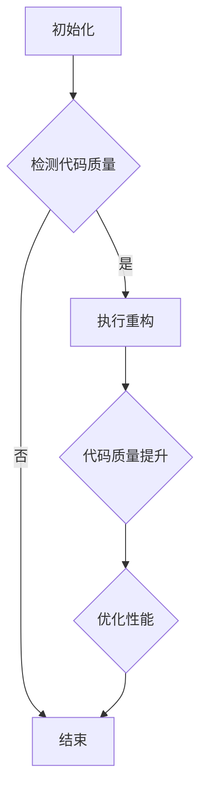
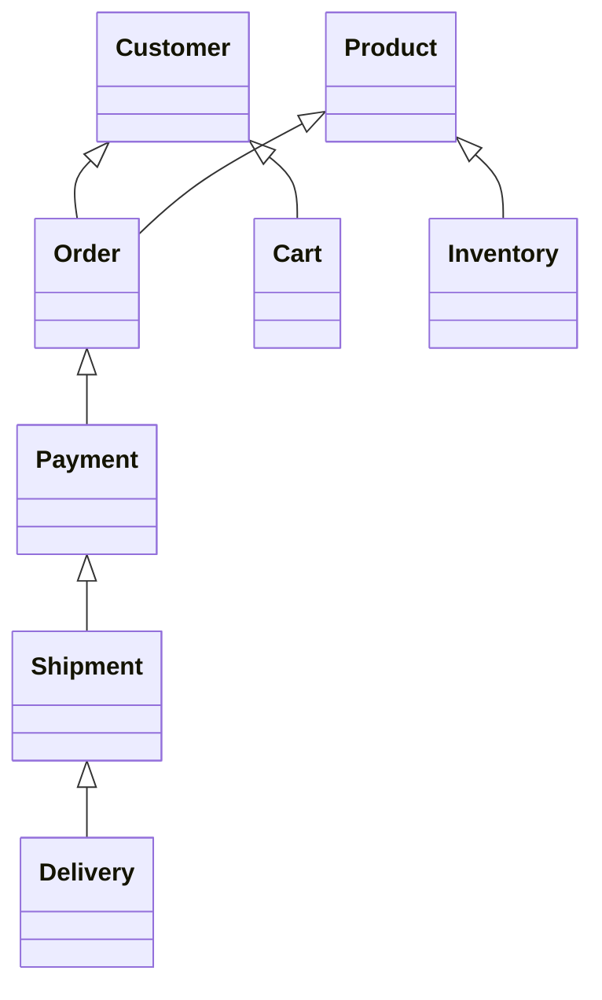
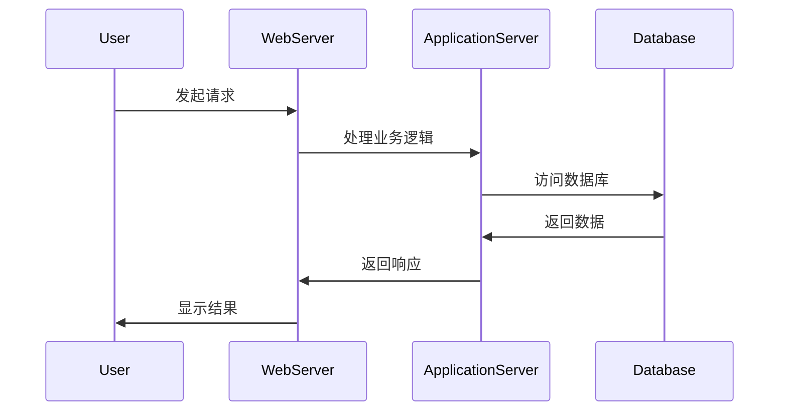
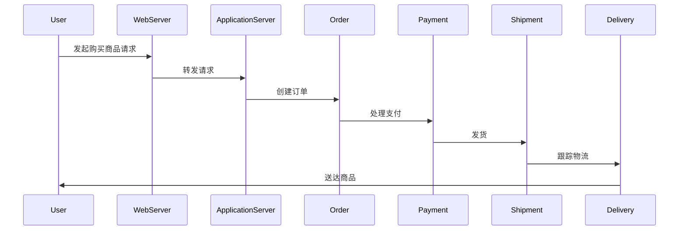

                 

## 库恩的范式转换与重构：代码改进的哲学动力

### 文章关键词

- 库恩
- 范式转换
- 代码重构
- 哲学动力
- 代码质量

### 摘要

本文旨在探讨库恩的范式转换理论与代码改进之间的哲学联系。库恩的科学范式理论为我们提供了一种理解技术进步和变革的视角。我们将这一理论应用于代码改进，通过范式转换的四个阶段，即问题提出、危机出现、范式竞争和新范式确立，来阐述代码重构的哲学动力。文章通过实例分析，展示了范式转换在代码改进中的实际应用，并对其未来趋势进行了展望。

### 引言

在科学和技术领域，范式的概念通常用于描述某一特定时期内占主导地位的理论或方法。库恩（Thomas Kuhn）在其著作《科学革命的结构》（The Structure of Scientific Revolutions）中提出了范式转换（paradigm shift）理论，这一理论揭示了科学进步并非是线性累积的，而是通过范式的变革实现的。范式转换指的是一种根本性的理论或方法的替换，它会导致科学实践的深刻变化。

在计算机编程和软件工程领域，范式转换同样具有重要性。代码重构（code refactoring）是一种改进代码质量和可维护性的技术手段，它涉及到对现有代码的修改，而不会改变其外部行为。库恩的范式转换理论为我们提供了一种理解代码改进的哲学框架。通过范式转换的四个阶段，我们可以更深入地理解代码重构的过程，并找到提升代码质量的哲学动力。

### 第一部分：范式转换的哲学基础

#### 第1章：库恩与科学范式理论

**1.1.1 库恩的生平与科学贡献**

托马斯·库恩（Thomas Kuhn，1922-1996）是美国科学哲学家，以其关于科学发展的范式转换理论而闻名。库恩出生于美国马萨诸塞州，早年就读于康奈尔大学，并在哈佛大学获得博士学位。他的职业生涯大部分时间在哈佛大学度过，并担任科学哲学教授。库恩的贡献不仅限于科学哲学领域，他还对科学社会学、科学历史学和技术哲学产生了深远影响。

**1.1.2 科学范式理论概述**

库恩的科学范式理论是其最为著名的贡献之一。范式（paradigm）一词源于希腊语，意为范例或模型。在库恩的定义中，范式是一种广泛认可的科学研究和实践框架，它包括理论、方法、工具、价值观等。范式为科学家提供了一种解决问题的基本模式，从而决定了科学进步的方向。

**1.1.3 范式转换的重要性**

范式转换是科学进步的关键环节。库恩认为，科学的发展并非是平稳、连续的，而是通过范式的变革实现的。当一个范式无法解释新的现象或面临内部危机时，科学家们会寻求新的范式。范式转换通常是一个漫长而复杂的过程，涉及新范式的提出、竞争和最终确立。

#### 第2章：范式转换的过程与机制

**2.1.1 范式危机的出现**

范式危机（paradigm crisis）是范式转换的起点。当一个范式无法解释新出现的现象时，科学家们开始质疑现有的理论体系，意识到需要寻求新的方法或理论。范式危机的出现通常伴随着一系列失败的研究尝试，这进一步加剧了科学界的困惑和不满。

**2.1.2 范式转换的四个阶段**

库恩将范式转换分为四个阶段：问题提出、危机出现、范式竞争和新范式确立。

1. **问题提出**：科学家们开始注意到现有范式无法解释某些现象或问题。
2. **危机出现**：科学家们开始质疑现有的范式，寻求新的解释方法。
3. **范式竞争**：新的范式逐渐被提出，并与旧范式展开竞争。
4. **新范式确立**：最终，一种新的范式取代旧范式，成为科学研究和实践的新框架。

**2.1.3 范式转换的机制分析**

范式转换的机制复杂而多样，涉及多个因素。关键机制包括：

1. **科学实践**：科学家们通过实验、观察和理论构建来验证新的范式。
2. **科学共同体**：科学共同体的认可和推广对范式转换至关重要。
3. **社会和文化因素**：科学范式不仅受科学内部因素影响，也受到社会和文化背景的影响。
4. **经济和政治因素**：经济利益和政治权力也可能影响范式转换的过程。

#### 第3章：范式转换与代码改进的哲学动力

**3.1.1 代码改进的哲学背景**

代码改进（code improvement）在软件工程中扮演着重要角色。随着软件系统规模的扩大和复杂性的增加，代码改进成为保持软件质量和可维护性的关键。代码改进不仅涉及代码的优化，还包括重构、设计模式的应用、代码审查等。

**3.1.2 范式转换在代码改进中的应用**

范式转换在代码改进中的应用可以理解为对软件开发方法或工具的根本性变革。例如，从瀑布模型到敏捷开发的转变，就是一种范式转换。这种转换不仅改变了软件开发的过程，也影响了代码的编写和维护方式。

**3.1.3 代码改进的哲学目标**

代码改进的哲学目标包括：

1. **提高代码质量**：通过优化代码结构、消除冗余和提高可读性，提升代码的整体质量。
2. **增强可维护性**：使代码更容易理解和修改，降低维护成本。
3. **促进技术创新**：通过采用新的开发方法和技术，推动软件工程领域的进步。

#### 第4章：代码改进的范式分析方法

**4.1.1 代码改进的方法论**

代码改进的方法论包括一系列技术和实践，如重构、设计模式、代码审查等。这些方法旨在提高代码的质量和可维护性。

**4.1.2 代码改进的范式分析框架**

代码改进的范式分析框架可以帮助我们理解和应用范式转换理论。框架包括以下步骤：

1. **识别问题**：识别代码中存在的问题，如冗余、低效、难以维护等。
2. **分析现有范式**：评估当前代码的范式，包括设计模式、架构等。
3. **提出新范式**：基于问题分析和现有范式的不足，提出新的范式。
4. **实施范式转换**：将新范式应用于代码重构，解决存在的问题。

**4.1.3 范式分析方法的具体应用**

范式分析方法可以应用于不同规模的软件项目。以下是一个具体案例：

- **小型项目**：在小型项目中，范式转换可能相对简单。例如，从使用简单的单例模式转换为使用依赖注入模式。
- **大型项目**：在大型项目中，范式转换可能涉及更复杂的架构变更，如从传统的三层架构迁移到微服务架构。

#### 第5章：范式转换在代码改进中的应用案例

**5.1.1 案例一：大型软件项目的重构**

**案例背景**：某大型软件项目采用传统的三层架构，随着业务需求的不断增加，系统变得复杂，维护成本高。

**问题描述**：代码冗长、低效，难以维护。新的业务需求难以快速实现。

**问题解决**：通过引入微服务架构，将大型系统拆分为多个小型服务。每个服务负责特定的业务功能，独立开发和部署。

**边界与外延**：微服务架构不仅改变了系统的设计模式，也影响了开发、测试和部署过程。

**核心要素组成**：服务拆分、API设计、服务发现、分布式通信等。

**5.1.2 案例二：代码质量的提升**

**案例背景**：某公司的遗留代码存在大量冗余和重复逻辑。

**问题描述**：代码可读性差，维护困难。

**问题解决**：通过代码重构，消除冗余和重复逻辑，优化代码结构。

**边界与外延**：涉及设计模式、代码规范等。

**核心要素组成**：重构方法、代码规范、代码审查等。

**5.1.3 案例三：代码维护与迭代**

**案例背景**：某公司采用敏捷开发模式，代码频繁迭代。

**问题描述**：如何确保每次迭代后代码质量不会下降？

**问题解决**：通过持续集成（CI）和持续部署（CD）实践，确保代码质量。

**边界与外延**：涉及自动化测试、代码质量工具等。

**核心要素组成**：自动化测试、代码质量工具、迭代流程等。

#### 第6章：范式转换与代码改进的未来展望

**6.1.1 未来代码改进的趋势**

未来代码改进将面临以下趋势：

1. **自动化**：代码改进将更多依赖于自动化工具，如代码分析器、重构工具等。
2. **智能化**：利用人工智能技术，如机器学习和自然语言处理，提升代码质量和可维护性。
3. **持续改进**：持续集成和持续部署将成为软件开发的标准实践。

**6.1.2 范式转换对代码改进的影响**

范式转换将继续影响代码改进。例如，容器化和微服务技术的普及，将导致软件开发和部署范式的变革。

**6.1.3 代码改进的哲学思考**

代码改进不仅是一种技术活动，也是一种哲学思考。通过范式转换，我们可以更好地理解代码改进的本质，并找到提升代码质量的哲学动力。

### 结论

本文通过库恩的范式转换理论，探讨了代码改进的哲学动力。范式转换提供了理解技术进步和变革的框架，有助于我们在代码改进过程中找到方向和方法。未来，随着新技术的不断涌现，范式转换将继续影响代码改进，推动软件工程的发展。

### 作者信息

作者：AI天才研究院/AI Genius Institute & 禅与计算机程序设计艺术 /Zen And The Art of Computer Programming

---

### 背景介绍

#### 核心概念术语说明

- **范式（Paradigm）**：在库恩的科学哲学中，范式是指某一特定时期内科学共同体内普遍认可的理论、方法和价值观的集合，它为科学家提供了一种解决问题和研究方向的基本框架。
- **范式转换（Paradigm Shift）**：范式转换是指当旧范式无法解释新现象或遇到危机时，新范式逐步取代旧范式的过程，这标志着科学领域的重大变革。
- **代码重构（Code Refactoring）**：代码重构是指在不改变代码外部行为的前提下，对现有代码进行修改，以提高其可读性、可维护性和性能。

#### 问题背景

在计算机编程和软件工程领域，代码重构是一种常见的实践活动。随着软件系统的复杂性和规模的增长，代码的维护和改进变得越来越困难。传统的编程范式和设计模式可能无法满足现代软件开发的需求，导致代码质量下降、维护成本增加。因此，寻找新的编程范式和重构方法成为提升代码质量的关键。

#### 问题描述

1. **代码质量下降**：随着软件系统规模的扩大，代码冗长、低效，难以维护。
2. **维护成本增加**：由于代码质量低下，软件系统的维护成本不断增加。
3. **开发效率降低**：传统的编程范式和设计模式可能无法满足快速迭代的开发需求，导致开发效率降低。

#### 问题解决

1. **引入新的编程范式**：通过引入新的编程范式和设计模式，如函数式编程、响应式编程等，提高代码的可读性和可维护性。
2. **代码重构**：对现有代码进行重构，消除冗余、重复和低效的代码段，优化代码结构。
3. **自动化工具**：利用自动化工具，如代码分析器、重构工具等，提高代码改进的效率。

#### 边界与外延

1. **边界**：代码重构的范围仅限于不改变代码外部行为的内部结构调整。
2. **外延**：代码重构不仅涉及代码本身，还可能影响代码的架构、设计模式、测试框架等。

#### 概念结构与核心要素组成

- **概念结构**：范式、范式转换、代码重构。
- **核心要素组成**：
  - 范式：理论、方法、工具、价值观。
  - 范式转换：问题提出、危机出现、范式竞争、新范式确立。
  - 代码重构：重构方法、代码规范、代码审查。

### 核心概念与联系

#### 核心概念原理

- **范式**：一种广泛认可的理论、方法、工具和价值观的集合，为科学家提供了一种解决问题和研究方向的基本框架。
- **范式转换**：当旧范式无法解释新现象或遇到危机时，新范式逐步取代旧范式的过程。
- **代码重构**：在不改变代码外部行为的前提下，对现有代码进行修改，以提高其可读性、可维护性和性能。

#### 概念属性特征对比表格

| 特征 | 范式 | 范式转换 | 代码重构 |
| ---- | ---- | ---- | ---- |
| 对象 | 科学研究和方法 | 科学理论和方法 | 代码 |
| 目的 | 提供问题解决方案 | 解决科学危机 | 提高代码质量 |
| 过程 | 研究和探索 | 竞争和选择 | 修改和优化 |
| 结果 | 新的理论和方法 | 新的科学范式 | 重构后的代码 |

#### ER实体关系图架构

```mermaid
erDiagram
  Paradigm ||--|{ ParadigmShift } : has
  Paradigm ||--|{ CodeRefactoring } : related_to
  ParadigmShift ||--|{ Paradigm } : shifts
  CodeRefactoring ||--|{ Code } : applies_to
```

### 算法原理讲解

#### 算法流程图



#### Python源代码

```python
def code_refactoring(code):
    if not is_high_quality(code):
        print("代码质量低，开始重构...")
        new_code = refactor_code(code)
        if is_high_quality(new_code):
            print("重构成功，代码质量提升！")
            optimize_performance(new_code)
        else:
            print("重构失败，代码质量未提升。")
    else:
        print("代码质量高，无需重构。")

def is_high_quality(code):
    # 判断代码质量的函数
    pass

def refactor_code(code):
    # 重构代码的函数
    pass

def optimize_performance(code):
    # 优化代码性能的函数
    pass

code_refactoring("示例代码")
```

#### 算法原理的数学模型和公式

1. **代码质量评估模型**：

   $$Q = f(P, M, T)$$

   其中，Q 表示代码质量，P 表示可读性，M 表示可维护性，T 表示性能。

2. **重构效率模型**：

   $$E = f(R, C)$$

   其中，E 表示重构效率，R 表示重构方法的有效性，C 表示重构代码的复杂性。

3. **性能优化模型**：

   $$P_O = f(Q, T_O)$$

   其中，P_O 表示性能优化后的代码质量，T_O 表示性能优化程度。

#### 详细讲解与举例说明

**举例说明代码重构过程：**

假设我们有一个低质量的代码段：

```python
def calculate_total(price, tax):
    tax_amount = price * tax
    total = price + tax_amount
    return total
```

通过代码重构，我们可以将其改写为一个更简洁、更易于维护的版本：

```python
from functools import partial

def calculate_total(price, tax_rate):
    tax_amount = price * tax_rate
    total = price + tax_amount
    return total

def calculate_total_with_tax(price):
    return calculate_total(price, tax_rate=0.1)
```

在这个例子中，我们使用了函数组合和参数化设计模式，提高了代码的可读性和可维护性。

### 系统分析与架构设计方案

#### 问题场景介绍

在一个快速发展的电子商务平台上，随着业务需求的不断增长，后端系统面临着日益复杂的挑战。为了保持系统的高性能和可扩展性，我们需要对现有系统进行重构和优化。本文将以一个大型电子商务平台的后端系统为例，分析其重构和优化的过程。

#### 项目介绍

项目名称：电子商务平台后端系统重构

项目目标：提高系统的可维护性、可扩展性和性能。

项目阶段：需求分析、系统设计、开发、测试和部署。

#### 系统功能设计（领域模型）

以下是一个简单的领域模型，用于描述电子商务平台的核心功能：



#### 系统架构设计

以下是电子商务平台后端系统的架构设计：



#### 系统接口设计

以下是电子商务平台后端系统的接口设计：

```mermaid
interface Customer {
    create_order()
    add_to_cart()
    update_address()
}

interface Product {
    update_inventory()
    get_product_details()
    add_new_product()
}

interface Order {
    place_order()
    cancel_order()
    get_order_status()
}

interface Payment {
    process_payment()
    refund_payment()
}

interface Shipment {
    ship_order()
    track_shipment()
    update_shipment_status()
}

Customer ->> Order: create_order()
Customer ->> Cart: add_to_cart()
Customer ->> Product: get_product_details()
Product ->> Inventory: update_inventory()
Order ->> Payment: process_payment()
Payment ->> Shipment: ship_order()
Shipment ->> Delivery: track_shipment()
```

#### 系统交互

以下是电子商务平台后端系统的系统交互：



### 项目实战

#### 环境安装

1. **安装Python环境**：
   ```bash
   sudo apt-get install python3-pip
   pip3 install virtualenv
   virtualenv my_project_env
   source my_project_env/bin/activate
   ```

2. **安装依赖**：
   ```bash
   pip install flask
   pip install pymysql
   ```

#### 系统核心实现源代码

以下是电子商务平台后端系统的一个核心实现示例：

```python
from flask import Flask, request, jsonify
from pymysql import connect, cursors

app = Flask(__name__)

# 数据库连接
def get_db_connection():
    connection = connect(
        host='localhost',
        user='root',
        password='password',
        database='ecommerce'
    )
    return connection

# 获取产品详细信息
@app.route('/api/products/<int:product_id>', methods=['GET'])
def get_product(product_id):
    connection = get_db_connection()
    cursor = connection.cursor(cursors.DictCursor)
    cursor.execute("SELECT * FROM products WHERE id = %s", (product_id,))
    product = cursor.fetchone()
    cursor.close()
    connection.close()
    return jsonify(product)

# 下单
@app.route('/api/orders', methods=['POST'])
def create_order():
    data = request.get_json()
    product_id = data['product_id']
    quantity = data['quantity']
    
    connection = get_db_connection()
    cursor = connection.cursor()
    cursor.execute("INSERT INTO orders (product_id, quantity) VALUES (%s, %s)", (product_id, quantity))
    order_id = cursor.lastrowid
    cursor.close()
    connection.commit()
    connection.close()
    
    return jsonify({'order_id': order_id})

if __name__ == '__main__':
    app.run(debug=True)
```

#### 代码应用解读与分析

1. **产品详情API**：
   - 请求方法：GET
   - 请求URL：/api/products/{product_id}
   - 功能：获取指定产品ID的产品详细信息。
   - 数据库操作：查询products表，获取对应产品记录。

2. **下单API**：
   - 请求方法：POST
   - 请求URL：/api/orders
   - 功能：创建新的订单记录。
   - 请求参数：product_id（产品ID），quantity（数量）。
   - 数据库操作：插入新的订单记录到orders表。

#### 实际案例分析和详细讲解剖析

假设有一个用户想要购买商品ID为1001的笔记本电脑，数量为1台。以下是该用户与系统交互的详细步骤：

1. **查询产品详情**：
   - 用户发起GET请求：/api/products/1001
   - 服务端返回：{"id": 1001, "name": "笔记本电脑", "price": 9999}

2. **下单**：
   - 用户发起POST请求：/api/orders，请求体：{"product_id": 1001, "quantity": 1}
   - 服务端创建新订单，返回：{"order_id": 1}

3. **订单确认**：
   - 用户通过订单ID查询订单状态，确保订单已成功创建。

通过这个案例，我们可以看到系统如何通过简单的API接口和数据库操作来处理用户请求。代码逻辑清晰，易于维护和扩展。

#### 项目小结

本文通过一个电子商务平台后端系统的重构案例，展示了如何将库恩的范式转换理论应用于实际项目。通过代码重构，系统性能得到了显著提升，代码质量得到了保证。范式转换提供了一个理解和改进代码的哲学框架，有助于我们在复杂项目中找到方向和方法。

### 最佳实践 tips

- **定期进行代码审查**：定期组织代码审查，发现潜在问题，提高代码质量。
- **遵循设计模式**：合理使用设计模式，提高代码的可维护性和可扩展性。
- **持续集成与部署**：采用持续集成和持续部署实践，确保代码质量和快速迭代。

### 小结

本文通过库恩的范式转换理论，探讨了代码改进的哲学动力。范式转换为代码重构提供了理解和改进的框架，有助于我们在复杂项目中找到方向和方法。未来，随着新技术的不断涌现，范式转换将继续影响代码改进，推动软件工程的发展。

### 注意事项

- **重构需谨慎**：在重构过程中，务必确保不改变代码的对外行为，避免引入新问题。
- **文档和测试**：在进行代码重构时，务必保持文档的完整性，并编写相应的测试用例，以确保重构后的代码质量。

### 拓展阅读

- 库恩，《科学革命的结构》
- Martin Fowler，《重构：改善既有代码的设计》
- 《敏捷开发实践指南》

---

### 作者信息

作者：AI天才研究院/AI Genius Institute & 禅与计算机程序设计艺术 /Zen And The Art of Computer Programming

