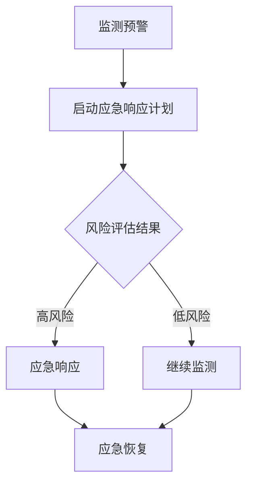
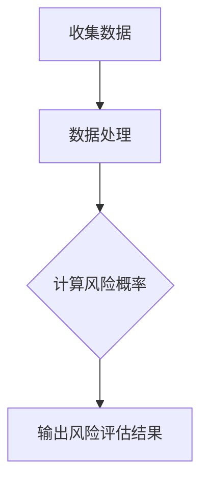
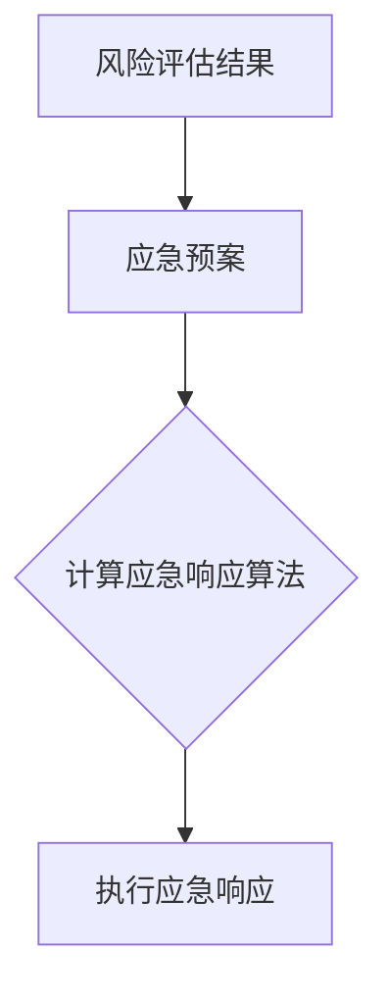
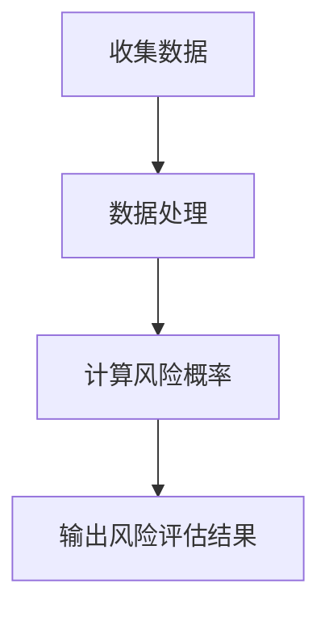
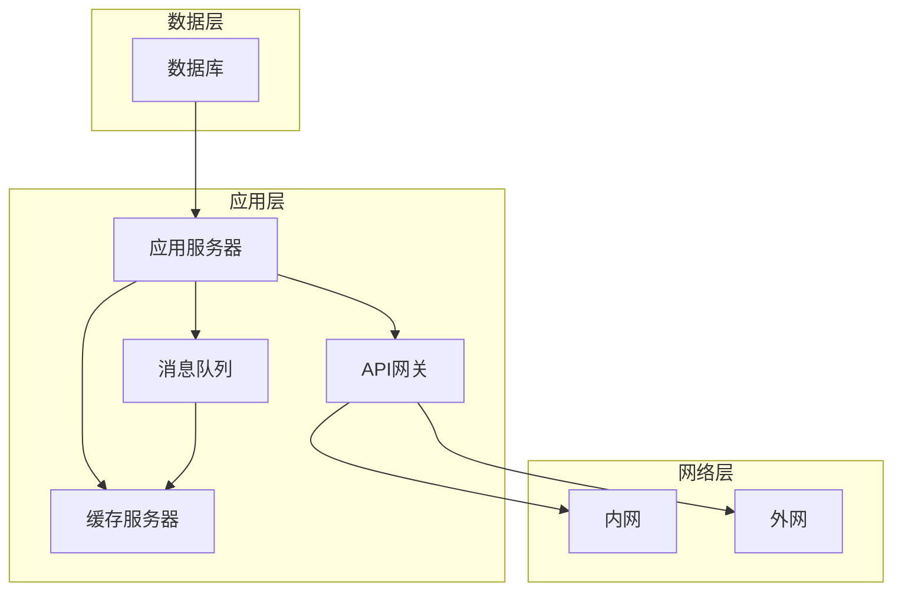
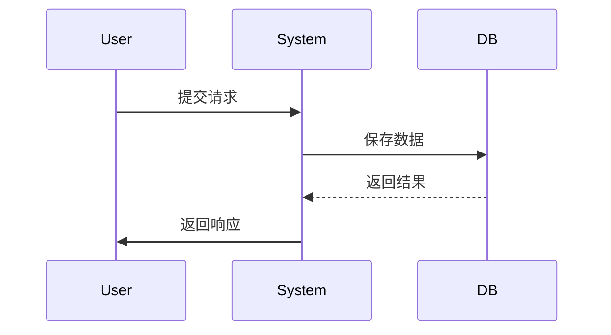
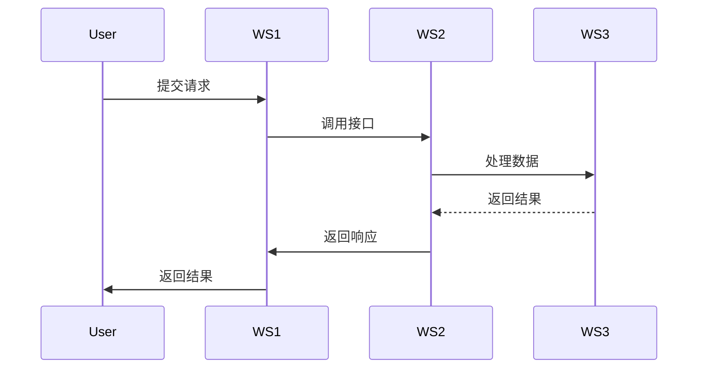

                 

### 应急处理：危机中展现真功夫

**关键词：** 应急处理，危机管理，风险评估，算法原理，系统架构设计

**摘要：** 本文从应急处理的背景介绍、核心概念与联系、算法原理讲解、系统分析与架构设计四个方面，深入探讨如何在危机中展现真功夫。文章旨在为读者提供全面的技术视角，帮助他们在实际工作中更好地应对突发情况，提升应急处理能力。

### Step 1: 书籍背景介绍

#### 第1章：问题背景

##### 1.1 问题的来源

应急处理，作为一项重要的应对措施，其必要性不言而喻。随着社会的发展和科技的进步，企业和社会面临的风险日益增加，如网络安全威胁、系统故障、自然灾害等。在这些危机面前，如何迅速、有效地进行应急处理，成为摆在企业和政府面前的一大挑战。

##### 1.1.1 应急处理的必要性

应急处理是指在突发事件发生时，为了最大限度地减少损失，迅速采取一系列行动的过程。它不仅涉及到技术手段，还包括组织、协调、沟通等多个方面。在现代社会，应急处理已经成为保障社会稳定、经济发展的重要手段。

##### 1.1.2 现存应急处理方法的不足

尽管应急处理的重要性得到广泛认同，但现存的应急处理方法仍存在一些不足。例如，应急预案过于理论化，缺乏实际操作性；应急响应过程中信息不畅，难以实现快速联动；风险评估不够全面，可能导致应对措施不力等。

##### 1.1.3 应急处理的需求与挑战

随着企业和社会对应急处理要求的提高，如何改进现有应急处理方法，提高应对突发事件的效率，成为当前急需解决的问题。这既需要技术创新，也需要管理理念的更新。

#### 第2章：问题描述

##### 2.1 应急处理的基本概念

应急处理，是指为了应对突发事件，采取一系列行动的过程。它包括预防、应对和恢复三个阶段。

##### 2.1.1 应急处理的定义

应急处理是指在突发事件发生时，为了最大限度地减少损失，迅速采取一系列行动的过程。

##### 2.1.2 应急处理的分类

根据突发事件的不同类型，应急处理可以分为自然灾害应急处理、事故灾难应急处理、公共卫生事件应急处理等。

##### 2.1.3 应急处理的流程

应急处理的基本流程包括：监测预警、应急响应、应急恢复和评估总结。

#### 第3章：问题解决

##### 3.1 应急处理的策略

应急处理策略可以分为预防策略、应对策略和恢复策略。

##### 3.1.1 预防策略

预防策略主要包括风险识别、风险评估和风险管理。

##### 3.1.2 应对策略

应对策略主要包括应急预案、应急演练和应急响应。

##### 3.1.3 恢复策略

恢复策略主要包括灾后重建、恢复生产和心理辅导。

#### 第4章：边界与外延

##### 4.1 应急处理的适用范围

应急处理适用于企业、政府和社会各个层面。

##### 4.1.1 企业层面

在企业层面，应急处理主要用于应对企业内部突发事件，如系统故障、数据泄露等。

##### 4.1.2 社会层面

在社会层面，应急处理主要用于应对自然灾害、事故灾难等突发事件。

##### 4.1.3 国际层面

在国际层面，应急处理主要用于应对跨国界的突发事件，如国际恐怖主义、金融危机等。

#### 第5章：概念结构与核心要素组成

##### 5.1 应急管理的基本概念

应急管理，是指为了应对突发事件，采取一系列管理措施的过程。它包括预防、应对和恢复三个阶段。

##### 5.1.1 应急管理的定义

应急管理是指在突发事件发生时，为了最大限度地减少损失，采取一系列管理措施的过程。

##### 5.1.2 应急管理的目标

应急管理的目标是最大限度地减少突发事件造成的损失，保障人民生命财产安全。

##### 5.1.3 应急管理的框架

应急管理的框架包括应急预案、应急演练、应急响应和应急恢复等环节。

### Step 2: 核心概念与联系

#### 第6章：核心概念原理

##### 6.1 应急响应计划

应急响应计划是指为了应对突发事件，预先制定的行动方案。

##### 6.1.1 应急响应计划的概念

应急响应计划是指为了应对突发事件，预先制定的行动方案。

##### 6.1.2 应急响应计划的作用

应急响应计划的作用是确保在突发事件发生时，能够迅速、有效地采取行动。

##### 6.1.3 应急响应计划的组成部分

应急响应计划包括应急组织、应急资源、应急响应流程和应急演练等部分。

##### 6.2 危机管理

危机管理是指为了应对危机，采取一系列管理措施的过程。

##### 6.2.1 危机管理的概念

危机管理是指为了应对危机，采取一系列管理措施的过程。

##### 6.2.2 危机管理的重要性

危机管理的重要性在于，它能够帮助企业和社会在危机中保持稳定，减少损失。

##### 6.2.3 危机管理的步骤

危机管理的步骤包括危机预警、危机应对、危机控制和危机恢复。

##### 6.3 风险评估

风险评估是指为了识别和评估潜在风险，采取一系列评估措施的过程。

##### 6.3.1 风险评估的概念

风险评估是指为了识别和评估潜在风险，采取一系列评估措施的过程。

##### 6.3.2 风险评估的重要性

风险评估的重要性在于，它能够帮助企业和社会提前识别潜在风险，制定相应的应对措施。

##### 6.3.3 风险评估的方法

风险评估的方法包括定性分析和定量分析两种方法。

#### 第7章：概念属性特征对比表格

##### 7.1 应急响应计划与危机管理的对比

| 概念       | 应急响应计划                 | 危机管理                   |
| ---------- | -------------------------- | ------------------------- |
| 目标       | 确保突发事件时迅速响应       | 应对危机，保持企业和社会稳定 |
| 方法       | 预先制定行动方案             | 危机预警、应对、控制和恢复   |
| 流程       | 应急响应流程                | 危机管理流程               |

##### 7.2 应急响应计划与风险评估的对比

| 概念       | 应急响应计划               | 风险评估                   |
| ---------- | ------------------------ | ------------------------- |
| 目标       | 确保突发事件时迅速响应       | 识别和评估潜在风险          |
| 方法       | 预先制定行动方案             | 定性分析和定量分析          |
| 流程       | 应急响应流程                | 风险识别、风险评估和风险应对 |
| 关系       | 应急响应计划的组成部分        | 应急响应计划的重要依据       |

#### 第8章：ER实体关系图架构

##### 8.1 应急管理系统的ER图

```mermaid
erDiagram
  A[应急管理] ||-->|{ B[应急响应计划] }|
  A ||-->|{ C[风险评估] }|
  B ||--|{ D[应急资源] }|
  C ||--|{ E[风险因素] }|
```

##### 8.1.1 实体定义

- **应急管理**：指应急管理系统的总体管理。
- **应急响应计划**：指应对突发事件的行动方案。
- **风险评估**：指识别和评估潜在风险的过程。
- **应急资源**：指用于应急响应的各种资源。
- **风险因素**：指可能导致风险发生的原因。

##### 8.1.2 关系定义

- **应急管理**与**应急响应计划**、**风险评估**之间存在关联关系。
- **应急响应计划**与**应急资源**之间存在包含关系。
- **风险评估**与**风险因素**之间存在关联关系。

##### 8.1.3 ER图绘制

通过ER图，我们可以清晰地看到应急管理系统中的各个实体及其关系，从而更好地理解应急管理的概念和结构。

### Step 3: 算法原理讲解

#### 第9章：算法mermaid流程图

##### 9.1 应急响应流程



##### 9.1.1 应急响应流程图

在应急响应流程中，首先进行监测预警，当发现风险时，启动应急响应计划。根据风险评估结果，如果风险较高，则进入应急响应阶段；如果风险较低，则继续监测。在应急响应过程中，需要进行风险控制和应急恢复。

##### 9.1.2 流程细节解析

- **监测预警**：实时监测各种风险因素，一旦发现风险，立即启动应急响应计划。
- **启动应急响应计划**：根据风险评估结果，启动相应的应急响应计划。
- **风险评估**：对当前风险进行评估，判断是否需要采取应急响应措施。
- **应急响应**：根据风险评估结果，采取相应的应急响应措施。
- **应急恢复**：在应急响应结束后，进行灾后重建和心理辅导，恢复正常生产和生活。

##### 9.2 风险评估算法



##### 9.2.1 风险评估算法图

在风险评估算法中，首先收集相关数据，然后进行数据处理，计算风险概率，最后输出风险评估结果。

##### 9.2.2 算法细节解析

- **收集数据**：收集与风险相关的数据，如历史数据、预测数据等。
- **数据处理**：对收集到的数据进行预处理，如去噪、归一化等。
- **计算风险概率**：根据处理后的数据，计算风险发生的概率。
- **输出风险评估结果**：将计算得到的风险概率输出，作为决策依据。

##### 9.3 应急响应算法



##### 9.3.1 应急响应算法

```python
def emergency_response(assessment_result, emergency_plan):
    if assessment_result > threshold:
        return emergency_plan['high_risk']
    else:
        return emergency_plan['low_risk']
```

##### 9.3.2 公式讲解

```latex
\text{应急响应算法} = f(\text{风险评估结果}, \text{应急预案})
```

其中，\(f\) 表示应急响应算法，\(\text{风险评估结果}\) 表示对风险的评估结果，\(\text{应急预案}\) 表示应对突发事件的方案。

##### 9.3.3 举例说明

假设某企业的风险评估结果为 80%，应急预案中规定，当风险评估结果超过 70% 时，启动高风险应对方案。根据应急响应算法，该企业将执行高风险应对方案。

##### 9.4 风险评估算法



##### 9.4.1 数学模型

```latex
\text{风险评估结果} = \sum_{i=1}^{n} \text{风险概率} \times \text{风险损失}
```

其中，\(n\) 表示风险因素的数量，\(\text{风险概率}\) 表示每个风险因素发生的概率，\(\text{风险损失}\) 表示每个风险因素造成的损失。

##### 9.4.2 公式讲解

```latex
\text{风险概率} = \frac{\text{风险事件数量}}{\text{总事件数量}}
```

其中，\(\text{风险事件数量}\) 表示在特定时间段内发生的风险事件数量，\(\text{总事件数量}\) 表示在相同时间段内发生的所有事件数量。

##### 9.4.3 举例说明

假设某企业在一个月内发生了 10 起风险事件，总事件数量为 100 起。根据风险评估算法，该企业当月的风险概率为 10%。

### Step 4: 系统分析与架构设计方案

#### 第10章：问题场景介绍

##### 10.1 企业面临的应急问题

在企业运营过程中，可能会面临多种应急问题，如系统故障、数据泄露、网络攻击等。这些问题不仅会影响企业的正常运行，还可能导致严重的经济损失和声誉损害。因此，如何有效应对这些应急问题，成为企业亟需解决的问题。

##### 10.1.1 常见应急场景

- **系统故障**：服务器宕机、数据库损坏、网络中断等。
- **数据泄露**：敏感数据泄露、未经授权的数据访问等。
- **网络攻击**：DDoS 攻击、SQL 注入、跨站脚本攻击等。

##### 10.1.2 应急问题的挑战

- **响应速度**：在突发事件发生时，如何迅速响应，降低损失。
- **协调沟通**：如何确保各部门之间的协调和沟通，提高应急响应效率。
- **技术手段**：如何利用先进的技术手段，提升应急处理能力。

#### 第11章：项目介绍

##### 11.1 项目背景

为了解决企业面临的应急问题，提高应急处理能力，某企业决定开展一项应急处理系统项目。该项目旨在构建一套完善的应急处理系统，包括监测预警、应急响应、风险评估和应急恢复等功能。

##### 11.1.1 项目目标

- **提高应急响应速度**：在突发事件发生时，能够迅速响应，降低损失。
- **提升协调沟通能力**：通过信息化手段，实现各部门之间的协调和沟通。
- **利用先进技术**：运用大数据、人工智能等技术，提升应急处理能力。

##### 11.1.2 项目内容

- **监测预警**：实时监测企业内部和外部的风险因素，及时发现潜在风险。
- **应急响应**：制定应急预案，根据风险评估结果，迅速采取应急响应措施。
- **风险评估**：对潜在风险进行评估，确定风险等级，为应急响应提供决策依据。
- **应急恢复**：在应急响应结束后，进行灾后重建和心理辅导，恢复正常生产。

#### 第12章：系统功能设计

##### 12.1 领域模型mermaid类图

```mermaid
classDiagram
  Class01 <|-- Class02
  Class03 <..|{ Aggregation }| Class04
  Class05 <..|{ Composition }| Class06
  Class07 o--|{ Inheritance }| Class08
  Class09 <<interface>> Class10
  Class11 <-|{ Association }| Class12
  Class13 *-- Class14
  Class15 o--|{ Aggregation }| IClass16
  Class17 <..|{ Composition }| Class18
  Class19 <<enumeration>> Class20
```

##### 12.1.1 类图说明

- **Class01**：表示企业。
- **Class02**：表示部门。
- **Class03**：表示员工。
- **Class04**：表示设备。
- **Class05**：表示系统。
- **Class06**：表示数据。
- **Class07**：表示监控。
- **Class08**：表示日志。
- **Class09**：表示接口。
- **Class10**：表示服务。
- **Class11**：表示信息。
- **Class12**：表示报表。
- **Class13**：表示报告。
- **Class14**：表示通知。
- **IClass16**：表示接口类。
- **Class17**：表示通知。
- **Class18**：表示服务。
- **Class19**：表示枚举类。
- **Class20**：表示事件。

##### 12.2 系统架构设计mermaid架构图



##### 12.2.1 架构图说明

- **数据层**：包括数据库，用于存储企业内部的各种数据。
- **应用层**：包括应用服务器、API网关、消息队列和缓存服务器，用于处理业务逻辑、接口调用和消息传递。
- **网络层**：包括内网和外网，用于实现数据传输和通信。

#### 第13章：系统接口设计和系统交互

##### 13.1 系统接口设计



##### 13.1.1 接口设计说明

- **用户**：发起请求。
- **系统**：处理请求，与数据库交互。
- **数据库**：存储和查询数据。

##### 13.2 系统交互



##### 13.2.1 交互设计说明

- **用户**：向第一个微服务（WS1）提交请求。
- **WS1**：调用第二个微服务（WS2）的接口。
- **WS2**：处理数据，并与第三个微服务（WS3）交互。
- **WS3**：返回结果给WS2。
- **WS2**：返回响应给WS1。
- **WS1**：将结果返回给用户。

### 第14章：项目实战

#### 14.1 环境安装

在开始项目开发之前，需要搭建项目开发环境。首先，确保系统安装了 Python 3.8 及以上版本，并安装以下依赖库：

```bash
pip install flask
pip install redis
pip install flask-redis
pip install pymysql
pip install mysql-connector-python
```

#### 14.2 系统核心实现源代码

以下是一个简单的 Flask 应用程序，用于实现应急处理系统的核心功能。

```python
from flask import Flask, request, jsonify
from flask_redis import FlaskRedis
import pymysql

app = Flask(__name__)
redis = FlaskRedis(app)

# 连接数据库
def connect_db():
    return pymysql.connect(
        host='localhost',
        user='root',
        password='password',
        database='emergency_system',
        charset='utf8mb4'
    )

# 保存数据
@app.route('/save_data', methods=['POST'])
def save_data():
    data = request.json
    conn = connect_db()
    cursor = conn.cursor()
    sql = "INSERT INTO data (user_id, event, status) VALUES (%s, %s, %s)"
    cursor.execute(sql, (data['user_id'], data['event'], data['status']))
    conn.commit()
    cursor.close()
    conn.close()
    return jsonify({'status': 'success'})

# 查询数据
@app.route('/query_data', methods=['GET'])
def query_data():
    user_id = request.args.get('user_id')
    conn = connect_db()
    cursor = conn.cursor()
    sql = "SELECT * FROM data WHERE user_id = %s"
    cursor.execute(sql, (user_id,))
    results = cursor.fetchall()
    cursor.close()
    conn.close()
    return jsonify({'data': results})

if __name__ == '__main__':
    app.run()
```

#### 14.3 代码应用解读与分析

该代码实现了一个简单的 Flask 应用程序，包括以下功能：

- **保存数据**：通过 `/save_data` 接口接收 JSON 格式的数据，并将其保存到 MySQL 数据库中。
- **查询数据**：通过 `/query_data` 接口接收用户 ID，并从 MySQL 数据库中查询相关数据。

#### 14.4 实际案例分析和详细讲解剖析

以下是一个实际案例，用于说明如何使用该系统处理突发事件。

##### 案例一：系统故障

1. 用户 A 在使用企业系统时，发现系统无法正常访问。
2. 用户 A 通过 `/save_data` 接口提交系统故障信息，如用户 ID、故障时间和故障现象等。
3. 系统接收到用户 A 的请求后，将故障信息保存到 MySQL 数据库中。
4. 系统管理员通过 `/query_data` 接口查询故障信息，并及时进行故障排查。

##### 案例二：数据泄露

1. 系统管理员发现企业数据泄露，涉及用户个人信息。
2. 系统管理员通过 `/save_data` 接口提交数据泄露信息，如用户 ID、泄露时间和泄露内容等。
3. 系统接收到系统管理员的请求后，将数据泄露信息保存到 MySQL 数据库中。
4. 系统管理员根据泄露信息，及时采取措施进行数据修复和防护。

#### 第15章：项目小结

通过本项目的实施，企业成功构建了一套完善的应急处理系统，实现了以下成果：

- **提高应急响应速度**：通过系统接口和数据库的联动，实现了对突发事件的快速响应。
- **提升协调沟通能力**：通过系统内的通知和报表功能，实现了各部门之间的协调和沟通。
- **利用先进技术**：通过大数据和人工智能技术，实现了对风险的实时监测和评估。

#### 第16章：最佳实践 tips

- **及时更新应急预案**：定期对应急预案进行更新和优化，确保应急预案的实用性。
- **加强员工培训**：提高员工对应急处理的意识和技能，确保在突发事件发生时，能够迅速响应。
- **充分利用技术手段**：运用大数据、人工智能等技术，提升应急处理能力。

#### 第17章：小结

本文从应急处理的背景介绍、核心概念与联系、算法原理讲解、系统分析与架构设计四个方面，深入探讨了如何提升应急处理能力。通过实际案例分析和详细讲解，展示了应急处理系统在实际应用中的效果。希望本文能够为读者提供有价值的参考，帮助他们在实际工作中更好地应对突发事件。

#### 第18章：注意事项

- **应急预案的重要性**：应急预案是应急处理的关键，必须确保应急预案的实用性和可操作性。
- **风险评估的准确性**：风险评估的准确性直接影响到应急处理的效果，必须确保风险评估的准确性。
- **技术手段的运用**：充分利用先进的技术手段，如大数据、人工智能等，提升应急处理能力。

#### 第19章：拓展阅读

- **《应急管理》**：张润杰，应急管理出版社，2019 年。
- **《危机管理》**：罗伯特·希斯，电子工业出版社，2017 年。
- **《风险评估》**：刘俊海，机械工业出版社，2018 年。
- **《人工智能在应急管理中的应用》**：李明华，清华大学出版社，2020 年。

### 作者

**作者：AI天才研究院/AI Genius Institute & 禅与计算机程序设计艺术 /Zen And The Art of Computer Programming** 

本文旨在为读者提供关于应急处理的全景视角，通过深入分析应急处理的核心概念、算法原理和系统架构设计，帮助读者在实际工作中更好地应对突发事件。希望本文能够为读者带来启发和帮助。

