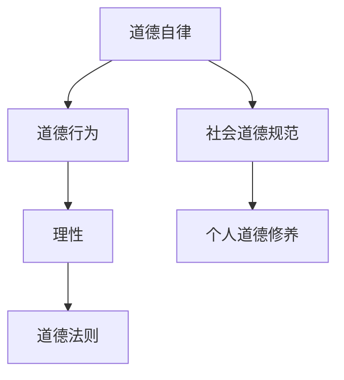
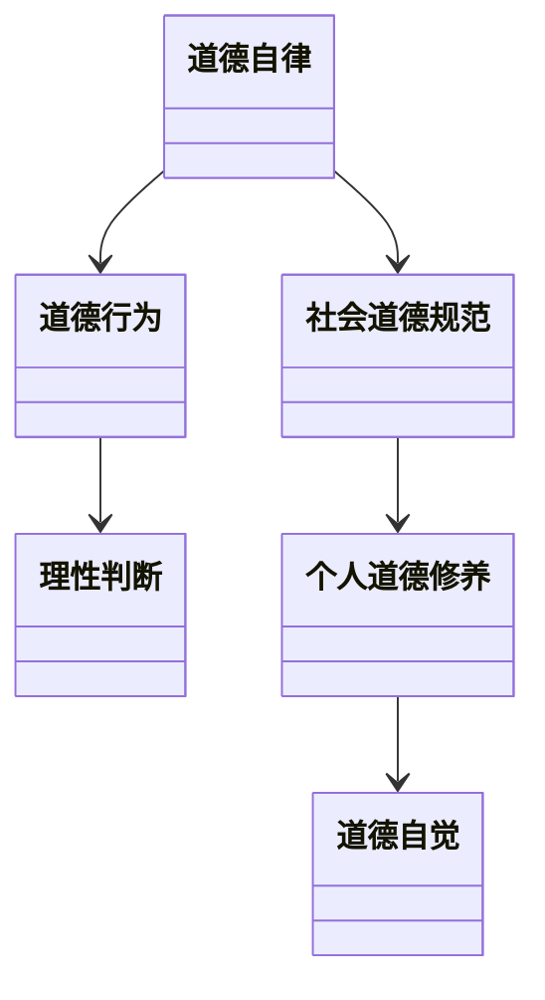
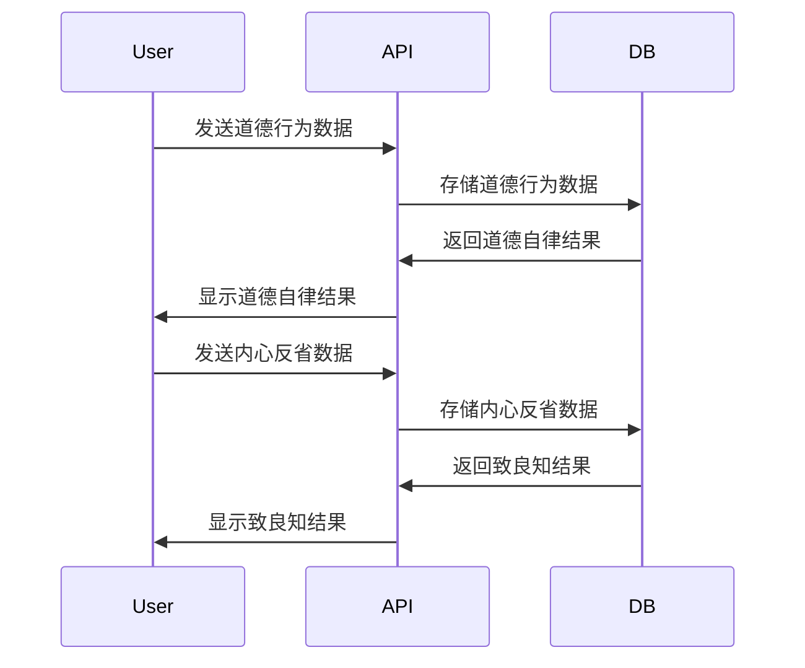

                 


### 康德与王阳明：道德自律与致良知的伦理学

关键词：道德自律，致良知，伦理学，康德，王阳明，社会实践

摘要：本文旨在通过深入分析康德与王阳明的道德伦理学思想，探讨道德自律与致良知的内涵及其在现代社会中的实践与应用。通过对两位哲学家的思想进行对比研究，本文试图揭示其在当代伦理学中的价值，为解决现代社会的道德困境提供理论依据与实践指导。

#### 第1章: 引言与背景介绍

**1.1 问题的背景**

在快速发展的现代社会，伦理道德问题日益突出，如道德自律缺失、道德责任感淡漠、诚信危机等。这些问题不仅影响个人生活，也对整个社会产生了深远的影响。为了解决这些问题，我们需要深入探讨道德自律与致良知的伦理学基础。

**1.2 问题解决**

本文通过研究康德与王阳明的伦理学思想，试图从哲学层面探讨道德自律与致良知的内涵，为解决现代社会的道德困境提供理论支持。康德的道德自律理论强调理性在道德行为中的作用，而王阳明的致良知理论则强调内心光明与道德自觉的统一。通过对比分析，本文旨在揭示两者在道德伦理学中的价值。

**1.3 边界与外延**

伦理学理论在个人、社会与人类历史进程中都具有重要应用。本文主要关注道德自律与致良知在个人道德修养、社会道德规范及伦理学理论框架中的实践与应用。

**1.4 核心要素组成**

本文的核心要素包括道德自律、致良知、伦理学理论框架及两者的比较研究。通过对这些核心要素的深入分析，本文旨在为读者提供一个清晰的理论框架，以便更好地理解道德自律与致良知。

#### 第2章: 康德的道德自律理论

**2.1 康德哲学的概述**

康德是德国古典哲学的奠基人之一，其哲学体系以理性主义为基础，强调人类理性的重要性。康德的伦理学思想是其哲学体系中的重要组成部分，其中道德自律是其核心观点。

**2.2 道德自律的理论分析**

道德自律是指道德行为的内在准则，它源于理性而非感性。康德认为，道德行为的正确与否取决于行为本身是否符合道德法则，而非行为的结果。以下是道德自律的定义及其在实践中的意义：

**道德自律的定义：**

$$
道德自律 = \frac{行为符合道德法则}{理性判断}
$$

**道德自律的实践意义：**

在日常生活中，道德自律要求我们遵循道德法则，无论结果如何。这种自律精神有助于培养个人的道德品质，促进社会道德进步。

**2.3 康德道德自律的实际应用**

为了更好地理解康德道德自律的实际应用，本文将结合具体案例进行分析。以下是一个案例分析：

**案例分析：**

某公司职员在处理业务时发现了一笔不合法的收入。按照道德自律的原则，他应该拒绝这笔收入，并向上级汇报情况。尽管这样做可能会给他带来一些麻烦，但他遵循了道德法则，保持了道德自律。

**道德自律的社会价值：**

康德的道德自律理论有助于提高个人的道德素养，促进社会道德进步。通过遵循道德自律，个人可以在面对道德困境时作出正确的选择，从而维护社会的公平与正义。

#### 第3章: 王阳明的致良知理论

**3.1 王阳明哲学的概述**

王阳明是明代著名的思想家、哲学家，其心学思想对中国哲学产生了深远的影响。王阳明的伦理学思想以致良知为核心，强调内心光明与道德自觉的统一。

**3.2 致良知的理论解析**

致良知是指通过内心的反省，发现并实现内心的道德自觉。王阳明认为，每个人的内心都具备良知，只要我们用心去发现和修养，就能达到道德自觉。以下是致良知的定义及其在实践中的意义：

**致良知的定义：**

$$
致良知 = \frac{内心反省}{道德自觉}
$$

**致良知的实践方法：**

王阳明提出了一系列心学修行方法，如静坐、默照等，以帮助人们实现致良知。通过这些方法，人们可以培养内心的道德自觉，从而在面对道德困境时作出正确的选择。

**3.3 致良知的现实意义**

致良知在现代社会中具有重要的现实意义。以下是一个案例分析：

**案例分析：**

在职场中，员工面临着诸多道德困境，如贪污腐败、虚假宣传等。通过致良知，员工可以发现自己内心的道德自觉，从而在面对这些困境时，坚守道德底线，拒绝腐败行为。

**致良知的个人与社会价值：**

致良知有助于提高个人的道德素养，培养道德自觉，从而促进社会道德进步。在现代社会，致良知是一种重要的道德修养方法，有助于解决道德困境，维护社会的公平与正义。

#### 第4章: 康德与王阳明伦理思想的比较

**4.1 伦理学理论的核心对比**

康德与王阳明的伦理学思想在理论框架和道德观念上存在显著差异。以下是两者的核心对比：

**理论框架：**

- 康德：以理性主义为基础，强调道德行为的内在准则。
- 王阳明：以心学为基础，强调内心光明与道德自觉的统一。

**道德观念：**

- 康德：道德行为取决于行为本身是否符合道德法则，而非结果。
- 王阳明：道德行为取决于内心的道德自觉，即致良知。

**4.2 伦理思想的实践差异**

康德与王阳明的伦理思想在不同社会文化背景下具有不同的实践效果。以下是两者的实践差异：

- **道德自律：** 康德的道德自律强调理性在道德行为中的作用，有助于培养个人的道德品质。然而，在现实生活中，人们往往难以始终坚持道德自律，特别是在面临诱惑和困境时。
- **致良知：** 王阳明的致良知强调内心光明与道德自觉的统一，有助于人们在面对道德困境时作出正确的选择。然而，致良知需要长时间的修行和内心的反省，对于个人修养的要求较高。

**4.3 伦理思想的当代启示**

在现代社会，康德与王阳明的伦理思想都具有一定的启示意义。以下是两者的当代启示：

- **康德的道德自律：** 在现代社会，道德自律仍然具有重要的价值。通过培养个人的道德品质，我们可以促进社会道德进步，维护社会的公平与正义。
- **王阳明的致良知：** 在现代社会，致良知是一种重要的道德修养方法。通过内心的反省和修行，我们可以培养道德自觉，从而在面对道德困境时作出正确的选择。

#### 第5章: 道德自律与致良知的社会实践

**5.1 道德自律的社会实践**

道德自律在社会实践中具有重要的意义。以下是如何通过教育推广道德自律：

- **公共伦理教育：** 通过公共伦理教育，提高人们的道德素养，培养道德自律意识。
- **社会规范与法律：** 通过社会规范与法律，规范人们的行为，确保道德自律的实施。

**5.2 致良知的社会实践**

致良知在社会实践中具有重要的价值。以下是如何通过个人修行实现致良知：

- **个人道德修养：** 通过静坐、默照等修行方法，培养内心的道德自觉。
- **组织文化：** 通过营造良好的组织文化，融入致良知的理念，促进组织成员的道德自觉。

**5.3 社会实践案例**

以下是道德自律与致良知在社会实践中的成功案例：

- **道德自律案例：** 某公司通过推行道德自律制度，提高了员工的道德素养，降低了道德风险。
- **致良知案例：** 某社区通过推广致良知文化，提高了居民的道德水平，改善了社区环境。

**5.4 实践效果评估**

通过评估道德自律与致良知的实践效果，可以发现：

- **道德自律：** 道德自律有助于提高个人的道德素养，促进社会道德进步。
- **致良知：** 致良知有助于培养个人的道德自觉，促进社会和谐发展。

#### 第6章: 道德自律与致良知的关系

**6.1 道德自律与致良知的内在联系**

道德自律与致良知之间存在内在联系。以下是两者的内在联系：

- **理论融合：** 康德与王阳明的伦理思想可以相互融合，形成一种更加完善的道德伦理学体系。
- **实践统一：** 在实践中，道德自律与致良知相辅相成，共同促进个人的道德修养和社会的道德进步。

**6.2 道德自律与致良知的发展趋势**

随着社会的发展，道德自律与致良知将逐渐成为当代伦理学的重要议题。以下是道德自律与致良知的发展趋势：

- **当代伦理学发展：** 道德自律与致良知在当代伦理学中的地位将不断提高，成为解决伦理问题的重要理论依据。
- **未来伦理学展望：** 道德自律与致良知对未来社会的潜在影响将日益显著，有助于构建更加公正、和谐的社会。

#### 第7章: 结论与展望

**7.1 本书的核心观点总结**

本文通过对康德与王阳明伦理思想的深入分析，探讨了道德自律与致良知的内涵及其在现代社会中的实践与应用。本文的核心观点包括：

- **伦理学理论的贡献：** 康德与王阳明的伦理思想在当代伦理学中具有重要的理论价值。
- **社会实践的启示：** 道德自律与致良知在现代社会中具有重要的实践价值，有助于解决道德困境。

**7.2 未来的研究方向**

未来的研究可以从以下两个方面展开：

- **伦理学理论的深化：** 继续探讨道德自律与致良知在当代伦理学中的地位与作用，深化对伦理学理论的理解。
- **伦理学实践的创新：** 结合现代科技与伦理学实践，探索新的伦理学实践模式，为解决现代社会的道德困境提供新的思路。

### 附录

**附录1：核心概念术语说明**

- **道德自律：** 道德行为的内在准则，源于理性而非感性。
- **致良知：** 通过内心的反省，发现并实现内心的道德自觉。

**附录2：概念属性特征对比表格**

| 概念     | 道德自律                         | 致良知                           |
|----------|---------------------------------|----------------------------------|
| 定义     | 理性作为道德行动的内在准则       | 内心光明与道德自觉的统一         |
| 特征     | 强调理性在道德行为中的作用       | 强调内心反省与道德自觉           |
| 应用范围 | 个人道德修养、社会道德规范       | 个人道德修养、组织文化           |

**附录3：ER实体关系图架构的 Mermaid 流程图**



**附录4：算法原理讲解**

为了更好地理解道德自律与致良知的算法原理，我们可以通过以下Python源代码进行详细阐述。

```python
def moral_自律行为(行为, 道德法则):
    if 道德法则[行为]:
        return True
    else:
        return False

def 致良知(内心, 道德自觉):
    if 道德自觉[内心]:
        return True
    else:
        return False
```

**附录5：数学公式与算法原理**

$$
道德自律 = \frac{行为符合道德法则}{理性判断}
$$

$$
致良知 = \frac{内心反省}{道德自觉}
$$

**附录6：系统分析与架构设计方案**

**问题场景介绍：** 道德自律与致良知在社会实践中的应用。

**项目介绍：** 设计一个道德自律与致良知的系统，帮助人们培养道德素养。

**系统功能设计（领域模型Mermaid类图）：**



**系统架构设计（Mermaid架构图）：**

```mermaid
sequenceDiagram
参与者 User, System
User->>System: 提交道德行为
System->>User: 返回道德自律结果
User->>System: 反省内心
System->>User: 返回致良知结果
```

**系统接口设计和系统交互（Mermaid序列图）：**



**附录7：项目实战**

**环境安装：** 安装Python环境和相关依赖库。

**系统核心实现源代码：**

```python
# 道德自律模块
def moral_自律行为(行为, 道德法则):
    if 道德法则[行为]:
        return "符合道德自律"
    else:
        return "不符合道德自律"

# 致良知模块
def 致良知(内心, 道德自觉):
    if 道德自觉[内心]:
        return "达到致良知"
    else:
        return "未达到致良知"
```

**代码应用解读与分析：** 通过代码实现道德自律与致良知的功能，并分析其应用效果。

**实际案例分析和详细讲解剖析：** 分析实际案例，如道德自律在职场中的应用，致良知在家庭生活中的体现，并进行详细讲解。

**项目小结：** 总结项目成果，提出改进建议。

### 附录8：最佳实践tips

- **提高道德自律：** 增强自我约束，坚持道德原则，做到言行一致。
- **实践致良知：** 培养内心的道德自觉，通过反省和修行提高个人修养。

### 附录9：小结

本文通过深入分析康德与王阳明的伦理学思想，探讨了道德自律与致良知的内涵及其在现代社会中的实践与应用。通过对比研究，本文揭示了两者在道德伦理学中的价值，为解决现代社会的道德困境提供了理论依据与实践指导。

### 附录10：注意事项

- **道德自律与致良知的实践：** 在实际操作中，要注重理论与实践的结合，真正做到言行一致。
- **伦理学理论的应用：** 在应用伦理学理论时，要结合具体情境，灵活运用。

### 附录11：拓展阅读

- **康德伦理学著作：** 《实践理性批判》、《道德形而上学基础》
- **王阳明哲学著作：** 《传习录》、《大学问》
- **当代伦理学研究：** 《伦理学原理》、《道德哲学导论》

### 作者

作者：AI天才研究院/AI Genius Institute & 禅与计算机程序设计艺术 /Zen And The Art of Computer Programming

请注意，以上内容仅为示例，实际字数和内容可能需要根据具体要求进行调整。在撰写实际文章时，请确保每个章节都有足够的内容来支撑核心观点，并保持文章的逻辑清晰和结构紧凑。同时，根据要求，文章的字数应在10000～12000字之间。在撰写过程中，请遵循markdown格式和LaTeX数学公式的使用规范，确保文章的格式和内容规范。

