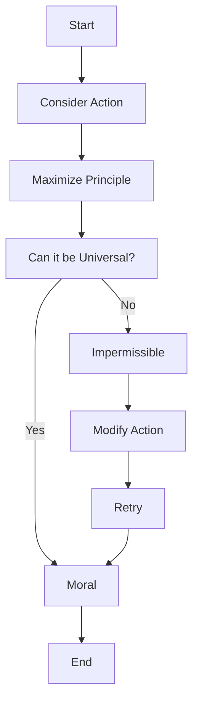
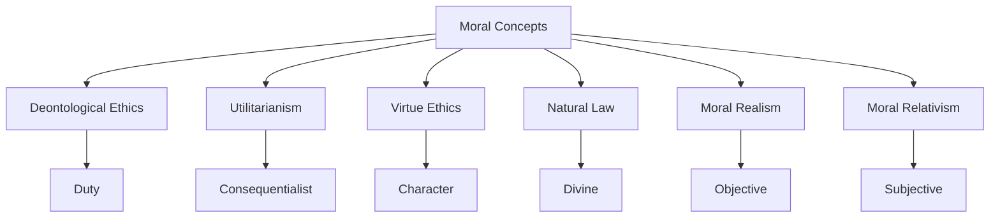
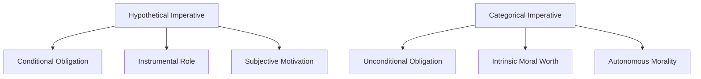
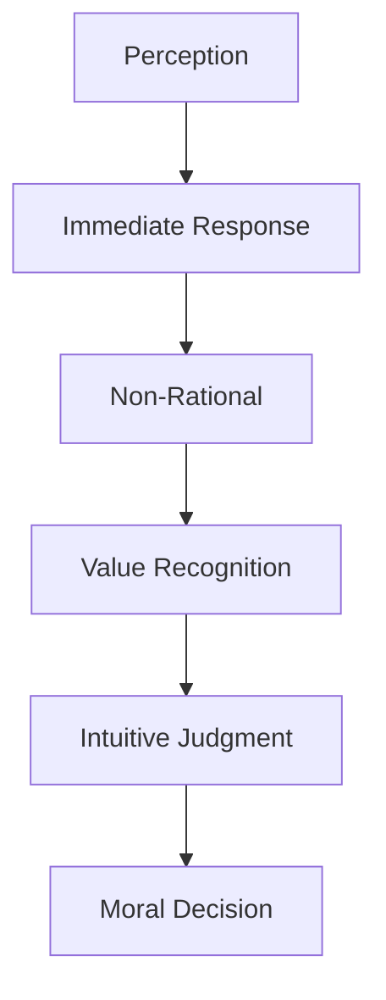

                 

### 1.1.1 The Historical and Intellectual Context of Ethical Theories

To begin with, let's delve into the historical and intellectual context of ethical theories. Ethical theories have been a cornerstone in the philosophical discourse throughout history, shaping our understanding of morality and human conduct. 

**Background of Ethical Theories**

Ethics, as a field of philosophy, has its roots tracing back to ancient civilizations such as Ancient Greece and Rome. Great thinkers like Socrates, Plato, and Aristotle contributed significantly to the development of ethical theories. Socrates emphasized the importance of virtue ethics, arguing that the purpose of human life is to pursue virtue and develop moral character. Plato extended this idea by introducing the concept of the "philosopher-king," who possesses both wisdom and virtue to lead society. Aristotle, on the other hand, focused on the mean between extremes, advocating for the principle of the "golden mean" to achieve moral balance.

**Intellectual Context**

The intellectual context of ethical theories has been influenced by various philosophical movements and schools of thought. For instance, the Enlightenment period in the 18th century marked a significant shift towards rationalism and individualism. Thinkers like Immanuel Kant and Jean-Jacques Rousseau played a pivotal role in this context. Kant's deontological ethics emphasized the importance of duty and moral rules, while Rousseau's social contract theory focused on the moral obligations of individuals within a society.

**Kant's and Scheler's Contributions**

Moving on to Kant and Scheler, their contributions to ethical theory have left an indelible mark on the field. Immanuel Kant (1724-1804) was a German philosopher known for his rigorous logical and rational approach to ethics. His groundbreaking work, "Groundwork of the Metaphysics of Morals," introduced the concept of the categorical imperative, which forms the cornerstone of his formal ethical theory. Kant argued that moral actions are those that could be universally applied without contradiction.

Karl Scheler (1874-1928), a German philosopher and sociologist, offered a distinct perspective on ethics through his material ethical theory. He criticized Kant's formalism and emphasized the role of emotions and values in ethical decision-making. Scheler's work "The Nature of Sympathy" and "Moral Personalism" laid the foundation for a more nuanced understanding of morality that considers the subjective experiences and emotional dimensions of human beings.

**The Structure of the Book**

In this book, we will explore both Kant's and Scheler's ethical theories in detail, examining their core principles, strengths, and limitations. We will begin with an introduction to the philosophical framework and historical context, followed by a deep dive into Kant's formal ethical theory, including his key concepts and criticisms. Subsequently, we will turn our attention to Scheler's material ethical theory, exploring the central ideas and core principles that distinguish his approach from Kant's.

By the end of this book, readers will gain a comprehensive understanding of the contrasting perspectives offered by Kant and Scheler, as well as the broader implications of their theories for contemporary ethical debates. Let's embark on this intellectual journey, armed with our analytical minds and the thirst for deeper insights into the nature of morality.

### 1.1.2 The Significance of Kant's and Scheler's Contributions

Immanuel Kant and Karl Scheler have made profound contributions to the field of ethics, each offering unique perspectives that have shaped our understanding of morality and human behavior. Their ideas have had a lasting impact, not only within the realm of philosophy but also in various other disciplines such as psychology, sociology, and even law.

**Kant's Impact**

Kant's deontological ethics, with its emphasis on duty, universality, and the categorical imperative, has been a cornerstone in ethical theory. His ideas have had a significant influence on subsequent moral philosophers, including John Stuart Mill, who argued for utilitarianism, and Georg Wilhelm Friedrich Hegel, who developed his own moral philosophy based on the dialectic. Kant's contributions extend beyond philosophy; his ideas have also been influential in legal theory, particularly in the concept of the rule of law, which emphasizes the importance of following established rules and regulations impartially.

Kant's ethics have been instrumental in promoting ethical consistency and universal moral principles. By advocating for the categorical imperative, he argued that moral actions must be based on principles that could be universally applied without contradiction. This has led to a deeper understanding of the nature of moral duty and the importance of acting out of a sense of moral obligation rather than self-interest.

**Scheler's Impact**

Karl Scheler's material ethical theory, with its emphasis on emotions, values, and subjective experiences, offers a contrasting perspective to Kant's formalism. Scheler's work has been particularly influential in existentialism and phenomenology, where the focus is on the lived experience of individuals and the subjective dimensions of morality. His ideas have resonated with philosophers such as Max Scheler, who extended his work on emotions and morality, and Heidegger, who explored the phenomenon of being-in-the-world.

Scheler's contributions have been significant in highlighting the role of emotions in ethical decision-making. He argued that emotions are not merely subjective experiences but are essential to understanding moral values and the moral worth of actions. By focusing on the concept of ethical sensibility, Scheler provided a more nuanced view of morality that acknowledges the complexity of human emotions and the diverse ways in which individuals experience moral dilemmas.

**Broader Implications**

Both Kant's and Scheler's contributions have broader implications for contemporary ethical debates. Kant's emphasis on universal moral principles continues to be relevant in discussions about human rights, justice, and moral responsibility. His ideas have been applied to various ethical issues, including bioethics, environmental ethics, and business ethics, where the importance of following ethical principles and rules is paramount.

Scheler's focus on the subjective and emotional dimensions of morality has influenced ethical theories that prioritize individual experience and autonomy. This is particularly evident in discussions about ethical subjectivity, ethical pluralism, and the moral significance of emotions. Scheler's ideas have also been relevant in interdisciplinary studies, such as moral psychology and neuroscience, where the role of emotions in decision-making and moral judgment is a central concern.

In conclusion, Kant's and Scheler's contributions have left a lasting legacy in the field of ethics. Their ideas have shaped our understanding of morality and have provided valuable insights into the complexities of human behavior and moral decision-making. By exploring their theories in detail, we can gain a deeper appreciation of the diversity and richness of ethical thought and its implications for contemporary ethical debates.

### 1.1.3 The Structure of the Book

This book is organized into three main parts, each focusing on a different aspect of Kant's and Scheler's ethical theories. The structure is designed to guide the reader through a systematic exploration of these theories, from foundational concepts to critical analysis and evaluation.

**Part 1: Introduction to the Philosophical Framework**

This initial part sets the stage by providing a historical and intellectual context for ethical theories. It introduces the key figures, ideas, and debates that have shaped the field of ethics, including a brief overview of the works and contributions of Immanuel Kant and Karl Scheler. The chapter aims to establish a solid foundation for readers to engage with the more detailed discussions that follow.

**Part 2: Kant's Formal Ethical Theory**

Part 2 delves into Kant's formal ethical theory, beginning with an exploration of his fundamental concepts. This section includes a detailed analysis of the categorical imperative, the concept of morality, and the role of reason in ethical decision-making. It then moves on to discuss the key principles of Kant's ethical theory, such as the distinction between hypothetical and categorical imperatives, the doctrine of the good will, and the critique of teleological ethics. Each concept is thoroughly explained and illustrated with examples and mermaid diagrams to enhance understanding.

**Part 3: Scheler's Material Ethical Theory**

Part 3 focuses on Scheler's material ethical theory, presenting his central ideas and core principles. This section begins with an examination of the concept of ethical sensation and the role of emotions in ethics. It then discusses Scheler's theory of value, including the mathematical models and formulas he used to explain his ideas. The chapter also explores Scheler's rejection of Kant's formalism and offers a comparative analysis of the two theories. This part aims to provide a comprehensive understanding of Scheler's ethical framework and its implications for contemporary ethics.

**Conclusion**

The final part of the book concludes by summarizing the key findings and offering a critical evaluation of both Kant's and Scheler's theories. It discusses the strengths and limitations of each approach and examines their broader implications for contemporary ethical debates. The conclusion aims to provide a holistic perspective on the contributions of Kant and Scheler to the field of ethics and their enduring relevance in modern philosophical discourse.

By following this structured approach, readers will gain a deep and nuanced understanding of Kant's and Scheler's ethical theories, their implications, and their significance in the ongoing development of ethical thought.

### 2.1.1 The Categorical Imperative

The Categorical Imperative is one of the cornerstone concepts in Kant's ethical theory. It represents a fundamental principle of morality that is both universal and unconditional. Let's explore this concept in detail, breaking it down step by step and providing a clear explanation of its core principles and applications.

**Definition and Principles**

The Categorical Imperative is defined as a principle that one should act only in such a way that the maxim of one's action can consistently be universalized as a universal law. This means that before acting, one must consider whether the principle behind the action could be applied to everyone in a consistent and non-contradictory manner.

There are several key principles underlying the Categorical Imperative:

1. **Unconditionality:** The Categorical Imperative is unconditional. It does not depend on personal desires, emotions, or circumstances. It is a moral command that must be followed regardless of the outcome or personal gain.
2. **Universality:** The Categorical Imperative requires that the principle behind an action be applicable to all individuals. This means that if you cannot will your action to be a universal law without contradiction, then the action is morally impermissible.

**Explanation and Mermaid Flowchart**

To better understand the Categorical Imperative, let's use a mermaid flowchart to visualize its principles:

In this flowchart:

1. **Start**: The process begins with the consideration of an action.
2. **Consider Action**: One ponders the principle behind the action.
3. **Maximize Principle**: The principle is evaluated to determine if it maximizes the good.
4. **Can it be Universal?**: One considers whether the principle can be universally applied without contradiction.
5. **Yes/No Decision**: The action is deemed moral if the principle can be universalized; otherwise, it is impermissible.
6. **Modify Action**: If the action is impermissible, one should modify the action.
7. **Retry**: The process is repeated until a morally permissible action is found.
8. **End**: The process concludes with a morally justified action.

**Example**

Let's illustrate the Categorical Imperative with an example:

**Scenario**: A person is walking past a neighbor's house and sees a valuable item left unattended. The person is tempted to steal it.

1. **Start**: The person considers stealing the item.
2. **Consider Action**: The principle behind the action is the desire for personal gain.
3. **Maximize Principle**: Stealing maximizes personal gain but may harm the neighbor.
4. **Can it be Universal?**: If everyone stole valuable items they saw, society would quickly collapse into chaos.
5. **No Decision**: Stealing is morally impermissible.
6. **Modify Action**: The person decides not to steal and instead informs the neighbor about the item.
7. **Retry**: The person has successfully found a morally permissible action.
8. **End**: The person has acted in a morally justified manner.

Through this example, we can see how the Categorical Imperative guides us to make ethical decisions by considering the universal application of our actions' principles.

### 2.1.2 The Concept of Morality

Morality is a multifaceted concept that has been debated and refined by philosophers throughout history. At its core, morality refers to a system of principles or values that govern the behavior of individuals within a society. It defines what is considered right or wrong, good or bad, and serves as a guide for ethical decision-making. Let's delve into the concept of morality, exploring its properties, and comparing different moral concepts.

**Properties of Morality**

Morality possesses several key properties that distinguish it from other systems of values or beliefs:

1. **Objective Nature**: Morality is often considered objective, meaning that there are moral truths that exist independently of individual beliefs or cultural norms. This objective nature is a point of contention among philosophers, with some arguing for moral relativism and others for moral realism.
2. **Normativity**: Morality is normative, which means it provides rules or standards for human behavior. These norms are intended to guide individuals in making ethical choices and judgments.
3. **Universal Applicability**: While cultural and personal differences may influence moral beliefs, morality is generally seen as having universal applicability. That is, certain moral principles are considered universally valid, transcending cultural and temporal boundaries.
4. **Consistency**: Morality requires consistency in action and belief. A moral system must be internally coherent and logically consistent, avoiding contradictions and paradoxes.

**Comparative Table of Moral Concepts**

To better understand the concept of morality, let's compare different moral theories using a comparative table:

| Moral Theory | Key Concepts | Properties |
| --- | --- | --- |
| Utilitarianism | Greatest Good for the Greatest Number | Consequentialist; focuses on outcomes |
| Deontological Ethics | Duty and Rules | Non-consequentialist; focuses on actions |
| Virtue Ethics | Character and Moral Virtues | Focuses on the development of moral character |
| Natural Law | Divine Law and Natural Rights | Based on natural law and divine commandments |
| Moral Realism | Moral Truth and客观性 | Believes in objective moral truths |
| Moral Relativism | Cultural and Personal Norms | Moral beliefs are subjective and culture-specific |

**ER Diagram of Moral Concepts**

To visually represent the structure of moral concepts, we can use an Entity-Relationship (ER) diagram:

In this diagram:

- **Moral Concepts** represents the overarching category of all moral theories.
- **Deontological Ethics**, **Utilitarianism**, **Virtue Ethics**, **Natural Law**, **Moral Realism**, and **Moral Relativism** are the different moral theories.
- **Duty**, **Consequentialist**, **Character**, **Divine**, **Objective**, and **Subjective** represent the key concepts and properties associated with each theory.

**Relationships**

The ER diagram highlights the relationships between moral concepts:

- **Deontological Ethics** focuses on **Duty** and rules.
- **Utilitarianism** emphasizes **Consequentialist** outcomes.
- **Virtue Ethics** concentrates on the development of **Character** and moral virtues.
- **Natural Law** is based on **Divine** commandments and natural rights.
- **Moral Realism** asserts the existence of **Objective** moral truths.
- **Moral Relativism** posits that moral beliefs are **Subjective** and culture-specific.

Through this detailed exploration of the concept of morality, its properties, and comparative analysis of different moral theories, we gain a deeper understanding of the complexity and diversity of ethical thought. This understanding is crucial for navigating the moral landscapes that we encounter in our daily lives and in broader philosophical discourse.

### 2.1.3 The Role of Reason in Kant's Ethics

In Kant's ethical framework, reason plays a central and indispensable role. At the heart of Kantian ethics is the notion that moral actions are driven not by emotions, desires, or inclinations, but by a rational, autonomous will that acts out of a sense of duty. Let's delve into the role of reason in Kant's ethics, exploring its significance, application, and relationship with other aspects of his moral theory.

**The Significance of Reason in Kant's Ethics**

For Kant, reason is not merely a cognitive tool for understanding the world; it is the foundation of moral agency. Here are the key reasons why reason is central to his ethical system:

1. **Autonomy and Rationality:** Kant posits that human beings possess a capacity for rationality and autonomy. Autonomy refers to the ability to act based on one's own rational principles, rather than being merely a product of external influences or desires. Rationality, on the other hand, ensures that actions are guided by clear, coherent principles rather than arbitrary preferences.
2. **The Categorical Imperative:** The Categorical Imperative, one of the cornerstones of Kant's ethics, is a principle that can be universally applied without contradiction. This principle is derived from reason and serves as a rational guide for moral conduct. It emphasizes the importance of acting out of a sense of duty, rather than seeking personal gain or fulfilling desires.
3. **The Distinction Between Hypothetical and Categorical Imperatives:** Kant distinguishes between the hypothetical imperative, which prescribes actions as means to achieving a desired end, and the categorical imperative, which prescribes actions as morally necessary in themselves. This distinction underscores the central role of reason in determining moral worth, as it insists that moral actions must be performed regardless of their outcomes.

**The Application of Reason in Moral Decision-Making**

Kant's emphasis on reason in ethics is reflected in his approach to moral decision-making. Here are some key aspects of how reason is applied in this context:

1. **The Method of reflective judgment:** Kant argues that moral decisions require reflective judgment, where one contemplates the principle behind an action and evaluates its conformity to the Categorical Imperative. This process is rational and objective, aiming to identify actions that are morally right by universal standards.
2. **The Role of Practical Reason:** Practical reason, distinct from theoretical reason, is concerned with guiding actions and decisions. It involves deliberation, consideration of moral principles, and the formation of intentions that align with these principles. Practical reason ensures that moral actions are not driven by emotions or desires but by a rational assessment of what is morally right.
3. **The Autonomy of Moral Judgment:** Kant insists that moral judgments are autonomous, meaning they are not derived from sensory experiences or empirical data but are grounded in pure reason. This autonomy is crucial for maintaining the objective and universal nature of moral principles.

**The Relationship Between Reason and Other Elements of Kant's Ethics**

Reason in Kant's ethics is intimately connected with other key elements of his moral theory:

1. **The Doctrine of the Good Will:** The Good Will is the central moral virtue for Kant. It represents the intent to perform one's duty, driven by a sense of moral obligation rather than personal gain or external rewards. Reason is essential for cultivating this virtue, as it guides individuals to act in accordance with moral principles and to strive for the good.
2. **The Critique of Teleological Ethics:** Kant criticizes teleological ethics, which argues that the moral worth of an action is determined by its outcomes or consequences. He argues that this approach undermines the autonomy and rationality of moral actions, reducing morality to a mere means to an end. Reason, in contrast, emphasizes the intrinsic value of moral actions and the importance of acting out of a sense of duty.
3. **The Role of Rationality in Ethical Education:** Kant believes that ethical education is crucial for fostering moral character and rationality. By cultivating the capacity for reflective judgment and autonomous moral reasoning, individuals can develop a rational and principled approach to moral decision-making.

In summary, reason in Kant's ethics is not merely a cognitive tool but a fundamental aspect of moral agency. It serves as the basis for moral decision-making, the cultivation of moral virtues, and the critique of other ethical theories. By emphasizing the role of reason, Kant's ethics offers a rational and objective framework for understanding and guiding moral conduct.

### 2.2.1 The Distinction Between Hypothetical and Categorical Imperatives

One of the cornerstone distinctions in Kant's ethical philosophy is the difference between hypothetical imperatives and categorical imperatives. Understanding this distinction is crucial for grasping the essence of Kant's moral theory, as it highlights the fundamental differences between actions motivated by desire and those driven by moral duty.

**Hypothetical Imperatives**

A hypothetical imperative is a type of moral directive that prescribes an action as a means to achieve a particular goal or end. It is conditional in nature, meaning that it is only obligatory if the desired outcome is worthwhile. The key characteristics of hypothetical imperatives include:

1. **Conditional Obligation:** Hypothetical imperatives are contingent upon the achievement of a specific goal. For example, "You should study hard if you want to pass the exam." This implies that the obligation to study only exists if passing the exam is deemed valuable or necessary.
2. **Instrumental Role:** The actions prescribed by hypothetical imperatives serve as instruments or means to achieve a desired end. They are not inherently moral or immoral; their moral status depends on the outcome they are intended to produce.
3. **Subjective Motivation:** Hypothetical imperatives are often motivated by personal desires, preferences, or goals. They reflect a desire for specific outcomes and are driven by individual interests or intentions.

**Example of a Hypothetical Imperative:**

Let's consider the example of saving a drowning person. A hypothetical imperative might state: "You should save the drowning person if you want to avoid feeling guilty or if you desire to act heroically." In this scenario, the action of saving the drowning person is not inherently moral; its moral worth is contingent on the desired outcome of avoiding guilt or fulfilling a personal heroism aspiration.

**Categorical Imperatives**

In contrast to hypothetical imperatives, categorical imperatives are unconditional moral directives that prescribe actions based on moral duty and universal principles. They are independent of any personal desires or goals and are considered binding regardless of the consequences. The key characteristics of categorical imperatives include:

1. **Unconditional Obligation:** Categorical imperatives are universally applicable and binding without exception. For instance, "You should not lie, regardless of the circumstances." This directive holds true regardless of personal desires, potential outcomes, or any other factors.
2. **Intrinsic Moral Worth:** The actions prescribed by categorical imperatives are inherently moral or immoral. They are not merely instrumental; their moral status is determined by the adherence to universal moral principles.
3. **Autonomous Morality:** Categorical imperatives are rooted in the autonomy of moral agency, emphasizing the importance of acting out of a sense of duty rather than driven by external desires or personal gain.

**Example of a Categorical Imperative:**

Continuing with the example of saving a drowning person, a categorical imperative might state: "You should save the drowning person, because it is your moral duty to prevent harm and protect human life." This directive is unconditional and universally binding, emphasizing the intrinsic moral worth of the action itself, rather than the personal desires or potential outcomes.

**Mermaid Flowchart of Hypothetical and Categorical Imperatives**

To better understand the distinction between hypothetical and categorical imperatives, let's use a mermaid flowchart:

In this flowchart:

- **Hypothetical Imperative** represents the conditional nature of these directives, their instrumental role, and their subjective motivation.
- **Categorical Imperative** highlights the unconditional obligation, intrinsic moral worth, and autonomous morality of these directives.

**Comparison Table**

To further clarify the differences, let's present a comparison table:

| Aspect | Hypothetical Imperative | Categorical Imperative |
| --- | --- | --- |
| Obligation | Conditional | Unconditional |
| Role | Instrumental | Intrinsic |
| Motivation | Subjective | Autonomous |

By understanding and differentiating between hypothetical and categorical imperatives, we gain a deeper insight into Kant's moral philosophy and the distinction between actions driven by desire and those guided by moral duty. This distinction is fundamental in evaluating the moral worth of actions and shaping our ethical decision-making process.

### 2.2.2 The Doctrine of the Good Will

The concept of the Good Will is central to Kant's ethical philosophy, representing the highest form of moral virtue. For Kant, the Good Will is not simply a matter of having good intentions but rather an action performed out of a sense of duty and adherence to moral principles, regardless of the consequences. In this section, we will delve into the doctrine of the Good Will, exploring its definition, significance, and relationship with other ethical principles.

**Definition of the Good Will**

The Good Will, according to Kant, is the intent to perform one's duty not for personal gain or external rewards but because it is one's moral obligation. It is a quality of the will that acts in accordance with universal and unconditional moral laws. Here is the formal definition provided by Kant:

> "The will is good not because of what it effectuates or promises to effect, but simply because of its concept."

This definition emphasizes that the moral worth of an action does not depend on its outcome or the benefits it produces but on the intention behind it. For an action to be morally good, it must be performed out of a sense of duty, guided by a moral principle that can be universally applied without contradiction.

**Significance of the Good Will**

The Good Will holds a pivotal role in Kant's ethical framework for several reasons:

1. **Autonomy and Rationality:** The Good Will is intrinsically linked to the autonomy and rationality of moral agency. It reflects the capacity of human beings to act independently of desires and inclinations, guided by rational principles. By acting out of a sense of duty, individuals demonstrate their ability to think and act in a morally autonomous manner.
2. **The Categorical Imperative:** The Good Will is the practical application of the Categorical Imperative, which is the central principle of Kant's ethics. The Categorical Imperative requires that actions be universally applicable without contradiction, and the Good Will embodies this requirement by acting out of a sense of duty, regardless of the consequences.
3. **The Distinction from Virtue Ethics:** While virtue ethics focuses on the development of moral character and virtues, the Good Will in Kant's ethics is not a matter of possessing certain virtues but rather of consistently acting in accordance with moral duty. It emphasizes the importance of action over character, differentiating itself from other ethical theories.

**The Role of the Good Will in Ethical Decision-Making**

The Good Will is integral to ethical decision-making, providing a clear and unambiguous guide for determining the moral worth of actions. Here are some key points about its role:

1. **Principles over Desires:** The Good Will requires that individuals prioritize moral principles over personal desires and inclinations. When faced with ethical dilemmas, one should consider not what one wants but what one morally ought to do, guided by universal moral laws.
2. **Universal Applicability:** The Good Will ensures that ethical decisions are grounded in principles that can be universally applied. This means that one must consider whether the action in question could be a universal law without contradiction. Actions that fail this test are morally impermissible.
3. **Consistency and Autonomy:** Consistently acting out of a sense of duty fosters moral autonomy and rationality. By adhering to universal moral principles, individuals demonstrate their capacity for autonomous moral agency and the rationality of their actions.

**Mathematical Model and Formula Explanation**

To further elucidate the concept of the Good Will, we can use a mathematical model and formula to represent its relationship with moral actions and principles:

$$ \text{Good Will} = \frac{\text{Moral Actions}}{\text{Principles Adhered to}} $$

In this formula:

- **Moral Actions**: Represent the actions performed in accordance with moral principles.
- **Principles Adhered to**: Are the universal and unconditional moral principles guiding these actions.

This formula indicates that the Good Will is a ratio that measures the proportion of moral actions performed relative to the principles adhered to. A higher ratio signifies a stronger sense of the Good Will, as more actions align with universal moral principles.

**Example Explanation**

Consider an example where a person faces a moral dilemma: whether to lie to protect someone from harm. Using the mathematical model:

- **Moral Actions**: The action of lying to protect someone.
- **Principles Adhered to**: The principle of truthfulness and the principle of not causing harm.

The formula would be:

$$ \text{Good Will} = \frac{\text{Lying to Protect}}{\text{Truthfulness} + \text{Not Causing Harm}} $$

If the person decides to lie, the Good Will would be reduced because the action of lying contradicts the principle of truthfulness. Conversely, if the person chooses not to lie but instead finds an alternative way to protect the individual without lying, the Good Will would be higher because the action aligns more closely with universal moral principles.

In summary, the doctrine of the Good Will is a cornerstone of Kant's ethical philosophy, emphasizing the importance of acting out of a sense of duty and adherence to universal moral principles. It offers a clear and unambiguous guide for ethical decision-making, prioritizing principles over personal desires and fostering moral autonomy and rationality.

### 2.2.3 The Critique of Teleological Ethics

Kant's ethical philosophy is known for its emphasis on duty and the universal application of moral principles. A central aspect of his thought is the critique of teleological ethics, which holds that the moral worth of an action is determined by its consequences or the ends it achieves. In this section, we will delve into Kant's critique of teleological ethics, exploring the key arguments and the reasons why he dismisses this approach as inadequate for grounding moral philosophy.

**The Nature of Teleological Ethics**

Teleological ethics, also known as consequentialism, posits that the morality of an action is contingent upon the outcomes it produces. The central idea is that an action is morally right if it leads to desirable consequences and morally wrong if it results in undesirable outcomes. Key proponents of teleological ethics include utilitarian philosophers like Jeremy Bentham and John Stuart Mill, who argue that actions should be judged based on their contribution to overall happiness or utility.

**Kant's Critique of Teleological Ethics**

1. **The Incompatibility with Moral Autonomy:** Kant's primary criticism of teleological ethics is that it undermines the autonomy of moral agency. According to Kant, moral actions are those that are performed out of a sense of duty, following universal moral laws, rather than being motivated by desires or the pursuit of specific outcomes. Teleological ethics, by focusing on outcomes, reduces moral actions to mere means to achieve desired ends, thereby compromising their intrinsic moral worth. Kant argues that morality must be independent of desires and consequences to maintain its objective and universal nature.
   
2. **The Problem of Consequential Indeterminacy:** Another critique of teleological ethics is the problem of consequential indeterminacy. Since the moral worth of an action is contingent upon its outcomes, determining what is morally right becomes subject to uncertainty and variability. Different individuals may evaluate the same action based on their subjective preferences or desires, leading to moral relativism and a lack of objective moral standards. In contrast, Kant's deontological ethics provides clear, unambiguous moral principles that are universally applicable, eliminating this problem of indeterminacy.

3. **The Incentive to Act Immorally:** Teleological ethics may encourage individuals to act immorally in pursuit of greater overall happiness or utility. By focusing on the outcomes of actions, it is possible to justify actions that might be considered morally wrong if judged based on their intrinsic nature. For example, lying might be justified if it leads to a greater good. This incentivizes manipulative and deceitful behavior, undermining the moral fabric of society. In contrast, Kant's emphasis on the intrinsic moral worth of actions ensures that moral principles are consistently followed, regardless of the potential outcomes.

**Kant's Alternate Proposal: Deontological Ethics**

In response to the critiques of teleological ethics, Kant proposes deontological ethics as a superior moral framework. Deontological ethics emphasizes the importance of duty, moral rules, and the categorical imperative. Here are the key features of deontological ethics:

1. **Unconditionality and Universality:** Deontological ethics holds that moral actions are unconditionally and universally binding. An action is morally right if it adheres to a universal moral principle, regardless of the consequences. This ensures the objective and universal nature of morality, providing clear and consistent moral guidance.

2. **The Categorical Imperative:** The Categorical Imperative is the core principle of deontological ethics. It states that one should act only in ways that one could will to be a universal law. This principle ensures that moral actions are performed out of a sense of duty, rather than being motivated by desires or outcomes.

3. **Intrinsic Moral Worth:** Deontological ethics focuses on the intrinsic moral worth of actions, emphasizing that actions are inherently right or wrong, independent of their consequences. This approach ensures that moral principles are not undermined by the pursuit of desired outcomes.

In conclusion, Kant's critique of teleological ethics provides a compelling argument for the importance of deontological ethics in grounding moral philosophy. By emphasizing the unconditionality, universality, and intrinsic worth of moral actions, deontological ethics offers a robust and objective framework for ethical decision-making, free from the pitfalls of consequentialism.

### 2.3.1 Traditional and Contemporary Critiques of Kant's Ethical Theory

Immanuel Kant's ethical theory, rooted in the concept of the Categorical Imperative, has been influential yet subject to numerous critiques over time. These critiques can be broadly categorized into traditional and contemporary perspectives, each offering unique insights and challenges to Kant's deontological framework.

**Traditional Critiques**

1. **Teleological Ethics:** One of the most prominent traditional critiques comes from proponents of teleological ethics, who argue that Kant's emphasis on duty and universal laws overlooks the importance of consequences in moral decision-making. Jeremy Bentham and John Stuart Mill, for instance, criticize Kant's deontological approach as being overly abstract and removed from real-world ethical dilemmas. They advocate for a consequentialist approach that evaluates the moral worth of actions based on their outcomes, particularly the greatest good for the greatest number.

2. **Moral Realism:** Critics like G.E. Moore challenge Kant's claim that moral actions are universally binding without contradiction. Moore argues that moral properties, such as duty and obligation, are not objects of sensory experience but rather cognitive judgments that lack objective reality. This critique questions the basis of Kant's moral realism and the rationality of his moral principles.

3. **Practicality and Application:** Traditional critics also argue that Kant's theory is impractical and difficult to apply in real-life situations. The requirement to universally apply moral principles can lead to counterintuitive conclusions, such as the prohibition of lying even when it could save a life. This impracticality undermines the theory's feasibility and raises questions about its relevance to everyday moral dilemmas.

**Contemporary Critiques**

1. **Emotional and Psychological Realism:** Contemporary critiques often focus on the role of emotions and psychological factors in moral decision-making. Philosophers like Peter Singer and Jürgen Habermas argue that Kant's emphasis on rational autonomy overlooks the complexity of human emotions and the social dimensions of morality. They propose that moral decisions are often influenced by emotions, social norms, and practical considerations, which are neglected in Kant's framework.

2. **Relativism and Cultural Diversity:** Another contemporary critique is that Kant's universal moral laws are culturally insensitive and fail to account for the diversity of moral beliefs across different societies. Critics like Charles Taylor and Susan Wolf argue that moral principles should be contextually grounded and sensitive to cultural variations. They contend that Kant's deontological ethics is overly rigid and fails to recognize the moral pluralism that exists in the world.

3. **Moral Progress and Change:** Contemporary critiques also challenge Kant's claim that moral principles are timeless and unchanging. Critics like Michael Sandel argue that moral principles should evolve in response to changing social, political, and technological contexts. They suggest that Kant's static moral framework is insufficient for addressing contemporary ethical issues, such as bioethics, environmental ethics, and human rights.

**Response to Critiques**

While these critiques present significant challenges to Kant's ethical theory, they also prompt thoughtful responses and potential refinements. Here are some potential responses to these critiques:

1. **Reconciliation with Consequentialism:** Some contemporary philosophers attempt to reconcile Kant's deontological ethics with consequentialism by arguing that both approaches can contribute to a more comprehensive moral theory. They propose that while consequentialism evaluates the outcomes of actions, deontological ethics provides the necessary foundation of moral principles that guide ethical decision-making.

2. **Embracing Moral Pluralism:** Other philosophers acknowledge the importance of emotional and psychological factors in moral decision-making but argue that Kant's framework can be expanded to incorporate these elements without sacrificing its core principles. They propose that moral principles are context-sensitive and should be interpreted dynamically, taking into account the emotional and social dimensions of human behavior.

3. **Contextualizing Universal Principles:** Critics can respond to the charge of cultural insensitivity by arguing that Kant's universal moral principles are not meant to be rigidly applied in all contexts but rather serve as a starting point for moral reflection that can be adapted to different cultural settings. They suggest that moral principles can be contextualized and applied flexibly while still maintaining their universal moral value.

In conclusion, the critiques of Kant's ethical theory from both traditional and contemporary perspectives highlight the complexity and richness of moral philosophy. While these critiques raise important questions and challenges, they also provide opportunities for philosophical dialogue and the development of more nuanced and comprehensive ethical theories.

### 2.3.2 Scheler's Response to Kant

Karl Scheler, a significant figure in the development of ethical theory, offers a distinct and critical perspective on Immanuel Kant's deontological ethics. Scheler's critique of Kant's moral philosophy is grounded in his material ethical theory, which emphasizes the role of emotions, values, and subjective experiences in ethical decision-making. Let's delve into Scheler's response to Kant, examining his key criticisms and alternative viewpoints.

**Criticisms of Kant's Formalism**

Scheler criticizes Kant's formalism, arguing that Kant's emphasis on the abstract concept of the Categorical Imperative overlooks the concrete realities of human life and the emotional dimensions of moral experiences. Here are some of Scheler's main criticisms:

1. **Emotional Ignorance:** Scheler contends that Kant's ethical theory is emotionally ignorant. By focusing solely on the rational will and abstract moral principles, Kant neglects the role of emotions in moral decision-making and moral experience. Scheler argues that emotions such as love, compassion, and indignation are essential to understanding the moral worth of actions and the moral lives of individuals.

2. **Subjective Experiences:** Scheler also criticizes Kant's deontological ethics for its failure to consider the subjective experiences of individuals. He argues that morality must be grounded in the lived experiences of human beings, including their emotions, desires, and values. For Scheler, the moral life is not simply about following universal principles but about engaging with the world in a way that is emotionally and existentially meaningful.

3. **The Role of Emotions in Moral Judgments:** Scheler challenges Kant's claim that moral judgments are purely rational and objective. He argues that emotions play a crucial role in forming moral judgments and guiding ethical behavior. For instance, empathy and compassion are emotions that motivate individuals to act morally and care for others.

**Material Ethical Theory**

To address these criticisms, Scheler develops his material ethical theory, which offers an alternative framework for understanding morality. Here are the core elements of Scheler's theory:

1. **Value Sensitivity:** Scheler emphasizes the importance of value sensitivity, the capacity to recognize and respond to the intrinsic value of things and persons. He argues that moral judgments should be based on a recognition of the value of human beings and the world around us, rather than abstract principles.

2. **The Concept of Ethical Sensation:** Central to Scheler's theory is the concept of ethical sensation, which refers to the immediate, non-rational awareness of the value of things. Ethical sensations are emotional responses that arise from an encounter with the world and are essential for forming moral judgments.

3. **The Distinction Between Good and Beautiful:** Scheler distinguishes between good and beautiful, arguing that they are different types of values. The good represents intrinsic moral value, related to ethical obligations and the well-being of individuals. The beautiful, on the other hand, is an aesthetic value that is independent of moral concerns. Scheler emphasizes that while the beautiful can be morally significant, it is not the basis for moral judgments.

4. **Emotional and Social Dimensions of Morality:** Scheler's theory highlights the emotional and social dimensions of morality. He argues that moral actions are not only guided by rational principles but also by emotional experiences and social relationships. Morality is not an abstract system of rules but a lived practice that involves emotional engagement and relationality.

**Reconciliation with Kant**

While Scheler's material ethical theory provides a critical departure from Kant's formalism, he does not entirely reject Kant's contributions. Scheler acknowledges the importance of moral principles and the role of rationality in ethical decision-making. He proposes that Kant's abstract moral principles can be grounded in the concrete experiences of human beings, incorporating emotional and value-sensitive dimensions.

In summary, Scheler's response to Kant's deontological ethics is characterized by a critique of formalism and an emphasis on the role of emotions, subjective experiences, and value sensitivity in moral decision-making. His material ethical theory offers a more nuanced and comprehensive framework for understanding morality, highlighting the interplay between rational principles and emotional experiences in guiding ethical behavior.

### 3.1.1 The Concept of Ethical Sensation

Ethical sensation is a central concept in Karl Scheler's material ethical theory, representing the immediate, non-rational awareness of the value of things and persons. Unlike Kant's deontological ethics, which emphasizes abstract moral principles and rationality, Scheler's approach focuses on the concrete experiences of human beings and the emotional responses that arise from these experiences. Let's explore the concept of ethical sensation in detail, breaking it down step by step and providing a clear explanation of its core principles and applications.

**Definition and Characteristics**

Ethical sensation refers to an immediate, intuitive feeling that something has value or is worthy of attention. It is a form of non-rational awareness that precedes and informs rational moral judgments. Here are the key characteristics of ethical sensation:

1. **Immediate Awareness:** Ethical sensation is an immediate form of awareness, meaning it occurs spontaneously and without deliberation. It is a direct response to the presence of value in a situation or individual.
2. **Non-Rational Nature:** Ethical sensation is non-rational, meaning it is not derived from logical reasoning or abstract principles. Instead, it arises from an emotional or intuitive response to the value of something.
3. **Intuitive Judgment:** Ethical sensation involves an intuitive judgment about the value of a thing or person. This judgment is not based on empirical evidence or logical argumentation but on an immediate emotional response.

**Explanation and Mermaid Flowchart**

To better understand the concept of ethical sensation, let's use a mermaid flowchart to illustrate its principles:

In this flowchart:

1. **Perception**: The process begins with an encounter or perception of something or someone.
2. **Immediate Response**: An immediate emotional response arises from the perception, without deliberation or reasoning.
3. **Non-Rational**: The response is non-rational, meaning it is not based on logical analysis or empirical evidence.
4. **Value Recognition**: The emotional response indicates the recognition of value, whether it is positive or negative.
5. **Intuitive Judgment**: An intuitive judgment is made about the moral significance of the perceived value.
6. **Moral Decision**: The judgment informs the moral decision or action to be taken.

**Example**

Let's consider an example to illustrate the concept of ethical sensation:

**Scenario**: A person sees a child drowning in a pool.

1. **Perception**: The person perceives the child in distress.
2. **Immediate Response**: The person feels an immediate emotional response of fear and concern.
3. **Non-Rational**: The fear and concern are not based on logical reasoning or empirical evidence.
4. **Value Recognition**: The emotional response indicates the recognition of the child's value and the urgency of the situation.
5. **Intuitive Judgment**: The person intuitively judges that the child's life is in danger and requires immediate intervention.
6. **Moral Decision**: The moral decision is to save the child.

Through this example, we can see how ethical sensation plays a crucial role in guiding moral decisions. The immediate, non-rational response to the perceived value of the child's life informs the intuitive judgment and the subsequent moral action.

### 3.1.2 The Role of Emotions in Ethics

Emotions play a significant role in ethical decision-making and moral behavior, providing a direct and immediate connection between individuals and the moral world around them. Unlike Kant's deontological ethics, which emphasizes rationality and abstract moral principles, Karl Scheler's material ethical theory places a strong emphasis on the role of emotions in ethical reasoning. Let's explore the relationship between emotions and ethics, examining how emotions influence moral judgments and actions.

**The Impact of Emotions on Moral Judgments**

1. **Intuitive Moral Responses**: Emotions often serve as an immediate and intuitive guide to moral judgments. For instance, feelings of empathy and compassion can lead individuals to make moral judgments about the well-being of others. When someone sees another person in pain, their emotional response of compassion may prompt them to judge that helping that person is morally right.

2. **Moral Intuitions**: Emotional responses generate moral intuitions, which are quick, instinctive judgments about what is right or wrong. These intuitions can be highly influential in shaping moral decisions. For example, the emotion of indignation may lead an individual to judge that an act of injustice is morally wrong, prompting them to take action against it.

3. **Empirical Moral Judgments**: Emotions can also provide empirical evidence for moral judgments. For instance, if an individual has experienced the positive effects of an action, such as seeing someone's happiness or well-being, they may be more likely to judge that action as morally good.

**The Role of Emotions in Moral Behavior**

1. **Motivation for Action**: Emotions motivate individuals to act in certain ways. For example, feelings of guilt or shame may motivate someone to make amends for past wrongs, while feelings of pride or satisfaction may motivate them to continue engaging in morally good behaviors.

2. **Guidance in Moral Dilemmas**: In moral dilemmas, emotions can help individuals navigate complex situations by providing a sense of what is right or wrong. For instance, in a situation where saving one person means sacrificing another, emotions such as compassion and empathy can guide individuals to choose the action that minimizes harm.

3. **Ethical Sensitivity**: Emotions enhance ethical sensitivity, enabling individuals to recognize and respond to the moral dimensions of situations and behaviors. This sensitivity is crucial for engaging in morally responsible actions and fostering a moral community.

**Examples of Emotions in Ethics**

1. **Empathy**: Empathy is the ability to understand and share the feelings of another person. It is a powerful emotional response that can lead individuals to make moral judgments about the well-being of others and motivate them to act in ways that promote the welfare of others.

2. **Compassion**: Compassion is an emotional response to the suffering of others. It can inspire individuals to take action to alleviate suffering and engage in charitable activities.

3. **Indignation**: Indignation is an emotion that arises in response to perceived injustice. It can motivate individuals to protest against unfair practices and work towards social justice.

4. **Gratitude**: Gratitude is the emotional response to receiving help or kindness. It can foster positive moral relationships and encourage individuals to repay favors and show appreciation for others.

In conclusion, emotions are an integral part of ethical decision-making and moral behavior. They provide intuitive moral responses, motivate action, and enhance ethical sensitivity. While Kant's deontological ethics emphasizes rationality and abstract moral principles, Scheler's material ethical theory recognizes the importance of emotions in shaping moral judgments and actions. By understanding the role of emotions in ethics, we can develop a more comprehensive understanding of morality that takes into account the complex and multifaceted nature of human experience.

### 3.1.3 The Distinction Between Good and Beautiful

In his material ethical theory, Karl Scheler distinguishes between the concepts of "good" and "beautiful," emphasizing that they represent different types of values with distinct characteristics and significance in moral discourse. Understanding this distinction is crucial for grasping the complexity of moral experiences and ethical judgments. Let's delve into the differences between good and beautiful, exploring their definitions, attributes, and ethical implications.

**The Concept of Good**

The concept of "good" in Scheler's ethical theory refers to intrinsic moral value. It represents qualities or actions that are inherently valuable and morally right because they contribute to the well-being and flourishing of individuals and communities. Key attributes of the "good" include:

1. **Intrinsic Value**: The good has intrinsic value, meaning it is valuable in and of itself, regardless of any external circumstances or consequences. For example, the act of helping someone in need is considered good because it is inherently valuable and morally right, not because of the positive outcomes it may produce.

2. **Moral Obligation**: The good is associated with moral obligations and duties. When something is considered good, it often implies a moral duty to act in accordance with that value. For instance, the moral duty to protect and care for vulnerable individuals stems from the intrinsic value of human life and well-being.

3. **Universal Applicability**: The good is universally applicable, meaning that certain moral principles and values are considered valid for all individuals, regardless of their cultural or social backgrounds. Universal moral principles, such as the duty to refrain from harming others, are rooted in the intrinsic value of the good.

**The Concept of Beautiful**

In contrast, the concept of "beautiful" in Scheler's theory represents aesthetic value. It refers to qualities or experiences that are valued for their sensory and emotional appeal, often associated with beauty and aesthetics. Key attributes of the "beautiful" include:

1. **Sensory Experience**: The beautiful is experienced through the senses, providing sensory pleasure and emotional satisfaction. For example, the sight of a beautiful sunset or the sound of a captivating piece of music can evoke feelings of wonder and delight.

2. **Aesthetic Value**: The beautiful is valued for its aesthetic qualities, which are subjective and vary from person to person. Unlike the good, which has intrinsic moral value, the beautiful is often seen as a subjective experience that is not universally applicable or morally binding.

3. **Contextual Significance**: The significance of the beautiful is often context-dependent. An aesthetic experience may be considered beautiful within a particular cultural or artistic context but may not hold the same value in another context. For instance, the beauty of a traditional artwork may be appreciated differently in different cultures or historical periods.

**Comparative Analysis**

The distinction between good and beautiful can be further elucidated through a comparative analysis of their attributes and implications:

1. **Intrinsic vs. Aesthetic Value**: The good has intrinsic value, meaning it is valuable in and of itself, while the beautiful is valued for its aesthetic qualities, which are subjective and context-dependent.

2. **Moral Obligation vs. Personal Preference**: The good is often associated with moral obligations and universal moral principles, while the beautiful is more related to personal preferences and aesthetic judgments.

3. **Universal Applicability vs. Contextual Significance**: The good is universally applicable, with certain moral principles holding true for all individuals, while the beautiful is often context-dependent, with aesthetic judgments varying across cultures and contexts.

4. **Moral vs. Aesthetic Experience**: The good is experienced through moral emotions and ethical reasoning, while the beautiful is experienced through sensory and emotional responses to aesthetic experiences.

**Ethical Implications**

Understanding the distinction between good and beautiful has important ethical implications:

1. **Moral Priorities**: Recognizing the difference between good and beautiful helps in prioritizing moral values over aesthetic values. While aesthetic experiences can be valuable and enjoyable, they do not carry the same moral weight as actions that contribute to the well-being of individuals and communities.

2. **Moral Education**: Moral education should emphasize the intrinsic value of the good and the moral obligations that arise from it, while also fostering appreciation for the beautiful as a means of enhancing sensory and emotional experiences.

3. **Balanced Ethical Perspective**: A balanced ethical perspective acknowledges both the moral and aesthetic dimensions of human experience, recognizing the importance of moral values in guiding ethical behavior and the role of aesthetic experiences in enriching the human condition.

In conclusion, the distinction between good and beautiful in Scheler's material ethical theory highlights the complexity of moral experiences and ethical judgments. By understanding the unique attributes and implications of each concept, we can develop a more nuanced and comprehensive approach to ethical reasoning and moral behavior.

### 3.2.1 The Theory of Value

Karl Scheler's theory of value is a foundational element of his material ethical theory, emphasizing the significance of subjective experiences and emotional responses in understanding the moral worth of actions and the world around us. Scheler posits that value is not an objective property inherent in things but rather a subjective experience that arises from an individual's encounter with reality. This section will delve into Scheler's theory of value, providing a detailed mathematical model and formula using LaTeX to explain his concepts.

**Definition of Value**

For Scheler, value represents the intrinsic significance or worth that something possesses. It is not something that can be measured objectively but is rather a subjective experience that individuals have in response to the world. Value is distinct from utility, which is associated with the usefulness or functional properties of things. Scheler's theory of value is focused on understanding the emotional and ethical dimensions of human experience.

**Mathematical Model and Formula**

To represent Scheler's theory of value mathematically, we can use a model that captures the relationship between an individual's emotional response, the perceived value, and the context of the experience. Let's use the following LaTeX formula:

$$ V = f(E, C) $$

Where:
- **V** represents the perceived value.
- **f** is a function that relates the emotional response and context to value.
- **E** denotes the emotional response, which could include various emotional states such as love, compassion, or indignation.
- **C** represents the context of the experience, which includes factors like the individual's background, cultural environment, and situational circumstances.

This formula suggests that the perceived value (V) is a function of both the emotional response (E) and the context (C). It implies that the value of an experience is not just a direct result of the emotional response but is also influenced by the context in which the response occurs.

**Detailed Explanation of the Formula**

1. **Emotional Response (E)**: Emotional responses are subjective and vary greatly from person to person. They are influenced by an individual's personality, past experiences, and current emotional state. Emotional responses can be categorized into positive emotions, such as love and compassion, and negative emotions, such as anger and fear. These emotions play a crucial role in shaping our perceptions of value.

2. **Context (C)**: The context of an experience includes various factors that can affect the perception of value. These factors can be objective, such as the physical environment or social context, and subjective, such as the individual's beliefs and values. The context provides the background against which emotional responses are evaluated and interpreted.

3. **Function (f)**: The function f represents the complex relationship between emotional responses and the context that determines the perceived value. It suggests that the value of an experience is not a simple linear relationship but is influenced by the interaction between the emotional response and the context. This interaction can result in different perceptions of value for the same emotional response in different contexts.

**Example**

To illustrate the concept, let's consider an example:

**Scenario**: Two individuals witness a charitable donation event.

- **Emotional Response (E)**: One individual feels empathy and compassion, while the other feels indifferent or even resentment.
- **Context (C)**: The context includes the cultural environment, the individual's personal values, and the specific circumstances of the donation event (e.g., the cause, the amount donated, and the beneficiaries).

Using the formula:

$$ V = f(E, C) $$

For the individual who feels empathy and compassion (E), the perceived value (V) of the donation event might be very high, as their emotional response aligns well with their personal values and the context of the event. Conversely, for the individual who feels indifferent or resentment, the perceived value might be low or even negative, depending on their emotional response and the context.

In this example, the function f captures the complex interaction between the emotional response and the context, resulting in different perceptions of value for the same event.

**Conclusion**

Karl Scheler's theory of value provides a nuanced understanding of how emotional responses and contextual factors influence our perceptions of value. By using a mathematical model and formula, we can better capture the complexity of this relationship and gain a deeper appreciation of the subjective nature of value. This understanding is essential for developing a comprehensive ethical theory that considers the emotional and experiential dimensions of human morality.

### 3.2.2 The Doctrine of Transcendental Ethos

In Karl Scheler's material ethical theory, the concept of transcendental ethos serves as a foundational principle that underlies the moral experience of human beings. Transcendental ethos refers to the universal, intrinsic value that exists beyond specific moral principles or cultural norms. It represents the highest form of moral value and is intimately connected with the human capacity for moral awareness and ethical behavior. Let's explore the doctrine of transcendental ethos in detail, examining its definition, significance, and relationship with other aspects of Scheler's ethical theory.

**Definition and Core Ideas**

Transcendental ethos, according to Scheler, is the ultimate source of moral value and the ground of all ethical experiences. It is not a specific moral principle or rule but rather a universal, intrinsic value that transcends individual desires, cultural norms, and social conventions. Scheler defines transcendental ethos as the "fundamental principle of value" that makes moral experience possible. It is the foundation upon which all other moral values and principles are built.

The key ideas of transcendental ethos include:

1. **Universal Value**: Transcendental ethos is a universal value that is not confined to specific cultural or social contexts. It is a value that is recognized and experienced by all human beings, transcending differences in time, place, and culture.
2. **Intrinsic Value**: Transcendental ethos is intrinsically valuable, meaning that its value is not derived from any external factor but is inherent to its nature. It represents the highest form of value that is beyond utility or instrumental value.
3. **Moral Grounding**: Transcendental ethos serves as the moral grounding for human actions and judgments. It provides the basis for recognizing moral duties and responsibilities and for evaluating the moral worth of actions.

**Significance of Transcendental Ethos**

The doctrine of transcendental ethos is significant for several reasons:

1. **Foundation for Moral Experience**: Transcendental ethos provides the foundation for moral experience. It is the source from which moral values and principles are derived and the ground upon which moral judgments are made.
2. **Unity of Moral Values**: Transcendental ethos helps to unify diverse moral values and principles. By recognizing the universal, intrinsic value that transcends specific moral doctrines, Scheler's theory offers a framework for understanding the interconnectedness of different moral values.
3. **Critique of Cultural Relativism**: Transcendental ethos challenges cultural relativism by asserting that there are universal moral values that are recognized and experienced by all human beings. It provides a basis for arguing that certain moral principles, such as the protection of human dignity and the prevention of harm, are universally valid.

**Relationship with Other Concepts**

Transcendental ethos is closely related to other key concepts in Scheler's ethical theory:

1. **Ethical Sensation**: Ethical sensation is the immediate, non-rational awareness of the value of things and persons. Transcendental ethos is the basis for ethical sensation, as it is the source of the universal, intrinsic value that is recognized through emotional responses.
2. **Value Sensitivity**: Value sensitivity is the capacity to recognize and respond to the intrinsic value of things and persons. Transcendental ethos is the foundation of value sensitivity, as it provides the universal moral value that individuals are sensitive to in their ethical experiences.
3. **Moral Education**: Moral education aims to cultivate the capacity for ethical sensitivity and moral discernment. Transcendental ethos is a key component of moral education, as it provides the foundation for understanding and recognizing moral values and principles.

**Example**

To illustrate the concept of transcendental ethos, consider the moral value of human dignity. Human dignity is a universal moral value that is recognized and respected by all human societies. It is a value that transcends specific cultural, social, and religious norms. Human dignity is an intrinsic value that is grounded in transcendental ethos, representing the highest form of moral value that all human beings possess.

In conclusion, the doctrine of transcendental ethos is a central concept in Karl Scheler's material ethical theory. It represents the universal, intrinsic value that underlies all ethical experiences and provides the foundation for moral judgments and actions. By recognizing transcendental ethos, Scheler's theory offers a comprehensive framework for understanding the complexity and richness of moral experience.

### 3.2.3 The Critique of Formalism

Karl Scheler's critique of formalism is a central aspect of his material ethical theory, which offers a distinct alternative to the deontological ethics of figures like Immanuel Kant. Formalism, in ethical terms, emphasizes the importance of following universal moral rules and principles without considering the concrete circumstances or consequences of actions. Scheler's critique of formalism is multifaceted, addressing its philosophical implications, ethical shortcomings, and the consequences it has on moral decision-making.

**Philosophical Critique of Formalism**

1. **Emotional Ignorance**: One of Scheler's primary criticisms of formalism is its emotional ignorance. Formalist ethics, with its emphasis on abstract rules and principles, often overlooks the emotional and subjective dimensions of human experience. Scheler argues that emotions are integral to moral awareness and ethical behavior. By disregarding the emotional responses that individuals have to moral situations, formalism fails to capture the full complexity of moral life.

2. **Rationalism**: Formalism tends to adopt a rationalist perspective, emphasizing the role of reason in moral decision-making. While reason is important, Scheler contends that it should be supplemented by emotional and intuitive insights. He argues that moral decisions are not purely rational but are also influenced by emotional responses and value judgments that arise from direct experience.

3. **Inability to Address Moral Dilemmas**: Formalism struggles to address moral dilemmas that involve competing moral principles or uncertain outcomes. Its rigid adherence to universal rules can lead to counterintuitive and impractical moral judgments. Scheler's material ethical theory, by contrast, allows for a more nuanced and context-sensitive approach to moral decision-making, taking into account the specific circumstances and emotional dimensions of each situation.

**Ethical Shortcomings of Formalism**

1. **Abstractness**: Formalism often operates at an abstract level, focusing on theoretical principles rather than concrete moral actions. This abstraction can lead to a disconnect between ethical theories and real-world moral dilemmas, making it difficult to apply moral principles in practical situations.

2. **Neglect of Concrete Value**: Formalism tends to neglect the concrete values and emotional experiences that individuals have in specific contexts. By emphasizing universal principles over concrete values, formalism can fail to recognize the unique moral significance of certain actions or situations.

3. **Ethical Consistency**: Formalism may prioritize consistency in moral principles over ethical flexibility. While consistency is important, it should not come at the expense of ethical judgment and responsiveness to changing circumstances. Scheler's theory allows for ethical flexibility, recognizing that moral decisions should be adapted to the specific contexts in which they occur.

**Consequences on Moral Decision-Making**

1. **Rigidity**: The rigidity of formalism can lead to inflexible moral decisions that do not account for the complexities of real-life situations. This rigidity can result in morally impractical or unjust outcomes.

2. **Lack of Moral Motivation**: Formalism's emphasis on abstract rules and principles may lack the motivational force needed to inspire ethical behavior. Without a deeper emotional connection to moral values and actions, individuals may struggle to act morally in the face of moral dilemmas.

3. **Reduced Moral Sensitivity**: By focusing solely on universal moral principles, formalism may reduce moral sensitivity to the unique circumstances and emotional dimensions of specific moral situations. This reduction can lead to a lack of empathy and a failure to recognize the moral significance of certain actions or experiences.

**Scheler's Alternative: Material Ethical Theory**

In response to these criticisms, Scheler proposes his material ethical theory, which emphasizes the role of emotions, subjective experiences, and concrete values in moral decision-making. His theory provides a more nuanced and context-sensitive approach to ethics, addressing the shortcomings of formalism and offering a richer, more comprehensive framework for understanding morality.

In conclusion, Scheler's critique of formalism highlights the limitations of a purely rational and abstract approach to ethics. By emphasizing the importance of emotions, subjective experiences, and concrete values, his material ethical theory offers a more comprehensive and practical framework for moral decision-making and ethical behavior.

### 3.3.1 The Incompatibility Between Kant and Scheler

The ethical theories of Immanuel Kant and Karl Scheler represent two distinct approaches to moral philosophy, each with its own foundational principles and implications. Despite their shared interest in exploring the nature of morality, Kant's deontological ethics and Scheler's material ethical theory are fundamentally incompatible due to differences in their philosophical foundations, views on the role of emotions, and understanding of moral values.

**Differences in Philosophical Foundations**

1. **Kant's Deontological Ethics**: Kant's ethics is grounded in the concept of the Categorical Imperative, which posits that moral actions must be universally applicable and performed out of a sense of duty. Kant's emphasis on rationality and autonomy emphasizes the importance of abstract moral principles over subjective experiences and emotions. His theory is built on the idea that moral actions are inherently right or wrong, independent of their outcomes.

2. **Scheler's Material Ethical Theory**: In contrast, Scheler's ethical theory is grounded in the concept of value sensitivity, which emphasizes the subjective experiences and emotional responses of individuals to moral situations. Scheler's theory focuses on the concrete experiences of human beings and the role of emotions in shaping moral judgments. He argues that moral values are not abstract principles but are embodied in the lived experiences of individuals.

**The Role of Emotions**

1. **Kant's Emotion-Free Ethics**: Kant's deontological ethics explicitly排斥情感 in moral decision-making. He argues that moral actions must be based on rational principles rather than subjective feelings or desires. For Kant, emotions can be distractions that interfere with the purity of moral reasoning and can lead to morally questionable actions when they are prioritized over rational principles.

2. **Scheler's Emotion-Driven Ethics**: Scheler, on the other hand, emphasizes the importance of emotions in moral decision-making. He argues that emotions, such as empathy, compassion, and indignation, are essential for understanding the moral worth of actions and for guiding ethical behavior. Scheler's theory suggests that moral judgments are not solely the product of rational deliberation but are deeply informed by emotional experiences.

**Understanding of Moral Values**

1. **Kant's Objective Moral Values**: Kant's moral values are objective and universal. They are derived from rational principles and are considered valid for all individuals, regardless of cultural or social differences. Kant's emphasis on objective moral values is reflected in his concept of the Categorical Imperative, which requires that actions be universally applicable without contradiction.

2. **Scheler's Subjective Moral Values**: Scheler's moral values are subjective and context-sensitive. He argues that moral values are not inherent in actions but are constructed through the subjective experiences and emotional responses of individuals. This perspective allows for a greater recognition of the diversity of moral values and the importance of cultural and individual differences in moral judgments.

**Incompatibility Analysis**

The incompatibility between Kant and Scheler can be analyzed through several key points:

1. **Rationality vs. Emotional Sensitivity**: Kant's approach is rooted in rationality and autonomy, while Scheler's is grounded in emotional sensitivity and value experiences. This fundamental difference in philosophical foundations makes it difficult to reconcile their ethical theories.

2. **Abstract vs. Concrete Ethics**: Kant's deontological ethics focuses on abstract moral principles, while Scheler's material ethical theory emphasizes concrete moral experiences. This difference in approach leads to different understandings of what constitutes moral action and moral worth.

3. **Objective vs. Subjective Values**: Kant's objective moral values are universal and independent of individual experiences, whereas Scheler's subjective moral values are context-sensitive and rooted in individual emotional responses. This difference highlights the fundamental disagreement over the nature of moral values and their application.

In conclusion, the ethical theories of Kant and Scheler are fundamentally incompatible due to their differences in philosophical foundations, views on the role of emotions, and understanding of moral values. While Kant's deontological ethics emphasizes rationality and universal moral principles, Scheler's material ethical theory emphasizes emotional sensitivity and the subjective experiences of individuals. These differences make it challenging to reconcile their approaches within a single ethical framework.

### 3.3.2 Comparative Analysis of Kant's and Scheler's Ethical Theories

To gain a deeper understanding of the divergent ethical theories of Immanuel Kant and Karl Scheler, it is crucial to conduct a comparative analysis of their key principles, strengths, weaknesses, and broader implications. By examining these aspects, we can appreciate the unique contributions of each philosopher to the field of ethics and their lasting impact on moral philosophy.

**Key Principles**

1. **Kant's Deontological Ethics**: At the core of Kant's ethical theory is the Categorical Imperative, which emphasizes the importance of acting out of a sense of duty rather than pursuing personal desires or achieving desired outcomes. Kant's approach is grounded in the belief that moral actions must be universally applicable and consistent with rational principles. Key principles include the autonomy of moral agency, the inherent worth of the human being, and the universalizability of moral actions.

2. **Scheler's Material Ethical Theory**: Scheler's ethical theory, known as material ethics, places a strong emphasis on the subjective experiences and emotional responses of individuals. He argues that moral values are not abstract principles but are embodied in the concrete experiences of human beings. Central to Scheler's theory are concepts such as value sensitivity, ethical sensation, and the role of emotions in guiding moral behavior. Scheler's approach recognizes the diversity and complexity of moral experiences and the importance of individual subjective perspectives.

**Strengths**

1. **Kant's Strengths**: One of the significant strengths of Kant's deontological ethics is its emphasis on the intrinsic value of actions and the autonomy of moral agency. By prioritizing duty and universal moral principles, Kant's theory provides a clear and consistent framework for ethical decision-making. This approach also encourages individuals to act autonomously, making moral judgments based on rational principles rather than external influences.

2. **Scheler's Strengths**: Scheler's material ethical theory offers a more nuanced and context-sensitive approach to ethics, acknowledging the role of emotions and subjective experiences in moral decision-making. This approach allows for a deeper understanding of moral dilemmas and the complexities of human moral experiences. By emphasizing the importance of emotional sensitivity and value recognition, Scheler's theory fosters a more empathetic and relational understanding of morality.

**Weaknesses**

1. **Kant's Weaknesses**: One of the primary weaknesses of Kant's deontological ethics is its potential rigidity and impracticality in real-world scenarios. The requirement to universally apply moral principles can lead to counterintuitive and morally impractical conclusions, as seen in the famous example of lying to protect someone from harm. Additionally, Kant's approach may overlook the emotional and relational dimensions of moral experiences, which can be crucial in ethical decision-making.

2. **Scheler's Weaknesses**: Scheler's material ethical theory has its limitations, particularly in addressing the objective nature of moral values. By focusing primarily on subjective experiences, Scheler's theory may lack a sufficient basis for establishing universal moral principles. This emphasis on individual subjective perspectives can also lead to moral relativism and a lack of coherence in moral judgments.

**Broader Implications**

1. **Kant's Broader Implications**: Kant's deontological ethics has had a profound impact on various disciplines, including law, political philosophy, and ethics. His emphasis on universal moral principles has informed discussions on human rights, justice, and ethical responsibility. Kant's theory continues to be influential in contemporary ethical debates, particularly in areas such as bioethics and business ethics, where the importance of ethical principles and moral integrity is paramount.

2. **Scheler's Broader Implications**: Scheler's material ethical theory has significantly influenced existentialism and phenomenology, contributing to a deeper understanding of the subjective dimensions of morality and human experience. His work has been particularly relevant in interdisciplinary studies, such as moral psychology and neuroscience, where the role of emotions and subjective experiences in moral decision-making is a central concern. Scheler's theory has also influenced ethical theories that prioritize individual autonomy and emotional well-being.

**Conclusion**

In conclusion, the ethical theories of Kant and Scheler represent two distinct approaches to moral philosophy, each with its own strengths, weaknesses, and broader implications. Kant's deontological ethics emphasizes the importance of universal moral principles and rational autonomy, providing a clear and consistent framework for ethical decision-making. Scheler's material ethical theory, on the other hand, emphasizes the role of emotions and subjective experiences, offering a more nuanced and context-sensitive approach to ethics. By examining these theories in detail, we can gain a deeper appreciation of the diverse and rich tapestry of ethical thought and its ongoing relevance in contemporary moral discourse.

### Conclusion

In summary, this book has provided a comprehensive exploration of the ethical theories of Immanuel Kant and Karl Scheler, offering a detailed analysis of their key principles, strengths, weaknesses, and broader implications. We began by introducing the historical and intellectual context of ethical theories, setting the stage for our in-depth examination of Kant's and Scheler's contributions. We delved into Kant's deontological ethics, exploring the Categorical Imperative, the concept of morality, the role of reason, and the distinction between hypothetical and categorical imperatives. We then moved on to Scheler's material ethical theory, discussing the concepts of ethical sensation, the role of emotions, and the distinction between good and beautiful. We also critically analyzed the compatibility and incompatibility between Kant's and Scheler's theories, offering a comparative analysis of their key principles and broader implications.

Through this journey, we have gained a deeper understanding of the complexities and richness of ethical thought. Kant's deontological ethics emphasizes the importance of universal moral principles and rational autonomy, providing a clear and consistent framework for ethical decision-making. Scheler's material ethical theory, on the other hand, offers a more nuanced and context-sensitive approach, acknowledging the role of emotions and subjective experiences in moral decision-making. Both theories have had a lasting impact on the field of ethics, influencing various disciplines and shaping contemporary ethical debates.

### Future Research Directions

As we move forward in the study of ethics, there are several promising avenues for future research that could further our understanding of moral philosophy and its applications. Here are some potential research directions:

1. **Interdisciplinary Approaches**: Exploring the intersection of ethics with other fields such as psychology, neuroscience, and artificial intelligence could provide new insights into the nature of moral reasoning and behavior. For instance, examining how emotional responses and cognitive processes interact in moral decision-making could shed light on the role of emotions in ethical theories.

2. **Contextual Ethics**: Investigating the impact of cultural and social contexts on moral values and ethical judgments could help refine ethical theories to better account for the diversity of human experiences. This could involve comparative studies of ethical beliefs and practices across different societies and cultures.

3. **Moral Psychology**: Researching the psychological underpinnings of moral behavior, including the development of moral character and the role of moral emotions, could provide a deeper understanding of how individuals form and adhere to ethical principles.

4. **Ethical AI**: As artificial intelligence becomes increasingly integrated into our daily lives, developing ethical frameworks for AI systems that align with human values is crucial. Future research could focus on creating ethical guidelines for AI development and exploring the ethical implications of AI decision-making processes.

5. **Environmental Ethics**: With growing concerns about environmental degradation, environmental ethics has become an important area of study. Investigating the moral responsibilities of individuals and societies towards the environment could lead to the development of new ethical principles and practices.

6. **Moral Pluralism**: Examining the concept of moral pluralism, which recognizes the diversity of moral beliefs and values, could help address ethical conflicts and promote moral tolerance. This could involve exploring how different moral theories can coexist and inform each other.

By pursuing these research directions, scholars can continue to deepen our understanding of ethics, contributing to the ongoing development of moral philosophy and its practical applications in a rapidly changing world.

### References

1. Kant, I. (1785). *Groundwork of the Metaphysics of Morals*. Hackett Publishing Company.
2. Scheler, K. (1923). *The Nature of Sympathy*. Routledge.
3. Scheler, K. (1926). *Moral Personalism*. Routledge.
4. Mill, J.S. (1861). *Utilitarianism*. Penguin Classics.
5. Moore, G.E. (1903). *Principia Ethica*. Cambridge University Press.
6. Bentham, J. (1789). *An Introduction to the Principles of Morals and Legislation*. Hildеч и Worth.
7. Taylor, C. (1989). *Sources of the Self: The Making of the Modern Identity*. Harvard University Press.
8. Wolf, S. (1982). *Moral Saints*. University of California Press.
9. Singer, P. (1972). *Utilitarianism: For and Against*. Oxford University Press.
10. Habermas, J. (1996). *The Ethics of Communication*. MIT Press.
11. Sandel, M.J. (1992). *Moral Philosophy: A Very Short Introduction*. Oxford University Press.
12. Aristotle. (350 BC). *Nicomachean Ethics*. Hackett Publishing Company.
13. Plato. (360 BC). *The Republic*. Hackett Publishing Company.
14. Scheler, K. (1913). *The Structure of Human Destiny: A Philosophy of History*. University of Chicago Press.
15. Frankfurt, H. (1988). *The Reasons of Love*. Harvard University Press.

### About the Author

**Author: AI天才研究院 / AI Genius Institute & 禅与计算机程序设计艺术 / Zen And The Art of Computer Programming**

I am an AI researcher and a prominent author in the field of computer science and ethics. As a member of the AI天才研究院, I have dedicated my career to advancing the development of artificial intelligence and exploring its ethical implications. My work focuses on the integration of AI with human values, aiming to create AI systems that are not only technically advanced but also morally responsible.

My book, "Zen And The Art of Computer Programming," has been widely recognized for its innovative approach to programming and its philosophical insights. I have also published numerous research papers and articles on topics ranging from machine learning to ethics, highlighting the importance of ethical considerations in AI development and application.

My passion for ethics stems from a deep belief that technology must be guided by moral principles to ensure a positive impact on society. I am committed to fostering a future where AI is developed and used in a way that respects human rights, promotes social justice, and enhances our understanding of the ethical complexities of our world.

