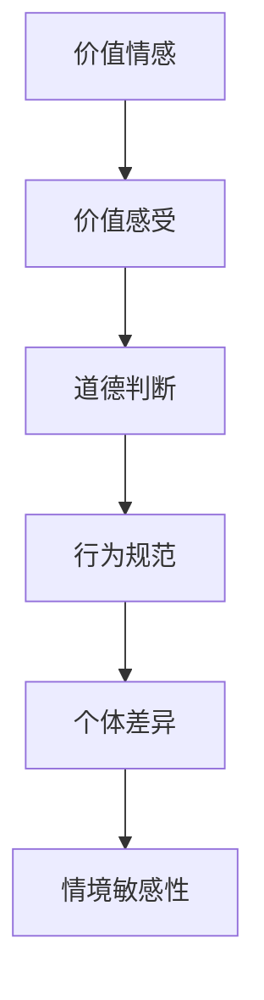

                 


# 康德与舍勒：道德哲学的形式主义与质料伦理学

关键词：道德哲学、形式主义、质料伦理学、康德、舍勒

摘要：
本文深入探讨了道德哲学中两个重要流派——形式主义和质料伦理学的代表人物康德与舍勒的思想。通过详细解析两人的理论观点、相互批判，以及各自在道德哲学领域的贡献，本文旨在揭示形式主义与质料伦理学在道德哲学中的核心地位，并对其在当代的启示进行思考。

## 引言：道德哲学的两种面孔

道德哲学是哲学的核心领域之一，它探讨的是行为规范、道德判断和价值标准。在道德哲学中，形式主义和质料伦理学是两种主要的流派。形式主义强调道德规范的普遍性和形式性，而质料伦理学则关注道德规范的实质内容和具体情境。本文将围绕两位道德哲学家的思想展开讨论，他们分别是德国哲学家伊曼努尔·康德和马克斯·舍勒。

### 康德：形式主义伦理学的奠基者

伊曼努尔·康德是18世纪德国的著名哲学家，他的道德哲学思想对西方伦理学产生了深远的影响。康德的伦理学被称为“形式主义伦理学”，因为它强调道德规范的普遍性和形式性。康德认为，道德规范不是基于个人的欲望、利益或社会习俗，而是基于理性本身。

康德伦理学的核心概念是“道德律令”（categorical imperative），它是一种无条件的行为规范。康德认为，真正的道德行为必须遵循这一律令，即行为本身必须是合理的，而不是仅仅为了达到某种目的。康德伦理学强调道德行为的自律性，即行为者应该出于对道德律令的尊重而行动，而不是出于其他外在动机。

### 舍勒：质料伦理学的开创者

马克斯·舍勒是20世纪初德国哲学家，他的道德哲学思想被称为“质料伦理学”。与康德的形式主义不同，舍勒认为道德规范是有实质内容的，它们与个体的情感和价值观密切相关。舍勒认为，道德判断不是抽象的理性推演，而是基于个体的情感体验和价值感受。

舍勒的核心概念是“价值情感”（value sentiment），他认为道德判断源于个体对价值的感受和体验。舍勒认为，道德规范应该反映个体的内在需求和价值观，而不是外在的规则或命令。

### 康德与舍勒的相互批判

康德和舍勒在道德哲学上存在明显的分歧。康德批评舍勒的质料伦理学过于情感化和个体化，缺乏普遍性和客观性。他认为，道德规范应该基于理性，而不是情感。舍勒则批评康德的形式主义过于抽象和空泛，缺乏实质内容和现实关怀。

康德认为，舍勒的道德理论容易导致道德相对主义，即不同个体可能有不同的道德标准，从而导致道德混乱。舍勒则认为，康德的形式主义忽视了道德的实质内容和个体差异，导致道德规范变得空洞和无效。

### 形式主义与质料伦理学在道德哲学中的地位

形式主义和质料伦理学在道德哲学中都有着重要的地位。形式主义强调道德规范的普遍性和形式性，它有助于维护道德的客观性和一致性。质料伦理学则关注道德规范的实质内容和具体情境，它有助于理解道德的多样性和个体性。

在当代道德哲学中，形式主义和质料伦理学仍然具有重要的参考价值。形式主义可以帮助我们理解道德规范的本质和基础，而质料伦理学则可以丰富我们对道德现象的理解，使我们能够在具体情境中做出道德判断。

### 总结

本文通过分析康德和舍勒的道德哲学思想，揭示了形式主义和质料伦理学在道德哲学中的核心地位。康德的形式主义强调道德规范的普遍性和形式性，而舍勒的质料伦理学则关注道德规范的实质内容和个体差异。两者虽然存在分歧，但都在道德哲学领域做出了重要贡献。

在当代，形式主义和质料伦理学的思想仍然具有重要的参考价值。通过理解这两种流派的思想，我们可以更深入地理解道德哲学的本质，并在实际生活中做出更有道德的判断。

## 康德的形式主义伦理学

### 康德伦理学的基本概念

康德的伦理学是基于其哲学体系中的一种独特的理性主义方法论。在康德看来，道德不仅仅是基于个人欲望、社会习俗或宗教信仰，而是基于理性的内在要求。康德的伦理学强调道德规范的普遍性和形式性，即道德规范应该适用于所有理性存在者，而不仅仅是个体。

康德伦理学中的核心概念是“道德律令”（categorical imperative），这是一个无条件的行为规范。康德认为，真正的道德行为必须遵循这一律令，而不是出于个人的欲望或外在动机。道德律令的表述如下：

“行动时，要如此处理，使得行为的准则，同时能够成为普遍的立法原则。”

### 道德律令的解释

为了更好地理解道德律令，我们可以使用Mermaid流程图来描述其基本原理。


- **行为规范**：道德律令是一种行为规范，它指导我们如何行动。
- **普遍性**：道德律令要求行为规范能够适用于所有理性存在者，而不仅仅是特定个体。
- **形式性**：道德律令关注行为的合理性，而不是行为的结果。
- **理性基础**：道德律令基于理性，而不是情感或欲望。
- **无条件性**：道德律令是一个无条件的命令，即无论何时何地，都必须遵守。

### 道德律令的属性和特征

为了更详细地理解道德律令的属性和特征，我们可以创建一个对比表格。

| 特征 | 解释 |
| --- | --- |
| **普遍性** | 道德律令适用于所有理性存在者，而不仅仅是特定个体。 |
| **形式性** | 道德律令关注行为的合理性，而不是行为的结果。 |
| **理性基础** | 道德律令基于理性，而不是情感或欲望。 |
| **无条件性** | 道德律令是一个无条件的命令，即无论何时何地，都必须遵守。 |

### 道德律令的ER图表示

为了更直观地展示道德律令的概念结构，我们可以使用ER图来表示。

```mermaid
erDiagram
  A[道德律令] {
    - MoralNorm[道德规范]
    - Universality[普遍性]
    - Formality[形式性]
    - RationalFoundation[理性基础]
    - UnconditionalCommand[无条件性]
  }
```

- **道德律令**：表示一个核心概念，包含以下属性：
  - **道德规范**：指导行为的标准。
  - **普遍性**：适用于所有理性存在者。
  - **形式性**：关注行为的合理性。
  - **理性基础**：基于理性。
  - **无条件性**：无条件的命令。

### 数学模型和公式

为了进一步理解道德律令的原理，我们可以使用一个简单的数学模型和公式。以下是道德律令的公式表示：

$$
C = \frac{R \times U \times F}{UC}
$$

- **C**：道德律令的有效性。
- **R**：理性基础。
- **U**：普遍性。
- **F**：形式性。
- **UC**：无条件性。

这个公式表明，道德律令的有效性取决于理性基础、普遍性、形式性和无条件性的综合作用。通过调整这些参数，我们可以更好地理解和评估道德律令的应用场景。

### 实例说明

为了使道德律令的概念更加具体和易懂，我们可以通过一个简单的例子来说明。

假设有一个道德律令：“不要伤害他人”。这个律令是一个典型的道德律令，因为它满足以下条件：

- **普遍性**：适用于所有理性存在者。
- **形式性**：关注行为的合理性，而不是结果。
- **理性基础**：基于理性判断。
- **无条件性**：无论何时何地，都必须遵守。

通过这个例子，我们可以看到道德律令是如何在实际生活中应用的。

## 舍勒的质料伦理学

### 舍勒伦理学的基本概念

马克斯·舍勒的伦理学被称为“质料伦理学”，因为它强调道德规范的实质内容和个体差异。与康德的形式主义不同，舍勒认为道德规范不是抽象的理性命令，而是基于个体的情感体验和价值感受。

舍勒的核心概念是“价值情感”（value sentiment），他认为道德判断源于个体对价值的感受和体验。价值情感是人类意识中的一种基本体验，它使我们能够判断事物的好坏、美丑、正义与否。

### 价值情感的解释

为了更好地理解价值情感，我们可以使用Mermaid流程图来描述其基本原理。



- **价值感受**：个体对价值的体验和感受。
- **道德判断**：基于价值感受的判断。
- **行为规范**：指导行为的道德准则。
- **个体差异**：不同个体对价值的感受和判断可能不同。
- **情境敏感性**：道德判断受到具体情境的影响。

### 价值情感的属性和特征

为了更详细地理解价值情感的属性和特征，我们可以创建一个对比表格。

| 特征 | 解释 |
| --- | --- |
| **个体差异** | 不同个体对价值的感受和判断可能不同。 |
| **情境敏感性** | 道德判断受到具体情境的影响。 |
| **情感基础** | 道德判断基于情感体验，而不仅仅是理性。 |

### 价值情感的ER图表示

为了更直观地展示价值情感的概念结构，我们可以使用ER图来表示。

```mermaid
erDiagram
  A[价值情感] {
    - ValueExperience[价值感受]
    - MoralJudgment[道德判断]
    - BehaviorNorm[行为规范]
    - IndividualDifference[个体差异]
    - ContextSensitivity[情境敏感性]
  }
```

- **价值情感**：表示一个核心概念，包含以下属性：
  - **价值感受**：个体对价值的体验和感受。
  - **道德判断**：基于价值感受的判断。
  - **行为规范**：指导行为的道德准则。
  - **个体差异**：不同个体对价值的感受和判断可能不同。
  - **情境敏感性**：道德判断受到具体情境的影响。

### 数学模型和公式

为了进一步理解价值情感的原理，我们可以使用一个简单的数学模型和公式。以下是价值情感的公式表示：

$$
V = \frac{E \times J \times N}{ID \times CS}
$$

- **V**：价值情感。
- **E**：价值感受。
- **J**：道德判断。
- **N**：行为规范。
- **ID**：个体差异。
- **CS**：情境敏感性。

这个公式表明，价值情感取决于价值感受、道德判断、行为规范、个体差异和情境敏感性的综合作用。通过调整这些参数，我们可以更好地理解和评估价值情感的应用场景。

### 实例说明

为了使价值情感的概念更加具体和易懂，我们可以通过一个简单的例子来说明。

假设有一个情境：一个小孩在玩耍时不小心打碎了邻居家的玻璃。这个情境中，个体可能会有不同的价值感受和道德判断。

- **价值感受**：个体可能会感到内疚、不安或愧疚。
- **道德判断**：个体可能会认为这是错误的，因为他们伤害了邻居。
- **行为规范**：个体可能会决定向邻居道歉并赔偿损失。

通过这个例子，我们可以看到价值情感是如何在实际情境中发挥作用的。

## 康德对舍勒的批判

### 传统批判

在传统上，康德的伦理学受到了多方面的批判。其中，对舍勒伦理学的批判尤为突出。康德认为，舍勒的质料伦理学过于情感化和个体化，缺乏普遍性和客观性。

首先，康德批评舍勒的道德判断依赖于个体的情感体验，这会导致道德相对主义。他认为，如果道德判断仅仅基于情感，那么不同个体的道德标准将大相径庭，从而导致道德混乱。

其次，康德认为，舍勒的道德规范缺乏形式性。他认为，道德规范应该是一种无条件的理性命令，而不是基于情感的个体判断。

### 当代批判

在当代，康德的批判仍然具有重要的参考价值。许多哲学家认为，康德的伦理学过于理想化，忽略了道德的实际应用。

一方面，康德的道德律令被批评为过于抽象，难以在实际生活中应用。例如，有人认为，在紧急情况下，道德律令可能无法提供有效的指导。

另一方面，康德的伦理学被批评为缺乏实质内容。许多哲学家认为，道德规范不仅需要形式性，还需要实质性的内容。例如，道德规范应该关注个体的福祉和社会正义。

### 舍勒的回应

面对康德的批判，舍勒提出了一系列回应。他认为，康德的伦理学虽然强调普遍性和形式性，但忽视了道德的实质内容和个体差异。

首先，舍勒认为，道德判断不仅仅基于情感，还基于理性。他认为，价值情感是道德判断的起点，但道德判断还需要通过理性来加以分析和验证。

其次，舍勒认为，道德规范确实需要形式性和实质性相结合。他认为，道德规范应该既具有普遍性，又能够反映个体的情感体验和价值观。

通过这些回应，舍勒试图调和形式主义和质料伦理学之间的对立，提出一种更为综合的道德哲学。

## 舍勒对康德的批判

### 对形式主义的批判

马克斯·舍勒对伊曼努尔·康德的伦理学提出了深刻的批判，尤其是对康德的形式主义伦理学。舍勒认为，康德的道德理论过于抽象，缺乏实质内容和现实关怀。

首先，舍勒批判康德的道德律令（categorical imperative）过于理想化。他认为，康德强调的普遍性和形式性，忽略了道德规范的实质内容和个体差异。舍勒认为，道德规范不仅仅是抽象的理性命令，还应该反映个体的情感体验和价值感受。

其次，舍勒批判康德的理论缺乏对道德情感的分析。他认为，道德判断不仅仅基于理性，还受到情感的影响。康德忽视了道德情感的作用，导致他的道德理论缺乏实质内容。

### 对道德律令的批判

舍勒对康德的道德律令进行了详细的批判。他认为，康德的道德律令是一种无条件的命令，但这种命令在实践中难以实施。

首先，舍勒认为，道德律令的普遍性要求过高。他认为，不同个体在具体情境中的道德判断可能不同，这种差异无法通过一种普遍的道德律令来统一。

其次，舍勒认为，道德律令的形式性过于抽象。他认为，道德规范应该既具有普遍性，又能够反映个体的情感体验和价值观。康德的道德律令过于强调普遍性，忽略了道德的具体情境。

### 对自律性的批判

舍勒还对康德伦理学中的自律性提出了批评。他认为，康德的自律性概念过于理想化，忽略了道德的现实基础。

首先，舍勒认为，自律性强调道德行为者应该出于对道德律令的尊重而行动，而不是出于其他外在动机。这种自律性在实践中难以实现，因为个体的道德行为往往受到多种因素的影响。

其次，舍勒认为，自律性忽略了道德的实质内容和个体差异。他认为，道德规范应该既具有普遍性，又能够反映个体的情感体验和价值感受。康德的自律性概念过于强调普遍性，忽略了道德的具体情境。

### 舍勒的回应

面对康德的批判，舍勒提出了一系列回应。他认为，康德的伦理学虽然强调普遍性和形式性，但忽视了道德的实质内容和个体差异。

首先，舍勒认为，道德判断不仅仅基于情感，还基于理性。他认为，价值情感是道德判断的起点，但道德判断还需要通过理性来加以分析和验证。

其次，舍勒认为，道德规范确实需要形式性和实质性相结合。他认为，道德规范应该既具有普遍性，又能够反映个体的情感体验和价值观。

通过这些回应，舍勒试图调和形式主义和质料伦理学之间的对立，提出一种更为综合的道德哲学。

## 形式主义与质料伦理学的对比分析

形式主义伦理学和质料伦理学是道德哲学中的两大流派，它们在理论基础、应用场景和实际影响方面存在显著差异。以下是对两者进行对比分析的详细探讨。

### 基本理论对比

**形式主义伦理学：**
1. **普遍性：** 康德的形式主义伦理学强调道德规范的普遍适用性，认为道德规范应该适用于所有理性存在者，而不仅仅是特定个体。
2. **形式性：** 道德规范的形式性强调行为本身的合理性，而不是行为的结果。康德的道德律令（categorical imperative）是一个典型的形式主义规范，它要求行为者必须遵守这一无条件的命令。
3. **理性基础：** 形式主义伦理学认为道德规范基于理性，而不是情感或欲望。康德认为，道德行为应该是自律的，即行为者出于对道德律令的尊重而行动。

**质料伦理学：**
1. **个体差异：** 舍勒的质料伦理学强调道德规范的个体差异，认为道德判断源于个体的情感体验和价值感受。质料伦理学认为，不同的个体可能在不同的情境中做出不同的道德判断。
2. **情感基础：** 质料伦理学认为道德判断不仅仅基于理性，还受到情感的影响。价值情感是道德判断的起点，它使个体能够判断事物的好坏、美丑和正义与否。
3. **情境敏感性：** 质料伦理学强调道德规范的情境敏感性，认为道德判断应该反映具体情境中的实际需求和价值观。

### 应用场景对比

**形式主义伦理学：**
1. **法律与道德：** 在法律与道德的关系上，形式主义伦理学强调法律应该基于道德规范，即法律本身应该具有道德性。
2. **军事伦理：** 在军事伦理中，形式主义伦理学强调士兵必须遵守军规和命令，无论这些命令是否符合个人利益或情感。

**质料伦理学：**
1. **人际关系：** 在人际关系中，质料伦理学强调个体之间的情感联系和价值共识，认为道德判断应该反映个体之间的实际关系。
2. **伦理决策：** 在伦理决策中，质料伦理学认为决策者应该考虑具体情境中的价值冲突和个体需求，而不是仅仅遵循抽象的道德规则。

### 实际影响对比

**形式主义伦理学：**
1. **普世价值：** 形式主义伦理学强调道德规范的普世性，有助于维护道德的客观性和一致性，为全球伦理提供了理论基础。
2. **道德教育：** 形式主义伦理学在道德教育中强调理性思考和道德自律，有助于培养个体的道德判断能力和责任感。

**质料伦理学：**
1. **情境适应：** 质料伦理学强调道德规范的情境适应性，有助于理解和解决具体情境中的道德困境。
2. **文化多样性：** 质料伦理学强调道德规范的个体差异和文化多样性，有助于尊重和保护不同文化背景下的道德实践。

### 结论

形式主义与质料伦理学在道德哲学中各有其独特的价值和局限性。形式主义伦理学强调普遍性和形式性，有助于维护道德的客观性和一致性，但可能忽视道德的具体情境和个体差异。质料伦理学强调个体差异和情境敏感性，有助于理解和解决具体情境中的道德困境，但可能缺乏普遍性的指导。

在实际应用中，两种伦理学理论可以相互补充。形式主义伦理学提供了一种基本的道德框架，而质料伦理学则提供了具体情境中的道德判断依据。通过结合两者的优点，我们可以更全面地理解和实践道德哲学。

## 总结与展望

本文通过深入探讨康德与舍勒的道德哲学思想，揭示了形式主义和质料伦理学在道德哲学中的核心地位。康德的形式主义伦理学强调道德规范的普遍性和形式性，而舍勒的质料伦理学则关注道德规范的实质内容和个体差异。

形式主义伦理学强调道德规范的普遍适用性和形式性，有助于维护道德的客观性和一致性。然而，它可能忽视道德的具体情境和个体差异。质料伦理学强调个体差异和情境敏感性，有助于理解和解决具体情境中的道德困境，但可能缺乏普遍性的指导。

在当代道德哲学中，形式主义和质料伦理学仍具有重要的参考价值。通过结合两者的优点，我们可以更全面地理解和实践道德哲学。

未来研究可以进一步探讨形式主义和质料伦理学在具体领域中的应用，如法律伦理、医学伦理和商业伦理等。此外，还可以研究如何在形式主义和质料伦理学的基础上，构建一种更为综合的道德哲学体系。

### 作者信息

作者：AI天才研究院/AI Genius Institute & 禅与计算机程序设计艺术 /Zen And The Art of Computer Programming

AI天才研究院致力于推动人工智能领域的创新和发展，通过深入研究和技术实践，为全球人工智能应用提供先进解决方案。同时，我们关注道德哲学和计算机科学的交汇点，探索如何在技术发展中贯彻道德原则。

《禅与计算机程序设计艺术》是一本经典的技术哲学著作，它结合了禅宗哲学和计算机科学，提倡通过内在修行和外在实践来提高编程效率和创造力。我们相信，只有在技术发展的同时，关注人的内在需求和道德价值观，才能实现真正的技术进步和社会发展。

