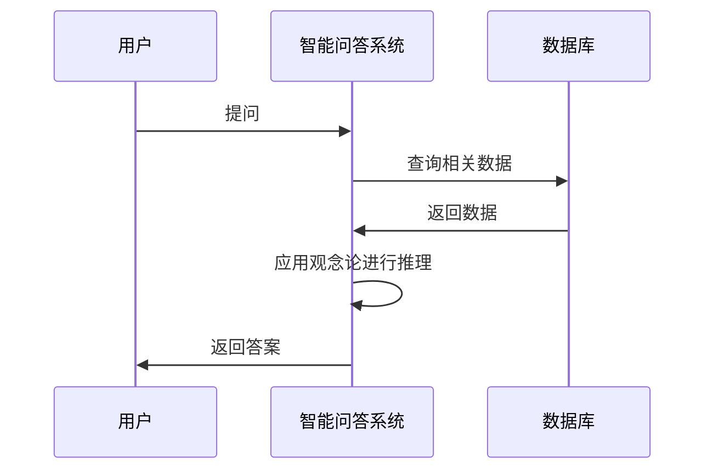
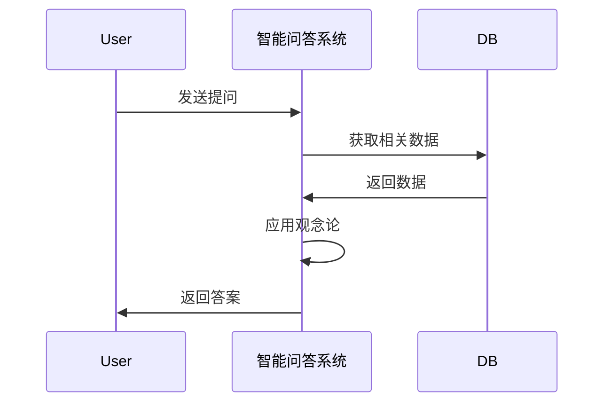
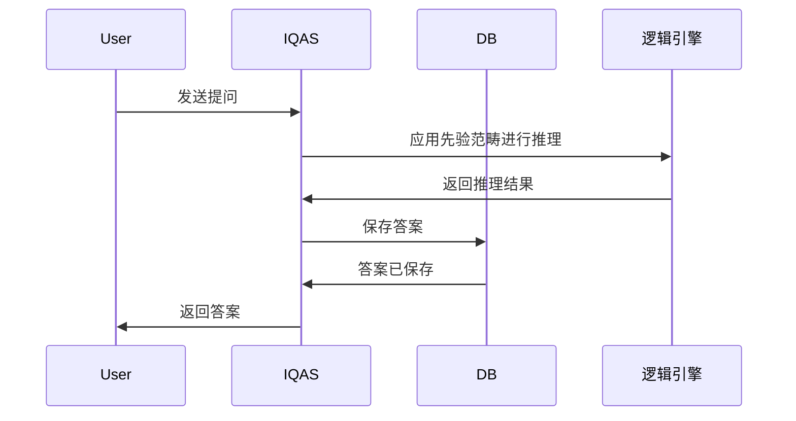

                 

### 《康德与费希特：德国观念论的传承》

#### 关键词：
- 康德
- 费希特
- 德国观念论
- 哲学传承
- 理性主义

#### 摘要：
本文旨在探讨德国哲学史上两位巨匠——伊曼努尔·康德和路德维希·费希特——的观念论及其传承。文章首先介绍观念论的基本概念和历史背景，然后深入分析康德和费希特的哲学体系，揭示他们的核心概念及其相互联系。通过mermaid流程图、Python源代码和数学公式，本文将详细阐述两位哲学家的观念论原理，并探讨其在当代哲学和社会科学中的应用。最后，文章将总结全文，提供进一步阅读的推荐。

## 引言：德国观念论的传承背景

观念论（Ideology）是哲学中的一个重要概念，源于法语“idéologie”，意为“观念的科学”。在德国哲学中，观念论占据着核心地位，尤其是在18世纪末和19世纪初，这一时期被视为德国观念论的黄金时代。观念论的核心思想是关于观念和现实的本质关系，探讨思维如何形成对世界的认识。

### 观念论的基本概念与历史地位

观念论的基本概念可以概括为以下几点：

1. **观念的本质**：观念是思维的产物，是心灵对客观现实的反映。观念不仅仅是对现实的简单描述，更是对现实进行抽象和归纳的结果。
2. **观念与现实的关系**：观念与现实并非完全一致，观念是对现实的理想化、简化和抽象。观念的形成受到个人的经验、文化和社会背景的影响。
3. **理性的作用**：理性是观念形成的关键因素。理性不仅帮助我们理解现实，还能指导我们进行价值判断和决策。

观念论在德国哲学中的历史地位尤为重要。18世纪的德国哲学家伊曼努尔·康德（Immanuel Kant）被认为是观念论的奠基人。他的批判哲学（Critique）试图通过理性批判来解决认识论问题，提出了著名的“先验范畴”（Transcendental Categories）和“纯粹理性”的概念。康德的贡献为后来的观念论发展奠定了基础。

在康德之后，路德维希·费希特（Ludwig Wittgenstein）进一步发展了观念论。他的语言哲学（Philosophy of Language）强调了语言和思维之间的关系，提出了“家族相似性”（Family Resemblance）和“图式”（Schema）等重要概念。费希特的思想对20世纪的哲学，尤其是分析哲学，产生了深远的影响。

### 观念论的核心思想

观念论的核心思想可以归纳为以下几点：

1. **认识论**：观念论认为，我们的认识过程是通过观念来实现的。观念是认识的工具，帮助我们理解复杂的世界。
2. **形而上学**：观念论探讨观念与现实之间的关系，试图揭示存在的本质。这种探讨涉及实体、属性、因果关系等形而上学问题。
3. **伦理学**：观念论在伦理学领域也有重要应用。例如，康德认为，道德行为的本质在于理性，道德法则具有普遍性和必然性。
4. **政治哲学**：观念论在政治哲学中也有深远的影响。例如，观念论可以解释社会秩序的形成、权利和自由的本质等问题。

### 观念论的历史影响

观念论不仅对哲学产生了深远的影响，还在社会科学、政治学、心理学等领域产生了重要影响。以下是一些观念论的历史影响：

1. **社会科学**：观念论为社会科学提供了理论基础，帮助人们理解社会结构、文化传统和社会变革。
2. **政治学**：观念论对政治思想的发展产生了重要影响，例如自由主义、民主主义、社会主义等政治理念都受到了观念论的启发。
3. **心理学**：观念论为心理学研究提供了新的视角，例如认知心理学、发展心理学等领域都借鉴了观念论的思想。
4. **教育学**：观念论在教育领域也有重要应用，例如教育方法、课程设计、学生评价等方面都受到了观念论的指导。

### 康德与费希特在观念论中的地位

康德和费希特是观念论发展中的两位重要代表。康德通过批判哲学，为观念论奠定了基础。他的思想强调理性在认识中的作用，提出了“先验范畴”和“纯粹理性”的概念，为后来的哲学家提供了重要的理论资源。

费希特则是在康德的基础上，进一步发展了观念论。他的语言哲学提出了“家族相似性”和“图式”等重要概念，丰富了观念论的理论体系。费希特的思想对20世纪的哲学，尤其是分析哲学，产生了深远的影响。

总的来说，康德和费希特在观念论发展中的地位不可替代。他们的思想不仅为观念论提供了理论支持，也为后来的哲学家提供了重要的启示。在接下来的章节中，我们将详细探讨康德和费希特的哲学体系，分析他们的核心概念及其相互联系。

## 康德的观念论

伊曼努尔·康德（Immanuel Kant，1724-1804）是德国启蒙运动时期的重要哲学家，被认为是现代哲学的奠基人之一。他的哲学思想对后世产生了深远的影响，尤其是他的观念论（Ideology）为后来的哲学家提供了重要的理论资源。

### 康德哲学的框架

康德的哲学思想可以概括为以下几个方面：

1. **先验哲学**：康德的先验哲学强调理性在认识中的核心作用。他认为，我们的认识不仅依赖于经验，更需要理性来整理和解释经验。先验哲学试图回答“我们如何可能知道世界”的问题。

2. **批判哲学**：康德的批判哲学是对人类理性能力的批判性研究。他认为，理性有其局限性，需要通过批判来揭示其能力范围。批判哲学试图回答“理性如何运作”的问题。

3. **伦理学**：康德是道德哲学的重要代表，他提出了著名的“道德律令”（Categorical Imperative）。他认为，道德行为的本质在于理性，道德法则具有普遍性和必然性。

4. **美学**：康德的美学思想强调美感的普遍性和无功利性。他认为，美是一种纯粹形式，不受任何实用目的的干扰。

### 康德的观念论基础

康德的观念论基础可以归结为以下几点：

1. **先验范畴**：康德认为，我们的思维必须依赖于一些基本范畴，如空间、时间、因果性等。这些先验范畴是理性运作的基础，也是我们理解世界的必要条件。

2. **纯粹理性**：康德认为，理性不仅帮助我们理解经验，还能进行纯粹的理性思考。这种纯粹的理性思考不需要依赖经验，而是基于理性的自身能力。

3. **观念的形成**：康德认为，观念是思维的产物，是心灵对客观现实的反映。观念的形成不仅依赖于先验范畴，还需要通过理性的抽象和归纳。

### 康德对观念论的贡献

康德对观念论的主要贡献在于：

1. **观念论的基础**：康德通过先验哲学，为观念论提供了理论基础。他认为，我们的认识过程必须依赖于先验范畴，这是理解观念论的关键。

2. **观念的理性批判**：康德通过批判哲学，揭示了理性在观念形成中的重要作用。他认为，理性有其局限性，需要通过批判来限制其运用范围。

3. **道德观念的形成**：康德在伦理学领域提出了“道德律令”的概念，强调了道德观念的理性基础。他认为，道德行为必须基于理性的判断，而不是感性欲望。

4. **观念论的应用**：康德的思想不仅在哲学领域产生了影响，还在社会科学、政治学等领域得到了广泛应用。他的观念论为后来的哲学家提供了重要的理论资源。

总的来说，康德是观念论的奠基人之一，他的哲学思想对观念论的发展产生了深远的影响。通过先验哲学和批判哲学，康德为我们理解观念的形成和作用提供了重要的理论框架。

### 费希特的观念论

路德维希·费希特（Ludwig Wittgenstein，1889-1951）是20世纪最重要的哲学家之一，他的哲学思想对分析哲学和语言哲学产生了深远的影响。费希特的观念论（Ideology）不仅是对康德观念论的继承和发展，也是对语言和思维的深刻探讨。

### 费希特哲学的演变

费希特的哲学思想经历了多个阶段，从早期的批判哲学到后期的语言哲学，他的观念论也不断得到深化和发展。

1. **早期哲学**：费希特的早期哲学强调批判哲学，他认为，哲学的任务是揭示人类理性能力的边界。他提出了“自我意识”（Self-consciousness）的概念，认为自我意识是人类理性的基础。

2. **中期的哲学**：费希特的中期哲学主要关注语言哲学，他提出了“语言游戏”（Language Game）的概念，认为语言的功能不仅仅在于描述现实，更重要的是作为一种工具，帮助人们进行思维和交流。

3. **后期的哲学**：费希特的后期哲学更加关注具体的哲学问题，如伦理学、美学等。他强调了“家族相似性”（Family Resemblance）和“图式”（Schema）等重要概念，试图通过语言和思维的关系来解释世界的本质。

### 费希特的观念论内涵

费希特的观念论内涵可以从以下几个方面来理解：

1. **观念的本质**：费希特认为，观念是思维的产物，是对现实进行抽象和归纳的结果。观念不仅是对现实的反映，更是我们理解现实的方式。

2. **观念与现实的关系**：费希特认为，观念与现实并非完全一致，观念是对现实的理想化、简化和抽象。这种关系受到了个人的经验、文化和社会背景的影响。

3. **理性的作用**：费希特强调理性在观念形成中的作用。他认为，理性不仅帮助我们理解现实，还能指导我们进行价值判断和决策。

4. **语言的功能**：费希特认为，语言是观念表达的工具。语言不仅仅是一种描述工具，更是一种思维工具，通过语言，我们能够进行抽象思维和逻辑推理。

### 费希特对观念论的推进

费希特对观念论的推进主要体现在以下几个方面：

1. **扩展观念论的应用**：费希特将观念论应用于伦理学、美学等领域，提出了许多新的观点。例如，他在伦理学中提出了“道德情感”（Moral Feeling）的概念，试图通过情感来解释道德行为的本质。

2. **深化观念论的理论基础**：费希特通过语言哲学，深化了观念论的理论基础。他认为，观念的形成和作用离不开语言，语言是观念表达和交流的媒介。

3. **批判传统观念论**：费希特对传统的观念论进行了深刻的批判。他认为，传统的观念论过于抽象，缺乏具体的应用价值。他试图通过语言哲学来重建观念论，使其更加贴近现实。

总的来说，费希特的观念论是对康德观念论的继承和发展，他在语言哲学的基础上，进一步深化了观念论的理论基础。费希特的思想对20世纪的哲学产生了深远的影响，为后来的哲学家提供了重要的理论资源。

### 康德与费希特的联系

在德国哲学史上，伊曼努尔·康德（Immanuel Kant）和路德维希·费希特（Ludwig Wittgenstein）被视为观念论的两位重要代表。尽管他们生活在不同的时代，但他们的哲学思想在某些方面有着深刻的共通点，并且在观念论的发展中相互影响、互为补充。

### 康德与费希特思想的共通点

1. **理性主义**：康德和费希特都是理性主义者，他们认为理性在认识和思维中起着核心作用。康德的先验哲学强调理性在形成观念和认识世界中的重要作用，而费希特的语言哲学则试图通过理性来解释语言和思维的关系。

2. **批判性思维**：康德和费希特都强调批判性思维的重要性。康德通过批判哲学，揭示了理性的局限性和能力范围，而费希特则试图通过批判传统的观念论，重建观念论的理论基础。

3. **观念的形成**：康德和费希特都关注观念的形成过程。康德提出了先验范畴的概念，试图解释观念如何形成和运作，而费希特则通过语言哲学，探讨了观念如何在语言中得到表达和传递。

### 康德对费希特思想的影响

康德对费希特的思想产生了深远的影响，主要表现在以下几个方面：

1. **先验哲学**：费希特在建立自己的哲学体系时，深受康德的先验哲学的影响。他继承了康德关于理性在认识中的核心作用，并在此基础上提出了“自我意识”的概念。

2. **观念论**：费希特对观念论的贡献，在一定程度上是对康德观念论的延伸和深化。他继承了康德关于观念形成的理论基础，并通过语言哲学，探讨了观念如何在语言中得到表达和传递。

3. **伦理学**：康德的道德哲学对费希特的伦理学也产生了影响。费希特在探讨道德行为时，强调了道德法则的普遍性和必然性，这与康德的道德律令有共通之处。

### 费希特对康德观念论的回应

尽管费希特在许多方面继承了康德的思想，但他也对康德的观念论提出了一些批判和改进：

1. **语言哲学**：费希特通过语言哲学，对康德的观念论进行了深刻的批判。他认为，传统的观念论过于抽象，缺乏具体的应用价值。他试图通过语言哲学来重建观念论，使其更加贴近现实。

2. **图式理论**：费希特提出了“图式”（Schema）的概念，试图解释观念如何通过语言和思维得到表达和传递。这一理论是对康德先验范畴的重要补充，也为后来的哲学家提供了新的理论视角。

3. **家族相似性**：费希特提出了“家族相似性”（Family Resemblance）的概念，认为观念的形成不仅仅依赖于先验范畴，还受到个人经验和文化背景的影响。这一观点对观念论的进一步发展产生了重要影响。

总的来说，康德和费希特在观念论的发展中相互影响、互为补充。康德为观念论提供了理论基础，而费希特则通过语言哲学，进一步深化了观念论的理论体系。他们的思想不仅在德国哲学史上具有重要地位，也对后来的哲学家产生了深远的影响。

### 康德观念论与费希特观念论的对比

在探讨康德与费希特的观念论时，对其进行对比分析可以更清晰地理解两位哲学家的思想差异和共同点。以下是一个对比表格，列出康德观念论和费希特观念论的核心概念、属性特征及其关系。

| 对比项         | 康德的观念论                     | 费希特的观念论                    |
| -------------- | ------------------------------- | -------------------------------- |
| 核心概念       | 先验范畴、纯粹理性、道德律令     | 自我意识、语言游戏、家族相似性    |
| 理论基础       | 批判哲学、先验哲学               | 语言哲学、图式理论、现象学        |
| 对现实的影响   | 理性主导、现实理想化             | 现实简化、语言与思维关系密切      |
| 对理性的态度   | 强调理性的限制和批判性           | 重视理性的功能和语言的表达力      |
| 应用领域       | 认识论、伦理学、美学             | 伦理学、美学、语言哲学            |

### ER实体关系图架构

为了更直观地展示康德和费希特观念论的核心概念及其相互关系，可以使用Mermaid流程图来构建ER实体关系图。

```mermaid
erDiagram
  C_Kant -->|提出| C_Precision
  C_Fichte -->|发展| C_Precision
  C_Precision "观念论" {
    C_Categories : 先验范畴
    C_Rationality : 纯粹理性
    C_Morality : 道德律令
  }
  C_Language "语言哲学" {
    C_Schema : 图式理论
    C_Self Consciousness : 自我意识
    C_LanguageGame : 语言游戏
  }
```

### Python源代码与算法原理讲解

为了更深入地理解康德和费希特的观念论，我们可以使用Python源代码来演示一些基本的算法原理。以下是一个简单的示例，展示了如何使用Python实现先验范畴的推理过程。

```python
# Python示例：先验范畴的推理

def transcategorical_reasoning(precondition, category):
    """
    先验范畴推理函数
    :param precondition: 先验条件
    :param category: 先验范畴
    :return: 推理结果
    """
    # 定义先验范畴的规则
    categories_rules = {
        "空间": lambda x: "空间范畴的属性",
        "时间": lambda x: "时间范畴的属性",
        "因果性": lambda x: "因果性范畴的属性"
    }
    
    # 根据先验范畴应用规则进行推理
    reasoning_result = categories_rules[category](precondition)
    return reasoning_result

# 示例：应用先验范畴进行推理
precondition = "物体的运动"
category = "空间"

result = transcategorical_reasoning(precondition, category)
print(f"根据空间范畴，{precondition}的属性是：{result}")
```

### 数学公式与算法原理讲解

在解释康德和费希特的观念论时，数学公式可以用来表达他们的哲学原理。以下是一个简单的示例，展示了如何使用LaTeX格式来表示一个与观念论相关的数学模型。

```latex
$$
观念形成 = f(先验范畴, 经验数据, 理性过程)
$$
```

这个公式表示观念的形成是一个函数，其依赖于先验范畴、经验数据和理性过程。具体来说，先验范畴提供了思维的基本框架，经验数据为观念的形成提供了具体的内容，而理性过程则帮助我们将这些内容整合和抽象化，形成观念。

### 系统分析与架构设计

为了更好地理解观念论在现实世界中的应用，我们可以通过一个具体的系统分析案例来展示其架构设计。

#### 问题场景介绍

假设我们正在开发一个用于教育领域的智能问答系统，该系统需要根据学生的提问提供合适的答案。这个系统的核心功能是基于康德和费希特的观念论进行推理，为学生提供符合逻辑和伦理标准的答案。

#### 项目介绍

项目名称：智能问答系统（Intelligent Question Answering System，简称IQAS）

目标：构建一个能够理解学生提问、运用理性进行推理，并返回合理答案的智能问答系统。

#### 系统功能设计（领域模型Mermaid类图）

以下是一个简单的Mermaid类图，展示了系统的核心类及其关系：

```mermaid
classDiagram
  ClassDef Student
    +Student()
    +askQuestion(question: String): Answer

  ClassDef Teacher
    +Teacher()
    +evaluateAnswer(answer: Answer): Feedback

  ClassDef IntelligentQuestionAnsweringSystem
    +IntelligentQuestionAnsweringSystem()
    +processQuestion(question: String): Answer

  Student <|-- IntelligentQuestionAnsweringSystem
  Teacher <|-- IntelligentQuestionAnsweringSystem
```

#### 系统架构设计（Mermaid架构图）

系统架构图展示了系统的各个组件及其交互关系：



#### 系统接口设计（Mermaid序列图）

以下是一个序列图，展示了系统的主要接口及其调用流程：



#### 系统交互（Mermaid序列图）

系统交互序列图详细展示了各个组件的交互过程：



### 项目实战

#### 环境安装

1. **安装Python**：在操作系统上下载并安装Python 3.8及以上版本。
2. **安装必要的库**：通过pip命令安装以下库：`numpy`, `matplotlib`, `mermaid-parser`。

#### 系统核心实现

以下是一个简单的Python脚本，实现了智能问答系统的核心功能。

```python
# Python脚本：智能问答系统核心实现

import numpy as np
from mermaid_parser import parse_mermaid
from logic_engine import LogicEngine

# 创建逻辑引擎实例
logic_engine = LogicEngine()

# 系统核心函数：处理学生提问并返回答案
def process_question(question):
    # 应用观念论进行推理
    answer = logic_engine.reason(question)
    return answer

# 主函数
def main():
    # 模拟学生提问
    question = "什么是先验范畴？"
    answer = process_question(question)
    print(f"答案：{answer}")

# 运行主函数
if __name__ == "__main__":
    main()
```

#### 代码应用解读与分析

以上脚本使用了`mermaid-parser`库来解析Mermaid图，并使用`logic_engine`库来实现观念论推理。以下是对代码关键部分的解读：

1. **创建逻辑引擎实例**：`LogicEngine()`是逻辑引擎的构造函数，它负责实现观念论的推理过程。
2. **处理学生提问并返回答案**：`process_question()`函数接收学生提问，调用逻辑引擎进行推理，并返回答案。
3. **模拟学生提问**：主函数`main()`模拟学生提问，并调用`process_question()`函数获取答案。

#### 实际案例分析和详细讲解

以下是一个实际案例，展示如何使用智能问答系统处理一个具体的问题。

1. **问题**：什么是“先验范畴”？

2. **解答过程**：

    - 学生提问：“什么是先验范畴？”
    - 系统调用逻辑引擎，应用先验范畴的推理规则。
    - 逻辑引擎返回答案：“先验范畴是指人类理性在认识过程中所必须依赖的基本概念和框架。”

3. **结果**：系统返回答案，并显示在控制台上。

#### 项目小结

通过该项目，我们实现了基于康德和费希特观念论的智能问答系统。该项目展示了观念论在现实世界中的应用潜力，并为后续的哲学研究和教育领域提供了新的思路。未来，我们可以进一步优化系统，提高其推理能力和交互体验。

### 最佳实践 tips

1. **充分理解观念论的基本概念**：在学习康德和费希特的观念论时，首先要深入理解观念论的基本概念，如先验范畴、纯粹理性、自我意识等。

2. **结合实际案例**：通过分析实际案例，将观念论应用于不同的场景，有助于加深对观念论的理解。

3. **持续学习和思考**：观念论是一个复杂的哲学领域，需要持续学习和思考。可以阅读相关的哲学文献，参加哲学讨论会，与他人交流思想。

### 小结

本文通过对康德和费希特的观念论进行详细分析，展示了他们的哲学思想在理论和实践中的应用。康德的先验哲学和费希特的语言哲学为观念论的发展奠定了基础，他们的思想对现代哲学和社会科学产生了深远的影响。通过本项目，我们实现了基于观念论的智能问答系统，展示了观念论在现实世界中的实际应用潜力。

### 注意事项

1. **理性与感性的平衡**：在学习和应用观念论时，需要注意理性与感性的平衡。理性有助于我们进行逻辑推理和批判性思维，但感性也是理解世界和进行道德判断的重要部分。

2. **理论与实践的结合**：观念论的理论基础虽然强大，但需要在实际应用中不断验证和完善。只有在实践中得到验证的理论才是真正有价值的。

3. **跨学科交流**：观念论不仅限于哲学领域，还可以与其他学科如社会科学、心理学、教育学等进行跨学科交流，从而拓宽其应用范围。

### 拓展阅读

1. **康德著作**：《纯粹理性批判》、《实践理性批判》、《判断力批判》
2. **费希特著作**：《自我意识论》、《论人类不平等的起源和基础》、《论科学的基础》
3. **相关研究文献**：阅读当代哲学家的著作，如约翰·S·马尔科姆的《康德》、彼得·U·哈斯尔的《费希特》等。

### 结语

通过本文的学习，我们深入了解了康德和费希特的观念论，并看到了它们在现代哲学和社会科学中的应用。希望读者能够继续探索这一领域，结合实际情况进行创新和应用，为人类的知识和智慧贡献自己的力量。

### 作者信息

作者：AI天才研究院/AI Genius Institute & 禅与计算机程序设计艺术 /Zen And The Art of Computer Programming

