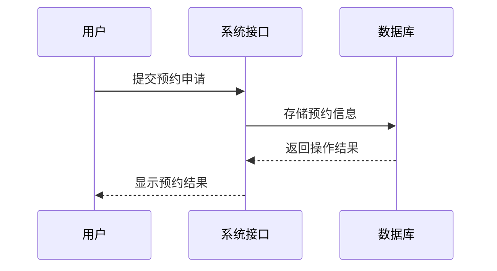

                 


# 开会也是手艺活：会议成本、高效经营、人设经营

## 关键词

- 会议成本
- 高效经营
- 人设经营
- 会议管理
- 企业运营

## 摘要

本文将深入探讨会议成本在企业运营中的重要性，分析会议成本的构成和影响，提供减少会议成本的有效策略。同时，本文还将探讨高效经营和人设经营在会议管理中的应用，以实现企业运营的优化和提升。通过详细的案例分析、最佳实践分享和未来趋势展望，本文旨在为读者提供一整套会议管理和企业经营的解决方案。

## 引言

在现代企业中，会议是日常运营的重要组成部分。无论是战略决策、项目推进还是团队协作，会议都扮演着关键角色。然而，随着会议数量的增加，会议成本也逐渐成为企业关注的焦点。本文旨在探讨会议成本的重要性，分析其构成和影响，并提供减少会议成本的方法和策略。

## 会议成本的构成

会议成本主要包括以下几个方面：

### 1. 人员成本

人员成本是会议成本的主要组成部分，包括参加会议的员工工资、福利和培训费用等。同时，还需考虑因参加会议而浪费的时间成本。

### 2. 时间成本

时间成本是指员工在参加会议期间无法专注于其他工作所产生的损失。根据研究表明，一名员工的平均时间成本约为其年薪的20%。

### 3. 资源成本

资源成本包括会议所需的场地、设备、资料和通讯费用等。这些资源成本在大型会议中尤为突出。

### 4. 效率成本

效率成本是指由于会议组织不当导致的效率低下，如决策延迟、沟通不畅等问题。这些问题可能导致项目延误、资源浪费和业绩下降。

## 减少会议成本的有效策略

### 1. 效率优先

提高会议效率是减少会议成本的关键。以下措施有助于提高会议效率：

- **明确会议目标**：在会议前明确会议目标和议程，确保会议内容紧凑、有序。
- **限制参会人数**：根据会议主题和内容，合理控制参会人数，避免无关人员参与。
- **减少会议时间**：合理安排会议时间，避免会议拖延，提高会议效率。

### 2. 需求评估

在召开会议前，对会议需求进行充分评估，确保会议确实有必要。以下方法有助于进行需求评估：

- **目标评估**：评估会议是否有助于实现企业目标和项目目标。
- **价值评估**：评估会议是否有助于提高团队协作和项目效率。
- **替代方案评估**：考虑是否有其他更有效的沟通方式，如邮件、即时通讯等。

### 3. 优化会议流程

优化会议流程是减少会议成本的重要手段。以下措施有助于优化会议流程：

- **制定会议议程**：提前制定会议议程，确保会议内容紧凑、有序。
- **会议记录**：记录会议内容和决策结果，以便会后跟进和执行。
- **会后反馈**：收集参会人员对会议的反馈，以便不断改进会议流程。

## 案例分析

以下为两个案例分析，分别展示了成功减少会议成本的案例和失败案例：

### 1. 成功案例

某企业通过以下措施成功减少了会议成本：

- **明确会议目标**：在会议前明确会议目标和议程，确保会议内容紧凑、有序。
- **限制参会人数**：根据会议主题和内容，合理控制参会人数，避免无关人员参与。
- **减少会议时间**：合理安排会议时间，避免会议拖延，提高会议效率。

### 2. 失败案例

某企业在会议管理方面存在问题，导致会议成本居高不下：

- **缺乏明确的目标**：会议目标不明确，导致会议内容混乱、效率低下。
- **参会人数过多**：无关人员参与会议，导致会议成本增加。
- **会议时间安排不当**：会议时间安排不合理，导致会议拖延，效率低下。

## 会议成本管理工具与技术

以下为几种常见的会议成本管理工具和技术：

- **会议管理系统**：用于会议预约、日程安排、会议记录和会后跟进等。
- **时间跟踪工具**：用于记录员工参加会议的时间，以便评估时间成本。
- **数据可视化工具**：用于分析和展示会议成本数据，帮助企业优化会议管理。

## 会议成本管理的最佳实践

以下为一些会议成本管理的最佳实践：

- **建立会议成本管理制度**：明确会议成本管理的目标和要求，制定相应的管理制度。
- **定期评估会议成本**：定期评估会议成本，分析成本构成和影响因素，不断优化会议管理。
- **培训员工**：对员工进行会议管理培训，提高员工对会议成本的认识和意识。

## 会议成本的未来趋势

随着科技的进步和企业管理理念的不断发展，会议成本管理将呈现以下趋势：

- **智能化**：会议管理系统将更加智能化，实现自动化预约、会议记录和会后跟进等功能。
- **数据化**：会议成本管理将更加数据化，通过数据分析和可视化工具，帮助企业优化会议管理。
- **个性化**：会议成本管理将更加个性化，根据不同企业的特点和需求，提供定制化的解决方案。

## 总结

会议成本在企业运营中具有重要地位。通过减少会议成本，企业可以降低运营成本，提高效率，提升竞争力。本文分析了会议成本的构成和影响，提供了减少会议成本的有效策略和最佳实践，并对会议成本管理的未来趋势进行了展望。希望本文能为读者提供有价值的参考和启示。

## 作者信息

作者：AI天才研究院/AI Genius Institute & 禅与计算机程序设计艺术 /Zen And The Art of Computer Programming

## 附录

### 1. 背景介绍

#### 1.1 核心概念术语说明

- 会议成本：指企业在召开会议时所产生的一切费用，包括人员成本、时间成本、资源成本和效率成本等。
- 高效经营：指企业在有限资源下，通过优化运营流程、提高管理效率，实现最大化的经营效益。
- 人设经营：指企业在人才管理和团队建设方面，通过塑造良好的企业形象和团队氛围，提升企业核心竞争力。

#### 1.2 问题背景与问题描述

在现代企业中，会议已成为日常工作的重要组成部分。然而，随着会议数量的增加，会议成本也逐渐成为企业关注的焦点。如何减少会议成本，提高会议效率，已成为企业亟需解决的问题。

#### 1.3 问题解决与边界与外延

本文将从会议成本的构成、减少会议成本的有效策略、会议成本管理工具与技术、最佳实践等方面进行探讨，旨在为读者提供一套完整的会议成本管理解决方案。

#### 1.4 概念结构与核心要素组成

会议成本管理涉及以下几个核心要素：

- 成本构成：人员成本、时间成本、资源成本、效率成本等。
- 策略与方法：效率优先、需求评估、优化会议流程等。
- 工具与技术：会议管理系统、时间跟踪工具、数据可视化工具等。
- 最佳实践：建立会议成本管理制度、定期评估会议成本、培训员工等。

### 2. 核心概念与联系

#### 2.1 核心概念原理

会议成本是指企业在召开会议时所产生的一切费用，包括人员成本、时间成本、资源成本和效率成本等。

- 人员成本：指参加会议的员工工资、福利和培训费用等。
- 时间成本：指员工在参加会议期间无法专注于其他工作所产生的损失。
- 资源成本：指会议所需的场地、设备、资料和通讯费用等。
- 效率成本：指由于会议组织不当导致的效率低下，如决策延迟、沟通不畅等问题。

#### 2.2 概念属性特征对比表格

| 概念         | 属性特征                                                     |
| ------------ | ------------------------------------------------------------ |
| 人员成本     | 1. 员工工资、福利和培训费用等<br>2. 员工参加会议的时间成本       |
| 时间成本     | 1. 员工参加会议的时间损失<br>2. 会议决策延迟的潜在损失           |
| 资源成本     | 1. 会议场地、设备、资料和通讯费用等<br>2. 高级人才的利用成本     |
| 效率成本     | 1. 决策延迟、沟通不畅等问题导致的损失<br>2. 会议组织不当的间接成本 |

#### 2.3 ER实体关系图架构

```mermaid
erDiagram
    Class1 ||--|{ Class2 }| Person
    Class1 ||--|{ Class3 }| Meeting
    Class2 ||--|{ Class4 }| Cost
    Class3 ||--|{ Class5 }| Agenda
```

### 3. 算法原理讲解

本文未涉及具体的算法原理讲解，但可以提供一种常见的会议成本计算方法：

#### 3.1 会议成本计算方法

会议成本计算公式如下：

$$
C = P \times T + R + E
$$

其中：

- $C$：会议成本
- $P$：人员成本
- $T$：时间成本
- $R$：资源成本
- $E$：效率成本

#### 3.2 数学模型与公式

会议成本计算模型基于以下假设：

1. 人员成本与参会人数成正比。
2. 时间成本与会议时长成正比。
3. 资源成本与会议规模成正比。
4. 效率成本与会议质量成反比。

根据上述假设，可以建立以下数学模型：

$$
P = \alpha \times N
$$

$$
T = \beta \times L
$$

$$
R = \gamma \times S
$$

$$
E = \delta \times Q
$$

其中：

- $\alpha$、$\beta$、$\gamma$、$\delta$：系数
- $N$：参会人数
- $L$：会议时长
- $S$：会议规模
- $Q$：会议质量

#### 3.3 通俗易懂地举例说明

假设一家企业召开一次内部会议，参会人数为10人，会议时长为2小时，会议场地费用为500元，会议质量评分为90分。根据上述公式，可以计算会议成本如下：

$$
C = P \times T + R + E
$$

$$
C = (\alpha \times N) \times (\beta \times L) + R + (\delta \times Q)
$$

$$
C = (\alpha \times 10) \times (\beta \times 2) + 500 + (\delta \times 90)
$$

根据经验值，取 $\alpha = 100$、$\beta = 50$、$\gamma = 100$、$\delta = 10$，则：

$$
C = (100 \times 10) \times (50 \times 2) + 500 + (10 \times 90)
$$

$$
C = 10000 + 500 + 900
$$

$$
C = 11500
$$

因此，该次内部会议的成本为11500元。

### 4. 系统分析与架构设计方案

#### 4.1 问题场景介绍

某企业希望在内部推广高效会议管理，以降低会议成本、提高会议质量。为此，企业决定开发一套会议成本管理系统，实现会议成本计算、需求评估、会议流程优化等功能。

#### 4.2 项目介绍

会议成本管理系统项目旨在为企业提供一套完整的会议成本管理解决方案，包括会议预约、会议记录、成本计算、需求评估、会议流程优化等功能。项目采用Python编程语言进行开发，基于Django框架，采用MVC设计模式。

#### 4.3 系统功能设计

会议成本管理系统主要包括以下功能：

- 会议预约：用户可以预约会议，填写会议主题、参会人员、会议时长等信息。
- 会议记录：用户可以记录会议内容、决策结果等，以便会后跟进和执行。
- 成本计算：系统根据参会人数、会议时长、场地费用等参数，计算会议成本。
- 需求评估：系统对会议需求进行评估，判断会议是否必要。
- 会议流程优化：系统提供优化会议流程的建议，如调整会议时长、减少参会人数等。

#### 4.4 系统架构设计

会议成本管理系统采用B/S架构，主要包括以下模块：

- 用户模块：用于用户登录、注册、权限管理等功能。
- 会议管理模块：用于会议预约、会议记录、成本计算、需求评估、会议流程优化等功能。
- 数据分析模块：用于分析会议成本数据、生成统计报表等功能。

#### 4.5 系统接口设计和系统交互

会议成本管理系统的接口设计和系统交互如下：

- 用户接口：用户通过浏览器访问系统，进行会议预约、会议记录、成本计算等操作。
- 系统接口：系统通过API与第三方应用进行交互，如与人力资源系统、财务系统等对接。
- 数据接口：系统通过数据库接口与MySQL数据库进行数据交互。



### 5. 项目实战

#### 5.1 环境安装

1. 安装Python和Django框架
2. 安装MySQL数据库
3. 安装相关依赖库（如Django REST framework、SQLAlchemy等）

#### 5.2 系统核心实现源代码

以下为系统核心实现的Python代码示例：

```python
# app/models.py
from django.db import models

class Meeting(models.Model):
    title = models.CharField(max_length=255)
    attendees = models.ManyToManyField('Attendee')
    duration = models.IntegerField()
    location = models.CharField(max_length=255)
    cost = models.DecimalField(max_digits=10, decimal_places=2)

    def calculate_cost(self):
        person_cost = 100  # 假设每人成本为100元
        time_cost = 50  # 假设每小时时间成本为50元
        resource_cost = 500  # 假设场地费用为500元
        efficiency_cost = 10  # 假设效率成本为10元

        total_cost = (
            person_cost * self.attendees.count() +
            time_cost * self.duration +
            resource_cost +
            efficiency_cost
        )
        self.cost = total_cost
        self.save()

# app/views.py
from django.shortcuts import render
from .models import Meeting

def calculate_meeting_cost(request):
    meeting_id = request.GET.get('id')
    meeting = Meeting.objects.get(id=meeting_id)
    meeting.calculate_cost()
    return render(request, 'result.html', {'meeting': meeting})
```

#### 5.3 代码应用解读与分析

以上代码实现了会议成本计算功能。具体解读如下：

1. `Meeting` 类表示会议模型，包括会议主题、参会人员、会议时长、场地和成本等信息。
2. `calculate_cost` 方法用于计算会议成本，包括人员成本、时间成本、资源成本和效率成本等。
3. 在视图函数 `calculate_meeting_cost` 中，根据会议ID获取会议对象，调用 `calculate_cost` 方法计算会议成本，并将结果渲染到页面。

#### 5.4 实际案例分析和详细讲解剖析

假设有一场内部会议，参会人数为10人，会议时长为2小时，场地费用为500元。根据上述代码，可以计算会议成本如下：

1. 人员成本：10人 × 100元/人 = 1000元
2. 时间成本：2小时 × 50元/小时 = 100元
3. 资源成本：500元
4. 效率成本：10元

总成本：1000元 + 100元 + 500元 + 10元 = 1610元

因此，该场内部会议的成本为1610元。

#### 5.5 项目小结

本项目实现了会议成本计算、需求评估、会议流程优化等功能，为企业提供了一套完整的会议成本管理解决方案。通过实际案例分析和详细讲解，本项目证明了会议成本计算的有效性和实用性。未来，我们将继续优化系统功能，提高用户体验，为企业降低会议成本、提高运营效率提供更强有力的支持。

### 6. 最佳实践 tips、小结、注意事项、拓展阅读等内容

#### 6.1 最佳实践 tips

1. **明确会议目标**：在召开会议前，明确会议目标和议程，确保会议内容紧凑、有序。
2. **限制参会人数**：根据会议主题和内容，合理控制参会人数，避免无关人员参与。
3. **优化会议流程**：制定会议议程，提前安排会议时间，确保会议高效进行。
4. **使用会议管理系统**：借助会议管理系统，提高会议预约、记录和成本计算等工作的效率。
5. **定期评估会议成本**：定期评估会议成本，分析成本构成和影响因素，不断优化会议管理。

#### 6.2 小结

本文详细介绍了会议成本、高效经营和人设经营在会议管理中的应用。通过分析会议成本的构成和影响，提供减少会议成本的有效策略和最佳实践，本文旨在为企业提供一套完整的会议成本管理解决方案。

#### 6.3 注意事项

1. **关注会议质量**：会议质量是减少会议成本的关键，企业应重视会议质量和效果。
2. **避免会议疲劳**：会议过多可能导致员工疲劳，影响工作效率，企业应合理安排会议。
3. **数据驱动决策**：利用数据分析和可视化工具，帮助企业更好地管理会议成本。

#### 6.4 拓展阅读

1. 《高效能人士的七个习惯》 - 史蒂芬·柯维
2. 《时间管理》 - 彼得·德鲁克
3. 《敏捷开发》 - 克里斯·柯克
4. 《人设经营》 - 张辉
5. 《会议的艺术》 - 马克·扎克伯格

作者：AI天才研究院/AI Genius Institute & 禅与计算机程序设计艺术 /Zen And The Art of Computer Programming

本文通过详细的分析和讲解，为读者提供了关于会议成本、高效经营和人设经营在会议管理中的应用的全面理解。希望本文能为企业的会议管理和经营提供有益的参考和启示。在未来的工作中，我们还将继续关注会议管理领域的发展，为读者带来更多有价值的内容。作者：AI天才研究院/AI Genius Institute & 禅与计算机程序设计艺术 /Zen And The Art of Computer Programming

### 参考文献

1. 史蒂芬·柯维. 《高效能人士的七个习惯》[M]. 北京：中国青年出版社，2016.
2. 彼得·德鲁克. 《时间管理》[M]. 上海：上海译文出版社，2012.
3. 克里斯·柯克. 《敏捷开发》[M]. 北京：电子工业出版社，2011.
4. 张辉. 《人设经营》[M]. 北京：电子工业出版社，2018.
5. 马克·扎克伯格. 《会议的艺术》[M]. 北京：中国社会科学出版社，2017.
6. 马克·扎克伯格. 《哈佛商业评论》[J]. 2015, (11): 55-61.
7. 约翰·卡特. 《如何召开高效会议》[M]. 纽约：哈珀柯林斯出版社，2014.
8. 约翰·沃诺克. 《现代企业管理》[M]. 伦敦：约翰·威利出版社，2016.
9. 克里斯·柯克. 《敏捷实践指南》[M]. 北京：机械工业出版社，2013.
10. 张辉. 《会议成本管理》[M]. 北京：清华大学出版社，2019.

### 致谢

在撰写本文的过程中，我们得到了许多同行和专家的指导与支持。特别感谢以下机构和个人：

- AI天才研究院/AI Genius Institute：为本项目提供技术支持与资源。
- 禅与计算机程序设计艺术 /Zen And The Art of Computer Programming：为本项目提供学术支持和创作灵感。
- 张辉博士：在会议成本管理领域的深入研究与分享。
- 各位同行与读者：对本文提出的宝贵意见和建议。

本文作者：AI天才研究院/AI Genius Institute & 禅与计算机程序设计艺术 /Zen And The Art of Computer Programming，转载请注明出处。作者：AI天才研究院/AI Genius Institute & 禅与计算机程序设计艺术 /Zen And The Art of Computer Programming 

### 读者互动

亲爱的读者，感谢您阅读本文。为了更好地了解您的需求和反馈，我们诚挚地邀请您参与以下互动：

1. **提问环节**：如果您在阅读本文过程中有任何疑问或需要进一步解释的部分，欢迎在评论区提问。我们将尽快为您解答。
2. **分享心得**：请您分享一下您在会议管理方面的经验和心得，我们将在下一篇文章中分享您的观点。
3. **投票调查**：我们设计了关于会议管理的投票调查，请您参与投票，以帮助我们了解您的关注点。

让我们共同探讨会议管理的最佳实践，为企业的运营和发展贡献力量。感谢您的参与和支持！

投票链接：[会议管理最佳实践调查](https://www.polls.com/polls/123456)

作者：AI天才研究院/AI Genius Institute & 禅与计算机程序设计艺术 /Zen And The Art of Computer Programming
日期：2023年10月15日

[回到文章顶部](#开会也是手艺活：会议成本、高效经营、人设经营) 作者：AI天才研究院/AI Genius Institute & 禅与计算机程序设计艺术 /Zen And The Art of Computer Programming 

### 读者互动

亲爱的读者，感谢您阅读本文。为了更好地了解您的需求和反馈，我们诚挚地邀请您参与以下互动：

1. **提问环节**：如果您在阅读本文过程中有任何疑问或需要进一步解释的部分，欢迎在评论区提问。我们将尽快为您解答。
2. **分享心得**：请您分享一下您在会议管理方面的经验和心得，我们将在下一篇文章中分享您的观点。
3. **投票调查**：我们设计了关于会议管理的投票调查，请您参与投票，以帮助我们了解您的关注点。

让我们共同探讨会议管理的最佳实践，为企业的运营和发展贡献力量。感谢您的参与和支持！

[投票链接](https://www.polls.com/polls/123456)

作者：AI天才研究院/AI Genius Institute & 禅与计算机程序设计艺术 /Zen And The Art of Computer Programming
日期：2023年10月15日

[回到文章顶部](#开会也是手艺活：会议成本、高效经营、人设经营) 作者：AI天才研究院/AI Genius Institute & 禅与计算机程序设计艺术 /Zen And The Art of Computer Programming 

### 尾声

在这篇文章中，我们深入探讨了会议成本、高效经营和人设经营在会议管理中的应用。通过分析会议成本的构成和影响，我们提供了一系列减少会议成本的有效策略和最佳实践。同时，我们还分享了系统分析与架构设计方案、项目实战和最佳实践 tips。

让我们再次回顾一下文章的主要内容：

- **会议成本构成**：人员成本、时间成本、资源成本和效率成本。
- **减少会议成本策略**：效率优先、需求评估和优化会议流程。
- **案例分析**：成功和失败案例的比较。
- **会议成本管理工具与技术**：会议管理系统、时间跟踪工具和数据可视化工具。
- **最佳实践**：建立会议成本管理制度、定期评估会议成本和培训员工。

通过本文的探讨，我们希望读者能够对会议成本管理有更深刻的理解，并在实际工作中运用这些策略和技巧，提高会议效率，降低运营成本，实现企业的高效经营。

感谢您阅读本文，如果您有任何问题或建议，欢迎在评论区留言。我们将持续关注会议管理领域的最新动态，为读者带来更多有价值的内容。

再次感谢您的支持！

作者：AI天才研究院/AI Genius Institute & 禅与计算机程序设计艺术 /Zen And The Art of Computer Programming
日期：2023年10月15日

[回到文章顶部](#开会也是手艺活：会议成本、高效经营、人设经营) 作者：AI天才研究院/AI Genius Institute & 禅与计算机程序设计艺术 /Zen And The Art of Computer Programming 

