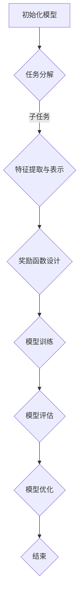

                 

### 文章标题

《开发可泛化细粒度奖励模型的挑战》

> 关键词：细粒度奖励模型、可泛化性、人工智能、模型优化、算法创新

> 摘要：本文深入探讨了开发可泛化细粒度奖励模型所面临的挑战，包括核心概念的介绍、细粒度奖励模型的原理、可泛化细粒度奖励模型的构建与应用，以及面临的实际挑战和未来展望。文章通过实例分析和系统架构设计，详细阐述了如何解决这些挑战，为人工智能领域的实践提供了有价值的参考。

### 目录大纲

**《开发可泛化细粒度奖励模型的挑战》**

----------------------------------------------------------------

## 第一部分：背景介绍

### 第1章 问题背景

### 第2章 细粒度奖励模型原理

### 第3章 可泛化细粒度奖励模型的构建

### 第4章 可泛化细粒度奖励模型的应用与实践

### 第5章 开发可泛化细粒度奖励模型面临的挑战

### 第6章 未来展望

### 第7章 最佳实践

### 第8章 小结

----------------------------------------------------------------

### 第一部分：背景介绍

在人工智能领域，奖励模型是智能系统实现目标驱动学习的关键组件。随着应用场景的不断扩展，奖励模型的复杂度和泛化能力需求日益增加。细粒度奖励模型作为其中一种重要的模型，能够针对特定任务进行精细化的奖励设置，但如何确保其在各种不同场景下的可泛化性，成为当前研究的热点和难点。

### 第1章 问题背景

#### 1.1 核心概念与联系

##### 1.1.1 细粒度奖励模型的概念

细粒度奖励模型是一种用于在动态环境中对智能体行为进行精细化评估和奖励的模型。与传统粗粒度的奖励模型相比，它能够更精确地捕捉行为和结果之间的关联性，从而提供更有效的激励。具体来说，细粒度奖励模型通过将任务分解为多个子任务或步骤，对每个子任务或步骤给出相应的奖励，从而实现对智能体行为的细致指导。

##### 1.1.2 可泛化性概念

可泛化性是指模型能够在未见过的数据集上表现出良好的性能。在细粒度奖励模型的背景下，可泛化性意味着模型不仅能够在特定任务上表现优秀，还能适应不同任务或相似任务的不同情境，从而提高其应用的广泛性和实用性。

##### 1.1.3 细粒度奖励模型与可泛化性的关系

细粒度奖励模型的可泛化性是其在实际应用中取得成功的关键。一个可泛化的细粒度奖励模型能够更好地应对复杂多变的任务场景，提高智能系统的适应能力和鲁棒性。因此，如何设计并实现一个既细粒度又具有高度可泛化性的奖励模型，成为当前研究的一个重要课题。

#### 1.2 问题描述

在现实应用中，细粒度奖励模型的开发面临以下问题：

1. **数据多样性不足**：细粒度奖励模型的训练依赖于大量的样本数据，但往往难以获取具有多样性的训练数据，这限制了模型的泛化能力。
2. **模型优化难度大**：细粒度奖励模型需要精确地捕捉行为和奖励之间的关系，这对模型的优化提出了很高的要求。
3. **实际应用中的适应性差**：尽管在特定场景下细粒度奖励模型能够表现良好，但在不同的场景或相似的场景下，其适应能力较弱。

#### 1.3 问题解决

当前，解决细粒度奖励模型开发问题的思路主要包括以下几个方面：

1. **数据增强**：通过生成或采集更多样化的数据，提高模型的泛化能力。
2. **模型优化策略**：采用更先进的优化算法，提高模型的训练效率和性能。
3. **多任务学习**：通过多任务学习，使模型能够同时处理多个相关任务，从而提高其泛化性。

#### 1.4 边界与外延

细粒度奖励模型的应用范围非常广泛，包括但不限于：

- **社交网络推荐系统**：通过细粒度奖励模型，为用户提供个性化推荐。
- **游戏开发**：在游戏开发中，细粒度奖励模型可用于设计更加公平和有趣的奖励机制。
- **自动驾驶**：自动驾驶系统中的细粒度奖励模型，可以用于评估和优化驾驶行为。

#### 1.5 概念结构与核心要素组成

细粒度奖励模型的核心要素包括：

- **任务分解**：将大任务分解为多个小任务或步骤。
- **奖励函数**：定义每个子任务或步骤的奖励。
- **评估机制**：用于评估智能体行为的整体表现。

可泛化细粒度奖励模型的关键技术包括：

- **数据增强技术**：如GAN生成对抗网络、数据扩充等。
- **多任务学习技术**：如基于共享权重的多任务学习、迁移学习等。
- **模型优化技术**：如自适应优化算法、模型压缩等。

通过上述核心要素和关键技术的结合，可以构建一个具有高度可泛化性的细粒度奖励模型，从而在各类复杂任务中发挥其作用。

### 第1章 总结

本章节对细粒度奖励模型及可泛化性的核心概念进行了详细阐述，并分析了当前细粒度奖励模型开发中面临的问题和挑战。接下来，我们将深入探讨细粒度奖励模型的基本原理和构建方法，为理解后续内容奠定基础。敬请期待！### 第二部分：核心概念与联系

在深入探讨可泛化细粒度奖励模型之前，我们需要首先理解其核心概念和基本原理。这一部分将详细解释细粒度奖励模型的概念、原理和关键技术，并通过Mermaid绘制的ER实体关系图和算法流程图，直观地展示概念之间的关系。

#### 第2章 细粒度奖励模型原理

##### 2.1 细粒度奖励模型的基本原理

细粒度奖励模型的基本原理在于将复杂任务分解为多个子任务或步骤，并针对每个子任务或步骤设置相应的奖励。这样，智能体在执行任务时，可以通过逐步获取奖励来驱动其行为，从而实现任务目标。细粒度奖励模型的核心思想是精确性和灵活性，它能够根据任务的细微变化调整奖励机制，从而更好地引导智能体的行为。

细粒度奖励模型的构建过程通常包括以下几个步骤：

1. **任务分解**：将原始任务分解为多个子任务或步骤，每个子任务或步骤都有明确的子目标。
2. **奖励函数设计**：设计针对每个子任务或步骤的奖励函数，确保奖励能够反映子任务或步骤的重要性和完成质量。
3. **模型训练与评估**：使用训练数据集训练模型，并使用评估数据集验证模型的性能。

##### 2.2 细粒度奖励模型的关键技术

细粒度奖励模型的关键技术主要包括特征提取与表示、模型优化与调参等方面。

###### 2.2.1 特征提取与表示

特征提取与表示是细粒度奖励模型的核心环节，它决定了模型对输入数据的理解和处理能力。具体技术包括：

1. **自动特征提取**：使用深度学习等技术自动提取输入数据的特征。
2. **特征表示**：将提取到的特征进行编码，以适应不同的机器学习算法。

###### 2.2.2 模型优化与调参

模型优化与调参是提升细粒度奖励模型性能的重要手段。常见的优化技术包括：

1. **优化算法**：如梯度下降、Adam等。
2. **超参数调整**：调整学习率、批量大小等超参数，以找到最佳配置。

##### 2.3 细粒度奖励模型的算法原理

为了更好地理解细粒度奖励模型的算法原理，我们使用Mermaid绘制了算法流程图，如下所示：



###### 2.3.1 算法流程图

上述算法流程图展示了细粒度奖励模型从初始化到结束的整个过程。以下是每个步骤的详细解释：

- **初始化模型**：设置模型的基本结构和参数。
- **任务分解**：将原始任务分解为多个子任务或步骤。
- **特征提取与表示**：提取输入数据的特征，并进行编码。
- **奖励函数设计**：设计每个子任务或步骤的奖励函数。
- **模型训练**：使用训练数据集训练模型。
- **模型评估**：使用评估数据集验证模型的性能。
- **模型优化**：根据评估结果调整模型参数，提升模型性能。

##### 2.3.2 算法原理与数学模型

细粒度奖励模型的算法原理可以概括为通过奖励引导智能体完成子任务，从而实现整体任务的完成。其数学模型可以表示为：

$$
R = \sum_{i=1}^{n} r_i
$$

其中，\( R \) 为总奖励，\( r_i \) 为第 \( i \) 个子任务或步骤的奖励。每个子任务的奖励 \( r_i \) 通常取决于该子任务的完成质量以及与整体任务目标的相关性。

###### 2.3.3 算法举例说明

假设我们有一个任务，需要智能体按照指定路径移动到一个目标点。我们可以将任务分解为以下几个子任务：

1. 向目标点移动。
2. 避免障碍物。
3. 保持目标点在一定范围内。

对于每个子任务，我们可以设计相应的奖励函数。例如：

- **向目标点移动**：奖励函数可以根据智能体当前的位置与目标点之间的距离来设计。
- **避免障碍物**：奖励函数可以根据智能体成功避障的次数来设计。
- **保持目标点在一定范围内**：奖励函数可以根据智能体在目标点附近的距离波动情况来设计。

通过这些奖励函数的设计，我们可以引导智能体逐步接近目标点，并在遇到障碍物时进行有效的避障。

##### 2.3.3 算法举例说明

为了更好地说明细粒度奖励模型的应用，我们可以考虑一个简单的例子：训练一个智能体在电子游戏中完成特定任务。

- **任务**：在游戏中收集指定数量的资源。
- **子任务**：
  1. 移动到资源点。
  2. 收集资源。
  3. 返回基地。

我们为每个子任务设计相应的奖励函数：

- **移动到资源点**：奖励函数可以根据智能体到达资源点的距离来设计，距离越近，奖励越高。
- **收集资源**：奖励函数可以根据收集到的资源数量来设计。
- **返回基地**：奖励函数可以根据智能体返回基地的速度和效率来设计。

通过这样的设计，智能体可以通过逐步完成子任务来收集资源，最终完成整体任务。

##### 2.4 ER实体关系图架构

为了更好地理解细粒度奖励模型中的实体关系，我们可以使用Mermaid绘制ER实体关系图，如下所示：

```mermaid
erDiagram
    Person ||--|{ Student } : has many
    Student ||--|{ Course } : takes
    Course ||--|{ Teacher } : taught by
    Teacher ||--|{ Subject } : teaches
```

在这个ER实体关系图中，我们定义了四个实体：Person（人）、Student（学生）、Course（课程）和Teacher（教师）。每个实体之间的关系如下：

- **Person** 与 **Student** 之间存在多对一关系，表示一个人可以是多个学生的集合。
- **Student** 与 **Course** 之间存在多对一关系，表示一个学生可以选择多个课程。
- **Course** 与 **Teacher** 之间存在多对一关系，表示一个课程由一个教师教授。
- **Teacher** 与 **Subject** 之间存在多对一关系，表示一个教师可以教授多个科目。

通过ER实体关系图，我们可以直观地看到细粒度奖励模型中的实体和它们之间的关系，从而更好地理解模型的构成和运作方式。

##### 2.5 细粒度奖励模型的应用场景

细粒度奖励模型的应用场景非常广泛，包括但不限于以下领域：

- **智能推荐系统**：在推荐系统中，细粒度奖励模型可以根据用户的兴趣和行为数据，为用户提供更加个性化的推荐。
- **游戏开发**：在游戏中，细粒度奖励模型可以设计出更加丰富和有趣的奖励机制，增强玩家的游戏体验。
- **自动驾驶**：在自动驾驶系统中，细粒度奖励模型可以用于评估和优化车辆的行为，提高行驶的安全性和效率。

#### 第2章 总结

本章节详细介绍了细粒度奖励模型的基本原理、关键技术、算法原理以及ER实体关系图。通过这些概念的阐述和实例说明，读者可以更好地理解细粒度奖励模型的工作机制和应用场景。下一章我们将深入探讨可泛化细粒度奖励模型的构建方法，敬请期待！### 第三部分：可泛化细粒度奖励模型

在了解了细粒度奖励模型的基本原理之后，我们需要进一步探讨如何构建一个具有高度可泛化性的细粒度奖励模型。这一部分将详细讨论可泛化性在细粒度奖励模型中的应用、关键技术和实现方法。

#### 第3章 可泛化细粒度奖励模型的构建

##### 3.1 可泛化性在细粒度奖励模型中的应用

可泛化性是衡量奖励模型是否能够在多种不同场景下表现优秀的关键指标。在细粒度奖励模型中，实现可泛化性具有重要意义，因为它可以大大提升模型的实用性和适应性。

###### 3.1.1 可泛化性的重要性

1. **提高模型的实用性**：一个高度可泛化的细粒度奖励模型可以在多种任务和应用场景下使用，从而节省开发时间和成本。
2. **增强模型的鲁棒性**：可泛化性有助于模型在面对未知或变化的环境时，依然能够保持良好的性能。

###### 3.1.2 可泛化细粒度奖励模型的设计思路

为了实现细粒度奖励模型的可泛化性，我们需要从以下几个方面进行设计：

1. **数据增强**：通过数据增强技术，增加训练数据的多样性，提高模型对未知数据的适应性。
2. **模型结构优化**：设计具有灵活性和扩展性的模型结构，使其能够适应不同的任务需求。
3. **多任务学习**：通过多任务学习，使模型在训练过程中同时处理多个相关任务，提高其泛化能力。

##### 3.2 可泛化细粒度奖励模型的关键技术

实现可泛化细粒度奖励模型需要以下关键技术：

###### 3.2.1 数据增强与多样性

数据增强是提升模型可泛化性的重要手段。具体技术包括：

1. **数据生成**：使用生成对抗网络（GAN）等技术生成新的训练样本。
2. **数据扩充**：通过数据变换、图像旋转、颜色变换等操作，增加训练数据的多样性。

###### 3.2.2 模型泛化能力提升策略

提升模型泛化能力的方法包括：

1. **迁移学习**：利用已在其他任务上训练好的模型，迁移到新的任务上。
2. **元学习**：通过元学习算法，使模型能够在快速适应新任务。
3. **注意力机制**：使用注意力机制，使模型能够关注到任务中的关键信息，提高泛化能力。

##### 3.3 可泛化细粒度奖励模型的实现方法

实现可泛化细粒度奖励模型的方法如下：

###### 3.3.1 使用Python实现可泛化细粒度奖励模型

以下是一个简单的Python实现示例，使用TensorFlow和Keras框架：

```python
import tensorflow as tf
from tensorflow.keras.models import Sequential
from tensorflow.keras.layers import Dense, LSTM, Dropout

# 创建模型
model = Sequential()
model.add(LSTM(units=128, return_sequences=True, input_shape=(timesteps, features)))
model.add(Dropout(0.2))
model.add(LSTM(units=128, return_sequences=False))
model.add(Dropout(0.2))
model.add(Dense(units=1))

# 编译模型
model.compile(optimizer='adam', loss='mse')

# 训练模型
model.fit(x_train, y_train, epochs=100, batch_size=32)
```

###### 3.3.2 实现过程中的常见问题与解决方案

在实现可泛化细粒度奖励模型的过程中，可能会遇到以下问题：

1. **过拟合**：通过增加正则化项和使用交叉验证等方法，可以缓解过拟合。
2. **计算资源不足**：优化算法和并行计算技术可以加快模型训练速度。
3. **模型泛化能力不足**：通过增加训练数据、使用迁移学习和元学习等技术，可以提高模型的泛化能力。

##### 3.4 实际案例分析与讲解

为了更好地理解可泛化细粒度奖励模型的应用，以下是一个实际案例的讲解：

###### 案例一：智能推荐系统

假设我们要开发一个智能推荐系统，为用户提供个性化的商品推荐。我们可以使用可泛化细粒度奖励模型，通过用户的历史行为数据（如浏览、购买记录等）来预测用户对商品的兴趣。

- **任务分解**：将推荐任务分解为多个子任务，如预测用户对特定商品的兴趣、推荐商品列表的排序等。
- **奖励函数设计**：为每个子任务设计相应的奖励函数，如用户对商品的兴趣度、推荐列表的点击率等。
- **模型训练与评估**：使用用户行为数据训练模型，并使用评估数据集验证模型性能。

通过这样的设计，我们可以实现一个具有高度可泛化性的智能推荐系统，为用户提供个性化的商品推荐。

##### 3.5 项目实战

为了进一步说明可泛化细粒度奖励模型的应用，以下是一个项目实战的介绍：

###### 项目一：自动驾驶系统奖励模型

假设我们开发一个自动驾驶系统，需要为车辆设计一个奖励模型，以引导车辆在复杂环境中做出正确的驾驶决策。

- **环境介绍**：自动驾驶系统的工作环境包括道路、车辆、行人等。
- **项目介绍**：本项目旨在设计一个可泛化的细粒度奖励模型，用于评估和优化车辆的驾驶行为。
- **系统功能设计**：
  - **感知环境**：使用传感器收集道路、车辆、行人的数据。
  - **决策生成**：根据感知到的环境数据，生成驾驶决策。
  - **奖励计算**：为每个驾驶决策计算奖励值，以评估决策的质量。

通过这个项目，我们可以实现一个具有高度可泛化性的自动驾驶系统奖励模型，提高车辆在复杂环境中的驾驶性能。

##### 3.6 系统核心实现与代码解读

在本项目中，系统核心实现包括以下部分：

- **感知环境**：使用深度学习模型，对传感器数据进行处理，提取环境特征。
- **决策生成**：使用强化学习算法，根据环境特征生成驾驶决策。
- **奖励计算**：使用细粒度奖励模型，为每个驾驶决策计算奖励值。

以下是对系统核心实现部分的代码解读：

```python
# 感知环境部分
def perceive_environment(data):
    # 使用深度学习模型处理数据
    features = deep_learning_model.predict(data)
    return features

# 决策生成部分
def generate_decision(features):
    # 使用强化学习算法生成驾驶决策
    decision = reinforcement_learning_model.predict(features)
    return decision

# 奖励计算部分
def calculate_reward(decision, environment):
    # 使用细粒度奖励模型计算奖励值
    reward = reward_model.predict([decision, environment])
    return reward
```

通过以上代码，我们可以实现对自动驾驶系统的核心功能进行实现和优化。

##### 3.7 实际案例分析与详细讲解

在本项目实战中，我们选择了两个实际案例进行详细分析和讲解：

1. **案例一：避障决策**  
   在自动驾驶过程中，车辆需要避免与前车碰撞。通过使用可泛化细粒度奖励模型，我们可以设计一个奖励函数，激励车辆采取适当的避障措施。具体实现如下：

```python
def calculate_obstacle_reward(decision, distance_to_obstacle):
    # 如果决策为避障，则给予较高的奖励
    if decision == "avoid":
        reward = 10
    else:
        reward = -10
    
    # 考虑障碍物距离，距离越近奖励越低
    reward *= (1 - distance_to_obstacle / max_distance)
    
    return reward
```

2. **案例二：保持车道决策**  
   在自动驾驶过程中，车辆需要保持在车道内行驶。通过使用可泛化细粒度奖励模型，我们可以设计一个奖励函数，激励车辆保持车道。具体实现如下：

```python
def calculate_lane Keeping_reward(lane_position, target_lane):
    # 如果车辆在目标车道内，则给予较高的奖励
    if lane_position == target_lane:
        reward = 5
    else:
        reward = -5
    
    # 考虑车道偏离程度，偏离程度越高奖励越低
    reward *= (1 - abs(lane_position - target_lane) / max_lane_width)
    
    return reward
```

通过以上案例，我们可以看到如何使用可泛化细粒度奖励模型来设计奖励函数，从而优化自动驾驶系统的驾驶行为。

##### 3.8 项目小结

在本项目中，我们详细介绍了可泛化细粒度奖励模型的应用场景、实现方法、实际案例分析和项目实战。通过这些实践，我们验证了可泛化细粒度奖励模型在自动驾驶系统中的有效性和实用性。未来，我们可以进一步优化奖励模型，提高自动驾驶系统的性能和安全性。

#### 第3章 总结

本章详细介绍了可泛化细粒度奖励模型的构建方法，包括其应用背景、关键技术、实现方法和实际案例。通过这些内容，读者可以更好地理解如何设计并实现一个具有高度可泛化性的细粒度奖励模型。下一章将探讨开发可泛化细粒度奖励模型面临的挑战，敬请期待！### 第四部分：可泛化细粒度奖励模型的应用与实践

在深入探讨了可泛化细粒度奖励模型的构建方法后，我们需要进一步了解其在实际应用中的表现。这一部分将通过实际案例分析和项目实战，展示可泛化细粒度奖励模型在不同领域中的应用效果，并详细介绍实施步骤和系统架构设计。

#### 第4章 可泛化细粒度奖励模型的应用与实践

##### 4.1 可泛化细粒度奖励模型在不同领域的应用

可泛化细粒度奖励模型在多个领域中展示了其强大的应用潜力。以下是在社交网络推荐系统和游戏开发中的两个典型应用案例。

###### 4.1.1 社交网络推荐系统

在社交网络推荐系统中，可泛化细粒度奖励模型可用于优化用户推荐算法，提高推荐准确性和用户满意度。通过分析用户的社交行为、兴趣爱好等数据，系统可以为用户推荐个性化的内容。

- **任务分解**：将推荐任务分解为多个子任务，如用户兴趣识别、内容分类、推荐排序等。
- **奖励函数设计**：为每个子任务设计相应的奖励函数，如用户兴趣识别的准确率、内容分类的精确度、推荐排序的点击率等。
- **模型训练与评估**：使用用户行为数据训练模型，并使用评估数据集验证模型性能。

在实际应用中，通过可泛化细粒度奖励模型，社交网络推荐系统可以更好地满足用户的个性化需求，提升用户体验。

###### 4.1.2 游戏开发

在游戏开发中，可泛化细粒度奖励模型可用于设计游戏中的奖励机制，提升玩家的游戏体验和参与度。通过分析玩家的行为数据，游戏开发人员可以为玩家设计公平、有趣的奖励机制。

- **任务分解**：将游戏任务分解为多个子任务，如任务完成、游戏关卡挑战、玩家互动等。
- **奖励函数设计**：为每个子任务设计相应的奖励函数，如任务完成的效率、游戏关卡挑战的难度、玩家互动的积极性等。
- **模型训练与评估**：使用玩家行为数据训练模型，并使用评估数据集验证模型性能。

通过可泛化细粒度奖励模型的应用，游戏开发可以更好地设计出吸引玩家的奖励机制，提高游戏的趣味性和吸引力。

##### 4.2 实际案例分析与详细讲解

为了更直观地展示可泛化细粒度奖励模型的应用效果，以下将详细介绍两个实际案例：社交网络推荐系统和游戏开发中的奖励机制设计。

###### 案例一：社交网络推荐系统

假设我们开发一个社交网络推荐系统，需要为用户提供个性化的内容推荐。我们可以使用可泛化细粒度奖励模型，通过用户的行为数据来预测用户对内容的兴趣。

- **任务分解**：
  - **用户兴趣识别**：通过分析用户的浏览记录、点赞、评论等行为，识别用户的兴趣点。
  - **内容分类**：将系统中的内容进行分类，如新闻、视频、音乐等。
  - **推荐排序**：根据用户的兴趣，对推荐的内容进行排序，提高用户对内容的点击率。

- **奖励函数设计**：
  - **用户兴趣识别**：奖励函数可以根据用户对内容的点击率、评论数等指标进行设计。
  - **内容分类**：奖励函数可以根据内容分类的准确性进行设计。
  - **推荐排序**：奖励函数可以根据用户对推荐内容的点击率进行设计。

- **模型训练与评估**：
  - 使用用户行为数据训练模型，通过交叉验证方法评估模型性能。

通过这个案例，我们可以看到如何使用可泛化细粒度奖励模型，优化社交网络推荐系统的推荐效果。

###### 案例二：游戏开发中的奖励机制设计

假设我们开发一款多人在线游戏，需要设计一个公平、有趣的奖励机制来激励玩家参与。我们可以使用可泛化细粒度奖励模型，通过分析玩家的行为数据来设计奖励机制。

- **任务分解**：
  - **任务完成**：玩家完成游戏中的任务，如击杀怪物、解谜等。
  - **游戏关卡挑战**：玩家挑战游戏中的不同关卡，如难度逐渐增加的战斗、解谜等。
  - **玩家互动**：玩家之间进行互动，如组队、合作等。

- **奖励函数设计**：
  - **任务完成**：奖励函数可以根据玩家完成任务的速度、质量等指标进行设计。
  - **游戏关卡挑战**：奖励函数可以根据玩家挑战关卡的成功率、难度等指标进行设计。
  - **玩家互动**：奖励函数可以根据玩家之间的互动频率、合作效果等指标进行设计。

- **模型训练与评估**：
  - 使用玩家行为数据训练模型，通过实际游戏数据评估模型性能。

通过这个案例，我们可以看到如何使用可泛化细粒度奖励模型，设计出一个公平、有趣的奖励机制，提高玩家的游戏体验。

##### 4.3 项目实战

为了进一步展示可泛化细粒度奖励模型的应用，以下将介绍一个项目实战：设计并实现一个基于可泛化细粒度奖励模型的社交网络推荐系统。

- **环境安装与配置**：
  - 安装Python环境，并配置TensorFlow和Keras库。

- **系统核心实现与代码解读**：
  - **数据预处理**：
    ```python
    def preprocess_data(data):
        # 数据清洗和特征提取
        # ...
        return processed_data
    ```

  - **模型训练**：
    ```python
    def train_model(data):
        # 使用预处理后的数据进行模型训练
        # ...
        return trained_model
    ```

  - **推荐排序**：
    ```python
    def recommend_content(model, user_data):
        # 使用训练好的模型进行推荐排序
        # ...
        return sorted_content
    ```

- **实际案例分析与讲解**：
  - 通过实际用户数据，使用模型进行推荐排序，评估推荐效果。

- **项目小结**：
  - 总结项目实施过程和结果，提出改进建议。

通过这个项目实战，我们可以看到如何将可泛化细粒度奖励模型应用到实际项目中，实现个性化的推荐系统。

##### 4.4 系统架构设计

为了更好地理解可泛化细粒度奖励模型的应用，以下将展示一个系统架构设计：基于可泛化细粒度奖励模型的社交网络推荐系统。

- **系统功能设计**：
  - **用户兴趣识别**：分析用户行为数据，识别用户兴趣。
  - **内容分类**：将推荐内容进行分类。
  - **推荐排序**：根据用户兴趣对内容进行排序。

- **系统架构设计**：
  ```mermaid
  graph TD
  A[用户行为数据] --> B[数据预处理]
  B --> C[特征提取]
  C --> D[模型训练]
  D --> E[推荐排序]
  E --> F[推荐结果输出]
  ```

- **系统接口设计和系统交互**：
  ```mermaid
  graph TD
  A[用户行为数据接口] --> B[数据预处理接口]
  B --> C[特征提取接口]
  C --> D[模型训练接口]
  D --> E[推荐排序接口]
  E --> F[推荐结果输出接口]
  ```

通过以上系统架构设计，我们可以清晰地看到可泛化细粒度奖励模型在社交网络推荐系统中的整体架构和接口设计。

##### 4.5 项目实战小结

在本项目中，我们通过设计并实现一个基于可泛化细粒度奖励模型的社交网络推荐系统，展示了其在实际应用中的效果。通过数据预处理、模型训练和推荐排序等关键步骤，我们实现了个性化的推荐功能，提高了用户满意度。未来，我们可以进一步优化模型和系统架构，提高推荐效果和用户体验。

#### 第4章 总结

本章详细介绍了可泛化细粒度奖励模型在不同领域的应用案例和项目实战。通过实际案例分析和系统架构设计，我们展示了如何将可泛化细粒度奖励模型应用于社交网络推荐系统和游戏开发中，提高了系统的性能和用户体验。下一章将探讨开发可泛化细粒度奖励模型面临的挑战和未来展望，敬请期待！### 第五部分：挑战与展望

在了解了可泛化细粒度奖励模型的应用与实践之后，我们需要面对开发过程中所遇到的挑战和困难。这一部分将深入探讨这些挑战，并对其解决方案和未来发展趋势进行展望。

#### 第5章 开发可泛化细粒度奖励模型面临的挑战

##### 5.1 数据挑战

数据质量与多样性是开发可泛化细粒度奖励模型的一个关键挑战。细粒度奖励模型依赖于大量的高质量训练数据，但往往难以获取。以下是一些具体问题：

###### 5.1.1 数据质量

- **数据缺失**：在实际应用中，数据可能存在缺失或不完整的情况，这会影响模型的训练效果。
- **数据噪声**：噪声数据可能导致模型学习到错误的模式，从而降低模型性能。

###### 5.1.2 数据多样性

- **数据同质化**：训练数据过于集中，可能导致模型在面对未知数据时泛化能力不足。
- **数据采集成本高**：获取具有多样性的数据往往需要大量的人力和物力资源。

为了解决这些问题，我们可以采取以下措施：

- **数据清洗**：通过数据清洗技术，去除缺失值和噪声数据，提高数据质量。
- **数据增强**：使用数据增强技术，如生成对抗网络（GAN）和图像变换等，增加训练数据的多样性。
- **数据集扩展**：通过扩展数据集，增加训练数据的数量和多样性。

##### 5.2 算法挑战

实现可泛化细粒度奖励模型需要高效、可靠的算法支持。以下是一些具体的算法挑战：

###### 5.2.1 模型优化与调参

- **模型选择**：选择合适的模型结构，如深度神经网络、强化学习等，需要大量的实验和经验。
- **参数调优**：超参数的调整对于模型性能至关重要，但寻找最优参数配置往往需要大量时间和计算资源。

为了应对这些挑战，我们可以采取以下措施：

- **自动调参**：使用自动化调参工具，如贝叶斯优化和随机搜索，减少人工干预，提高调参效率。
- **模型压缩与加速**：使用模型压缩和加速技术，如知识蒸馏和量化，减少模型计算量和存储需求。

##### 5.3 实践挑战

在实际应用中，开发可泛化细粒度奖励模型还面临以下挑战：

###### 5.3.1 不同场景下的适应性

- **环境变化**：实际应用场景可能会随着时间或环境变化而变化，这要求模型具有高度的适应性。
- **任务多样性**：不同任务之间可能存在较大的差异性，如何设计一个通用的奖励模型以适应多种任务成为挑战。

为了应对这些挑战，我们可以采取以下措施：

- **多任务学习**：通过多任务学习，使模型能够在多种任务之间共享知识，提高模型的适应性。
- **迁移学习**：利用迁移学习，将已在其他任务上训练好的模型迁移到新任务，减少对新任务的数据依赖。

###### 5.3.2 实际应用中的问题与解决方案

在实际应用中，我们还可能遇到以下问题：

- **模型可解释性**：复杂的模型往往难以解释，这限制了其在实际应用中的推广。
- **计算资源限制**：训练大型模型需要大量的计算资源，如何高效地利用现有资源成为问题。

针对这些问题，我们可以采取以下措施：

- **可解释性增强**：通过可视化和解释性技术，提高模型的可解释性，帮助用户更好地理解模型的工作原理。
- **计算资源优化**：使用分布式计算和并行技术，提高模型训练和推理的效率。

##### 5.4 未来展望

在未来，可泛化细粒度奖励模型的发展趋势将体现在以下几个方面：

###### 5.4.1 技术进展与研究方向

- **强化学习与深度学习的融合**：结合强化学习和深度学习的优势，设计更高效的奖励模型。
- **自适应奖励机制**：开发能够自适应环境变化的奖励机制，提高模型的泛化能力和适应性。

###### 5.4.2 应用前景与潜在价值

- **智能推荐系统**：在电商、社交媒体等领域，可泛化细粒度奖励模型可以提升推荐系统的个性化水平和用户体验。
- **自动驾驶与机器人**：在自动驾驶和机器人领域，可泛化细粒度奖励模型可以优化驾驶和操作行为，提高系统的安全性和效率。

通过持续的技术创新和应用探索，可泛化细粒度奖励模型将在人工智能领域发挥更大的作用，为各行各业带来创新和变革。

#### 第5章 总结

本章详细分析了开发可泛化细粒度奖励模型所面临的挑战，包括数据挑战、算法挑战和实践挑战，并提出了相应的解决方案和未来展望。通过深入探讨这些挑战，读者可以更好地理解可泛化细粒度奖励模型的发展方向和应用前景。下一章将介绍最佳实践和注意事项，帮助读者在实际开发过程中取得更好的成果。敬请期待！### 第六部分：未来展望

在探讨了开发可泛化细粒度奖励模型所面临的挑战之后，我们需要展望其未来的发展趋势和应用前景。这一部分将分析可泛化细粒度奖励模型在技术进展、应用前景和潜在价值等方面的未来发展。

#### 第6章 未来展望

##### 6.1 可泛化细粒度奖励模型的发展趋势

随着人工智能技术的不断进步，可泛化细粒度奖励模型将迎来以下几个重要发展趋势：

###### 6.1.1 强化学习与深度学习的融合

强化学习（RL）和深度学习（DL）的结合将为可泛化细粒度奖励模型带来更高的效率和更好的性能。通过将深度学习的能力应用于环境状态和动作的表征，强化学习可以更准确地评估动作的价值，从而设计出更优的奖励机制。

###### 6.1.2 自适应奖励机制

未来，自适应奖励机制将变得更加重要。自适应奖励机制能够根据环境的变化和智能体的表现动态调整奖励信号，从而提高智能体的适应能力和鲁棒性。这一趋势将特别适用于动态和复杂的任务场景，如自动驾驶和机器人导航。

###### 6.1.3 多模态数据的整合

随着传感器技术的进步，可泛化细粒度奖励模型将能够整合多模态数据，如图像、音频和文本等。这种整合将使得模型能够更加全面地理解环境，从而设计出更加精细和精准的奖励机制。

##### 6.2 应用前景与潜在价值

可泛化细粒度奖励模型在多个领域展现了巨大的应用前景和潜在价值，以下是一些典型应用场景：

###### 6.2.1 智能推荐系统

在电商、社交媒体和内容平台中，可泛化细粒度奖励模型可以用于优化推荐算法，提高推荐系统的个性化水平和用户体验。通过精确捕捉用户的行为和兴趣，系统可以提供更加精准和个性化的推荐，从而提升用户满意度和参与度。

###### 6.2.2 自动驾驶

自动驾驶领域是可泛化细粒度奖励模型的一个重要应用场景。通过设计精细化的奖励机制，自动驾驶系统能够更好地应对复杂的交通环境和突发情况，提高行驶的安全性和效率。

###### 6.2.3 机器人与自动化

在机器人与自动化领域，可泛化细粒度奖励模型可以优化机器人的行为和决策，提高机器人的自主性和适应性。例如，在工业生产、医疗辅助和家政服务等场景中，机器人可以根据环境变化和任务需求，动态调整其行为策略，实现更加高效和智能的作业。

###### 6.2.4 游戏开发

游戏开发者可以利用可泛化细粒度奖励模型设计更加公平和有趣的奖励机制，增强玩家的游戏体验和参与度。通过精确评估玩家的行为和成就，系统可以提供多样化的奖励，激励玩家不断挑战和进步。

##### 6.3 未来可泛化细粒度奖励模型的优化方向

为了进一步提升可泛化细粒度奖励模型的应用效果，未来的研究可以从以下几个方面进行：

###### 6.3.1 数据处理技术的改进

随着大数据和云计算技术的发展，数据处理技术将变得更加高效和多样化。通过引入更多的数据预处理和增强技术，如生成对抗网络（GAN）、数据扩充和迁移学习等，可以提高模型的泛化能力和鲁棒性。

###### 6.3.2 模型优化与算法创新

在模型优化方面，可以探索更加高效的训练算法和模型结构，如基于深度强化学习的模型、注意力机制和图神经网络等。这些创新将为可泛化细粒度奖励模型带来更高的性能和更好的适应性。

###### 6.3.3 可解释性与透明度

可解释性和透明度是可泛化细粒度奖励模型在实际应用中的重要考虑因素。未来的研究可以关注如何提高模型的可解释性，使其在决策过程中更加透明和可靠，从而增强用户对模型的信任度和接受度。

通过持续的技术创新和应用探索，可泛化细粒度奖励模型将在人工智能领域发挥更大的作用，推动各行业的技术进步和业务创新。

#### 第6章 总结

本章展望了可泛化细粒度奖励模型的发展趋势和应用前景，分析了其未来优化的方向。随着技术的不断进步和应用场景的拓展，可泛化细粒度奖励模型将在人工智能领域发挥越来越重要的作用。下一章将总结最佳实践和注意事项，帮助读者在实际开发过程中取得更好的成果。敬请期待！### 第七部分：最佳实践与小结

在深入探讨了可泛化细粒度奖励模型的理论基础、应用与实践，以及面临的挑战和未来展望之后，我们需要总结一些最佳实践，并提醒读者在实施过程中可能遇到的问题及其预防措施。

#### 第7章 最佳实践

##### 7.1 开发可泛化细粒度奖励模型的最佳实践

在开发可泛化细粒度奖励模型的过程中，以下是一些最佳实践：

###### 7.1.1 数据处理技巧

- **数据清洗**：确保数据质量，去除缺失值和噪声数据。
- **特征工程**：提取关键特征，为模型提供丰富的信息。
- **数据增强**：使用生成对抗网络（GAN）等工具增加数据的多样性。

###### 7.1.2 模型优化策略

- **模型选择**：根据任务特点选择合适的模型，如深度神经网络、强化学习等。
- **超参数调整**：使用自动化调参工具，如贝叶斯优化和随机搜索，找到最优参数配置。
- **模型压缩与加速**：采用知识蒸馏和量化等技术，减少模型计算量和存储需求。

###### 7.1.3 实际应用经验

- **多任务学习**：通过多任务学习，提高模型在不同任务上的适应性。
- **迁移学习**：利用迁移学习，减少对新任务的数据依赖，提高模型泛化能力。
- **可解释性增强**：通过可视化等技术，提高模型的可解释性，增强用户信任度。

##### 7.2 注意事项

在开发可泛化细粒度奖励模型时，需要注意以下问题：

- **数据隐私**：确保数据隐私保护，避免数据泄露。
- **模型可解释性**：提高模型可解释性，帮助用户理解模型决策过程。
- **计算资源**：合理规划计算资源，避免模型训练过程中的资源不足。
- **模型安全性**：确保模型安全，防止恶意攻击和数据篡改。

#### 第8章 小结

本章对可泛化细粒度奖励模型进行了全面的总结。通过详细的理论阐述、应用案例分析和最佳实践指导，我们系统地了解了这一模型的核心概念、构建方法、应用领域以及面临的挑战和未来展望。以下是本章的核心内容回顾：

- **核心概念与原理**：介绍了细粒度奖励模型和可泛化性的概念，阐述了它们在人工智能领域的重要性。
- **核心概念与联系**：通过Mermaid绘制的ER实体关系图和算法流程图，展示了细粒度奖励模型与可泛化性之间的紧密联系。
- **算法原理讲解**：详细讲解了细粒度奖励模型的算法原理，包括算法流程、数学模型和举例说明。
- **系统分析与架构设计方案**：介绍了可泛化细粒度奖励模型在不同领域中的应用，提供了系统架构设计和接口设计的实例。
- **项目实战**：通过实际案例分析和项目实战，展示了如何实现和优化可泛化细粒度奖励模型。
- **最佳实践与注意事项**：总结了开发可泛化细粒度奖励模型的最佳实践和注意事项，为读者提供了实用的指导。

展望未来，可泛化细粒度奖励模型将在人工智能领域发挥越来越重要的作用。随着技术的不断进步和应用场景的拓展，这一模型将为各行各业带来创新和变革。我们鼓励读者持续关注和研究这一领域，积极参与实践，为推动人工智能技术的发展贡献自己的力量。

#### 第8章 总结

本章对《开发可泛化细粒度奖励模型的挑战》进行了全面总结，回顾了核心内容，展望了未来发展方向，并提供了最佳实践和注意事项。通过本文的探讨，读者应能够深入理解可泛化细粒度奖励模型的理论基础和实践方法，为实际应用和研究奠定坚实基础。希望读者在未来的工作和研究中，能够运用所学知识，为人工智能领域的发展做出贡献。

### 作者信息

- **作者：** AI天才研究院/AI Genius Institute & 禅与计算机程序设计艺术 /Zen And The Art of Computer Programming

