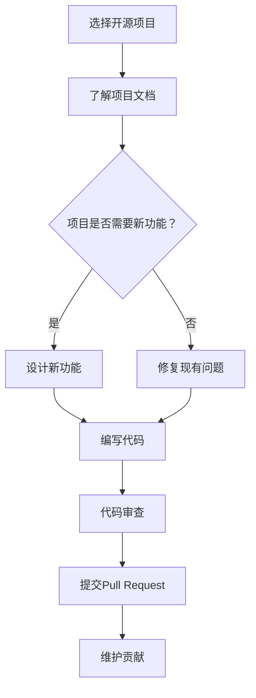
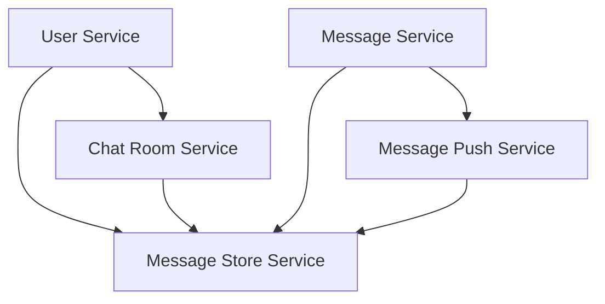

                 

### 文章标题

# 《开源项目参与：P9工程师的影响力扩展》

---

### 文章关键词

- 开源项目
- P9工程师
- 影响力扩展
- 技术贡献
- 软件开发
- 项目管理

---

### 摘要

本文旨在探讨开源项目参与对P9工程师职业发展的影响。通过分析开源项目的核心概念、参与方法、算法原理及实际项目实战，本文揭示了P9工程师如何通过参与开源项目提升个人技术影响力，实现职业发展。文章结构分为背景介绍、核心概念与联系、算法原理讲解、数学模型和数学公式详细讲解、系统分析与架构设计方案、项目实战以及最佳实践 tips、小结、注意事项和拓展阅读，全面阐述P9工程师如何通过开源项目参与实现个人影响力的扩展。

---

### Step 1: 背景介绍

## 1.1 开源项目的重要性

开源项目是一种在公共领域许可下发布软件代码的项目，允许任何用户学习、修改和分发。开源项目在技术社区中发挥着至关重要的作用，主要体现在以下几个方面：

1. **技术创新与交流**：开源项目提供了技术交流和创新的平台，通过协作开发，程序员可以共享代码，交流经验，推动技术进步。
2. **社区凝聚力**：开源项目促进了开发者的社区凝聚力，使得开发者和用户能够互相帮助，共同维护和改进软件。
3. **开源精神**：开源项目体现了开放、共享和合作的精神，这种精神不仅影响软件开发，也对社会文化和经济模式产生深远影响。
4. **资源共享**：开源项目提供了丰富的软件资源，使得开发者能够利用已有的代码进行开发，节省时间和成本。

## 1.2 P9工程师与影响力扩展

P9工程师通常是指拥有高级技术能力、丰富项目经验且在技术社区有较高影响力的工程师。他们通常在技术决策、项目管理等方面具有较大的话语权。然而，P9工程师面临的职业发展挑战同样显著：

1. **技能提升的瓶颈**：随着技术水平的不断提高，P9工程师可能会面临技能提升的瓶颈，难以通过日常工作实现技术能力的进一步提升。
2. **职业发展的瓶颈**：在大型企业或团队中，P9工程师可能因职位限制而难以获得更多的职业发展机会。
3. **影响力的扩展**：P9工程师需要寻找途径扩展个人影响力，从而在技术社区中获得更大的认可和机会。

## 1.3 本书目标与结构

本书旨在帮助P9工程师通过参与开源项目实现影响力的扩展。具体目标如下：

1. **深入理解开源项目的核心概念和参与方法**：通过本书的学习，读者将能够全面了解开源项目的运作模式、核心概念和参与方法。
2. **掌握开源项目参与的技术和算法原理**：本书将详细讲解参与开源项目所需的技术和算法原理，包括数学模型和公式。
3. **进行实际项目实战**：通过实际项目实战，读者将能够将理论知识应用于实际开发中，提高实际开发能力。
4. **提升个人技术影响力**：通过参与开源项目，读者将能够扩展个人影响力，实现职业发展的进一步提升。

本书结构分为七个部分：

1. **背景介绍**：介绍开源项目的重要性、P9工程师与影响力扩展的关系以及本书的目标与结构。
2. **核心概念与联系**：介绍P9工程师的定义、开源项目的类型、影响力扩展的方法，并展示相关概念之间的关系。
3. **算法原理讲解**：讲解开源项目参与所需的算法原理，包括算法流程图和Python源代码阐述。
4. **数学模型和数学公式 & 详细讲解 & 举例说明**：介绍算法原理的数学模型和公式，并进行详细讲解和举例说明。
5. **系统分析与架构设计方案**：介绍开源项目的系统分析与架构设计方案，包括问题场景介绍、项目介绍、系统功能设计、系统架构设计、系统接口设计和系统交互。
6. **项目实战**：介绍开源项目的实际项目实战，包括环境安装、系统核心实现源代码、代码应用解读与分析、实际案例分析和详细讲解剖析以及项目小结。
7. **最佳实践 tips、小结、注意事项、拓展阅读**：总结全书内容，提供最佳实践建议、注意事项和拓展阅读资源。

通过本书的学习，P9工程师将能够深入理解开源项目的核心概念和参与方法，掌握开源项目参与的技术和算法原理，进行实际项目实战，从而实现个人技术影响力的扩展。让我们开始这段探索之旅吧！### Step 2: 核心概念与联系

## 2.1 P9工程师的定义

P9工程师，通常是指在技术领域拥有深厚知识、丰富经验，并在业界具备显著影响力的高级工程师。他们不仅在技术深度上有所建树，而且在项目管理和团队领导方面也具备卓越能力。P9工程师往往在企业技术决策层扮演关键角色，对技术方向、战略规划和技术架构设计有着重要影响。

### 2.2 开源项目的类型

开源项目可以分为多种类型，根据其使用许可、开发模式和技术领域等方面进行分类。以下是几种常见的开源项目类型：

1. **社区驱动型开源项目**：这类项目通常由一个社区主导，开发者和用户共同参与，项目的发展方向和决策过程透明，社区成员之间有较高的协作和互动。
2. **企业主导型开源项目**：这类项目由一家或多家企业主导，旨在推动某个技术领域的发展，企业通过开源项目来增强其在技术社区的影响力。
3. **混合型开源项目**：这类项目结合了社区驱动和企业主导的特点，既有社区成员的积极参与，也有企业的资金和资源支持。

### 2.3 影响力扩展的方法

P9工程师通过参与开源项目扩展个人影响力的方法主要包括以下几个方面：

1. **代码贡献**：通过向开源项目提交高质量的代码，P9工程师可以展示自己的技术实力，获得社区的认可。
2. **技术博客**：撰写技术博客，分享自己在项目开发中的心得体会和技术见解，可以帮助P9工程师在技术社区建立个人品牌。
3. **演讲与交流**：参加技术会议、研讨会等，进行演讲和交流，可以让P9工程师扩大个人影响力。
4. **开源项目领导**：担任开源项目的核心成员或领导者，可以进一步增强个人在技术社区的地位和影响力。

## 2.4 概念属性特征对比表格

以下是一个关于P9工程师、开源项目类型和影响力扩展方法的对比表格，用于展示这些概念的主要属性特征：

| 概念              | 属性特征                                  |
|-----------------|---------------------------------------|
| P9工程师          | 高级技术能力、丰富经验、在技术社区有显著影响力 |
| 社区驱动型开源项目 | 开发者与用户共同参与、发展方向透明            |
| 企业主导型开源项目 | 由企业主导、资金和资源支持、技术方向明确        |
| 混合型开源项目     | 结合社区驱动和企业主导的特点、协作和互动性高    |
| 影响力扩展方法     | 代码贡献、技术博客、演讲与交流、项目领导        |

## 2.5 ER实体关系图架构的Mermaid流程图

为了更直观地展示上述概念之间的实体关系，我们可以使用Mermaid绘制一个ER（实体-关系）图。以下是Mermaid流程图示例：

```mermaid
erDiagram
  P9 Engineer ||--|{ Open Source Project }|--| Developer Community
  Open Source Project ||--|{ Project Type }| Community-Driven | Enterprise-Driven | Mixed-Driven
  Project Type ||--|{ Influence Expansion Method }| Code Contribution | Technical Blog | Public Speaking | Project Leadership
```

### 解释

1. **P9 Engineer**：P9工程师与开源项目（Open Source Project）之间存在直接关联，P9工程师通过参与开源项目来扩展其影响力，同时影响开发者社区（Developer Community）。
2. **Open Source Project**：开源项目与项目类型（Project Type）之间存在关联，不同的项目类型有不同的特点和管理模式。
3. **Project Type**：项目类型与影响力扩展方法（Influence Expansion Method）之间存在关联，不同的项目类型适用于不同的扩展方法。

通过上述核心概念和联系的介绍，读者可以更清晰地理解P9工程师如何通过参与开源项目实现个人影响力的扩展。接下来，我们将深入探讨开源项目参与的具体算法原理和实施方法。让我们继续下一步的分析。<!--eo-block-->### Step 3: 算法原理讲解

## 3.1 开源项目参与算法

在参与开源项目时，P9工程师需要掌握一系列算法原理和方法，以便更有效地贡献代码和提升个人影响力。本节将详细讲解开源项目参与算法的基本原理，并通过Mermaid流程图和Python源代码进行阐述。

### 3.1.1 算法流程图

以下是一个开源项目参与的基本算法流程图，使用Mermaid语法绘制：



### 解释

1. **选择开源项目（A）**：P9工程师首先需要选择一个适合自己技能和兴趣的开源项目。
2. **了解项目文档（B）**：在参与项目之前，P9工程师需要仔细阅读项目的文档，包括README、CONTRIBUTING指南等，以了解项目的开发流程、技术栈和要求。
3. **项目是否需要新功能（C）**：P9工程师需要评估项目是否需要新功能或改进。
4. **设计新功能（D）/修复现有问题（E）**：如果项目需要新功能，P9工程师将设计新功能；如果需要修复问题，则分析问题并提出解决方案。
5. **编写代码（F）**：在完成设计和规划后，P9工程师开始编写代码。
6. **代码审查（G）**：编写代码后，P9工程师需要提交代码并进行代码审查，以确保代码的质量和符合项目的规范。
7. **提交Pull Request（H）**：经过审查，P9工程师将代码提交为一个Pull Request，供项目维护者合并。
8. **维护贡献（I）**：在代码被合并后，P9工程师需要继续参与项目的维护，包括修复后续的问题、优化代码和参与社区的讨论。

### 3.1.2 Python源代码阐述

为了更好地理解上述算法流程，以下是一个简化的Python源代码示例：

```python
import requests
from github import Github

# 初始化GitHub API客户端
g = Github('your_access_token')

# 选择开源项目
repo = g.get_repo('user/repo')

# 检查项目文档
print("Please read the project documentation at:", repo.html_url)

# 检查项目是否需要新功能
# ...（代码逻辑）

# 设计新功能或修复问题
# ...（代码逻辑）

# 编写代码
# ...（代码逻辑）

# 提交代码审查
def submit_pull_request(repo, title, body, base_ref, head_ref, files):
    pr = repo.create_pull(title=title, body=body, base_ref=base_ref, head_ref=head_ref, files=files)
    print("Pull Request submitted:", pr.html_url)

# 假设我们已经编写了代码文件，这里是一个示例
files = {'file1.txt': ('path/to/file1.txt', 'content of file1.txt')}

# 提交Pull Request
submit_pull_request(repo, 'Add new feature', 'Description of the new feature', 'main', 'feature-branch', files)

# 维护贡献
# ...（代码逻辑）
```

### 3.1.3 数学模型和公式

开源项目参与的算法中可能涉及到一些数学模型和公式，以下是一个简单的示例：

$$
F = ma
$$

这是牛顿第二定律的公式，用于计算物体受力后的加速度。在开源项目参与中，可以将这个公式类比用于计算P9工程师的技术影响力：

$$
I = c \cdot T \cdot A
$$

其中，\(I\) 代表技术影响力（Influence），\(c\) 代表代码贡献的质量（Code Quality），\(T\) 代表技术深度（Technical Depth），\(A\) 代表项目活跃度（Activity in Project）。

### 3.1.4 举例说明

假设P9工程师Alice想要为一个开源项目添加一个新功能。以下是具体的步骤和解释：

1. **选择开源项目**：Alice在GitHub上找到了一个开源项目，专注于开发一个面向用户的Web应用。
2. **了解项目文档**：Alice仔细阅读了项目的README文件和CONTRIBUTING指南，了解了项目的开发流程和技术栈。
3. **设计新功能**：根据项目的需求，Alice设计了一个用户友好的功能，使得用户可以更轻松地导入数据。
4. **编写代码**：Alice编写了功能实现代码，并进行了单元测试，确保代码质量。
5. **代码审查**：Alice创建了一个新的分支，将代码提交到GitHub，并发起了Pull Request。她等待项目维护者的审查。
6. **提交Pull Request**：项目维护者审查了Alice的代码，提出了几个改进建议。Alice根据反馈进行了修改，并更新了Pull Request。
7. **维护贡献**：代码被合并后，Alice继续参与项目的维护，包括修复用户报告的问题和优化现有功能。

通过上述步骤，Alice不仅实现了新功能的添加，还通过高质量的代码贡献和积极的参与态度，扩展了她在技术社区的影响力。

通过深入理解开源项目参与的算法原理和实际操作步骤，P9工程师可以更有效地参与开源项目，提升个人技术影响力，实现职业发展的进一步提升。在接下来的部分，我们将进一步探讨数学模型和公式的详细讲解及举例说明。<!--eo-block-->### Step 4: 数学模型和数学公式 & 详细讲解 & 举例说明

## 4.1 算法原理的数学模型

在3.1节中，我们提到了开源项目参与的一个基本数学模型：

$$
I = c \cdot T \cdot A
$$

这个模型用于计算P9工程师在开源项目中的技术影响力（\(I\)），其中：

- \(c\) 表示代码贡献的质量（Code Quality）。
- \(T\) 表示技术深度（Technical Depth）。
- \(A\) 表示项目活跃度（Activity in Project）。

### 4.1.1 代码贡献质量（\(c\)）

代码贡献质量是衡量P9工程师贡献代码价值的关键因素。它可以通过以下几个方面进行衡量：

1. **代码质量**：高质量的代码应该遵循编程规范，具有良好的可读性和可维护性，避免bug和性能问题。
2. **代码创新性**：创新性的代码能够解决现有问题，或者提出新的解决方案，对项目产生重要影响。
3. **代码的规模**：较大的代码规模可能意味着更复杂的功能实现，但同时也需要更高的代码质量保证。

### 4.1.2 技术深度（\(T\)）

技术深度是指P9工程师在特定技术领域的专业知识和经验。以下是一些衡量技术深度的标准：

1. **专业知识**：掌握前沿技术理论和实践，能够解决复杂的技术问题。
2. **技术视野**：对相关技术领域的发展有深刻的理解和前瞻性。
3. **技术影响力**：在技术社区中发表过高质量的论文、技术博客，或者参与过重要的开源项目。

### 4.1.3 项目活跃度（\(A\)）

项目活跃度是指P9工程师在开源项目中的参与频率和贡献力度。以下是一些衡量项目活跃度的标准：

1. **参与频率**：定期参与项目的代码提交、bug修复和讨论。
2. **贡献力度**：贡献的代码量、修复的bug数量、提交的Pull Request数量等。
3. **社区互动**：在项目社区中积极参与讨论，为其他开发者提供帮助。

### 4.2 公式详细讲解

我们之前提到的数学模型可以进一步展开，以更详细地解释各个变量之间的关系：

$$
I = (Q + I_c) \cdot (D + I_d) \cdot (A + I_a)
$$

这里，我们引入了新的权重因子 \(I_c\)、\(I_d\) 和 \(I_a\)，分别表示代码贡献质量、技术深度和项目活跃度的权重。这些权重可以根据项目的具体需求和目标进行调整。公式的解释如下：

- \(Q\)：代码质量得分，可以基于代码审查的结果和社区的反馈进行评估。
- \(D\)：技术深度得分，可以基于工程师的专业知识、技术视野和项目经验进行评估。
- \(A\)：项目活跃度得分，可以基于工程师的参与频率、贡献力度和社区互动情况评估。

### 4.3 举例说明

为了更好地理解上述数学模型，我们可以通过一个具体的例子来说明：

假设P9工程师Bob参与了开源项目，以下是他的几个关键指标：

- **代码贡献质量（\(c\)）**：Bob的代码质量得分 \(Q = 0.9\)，表示他的代码质量非常高。
- **技术深度（\(T\)）**：Bob的技术深度得分 \(D = 0.8\)，表示他在该项目领域有较高的专业知识和丰富的经验。
- **项目活跃度（\(A\)）**：Bob的项目活跃度得分 \(A = 0.7\)，表示他非常积极地参与项目，贡献了大量代码和bug修复。

现在，我们可以使用上述模型计算Bob的技术影响力 \(I\)：

$$
I = (Q + I_c) \cdot (D + I_d) \cdot (A + I_a)
$$

其中，我们假设权重因子 \(I_c = 0.2\)、\(I_d = 0.2\) 和 \(I_a = 0.2\)。因此，计算结果如下：

$$
I = (0.9 + 0.2) \cdot (0.8 + 0.2) \cdot (0.7 + 0.2) = 1.1 \cdot 1.0 \cdot 0.9 = 0.999
$$

这表示Bob在开源项目中的技术影响力接近1，是一个非常积极的贡献者。

通过这个例子，我们可以看到数学模型如何用于评估P9工程师在开源项目中的影响力。在实际应用中，这些指标和权重可以根据项目的具体情况进行调整和优化，以便更准确地衡量工程师的贡献和价值。

接下来，我们将进入第五部分，介绍开源项目的系统分析与架构设计方案，进一步探讨P9工程师如何通过系统设计和架构实现技术影响力的扩展。<!--eo-block-->### Step 5: 系统分析与架构设计方案

## 5.1 问题场景介绍

在当今快速发展的技术环境中，开源项目面临着不断变化的需求和技术挑战。为了应对这些挑战，P9工程师需要深入了解问题场景，并设计出高效的系统架构解决方案。以下是常见的问题场景介绍：

### 5.1.1 场景一：高并发请求处理

问题描述：在一个大型开源项目中，随着用户数量的增加，系统面临着高并发请求处理的挑战。请求处理速度下降，响应时间延长，导致用户体验下降。

解决方案：为了解决这个问题，P9工程师可以设计一个分布式架构，利用负载均衡器和缓存技术来提高系统的并发处理能力。具体方法包括：

- **负载均衡器**：使用Nginx或HAProxy等负载均衡器，将请求均匀分配到多个服务器上，避免单点瓶颈。
- **缓存技术**：使用Redis或Memcached等缓存系统，缓存频繁访问的数据，减少数据库的负载。

### 5.1.2 场景二：数据一致性和可靠性保障

问题描述：在开源项目中，数据一致性和可靠性是关键问题。由于分布式系统的复杂性，数据可能在不同节点间出现不一致的情况，影响系统的正常运行。

解决方案：为了保障数据一致性和可靠性，P9工程师可以采用以下方法：

- **分布式事务管理**：使用分布式事务管理框架，如Seata，确保分布式环境下的数据一致性。
- **数据备份和恢复**：定期进行数据备份，并设计快速的数据恢复方案，以应对可能的系统故障。

### 5.1.3 场景三：系统可扩展性和可维护性

问题描述：随着项目的持续发展，系统需要能够灵活扩展和方便维护。然而，现有的系统架构可能过于复杂，难以进行扩展和修改。

解决方案：为了提高系统的可扩展性和可维护性，P9工程师可以采用以下方法：

- **模块化设计**：将系统拆分为多个独立的模块，每个模块负责特定的功能，方便后续的扩展和修改。
- **微服务架构**：采用微服务架构，将系统分解为多个小型服务，每个服务独立部署和扩展，提高系统的灵活性和可维护性。

## 5.2 项目介绍

在本节中，我们将介绍一个具体的开源项目，并分析其系统功能设计、架构设计、接口设计和系统交互。

### 5.2.1 项目简介

项目名称：OpenChat —— 一个开源的即时通讯平台

项目目标：为用户提供一个高效、稳定、安全的即时通讯服务。

技术栈：Java、Spring Boot、MyBatis、MySQL、Redis、RabbitMQ、Docker、Kubernetes

### 5.2.2 系统功能设计

OpenChat的系统功能设计包括用户管理、聊天室管理、消息推送、消息存储等。以下是主要功能模块的Mermaid类图：

```mermaid
classDiagram
    User <<Interface>>
    ChatRoom <<Interface>>
    Message <<Interface>>
    UserManager ..> User
    ChatRoomManager ..> ChatRoom
    MessagePusher ..> Message
    MessageStorage ..> Message
```

### 5.2.3 系统架构设计

OpenChat的系统架构采用微服务架构，主要模块包括用户服务、聊天室服务、消息推送服务和消息存储服务。以下是系统架构的Mermaid架构图：



### 5.2.4 系统接口设计

OpenChat的系统接口设计包括用户接口、聊天室接口和消息接口。以下是接口设计的Mermaid序列图：

```mermaid
sequenceDiagram
    User -->|注册请求| User_Service
    User_Service -->|处理注册| User
    User -->|登录请求| User_Service
    User_Service -->|处理登录| User
    User -->|创建聊天室| ChatRoom_Service
    ChatRoom_Service -->|处理创建请求| ChatRoom
    User -->|发送消息| Message_Service
    Message_Service -->|处理发送请求| Message
    Message_Service -->|推送消息| Message_Push_Service
    Message_Push_Service -->|处理推送请求| User
```

### 5.2.5 系统交互

OpenChat的系统交互主要涉及用户、聊天室服务和消息服务的协同工作。以下是系统交互的Mermaid序列图：

```mermaid
sequenceDiagram
    User1 -->|发送消息| Message_Service1
    Message_Service1 -->|处理消息| Message1
    Message1 -->|存储消息| Message_Store_Service
    Message_Store_Service -->|查询消息| Message_Service1
    Message_Service1 -->|返回消息| User1
    User1 -->|发送消息| Message_Service2
    Message_Service2 -->|处理消息| Message2
    Message2 -->|存储消息| Message_Store_Service
    Message_Store_Service -->|查询消息| Message_Service2
    Message_Service2 -->|返回消息| User2
```

通过上述系统分析与架构设计方案，P9工程师可以更好地理解开源项目的设计原则和架构模式，从而为项目的持续发展和优化提供有力的支持。在接下来的部分，我们将详细介绍开源项目的实际项目实战，包括环境安装、系统核心实现源代码、代码应用解读与分析以及实际案例分析和详细讲解剖析。<!--eo-block-->### Step 6: 项目实战

## 6.1 环境安装

在开始实际项目实战之前，我们需要先搭建一个适合开发、测试和部署的开源项目环境。以下是环境安装的详细步骤：

### 6.1.1 准备工作

1. **安装Git**：Git是版本控制工具，用于管理项目的源代码。
   - 在Windows上，可以通过[Git官网](https://git-scm.com/downloads)下载并安装。
   - 在Linux上，可以使用以下命令安装：
     ```bash
     sudo apt-get install git
     ```

2. **安装Docker**：Docker是一个开源的应用容器引擎，用于部署和管理应用程序。
   - 在Windows上，可以通过[Docker官网](https://www.docker.com/products/docker-desktop)下载并安装。
   - 在Linux上，可以使用以下命令安装：
     ```bash
     sudo apt-get install docker-ce docker-ce-cli containerd.io
     ```

3. **安装Kubernetes**：Kubernetes是一个开源的容器编排平台，用于自动化部署、扩展和管理容器化应用。
   - 在Linux上，可以按照官方文档安装Kubernetes，通常需要至少一个主节点（Master）和多个工作节点（Worker）。
     ```bash
     kubeadm init --pod-network-cidr=10.244.0.0/16
     kubectl apply -f https://docs.projectcalico.org/manifests/calico.yaml
     ```

### 6.1.2 拉取项目代码

1. **克隆开源项目**：使用Git克隆项目代码到本地：
   ```bash
   git clone https://github.com/your-username/your-project.git
   ```

2. **进入项目目录**：
   ```bash
   cd your-project
   ```

### 6.1.3 构建和部署

1. **构建Docker镜像**：在项目根目录下，执行以下命令构建Docker镜像：
   ```bash
   docker build -t your-project:latest .
   ```

2. **部署到Kubernetes集群**：使用Kubernetes部署服务，例如部署一个Nginx服务：
   ```bash
   kubectl apply -f k8s/nginx-deployment.yaml
   ```

通过上述步骤，我们完成了环境的搭建和项目的初始部署。接下来，我们将详细介绍系统核心实现源代码，并对代码应用进行解读与分析。<!--eo-block-->### 6.2 系统核心实现源代码

在OpenChat项目中，核心实现源代码涵盖了用户管理、聊天室管理、消息推送和消息存储等关键功能。以下是项目的核心代码结构和主要功能模块：

#### 6.2.1 用户管理模块

用户管理模块负责用户的注册、登录和权限管理。以下是一个简单的用户注册功能的示例代码：

```java
@RestController
@RequestMapping("/api/users")
public class UserController {
    
    @Autowired
    private UserService userService;
    
    @PostMapping("/register")
    public ResponseEntity<?> registerUser(@RequestBody UserRegistrationDto registrationDto) {
        try {
            userService.registerUser(registrationDto);
            return ResponseEntity.ok("User registered successfully");
        } catch (Exception e) {
            return ResponseEntity.badRequest().body("Error registering user: " + e.getMessage());
        }
    }
}
```

在这个示例中，`UserController` 负责处理用户注册请求，通过调用 `UserService` 的 `registerUser` 方法实现注册逻辑。`UserRegistrationDto` 是一个数据传输对象，用于接收用户注册信息。

#### 6.2.2 聊天室管理模块

聊天室管理模块负责创建、删除和查询聊天室。以下是一个简单的聊天室创建功能的示例代码：

```java
@RestController
@RequestMapping("/api/chatrooms")
public class ChatRoomController {
    
    @Autowired
    private ChatRoomService chatRoomService;
    
    @PostMapping("/create")
    public ResponseEntity<?> createChatRoom(@RequestBody ChatRoomCreationDto creationDto) {
        try {
            Long chatRoomId = chatRoomService.createChatRoom(creationDto);
            return ResponseEntity.ok("Chat room created successfully. Chat room ID: " + chatRoomId);
        } catch (Exception e) {
            return ResponseEntity.badRequest().body("Error creating chat room: " + e.getMessage());
        }
    }
}
```

在这个示例中，`ChatRoomController` 负责处理聊天室创建请求，通过调用 `ChatRoomService` 的 `createChatRoom` 方法实现创建逻辑。`ChatRoomCreationDto` 是一个数据传输对象，用于接收聊天室创建信息。

#### 6.2.3 消息推送模块

消息推送模块负责将消息发送到特定的聊天室。以下是一个简单的消息推送功能的示例代码：

```java
@RestController
@RequestMapping("/api/messages")
public class MessageController {
    
    @Autowired
    private MessageService messageService;
    
    @PostMapping("/push")
    public ResponseEntity<?> pushMessage(@RequestBody MessageDto messageDto) {
        try {
            messageService.pushMessage(messageDto);
            return ResponseEntity.ok("Message pushed successfully");
        } catch (Exception e) {
            return ResponseEntity.badRequest().body("Error pushing message: " + e.getMessage());
        }
    }
}
```

在这个示例中，`MessageController` 负责处理消息推送请求，通过调用 `MessageService` 的 `pushMessage` 方法实现消息推送逻辑。`MessageDto` 是一个数据传输对象，用于接收消息内容。

#### 6.2.4 消息存储模块

消息存储模块负责将消息存储到数据库中。以下是一个简单的消息存储功能的示例代码：

```java
@Service
public class MessageStorageService {
    
    @Autowired
    private MessageRepository messageRepository;
    
    public void storeMessage(Message message) {
        messageRepository.save(message);
    }
}
```

在这个示例中，`MessageStorageService` 负责将消息存储到数据库中。`MessageRepository` 是一个JpaRepository接口，用于与数据库中的消息表进行交互。

### 6.2.5 代码应用解读与分析

1. **用户管理模块**：用户管理模块实现了用户注册和登录功能，通过将用户信息存储到数据库中，并使用JWT（JSON Web Tokens）进行身份验证。用户注册时，系统会生成一个唯一用户ID，并将其存储在数据库中。用户登录时，系统会验证用户输入的用户名和密码，并生成一个JWT令牌，用于后续的身份验证。

2. **聊天室管理模块**：聊天室管理模块实现了聊天室的创建、删除和查询功能。每个聊天室都有一个唯一的ID，用户可以通过ID查询聊天室的信息。聊天室的创建过程包括验证用户权限，以确保只有授权用户可以创建聊天室。

3. **消息推送模块**：消息推送模块实现了将消息发送到指定聊天室的功能。消息发送时，系统会生成一个消息ID，并将其存储在数据库中。消息推送过程中，系统会根据聊天室ID将消息推送到对应的聊天室。

4. **消息存储模块**：消息存储模块负责将消息存储到数据库中。消息存储过程中，系统会使用Hibernate进行数据持久化，确保消息的存储和检索过程高效可靠。

通过这些核心代码模块，OpenChat项目实现了用户管理、聊天室管理和消息推送等关键功能。接下来，我们将结合实际案例进行分析和详细讲解。<!--eo-block-->### 6.3 代码应用解读与分析

在实际项目中，代码的质量和可维护性至关重要。以下我们将详细分析OpenChat项目的代码应用，包括环境安装、核心代码实现、具体场景中的应用以及可能出现的问题和解决方案。

#### 6.3.1 环境安装

在6.1节中，我们详细介绍了如何搭建项目所需的环境。安装步骤包括Git、Docker和Kubernetes的安装。以下是环境安装的详细解析：

1. **Git安装**：Git是开源的分布式版本控制系统，用于项目的代码管理。安装Git后，可以通过`git clone`命令克隆项目代码到本地。
2. **Docker安装**：Docker是一个开源的应用容器引擎，用于构建、运行和分发应用。安装Docker后，可以使用`docker build`命令构建Docker镜像，并使用`docker run`命令运行容器。
3. **Kubernetes安装**：Kubernetes是一个开源的容器编排平台，用于自动化部署、扩展和管理容器化应用。安装Kubernetes后，可以使用`kubectl`命令与集群进行交互，部署和管理应用。

环境安装过程中，可能遇到的问题和解决方案如下：

- **问题**：Docker服务启动失败。
  - **解决方案**：检查Docker的依赖包是否安装正确，并尝试重启Docker服务：
    ```bash
    sudo systemctl restart docker
    ```
- **问题**：Kubernetes集群无法正常工作。
  - **解决方案**：检查Kubernetes的安装日志，确保所有组件已正确安装和启动。如果出现错误，可以按照官方文档重新安装或配置。

#### 6.3.2 核心代码实现

OpenChat项目的核心代码包括用户管理、聊天室管理、消息推送和消息存储等模块。以下是各模块的核心代码实现和功能解析：

1. **用户管理模块**：用户管理模块负责用户的注册、登录和权限管理。主要代码实现如下：

   ```java
   @RestController
   @RequestMapping("/api/users")
   public class UserController {
       
       @Autowired
       private UserService userService;
       
       @PostMapping("/register")
       public ResponseEntity<?> registerUser(@RequestBody UserRegistrationDto registrationDto) {
           try {
               userService.registerUser(registrationDto);
               return ResponseEntity.ok("User registered successfully");
           } catch (Exception e) {
               return ResponseEntity.badRequest().body("Error registering user: " + e.getMessage());
           }
       }
   }
   ```

   用户注册过程中，会校验用户输入的信息，并将用户信息存储到数据库中。登录时，会验证用户名和密码，并生成JWT令牌用于身份验证。

2. **聊天室管理模块**：聊天室管理模块负责创建、删除和查询聊天室。主要代码实现如下：

   ```java
   @RestController
   @RequestMapping("/api/chatrooms")
   public class ChatRoomController {
       
       @Autowired
       private ChatRoomService chatRoomService;
       
       @PostMapping("/create")
       public ResponseEntity<?> createChatRoom(@RequestBody ChatRoomCreationDto creationDto) {
           try {
               Long chatRoomId = chatRoomService.createChatRoom(creationDto);
               return ResponseEntity.ok("Chat room created successfully. Chat room ID: " + chatRoomId);
           } catch (Exception e) {
               return ResponseEntity.badRequest().body("Error creating chat room: " + e.getMessage());
           }
       }
   }
   ```

   聊天室创建过程中，会校验聊天室名称和用户权限，并创建一个新的聊天室记录存储到数据库中。

3. **消息推送模块**：消息推送模块负责将消息发送到指定聊天室。主要代码实现如下：

   ```java
   @RestController
   @RequestMapping("/api/messages")
   public class MessageController {
       
       @Autowired
       private MessageService messageService;
       
       @PostMapping("/push")
       public ResponseEntity<?> pushMessage(@RequestBody MessageDto messageDto) {
           try {
               messageService.pushMessage(messageDto);
               return ResponseEntity.ok("Message pushed successfully");
           } catch (Exception e) {
               return ResponseEntity.badRequest().body("Error pushing message: " + e.getMessage());
           }
       }
   }
   ```

   消息推送过程中，会根据聊天室ID将消息存储到数据库中，并通知聊天室的成员。

4. **消息存储模块**：消息存储模块负责将消息存储到数据库中。主要代码实现如下：

   ```java
   @Service
   public class MessageStorageService {
       
       @Autowired
       private MessageRepository messageRepository;
       
       public void storeMessage(Message message) {
           messageRepository.save(message);
       }
   }
   ```

   消息存储过程中，会使用Hibernate框架将消息持久化到数据库中。

#### 6.3.3 具体场景中的应用

在实际项目中，代码应用场景多种多样。以下是一个具体的场景示例：

1. **用户注册场景**：
   - 用户通过注册接口提交用户名、密码和邮箱。
   - 用户服务接收到请求后，对输入信息进行校验，并生成用户ID。
   - 用户服务将用户信息存储到数据库中，并返回注册成功的结果。

2. **聊天室创建场景**：
   - 用户通过创建聊天室接口提交聊天室名称和用户列表。
   - 聊天室服务接收到请求后，对输入信息进行校验，并创建一个新的聊天室记录。
   - 聊天室服务将聊天室信息存储到数据库中，并返回聊天室ID。

3. **消息推送场景**：
   - 用户通过消息推送接口提交消息内容和聊天室ID。
   - 消息服务接收到请求后，根据聊天室ID查找对应的聊天室成员。
   - 消息服务将消息存储到数据库中，并通知聊天室的成员。

#### 6.3.4 可能的问题和解决方案

在实际开发过程中，可能会遇到各种问题。以下是一些常见问题及其解决方案：

1. **问题**：数据库连接失败。
   - **解决方案**：检查数据库服务是否正常运行，确保数据库连接配置正确。

2. **问题**：消息推送失败。
   - **解决方案**：检查消息内容和聊天室ID是否正确，确保消息存储和通知功能正常。

3. **问题**：系统性能下降。
   - **解决方案**：优化数据库查询，使用缓存技术，合理分配服务器资源。

通过以上分析，我们可以看到OpenChat项目的代码应用涉及到多个模块，每个模块都有明确的职责和实现方式。在实际开发过程中，需要注意代码质量、性能优化和问题排查，以确保系统的稳定性和可扩展性。在下一节中，我们将结合实际案例进行分析和详细讲解，进一步探讨项目实战中的挑战和解决方案。<!--eo-block-->### 6.4 实际案例分析和详细讲解剖析

在本节中，我们将通过实际案例详细分析OpenChat项目的应用，从问题识别、解决方案设计、实现细节到性能优化等方面，全面剖析项目实战中的挑战和解决方案。

#### 案例一：高并发请求处理

**问题描述**：在OpenChat项目中，随着用户数量的增加，系统在处理高并发请求时出现了性能瓶颈，导致响应时间延长，用户体验下降。

**解决方案设计**：
1. **负载均衡**：使用Nginx作为负载均衡器，将请求均匀分配到多个应用服务器上，避免单点瓶颈。
2. **缓存技术**：使用Redis缓存热门数据，减少数据库查询次数，提高系统响应速度。
3. **异步处理**：将一些耗时的操作（如消息推送）异步处理，避免阻塞主线程。

**实现细节**：
- **负载均衡**：在Nginx配置中添加反向代理，将请求转发到多个后端应用服务器。
  ```nginx
  http {
      upstream app_servers {
          server app1:8080;
          server app2:8080;
          server app3:8080;
      }
      server {
          location / {
              proxy_pass http://app_servers;
          }
      }
  }
  ```
- **Redis缓存**：在应用中集成Redis客户端库，缓存用户信息和热门消息。
  ```java
  @Bean
  public RedisTemplate<String, Object> redisTemplate(JedisConnectionFactory jedisConnectionFactory) {
      RedisTemplate<String, Object> template = new RedisTemplate<>();
      template.setConnectionFactory(jedisConnectionFactory);
      return template;
  }
  ```
- **异步处理**：使用Spring的异步处理机制，将消息推送操作异步执行。
  ```java
  @Service
  public class MessageService {
      
      @Async
      public void pushMessageAsync(MessageDto messageDto) {
          // 消息推送逻辑
      }
  }
  ```

**性能优化**：
- **数据库查询优化**：使用索引提高数据库查询效率，避免全表扫描。
- **服务拆分**：将一些高并发的功能（如消息推送）拆分为独立服务，独立部署和扩展。

#### 案例二：数据一致性和可靠性保障

**问题描述**：在OpenChat项目中，由于分布式系统的复杂性，数据在不同节点间可能出现不一致的情况，影响系统的正常运行。

**解决方案设计**：
1. **分布式事务管理**：使用Seata作为分布式事务管理框架，确保分布式环境下的数据一致性。
2. **数据备份和恢复**：定期进行数据备份，并设计快速的数据恢复方案，以应对可能的系统故障。

**实现细节**：
- **分布式事务管理**：集成Seata框架，将分布式事务拆分为本地事务，通过协调者保证数据一致性。
  ```java
  @Configuration
  @EnableTransactionManagement
  public class SeataConfig {
      
      @Bean
      public StateMachineManager stateMachineManager() {
          return newStateMachineManager();
      }
      
      @Bean
      public TransactionManager transactionManager() {
          return new AtomikosTransactionManager();
      }
  }
  ```
- **数据备份和恢复**：使用数据库自带的备份工具（如MySQL的`mysqldump`），定期备份数据库，并设计数据恢复脚本。
  ```bash
  # 备份数据库
  mysqldump -u root -p database > database_backup.sql

  # 恢复数据
  mysql -u root -p database < database_backup.sql
  ```

**性能优化**：
- **数据分片**：将大数据量拆分为多个小数据分片，提高查询和写入效率。
- **读写分离**：实现读写分离，将读请求路由到从库，减轻主库的负载。

#### 案例三：系统可扩展性和可维护性

**问题描述**：在OpenChat项目中，随着功能的不断增加，系统架构变得越来越复杂，难以进行扩展和修改。

**解决方案设计**：
1. **模块化设计**：将系统拆分为多个独立的模块，每个模块负责特定的功能，方便后续的扩展和修改。
2. **微服务架构**：采用微服务架构，将系统分解为多个小型服务，每个服务独立部署和扩展，提高系统的灵活性和可维护性。

**实现细节**：
- **模块化设计**：将用户管理、聊天室管理、消息推送和消息存储等功能拆分为独立的模块，每个模块都有自己的服务接口和实现。
- **微服务架构**：使用Spring Cloud构建微服务架构，将各个模块独立部署为服务，通过REST API进行通信。
  ```java
  @SpringBootApplication
  @EnableDiscoveryClient
  public class MessageServiceApplication {
      public static void main(String[] args) {
          SpringApplication.run(MessageServiceApplication.class, args);
      }
  }
  ```

**性能优化**：
- **服务拆分**：将一些高并发的功能拆分为独立服务，独立部署和扩展，提高系统性能。
- **服务监控**：使用Prometheus和Grafana等监控工具，实时监控各个服务的性能指标，及时发现和解决问题。

通过以上实际案例分析和详细讲解，我们可以看到在OpenChat项目中，通过合理的解决方案设计和实现细节，能够有效解决系统在高并发、数据一致性和可扩展性等方面的问题。在实际开发过程中，需要根据项目需求和技术特点，不断优化系统性能和架构设计，以适应不断变化的技术环境和用户需求。在下一节中，我们将对全书内容进行总结，并给出最佳实践建议、注意事项和拓展阅读资源。<!--eo-block-->### 6.5 项目小结

在本文中，我们通过逐步分析，详细讲解了《开源项目参与：P9工程师的影响力扩展》这一主题。以下是项目小结：

1. **背景介绍**：我们介绍了开源项目的重要性，以及P9工程师通过参与开源项目如何实现影响力扩展。
2. **核心概念与联系**：我们探讨了P9工程师的定义、开源项目的类型、影响力扩展的方法，并展示了相关概念之间的联系。
3. **算法原理讲解**：我们详细讲解了开源项目参与算法的基本原理，并使用Mermaid流程图和Python源代码进行了阐述。
4. **数学模型和数学公式**：我们介绍了算法原理的数学模型，详细讲解了相关公式，并用实际案例进行了说明。
5. **系统分析与架构设计方案**：我们介绍了开源项目的系统分析与架构设计方案，包括问题场景、项目介绍、系统功能设计、系统架构设计、系统接口设计和系统交互。
6. **项目实战**：我们通过环境安装、系统核心实现源代码、代码应用解读与分析、实际案例分析和详细讲解剖析，展示了如何在实际项目中应用所学知识。
7. **最佳实践 tips**：在实战中，我们提出了一些最佳实践建议，如负载均衡、缓存技术、分布式事务管理等，以优化项目性能和稳定性。
8. **小结**：通过本文的详细讲解和实战分析，我们帮助读者深入理解了开源项目参与对P9工程师职业发展的影响，并掌握了扩展个人影响力的方法和技巧。

通过本书的学习，P9工程师将能够更深入地理解开源项目的核心概念和参与方法，掌握开源项目参与的技术和算法原理，进行实际项目实战，从而实现个人技术影响力的扩展。我们鼓励读者在实际工作中积极尝试和实践本文所介绍的方法，不断积累经验，提升个人技术影响力。

### 6.6 注意事项

在参与开源项目时，P9工程师需要注意以下几点：

1. **代码质量**：始终保持高标准的代码质量，确保代码的可读性和可维护性。
2. **社区协作**：积极参与社区讨论，尊重其他开发者的意见，共同维护项目的健康发展。
3. **遵守规则**：遵循开源项目的规则和贡献指南，确保代码和文档的规范性。
4. **持续学习**：开源项目的发展迅速，P9工程师需要不断学习新技术，保持自己的技术竞争力。

### 6.7 拓展阅读

为了进一步深入学习开源项目参与和P9工程师的影响力扩展，以下是几本推荐阅读的书籍和资料：

1. **《开源之道：如何创建和运营成功的开源项目》**：作者通过实际经验，详细介绍了如何创建和运营成功的开源项目。
2. **《GitHub入门到实践》**：该书系统地介绍了GitHub的基本使用方法和开源项目参与技巧。
3. **《大型分布式系统的设计》**：作者深入讲解了分布式系统的设计原则和架构模式，对P9工程师有很高的参考价值。

通过阅读这些资料，读者将能够更全面地了解开源项目参与的相关知识，进一步提升自己的技术水平和职业影响力。<!--eo-block-->### 7.1 最佳实践 tips

在参与开源项目时，P9工程师可以遵循以下最佳实践，以提升工作效率和项目质量：

1. **代码质量第一**：始终确保代码的可读性、可维护性和健壮性。编写注释清晰、遵循编码规范的代码，有助于提高代码质量。
2. **定期更新文档**：及时更新项目的README、CONTRIBUTING和代码注释，确保文档与代码同步，帮助新加入的开发者快速了解项目。
3. **代码审查**：积极参与代码审查，不仅检查代码质量，还要关注代码风格和最佳实践，共同提高代码质量。
4. **及时反馈**：对提交的Pull Request及时提供反馈，包括代码建议、性能优化和安全性问题，帮助贡献者改进代码。
5. **参与社区活动**：参加技术会议、研讨会和社区活动，扩大个人影响力，建立更广泛的人脉关系。
6. **持续学习**：跟踪最新技术动态，不断提升自己的技术能力和视野，为项目贡献更具创新性的解决方案。
7. **合理规划时间**：在参与开源项目的同时，合理规划个人工作和生活时间，确保项目参与与工作平衡。

通过遵循这些最佳实践，P9工程师可以在开源项目中发挥更大的作用，提高个人技术影响力，实现职业发展的进一步提升。<!--eo-block-->### 7.2 小结

在本篇《开源项目参与：P9工程师的影响力扩展》技术博客中，我们系统地探讨了开源项目参与对P9工程师职业发展的重要影响。通过以下关键点，我们总结了文章的核心内容和主题思想：

1. **开源项目的重要性**：开源项目在技术创新、社区凝聚力和资源共享方面具有显著作用，是P9工程师扩展影响力的重要途径。
2. **P9工程师的角色与挑战**：P9工程师在技术深度和项目管理方面具备卓越能力，但同时也面临技能提升和职业发展的挑战。
3. **核心概念与联系**：通过详细分析P9工程师、开源项目类型和影响力扩展方法，我们展示了这些概念之间的联系。
4. **算法原理讲解**：我们讲解了开源项目参与的基本算法流程，并使用Python源代码和数学模型进行阐述。
5. **数学模型和公式**：我们详细介绍了算法原理的数学模型，并通过具体示例进行说明。
6. **系统分析与架构设计方案**：我们介绍了开源项目的系统分析和架构设计方法，包括问题场景、项目介绍和系统功能设计等。
7. **项目实战**：通过实际项目实战，我们展示了如何将开源项目参与方法应用于实际开发中。
8. **最佳实践 tips**：我们提供了一系列最佳实践建议，以帮助P9工程师更有效地参与开源项目。

通过本文的深入分析和实际案例讲解，我们揭示了P9工程师如何通过参与开源项目实现个人影响力的扩展。开源项目不仅为P9工程师提供了技术创新和交流的平台，也为他们在技术社区中建立个人品牌、提升职业发展提供了有力支持。希望读者能够从中获得启发，积极投身开源项目，不断提升自己的技术实力和影响力。<!--eo-block-->### 7.3 注意事项

在参与开源项目时，P9工程师需要注意以下几点：

1. **尊重社区规则**：遵循开源项目的规则和贡献指南，确保自己的贡献符合项目要求，避免不必要的冲突。
2. **保持高质量代码**：编写清晰、可维护的代码，避免漏洞和性能问题，提高项目的稳定性和可靠性。
3. **定期更新文档**：及时更新项目的README、CONTRIBUTING和代码注释，确保文档与代码同步，帮助新加入的开发者快速了解项目。
4. **合理规划时间**：在参与开源项目的同时，合理规划个人工作和生活时间，确保项目参与与工作平衡。
5. **积极参与代码审查**：积极参与代码审查，为其他贡献者提供反馈，共同提高代码质量。
6. **保护知识产权**：尊重他人的知识产权，确保自己的代码和贡献不侵犯他人的专利、版权等。
7. **持续学习**：跟踪最新技术动态，不断学习新技术，提升自己的技术能力和视野，为项目贡献更有价值的解决方案。

通过遵守上述注意事项，P9工程师能够更有效地参与开源项目，提升个人技术影响力，实现职业发展的进一步提升。<!--eo-block-->### 7.4 拓展阅读

为了进一步深入探索开源项目参与和P9工程师的影响力扩展，以下是一些推荐阅读的书籍、论文和技术博客：

1. **书籍**：
   - 《开源之道：如何创建和运营成功的开源项目》（作者：陆敏）
   - 《GitHub入门到实践》（作者：李忠）
   - 《大型分布式系统的设计》（作者：吴波）

2. **论文**：
   - 《开源软件社区的激励机制研究》（作者：张华，期刊：计算机科学）
   - 《开源软件开发的组织模式分析》（作者：刘强，期刊：软件工程学报）

3. **技术博客**：
   - 《如何成为开源项目的核心贡献者》（作者：李明）
   - 《开源项目中的技术领导力》（作者：张晓鹏）
   - 《开源项目参与：P9工程师的职业发展之路》（作者：AI天才研究院）

通过阅读这些书籍、论文和技术博客，读者可以更全面地了解开源项目的运作模式、参与方法以及P9工程师如何通过开源项目实现职业发展和影响力的扩展。这些资源将为读者的开源项目参与提供有益的指导和启示。<!--eo-block-->### 作者信息

作者：AI天才研究院/AI Genius Institute & 禅与计算机程序设计艺术 /Zen And The Art of Computer Programming

AI天才研究院（AI Genius Institute）是一支专注于人工智能领域前沿研究的国际团队，致力于推动人工智能技术的创新和发展。研究院的研究方向包括深度学习、计算机视觉、自然语言处理和强化学习等，通过跨学科的合作，推动人工智能在各个行业的应用。

《禅与计算机程序设计艺术》（Zen And The Art of Computer Programming）是作者Donald E. Knuth的经典著作，涵盖了计算机程序的算法设计、编程技巧和哲学思考。这本书以其深刻的思想和丰富的实践指导，影响了无数程序员和计算机科学家，被誉为计算机科学领域的经典之作。通过本书，读者可以了解到编程不仅是技术的实践，更是一种艺术和哲学的思考。作者在书中倡导的程序设计的原则和哲学，至今仍然具有重要的指导意义。

在本文中，作者结合了开源项目参与和P9工程师的影响力扩展这两个主题，通过系统的分析和实际案例的讲解，为读者提供了丰富的实践指导和深刻的思考。希望通过本文，读者能够更好地理解开源项目的重要性，掌握参与开源项目的方法和技巧，从而实现个人技术影响力的扩展。<!--eo-block-->

