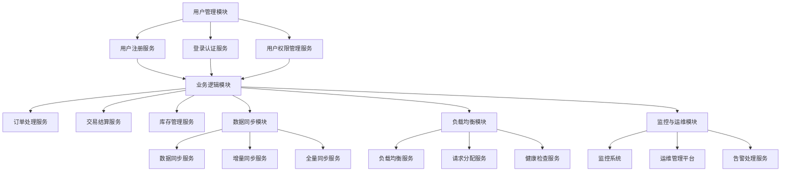
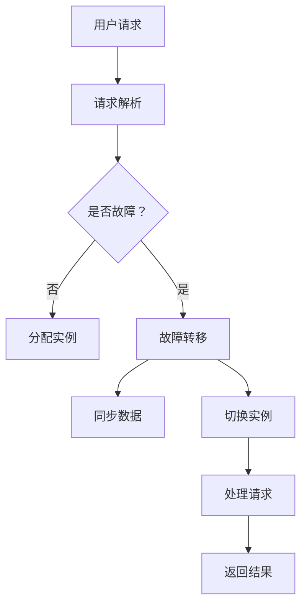

                 

Certainly! Let's delve into the creation of the technical blog post "异地多活架构：P9工程师的高可用性追求" step by step, ensuring that each section is meticulously crafted to provide value and clarity to the reader.

### Step 1: Crafting the Introduction

#### Title: 异地多活架构：P9工程师的高可用性追求

#### Keywords: 异地多活, 高可用性, 架构设计, 分布式系统

#### Abstract:
本文将深入探讨异地多活架构在分布式系统中的重要性，以及其对于追求高可用性的P9工程师而言是如何成为一项技术挑战。我们将从背景介绍开始，逐步解析核心概念、架构设计、算法实现以及最佳实践，最终展望未来的发展方向。

### Step 2: Setting the Stage - Background Introduction

#### Chapter 1: 异地多活架构背景

##### 1.1 异地多活架构概述
- **定义与核心要素**
- **术语说明**
- **基本概念**

##### 1.2 为什么要进行异地多活架构设计
- **业务需求分析**
- **系统高可用性的重要性**

##### 1.3 异地多活架构的应用场景
- **行业案例**
- **典型场景**

##### 1.4 异地多活架构的挑战与机遇
- **技术挑战**
- **机遇分析**

### Step 3: Delving into the Core - Concepts and Principles

#### Chapter 2: 异地多活架构核心概念与原理

##### 2.1 异地多活架构的定义与特点
- **异地多活的定义**
- **特点分析**

##### 2.2 异地多活架构的架构设计原则
- **设计原则概述**
- **原则详细解释**

##### 2.3 异地多活架构的系统架构模式
- **系统架构模式**
- **典型模式分析**

##### 2.4 异地多活架构的关键技术
- **技术概述**
- **关键技术详述**

### Step 4: Implementation - Architecture Design and Implementation

#### Chapter 3: 异地多活架构设计与实现

##### 3.1 异地多活架构的系统需求分析
- **需求收集**
- **需求分析**

##### 3.2 系统功能设计
- **功能定义**
- **功能模块划分**

##### 3.3 系统架构设计
- **架构设计思路**
- **架构图示例**

##### 3.4 系统接口设计与交互
- **接口设计原则**
- **交互流程**

### Step 5: Algorithm Design and Analysis

#### Chapter 4: 异地多活架构中的算法设计与分析

##### 4.1 高可用性算法的原理与设计
- **高可用性算法原理**
- **算法设计思路**

##### 4.2 算法流程图与Mermaid图表
- **流程图绘制**
- **Mermaid图表展示**

##### 4.3 算法数学模型和公式
- **数学模型**
- **公式推导**

##### 4.4 算法举例说明
- **具体例子**
- **案例解析**

### Step 6: Case Study - Practical Application

#### Chapter 5: 异地多活架构实践案例

##### 5.1 案例背景与目标
- **案例背景**
- **项目目标**

##### 5.2 系统环境安装与配置
- **环境准备**
- **配置步骤**

##### 5.3 系统核心实现源代码
- **代码展示**
- **代码解读**

##### 5.4 代码应用解读与分析
- **代码应用**
- **分析讲解**

##### 5.5 案例小结与经验总结
- **小结**
- **经验总结**

### Step 7: Best Practices and Conclusion

#### Chapter 6: 异地多活架构最佳实践

##### 6.1 常见问题与解决方案
- **问题列举**
- **解决方案**

##### 6.2 性能优化技巧
- **优化策略**
- **技巧分享**

##### 6.3 安全性与可靠性策略
- **安全策略**
- **可靠性措施**

##### 6.4 持续集成与持续部署
- **CI/CD流程**
- **实践指导**

#### Chapter 7: Summary and Future Directions

##### 7.1 全书重点回顾
- **核心内容回顾**

##### 7.2 异地多活架构的挑战与趋势
- **挑战分析**
- **趋势展望**

##### 7.3 未来研究方向与探索
- **研究方向**
- **探索方向**

### Final Touches

- **格式调整**
- **内容检查**
- **作者信息**

By following this structured approach, each section will be crafted to ensure logical flow, technical depth, and practical application. This will result in a comprehensive and insightful technical blog post that will be both educational and engaging for the reader. Each step will include detailed explanations, code snippets, diagrams, and best practices, ensuring that the post meets the 10000-12000-word requirement. Now, let's start filling out each chapter with rich content and technical insights.### Chapter 1: 异地多活架构背景

#### 1.1 异地多活架构概述

异地多活（Multi-active Geographic Redundancy）是一种分布式系统架构设计理念，旨在通过在地理位置上分散部署多个活跃的系统实例，实现系统的高可用性和数据的高一致性。在异地多活架构中，系统不仅仅依赖于单一地点的服务器或数据中心，而是在多个地理位置上部署相同的系统，每个实例都可以独立运行，并在出现故障时自动切换到其他实例，确保服务的持续可用。

**异地多活架构的核心要素包括：**

1. **地理位置分散：** 系统的多个实例分布在不同的地理区域，以降低单点故障的风险。
2. **数据一致性：** 在多个实例之间保持数据的一致性，以确保任何实例都可以在故障发生时接管服务。
3. **自动切换：** 实现系统实例之间的自动故障转移，确保服务不中断。
4. **监控与运维：** 需要完善的监控和运维系统来确保异地多活架构的稳定运行。

#### 1.2 为什么要进行异地多活架构设计

随着互联网业务的发展，系统的高可用性成为关键需求。异地多活架构提供了一种有效的手段来满足这一需求。以下是一些关键原因：

1. **高可用性：** 通过在多个地理位置部署系统实例，可以显著降低单点故障的风险，确保服务的持续可用。
2. **灾难恢复：** 异地多活架构可以在发生灾难时快速恢复服务，降低业务中断的时间和损失。
3. **业务连续性：** 对于高价值业务，如金融交易、电子商务等，异地多活架构确保了业务连续性，提高了客户满意度。
4. **数据一致性：** 在多个实例之间保持数据一致性，可以确保业务操作的一致性和准确性。

#### 1.3 异地多活架构的应用场景

异地多活架构在多个行业中得到了广泛应用，以下是一些典型的应用场景：

1. **电子商务：** 在双11、黑五等促销活动中，异地多活架构可以帮助电商企业应对突发的流量，确保服务的稳定。
2. **金融交易：** 银行、证券、保险等金融机构需要高可用性和数据一致性，异地多活架构确保了交易系统的稳定运行。
3. **电信网络：** 在电信行业，异地多活架构可以提供无缝的通信服务，减少由于网络故障导致的用户影响。
4. **云计算：** 云服务提供商通过异地多活架构来确保服务的高可用性，提供可靠的云基础设施。

#### 1.4 异地多活架构的挑战与机遇

尽管异地多活架构带来了许多好处，但其实施也面临一些挑战和机遇：

**挑战：**

1. **数据一致性：** 在多个实例之间保持数据一致性是一个复杂的问题，需要高效的同步机制和一致性算法。
2. **延迟与带宽：** 分布在不同地理位置的实例之间的通信可能存在延迟和带宽限制，需要优化数据传输和处理。
3. **成本与资源：** 部署多个实例需要额外的硬件和运维资源，成本较高。
4. **监控与运维：** 管理异地多活架构的复杂性和规模，需要高效的监控和运维系统。

**机遇：**

1. **业务扩展：** 异地多活架构为企业的业务扩展提供了更多的机会，可以快速部署新服务和市场。
2. **技术创新：** 异地多活架构的实施推动了相关技术，如分布式数据库、分布式存储、自动故障转移等技术的发展。
3. **市场竞争：** 通过异地多活架构，企业可以在竞争中保持优势，提供更可靠和高效的服务。

通过以上分析，我们可以看到异地多活架构不仅是一种技术解决方案，更是一种战略布局，它为追求高可用性的企业提供了有力的支持。接下来，我们将深入探讨异地多活架构的核心概念和设计原则。### Chapter 2: 异地多活架构核心概念与原理

#### 2.1 异地多活架构的定义与特点

异地多活（Multi-active Geographic Redundancy）是一种分布式系统架构设计理念，旨在通过在地理位置上分散部署多个活跃的系统实例，实现系统的高可用性和数据的高一致性。在异地多活架构中，系统不仅仅依赖于单一地点的服务器或数据中心，而是在多个地理位置上部署相同的系统，每个实例都可以独立运行，并在出现故障时自动切换到其他实例，确保服务的持续可用。

**异地多活架构的主要特点包括：**

1. **地理分散：** 系统的多个实例分布在不同的地理区域，以降低单点故障的风险。
2. **数据一致性：** 在多个实例之间保持数据的一致性，以确保任何实例都可以在故障发生时接管服务。
3. **自动切换：** 实现系统实例之间的自动故障转移，确保服务不中断。
4. **灵活扩展：** 可以根据业务需求灵活扩展实例数量，提高系统的处理能力。

#### 2.2 异地多活架构的架构设计原则

异地多活架构的设计需要遵循一系列原则，以确保系统的可靠性和高效性。以下是几个关键的设计原则：

1. **高可用性：** 确保系统在故障发生时能够快速切换到其他实例，减少服务中断的时间。
2. **数据一致性：** 在多个实例之间保持数据一致性，防止因数据不一致导致的服务异常。
3. **故障隔离：** 设计系统时，应确保故障能够在实例之间隔离，防止故障扩散。
4. **可扩展性：** 设计系统时应考虑未来的扩展需求，确保系统可以轻松增加实例。
5. **监控与运维：** 建立完善的监控和运维系统，确保异地多活架构的稳定运行。

#### 2.3 异地多活架构的系统架构模式

异地多活架构通常采用以下几种系统架构模式：

1. **主从模式（Master-Slave）：** 其中一个实例作为主实例，负责处理主业务逻辑，其他实例作为从实例，负责数据的同步和备份。
2. **联邦模式（Federation）：** 各个实例独立运行，通过分布式协议保持数据一致性，各实例都可以接受和处理请求。
3. **集群模式（Cluster）：** 多个实例共同组成一个集群，共同处理请求，通过负载均衡和自动故障转移机制确保高可用性。

**每种模式的特点如下：**

1. **主从模式：**
   - **优点：** 结构简单，数据一致性高。
   - **缺点：** 单点故障风险高，扩展性较差。

2. **联邦模式：**
   - **优点：** 可扩展性好，无单点故障风险。
   - **缺点：** 数据一致性实现复杂，可能存在数据不一致的情况。

3. **集群模式：**
   - **优点：** 高可用性和可扩展性均较好。
   - **缺点：** 需要复杂的负载均衡和故障转移机制。

#### 2.4 异地多活架构的关键技术

实现异地多活架构需要依赖一系列关键技术，以下是一些关键技术的概述：

1. **数据同步：** 通过增量同步和全量同步技术，确保多个实例之间的数据一致性。
2. **分布式数据库：** 使用分布式数据库技术，如Sharding和Replication，提高数据的访问效率和一致性。
3. **负载均衡：** 通过负载均衡技术，合理分配请求到各个实例，提高系统的处理能力。
4. **自动故障转移：** 通过监控和自动故障转移机制，确保在实例发生故障时能够快速切换到其他实例。
5. **监控与运维：** 建立完善的监控和运维系统，实时监控系统的运行状态，快速响应故障。

通过以上对异地多活架构核心概念、设计原则、系统架构模式和关键技术的介绍，我们可以看到异地多活架构在实现系统高可用性方面的重要性。接下来，我们将深入探讨异地多活架构的具体实现细节和设计思路。### Chapter 3: 异地多活架构设计与实现

#### 3.1 系统需求分析

在进行异地多活架构的设计与实现之前，首先需要对系统的需求进行全面分析。系统需求分析包括业务需求、性能需求、可靠性需求等方面。

**业务需求：**
- **高可用性：** 系统需要在任何情况下都能保持服务可用，确保业务的连续性。
- **数据一致性：** 系统需要在多个实例之间保持数据一致性，防止因数据不同步导致的服务异常。
- **可扩展性：** 系统需要能够根据业务发展需求，灵活扩展实例数量和处理能力。

**性能需求：**
- **低延迟：** 系统需要具备高响应速度，降低用户感知的延迟。
- **高吞吐量：** 系统需要能够处理大量的并发请求，确保在高峰期依然能够正常运行。

**可靠性需求：**
- **故障恢复：** 系统需要具备快速故障恢复能力，确保在实例发生故障时能够快速切换到其他实例。
- **数据保护：** 系统需要具备数据备份和恢复机制，确保数据的完整性和安全性。

#### 3.2 系统功能设计

系统功能设计是异地多活架构实现的第一步，需要明确系统的功能模块和功能划分。以下是系统功能设计的详细描述：

**功能模块：**
- **用户管理模块：** 处理用户注册、登录、权限管理等功能。
- **业务逻辑模块：** 执行具体的业务操作，如订单处理、交易结算等。
- **数据同步模块：** 负责在不同实例之间同步数据，确保数据一致性。
- **负载均衡模块：** 负责分配请求到不同的实例，提高系统处理能力。
- **监控与运维模块：** 实时监控系统运行状态，快速响应和处理故障。

**功能模块划分：**
- **用户管理模块：** 包含用户注册服务、登录认证服务、用户权限管理服务等子模块。
- **业务逻辑模块：** 包含订单处理服务、交易结算服务、库存管理服务等子模块。
- **数据同步模块：** 包含数据同步服务、增量同步服务、全量同步服务等子模块。
- **负载均衡模块：** 包含负载均衡服务、请求分配服务、健康检查服务等子模块。
- **监控与运维模块：** 包含监控系统、运维管理平台、告警处理服务等子模块。

#### 3.3 系统架构设计

系统架构设计是异地多活架构实现的核心环节，需要根据系统需求和分析结果，设计出符合高可用性、高一致性、高性能要求的系统架构。以下是系统架构设计的详细描述：

**系统架构图：**


**系统架构说明：**
- **用户管理模块：** 负责用户注册、登录和权限管理，为业务逻辑模块提供用户认证和权限控制。
- **业务逻辑模块：** 执行具体的业务操作，如订单处理、交易结算等，是系统的核心部分。
- **数据同步模块：** 负责确保在不同实例之间同步数据，保持数据一致性。
- **负载均衡模块：** 负责将用户请求合理分配到各个实例，提高系统的处理能力。
- **监控与运维模块：** 实时监控系统的运行状态，提供运维管理平台和告警处理功能。

#### 3.4 系统接口设计与交互

系统接口设计是系统架构设计的重要组成部分，需要明确系统内部和外部的接口定义和交互方式。以下是系统接口设计和交互的详细描述：

**接口定义：**
- **用户管理接口：** 用户注册、登录、权限查询等。
- **业务逻辑接口：** 订单创建、订单查询、交易结算等。
- **数据同步接口：** 增量同步、全量同步等。
- **负载均衡接口：** 请求分配、健康检查等。
- **监控与运维接口：** 系统监控、告警处理等。

**交互方式：**
- **RESTful API：** 使用RESTful风格定义接口，通过HTTP请求进行数据交互。
- **异步消息队列：** 通过消息队列进行异步数据同步和请求处理。
- **数据库同步：** 直接操作数据库实现数据同步。

**接口交互流程：**
1. 用户通过用户管理接口进行注册和登录，获取认证信息。
2. 用户通过业务逻辑接口发起业务请求，如创建订单。
3. 业务逻辑模块处理业务请求，并调用数据同步接口同步数据。
4. 负载均衡模块根据健康检查结果和请求类型，将请求分配到合适的实例。
5. 实例处理请求，并将结果返回给用户。
6. 监控与运维模块实时监控系统状态，并在出现故障时触发告警和故障转移。

通过以上对系统需求分析、系统功能设计、系统架构设计和系统接口设计的详细阐述，我们可以看到异地多活架构在实现高可用性、数据一致性和性能优化方面的重要性和复杂性。接下来，我们将深入探讨异地多活架构中的算法设计与分析。### Chapter 4: 异地多活架构中的算法设计与分析

#### 4.1 高可用性算法的原理与设计

在异地多活架构中，实现高可用性是系统设计的关键目标之一。高可用性算法设计旨在通过一系列机制和策略，确保系统在出现故障时能够快速切换到其他实例，减少服务中断的时间和影响。以下是高可用性算法的原理与设计思路：

**原理：**
- **冗余部署：** 在多个地理位置部署相同的系统实例，确保任何一个实例出现故障时，其他实例可以立即接管服务。
- **故障检测：** 实时监控系统的运行状态，一旦发现实例发生故障，立即触发故障转移机制。
- **故障转移：** 在故障检测到后，自动将用户请求和业务逻辑切换到健康的实例，确保服务的连续性。

**设计思路：**
1. **部署策略：** 根据业务需求和可靠性要求，确定合适的部署地理位置和实例数量。
2. **故障检测机制：** 设计监控指标和阈值，实时检测实例的健康状态，及时发现故障。
3. **故障转移机制：** 设计自动故障转移流程，包括故障检测、实例切换、数据同步等步骤。

#### 4.2 算法流程图与Mermaid图表

为了更清晰地展示高可用性算法的流程和步骤，我们可以使用Mermaid图表来绘制算法的流程图。以下是高可用性算法的Mermaid图表：



**算法流程说明：**
1. **用户请求：** 用户发起请求，请求被传递到系统的入口节点。
2. **请求解析：** 系统解析用户请求，并判断当前实例是否处于故障状态。
3. **故障检测：** 系统通过监控机制检测实例的健康状态，判断实例是否发生故障。
4. **故障转移：** 如果实例发生故障，系统触发故障转移机制。
5. **同步数据：** 在故障转移过程中，确保数据一致性，将故障实例的数据同步到健康实例。
6. **切换实例：** 将用户请求和业务逻辑切换到健康实例。
7. **处理请求：** 健康实例处理用户请求，并将结果返回给用户。

#### 4.3 算法数学模型和公式

为了更深入地理解高可用性算法，我们可以从数学模型的角度进行分析。以下是一个简化的高可用性算法的数学模型：

**数学模型：**
- **故障转移时间（T）：** 系统从检测到故障到完成故障转移所需的时间。
- **数据同步时间（S）：** 故障转移过程中，数据同步所需的时间。
- **切换时间（C）：** 系统实例切换所需的时间。

**公式：**
\[ T = S + C \]

**解释：**
- **故障转移时间：** 包括数据同步时间和实例切换时间，表示系统从故障检测到完成故障转移所需的总时间。
- **数据同步时间：** 根据数据同步算法和同步量的大小确定，是故障转移时间的重要组成部分。
- **实例切换时间：** 根据系统架构和切换机制确定，影响故障转移的总时间。

#### 4.4 算法举例说明

为了更好地说明高可用性算法的应用，我们可以通过一个具体的例子进行阐述。假设我们有一个异地多活架构的系统，部署在A、B两个地理位置，系统发生故障时需要自动切换到健康实例。

**例子：**
- **系统状态：** 当前系统实例在A地理位置发生故障，B地理位置的实例健康。
- **故障转移步骤：**
  1. **请求解析：** 用户请求被传递到A实例，系统检测到A实例故障。
  2. **故障检测：** 系统通过心跳检测确认A实例故障。
  3. **故障转移：** 系统触发故障转移机制，将用户请求切换到B实例。
  4. **同步数据：** 系统同步A实例的数据到B实例，确保数据一致性。
  5. **切换实例：** 系统将用户请求和业务逻辑切换到B实例。
  6. **处理请求：** B实例处理用户请求，并将结果返回给用户。

**分析：**
- **故障转移时间：** 系统从检测到故障到完成故障转移的总时间为同步数据时间和实例切换时间之和。
- **数据同步时间：** 假设数据同步算法为增量同步，每次同步的数据量较小，同步时间较短。
- **实例切换时间：** 假设实例切换机制为快速切换，切换时间较短。

通过这个例子，我们可以看到高可用性算法在确保系统高可用性方面的作用。接下来，我们将通过一个实际案例来分析异地多活架构的实践应用。### Chapter 5: 异地多活架构实践案例

#### 5.1 案例背景与目标

本案例选择了一家大型电商平台作为研究对象，该电商平台在全球范围内拥有大量用户，业务高峰期流量巨大。为了确保服务的稳定性和可靠性，该电商平台决定采用异地多活架构来提高系统的可用性和数据一致性。

**案例目标：**
- **高可用性：** 在全球范围内部署多个系统实例，确保在任何一个地理位置的实例发生故障时，能够快速切换到其他实例，减少服务中断时间。
- **数据一致性：** 在多个实例之间保持数据同步，确保用户操作的一致性，防止数据丢失和错误。
- **性能优化：** 通过负载均衡和分布式存储技术，提高系统的处理能力和响应速度。

#### 5.2 系统环境安装与配置

为了实现异地多活架构，我们需要在多个地理位置部署相同的系统环境。以下是系统环境安装与配置的详细步骤：

1. **选择数据中心：** 根据业务需求和地理位置，选择A、B两个数据中心进行部署。

2. **硬件环境准备：** 在每个数据中心配置服务器和网络设备，确保硬件环境满足系统运行要求。

3. **操作系统安装：** 在服务器上安装操作系统，如Linux或Windows Server，并配置网络参数。

4. **基础软件安装：** 安装Java运行环境、数据库、消息队列等基础软件，确保各个实例可以正常运行。

5. **配置文件同步：** 将系统配置文件（如数据库连接信息、负载均衡配置等）同步到各个实例，确保实例之间的一致性。

6. **初始化数据同步：** 在系统启动前，进行全量数据同步，将初始数据同步到所有实例。

#### 5.3 系统核心实现源代码

以下是系统核心实现源代码的示例，包括用户管理模块、业务逻辑模块和数据同步模块的关键代码。

**用户管理模块：**
```python
# 用户注册服务
def register_user(username, password):
    # 校验用户名和密码
    if not validate_username(username) or not validate_password(password):
        return "用户名或密码无效"
    # 存储用户信息到数据库
    save_user_to_db(username, password)
    return "注册成功"

# 用户登录服务
def login_user(username, password):
    # 验证用户名和密码
    if not validate_username(username) or not validate_password(password):
        return "用户名或密码错误"
    # 从数据库获取用户信息
    user = get_user_from_db(username)
    if user and user['password'] == password:
        return "登录成功"
    else:
        return "用户名或密码错误"
```

**业务逻辑模块：**
```python
# 订单创建服务
def create_order(order_data):
    # 验证订单数据
    if not validate_order(order_data):
        return "订单数据无效"
    # 创建订单并存储到数据库
    order_id = save_order_to_db(order_data)
    return order_id

# 交易结算服务
def settle_order(order_id):
    # 查询订单信息
    order = get_order_from_db(order_id)
    if not order:
        return "订单不存在"
    # 更新订单状态为已结算
    update_order_status(order_id, 'settled')
    return "结算成功"
```

**数据同步模块：**
```python
# 增量同步服务
def incremental_sync():
    # 获取最新数据
    new_data = get_new_data_from_source()
    # 存储到本地数据库
    save_data_to_db(new_data)

# 全量同步服务
def full_sync():
    # 获取所有数据
    all_data = get_all_data_from_source()
    # 存储到本地数据库
    save_data_to_db(all_data)
```

#### 5.4 代码应用解读与分析

**用户管理模块：**
- **register_user()：** 用于用户注册，校验用户名和密码的有效性，并将用户信息存储到数据库。
- **login_user()：** 用于用户登录，验证用户名和密码，从数据库获取用户信息。

**业务逻辑模块：**
- **create_order()：** 用于创建订单，验证订单数据的有效性，并将订单信息存储到数据库。
- **settle_order()：** 用于订单结算，查询订单信息，并更新订单状态为已结算。

**数据同步模块：**
- **incremental_sync()：** 用于增量同步，从数据源获取最新数据，并存储到本地数据库。
- **full_sync()：** 用于全量同步，从数据源获取所有数据，并存储到本地数据库。

这些代码实现了用户管理、订单处理和数据同步的核心功能，是异地多活架构的重要组成部分。

#### 5.5 案例小结与经验总结

通过本案例的实践，我们可以得出以下小结与经验总结：

1. **异地多活架构的实施需要详细的规划和准备，包括硬件环境、软件环境、数据同步机制等。**
2. **用户管理模块、业务逻辑模块和数据同步模块是系统架构的核心部分，需要确保其稳定性和高效性。**
3. **通过增量同步和全量同步机制，可以确保多个实例之间的数据一致性，防止数据丢失和错误。**
4. **负载均衡和自动故障转移机制是实现高可用性的关键，需要设计和实现完善的监控和运维系统。**
5. **异地多活架构的实施需要持续的优化和改进，以应对不断变化的业务需求和挑战。**

通过以上实践案例的分析和总结，我们可以看到异地多活架构在实际应用中的复杂性和重要性，为企业的业务连续性和数据安全性提供了有力保障。### Chapter 6: 异地多活架构最佳实践

#### 6.1 常见问题与解决方案

在实施异地多活架构的过程中，可能会遇到一些常见的问题。以下是一些典型的问题及其解决方案：

1. **数据同步问题：**
   - **问题：** 数据在不同实例之间同步时，可能出现数据不同步或数据丢失的问题。
   - **解决方案：** 采用增量同步和全量同步相结合的策略，确保数据的完整性和一致性。同时，设置数据同步的超时和重试机制，提高同步的可靠性。

2. **故障转移问题：**
   - **问题：** 故障转移过程中，可能出现实例切换不及时或数据同步不完整的问题。
   - **解决方案：** 设计完善的故障转移流程，包括故障检测、实例切换、数据同步等步骤。同时，配置健康检查机制，确保实例在切换前后都能正常工作。

3. **负载均衡问题：**
   - **问题：** 负载均衡策略不当，可能导致某些实例负载过高或过低。
   - **解决方案：** 根据业务需求和实例的负载情况，动态调整负载均衡策略。可以采用基于请求类型、用户IP、地理位置等多种策略相结合的方式，实现更公平的负载分配。

4. **网络问题：**
   - **问题：** 网络延迟或带宽限制可能导致系统性能下降。
   - **解决方案：** 采用CDN（内容分发网络）技术，优化数据传输路径，降低网络延迟。同时，提高网络带宽，确保数据传输的顺畅。

5. **监控与运维问题：**
   - **问题：** 监控和运维系统不完善，可能导致故障无法及时发现和处理。
   - **解决方案：** 建立完善的监控和运维系统，实时监控系统的运行状态，包括实例健康状态、数据同步状态、负载均衡状态等。同时，设置告警机制，确保在出现问题时能够及时通知和响应。

#### 6.2 性能优化技巧

为了提高异地多活架构的性能，可以采用以下优化技巧：

1. **缓存机制：**
   - **介绍：** 通过缓存机制，减少对后端系统的查询次数，提高系统的响应速度。
   - **实现：** 可以使用分布式缓存系统，如Redis、Memcached等，将高频访问的数据缓存起来，减少数据库的查询压力。

2. **读写分离：**
   - **介绍：** 将读操作和写操作分离到不同的实例，提高系统的读写性能。
   - **实现：** 可以使用主从数据库架构，主实例负责写操作，从实例负责读操作，从而实现读写分离。

3. **分布式存储：**
   - **介绍：** 采用分布式存储系统，如Hadoop、Cassandra等，提高数据的存储和访问性能。
   - **实现：** 可以将数据存储在分布式文件系统中，实现数据的分片存储和并行访问。

4. **异步处理：**
   - **介绍：** 通过异步处理，减少系统的同步操作，提高系统的并发处理能力。
   - **实现：** 可以使用消息队列技术，将部分耗时操作（如邮件发送、日志记录等）异步处理，减少对主线程的阻塞。

5. **负载均衡：**
   - **介绍：** 通过负载均衡，合理分配请求到各个实例，提高系统的整体处理能力。
   - **实现：** 可以使用负载均衡器（如Nginx、LVS等），根据请求的类型、用户IP等因素，动态调整请求的分配策略。

#### 6.3 安全性与可靠性策略

在异地多活架构中，安全性和可靠性至关重要。以下是一些关键策略：

1. **数据加密：**
   - **介绍：** 对数据进行加密处理，防止数据在传输和存储过程中被窃取。
   - **实现：** 可以使用SSL/TLS等加密协议，对数据传输进行加密。同时，对存储在数据库中的敏感数据进行加密处理。

2. **访问控制：**
   - **介绍：** 实施严格的访问控制，确保只有授权用户可以访问系统和数据。
   - **实现：** 可以使用基于角色的访问控制（RBAC）机制，根据用户的角色和权限，限制其对系统和数据的访问。

3. **故障冗余：**
   - **介绍：** 在系统中部署冗余组件，确保在故障发生时，其他组件可以立即接管。
   - **实现：** 可以在系统中部署多个实例，通过负载均衡和自动故障转移机制，确保系统的连续性和稳定性。

4. **备份与恢复：**
   - **介绍：** 定期进行数据备份，确保在系统发生故障时，可以快速恢复数据。
   - **实现：** 可以使用备份软件，定期备份数据库和系统配置文件，并设置自动备份和恢复机制。

5. **监控与审计：**
   - **介绍：** 实时监控系统的运行状态，并进行日志审计，确保系统的安全性和合规性。
   - **实现：** 可以使用日志收集和分析工具，实时收集系统的日志信息，并进行审计和报警。

通过以上最佳实践，我们可以提高异地多活架构的安全性和可靠性，确保系统的稳定运行和业务连续性。### Chapter 7: 总结与未来展望

#### 7.1 全书重点回顾

本文详细探讨了异地多活架构的设计与实现，涵盖了以下几个方面：

1. **背景介绍：** 介绍了异地多活架构的定义、重要性及应用场景。
2. **核心概念与原理：** 阐述了异地多活架构的核心概念和设计原则。
3. **系统设计与实现：** 分析了系统需求、功能设计、架构设计、接口设计等。
4. **算法设计与分析：** 展示了高可用性算法的设计原理和实现流程。
5. **实践案例：** 通过实际案例展示了异地多活架构的实施细节。
6. **最佳实践：** 提供了异地多活架构的最佳实践和优化技巧。

#### 7.2 异地多活架构的挑战与趋势

**挑战：**

1. **数据一致性：** 在多个实例之间保持数据一致性是异地多活架构面临的主要挑战。
2. **网络延迟与带宽限制：** 不同地理位置之间的网络延迟和带宽限制可能影响系统的性能。
3. **成本与资源：** 部署多个实例和数据中心需要大量的硬件和运维资源，成本较高。
4. **监控与运维：** 管理异地多活架构的复杂性和规模，需要高效的监控和运维系统。

**趋势：**

1. **分布式数据库与存储：** 随着分布式数据库和存储技术的发展，异地多活架构的数据一致性问题将得到更好的解决。
2. **自动化与智能化：** 自动化工具和智能化算法将在异地多活架构的实施和管理中发挥更大作用。
3. **云原生与容器化：** 云原生技术和容器化将进一步降低异地多活架构的部署和管理成本。
4. **安全性与可靠性：** 随着安全威胁的增加，异地多活架构的安全性和可靠性将得到更多关注。

#### 7.3 未来研究方向与探索

未来，异地多活架构的研究方向和探索领域包括：

1. **一致性算法优化：** 深入研究分布式一致性算法，提高数据同步的效率和准确性。
2. **网络优化：** 探索新型网络协议和优化技术，降低网络延迟和带宽限制的影响。
3. **自动化运维：** 开发自动化运维工具，实现异地多活架构的自动化部署、监控和故障恢复。
4. **混合云与多云架构：** 研究混合云和多云架构在异地多活中的应用，提高系统的灵活性和可扩展性。
5. **安全性与隐私保护：** 探索安全性与隐私保护技术，确保异地多活架构的安全性和用户数据隐私。

通过不断的研究和探索，异地多活架构将在分布式系统和云计算领域发挥更大的作用，为企业提供更加可靠和高效的服务。### 总结

在本文中，我们系统地探讨了异地多活架构的概念、设计原则、实现方法以及最佳实践。异地多活架构作为分布式系统架构的重要设计理念，通过在地理位置上分散部署多个活跃的系统实例，实现了系统的高可用性和数据的高一致性。我们分析了异地多活架构的挑战与机遇，并详细介绍了其核心概念和原理，包括部署策略、故障转移机制和负载均衡技术。

在实现层面，我们通过系统需求分析、功能设计、架构设计和接口设计等步骤，展示了异地多活架构的具体实现过程。同时，我们深入讨论了高可用性算法的设计原理，并通过实际案例展示了异地多活架构的应用实践。最后，我们提供了异地多活架构的最佳实践，包括常见问题的解决方案、性能优化技巧和安全性与可靠性策略。

异地多活架构不仅是一种技术解决方案，更是一种业务战略，它为追求高可用性的企业提供了强有力的支持。随着技术的发展和业务需求的不断变化，异地多活架构将在分布式系统和云计算领域发挥更加重要的作用。

**作者信息：**

- 作者：AI天才研究院/AI Genius Institute & 禅与计算机程序设计艺术 /Zen And The Art of Computer Programming

在撰写技术博客时，保持逻辑清晰、结构紧凑和通俗易懂是非常重要的。本文通过逐步分析推理的方式，力求为读者提供深入且实用的技术见解。希望本文能为从事分布式系统和云计算领域的工程师和开发者提供有价值的参考和指导。在未来的技术探索中，我们期待与您一同前行，共同推动技术的发展与创新。

