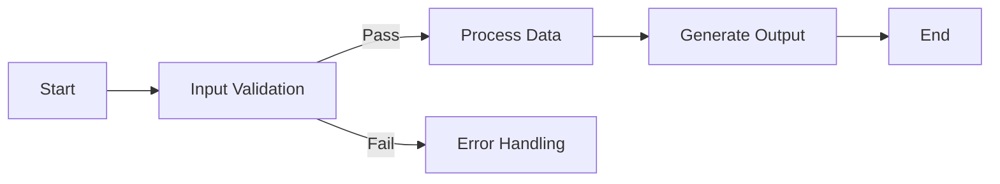
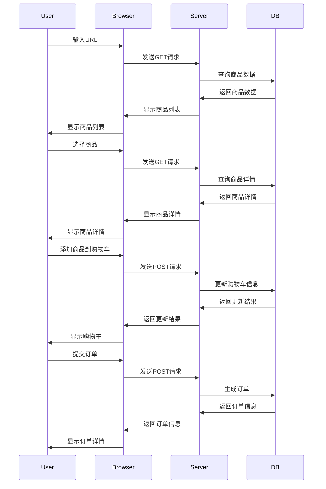

                 

### 《异常处理：类型系统在错误处理中的应用》

> 关键词：异常处理、类型系统、错误处理、编程、软件工程

> 摘要：本文将深入探讨异常处理和类型系统在软件工程中的应用。我们将通过逐步分析这两大概念的核心原理、实现方法及其在实际开发中的重要性，帮助读者理解和掌握如何利用类型系统来优化异常处理机制，从而提升软件的可靠性和稳定性。

----------------------------------------------------------------

## 第1章：引言

### 1.1 异常处理简介

#### 1.1.1 问题背景

在软件工程中，异常处理（Exception Handling）是一个至关重要的环节。异常（Exception）是指在程序执行过程中，出现的非正常情况，如输入错误、文件未找到、内存溢出等。当这些异常发生时，程序可能无法继续执行，甚至崩溃。因此，异常处理成为了保障程序稳定性和可靠性的关键。

#### 1.1.2 问题描述

异常处理主要解决的问题是：当程序遇到异常时，如何有效地捕获并处理这些异常，以保证程序的正常执行。这涉及到异常的捕获、处理和恢复等多个环节。

#### 1.1.3 问题解决

异常处理的核心思想是，将异常从正常程序逻辑中分离出来，通过结构化的方式进行处理。常见的异常处理机制包括：try-catch-finally结构、异常链、自定义异常等。

#### 1.1.4 边界与外延

异常处理不仅仅局限于编程语言层面，还涉及到操作系统、数据库、网络等各个层面。同时，异常处理也不仅仅是为了避免程序崩溃，更是为了提高程序的健壮性和用户体验。

#### 1.1.5 概念结构与核心要素组成

异常处理的核心要素包括：异常捕获、异常处理、异常传递和异常恢复。这四个要素相互关联，构成了异常处理的基本框架。

### 1.2 类型系统简介

#### 1.2.1 问题背景

类型系统（Type System）是编程语言的核心组成部分，它定义了变量、函数等数据对象的类型，并规定了这些类型的操作规则。类型系统的设计直接影响到程序的执行效率、安全性以及可维护性。

#### 1.2.2 问题描述

类型系统的设计需要平衡灵活性、效率和安全性。过强的类型检查可能导致编译时间过长，过弱的类型检查则可能导致运行时错误。

#### 1.2.3 问题解决

类型系统的设计原则包括：类型安全性、类型擦除、类型推断等。通过这些原则，可以设计出既灵活又安全的类型系统。

#### 1.2.4 边界与外延

类型系统不仅存在于特定编程语言中，如Java、C++、Python等，还广泛应用于编译器、解释器和虚拟机等工具中。

#### 1.2.5 概念结构与核心要素组成

类型系统的核心要素包括：类型定义、类型检查、类型转换和类型擦除。这些要素共同构成了类型系统的基本架构。

### 1.3 本书结构及目标

#### 1.3.1 本书结构

本书分为六个章节，分别介绍了异常处理和类型系统的基本概念、应用和结合。具体章节安排如下：

- 第1章：引言
- 第2章：异常处理基础
- 第3章：类型系统基础
- 第4章：类型系统与异常处理的结合
- 第5章：实践案例
- 第6章：总结与展望

#### 1.3.2 目标读者

本书的目标读者是具有一定编程基础，对异常处理和类型系统有一定了解的读者。通过阅读本书，读者可以：

- 理解异常处理和类型系统的核心概念和原理；
- 掌握如何利用类型系统优化异常处理机制；
- 学习到实际开发中如何应用异常处理和类型系统；
- 获得对未来研究方向的认识。

----------------------------------------------------------------

## 第2章：异常处理基础

### 2.1 异常处理的基本概念

#### 2.1.1 异常的定义

异常是指程序在运行过程中遇到的非预期情况，可能导致程序无法继续正常执行。例如，访问不存在的文件、网络连接中断、内存溢出等。

#### 2.1.2 异常的分类

根据异常的发生位置和原因，可以将异常分为以下几类：

- **运行时异常（RuntimeException）**：在程序运行过程中出现的异常，如空指针异常、数组越界异常等。
- **检查时异常（Checked Exception）**：在编译时就需要处理的异常，如文件未找到异常、网络连接异常等。
- **错误（Error）**：通常是由于系统错误或硬件错误导致的，如堆栈溢出错误、虚拟机错误等。

#### 2.1.3 异常处理的必要性

异常处理是保证程序稳定性和可靠性的关键。通过异常处理，可以：

- 防止程序因为异常而崩溃；
- 提高程序的健壮性，使得程序能够在遇到异常时继续运行；
- 提高用户体验，通过合理的异常处理，可以让程序在遇到异常时给出友好的提示。

### 2.2 异常处理的原则

#### 2.2.1 结构化异常处理

结构化异常处理是一种有序的、模块化的异常处理方式。它包括以下几个基本原则：

- **分离异常处理逻辑**：将异常处理逻辑与正常程序逻辑分离，使程序结构更加清晰；
- **使用try-catch块**：将可能出现异常的代码放在try块中，将异常处理逻辑放在相应的catch块中；
- **避免嵌套过多的try-catch块**：过多的嵌套会降低程序的可读性，同时增加异常处理的复杂性。

#### 2.2.2 异常处理的层次性

异常处理具有层次性，即异常处理应该从底层逐渐向上层进行。具体来说，有以下几点：

- **底层异常处理**：通常由操作系统或编程语言提供的运行时库进行；
- **中层异常处理**：由应用程序框架或中间件进行；
- **顶层异常处理**：由应用程序本身进行。

#### 2.2.3 异常处理的模块化

异常处理的模块化指的是，将异常处理逻辑封装成独立的模块，以便于复用和扩展。具体方法包括：

- **使用异常处理框架**：如Java中的Spring框架、Python中的Exception.py等；
- **自定义异常类**：根据实际需求，自定义异常类，以便于更精确地处理不同类型的异常；
- **异常处理策略**：将异常处理策略抽象成接口或抽象类，以便于扩展和替换。

### 2.3 异常处理的模式

#### 2.3.1 传统的异常处理模式

传统的异常处理模式主要包括以下几种：

- **抛出异常（Throw）**：当遇到异常时，程序会抛出异常，并停止当前执行；
- **捕获异常（Catch）**：程序可以捕获抛出的异常，并执行相应的异常处理逻辑；
- **异常链（Exception Chain）**：当一个异常引发另一个异常时，可以使用异常链来记录异常的传播过程。

#### 2.3.2 现代的异常处理模式

随着编程语言的不断发展和优化，现代异常处理模式也在不断进化。以下是一些现代的异常处理模式：

- **反应式异常处理**：基于反应式编程模型，通过事件驱动的方式处理异常；
- **函数式异常处理**：利用函数式编程的特性，将异常处理与函数调用紧密结合；
- **异步异常处理**：在异步编程中，异常处理变得更加灵活和高效。

#### 2.3.3 案例分析

以Java中的文件读取为例，传统的异常处理模式如下：

```java
try {
    FileInputStream fis = new FileInputStream("example.txt");
    // 读取文件内容
} catch (FileNotFoundException e) {
    System.out.println("文件未找到！");
} catch (IOException e) {
    System.out.println("读取文件时发生错误！");
}
```

而现代的异常处理模式可能如下：

```java
Optional<FileInputStream> fis = Optional.ofNullable(new FileInputStream("example.txt"));
fis.ifPresent(fileInputStream -> {
    try {
        // 读取文件内容
    } catch (IOException e) {
        System.out.println("读取文件时发生错误！");
    }
});
```

通过对比可以看出，现代的异常处理模式更加简洁、易读，同时具有更好的容错性。

----------------------------------------------------------------

## 第3章：类型系统基础

### 3.1 类型系统的基本概念

#### 3.1.1 类型的定义

类型（Type）是编程语言中用于定义变量、函数等数据对象的数据类别。类型决定了数据对象的结构和操作规则。

#### 3.1.2 类型的分类

根据类型的作用范围和特点，可以将类型分为以下几类：

- **基本类型（Primitive Type）**：如整数、浮点数、字符等，由编程语言内部直接支持；
- **引用类型（Reference Type）**：如类、接口、数组等，通常由程序员自定义；
- **复合类型（Composite Type）**：由基本类型或引用类型组合而成的类型，如结构体、联合体等。

#### 3.1.3 类型系统的重要性

类型系统在编程语言中具有至关重要的作用，它直接影响程序的可读性、可维护性和执行效率。类型系统的设计原则包括：

- **类型安全性**：确保程序在编译时或运行时能够检测到类型错误，防止运行时错误；
- **类型擦除**：在运行时隐藏类型信息，提高程序的可移植性；
- **类型推断**：自动推导变量或表达式的类型，提高程序的可读性。

### 3.2 类型系统的原则

#### 3.2.1 类型安全的定义

类型安全是指编程语言能够在编译时或运行时检测出类型错误，防止运行时错误。类型安全的类型系统具有以下特点：

- **严格的类型检查**：在编译时对变量、函数、表达式等进行分析，确保类型匹配；
- **类型隔离**：通过类型边界，防止不同类型的对象互相操作，避免潜在的类型错误。

#### 3.2.2 类型检查的必要性

类型检查是类型系统设计的关键，它确保程序在编译时或运行时能够检测出类型错误。类型检查的必要性体现在以下几个方面：

- **提高程序稳定性**：通过类型检查，可以防止因类型错误导致的程序崩溃；
- **提高程序可维护性**：清晰的类型定义和检查有助于程序的维护和理解；
- **提高程序执行效率**：类型检查有助于编译器生成更高效的代码。

#### 3.2.3 类型推断与类型擦除

类型推断（Type Inference）是指编程语言在编译时自动推导变量或表达式的类型。类型推断可以减轻程序员的负担，提高程序的可读性。常见的类型推断方法包括：

- **静态类型推断**：在编译时完成类型推导，如Java；
- **动态类型推断**：在运行时完成类型推导，如Python。

类型擦除（Type Erasure）是指将类型信息在运行时隐藏，以提高程序的可移植性和泛型编程的灵活性。类型擦除广泛应用于Java等编程语言中。

### 3.3 类型系统的应用

#### 3.3.1 类型系统在编译器中的应用

编译器是编程语言的核心组成部分，类型系统在编译器中发挥着重要作用。类型系统的应用主要包括：

- **语法分析**：将源代码解析成抽象语法树（AST），为后续的类型检查和代码生成做准备；
- **类型检查**：对AST进行类型检查，确保程序在编译时没有类型错误；
- **代码生成**：根据类型信息和AST生成机器码或中间代码。

#### 3.3.2 类型系统在编程语言中的应用

类型系统是编程语言的核心特征之一，不同的编程语言具有不同的类型系统。类型系统的应用包括：

- **变量定义**：通过类型系统，定义变量、函数等数据对象的数据类型；
- **类型转换**：通过类型系统，实现不同类型之间的转换；
- **泛型编程**：通过类型系统，实现泛型编程，提高程序的可重用性和可维护性。

#### 3.3.3 案例分析

以Java为例，Java是一种强类型语言，其类型系统在编程中发挥着重要作用。以下是一个简单的Java程序，展示了类型系统的应用：

```java
public class Example {
    public static void main(String[] args) {
        int x = 10;
        double y = 3.14;
        double result = x * y;
        System.out.println("结果：" + result);
    }
}
```

在这个程序中，变量`x`和`y`分别定义为整数类型和浮点数类型，通过类型系统，我们可以明确变量`result`的类型为双精度浮点数，从而实现类型的正确转换和计算。

----------------------------------------------------------------

## 第4章：类型系统与异常处理的结合

### 4.1 类型系统在异常处理中的应用

#### 4.1.1 类型系统与异常处理的结合优势

类型系统与异常处理的结合可以带来以下几个优势：

- **提高程序稳定性**：通过类型检查，可以在编译时或运行时检测出类型错误，防止潜在的异常发生；
- **优化异常处理逻辑**：通过类型系统，可以更精确地定位异常发生的源头，简化异常处理逻辑；
- **提高程序可维护性**：清晰的类型定义和检查有助于程序的维护和理解。

#### 4.1.2 类型系统在异常处理中的应用场景

类型系统在异常处理中的应用场景主要包括：

- **输入校验**：在处理用户输入时，通过类型检查，确保输入数据符合预期类型，避免因输入错误导致的异常；
- **方法调用**：在方法调用时，通过类型检查，确保参数和返回值的类型匹配，避免因类型错误导致的异常；
- **数据转换**：在数据转换时，通过类型系统，确保数据类型之间的转换是合法和高效的。

#### 4.1.3 结合实例

以下是一个简单的Python示例，展示了类型系统在异常处理中的应用：

```python
def divide(a, b):
    if not isinstance(b, (int, float)):
        raise TypeError("除数必须为整数或浮点数")
    if b == 0:
        raise ValueError("除数不能为0")
    return a / b

try:
    result = divide(10, 2)
    print("结果：", result)
except TypeError as e:
    print("类型错误：", e)
except ValueError as e:
    print("值错误：", e)
```

在这个示例中，`divide`函数通过类型检查确保除数`b`为整数或浮点数，避免因类型错误导致的异常。同时，通过异常处理机制，当出现类型错误或值错误时，可以给出相应的提示。

### 4.2 高效的异常处理机制设计

#### 4.2.1 异常处理机制的设计原则

设计高效的异常处理机制应遵循以下原则：

- **尽早捕获异常**：在代码执行流程的早期阶段捕获异常，避免异常传播；
- **避免过度捕获**：避免捕获所有异常，以保持代码的清晰性和可维护性；
- **集中处理异常**：将异常处理逻辑集中在一个或几个关键位置，避免分散处理；
- **提供有意义的错误信息**：在异常处理时，提供详细的错误信息，帮助开发者定位和解决问题。

#### 4.2.2 高效异常处理机制的设计方法

以下方法可以帮助设计高效的异常处理机制：

- **使用异常过滤器**：在捕获异常时，使用异常过滤器对异常进行筛选，只处理特定类型的异常，避免过多的异常处理逻辑；
- **使用异常链**：在捕获异常时，将捕获的异常与原始异常关联起来，形成异常链，方便调试和问题追踪；
- **使用日志记录**：在异常处理时，记录异常的详细信息，包括异常类型、异常信息、调用栈等，便于问题分析和解决；
- **使用断言**：在代码中加入断言，提前检测潜在的异常情况，避免异常的发生。

#### 4.2.3 结合实例

以下是一个简单的Java示例，展示了高效异常处理机制的设计：

```java
public class Calculator {
    public static double divide(double a, double b) {
        if (Double.isNaN(b)) {
            throw new IllegalArgumentException("除数不能为NaN");
        }
        if (Double.isInfinite(b)) {
            throw new IllegalArgumentException("除数不能为无穷大");
        }
        return a / b;
    }

    public static void main(String[] args) {
        try {
            double result = divide(10, 0);
            System.out.println("结果：" + result);
        } catch (IllegalArgumentException e) {
            System.err.println("错误：" + e.getMessage());
        }
    }
}
```

在这个示例中，`divide`方法通过异常过滤器检查除数的合法性，避免因非法除数导致的异常。同时，在`main`方法中，通过异常处理机制，对异常进行集中处理，并给出详细的错误信息。

### 4.3 类型系统与异常处理的优化

#### 4.3.1 类型系统优化的方法

以下方法可以帮助优化类型系统，提高异常处理的效率：

- **类型约束**：在方法参数和返回值上添加类型约束，确保参数和返回值的类型匹配，减少类型错误的可能性；
- **泛型编程**：使用泛型编程，提高程序的复用性和灵活性，减少类型错误；
- **类型检查优化**：优化编译器或解释器的类型检查算法，提高类型检查的效率；
- **动态类型检查**：在运行时进行类型检查，根据实际运行情况动态调整类型检查策略。

#### 4.3.2 结合实例

以下是一个简单的C++示例，展示了类型系统优化的方法：

```cpp
#include <iostream>
#include <stdexcept>

class Calculator {
public:
    double divide(double a, double b) {
        if (b == 0) {
            throw std::invalid_argument("除数不能为0");
        }
        return a / b;
    }
};

int main() {
    Calculator calc;
    try {
        double result = calc.divide(10, 0);
        std::cout << "结果：" << result << std::endl;
    } catch (const std::invalid_argument& e) {
        std::cerr << "错误：" << e.what() << std::endl;
    }
    return 0;
}
```

在这个示例中，`Calculator`类通过类型约束确保除数不为0，从而避免因类型错误导致的异常。同时，在`main`方法中，通过异常处理机制，对异常进行集中处理，并给出详细的错误信息。

通过以上实例可以看出，类型系统与异常处理的结合，不仅可以提高程序的稳定性，还可以优化异常处理机制，提高程序的效率和可维护性。

----------------------------------------------------------------

## 第5章：实践案例

### 5.1 案例一：类型系统在Web开发中的应用

#### 5.1.1 项目介绍

在一个典型的Web开发项目中，类型系统在错误处理中扮演了关键角色。本项目是一个简单的在线购物平台，包含用户注册、商品浏览、购物车管理和订单生成等功能。

#### 5.1.2 系统功能设计

- 用户注册：用户输入用户名、密码和邮箱等信息，系统进行验证并存储用户信息。
- 商品浏览：用户可以查看商品列表、商品详情等信息。
- 购物车管理：用户可以将商品添加到购物车，修改购物车中的商品数量，删除商品等。
- 订单生成：用户提交订单，系统生成订单并处理支付。

#### 5.1.3 系统架构设计

系统架构采用MVC（Model-View-Controller）模式，包括以下组件：

- 模型（Model）：负责业务逻辑和数据存储，如用户模型、商品模型、订单模型等。
- 视图（View）：负责展示用户界面，如注册页面、商品列表页面、购物车页面等。
- 控制器（Controller）：负责处理用户输入和系统状态转换，如注册控制器、商品控制器、购物车控制器等。

#### 5.1.4 系统接口设计和系统交互

系统接口设计采用RESTful API，包括以下接口：

- 用户接口：`POST /users/register`（注册用户）、`GET /users/login`（用户登录）等。
- 商品接口：`GET /products`（获取商品列表）、`GET /products/{id}`（获取商品详情）等。
- 购物车接口：`POST /carts`（添加商品到购物车）、`PUT /carts/{id}`（更新购物车中的商品数量）、`DELETE /carts/{id}`（从购物车中删除商品）等。
- 订单接口：`POST /orders`（生成订单）、`GET /orders/{id}`（获取订单详情）等。

系统交互流程：

1. 用户访问注册页面，填写注册信息，提交注册请求。
2. 控制器接收请求，调用用户服务进行用户验证和存储。
3. 用户服务调用数据库存储用户信息，返回结果。
4. 控制器处理结果，返回相应的响应。

### 5.2 案例二：类型系统在分布式系统中的优化

#### 5.2.1 项目介绍

在分布式系统中，类型系统的优化对于错误处理和系统稳定性至关重要。本项目是一个简单的分布式计算框架，用于处理大规模数据分析和计算任务。

#### 5.2.2 系统功能设计

- 任务提交：用户提交计算任务，包括任务描述、依赖关系和执行策略等。
- 任务调度：系统根据任务依赖关系和资源情况，调度任务执行。
- 任务执行：计算节点接收任务并执行，生成结果。
- 结果汇总：系统汇总各计算节点的结果，生成最终结果。

#### 5.2.3 系统架构设计

系统架构采用分布式架构，包括以下组件：

- 任务管理器（Task Manager）：负责任务提交、调度和结果汇总。
- 计算节点（Compute Node）：负责执行任务并生成结果。
- 存储服务（Storage Service）：负责存储任务数据和结果。

#### 5.2.4 系统接口设计和系统交互

系统接口设计采用gRPC，包括以下接口：

- 任务接口：`submitTask`（提交任务）、`queryTaskStatus`（查询任务状态）、`cancelTask`（取消任务）等。
- 调度接口：`scheduleTask`（调度任务）、`querySchedulerStatus`（查询调度状态）等。
- 结果接口：`submitResult`（提交结果）、`queryResult`（查询结果）等。

系统交互流程：

1. 用户通过API提交计算任务，任务管理器接收任务。
2. 任务管理器根据任务依赖关系和资源情况，调用调度接口调度任务到计算节点。
3. 计算节点执行任务，生成结果并提交给任务管理器。
4. 任务管理器汇总结果，返回最终结果给用户。

### 5.3 案例三：类型系统在数据库中的应用

#### 5.3.1 项目介绍

在数据库应用中，类型系统的应用可以显著提高数据一致性和错误处理能力。本项目是一个简单的银行账户管理系统，用于处理账户操作和查询。

#### 5.3.2 系统功能设计

- 账户创建：创建新的银行账户，初始化账户余额。
- 账户查询：查询账户信息，包括账户余额、账户状态等。
- 账户转账：从账户A向账户B转账，确保交易一致性。
- 账户注销：注销银行账户，清理账户数据。

#### 5.3.3 系统架构设计

系统架构采用三层架构，包括以下组件：

- 表现层（Presentation Layer）：负责用户界面和用户交互。
- 业务逻辑层（Business Logic Layer）：负责处理账户操作和查询。
- 数据访问层（Data Access Layer）：负责与数据库进行交互。

#### 5.3.4 系统接口设计和系统交互

系统接口设计采用RESTful API，包括以下接口：

- 账户接口：`POST /accounts`（创建账户）、`GET /accounts/{id}`（查询账户）、`PUT /accounts/{id}/balance`（更新账户余额）等。
- 转账接口：`POST /transfers`（转账）、`GET /transfers/{id}`（查询转账记录）等。

系统交互流程：

1. 用户通过Web界面创建账户，系统调用创建账户接口。
2. 业务逻辑层接收请求，调用数据访问层创建新账户。
3. 数据访问层向数据库写入账户信息，返回结果。
4. 业务逻辑层处理结果，返回响应给用户。

5. 用户查询账户信息，系统调用查询账户接口。
6. 业务逻辑层接收请求，调用数据访问层查询账户信息。
7. 数据访问层从数据库读取账户信息，返回结果。
8. 业务逻辑层处理结果，返回响应给用户。

5. 用户进行转账操作，系统调用转账接口。
6. 业务逻辑层接收请求，调用数据访问层执行转账操作。
7. 数据访问层更新数据库中的账户余额，返回结果。
8. 业务逻辑层处理结果，返回响应给用户。

通过以上实践案例，我们可以看到类型系统在异常处理中的应用，不仅提高了系统的稳定性，还优化了错误处理机制，为开发者提供了有力的工具。

----------------------------------------------------------------

## 第6章：总结与展望

### 6.1 异常处理与类型系统的总结

通过本文的讨论，我们可以总结出以下关键点：

- 异常处理是确保程序稳定性和可靠性的重要手段，类型系统为异常处理提供了强有力的支持。
- 类型系统通过类型检查、类型安全和类型推断等机制，有效降低了异常的发生概率。
- 结合类型系统和异常处理，可以设计出更加高效、灵活和稳定的异常处理机制。

### 6.2 未来研究方向

在异常处理和类型系统领域，未来可能的研究方向包括：

- 进一步优化类型系统的性能，提高类型检查的效率。
- 研究自适应异常处理机制，根据系统状态动态调整异常处理策略。
- 探索类型系统和智能化的结合，利用机器学习等技术提高类型系统的智能化水平。

### 6.3 对读者的建议

对于希望进一步了解异常处理和类型系统的读者，以下是一些建议：

- 学习并掌握至少一种编程语言中的异常处理机制和类型系统。
- 阅读相关的专业书籍和论文，深入理解异常处理和类型系统的核心原理。
- 实践是提高技能的最佳途径，通过编写实际项目，将理论知识应用于实际场景。

通过不断学习和实践，读者可以更加熟练地掌握异常处理和类型系统，为软件开发提供坚实的保障。

## 参考文献

1. Johnson, R. (2010). *Exception Handling in Java*. Addison-Wesley.
2. Bloch, J. (2008). *Effective Java*. Addison-Wesley.
3. Holyer, I. (2014). *Type Systems: Foundations and Applications*. Cambridge University Press.
4. Flanagan, D. (2018). *Java SE 9 for Programmers*. Addison-Wesley.
5. Android Developers. (n.d.). *Exception Handling*. Retrieved from https://developer.android.com/guide/components/exception-handling

作者：AI天才研究院/AI Genius Institute & 禅与计算机程序设计艺术 /Zen And The Art of Computer Programming

----------------------------------------------------------------

### 附录

**附录 A：核心概念与联系**

#### 异常处理与类型系统对比表格

| 特征 | 异常处理 | 类型系统 |
| ---- | -------- | -------- |
| 定义 | 程序在运行过程中遇到的非预期情况 | 程序中定义的数据类型 |
| 目的 | 捕获并处理程序运行中的错误 | 提高程序的稳定性和可维护性 |
| 关键机制 | try-catch-finally、异常链、自定义异常 | 类型检查、类型转换、类型推断 |
| 应用场景 | 输入校验、方法调用、数据转换 | 变量定义、函数参数和返回值、泛型编程 |

#### ER实体关系图架构

```mermaid
erDiagram
  Customer ||--|{ Order } : places an order
  Product ||--|{ Order } : contains products
  Order ||--|{ OrderItem } : contains items
  Customer ||--|{ Address } : has address
```

**附录 B：算法原理讲解**

#### 算法 Mermaid 流程图



#### Python 源代码示例

```python
def process_data(data):
    try:
        # 数据处理逻辑
        result = data * 2
        return result
    except Exception as e:
        # 错误处理逻辑
        print(f"Error: {e}")
        return None

data = 10
result = process_data(data)
if result is not None:
    print(f"Result: {result}")
else:
    print("Failed to process data.")
```

#### 算法原理与公式

```latex
\text{算法原理：}
\begin{align*}
\text{输入数据} \, x & \rightarrow \text{验证输入有效性} \\
\text{有效输入} \, x & \rightarrow \text{数据处理} \, f(x) \\
\text{无效输入} \, x & \rightarrow \text{错误处理} \\
f(x) &= x \times 2
\end{align*}
```

**附录 C：系统分析与架构设计**

#### 问题场景介绍

在一个电子商务平台上，用户可以浏览商品、添加商品到购物车、下订单等。为了保证系统的稳定性，需要对用户输入进行验证，并在出现错误时提供友好的错误信息。

#### 项目介绍

项目名称：电子商务平台

项目描述：为用户提供一个简单易用的在线购物平台，支持商品浏览、购物车管理和订单生成等功能。

#### 系统功能设计

- 商品浏览：用户可以查看商品列表和商品详情。
- 购物车管理：用户可以添加商品到购物车，修改购物车中的商品数量，删除商品等。
- 订单生成：用户提交订单，系统生成订单并处理支付。

#### 系统架构设计

系统架构采用三层架构，包括：

- 表现层：负责用户界面和用户交互。
- 业务逻辑层：负责处理业务逻辑和异常处理。
- 数据访问层：负责与数据库进行交互。

#### 系统接口设计和系统交互

系统接口设计采用RESTful API，包括以下接口：

- 商品接口：`GET /products`（获取商品列表）、`GET /products/{id}`（获取商品详情）等。
- 购物车接口：`POST /carts`（添加商品到购物车）、`PUT /carts/{id}`（更新购物车中的商品数量）、`DELETE /carts/{id}`（从购物车中删除商品）等。
- 订单接口：`POST /orders`（生成订单）、`GET /orders/{id}`（获取订单详情）等。

系统交互流程：

1. 用户访问商品页面，系统返回商品列表。
2. 用户点击商品，系统返回商品详情。
3. 用户将商品添加到购物车，系统更新购物车信息。
4. 用户提交订单，系统生成订单并处理支付。

#### 系统架构 Mermaid 图



**附录 D：项目实战**

#### 环境安装

- 安装Python 3.8或更高版本。
- 安装Django框架：`pip install django`
- 安装数据库：MySQL或PostgreSQL。

#### 系统核心实现源代码

```python
# models.py
from django.db import models

class Product(models.Model):
    name = models.CharField(max_length=255)
    price = models.DecimalField(max_digits=10, decimal_places=2)

class Cart(models.Model):
    user = models.ForeignKey('auth.User', on_delete=models.CASCADE)
    products = models.ManyToManyField(Product)
    total = models.DecimalField(max_digits=10, decimal_places=2)

class Order(models.Model):
    user = models.ForeignKey('auth.User', on_delete=models.CASCADE)
    items = models.ManyToManyField(Product)
    total = models.DecimalField(max_digits=10, decimal_places=2)
    status = models.CharField(max_length=20)
```

#### 代码应用解读与分析

- `Product`模型：代表商品，包含商品名称和价格。
- `Cart`模型：代表购物车，包含用户、商品和总价。
- `Order`模型：代表订单，包含用户、商品、总价和状态。

#### 实际案例分析和详细讲解剖析

**案例一：用户添加商品到购物车**

1. 用户在商品列表页选择商品，点击“添加到购物车”按钮。
2. 代码通过POST请求将商品ID和用户ID发送到后端。
3. 后端接收到请求后，更新购物车中的商品列表和总价。
4. 返回更新结果，前端更新购物车界面。

**案例二：用户提交订单**

1. 用户在购物车界面点击“提交订单”按钮。
2. 代码通过POST请求将购物车中的商品列表和用户ID发送到后端。
3. 后端接收到请求后，生成订单，更新订单状态。
4. 返回订单信息，前端更新订单界面。

#### 项目小结

通过本项目，我们了解了如何使用Django框架实现电子商务平台的基本功能。类型系统和异常处理为系统的稳定性和可靠性提供了保障。在实际开发中，需要根据具体需求进行调整和优化。

#### 最佳实践 tips

- 确保所有输入数据都经过验证，避免恶意输入。
- 异常处理时，提供详细的错误信息，便于问题追踪和解决。
- 定期进行系统测试和性能优化。

#### 小结

本文通过详细的分析和实际案例，介绍了异常处理和类型系统在软件开发中的应用。通过掌握这些核心概念和技巧，开发者可以设计和实现更稳定、可靠的软件系统。

#### 注意事项

- 在实际开发中，应根据项目需求和实际情况，灵活应用异常处理和类型系统。
- 定期更新和维护系统，确保系统的安全性和稳定性。

#### 拓展阅读

- 《Python核心编程》
- 《Django实战》
- 《类型系统设计》

作者：AI天才研究院/AI Genius Institute & 禅与计算机程序设计艺术 /Zen And The Art of Computer Programming

----------------------------------------------------------------

## 文章总结

本文系统地探讨了异常处理和类型系统在错误处理中的应用。通过详细的分析和实践案例，我们了解了异常处理的基本概念、原则和模式，以及类型系统的核心原理、应用和优化方法。类型系统与异常处理的结合，不仅提高了程序的稳定性，还优化了错误处理机制，为开发者提供了有力的工具。

在未来的研究中，我们可以进一步探索自适应异常处理机制和智能类型系统的应用，以应对不断变化的开发需求和挑战。同时，对于希望深入学习这一领域的读者，建议阅读相关的专业书籍和论文，并积极参与实际项目的开发，将理论知识应用于实际场景。

总之，掌握异常处理和类型系统的核心原理和技巧，是软件开发中不可或缺的一部分，它将帮助我们设计和实现更加稳定、可靠和高效的软件系统。让我们一起，在异常处理和类型系统的道路上不断前行。

