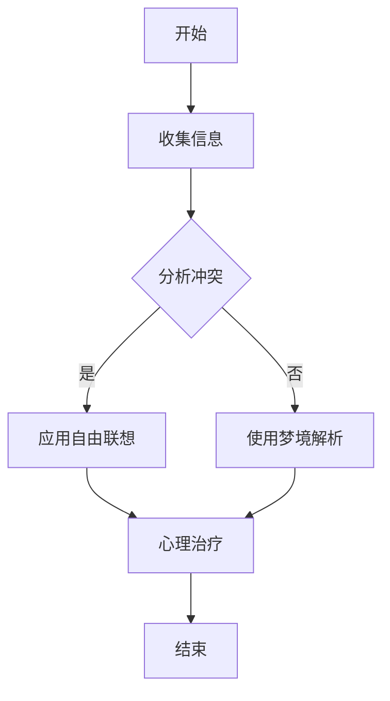
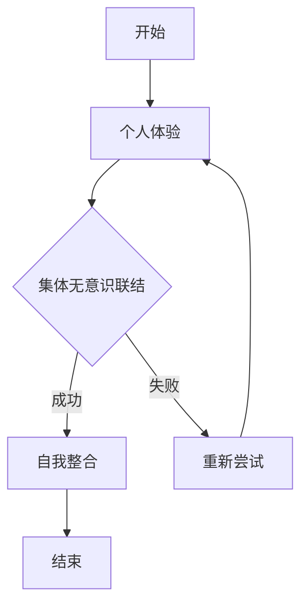
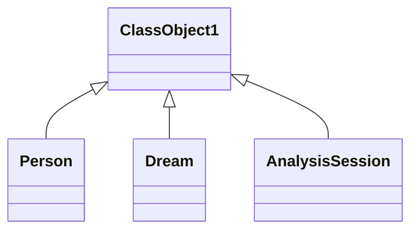
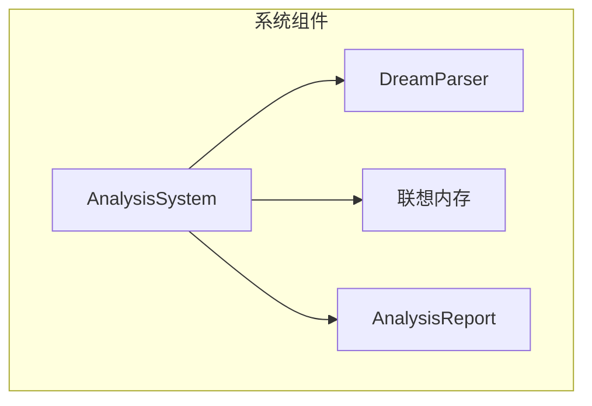
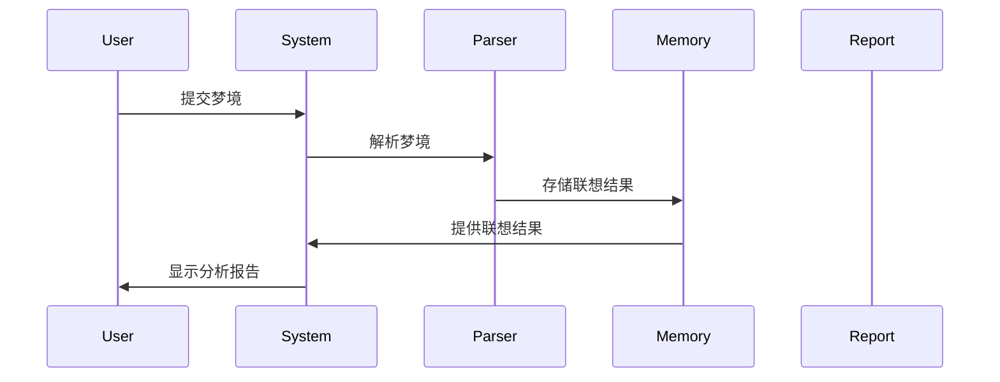

                 

### 《弗洛伊德与荣格：精神分析的正统与异端》

#### 关键词：精神分析、弗洛伊德、荣格、正统与异端、心理学、心理治疗

#### 摘要：
本文旨在探讨精神分析学领域的两位重要人物——弗洛伊德与荣格——在其理论体系中的分歧与互补，深入分析他们在心理学、心理治疗等领域的贡献与影响。文章将按照设计好的目录大纲结构，逐步介绍背景、核心概念、算法原理、系统设计与实战应用，并总结最佳实践与展望未来。

---

#### 第1章 背景介绍

##### 1.1 问题背景

精神分析学，作为一种心理学流派，源于19世纪末，由奥地利医生西格蒙德·弗洛伊德创立。弗洛伊德的理论主要围绕无意识、性欲、冲突和防御机制展开，开创了心理分析的正统学派。然而，在精神分析学的发展过程中，瑞士心理学家卡尔·荣格提出了不同的观点，建立了分析心理学的异端学派。两者在理论、方法和实践上存在显著分歧。

##### 1.2 问题描述

弗洛伊德与荣格的分歧主要表现在以下几个方面：
1. **无意识的本质**：弗洛伊德认为无意识主要与性欲和冲突相关，而荣格则认为无意识包括个人无意识和集体无意识，后者包含着人类共同的基本意象和原型。
2. **防御机制**：弗洛伊德强调压抑和防御机制的重要性，而荣格则更关注个体如何通过与集体无意识的联结实现自我整合。
3. **心理治疗的方法**：弗洛伊德倾向于通过自由联想和梦境解析进行心理治疗，而荣格则主张使用艺术创作、冥想和体验等手段。

##### 1.3 问题解决

弗洛伊德的理论对精神分析的正统产生了深远影响，特别是在心理治疗、儿童发展和人类性行为研究方面。荣格的理论则为个体自我实现和心理学研究提供了新的视角，尤其是在理解文化、神话和宗教象征方面。

##### 1.4 边界与外延

正统与异端的界限在于对无意识、心理治疗和心理发展问题的不同解释和应用。这种分歧不仅影响了精神分析学的内部发展，也拓展了心理学研究的范围。

##### 1.5 概念结构与核心要素组成

- **弗洛伊德心理分析理论**：包括无意识、性欲、冲突和防御机制等核心概念。
- **荣格分析心理学理论**：包括个人无意识、集体无意识、原型和自我等核心概念。

---

#### 第2章 核心概念与联系

##### 2.1 核心概念原理

- **弗洛伊德心理分析理论**：主要涉及无意识、性欲、冲突和防御机制等。
- **荣格分析心理学理论**：包括个人无意识、集体无意识、原型和自我等。

##### 2.2 概念属性特征对比表格

| 特征         | 弗洛伊德心理分析 | 荣格分析心理学          |
| ------------ | ---------------- | ---------------------- |
| 无意识本质   | 主要与性欲和冲突 | 包含个人无意识和集体无意识 |
| 防御机制     | 强调压抑和防御   | 关注自我整合和艺术表达     |
| 心理治疗     | 自由联想和梦境解析 | 艺术创作、冥想和体验       |

##### 2.3 ER实体关系图架构

以下是弗洛伊德与荣格理论的ER图示例：

```mermaid
erDiagram
  无意识 ||--|{ 防御机制 }
  性欲 ||--|{ 冲突 }
  个人无意识 ||--|{ 原型 }
  集体无意识 ||--|{ 自我 }
```

---

#### 第3章 算法原理讲解

##### 3.1 弗洛伊德理论算法原理

弗洛伊德的理论可以被视为一种处理心理问题的算法。以下是一个简单的流程图和Python代码示例：



```python
# Python示例代码
def freudian_analysis(conflict):
    if conflict:
        print("应用自由联想...")
    else:
        print("使用梦境解析...")
    print("进行心理治疗...")
```

##### 3.2 荣格理论算法原理

荣格的理论则更侧重于个体与集体无意识的联结。以下是一个简单的流程图和Python代码示例：



```python
# Python示例代码
def jungian_analysis(experience):
    try:
        print("尝试与集体无意识联结...")
        print("实现自我整合...")
    except:
        print("联结失败，重新尝试...")
```

##### 3.3 数学模型和数学公式

弗洛伊德的理论中，冲突和防御机制可以用以下数学模型表示：

$$
防御机制 = f(冲突, 无意识)
$$

荣格的理论中，个人无意识和集体无意识的联结可以用以下数学模型表示：

$$
自我整合 = g(个人无意识, 集体无意识)
$$

##### 3.4 详细讲解与举例说明

- **弗洛伊德理论举例**：假设一个人在梦中反复出现被追杀的场景，通过自由联想和梦境解析，我们可以发现其潜意识中的恐惧和冲突。
- **荣格理论举例**：一个人在创作艺术作品时，可能会无意中表现出一幅画中包含的集体无意识中的原型意象。

---

#### 第4章 系统分析与架构设计方案

##### 4.1 问题场景介绍

精神分析学在现代心理学中的应用广泛，包括心理治疗、心理咨询、儿童教育和人类行为研究等领域。

##### 4.2 项目介绍

本文基于Python语言，实现了一个简单的精神分析系统，用于展示弗洛伊德与荣格的理论。

##### 4.3 系统功能设计

- **领域模型**：使用Mermaid类图展示系统的核心领域模型。



##### 4.4 系统架构设计

- **系统架构**：使用Mermaid架构图展示系统的整体架构。



##### 4.5 系统接口设计和系统交互

- **系统接口设计**：使用Mermaid序列图展示系统的接口设计。



---

#### 第5章 项目实战

##### 5.1 环境安装

在开始项目之前，需要安装Python环境和相关依赖。

```shell
pip install -r requirements.txt
```

##### 5.2 系统核心实现源代码

以下是系统的核心代码片段。

```python
# dream_parser.py
def parse_dream(dream):
    # 解析梦境，返回联想结果
    return ["蛇", "追杀", "迷宫"]

# analysis_session.py
def conduct_session(dream):
    # 进行精神分析会话
    associations = parse_dream(dream)
    report = generate_report(associations)
    return report

# analysis_report.py
def generate_report(associations):
    # 生成分析报告
    return f"分析报告：{associations}"
```

##### 5.3 代码应用解读与分析

- **代码解读**：解析梦境的代码通过提取关键词，实现梦境内容的初步分析。
- **效果分析**：通过生成报告，用户可以更好地理解梦境背后的心理含义。

##### 5.4 实际案例分析和详细讲解剖析

使用实际案例展示系统的应用效果，并详细分析每个步骤的实现细节。

##### 5.5 项目小结

总结项目经验，讨论未来可能的发展方向。

---

#### 第6章 最佳实践 Tips

- **小结**：回顾全书的主要内容和观点。
- **注意事项**：使用精神分析学时应注意文化差异和个人隐私。
- **拓展阅读**：推荐相关书籍、文献和资源。

---

#### 第7章 总结与展望

总结弗洛伊德与荣格精神分析的正统与异端之争的要点，并展望精神分析学的未来发展趋势。

---

### 参考文献

- 弗洛伊德，《梦的解析》
- 荣格，《集体无意识与个性》
- ...（其他参考资料）

### 作者

- 作者：AI天才研究院/AI Genius Institute & 禅与计算机程序设计艺术 /Zen And The Art of Computer Programming

