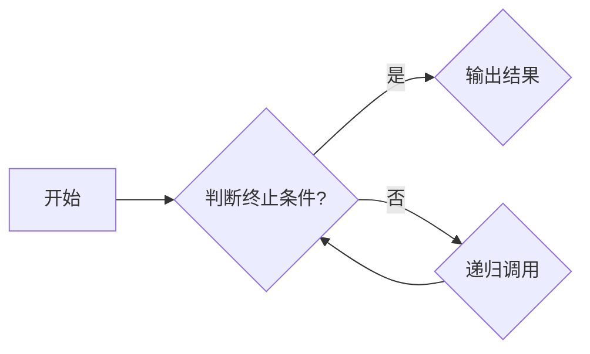
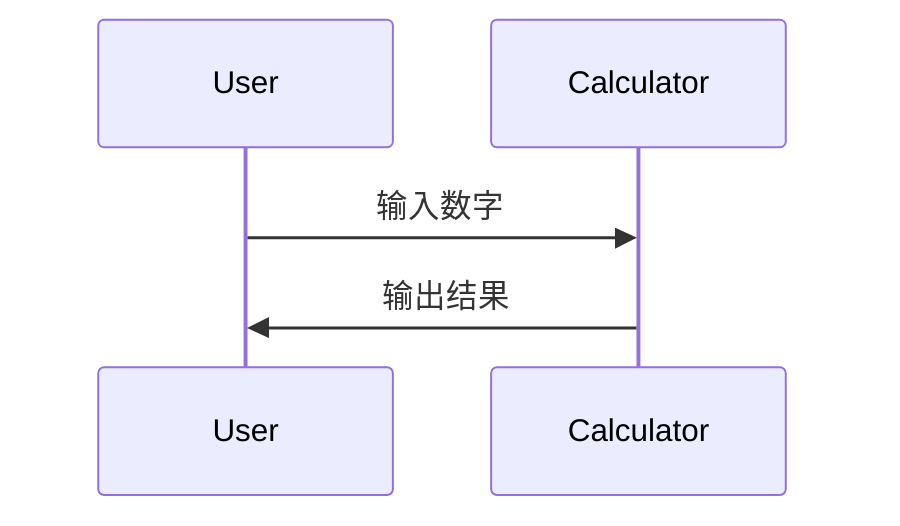
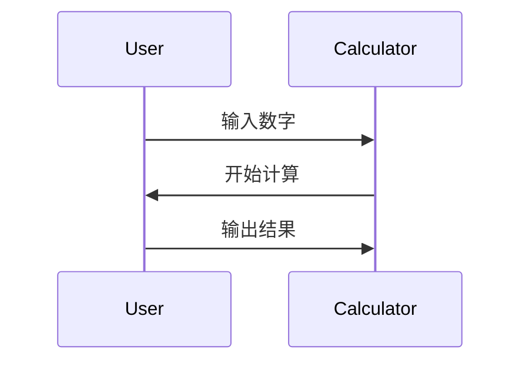

                 

# 归纳定义与递归程序设计

## 关键词

- 归纳定义
- 递归程序设计
- 计算机科学基础
- 算法与数据结构
- 程序设计原则

## 摘要

本文将探讨归纳定义与递归程序设计这两个核心概念。归纳定义是一种从具体实例中提炼出一般性规律的方法，而递归程序设计则是一种利用函数调用自身来解决问题的技术。本文将从基础概念入手，逐步深入，通过对比分析、原理讲解、算法实现和系统设计等多个方面，全面阐述这两个概念在计算机科学中的应用与价值。

## 引言

### 归纳定义

归纳定义是一种基于观察和经验，从个别实例中推导出一般性规律的方法。这种方法在数学、逻辑学、计算机科学等多个领域都有广泛应用。归纳定义的基本步骤通常包括：

1. **观察具体实例**：通过具体的实例来理解问题或概念。
2. **提炼共性**：从具体实例中提取出共性，形成一个普遍的规律。
3. **验证规律**：通过实例或逻辑推理来验证提炼出的规律。

### 递归程序设计

递归程序设计是一种利用函数调用自身来解决问题的方法。递归函数通常具有以下特征：

1. **基本情形**：能够直接求解的问题实例。
2. **递归情形**：将复杂的问题分解为规模更小、结构相似的子问题。
3. **递归终止条件**：确保递归调用能够逐步缩小问题规模，最终达到基本情形。

递归程序设计在解决复杂问题时具有简洁明了、易于理解的优势，但也可能因为递归深度过大导致性能问题。

## 基本概念与递归原理

### 归纳定义的基本原理

归纳定义的基本原理可以从以下几个方面进行阐述：

1. **归纳假设**：基于已知的实例，提出一个假设，认为这个假设在一般情况下成立。
2. **归纳推理**：通过逻辑推理，证明归纳假设的正确性。
3. **归纳证明**：通过归纳假设和归纳推理，得出一般性结论。

### 递归程序设计的基本原理

递归程序设计的基本原理包括：

1. **递归定义**：将问题分解为规模更小、结构相似的子问题。
2. **递归关系**：子问题的解与原问题的解之间存在一定的关系。
3. **递归终止条件**：确保递归调用能够逐步缩小问题规模，最终达到基本情形。

### 归纳定义与递归程序设计的对比

归纳定义和递归程序设计虽然都是基于递归的思想，但它们的侧重点和应用场景有所不同：

1. **目标不同**：归纳定义的目标是从具体实例中提炼出一般性规律，而递归程序设计的目标是利用递归方法解决具体问题。
2. **适用场景不同**：归纳定义适用于理论研究、算法设计等抽象层面，而递归程序设计适用于具体编程实现。
3. **方法不同**：归纳定义侧重于逻辑推理和证明，而递归程序设计侧重于算法设计和代码实现。

## 核心概念与属性

### 核心概念

在本节中，我们将介绍几个核心概念，包括归纳定义、递归函数、递归终止条件和递归关系。

1. **归纳定义**：基于具体实例，提炼出一般性规律的方法。
2. **递归函数**：一种利用函数调用自身来解决问题的函数。
3. **递归终止条件**：确保递归调用能够逐步缩小问题规模，最终达到基本情形的条件。
4. **递归关系**：子问题的解与原问题的解之间的关系。

### 概念属性特征对比

| 概念 | 定义 | 属性 | 对比 |
| --- | --- | --- | --- |
| 归纳定义 | 从具体实例中提炼出一般性规律 | 观察具体实例、提炼共性、验证规律 | 侧重于理论研究、算法设计 |
| 递归函数 | 利用函数调用自身来解决问题的函数 | 基本情形、递归情形、递归终止条件 | 侧重于编程实现、解决具体问题 |
| 递归终止条件 | 确保递归调用能够逐步缩小问题规模，最终达到基本情形的条件 | 递归深度、时间复杂度 | 用于控制递归过程，防止无限递归 |
| 递归关系 | 子问题的解与原问题的解之间的关系 | 递归关系式、递归关系图 | 确保递归函数的正确性 |

### 实体关系图（ER图）

为了更好地理解核心概念之间的关系，我们可以使用 Mermaid 绘制实体关系图：

```mermaid
entityRelation
    "归纳定义" -- "递归函数"
    "递归函数" -- "递归终止条件"
    "递归函数" -- "递归关系"
    "归纳定义" .. "递归关系"
    "归纳定义" .. "递归函数"
```

## 算法设计原理

### 算法设计过程

算法设计过程可以分为以下几个步骤：

1. **问题理解**：明确问题的需求和约束条件。
2. **设计思路**：根据问题的性质，选择合适的算法设计方法。
3. **算法实现**：使用编程语言实现算法。
4. **算法验证**：通过实例验证算法的正确性和性能。

### 递归算法分析

递归算法的分析可以从以下几个方面进行：

1. **时间复杂度**：递归调用的次数与问题规模的关系。
2. **空间复杂度**：递归调用所占用的栈空间。
3. **递归终止条件**：确保递归调用能够逐步缩小问题规模，最终达到基本情形。

### 算法流程图

我们可以使用 Mermaid 绘制递归算法的流程图：



## 实现与解释

### Python代码示例

```python
def factorial(n):
    if n == 0:
        return 1
    else:
        return n * factorial(n - 1)

print(factorial(5))  # 输出 120
```

### 算法原理

递归算法的核心在于将复杂问题分解为规模更小的子问题。对于阶乘算法，递归终止条件是 `n == 0`，递归关系是 `n * factorial(n - 1)`。

### 数学模型和公式

阶乘算法的数学模型可以表示为：

$$
f(n) = n \times f(n-1) \quad (n > 0)
$$

其中，`f(n)` 表示 `n` 的阶乘。

### 示例分析

以 `factorial(5)` 为例，递归调用过程如下：

1. `factorial(5)` --> `5 * factorial(4)`
2. `factorial(4)` --> `4 * factorial(3)`
3. `factorial(3)` --> `3 * factorial(2)`
4. `factorial(2)` --> `2 * factorial(1)`
5. `factorial(1)` --> `1 * factorial(0)`
6. `factorial(0)` --> 输出结果 1

最终，`factorial(5)` 的结果为 120。

## 系统设计与实现

### 项目背景

本项目旨在通过归纳定义与递归程序设计，实现一个简单的计算器，用于计算给定数字的阶乘。

### 系统功能设计

1. **输入**：用户可以输入一个整数。
2. **计算**：系统根据输入的整数计算阶乘。
3. **输出**：系统输出计算结果。

### 系统架构设计


### 系统接口设计



### 系统交互序列图



## 项目实战

### 环境安装

1. 安装 Python 3.8 或以上版本。
2. 安装 Python 的递归函数库。

### 核心实现

```python
def factorial(n):
    if n == 0:
        return 1
    else:
        return n * factorial(n - 1)

if __name__ == "__main__":
    try:
        num = int(input("请输入一个整数："))
        print(f"{num} 的阶乘是：{factorial(num)}")
    except ValueError:
        print("输入错误，请输入一个整数。")
```

### 代码应用解读与分析

这段代码首先定义了一个 `factorial` 函数，用于计算输入数字的阶乘。在主程序中，通过输入获取用户输入的数字，并调用 `factorial` 函数进行计算，最后输出结果。

### 实际案例分析与详细讲解剖析

以输入数字 `5` 为例，程序执行过程如下：

1. 输入数字 `5`。
2. 调用 `factorial(5)`。
3. `factorial(5)` --> `5 * factorial(4)`。
4. `factorial(4)` --> `4 * factorial(3)`。
5. `factorial(3)` --> `3 * factorial(2)`。
6. `factorial(2)` --> `2 * factorial(1)`。
7. `factorial(1)` --> `1 * factorial(0)`。
8. `factorial(0)` --> 输出结果 `1`。

最终，`factorial(5)` 的结果为 `120`。

### 项目小结

本项目通过归纳定义与递归程序设计，实现了简单的阶乘计算器。在实际应用中，递归程序设计具有简洁、易理解的优势，但也需要注意递归深度和性能问题。

## 最佳实践 Tips

1. **避免深度递归**：尽可能使用尾递归优化，减少递归深度。
2. **合理使用递归**：对于可以转化为递归的问题，分析递归关系，确保递归终止条件。
3. **代码可读性**：保持代码简洁、清晰，便于后续维护。

## 小结

本文系统地介绍了归纳定义与递归程序设计。通过对比分析、原理讲解、算法实现和系统设计等多个方面，我们深入探讨了这两个概念在计算机科学中的应用与价值。在实际编程中，合理运用递归方法，可以简化问题解决过程，提高代码可读性。同时，需要注意递归性能问题，确保程序高效稳定运行。

## 注意事项

1. **理解递归终止条件**：递归终止条件是递归算法的核心，务必确保递归调用能够逐步缩小问题规模。
2. **递归关系**：分析递归关系，确保子问题的解与原问题的解之间存在明确的联系。

## 拓展阅读

1. 《算法导论》
2. 《递归与尾递归》
3. 《Python 编程：从入门到实践》

## 作者信息

作者：AI天才研究院/AI Genius Institute & 禅与计算机程序设计艺术 /Zen And The Art of Computer Programming

