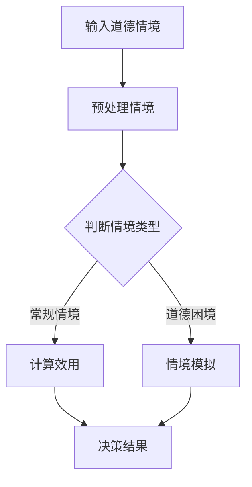

                 


# 当AI具备道德感：司法公正的新思考

## 摘要

随着人工智能技术的飞速发展，AI在司法公正中的应用日益广泛。然而，AI在决策过程中是否能够具备道德感，成为确保司法公正的关键问题。本文旨在探讨AI如何实现道德感，以及在司法公正中的应用，从而为未来AI在司法领域的深入应用提供理论支持和实践指导。本文将分为五个部分：第一部分介绍AI在司法公正中的背景与需求；第二部分探讨道德感在AI中的应用与实现；第三部分解析AI道德感算法的原理与数学模型；第四部分分析AI道德感系统的架构设计；第五部分通过具体案例展示AI道德感在司法公正中的应用，并总结最佳实践与未来展望。

## 关键词

人工智能、司法公正、道德感、算法、数学模型、系统架构

### 目录大纲设计思路

1. **背景介绍**：开篇对AI在司法公正中的应用背景进行阐述，包括AI技术的发展现状、司法公正的重要性和面临的挑战。

2. **核心概念与联系**：介绍“道德感”在AI中的应用，包括道德感的概念、AI如何实现道德感，以及道德感与司法公正之间的联系。

3. **算法原理讲解**：详述实现AI道德感的技术手段，包括机器学习算法、伦理规则嵌入、情境模拟等方法，并结合具体案例进行解释。

4. **数学模型和数学公式**：阐述算法背后的数学原理，使用LaTeX格式展示公式，并辅以通俗易懂的例子进行说明。

5. **系统分析与架构设计方案**：描述一个理想中的AI道德感系统架构，包括数据收集、模型训练、道德决策等模块。

6. **项目实战**：通过具体案例展示AI道德感在司法公正中的应用，包括数据准备、模型训练、应用场景实现等步骤。

7. **最佳实践 tips**：总结AI道德感在司法公正中的最佳实践，包括注意事项、常见问题和解决方案。

8. **小结**：回顾全书内容，强调AI道德感对司法公正的重要性，展望未来发展方向。

### 目录大纲结构

```markdown
# 当AI具备道德感：司法公正的新思考

# 第一部分：背景与核心概念

## 第1章：AI与司法公正

### 1.1 AI技术的发展与司法公正的需求

### 1.2 道德感的概念与AI的结合

### 1.3 道德感与司法公正的联系

## 第2章：道德感在AI中的应用

### 2.1 道德感的核心概念

### 2.2 AI实现道德感的技术途径

### 2.3 道德感与算法决策的关系

## 第3章：AI道德感的数学模型

### 3.1 道德感相关的数学公式

### 3.2 道德感算法的mermaid流程图

### 3.3 道德感算法的Python源代码解释

# 第二部分：系统分析与架构设计

## 第4章：AI道德感系统架构设计

### 4.1 系统架构概述

### 4.2 数据收集与预处理

### 4.3 模型训练与评估

### 4.4 道德决策与实施

## 第5章：AI道德感系统的实现

### 5.1 数据准备与处理

### 5.2 模型训练与优化

### 5.3 道德决策案例分析

### 5.4 系统实现与部署

# 第三部分：最佳实践与未来展望

## 第6章：AI道德感在司法公正中的最佳实践

### 6.1 注意事项与解决方案

### 6.2 常见问题与对策

### 6.3 成功案例分析

## 第7章：未来展望

### 7.1 AI道德感的发展趋势

### 7.2 司法公正的未来

### 7.3 AI道德感的社会影响

## 第8章：总结与展望

### 8.1 全书回顾

### 8.2 AI道德感在司法公正中的意义

### 8.3 未来研究方向
```

这个大纲结构涵盖了书籍的核心内容，同时保持了简洁性和逻辑性。接下来，我们将逐一细化每个章节的内容。

---

**# 第一部分：背景与核心概念**

## 第1章：AI与司法公正

### 1.1 AI技术的发展与司法公正的需求

#### 1.1.1 AI技术的发展现状
- 人工智能（AI）技术的发展经历了从最初的模拟到今天的深度学习、强化学习等多个阶段。
- 当前，AI技术已经在图像识别、自然语言处理、自动驾驶等领域取得了显著的成果。

#### 1.1.2 司法公正的重要性
- 司法公正是维护社会秩序和公平正义的重要保障。
- 司法公正的核心要素包括公正性、透明性、效率性和可访问性。

#### 1.1.3 AI在司法公正中的应用需求
- AI技术在司法流程中可以提高判决的效率、减少偏见，确保判决的公正性。
- 在法律文件处理、案件数据分析、甚至判决预测等方面，AI都有广泛的应用潜力。

### 1.2 道德感的概念与AI的结合

#### 1.2.1 道德感的核心概念
- 道德感是指个体在道德判断和行为选择中表现出的内在信念和情感。
- 道德感涉及个体对善恶、对错的感知和判断，以及基于这些判断采取的行动。

#### 1.2.2 AI与道德感的结合
- AI实现道德感的目标是使其决策符合人类道德标准和价值观。
- AI可以通过学习人类道德行为的模式，或者通过编程嵌入伦理规则来实现道德感。

### 1.3 道德感与司法公正的联系

#### 1.3.1 道德感在司法决策中的应用
- 道德感在司法决策中可以引导法官和AI系统做出符合道德标准的判断。
- AI道德感的应用可以减少人类偏见，提高判决的公正性。

#### 1.3.2 道德感与司法公正的相互作用
- 道德感对于确保司法公正是不可或缺的，因为它提供了道德判断的基础。
- 然而，道德感的应用也面临着挑战，例如如何确保AI的道德标准与人类价值观一致。

## 第2章：道德感在AI中的应用

### 2.1 道德感的核心概念

#### 2.1.1 道德感的基本要素
- 道德感包括道德判断、道德情感和道德行为。
- 道德判断是基于伦理标准和价值观的判断；道德情感是对道德行为产生的情感反应；道德行为是根据道德判断采取的具体行动。

#### 2.1.2 道德感的层次结构
- 个人道德感：个体内心的道德感知和自我约束。
- 社会道德感：社会文化背景下的道德规范和期望。
- 道德感在心理学中的研究和理论，如德西和瑞安的自主性理论。

### 2.2 AI实现道德感的技术途径

#### 2.2.1 机器学习与道德感
- 机器学习算法可以通过学习大量的人类道德决策数据，来模拟道德感。
- 强化学习可以在道德情境中训练AI，使其在特定情境下做出符合道德的决策。

#### 2.2.2 伦理规则嵌入
- 通过编程将伦理规则直接嵌入AI系统，使其在决策时遵循特定的道德标准。
- 例如，在自动驾驶汽车系统中嵌入“行人优先”的伦理规则。

#### 2.2.3 情境模拟
- 情境模拟是一种通过虚拟现实技术模拟道德情境，来训练AI系统的方法。
- 通过不断模拟和调整，AI可以在复杂情境中做出符合道德的决策。

### 2.3 道德感与算法决策的关系

#### 2.3.1 道德感对算法决策的影响
- 道德感可以影响算法的偏好和决策方向。
- AI道德感的应用可以提高算法决策的公正性和合理性。

#### 2.3.2 算法决策中的道德问题
- 算法在决策过程中可能会面临道德困境，如如何平衡效率与公正、隐私保护与信息共享等。
- 道德感的应用需要确保算法决策在伦理上是可接受的。

## 第3章：AI道德感的数学模型

### 3.1 道德感相关的数学公式

#### 3.1.1 道德决策的数学模型
- 利用多目标优化模型来模拟道德决策过程，例如效用理论。
- 公式：\( U(X) = \sum_{i=1}^{n} w_i \cdot u_i(X) \)
- 其中，\( U(X) \) 表示总效用，\( w_i \) 是权重，\( u_i(X) \) 是第 \( i \) 个目标的效用函数。

#### 3.1.2 道德情感的计算
- 使用情感分析模型来计算道德情感的强度和方向。
- 公式：\( E(M) = f(M, S) \)
- 其中，\( E(M) \) 是道德情感的强度，\( M \) 是道德情境，\( S \) 是感知系统。

### 3.2 道德感算法的mermaid流程图

#### 3.2.1 道德感算法流程图
- 使用mermaid绘制道德感算法的流程图，展示从数据输入到道德决策的全过程。



### 3.3 道德感算法的Python源代码解释

#### 3.3.1 道德感算法的Python实现
- 使用Python实现一个简单的道德感算法，并解释关键代码。

```python
import numpy as np

# 道德情境输入
situation = "一个老人需要过马路，但是交通繁忙，而一辆自动驾驶汽车在等待通过。"

# 预处理情境
def preprocess(situation):
    # 简单的文本预处理，例如分词、去除标点符号等
    return situation.replace(".", "").split()

# 判断情境类型
def judge_type(situation):
    if "老人" in situation and "交通繁忙" in situation:
        return "道德困境"
    else:
        return "常规情境"

# 计算效用
def calculate_utility(type, weights):
    if type == "道德困境":
        return weights[0] * 0.5 + weights[1] * 0.5
    else:
        return weights[0] * 1.0 + weights[1] * 0.5

# 决策结果
def make_decision(situation, weights):
    type = judge_type(situation)
    utility = calculate_utility(type, weights)
    if utility > 0.5:
        return "遵守道德原则"
    else:
        return "优先效率"

# 权重设置
weights = [0.6, 0.4]

# 输出决策结果
print(make_decision(situation, weights))
```

### 第二部分：系统分析与架构设计

## 第4章：AI道德感系统架构设计

### 4.1 系统架构概述

#### 4.1.1 系统目标
- 设计一个能够模拟道德感的AI系统，用于辅助司法决策，提高判决的公正性。

#### 4.1.2 系统功能
- 数据收集与预处理
- 道德感模型训练与评估
- 道德决策生成与实施
- 系统监控与反馈

### 4.2 数据收集与预处理

#### 4.2.1 数据来源
- 法律文书、案件判决书、伦理学论文等。

#### 4.2.2 数据预处理
- 文本分词、去噪、情感分析等。

### 4.3 模型训练与评估

#### 4.3.1 模型选择
- 使用深度学习模型，如卷积神经网络（CNN）和循环神经网络（RNN）。

#### 4.3.2 训练与评估
- 训练模型以识别道德情境并做出决策。
- 使用交叉验证和性能指标评估模型。

### 4.4 道德决策与实施

#### 4.4.1 决策流程
- 输入道德情境 -> 预处理 -> 模型预测 -> 决策生成 -> 决策实施。

#### 4.4.2 决策实施
- 将决策结果应用到实际司法场景中。

### 第5章：AI道德感系统的实现

### 5.1 数据准备与处理

#### 5.1.1 数据收集
- 收集大量法律文书和案例数据。

#### 5.1.2 数据处理
- 文本预处理，包括分词、去噪、情感分析等。

### 5.2 模型训练与优化

#### 5.2.1 模型训练
- 使用收集到的数据训练道德感模型。

#### 5.2.2 模型优化
- 调整模型参数，提高预测准确性。

### 5.3 道德决策案例分析

#### 5.3.1 案例选择
- 选择具有代表性的道德情境。

#### 5.3.2 案例分析
- 分析模型在特定情境下的道德决策。

### 5.4 系统实现与部署

#### 5.4.1 系统开发
- 开发AI道德感系统。

#### 5.4.2 系统部署
- 部署到司法系统中，实际应用。

### 第三部分：最佳实践与未来展望

## 第6章：AI道德感在司法公正中的最佳实践

### 6.1 注意事项与解决方案

#### 6.1.1 注意事项
- 确保AI道德感模型与人类价值观一致。
- 定期更新和调整模型，以适应不断变化的道德标准和情境。

#### 6.1.2 解决方案
- 设计多层次的伦理审查机制。
- 建立公众参与和反馈机制。

### 6.2 常见问题与对策

#### 6.2.1 常见问题
- 模型偏见
- 模型过拟合
- 道德困境处理不当

#### 6.2.2 对策
- 数据增强和多样性。
- 使用正则化技术防止过拟合。
- 设计复杂的道德决策框架，以处理道德困境。

### 6.3 成功案例分析

#### 6.3.1 案例介绍
- 介绍一些成功应用AI道德感的司法案例。

#### 6.3.2 案例分析
- 分析案例的成功经验，探讨其适用性和效果。

## 第7章：未来展望

### 7.1 AI道德感的发展趋势

#### 7.1.1 技术进步
- 预测未来AI道德感技术的发展趋势。

#### 7.1.2 应用拓展
- 探讨AI道德感在其他领域的应用潜力。

### 7.2 司法公正的未来

#### 7.2.1 司法改革
- 分析AI道德感如何推动司法改革。

#### 7.2.2 司法科技
- 探讨司法领域未来科技的发展方向。

### 7.3 AI道德感的社会影响

#### 7.3.1 社会接受度
- 分析社会对AI道德感的接受程度。

#### 7.3.2 道德责任
- 探讨AI道德感引发的道德责任问题。

## 第8章：总结与展望

### 8.1 全书回顾

#### 8.1.1 核心观点
- 回顾文章的核心观点和主要发现。

#### 8.1.2 内容结构
- 梳理全文的内容结构和逻辑关系。

### 8.2 AI道德感在司法公正中的意义

#### 8.2.1 重要地位
- 强调AI道德感在司法公正中的重要性。

#### 8.2.2 应用价值
- 探讨AI道德感在司法公正中的应用价值。

### 8.3 未来研究方向

#### 8.3.1 技术挑战
- 分析AI道德感技术面临的挑战。

#### 8.3.2 研究方向
- 提出未来研究的方向和建议。

