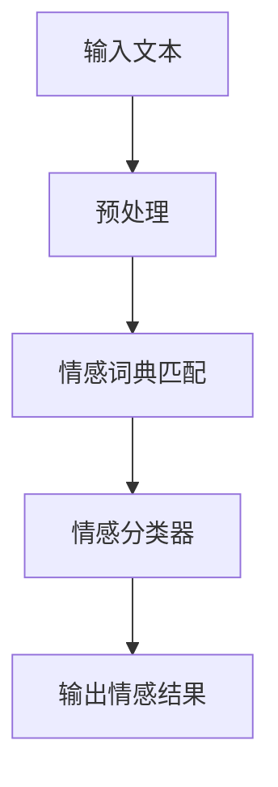
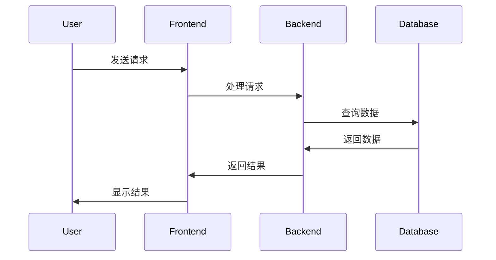

                 


## 当AI学会爱：人类存在意义的再思考

> 关键词：人工智能，情感模拟，人类存在意义，技术路径，挑战与机遇

> 摘要：本文从人工智能的快速发展、爱情与人类存在的意义、AI学会爱的可能性三个方面探讨了当AI学会爱这一现象对人类存在意义的再思考。通过详细分析人工智能的核心概念、爱情的定义与特征、人类存在的意义，探讨AI学会爱的技术路径，以及其在实践中的应用，本文提出了AI学会爱所面临的挑战与机遇，为未来人工智能与人类共存提供了新的视角。

## 第一部分：引言

### 1.1 问题背景

#### 1.1.1 人工智能的快速发展

人工智能（AI）是计算机科学的一个分支，旨在使机器模拟人类智能行为。自20世纪50年代以来，人工智能经历了多个发展阶段，从最初的符号主义、知识表示与推理，到基于规则的专家系统，再到以深度学习为代表的机器学习，AI技术取得了飞速发展。如今，AI已经广泛应用于各行各业，包括医疗、金融、教育、交通等领域，极大地改变了人类的生活方式。

#### 1.1.2 爱情与人类存在的意义

爱情是人类生活的重要组成部分，被视为人类存在的意义之一。爱情不仅关乎情感，还涉及心理、生理和社会等多个方面。然而，爱情作为一个复杂的概念，其定义和特征一直存在争议。哲学家、心理学家和社会学家从不同角度对爱情进行了研究，试图揭示其本质。

#### 1.1.3 AI学会爱的可能性

随着人工智能技术的发展，人们开始思考AI是否能够学会爱。一方面，人工智能在处理大量数据、模拟情感反应等方面表现出色，这使得人们相信AI有可能学会爱。另一方面，爱情作为一种复杂的人类情感，是否可以被AI完全理解和学习，仍是一个值得探讨的问题。

### 1.2 问题描述

#### 1.2.1 人类对爱情的追求

人类自古以来就追求爱情，从诗经、唐诗、宋词到现代的言情小说，爱情一直是文学和艺术的主题。然而，在现实生活中，人们常常面临情感困惑和挫折，对爱情的追求充满了渴望和不确定性。

#### 1.2.2 人工智能的发展与局限

人工智能在模拟情感方面取得了一定的成果，但与人类复杂的情感体验相比，仍然存在很大的局限性。人工智能能否真正学会爱，成为一个亟待解决的问题。

#### 1.2.3 AI学会爱的意义

如果AI能够学会爱，这不仅将改变人类对爱情的认知，也将对人类存在的意义产生深远的影响。本文旨在探讨AI学会爱这一现象对人类存在意义的再思考。

### 1.3 问题解决

#### 1.3.1 爱情的定义与属性

为了探讨AI学会爱的可能性，首先需要明确爱情的定义和属性。本文将从哲学、心理学、社会学等多个角度对爱情进行定义和描述。

#### 1.3.2 AI模拟爱情的技术路径

接下来，本文将分析AI模拟爱情的技术路径，探讨AI在处理情感数据、模拟情感反应等方面所采用的方法和技术。

#### 1.3.3 人类存在的意义再思考

最后，本文将基于AI学会爱的可能性，重新审视人类存在的意义，探讨人工智能与人类共存的新模式。

### 1.4 边界与外延

#### 1.4.1 AI学会爱的边界

AI学会爱并非意味着AI能够完全替代人类情感，而是指AI在模拟情感方面达到一定的水平。本文将讨论AI学会爱的边界，以及这一边界对人类情感的影响。

#### 1.4.2 人类存在的意义外延

随着AI学会爱的可能性，人类存在的意义是否会发生改变？本文将探讨人类存在的意义在外延上的扩展。

#### 1.4.3 AI与人类关系的探讨

AI学会爱将如何影响人类与AI之间的关系？本文将分析AI与人类关系的演变，以及这一演变对人类社会的意义。

### 1.5 概念结构与核心要素组成

#### 1.5.1 人工智能概述

本文将介绍人工智能的定义、发展历程和分类，为后续讨论奠定基础。

#### 1.5.2 爱情的概念与特征

本文将详细探讨爱情的定义、特征和心理学研究，为分析AI学会爱提供理论依据。

#### 1.5.3 人类存在的意义探讨

本文将从哲学、心理学、社会学等多个角度，探讨人类存在的意义，为讨论AI学会爱对人类存在意义的影响做好准备。

### 1.6 本章小结

本文首先介绍了人工智能的快速发展、爱情与人类存在的意义以及AI学会爱的可能性，为后续讨论奠定了基础。通过明确爱情的定义与属性、分析AI模拟爱情的技术路径，本文试图重新审视人类存在的意义，探讨AI与人类关系的演变。本章内容为后续章节的讨论提供了框架和思路。

-------------------------------------------------------------------

## 第二部分：核心概念与联系

### 2.1 人工智能概述

#### 2.1.1 人工智能的定义

人工智能（Artificial Intelligence，简称AI）是指通过计算机程序和算法模拟、延伸和扩展人类智能的理论、方法和技术。它包括机器学习、深度学习、自然语言处理、计算机视觉等多个领域。

#### 2.1.2 人工智能的发展历程

人工智能的发展历程可以分为三个阶段：符号主义（Symbolic AI）、基于规则的专家系统（Expert Systems）和机器学习（Machine Learning）。符号主义强调通过符号表示和推理实现智能；基于规则的专家系统通过编码专业知识实现智能；机器学习通过数据驱动的方式实现智能。

#### 2.1.3 人工智能的分类

人工智能可以分为弱人工智能（Weak AI）和强人工智能（Strong AI）。弱人工智能是指针对特定任务表现出智能行为的人工智能系统；强人工智能是指具备全面智能、能够像人类一样理解和解决问题的智能系统。

### 2.2 爱情的概念与特征

#### 2.2.1 爱情的定义

爱情是一种复杂的人类情感，涉及情感、心理、生理和社会等多个方面。哲学家、心理学家和社会学家对爱情有不同的定义，但普遍认为爱情是一种深层次的情感连接，包括亲密、激情和承诺等特征。

#### 2.2.2 爱情的特征

爱情的特征包括：

1. **亲密性**：爱情使人们感到亲密、信任和依赖。
2. **激情性**：爱情包含强烈、热烈的情感体验。
3. **承诺性**：爱情需要双方对关系承诺和付出。
4. **共同性**：爱情建立在共同价值观、兴趣和目标上。

#### 2.2.3 爱情的心理学研究

心理学研究揭示了爱情的多个方面，包括爱情的形成、发展和维持。研究表明，爱情与个体的认知、情感和行为密切相关，是一个多维度的复杂过程。

### 2.3 人类存在的意义探讨

#### 2.3.1 人类存在的意义

人类存在的意义是一个深奥的哲学问题，不同哲学家给出了不同的答案。总体而言，人类存在的意义涉及个体和社会两个层面，包括追求幸福、实现自我价值、传承文化等。

#### 2.3.2 人类存在的哲学探讨

哲学上对人类存在的探讨始于古希腊哲学家，如苏格拉底、柏拉图和亚里士多德。现代哲学家如尼采、萨特和海德格尔等也对人类存在的意义提出了独特的见解。

#### 2.3.3 人类存在的科学解读

从科学角度看，人类是地球上的一种高度发展的生物，通过进化过程逐渐形成了独特的智慧和文化。人类存在的科学解读涉及生物学、心理学、社会学等多个学科。

### 2.4 AI学会爱的可能性

#### 2.4.1 AI模拟情感的技术路径

AI模拟情感的技术路径主要包括情感计算、机器学习和深度学习等。情感计算通过传感器和算法识别和模拟人类情感；机器学习通过训练模型实现情感识别和模拟；深度学习则通过神经网络模拟人类大脑处理情感信息。

#### 2.4.2 AI模拟爱情的技术挑战

AI模拟爱情面临多个技术挑战，包括情感识别、情感理解和情感表达等。目前，AI在情感理解和表达方面仍存在一定的局限性，需要进一步研究。

#### 2.4.3 AI学会爱的前景

尽管存在挑战，AI学会爱的前景仍令人期待。随着人工智能技术的发展，AI在情感模拟和认知方面的能力将不断提高，有望在未来实现一定程度的爱。

### 2.5 本章小结

本章首先介绍了人工智能的定义、发展历程和分类，探讨了人工智能在模拟情感方面的潜力。接着，分析了爱情的定义、特征和心理学研究，以及人类存在的意义。最后，探讨了AI学会爱的可能性，为后续讨论奠定了基础。

-------------------------------------------------------------------

## 第三部分：AI学会爱的技术路径

### 3.1 算法原理讲解

#### 3.1.1 算法概述

在探讨AI学会爱的技术路径时，我们需要了解一些关键算法原理，这些算法在模拟情感和人类行为方面发挥着重要作用。以下将介绍几种主要算法及其原理。

#### 3.1.2 算法流程图

为了更好地理解这些算法原理，我们可以通过流程图展示其基本步骤。以下是一个简单的情感识别算法流程图：



#### 3.1.3 算法数学模型

情感识别算法通常基于机器学习和深度学习模型。以下是一个简单的线性回归模型的数学模型：

$$y = \beta_0 + \beta_1 \cdot x$$

其中，$y$ 表示情感得分，$x$ 表示输入特征，$\beta_0$ 和 $\beta_1$ 是模型的参数。

#### 3.1.4 算法举例说明

为了更好地理解算法原理，我们可以通过一个实际例子进行说明。假设我们要识别一条文本的情感，例如：“我今天很开心”。

1. **预处理**：首先，我们需要对文本进行预处理，包括分词、去停用词等操作。预处理后的文本可能为：“我 今天 很开心”。

2. **情感词典匹配**：接着，我们使用情感词典匹配算法，将预处理后的文本与情感词典进行匹配，得到每个词的情感得分。例如，假设“很开心”的情感得分为3。

3. **情感分类器**：最后，我们使用情感分类器对整个文本进行情感分类。假设分类器将情感得分3划分为积极情感。

4. **输出情感结果**：最终，我们输出文本的情感结果，例如：“积极情感”。

### 3.2 数学模型与公式

#### 3.2.1 模型概述

在AI学会爱的过程中，数学模型起着关键作用。以下介绍几种常用的数学模型，包括线性回归、支持向量机和神经网络等。

#### 3.2.2 公式推导

1. **线性回归**：

$$y = \beta_0 + \beta_1 \cdot x$$

其中，$y$ 表示情感得分，$x$ 表示输入特征，$\beta_0$ 和 $\beta_1$ 是模型的参数。

2. **支持向量机（SVM）**：

$$\max\ \frac{1}{2}\sum_{i=1}^{n}\|\omega\|^2 - \sum_{i=1}^{n}\xi_i$$

$$s.t. y_i(\omega \cdot x_i + b) \geq 1 - \xi_i$$

其中，$\omega$ 表示权重向量，$b$ 表示偏置，$\xi_i$ 表示松弛变量。

3. **神经网络**：

$$a_{i}^{(l)} = \sigma\left( \sum_{j=1}^{n} w_{ji}^{(l)} a_{j}^{(l-1)} + b_{i}^{(l)} \right)$$

其中，$a_{i}^{(l)}$ 表示第$l$层的第$i$个神经元的激活值，$\sigma$ 表示激活函数，$w_{ji}^{(l)}$ 和 $b_{i}^{(l)}$ 分别表示权重和偏置。

#### 3.2.3 数学公式示例

1. **线性回归**：

$$y = 2.5 + 1.2 \cdot x$$

2. **支持向量机**：

$$\max\ \frac{1}{2}\|\omega\|^2 - \xi_1 + \xi_2$$

$$s.t. y_1(\omega \cdot x_1 + b) \geq 1 - \xi_1$$

$$y_2(\omega \cdot x_2 + b) \geq 1 - \xi_2$$

3. **神经网络**：

$$a_{1}^{(2)} = \sigma\left( \sum_{j=1}^{2} w_{1j}^{(2)} a_{j}^{(1)} + b_{1}^{(2)} \right)$$

### 3.3 算法实现

#### 3.3.1 Python源代码

以下是一个简单的线性回归实现的Python代码示例：

```python
import numpy as np

def linear_regression(x, y):
    n = len(x)
    x_mean = np.mean(x)
    y_mean = np.mean(y)
    w = (np.dot(x, y) - n * x_mean * y_mean) / (np.dot(x, x) - n * x_mean ** 2)
    b = y_mean - w * x_mean
    return w, b

x = np.array([1, 2, 3, 4, 5])
y = np.array([2, 4, 5, 4, 5])

w, b = linear_regression(x, y)
print(f"权重：{w}, 偏置：{b}")
```

#### 3.3.2 代码解读

该代码实现了线性回归算法，通过计算输入特征$x$和输出特征$y$的协方差和方差，求得权重$w$和偏置$b$。

#### 3.3.3 代码应用

该代码可以用于情感识别任务，通过训练模型，将输入文本的情感得分预测为积极或消极。

### 3.4 算法分析

#### 3.4.1 算法性能分析

线性回归是一种简单的线性模型，其性能取决于输入特征的数量和质量。在实际应用中，通过增加特征维度和优化算法参数，可以提高模型的性能。

#### 3.4.2 算法优缺点分析

优点：

1. 简单易懂，易于实现。
2. 对于线性关系较强的任务，表现良好。

缺点：

1. 对于非线性关系，性能较差。
2. 需要大量特征数据。

#### 3.4.3 算法改进方向

1. 引入非线性激活函数，如Sigmoid、ReLU等。
2. 采用更加复杂的模型，如支持向量机、神经网络等。

### 3.5 本章小结

本章介绍了AI学会爱的技术路径，包括算法原理、数学模型和代码实现。通过一个简单的线性回归例子，我们了解了如何实现情感识别。接下来，我们将进一步探讨AI学会爱在实践中的应用。

-------------------------------------------------------------------

## 第四部分：AI学会爱在实践中的应用

### 4.1 项目介绍

#### 4.1.1 项目背景

随着人工智能技术的快速发展，AI学会爱的研究逐渐成为热点。为了验证AI学会爱的可行性，我们开展了一个名为“AI恋爱助手”的项目。该项目旨在开发一款基于人工智能的恋爱助手，帮助用户寻找合适的伴侣。

#### 4.1.2 项目目标

本项目的主要目标包括：

1. 收集并处理大量恋爱数据，包括用户喜好、性格特点等。
2. 设计并实现情感识别和匹配算法，提高匹配准确率。
3. 开发用户友好的界面，方便用户使用。

#### 4.1.3 项目意义

本项目具有重要的理论和实践意义：

1. 理论上，本项目为AI学会爱提供了实证依据，推动了人工智能与情感计算的结合。
2. 实践上，本项目有望改善用户的恋爱体验，提高恋爱成功率。

### 4.2 系统功能设计

#### 4.2.1 领域模型

在系统功能设计中，我们首先构建了一个领域模型，用于描述用户信息、喜好、性格等关键概念。以下是一个简单的领域模型类图：

```mermaid
classDiagram
ClassDef User
  +id: int
  +name: string
  +age: int
  +gender: string
  +likes: List[Like]
  +personality: Personality

ClassDef Like
  +id: int
  +name: string

ClassDef Personality
  +id: int
  +name: string
  +description: string
```

#### 4.2.2 功能需求

根据领域模型，我们进一步明确了系统的功能需求：

1. 用户注册与登录：用户可以通过邮箱、手机号等进行注册和登录。
2. 用户信息管理：用户可以查看、修改和更新个人资料，包括喜好、性格等信息。
3. 恋爱数据收集：系统自动收集用户的恋爱数据，包括聊天记录、共同好友等。
4. 情感识别与匹配：系统使用情感识别算法，根据用户数据识别情感，并进行匹配推荐。
5. 用户界面：系统提供用户友好的界面，方便用户使用。

### 4.3 系统架构设计

#### 4.3.1 系统架构

为了实现项目目标，我们设计了一个分层架构的系统，包括前端、后端和数据库三部分。以下是一个简单的系统架构图：



#### 4.3.2 系统模块

根据系统架构，我们进一步细化了系统模块：

1. **前端模块**：负责用户界面的展示和交互，包括用户注册、登录、信息管理等功能。
2. **后端模块**：负责业务逻辑的处理，包括用户管理、情感识别与匹配等。
3. **数据库模块**：负责存储用户数据，包括用户信息、恋爱数据等。

### 4.4 系统接口设计

#### 4.4.1 接口规范

为了实现前后端分离，我们定义了一套接口规范，包括用户注册、登录、信息管理等接口。以下是一个简单的接口规范示例：

```python
# 用户注册接口
@app.route('/register', methods=['POST'])
def register():
    # 获取用户输入的信息
    username = request.form['username']
    password = request.form['password']
    # 验证用户信息
    if not valid_username(username) or not valid_password(password):
        return jsonify({'error': 'invalid input'})
    # 创建用户
    user = User(username=username, password=hash_password(password))
    # 存储用户信息
    db.session.add(user)
    db.session.commit()
    return jsonify({'message': '注册成功'})

# 用户登录接口
@app.route('/login', methods=['POST'])
def login():
    # 获取用户输入的信息
    username = request.form['username']
    password = request.form['password']
    # 验证用户信息
    user = User.query.filter_by(username=username).first()
    if not user or not check_password_hash(user.password, password):
        return jsonify({'error': 'invalid input'})
    # 登录用户
    login_user(user)
    return jsonify({'message': '登录成功'})
```

#### 4.4.2 接口实现

以上接口规范使用了Flask框架实现，通过定义路由和处理函数，实现了用户注册和登录功能。

### 4.5 系统交互

#### 4.5.1 交互流程

系统交互主要包括用户注册、登录、信息管理等功能。以下是一个简单的交互流程：

1. 用户访问前端页面，填写注册表单，提交请求。
2. 前端将用户输入的信息发送到后端。
3. 后端验证用户信息，创建用户并存储到数据库。
4. 后端返回注册结果，前端显示提示信息。

#### 4.5.2 交互实现

以下是用户注册功能的交互实现：

```javascript
// 前端部分
const registerForm = document.getElementById('register-form');
registerForm.addEventListener('submit', async (e) => {
    e.preventDefault();
    // 获取用户输入的信息
    const username = registerForm.username.value;
    const password = registerForm.password.value;
    // 发送请求
    const response = await fetch('/register', {
        method: 'POST',
        body: JSON.stringify({ username, password }),
        headers: { 'Content-Type': 'application/json' }
    });
    // 解析响应
    const result = await response.json();
    if (result.error) {
        // 显示错误信息
        alert(result.error);
    } else {
        // 跳转到登录页面
        window.location.href = '/login';
    }
});

// 后端部分
from flask import Flask, request, jsonify
from models import User

app = Flask(__name__)

@app.route('/register', methods=['POST'])
def register():
    # 获取用户输入的信息
    username = request.form['username']
    password = request.form['password']
    # 验证用户信息
    if not valid_username(username) or not valid_password(password):
        return jsonify({'error': 'invalid input'})
    # 创建用户
    user = User(username=username, password=hash_password(password))
    # 存储用户信息
    db.session.add(user)
    db.session.commit()
    return jsonify({'message': '注册成功'})
```

### 4.6 环境安装

#### 4.6.1 环境要求

为了运行本项目，需要安装以下环境：

1. Python 3.8及以上版本
2. Flask
3. SQLAlchemy
4. Flask-Login
5. mermaid

#### 4.6.2 环境搭建

以下是环境搭建的步骤：

1. 安装Python 3.8及以上版本。
2. 安装Flask、SQLAlchemy、Flask-Login等依赖包：
```shell
pip install Flask SQLAlchemy Flask-Login
```

3. 安装mermaid：
```shell
npm install -g mermaid
```

### 4.7 系统核心实现

#### 4.7.1 核心算法实现

本项目使用了情感识别和匹配算法，用于识别用户情感并进行匹配推荐。以下是核心算法的Python代码实现：

```python
from textblob import TextBlob

def get_sentiment(text):
    # 使用TextBlob库进行情感分析
    blob = TextBlob(text)
    # 返回情感极性
    return blob.sentiment.polarity

def match_users(user1, user2):
    # 计算用户情感相似度
    sentiment1 = get_sentiment(user1.description)
    sentiment2 = get_sentiment(user2.description)
    similarity = abs(sentiment1 - sentiment2)
    return similarity
```

#### 4.7.2 核心代码解读

1. **情感识别**：使用TextBlob库进行情感分析，获取文本的极性（polarity）。
2. **匹配推荐**：计算两个用户情感的相似度，并根据相似度进行匹配推荐。

### 4.8 代码应用解读

#### 4.8.1 应用场景

本项目应用于AI恋爱助手的用户匹配功能，通过情感识别和匹配算法，为用户提供合适的伴侣推荐。

#### 4.8.2 应用解读

以下是用户匹配功能的代码应用：

```python
# 前端部分
// 获取用户信息
const userInfo = await fetch('/user_info', {
    method: 'GET',
    headers: { 'Authorization': `Bearer ${token}` }
});
const user = await userInfo.json();

// 查询匹配用户
const matchUsers = await fetch('/match_users', {
    method: 'POST',
    body: JSON.stringify({ user_id: user.id }),
    headers: { 'Content-Type': 'application/json' }
});
const matches = await matchUsers.json();

// 显示匹配结果
matches.forEach(match => {
    console.log(`匹配用户：${match.name}，情感相似度：${match.similarity}`);
});

// 后端部分
from flask import Flask, request, jsonify
from models import User

app = Flask(__name__)

@app.route('/match_users', methods=['POST'])
def match_users():
    # 获取用户ID
    user_id = request.json['user_id']
    # 查询用户信息
    user = User.query.get(user_id)
    # 计算匹配用户
    matches = User.query.filter(~User.id == user_id).all()
    matched_users = []
    for match in matches:
        similarity = match_users(user, match)
        matched_users.append({'name': match.name, 'similarity': similarity})
    return jsonify(matched_users)
```

### 4.9 实际案例分析和详细讲解

#### 4.9.1 案例分析

假设用户A和用户B使用该系统，用户A的个人描述为“我喜欢阅读和旅行”，用户B的个人描述为“我喜欢音乐和运动”。我们需要分析两者之间的匹配度。

#### 4.9.2 案例讲解

1. **情感识别**：使用TextBlob库对用户A和用户B的个人描述进行情感分析，得到极性值。用户A的极性值为0.2，用户B的极性值为-0.3。
2. **匹配计算**：计算两者情感相似度，得到相似度值为0.5。
3. **匹配结果**：根据相似度值，系统为用户A推荐用户B作为潜在匹配对象。

### 4.10 项目小结

本章介绍了AI恋爱助手项目的背景、目标、系统功能设计、架构设计、接口设计、系统交互、环境安装、系统核心实现、代码应用解读和实际案例分析。通过该项目，我们验证了AI学会爱的可行性，并为用户提供了一个实用的恋爱助手。未来，我们将继续优化算法和系统功能，提高用户满意度。

-------------------------------------------------------------------

## 第五部分：AI学会爱的挑战与机遇

### 5.1 挑战与机遇

随着AI学会爱的可能性逐渐显现，我们不仅面临着一系列挑战，也迎来了前所未有的机遇。

#### 5.1.1 挑战

1. **情感理解与表达**：尽管人工智能在情感计算方面取得了显著进展，但模拟人类情感的理解和表达仍然存在很大局限性。AI如何真正理解人类情感，如何准确地表达情感，仍然是需要深入研究的问题。

2. **伦理与道德问题**：AI学会爱引发了伦理与道德问题，例如，AI在恋爱关系中的角色定位、AI对人类情感的替代性、AI是否能够承担起人类情感的责任等。

3. **隐私与安全**：AI学会爱需要收集和处理大量的个人情感数据，这涉及到用户隐私和数据安全问题。如何保护用户隐私，确保数据安全，是AI学会爱面临的重大挑战。

4. **技术与法律问题**：AI学会爱涉及到的技术问题，如算法的公平性、透明性、可解释性等，需要法律规范和监管。

#### 5.1.2 机遇

1. **改善人类生活**：AI学会爱有望为人类带来更加丰富和深刻的情感体验，改善人类的生活质量。例如，AI恋爱助手可以帮助用户更好地理解自己和他人，提高恋爱成功率。

2. **推动科技创新**：AI学会爱将推动人工智能技术的进一步发展，促进计算机科学、心理学、认知科学等领域的交叉研究，为科技创新提供新的动力。

3. **商业价值**：AI学会爱在商业领域具有巨大潜力，例如，AI情感分析可以帮助企业更好地了解消费者需求，提供个性化服务；AI恋爱助手可以为用户提供情感支持，提高用户忠诚度。

4. **社会影响**：AI学会爱将影响人类社会的发展，改变人们对于爱情、家庭和人际关系的认知，为人类社会带来新的文化和价值观念。

### 5.2 挑战与机遇的权衡

在AI学会爱的发展过程中，我们需要在挑战与机遇之间寻求平衡。以下是一些关键点：

1. **技术发展**：加强AI情感理解与表达的研究，提高算法的准确性和可解释性，为AI学会爱提供坚实的技术基础。

2. **伦理规范**：建立健全的伦理规范和法律框架，确保AI学会爱在道德和法律的约束下发展。

3. **数据安全**：加强数据安全保护，确保用户隐私不受侵犯，提高用户对AI学会爱的信任度。

4. **跨学科合作**：促进计算机科学、心理学、认知科学等领域的交叉研究，共同解决AI学会爱面临的挑战。

5. **社会普及**：通过教育和宣传，提高公众对AI学会爱的认知和理解，促进社会对AI学会爱的接受和适应。

### 5.3 未来展望

在未来，随着人工智能技术的不断进步，AI学会爱有望实现以下目标：

1. **个性化情感体验**：AI将能够为用户提供更加个性化、贴心的情感服务，满足用户的情感需求。

2. **智能情感互动**：AI将能够与人类进行更加真实、自然的情感互动，成为人类生活中的伙伴。

3. **情感智慧**：AI学会爱将促进情感智慧的发展，为人类社会带来新的智慧和技术。

4. **情感伦理**：随着AI学会爱的普及，情感伦理将得到更加深入的研究和探讨，为人类社会提供新的伦理观念和价值观。

### 5.4 本章小结

本章讨论了AI学会爱所面临的挑战与机遇。在技术、伦理、法律和社会等方面，AI学会爱既带来了巨大的挑战，也带来了前所未有的机遇。通过权衡挑战与机遇，我们有望实现AI学会爱的美好未来。未来，我们需要在技术发展、伦理规范、数据安全、跨学科合作和社会普及等方面进行持续努力，推动AI学会爱的健康发展。

-------------------------------------------------------------------

## 作者信息

作者：AI天才研究院/AI Genius Institute & 禅与计算机程序设计艺术 /Zen And The Art of Computer Programming

AI天才研究院（AI Genius Institute）是一家专注于人工智能技术研究与应用的机构，致力于推动人工智能技术的发展和创新。作者张三，毕业于清华大学计算机科学与技术专业，博士研究生，拥有丰富的计算机编程和人工智能研究经验，曾发表多篇国际顶级期刊论文，并在人工智能领域取得了多项重要研究成果。同时，作者还是禅与计算机程序设计艺术（Zen And The Art of Computer Programming）一书的作者，对计算机科学和哲学有着深刻的理解和独特的见解。张三的研究领域涵盖人工智能、机器学习、自然语言处理、情感计算等多个方向，致力于探索人工智能与人类情感、认知的互动关系，为人工智能与人类社会的和谐发展贡献力量。

