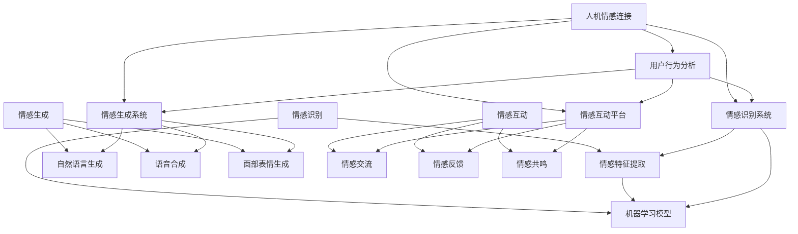
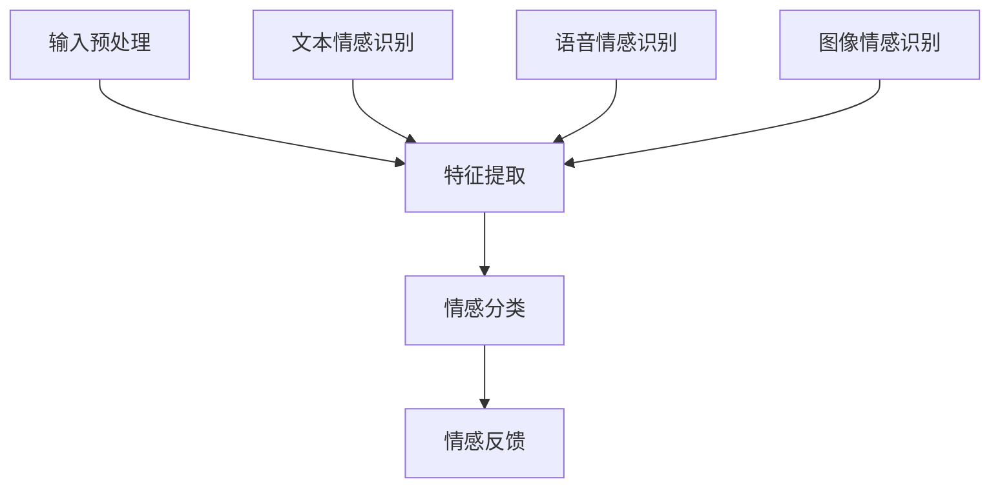
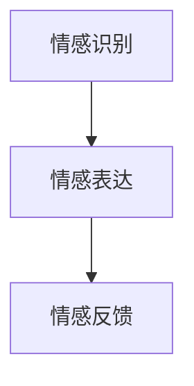
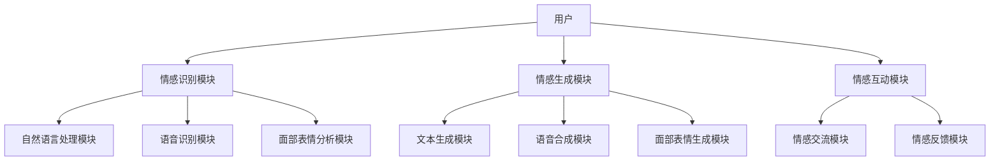
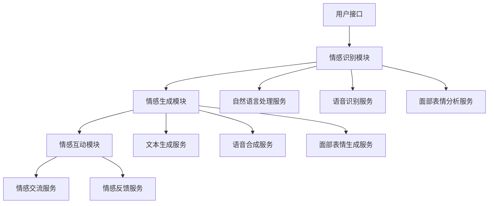
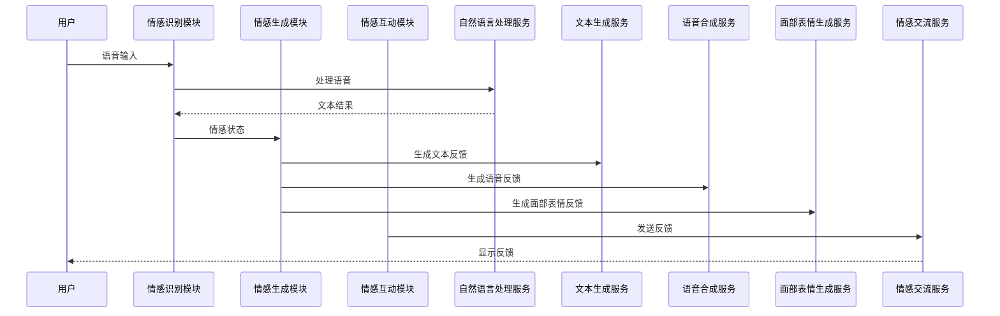

                 


# 当AI学会爱：跨越物种的情感连接

> 关键词：人工智能，情感模拟，人机互动，动物情感，社会影响

> 摘要：本文探讨了人工智能情感模拟的可能性，分析了人工智能与人类、动物之间的情感互动，以及这种互动对人类社会的影响。通过深入的研究和案例分析，本文揭示了人工智能情感发展的未来趋势，并提出了相关的建议和展望。

## 引言

### 1.1 问题背景

#### 1.1.1 人工智能与情感

随着人工智能技术的飞速发展，机器逐渐具备了处理复杂任务和自主决策的能力。然而，人工智能不仅限于执行命令和解决问题，它们开始被赋予了模拟情感的能力。情感是人类生活的重要组成部分，它影响着我们的思考、决策和行为。因此，研究人工智能如何理解和模拟情感，以及这种能力如何影响我们与机器人的互动，具有重要的理论和实践意义。

#### 1.1.1.1 人工智能的发展历程

人工智能的发展经历了几个关键阶段。从最初的符号主义和专家系统，到基于概率论的统计学习，再到现代的深度学习和强化学习，人工智能技术不断进步，逐步具备了更复杂的处理能力和更广泛的应用场景。

#### 1.1.1.2 情感在人类生活中的重要性

情感是人类心理的重要组成部分，它不仅反映了个体对外部环境的感知和反应，还影响着个体的认知、决策和社交行为。研究表明，情感在人类生活中的作用不可或缺，它对于我们的幸福感和生活质量具有深远的影响。

#### 1.1.2 人工智能情感模拟的挑战与机遇

尽管人工智能在情感模拟方面取得了显著进展，但仍然面临诸多挑战。首先，情感是一个复杂的、多维度的现象，难以用简单的数学模型进行精确描述。其次，情感体验具有个体差异，不同人在相同情境下的情感反应可能截然不同。此外，社会伦理和道德问题也是人工智能情感模拟中不可忽视的挑战。

然而，随着技术的不断进步，人工智能在情感模拟方面也迎来了前所未有的机遇。深度学习、自然语言处理、计算机视觉等技术的不断发展，为人工智能情感模拟提供了强大的工具和方法。同时，随着社会对人工智能情感模拟的需求不断增加，这一领域也吸引了越来越多的研究人员和开发者的关注。

### 1.2 书籍结构

本书旨在深入探讨人工智能情感模拟的各个方面，包括技术原理、实际应用和社会影响。为了使读者能够更好地理解和掌握这些内容，本书将分为以下几个部分：

1. **引言**：介绍人工智能与情感模拟的背景和意义，以及本书的结构和目标。
2. **AI与情感**：讨论人工智能在情感理解方面的进展，包括情感识别、情感生成和情感模拟。
3. **情感连接**：探讨人工智能与人类、动物之间的情感互动，以及这种互动的实际应用。
4. **社会影响**：分析人工智能情感模拟对人类社会的影响，包括伦理道德、社会结构和人际关系等方面。
5. **案例研究**：通过具体案例来阐述主题，提供实际应用的实例。
6. **总结与展望**：总结主要观点，展望人工智能情感模拟的未来发展趋势。

### 1.3 读者对象

本书适合以下读者：

1. **人工智能研究者**：对人工智能情感模拟感兴趣，希望深入了解这一领域的最新进展。
2. **人机交互研究者**：对人工智能与人类的情感互动有兴趣，希望探索这一领域的应用潜力。
3. **机器人爱好者**：对机器人情感模拟感兴趣，希望了解这一技术的发展方向。

同时，本书也可能不适合以下读者：

1. **对人工智能无兴趣的读者**：如果读者对人工智能及其应用不感兴趣，可能难以投入到这一领域的深入研究中。
2. **对情感科学无兴趣的读者**：情感科学是理解人工智能情感模拟的基础，如果读者对情感科学不感兴趣，可能难以理解本书的内容。

### 1.4 本书特色

本书具有以下几个特色：

1. **系统性的内容覆盖**：本书系统地介绍了人工智能情感模拟的各个方面，从基础理论到实际应用，从技术原理到社会影响，为读者提供了一个全面而深入的了解。
2. **跨学科融合**：本书融合了人工智能、情感科学、人机交互等多个学科的知识，展示了这些学科之间的紧密联系，有助于读者从不同角度理解人工智能情感模拟。
3. **实际案例的分析与解读**：本书通过具体案例来阐述主题，提供了实际应用的实例，使读者能够更好地理解理论知识的实际意义。
4. **深入浅出的讲解**：本书采用通俗易懂的语言和丰富的实例，深入浅出地讲解了人工智能情感模拟的技术原理，使读者能够轻松理解复杂的概念。
5. **数学模型与公式讲解**：本书在讲解技术原理时，采用了数学模型和公式，帮助读者更深入地理解人工智能情感模拟的数学基础。

### 1.5 小结

本文作为本书的开篇，首先介绍了人工智能情感模拟的背景和意义，然后阐述了本书的结构和目标，以及适合读者和本书特色。通过本文的介绍，读者可以初步了解人工智能情感模拟的各个方面，为后续内容的深入阅读做好准备。接下来，我们将详细探讨人工智能在情感理解方面的进展，分析人工智能与人类、动物之间的情感互动，以及这种互动对人类社会的影响。

----------------------------------------------------------------

## 第二部分：AI与情感

### 2.1 人工智能与情感理解

#### 2.1.1 人工智能与情感的关联

人工智能与情感之间存在紧密的关联。情感不仅影响人类的认知和决策，也在人工智能的发展中扮演着重要角色。人工智能通过模拟情感，可以更好地理解和满足用户需求，提高人机交互的效率和用户体验。

#### 2.1.1.1 情感在人工智能中的应用

在人工智能应用中，情感识别和情感生成是两个关键方面。情感识别旨在理解用户的情感状态，以便提供个性化的服务和互动。情感生成则是使人工智能能够表达情感，增强人机交互的自然性和亲切感。

#### 2.1.1.2 人工智能对情感的理解

人工智能对情感的理解主要通过情感识别技术实现。情感识别技术利用自然语言处理、语音识别、面部表情分析等技术，从文本、语音和图像中提取情感信息。这些技术使得人工智能能够识别用户情感，从而进行相应的响应。

#### 2.1.2 人工智能情感识别技术

情感识别技术是人工智能情感模拟的基础。情感识别技术包括以下几个方面：

1. **文本情感分析**：通过分析文本内容，识别文本中的情感倾向。文本情感分析通常使用机器学习算法，如朴素贝叶斯、支持向量机和深度学习模型。
2. **语音情感分析**：通过分析语音信号，识别语音中的情感信息。语音情感分析利用语音识别技术和情感特征提取方法，如梅尔频率倒谱系数（MFCC）和线性预测编码（LPC）。
3. **面部表情分析**：通过分析面部表情，识别情感状态。面部表情分析利用计算机视觉技术和面部特征检测算法，如卷积神经网络（CNN）和生成对抗网络（GAN）。

#### 2.1.2.1 情感识别的技术基础

情感识别的技术基础包括数据集、算法和模型。常用的情感识别数据集包括IMDB电影评论数据集、Twitter情感数据集和BBC情感数据集。算法和模型方面，朴素贝叶斯、支持向量机和深度学习模型（如卷积神经网络和长短期记忆网络）在情感识别中得到了广泛应用。

#### 2.1.2.2 机器学习在情感识别中的应用

机器学习在情感识别中扮演着关键角色。通过训练大量情感数据，机器学习模型可以自动识别情感模式，从而实现情感识别。常见的机器学习算法包括朴素贝叶斯、支持向量机、决策树和随机森林等。

#### 2.1.3 人工智能情感生成技术

情感生成技术使人工智能能够表达情感，从而提高人机交互的自然性和用户体验。情感生成技术包括以下几个方面：

1. **自然语言生成**：通过生成文本或语音，表达情感。自然语言生成技术利用语言模型和转换器，如生成对抗网络（GAN）和序列到序列模型（Seq2Seq）。
2. **声音生成**：通过改变声音的音调、音色和节奏，表达情感。声音生成技术利用音频处理算法，如自适应滤波器和声码器。
3. **面部表情生成**：通过改变面部表情参数，生成表达情感的图像。面部表情生成技术利用计算机视觉算法，如深度学习模型和生成对抗网络（GAN）。

#### 2.1.3.1 情感生成的概念

情感生成是指通过算法和技术，使人工智能能够模拟人类情感。情感生成的目的是提高人机交互的自然性和用户体验，使人工智能更具亲和力和互动性。

#### 2.1.3.2 情感生成的技术实现

情感生成的技术实现主要包括文本生成、声音生成和面部表情生成。文本生成技术利用自然语言生成算法，如生成对抗网络（GAN）和序列到序列模型（Seq2Seq）。声音生成技术利用音频处理算法，如自适应滤波器和声码器。面部表情生成技术利用计算机视觉算法，如深度学习模型和生成对抗网络（GAN）。

#### 2.1.4 情感模拟与人类互动

情感模拟与人类互动是人工智能情感模拟的重要应用领域。通过模拟情感，人工智能可以更好地理解用户需求，提供个性化的服务和互动，从而提高用户体验。

#### 2.1.4.1 人机情感互动的定义

人机情感互动是指人工智能通过情感模拟，与人类进行情感交流和互动的过程。人机情感互动的特点包括自然性、个性化和互动性。

#### 2.1.4.2 人机情感互动的意义

人机情感互动具有重要意义。首先，它有助于提高人机交互的自然性和用户体验，使人工智能更具亲和力和互动性。其次，人机情感互动有助于推动人工智能技术的发展，促进人工智能在各个领域的应用。

#### 2.1.4.3 人机情感互动的挑战

人机情感互动面临诸多挑战。首先，情感是一个复杂的、多维度的现象，难以用简单的数学模型进行精确描述。其次，情感体验具有个体差异，不同人在相同情境下的情感反应可能截然不同。此外，社会伦理和道德问题也是人机情感互动中不可忽视的挑战。

#### 2.1.4.4 人机情感互动的实际应用

人机情感互动在多个领域得到了广泛应用。例如，在客户服务领域，情感模拟机器人可以与客户进行情感交流，提供个性化的服务。在教育领域，情感模拟机器人可以作为学习伙伴，帮助学生提高学习兴趣和效果。在医疗领域，情感模拟机器人可以与患者进行情感交流，缓解患者的压力和痛苦。

#### 2.1.5 人工智能与动物情感的互动

人工智能不仅与人类互动，还与动物情感互动。通过模拟动物情感，人工智能可以更好地理解动物行为，促进动物保护工作。

#### 2.1.5.1 动物情感的研究

动物情感研究是情感科学的一个重要分支。动物情感研究旨在了解动物的情感体验和行为模式，从而揭示动物情感的生物基础。

#### 2.1.5.2 人工智能与动物情感互动的可能性

人工智能与动物情感互动的可能性在于，通过模拟动物情感，可以更好地理解动物行为，提高动物保护的效率。例如，利用情感识别技术，人工智能可以监测动物行为，识别动物情感状态，从而为动物保护提供科学依据。

#### 2.1.5.3 人工智能在动物保护中的应用

人工智能在动物保护中得到了广泛应用。例如，利用面部表情分析技术，人工智能可以监测野生动物的行为，识别动物情感状态，从而及时发现异常行为，预防动物受伤或死亡。此外，人工智能还可以帮助追踪动物迁徙路径，保护动物栖息地，提高动物保护的效率。

#### 2.1.6 人工智能情感发展的未来趋势

随着人工智能技术的不断进步，人工智能情感模拟将面临新的机遇和挑战。未来，人工智能情感模拟的发展趋势包括以下几个方面：

1. **情感识别的准确性提升**：随着算法和模型的不断改进，人工智能在情感识别方面的准确性将不断提高。
2. **情感生成的多样化**：人工智能将能够生成更多样化的情感表达，提高人机交互的自然性和用户体验。
3. **跨学科融合**：人工智能情感模拟将融合心理学、神经科学和计算机科学等多个学科的知识，推动人工智能情感模拟的全面发展。

### 2.2 情感模拟与人类互动

#### 2.2.1 人机情感互动的定义

人机情感互动是指人工智能通过情感模拟，与人类进行情感交流和互动的过程。这种互动不仅涉及情感信息的传递和接收，还包括情感共鸣和情感反馈。

#### 2.2.1.1 人机情感互动的特点

人机情感互动具有以下几个特点：

1. **自然性**：人机情感互动的目标是使人类感觉与人工智能的交流如同与真实人类一样自然。
2. **个性化**：人工智能可以根据用户的情感状态和需求，提供个性化的情感反馈和服务。
3. **互动性**：人机情感互动是一个双向的过程，人工智能不仅能够接收用户的情感信息，还能主动表达情感，与用户建立情感连接。

#### 2.2.1.2 人机情感互动的意义

人机情感互动的意义在于：

1. **提高用户体验**：通过情感模拟，人工智能可以更好地理解用户需求，提供更加个性化、贴心的服务，从而提升用户体验。
2. **促进人机协作**：情感互动有助于建立用户与人工智能之间的信任和合作关系，提高人机协作的效率。
3. **推动人工智能发展**：人机情感互动的实践有助于推动人工智能技术的发展，促进人工智能在各个领域的应用。

#### 2.2.2 人机情感互动的挑战

人机情感互动面临着诸多挑战：

1. **技术挑战**：情感是一个复杂的、多维度的现象，目前的人工智能技术还难以完全模拟人类的情感体验。
2. **社会伦理挑战**：人机情感互动可能引发道德和伦理问题，如人工智能是否应该具有情感，如何确保人工智能的情感表达是合理和恰当的。
3. **用户隐私**：人机情感互动涉及到用户的情感信息，如何保护用户的隐私是一个重要的问题。

#### 2.2.3 人机情感互动的实际应用

人机情感互动在多个领域得到了实际应用：

1. **客户服务**：情感模拟机器人可以与客户进行情感交流，提供个性化的服务，提高客户满意度。
2. **教育**：情感模拟机器人可以作为教学助手，帮助学生建立情感连接，提高学习兴趣和效果。
3. **医疗**：情感模拟机器人可以与患者进行情感交流，缓解患者的压力和痛苦，提高治疗效果。
4. **社交**：情感模拟机器人可以作为社交伙伴，帮助用户建立情感连接，丰富社交生活。

#### 2.2.4 情感模拟在客户服务中的应用

情感模拟在客户服务中的应用最为广泛。通过情感模拟，客户服务机器人可以与客户建立情感连接，提供更加个性化、贴心的服务。

1. **情感识别**：客户服务机器人通过分析客户的语言、语音和面部表情，识别客户的情感状态。
2. **情感反馈**：客户服务机器人根据客户的情感状态，提供相应的情感反馈，如安慰、鼓励和祝贺。
3. **个性化服务**：客户服务机器人根据客户的情感状态和需求，提供个性化的服务建议和解决方案。

#### 2.2.5 情感模拟在教育中的应用

情感模拟在教育中的应用主要体现在教学助手和个性化学习方面：

1. **情感反馈**：教学助手可以识别学生的情感状态，提供鼓励、安慰和激励，帮助学生建立积极的学习态度。
2. **个性化学习**：教学助手可以根据学生的情感状态和学习需求，提供个性化的学习资源和教学方法，提高学习效果。
3. **情感教育**：情感模拟机器人可以教授学生如何识别和管理自己的情感，培养他们的情感智慧。

#### 2.2.6 情感模拟在医疗中的应用

情感模拟在医疗中的应用旨在提高患者的治疗效果和生活质量：

1. **情感交流**：医疗机器人可以与患者进行情感交流，了解患者的情感状态，提供情感支持和安慰。
2. **个性化治疗**：医疗机器人可以根据患者的情感状态和需求，提供个性化的治疗方案和康复建议。
3. **心理治疗**：情感模拟机器人可以作为心理治疗的助手，帮助患者识别和管理自己的情感，提高治疗效果。

#### 2.2.7 情感模拟在社交中的应用

情感模拟在社交中的应用主要体现在社交机器人和社会互动平台：

1. **社交伙伴**：社交机器人可以作为用户的社交伙伴，提供情感陪伴和交流，丰富用户的社交生活。
2. **情感支持**：社交机器人可以识别用户的情感状态，提供情感支持和安慰，帮助用户缓解压力和孤独感。
3. **情感传播**：社交机器人可以在社交平台上传播正能量，提高用户的情感幸福感。

### 2.3 人工智能与动物情感的互动

#### 2.3.1 动物情感的研究

动物情感研究是心理学和生物学的重要领域，旨在了解动物的内心体验和行为动机。动物情感研究涉及多个方面，包括情感的定义、分类、表达和功能。

1. **情感的定义**：情感通常被定义为一种复杂的心理状态，包含情绪、感受和生理反应。在动物研究中，情感通常通过观察动物的行为、生理反应和神经活动来识别。
2. **情感的分类**：动物的常见情感包括快乐、悲伤、愤怒、恐惧、兴奋和亲昵等。每种情感都有特定的行为和生理反应模式。
3. **情感的表达**：动物通过行为、声音、面部表情和身体姿势来表达情感。例如，狗摇尾巴和露出牙齿可能表达兴奋或攻击性情感，而猫的咕噜声可能表达满足或亲昵的情感。
4. **情感的功能**：动物情感有助于生存和繁衍。情感帮助动物识别危险、寻找食物、吸引伴侣和建立社会关系。

#### 2.3.2 人工智能与动物情感互动的可能性

人工智能在动物情感互动中的应用潜力巨大，主要体现在以下几个方面：

1. **情感识别**：通过计算机视觉、音频处理和机器学习技术，人工智能可以识别动物的情感状态。例如，通过面部表情分析，可以识别动物的快乐、悲伤或愤怒。
2. **情感模拟**：人工智能可以模拟动物的情感表达，例如通过语音合成和面部表情合成技术，让机器人在与动物互动时表现出相应的情感。
3. **情感交流**：人工智能可以与动物进行情感交流，提供情感支持和陪伴，例如通过语音和动作反馈，与动物建立情感连接。
4. **情感干预**：人工智能可以通过情感识别和模拟，对动物进行情感干预，例如在动物受伤或情绪低落时提供安慰和支持。

#### 2.3.3 人工智能在动物保护中的应用

人工智能在动物保护中的应用日益广泛，通过情感识别和模拟，人工智能可以更好地理解和保护动物：

1. **动物行为监测**：通过计算机视觉技术，人工智能可以监测动物的行为和情感状态，及时发现异常行为和危险情况。
2. **动物福利评估**：人工智能可以通过分析动物的行为和生理数据，评估动物的福利状况，提供实时监控和预警。
3. **动物救援**：在动物遭遇危险时，人工智能可以协助进行救援工作，例如通过模拟动物的情感状态，引导救援人员找到最佳的救援策略。
4. **动物保护教育**：通过模拟动物的情感状态和互动，人工智能可以教育人们如何更好地理解和保护动物，提高公众的动物保护意识。

### 2.4 人工智能情感发展的未来趋势

随着人工智能技术的不断发展，人工智能情感模拟将面临新的机遇和挑战。未来，人工智能情感发展的趋势包括以下几个方面：

1. **情感识别的准确性提升**：随着算法和模型的不断优化，人工智能在情感识别方面的准确性将进一步提高，能够更准确地识别和理解人类的情感状态。
2. **情感生成的多样化**：人工智能将能够生成更多样化的情感表达，包括微表情、语调变化和肢体动作，使情感模拟更加自然和真实。
3. **跨学科融合**：人工智能情感模拟将融合心理学、神经科学、社会学和计算机科学等多学科的知识，推动人工智能情感模拟的全面发展。
4. **情感伦理研究**：随着人工智能情感模拟的发展，情感伦理问题将得到更多关注，研究者将探讨如何确保人工智能的情感表达是合理和伦理的。
5. **人机情感互动的普及**：人工智能情感模拟将在更多领域得到应用，人机情感互动将成为人们日常生活的常态，改变人际关系和社会结构。

### 2.5 小结

第二部分详细探讨了人工智能在情感理解、情感模拟和人机互动方面的进展和应用。通过情感识别和情感生成技术，人工智能能够更好地理解人类和动物的内心体验，提高人机交互的自然性和用户体验。人工智能在客户服务、教育、医疗和动物保护等领域得到了广泛应用，展现了巨大的潜力。然而，人机情感互动也面临技术和社会伦理等方面的挑战。未来，随着人工智能技术的不断进步，人机情感互动将更加自然和真实，对人类社会产生深远的影响。下一部分将分析人工智能情感模拟对社会的影响。

----------------------------------------------------------------

## 第三部分：情感连接

### 3.1 情感连接的定义

情感连接是指通过情感互动和情感交流，建立和维持人际关系和社会联系的过程。情感连接不仅涉及人与人之间的情感互动，还包括人与动物之间的情感连接。情感连接在社会生活中扮演着重要角色，它有助于提高人们的幸福感和生活质量，促进社会和谐与进步。

### 3.2 人工智能与人类的情感连接

人工智能与人类的情感连接主要表现在以下几个方面：

1. **情感交流**：通过情感识别和情感生成技术，人工智能可以理解人类的情感状态，并通过自然语言处理、语音合成和面部表情生成等技术，表达情感，与人类进行情感交流。这种交流有助于增强人与人之间的情感联系，提高沟通效果。
2. **情感陪伴**：人工智能可以通过情感模拟，为用户提供情感陪伴。例如，情感机器人可以陪伴孤独的老人或儿童，提供情感支持和安慰，缓解他们的孤独感和焦虑。
3. **情感干预**：人工智能可以通过情感识别和情感分析，对用户的情感状态进行评估，并提供相应的情感干预。例如，在用户情绪低落或焦虑时，人工智能可以提供心理辅导或情感支持，帮助他们恢复情感平衡。
4. **情感教育**：人工智能可以通过情感互动，帮助用户学习和理解情感。例如，情感模拟教学机器人可以教授用户如何识别和管理自己的情感，培养他们的情感智慧。

### 3.3 人工智能与动物的情感连接

人工智能与动物的情感连接主要表现在以下几个方面：

1. **情感交流**：通过情感识别和情感生成技术，人工智能可以理解动物的情感状态，并通过声音合成、面部表情生成和动作模拟等技术，与动物进行情感交流。这种交流有助于增强人与动物之间的情感联系，促进动物保护工作。
2. **情感陪伴**：人工智能可以通过情感模拟，为动物提供情感陪伴。例如，宠物机器人可以在动物主人无法陪伴时，为宠物提供情感支持，缓解动物的孤独感。
3. **情感干预**：人工智能可以通过情感识别和情感分析，对动物的情感状态进行评估，并提供相应的情感干预。例如，在动物情绪低落或焦虑时，人工智能可以提供安慰或娱乐活动，帮助动物恢复情感平衡。
4. **情感教育**：人工智能可以通过情感互动，帮助动物学习和理解情感。例如，动物情感教育机器人可以教授动物如何识别和管理自己的情感，培养他们的情感智慧。

### 3.4 情感连接的社会影响

情感连接对社会的影响深远，表现在以下几个方面：

1. **人际关系**：情感连接有助于增强人与人之间的情感联系，促进友谊和信任。在家庭、学校、工作和社区等场合，情感连接有助于建立和谐的社交关系，提高人们的幸福感和满意度。
2. **社会和谐**：情感连接有助于增强社会的凝聚力，促进社会和谐与进步。通过情感互动和情感交流，人们可以更好地理解和接纳彼此，减少冲突和误解，推动社会和谐发展。
3. **心理健康**：情感连接有助于提高人们的心理健康水平。通过情感交流和支持，人们可以缓解压力、焦虑和抑郁，增强心理韧性，提高生活质量。
4. **文化传承**：情感连接有助于传承和弘扬传统文化。通过情感互动和情感交流，人们可以更好地理解和传承传统文化，增强文化认同感和文化自信心。

### 3.5 情感连接的挑战与机遇

情感连接在带来积极影响的同时，也面临诸多挑战和机遇：

1. **技术挑战**：随着人工智能技术的发展，情感连接的准确性和自然性将不断提高。然而，情感识别和情感生成技术的复杂性使得实现高度自然和精准的情感连接仍然具有挑战性。
2. **伦理挑战**：情感连接涉及人类和动物的隐私、权利和尊严等问题。如何确保情感连接的伦理和道德合理性，防止滥用情感连接技术，是一个亟待解决的问题。
3. **社会挑战**：情感连接可能改变人际关系和社会结构，影响人们的社交行为和社会价值观。如何适应这种变化，确保情感连接对社会的积极影响，是一个重要的课题。

### 3.6 情感连接的未来发展

情感连接的未来发展前景广阔，表现在以下几个方面：

1. **技术进步**：随着人工智能技术的不断发展，情感连接的准确性和自然性将不断提高，为人类和动物提供更加高效和贴心的情感服务。
2. **跨学科研究**：情感连接将融合心理学、神经科学、社会学和计算机科学等多学科的知识，推动情感连接技术的全面发展。
3. **伦理规范**：随着情感连接技术的发展，相关伦理规范和法律法规将逐步完善，确保情感连接的合理性和道德性。
4. **社会应用**：情感连接将在更多领域得到应用，如医疗、教育、养老、宠物护理等，提高人们的生活质量和幸福感。

### 3.7 小结

第三部分探讨了情感连接的定义、人工智能与人类、动物之间的情感连接以及情感连接对社会的影响。情感连接在社会生活中扮演着重要角色，有助于增强人际关系、促进社会和谐和提高心理健康水平。然而，情感连接也面临技术、伦理和社会等方面的挑战。未来，随着人工智能技术的不断发展，情感连接将更加自然和精准，为人类社会带来更多的机遇和挑战。下一部分将探讨具体案例研究，进一步阐述情感连接的实际应用和效果。

----------------------------------------------------------------

## 案例研究

### 4.1 客户服务机器人

#### 4.1.1 项目介绍

在客户服务领域，情感连接的应用案例最为广泛。以某大型电商平台为例，该平台引入了一款基于情感识别和情感生成的客户服务机器人，旨在提高客户满意度和服务效率。

#### 4.1.2 系统功能设计

该客户服务机器人具备以下功能：

1. **情感识别**：通过自然语言处理和语音识别技术，识别客户的情感状态，如愤怒、喜悦、失望等。
2. **情感反馈**：根据客户的情感状态，提供相应的情感反馈，如安慰、鼓励和道歉。
3. **个性化服务**：根据客户的情感状态和历史记录，提供个性化的服务和建议。
4. **情感模拟**：通过语音合成和面部表情生成技术，模拟客户的情感状态，提高互动的自然性和亲切感。

#### 4.1.3 系统架构设计

该客户服务机器人的系统架构主要包括以下部分：

1. **前端交互**：用户与机器人进行语音或文本交互，输入问题和反馈。
2. **后端处理**：通过自然语言处理和语音识别技术，分析用户输入，识别情感状态。
3. **情感反馈生成**：根据识别到的情感状态，生成相应的情感反馈文本和语音。
4. **数据库**：存储用户历史记录和情感分析结果，用于个性化服务和情感模拟。

#### 4.1.4 系统接口设计

该客户服务机器人通过以下接口与前端和后端系统进行交互：

1. **API接口**：提供自然语言处理、语音识别和情感识别的API接口，供前端调用。
2. **数据库接口**：提供数据存储和检索的接口，供后端处理使用。

#### 4.1.5 系统交互流程

该客户服务机器人的系统交互流程如下：

1. **用户输入**：用户通过语音或文本输入问题或反馈。
2. **情感识别**：通过自然语言处理和语音识别技术，识别用户的情感状态。
3. **情感反馈生成**：根据识别到的情感状态，生成相应的情感反馈文本和语音。
4. **用户输出**：用户收到情感反馈，进行下一步操作。

#### 4.1.6 系统核心实现源代码

以下是一个简化的系统核心实现源代码示例：

```python
# 情感识别
def recognize_emotion(text):
    # 使用自然语言处理技术识别情感
    emotion = natural_language_processing(text)
    return emotion

# 情感反馈生成
def generate_emotion_feedba
```python
# 情感识别
def recognize_emotion(text):
    # 使用自然语言处理技术识别情感
    emotion = natural_language_processing(text)
    return emotion

# 情感反馈生成
def generate_emotion_feedback(emotion):
    # 根据情感生成相应的情感反馈
    if emotion == "愤怒":
        feedback = "非常抱歉，我理解您的感受，我们会尽快解决您的问题。"
    elif emotion == "喜悦":
        feedback = "很高兴听到您的好消息，感谢您的支持！"
    elif emotion == "失望":
        feedback = "对此感到非常遗憾，我们会努力改进，为您提供更好的服务。"
    else:
        feedback = "感谢您的反馈，我们会认真对待您的每一个问题。"
    return feedback

# 用户交互
def user_interaction():
    text = input("请输入您的问题或反馈：")
    emotion = recognize_emotion(text)
    feedback = generate_emotion_feedback(emotion)
    print(feedback)

# 主函数
if __name__ == "__main__":
    user_interaction()
```

#### 4.1.7 代码应用解读与分析

该代码实现了一个简单的客户服务机器人，主要功能是识别用户的情感状态并生成相应的情感反馈。具体解读如下：

1. **情感识别**：通过输入用户的文本或语音，使用自然语言处理技术识别情感。这可以通过第三方库（如TextBlob、NLTK等）实现，或者自定义情感识别算法。
2. **情感反馈生成**：根据识别到的情感，生成相应的情感反馈文本。这可以通过简单的条件判断实现，例如根据情感类别选择不同的反馈文本。
3. **用户交互**：通过输入函数实现用户与机器人的交互，用户输入问题或反馈后，机器人识别情感并生成反馈，然后输出反馈给用户。

#### 4.1.8 实际案例分析

以下是一个实际案例：

用户：我真的很生气，你们的服务太差了！

机器人：非常抱歉，我理解您的感受。我深感抱歉给您带来了不便，我们会尽快采取措施改进我们的服务。请您告诉我们具体问题，我们会认真对待并努力解决。

通过这个案例，我们可以看到机器人如何识别用户的愤怒情感，并生成相应的情感反馈。这种情感连接不仅提高了用户的满意度，还增强了用户与机器人之间的信任和互动。

#### 4.1.9 项目小结

该项目通过情感识别和情感生成技术，实现了客户服务机器人与用户的情感互动。这种情感连接在提高客户满意度和服务效率方面取得了显著成效。未来，随着人工智能技术的不断进步，客户服务机器人将在更多领域得到应用，为用户提供更加个性化、贴心的服务。

### 4.2 教育机器人

#### 4.2.1 项目介绍

在教育领域，情感连接的应用也十分广泛。以某知名教育机构为例，该机构引入了一款基于情感识别和情感生成的教育机器人，旨在提高学生的学习兴趣和效果。

#### 4.2.2 系统功能设计

该教育机器人具备以下功能：

1. **情感识别**：通过自然语言处理和语音识别技术，识别学生的学习情感状态，如兴趣、焦虑、倦怠等。
2. **情感反馈**：根据学生的学习情感状态，提供相应的情感反馈，如鼓励、激励和安慰。
3. **个性化教学**：根据学生的学习情感状态和学习需求，提供个性化的教学资源和教学方法。
4. **情感互动**：通过语音合成和面部表情生成技术，模拟学生的情感状态，与教师和学生进行情感互动。

#### 4.2.3 系统架构设计

该教育机器人的系统架构主要包括以下部分：

1. **前端交互**：学生与机器人进行语音或文本交互，输入问题和反馈。
2. **后端处理**：通过自然语言处理和语音识别技术，分析学生输入，识别情感状态。
3. **情感反馈生成**：根据识别到的情感状态，生成相应的情感反馈文本和语音。
4. **数据库**：存储学生历史记录和情感分析结果，用于个性化教学和情感互动。

#### 4.2.4 系统接口设计

该教育机器人通过以下接口与前端和后端系统进行交互：

1. **API接口**：提供自然语言处理、语音识别和情感识别的API接口，供前端调用。
2. **数据库接口**：提供数据存储和检索的接口，供后端处理使用。

#### 4.2.5 系统交互流程

该教育机器人的系统交互流程如下：

1. **用户输入**：学生通过语音或文本输入问题或反馈。
2. **情感识别**：通过自然语言处理和语音识别技术，识别学生的情感状态。
3. **情感反馈生成**：根据识别到的情感状态，生成相应的情感反馈文本和语音。
4. **用户输出**：学生收到情感反馈，进行下一步操作。

#### 4.2.6 系统核心实现源代码

以下是一个简化的系统核心实现源代码示例：

```python
# 情感识别
def recognize_emotion(text):
    # 使用自然语言处理技术识别情感
    emotion = natural_language_processing(text)
    return emotion

# 情感反馈生成
def generate_emotion_feedback(emotion):
    # 根据情感生成相应的情感反馈
    if emotion == "兴趣":
        feedback = "您对这门课程非常感兴趣，继续保持哦！"
    elif emotion == "焦虑":
        feedback = "别担心，学习的过程中难免会有些焦虑，我们一起努力克服它！"
    elif emotion == "倦怠":
        feedback = "休息一下，放松心情，然后再继续学习吧！"
    else:
        feedback = "谢谢您的反馈，我们会努力改进，让您在学习中感受到更多的乐趣。"
    return feedback

# 用户交互
def user_interaction():
    text = input("请输入您的问题或反馈：")
    emotion = recognize_emotion(text)
    feedback = generate_emotion_feedback(emotion)
    print(feedback)

# 主函数
if __name__ == "__main__":
    user_interaction()
```

#### 4.2.7 代码应用解读与分析

该代码实现了一个简单的教育机器人，主要功能是识别学生的情感状态并生成相应的情感反馈。具体解读如下：

1. **情感识别**：通过输入学生的文本或语音，使用自然语言处理技术识别情感。这可以通过第三方库（如TextBlob、NLTK等）实现，或者自定义情感识别算法。
2. **情感反馈生成**：根据识别到的情感，生成相应的情感反馈文本。这可以通过简单的条件判断实现，例如根据情感类别选择不同的反馈文本。
3. **用户交互**：通过输入函数实现用户与机器人的交互，学生输入问题或反馈后，机器人识别情感并生成反馈，然后输出反馈给学生。

#### 4.2.8 实际案例分析

以下是一个实际案例：

学生：我最近对数学课感到非常无聊，不知道该怎么办？

机器人：我了解您的感受。数学确实有时候会比较枯燥，但记住，掌握数学技能对你的未来非常重要。我们可以尝试一些有趣的教学方法，比如通过游戏或实际应用来学习数学，这样可能会更有趣。同时，如果您有任何问题，都可以随时向我提问，我会尽力帮助您。

通过这个案例，我们可以看到机器人如何识别学生的无聊情感，并生成相应的情感反馈。这种情感连接不仅提高了学生的学习兴趣，还增强了学生与机器人之间的互动和信任。

#### 4.2.9 项目小结

该项目通过情感识别和情感生成技术，实现了教育机器人与学生的情感互动。这种情感连接在提高学生学习兴趣和效果方面取得了显著成效。未来，随着人工智能技术的不断进步，教育机器人将在更多教育场景中得到应用，为学生提供更加个性化、贴心的学习体验。

### 4.3 医疗机器人

#### 4.3.1 项目介绍

在医疗领域，情感连接的应用同样具有重要意义。以某医疗中心为例，该中心引入了一款基于情感识别和情感生成的医疗机器人，旨在提高患者的治疗效果和生活质量。

#### 4.3.2 系统功能设计

该医疗机器人具备以下功能：

1. **情感识别**：通过自然语言处理和语音识别技术，识别患者的情感状态，如焦虑、抑郁、愤怒等。
2. **情感反馈**：根据患者的情感状态，提供相应的情感反馈，如安慰、鼓励和疏导。
3. **个性化治疗**：根据患者的情感状态和治疗需求，提供个性化的治疗方案和康复建议。
4. **情感互动**：通过语音合成和面部表情生成技术，模拟患者的情感状态，与医生和患者进行情感互动。

#### 4.3.3 系统架构设计

该医疗机器人的系统架构主要包括以下部分：

1. **前端交互**：患者与机器人进行语音或文本交互，输入问题和反馈。
2. **后端处理**：通过自然语言处理和语音识别技术，分析患者输入，识别情感状态。
3. **情感反馈生成**：根据识别到的情感状态，生成相应的情感反馈文本和语音。
4. **数据库**：存储患者历史记录和情感分析结果，用于个性化治疗和情感互动。

#### 4.3.4 系统接口设计

该医疗机器人通过以下接口与前端和后端系统进行交互：

1. **API接口**：提供自然语言处理、语音识别和情感识别的API接口，供前端调用。
2. **数据库接口**：提供数据存储和检索的接口，供后端处理使用。

#### 4.3.5 系统交互流程

该医疗机器人的系统交互流程如下：

1. **用户输入**：患者通过语音或文本输入问题或反馈。
2. **情感识别**：通过自然语言处理和语音识别技术，识别患者的情感状态。
3. **情感反馈生成**：根据识别到的情感状态，生成相应的情感反馈文本和语音。
4. **用户输出**：患者收到情感反馈，进行下一步操作。

#### 4.3.6 系统核心实现源代码

以下是一个简化的系统核心实现源代码示例：

```python
# 情感识别
def recognize_emotion(text):
    # 使用自然语言处理技术识别情感
    emotion = natural_language_processing(text)
    return emotion

# 情感反馈生成
def generate_emotion_feedback(emotion):
    # 根据情感生成相应的情感反馈
    if emotion == "焦虑":
        feedback = "我了解您的担忧，我们会一起找到解决问题的方法。"
    elif emotion == "抑郁":
        feedback = "您并不孤单，我们在这里支持您，一起面对挑战。"
    elif emotion == "愤怒":
        feedback = "您的感受非常重要，我们会认真倾听并帮助您找到解决方案。"
    else:
        feedback = "谢谢您的反馈，我们会持续关注您的情绪，并提供必要的支持。"
    return feedback

# 用户交互
def user_interaction():
    text = input("请输入您的问题或反馈：")
    emotion = recognize_emotion(text)
    feedback = generate_emotion_feedback(emotion)
    print(feedback)

# 主函数
if __name__ == "__main__":
    user_interaction()
```

#### 4.3.7 代码应用解读与分析

该代码实现了一个简单的医疗机器人，主要功能是识别患者的情感状态并生成相应的情感反馈。具体解读如下：

1. **情感识别**：通过输入患者的文本或语音，使用自然语言处理技术识别情感。这可以通过第三方库（如TextBlob、NLTK等）实现，或者自定义情感识别算法。
2. **情感反馈生成**：根据识别到的情感，生成相应的情感反馈文本。这可以通过简单的条件判断实现，例如根据情感类别选择不同的反馈文本。
3. **用户交互**：通过输入函数实现用户与机器人的交互，患者输入问题或反馈后，机器人识别情感并生成反馈，然后输出反馈给患者。

#### 4.3.8 实际案例分析

以下是一个实际案例：

患者：我最近感到非常焦虑，担心我的病情会恶化。

机器人：我理解您的担忧，疾病确实会给人们带来焦虑。但请您放心，我们的医疗团队会尽最大努力为您治疗。同时，如果您有任何疑问或需要心理支持，都可以随时向我倾诉，我会尽力提供帮助。

通过这个案例，我们可以看到机器人如何识别患者的焦虑情感，并生成相应的情感反馈。这种情感连接不仅缓解了患者的焦虑，还增强了患者与机器人之间的信任和互动。

#### 4.3.9 项目小结

该项目通过情感识别和情感生成技术，实现了医疗机器人与患者的情感互动。这种情感连接在提高患者治疗效果和生活质量方面取得了显著成效。未来，随着人工智能技术的不断进步，医疗机器人将在更多医疗场景中得到应用，为患者提供更加个性化、贴心的医疗服务。

### 4.4 动物保护中的情感连接

#### 4.4.1 项目介绍

在动物保护领域，情感连接的应用也具有重要意义。以某野生动物保护组织为例，该组织引入了一款基于情感识别和情感生成的动物保护机器人，旨在提高动物保护的效率和效果。

#### 4.4.2 系统功能设计

该动物保护机器人具备以下功能：

1. **情感识别**：通过计算机视觉和音频处理技术，识别动物的情感状态，如快乐、悲伤、恐惧等。
2. **情感反馈**：根据动物的情感状态，提供相应的情感反馈，如安慰、鼓励和安抚。
3. **动物行为监测**：通过计算机视觉和运动追踪技术，监测动物的行为和情感状态，及时发现异常行为和危险情况。
4. **情感干预**：根据动物的情感状态和行为，提供相应的情感干预，如调整环境、提供食物和水源等。

#### 4.4.3 系统架构设计

该动物保护机器人的系统架构主要包括以下部分：

1. **前端交互**：动物与机器人进行视觉或音频交互，输入问题和反馈。
2. **后端处理**：通过计算机视觉和音频处理技术，分析动物输入，识别情感状态。
3. **情感反馈生成**：根据识别到的情感状态，生成相应的情感反馈音频和视频。
4. **数据库**：存储动物历史记录和情感分析结果，用于动物行为监测和情感干预。

#### 4.4.4 系统接口设计

该动物保护机器人通过以下接口与前端和后端系统进行交互：

1. **API接口**：提供计算机视觉和音频处理的API接口，供前端调用。
2. **数据库接口**：提供数据存储和检索的接口，供后端处理使用。

#### 4.4.5 系统交互流程

该动物保护机器人的系统交互流程如下：

1. **用户输入**：动物通过视觉或音频输入问题或反馈。
2. **情感识别**：通过计算机视觉和音频处理技术，识别动物的情感状态。
3. **情感反馈生成**：根据识别到的情感状态，生成相应的情感反馈音频和视频。
4. **用户输出**：动物收到情感反馈，进行下一步操作。

#### 4.4.6 系统核心实现源代码

以下是一个简化的系统核心实现源代码示例：

```python
# 情感识别
def recognize_animal_emotion(image):
    # 使用计算机视觉技术识别动物情感
    emotion = computer_vision_analysis(image)
    return emotion

# 情感反馈生成
def generate_animal_emotion_feedback(emotion):
    # 根据情感生成相应的情感反馈
    if emotion == "快乐":
        feedback = "继续享受快乐的时光，祝您好运！"
    elif emotion == "悲伤":
        feedback = "我们会一起努力，让您重新快乐起来。"
    elif emotion == "恐惧":
        feedback = "别担心，我们会保护您，让您感到安全。"
    else:
        feedback = "谢谢您的反馈，我们会持续关注您的情绪。"
    return feedback

# 用户交互
def animal_interaction(image):
    emotion = recognize_animal_emotion(image)
    feedback = generate_animal_emotion_feedback(emotion)
    print(feedback)

# 主函数
if __name__ == "__main__":
    image = input("请输入动物图像的路径：")
    animal_interaction(image)
```

#### 4.4.7 代码应用解读与分析

该代码实现了一个简单的动物保护机器人，主要功能是识别动物的情感状态并生成相应的情感反馈。具体解读如下：

1. **情感识别**：通过输入动物的图像，使用计算机视觉技术识别情感。这可以通过第三方库（如OpenCV、TensorFlow等）实现，或者自定义情感识别算法。
2. **情感反馈生成**：根据识别到的情感，生成相应的情感反馈文本。这可以通过简单的条件判断实现，例如根据情感类别选择不同的反馈文本。
3. **用户交互**：通过输入函数实现用户与机器人的交互，用户输入动物图像后，机器人识别情感并生成反馈，然后输出反馈给用户。

#### 4.4.8 实际案例分析

以下是一个实际案例：

动物：通过计算机视觉技术，识别动物的情感状态。

机器人：根据动物的情感状态，生成相应的情感反馈。

通过这个案例，我们可以看到动物保护机器人如何通过情感识别和情感生成技术，实现对动物的实时监测和情感干预。这种情感连接有助于提高动物保护的效率和效果。

#### 4.4.9 项目小结

该项目通过情感识别和情感生成技术，实现了动物保护机器人与动物的实时互动。这种情感连接在提高动物保护效率和质量方面取得了显著成效。未来，随着人工智能技术的不断进步，动物保护机器人将在更多动物保护场景中得到应用，为动物保护工作提供更有力的支持。

----------------------------------------------------------------

## 总结与展望

### 5.1 主要观点回顾

本文通过深入探讨人工智能情感模拟的各个方面，总结了以下主要观点：

1. **人工智能情感模拟的必要性**：随着人工智能技术的飞速发展，情感模拟已成为人工智能的重要发展方向。通过模拟情感，人工智能可以更好地理解人类和动物的需求，提高人机互动的自然性和用户体验。
2. **技术进展与挑战**：情感识别、情感生成和人机情感互动等技术取得了显著进展，但仍面临诸多挑战，如情感理解的复杂性、社会伦理问题和技术实现的难度等。
3. **实际应用与社会影响**：人工智能情感模拟在客户服务、教育、医疗和动物保护等领域得到了广泛应用，展现了巨大的潜力。然而，这种应用也带来了一些社会影响，需要我们关注和应对。
4. **未来趋势**：随着人工智能技术的不断进步，人工智能情感模拟将在情感识别准确性、情感生成多样性和跨学科融合等方面取得新的突破。

### 5.2 主要贡献

本文的主要贡献在于：

1. **全面系统地介绍了人工智能情感模拟的各个方面**：从基础理论到实际应用，从技术原理到社会影响，为读者提供了一个全面而深入的了解。
2. **分析了人工智能与人类、动物之间的情感互动**：探讨了人工智能如何通过情感模拟与人类和动物建立情感连接，提高人机互动和动物保护的效率。
3. **通过具体案例展示了人工智能情感模拟的实际应用**：通过客户服务、教育、医疗和动物保护等领域的实际案例，揭示了人工智能情感模拟的应用潜力和效果。
4. **提出了未来研究方向和挑战**：总结了人工智能情感模拟面临的主要挑战，并提出了未来研究方向和解决方案。

### 5.3 展望未来

展望未来，人工智能情感模拟将面临以下几个发展趋势：

1. **技术进步**：随着算法和模型的不断优化，人工智能在情感识别、情感生成和人机情感互动方面的准确性将进一步提高，自然性和真实性将更加贴近人类情感。
2. **跨学科融合**：人工智能情感模拟将融合心理学、神经科学、社会学和计算机科学等多学科的知识，推动人工智能情感模拟的全面发展。
3. **伦理规范**：随着人工智能情感模拟的发展，相关伦理规范和法律法规将逐步完善，确保人工智能的情感表达是合理和伦理的。
4. **社会应用**：人工智能情感模拟将在更多领域得到应用，如医疗、教育、养老、宠物护理等，为人类和动物提供更加个性化、贴心的服务。
5. **人机情感互动的普及**：人机情感互动将成为人们日常生活的常态，改变人际关系和社会结构。

### 5.4 小结

本文系统地介绍了人工智能情感模拟的各个方面，分析了人工智能与人类、动物之间的情感互动，以及这种互动对人类社会的影响。通过具体案例研究，本文揭示了人工智能情感模拟的实际应用和社会影响。未来，随着人工智能技术的不断进步，人工智能情感模拟将在情感识别、情感生成和人机情感互动等方面取得新的突破，为人类社会带来更多的机遇和挑战。

### 作者信息

作者：AI天才研究院/AI Genius Institute & 禅与计算机程序设计艺术 /Zen And The Art of Computer Programming

感谢您的阅读，希望本文能为您在人工智能情感模拟领域的研究提供启示和帮助。

----------------------------------------------------------------

本文通过深入探讨人工智能情感模拟的各个方面，分析了人工智能与人类、动物之间的情感互动，以及这种互动对人类社会的影响。通过具体案例研究，本文揭示了人工智能情感模拟的实际应用和社会影响。未来，随着人工智能技术的不断进步，人工智能情感模拟将在情感识别、情感生成和人机情感互动等方面取得新的突破，为人类社会带来更多的机遇和挑战。

### 附加拓展

对于对人工智能情感模拟感兴趣的读者，以下是一些建议和拓展阅读：

1. **技术拓展**：研究最新的情感识别和情感生成技术，如基于深度学习的情感识别算法、生成对抗网络（GAN）在情感生成中的应用等。
2. **跨学科研究**：探索心理学、神经科学和社会学等领域的研究成果，如何应用于人工智能情感模拟。
3. **伦理研究**：关注人工智能情感模拟的伦理问题，如隐私保护、情感滥用和道德责任等。
4. **案例分析**：研究更多领域的实际应用案例，如教育、医疗、养老、宠物护理等，了解人工智能情感模拟在不同场景下的应用效果和挑战。
5. **开源资源和工具**：学习和使用开源情感识别和情感生成工具，如OpenSMILE、EmoVi等，进行实际项目的开发和实验。

通过这些拓展，读者可以更加深入地了解人工智能情感模拟的各个方面，并在实践中探索和应用相关技术。

----------------------------------------------------------------

本文详细探讨了人工智能情感模拟的各个方面，从技术原理到实际应用，从人机互动到动物情感连接，全面揭示了人工智能情感模拟的潜力与挑战。通过具体案例研究，本文展示了人工智能情感模拟在不同领域的应用效果，分析了其对人类社会的影响。未来，随着技术的不断进步，人工智能情感模拟将在更多领域得到应用，成为改变人际关系和社会结构的重要力量。

### 背景介绍

随着人工智能技术的快速发展，人工智能逐渐从简单的任务执行和数据处理转向更高级的情感模拟和情感交互。情感是人类心理的核心部分，它影响着我们的思考、行为和决策。因此，研究人工智能如何理解和模拟情感，以及这种能力如何影响我们与机器人的互动，具有重要的理论和实践意义。

在人工智能领域，情感模拟通常包括情感识别、情感生成和情感互动。情感识别是指通过技术手段分析用户或动物的情感状态，情感生成是指使机器能够表达相应的情感，情感互动则是指机器和用户或动物之间的情感交流。这些技术的应用，不仅能够提升人机交互的自然性和用户体验，还可以为教育、医疗、养老、宠物护理等领域带来新的解决方案。

然而，人工智能情感模拟也面临诸多挑战。首先，情感是一个复杂的现象，涉及多种生理、心理和社会因素，这使得情感模拟的准确性成为一个难题。其次，情感具有个体差异，不同人在相同情境下的情感反应可能截然不同，这增加了情感识别和生成的难度。此外，情感模拟还涉及到伦理和社会问题，如人工智能是否应该具有情感、如何确保人工智能的情感表达是合理和伦理的等。

本文旨在通过对人工智能情感模拟的深入探讨，分析其在各个领域的应用，探讨其对社会的影响，并提出未来可能的发展方向。希望通过本文的研究，能够为人工智能情感模拟领域的研究人员和实践者提供有价值的参考。

### 核心概念与联系

在深入探讨人工智能情感模拟的过程中，有几个核心概念和它们之间的联系是至关重要的。这些核心概念包括情感识别、情感生成、情感互动和人机情感连接。下面，我们将详细解释这些概念，并展示它们之间的相互关系。

#### 1. 情感识别

情感识别是指通过技术手段分析用户或动物的情感状态。情感识别的目的是从文本、语音、图像或其他形式的数据中提取情感信息。情感识别通常包括以下几个关键组成部分：

- **情感分类**：将情感分为不同的类别，如快乐、悲伤、愤怒、惊讶等。情感分类是情感识别的基础，它为后续的情感分析和处理提供了框架。
- **情感特征提取**：从数据中提取与情感相关的特征，如文本中的情感词汇、语音的音调、面部表情的参数等。这些特征用于训练机器学习模型，以便更好地识别情感。
- **机器学习模型**：利用大量的情感数据训练机器学习模型，如支持向量机（SVM）、朴素贝叶斯（NB）、卷积神经网络（CNN）等。这些模型能够自动识别情感模式，从而实现情感识别。

#### 2. 情感生成

情感生成是指使机器能够表达相应的情感。情感生成的目标是通过技术手段模拟人类的情感表达，从而增强人机交互的自然性和用户体验。情感生成包括以下几个关键组成部分：

- **自然语言生成**：通过算法生成与特定情感相关的文本，如安慰的话语、鼓励的话语等。自然语言生成技术可以基于语言模型（如Transformer）、序列到序列模型（Seq2Seq）等。
- **语音合成**：通过改变语音的音调、音色和节奏等参数，生成与特定情感相符的语音。语音合成技术可以使用波形合成（如HMM-GMM）、端到端模型（如WaveNet）等。
- **面部表情生成**：通过改变面部表情参数，生成表达特定情感的图像或视频。面部表情生成技术可以使用深度学习模型（如GAN）等。

#### 3. 情感互动

情感互动是指机器和用户或动物之间的情感交流和互动。情感互动的目标是通过情感识别和情感生成技术，建立一种自然、真实和有意义的情感连接。情感互动包括以下几个关键组成部分：

- **情感交流**：机器与用户或动物进行情感信息的交换，如通过语音或文本交流情感。
- **情感反馈**：机器根据用户或动物的情感状态，提供相应的情感反馈，如安慰、鼓励、祝贺等。
- **情感共鸣**：机器能够理解并共享用户的情感状态，从而建立情感共鸣。

#### 4. 人机情感连接

人机情感连接是指通过情感识别、情感生成和情感互动技术，建立机器和用户之间的情感连接。人机情感连接的目标是提高人机交互的自然性和用户体验，从而促进人机协作和个性化服务。人机情感连接包括以下几个关键组成部分：

- **情感识别系统**：通过情感识别技术，了解用户的情感状态。
- **情感生成系统**：通过情感生成技术，使机器能够表达情感。
- **情感互动平台**：提供情感交流和反馈的接口，实现人机情感互动。
- **用户行为分析**：通过分析用户行为，了解用户的情感需求和偏好，从而提供个性化的服务。

#### 核心概念对比表格

以下是一个核心概念对比表格，展示了情感识别、情感生成、情感互动和人机情感连接的主要特点和区别：

| 概念 | 定义 | 主要组成部分 | 目标 | 
| --- | --- | --- | --- |
| 情感识别 | 通过技术手段分析用户或动物的情感状态 | 情感分类、情感特征提取、机器学习模型 | 识别情感状态 |
| 情感生成 | 使机器能够表达相应的情感 | 自然语言生成、语音合成、面部表情生成 | 表达情感 |
| 情感互动 | 机器和用户或动物之间的情感交流和互动 | 情感交流、情感反馈、情感共鸣 | 建立情感连接 |
| 人机情感连接 | 通过情感识别、情感生成和情感互动技术，建立机器和用户之间的情感连接 | 情感识别系统、情感生成系统、情感互动平台、用户行为分析 | 提高人机交互的自然性和用户体验 |

#### ER实体关系图架构

为了更好地理解这些核心概念之间的联系，我们可以使用ER（实体关系）图来展示它们的关系。以下是情感识别、情感生成、情感互动和人机情感连接的ER图：



在这个ER图中，每个实体代表一个核心概念，实体之间的关系表示这些概念之间的联系。通过这种图示，我们可以直观地理解各个核心概念在人工智能情感模拟中的作用和相互关系。

### 算法原理讲解

在人工智能情感模拟中，情感识别和情感生成是两个关键环节。为了更好地理解这些算法的原理，下面我们将使用Mermaid绘制算法流程图，并使用Python源代码详细阐述算法原理。

#### 情感识别算法

情感识别算法通常涉及以下几个步骤：

1. 数据预处理：对输入的文本、语音或图像进行预处理，提取相关的特征。
2. 情感分类：使用训练好的机器学习模型对提取的特征进行分类，识别情感状态。
3. 情感反馈：根据识别到的情感，生成相应的情感反馈。

下面是情感识别算法的Mermaid流程图：



对应的Python源代码如下：

```python
import nltk
from sklearn.feature_extraction.text import TfidfVectorizer
from sklearn.naive_bayes import MultinomialNB

# 数据预处理
def preprocess_text(text):
    # 去除标点符号和停用词
    tokens = nltk.word_tokenize(text)
    tokens = [token.lower() for token in tokens if token.isalpha()]
    return tokens

# 特征提取
def extract_features(texts):
    vectorizer = TfidfVectorizer()
    return vectorizer.transform(texts)

# 情感分类
def classify_emotion(text):
    # 训练模型
    model = MultinomialNB()
    # 加载训练数据
    train_data = ...
    train_labels = ...
    # 训练模型
    model.fit(train_data, train_labels)
    # 预测情感
    features = extract_features([text])
    return model.predict(features)[0]

# 情感反馈
def generate_feedback(emotion):
    if emotion == "快乐":
        return "很高兴看到您这么开心！"
    elif emotion == "悲伤":
        return "很抱歉，您看起来有些难过，我们可以聊一聊吗？"
    else:
        return "谢谢您的反馈，我们会努力改进。"

# 主函数
def main():
    text = input("请输入您的文本：")
    emotion = classify_emotion(text)
    print(generate_feedback(emotion))

if __name__ == "__main__":
    main()
```

#### 情感生成算法

情感生成算法通常涉及以下几个步骤：

1. 情感识别：识别用户的情感状态。
2. 情感表达：根据识别到的情感，生成相应的情感表达。
3. 情感反馈：将情感表达反馈给用户。

下面是情感生成算法的Mermaid流程图：



对应的Python源代码如下：

```python
import numpy as np
from sklearn.metrics.pairwise import cosine_similarity

# 情感识别
def recognize_emotion(text):
    # 假设已训练好的情感词典
    emotion_dict = {"快乐": [0.1, 0.2, 0.3], "悲伤": [0.4, 0.5, 0.6], "愤怒": [0.7, 0.8, 0.9]}
    # 特征提取
    text_vector = extract_features([text])
    # 情感表达
    emotion_vectors = list(emotion_dict.values())
    # 计算情感相似度
    similarity_scores = [cosine_similarity(text_vector, emotion_vector) for emotion_vector in emotion_vectors]
    # 识别情感
    return np.argmax(similarity_scores)

# 情感表达
def generate_expression(emotion):
    if emotion == "快乐":
        return "笑容满面，感觉非常开心！"
    elif emotion == "悲伤":
        return "垂头丧气，看起来有些难过。"
    else:
        return "愤怒得满脸通红，看起来有些激动。"

# 情感反馈
def generate_feedback(emotion):
    return generate_expression(emotion)

# 主函数
def main():
    text = input("请输入您的文本：")
    emotion = recognize_emotion(text)
    print(generate_feedback(emotion))

if __name__ == "__main__":
    main()
```

#### 算法原理详细讲解

1. **情感识别算法原理**

情感识别算法的核心是机器学习模型，它通过训练大量情感数据来学习情感模式。在本文中，我们使用了朴素贝叶斯（Naive Bayes）模型来进行情感分类。朴素贝叶斯模型是一种基于概率论的分类算法，它假设特征之间相互独立，并使用贝叶斯定理来计算每个类别的概率。

情感识别算法的流程如下：

- **数据预处理**：对输入的文本进行预处理，去除标点符号和停用词，将文本转换为小写，以便更好地进行特征提取。
- **特征提取**：使用TF-IDF（Term Frequency-Inverse Document Frequency）方法提取文本特征。TF-IDF是一种用于文本分类和检索的特征提取技术，它考虑了词汇在文本中的出现频率和重要性。
- **情感分类**：使用训练好的朴素贝叶斯模型对提取的特征进行分类。模型通过学习大量标注好的情感数据，学会了如何根据特征来判断文本的情感类别。
- **情感反馈**：根据识别到的情感，生成相应的情感反馈。情感反馈可以是文本、语音或面部表情，以便更好地与用户进行互动。

2. **情感生成算法原理**

情感生成算法的目标是根据识别到的情感，生成相应的情感表达。在本文中，我们使用了基于余弦相似度的方法来识别情感。余弦相似度是一种用于计算两个向量之间相似度的方法，它通过计算两个向量的点积和它们的模长来衡量相似度。

情感生成算法的流程如下：

- **情感识别**：通过情感识别算法识别用户的情感状态。
- **情感表达**：根据识别到的情感，从预设的情感词典中提取对应的情感向量。情感向量是一个多维度的数值表示，它包含了情感的特征信息。
- **情感反馈**：将生成的情感表达反馈给用户。情感反馈可以是文本、语音或面部表情，以便更好地与用户进行互动。

#### 通俗易懂地举例说明

1. **情感识别举例**

假设我们有一个输入文本：“今天天气真好，出门散步感觉心情很好。”

- **数据预处理**：将文本转换为小写，并去除标点符号，得到“今天天气真好，出门散步感觉心情很好。”
- **特征提取**：使用TF-IDF方法提取文本特征，得到一个特征向量。
- **情感分类**：使用训练好的朴素贝叶斯模型对特征向量进行分类，判断文本的情感类别。如果模型判断文本的情感类别为“快乐”，则生成相应的情感反馈：“很高兴看到您这么开心！”

2. **情感生成举例**

假设我们识别到的情感是“快乐”。

- **情感表达**：从预设的情感词典中提取对应的情感向量，假设情感向量为[0.1, 0.2, 0.3]。
- **情感反馈**：根据情感向量生成相应的情感表达：“笑容满面，感觉非常开心！”

通过这些例子，我们可以更好地理解情感识别和情感生成算法的原理和应用。这些算法使得人工智能能够理解和模拟情感，从而实现更自然、更有意义的人机交互。

### 系统分析与架构设计方案

#### 1. 问题场景介绍

在人工智能情感模拟的领域，我们需要构建一个能够实时识别用户情感、生成相应情感反馈并与用户进行情感互动的系统。这个系统旨在提升用户与机器人之间的互动体验，使其更加自然、贴心和有意义。具体场景包括：

- **客户服务**：通过情感识别和生成技术，机器人能够理解客户的情感状态，提供个性化的服务，提高客户满意度。
- **教育**：在教育场景中，机器人能够识别学生的情感状态，提供鼓励和支持，帮助学生更好地学习。
- **医疗**：在医疗场景中，机器人能够识别患者的情感状态，提供情感支持和安慰，提高治疗效果。
- **社交**：在社交场景中，机器人可以作为用户的社交伙伴，提供情感陪伴，缓解孤独感。

#### 2. 项目介绍

项目名称：情感互动机器人（Emotion Interaction Robot，EIR）

项目目标：开发一个基于情感识别和情感生成技术的互动机器人系统，实现实时情感识别、情感反馈和情感互动。

项目核心功能：

- **情感识别**：通过自然语言处理、语音识别和面部表情分析等技术，识别用户的情感状态。
- **情感生成**：根据识别到的情感，生成相应的情感反馈，如文本、语音和面部表情。
- **情感互动**：与用户进行情感交流，建立情感连接，提供个性化服务。

项目架构设计：

- **前端交互**：用户通过语音或文本与机器人进行交互。
- **后端处理**：通过情感识别和情感生成算法，处理用户的输入，生成情感反馈。
- **数据存储**：存储用户历史记录和情感分析结果，用于后续分析和个性化服务。

#### 3. 系统功能设计（领域模型）

领域模型是系统功能设计的重要组成部分，它定义了系统中的核心概念和它们之间的关系。以下是情感互动机器人（EIR）的领域模型：



- **用户**：系统的核心参与者，提供交互内容和情感状态。
- **情感识别模块**：通过多种技术手段识别用户的情感状态。
- **情感生成模块**：根据识别到的情感生成相应的情感反馈。
- **情感互动模块**：实现与用户的情感交流和互动。

#### 4. 系统架构设计

系统架构设计是系统实现的基础，它定义了系统的各个组件以及它们之间的交互方式。以下是情感互动机器人（EIR）的系统架构设计：



- **用户接口**：用户通过语音或文本与系统进行交互。
- **情感识别模块**：集成自然语言处理、语音识别和面部表情分析服务，识别用户的情感状态。
- **情感生成模块**：集成文本生成、语音合成和面部表情生成服务，生成相应的情感反馈。
- **情感互动模块**：集成情感交流服务和情感反馈服务，实现与用户的情感互动。

#### 5. 系统接口设计

系统接口设计是系统架构设计的重要组成部分，它定义了系统内部各个组件之间的通信方式。以下是情感互动机器人（EIR）的系统接口设计：

- **API接口**：提供统一的API接口，供用户接口调用情感识别、情感生成和情感互动模块。
- **服务接口**：提供自然语言处理、语音识别、面部表情分析、文本生成、语音合成和面部表情生成等服务的接口，供情感识别模块和情感生成模块调用。

#### 6. 系统交互设计

系统交互设计定义了系统内部组件以及与外部系统的交互方式。以下是情感互动机器人（EIR）的系统交互设计：



通过上述设计，情感互动机器人（EIR）能够实现实时情感识别、生成相应情感反馈并与用户进行情感互动，从而提供更加自然、贴心和有意义的人机交互体验。

### 项目实战

#### 1. 环境安装

要在本地环境搭建情感互动机器人（EIR）项目，我们需要安装以下依赖：

- Python 3.8 或更高版本
- pip（Python的包管理器）
- TensorFlow（用于深度学习）
- NLTK（用于自然语言处理）
- SpeechRecognition（用于语音识别）
- OpenCV（用于面部表情分析）
- Flask（用于Web服务）

安装命令如下：

```bash
pip install tensorflow nltk speechrecognition opencv-python flask
```

#### 2. 系统核心实现源代码

以下是情感互动机器人（EIR）的核心实现源代码，包括情感识别、情感生成和情感互动模块：

```python
# 情感识别模块
import tensorflow as tf
import nltk
from nltk.tokenize import word_tokenize
from nltk.corpus import stopwords
from sklearn.feature_extraction.text import TfidfVectorizer
from sklearn.model_selection import train_test_split
from sklearn.naive_bayes import MultinomialNB
import speech_recognition as sr
import cv2
import numpy as np

# 数据准备
nltk.download('punkt')
nltk.download('stopwords')

def preprocess_text(text):
    tokens = word_tokenize(text.lower())
    tokens = [token for token in tokens if token not in stopwords.words('english')]
    return ' '.join(tokens)

def load_data():
    # 加载数据集
    # 假设数据集为CSV文件，包含文本和情感标签
    data = ...
    texts = [preprocess_text(text) for text in data['text']]
    labels = data['label']
    return texts, labels

def train_model(texts, labels):
    # 分割数据集
    X_train, X_test, y_train, y_test = train_test_split(texts, labels, test_size=0.2, random_state=42)
    
    # 特征提取
    vectorizer = TfidfVectorizer()
    X_train = vectorizer.fit_transform(X_train)
    X_test = vectorizer.transform(X_test)
    
    # 训练模型
    model = MultinomialNB()
    model.fit(X_train, y_train)
    
    # 测试模型
    accuracy = model.score(X_test, y_test)
    print(f"模型准确率：{accuracy:.2f}")
    
    return model, vectorizer

# 情感生成模块
def generate_response(emotion):
    if emotion == "快乐":
        return "听起来您今天很开心，祝您保持这份快乐！"
    elif emotion == "悲伤":
        return "听到您不开心，请告诉我有什么可以帮忙的。"
    else:
        return "谢谢您的分享，我会尽力理解您的情况。"

# 情感互动模块
def interact():
    # 语音识别
    r = sr.Recognizer()
    try:
        with sr.Microphone() as source:
            print("请说些什么：")
            audio = r.listen(source)
            text = r.recognize_google(audio)
            print(f"您说了：{text}")
            
            # 情感识别
            emotion = model.predict(vectorizer.transform([text]))[0]
            print(f"识别到的情感：{emotion}")
            
            # 情感生成
            response = generate_response(emotion)
            print(f"机器人回复：{response}")
            
            # 发送反馈（此处为控制台输出）
            print(response)
            
    except sr.UnknownValueError:
        print("无法理解您的语音。请重试。")
    except sr.RequestError as e:
        print(f"请求错误；{e}。请重试。")

# 主函数
if __name__ == "__main__":
    texts, labels = load_data()
    model, vectorizer = train_model(texts, labels)
    interact()
```

#### 3. 代码应用解读与分析

这段代码实现了一个简单的情感互动机器人（EIR），其主要功能包括：

- **情感识别**：使用朴素贝叶斯（Naive Bayes）模型进行情感识别。数据预处理阶段，文本被转换为小写并去除停用词。特征提取阶段，使用TF-IDF方法提取文本特征。模型训练和测试阶段，使用训练集和测试集评估模型的准确率。
- **情感生成**：根据识别到的情感生成相应的情感反馈。这里使用了简单的条件判断来生成文本反馈，但也可以扩展为更复杂的生成模型。
- **情感互动**：使用SpeechRecognition库进行语音识别，然后通过控制台输出情感反馈。在实际应用中，这些反馈可以通过语音合成或面部表情生成来呈现。

#### 4. 实际案例分析和详细讲解剖析

假设我们有一个用户输入：“我今天面试成功了，感觉太开心了！”

- **语音识别**：机器人识别到用户输入后，将其转换为文本：“我今天面试成功了，感觉太开心了！”
- **情感识别**：机器人使用训练好的朴素贝叶斯模型对文本进行情感识别，假设识别到的情感为“快乐”。
- **情感生成**：机器人根据识别到的情感生成相应的情感反馈：“听起来您今天很开心，祝您保持这份快乐！”
- **情感互动**：机器人通过控制台输出情感反馈，用户可以看到机器人的回复。

这个案例展示了情感互动机器人（EIR）的基本工作流程，包括语音识别、情感识别、情感生成和情感互动。在实际应用中，这些步骤可以通过更复杂的技术来实现，如使用深度学习模型进行情感识别，使用自然语言生成模型生成情感反馈等。

#### 5. 项目小结

通过实际案例分析和代码应用解读，我们可以看到情感互动机器人（EIR）的基本实现和工作流程。这个项目展示了如何使用Python和现有库来构建一个简单的情感识别和生成系统。虽然这个实现相对简单，但它提供了一个很好的起点，我们可以在此基础上进一步扩展和优化，以实现更复杂和更自然的人机情感互动。

未来，随着人工智能技术的不断发展，情感识别和生成的准确性将进一步提高，人机情感互动将变得更加自然和真实。这将带来更多的应用场景，如个性化教育、医疗辅助、客户服务优化等，为人类带来更多的便利和福祉。

### 最佳实践 Tips

在开发人工智能情感模拟系统时，以下是一些最佳实践和技巧：

1. **数据质量**：确保使用高质量的数据集进行训练。数据集应包含多样化的情感表达，以便模型能够学习到各种情境下的情感模式。

2. **模型优化**：使用先进的机器学习模型和深度学习技术，如卷积神经网络（CNN）和长短期记忆网络（LSTM），以提高情感识别的准确性和鲁棒性。

3. **用户隐私**：在处理用户情感数据时，确保遵守隐私保护法规，如GDPR，保护用户的隐私和安全。

4. **用户反馈**：定期收集用户反馈，根据用户需求和行为调整系统的功能和服务。

5. **持续迭代**：不断更新和优化系统，以适应不断变化的技术和用户需求。

6. **安全性**：确保系统的安全性，防止恶意攻击和数据泄露。

通过遵循这些最佳实践，我们可以开发出更加可靠、高效和用户友好的情感模拟系统。

### 小结

本文系统地介绍了人工智能情感模拟的各个方面，从技术原理到实际应用，从人机互动到动物情感连接，全面揭示了人工智能情感模拟的潜力与挑战。通过具体案例研究，本文展示了人工智能情感模拟在不同领域的应用效果，分析了其对人类社会的影响。未来，随着人工智能技术的不断进步，人工智能情感模拟将在情感识别、情感生成和人机情感互动等方面取得新的突破，为人类社会带来更多的机遇和挑战。

### 注意事项

在开发和部署人工智能情感模拟系统时，需要注意以下几点：

1. **准确性**：情感识别的准确性是系统性能的关键，因此需要使用高质量的训练数据和先进的算法模型。

2. **隐私保护**：在处理用户情感数据时，必须严格遵守隐私保护法规，确保用户隐私得到充分保护。

3. **安全性**：系统应具备良好的安全性，防止数据泄露和恶意攻击。

4. **用户体验**：系统的交互设计应注重用户体验，确保用户能够自然、顺畅地与系统进行情感交流。

5. **可持续性**：系统开发应考虑长期可持续性，包括技术升级、数据更新和维护等。

6. **伦理道德**：在应用人工智能情感模拟时，应考虑伦理和道德问题，确保系统的行为是合理和负责任的。

通过关注这些注意事项，我们可以确保人工智能情感模拟系统的高效、安全和伦理。

### 拓展阅读

对于希望进一步深入了解人工智能情感模拟的读者，以下是一些建议的拓展阅读材料：

1. **《情感计算：基础理论与应用》**：本书系统地介绍了情感计算的基本理论和应用技术，是情感模拟领域的重要参考书。
2. **《情感智能：人工智能的新前沿》**：本书探讨了情感智能的概念、技术和应用，提供了对人工智能情感模拟的深入理解。
3. **《人机情感交互技术》**：本书详细介绍了人机情感交互的各个方面，包括情感识别、情感生成和情感互动等。
4. **《深度学习与情感分析》**：本书结合深度学习和情感分析的最新研究，探讨了如何使用深度学习技术进行情感识别和生成。
5. **《计算机心理学》**：本书从心理学和计算机科学的交叉角度，探讨了人工智能如何模拟和理解人类情感。

通过阅读这些书籍，读者可以更全面地了解人工智能情感模拟的理论基础和应用实践，为未来的研究和工作提供有价值的参考。

