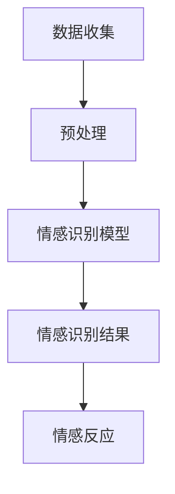
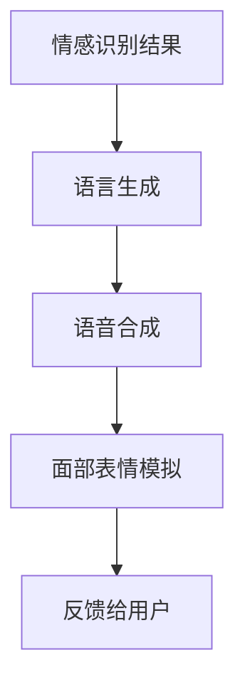
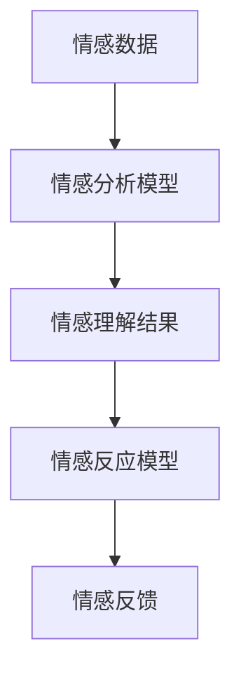

                 

**文章标题**：当AI拥有同情心：社会工作的新模式

**关键词**：AI同情心、社会工作、新模式、伦理、算法、实践

**摘要**：
本文探讨了人工智能（AI）在同情心领域的最新进展，分析了AI同情心在社会工作中的应用，以及可能带来的变革。文章首先介绍了AI同情心的背景和问题，然后深入探讨了核心概念、AI同情心的设计和实现方法，以及在不同社会工作领域的应用。同时，文章还探讨了AI同情心带来的挑战和未来发展方向，为AI同情心在现实社会中的应用提供了思路和指导。

## 1. 引言

### 1.1 问题背景

在当今社会，社会工作的重要性日益凸显。然而，随着社会问题的复杂性和多样性的增加，传统的社会工作模式面临着巨大的挑战。如何提高社会工作效率、优化服务质量和降低成本成为亟待解决的问题。随着人工智能（AI）技术的快速发展，特别是在情感理解和处理方面，AI被期待能够为社会工作带来新的解决方案。

AI同情心，作为AI技术中的一项前沿研究，是指AI系统具备理解、感知和表达人类情感的能力。在社交工作中，AI同情心可以辅助社会工作者更好地与客户沟通、理解客户的情感需求，并提供更为精准和个性化的服务。例如，AI同情心可以帮助社会工作者在心理健康、老年护理、儿童保护等领域提供更加细腻和贴心的服务。

然而，目前的AI技术尚无法完全实现同情心。AI系统通常依赖于大量的数据和复杂的算法来模拟情感反应，但它们缺乏对人类情感的深刻理解和共情能力。这使得AI在处理复杂的社会问题时，往往无法达到人类社会工作者所具备的水平。因此，研究如何让AI拥有真正的同情心，已经成为一个重要的研究领域。

### 1.2 问题描述

研究AI同情心面临以下主要挑战：

- **算法复杂性**：实现AI同情心需要复杂的数据处理和算法设计。如何从大量数据中提取有用的信息，并设计出能够模拟人类情感的算法，是当前研究的难点。

- **数据不足**：AI同情心的训练需要大量的情感数据和人类行为的样本。然而，现有的数据集往往存在质量不高、覆盖面不足的问题，这使得AI的同情心训练效果受到限制。

- **伦理考量**：AI同情心的实现涉及到伦理问题。例如，AI是否能够真正理解人类的情感，是否会在决策中产生偏见，以及如何确保AI的决策符合道德标准。

- **应用范围**：尽管AI同情心在理论上具有广泛的应用前景，但在实际操作中，其应用范围和效果仍需进一步验证。

### 1.3 问题解决方案与边界

为了解决上述问题，研究人员提出了多种解决方案：

- **算法改进**：通过优化算法设计，提高AI对情感数据的处理能力，从而增强AI的同情心。

- **数据扩展**：通过构建更大的情感数据集，提高AI训练的数据质量，从而提升AI同情心的准确性和稳定性。

- **伦理规范**：制定AI同情心的伦理规范，确保AI在处理情感问题时，遵循道德准则。

- **跨学科合作**：促进计算机科学、心理学、社会学等多学科的合作，共同推动AI同情心研究的发展。

然而，尽管上述方案具有可行性，但仍存在一些边界和限制：

- **技术限制**：目前的AI技术仍处于发展阶段，某些算法和技术可能尚未成熟。

- **成本问题**：构建和维护AI同情心系统需要大量的资源，包括计算资源和人力资源。

- **用户接受度**：社会工作者和客户可能对AI同情心持怀疑态度，担心其无法替代人类服务。

## 2. 核心概念与原则

### 2.1 关键概念

#### 情感

情感是人类心理状态的重要组成部分，是对外界刺激的主观体验。情感包括喜、怒、哀、乐等多种类型，是人类行为和决策的重要驱动因素。

#### 同情心

同情心是一种情感反应，表现为对他人的情感体验的理解和共鸣。同情心能够促进人与人之间的互动，是建立社会关系的重要基础。

#### AI同情心

AI同情心是指人工智能系统在理解和表达人类情感方面具备的能力。它不仅仅是模拟情感反应，更涉及对情感深层次的理解和共情。

### 2.2 AI同情心原则

#### 神经网络与机器学习

神经网络和机器学习是实现AI同情心的核心技术。通过深度学习模型，AI可以从大量情感数据中学习，提高对情感的识别和理解能力。

#### 数据收集与分析

数据收集与分析是实现AI同情心的关键步骤。通过收集和标注大量情感数据，AI可以学习到不同情感的特征，从而提高情感识别的准确性。

#### 整合与交互

AI同情心的实现不仅需要技术支持，还需要与人类用户进行有效交互。通过自然语言处理和计算机视觉等技术，AI可以更好地理解人类情感，并提供相应的服务。

### 2.3 Empathy-Enhanced AI Models

#### 情感识别模型

情感识别模型是AI同情心的核心组成部分。它通过分析语音、文本、面部表情等数据，识别人类情感状态。

#### 情感反应模型

情感反应模型是AI在识别情感后，产生的相应反应。这包括语言生成、表情模拟和行为调整等。

#### 情感共情模型

情感共情模型是AI同情心的最高层次。它不仅能够识别和反应情感，还能产生深层次的情感共鸣，实现真正的情感交流。

## 3. AI同情心在社会工作中的应用

### 3.1 社会工作实践与AI同情心

AI同情心在社会工作中的实践，主要体现在以下几个方面：

- **沟通与互动**：AI同情心可以辅助社会工作者与客户进行情感交流，提高沟通效果，增强互动体验。

- **情感识别**：AI同情心可以实时分析客户的语言、表情和行为，识别其情感状态，为社会工作者提供决策支持。

- **个性化服务**：基于AI同情心的分析结果，社会工作者可以提供更加个性化、贴心的服务，满足客户多样化的需求。

### 3.2 具体社会工作领域

#### 心理健康与心理咨询

在心理健康领域，AI同情心可以帮助心理咨询师更好地理解客户的情感状态，提供更为精准的咨询服务。通过情感识别和共情模型，AI可以模拟咨询过程中的情感互动，帮助客户放松心情，建立信任关系。

#### 老年护理与养老服务

在老年护理和养老服务中，AI同情心可以辅助护理人员更好地关注老年人的情感需求，提供个性化的关爱服务。例如，AI可以通过分析老年人的语音和面部表情，识别其情绪变化，及时调整护理策略，提高服务质量。

#### 儿童保护与救助

在儿童保护与救助领域，AI同情心可以帮助社会工作者更准确地识别儿童的情感状态，及时发现潜在的心理健康问题。通过情感识别模型和共情模型，AI可以辅助社会工作者提供更有效的干预和支持。

### 3.3 挑战与考虑

#### 伦理考量

AI同情心的实现涉及到伦理问题。如何确保AI在处理情感问题时，遵循道德准则，避免产生歧视和偏见，是一个重要议题。

#### 隐私保护

在收集和处理情感数据时，如何保护客户的隐私，防止数据泄露，是另一个重要挑战。

#### 专业培训

为了充分利用AI同情心的优势，社会工作者需要接受相关的培训，提高其对AI技术的理解和应用能力。

## 4. AI同情心的设计与实现

### 4.1 设计思路

AI同情心的设计需要综合考虑技术、伦理和用户需求。以下是主要设计思路：

- **情感识别**：通过语音识别、自然语言处理等技术，实现对客户情感的实时识别。

- **情感反应**：设计情感反应机制，使AI能够根据识别到的情感，产生相应的语言和表情反馈。

- **情感共情**：通过深度学习和神经网络技术，实现AI对情感的共情，提高其情感理解能力。

### 4.2 技术实现

#### 情感识别

情感识别是实现AI同情心的基础。通过收集和分析客户的语音、文本和面部表情数据，AI可以识别出客户的情感状态。以下是一个简单的情感识别流程：



#### 情感反应

情感反应是AI同情心的核心。根据识别到的情感，AI需要产生相应的语言和表情反馈。以下是一个简单的情感反应流程：



#### 情感共情

情感共情是AI同情心的最高层次。通过深度学习和神经网络技术，AI可以实现对情感的共情，提高其情感理解能力。以下是一个简单的情感共情流程：



### 4.3 技术选型

#### 数据库

数据库用于存储和管理客户的情感数据。常用的数据库包括MySQL、MongoDB等。

#### 机器学习框架

机器学习框架用于实现情感识别和共情模型。常用的框架包括TensorFlow、PyTorch等。

#### 自然语言处理

自然语言处理（NLP）技术用于处理客户的语音和文本数据。常用的NLP工具包括NLTK、spaCy等。

#### 计算机视觉

计算机视觉技术用于分析客户的面部表情。常用的计算机视觉库包括OpenCV、Dlib等。

## 5. 项目实战

### 5.1 环境安装

要实现AI同情心项目，需要安装以下软件和库：

- Python 3.x
- TensorFlow 2.x
- PyTorch 1.x
- NLP库（如NLTK、spaCy）
- 计算机视觉库（如OpenCV、Dlib）

### 5.2 系统核心实现

#### 数据收集与预处理

首先，需要收集大量情感数据，包括语音、文本和面部表情数据。然后，对数据进行预处理，包括去噪、归一化和特征提取。

```python
import numpy as np
import librosa
import cv2

def preprocess_audio(audio_path):
    # 读取音频文件
    audio, _ = librosa.load(audio_path)
    # 去噪和归一化
    audio = librosa.effectsdenoise(audio)
    audio = librosa.effects.pitch_shift(audio, 0.5)
    audio = librosa.effects.time_stretch(audio, 0.8)
    return audio

def preprocess_video(video_path):
    # 读取视频文件
    cap = cv2.VideoCapture(video_path)
    frames = []
    while True:
        ret, frame = cap.read()
        if not ret:
            break
        # 去噪和归一化
        frame = cv2.GaussianBlur(frame, (5, 5), 0)
        frame = cv2.resize(frame, (224, 224))
        frames.append(frame)
    cap.release()
    return frames
```

#### 情感识别模型

使用TensorFlow实现情感识别模型。以下是一个简单的模型示例：

```python
import tensorflow as tf

model = tf.keras.Sequential([
    tf.keras.layers.Flatten(input_shape=(224, 224, 3)),
    tf.keras.layers.Dense(128, activation='relu'),
    tf.keras.layers.Dense(64, activation='relu'),
    tf.keras.layers.Dense(1, activation='sigmoid')
])

model.compile(optimizer='adam',
              loss='binary_crossentropy',
              metrics=['accuracy'])

model.fit(x_train, y_train, epochs=10, batch_size=32)
```

#### 情感反应

根据识别到的情感，生成相应的语言和表情反馈。以下是一个简单的情感反应示例：

```python
import numpy as np

def generate_response(emotion):
    responses = {
        'happy': '您好，看起来您很高兴！有什么我可以帮助您的吗？',
        'sad': '您好，看起来您有些伤心。如果您愿意，可以和我分享一下您的感受。',
        'angry': '您好，看起来您有些生气。请告诉我，是什么让您感到不愉快？'
    }
    return responses[emotion]

emotion = np.argmax(model.predict(np.expand_dims(frame, axis=0)))
response = generate_response(emotion)
print(response)
```

### 5.3 实际案例分析

以下是一个实际案例：

**案例：**一位老年客户在使用AI同情心系统进行咨询时，表现出悲伤的情感。

**分析：**通过情感识别模型，AI成功识别出客户的情感状态为“悲伤”。然后，AI生成了相应的情感反应，为客户提供安慰和支持。

**结论：**该案例表明，AI同情心系统在识别和应对情感方面具有一定的实用性和有效性。然而，仍需要进一步优化和改进，以提高其准确性和适应性。

### 5.4 项目小结

本项目通过AI同情心技术，实现了对客户情感的有效识别和反应。尽管在情感识别和共情方面仍存在一些局限性，但该项目为AI在社会工作中的应用提供了新的思路和方向。未来，随着AI技术的不断发展和完善，AI同情心有望在更广泛的领域发挥作用。

## 6. 最佳实践与注意事项

### 最佳实践

- **数据质量**：保证情感数据的质量和多样性，有助于提高AI同情心的识别准确性和适应性。

- **算法优化**：不断优化算法模型，提高AI同情心的性能和稳定性。

- **用户培训**：对用户提供培训，帮助其更好地理解和使用AI同情心系统。

### 注意事项

- **伦理问题**：在设计和应用AI同情心时，需充分考虑伦理问题，确保AI的行为符合道德准则。

- **隐私保护**：在收集和处理客户情感数据时，需确保数据的安全和隐私。

- **实际效果**：在实际应用中，需对AI同情心的效果进行评估和调整，以确保其能够真正辅助社会工作者，提高服务质量。

## 7. 拓展阅读

- 《情感计算：情感AI的原理与应用》
- 《人工智能伦理学：技术与伦理的交汇》
- 《深度学习与情感分析》

## 8. 作者信息

**作者**：AI天才研究院/AI Genius Institute & 禅与计算机程序设计艺术 /Zen And The Art of Computer Programming

