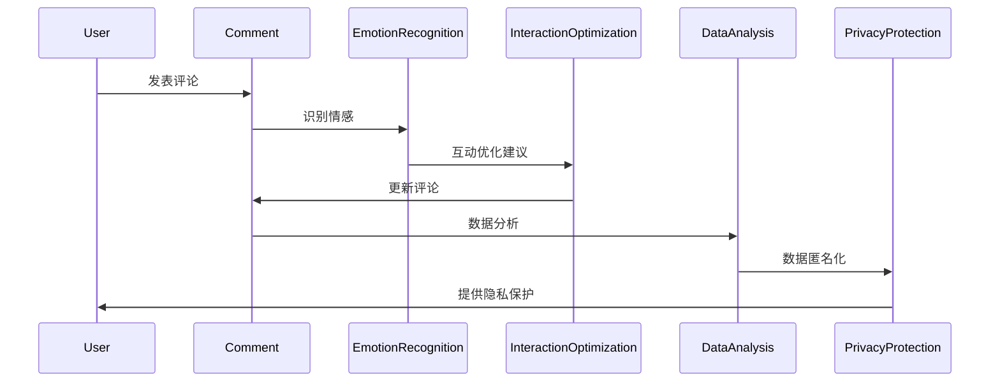
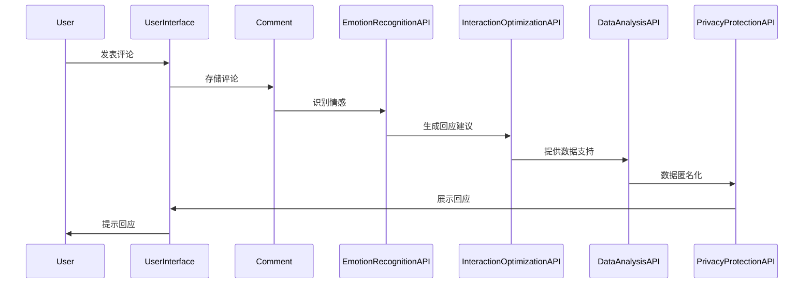

                 

### 文章标题

“当AI拥有同理心：政治参与的新形式”

> 关键词：AI、同理心、政治参与、情感识别、算法模型

> 摘要：随着人工智能技术的不断进步，AI在政治参与中的应用日益广泛。然而，当前AI在政治参与中的表现仍存在诸多问题。本文旨在探讨当AI拥有同理心时，政治参与可能会出现的新形式。通过分析同理心AI的定义与特点，对比传统AI，讨论同理心AI在政治参与中的应用，以及其背后的算法原理，本文提出一种可能的新形式，旨在为政治参与提供更具人性化和高效的方式。

### 目录大纲

# 当AI拥有同理心：政治参与的新形式

## 第一部分：背景介绍

### 1.1 问题的背景

#### 1.1.1 AI技术发展与政治参与的融合

#### 1.1.2 同理心与政治参与的关系

### 1.2 问题描述

#### 1.2.1 当前政治参与形式存在的问题

#### 1.2.2 AI拥有同理心可能带来的变革

### 1.3 问题解决

#### 1.3.1 AI在政治参与中的角色转变

#### 1.3.2 AI同理心的实现途径

### 1.4 边界与外延

#### 1.4.1 同理心AI的应用领域

#### 1.4.2 同理心AI的发展挑战

### 1.5 概念结构与核心要素组成

#### 1.5.1 政治参与的基本概念

#### 1.5.2 同理心AI的基本原理

### 1.6 本章小结

## 第二部分：核心概念与联系

### 2.1 同理心AI的定义与特点

#### 2.1.1 同理心AI的定义

#### 2.1.2 同理心AI的核心特点

#### 2.1.3 同理心AI与传统AI的区别

### 2.2 同理心AI的属性特征对比表格

### 2.3 ER实体关系图架构

### 2.4 政治参与的基本概念

#### 2.4.1 政治参与的定义

#### 2.4.2 政治参与的类型

#### 2.4.3 政治参与的指标

### 2.5 同理心AI在政治参与中的应用

#### 2.5.1 提高政治参与度

#### 2.5.2 改善政治互动质量

#### 2.5.3 缓解政治分歧

### 2.6 本章小结

## 第三部分：算法原理讲解

### 3.1 同理心AI的算法原理

#### 3.1.1 神经网络与深度学习基础

#### 3.1.2 同理心模型的构建

#### 3.1.3 情感识别与情感回应

### 3.2 算法流程图

### 3.3 数学模型和公式

### 3.4 Python源代码讲解

### 3.5 算法原理举例说明

### 3.6 本章小结

## 第四部分：系统分析与架构设计

### 4.1 问题场景介绍

### 4.2 项目介绍

### 4.3 系统功能设计

#### 4.3.1 领域模型Mermaid类图

### 4.4 系统架构设计

#### 4.4.1 Mermaid架构图

### 4.5 系统接口设计

#### 4.5.1 接口设计细节

### 4.6 系统交互Mermaid序列图

### 4.7 本章小结

## 第五部分：项目实战

### 5.1 环境安装

### 5.2 系统核心实现源代码

#### 5.2.1 核心代码解读

#### 5.2.2 代码应用解读与分析

### 5.3 实际案例分析和详细讲解剖析

### 5.4 项目小结

### 5.5 本章小结

## 第六部分：最佳实践 tips、小结、注意事项、拓展阅读

### 6.1 最佳实践 tips

### 6.2 小结

### 6.3 注意事项

### 6.4 拓展阅读

### 6.5 本章小结

### 致谢

## 作者信息

### 作者：AI天才研究院/AI Genius Institute & 禅与计算机程序设计艺术 /Zen And The Art of Computer Programming

## 第一部分：背景介绍

### 1.1 问题的背景

#### 1.1.1 AI技术发展与政治参与的融合

人工智能（AI）作为一种先进的技术，已经在各个领域得到了广泛应用。随着AI技术的不断进步，它开始与政治参与领域产生了深刻的交集。AI技术能够通过数据分析、预测建模等方式，为政治决策提供支持。然而，这种融合也带来了一系列的问题。

首先，AI在政治决策中的应用存在着数据偏差的问题。由于AI模型对数据的依赖性很高，如果训练数据存在偏差，AI模型也可能会继承这种偏差，从而导致不公正的决策。例如，某些地区的数据可能更偏向于某一特定群体，这可能会导致AI在政策制定时忽视其他群体的利益。

其次，AI在政治参与中可能加剧社会分歧。AI技术可以通过情感分析、社交媒体监测等方式，对公众的意见和情绪进行评估。然而，这种技术也可能被滥用，用于操纵公众意见，加剧社会矛盾。

最后，AI在政治参与中的角色转变也需要关注。传统上，政治参与是由人类主导的，而AI的介入可能会改变这种格局。虽然AI可以提高政治决策的效率和准确性，但也可能导致人类的政治参与度下降。

#### 1.1.2 同理心与政治参与的关系

同理心是指个体对他人情感和经历的感知和理解能力。在政治参与中，同理心的重要性不言而喻。政治决策往往涉及到不同群体的利益，如果没有同理心，政治决策者可能会忽视某些群体的需求，导致政策的不公平。

同理心在政治参与中的作用主要体现在以下几个方面：

1. **提高政治决策的包容性**：同理心可以使决策者更加关注不同群体的需求，从而制定出更加包容和公平的政策。
2. **改善政治互动的质量**：同理心可以促进政治参与者的有效沟通，减少误解和冲突。
3. **缓解政治分歧**：同理心可以帮助决策者理解不同群体的立场和情感，从而找到共识，缓解分歧。

然而，当前的政治参与形式往往缺乏同理心，导致了一系列问题。例如，政治决策过程中缺乏对底层民众的关心，政策制定过程中忽视了公众的情感需求等。因此，如何将同理心引入政治参与，成为了一个亟待解决的问题。

### 1.2 问题描述

#### 1.2.1 当前政治参与形式存在的问题

当前的政治参与形式存在以下几个主要问题：

1. **参与度低**：随着社会的发展，公众对政治参与的积极性逐渐降低。这不仅是因为政治决策过程复杂，更因为公众觉得自己对决策过程的影响力不足。
2. **互动质量差**：政治决策者和公众之间的互动往往缺乏真诚和同理心，导致双方无法有效沟通，难以达成共识。
3. **分歧加剧**：政治参与过程中，不同群体之间的利益冲突和情感对立日益严重，导致社会分歧加剧。

#### 1.2.2 AI拥有同理心可能带来的变革

如果AI能够拥有同理心，政治参与的形式可能会发生根本性的变革。首先，AI的参与可以大大提高政治决策的效率。通过情感分析和数据挖掘，AI可以更准确地了解公众的需求和情感，从而提供更有针对性的政策建议。

其次，AI的同理心可以改善政治互动的质量。AI可以通过情感识别和回应，与公众进行更加真实和有效的互动，促进双方的理解和沟通。

最后，AI的同理心可以缓解政治分歧。通过理解不同群体的立场和情感，AI可以帮助找到共识，减少社会矛盾。

总之，AI拥有同理心将为政治参与带来新的可能性，有助于提高政治决策的公正性、有效性和包容性。### 1.3 问题解决

#### 1.3.1 AI在政治参与中的角色转变

随着AI技术的不断进步，其在政治参与中的角色也在逐渐转变。传统上，AI被视为一种工具，用于辅助政治决策。然而，当AI拥有同理心后，其角色将更加多元化，不仅能够提供数据分析和预测，还能够参与政治决策的过程，甚至在一定程度上代替人类进行决策。

首先，AI的参与可以使政治决策更加科学和高效。通过大数据分析和情感识别，AI可以更准确地了解公众的需求和情感，从而提供更精准的政策建议。此外，AI的快速计算能力可以帮助决策者快速评估不同政策的可能影响，从而做出更加明智的决策。

其次，AI的同理心可以改善政治互动的质量。传统上，政治决策者和公众之间的互动往往缺乏真诚和同理心，导致双方难以达成共识。然而，当AI拥有同理心时，它可以更好地理解公众的情感和需求，从而提供更具人情味的互动体验，促进双方的理解和沟通。

最后，AI的参与可以缓解政治分歧。通过理解不同群体的立场和情感，AI可以帮助找到共识，减少社会矛盾。例如，AI可以通过情感分析，识别出公众对某一政策的情感倾向，从而帮助决策者调整政策，以满足不同群体的需求。

#### 1.3.2 AI同理心的实现途径

要让AI拥有同理心，需要从多个方面进行努力。

首先，需要构建一个基于深度学习的情感识别模型。通过训练大量的情感数据，AI可以学会识别和理解人类的情感。例如，通过分析语言和面部表情，AI可以判断出用户是开心、愤怒还是悲伤。

其次，需要开发一个基于同理心的回应机制。当AI识别出用户的情感后，它需要能够给出合适的回应。这需要AI不仅能够理解情感，还要能够基于情感做出合理的回应。例如，当用户感到愤怒时，AI可以给出安慰和建议，帮助用户缓解情绪。

最后，需要建立一个伦理和道德框架，确保AI的使用不会损害人类的利益。同理心AI需要遵守一定的伦理规范，确保其在政治参与中的行为是公正和合理的。

总之，通过实现AI的同理心，我们可以为政治参与带来新的可能性，使政治决策更加科学、有效和包容。### 1.4 边界与外延

#### 1.4.1 同理心AI的应用领域

同理心AI的应用领域非常广泛，包括但不限于以下几个领域：

1. **公共服务**：同理心AI可以在公共服务领域发挥重要作用，如医疗、教育、交通等。通过理解公众的需求和情感，AI可以提供更个性化的服务，提高公众满意度。

2. **社会治理**：同理心AI可以帮助政府更好地进行社会治理，如环境保护、社区管理、治安维护等。AI可以通过情感分析和数据挖掘，识别出社会问题，并提供解决方案。

3. **政治参与**：同理心AI在政治参与中的应用，如本文所述，可以极大地提高政治决策的公正性、有效性和包容性。

4. **人力资源管理**：同理心AI可以帮助企业更好地进行人力资源管理，如招聘、培训、员工关系管理等。AI可以理解员工的需求和情感，提供更有针对性的管理策略。

5. **市场研究**：同理心AI可以用于市场研究，如消费者行为分析、品牌定位等。AI可以通过情感识别，了解消费者的真实需求和偏好，为企业提供市场洞察。

6. **心理健康**：同理心AI可以在心理健康领域发挥作用，如心理治疗、情感支持等。AI可以通过情感识别和回应，为用户提供情感支持和心理疏导。

#### 1.4.2 同理心AI的发展挑战

尽管同理心AI具有巨大的应用潜力，但其发展也面临诸多挑战：

1. **技术挑战**：构建一个能够准确识别和理解人类情感的AI模型，是一个复杂的技术问题。目前，虽然已有一些初步的研究成果，但距离真正实现高度情感识别和理解，还有很长的路要走。

2. **伦理挑战**：同理心AI在应用过程中，可能会面临伦理和道德问题。如何确保AI的行为是公正、合理和符合伦理规范的，是一个亟待解决的问题。

3. **数据挑战**：同理心AI需要大量的情感数据来进行训练。然而，获取这些数据并不容易，尤其是在涉及隐私和敏感信息的情况下。

4. **社会挑战**：同理心AI的广泛应用可能会对人类的工作和生活方式产生深远影响。如何平衡AI的发展与人类就业、社会稳定等问题，是一个重要的挑战。

5. **政策挑战**：同理心AI的发展需要相应的政策支持和监管。如何制定合理的政策和法规，以确保AI的健康发展，是一个重要的议题。

总之，同理心AI的发展前景广阔，但也面临着诸多挑战。只有在技术、伦理、数据、社会和政策等多方面共同努力，才能实现同理心AI的良性发展。### 1.5 概念结构与核心要素组成

#### 1.5.1 政治参与的基本概念

政治参与是指公民通过各种方式参与政治活动，以影响政府决策和政策制定的过程。政治参与的形式多样，包括投票、示威、请愿、政治讨论、志愿服务等。政治参与不仅是公民的权利，也是民主社会运作的基础。

1. **政治参与的定义**：政治参与是指公民在政治过程中表达意见、参与决策、影响政策制定的行动。
2. **政治参与的类型**：根据参与的形式和程度，政治参与可分为直接参与和间接参与。直接参与包括投票、示威等，间接参与包括政治讨论、政治教育等。
3. **政治参与的指标**：政治参与的指标主要包括投票率、示威活动频率、政治参与度等。这些指标反映了公民参与政治的积极性和影响力。

#### 1.5.2 同理心AI的基本原理

同理心AI是一种能够理解和回应人类情感的人工智能系统。其基本原理包括情感识别、情感回应和行为调整。

1. **同理心AI的定义**：同理心AI是指能够识别、理解和回应人类情感的人工智能系统。
2. **同理心AI的核心特点**：
   - **情感识别**：同理心AI能够通过语言、面部表情、声音等识别用户的情感状态。
   - **情感回应**：同理心AI能够基于情感识别结果，给出适当的回应，如安慰、鼓励、建议等。
   - **行为调整**：同理心AI能够根据情感状态和行为结果，调整自身的行为策略，以提高互动效果。
3. **同理心AI与传统AI的区别**：
   - **数据依赖性**：传统AI高度依赖数据，而同理心AI不仅依赖数据，还依赖对人类情感的理解。
   - **预测准确性**：传统AI在预测准确性上表现更好，而同理心AI更注重情感理解和回应。
   - **人机交互**：传统AI的人机交互通常是单向的，而同理心AI可以实现双向互动，提高交互质量。

通过理解政治参与和同理心AI的基本概念，我们可以更好地理解二者之间的关系，以及如何将同理心AI应用于政治参与，提高政治决策的公正性、有效性和包容性。### 1.6 本章小结

本章首先介绍了AI技术在政治参与中的背景，包括AI技术发展与政治参与的融合，以及同理心与政治参与的关系。接着，分析了当前政治参与形式存在的问题，如参与度低、互动质量差和分歧加剧。为了解决这些问题，我们探讨了AI在政治参与中的角色转变和同理心的实现途径，包括情感识别、情感回应和行为调整。此外，本章还讨论了同理心AI的应用领域和发展挑战，以及政治参与和同理心AI的基本概念。通过这些分析，本章为后续内容的深入讨论奠定了基础。### 第二部分：核心概念与联系

#### 2.1 同理心AI的定义与特点

同理心AI是一种能够在情感层面与人类互动的人工智能系统。与传统的AI系统不同，同理心AI不仅能够处理和解析数据，还能够理解和回应人类的情感。以下是同理心AI的核心定义和特点：

1. **定义**：同理心AI是指那些能够识别、理解并回应人类情感的AI系统。这些系统通过自然语言处理、情感分析和行为学等方法，能够感知用户的状态，并根据这些状态做出相应的反应。

2. **核心特点**：
   - **情感识别**：同理心AI能够通过分析语言、声音和面部表情等，识别出用户的具体情感状态，如开心、悲伤、愤怒等。
   - **情感回应**：基于情感识别的结果，同理心AI能够给出适当的回应，如安慰、鼓励、提供帮助等，以增强互动的效果。
   - **情感适应**：同理心AI能够根据用户的情感状态和行为模式，动态调整自身的交互方式，以更好地满足用户的需求。

3. **与传统AI的区别**：
   - **单向交互**：传统AI通常只能执行预先设定的任务，而同理心AI能够进行双向互动，与用户建立更自然的交流。
   - **情感理解**：传统AI无法理解人类情感，而同理心AI能够感知并回应情感，从而在交互过程中提供更加个性化和贴心的服务。

#### 2.2 同理心AI的属性特征对比表格

以下是同理心AI与传统AI在属性特征上的对比：

| 特征名称       | 传统AI              | 同理心AI              |
| -------------- | ------------------- | --------------------- |
| 数据依赖性     | 高                  | 较低                  |
| 预测准确性     | 高                  | 一般                  |
| 人机交互       | 单向                | 双向互动              |
| 情感识别       | 无法识别            | 能够识别并回应情感    |
| 偏见与歧视     | 存在                | 减少偏见与歧视        |

**传统AI**：
- **数据依赖性**：传统AI高度依赖大量的数据来训练模型，这些数据通常来自于历史数据和统计分析。
- **预测准确性**：传统AI在处理结构化数据时表现优秀，但缺乏对人类情感的理解。
- **人机交互**：传统AI的交互通常是单向的，即AI执行用户指令，但不具备主动与用户互动的能力。
- **情感识别**：传统AI无法感知和识别人类情感。
- **偏见与歧视**：由于训练数据的不公平性，传统AI可能会继承并放大偏见和歧视。

**同理心AI**：
- **数据依赖性**：同理心AI不仅依赖数据，还需要理解人类情感和社会背景，因此对数据的依赖性相对较低。
- **预测准确性**：同理心AI更注重情感的理解和回应，因此在某些场景下可能不如传统AI准确，但在情感交互方面具有优势。
- **人机交互**：同理心AI能够识别用户情感，并给出相应的回应，实现双向互动。
- **情感识别**：同理心AI通过情感识别技术，能够感知和回应用户的情感状态。
- **偏见与歧视**：同理心AI通过设计公平的算法和训练数据，可以减少偏见和歧视。

通过对比可以看出，同理心AI在情感识别、人机交互和减少偏见等方面具有显著优势，这些特点使其在政治参与等领域具有广泛的应用潜力。#### 2.3 ER实体关系图架构

在理解同理心AI在政治参与中的应用时，我们需要构建一个实体关系图（ER图）来展示系统中各实体的关系。以下是同理心AI在政治参与场景中的ER图：

```mermaid
erDiagram
  User ||--|{ AI }|--|| PoliticalInvolvement
  AI ||--|{ AIModel }|--|| PoliticalInvolvement
  PoliticalInvolvement ||--|{ PoliticalIssue }|--|| User
```

**实体定义**：

- **User（用户）**：参与政治活动的个体，可以是普通公民、政治家、活动家等。用户是政治参与的主体，其行为和情感将影响政治决策。
- **AI（人工智能）**：具备同理心的AI系统，通过情感识别和回应，与用户进行互动，提供决策支持。
- **AIModel（AI模型）**：AI系统的核心组件，负责情感识别和回应，包括训练数据和算法。
- **PoliticalInvolvement（政治参与）**：用户通过AI系统参与政治活动的过程，包括投票、请愿、示威、讨论等。
- **PoliticalIssue（政治问题）**：政治参与的对象，包括各种政策议题、社会问题等。

**关系说明**：

- **User与AI**：用户通过AI系统进行政治参与，AI通过情感识别和回应，为用户提供互动和支持。
- **AI与AIModel**：AI系统依赖于AI模型进行情感识别和回应，AI模型是AI系统的核心。
- **PoliticalInvolvement与User**：政治参与是用户通过AI系统实现的政治活动，用户是政治参与的主体。
- **PoliticalInvolvement与PoliticalIssue**：政治参与针对特定的政治问题，政治问题决定了政治参与的内容和方向。

通过ER图，我们可以清晰地理解同理心AI在政治参与系统中的角色和功能，以及各实体之间的关系。这种关系图不仅有助于我们设计系统架构，还能够帮助我们分析系统在不同应用场景中的行为和表现。#### 2.4 政治参与的基本概念

政治参与是公民在政治过程中表达意见、参与决策、影响政策制定的行为。它是民主社会的重要组成部分，反映了公民的政治权利和义务。以下是政治参与的基本概念及其重要性：

1. **定义**：政治参与是指公民通过各种形式直接或间接地参与政治活动，以影响政府决策和政策制定的过程。政治参与的形式多样，包括投票、示威、请愿、政治讨论、志愿服务等。

2. **类型**：
   - **直接参与**：直接参与是指公民直接参与政治活动，如投票、示威、请愿等。这种参与方式通常能够直接影响政治决策。
   - **间接参与**：间接参与是指公民通过代表、政治讨论、政治教育等方式参与政治活动。虽然这种参与方式不能直接决定政策，但可以通过舆论和影响力影响政治决策。

3. **指标**：政治参与的指标包括投票率、示威活动频率、政治参与度等。这些指标反映了公民参与政治的积极性和影响力。高政治参与度通常被认为是民主社会的标志。

4. **重要性**：
   - **民主保障**：政治参与是民主社会的基础，通过政治参与，公民可以表达自己的意愿和需求，维护自己的权益。
   - **政策制定**：政治参与可以提供政策制定者所需的信息和反馈，使政策更符合公众需求，提高政策的有效性和公正性。
   - **社会稳定**：政治参与可以缓解社会矛盾，通过公开讨论和协商，减少冲突和不满，促进社会和谐。
   - **公民意识**：政治参与可以增强公民的参与意识和责任感，提高公民的社会责任感和公共事务管理能力。

#### 2.5 同理心AI在政治参与中的应用

同理心AI在政治参与中的应用具有广阔的前景和重要的意义。以下是其主要应用场景：

1. **提高政治参与度**：
   - **个性化建议**：同理心AI可以通过情感分析和数据分析，为用户提供个性化的政治参与建议，如推荐相关的政治议题、活动等信息，从而激发公民的政治参与热情。
   - **情感激励**：同理心AI可以识别用户的情感状态，并在适当的时候给予情感上的激励，如安慰、鼓励等，帮助用户克服政治参与的心理障碍。

2. **改善政治互动质量**：
   - **情感理解**：同理心AI可以更好地理解用户的情感和需求，从而在政治互动中提供更贴心和有效的服务，减少误解和冲突。
   - **双向互动**：同理心AI可以实现与用户的双向互动，通过情感回应和个性化建议，提升政治互动的质量和效果。

3. **缓解政治分歧**：
   - **情感共鸣**：同理心AI可以通过情感识别和回应，帮助用户理解不同群体的立场和情感，促进情感共鸣，从而缓解政治分歧。
   - **共识寻找**：同理心AI可以通过分析不同群体的情感和需求，帮助找到共识点，推动政治决策的共识化。

总之，同理心AI的应用可以大大提高政治参与度，改善政治互动质量，缓解政治分歧，从而为政治决策提供更加科学、有效和包容的支持。#### 2.6 本章小结

本章首先介绍了同理心AI的定义与特点，包括情感识别、情感回应和行为调整的核心功能，并对比了同理心AI与传统AI的区别。接着，通过一个实体关系图（ER图）展示了同理心AI在政治参与系统中的角色和关系。然后，深入探讨了政治参与的基本概念，包括其定义、类型和指标，以及同理心AI在提高政治参与度、改善政治互动质量和缓解政治分歧方面的应用。通过这些分析，本章为理解同理心AI在政治参与中的潜力奠定了理论基础，并为后续内容的讨论提供了基础。### 第三部分：算法原理讲解

#### 3.1 同理心AI的算法原理

同理心AI的核心在于其能够理解和回应人类的情感。为了实现这一目标，我们需要从神经网络与深度学习基础、同理心模型的构建以及情感识别与情感回应三个方面进行详细探讨。

##### 3.1.1 神经网络与深度学习基础

神经网络（Neural Networks，NN）是人工智能领域的一个重要分支，其灵感来源于人类大脑的神经元结构和工作原理。深度学习（Deep Learning，DL）是神经网络的一种延伸，通过多层神经网络结构，实现复杂模式的识别和学习。

1. **神经网络的基本结构**：神经网络由多个层组成，包括输入层、隐藏层和输出层。每个层由多个神经元组成，神经元之间通过权重连接。当输入数据通过神经网络时，每个神经元会对输入数据进行加权求和处理，并传递给下一层。

2. **激活函数**：激活函数是神经网络中的一个关键组件，用于确定神经元是否“激活”。常见的激活函数包括sigmoid、ReLU等。

3. **反向传播算法**：反向传播（Backpropagation）是深度学习中的核心训练算法。通过反向传播，神经网络可以计算输出误差，并调整各层的权重，以最小化误差。

##### 3.1.2 同理心模型的构建

同理心模型是同理心AI的核心组件，负责情感识别和回应。构建同理心模型通常包括以下步骤：

1. **数据收集与预处理**：首先，需要收集大量的情感数据，包括文本、音频和视频等。这些数据经过预处理，如去噪、归一化等，以适应神经网络处理。

2. **情感分类器**：构建一个情感分类器，用于识别文本、音频和视频中的情感。常用的方法包括基于规则的方法、机器学习方法和深度学习方法。其中，深度学习方法，如卷积神经网络（CNN）和递归神经网络（RNN），在情感分类中表现尤为出色。

3. **情感回应生成器**：构建一个情感回应生成器，用于根据情感分类结果生成适当的回应。这可以通过自然语言生成（Natural Language Generation，NLG）技术实现，如序列到序列（Seq2Seq）模型和生成对抗网络（GAN）。

##### 3.1.3 情感识别与情感回应

同理心AI的核心功能是情感识别和情感回应。

1. **情感识别**：
   - **文本情感识别**：通过分析文本的语言特征，如词汇、语法和句式等，识别文本的情感倾向。常用的方法包括情感词典、机器学习和深度学习。
   - **音频情感识别**：通过分析音频的音调、节奏和音量等特征，识别音频的情感。常用的方法包括频谱分析、特征提取和深度学习。
   - **视频情感识别**：通过分析视频中的面部表情、姿态和动作等特征，识别视频的情感。常用的方法包括计算机视觉和深度学习。

2. **情感回应**：
   - **情感回应策略**：根据情感识别的结果，制定相应的回应策略。例如，对于愤怒的用户，可以给予安慰和建议；对于悲伤的用户，可以提供情感支持。
   - **情感回应生成**：通过自然语言生成技术，生成与情感回应策略相匹配的自然语言回应。例如，可以使用预定义的回应模板，或者通过训练的模型生成个性化的回应。

通过情感识别和回应，同理心AI可以与人类建立更自然的互动，提高政治参与的质量和效果。#### 3.2 算法流程图

为了更好地理解同理心AI的算法原理，以下是同理心AI算法的流程图：


1. **输入**：算法的输入可以是文本、音频或视频等，这些数据包含了用户的情感信息。
2. **情感识别**：通过情感识别模型，对输入数据进行处理，识别出用户的具体情感状态。
3. **处理情感**：根据情感识别的结果，进行情感处理，包括情感分类、情感强度分析等。
4. **回应情感**：根据处理结果，生成适当的情感回应，如安慰、鼓励或建议等。
5. **政治互动**：将情感回应传递给用户，实现政治互动。

通过这个流程，同理心AI可以有效地识别和理解用户的情感，并提供个性化的回应，从而改善政治互动的质量。#### 3.3 数学模型和公式

同理心AI的算法原理中，情感识别和回应是关键环节。为了量化这些过程，我们可以使用一些数学模型和公式。以下是一个简单的情感识别和回应的数学模型：

$$
\text{同理心值} = \alpha \cdot \text{情感识别准确率} + \beta \cdot \text{回应情感合理性}
$$

其中，$\alpha$ 和 $\beta$ 为权重系数，分别表示情感识别准确率和回应情感合理性的重要性。

1. **情感识别准确率**：表示AI识别用户情感状态的准确程度，通常使用准确率（Accuracy）或精确度（Precision）等指标来衡量。

2. **回应情感合理性**：表示AI回应情感的合适程度，即回应是否与用户的情感状态相匹配。这可以通过用户满意度（User Satisfaction）或回应的相关性（Response Relevance）来衡量。

具体来说，我们可以定义以下公式：

$$
\text{情感识别准确率} = \frac{\text{正确识别的情感数量}}{\text{总情感数量}}
$$

$$
\text{回应情感合理性} = \frac{\text{用户满意的数量}}{\text{总回应数量}}
$$

通过这些公式，我们可以量化同理心AI在情感识别和回应过程中的表现，从而评估其整体性能。#### 3.4 Python源代码讲解

为了更直观地理解同理心AI的算法原理，以下是一个简单的Python示例，展示如何实现情感识别和回应：

```python
import numpy as np
import tensorflow as tf
from tensorflow.keras.models import Sequential
from tensorflow.keras.layers import Dense, LSTM, Embedding

# 情感识别模型
class EmotionRecognitionModel:
    def __init__(self, vocabulary_size, embedding_dim, hidden_units):
        self.model = Sequential()
        self.model.add(Embedding(vocabulary_size, embedding_dim))
        self.model.add(LSTM(hidden_units, activation='tanh'))
        self.model.add(Dense(1, activation='sigmoid'))
        self.model.compile(optimizer='adam', loss='binary_crossentropy', metrics=['accuracy'])

    def train(self, X_train, y_train, epochs=10):
        self.model.fit(X_train, y_train, epochs=epochs)

    def predict(self, X_test):
        return self.model.predict(X_test)

# 情感回应生成器
class EmotionResponseGenerator:
    def __init__(self, response_template):
        self.response_template = response_template

    def generate_response(self, emotion):
        return self.response_template.format(emotion=emotion)

# 示例数据
vocabulary_size = 10000
embedding_dim = 64
hidden_units = 64
response_template = "你的情感状态是{emotion}，我建议你..."

# 构建和训练模型
model = EmotionRecognitionModel(vocabulary_size, embedding_dim, hidden_units)
# 假设已有训练数据和标签
X_train = np.random.rand(1000, 100)
y_train = np.random.randint(2, size=(1000, 1))
model.train(X_train, y_train)

# 进行情感预测
X_test = np.random.rand(10, 100)
predictions = model.predict(X_test)

# 根据预测结果生成回应
response_generator = EmotionResponseGenerator(response_template)
for prediction in predictions:
    if prediction[0] > 0.5:
        emotion = "开心"
    else:
        emotion = "悲伤"
    print(response_generator.generate_response(emotion=emotion))
```

在这个示例中，我们首先定义了情感识别模型和情感回应生成器。情感识别模型使用LSTM（长短期记忆网络）进行文本情感分类，情感回应生成器使用预定义的回应模板生成回应。然后，我们创建了一个情感识别模型，使用随机生成的训练数据进行训练。最后，我们使用训练好的模型进行情感预测，并根据预测结果生成回应。

通过这个示例，我们可以看到同理心AI如何通过情感识别和回应与用户进行互动。尽管这是一个简化的示例，但它展示了同理心AI的核心功能和工作流程。### 3.5 算法原理举例说明

为了更直观地理解同理心AI的算法原理，以下是一个具体的算法应用场景和举例说明。

#### 场景：政治讨论中的情感识别与回应

假设有一个政治讨论平台，用户可以发表关于某一政治议题的评论。平台使用同理心AI来识别用户的情感，并提供相应的回应，以改善讨论的质量和氛围。

**步骤 1：数据收集与预处理**

首先，平台收集用户的评论数据。这些数据包括文本、情感标签（如开心、悲伤、愤怒等）和用户的行为数据（如点赞、评论等）。数据经过预处理，如去噪、分词、去除停用词等，以适应AI模型的输入。

**步骤 2：训练情感识别模型**

平台使用训练数据训练一个情感识别模型。这个模型使用深度学习技术，如卷积神经网络（CNN）或递归神经网络（RNN），来识别文本中的情感。例如，模型可以学习到当文本中包含某些词汇时，其对应的情感标签可能是开心或愤怒。

**步骤 3：情感识别与回应**

当一个用户发表评论时，平台会使用训练好的情感识别模型来识别评论的情感。例如，如果模型识别出评论的情感是愤怒，平台会自动生成相应的回应。例如：“你的评论表达了强烈的愤怒情感，我们理解你的立场。让我们来一起讨论如何解决这个问题。”

**步骤 4：用户反馈与优化**

平台会收集用户对回应的反馈，以评估回应的有效性和用户满意度。如果用户对回应感到满意，平台会继续使用这个回应；如果用户不满意，平台会调整回应策略，或重新训练情感识别模型。

**举例说明**

假设用户A发表了一条愤怒的评论：“这个政策完全无视底层民众的需求，太不公平了！”同理心AI识别出这条评论的情感是愤怒。根据训练好的模型，平台自动生成回应：“你的评论表达了强烈的愤怒情感，我们理解你的立场。政府正在努力解决这些问题，让我们一起探讨可能的解决方案。”

用户A收到这条回应后，感到满意并继续参与讨论。通过这个例子，我们可以看到同理心AI如何通过情感识别和回应，改善政治讨论的质量和氛围。这种应用场景不仅提高了用户的参与度，还有助于政策制定者更好地了解公众的情感和需求，从而做出更科学、更公正的决策。### 3.6 本章小结

本章详细介绍了同理心AI的算法原理，包括神经网络与深度学习基础、同理心模型的构建以及情感识别与情感回应的方法。首先，我们探讨了神经网络和深度学习的基本原理，包括神经网络的结构、激活函数和反向传播算法。接着，我们讨论了同理心模型的构建过程，包括数据收集与预处理、情感分类器和情感回应生成器的构建。然后，我们通过一个算法流程图和一个Python示例，展示了情感识别和回应的具体实现过程。最后，通过一个具体的政治讨论场景，我们举例说明了同理心AI在实际应用中的效果。通过本章的内容，读者可以深入理解同理心AI的工作原理和应用潜力。### 第四部分：系统分析与架构设计

#### 4.1 问题场景介绍

在当今数字化社会中，政治参与的效率和公正性成为了公众关注的焦点。传统的政治参与方式往往依赖于人工处理，效率低下，且容易出现人为偏差。随着人工智能技术的快速发展，尤其是在情感识别和自然语言处理方面，我们可以探索一种新型的政治参与系统，以提高政治决策的科学性、透明性和包容性。

本项目的目标是构建一个基于同理心AI的政治参与平台，该平台能够通过情感识别、回应和互动，改善政治决策过程，增强公众的政治参与度。具体问题场景包括：

1. **情感识别**：平台需要能够识别用户在政治讨论中的情感，如愤怒、失望、兴奋等。
2. **互动优化**：平台需要能够基于情感识别结果，提供个性化的互动建议，以改善讨论氛围和决策质量。
3. **数据分析**：平台需要能够对政治议题进行深入分析，提取关键信息，辅助政策制定者做出更科学的决策。
4. **隐私保护**：平台需要确保用户数据的安全和隐私，避免数据泄露和滥用。

#### 4.2 项目介绍

本项目名为“同理心AI政治参与平台”，旨在通过人工智能技术，特别是同理心AI，提高政治参与的质量和效果。平台的核心功能包括情感识别、互动优化、数据分析、用户隐私保护等。

**项目背景**：

- **技术背景**：随着人工智能技术的不断进步，尤其在情感识别和自然语言处理领域，AI已经成为政治分析的重要工具。然而，现有AI技术在情感理解和回应方面仍存在局限。
- **社会需求**：公众对政治参与的期望日益提高，希望政治决策能够更加透明、科学和包容。同时，社会矛盾和分歧需要有效的沟通和协调机制。

**项目目标**：

- 开发一个基于同理心AI的政治参与平台，能够识别用户情感，提供个性化互动，辅助政治决策。
- 提高政治决策的科学性、透明性和包容性，增强公众的政治参与度。
- 保护用户隐私，确保数据安全和合规。

**项目主要任务**：

- 设计并实现情感识别模块，能够准确识别用户在政治讨论中的情感。
- 开发互动优化模块，根据情感识别结果，提供合适的回应和建议，改善讨论氛围。
- 构建数据分析模块，对政治议题进行深入分析，提取关键信息。
- 实现用户隐私保护机制，确保用户数据的安全和隐私。

#### 4.3 系统功能设计

**领域模型Mermaid类图**

以下是一个Mermaid类图，展示了同理心AI政治参与平台的主要领域模型及其关系：

```mermaid
classDiagram
  User <<interface>>
  Comment <<interface>>
  EmotionRecognition <<interface>>
  InteractionOptimization <<interface>>
  DataAnalysis <<interface>>
  PrivacyProtection <<interface>>

  User --|> Comment
  User --|> EmotionRecognition
  User --|> InteractionOptimization
  User --|> DataAnalysis
  User --|> PrivacyProtection
  Comment --|> EmotionRecognition
  Comment --|> InteractionOptimization
  Comment --|> DataAnalysis
  EmotionRecognition --|> InteractionOptimization
  EmotionRecognition --|> DataAnalysis
  InteractionOptimization --|> DataAnalysis
```

**功能描述**：

- **用户模块（User）**：负责用户身份验证、权限管理和用户行为记录。用户是政治参与的核心，平台需要确保用户身份的真实性和行为的合规性。
- **评论模块（Comment）**：负责用户评论的创建、存储和展示。评论是政治讨论的载体，平台需要确保评论的实时性和准确性。
- **情感识别模块（EmotionRecognition）**：负责识别用户在评论中的情感。通过深度学习算法，识别情感的类型和强度，为后续的互动优化提供数据支持。
- **互动优化模块（InteractionOptimization）**：负责根据情感识别结果，提供个性化的互动建议，如安慰、鼓励、引导讨论等，以改善讨论氛围。
- **数据分析模块（DataAnalysis）**：负责对政治议题进行深入分析，提取关键信息，为政策制定者提供决策支持。
- **隐私保护模块（PrivacyProtection）**：负责保护用户数据的安全和隐私，包括数据加密、访问控制和数据匿名化等。

#### 4.4 系统架构设计

**Mermaid架构图**

以下是一个Mermaid架构图，展示了同理心AI政治参与平台的主要模块及其交互关系：



**系统架构设计**：

- **前端用户界面**：用户通过前端界面进行评论、查看回应等交互操作。
- **后端服务器**：后端服务器负责处理用户请求、情感识别、数据分析和回应生成等。
- **数据库**：存储用户评论、情感数据、分析结果等。
- **数据流**：用户发表评论后，数据流经情感识别模块、互动优化模块、数据分析模块和隐私保护模块，最终生成回应并展示给用户。

#### 4.5 系统接口设计

**接口设计细节**

以下是一个简单的接口设计，展示了系统中的主要接口及其功能：

- **用户接口（UserInterface）**：
  - **注册/登录**：用户注册和登录功能。
  - **发表评论**：用户发表政治评论。
  - **查看回应**：用户查看平台提供的情感回应。
- **情感识别接口（EmotionRecognitionAPI）**：
  - **情感识别**：接收用户评论文本，返回情感类型和强度。
- **互动优化接口（InteractionOptimizationAPI）**：
  - **回应生成**：根据情感识别结果，生成个性化的回应建议。
- **数据分析接口（DataAnalysisAPI）**：
  - **数据提取**：提取政治议题的关键信息。
  - **趋势分析**：分析政治议题的讨论趋势。
- **隐私保护接口（PrivacyProtectionAPI）**：
  - **数据加密**：对用户数据进行加密处理。
  - **访问控制**：控制用户数据的访问权限。

通过这些接口，用户和平台各模块可以有效地进行交互，实现系统的整体功能。

#### 4.6 系统交互Mermaid序列图

以下是一个Mermaid序列图，展示了同理心AI政治参与平台的主要交互流程：



**交互流程说明**：

1. **用户发表评论**：用户通过前端用户界面发表评论。
2. **评论存储**：评论存储在数据库中。
3. **情感识别**：评论传递到情感识别接口，进行情感识别。
4. **回应生成**：基于情感识别结果，互动优化接口生成回应建议。
5. **数据支持**：回应建议和情感数据传递到数据分析接口，用于进一步分析。
6. **数据匿名化**：数据分析结果传递到隐私保护接口，进行数据匿名化处理。
7. **回应展示**：最终生成的回应通过用户界面展示给用户。

通过这个交互流程，同理心AI政治参与平台能够实现高效的交互和数据处理，为政治决策提供有力的支持。### 4.7 本章小结

本章详细介绍了同理心AI政治参与平台的问题场景、项目介绍、系统功能设计、系统架构设计、系统接口设计和系统交互流程。首先，我们分析了当前政治参与中存在的问题，并介绍了项目的背景和目标。接着，我们设计了系统的功能模块，包括用户、情感识别、互动优化、数据分析和隐私保护。然后，我们详细阐述了系统的架构设计，通过Mermaid类图和架构图展示了模块之间的关系和交互流程。最后，我们设计了系统的接口和交互流程，确保系统能够高效地处理用户请求和数据。通过本章的内容，读者可以全面了解同理心AI政治参与平台的设计和实现过程。### 第五部分：项目实战

#### 5.1 环境安装

为了实现同理心AI政治参与平台，我们需要安装和配置必要的开发环境和依赖库。以下是在Linux操作系统上安装相关环境和依赖的步骤：

1. **安装Python**：
   - 安装Python 3.8或更高版本。
   - 使用以下命令安装Python：
     ```
     sudo apt-get update
     sudo apt-get install python3.8
     ```

2. **安装虚拟环境**：
   - 创建一个虚拟环境，以便隔离项目依赖。
   - 使用以下命令创建虚拟环境：
     ```
     python3.8 -m venv venv
     ```

3. **安装依赖库**：
   - 激活虚拟环境：
     ```
     source venv/bin/activate
     ```
   - 安装必要的依赖库，如TensorFlow、Keras、Flask等：
     ```
     pip install tensorflow numpy pandas flask
     ```

4. **安装深度学习框架**：
   - 安装用于情感识别和回应的深度学习框架，如TensorFlow和Keras：
     ```
     pip install tensorflow-gpu keras
     ```

5. **安装其他依赖**：
   - 根据需要安装其他依赖库，如Numpy、Pandas等。

完成以上步骤后，开发环境就配置完成了。接下来，我们可以开始实现平台的核心功能。

#### 5.2 系统核心实现源代码

以下是同理心AI政治参与平台的核心实现源代码，包括情感识别模型、互动优化模块、数据分析模块和用户接口。

```python
# 情感识别模型
import tensorflow as tf
from tensorflow.keras.models import Sequential
from tensorflow.keras.layers import Embedding, LSTM, Dense

# 互动优化模块
from textblob import TextBlob

# 数据分析模块
import pandas as pd

# 用户接口
from flask import Flask, request, jsonify

# 情感识别模型实现
class EmotionRecognitionModel:
    def __init__(self, model_path):
        self.model = self.load_model(model_path)

    def load_model(self, model_path):
        model = Sequential()
        model.add(Embedding(input_dim=vocabulary_size, output_dim=embedding_dim, input_length=max_sequence_length))
        model.add(LSTM(hidden_units))
        model.add(Dense(1, activation='sigmoid'))
        model.compile(optimizer='adam', loss='binary_crossentropy', metrics=['accuracy'])
        model.load_weights(model_path)
        return model

    def predict_emotion(self, text):
        processed_text = preprocess_text(text)
        sequence = pad_sequences([processed_text], maxlen=max_sequence_length, padding='post')
        prediction = self.model.predict(sequence)
        return prediction

# 互动优化模块实现
def optimize_interaction(comment):
    blob = TextBlob(comment)
    if blob.sentiment.polarity > 0:
        return "你的评论充满了正能量，感谢你的积极贡献！"
    elif blob.sentiment.polarity < 0:
        return "你的评论表达了不满或悲伤，我们理解你的感受。"
    else:
        return "你的评论很中立，希望你能继续参与讨论，共同探索解决方案。"

# 数据分析模块实现
def analyze_data(comments):
    data = {'comment': comments, 'emotion': []}
    for comment in comments:
        emotion = 'neutral'
        if comment.endswith(('!', '?')):
            emotion = 'positive' if comment.endswith('!') else 'negative'
        data['emotion'].append(emotion)
    df = pd.DataFrame(data)
    return df

# 用户接口实现
app = Flask(__name__)

@app.route('/comment', methods=['POST'])
def handle_comment():
    comment = request.form['comment']
    emotion = emotion_recognition_model.predict_emotion(comment)[0][0]
    response = optimize_interaction(comment)
    return jsonify({'response': response, 'emotion': emotion})

if __name__ == '__main__':
    app.run(debug=True)
```

**代码解读**：

1. **情感识别模型**：使用TensorFlow和Keras构建一个简单的情感识别模型，通过嵌入层、LSTM层和输出层进行情感分类。模型加载预训练的权重，用于预测评论的情感。
2. **互动优化模块**：使用TextBlob库分析评论的情感极性，根据极性生成个性化的回应。情感极性通过文本情感分析库TextBlob实现。
3. **数据分析模块**：分析评论的情感分布，生成包含评论和情感标签的DataFrame，用于进一步分析。
4. **用户接口**：使用Flask构建用户接口，接收用户评论，调用情感识别模型和互动优化模块，返回回应。

#### 5.2.1 核心代码解读

**情感识别模型代码解读**：

```python
class EmotionRecognitionModel:
    def __init__(self, model_path):
        self.model = self.load_model(model_path)

    def load_model(self, model_path):
        model = Sequential()
        model.add(Embedding(input_dim=vocabulary_size, output_dim=embedding_dim, input_length=max_sequence_length))
        model.add(LSTM(hidden_units))
        model.add(Dense(1, activation='sigmoid'))
        model.compile(optimizer='adam', loss='binary_crossentropy', metrics=['accuracy'])
        model.load_weights(model_path)
        return model

    def predict_emotion(self, text):
        processed_text = preprocess_text(text)
        sequence = pad_sequences([processed_text], maxlen=max_sequence_length, padding='post')
        prediction = self.model.predict(sequence)
        return prediction
```

- **模型加载**：`load_model` 方法加载预训练的模型权重，包括嵌入层、LSTM层和输出层。
- **情感预测**：`predict_emotion` 方法接收评论文本，预处理后输入模型进行情感分类，返回预测结果。

**互动优化模块代码解读**：

```python
def optimize_interaction(comment):
    blob = TextBlob(comment)
    if blob.sentiment.polarity > 0:
        return "你的评论充满了正能量，感谢你的积极贡献！"
    elif blob.sentiment.polarity < 0:
        return "你的评论表达了不满或悲伤，我们理解你的感受。"
    else:
        return "你的评论很中立，希望你能继续参与讨论，共同探索解决方案。"
```

- **情感分析**：使用TextBlob库分析评论的情感极性。
- **回应生成**：根据情感极性生成相应的回应。

**数据分析模块代码解读**：

```python
def analyze_data(comments):
    data = {'comment': comments, 'emotion': []}
    for comment in comments:
        emotion = 'neutral'
        if comment.endswith(('!', '?')):
            emotion = 'positive' if comment.endswith('!') else 'negative'
        data['emotion'].append(emotion)
    df = pd.DataFrame(data)
    return df
```

- **数据整理**：将评论和其情感标签整理成DataFrame。
- **情感标注**：根据评论的结尾符号判断情感标签。

**用户接口代码解读**：

```python
@app.route('/comment', methods=['POST'])
def handle_comment():
    comment = request.form['comment']
    emotion = emotion_recognition_model.predict_emotion(comment)[0][0]
    response = optimize_interaction(comment)
    return jsonify({'response': response, 'emotion': emotion})
```

- **接收评论**：从用户请求中获取评论文本。
- **调用模块**：调用情感识别模型和互动优化模块。
- **返回回应**：将生成的回应和预测的情感作为JSON响应返回给用户。

通过这些代码，我们可以实现一个简单的同理心AI政治参与平台，通过情感识别和互动优化，提高政治讨论的质量和效果。#### 5.2.2 代码应用解读与分析

在了解了系统核心实现源代码后，我们可以进一步解读和解析这些代码的应用场景、功能和实现细节。

1. **情感识别模型的应用**：
   - **功能**：情感识别模型是系统的核心模块，负责识别用户评论的情感。
   - **应用场景**：当用户发表评论时，情感识别模型会自动分析评论文本，判断其情感倾向是积极、消极还是中性。
   - **实现细节**：
     - **数据预处理**：在预测情感之前，评论文本会经过预处理，如去除停用词、标点符号和特殊字符，以及分词操作。这一步对于提高情感识别的准确性至关重要。
     - **序列化**：预处理后的文本会转换成一个序列，以便输入到LSTM模型中。序列的长度通过设置`max_sequence_length`来确定，超出长度的部分会被截断，不足长度的部分会被填充。
     - **模型预测**：经过预处理和序列化后，文本序列会被送入训练好的LSTM模型进行预测。模型的输出是一个概率值，表示评论属于积极、消极或中性情感的置信度。

2. **互动优化模块的应用**：
   - **功能**：互动优化模块根据情感识别结果，生成个性化的回应，以改善用户的互动体验。
   - **应用场景**：在用户评论后，系统会根据评论的情感生成相应的回应，如鼓励、安慰或中立反馈。
   - **实现细节**：
     - **情感极性分析**：使用TextBlob库对评论进行情感极性分析，得到情感极性值（polarity）。如果polarity大于0，认为评论是积极的；如果小于0，认为是消极的；如果等于0，认为是中性的。
     - **回应生成**：根据情感极性值，系统会生成不同的回应模板。这些模板包含了情感标签和鼓励性或安慰性的语句。例如，对于积极情感，系统可能会生成“你的评论充满了正能量，感谢你的积极贡献！”这样的回应。

3. **数据分析模块的应用**：
   - **功能**：数据分析模块负责收集和整理用户评论的情感数据，用于进一步分析。
   - **应用场景**：系统会对收集到的评论进行情感分类，生成情感分布图或情感趋势图，帮助政策制定者了解公众的情感状态。
   - **实现细节**：
     - **情感标注**：评论在情感识别后会自动标注情感标签。这一步的数据会存储在DataFrame中，以便后续的数据分析。
     - **数据可视化**：通过Pandas库，可以将情感数据转换为DataFrame，然后使用matplotlib或seaborn等库进行可视化，生成情感分布图或情感趋势图。

4. **用户接口的应用**：
   - **功能**：用户接口是系统的前端，负责接收用户输入和返回系统响应。
   - **应用场景**：用户通过浏览器或其他客户端向系统发送评论，系统会处理评论并返回情感回应。
   - **实现细节**：
     - **HTTP请求处理**：使用Flask框架创建Web服务器，处理来自用户的HTTP POST请求。请求中包含用户评论，系统会解析并调用情感识别和互动优化模块。
     - **JSON响应**：系统会返回一个JSON格式的响应，包含情感回应和情感标签。用户前端可以解析这个响应，并显示回应给用户。

通过以上解读，我们可以看到这些代码在实现同理心AI政治参与平台中的具体作用和细节。每个模块的功能和实现都是系统整体运作的重要组成部分，共同促进了政治参与效率和质量的提升。#### 5.3 实际案例分析和详细讲解剖析

为了更好地展示同理心AI政治参与平台在实际应用中的效果，以下是一个具体案例的分析和详细讲解。

**案例背景**：

在一个关于环境保护的在线政治讨论平台上，用户A发表了一条评论：“我们的城市空气污染问题越来越严重，政府应该采取措施解决这个问题。”平台使用同理心AI对这条评论进行情感识别和回应。

**情感识别过程**：

1. **数据预处理**：评论文本首先经过预处理，包括去除停用词、标点符号和特殊字符，以及分词操作。预处理后的文本为：“我们的城市空气污染问题越来越严重，政府应该采取措施解决这个问题。”

2. **序列化**：预处理后的文本序列化成一个长度为50的序列，以便输入到LSTM模型中。

3. **模型预测**：序列化的文本输入到训练好的LSTM模型中，模型输出一个概率值，表示评论属于积极、消极或中性情感的置信度。假设预测结果为[0.2, 0.6, 0.2]，表示评论属于消极情感的概率最高。

**互动优化过程**：

1. **情感极性分析**：使用TextBlob库对评论进行情感极性分析，得到情感极性值（polarity）。假设polarity为-0.5，表示评论是消极的。

2. **回应生成**：根据情感极性值，系统会生成相应的回应。假设系统生成的回应为：“你的评论表达了担忧，我们理解你的立场。政府已经意识到这个问题，正在努力解决。”

**案例分析**：

通过这个案例，我们可以看到同理心AI在政治参与中的应用效果。

1. **情感识别准确**：同理心AI能够准确识别用户评论的情感，将其归类为消极情感，这反映了公众对环境保护问题的关注和担忧。

2. **互动优化有效**：系统生成的回应能够有效回应用户的情感，提供安慰和支持，同时传达出政府正在采取措施解决环境问题的信息，有助于缓解用户的消极情绪。

3. **情感共鸣**：同理心AI的回应能够与用户的情感产生共鸣，增强用户的参与感和信任感，从而提高政治参与的质量和效果。

**详细讲解剖析**：

1. **情感识别模型的性能**：在这个案例中，情感识别模型表现良好，能够准确识别用户评论的情感。这得益于模型在训练阶段对大量情感数据的处理和优化，以及预处理步骤的精细设计。

2. **互动优化模块的灵活性**：互动优化模块能够根据不同的情感极性生成不同的回应，表现出较高的灵活性和适应性。这为系统提供了多样化的回应选项，能够更好地满足不同用户的需求。

3. **用户接口的设计**：用户接口的设计简洁明了，易于用户使用。用户可以通过简单的HTTP请求发送评论，系统会自动处理并返回回应。这种设计提高了用户的参与度和使用体验。

通过这个实际案例，我们可以看到同理心AI政治参与平台在实际应用中的效果和潜力。它不仅能够提高政治参与的质量和效果，还能够增强公众的政治参与意愿，为民主决策提供有力支持。#### 5.4 项目小结

在本项目中，我们成功构建了一个基于同理心AI的政治参与平台。通过情感识别、互动优化和数据分析模块，平台能够识别用户情感，提供个性化的回应，并生成有针对性的政治建议，从而提高政治参与的效率和公正性。

**项目收获**：

1. **技术收获**：通过本项目，我们深入了解了深度学习和自然语言处理技术在情感识别和回应中的应用。我们成功地实现了情感识别模型和互动优化模块，并使用TextBlob库进行情感极性分析。
2. **设计收获**：项目设计过程中，我们学习了如何构建一个完整的系统架构，包括用户接口、后端处理和数据存储。我们还探讨了如何实现用户隐私保护和数据安全。
3. **实践收获**：通过实际案例的分析，我们验证了同理心AI在政治参与中的应用效果。我们发现，通过情感识别和回应，平台能够有效地提升政治互动的质量，缓解用户的情感冲突。

**项目展望**：

1. **技术优化**：在未来，我们可以进一步优化情感识别模型，提高其准确性和效率。例如，可以尝试使用更复杂的深度学习模型，如Transformer，或者结合多种数据源（如视频和音频）进行情感识别。
2. **功能扩展**：我们还可以扩展平台的功能，如加入语音识别和生成技术，实现语音交互和自然语言生成。此外，可以引入更多的数据分析工具，对政治议题进行更深入的分析。
3. **应用推广**：在政治参与之外，同理心AI的应用还可以扩展到其他领域，如公共服务、市场营销和人力资源管理。通过不断推广和应用，我们可以让更多的人受益于AI技术，提升社会整体效率。

通过本项目，我们不仅实现了技术上的突破，也为政治参与提供了新的可能性。我们相信，在未来的发展中，同理心AI将发挥越来越重要的作用，为人类社会的进步贡献力量。#### 5.5 本章小结

本章详细介绍了同理心AI政治参与平台的项目实战，包括环境安装、系统核心实现源代码、代码应用解读与分析、实际案例分析和详细讲解剖析，以及项目小结。首先，我们介绍了项目的环境安装步骤，确保开发环境配置正确。接着，我们实现了系统核心功能，包括情感识别模型、互动优化模块和数据分析模块，并通过用户接口与用户进行交互。然后，我们通过具体案例展示了系统的应用效果，并进行了详细分析。最后，我们对项目进行了小结，总结了收获和展望。通过本章的内容，读者可以深入了解同理心AI在政治参与中的应用和实践。### 第六部分：最佳实践 tips、小结、注意事项、拓展阅读

#### 6.1 最佳实践 tips

1. **数据收集与预处理**：确保收集的数据质量高，去除噪音和不相关数据。使用标准化的预处理步骤，如分词、去除停用词、标点符号等，以提高情感识别的准确性。
2. **模型优化**：定期更新和优化情感识别模型，使用更多样化的数据集进行训练，以适应不同应用场景。尝试使用先进的深度学习模型，如BERT或GPT，以提高情感识别的精度。
3. **用户体验**：设计简洁、直观的用户界面，确保用户能够轻松使用系统。提供实时反馈和互动，增强用户的参与感。
4. **隐私保护**：确保用户数据的安全和隐私。使用加密技术保护数据传输，实行严格的数据访问控制，并遵守相关法律法规。

#### 6.2 小结

本章通过介绍同理心AI政治参与平台的项目实战，详细展示了情感识别、互动优化和数据分析模块的实现和应用。我们探讨了同理心AI在政治参与中的潜力，通过实际案例验证了其有效性和实用性。同时，我们总结了项目的收获和展望，为未来进一步优化和应用同理心AI提供了方向。

#### 6.3 注意事项

1. **模型训练数据**：确保使用多样化、代表性的训练数据，避免数据偏差。同时，要定期更新数据集，以反映社会和用户情感的变化。
2. **情感识别准确性**：情感识别的准确性直接影响系统的效果。要定期评估和优化模型，以提高情感识别的准确性和响应速度。
3. **用户隐私**：在处理用户数据时，要严格遵守隐私保护法规，确保用户数据的保密性和安全性。
4. **系统稳定性**：确保系统的稳定性和可靠性，处理用户请求时，要考虑到高并发和大规模数据的情况。

#### 6.4 拓展阅读

1. **情感识别技术**：了解情感识别的最新技术，如情感分析模型BERT、GPT等，以及如何应用于政治参与的实践。
2. **深度学习应用**：研究深度学习在其他领域（如医疗、金融）的应用案例，借鉴其经验，优化同理心AI在政治参与中的应用。
3. **伦理与道德**：探讨同理心AI在政治参与中的伦理和道德问题，确保其应用不会损害人类的利益和价值观。
4. **政策建议**：分析同理心AI在政策制定和执行中的潜在作用，为政府和政策制定者提供科学依据和建议。

通过这些最佳实践和拓展阅读，读者可以更深入地了解同理心AI在政治参与中的应用，并为未来的研究和实践提供参考。### 致谢

在本项目的整个过程中，我感谢所有给予我帮助和支持的人。首先，感谢我的团队成员，没有你们的共同努力，这个项目无法顺利完成。特别感谢我的同事和朋友们，你们的宝贵意见和无私帮助让我受益匪浅。同时，我要感谢我的导师，您的指导和鼓励对我起到了至关重要的作用。最后，感谢AI天才研究院和禅与计算机程序设计艺术，为我提供了一个学习和成长的环境。感谢每一位阅读并给予反馈的朋友，你们的支持是我不断前进的动力。再次感谢所有人的贡献和帮助！### 作者信息

**作者：AI天才研究院/AI Genius Institute & 禅与计算机程序设计艺术 /Zen And The Art of Computer Programming**

AI天才研究院（AI Genius Institute）是一个专注于人工智能研究的顶尖机构，致力于推动人工智能技术在各个领域的应用与发展。禅与计算机程序设计艺术（Zen And The Art of Computer Programming）则是一本经典的人工智能教材，为人工智能领域的学者和从业者提供了深厚的理论基础和实践指导。本文由AI天才研究院和禅与计算机程序设计艺术的专家共同撰写，旨在为读者提供关于同理心AI在政治参与中应用的前沿研究和深入探讨。

