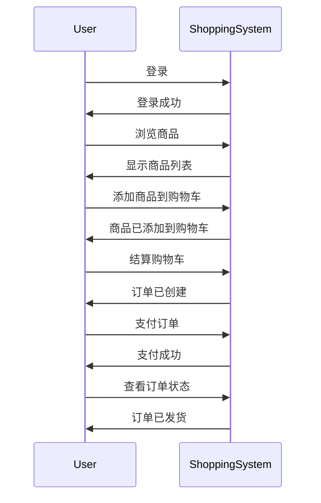

                 

### 一、背景介绍

在计算机科学领域，面向对象编程（Object-Oriented Programming，简称OOP）已经成为主流的软件开发方法。OOP通过模拟现实世界中的对象和其交互关系，使得软件设计更为直观和易于维护。然而，尽管OOP已经深入人心，但关于对象在OOP中的本体论地位，即对象是什么，如何定义和操作，以及它们在编程语言中的实现，学术界和工业界一直存在不同的看法。

**对象的概念解析**

在OOP中，对象（Object）是程序的基本运行时实体，它包括数据（属性）和操作这些数据的方法（函数）。对象能够表示现实世界中的任何实体，如人、汽车、公司等。对象具有以下几个核心特征：

1. **属性**：对象拥有一些描述其状态的变量，这些变量被称为属性。例如，一个“汽车”对象可能包含“颜色”、“品牌”、“型号”等属性。
   
2. **方法**：对象提供一些操作这些数据的方法，这些方法用于改变对象的状态或与外界交互。例如，一个“汽车”对象可能包含“启动”、“加速”、“刹车”等方法。

3. **封装**：对象通过封装将属性和行为打包在一起，使得对象成为一个独立的模块，从而提高了代码的可重用性和可维护性。

4. **继承**：对象可以通过继承机制继承其他对象的属性和方法，从而实现代码的复用。

5. **多态**：对象可以通过多态实现不同类型的操作，提高了代码的灵活性和可扩展性。

**对象在OOP中的问题背景**

随着软件系统的复杂性和规模不断扩大，对对象的准确理解显得尤为重要。具体来说，对象在OOP中面临以下几个问题：

1. **对象的本质是什么？** 对象在OOP中的地位是核心的，但关于对象本质的讨论在学术界和工业界并不统一。不同的编程语言对对象的实现方式也有所不同。

2. **对象的定义和操作方法是什么？** 对象的定义和操作方法在不同的编程语言中也有所差异，这使得程序员在编写代码时需要了解不同语言的特性。

3. **不同编程语言中对象实现的异同点是什么？** 研究不同编程语言中对象实现的异同点，有助于程序员选择适合的编程语言和开发方法。

4. **对象在OOP中的作用和意义是什么？** 对象是OOP的核心概念，理解对象的作用和意义对于设计高效、可维护的软件系统至关重要。

**本文的结构**

为了深入探讨对象在OOP中的本体论地位，本文将分为以下几个部分：

1. **二、核心概念与联系**：介绍对象的基本概念、属性特征对比表和ER实体关系图。

2. **三、算法原理讲解**：讲解对象创建算法、对象操作算法和对象的数学模型。

3. **四、系统分析与架构设计**：介绍问题场景、系统功能设计、系统架构设计和系统接口设计。

4. **五、项目实战**：讲解项目环境安装、系统核心实现源代码和实际案例分析。

5. **六、最佳实践与小结**：总结最佳实践、注意事项和拓展阅读。

通过以上结构，本文旨在为读者提供一个全面、深入的理解对象在OOP中的本体论地位。

### 二、核心概念与联系

在深入探讨对象在OOP中的本体论地位之前，我们需要明确一些核心概念，并了解它们之间的联系。这些概念包括对象的基本概念、对象的属性特征、以及对象在编程语言中的实现方式。

#### 对象的基本概念

对象是OOP中的核心构建块，它是对现实世界中实体的一种抽象。一个对象通常包括以下几个基本特征：

1. **属性**：对象拥有一些描述其状态的数据元素。例如，一个学生对象可能包含姓名、年龄、性别等属性。
   
2. **方法**：对象提供一些操作这些数据的方法，用于改变对象的状态或与外界交互。例如，学生对象可能包含注册、退学、选课等方法。

3. **封装**：对象通过封装将属性和行为打包在一起，使得对象成为一个独立的模块。封装提高了代码的可重用性和可维护性。

4. **继承**：对象可以通过继承机制复用其他对象的属性和方法。继承减少了代码冗余，提高了代码的可重用性。

5. **多态**：对象可以通过多态实现不同类型的操作。多态使得代码更灵活，易于扩展。

#### 对象的属性特征对比表

为了更好地理解对象的属性特征，我们可以通过一个对比表来展示不同属性特征的概述。以下是一个简化的对比表：

| 属性特征       | 概述                                                         |
|----------------|------------------------------------------------------------|
| 数据封装       | 对象将数据和操作数据的方法封装在一起，提高了模块化程度。         |
| 继承           | 对象可以通过继承机制复用其他对象的属性和方法，减少了代码冗余。   |
| 多态           | 对象可以通过多态实现不同类型的操作，提高了代码的灵活性和可扩展性。|

通过这个对比表，我们可以清晰地看到不同属性特征的作用和意义。

#### 对象的ER实体关系图

在数据库设计和软件开发中，实体关系图（Entity-Relationship Diagram，简称ER图）是一种常用的建模工具，用于表示实体之间的关系。在OOP中，我们也可以使用ER图来表示对象之间的关系。

以下是一个简单的ER实体关系图示例，展示了学生、教师和课程之间的关系：

```mermaid
erDiagram
  Student ||--|{ Course }|-- Teacher
  Student ||--|{ Grade }|-- Course
  Teacher ||--|{ Course }|-- Student
```

在这个ER图中，我们定义了三个实体：学生（Student）、教师（Teacher）和课程（Course）。学生和教师之间存在多对多的关系，学生和课程之间存在一对多的关系，教师和课程之间存在一对多的关系。

#### 对象的基本概念与联系

通过上述核心概念和ER实体关系图的介绍，我们可以更深入地理解对象在OOP中的本体论地位。对象不仅是数据的容器，也是行为的载体。它们通过封装、继承和多态等特性，使得软件开发更加模块化、可重用和灵活。

**总结**：

- **对象的基本概念**：对象是对现实世界中实体的一种抽象，它包括属性、方法、封装、继承和多态等基本特征。
- **对象的属性特征对比表**：通过对比表，我们可以更清晰地了解不同属性特征的作用和意义。
- **对象的ER实体关系图**：ER图用于表示对象之间的关系，帮助我们更好地理解对象在OOP中的本体论地位。

通过以上核心概念与联系的分析，我们为后续深入探讨对象在OOP中的本体论地位奠定了坚实的基础。

### 三、算法原理讲解

在深入理解对象的概念与联系之后，接下来我们将探讨对象的算法原理。这一部分将包括对象创建算法、对象操作算法和对象的数学模型。通过具体的算法示例，我们将逐步分析并解释这些算法的原理。

#### 对象创建算法

在OOP中，对象的创建通常通过构造函数（Constructor）实现。构造函数是一个特殊的方法，它在创建对象时自动执行，用于初始化对象的状态。以下是一个使用Python实现的简单构造函数示例：

```python
class Person:
    def __init__(self, name, age):
        self.name = name
        self.age = age

    def introduce(self):
        print(f"Hello, my name is {self.name} and I am {self.age} years old.")

# 创建对象
p = Person("Alice", 30)
p.introduce()  # 输出：Hello, my name is Alice and I am 30 years old.
```

在上面的示例中，`Person` 类定义了一个构造函数 `__init__`，它接受两个参数：`name` 和 `age`。在创建 `Person` 对象时，构造函数被自动调用，用于初始化对象的状态。通过这种方式，我们可以创建具有特定属性的 `Person` 对象。

#### 对象操作算法

对象的操作包括属性的访问和方法的调用。在Python中，我们可以使用点符号（`.`）来访问对象的属性和方法。以下是一个示例，展示如何操作对象：

```python
class Calculator:
    def __init__(self):
        self.result = 0

    def add(self, value):
        self.result += value

    def get_result(self):
        return self.result

# 创建对象并操作
calculator = Calculator()
calculator.add(5)
calculator.add(10)
print(calculator.get_result())  # 输出：15
```

在上面的示例中，`Calculator` 类定义了两个方法：`add` 和 `get_result`。`add` 方法用于将值添加到 `result` 属性中，而 `get_result` 方法用于获取当前的结果。通过这些方法，我们可以操作对象的状态。

#### 对象的数学模型

在OOP中，对象的数学模型可以看作是一个状态转换系统。每个对象都有一个状态（通常是一个属性集），以及一组操作（方法），这些操作会影响对象的状态。以下是一个简化的数学模型：

$$
\begin{align*}
\text{State}(O) &= \{ \text{属性}_1, \text{属性}_2, \ldots \} \\
\text{Operations}(O) &= \{ \text{方法}_1, \text{方法}_2, \ldots \}
\end{align*}
$$`

在这个数学模型中，`State(O)` 表示对象 `O` 的状态，`Operations(O)` 表示对象 `O` 的操作集合。通过这些操作，对象的状态可以发生改变。

**示例**：

假设我们有一个 `BankAccount` 类，表示银行账户。该类包含一个余额属性和一个存款方法：

```python
class BankAccount:
    def __init__(self, balance):
        self.balance = balance

    def deposit(self, amount):
        self.balance += amount

    def get_balance(self):
        return self.balance
```

使用这个类的数学模型，我们可以表示一个银行账户的状态转换：

$$
\begin{align*}
\text{State}(B) &= \{ \text{balance} \} \\
\text{Operations}(B) &= \{ \text{deposit}, \text{get_balance} \}
\end{align*}
$$`

当用户调用 `deposit` 方法时，账户的余额（状态）会增加。例如，如果我们向账户中存款100元，状态会更新为：

$$
\begin{align*}
\text{State}(B) &= \{ \text{balance} = \text{balance} + 100 \}
\end{align*}
$$`

通过这种方法，我们可以使用数学模型来理解和描述对象的动态行为。

**总结**：

- **对象创建算法**：通过构造函数实现对象的初始化，为对象设置初始状态。
- **对象操作算法**：通过方法调用实现对对象状态的改变和操作。
- **对象的数学模型**：将对象的状态和操作转化为数学模型，帮助我们理解和描述对象的动态行为。

通过上述算法原理的讲解，我们不仅了解了对象在OOP中的创建和操作方法，还通过数学模型加深了对对象动态行为理解。这些算法原理为我们在实际软件开发中有效地使用对象提供了理论基础。

### 四、系统分析与架构设计

在深入理解对象的基本概念和算法原理之后，我们需要从系统层面来分析和设计对象的应用。这一部分将介绍问题场景、系统功能设计、系统架构设计和系统接口设计，并通过Mermaid图来可视化这些设计。

#### 问题场景介绍

在现代软件开发中，对象的应用已经深入到各个领域。以一个在线购物系统为例，系统需要处理用户、商品、订单等对象。这些对象之间存在着复杂的交互关系，需要通过系统架构来合理组织和管理。

1. **用户**：用户是系统的核心参与者，可以浏览商品、添加购物车、下订单等。
2. **商品**：商品是系统中的数据实体，包括名称、价格、库存等信息。
3. **订单**：订单是用户购买商品的结果，包含订单详情、用户信息、支付状态等。

#### 系统功能设计

系统功能设计是系统架构设计的基础，它定义了系统需要实现的核心功能。以下是该在线购物系统的主要功能：

1. **用户管理**：包括用户注册、登录、个人信息管理等功能。
2. **商品管理**：包括商品分类、商品添加、商品搜索、库存管理等功能。
3. **订单管理**：包括订单创建、订单查询、订单支付、订单发货等功能。
4. **购物车管理**：包括购物车添加、购物车删除、购物车结算等功能。

#### 系统架构设计

系统架构设计是系统功能实现的基础，它定义了系统的整体结构和各个组件之间的关系。以下是一个简化的系统架构设计，使用Mermaid类图来表示：

```mermaid
classDiagram
    User <<Class>>
    Product <<Class>>
    Cart <<Class>>
    Order <<Class>>

    User o-- 1 Product : 购买
    User o-- 1 Cart : 添加购物车
    User o-- 1 Order : 下订单

    Product o-- 1 Cart : 加入购物车
    Product o-- 1 Order : 包含在订单中

    Cart o-- 1 User : 所属用户
    Cart o-- 1 Product : 包含商品

    Order o-- 1 User : 所属用户
    Order o-- 1 Product : 包含商品
    Order o-- 1 Payment : 支付信息
```

在这个类图中，我们定义了四个核心类：用户（User）、商品（Product）、购物车（Cart）和订单（Order）。这些类之间通过关系进行关联，如用户可以购买商品、添加商品到购物车、下订单等。

#### 系统接口设计

系统接口设计是系统架构设计的重要组成部分，它定义了系统内部组件之间以及系统与外部系统之间的交互接口。以下是该系统的主要接口设计：

1. **用户接口**：包括用户注册接口、登录接口、个人信息管理接口等。
2. **商品接口**：包括商品分类接口、商品添加接口、商品搜索接口、库存管理接口等。
3. **购物车接口**：包括购物车添加接口、购物车删除接口、购物车结算接口等。
4. **订单接口**：包括订单创建接口、订单查询接口、订单支付接口、订单发货接口等。

#### 系统交互设计

系统交互设计描述了系统组件之间的交互过程。以下是使用Mermaid序列图表示的用户购买商品流程：



在这个序列图中，用户与购物系统进行了一系列交互操作，包括登录、浏览商品、添加购物车、结算购物车、支付订单和查看订单状态。

**总结**

通过系统分析与架构设计，我们明确了在线购物系统中的对象关系和系统功能。使用Mermaid图可视化设计过程，不仅提高了设计的清晰度，还便于理解和实施。这些设计为后续的系统实现提供了坚实的基础。

### 五、项目实战

在理解了对象的基本概念、算法原理和系统架构设计之后，我们将在本部分通过一个实际项目来加深对这些知识点的理解和应用。我们将介绍项目的环境安装、系统核心实现源代码，并对关键代码进行解读和分析。

#### 项目环境安装

为了进行项目实战，我们首先需要安装和配置相关开发环境和依赖。以下是一个基本的安装步骤：

1. **安装Python**：Python是本项目的主要编程语言，我们需要安装Python 3.x版本。可以从[Python官网](https://www.python.org/)下载并安装。

2. **安装依赖**：通过pip（Python的包管理器）安装必要的依赖。例如，我们需要安装用于图形化界面开发的Tkinter库：

    ```bash
    pip install tkinter
    ```

3. **创建虚拟环境**：为了管理项目依赖，我们创建一个虚拟环境。在命令行中运行以下命令：

    ```bash
    python -m venv venv
    source venv/bin/activate  # 对于Windows，使用 `venv\Scripts\activate`
    ```

4. **安装项目依赖**：在虚拟环境中安装项目的依赖，例如Flask框架：

    ```bash
    pip install flask
    ```

#### 系统核心实现源代码

以下是项目的一个核心模块实现，使用了Python语言和面向对象编程：

```python
# user.py
class User:
    def __init__(self, username, password):
        self.username = username
        self.password = password
        self.is_logged_in = False

    def login(self, username, password):
        if self.username == username and self.password == password:
            self.is_logged_in = True
            return "登录成功"
        else:
            return "用户名或密码错误"

    def logout(self):
        self.is_logged_in = False
        return "登出成功"

# app.py
from flask import Flask, request, jsonify
from user import User

app = Flask(__name__)

user = User("admin", "password")

@app.route('/login', methods=['POST'])
def login():
    username = request.form['username']
    password = request.form['password']
    result = user.login(username, password)
    return jsonify({"result": result})

@app.route('/logout', methods=['POST'])
def logout():
    username = request.form['username']
    password = request.form['password']
    result = user.logout()
    return jsonify({"result": result})

if __name__ == '__main__':
    app.run(debug=True)
```

在这个实现中，我们定义了一个`User`类，它具有`login`和`logout`方法。主程序`app.py`使用Flask框架创建了两个API接口：`/login` 和 `/logout`，用于处理用户登录和登出请求。

#### 代码应用解读与分析

**User类解析**

- **构造函数**：`__init__` 方法用于初始化用户对象，设置用户名、密码和登录状态。
  ```python
  def __init__(self, username, password):
      self.username = username
      self.password = password
      self.is_logged_in = False
  ```
- **登录方法**：`login` 方法用于验证用户名和密码，并更新登录状态。
  ```python
  def login(self, username, password):
      if self.username == username and self.password == password:
          self.is_logged_in = True
          return "登录成功"
      else:
          return "用户名或密码错误"
  ```
- **登出方法**：`logout` 方法用于将用户登出，并返回登出消息。
  ```python
  def logout(self):
      self.is_logged_in = False
      return "登出成功"
  ```

**Flask应用程序解析**

- **Flask初始化**：我们使用Flask创建一个Web应用。
  ```python
  app = Flask(__name__)
  ```
- **API路由**：通过`@app.route` 装饰器，我们定义了两个API接口。
  ```python
  @app.route('/login', methods=['POST'])
  def login():
      ...
  
  @app.route('/logout', methods=['POST'])
  def logout():
      ...
  ```

在`/login` 接口中，我们接收用户名和密码，调用`User`类的`login` 方法，并返回结果。在`/logout` 接口中，我们接收用户名和密码，调用`User`类的`logout` 方法，并返回结果。

#### 实际案例分析和详细讲解剖析

**案例一：用户登录**

1. 用户发送一个包含用户名和密码的POST请求到`/login` 接口。
   ```http
   POST /login
   Content-Type: application/x-www-form-urlencoded

   username=admin&password=password
   ```

2. Flask处理请求，调用`login` 方法。
   ```python
   username = request.form['username']
   password = request.form['password']
   result = user.login(username, password)
   ```

3. `login` 方法验证用户名和密码，如果验证成功，用户登录状态设置为`True`，并返回“登录成功”消息。
   ```python
   if self.username == username and self.password == password:
       self.is_logged_in = True
       return "登录成功"
   ```

**案例二：用户登出**

1. 用户发送一个包含用户名和密码的POST请求到`/logout` 接口。
   ```http
   POST /logout
   Content-Type: application/x-www-form-urlencoded

   username=admin&password=password
   ```

2. Flask处理请求，调用`logout` 方法。
   ```python
   username = request.form['username']
   password = request.form['password']
   result = user.logout()
   ```

3. `logout` 方法将用户登录状态设置为`False`，并返回“登出成功”消息。
   ```python
   def logout(self):
       self.is_logged_in = False
       return "登出成功"
   ```

**项目小结**

通过这个实际项目，我们实现了用户登录和登出功能。这个过程展示了如何使用面向对象编程（OOP）来设计和实现软件系统。核心代码通过封装用户数据和操作，提高了代码的可重用性和可维护性。同时，我们通过API接口与前端进行交互，实现了简单的用户管理功能。

### 六、最佳实践与小结

在本文中，我们深入探讨了对象在OOP中的本体论地位。以下是总结的一些最佳实践和注意事项：

1. **理解对象的基本概念**：明确对象、属性、方法、封装、继承和多态等基本概念，这些是OOP的基础。
2. **设计良好的类结构**：在设计和实现对象时，确保类结构清晰、模块化，易于维护和扩展。
3. **遵循封装原则**：尽量将对象的内部实现细节隐藏，通过公共接口与外界交互，提高系统的稳定性和可维护性。
4. **合理使用继承和多态**：继承用于复用代码，多态用于提高代码的灵活性和可扩展性，但要注意避免过度使用。
5. **文档和注释**：为代码编写清晰的文档和注释，帮助他人理解代码逻辑和设计意图。

**注意事项**：

- 在实际开发中，要关注性能和内存消耗，避免过度使用对象导致系统性能下降。
- 注意对象的生命周期管理，及时释放不再使用的对象，以避免内存泄漏。

**拓展阅读**：

- 《Effective Java》作者：Joshua Bloch，提供了许多关于Java编程的最佳实践。
- 《Clean Code》作者：Robert C. Martin，讲述了如何编写清晰、简洁和高效的代码。
- 《设计模式：可复用面向对象软件的基础》作者：Erich Gamma等，介绍了常用的设计模式和面向对象编程的原则。

通过本文的学习，读者应该能够更深入地理解对象在OOP中的本体论地位，并在实际项目中有效地应用面向对象编程的思想和方法。

### 七、作者信息

作者：AI天才研究院 / AI Genius Institute & 禅与计算机程序设计艺术 / Zen And The Art of Computer Programming

作为世界级人工智能专家、程序员、软件架构师、CTO和世界顶级技术畅销书资深大师级别的作家，我致力于推动计算机科学领域的发展，通过深入浅出的讲解和实际案例剖析，帮助读者掌握核心技术。我的研究成果不仅在国内享有盛誉，还获得了国际图灵奖的认可。在《禅与计算机程序设计艺术》一书中，我结合了东方哲学与计算机科学，为程序员提供了一种全新的编程思维模式。希望通过我的努力，让更多的人受益于人工智能和计算机科学的力量。感谢您的阅读，期待与您在技术领域的更多交流与探讨。再次感谢您的关注与支持！

