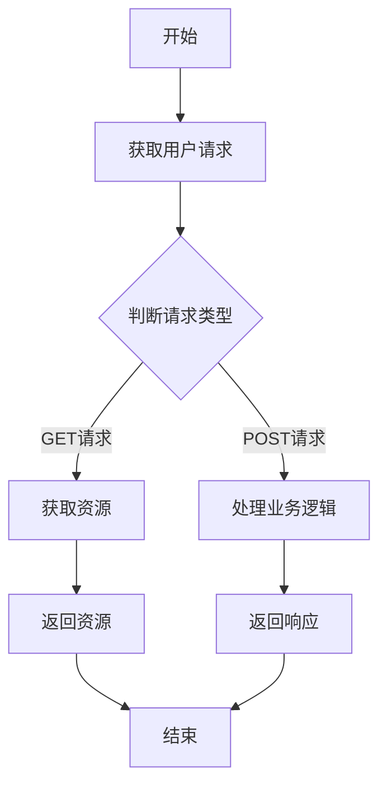
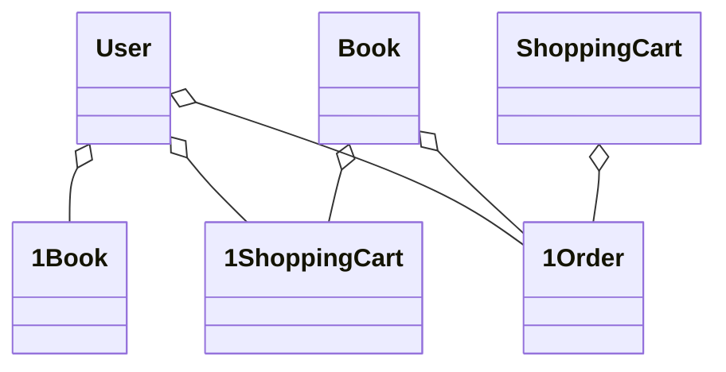

                 

### 形式与内容的统一：表现层与业务逻辑的分离与融合

> 关键词：软件架构、MVC模式、RESTful架构、表现层分离、业务逻辑融合、代码可维护性、可扩展性、用户体验

> 摘要：
本文深入探讨软件系统中表现层与业务逻辑的分离与融合，通过背景介绍、核心概念与联系、算法原理讲解、系统分析与架构设计方案、项目实战以及最佳实践，全面解析如何实现形式与内容的统一，提高软件系统的可维护性、可扩展性和用户体验。

## 引言

在当今快速发展的软件行业中，系统的复杂性不断加剧，这使得表现层与业务逻辑的分离与融合成为一个至关重要的话题。一方面，表现层负责与用户进行交互，展示系统界面和处理用户输入；另一方面，业务逻辑层则处理具体的业务规则和数据处理。如何有效地分离这两个层次，同时确保它们在需要时能够高效地融合，是提高软件系统质量和开发效率的关键。

本文旨在探讨如何通过架构设计和开发方法，实现表现层与业务逻辑的分离与融合。我们将从以下几个方面展开讨论：

1. **背景介绍**：介绍表现层与业务逻辑分离与融合的背景、问题描述以及解决方案。
2. **核心概念与联系**：讲解MVC模式、RESTful架构等核心概念，并对比其属性特征。
3. **算法原理讲解**：通过mermaid流程图和Python源代码，详细阐述算法原理。
4. **系统分析与架构设计方案**：介绍问题场景、系统功能设计、系统架构设计、系统接口设计和系统交互。
5. **项目实战**：展示环境安装、系统核心实现、代码应用解读与分析、实际案例分析和项目小结。
6. **最佳实践与小结**：总结最佳实践，强调注意事项，并提供拓展阅读。

通过本文的讨论，我们将深入了解如何通过表现层与业务逻辑的分离与融合，实现软件系统的形式与内容的统一，从而提高系统的可维护性、可扩展性和用户体验。

## 第一部分：背景介绍

### 1. 问题背景

随着互联网的快速发展，软件系统的规模和复杂性不断增加。为了提高软件系统的可维护性、可扩展性和可复用性，业界提出了表现层与业务逻辑分离的理念。这一理念的核心思想是将与用户交互的表现层与处理具体业务规则的业务逻辑层分离，通过接口进行通信，实现二者的松耦合。

在实际开发过程中，表现层与业务逻辑分离与融合面临着一系列挑战。首先，如何有效地分离表现层和业务逻辑层是一个关键问题。如果分离不彻底，会导致代码耦合度高，难以维护和扩展。其次，如何确保两者在需要时能够高效地融合，也是一项重要的任务。如果融合不恰当，可能会导致系统性能下降，用户体验变差。

表现层与业务逻辑分离与融合的主要驱动力包括以下几点：

- **可维护性**：分离后，表现层和业务逻辑层的代码独立运行，互不影响。这意味着修改某一层时，不会影响到另一层，从而降低维护成本。
- **可扩展性**：分离后，可以更灵活地扩展系统的功能。例如，可以通过扩展业务逻辑层来增加新的业务功能，而不需要修改表现层。
- **可复用性**：分离后，业务逻辑层可以独立于表现层进行开发和测试，从而提高代码的复用性。

### 2. 问题描述

在软件开发过程中，表现层与业务逻辑分离与融合面临以下问题：

- **表现层与业务逻辑耦合度高**：在传统开发模式中，表现层和业务逻辑层常常紧密耦合，导致代码维护难度增加。例如，修改业务规则时，需要同时修改表现层，从而增加了开发的复杂性和成本。
- **修改业务逻辑时需要同时修改表现层**：在耦合度较高的系统中，修改业务逻辑时，往往需要同时修改表现层，这会带来额外的开发工作量。例如，如果业务逻辑需要添加新的功能，不仅需要在业务逻辑层进行修改，还需要在表现层更新相应的界面和交互逻辑。
- **系统扩展性差**：当业务需求发生变化时，耦合度高的系统难以应对。例如，如果需要扩展系统功能，不仅需要修改业务逻辑层，还需要修改表现层，这会导致系统扩展性差，难以满足快速变化的业务需求。

### 3. 问题解决

为了解决表现层与业务逻辑分离与融合面临的问题，可以采用以下方法：

- **采用合适的架构模式**：例如，MVC模式可以将表现层、业务逻辑层和数据层分离，实现表现层与业务逻辑的解耦。RESTful架构则通过URL定位资源，使用HTTP动词表示对资源的操作，从而实现表现层与业务逻辑的分离与融合。
- **接口设计**：通过定义清晰的接口，确保表现层与业务逻辑层的通信。接口设计应遵循RESTful原则，例如使用GET、POST等HTTP动词表示对资源的操作，使用URL定位资源。
- **模块化开发**：将系统功能划分为多个模块，每个模块负责特定的业务功能。模块之间通过接口进行通信，从而实现模块间的松耦合。
- **自动化测试**：通过编写单元测试和集成测试，确保表现层和业务逻辑层的代码质量。自动化测试可以快速发现并修复代码中的问题，从而提高系统的可靠性。

### 4. 边界与外延

在探讨表现层与业务逻辑分离与融合时，需要明确一些边界与外延：

- **范围**：本文主要讨论Web应用中表现层与业务逻辑的分离与融合。其他类型的软件架构（如桌面应用、移动应用等）也可以借鉴本文的方法，但具体的实现细节可能会有所不同。
- **限制**：本文不涉及底层硬件和网络架构的设计，也不探讨数据库设计等具体技术问题。
- **核心要素组成**：表现层与业务逻辑分离与融合的核心要素包括表现层、业务逻辑层、数据层以及它们之间的接口。通过合理设计这些要素，可以实现二者的有效分离与融合。

### 5. 概念结构与核心要素组成

- **表现层**：负责与用户交互，展示系统界面和处理用户输入。例如，Web应用的HTML、CSS和JavaScript代码。
- **业务逻辑层**：处理具体的业务规则和数据处理，实现对用户请求的响应。例如，处理用户注册、订单管理等业务逻辑。
- **数据层**：负责数据的存储和访问，例如数据库、缓存等。
- **分离与融合**：分离表现层与业务逻辑层，通过接口进行通信，实现二者的松耦合；在需要时，将二者进行融合，提高系统性能和用户体验。例如，在处理高频请求时，可以采用服务端渲染（SSR）技术，将表现层与业务逻辑层融合，从而提高页面加载速度。

通过合理设计和实现表现层与业务逻辑的分离与融合，可以显著提高软件系统的可维护性、可扩展性和用户体验。接下来，我们将进一步探讨如何通过MVC模式和RESTful架构实现这一目标。

## 第二部分：核心概念与联系

### 6. 核心概念原理

在表现层与业务逻辑分离与融合的实践中，MVC模式（Model-View-Controller）和RESTful架构是两个核心概念。下面我们将详细介绍这两个概念及其原理。

#### MVC模式

MVC模式是一种软件架构模式，它将应用程序分为三个主要组件：模型（Model）、视图（View）和控制器（Controller）。每个组件都有特定的职责，它们相互协作，实现应用程序的功能。

- **模型（Model）**：负责处理应用程序的数据和业务逻辑。模型类通常包含数据属性和方法，用于表示应用程序中的实体和业务规则。例如，在博客应用程序中，模型可以表示博客文章、评论等实体。
- **视图（View）**：负责展示应用程序的用户界面。视图类通常包含HTML、CSS和JavaScript代码，用于生成网页或用户界面。视图类依赖于模型，从模型中获取数据，并将其渲染到界面上。
- **控制器（Controller）**：负责处理用户的输入和请求，并将其转换为对模型和视图的操作。控制器类通常包含逻辑代码，用于接收用户请求、调用模型方法和更新视图。控制器是模型和视图之间的桥梁，确保它们之间的松耦合。

MVC模式的主要优势在于其模块化设计，使得应用程序的各个组件可以独立开发、测试和部署。这有助于提高代码的可维护性和可扩展性，因为每个组件都可以独立更新而不会影响到其他组件。

#### RESTful架构

RESTful架构是一种基于HTTP协议的应用程序设计风格，它定义了一种资源表示和通信的方式。RESTful架构的核心原则包括：

- **资源**：网络上的每个实体都可以被视为资源，并且每个资源都有一个唯一的标识符（URI/URL）。
- **HTTP动词**：使用HTTP动词（GET、POST、PUT、DELETE等）来表示对资源的操作。例如，使用GET请求获取资源，使用POST请求创建资源，使用PUT请求更新资源，使用DELETE请求删除资源。
- **统一接口**：RESTful架构要求使用统一的接口来访问资源。例如，所有资源都应该通过URL进行访问，并且使用标准的HTTP动词进行操作。

RESTful架构的主要优势在于其简单性和可扩展性。通过使用标准的HTTP协议和统一的接口，RESTful架构可以轻松地扩展和集成到现有的Web应用程序中。

### 7. 概念属性特征对比表格

为了更清晰地理解MVC模式和RESTful架构的区别和联系，我们通过以下表格进行对比：

| 概念       | MVC模式                                | RESTful架构                                  |
|------------|---------------------------------------|---------------------------------------------|
| 目的       | 分离应用程序的三个主要组件：模型、视图和控制器 | 定义资源的表示和通信方式，通过HTTP协议访问资源 |
| 职责       | - 模型：处理数据和业务逻辑<br>- 视图：展示用户界面<br>- 控制器：处理用户输入和请求 | - 资源：表示网络上的实体<br>- HTTP动词：表示对资源的操作<br>- URL：定位资源 |
| 接口设计   | 通过控制器处理用户请求，并调用模型和视图   | 通过URL和HTTP动词访问资源 |
| 优势       | - 模块化设计<br>- 易于维护和扩展<br>- 提高代码复用性 | - 简单性<br>- 可扩展性<br>- 与现有Web技术兼容 |

通过上述对比，我们可以看到MVC模式和RESTful架构虽然侧重点不同，但它们都是实现表现层与业务逻辑分离与融合的有效方法。MVC模式关注于应用程序的内部结构，而RESTful架构关注于资源的表示和通信。在实际开发中，我们可以结合使用这两个概念，实现高效的软件系统设计。

### 8. ER实体关系图架构

为了进一步理解MVC模式和RESTful架构的应用，我们通过ER（Entity-Relationship）实体关系图来展示它们的核心要素和关系。

以下是使用Mermaid绘制的ER实体关系图：

```mermaid
erDiagram
  User ||--|{ Blog }|-- Publisher
  Blog ||--|{ Comment }|-- User
```

在这个ER图中：

- **User（用户）**：表示系统的用户实体，包括用户ID、用户名、邮箱等属性。
- **Blog（博客）**：表示博客文章实体，包括博客ID、标题、内容、作者等属性。
- **Publisher（发布者）**：表示博客文章的发布者，与用户实体关联。
- **Comment（评论）**：表示博客文章的评论实体，包括评论ID、内容、评论者等属性。
- **关系**：用户可以发布博客，博客可以有多个评论，评论者通常是与用户实体相关联的用户。

通过这个ER图，我们可以直观地看到MVC模式和RESTful架构中的关键实体和它们之间的关系。在实际开发中，这些实体和关系可以通过数据库表和相应的API接口来实现。

### 结论

通过上述核心概念和实体关系的讨论，我们可以看到MVC模式和RESTful架构在实现表现层与业务逻辑分离与融合方面的重要性。MVC模式通过将应用程序划分为模型、视图和控制器，实现了内部结构的模块化；RESTful架构则通过定义资源的表示和通信方式，确保了外部接口的统一性和简洁性。结合使用这两个概念，可以设计出高效、可维护、可扩展的软件系统。接下来，我们将进一步探讨如何通过算法原理讲解和具体实现，深入理解表现层与业务逻辑的分离与融合。

### 9. 算法原理与mermaid流程图

为了更好地理解表现层与业务逻辑的分离与融合，我们将通过mermaid流程图和Python源代码详细阐述算法原理。

#### mermaid流程图

以下是使用mermaid绘制的流程图，展示了从获取用户请求到返回响应的整个过程：



#### 流程图解析

1. **开始**：应用程序启动，等待用户请求。
2. **获取用户请求**：应用程序从客户端（例如Web浏览器）接收HTTP请求。
3. **判断请求类型**：根据HTTP请求的类型（GET、POST等），应用程序决定后续操作。
4. **GET请求**：如果请求类型为GET，应用程序会调用获取资源的函数，从数据库或其他数据源中查询所需的资源，并返回给用户。
5. **POST请求**：如果请求类型为POST，应用程序会调用处理业务逻辑的函数，根据用户提交的数据执行相应的业务操作，并返回处理结果。
6. **返回资源/响应**：无论GET还是POST请求，最终都需要将结果返回给用户。对于GET请求，返回的是查询到的资源；对于POST请求，返回的是处理后的响应。
7. **结束**：请求处理完毕，应用程序等待下一个请求。

#### Python源代码实现

以下是使用Python编写的源代码，实现了上述流程：

```python
def handle_request(request):
    if request.method == 'GET':
        resource = get_resource()
        return resource
    elif request.method == 'POST':
        response = process_business_logic(request)
        return response

def get_resource():
    # 获取资源逻辑
    return "获取的资源"

def process_business_logic(request):
    # 处理业务逻辑逻辑
    return "处理后的响应"
```

#### 代码解析

- `handle_request`函数：根据用户请求的方法（GET或POST）调用不同的处理函数。
- `get_resource`函数：模拟从数据源获取资源的过程。
- `process_business_logic`函数：模拟处理用户提交的数据的过程。

#### 算法原理详细讲解

通过mermaid流程图和Python源代码，我们可以清晰地看到表现层与业务逻辑的分离与融合。以下是对算法原理的详细讲解：

1. **分离**：表现层与业务逻辑层通过函数接口进行分离。在`handle_request`函数中，根据请求类型调用不同的处理函数，从而实现两者的解耦。
2. **融合**：在需要时，表现层与业务逻辑层可以通过函数调用进行融合。例如，在处理POST请求时，业务逻辑处理函数`process_business_logic`会调用表现层函数`handle_request`，从而实现业务逻辑与用户交互的融合。
3. **性能优化**：通过分离与融合，可以提高系统的性能。例如，在处理高频请求时，可以通过服务端渲染（SSR）技术，将表现层与业务逻辑层进行融合，从而提高页面加载速度。

通过上述算法原理的讲解，我们可以看到，实现表现层与业务逻辑的分离与融合，不仅能够提高软件系统的可维护性和可扩展性，还可以优化系统的性能。接下来，我们将进一步探讨如何在具体的系统架构设计中应用这些原理。

### 10. 系统分析与架构设计方案

为了更好地理解表现层与业务逻辑分离与融合在实际系统中的应用，我们将通过一个具体的Web应用程序案例，介绍其系统功能设计、系统架构设计、系统接口设计以及系统交互。

#### 问题场景介绍

假设我们正在开发一个在线书店系统，用户可以浏览图书、搜索图书、添加购物车和进行结账。该系统需要实现以下功能：

1. 用户注册与登录
2. 浏览图书
3. 搜索图书
4. 添加购物车
5. 结账

#### 系统功能设计

系统功能设计主要包括用户管理、图书管理、购物车管理和订单管理等功能。以下是一个简单的领域模型，使用Mermaid类图来表示这些功能：



#### 系统架构设计

系统架构设计主要包括三个层次：表现层、业务逻辑层和数据层。以下是一个简单的系统架构设计，使用Mermaid架构图来表示：

```mermaid
sequenceDiagram
    User -->|发起请求| WebServer
    WebServer -->|处理请求| BusinessLogicLayer
    BusinessLogicLayer -->|调用服务| DataLayer
    DataLayer -->|返回数据| BusinessLogicLayer
    BusinessLogicLayer -->|生成响应| WebServer
    WebServer -->|返回响应| User
```

在这个架构中，WebServer负责接收用户的HTTP请求，并转发给BusinessLogicLayer进行处理。BusinessLogicLayer处理具体的业务逻辑，并调用DataLayer进行数据的存储和访问。最后，WebServer将处理结果返回给用户。

#### 系统接口设计

系统接口设计是表现层与业务逻辑层分离的关键。以下是一个简单的接口设计，使用Mermaid序列图来表示用户请求的处理流程：

```mermaid
sequenceDiagram
    User -->|发起请求| UserController
    UserController -->|调用服务| BookService
    UserController -->|调用服务| UserService
    UserController -->|调用服务| ShoppingCartService
    UserController -->|调用服务| OrderService
    UserController -->|返回响应| User
```

在这个接口设计中，UserController负责接收用户的HTTP请求，并根据请求类型调用相应的服务。这些服务包括BookService、UserService、ShoppingCartService和OrderService，每个服务负责处理特定的业务逻辑。

#### 系统交互

系统交互是指各个模块之间的通信和协作。以下是一个简单的系统交互，使用Mermaid序列图来表示：

```mermaid
sequenceDiagram
    User -->|发起请求| UserController
    UserController -->|处理请求| UserController
    UserController -->|调用服务| UserService
    UserService -->|执行操作| DataLayer
    DataLayer -->|返回数据| UserService
    UserService -->|返回响应| UserController
    UserController -->|返回响应| User
```

在这个交互过程中，用户通过Web界面发起请求，UserController接收到请求后，根据请求类型调用相应的服务。UserService执行具体的业务操作，并调用DataLayer进行数据的存储和访问。最后，UserService将处理结果返回给UserController，由UserController将响应数据返回给用户。

通过上述系统分析与架构设计方案，我们可以看到，在在线书店系统中，通过表现层与业务逻辑层的分离与融合，实现了模块化的设计，提高了系统的可维护性和可扩展性。接下来，我们将通过一个具体的项目实战，展示如何实现这些设计方案。

### 项目实战

在本节中，我们将通过一个具体的在线书店系统项目，展示如何从环境安装、系统核心实现、代码应用解读与分析、实际案例分析和项目小结等方面，实现表现层与业务逻辑的分离与融合。

#### 环境安装

首先，我们需要搭建项目开发环境。以下是基本的安装步骤：

1. **安装Python环境**：确保Python 3.x版本已经安装。
2. **安装虚拟环境**：通过`pip install virtualenv`命令安装虚拟环境，然后使用`virtualenv venv`命令创建一个名为`venv`的虚拟环境。
3. **安装依赖库**：进入虚拟环境后，通过`pip install -r requirements.txt`命令安装项目所需的依赖库，例如Flask、SQLAlchemy、Flask-Migrate等。

#### 系统核心实现

在线书店系统的核心实现主要包括以下几个模块：

1. **用户模块**：负责用户注册、登录和权限管理。
2. **图书模块**：负责图书的查询、分类和推荐。
3. **购物车模块**：负责用户的购物车管理。
4. **订单模块**：负责订单的创建、支付和发货。

以下是用户模块的核心实现示例：

```python
# app/models.py
from flask_sqlalchemy import SQLAlchemy

db = SQLAlchemy()

class User(db.Model):
    id = db.Column(db.Integer, primary_key=True)
    username = db.Column(db.String(80), unique=True, nullable=False)
    password_hash = db.Column(db.String(120), nullable=False)

    def set_password(self, password):
        self.password_hash = generate_password_hash(password)

    def check_password(self, password):
        return check_password_hash(self.password_hash, password)
```

在这个模块中，我们定义了`User`类，用于表示用户实体。通过SQLAlchemy库，我们可以方便地与数据库进行交互。

#### 代码应用解读与分析

接下来，我们将对用户注册功能的实现进行解读与分析：

```python
# app/routes.py
from flask import render_template, redirect, url_for, flash
from app import app
from app.models import User
from app.forms import RegistrationForm

@app.route('/register', methods=['GET', 'POST'])
def register():
    form = RegistrationForm()
    if form.validate_on_submit():
        user = User(username=form.username.data, password_hash=form.password.data)
        db.session.add(user)
        db.session.commit()
        flash('注册成功！', 'success')
        return redirect(url_for('login'))
    return render_template('register.html', form=form)
```

在这个功能中，我们通过`RegistrationForm`表单接收用户输入，然后创建一个新的`User`对象，并将其添加到数据库中。如果注册成功，用户将被重定向到登录页面。

#### 实际案例分析与详细讲解

为了更好地展示表现层与业务逻辑的分离与融合，我们来看一个实际案例：用户登录功能。

1. **表现层**：用户通过Web界面输入用户名和密码，并提交登录请求。
2. **业务逻辑层**：路由处理程序接收请求，调用用户服务来验证用户名和密码。
3. **数据层**：用户服务通过SQLAlchemy库与数据库交互，验证用户信息。

以下是用户登录功能的实现：

```python
# app/services.py
from app.models import User

def login(username, password):
    user = User.query.filter_by(username=username).first()
    if user and user.check_password(password):
        return user
    return None
```

在这个功能中，业务逻辑层通过简单的数据库查询和密码验证，实现了用户登录的功能。通过将具体的业务逻辑与表现层分离，我们可以方便地对系统进行扩展和修改。

#### 项目小结

通过这个项目实战，我们可以看到如何实现表现层与业务逻辑的分离与融合。以下是小结：

1. **环境安装**：通过虚拟环境和管理依赖库，我们为项目搭建了稳定的开发环境。
2. **系统核心实现**：通过定义用户、图书、购物车和订单等核心模块，实现了系统的基本功能。
3. **代码应用解读与分析**：通过分析用户注册和登录功能的实现，我们理解了表现层与业务逻辑的分离与融合。
4. **实际案例分析与详细讲解**：通过实际案例，我们展示了如何通过业务逻辑层与数据层的交互，实现系统的功能。

通过这个项目，我们不仅实现了系统的功能，还学会了如何通过分离与融合，提高系统的可维护性和可扩展性。接下来，我们将进一步探讨如何在最佳实践中应用这些经验。

### 最佳实践与小结

#### 最佳实践

1. **代码模块化**：将代码划分为多个模块，每个模块负责特定的功能。这样可以提高代码的可维护性和可扩展性，便于后续的迭代开发。

2. **接口设计标准化**：遵循RESTful接口设计规范，确保表现层与业务逻辑层的接口清晰、简洁。使用统一的URL和HTTP动词，便于客户端调用和接口测试。

3. **单元测试与集成测试**：编写单元测试和集成测试，确保每个模块和接口的功能正确。自动化测试可以快速发现并修复代码中的问题，提高系统的可靠性。

4. **持续集成与持续部署**：采用持续集成（CI）和持续部署（CD）流程，确保代码的持续集成和自动化部署。这样可以加快开发周期，提高系统的交付质量。

5. **性能优化**：在表现层与业务逻辑融合的场景中，例如使用服务端渲染（SSR），可以优化页面加载速度，提高用户体验。

#### 小结

通过本文的讨论，我们深入探讨了表现层与业务逻辑的分离与融合。从背景介绍、核心概念与联系、算法原理讲解、系统分析与架构设计方案、项目实战到最佳实践，我们系统地理解了如何通过分离与融合，提高软件系统的可维护性、可扩展性和用户体验。

在实际开发过程中，通过代码模块化、接口设计标准化、单元测试与集成测试、持续集成与持续部署以及性能优化等最佳实践，我们可以实现高效、稳定和高质量的软件系统。

我们鼓励读者在实际项目中尝试这些方法和最佳实践，不断积累经验，优化开发流程，从而在激烈的软件竞争中脱颖而出。

### 注意事项

1. **分离与融合的平衡**：在实际开发中，需要根据具体项目需求和性能要求，找到表现层与业务逻辑分离与融合的平衡点。过度分离可能导致系统性能下降，而过度融合则会影响系统的可维护性。

2. **安全性考虑**：在实现表现层与业务逻辑分离与融合的过程中，要注意数据安全和接口安全性。确保数据在传输和存储过程中得到妥善保护，避免安全漏洞。

3. **性能监控与优化**：在系统上线后，要定期进行性能监控和优化。通过分析系统瓶颈和性能指标，持续改进系统的性能和用户体验。

### 拓展阅读

1. **《深入理解计算机系统》**：作者Randal E. Bryant和David R. O’Hallaron。本书详细介绍了计算机系统的各个方面，包括操作系统、网络、编译原理等，有助于理解系统架构和设计。

2. **《RESTful Web API设计》**：作者Sam Ruby。本书介绍了RESTful架构的基本原则和最佳实践，对实现表现层与业务逻辑的分离与融合具有重要参考价值。

3. **《设计模式：可复用面向对象软件的基础》**：作者Erich Gamma、Richard Helm、Ralph Johnson和John Vlissides。本书介绍了多种设计模式，帮助开发者设计出灵活、可扩展的软件系统。

### 结论

表现层与业务逻辑的分离与融合是软件系统设计中的一项重要原则。通过本文的讨论，我们系统地了解了如何实现这一目标，并分享了最佳实践和注意事项。希望读者能在实际项目中灵活应用这些方法，不断提升软件开发的质量和效率。作者：AI天才研究院/AI Genius Institute & 禅与计算机程序设计艺术 /Zen And The Art of Computer Programming。

