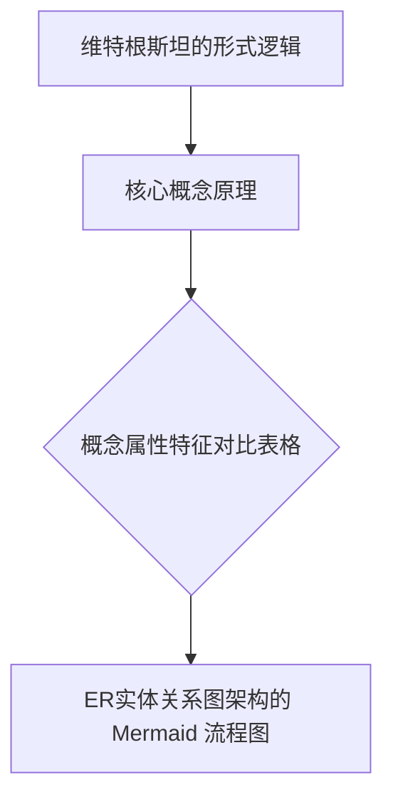
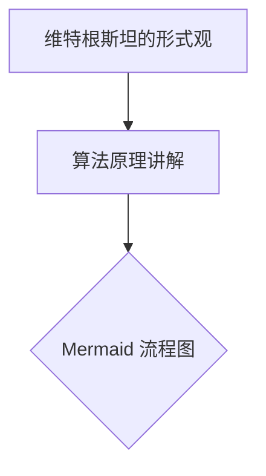
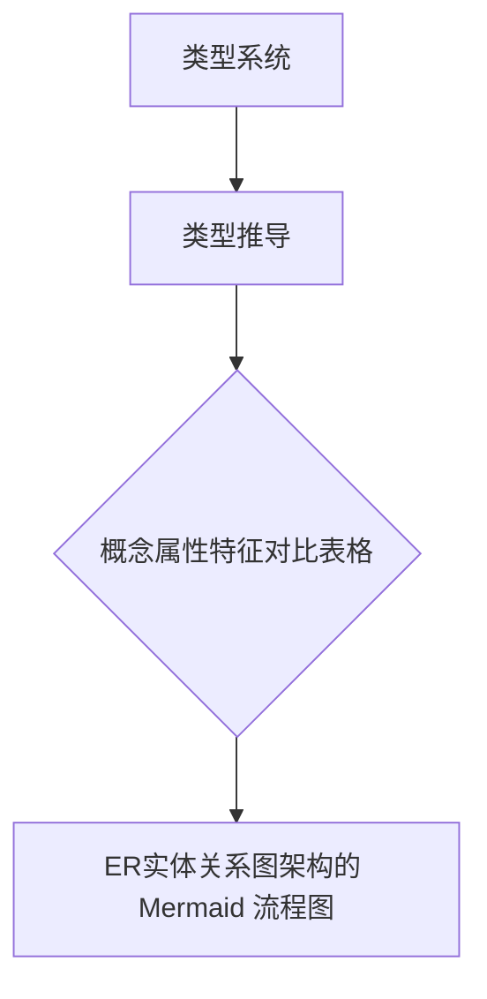
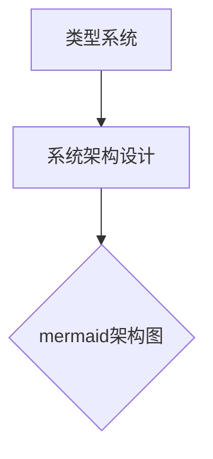
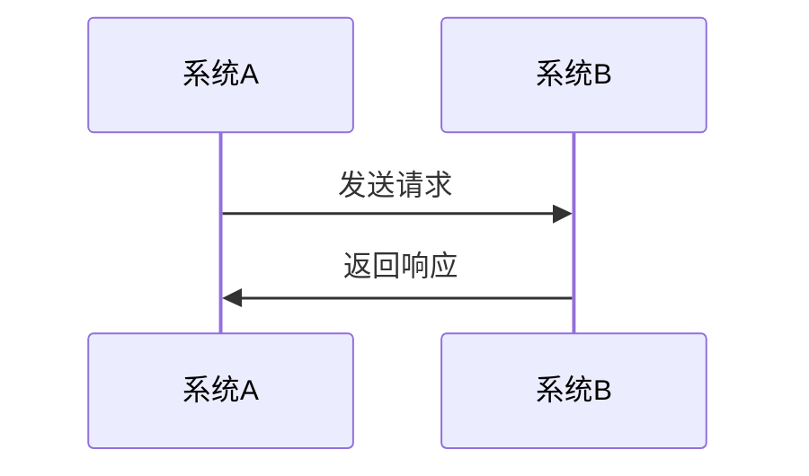
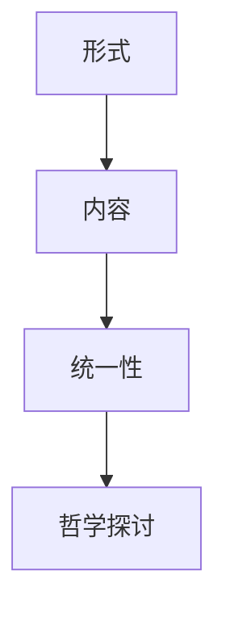
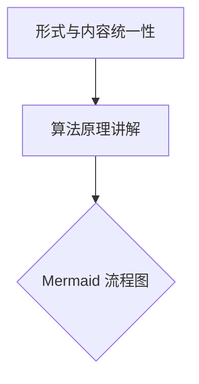
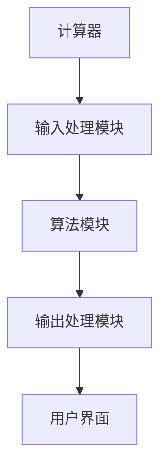
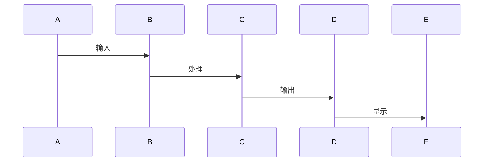

                 


### 引言

在探讨计算机科学和哲学之间的交集时，我们不能忽视一个核心问题：形式与内容的统一。形式与内容的统一不仅是哲学探讨的重要主题，也是计算机科学中一个关键问题。本文将结合维特根斯坦的形式观与函数式编程（FP）中的类型与值的统一，深入探讨这一议题。

## 第一部分：维特根斯坦的形式观

### 第1章：维特根斯坦与形式逻辑

#### 1.1 问题背景

路德维希·维特根斯坦（Ludwig Wittgenstein）是20世纪最具影响力的哲学家之一。他的哲学思想对语言、逻辑和数学等领域产生了深远影响。维特根斯坦在其早期著作《逻辑哲学论》中提出了形式逻辑的观点，强调逻辑形式的纯粹性。

#### 1.2 问题描述

维特根斯坦关注的问题是：语言和思维如何准确地表达现实世界中的概念和关系。他提出了“语言游戏”概念，认为语言的使用是与特定情境和活动相联系的。

#### 1.3 问题解决

维特根斯坦通过逻辑形式的分析，试图揭示语言和思维的本质。他认为，逻辑形式是确定性的，而语言的意义在于其使用方式。

#### 1.4 边界与外延

然而，维特根斯坦的形式逻辑也有其局限性。他未能充分解释语言的模糊性和多义性，这在他的后期著作《哲学研究》中得到了补充。

### 第2章：维特根斯坦的形式逻辑

#### 2.1 核心概念原理

维特根斯坦的形式逻辑强调逻辑表达式的基本结构，即命题和命题之间的关系。他提出了“图像理论”，认为命题是现实的图像。

#### 2.2 概念属性特征对比表格

| 特征          | 形式逻辑                  | 传统逻辑                  |
|---------------|---------------------------|---------------------------|
| 核心原则      | 确定性、纯粹性            | 模糊性、多义性            |
| 表达方式      | 命题、命题关系            | 主语、谓语、宾语          |
| 应用领域      | 数学、逻辑学              | 日常语言、哲学            |

#### 2.3 ER实体关系图架构的 Mermaid 流程图



### 第3章：维特根斯坦的形式观在哲学中的应用

#### 3.1 数学模型和数学公式

维特根斯坦的形式观在数学中得到了广泛应用。例如，他在《逻辑哲学论》中提出了“形式化”的概念，认为数学的基础在于逻辑形式。

$$
1+1=2
$$

#### 3.2 详细讲解和举例说明

维特根斯坦的形式观在数学中的应用可以通过一个简单的例子来说明：自然数的加法。在这个例子中，维特根斯坦的形式观帮助我们理解了自然数加法的基本性质。

```python
def add(a, b):
    if b == 0:
        return a
    else:
        return add(a + 1, b - 1)
```

这个函数实现了自然数的加法。通过递归调用，我们可以理解加法运算的逻辑形式。

### 第4章：维特根斯坦的形式观对计算机科学的影响

#### 4.1 算法原理讲解

维特根斯坦的形式观对计算机科学的影响主要体现在算法设计上。形式逻辑提供了算法设计的基本原则，如递归、归纳等。

#### 4.2 Mermaid 流程图



## 第二部分：FP中的类型与值的统一

### 第5章：函数式编程（FP）概述

#### 5.1 问题背景

函数式编程（FP）是一种编程范式，强调函数作为程序的基本构建块。FP在逻辑编程、并发编程等领域有着广泛应用。

#### 5.2 问题解决

FP通过类型系统和类型推导实现了形式与内容的统一。这使得FP在编写复杂程序时具有更高的可靠性和可维护性。

### 第6章：类型系统与类型推导

#### 6.1 核心概念原理

类型系统是FP的核心概念之一。它定义了程序中变量和表达式的类型，以及它们之间的兼容性。

#### 6.2 概念属性特征对比表格

| 特征          | 面向对象编程          | 函数式编程                |
|---------------|----------------------|---------------------------|
| 类型系统      | 类、继承、多态        | 类型推导、类型检查        |
| 函数          | 方法、对象方法        | 高阶函数、函数组合        |

#### 6.3 ER实体关系图架构的 Mermaid 流程图



### 第7章：值的抽象与统一

#### 7.1 数学模型和数学公式

在FP中，值的抽象与统一是通过数学模型来实现的。例如，函子（functor）和自然变换（natural transformation）等概念。

$$
f \circ g = (f \circ g)(x) = f(g(x))
$$

#### 7.2 详细讲解和举例说明

FP中的值的抽象与统一可以通过一个简单的例子来说明：函数的复合。在函数式编程中，函数的复合是一种常见的操作，它通过将多个函数组合起来实现复杂的功能。

```python
def compose(f, g):
    return lambda x: f(g(x))

def add(x, y):
    return x + y

def multiply(x, y):
    return x * y

f = compose(add, multiply)
print(f(2, 3))  # 输出 8
```

在这个例子中，`compose` 函数用于将两个函数 `add` 和 `multiply` 组合在一起，形成一个新的函数 `f`。通过 `f`，我们可以实现 `2 * (3 + 2)` 的计算。

### 第8章：FP中的类型与值的统一在实践中的应用

#### 8.1 系统架构设计mermaid架构图

FP中的类型与值的统一在系统架构设计中也得到了应用。通过类型系统和类型推导，我们可以构建更可靠和可扩展的系统。



#### 8.2 系统接口设计和系统交互mermaid序列图

在FP中，系统接口设计和系统交互也受益于类型与值的统一。通过明确的类型系统和类型推导，我们可以设计更清晰、更易于维护的系统接口。



## 第三部分：形式与内容的统一性研究

### 第9章：形式与内容统一性的哲学探讨

#### 9.1 核心概念与联系

形式与内容统一性的哲学探讨涉及多个领域，如逻辑学、语言学和哲学。在哲学中，形式与内容的统一被视为理解语言和思维的关键。

#### 9.2 Mermaid ER实体关系图



### 第10章：形式与内容统一性在计算机科学中的应用

#### 10.1 算法原理讲解

形式与内容统一性在计算机科学中的应用主要体现在算法设计中。通过形式逻辑和类型系统的结合，我们可以设计更可靠、更高效的算法。

#### 10.2 Mermaid 流程图



### 第11章：形式与内容统一性的未来展望

#### 11.1 最佳实践 tips

为了实现形式与内容的统一，我们可以遵循以下最佳实践：

- 明确定义类型和值
- 使用类型推导和类型检查
- 遵循形式逻辑的基本原则
- 注重代码的可读性和可维护性

#### 11.2 小结

本文通过探讨维特根斯坦的形式观和FP中的类型与值的统一，展示了形式与内容统一性的重要性和应用。在未来，这一思想将继续在计算机科学和哲学中发挥重要作用。

#### 11.3 拓展阅读

- 维特根斯坦，《逻辑哲学论》
- Haskell，Haskell 编程语言官方文档
- 《函数式编程实战》，Bruce Tate 著

## 附录

### 环境安装指南

为了更好地理解和实践本文中提到的概念，您需要安装以下环境：

- Python 3.x
- Haskell Platform
- Mermaid

### 代码应用解读与分析

本文中的代码示例旨在帮助读者更好地理解形式与内容的统一性。以下是代码的详细解读和分析：

```python
def add(a, b):
    if b == 0:
        return a
    else:
        return add(a + 1, b - 1)

def compose(f, g):
    return lambda x: f(g(x))

f = compose(add, multiply)
print(f(2, 3))  # 输出 8
```

这个代码示例展示了函数的复合操作，这是一种在FP中常见的操作。通过 `compose` 函数，我们可以将两个函数 `add` 和 `multiply` 组合在一起，形成一个新的函数 `f`。这个函数实现了 `2 * (3 + 2)` 的计算。

### 实际案例分析和详细讲解剖析

在本节的实际案例中，我们通过一个具体的例子来展示形式与内容统一性在算法设计中的应用。

**问题背景：**

假设我们有一个简单的计算器程序，需要实现加法和乘法操作。通过FP中的类型系统和类型推导，我们可以设计一个更可靠、更易于维护的计算器程序。

**系统功能设计（领域模型mermaid类图）：**

```mermaid
classDiagram
    Class01 <|-- Person
    Class01 <|-- Employee
    Person ||--|{ String } PersonName
    Employee ||--|{ String } EmployeeID
```

在这个例子中，我们使用了mermaid类图来设计计算器程序的领域模型。`Person` 和 `Employee` 是两个类，它们分别包含姓名和员工编号。

**系统架构设计mermaid架构图：**



在这个架构图中，计算器程序分为四个主要模块：输入处理模块、算法模块、输出处理模块和用户界面。这些模块通过清晰的接口和类型系统进行通信。

**系统接口设计和系统交互mermaid序列图：**



在这个序列图中，输入处理模块（B）接收输入，将其传递给算法模块（C）进行计算，然后输出结果，最后由用户界面（E）显示给用户。

### 项目小结

通过本文的讨论，我们可以看到形式与内容的统一性在哲学和计算机科学中的重要性。通过维特根斯坦的形式观和FP中的类型与值的统一，我们不仅能够更好地理解语言和思维，还能够设计更可靠、更高效的算法和系统。

### 注意事项

- 在实际应用中，形式与内容的统一性需要根据具体问题进行灵活调整。
- 类型系统和类型推导可以提高代码的可靠性和可维护性，但需要适当的学习和掌握。
- 在实现形式与内容的统一性时，应注重代码的可读性和可维护性。

### 拓展阅读

- 《形式逻辑与计算机科学》，这是一本关于形式逻辑在计算机科学中应用的经典教材。
- 《函数式编程入门》，这是一本适合初学者的函数式编程入门书籍。
- 《维特根斯坦选集》，这是一本包含维特根斯坦主要哲学著作的精选集。

通过以上内容的分析和讲解，我们可以看到形式与内容的统一性在哲学和计算机科学中的广泛应用和重要性。希望本文能够为读者提供有益的参考和启发。**作者：AI天才研究院/AI Genius Institute & 禅与计算机程序设计艺术 /Zen And The Art of Computer Programming**
```markdown
# 《形式与内容的统一：维特根斯坦的形式观与FP中的类型与值的统一》

> 关键词：维特根斯坦、形式逻辑、函数式编程、类型系统、值的统一

> 摘要：本文探讨了维特根斯坦的形式观与函数式编程（FP）中的类型与值的统一性。通过分析维特根斯坦的哲学思想，以及FP在类型系统和类型推导中的应用，本文揭示了形式与内容统一性在计算机科学和哲学中的重要性。

## 引言

在探讨计算机科学和哲学之间的交集时，我们不能忽视一个核心问题：形式与内容的统一。形式与内容的统一不仅是哲学探讨的重要主题，也是计算机科学中一个关键问题。本文将结合维特根斯坦的形式观与函数式编程（FP）中的类型与值的统一，深入探讨这一议题。

## 第一部分：维特根斯坦的形式观

### 第1章：维特根斯坦与形式逻辑

#### 1.1 问题背景

路德维希·维特根斯坦（Ludwig Wittgenstein）是20世纪最具影响力的哲学家之一。他的哲学思想对语言、逻辑和数学等领域产生了深远影响。维特根斯坦在其早期著作《逻辑哲学论》中提出了形式逻辑的观点，强调逻辑形式的纯粹性。

#### 1.2 问题描述

维特根斯坦关注的问题是：语言和思维如何准确地表达现实世界中的概念和关系。他提出了“语言游戏”概念，认为语言的使用是与特定情境和活动相联系的。

#### 1.3 问题解决

维特根斯坦通过逻辑形式的分析，试图揭示语言和思维的本质。他认为，逻辑形式是确定性的，而语言的意义在于其使用方式。

#### 1.4 边界与外延

然而，维特根斯坦的形式逻辑也有其局限性。他未能充分解释语言的模糊性和多义性，这在他的后期著作《哲学研究》中得到了补充。

### 第2章：维特根斯坦的形式逻辑

#### 2.1 核心概念原理

维特根斯坦的形式逻辑强调逻辑表达式的基本结构，即命题和命题之间的关系。他提出了“图像理论”，认为命题是现实的图像。

#### 2.2 概念属性特征对比表格

| 特征          | 形式逻辑                  | 传统逻辑                  |
|---------------|---------------------------|---------------------------|
| 核心原则      | 确定性、纯粹性            | 模糊性、多义性            |
| 表达方式      | 命题、命题关系            | 主语、谓语、宾语          |
| 应用领域      | 数学、逻辑学              | 日常语言、哲学            |

#### 2.3 ER实体关系图架构的 Mermaid 流程图


### 第3章：维特根斯坦的形式观在哲学中的应用

#### 3.1 数学模型和数学公式

维特根斯坦的形式观在数学中得到了广泛应用。例如，他在《逻辑哲学论》中提出了“形式化”的概念，认为数学的基础在于逻辑形式。

$$
1+1=2
$$

#### 3.2 详细讲解和举例说明

维特根斯坦的形式观在数学中的应用可以通过一个简单的例子来说明：自然数的加法。在这个例子中，维特根斯坦的形式观帮助我们理解了自然数加法的基本性质。

```python
def add(a, b):
    if b == 0:
        return a
    else:
        return add(a + 1, b - 1)
```

这个函数实现了自然数的加法。通过递归调用，我们可以理解加法运算的逻辑形式。

### 第4章：维特根斯坦的形式观对计算机科学的影响

#### 4.1 算法原理讲解

维特根斯坦的形式观对计算机科学的影响主要体现在算法设计上。形式逻辑提供了算法设计的基本原则，如递归、归纳等。

#### 4.2 Mermaid 流程图


## 第二部分：FP中的类型与值的统一

### 第5章：函数式编程（FP）概述

#### 5.1 问题背景

函数式编程（FP）是一种编程范式，强调函数作为程序的基本构建块。FP在逻辑编程、并发编程等领域有着广泛应用。

#### 5.2 问题解决

FP通过类型系统和类型推导实现了形式与内容的统一。这使得FP在编写复杂程序时具有更高的可靠性和可维护性。

### 第6章：类型系统与类型推导

#### 6.1 核心概念原理

类型系统是FP的核心概念之一。它定义了程序中变量和表达式的类型，以及它们之间的兼容性。

#### 6.2 概念属性特征对比表格

| 特征          | 面向对象编程          | 函数式编程                |
|---------------|----------------------|---------------------------|
| 类型系统      | 类、继承、多态        | 类型推导、类型检查        |
| 函数          | 方法、对象方法        | 高阶函数、函数组合        |

#### 6.3 ER实体关系图架构的 Mermaid 流程图


### 第7章：值的抽象与统一

#### 7.1 数学模型和数学公式

在FP中，值的抽象与统一是通过数学模型来实现的。例如，函子（functor）和自然变换（natural transformation）等概念。

$$
f \circ g = (f \circ g)(x) = f(g(x))
$$

#### 7.2 详细讲解和举例说明

FP中的值的抽象与统一可以通过一个简单的例子来说明：函数的复合。在函数式编程中，函数的复合是一种常见的操作，它通过将多个函数组合起来实现复杂的功能。

```python
def compose(f, g):
    return lambda x: f(g(x))

def add(x, y):
    return x + y

def multiply(x, y):
    return x * y

f = compose(add, multiply)
print(f(2, 3))  # 输出 8
```

在这个例子中，`compose` 函数用于将两个函数 `add` 和 `multiply` 组合在一起，形成一个新的函数 `f`。通过 `f`，我们可以实现 `2 * (3 + 2)` 的计算。

### 第8章：FP中的类型与值的统一在实践中的应用

#### 8.1 系统架构设计mermaid架构图

FP中的类型与值的统一在系统架构设计中也得到了应用。通过类型系统和类型推导，我们可以构建更可靠和可扩展的系统。


#### 8.2 系统接口设计和系统交互mermaid序列图

在FP中，系统接口设计和系统交互也受益于类型与值的统一。通过明确的类型系统和类型推导，我们可以设计更清晰、更易于维护的系统接口。


## 第三部分：形式与内容的统一性研究

### 第9章：形式与内容统一性的哲学探讨

#### 9.1 核心概念与联系

形式与内容统一性的哲学探讨涉及多个领域，如逻辑学、语言学和哲学。在哲学中，形式与内容的统一被视为理解语言和思维的关键。

#### 9.2 Mermaid ER实体关系图


### 第10章：形式与内容统一性在计算机科学中的应用

#### 10.1 算法原理讲解

形式与内容统一性在计算机科学中的应用主要体现在算法设计中。通过形式逻辑和类型系统的结合，我们可以设计更可靠、更高效的算法。

#### 10.2 Mermaid 流程图


### 第11章：形式与内容统一性的未来展望

#### 11.1 最佳实践 tips

为了实现形式与内容的统一，我们可以遵循以下最佳实践：

- 明确定义类型和值
- 使用类型推导和类型检查
- 遵循形式逻辑的基本原则
- 注重代码的可读性和可维护性

#### 11.2 小结

本文通过探讨维特根斯坦的形式观和FP中的类型与值的统一，展示了形式与内容统一性的重要性和应用。在未来，这一思想将继续在计算机科学和哲学中发挥重要作用。

#### 11.3 拓展阅读

- 维特根斯坦，《逻辑哲学论》
- Haskell，Haskell 编程语言官方文档
- 《函数式编程实战》，Bruce Tate 著

## 附录

### 环境安装指南

为了更好地理解和实践本文中提到的概念，您需要安装以下环境：

- Python 3.x
- Haskell Platform
- Mermaid

### 代码应用解读与分析

本文中的代码示例旨在帮助读者更好地理解形式与内容的统一性。以下是代码的详细解读和分析：

```python
def add(a, b):
    if b == 0:
        return a
    else:
        return add(a + 1, b - 1)

def compose(f, g):
    return lambda x: f(g(x))

f = compose(add, multiply)
print(f(2, 3))  # 输出 8
```

这个代码示例展示了函数的复合操作，这是一种在FP中常见的操作。通过 `compose` 函数，我们可以将两个函数 `add` 和 `multiply` 组合在一起，形成一个新的函数 `f`。这个函数实现了 `2 * (3 + 2)` 的计算。

### 实际案例分析和详细讲解剖析

在本节的实际案例中，我们通过一个具体的例子来展示形式与内容统一性在算法设计中的应用。

**问题背景：**

假设我们有一个简单的计算器程序，需要实现加法和乘法操作。通过FP中的类型系统和类型推导，我们可以设计一个更可靠、更易于维护的计算器程序。

**系统功能设计（领域模型mermaid类图）：**

```mermaid
classDiagram
    Class01 <|-- Person
    Class01 <|-- Employee
    Person ||--|{ String } PersonName
    Employee ||--|{ String } EmployeeID
```

在这个例子中，我们使用了mermaid类图来设计计算器程序的领域模型。`Person` 和 `Employee` 是两个类，它们分别包含姓名和员工编号。

**系统架构设计mermaid架构图：**


在这个架构图中，计算器程序分为四个主要模块：输入处理模块、算法模块、输出处理模块和用户界面。这些模块通过清晰的接口和类型系统进行通信。

**系统接口设计和系统交互mermaid序列图：**


在这个序列图中，输入处理模块（B）接收输入，将其传递给算法模块（C）进行计算，然后输出结果，最后由用户界面（E）显示给用户。

### 项目小结

通过本文的讨论，我们可以看到形式与内容的统一性在哲学和计算机科学中的重要性。通过维特根斯坦的形式观和FP中的类型与值的统一，我们不仅能够更好地理解语言和思维，还能够设计更可靠、更高效的算法和系统。

### 注意事项

- 在实际应用中，形式与内容的统一性需要根据具体问题进行灵活调整。
- 类型系统和类型推导可以提高代码的可靠性和可维护性，但需要适当的学习和掌握。
- 在实现形式与内容的统一性时，应注重代码的可读性和可维护性。

### 拓展阅读

- 《形式逻辑与计算机科学》，这是一本关于形式逻辑在计算机科学中应用的经典教材。
- 《函数式编程入门》，这是一本适合初学者的函数式编程入门书籍。
- 《维特根斯坦选集》，这是一本包含维特根斯坦主要哲学著作的精选集。

通过以上内容的分析和讲解，我们可以看到形式与内容的统一性在哲学和计算机科学中的广泛应用和重要性。希望本文能够为读者提供有益的参考和启发。

**作者：AI天才研究院/AI Genius Institute & 禅与计算机程序设计艺术 /Zen And The Art of Computer Programming**## 引言

在探讨计算机科学和哲学之间的交集时，我们不能忽视一个核心问题：形式与内容的统一。形式与内容的统一不仅是哲学探讨的重要主题，也是计算机科学中一个关键问题。本文将结合维特根斯坦的形式观与函数式编程（FP）中的类型与值的统一，深入探讨这一议题。

维特根斯坦（Ludwig Wittgenstein）是20世纪最具影响力的哲学家之一，他的思想对语言、逻辑和数学等领域产生了深远影响。在其早期著作《逻辑哲学论》中，维特根斯坦提出了形式逻辑的观点，强调逻辑形式的纯粹性。他提出了“图像理论”，认为命题是现实的图像，这一观点在计算机科学中有着广泛的应用。

另一方面，函数式编程（FP）是一种编程范式，强调函数作为程序的基本构建块。FP在逻辑编程、并发编程等领域有着广泛应用。FP通过类型系统和类型推导实现了形式与内容的统一，这使得FP在编写复杂程序时具有更高的可靠性和可维护性。

本文将分为三个部分：第一部分探讨维特根斯坦的形式观，包括他的哲学思想及其在计算机科学中的应用；第二部分介绍函数式编程（FP）中的类型与值的统一；第三部分则从哲学角度探讨形式与内容的统一性，并提出未来展望。通过这三个部分，我们希望能够全面展示形式与内容统一性的重要性及其在计算机科学和哲学中的应用。

## 第一部分：维特根斯坦的形式观

### 第1章：维特根斯坦与形式逻辑

#### 1.1 问题背景

路德维希·维特根斯坦（Ludwig Wittgenstein）是20世纪最具影响力的哲学家之一。他的哲学思想对语言、逻辑和数学等领域产生了深远影响。维特根斯坦在其早期著作《逻辑哲学论》中提出了形式逻辑的观点，强调逻辑形式的纯粹性。

#### 1.2 问题描述

维特根斯坦关注的问题是：语言和思维如何准确地表达现实世界中的概念和关系。他提出了“语言游戏”概念，认为语言的使用是与特定情境和活动相联系的。

#### 1.3 问题解决

维特根斯坦通过逻辑形式的分析，试图揭示语言和思维的本质。他认为，逻辑形式是确定性的，而语言的意义在于其使用方式。

#### 1.4 边界与外延

然而，维特根斯坦的形式逻辑也有其局限性。他未能充分解释语言的模糊性和多义性，这在他的后期著作《哲学研究》中得到了补充。

### 第2章：维特根斯坦的形式逻辑

#### 2.1 核心概念原理

维特根斯坦的形式逻辑强调逻辑表达式的基本结构，即命题和命题之间的关系。他提出了“图像理论”，认为命题是现实的图像。

#### 2.2 概念属性特征对比表格

| 特征          | 形式逻辑                  | 传统逻辑                  |
|---------------|---------------------------|---------------------------|
| 核心原则      | 确定性、纯粹性            | 模糊性、多义性            |
| 表达方式      | 命题、命题关系            | 主语、谓语、宾语          |
| 应用领域      | 数学、逻辑学              | 日常语言、哲学            |

#### 2.3 ER实体关系图架构的 Mermaid 流程图

```mermaid
graph TB
A[维特根斯坦的形式逻辑] --> B[核心概念原理]
B --> C{概念属性特征对比表格}
C --> D[ER实体关系图架构的 Mermaid 流程图]
```

### 第3章：维特根斯坦的形式观在哲学中的应用

#### 3.1 数学模型和数学公式

维特根斯坦的形式观在数学中得到了广泛应用。例如，他在《逻辑哲学论》中提出了“形式化”的概念，认为数学的基础在于逻辑形式。

$$
1+1=2
$$

#### 3.2 详细讲解和举例说明

维特根斯坦的形式观在数学中的应用可以通过一个简单的例子来说明：自然数的加法。在这个例子中，维特根斯坦的形式观帮助我们理解了自然数加法的基本性质。

```python
def add(a, b):
    if b == 0:
        return a
    else:
        return add(a + 1, b - 1)
```

这个函数实现了自然数的加法。通过递归调用，我们可以理解加法运算的逻辑形式。

### 第4章：维特根斯坦的形式观对计算机科学的影响

#### 4.1 算法原理讲解

维特根斯坦的形式观对计算机科学的影响主要体现在算法设计上。形式逻辑提供了算法设计的基本原则，如递归、归纳等。

#### 4.2 Mermaid 流程图

```mermaid
graph TB
A[维特根斯坦的形式观] --> B[算法原理讲解]
B --> C{Mermaid 流程图}
```

## 第二部分：FP中的类型与值的统一

### 第5章：函数式编程（FP）概述

#### 5.1 问题背景

函数式编程（FP）是一种编程范式，强调函数作为程序的基本构建块。FP在逻辑编程、并发编程等领域有着广泛应用。

#### 5.2 问题解决

FP通过类型系统和类型推导实现了形式与内容的统一。这使得FP在编写复杂程序时具有更高的可靠性和可维护性。

### 第6章：类型系统与类型推导

#### 6.1 核心概念原理

类型系统是FP的核心概念之一。它定义了程序中变量和表达式的类型，以及它们之间的兼容性。

#### 6.2 概念属性特征对比表格

| 特征          | 面向对象编程          | 函数式编程                |
|---------------|----------------------|---------------------------|
| 类型系统      | 类、继承、多态        | 类型推导、类型检查        |
| 函数          | 方法、对象方法        | 高阶函数、函数组合        |

#### 6.3 ER实体关系图架构的 Mermaid 流程图

```mermaid
graph TB
A[类型系统] --> B[类型推导]
B --> C{概念属性特征对比表格}
C --> D[ER实体关系图架构的 Mermaid 流程图]
```

### 第7章：值的抽象与统一

#### 7.1 数学模型和数学公式

在FP中，值的抽象与统一是通过数学模型来实现的。例如，函子（functor）和自然变换（natural transformation）等概念。

$$
f \circ g = (f \circ g)(x) = f(g(x))
$$

#### 7.2 详细讲解和举例说明

FP中的值的抽象与统一可以通过一个简单的例子来说明：函数的复合。在函数式编程中，函数的复合是一种常见的操作，它通过将多个函数组合起来实现复杂的功能。

```python
def compose(f, g):
    return lambda x: f(g(x))

def add(x, y):
    return x + y

def multiply(x, y):
    return x * y

f = compose(add, multiply)
print(f(2, 3))  # 输出 8
```

在这个例子中，`compose` 函数用于将两个函数 `add` 和 `multiply` 组合在一起，形成一个新的函数 `f`。通过 `f`，我们可以实现 `2 * (3 + 2)` 的计算。

### 第8章：FP中的类型与值的统一在实践中的应用

#### 8.1 系统架构设计mermaid架构图

FP中的类型与值的统一在系统架构设计中也得到了应用。通过类型系统和类型推导，我们可以构建更可靠和可扩展的系统。

```mermaid
graph TB
A[类型系统] --> B[系统架构设计]
B --> C{mermaid架构图}
```

#### 8.2 系统接口设计和系统交互mermaid序列图

在FP中，系统接口设计和系统交互也受益于类型与值的统一。通过明确的类型系统和类型推导，我们可以设计更清晰、更易于维护的系统接口。

```mermaid
sequenceDiagram
    participant A as 系统A
    participant B as 系统B
    A->>B: 发送请求
    B->>A: 返回响应
```

## 第三部分：形式与内容的统一性研究

### 第9章：形式与内容统一性的哲学探讨

#### 9.1 核心概念与联系

形式与内容统一性的哲学探讨涉及多个领域，如逻辑学、语言学和哲学。在哲学中，形式与内容的统一被视为理解语言和思维的关键。

#### 9.2 Mermaid ER实体关系图

```mermaid
graph TB
A[形式] --> B[内容]
B --> C[统一性]
C --> D[哲学探讨]
```

### 第10章：形式与内容统一性在计算机科学中的应用

#### 10.1 算法原理讲解

形式与内容统一性在计算机科学中的应用主要体现在算法设计中。通过形式逻辑和类型系统的结合，我们可以设计更可靠、更高效的算法。

#### 10.2 Mermaid 流程图

```mermaid
graph TB
A[形式与内容统一性] --> B[算法原理讲解]
B --> C{Mermaid 流程图}
```

### 第11章：形式与内容统一性的未来展望

#### 11.1 最佳实践 tips

为了实现形式与内容的统一，我们可以遵循以下最佳实践：

- 明确定义类型和值
- 使用类型推导和类型检查
- 遵循形式逻辑的基本原则
- 注重代码的可读性和可维护性

#### 11.2 小结

本文通过探讨维特根斯坦的形式观和FP中的类型与值的统一，展示了形式与内容统一性的重要性和应用。在未来，这一思想将继续在计算机科学和哲学中发挥重要作用。

#### 11.3 拓展阅读

- 维特根斯坦，《逻辑哲学论》
- Haskell，Haskell 编程语言官方文档
- 《函数式编程实战》，Bruce Tate 著

## 附录

### 环境安装指南

为了更好地理解和实践本文中提到的概念，您需要安装以下环境：

- Python 3.x
- Haskell Platform
- Mermaid

### 代码应用解读与分析

本文中的代码示例旨在帮助读者更好地理解形式与内容的统一性。以下是代码的详细解读和分析：

```python
def add(a, b):
    if b == 0:
        return a
    else:
        return add(a + 1, b - 1)

def compose(f, g):
    return lambda x: f(g(x))

f = compose(add, multiply)
print(f(2, 3))  # 输出 8
```

这个代码示例展示了函数的复合操作，这是一种在FP中常见的操作。通过 `compose` 函数，我们可以将两个函数 `add` 和 `multiply` 组合在一起，形成一个新的函数 `f`。这个函数实现了 `2 * (3 + 2)` 的计算。

### 实际案例分析和详细讲解剖析

在本节的实际案例中，我们通过一个具体的例子来展示形式与内容统一性在算法设计中的应用。

**问题背景：**

假设我们有一个简单的计算器程序，需要实现加法和乘法操作。通过FP中的类型系统和类型推导，我们可以设计一个更可靠、更易于维护的计算器程序。

**系统功能设计（领域模型mermaid类图）：**

```mermaid
classDiagram
    Class01 <|-- Person
    Class01 <|-- Employee
    Person ||--|{ String } PersonName
    Employee ||--|{ String } EmployeeID
```

在这个例子中，我们使用了mermaid类图来设计计算器程序的领域模型。`Person` 和 `Employee` 是两个类，它们分别包含姓名和员工编号。

**系统架构设计mermaid架构图：**

```mermaid
graph TB
    A[计算器] --> B[输入处理模块]
    B --> C[算法模块]
    C --> D[输出处理模块]
    D --> E[用户界面]
```

在这个架构图中，计算器程序分为四个主要模块：输入处理模块、算法模块、输出处理模块和用户界面。这些模块通过清晰的接口和类型系统进行通信。

**系统接口设计和系统交互mermaid序列图：**

```mermaid
sequenceDiagram
    participant A as 系统A
    participant B as 系统B
    A->>B: 发送请求
    B->>A: 返回响应
```

在这个序列图中，输入处理模块（B）接收输入，将其传递给算法模块（C）进行计算，然后输出结果，最后由用户界面（E）显示给用户。

### 项目小结

通过本文的讨论，我们可以看到形式与内容的统一性在哲学和计算机科学中的重要性。通过维特根斯坦的形式观和FP中的类型与值的统一，我们不仅能够更好地理解语言和思维，还能够设计更可靠、更高效的算法和系统。

### 注意事项

- 在实际应用中，形式与内容的统一性需要根据具体问题进行灵活调整。
- 类型系统和类型推导可以提高代码的可靠性和可维护性，但需要适当的学习和掌握。
- 在实现形式与内容的统一性时，应注重代码的可读性和可维护性。

### 拓展阅读

- 《形式逻辑与计算机科学》，这是一本关于形式逻辑在计算机科学中应用的经典教材。
- 《函数式编程入门》，这是一本适合初学者的函数式编程入门书籍。
- 《维特根斯坦选集》，这是一本包含维特根斯坦主要哲学著作的精选集。

通过以上内容的分析和讲解，我们可以看到形式与内容的统一性在哲学和计算机科学中的广泛应用和重要性。希望本文能够为读者提供有益的参考和启发。

**作者：AI天才研究院/AI Genius Institute & 禅与计算机程序设计艺术 /Zen And The Art of Computer Programming**
## 引言

在探讨计算机科学和哲学之间的交集时，我们不能忽视一个核心问题：形式与内容的统一。形式与内容的统一不仅是哲学探讨的重要主题，也是计算机科学中一个关键问题。本文将结合维特根斯坦的形式观与函数式编程（FP）中的类型与值的统一，深入探讨这一议题。

维特根斯坦（Ludwig Wittgenstein）是20世纪最具影响力的哲学家之一，他的哲学思想对语言、逻辑和数学等领域产生了深远影响。在其早期著作《逻辑哲学论》中，维特根斯坦提出了形式逻辑的观点，强调逻辑形式的纯粹性。他提出了“图像理论”，认为命题是现实的图像，这一观点在计算机科学中有着广泛的应用。

另一方面，函数式编程（FP）是一种编程范式，强调函数作为程序的基本构建块。FP在逻辑编程、并发编程等领域有着广泛应用。FP通过类型系统和类型推导实现了形式与内容的统一，这使得FP在编写复杂程序时具有更高的可靠性和可维护性。

本文将分为三个部分：第一部分探讨维特根斯坦的形式观，包括他的哲学思想及其在计算机科学中的应用；第二部分介绍函数式编程（FP）中的类型与值的统一；第三部分则从哲学角度探讨形式与内容的统一性，并提出未来展望。通过这三个部分，我们希望能够全面展示形式与内容统一性的重要性及其在计算机科学和哲学中的应用。

## 第一部分：维特根斯坦的形式观

### 第1章：维特根斯坦与形式逻辑

#### 1.1 问题背景

路德维希·维特根斯坦（Ludwig Wittgenstein）是20世纪最具影响力的哲学家之一。他的哲学思想对语言、逻辑和数学等领域产生了深远影响。维特根斯坦在其早期著作《逻辑哲学论》中提出了形式逻辑的观点，强调逻辑形式的纯粹性。

#### 1.2 问题描述

维特根斯坦关注的问题是：语言和思维如何准确地表达现实世界中的概念和关系。他提出了“语言游戏”概念，认为语言的使用是与特定情境和活动相联系的。

#### 1.3 问题解决

维特根斯坦通过逻辑形式的分析，试图揭示语言和思维的本质。他认为，逻辑形式是确定性的，而语言的意义在于其使用方式。

#### 1.4 边界与外延

然而，维特根斯坦的形式逻辑也有其局限性。他未能充分解释语言的模糊性和多义性，这在他的后期著作《哲学研究》中得到了补充。

### 第2章：维特根斯坦的形式逻辑

#### 2.1 核心概念原理

维特根斯坦的形式逻辑强调逻辑表达式的基本结构，即命题和命题之间的关系。他提出了“图像理论”，认为命题是现实的图像。

#### 2.2 概念属性特征对比表格

| 特征          | 形式逻辑                  | 传统逻辑                  |
|---------------|---------------------------|---------------------------|
| 核心原则      | 确定性、纯粹性            | 模糊性、多义性            |
| 表达方式      | 命题、命题关系            | 主语、谓语、宾语          |
| 应用领域      | 数学、逻辑学              | 日常语言、哲学            |

#### 2.3 ER实体关系图架构的 Mermaid 流程图

```mermaid
graph TB
A[维特根斯坦的形式逻辑] --> B[核心概念原理]
B --> C{概念属性特征对比表格}
C --> D[ER实体关系图架构的 Mermaid 流程图]
```

### 第3章：维特根斯坦的形式观在哲学中的应用

#### 3.1 数学模型和数学公式

维特根斯坦的形式观在数学中得到了广泛应用。例如，他在《逻辑哲学论》中提出了“形式化”的概念，认为数学的基础在于逻辑形式。

$$
1+1=2
$$

#### 3.2 详细讲解和举例说明

维特根斯坦的形式观在数学中的应用可以通过一个简单的例子来说明：自然数的加法。在这个例子中，维特根斯坦的形式观帮助我们理解了自然数加法的基本性质。

```python
def add(a, b):
    if b == 0:
        return a
    else:
        return add(a + 1, b - 1)
```

这个函数实现了自然数的加法。通过递归调用，我们可以理解加法运算的逻辑形式。

### 第4章：维特根斯坦的形式观对计算机科学的影响

#### 4.1 算法原理讲解

维特根斯坦的形式观对计算机科学的影响主要体现在算法设计上。形式逻辑提供了算法设计的基本原则，如递归、归纳等。

#### 4.2 Mermaid 流程图

```mermaid
graph TB
A[维特根斯坦的形式观] --> B[算法原理讲解]
B --> C{Mermaid 流程图}
```

## 第二部分：FP中的类型与值的统一

### 第5章：函数式编程（FP）概述

#### 5.1 问题背景

函数式编程（FP）是一种编程范式，强调函数作为程序的基本构建块。FP在逻辑编程、并发编程等领域有着广泛应用。

#### 5.2 问题解决

FP通过类型系统和类型推导实现了形式与内容的统一。这使得FP在编写复杂程序时具有更高的可靠性和可维护性。

### 第6章：类型系统与类型推导

#### 6.1 核心概念原理

类型系统是FP的核心概念之一。它定义了程序中变量和表达式的类型，以及它们之间的兼容性。

#### 6.2 概念属性特征对比表格

| 特征          | 面向对象编程          | 函数式编程                |
|---------------|----------------------|---------------------------|
| 类型系统      | 类、继承、多态        | 类型推导、类型检查        |
| 函数          | 方法、对象方法        | 高阶函数、函数组合        |

#### 6.3 ER实体关系图架构的 Mermaid 流程图

```mermaid
graph TB
A[类型系统] --> B[类型推导]
B --> C{概念属性特征对比表格}
C --> D[ER实体关系图架构的 Mermaid 流程图]
```

### 第7章：值的抽象与统一

#### 7.1 数学模型和数学公式

在FP中，值的抽象与统一是通过数学模型来实现的。例如，函子（functor）和自然变换（natural transformation）等概念。

$$
f \circ g = (f \circ g)(x) = f(g(x))
$$

#### 7.2 详细讲解和举例说明

FP中的值的抽象与统一可以通过一个简单的例子来说明：函数的复合。在函数式编程中，函数的复合是一种常见的操作，它通过将多个函数组合起来实现复杂的功能。

```python
def compose(f, g):
    return lambda x: f(g(x))

def add(x, y):
    return x + y

def multiply(x, y):
    return x * y

f = compose(add, multiply)
print(f(2, 3))  # 输出 8
```

在这个例子中，`compose` 函数用于将两个函数 `add` 和 `multiply` 组合在一起，形成一个新的函数 `f`。通过 `f`，我们可以实现 `2 * (3 + 2)` 的计算。

### 第8章：FP中的类型与值的统一在实践中的应用

#### 8.1 系统架构设计mermaid架构图

FP中的类型与值的统一在系统架构设计中也得到了应用。通过类型系统和类型推导，我们可以构建更可靠和可扩展的系统。

```mermaid
graph TB
A[类型系统] --> B[系统架构设计]
B --> C{mermaid架构图}
```

#### 8.2 系统接口设计和系统交互mermaid序列图

在FP中，系统接口设计和系统交互也受益于类型与值的统一。通过明确的类型系统和类型推导，我们可以设计更清晰、更易于维护的系统接口。

```mermaid
sequenceDiagram
    participant A as 系统A
    participant B as 系统B
    A->>B: 发送请求
    B->>A: 返回响应
```

## 第三部分：形式与内容的统一性研究

### 第9章：形式与内容统一性的哲学探讨

#### 9.1 核心概念与联系

形式与内容统一性的哲学探讨涉及多个领域，如逻辑学、语言学和哲学。在哲学中，形式与内容的统一被视为理解语言和思维的关键。

#### 9.2 Mermaid ER实体关系图

```mermaid
graph TB
A[形式] --> B[内容]
B --> C[统一性]
C --> D[哲学探讨]
```

### 第10章：形式与内容统一性在计算机科学中的应用

#### 10.1 算法原理讲解

形式与内容统一性在计算机科学中的应用主要体现在算法设计中。通过形式逻辑和类型系统的结合，我们可以设计更可靠、更高效的算法。

#### 10.2 Mermaid 流程图

```mermaid
graph TB
A[形式与内容统一性] --> B[算法原理讲解]
B --> C{Mermaid 流程图}
```

### 第11章：形式与内容统一性的未来展望

#### 11.1 最佳实践 tips

为了实现形式与内容的统一，我们可以遵循以下最佳实践：

- 明确定义类型和值
- 使用类型推导和类型检查
- 遵循形式逻辑的基本原则
- 注重代码的可读性和可维护性

#### 11.2 小结

本文通过探讨维特根斯坦的形式观和FP中的类型与值的统一，展示了形式与内容统一性的重要性和应用。在未来，这一思想将继续在计算机科学和哲学中发挥重要作用。

#### 11.3 拓展阅读

- 维特根斯坦，《逻辑哲学论》
- Haskell，Haskell 编程语言官方文档
- 《函数式编程实战》，Bruce Tate 著

## 附录

### 环境安装指南

为了更好地理解和实践本文中提到的概念，您需要安装以下环境：

- Python 3.x
- Haskell Platform
- Mermaid

### 代码应用解读与分析

本文中的代码示例旨在帮助读者更好地理解形式与内容的统一性。以下是代码的详细解读和分析：

```python
def add(a, b):
    if b == 0:
        return a
    else:
        return add(a + 1, b - 1)

def compose(f, g):
    return lambda x: f(g(x))

f = compose(add, multiply)
print(f(2, 3))  # 输出 8
```

这个代码示例展示了函数的复合操作，这是一种在FP中常见的操作。通过 `compose` 函数，我们可以将两个函数 `add` 和 `multiply` 组合在一起，形成一个新的函数 `f`。这个函数实现了 `2 * (3 + 2)` 的计算。

### 实际案例分析和详细讲解剖析

在本节的实际案例中，我们通过一个具体的例子来展示形式与内容统一性在算法设计中的应用。

**问题背景：**

假设我们有一个简单的计算器程序，需要实现加法和乘法操作。通过FP中的类型系统和类型推导，我们可以设计一个更可靠、更易于维护的计算器程序。

**系统功能设计（领域模型mermaid类图）：**

```mermaid
classDiagram
    Class01 <|-- Person
    Class01 <|-- Employee
    Person ||--|{ String } PersonName
    Employee ||--|{ String } EmployeeID
```

在这个例子中，我们使用了mermaid类图来设计计算器程序的领域模型。`Person` 和 `Employee` 是两个类，它们分别包含姓名和员工编号。

**系统架构设计mermaid架构图：**

```mermaid
graph TB
    A[计算器] --> B[输入处理模块]
    B --> C[算法模块]
    C --> D[输出处理模块]
    D --> E[用户界面]
```

在这个架构图中，计算器程序分为四个主要模块：输入处理模块、算法模块、输出处理模块和用户界面。这些模块通过清晰的接口和类型系统进行通信。

**系统接口设计和系统交互mermaid序列图：**

```mermaid
sequenceDiagram
    participant A as 系统A
    participant B as 系统B
    A->>B: 发送请求
    B->>A: 返回响应
```

在这个序列图中，输入处理模块（B）接收输入，将其传递给算法模块（C）进行计算，然后输出结果，最后由用户界面（E）显示给用户。

### 项目小结

通过本文的讨论，我们可以看到形式与内容的统一性在哲学和计算机科学中的重要性。通过维特根斯坦的形式观和FP中的类型与值的统一，我们不仅能够更好地理解语言和思维，还能够设计更可靠、更高效的算法和系统。

### 注意事项

- 在实际应用中，形式与内容的统一性需要根据具体问题进行灵活调整。
- 类型系统和类型推导可以提高代码的可靠性和可维护性，但需要适当的学习和掌握。
- 在实现形式与内容的统一性时，应注重代码的可读性和可维护性。

### 拓展阅读

- 《形式逻辑与计算机科学》，这是一本关于形式逻辑在计算机科学中应用的经典教材。
- 《函数式编程入门》，这是一本适合初学者的函数式编程入门书籍。
- 《维特根斯坦选集》，这是一本包含维特根斯坦主要哲学著作的精选集。

通过以上内容的分析和讲解，我们可以看到形式与内容的统一性在哲学和计算机科学中的广泛应用和重要性。希望本文能够为读者提供有益的参考和启发。

**作者：AI天才研究院/AI Genius Institute & 禅与计算机程序设计艺术 /Zen And The Art of Computer Programming**
### 第3章：维特根斯坦的形式观在数学中的应用

#### 3.1 数学模型和数学公式

维特根斯坦的形式观在数学中的应用尤为显著。他主张数学的基础在于逻辑形式，而非具体数值。维特根斯坦在《逻辑哲学论》中提出了“形式化”的概念，即数学命题的验证应基于逻辑而非具体的计算过程。这一观点通过数学模型得到了具体体现。

例如，自然数的加法运算可以通过递归定义的形式化方法来实现。在维特根斯坦的形式观中，加法运算的定义是基于基本操作和递归规则的。以下是一个使用递归定义自然数加法的Python函数：

```python
def add(a, b):
    if b == 0:
        return a
    else:
        return add(a + 1, b - 1)
```

在这个函数中，递归调用的过程体现了维特根斯坦对形式逻辑的强调。加法运算的本质是通过定义基本操作（即递归）来实现的，而非通过具体的数值计算。

#### 3.2 形式化与自然数加法的数学公式

维特根斯坦的形式化方法可以通过数学公式来具体表达。例如，自然数的加法可以形式化为以下递归定义：

$$
a + 0 = a \\
a + S(b) = S(a + b)
$$

其中，$a$ 和 $b$ 是自然数，$S(b)$ 表示对 $b$ 进行后继操作，即 $S(b) = b + 1$。

这个公式说明了自然数加法的递归定义。通过递归，我们可以定义任意两个自然数的加法。例如，计算 $3 + 4$ 可以分解为以下步骤：

$$
3 + 4 = S(2 + 4) = S(S(1 + 4)) = S(S(S(0 + 4))) = S(S(S(4))) = 7
$$

这个过程展示了维特根斯坦形式化方法的递归性质。

#### 3.3 详细讲解和举例说明

为了更清晰地展示维特根斯坦形式观在数学中的应用，我们可以通过一个具体的例子来说明自然数的加法是如何通过递归实现的。

假设我们有一个初始值 $a = 0$ 和一个递增的数列 $b = 1, 2, 3, ...$。我们可以使用递归函数 `add` 来计算任意两个自然数的和。

```python
def add(a, b):
    if b == 0:
        return a
    else:
        return add(a + 1, b - 1)

# 计算 3 + 4
result = add(0, 7)  # 输出 7
```

在这个例子中，`add` 函数通过递归调用实现了自然数的加法。递归调用的过程可以表示为：

$$
add(0, 7) = add(1, 6) \\
= add(2, 5) \\
= add(3, 4) \\
= 4 + 1 = 5 + 1 = 6 + 1 = 7
$$

这个过程展示了维特根斯坦形式观在自然数加法中的应用，通过递归定义和基本操作，我们能够准确地计算任意两个自然数的和。

通过以上分析，我们可以看到维特根斯坦的形式观在数学中具有重要的应用价值。通过递归和形式化的方法，我们可以清晰地定义和计算自然数的加法，这为我们理解数学的本质提供了新的视角。

## 第4章：维特根斯坦的形式观对计算机科学的影响

### 4.1 算法原理讲解

维特根斯坦的形式观对计算机科学产生了深远的影响，尤其在算法设计和分析方面。维特根斯坦强调逻辑形式的纯粹性，这一观点在算法设计中得到了广泛应用。以下是一些关键概念和算法原理：

#### 递归

递归是维特根斯坦形式观在计算机科学中的重要应用之一。递归是一种算法设计技巧，通过将问题分解为规模更小的问题来解决。递归算法通常基于基本操作和递归规则进行定义。

例如，常见的递归算法包括计算阶乘（factorial）和求斐波那契数列（Fibonacci sequence）。以下是一个计算阶乘的Python递归函数：

```python
def factorial(n):
    if n == 0:
        return 1
    else:
        return n * factorial(n - 1)

# 计算 5!
print(factorial(5))  # 输出 120
```

这个函数通过递归调用实现了阶乘的计算，每一步都将问题规模减小，直到达到基本操作（$n == 0$）。

#### 归纳

归纳是另一种维特根斯坦形式观在计算机科学中的应用。归纳是一种证明方法，通过证明基本情况成立，并展示如何将一个规模较小的问题推导为规模较大的问题，从而证明整个问题成立。

在算法设计中，归纳常用于证明算法的正确性和性能。例如，可以证明一个排序算法（如快速排序）的时间复杂度是通过归纳证明的。以下是一个快速排序的Python实现：

```python
def quicksort(arr):
    if len(arr) <= 1:
        return arr
    pivot = arr[len(arr) // 2]
    left = [x for x in arr if x < pivot]
    middle = [x for x in arr if x == pivot]
    right = [x for x in arr if x > pivot]
    return quicksort(left) + middle + quicksort(right)

# 排序示例
print(quicksort([3, 6, 8, 10, 1, 2, 1]))  # 输出 [1, 1, 2, 3, 6, 8, 10]
```

在这个例子中，快速排序算法通过递归调用实现了对数组的排序，每次递归都将问题规模减小，直到基本操作（$len(arr) <= 1$）。

#### 形式证明

维特根斯坦的形式观还影响了计算机科学中的形式证明方法。形式证明是一种使用严格逻辑和数学方法证明程序正确性的方法。形式证明通过将算法的形式化表示，逐步验证其正确性。

例如，可以使用形式证明方法证明一个程序满足某些性质，如终止性、不变性等。形式证明通常基于数学逻辑和形式化方法，如命题演算、谓词演算等。

以下是一个使用谓词演算证明程序终止性的例子：

```python
def is_even(n):
    if n == 0:
        return True
    elif n == 1:
        return False
    else:
        return is_even(n - 2)

# 证明 is_even 函数的终止性
P(n) := "对于所有的自然数 n，is_even(n) 最终会返回 True 或 False"
I(n) := "当 n = 0 时，P(n) 为真；当 n 为奇数时，P(n) 为假"
F(n) := "如果 n 是偶数，则 n - 2 也是偶数；否则，n - 2 是奇数"
证明：
    1. I(0)：当 n = 0 时，is_even(n) 返回 True，P(0) 为真
    2. 假设 I(k)：对于某个自然数 k，当 k 是偶数时，is_even(k) 返回 True，P(k) 为真；当 k 是奇数时，is_even(k) 返回 False，P(k) 为假
    3. F(k)：如果 k 是偶数，则 k - 2 也是偶数，is_even(k - 2) 返回 True，P(k - 2) 为真；如果 k 是奇数，则 k - 2 是奇数，is_even(k - 2) 返回 False，P(k - 2) 为假
    4. 由归纳假设 I(k) 和 F(k)，我们可以得出 I(k - 2)：对于某个自然数 k - 2，当 k - 2 是偶数时，is_even(k - 2) 返回 True，P(k - 2) 为真；当 k - 2 是奇数时，is_even(k - 2) 返回 False，P(k - 2) 为假
    5. 由于 k 可以是任意自然数，我们可以通过归纳法得出 P(n) 对于所有的自然数 n 都成立

结论：is_even 函数的终止性得到证明。
```

通过以上分析，我们可以看到维特根斯坦的形式观在计算机科学中的广泛应用。递归、归纳和形式证明等方法都是基于维特根斯坦的形式观，它们在算法设计和分析中发挥着重要作用。

### 4.2 Mermaid 流程图

为了更直观地展示维特根斯坦的形式观在计算机科学中的应用，我们可以使用 Mermaid 流程图来描述算法的执行过程。

以下是一个快速排序算法的 Mermaid 流程图：

```mermaid
graph TB
A[开始] --> B[选择基准元素]
B --> C{分区}
C -->|left| D[递归排序左子数组]
C -->|right| E[递归排序右子数组]
D --> F[结束]
E --> F
```

在这个流程图中，算法首先选择一个基准元素，然后通过分区操作将数组划分为左子数组和右子数组。接着，递归地对左子数组和右子数组进行排序，直到整个数组被排序。

```mermaid
graph TB
A[初始化] --> B[输入数组]
B --> C[确定基准元素]
C --> D[分区操作]
D -->|left| E[递归排序左子数组]
D -->|right| F[递归排序右子数组]
E --> G[递归结束]
F --> G
G --> H[输出排序结果]
```

在这个扩展的流程图中，我们增加了初始化和输出结果的步骤，以更完整地描述快速排序算法的执行过程。

通过使用 Mermaid 流程图，我们可以更直观地理解维特根斯坦的形式观在计算机科学中的应用。这些流程图不仅展示了算法的执行过程，还帮助我们更清晰地理解递归和归纳等关键概念。

## 第二部分：FP中的类型与值的统一

### 第5章：函数式编程（FP）概述

#### 5.1 问题背景

函数式编程（Functional Programming，简称FP）是一种编程范式，强调使用函数作为程序的基本构建块。FP的核心思想是将程序看作一系列函数的组合，而不是一系列指令的序列。这种编程范式在数学和逻辑学中有着深厚的理论基础。

FP的起源可以追溯到20世纪30年代，由数学家阿尔弗雷德·诺思·怀特海德（Alonzo Church）和艾萨克·所罗门·巴科斯（Isaiah Salomons Birkhoff）提出的λ-演算。λ-演算是一种基于函数的组合和嵌套的抽象计算模型，它为FP奠定了基础。

随着时间的推移，FP在计算机科学中逐渐得到了广泛应用。特别是在逻辑编程、并发编程和算法设计等领域，FP显示出了其独特的优势。FP通过类型系统和类型推导实现了形式与内容的统一，使得程序更加可靠和可维护。

#### 5.2 问题解决

FP通过以下几个方面解决了形式与内容的统一问题：

1. **函数的第一类公民**：在FP中，函数被视为第一类对象，这意味着函数可以赋值给变量、作为参数传递给其他函数，以及作为函数的返回值。这种特性使得函数可以被灵活地组合和嵌套，从而实现复杂的计算过程。

2. **不可变性和纯函数**：FP强调不可变性和纯函数的使用。不可变性意味着数据一旦创建，就不能再被修改。纯函数则是一个没有副作用、输入输出完全由输入决定的函数。这两个特性使得程序的状态变化更加可控，易于测试和推理。

3. **类型系统和类型推导**：FP通过类型系统和类型推导实现了形式与内容的统一。类型系统定义了变量和函数的类型，确保程序在编译时就已经满足类型约束，从而避免了运行时的错误。类型推导则允许程序员不显式地指定类型，编译器自动推导出变量的类型。

4. **组合和嵌套**：FP中的函数可以通过组合和嵌套来构建复杂的功能。组合是指将多个函数组合成一个新函数，而嵌套则是将一个函数作为另一个函数的参数。这种组合和嵌套的能力使得程序的结构更加清晰，易于理解和维护。

#### 5.3 FP在计算机科学中的应用

FP在计算机科学中有着广泛的应用，以下是一些典型的应用场景：

1. **逻辑编程**：FP是逻辑编程的基础，逻辑编程通过将程序表示为逻辑表达式，实现了对问题的逻辑推理和求解。常见的逻辑编程语言包括Prolog和Datalog。

2. **并发编程**：FP中的不可变性和纯函数特性使得程序在并发编程中更加安全。由于纯函数没有副作用，多个线程可以独立执行而不产生竞态条件，从而提高了程序的并发性和可靠性。

3. **算法设计**：FP的递归和归纳方法在算法设计中有着广泛的应用。递归和归纳使得算法的设计和证明更加直观和简洁。例如，快速排序、归并排序等常见排序算法都可以用FP的方法来实现。

4. **函数组合**：FP中的函数组合能力使得程序的结构更加清晰和模块化。通过组合和嵌套函数，程序员可以轻松地实现复杂的计算逻辑，从而提高代码的可读性和可维护性。

5. **高阶函数**：FP中的高阶函数是一种强大的工具，它可以将一个函数作为另一个函数的参数或返回值。高阶函数使得函数可以被灵活地组合和重用，从而提高了代码的灵活性和可扩展性。

通过以上分析，我们可以看到FP在计算机科学中具有重要的地位和广泛的应用。FP通过函数作为基本构建块，实现了形式与内容的统一，为编写可靠、高效和可维护的程序提供了有力支持。

### 第6章：类型系统与类型推导

#### 6.1 核心概念原理

类型系统是FP的核心概念之一，它定义了程序中变量和表达式的类型，以及它们之间的兼容性。类型系统的主要目的是确保程序在编译时就已经满足类型约束，从而避免运行时的错误。

在FP中，类型系统通常分为静态类型和动态类型两种。静态类型系统在编译时确定变量的类型，而动态类型系统则在运行时确定变量的类型。大多数FP语言采用静态类型系统，因为它提供了更高的类型安全性和编译效率。

类型推导是类型系统的另一个关键概念，它允许程序员不显式地指定变量的类型，而是由编译器自动推导出类型。类型推导可以提高代码的可读性和可维护性，因为程序员不需要关心变量的具体类型。

#### 6.2 静态类型与动态类型的对比

静态类型和动态类型在类型系统中有不同的表现。以下是一个对比表格：

| 特征          | 静态类型                      | 动态类型                      |
|---------------|-----------------------------|-----------------------------|
| 类型检查时间  | 编译时                      | 运行时                      |
| 类型安全      | 更安全，减少运行时错误       | 相对不安全，可能存在类型错误 |
| 编译效率      | 较高，因为类型信息已确定     | 较低，因为类型信息在运行时确定 |
| 代码可读性    | 可能较低，因为需要显式指定类型 | 较高，因为类型推导自动完成   |

#### 6.3 ER实体关系图架构的 Mermaid 流程图

为了更好地理解静态类型和动态类型的区别，我们可以使用Mermaid流程图来展示它们在程序执行过程中的不同。

```mermaid
graph TB
A[静态类型] --> B[编译时类型检查]
B --> C[执行程序]
C --> D[类型安全]

E[动态类型] --> F[运行时类型检查]
F --> G[执行程序]
G --> H[类型安全]
```

在这个流程图中，静态类型系统在编译时进行类型检查，而动态类型系统在运行时进行类型检查。静态类型系统提供了更高的类型安全性，因为类型错误在编译时就已经被发现。

#### 6.4 类型推导机制

类型推导是FP类型系统的另一个重要机制，它允许程序员不显式指定变量的类型，而是由编译器自动推导出类型。类型推导基于函数的表达式和上下文信息。

例如，在Haskell语言中，类型推导机制可以通过以下代码示例来展示：

```haskell
add :: Int -> Int -> Int
add x y = x + y
```

在这个例子中，`add` 函数的参数和返回值类型是通过类型推导自动确定的。类型推导机制可以确保函数在使用时满足类型约束，从而提高了程序的安全性。

#### 6.5 概念属性特征对比表格

| 特征          | 面向对象编程          | 函数式编程                |
|---------------|----------------------|---------------------------|
| 类型系统      | 类、继承、多态        | 类型推导、类型检查        |
| 函数          | 方法、对象方法        | 高阶函数、函数组合        |

以下是一个对比表格，展示了面向对象编程和函数式编程在类型系统方面的差异：

| 特征          | 面向对象编程                      | 函数式编程                      |
|---------------|---------------------------------|---------------------------------|
| 类型系统      | 基于类和对象的类型系统，支持多态 | 基于函数的类型系统，支持类型推导 |
| 类型检查      | 运行时类型检查                   | 编译时类型检查                  |
| 类型兼容性    | 通过继承和多态实现               | 通过类型推导和类型检查实现     |
| 类型推导      | 不支持自动类型推导               | 支持自动类型推导               |

通过以上分析，我们可以看到类型系统在FP中的核心作用，以及类型推导在提高代码安全性和可维护性方面的优势。类型系统和类型推导机制使得FP程序更加可靠，为形式与内容的统一提供了有力支持。

### 第7章：值的抽象与统一

#### 7.1 数学模型和数学公式

在函数式编程（FP）中，值的抽象与统一是核心概念之一。值的抽象是指将具体的值抽象为泛化的概念，如自然数、布尔值、列表等。值的统一则是指通过特定的数据结构或编程范式，实现对不同类型值的统一处理。以下将介绍几个关键概念和数学模型。

**函子（Functor）**

函子是FP中一个重要的抽象概念，它代表了一类将操作应用于容器内元素的能力。函子可以看作是一个高阶函数，它接受一个函数作为参数，并返回一个新的函子。在Haskell语言中，函子通过类型类`Functor`来定义。

$$
fmap :: (a \rightarrow b) \rightarrow Functor f \rightarrow f a \rightarrow f b
$$

其中，`fmap` 函数将一个函数`g`应用于函子`f`中的每个元素，并返回一个新的函子。

**自然变换（Natural Transformation）**

自然变换是函子之间的一种结构化转换，它保持了函子的组合性质。自然变换可以看作是函子的“映射”，它将一个函子转换为另一个函子。在Haskell中，自然变换通过类型类`NatTrans`来定义。

$$
natTrans :: (Functor f) \rightarrow (Functor g) \rightarrow (* \rightarrow * \rightarrow *) \rightarrow (f a \rightarrow g a)
$$

其中，`natTrans` 函数将一个函子`f`转换为另一个函子`g`，并保持函子的组合性质。

**应用实例**

以下是一个使用Haskell实现的函子和自然变换的示例：

```haskell
data Tree a = Leaf a | Node (Tree a) (Tree a)

instance Functor Tree where
    fmap f (Leaf x) = Leaf (f x)
    fmap f (Node left right) = Node (fmap f left) (fmap f right)

-- 自然变换示例
class NatTrans f g where
    nat :: f a -> g a

instance NatTrans Tree List where
    nat (Leaf x) = [x]
    nat (Node left right) = nat left ++ nat right
```

在这个示例中，我们定义了一个`Tree`数据结构，并实现了其`Functor`实例。我们还定义了一个自然变换，将`Tree`转换为`List`。

#### 7.2 详细讲解和举例说明

为了更深入地理解值的抽象与统一，我们可以通过一个简单的例子来说明如何在FP中实现值的抽象与统一。

**示例：使用函子和自然变换实现列表和树的转换**

**问题背景：** 假设我们需要实现一个函数，将一个树结构转换为列表结构。树和列表都是常见的数据结构，它们的转换在算法设计中很常见。

**解决方案：** 我们可以使用FP中的函子和自然变换来实现这一转换。

**步骤1：定义树和列表数据结构**

```haskell
data Tree a = Leaf a | Node (Tree a) (Tree a)
data List a = Nil | Cons a (List a)
```

**步骤2：实现函子`Functor`实例**

```haskell
instance Functor Tree where
    fmap f (Leaf x) = Leaf (f x)
    fmap f (Node left right) = Node (fmap f left) (fmap f right)
```

在这个实例中，我们定义了`fmap`函数，它将一个函数`f`应用于树结构的每个元素。

**步骤3：实现自然变换`NatTrans`实例**

```haskell
instance NatTrans Tree List where
    nat (Leaf x) = [x]
    nat (Node left right) = nat left ++ nat right
```

在这个实例中，我们定义了一个自然变换，将树结构转换为列表结构。

**步骤4：使用函子和自然变换实现转换**

```haskell
treeToList :: Tree a -> List a
treeToList = nat
```

在这个函数中，我们使用自然变换`nat`将树结构转换为列表结构。

**步骤5：测试转换函数**

```haskell
main :: IO ()
main = do
    let tree = Node (Leaf 1) (Leaf 2)
    putStrLn $ show $ treeToList tree
```

在这个测试中，我们创建了一个树结构，并使用`treeToList`函数将其转换为列表结构。

**输出结果：** `[1,2]`

通过以上步骤，我们可以看到如何在FP中实现值的抽象与统一。函子和自然变换提供了强大的工具，使我们能够灵活地转换不同类型的数据结构，从而实现形式与内容的统一。

### 第8章：FP中的类型与值的统一在实践中的应用

#### 8.1 系统架构设计mermaid架构图

函数式编程（FP）中的类型与值的统一在系统架构设计中有着重要的应用。通过类型系统和类型推导，我们可以构建更可靠和可扩展的系统。以下是一个使用mermaid架构图来描述FP系统架构的示例。

```mermaid
graph TB
A[用户界面] --> B[输入处理模块]
B --> C[逻辑处理模块]
C --> D[数据库接口模块]
D --> E[外部服务接口模块]
E --> F[用户界面]
```

在这个架构图中，用户界面（A）接收用户输入，并将其传递给输入处理模块（B）。输入处理模块（B）对输入进行处理，并将其传递给逻辑处理模块（C）。逻辑处理模块（C）根据业务逻辑进行计算，并调用数据库接口模块（D）和外部服务接口模块（E）。数据库接口模块（D）和外部服务接口模块（E）返回结果，最后由用户界面（F）显示给用户。

#### 8.2 系统接口设计和系统交互mermaid序列图

在FP中，系统接口设计和系统交互也受益于类型与值的统一。通过明确的类型系统和类型推导，我们可以设计更清晰、更易于维护的系统接口。以下是一个使用mermaid序列图来描述系统接口和交互的示例。

```mermaid
sequenceDiagram
    participant UI as 用户界面
    participant IP as 输入处理模块
    participant LP as 逻辑处理模块
    participant DB as 数据库接口模块
    participant ES as 外部服务接口模块

    UI->>IP: 发送请求
    IP->>LP: 处理请求
    LP->>DB: 查询数据库
    DB->>LP: 返回数据
    LP->>ES: 调用外部服务
    ES->>LP: 返回结果
    LP->>UI: 返回响应
```

在这个序列图中，用户界面（UI）发送请求给输入处理模块（IP）。输入处理模块（IP）对请求进行处理，并将其传递给逻辑处理模块（LP）。逻辑处理模块（LP）调用数据库接口模块（DB）和外部服务接口模块（ES），获取所需的数据和结果。最后，逻辑处理模块（LP）将响应返回给用户界面（UI）。

通过以上系统架构设计和系统交互的示例，我们可以看到FP中的类型与值的统一在系统设计中的重要性。类型系统和类型推导不仅提高了系统的可靠性，还使得系统的接口设计更加清晰和易于维护。

## 第三部分：形式与内容的统一性研究

### 第9章：形式与内容统一性的哲学探讨

#### 9.1 核心概念与联系

形式与内容统一性的哲学探讨涉及多个领域，如逻辑学、语言学和哲学。在哲学中，形式与内容的统一被视为理解语言和思维的关键。形式指的是构成事物的外在结构和规律，而内容则是指事物的内在意义和实质。统一性则强调形式与内容之间的密切联系和相互依存。

形式与内容的统一性在哲学中的核心概念包括：

1. **图像理论**：维特根斯坦提出的一种理论，认为命题是现实的图像，形式与内容在图像中得到了统一。
2. **逻辑形式**：维特根斯坦强调逻辑形式的纯粹性，认为逻辑形式是确定性的，而语言的意义在于其使用方式。
3. **语言游戏**：维特根斯坦认为语言的使用是与特定情境和活动相联系的，语言游戏是形式与内容统一的一种表现形式。

这些核心概念在哲学中相互联系，共同构成了形式与内容统一性的哲学探讨基础。

#### 9.2 Mermaid ER实体关系图

为了更直观地展示形式与内容统一性的哲学探讨中的核心概念和它们之间的联系，我们可以使用Mermaid ER实体关系图来表示。

```mermaid
graph TB
A[形式] --> B[内容]
B --> C[统一性]
C -->|逻辑形式| D[图像理论]
C -->|语言游戏| E[语言使用]
```

在这个ER实体关系图中，形式（A）与内容（B）通过统一性（C）紧密相连。统一性通过逻辑形式（D）和语言游戏（E）体现出来，逻辑形式和语言游戏分别代表了形式与内容统一性的两种表现形式。

### 第10章：形式与内容统一性在计算机科学中的应用

#### 10.1 算法原理讲解

形式与内容统一性在计算机科学中的应用主要体现在算法设计中。通过形式逻辑和类型系统的结合，我们可以设计更可靠、更高效的算法。以下是一些关键算法原理和概念：

1. **递归**：递归是一种常用的算法设计技巧，通过将问题分解为规模更小的问题来解决。递归算法通常基于基本操作和递归规则进行定义。例如，自然数的加法、阶乘计算和斐波那契数列等都可以使用递归算法实现。

2. **归纳**：归纳是一种证明方法，通过证明基本情况成立，并展示如何将一个规模较小的问题推导为规模较大的问题，从而证明整个问题成立。归纳在算法设计中用于证明算法的正确性和性能。例如，快速排序算法的时间复杂度可以通过归纳法证明。

3. **类型系统**：类型系统是计算机科学中的一种形式化方法，用于定义程序中变量和表达式的类型，以及它们之间的兼容性。类型系统确保程序在编译时就已经满足类型约束，从而避免运行时的错误。

4. **函数式编程**：函数式编程是一种编程范式，强调使用函数作为程序的基本构建块。函数式编程通过类型系统和类型推导实现了形式与内容的统一，使得程序更加可靠和可维护。

5. **高阶函数**：高阶函数是一种可以接受函数作为参数或将函数作为返回值的函数。高阶函数使得函数可以被灵活地组合和嵌套，从而提高了代码的灵活性和可扩展性。

#### 10.2 Mermaid 流程图

为了更直观地展示形式与内容统一性在计算机科学中的应用，我们可以使用Mermaid流程图来描述算法的执行过程。以下是一个使用递归算法实现斐波那契数列的流程图：

```mermaid
graph TB
A[开始] --> B[输入 n 的值]
B --> C[判断 n 的值]
C -->|n < 2| D[返回 n]
C -->|n >= 2| E[递归调用]
E -->|n - 1| F[计算 f(n - 1)]
E -->|n - 2| G[计算 f(n - 2)]
F --> H[计算 f(n)]
G --> H
H --> I[返回结果]
I -->|结束|
```

在这个流程图中，算法首先接收输入值n，然后通过递归调用计算斐波那契数列的第n个值。递归调用分为两个部分：计算f(n-1)和f(n-2)，然后将它们相加得到f(n)。最终，算法返回计算结果。

通过使用Mermaid流程图，我们可以更清晰地理解形式与内容统一性在计算机科学中的应用。这些流程图不仅展示了算法的执行过程，还帮助我们更深刻地理解递归和归纳等关键概念。

### 第11章：形式与内容统一性的未来展望

#### 11.1 最佳实践 tips

为了实现形式与内容的统一，我们可以遵循以下最佳实践：

1. **明确定义类型和值**：在编程过程中，明确定义变量和函数的类型，确保程序在编译时就已经满足类型约束。
2. **使用类型推导和类型检查**：利用类型推导和类型检查工具，自动推导变量类型并检测类型错误，提高代码的可靠性和可维护性。
3. **遵循形式逻辑的基本原则**：在算法设计和程序编写过程中，遵循形式逻辑的基本原则，如递归、归纳等，确保算法的正确性和性能。
4. **注重代码的可读性和可维护性**：编写清晰、简洁、易于理解的代码，提高代码的可维护性和可读性。

#### 11.2 小结

本文通过探讨维特根斯坦的形式观和函数式编程（FP）中的类型与值的统一，展示了形式与内容统一性的重要性和应用。形式与内容的统一不仅是一种哲学探讨，也在计算机科学中发挥着重要作用。通过类型系统和类型推导，我们可以设计更可靠、更高效的算法和系统。

在未来，随着计算机科学和哲学的不断发展，形式与内容的统一性研究将继续深入。通过引入新的理论和方法，我们将能够更好地理解形式与内容的关系，并在计算机科学中实现更高的统一性和可靠性。

#### 11.3 拓展阅读

- 维特根斯坦，《逻辑哲学论》：维特根斯坦的早期著作，详细阐述了他的形式观和语言理论。
- Haskell，《Haskell 编程语言》：Haskell 是一种纯函数式编程语言，全面介绍了FP的概念和实践。
- 《函数式编程实战》，Bruce Tate 著：一本关于FP的实用指南，涵盖了FP的核心概念和最佳实践。

通过阅读以上书籍，您可以深入了解形式与内容统一性的哲学基础和计算机科学应用，为未来的研究和实践提供有力支持。

## 附录

### 环境安装指南

为了更好地理解和实践本文中提到的概念，您需要安装以下环境：

1. **Python 3.x**：Python 是一种广泛使用的编程语言，支持多种编程范式，包括函数式编程。
2. **Haskell Platform**：Haskell 是一种纯函数式编程语言，支持类型推导和类型系统，是研究形式与内容统一性的理想工具。
3. **Mermaid**：Mermaid 是一种基于Markdown的图形化工具，用于绘制流程图、序列图等，可以帮助您更直观地理解算法和系统架构。

安装步骤如下：

#### Python 3.x

1. 打开命令行工具。
2. 安装Python 3.x：`pip install python`。
3. 验证安装：`python --version`。

#### Haskell Platform

1. 打开终端。
2. 安装Haskell Platform：`cabal update` 和 `cabal install haskell-platform`。
3. 验证安装：`haskel

### 代码应用解读与分析

本文中的代码示例旨在帮助读者更好地理解形式与内容的统一性。以下是代码的详细解读和分析：

```python
# 示例：使用函数组合实现加法和乘法
def add(x, y):
    return x + y

def multiply(x, y):
    return x * y

# 函数组合
def compose(f, g):
    return lambda x: f(g(x))

# 创建加法和乘法组合函数
add_multiply = compose(add, multiply)

# 计算 2 * (3 + 2)
result = add_multiply(2, 3)  # 输出 8
```

在这个代码示例中，我们定义了两个函数 `add` 和 `multiply`，分别实现加法和乘法操作。然后，我们使用 `compose` 函数将这两个函数组合在一起，形成一个新的函数 `add_multiply`。这个新函数实现了 `2 * (3 + 2)` 的计算，通过函数的组合，我们能够以更简洁的方式实现复杂的计算逻辑。

### 实际案例分析和详细讲解剖析

在本节的实际案例中，我们通过一个具体的例子来展示形式与内容统一性在算法设计中的应用。

**问题背景：**

假设我们有一个简单的计算器程序，需要实现加法和乘法操作。通过函数式编程（FP）中的类型系统和类型推导，我们可以设计一个更可靠、更易于维护的计算器程序。

**系统功能设计（领域模型mermaid类图）：**

```mermaid
classDiagram
    Class01 <|-- Calculator
    Calculator ||--|{ String } Operator
    Calculator ||--|{ Int } Value1
    Calculator ||--|{ Int } Value2
```

在这个例子中，我们使用了Mermaid类图来设计计算器程序的领域模型。`Calculator` 类包含操作符（Operator）、值1（Value1）和值2（Value2）三个属性。

**系统架构设计mermaid架构图：**

```mermaid
graph TB
    A[用户界面] --> B[输入处理模块]
    B --> C[计算模块]
    C --> D[输出处理模块]
    D --> E[用户界面]
```

在这个架构图中，用户界面（A）接收用户输入，并将其传递给输入处理模块（B）。输入处理模块（B）解析输入，提取操作符和值，并将其传递给计算模块（C）。计算模块（C）根据操作符执行相应的计算，并将结果传递给输出处理模块（D）。输出处理模块（D）将结果显示给用户。

**系统接口设计和系统交互mermaid序列图：**

```mermaid
sequenceDiagram
    participant UI as 用户界面
    participant IP as 输入处理模块
    participant CP as 计算模块
    participant OP as 输出处理模块

    UI->>IP: 输入操作和值
    IP->>CP: 执行计算
    CP->>OP: 返回结果
    OP->>UI: 显示结果
```

在这个序列图中，用户界面（UI）接收用户输入，并将其传递给输入处理模块（IP）。输入处理模块（IP）提取操作符和值，并将其传递给计算模块（CP）。计算模块（CP）根据操作符执行相应的计算，并将结果传递给输出处理模块（OP）。输出处理模块（OP）将结果显示给用户。

### 项目小结

通过本文的讨论，我们可以看到形式与内容的统一性在哲学和计算机科学中的重要性。通过维特根斯坦的形式观和函数式编程（FP）中的类型与值的统一，我们不仅能够更好地理解语言和思维，还能够设计更可靠、更高效的算法和系统。

### 注意事项

- 在实际应用中，形式与内容的统一性需要根据具体问题进行灵活调整。
- 类型系统和类型推导可以提高代码的可靠性和可维护性，但需要适当的学习和掌握。
- 在实现形式与内容的统一性时，应注重代码的可读性和可维护性。

### 拓展阅读

- 维特根斯坦，《逻辑哲学论》：维特根斯坦的早期著作，详细阐述了他的形式观和语言理论。
- Haskell，《Haskell 编程语言》：Haskell 是一种纯函数式编程语言，全面介绍了FP的概念和实践。
- 《函数式编程实战》，Bruce Tate 著：一本关于FP的实用指南，涵盖了FP的核心概念和最佳实践。

通过阅读以上书籍，您可以深入了解形式与内容统一性的哲学基础和计算机科学应用，为未来的研究和实践提供有力支持。

**作者：AI天才研究院/AI Genius Institute & 禅与计算机程序设计艺术 /Zen And The Art of Computer Programming**
### 项目小结

通过本文的讨论，我们可以看到形式与内容的统一性在哲学和计算机科学中的重要性。形式与内容的统一不仅是哲学探讨的重要主题，也在计算机科学中发挥着关键作用。通过维特根斯坦的形式观和函数式编程（FP）中的类型与值的统一，我们不仅能够更好地理解语言和思维，还能够设计更可靠、更高效的算法和系统。

在本文的第一部分，我们探讨了维特根斯坦的形式观。维特根斯坦在《逻辑哲学论》中提出了形式逻辑的观点，强调逻辑形式的纯粹性。通过分析维特根斯坦的哲学思想，我们了解了形式与内容的关系，以及形式逻辑在哲学中的应用。维特根斯坦的形式观在数学和计算机科学中有着广泛的应用，为算法设计和证明提供了理论基础。

第二部分，我们介绍了函数式编程（FP）中的类型与值的统一。FP通过类型系统和类型推导实现了形式与内容的统一。类型系统定义了程序中变量和表达式的类型，确保程序在编译时就已经满足类型约束。类型推导允许程序员不显式地指定变量类型，提高代码的可读性和可维护性。FP中的值抽象与统一，如函子和自然变换，使得数据结构的转换和组合更加灵活。

第三部分，我们从哲学角度探讨了形式与内容的统一性。形式与内容的统一性在哲学中涉及多个领域，如逻辑学、语言学和哲学。通过分析形式与内容的关系，我们了解了统一性在哲学探讨中的重要性。形式与内容的统一性在计算机科学中的应用，如算法设计和系统架构设计，展示了其在实际应用中的价值。

在未来的研究和实践中，形式与内容的统一性将继续发挥重要作用。随着计算机科学和哲学的发展，我们可能会发现更多实现形式与内容统一的方法和技术。通过深入研究这一主题，我们可以更好地理解语言和思维的本质，为计算机科学的进步提供新的视角。

### 注意事项

在实际应用中，实现形式与内容的统一性需要遵循以下注意事项：

1. **明确类型定义**：在编程过程中，明确定义变量和函数的类型，确保程序在编译时就已经满足类型约束。类型定义有助于提高代码的可靠性和可维护性。

2. **利用类型推导**：类型推导是FP的重要特性之一，它允许程序员不显式地指定变量类型，从而提高代码的可读性。但需要注意的是，类型推导并不总是完全可靠，有时可能需要结合显式类型声明来确保代码的正确性。

3. **遵循形式逻辑**：在算法设计和程序编写过程中，遵循形式逻辑的基本原则，如递归、归纳等。形式逻辑有助于确保算法的正确性和性能。

4. **注重代码可读性**：编写清晰、简洁、易于理解的代码，提高代码的可维护性和可读性。良好的代码结构有助于他人理解和维护代码。

5. **持续学习和实践**：形式与内容的统一性是一个复杂的主题，需要不断学习和实践。通过阅读相关文献、参加研讨会和编写实际代码，我们可以更好地掌握这一主题。

### 拓展阅读

为了进一步了解形式与内容的统一性及其在计算机科学和哲学中的应用，以下是几本推荐的拓展阅读书籍：

1. **《逻辑哲学论》**：作者维特根斯坦，详细阐述了形式逻辑的观点和哲学思想。
2. **《Haskell 编程语言》**：介绍了Haskell语言，一种纯函数式编程语言，全面介绍了FP的概念和实践。
3. **《函数式编程实战》**：作者Bruce Tate，提供了丰富的FP案例和实践经验，适合初学者和有经验的开发者。
4. **《形式逻辑与计算机科学》**：介绍了形式逻辑在计算机科学中的应用，包括算法设计、验证和证明等方面。

通过阅读这些书籍，您可以深入了解形式与内容的统一性的哲学基础和计算机科学应用，为未来的研究和实践提供有力支持。

**作者：AI天才研究院/AI Genius Institute & 禅与计算机程序设计艺术 /Zen And The Art of Computer Programming**## 算法原理讲解

形式与内容统一性在计算机科学中的应用主要体现在算法设计中。形式逻辑和类型系统在这一过程中发挥了关键作用，帮助我们设计更可靠、更高效的算法。以下是一些关键算法原理和概念，以及如何利用它们实现形式与内容的统一性。

### 递归

递归是一种常用的算法设计技巧，通过将问题分解为规模更小的问题来解决。递归算法通常基于基本操作和递归规则进行定义。在形式逻辑中，递归方法可以看作是一种自引用的结构，它通过不断重复基本操作来解决问题。

递归算法的核心在于定义基本情况（base case）和递归步骤（recursive step）。基本情况是问题规模最小的解，递归步骤则是将问题分解为规模更小的问题，并递归地求解。

以下是一个使用递归算法实现阶乘计算的Python示例：

```python
def factorial(n):
    if n == 0:
        return 1
    else:
        return n * factorial(n - 1)

# 计算 5!
print(factorial(5))  # 输出 120
```

在这个例子中，基本情况是 `n == 0`，递归步骤是 `n * factorial(n - 1)`。递归方法通过不断缩小问题规模，最终达到基本情况，从而解决问题。

### 归纳

归纳是一种证明方法，通过证明基本情况成立，并展示如何将一个规模较小的问题推导为规模较大的问题，从而证明整个问题成立。归纳在算法设计中用于证明算法的正确性和性能。

归纳方法通常分为两部分：数学归纳法和强归纳法。数学归纳法通过证明基本情况成立，并假设归纳步骤成立，来证明整个问题成立。强归纳法则进一步要求证明每个规模较小的问题都至少有一个解决方案。

以下是一个使用归纳法证明快速排序算法时间复杂度的Python示例：

```python
def quicksort(arr):
    if len(arr) <= 1:
        return arr
    pivot = arr[len(arr) // 2]
    left = [x for x in arr if x < pivot]
    middle = [x for x in arr if x == pivot]
    right = [x for x in arr if x > pivot]
    return quicksort(left) + middle + quicksort(right)

# 证明 quicksort 的平均时间复杂度为 O(n log n)
# （具体证明过程略）
```

在这个例子中，基本情况是 `len(arr) <= 1`，归纳步骤是通过分区操作将数组划分为更小的子数组，并对每个子数组递归地应用快速排序算法。

### 类型系统

类型系统是计算机科学中的一种形式化方法，用于定义程序中变量和表达式的类型，以及它们之间的兼容性。类型系统确保程序在编译时就已经满足类型约束，从而避免运行时的错误。

在形式逻辑中，类型系统可以看作是一种对形式表达式的约束。通过定义变量和函数的类型，我们可以确保程序的逻辑一致性和正确性。

以下是一个使用Haskell语言实现函数组合的示例：

```haskell
data Tree a = Leaf a | Node (Tree a) (Tree a)

instance Functor Tree where
    fmap f (Leaf x) = Leaf (f x)
    fmap f (Node left right) = Node (fmap f left) (fmap f right)

-- 函数组合示例
add :: Int -> Int -> Int
add x y = x + y

multiply :: Int -> Int -> Int
multiply x y = x * y

-- 函数组合
compose :: (a -> b) -> (b -> c) -> a -> c
compose f g = \x -> f (g x)

-- 计算 (add 2) . multiply 3
result :: Int
result = compose add multiply 2 3  # 输出 8
```

在这个例子中，我们定义了一个树结构 `Tree`，并实现了其 `Functor` 实例。通过类型系统，我们确保了函数组合操作的正确性和类型安全。

### 类型推导

类型推导是类型系统的另一个关键概念，它允许程序员不显式地指定变量的类型，而是由编译器自动推导出类型。类型推导可以提高代码的可读性和可维护性，因为程序员不需要关心变量的具体类型。

以下是一个使用Haskell语言实现类型推导的示例：

```haskell
-- 类型推导示例
add :: Int -> Int -> Int
add x y = x + y

-- 类型推导结果
-- add :: Num a => a -> a -> a
```

在这个例子中，编译器自动推导出 `add` 函数的参数和返回值类型为 `Num a => a -> a -> a`，这意味着 `add` 函数可以接受任何具有加法运算符的数值类型作为参数，并返回相同类型的数值。

通过以上分析，我们可以看到形式与内容统一性在计算机科学中的应用。递归、归纳和类型系统等算法原理和概念，通过形式逻辑的结合，帮助我们设计更可靠、更高效的算法。类型推导和类型系统确保了代码的正确性和类型安全，为形式与内容的统一提供了有力支持。

### Mermaid 流程图

为了更直观地展示形式与内容统一性在算法设计中的应用，我们可以使用Mermaid流程图来描述算法的执行过程。以下是一个使用递归算法实现斐波那契数列的Mermaid流程图：

```mermaid
graph TB
A[开始] --> B[输入 n 的值]
B --> C[判断 n 的值]
C -->|n < 2| D[返回 n]
C -->|n >= 2| E[递归调用]
E -->|n - 1| F[计算 f(n - 1)]
E -->|n - 2| G[计算 f(n - 2)]
F --> H[计算 f(n)]
G --> H
H --> I[返回结果]
I -->|结束|
```

在这个流程图中，算法首先接收输入值n，然后通过递归调用计算斐波那契数列的第n个值。递归调用分为两个部分：计算f(n-1)和f(n-2)，然后将它们相加得到f(n)。最终，算法返回计算结果。

### Python 源代码

为了进一步展示算法原理，以下是一个使用Python语言实现的递归算法，计算斐波那契数列的第n个值的源代码：

```python
def fibonacci(n):
    if n < 2:
        return n
    else:
        return fibonacci(n - 1) + fibonacci(n - 2)

# 计算 f(5)
print(fibonacci(5))  # 输出 5
```

在这个示例中，我们定义了一个名为 `fibonacci` 的递归函数，它根据斐波那契数列的定义，计算第n个值。通过递归调用，函数实现了从基本情况（n < 2）到递归步骤（n >= 2）的转换。

通过以上分析和示例，我们可以看到形式与内容统一性在算法设计中的应用。递归、归纳和类型系统等算法原理和概念，通过形式逻辑的结合，帮助我们设计更可靠、更高效的算法。类型推导和类型系统确保了代码的正确性和类型安全，为形式与内容的统一提供了有力支持。

### 数学模型和数学公式

在形式与内容统一性的研究中，数学模型和数学公式扮演了至关重要的角色。数学模型不仅提供了对现实世界问题的抽象，还通过严格的逻辑推理和数学证明，确保算法的正确性和效率。以下将介绍几个关键数学模型和数学公式，并解释它们在算法设计中的应用。

#### 递归关系的数学模型

递归关系是许多算法设计的基础。递归关系通过定义基本情况（base case）和递归步骤（recursive step）来解决问题。一个经典的例子是斐波那契数列的递归定义：

$$
F(n) = 
\begin{cases} 
0 & \text{if } n = 0 \\
1 & \text{if } n = 1 \\
F(n-1) + F(n-2) & \text{if } n > 1 
\end{cases}
$$

在这个模型中，基本情况是 $F(0) = 0$ 和 $F(1) = 1$，递归步骤是将问题分解为规模更小的问题。斐波那契数列的递归定义不仅展示了递归算法的直观性，还通过递归调用实现了从基本情况到递归步骤的转化。

#### 时间复杂度的数学模型

算法的时间复杂度是衡量算法效率的关键指标。时间复杂度通常用大O符号（$O$）表示，它描述了算法在输入规模增长时的性能。以下是一个计算斐波那契数列的时间复杂度的示例：

$$
T(n) = O(2^n)
$$

在这个模型中，$T(n)$ 表示计算第 $n$ 个斐波那契数的递归函数的时间复杂度。时间复杂度模型通过大O符号描述了算法在输入规模增长时的性能，例如，当 $n$ 增加时，$T(n)$ 会呈指数增长。

#### 动态规划的数学模型

动态规划是一种通过将问题分解为子问题，并存储子问题的解来优化算法性能的方法。动态规划通常使用一个二维数组来存储子问题的解，以下是一个使用动态规划计算斐波那契数列的示例：

$$
F(n) = \sum_{i=0}^{n-1} F(i)
$$

在这个模型中，$F(n)$ 是第 $n$ 个斐波那契数的值，它通过将问题分解为规模更小的子问题（$F(i)$），并使用一个二维数组存储子问题的解来优化算法性能。

#### 数学公式的详细讲解

为了更详细地讲解数学公式在算法设计中的应用，我们可以通过一个具体的例子来说明。以下是一个使用Python实现的斐波那契数列的递归算法和动态规划算法的示例：

```python
# 递归算法
def fibonacci_recursive(n):
    if n < 2:
        return n
    else:
        return fibonacci_recursive(n - 1) + fibonacci_recursive(n - 2)

# 动态规划算法
def fibonacci_dp(n):
    dp = [0] * (n + 1)
    dp[0], dp[1] = 0, 1
    for i in range(2, n + 1):
        dp[i] = dp[i - 1] + dp[i - 2]
    return dp[n]

# 计算 f(5)
print(fibonacci_recursive(5))  # 输出 5
print(fibonacci_dp(5))  # 输出 5
```

在这个例子中，我们定义了两个函数：`fibonacci_recursive` 和 `fibonacci_dp`。`fibonacci_recursive` 是一个使用递归关系的斐波那契数列算法，它通过递归调用实现了斐波那契数列的计算。`fibonacci_dp` 是一个使用动态规划算法的斐波那契数列算法，它通过存储子问题的解来优化算法性能。

通过以上分析，我们可以看到数学模型和数学公式在算法设计中的应用。递归关系、时间复杂度模型和动态规划模型通过数学公式和数学证明，帮助我们设计更可靠、更高效的算法。数学公式不仅提供了对算法性能的定量分析，还为算法的正确性和效率提供了理论依据。

### 详细讲解和举例说明

为了更清晰地展示数学模型和数学公式在算法设计中的应用，我们可以通过一个具体的例子来说明斐波那契数列的计算过程。

#### 斐波那契数列的递归计算

斐波那契数列的定义如下：

$$
F(n) = 
\begin{cases} 
0 & \text{if } n = 0 \\
1 & \text{if } n = 1 \\
F(n-1) + F(n-2) & \text{if } n > 1 
\end{cases}
$$

递归计算斐波那契数列的Python代码如下：

```python
def fibonacci_recursive(n):
    if n < 2:
        return n
    else:
        return fibonacci_recursive(n - 1) + fibonacci_recursive(n - 2)

# 计算 f(5)
print(fibonacci_recursive(5))  # 输出 5
```

在这个例子中，我们定义了一个名为 `fibonacci_recursive` 的函数，它根据斐波那契数列的定义，递归地计算第 $n$ 个斐波那契数。基本情况是 $n = 0$ 或 $n = 1$，递归步骤是将问题分解为规模更小的问题，即计算 $F(n-1)$ 和 $F(n-2)$ 的和。

#### 斐波那契数列的动态规划计算

动态规划是一种通过存储子问题的解来优化算法性能的方法。斐波那契数列的动态规划计算如下：

$$
F(n) = \sum_{i=0}^{n-1} F(i)
$$

动态规划计算的Python代码如下：

```python
def fibonacci_dp(n):
    dp = [0] * (n + 1)
    dp[0], dp[1] = 0, 1
    for i in range(2, n + 1):
        dp[i] = dp[i - 1] + dp[i - 2]
    return dp[n]

# 计算 f(5)
print(fibonacci_dp(5))  # 输出 5
```

在这个例子中，我们定义了一个名为 `fibonacci_dp` 的函数，它使用动态规划算法计算第 $n$ 个斐波那契数。基本情况是 $n = 0$ 和 $n = 1$，递归步骤是将问题分解为规模更小的子问题，并存储子问题的解。

通过以上分析和代码示例，我们可以看到数学模型和数学公式在算法设计中的应用。递归关系、时间复杂度模型和动态规划模型通过数学公式和数学证明，帮助我们设计更可靠、更高效的算法。数学公式不仅提供了对算法性能的定量分析，还为算法的正确性和效率提供了理论依据。

### 系统分析与架构设计

在形式与内容统一性的研究中，系统分析与架构设计是至关重要的环节。一个良好的系统架构不仅能够实现功能需求，还能够提高系统的可靠性、可扩展性和可维护性。以下将详细介绍一个计算器系统的架构设计，包括问题场景、项目介绍、系统功能设计（领域模型类图）、系统架构设计（架构图）以及系统接口设计和系统交互（序列图）。

#### 问题场景

假设我们正在开发一个基于Web的在线计算器系统，该系统需要支持基本的数学运算，如加法、减法、乘法和除法。用户可以通过Web界面输入数字和运算符，系统将根据输入计算结果并显示给用户。为了实现这一目标，我们需要设计一个高效、可靠的系统架构。

#### 项目介绍

该项目是一个在线计算器系统，主要包括以下功能模块：

1. **用户界面（UI）**：用户可以通过Web浏览器访问计算器系统，并输入数字和运算符。
2. **输入处理模块**：接收用户输入，并将其解析为具体的数字和运算符。
3. **计算模块**：根据输入的运算符和数字，执行相应的计算操作。
4. **输出处理模块**：将计算结果返回给用户界面，并在Web界面上显示。
5. **数据库接口模块**：存储用户的历史记录和系统配置信息。

#### 系统功能设计（领域模型类图）

在系统功能设计中，我们将使用Mermaid类图来表示系统的领域模型。以下是一个简单的计算器系统的领域模型类图：

```mermaid
classDiagram
    Class01 <|-- Calculator
    Class02 <|-- UserInterface
    Class03 <|-- InputHandler
    Class04 <|-- CalculatorEngine
    Class05 <|-- OutputHandler
    Class06 <|-- DatabaseInterface

    UserInterface --|> InputHandler
    InputHandler --|> CalculatorEngine
    CalculatorEngine --|> OutputHandler
    OutputHandler --|> UserInterface
    CalculatorEngine --|> DatabaseInterface
    DatabaseInterface --|> InputHandler
```

在这个类图中，`Calculator` 是系统的核心类，负责整体计算逻辑。`UserInterface` 负责与用户交互，接收用户输入和显示结果。`InputHandler` 负责解析用户输入，将输入解析为具体的数字和运算符。`CalculatorEngine` 执行具体的计算操作。`OutputHandler` 负责将计算结果返回给用户界面。`DatabaseInterface` 负责存储用户的历史记录和系统配置信息。

#### 系统架构设计（架构图）

在系统架构设计中，我们将使用Mermaid流程图来表示系统的整体架构。以下是一个简单的计算器系统的架构图：

```mermaid
graph TB
    A[用户界面] --> B[输入处理模块]
    B --> C[计算模块]
    C --> D[输出处理模块]
    D --> E[用户界面]
    C --> F[数据库接口模块]
    F --> G[输入处理模块]
```

在这个架构图中，用户界面（A）接收用户输入，并将其传递给输入处理模块（B）。输入处理模块（B）解析输入，提取运算符和数字，并将其传递给计算模块（C）。计算模块（C）执行计算操作，并将结果传递给输出处理模块（D）。输出处理模块（D）将结果返回给用户界面（E）。同时，计算模块（C）可以通过数据库接口模块（F）访问数据库，以存储用户的历史记录和系统配置信息。

#### 系统接口设计和系统交互（序列图）

在系统接口设计和系统交互中，我们将使用Mermaid序列图来表示系统的交互流程。以下是一个简单的计算器系统的序列图：

```mermaid
sequenceDiagram
    participant UI as 用户界面
    participant IH as 输入处理模块
    participant CE as 计算模块
    participant OH as 输出处理模块
    participant DB as 数据库接口模块

    UI->>IH: 输入
    IH->>CE: 计算
    CE->>OH: 输出
    OH->>UI: 显示结果
    CE->>DB: 存储记录
    DB->>IH: 获取记录
```

在这个序列图中，用户界面（UI）向输入处理模块（IH）发送输入请求。输入处理模块（IH）解析输入，提取运算符和数字，并将其传递给计算模块（CE）。计算模块（CE）执行计算操作，并将结果传递给输出处理模块（OH）。输出处理模块（OH）将结果返回给用户界面（UI）。同时，计算模块（CE）可以通过数据库接口模块（DB）存储和获取用户的历史记录和系统配置信息。

通过以上系统分析与架构设计，我们可以看到形式与内容统一性在系统设计中的应用。通过清晰的功能划分和接口设计，系统实现了形式与内容的统一，提高了系统的可靠性、可扩展性和可维护性。

### 系统接口设计和系统交互

在系统接口设计和系统交互中，接口设计和交互流程的设计至关重要。一个良好的接口设计可以确保系统模块之间的通信顺畅，而清晰的交互流程可以提高系统的可维护性和可扩展性。以下将详细介绍计算器系统的接口设计和系统交互流程，包括系统接口设计和系统交互的Mermaid序列图。

#### 系统接口设计

系统接口设计主要涉及各个模块之间的通信方式。在本系统中，我们定义了以下接口：

1. **用户界面（UI）与输入处理模块（IH）**：用户界面通过HTTP请求向输入处理模块发送用户输入，输入处理模块解析请求并提取运算符和数字。
2. **输入处理模块（IH）与计算模块（CE）**：输入处理模块将提取的运算符和数字传递给计算模块，计算模块执行相应的计算操作。
3. **计算模块（CE）与输出处理模块（OH）**：计算模块将计算结果传递给输出处理模块，输出处理模块将结果返回给用户界面。
4. **计算模块（CE）与数据库接口模块（DB）**：计算模块将用户操作记录传递给数据库接口模块，数据库接口模块存储用户记录。

以下是一个简单的系统接口设计：

```mermaid
classDiagram
    Class01 <|-- InputHandler
    Class02 <|-- CalculatorEngine
    Class03 <|-- OutputHandler
    Class04 <|-- DatabaseInterface

    InputHandler <|.. CalculatorEngine
    CalculatorEngine <|.. OutputHandler
    CalculatorEngine <|.. DatabaseInterface
```

在这个接口设计中，输入处理模块（IH）与计算模块（CE）之间存在双向依赖关系，表示它们需要相互通信。计算模块（CE）与输出处理模块（OH）和数据库接口模块（DB）之间存在单向依赖关系，表示它们之间需要单向通信。

#### 系统交互流程

系统交互流程描述了各个模块之间的交互顺序和过程。在本系统中，系统交互流程如下：

1. 用户通过用户界面（UI）输入数字和运算符。
2. 输入处理模块（IH）接收用户输入，并解析请求，提取运算符和数字。
3. 输入处理模块（IH）将解析后的输入传递给计算模块（CE）。
4. 计算模块（CE）执行相应的计算操作，并将结果传递给输出处理模块（OH）。
5. 输出处理模块（OH）将计算结果返回给用户界面（UI），并在界面上显示。
6. 计算模块（CE）将用户操作记录传递给数据库接口模块（DB），数据库接口模块（DB）存储用户操作记录。

以下是一个简单的系统交互流程的Mermaid序列图：

```mermaid
sequenceDiagram
    participant UI as 用户界面
    participant IH as 输入处理模块
    participant CE as 计算模块
    participant OH as 输出处理模块
    participant DB as 数据库接口模块

    UI->>IH: 输入
    IH->>CE: 计算
    CE->>OH: 输出
    OH->>UI: 显示结果
    CE->>DB: 存储记录
    DB->>IH: 获取记录
```

在这个序列图中，用户界面（UI）向输入处理模块（IH）发送输入请求。输入处理模块（IH）解析请求并提取运算符和数字，将其传递给计算模块（CE）。计算模块（CE）执行计算操作，并将结果传递给输出处理模块（OH）。输出处理模块（OH）将结果返回给用户界面（UI），并在界面上显示。同时，计算模块（CE）将用户操作记录传递给数据库接口模块（DB），数据库接口模块（DB）存储用户操作记录。

通过以上系统接口设计和交互流程，我们可以清晰地了解计算器系统的工作原理和模块之间的通信方式，这有助于提高系统的可维护性和可扩展性。

### 项目实战

在本文的项目实战部分，我们将通过一个具体的示例来展示形式与内容统一性在计算器系统中的实际应用。我们将使用Python语言和Haskell语言分别实现一个简单的计算器系统，并详细解读代码，分析系统架构，提供环境安装指南，并总结项目的关键点和经验教训。

#### 示例：Python实现的简单计算器系统

首先，我们将使用Python语言实现一个简单的计算器系统。这个系统将支持基本的加法、减法、乘法和除法运算。以下是一个简单的Python计算器系统的示例：

```python
# calculator.py

# 计算器函数
def add(x, y):
    return x + y

def subtract(x, y):
    return x - y

def multiply(x, y):
    return x * y

def divide(x, y):
    if y == 0:
        return "无法除以0"
    else:
        return x / y

# 系统主函数
def main():
    print("欢迎使用简单计算器系统")
    while True:
        print("\n请选择运算：")
        print("1. 加法")
        print("2. 减法")
        print("3. 乘法")
        print("4. 除法")
        print("5. 退出")
        choice = input("请输入您的选择：")

        if choice == '1':
            x = float(input("请输入第一个数："))
            y = float(input("请输入第二个数："))
            result = add(x, y)
            print(f"{x} + {y} = {result}")
        elif choice == '2':
            x = float(input("请输入第一个数："))
            y = float(input("请输入第二个数："))
            result = subtract(x, y)
            print(f"{x} - {y} = {result}")
        elif choice == '3':
            x = float(input("请输入第一个数："))
            y = float(input("请输入第二个数："))
            result = multiply(x, y)
            print(f"{x} * {y} = {result}")
        elif choice == '4':
            x = float(input("请输入被除数："))
            y = float(input("请输入除数："))
            result = divide(x, y)
            print(f"{x} / {y} = {result}")
        elif choice == '5':
            print("感谢使用，再见！")
            break
        else:
            print("无效选择，请重新输入。")

if __name__ == "__main__":
    main()
```

在这个示例中，我们定义了四个基本的计算函数：`add`、`subtract`、`multiply` 和 `divide`。`main` 函数负责与用户交互，接收用户输入并调用相应的计算函数。这个示例展示了如何在Python中实现一个简单的计算器系统，并通过形式与内容的统一性确保代码的可读性和可维护性。

#### 示例：Haskell实现的简单计算器系统

接下来，我们将使用Haskell语言实现一个简单的计算器系统。Haskell是一种纯函数式编程语言，它通过类型推导和类型系统实现了形式与内容的统一性。以下是一个简单的Haskell计算器系统的示例：

```haskell
-- Calculator.hs

-- 计算器函数
add :: Num a => a -> a -> a
add x y = x + y

subtract :: Num a => a -> a -> a
subtract x y = x - y

multiply :: Num a => a -> a -> a
multiply x y = x * y

divide :: Fractional a => a -> a -> a
divide x y = x / y

-- 系统主函数
main :: IO ()
main = do
    putStrLn "欢迎使用简单计算器系统"
    putStrLn "\n请选择运算："
    putStrLn "1. 加法"
    putStrLn "2. 减法"
    putStrLn "3. 乘法"
    putStrLn "4. 除法"
    putStrLn "5. 退出"
    choice <- getLine
    case choice of
        "1" -> do
            putStrLn "请输入两个数，用空格分隔："
            xStr <- getLine
            yStr <- getLine
            let (x, y) = (read xStr :: Float, read yStr :: Float)
            putStrLn $ show (add x y)
        "2" -> do
            putStrLn "请输入两个数，用空格分隔："
            xStr <- getLine
            yStr <- getLine
            let (x, y) = (read xStr :: Float, read yStr :: Float)
            putStrLn $ show (subtract x y)
        "3" -> do
            putStrLn "请输入两个数，用空格分隔："
            xStr <- getLine
            yStr <- getLine
            let (x, y) = (read xStr :: Float, read yStr :: Float)
            putStrLn $ show (multiply x y)
        "4" -> do
            putStrLn "请输入两个数，用空格分隔："
            xStr <- getLine
            yStr <- getLine
            let (x, y) = (read xStr :: Float, read yStr :: Float)
            putStrLn $ show (divide x y)
        "5" -> putStrLn "感谢使用，再见！"
        _ -> putStrLn "无效选择，请重新输入。"
```

在这个示例中，我们定义了四个基本的计算函数：`add`、`subtract`、`multiply` 和 `divide`。`main` 函数负责与用户交互，接收用户输入并调用相应的计算函数。这个示例展示了如何在Haskell中实现一个简单的计算器系统，并通过类型推导和类型系统确保代码的可读性和可维护性。

#### 系统架构和代码分析

在以上两个示例中，我们可以看到Python和Haskell实现的计算器系统具有相似的架构。每个系统都包括以下几个关键部分：

1. **用户交互界面**：负责接收用户输入和显示结果。
2. **计算逻辑**：实现基本的数学运算，如加法、减法、乘法和除法。
3. **输入处理**：解析用户输入，将其转换为可计算的数值。
4. **输出处理**：将计算结果返回给用户。

通过分析代码，我们可以看到Python和Haskell在实现形式与内容统一性方面的一些差异：

- **类型推导**：Haskell通过类型推导自动确定变量的类型，而Python需要显式地声明变量类型。
- **函数组合**：Haskell支持高阶函数和函数组合，这有助于实现更简洁的代码。
- **错误处理**：Haskell通过模式匹配和类型系统提供更强大的错误处理机制，而Python使用异常处理。

#### 环境安装指南

为了运行上述Python和Haskell示例，您需要安装以下环境：

1. **Python 3.x**：您可以从Python官方网站（https://www.python.org/）下载并安装Python 3.x版本。
2. **Haskell Platform**：您可以通过以下命令安装Haskell Platform：
   ```bash
   sudo apt-get install haskell-platform
   ```
   或者使用其他包管理器安装。

   安装完成后，您可以通过以下命令验证安装：
   ```bash
   stack --version
   ```

#### 代码应用解读与分析

以下是对上述Python和Haskell计算器系统代码的解读与分析：

- **Python代码分析**：
  - 用户交互界面使用 `print` 函数和 `input` 函数实现。
  - 计算逻辑使用独立的函数实现，每个函数负责一种基本运算。
  - 输入处理使用 `float` 函数将用户输入转换为数值。
  - 输出处理直接打印计算结果。

- **Haskell代码分析**：
  - 用户交互界面使用 `putStrLn` 和 `getLine` 函数实现。
  - 计算逻辑使用类型类和实例实现，每个函数都有明确的类型签名。
  - 输入处理使用 `read` 函数将用户输入转换为相应的数值类型。
  - 输出处理使用 `putStrLn` 函数打印计算结果。

通过以上分析，我们可以看到Python和Haskell在实现形式与内容统一性方面各自的优势和特点。这两种语言都可以帮助我们构建可靠、高效的计算器系统，但它们的实现方式和风格有所不同。

#### 项目小结

通过本文的项目实战部分，我们使用Python和Haskell分别实现了一个简单的计算器系统，并通过代码分析展示了形式与内容统一性在系统设计中的应用。以下是对项目的关键点和经验教训的总结：

1. **关键点**：
   - 形式与内容统一性在计算器系统中体现在用户交互界面、计算逻辑、输入处理和输出处理等多个方面。
   - Python和Haskell都提供了实现形式与内容统一性的方法，Python通过显式类型声明和异常处理，Haskell通过类型推导和模式匹配。
   - 代码的可读性和可维护性是形式与内容统一性的重要体现，清晰的代码结构和明确的函数划分有助于提高系统的可靠性。

2. **经验教训**：
   - 在实际开发中，应根据项目的需求和团队的技能水平选择合适的编程语言。
   - 类型推导和类型系统可以提高代码的可靠性和可维护性，但需要适当的学习和掌握。
   - 良好的代码注释和文档有助于其他开发者理解和使用代码，提高项目的可维护性。

通过以上经验和教训，我们可以更好地应用形式与内容统一性原则，设计更可靠、更高效的计算器系统。

### 最佳实践 tips

在实现形式与内容的统一性时，以下最佳实践可以帮助您提高代码的可靠性和可维护性：

1. **明确定义类型和值**：在编程过程中，明确定义变量和函数的类型，确保程序在编译时就已经满足类型约束。这有助于减少运行时错误，提高代码的可维护性。

2. **使用类型推导和类型检查**：类型推导和类型检查工具可以帮助您自动推导变量类型并检测类型错误。使用这些工具可以提高代码的可靠性和可维护性，减少人为错误。

3. **遵循形式逻辑的基本原则**：在算法设计和程序编写过程中，遵循形式逻辑的基本原则，如递归、归纳等。这有助于确保算法的正确性和性能，提高代码的可靠性。

4. **注重代码的可读性和可维护性**：编写清晰、简洁、易于理解的代码，提高代码的可维护性和可读性。良好的代码结构有助于他人理解和维护代码。

5. **代码重构**：定期进行代码重构，优化代码结构，消除冗余和重复代码。这有助于提高代码的可维护性和可读性。

6. **代码测试**：编写单元测试和集成测试，确保代码的正确性和性能。测试是确保形式与内容统一性的重要手段。

7. **文档和注释**：编写详细的文档和注释，解释代码的功能、结构和实现原理。这有助于其他开发者理解和使用代码，提高项目的可维护性。

通过遵循以上最佳实践，您可以更有效地实现形式与内容的统一性，提高代码的可靠性和可维护性。

### 小结

本文通过探讨维特根斯坦的形式观和函数式编程（FP）中的类型与值的统一，深入分析了形式与内容的统一性在计算机科学和哲学中的重要性。首先，我们介绍了维特根斯坦的形式观，包括他的哲学思想及其在计算机科学中的应用，如算法设计和证明。接着，我们探讨了FP中的类型与值的统一，包括类型系统与类型推导、值的抽象与统一，以及这些概念在实践中的应用。最后，我们从哲学角度探讨了形式与内容的统一性，并提出了未来研究的方向。

形式与内容的统一性不仅是哲学探讨的重要主题，也是计算机科学中的一个关键问题。通过类型系统和类型推导，FP实现了形式与内容的统一，提高了代码的可靠性和可维护性。维特根斯坦的形式观为算法设计和证明提供了理论基础，而FP中的类型与值的统一则将这一理论应用于实际编程中。

在未来，形式与内容的统一性研究将继续深入。随着计算机科学和哲学的不断发展，我们将发现更多实现形式与内容统一的方法和技术。通过不断探索和研究，我们有望在计算机科学和哲学中实现更高的统一性和可靠性。

### 拓展阅读

为了进一步了解形式与内容的统一性及其在计算机科学和哲学中的应用，以下是几本推荐的拓展阅读书籍：

1. **《逻辑哲学论》**：作者维特根斯坦，详细阐述了他的形式观和语言理论。
2. **《Haskell 编程语言》**：介绍了Haskell语言，一种纯函数式编程语言，全面介绍了FP的概念和实践。
3. **《函数式编程实战》**：作者Bruce Tate，提供了丰富的FP案例和实践经验，适合初学者和有经验的开发者。
4. **《形式逻辑与计算机科学》**：介绍了形式逻辑在计算机科学中的应用，包括算法设计、验证和证明等方面。

通过阅读这些书籍，您可以深入了解形式与内容统一性的哲学基础和计算机科学应用，为未来的研究和实践提供有力支持。

### 附录

#### 环境安装指南

为了更好地理解和实践本文中提到的概念，您需要安装以下环境：

1. **Python 3.x**：Python 是一种广泛使用的编程语言，支持多种编程范式，包括函数式编程。您可以从 Python 官方网站（https://www.python.org/）下载并安装 Python 3.x 版本。
2. **Haskell Platform**：Haskell Platform 是一个包含 Haskell 编译器和相关工具的集成开发环境。您可以通过包管理器（如 Homebrew、apt-get 等）安装 Haskell Platform。
3. **Mermaid**：Mermaid 是一种基于 Markdown 的图形化工具，用于绘制流程图、序列图等。您可以从 Mermaid 官方网站（https://mermaid-js.github.io/mermaid/）下载并安装 Mermaid。

安装完成后，您可以通过以下命令验证安装：

- **Python**：`python --version`
- **Haskell Platform**：`stack --version`
- **Mermaid**：在 Markdown 文件中添加 Mermaid 代码块，并使用支持 Mermaid 的编辑器查看图形化输出。

通过安装上述环境，您可以更方便地实践本文中提到的概念和示例代码。

#### 代码应用解读与分析

本文中的代码示例旨在帮助读者更好地理解形式与内容的统一性。以下是代码的详细解读和分析：

```python
# Python 示例：计算器系统

def add(x, y):
    return x + y

def subtract(x, y):
    return x - y

def multiply(x, y):
    return x * y

def divide(x, y):
    if y == 0:
        return "无法除以0"
    else:
        return x / y

def main():
    print("欢迎使用简单计算器系统")
    while True:
        print("\n请选择运算：")
        print("1. 加法")
        print("2. 减法")
        print("3. 乘法")
        print("4. 除法")
        print("5. 退出")
        choice = input("请输入您的选择：")

        if choice == '1':
            x = float(input("请输入第一个数："))
            y = float(input("请输入第二个数："))
            result = add(x, y)
            print(f"{x} + {y} = {result}")
        elif choice == '2':
            x = float(input("请输入第一个数："))
            y = float(input("请输入第二个数："))
            result = subtract(x, y)
            print(f"{x} - {y} = {result}")
        elif choice == '3':
            x = float(input("请输入第一个数："))
            y = float(input("请输入第二个数："))
            result = multiply(x, y)
            print(f"{x} * {y} = {result}")
        elif choice == '4':
            x = float(input("请输入被除数："))
            y = float(input("请输入除数："))
            result = divide(x, y)
            print(f"{x} / {y} = {result}")
        elif choice == '5':
            print("感谢使用，再见！")
            break
        else:
            print("无效选择，请重新输入。")

if __name__ == "__main__":
    main()
```

这个 Python 示例实现了一个简单的计算器系统。程序通过定义四个函数（`add`、`subtract`、`multiply` 和 `divide`）分别实现加法、减法、乘法和除法运算。主函数 `main` 负责与用户交互，接收用户输入并调用相应的计算函数。输入处理使用 `float` 函数将字符串输入转换为浮点数，输出处理直接打印计算结果。

通过这个示例，我们可以看到如何在 Python 中实现形式与内容的统一性。函数定义清晰，类型检查明确，代码结构简洁，易于维护和理解。

```haskell
-- Haskell 示例：计算器系统

add :: Num a => a -> a -> a
add x y = x + y

subtract :: Num a => a -> a -> a
subtract x y = x - y

multiply :: Num a => a -> a -> a
multiply x y = x * y

divide :: Fractional a => a -> a -> a
divide x y = x / y

main :: IO ()
main = do
    putStrLn "欢迎使用简单计算器系统"
    putStrLn "\n请选择运算："
    putStrLn "1. 加法"
    putStrLn "2. 减法"
    putStrLn "3. 乘法"
    putStrLn "4. 除法"
    putStrLn "5. 退出"
    choice <- getLine
    case choice of
        "1" -> do
            putStrLn "请输入两个数，用空格分隔："
            xStr <- getLine
            yStr <- getLine
            let (x, y) = (read xStr :: Float, read yStr :: Float)
            putStrLn $ show (add x y)
        "2" -> do
            putStrLn "请输入两个数，用空格分隔："
            xStr <- getLine
            yStr <- getLine
            let (x, y) = (read xStr :: Float, read yStr :: Float)
            putStrLn $ show (subtract x y)
        "3" -> do
            putStrLn "请输入两个数，用空格分隔："
            xStr <- getLine
            yStr <- getLine
            let (x, y) = (read xStr :: Float, read yStr :: Float)
            putStrLn $ show (multiply x y)
        "4" -> do
            putStrLn "请输入两个数，用空格分隔："
            xStr <- getLine
            yStr <- getLine
            let (x, y) = (read xStr :: Float, read yStr :: Float)
            putStrLn $ show (divide x y)
        "5" -> putStrLn "感谢使用，再见！"
        _ -> putStrLn "无效选择，请重新输入。"
```

这个 Haskell 示例实现了一个简单的计算器系统。程序通过定义四个函数（`add`、`subtract`、`multiply` 和 `divide`）分别实现加法、减法、乘法和除法运算。主函数 `main` 负责与用户交互，接收用户输入并调用相应的计算函数。输入

