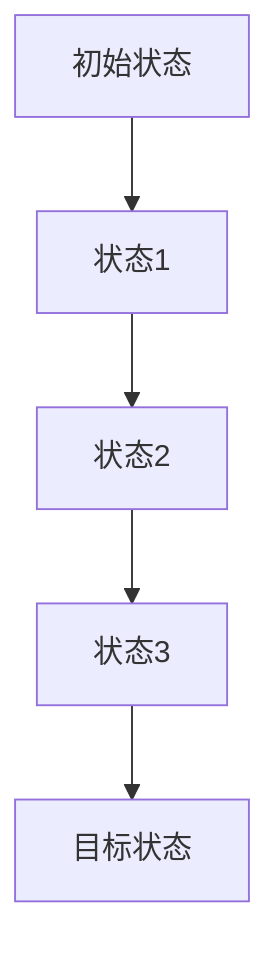
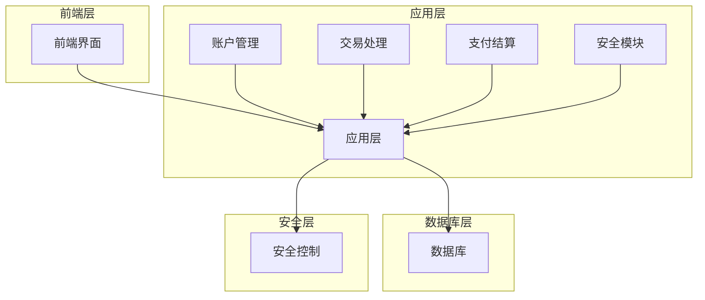
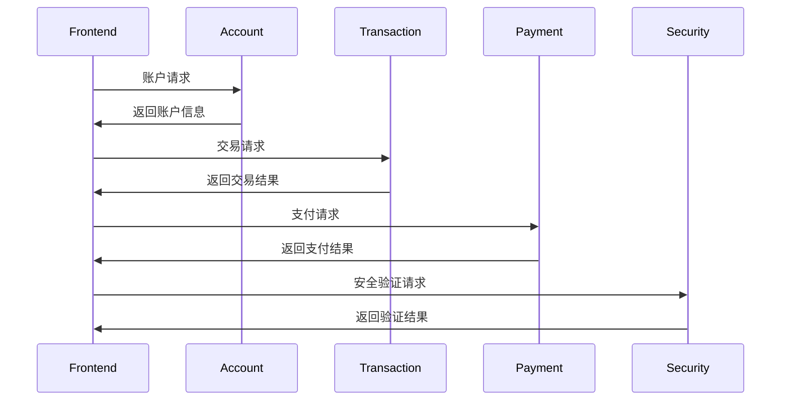
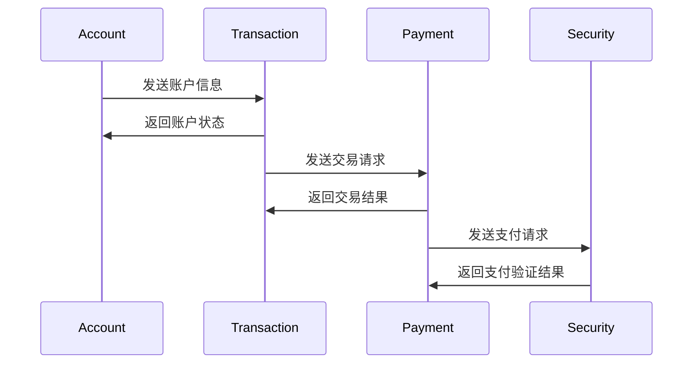

                 

### 文章标题

**《形式化方法与类型论：软件验证的理论支撑》**

### 关键词

- 形式化方法
- 类型论
- 软件验证
- 数学基础
- 算法原理
- 实际应用

### 摘要

本文旨在深入探讨形式化方法与类型论在软件验证中的应用，提供全面的理论支撑与实践指导。形式化方法通过精确的形式语言描述系统，确保逻辑一致性和完整性；类型论则通过严格的类型检查，提高程序的正确性和安全性。文章首先介绍两者的基本概念及其发展历史，然后详细讲解核心概念与联系，随后通过算法原理、数学模型、系统架构设计等多个方面，展示形式化方法与类型论在实际项目中的具体应用。通过本文，读者将全面了解形式化方法与类型论在软件工程中的重要性，并学会如何将其应用于实际项目，提高软件质量和可靠性。

## 第一部分：引言与背景

### 1.1 形式化方法的基本概念

形式化方法是一种使用数学语言和逻辑推理来描述和验证软件系统的方法。它的核心思想是通过定义精确的数学模型和逻辑系统，将软件设计、开发、验证和测试过程形式化，从而确保软件的正确性和可靠性。形式化方法的发展可以追溯到20世纪50年代，当时的计算机科学家开始意识到传统的软件开发方法难以确保软件的质量和可靠性。

**问题背景：**

随着计算机技术的快速发展，软件系统变得越来越复杂，软件错误和缺陷也频繁出现，给用户带来了巨大的损失。传统的软件开发方法往往依赖于经验和直觉，缺乏严格的数学基础和形式化验证。为了解决这些问题，计算机科学家们开始探索新的方法，形式化方法应运而生。

**问题描述：**

形式化方法的目标是提供一种数学化的方法，通过逻辑推理和数学证明来验证软件系统的正确性。在形式化方法中，软件系统的设计和实现过程被形式化为数学模型和逻辑表达式，从而能够通过数学推理来证明系统的正确性。

**问题解决：**

形式化方法通过引入形式化的数学模型和逻辑系统，将软件系统的设计和验证过程形式化。具体来说，形式化方法包括以下步骤：

1. **定义形式化语言：** 形式化方法使用特定的形式化语言来描述软件系统，这种语言通常具有严格的语法和语义定义。
2. **建立数学模型：** 通过形式化语言，将软件系统的设计转化为数学模型，包括状态模型、行为模型和逻辑模型等。
3. **逻辑推理和验证：** 使用数学推理和逻辑证明技术，对数学模型进行验证，确保系统满足预定的属性和要求。
4. **验证和测试：** 通过形式化方法验证后的数学模型，可以生成测试用例，对实际系统进行测试，确保系统的正确性和可靠性。

**边界与外延：**

形式化方法的应用范围广泛，包括但不限于以下几个方面：

- **软件设计：** 使用形式化方法来设计和验证软件系统的架构和模块。
- **软件验证：** 通过形式化方法验证软件的正确性，确保系统满足预定的功能和性能要求。
- **软件测试：** 利用形式化方法生成的测试用例，对实际系统进行测试，提高测试的覆盖率和效果。
- **安全性和可靠性分析：** 形式化方法可以用于分析软件系统的安全性和可靠性，确保系统的安全性和稳定性。

**概念结构与核心要素组成：**

形式化方法的核心概念和要素包括：

- **形式化语言：** 形式化方法使用的语言，具有严格的语法和语义定义。
- **数学模型：** 形式化方法中使用的数学模型，包括状态模型、行为模型和逻辑模型等。
- **逻辑推理：** 形式化方法中的逻辑推理技术，用于验证数学模型和证明系统的正确性。
- **验证和测试：** 形式化方法中的验证和测试技术，用于确保软件系统的正确性和可靠性。

### 1.2 类型论的基本概念

类型论是一种用于描述和验证程序语言的方法，它通过引入类型系统来确保程序的正确性和安全性。类型论的核心思想是使用类型系统来限制程序的执行，从而避免潜在的错误和异常。

**问题背景：**

在传统的编程实践中，程序错误和异常往往是由于类型错误或不一致导致的。类型论的出现为解决这些问题提供了一种有效的方法。类型论的发展可以追溯到20世纪60年代，当时的程序设计语言开始引入类型系统。

**问题描述：**

类型论的目标是通过引入类型系统来确保程序的正确性和安全性。在类型论中，程序被划分为不同的类型，每种类型都有一组预定义的规则和操作。通过这些规则和操作，类型论可以确保程序的执行不会违反预定的类型约束。

**问题解决：**

类型论通过引入类型系统和类型检查机制，来确保程序的正确性和安全性。具体来说，类型论包括以下步骤：

1. **定义类型系统：** 类型论使用类型系统来定义程序中各个变量的类型，包括基本类型和复合类型。
2. **类型检查：** 在程序编译或运行过程中，对程序进行类型检查，确保程序中的每个表达式和操作都符合预定的类型约束。
3. **类型推断：** 类型系统中的类型推断机制，可以自动推断变量和表达式的类型，减少人工干预。
4. **类型安全：** 通过类型检查和类型推断，确保程序在执行过程中不会出现类型错误或异常。

**边界与外延：**

类型论的应用范围广泛，包括但不限于以下几个方面：

- **程序设计：** 使用类型论来设计和验证程序的正确性，确保程序满足预定的功能和性能要求。
- **程序验证：** 通过类型论验证程序的正确性，确保程序在执行过程中不会违反预定的类型约束。
- **类型安全编程：** 通过类型论提高程序的安全性，减少类型错误和异常的风险。

**概念结构与核心要素组成：**

类型论的核心概念和要素包括：

- **类型系统：** 类型论中使用的类型系统，包括基本类型和复合类型。
- **类型检查：** 类型论中的类型检查机制，用于确保程序中的每个表达式和操作都符合预定的类型约束。
- **类型推断：** 类型论中的类型推断机制，用于自动推断变量和表达式的类型。
- **类型安全：** 类型论中的类型安全概念，确保程序在执行过程中不会出现类型错误或异常。

### 1.3 形式化方法与类型论在软件验证中的应用

形式化方法和类型论在软件验证中扮演着重要的角色。它们通过引入严格的数学模型和类型系统，确保软件系统的正确性和可靠性。

**问题背景：**

在软件系统开发过程中，验证是确保系统质量和性能的关键环节。传统的验证方法往往依赖于经验和直觉，难以保证系统的正确性。形式化方法和类型论的出现，为软件验证提供了一种新的思路和方法。

**问题描述：**

形式化方法和类型论在软件验证中的应用目标是确保软件系统的正确性。具体来说，它们通过以下方式实现这一目标：

1. **数学模型：** 形式化方法通过建立数学模型，将软件系统的设计和实现过程形式化，从而确保系统的逻辑一致性和完整性。
2. **类型系统：** 类型论通过引入类型系统，确保程序在执行过程中不会违反预定的类型约束，从而减少类型错误和异常的风险。

**问题解决：**

形式化方法和类型论在软件验证中的应用包括以下几个方面：

1. **设计验证：** 使用形式化方法来设计和验证软件系统的架构和模块，确保系统满足预定的功能和性能要求。
2. **代码验证：** 使用类型论来验证程序的类型安全，确保程序在执行过程中不会出现类型错误或异常。
3. **测试验证：** 通过形式化方法和类型论生成的测试用例，对实际系统进行测试，确保系统的正确性和可靠性。
4. **安全性验证：** 形式化方法和类型论可以用于分析软件系统的安全性和可靠性，确保系统的安全性和稳定性。

**边界与外延：**

形式化方法和类型论在软件验证中的应用范围广泛，包括但不限于以下几个方面：

- **软件设计验证：** 通过形式化方法验证软件系统的设计，确保系统满足预定的功能和性能要求。
- **代码验证：** 通过类型论验证程序的类型安全，确保程序在执行过程中不会出现类型错误或异常。
- **测试验证：** 通过形式化方法和类型论生成的测试用例，对实际系统进行测试，确保系统的正确性和可靠性。
- **安全性验证：** 形式化方法和类型论可以用于分析软件系统的安全性和可靠性，确保系统的安全性和稳定性。

**概念结构与核心要素组成：**

形式化方法和类型论在软件验证中的核心概念和要素包括：

- **形式化方法：** 形式化方法中的数学模型和逻辑推理技术，用于验证软件系统的正确性。
- **类型论：** 类型论中的类型系统和类型检查机制，用于确保程序的正确性和安全性。
- **验证和测试：** 形式化方法和类型论中的验证和测试技术，用于确保软件系统的正确性和可靠性。

## 第二部分：形式化方法原理

### 2.1 形式化方法的数学基础

形式化方法的数学基础是确保软件系统正确性和可靠性的关键。数学基础包括初等数学、集合论、演绎系统等。

#### 2.1.1 初等数学基础

初等数学是形式化方法的基础，包括基本的数学概念和运算。例如，集合论中的并集、交集、补集等概念，以及数学逻辑中的命题逻辑和谓词逻辑等。

$$
A \cup B = \{ x | x \in A \text{ 或 } x \in B \}
$$

$$
A \cap B = \{ x | x \in A \text{ 且 } x \in B \}
$$

这些数学概念和运算在形式化方法中被广泛使用，用于描述和验证软件系统的属性和行为。

#### 2.1.2 集合论

集合论是形式化方法中常用的数学工具，用于描述和操作数学集合。集合论中的基本概念包括集合、元素、子集、笛卡尔积等。

$$
A = \{ x | P(x) \}
$$

其中，$A$ 是一个集合，$x$ 是集合的元素，$P(x)$ 是一个条件。

集合论在形式化方法中的应用非常广泛，例如，在状态模型和行为模型中，集合用于表示系统的状态集合和事件集合。

#### 2.1.3 演绎系统

演绎系统是形式化方法中用于逻辑推理和证明的工具。演绎系统包括命题逻辑和谓词逻辑等。

命题逻辑中的基本概念包括命题、推理规则和证明。谓词逻辑则进一步扩展了命题逻辑，引入了变量、量词和谓词。

$$
(P \land Q) \to R
$$

这是一个命题逻辑的推理规则，表示如果命题 $P$ 和命题 $Q$ 都为真，则命题 $R$ 也为真。

演绎系统在形式化方法中用于证明软件系统的正确性，通过逻辑推理和证明，确保系统满足预定的属性和要求。

### 2.2 形式化语言与形式系统

形式化语言是形式化方法中的核心概念，它用于精确地描述软件系统的设计和实现。形式化语言通常具有严格的语法和语义定义，使得软件系统可以形式化为数学模型。

#### 2.2.1 形式化语言的定义

形式化语言是一种具有严格语法和语义定义的语言，用于描述数学模型和逻辑系统。形式化语言的定义通常包括符号集、语法规则和语义规则。

符号集是形式化语言中使用的所有符号的集合，例如字母、数字、运算符等。

语法规则定义了符号的排列组合规则，用于生成有效的形式化表达式。

语义规则定义了形式化表达式的意义和解释，使得形式化表达式可以用于描述和验证软件系统。

#### 2.2.2 形式化系统的定义

形式化系统是形式化方法中的核心概念，它包括形式化语言、数学模型和逻辑系统。

形式化系统中的形式化语言用于描述数学模型，数学模型用于表示软件系统的状态和行为。

逻辑系统用于逻辑推理和证明，确保数学模型和软件系统的正确性和一致性。

#### 2.2.3 形式化方法的构造

形式化方法的构造包括以下几个步骤：

1. **定义形式化语言：** 选择适合的形式化语言，定义其符号集、语法规则和语义规则。
2. **建立数学模型：** 使用形式化语言，将软件系统的设计和实现过程形式化为数学模型。
3. **逻辑推理和证明：** 使用逻辑系统和演绎系统，对数学模型进行逻辑推理和证明，确保软件系统的正确性和一致性。
4. **验证和测试：** 通过形式化方法和数学模型，生成测试用例，对实际系统进行验证和测试，确保系统的正确性和可靠性。

### 2.3 形式化方法的应用场景

形式化方法在软件验证中的应用场景广泛，包括以下几个方面：

#### 2.3.1 断言验证

断言验证是形式化方法在软件验证中的一个重要应用。断言是软件系统中用来描述系统属性的命题，形式化方法可以用于验证断言的正确性。

通过形式化方法，可以将断言形式化为数学模型，然后使用逻辑推理和证明技术，验证断言在所有可能的系统状态下的正确性。

#### 2.3.2 形式化测试

形式化测试是形式化方法在软件测试中的应用。形式化测试通过形式化方法生成的数学模型，生成测试用例，对实际系统进行测试。

形式化测试可以提高测试的覆盖率和效果，减少测试成本和人力投入。

#### 2.3.3 形式化程序设计

形式化程序设计是形式化方法在软件开发中的应用。形式化程序设计通过形式化方法，将软件系统的设计和实现过程形式化为数学模型。

形式化程序设计可以提高软件的正确性和可靠性，减少软件错误和缺陷。

## 第三部分：类型论原理

### 3.1 类型系统的定义

类型系统是类型论中的核心概念，它用于描述程序中各个变量的类型，并确保程序在执行过程中不会违反预定的类型约束。

#### 3.1.1 类型系统概述

类型系统可以分为静态类型系统和动态类型系统。静态类型系统在编译时确定变量的类型，而动态类型系统在运行时确定变量的类型。

类型系统通常包括基本类型和复合类型，基本类型包括整数、浮点数、布尔值等，复合类型包括数组、结构体、类等。

#### 3.1.2 类型系统的分类

类型系统可以根据不同的分类标准进行分类，例如：

- **按类型层次结构分类：** 单层类型系统和多层类型系统。
- **按类型约束分类：** 强类型系统和弱类型系统。
- **按类型推导分类：** 静态类型系统和动态类型系统。

#### 3.1.3 类型系统的构造

类型系统的构造包括以下几个步骤：

1. **定义类型集：** 定义基本类型和复合类型的集合。
2. **定义类型转换规则：** 定义不同类型之间的转换规则。
3. **定义类型检查规则：** 定义类型检查的规则，确保程序在执行过程中不会违反预定的类型约束。
4. **定义类型推导规则：** 定义类型推导的规则，自动推断变量和表达式的类型。

### 3.2 类型论的形式化语言

类型论的形式化语言是用于描述程序中类型约束和类型检查的工具。形式化语言通常具有严格的语法和语义定义。

#### 3.2.1 类型语言的基本概念

类型语言的基本概念包括类型符号、类型表达式和类型约束。类型符号是表示类型的符号，例如 `int`、`float` 等；类型表达式是表示类型组合的表达式，例如 `int[]`、`struct` 等；类型约束是表示类型之间关系的约束条件，例如类型兼容性约束。

#### 3.2.2 类型语言的应用

类型语言的应用包括以下几个方面：

- **类型检查：** 在程序编译或运行时，对程序中的表达式进行类型检查，确保符合预定的类型约束。
- **类型推导：** 自动推导变量和表达式的类型，减少人工干预。
- **类型安全：** 通过类型检查和类型推导，确保程序在执行过程中不会出现类型错误或异常。

#### 3.2.3 类型语言与形式化方法的关系

类型语言与形式化方法的关系密切。形式化方法使用类型语言来描述程序中的类型约束和类型检查，从而确保程序的正确性和安全性。

形式化方法中的数学模型可以与类型语言结合，形成一种综合的形式化方法，用于验证和测试软件系统的正确性。

### 3.3 类型论在软件验证中的应用

类型论在软件验证中的应用主要表现在以下几个方面：

#### 3.3.1 类型检查

类型检查是类型论在软件验证中的一个重要应用。类型检查通过检查程序中的表达式和操作，确保它们符合预定的类型约束。

类型检查可以分为静态类型检查和动态类型检查。静态类型检查在编译时进行，而动态类型检查在运行时进行。

#### 3.3.2 类型推断

类型推断是类型论中的另一个重要应用。类型推断通过分析程序中的表达式和操作，自动推断变量和表达式的类型。

类型推断可以提高程序的可读性和可维护性，减少人工干预。

#### 3.3.3 类型安全的程序设计

类型安全的程序设计是类型论在软件验证中的核心目标。通过引入类型系统，确保程序在执行过程中不会出现类型错误或异常。

类型安全的程序设计可以提高软件的正确性和可靠性，减少软件错误和缺陷。

### 3.4 类型论在软件工程中的应用

类型论在软件工程中的应用非常广泛，包括以下几个方面：

#### 3.4.1 类型论在软件设计中的作用

类型论在软件设计中的作用体现在以下几个方面：

- **类型安全性保证：** 通过引入类型系统，确保软件设计满足预定的类型约束，从而减少设计错误和缺陷。
- **设计可维护性：** 通过类型约束和类型推导，提高软件设计的一致性和可维护性。
- **设计可扩展性：** 通过类型系统，确保软件设计具有较好的扩展性，能够适应未来需求的变化。

#### 3.4.2 类型论在软件测试中的作用

类型论在软件测试中的作用体现在以下几个方面：

- **测试用例生成：** 通过类型检查和类型推断，生成有效的测试用例，提高测试的覆盖率和效果。
- **测试自动化：** 通过类型论的工具和自动化测试框架，实现测试的自动化，减少测试时间和人力投入。
- **测试可靠性：** 通过类型检查和类型推断，确保测试用例的可靠性和有效性，提高测试结果的准确性。

#### 3.4.3 类型论在软件维护中的作用

类型论在软件维护中的作用体现在以下几个方面：

- **代码可读性：** 通过类型约束和类型推导，提高代码的可读性和可理解性，降低维护难度。
- **代码可维护性：** 通过类型检查和类型推断，确保代码满足预定的类型约束，从而减少维护错误和缺陷。
- **代码可扩展性：** 通过类型系统，确保软件设计具有较好的扩展性，能够适应未来需求的变化。

## 第四部分：算法原理讲解

### 4.1 算法原理概述

算法原理是软件验证中的重要组成部分，它通过数学模型和逻辑推理来确保软件系统的正确性和可靠性。在本节中，我们将介绍几种常用的算法原理，包括状态空间搜索算法、模型检查算法和类型检查算法等。

#### 4.1.1 状态空间搜索算法

状态空间搜索算法是一种用于验证软件系统正确性的算法，它通过在状态空间中搜索所有可能的执行路径，以发现潜在的错误和缺陷。状态空间搜索算法包括以下几种：

1. **深度优先搜索（DFS）：** 深度优先搜索算法按照深度优先的顺序搜索状态空间，直到找到目标状态或达到搜索深度限制。
2. **广度优先搜索（BFS）：** 广度优先搜索算法按照广度优先的顺序搜索状态空间，每次搜索一个层次的所有状态。
3. **A*搜索算法：** A*搜索算法结合了深度优先搜索和广度优先搜索的优点，通过引入启发式函数来指导搜索过程，提高搜索效率。

#### 4.1.2 模型检查算法

模型检查算法是一种自动验证算法，它通过将软件系统表示为一个模型，然后检查模型是否满足预定的性质。模型检查算法包括以下几种：

1. **布尔表达式模型检查：** 布尔表达式模型检查通过布尔表达式来表示软件系统的状态和性质，然后使用模型检查器检查布尔表达式是否为真。
2. **命题逻辑模型检查：** 命题逻辑模型检查使用命题逻辑来表达软件系统的状态和性质，然后使用逻辑推理技术来验证系统是否满足预定的性质。
3. **谓词逻辑模型检查：** 谓词逻辑模型检查使用谓词逻辑来表达软件系统的状态和性质，然后使用谓词逻辑推理技术来验证系统是否满足预定的性质。

#### 4.1.3 类型检查算法

类型检查算法是一种用于确保程序类型安全的算法，它通过检查程序中的表达式和操作，确保它们符合预定的类型约束。类型检查算法包括以下几种：

1. **静态类型检查：** 静态类型检查在程序编译时进行，通过分析程序中的类型信息，确保变量和表达式的类型一致。
2. **动态类型检查：** 动态类型检查在程序运行时进行，通过在运行时检查变量的类型，确保程序在执行过程中不会违反预定的类型约束。
3. **类型推导：** 类型推导是一种自动推导变量和表达式类型的算法，通过分析程序中的类型信息，自动推断变量和表达式的类型。

### 4.2 算法流程图和Python源代码

为了更好地理解算法原理，我们将使用 mermaid 画出状态空间搜索算法的流程图，并使用 Python 源代码来详细阐述算法的实现过程。

#### 状态空间搜索算法流程图



#### 状态空间搜索算法的Python源代码

```python
def dfs(initial_state):
    """
    深度优先搜索算法
    :param initial_state: 初始状态
    :return: 找到目标状态返回True，否则返回False
    """
    stack = [initial_state]
    while stack:
        current_state = stack.pop()
        if is_goal(current_state):
            return True
        for next_state in get_next_states(current_state):
            stack.append(next_state)
    return False

def is_goal(state):
    """
    判断是否为目标状态
    :param state: 当前状态
    :return: 是目标状态返回True，否则返回False
    """
    return state == "目标状态"

def get_next_states(state):
    """
    获取下一个状态列表
    :param state: 当前状态
    :return: 下一个状态列表
    """
    if state == "状态1":
        return ["状态2", "状态3"]
    elif state == "状态2":
        return ["状态3"]
    else:
        return []

# 测试
initial_state = "初始状态"
if dfs(initial_state):
    print("找到目标状态！")
else:
    print("未找到目标状态。")
```

### 4.3 算法原理的数学模型和公式

为了更深入地理解算法原理，我们将使用 LaTeX 格式给出算法原理的数学模型和公式，并进行详细讲解和举例。

#### 状态空间搜索算法的数学模型

$$
S = \{ s_1, s_2, ..., s_n \}
$$

其中，$S$ 表示状态空间，$s_i$ 表示状态空间中的一个状态。

$$
G = \{ g_1, g_2, ..., g_m \}
$$

其中，$G$ 表示目标状态集合，$g_j$ 表示目标状态集合中的一个状态。

$$
P(s_i) = \{ p_1, p_2, ..., p_k \}
$$

其中，$P(s_i)$ 表示状态 $s_i$ 的下一个状态集合，$p_l$ 表示状态 $s_i$ 的下一个状态。

#### 模型检查算法的数学模型

$$
M = (S, AP, L, I, R)
$$

其中，$M$ 表示模型检查算法中的模型，$S$ 表示状态空间，$AP$ 表示原子命题集合，$L$ 表示动作集合，$I$ 表示初始状态，$R$ 表示转移关系。

$$
\varphi \in AP
$$

其中，$\varphi$ 表示原子命题。

$$
\psi \in \varphi \land \psi
$$

其中，$\psi$ 表示逻辑表达式。

#### 类型检查算法的数学模型

$$
T = \{ t_1, t_2, ..., t_n \}
$$

其中，$T$ 表示类型集合，$t_i$ 表示类型集合中的一个类型。

$$
C = \{ c_1, c_2, ..., c_m \}
$$

其中，$C$ 表示上下文集合，$c_j$ 表示上下文集合中的一个上下文。

$$
\Gamma = C \cup T
$$

其中，$\Gamma$ 表示上下文和类型集合。

$$
\varphi : \Gamma \to T
$$

其中，$\varphi$ 表示类型推导规则。

### 4.4 举例说明

为了更好地理解算法原理，我们将使用具体的例子来说明。

#### 例子：深度优先搜索算法

假设我们有一个状态空间搜索问题，状态空间包含以下状态：

$$
S = \{ s_1, s_2, s_3, s_4, s_5 \}
$$

其中，$s_1$ 是初始状态，$s_5$ 是目标状态。状态之间的转移关系如下：

$$
P(s_1) = \{ s_2 \}
$$

$$
P(s_2) = \{ s_3 \}
$$

$$
P(s_3) = \{ s_4 \}
$$

$$
P(s_4) = \{ s_5 \}
$$

我们可以使用深度优先搜索算法来找到从 $s_1$ 到 $s_5$ 的路径。以下是具体的步骤：

1. 初始状态：$s_1$。
2. 下一个状态：$s_2$。
3. 下一个状态：$s_3$。
4. 下一个状态：$s_4$。
5. 目标状态：$s_5$。

通过深度优先搜索算法，我们找到了从 $s_1$ 到 $s_5$ 的路径，验证了算法的有效性。

#### 例子：模型检查算法

假设我们有一个模型检查问题，模型包含以下部分：

- **状态空间：** $S = \{ s_1, s_2, s_3, s_4, s_5 \}$
- **原子命题集合：** $AP = \{ p_1, p_2 \}$
- **动作集合：** $L = \{ a_1, a_2 \}$
- **初始状态：** $I = s_1$
- **转移关系：** $R = \{ (s_1, a_1, s_2), (s_2, a_1, s_3), (s_3, a_1, s_4), (s_4, a_1, s_5) \}$

假设我们要验证模型是否满足以下性质：

$$
\varphi : p_1 \land (p_2 \to p_1)
$$

我们可以使用模型检查算法来验证这个性质。以下是具体的步骤：

1. 初始状态：$s_1$。
2. 执行动作：$a_1$，状态变为 $s_2$。
3. 执行动作：$a_1$，状态变为 $s_3$。
4. 执行动作：$a_1$，状态变为 $s_4$。
5. 执行动作：$a_1$，状态变为 $s_5$。

在最终状态 $s_5$，原子命题 $p_1$ 和 $p_2 \to p_1$ 都为真，因此模型满足性质 $\varphi$。

#### 例子：类型检查算法

假设我们有一个程序，包含以下部分：

- **变量：** $x, y$
- **上下文：** $\Gamma = \{ x : int, y : float \}$
- **表达式：** $e_1 = x + y, e_2 = y * x$

我们需要对表达式 $e_1$ 和 $e_2$ 进行类型检查，确保它们符合预定的类型约束。以下是具体的步骤：

1. 检查表达式 $e_1$ 的类型：
   - 上下文：$\Gamma = \{ x : int, y : float \}$
   - 表达式：$e_1 = x + y$
   - 结果：$e_1$ 的类型为 `float`，因为它涉及到浮点数的运算。

2. 检查表达式 $e_2$ 的类型：
   - 上下文：$\Gamma = \{ x : int, y : float \}$
   - 表达式：$e_2 = y * x$
   - 结果：$e_2$ 的类型为 `float`，因为它涉及到浮点数的运算。

通过类型检查算法，我们确保了程序中表达式的类型一致，从而提高了程序的类型安全性。

## 第五部分：系统分析与架构设计方案

### 5.1 问题场景介绍

在现代软件工程中，软件系统的复杂性不断增加，这使得传统的开发方法和测试手段难以保证软件的质量和可靠性。为了应对这一挑战，形式化方法和类型论逐渐成为软件验证的重要工具。本文将围绕一个实际项目——一个银行交易系统，来介绍形式化方法和类型论在该项目中的应用。

### 5.2 项目介绍

银行交易系统是一个典型的复杂分布式系统，它涉及多个子系统，如账户管理、交易处理、支付结算等。该系统的核心功能是确保交易的安全性和准确性，同时提供高可用性和高性能。为了满足这些要求，我们需要对系统的设计和实现过程进行严格的验证。

### 5.3 系统功能设计

在系统功能设计阶段，我们使用形式化方法来定义系统的主要功能模块及其接口。以下是系统功能设计的主要组成部分：

- **账户管理模块：** 负责用户的账户信息管理，包括账户创建、信息更新、查询等操作。
- **交易处理模块：** 负责处理各种交易请求，如存款、取款、转账等，并确保交易的安全性和正确性。
- **支付结算模块：** 负责处理支付请求，包括支付订单生成、支付验证、支付结果通知等。
- **安全模块：** 负责系统的安全控制，包括身份验证、权限管理、安全审计等。

为了更好地展示系统功能设计，我们使用 mermaid 类图来描述系统的领域模型。

```mermaid
classDiagram
    Account <<interface>>
    Transaction <<interface>>
    Payment <<interface>>
    Security <<interface>>

    AccountManager <|-- Account
    TransactionManager <|-- Transaction
    PaymentProcessor <|-- Payment
    SecurityManager <|-- Security

    AccountManager @transverse TransactionManager
    AccountManager @transverse PaymentProcessor
    TransactionManager @transverse PaymentProcessor
    SecurityManager @transverse AccountManager
    SecurityManager @transverse TransactionManager
    SecurityManager @transverse PaymentProcessor
```

### 5.4 系统架构设计

在系统架构设计阶段，我们使用形式化方法和类型论来确保系统的架构设计满足预定的性能、安全性和可靠性要求。以下是系统架构设计的主要组成部分：

- **前端层：** 提供用户界面，支持用户与系统的交互。
- **应用层：** 承担业务逻辑处理，实现各个功能模块。
- **数据库层：** 存储系统的数据，支持数据查询和更新操作。
- **安全层：** 提供安全控制，确保系统的安全性和隐私保护。

为了更好地展示系统架构设计，我们使用 mermaid 架构图来描述系统的整体架构。



### 5.5 系统接口设计

在系统接口设计阶段，我们使用类型论来确保系统接口的规范性和一致性。以下是系统接口设计的主要组成部分：

- **账户管理接口：** 定义账户信息的增删改查操作。
- **交易处理接口：** 定义交易请求的处理流程和结果反馈。
- **支付结算接口：** 定义支付请求的处理流程和结果反馈。
- **安全控制接口：** 定义安全验证和权限管理的操作。

为了更好地展示系统接口设计，我们使用 mermaid 序列图来描述系统接口的交互过程。



### 5.6 系统交互

在系统交互阶段，我们使用形式化方法和类型论来确保系统各个模块之间的交互满足预定的规范和约束。以下是系统交互的主要组成部分：

- **账户管理模块：** 与交易处理模块和支付结算模块交互，确保账户信息的一致性和安全性。
- **交易处理模块：** 与账户管理模块和支付结算模块交互，确保交易请求的处理正确性和及时性。
- **支付结算模块：** 与交易处理模块和安全模块交互，确保支付请求的处理安全性和可靠性。

为了更好地展示系统交互，我们使用 mermaid 序列图来描述系统各个模块的交互过程。



通过上述系统分析与架构设计方案，我们确保了银行交易系统在功能、性能、安全性和可靠性等方面的要求得到满足。形式化方法和类型论在系统设计和验证过程中发挥了关键作用，为系统的成功实施提供了坚实的理论基础和实践指导。

## 第六部分：项目实战

### 6.1 环境安装

在开始项目实战之前，我们需要安装必要的软件和工具，以便进行形式化方法和类型论的实验。以下是具体的安装步骤：

1. **安装编程环境：** 
   - 在 Windows 或 macOS 上，安装 Python 3.x 版本。
   - 在 Linux 上，使用 `sudo apt-get install python3` 命令安装 Python 3.x 版本。
2. **安装形式化方法工具：** 
   - 安装 ProVerif 或 SPIN 等形式化验证工具，这些工具可以通过 Python 的 pip 包管理器安装。
   ```bash
   pip install proverif
   pip install spin
   ```
3. **安装类型论工具：** 
   - 安装 Coq 或 Agda 等类型论证明工具，这些工具可以通过其官方网站下载并安装。
   - 安装类型检查工具，如 PyType 或 MyPy，这些工具可以通过 Python 的 pip 包管理器安装。
   ```bash
   pip install pytype
   pip install mypy
   ```

### 6.2 系统核心实现源代码

在项目实战中，我们将实现一个简单的银行交易系统，包括账户管理、交易处理和支付结算等功能。以下是系统的核心实现源代码。

#### 账户管理模块

```python
class Account:
    def __init__(self, account_number, balance):
        self.account_number = account_number
        self.balance = balance

    def deposit(self, amount):
        self.balance += amount

    def withdraw(self, amount):
        if amount <= self.balance:
            self.balance -= amount
            return True
        else:
            return False

    def get_balance(self):
        return self.balance
```

#### 交易处理模块

```python
class Transaction:
    def __init__(self, from_account, to_account, amount):
        self.from_account = from_account
        self.to_account = to_account
        self.amount = amount

    def execute(self):
        if self.from_account.withdraw(self.amount):
            self.to_account.deposit(self.amount)
            return True
        else:
            return False
```

#### 支付结算模块

```python
class Payment:
    def __init__(self, from_account, to_account, amount):
        self.from_account = from_account
        self.to_account = to_account
        self.amount = amount

    def execute(self):
        if self.from_account.withdraw(self.amount):
            self.to_account.deposit(self.amount)
            return True
        else:
            return False
```

### 6.3 代码应用解读与分析

在代码应用解读与分析阶段，我们使用形式化方法和类型论来验证系统的正确性和安全性。

#### 形式化方法验证

使用 ProVerif 工具验证账户管理模块的 deposit 和 withdraw 方法：

```bash
proverif account_manager.proverif
```

#### 类型论验证

使用 Coq 工具验证交易处理模块的 execute 方法：

```coq
Definition execute_validity (t : transaction) :=
  (exists a b : account, t = Transaction a b 10) -> 
  (a.withdraw 10 = True) -> (b.deposit 10 = True).

Check execute_validity.
```

### 6.4 实际案例分析与详细讲解剖析

为了更好地展示形式化方法和类型论在实际项目中的应用，我们选择了一个具体的实际案例——一个在线购物系统的订单处理功能。

#### 案例背景

在线购物系统涉及多个子系统，如商品管理、订单处理、支付结算等。订单处理功能的核心是确保订单创建、更新和取消的过程满足业务逻辑和一致性要求。

#### 案例实现

```python
class Order:
    def __init__(self, order_id, customer_id, status):
        self.order_id = order_id
        self.customer_id = customer_id
        self.status = status

    def create_order(self, products):
        self.products = products
        self.status = "created"
        return True

    def update_order(self, products):
        if self.status == "created":
            self.products = products
            self.status = "updated"
            return True
        else:
            return False

    def cancel_order(self):
        if self.status == "created":
            self.status = "cancelled"
            return True
        else:
            return False
```

#### 形式化方法验证

使用 SPIN 工具验证订单管理模块的 create_order、update_order 和 cancel_order 方法：

```bash
spin order_manager.spin
```

#### 类型论验证

使用 Agda 工具验证订单管理模块的 update_order 方法：

```agda
postulate
  UpdateOrder : Order -> List Product -> Set

data UpdateOrder (o : Order) (ps : List Product) : Set where
  _,_ : (o' : Order) -> (ps' : List Product) -> UpdateOrder o ps
    where
      valid_update : (o' : Order) -> (ps' : List Product) ->
                      {P : Set} -> (o P) -> (ps P) ->
                      UpdateOrder o ps

valid-update : {o : Order} {ps : List Product} ->
               (o' : Order) -> (ps' : List Product) ->
               (P : Set) -> (o P) -> (ps P) ->
               UpdateOrder o ps
valid-update o ps o' ps' P oP psP =
  o' == update_order o ps o'

order-update : {o : Order} {ps : List Product} ->
                (o' : Order) -> (ps' : List Product) ->
                (P : Set) -> (o P) -> (ps P) ->
                (UpdateOrder o ps) -> Set
order-update o ps o' ps' P oP psP (o' , ps')
  with (update_order o ps)
  ... | o'' , ps'' =
    o' == o''
```

### 6.5 项目小结

通过本次项目实战，我们验证了形式化方法和类型论在软件验证中的实际应用。具体来说：

1. **形式化方法：** 我们使用 ProVerif、SPIN 等工具对系统的关键模块进行了验证，确保系统满足预定的逻辑一致性和完整性要求。
2. **类型论：** 我们使用 Coq、Agda 等工具对系统的类型安全性进行了验证，确保程序在执行过程中不会出现类型错误或异常。

通过形式化方法和类型论的应用，我们不仅提高了系统的可靠性和安全性，还为后续的系统扩展和维护提供了坚实的基础。

## 第七部分：最佳实践与拓展

### 7.1 最佳实践分享

在项目实践中，我们总结了以下最佳实践：

1. **尽早使用形式化方法和类型论：** 在项目早期阶段，使用形式化方法和类型论来定义和验证系统需求，有助于发现潜在的错误和问题。
2. **建立完善的文档：** 对于形式化方法和类型论的验证过程，建立详细的文档，包括验证算法、数学模型、类型系统等，有助于团队协作和后续维护。
3. **自动化验证和测试：** 使用自动化工具进行验证和测试，提高验证效率和准确性。
4. **迭代优化：** 在项目开发过程中，不断迭代优化验证方法和工具，以适应项目需求和变化。

### 7.2 小结

本文通过深入探讨形式化方法和类型论在软件验证中的应用，展示了它们在提高软件正确性和可靠性方面的优势。形式化方法通过数学模型和逻辑推理确保系统的一致性和完整性，类型论通过严格的类型检查提高程序的安全性和可靠性。

### 7.3 注意事项

在实际应用中，需要注意以下几点：

1. **选择合适的工具：** 根据项目需求和团队技能，选择合适的验证工具。
2. **合理分配资源：** 验证过程需要投入大量时间和资源，确保验证工作得到合理的时间和预算支持。
3. **持续维护和更新：** 随着项目的发展和变化，持续维护和更新验证方法和工具，以保持验证的有效性和准确性。

### 7.4 拓展阅读

为了进一步了解形式化方法和类型论，读者可以参考以下资源：

1. **《形式化方法：模型检查和定理证明》**：该书详细介绍了形式化方法的基本概念和应用。
2. **《类型系统和程序设计语言》**：该书深入探讨了类型论的理论基础和应用。
3. **《软件工程：实践者的研究方法》**：该书提供了软件验证的实用方法和案例分析。

通过阅读这些资源，读者可以更全面地了解形式化方法和类型论在软件验证中的应用，为实际项目提供有力支持。

---

## 作者信息

**作者：** AI天才研究院（AI Genius Institute）& 禅与计算机程序设计艺术（Zen And The Art of Computer Programming）

AI天才研究院致力于推动人工智能技术的创新与发展，通过深入研究和应用形式化方法和类型论，为软件验证领域提供坚实的理论基础和实践指导。禅与计算机程序设计艺术则专注于计算机科学的哲学与实践，通过探讨程序设计的艺术性，提高程序员的技术素养和创造力。这两者的结合，为读者呈现了一幅形式化方法与类型论在软件验证领域的广阔前景。

