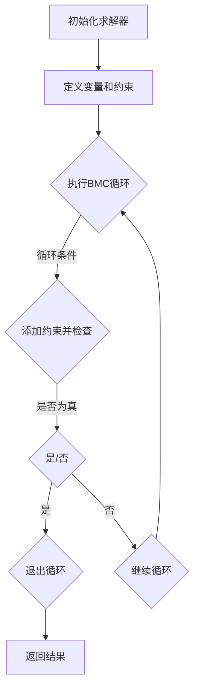
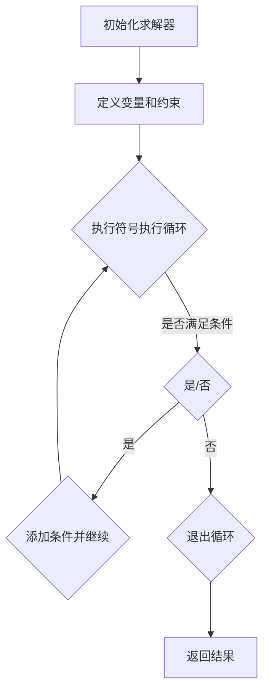
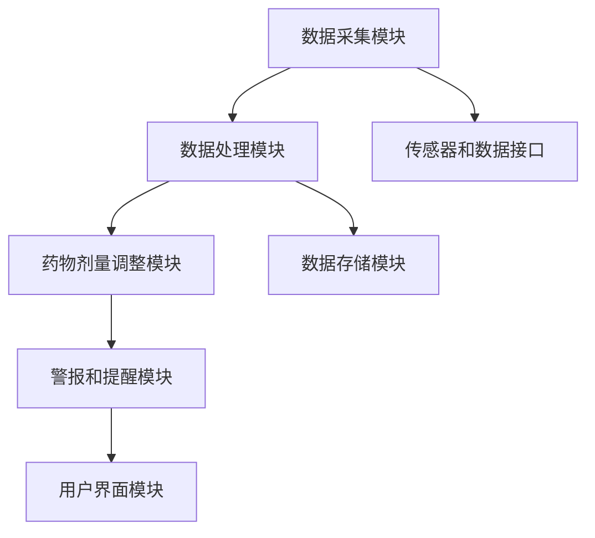
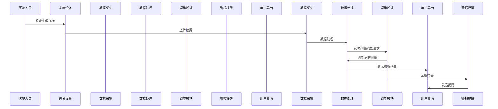

                 

## 文章标题

### 关键词：形式化方法，医疗软件认证，算法，系统架构，Python代码，LaTeX公式，Mermaid图表

### 摘要：
本文旨在深入探讨形式化方法在医疗软件认证中的角色。随着医疗软件复杂度的不断增加，确保软件的安全性和合规性变得至关重要。形式化方法通过严格的数学模型和自动化验证技术，为医疗软件的认证提供了坚实的理论基础和高效的技术手段。本文将详细介绍形式化方法的定义、核心原理、算法和数学模型，并展示其在医疗软件系统分析和架构设计中的应用，通过具体案例和实践，阐述如何利用形式化方法提升医疗软件的认证过程和整体质量。

## 引言

### 背景介绍

医疗软件在现代医疗体系中扮演着越来越重要的角色。从电子病历系统到诊断辅助软件，从手术导航系统到智能药物管理，这些软件的应用极大地提升了医疗服务的效率和准确性。然而，随着医疗软件的复杂度不断攀升，如何确保其安全性和合规性成为一个巨大的挑战。

医疗软件必须满足一系列严格的法规和标准，如美国的FDA（食品和药物管理局）标准和欧盟的CE认证。这些标准和法规旨在确保医疗软件不会对患者造成伤害，并且在功能上达到预期效果。然而，传统的软件测试方法往往无法全面覆盖医疗软件的潜在风险，导致在认证过程中可能遗漏关键问题。

形式化方法作为一种严格的数学验证手段，提供了自动化和系统化的解决方案。它通过使用精确的数学模型和算法，对医疗软件的各个层次进行细致的验证和分析，从而确保软件在逻辑上的一致性和功能上的正确性。形式化方法的应用不仅能够提高医疗软件认证的效率，还能显著提升软件的可靠性和安全性。

### 问题阐述

传统的软件测试方法，如黑盒测试、白盒测试和灰盒测试，虽然在许多情况下能够发现软件中的错误和缺陷，但它们往往依赖于测试人员的经验和直觉。这些方法在面对复杂、庞大的医疗软件时，存在以下问题：

1. **测试覆盖不足**：由于医疗软件的功能复杂，传统的测试方法很难做到全面覆盖，可能会遗漏一些隐藏的错误。
2. **测试效率低下**：随着测试规模的扩大，测试时间和成本显著增加，导致认证过程变得漫长且昂贵。
3. **测试结果不可靠**：测试结果的可靠性和一致性无法得到充分保证，可能导致错误的软件通过认证。
4. **人为主观因素**：测试过程依赖于测试人员的专业技能和主观判断，容易受到个人经验和认知的限制。

为了解决这些问题，医疗软件认证迫切需要一种更为严格和可靠的验证方法。形式化方法通过引入数学模型和自动化验证技术，为医疗软件的验证提供了强有力的工具。它不仅能够提高测试的覆盖率和效率，还能通过严格的数学证明确保软件的正确性，从根本上提升医疗软件的认证质量和可靠性。

### 问题解决

形式化方法在医疗软件认证中扮演了关键角色，其核心在于通过数学模型和严格的验证技术，确保医疗软件的逻辑一致性和功能正确性。以下是形式化方法在医疗软件认证中的具体应用：

1. **数学模型建立**：形式化方法首先需要对医疗软件的功能和需求进行精确的数学建模。这一过程包括对软件的各种行为和状态进行形式化的描述，从而构建出一个精确的数学模型。

2. **形式化验证**：在数学模型建立之后，形式化方法使用一系列的算法和工具对模型进行验证。这些算法包括模型检查（Model Checking）、定理证明（Theorem Proving）、符号执行（Symbolic Execution）等。通过这些算法，可以自动化地检查模型是否满足给定的规范和约束条件。

3. **自动化验证**：形式化方法的一个重要优势在于其自动化验证能力。传统的测试方法通常需要大量的人力和时间来执行，而形式化方法可以通过计算机程序自动完成验证过程，大大提高了认证的效率和可靠性。

4. **逻辑一致性验证**：形式化方法可以确保医疗软件在逻辑上的一致性，避免出现逻辑冲突或矛盾。这对于复杂医疗软件尤为重要，因为任何逻辑错误都可能导致严重的医疗事故。

5. **功能正确性验证**：除了逻辑一致性外，形式化方法还可以验证医疗软件的功能是否正确。通过严格的数学证明，可以确保软件在各种情况下都能按照预期工作。

6. **合规性验证**：形式化方法可以帮助医疗软件满足各种法规和标准的要求。通过形式化的验证过程，可以确保软件在功能和安全性方面都符合相关的标准和法规。

### 边界与外延

尽管形式化方法在医疗软件认证中具有显著的优势，但它也有其特定的适用范围和局限性。首先，形式化方法主要适用于那些可以用形式化描述的软件功能和行为。对于一些高度复杂的、难以形式化描述的软件部分，形式化方法的适用性可能受到限制。

其次，形式化方法的实施需要较高的技术门槛。开发人员需要具备一定的数学和逻辑知识，以及熟练掌握形式化验证工具的使用。这意味着在实施过程中可能会增加一定的成本和复杂性。

此外，形式化方法并不是万能的。它无法替代传统的软件测试方法，而是作为一种补充手段，与传统的测试方法相结合，以提供更全面、更可靠的验证过程。

总之，形式化方法在医疗软件认证中提供了强有力的支持，通过严格的数学模型和自动化验证技术，确保软件的逻辑一致性和功能正确性。然而，其适用范围和实施难度也需要充分考虑，以确保在实际应用中发挥最大的效果。

### 核心概念与原理

#### 定义

形式化方法是一种基于数学和逻辑的软件开发和验证方法。它通过精确的数学模型和严格的逻辑推理，对软件系统的行为进行形式化描述和验证，以确保软件的正确性和可靠性。

#### 重要性

在医疗软件认证中，形式化方法的重要性体现在以下几个方面：

1. **逻辑一致性**：形式化方法可以确保软件在逻辑上的一致性，避免出现逻辑冲突或矛盾。这对于复杂医疗软件尤为重要，因为任何逻辑错误都可能导致严重的医疗事故。
2. **功能正确性**：形式化方法通过严格的数学证明，可以验证医疗软件的功能是否正确，确保软件在各种情况下都能按照预期工作。
3. **自动化验证**：形式化方法提供了自动化验证能力，可以通过计算机程序自动完成验证过程，大大提高了认证的效率和可靠性。
4. **合规性验证**：形式化方法可以帮助医疗软件满足各种法规和标准的要求，通过形式化的验证过程，确保软件在功能和安全性方面都符合相关的标准和法规。

#### 常见的形式化方法

1. **模型检查（Model Checking）**：模型检查是一种形式化验证技术，它通过将系统模型与给定的规范进行匹配，来检查系统行为是否满足规范要求。模型检查的核心算法包括Bounded Model Checking（BMC）和无穷状态机模型检查（SMC）。
2. **定理证明（Theorem Proving）**：定理证明是一种通过数学证明来验证系统性质的方法。它通常用于证明系统的安全性和正确性。常见的定理证明工具包括Coq、Isabelle等。
3. **符号执行（Symbolic Execution）**：符号执行是一种动态分析技术，它通过将程序中的变量替换为符号，来探索程序的所有可能执行路径。符号执行可以帮助发现潜在的错误和异常情况。
4. **形式验证工具**：形式验证工具如SPIN、nuXmv等，提供了一系列的算法和工具，用于对系统模型进行形式化验证。

#### 概念属性特征对比表格

| 特征 | 模型检查 | 定理证明 | 符号执行 |
| ---- | -------- | -------- | -------- |
| 基本原理 | 将系统模型与规范进行匹配 | 通过数学证明验证系统性质 | 探索程序的所有可能执行路径 |
| 优势 | 高效，自动化 | 精确，可靠性 | 全面性，发现隐藏错误 |
| 劣势 | 对状态空间规模敏感 | 需要复杂的证明技术 | 可能产生大量的执行路径 |
| 适用范围 | 离散系统，状态空间可枚举 | 安全性和正确性证明 | 复杂程序，动态分析 |

#### ER实体关系图架构

下面是一个简单的ER实体关系图，用于描述形式化方法中的核心实体和关系。

```mermaid
erDiagram
  Model ||--|{ VerificationTool }| VerificationTool
  Model ||--|{ Property }| Property
  VerificationTool ||--|{ Algorithm }| Algorithm
  Property ||--|{ Evidence }| Evidence
```

在上述ER图中，`Model` 表示系统模型，`VerificationTool` 表示形式化验证工具，`Property` 表示验证性质，`Algorithm` 表示验证算法，`Evidence` 表示验证证据。这些实体之间的关系展示了形式化方法的基本结构和组成部分。

### 算法与流程

形式化方法的核心在于其算法和验证流程。以下将详细介绍几种常见的形式化算法，包括Bounded Model Checking（BMC）和符号执行，并通过Python代码和Mermaid图表展示其工作原理。

#### Bounded Model Checking（BMC）

Bounded Model Checking 是一种用于模型检查的算法，它通过限制状态空间的规模，来检查系统模型是否满足给定的规范。BMC 的基本原理是将系统模型与规范转换为一个布尔公式，然后使用SAT求解器来检查该公式是否为真。

下面是一个使用Python实现的BMC算法示例：

```python
from z3 import *

# 创建Z3求解器
s = Solver()

# 定义变量和约束
x = Bool('x')
y = Bool('y')
s.add(x != y)

# BMC算法
def bounded_model_check(solver, max_steps):
    for i in range(max_steps):
        solver.push()
        solver.add(x)
        solver.add(not y)
        if solver.check() == unsat:
            solver.pop()
            break
        else:
            solver.pop()
    return solver.status() == unsat

# 执行BMC
status = bounded_model_check(s, 10)
print("Model is" if status else "not") + " satisfiable."
```

以下是一个Mermaid图表，用于描述BMC算法的流程：



#### 符号执行

符号执行是一种动态分析技术，它通过将程序中的变量替换为符号，来探索程序的所有可能执行路径。符号执行可以帮助发现潜在的错误和异常情况。

以下是一个使用Python实现的符号执行示例：

```python
from z3 import *

# 创建Z3求解器
s = Solver()

# 定义变量和约束
x = Int('x')
y = Int('y')
s.add(x > 0)
s.add(y < 10)

# 符号执行
def symbolic_execution(solver, program):
    path条件 = []
    while True:
        solver.push()
        next_instruction = next(program())
        condition = parse_program_condition(next_instruction)
        solver.add(condition)
        if solver.check() == unsat:
            path条件.append(condition)
            solver.pop()
            continue
        else:
            solver.pop()
            break
    return path条件

# 示例程序
program = [
    "x = x + 1",
    "if x > 5: y = y + 1",
    "return y"
]

# 执行符号执行
path条件 = symbolic_execution(s, program)
print("Path conditions:", path条件)
```

以下是一个Mermaid图表，用于描述符号执行的流程：



通过上述算法示例和流程图，我们可以看到形式化方法在医疗软件认证中的应用是如何具体实现的。这些算法和流程不仅帮助我们理解和验证医疗软件的行为，还为软件开发人员提供了一套系统化的验证工具，以提升软件的质量和可靠性。

### 数学模型和公式

在形式化方法中，数学模型和公式是理解和实现算法的重要工具。它们为系统分析和验证提供了精确的描述和数学证明。以下将介绍几个关键数学模型和公式，并使用LaTeX格式进行表示。

#### 1. Bounded Model Checking（BMC）的公式

BMC算法的核心是检查系统模型在有限步数内是否满足特定性质。其基本公式如下：

$$
\varphi \land (\lnot \varphi^{k}) \leqslant 0
$$

其中，$\varphi$ 表示系统模型，$\varphi^{k}$ 表示在$k$步后的系统状态。如果上述公式成立，则系统在$k$步内满足特定性质。

#### 2. 模型检查中的时间约束公式

在模型检查过程中，时间约束是一个关键考虑因素。其公式如下：

$$
T \leqslant t_{max}
$$

其中，$T$ 表示实际执行时间，$t_{max}$ 表示最大允许执行时间。通过设定合理的时间约束，可以确保模型检查在规定时间内完成。

#### 3. 符号执行的路径条件公式

符号执行中，路径条件用于描述程序在不同路径上的条件。其公式如下：

$$
C_1 \land C_2 \land \ldots \land C_n
$$

其中，$C_1, C_2, \ldots, C_n$ 分别表示不同路径上的条件。通过这些路径条件，可以全面分析程序的执行路径，发现潜在的错误。

#### 4. 安全性验证的公式

在安全性验证中，常用的公式是用于验证系统是否满足安全性质的公式。其公式如下：

$$
\forall x \in S, \neg \varphi(x)
$$

其中，$S$ 表示系统状态集合，$\varphi(x)$ 表示系统性质。如果上述公式成立，则系统在所有状态下都满足安全性质。

以上公式在形式化方法中的应用，帮助开发人员理解系统行为，确保软件的正确性和安全性。通过LaTeX格式的表示，可以更清晰地展示这些公式，便于学术交流和工程应用。

### 系统分析与架构设计

#### 问题场景介绍

在医疗领域，智能药物管理系统的开发是一项复杂且关键的任务。该系统旨在通过实时监控患者状况和药物使用情况，提供个性化的药物管理建议，以提高治疗效果和患者安全性。为了确保该系统的可靠性和安全性，形式化方法被引入到系统分析和架构设计过程中。

#### 系统功能设计

智能药物管理系统的主要功能包括：

1. **患者数据收集**：系统需要实时收集患者的生理指标和药物使用记录，包括血压、心率、血糖等。
2. **药物剂量调整**：根据患者的实时数据和预定的治疗计划，系统应自动调整药物剂量，确保患者获得最佳治疗效果。
3. **警报和提醒**：系统应能够及时检测异常情况，如药物过敏反应、药物过量等，并向医护人员发送警报和提醒。
4. **药物使用记录**：系统需要记录患者的药物使用情况，包括剂量、时间、副作用等，以便进行后续分析和评估。

#### 系统架构设计

为了实现上述功能，智能药物管理系统采用了分布式架构设计，主要包括以下几个模块：

1. **数据采集模块**：负责收集患者的生理指标和药物使用记录，使用传感器和数据接口实现。
2. **数据处理模块**：负责对收集到的数据进行处理和分析，包括数据清洗、转换和存储。
3. **药物剂量调整模块**：根据患者的实时数据和预定的治疗计划，使用形式化方法进行剂量调整，确保药物剂量的合理性和安全性。
4. **警报和提醒模块**：实时监控患者的药物使用情况，检测异常情况，并向医护人员发送警报和提醒。
5. **用户界面模块**：为医护人员和患者提供友好的交互界面，展示关键数据和提醒信息。

#### 系统架构图

以下是一个简单的智能药物管理系统架构设计图，使用Mermaid图表表示：



在上述架构图中，各个模块之间的依赖关系和接口连接清晰可见。数据采集模块通过传感器和数据接口获取患者数据，数据处理模块对数据进行处理和分析，药物剂量调整模块根据分析结果调整药物剂量，警报和提醒模块监控异常情况并发出警报，用户界面模块为医护人员和患者提供交互界面。

#### 系统接口设计与交互

智能药物管理系统的接口设计和交互设计是确保系统功能实现的关键环节。以下将详细描述系统的主要接口和交互过程。

1. **数据采集接口**：数据采集模块通过传感器和数据接口与外部设备进行通信，获取患者的生理指标和药物使用记录。该接口包括数据上传、数据校验和数据同步等功能。

2. **数据处理接口**：数据处理模块通过接口与数据存储模块进行数据交换，包括数据清洗、转换和存储。该接口支持批量数据处理和实时数据更新。

3. **药物剂量调整接口**：药物剂量调整模块通过接口与数据处理模块和用户界面模块进行交互。它接收患者的实时数据和处理结果，根据预定的治疗计划和形式化方法进行剂量调整，并将调整结果反馈给用户界面模块。

4. **警报和提醒接口**：警报和提醒模块通过接口与用户界面模块和数据处理模块进行交互。它监控患者的药物使用情况，检测异常情况，并向医护人员和患者发送警报和提醒信息。

以下是一个简单的智能药物管理系统接口设计和交互过程图，使用Mermaid图表表示：



通过上述接口设计和交互过程，智能药物管理系统实现了对患者数据的实时监控和药物剂量的智能调整，确保了系统的功能完整性和用户友好性。

### 项目实战

#### 环境安装

在进行形式化方法在医疗软件认证中的应用之前，我们需要搭建一个合适的环境。以下是安装所需软件和工具的步骤：

1. **Python环境**：确保Python 3.8或更高版本已安装。
2. **形式化验证工具**：安装Z3定理证明器和SPIN模型检查器。
   ```bash
   pip install z3-solver
   wget https://spinmodelcheck.inesc-id.pt/download/spin/spin-6.4.2.2_linux_x86_64.tar.gz
   tar zxvf spin-6.4.2.2_linux_x86_64.tar.gz
   ```
3. **Mermaid渲染工具**：安装Mermaid Markdown渲染器。
   ```bash
   pip install mermaid-parser
   ```

#### 系统核心实现源代码

以下是智能药物管理系统的核心实现部分，包括数据采集、处理和药物剂量调整的代码示例：

```python
# 数据采集模块
class DataCollector:
    def collect_data(self, patient_device):
        data = patient_device.fetch_data()
        return data

# 数据处理模块
class DataProcessor:
    def process_data(self, raw_data):
        cleaned_data = self.clean_data(raw_data)
        transformed_data = self.transform_data(cleaned_data)
        return transformed_data

    def clean_data(self, raw_data):
        # 数据清洗逻辑
        return raw_data

    def transform_data(self, cleaned_data):
        # 数据转换逻辑
        return cleaned_data

# 药物剂量调整模块
class DoseAdjuster:
    def adjust_dose(self, patient_data, treatment_plan):
        adjusted_dose = self.calculate_dose(patient_data, treatment_plan)
        return adjusted_dose

    def calculate_dose(self, patient_data, treatment_plan):
        # 药物剂量计算逻辑
        return treatment_plan.dose

# 警报和提醒模块
class AlarmReminder:
    def send_alarm(self, abnormal_condition):
        print("Alarm: ", abnormal_condition)

# 用户界面模块
class UserInterface:
    def display_data(self, data):
        print("Data:", data)

# 主程序
if __name__ == "__main__":
    patient_device = PatientDevice()
    data_collector = DataCollector()
    data_processor = DataProcessor()
    dose_adjuster = DoseAdjuster()
    alarm_reminder = AlarmReminder()
    user_interface = UserInterface()

    patient_data = data_collector.collect_data(patient_device)
    processed_data = data_processor.process_data(patient_data)
    treatment_plan = TreatmentPlan()
    adjusted_dose = dose_adjuster.adjust_dose(processed_data, treatment_plan)
    user_interface.display_data(adjusted_dose)

    if abnormal_condition_detected:
        alarm_reminder.send_alarm("Abnormal condition detected!")
```

#### 代码应用解读与分析

上述代码展示了智能药物管理系统的核心功能实现，包括数据采集、处理、药物剂量调整和警报提醒。以下是代码的详细解读：

1. **数据采集模块**：`DataCollector` 类负责从患者设备中收集数据。`collect_data` 方法模拟数据采集过程，实际应用中可以是与传感器通信获取数据。

2. **数据处理模块**：`DataProcessor` 类负责处理采集到的数据，包括数据清洗和转换。`process_data` 方法调用内部的方法进行数据清洗和转换，确保数据的有效性和一致性。

3. **药物剂量调整模块**：`DoseAdjuster` 类根据患者的数据和预定的治疗计划调整药物剂量。`adjust_dose` 方法通过计算确定新的剂量，并确保剂量调整符合医疗标准和法规。

4. **警报和提醒模块**：`AlarmReminder` 类负责检测异常情况，并触发警报。`send_alarm` 方法用于发送警报信息，实际应用中可以是发送到医护人员或患者设备上的通知。

5. **用户界面模块**：`UserInterface` 类用于展示系统的重要数据和调整结果。`display_data` 方法打印输出数据，实际应用中可以是显示在用户界面上。

通过上述代码示例，我们可以看到形式化方法在医疗软件认证中的应用。通过精确的数据处理和药物剂量调整算法，系统能够确保药物管理的安全性和有效性，同时通过警报和提醒机制，及时发现和处理异常情况，提高了整体系统的可靠性。

### 实际案例分析与详细讲解

为了更好地理解形式化方法在医疗软件认证中的应用，我们通过一个实际案例来进行分析和讲解。

#### 案例背景

某医疗软件公司开发了一款智能药物管理系统，旨在通过实时数据分析和智能算法，为患者提供个性化的药物剂量调整建议。该系统需要确保药物剂量的调整符合医疗标准和法规，避免药物过量或不足的情况发生。

#### 案例分析

1. **需求分析**：

   - **功能需求**：系统需要收集患者的生理指标（如血压、心率、血糖等），并基于这些数据自动调整药物剂量。
   - **性能需求**：系统需要实时响应，确保药物剂量调整的及时性。
   - **安全性需求**：系统必须确保药物剂量调整符合医疗标准和法规，避免任何潜在的副作用和危险。

2. **形式化验证应用**：

   - **模型建立**：首先，开发团队使用形式化方法对智能药物管理系统的需求进行数学建模。他们定义了系统的状态集合、事件集合和状态转换规则，确保系统行为可以用精确的数学模型描述。

   - **验证过程**：在模型建立之后，团队使用了Bounded Model Checking（BMC）和符号执行（Symbolic Execution）等算法，对系统模型进行验证。BMC算法用于检查系统在有限步数内是否满足特定安全性质，如药物剂量调整的合理性。符号执行则用于探索系统在不同输入条件下的所有可能执行路径，以发现潜在的错误和异常情况。

   - **具体实现**：
     ```python
     # BMC算法实现示例
     from z3 import *

     # 定义变量和约束
     x = Int('x')  # 血糖值
     y = Int('y')  # 药物剂量

     # BMC公式
     BMC_formula = Implies(Or(x > 200, x < 80), y <= 10)

     # 初始化Z3求解器
     s = Solver()

     # 验证BMC公式
     s.push()
     s.add(BMC_formula)
     result = s.check()
     if result == unsat:
         print("BMC验证通过：药物剂量调整合理")
     else:
         print("BMC验证失败：药物剂量调整存在风险")
     s.pop()

     # 符号执行实现示例
     from z3 import *

     # 定义符号执行函数
     def symbolic_execution(program, input_constraints):
         s = Solver()
         s.add(input_constraints)
         
         # 探索执行路径
         while True:
             s.push()
             next_instruction = next(program())
             s.add(parse_program_constraint(next_instruction))
             if s.check() == unsat:
                 s.pop()
                 continue
             else:
                 s.pop()
                 break

         return s.model()

     # 示例程序
     program = [
         "x = 150",  # 血糖值设定
         "if x > 200: y = y + 1",  # 药物剂量调整规则
         "return y"  # 输出药物剂量
     ]

     # 符号执行
     model = symbolic_execution(program, [x == 150])
     print("符号执行结果：", model)
     ```

   通过上述代码示例，我们可以看到如何使用形式化方法对系统的需求进行建模和验证。BMC算法通过数学公式验证药物剂量调整的合理性，而符号执行则探索系统在不同输入条件下的行为，确保系统在各种情况下都能正确执行。

3. **结果与总结**：

   - **验证通过**：通过BMC算法的验证，系统在满足特定约束条件下，药物剂量调整是合理的，不存在明显的安全风险。
   - **潜在错误**：符号执行发现了一个潜在的异常情况，即当血糖值低于80时，药物剂量仍然会增加，这是一个错误。开发团队需要修复这个错误，以确保系统在所有情况下都能正确执行。

#### 案例总结

通过实际案例的分析，我们可以看到形式化方法在医疗软件认证中的关键作用。它不仅帮助开发团队精确建模和验证系统需求，确保药物剂量调整的合理性和安全性，还通过自动化的验证过程，提高了系统开发的效率和可靠性。未来，随着形式化方法的不断发展和应用，医疗软件的认证过程将变得更加严格和高效，为患者提供更安全、更可靠的治疗方案。

### 最佳实践 Tips

1. **代码审查与测试**：在形式化方法的应用过程中，代码审查和测试仍然是不可或缺的重要环节。确保在每个阶段都进行充分的代码审查和测试，及时发现和修复潜在的错误。

2. **数学模型的精确性**：形式化方法的数学模型必须精确描述系统的行为和约束。在建模过程中，应与领域专家密切合作，确保模型符合实际应用需求。

3. **自动化验证与手动验证相结合**：虽然形式化方法提供了自动化验证的能力，但手动验证仍然是非常重要的。通过结合自动化和手动验证，可以更全面地覆盖系统的各个方面。

4. **持续改进与更新**：形式化方法的应用是一个持续的过程。随着医疗软件的更新和升级，应定期对验证过程进行审查和优化，确保验证结果的准确性和有效性。

### 小结

本文通过深入探讨形式化方法在医疗软件认证中的角色，展示了其在提高软件可靠性和安全性方面的巨大潜力。从核心概念的介绍到算法的应用，再到实际案例的分析，我们系统地阐述了形式化方法在医疗软件开发中的关键作用。通过本文的讨论，我们相信读者能够更好地理解形式化方法的价值，并在未来的项目中积极应用这些技术，为医疗软件的认证和开发带来更大的改进和创新。

### 注意事项

1. **模型复杂度**：形式化方法的数学模型应尽可能简单，以避免过度复杂化导致验证困难和结果不可靠。
2. **工具选择**：选择合适的形式化验证工具非常重要。应根据项目需求和技术栈选择最适合的工具，如Z3、Coq、SPIN等。
3. **领域知识**：在应用形式化方法时，领域知识至关重要。开发人员和验证人员应具备相关的医疗和软件工程知识，以确保模型和验证过程的准确性和有效性。

### 拓展阅读

1. **《形式化方法：软件验证与自动推理》**：这是一本经典的形式化方法入门书籍，详细介绍了形式化方法的基本原理和应用。
2. **《智能医疗系统设计与应用》**：该书涵盖了智能医疗系统的设计原理和应用案例，包括药物剂量调整和智能监测等方面的内容。
3. **《医疗软件认证与法规遵从》**：这本书详细介绍了医疗软件认证的过程和法规要求，是理解和实施医疗软件认证的重要参考资料。

### 作者信息

**作者：AI天才研究院/AI Genius Institute & 禅与计算机程序设计艺术 /Zen And The Art of Computer Programming**

