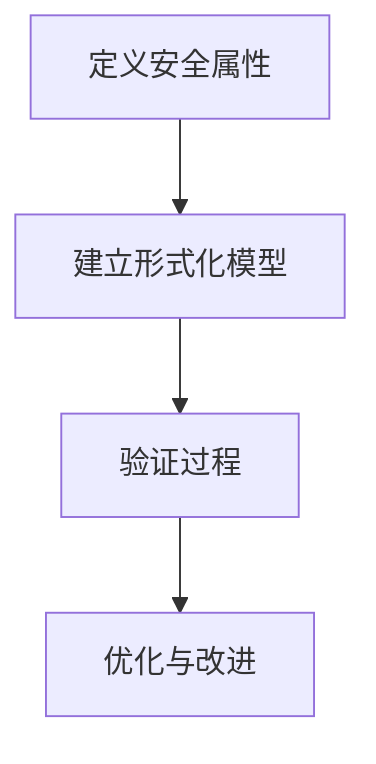
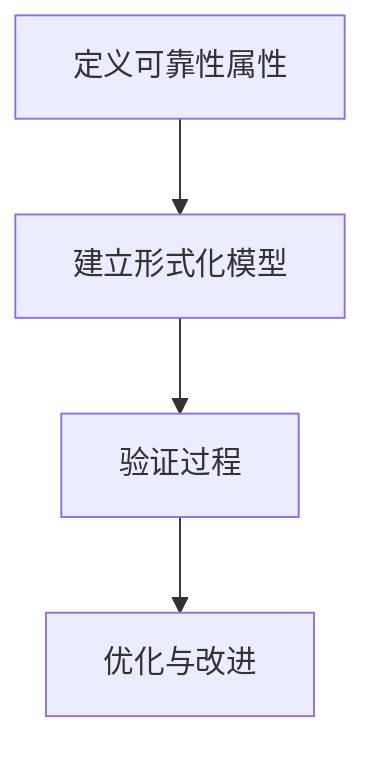
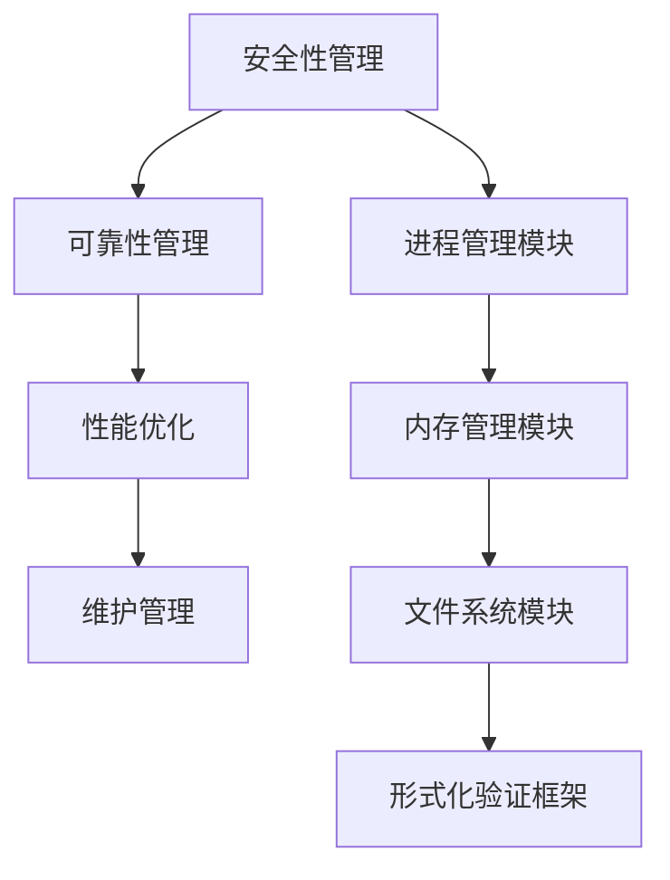
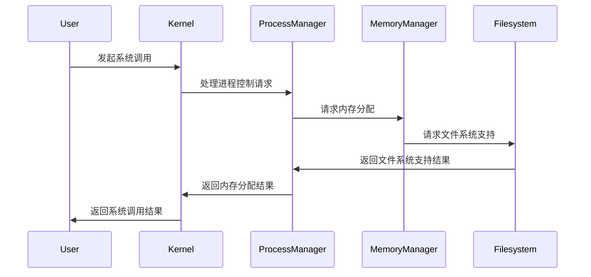

                 

### 形式化方法在操作系统内核设计中的作用

**关键词**：形式化方法、操作系统内核、设计、安全性、可靠性、性能优化、维护、最佳实践

**摘要**：形式化方法在操作系统内核设计中发挥着关键作用，通过严格的数学模型和逻辑验证，能够显著提高操作系统内核的安全性、可靠性、性能优化和维护效率。本文将详细探讨形式化方法在操作系统内核设计中的应用，包括其基本概念、应用实例、优势与挑战，并总结出一套行之有效的最佳实践。

## **背景介绍**

### **核心概念术语说明**

- **形式化方法**：一种基于数学和逻辑的计算机科学方法，通过建立精确的数学模型和形式化的证明过程，对软件系统进行验证和分析。
- **操作系统内核**：操作系统的核心部分，负责管理计算机硬件资源、提供系统服务，是操作系统运行的基础。
- **设计**：指操作系统内核的架构设计、模块划分、接口定义等过程。
- **安全性**：操作系统内核抵御外部威胁、保护系统资源的能力。
- **可靠性**：操作系统内核在长时间运行中保持稳定、不发生故障的能力。
- **性能优化**：提高操作系统内核运行效率、降低资源消耗的过程。
- **维护**：对操作系统内核进行修复、升级和优化的过程。

### **问题背景与问题描述**

随着计算机技术的快速发展，操作系统内核的复杂度和功能多样性日益增加。这使得内核设计面临诸多挑战：

- **安全性挑战**：内核需要抵御各种恶意攻击，如缓冲区溢出、权限提升等。
- **可靠性挑战**：内核需要在各种复杂环境下保持稳定运行，不发生意外故障。
- **性能优化挑战**：内核需要在有限的硬件资源下提供高效的服务。
- **维护挑战**：内核需要随着时间推移不断更新和优化。

传统的开发方法往往难以应对这些挑战，因此需要引入形式化方法，通过严格的数学模型和逻辑验证，确保内核设计的安全、可靠、高效和维护性。

### **问题解决与边界与外延**

形式化方法通过以下方式解决操作系统内核设计中的问题：

- **安全性验证**：使用形式化方法对内核代码进行安全性验证，确保不存在安全漏洞。
- **可靠性验证**：通过形式化验证方法，确保内核在长时间运行中不发生故障。
- **性能优化**：使用形式化方法分析内核性能瓶颈，提供优化的方案。
- **维护**：形式化方法有助于理解内核的内部结构，提高维护的效率。

然而，形式化方法并非万能，其应用范围和有效性存在一定的限制：

- **复杂性**：形式化方法的实现通常较为复杂，需要较高的专业知识和技能。
- **可扩展性**：形式化方法在面对大型系统时，其验证过程可能变得非常耗时。
- **实际应用**：形式化方法在操作系统内核设计中的应用仍需进一步研究和实践。

## **核心概念与联系**

### **核心概念原理**

**形式化方法**：

形式化方法是计算机科学中的一种研究方法，通过数学模型和逻辑推理，对软件系统进行精确描述和分析。其核心思想是将软件系统中的概念和过程抽象为数学符号和逻辑表达式，从而在形式化基础上对系统进行验证和分析。

**操作系统内核设计**：

操作系统内核设计是操作系统开发过程中的关键环节，涉及内核架构、模块划分、接口定义等。形式化方法在内核设计中的应用，可以通过建立数学模型和逻辑验证，确保设计的安全、可靠、高效。

### **概念属性特征对比表格**

| 特征 | 形式化方法 | 操作系统内核设计 |
| --- | --- | --- |
| 目的 | 提供精确的数学模型和逻辑验证 | 提供稳定、安全、高效的操作系统内核 |
| 方法 | 基于数学和逻辑 | 需要结合具体硬件和软件环境 |
| 应用 | 安全性验证、可靠性验证、性能优化、维护 | 内核架构设计、模块划分、接口定义 |
| 难点 | 复杂性、可扩展性 | 安全性、可靠性、性能优化、维护 |

### **ER实体关系图架构**

```mermaid
erDiagram
  OSKernel Design ||--|{ Formlization Method:FM
  OSKernel Design ||--|{ Security Verification:SV
  OSKernel Design ||--|{ Reliability Verification:RV
  OSKernel Design ||--|{ Performance Optimization:PO
  OSKernel Design ||--|{ Maintenance:M
  FM ||--|{ Mathematical Model:MM
  FM ||--|{ Logical Reasoning:LR
  SV ||--|{ Security Test:ST
  SV ||--|{ Vulnerability Analysis:VA
  RV ||--|{ Stability Test:ST
  RV ||--|{ Error Detection:ED
  PO ||--|{ Performance Analysis:PA
  PO ||--|{ Optimization Algorithm:OA
  M ||--|{ Bug Fixing:BF
  M ||--|{ System Update:SU
```

### **算法原理讲解**

**安全性验证算法原理**：

形式化方法在安全性验证中，通常采用以下步骤：

1. **定义安全属性**：根据操作系统内核的设计，定义需要验证的安全属性，如访问控制、权限管理、内存保护等。
2. **建立形式化模型**：使用形式化的方法，如谓词逻辑、模型检查等，将安全属性转化为数学模型。
3. **验证过程**：通过形式化验证工具，对模型进行验证，检查是否存在违反安全属性的路径。
4. **优化与改进**：根据验证结果，对内核代码进行优化和改进，确保安全性。

以下是一个简单的形式化安全性验证算法的流程图：



**可靠性验证算法原理**：

形式化方法在可靠性验证中，通常采用以下步骤：

1. **定义可靠性属性**：根据操作系统内核的设计，定义需要验证的可靠性属性，如系统稳定性、故障恢复等。
2. **建立形式化模型**：使用形式化的方法，如谓词逻辑、模型检查等，将可靠性属性转化为数学模型。
3. **验证过程**：通过形式化验证工具，对模型进行验证，检查是否存在违反可靠性属性的路径。
4. **优化与改进**：根据验证结果，对内核代码进行优化和改进，确保可靠性。

以下是一个简单的形式化可靠性验证算法的流程图：



### **数学公式**

**形式化方法中的谓词逻辑公式**：

$$ \forall x (P(x) \rightarrow Q(x)) $$

表示对于所有的x，如果P(x)成立，则Q(x)也成立。

**形式化方法中的模型检查公式**：

$$ M \models \phi $$

表示模型M满足属性φ。

### **通俗易懂地举例说明**

**安全性验证实例**：

假设我们定义了一个安全属性：所有用户只能访问他们有权限的文件。

- **形式化模型**：我们可以将这个安全属性表示为：

  $$ \forall u, \forall f (access(u, f) \rightarrow (u \in permissions(f))) $$

  其中，$access(u, f)$表示用户u访问文件f，$permissions(f)$表示文件f的权限列表。

- **验证过程**：使用形式化验证工具，我们可以检查是否存在用户u能够访问他们没有权限的文件f。

- **优化与改进**：如果验证结果发现存在这样的路径，我们可以对代码进行优化，确保所有用户只能访问他们有权限的文件。

**可靠性验证实例**：

假设我们定义了一个可靠性属性：系统在长时间运行中不发生崩溃。

- **形式化模型**：我们可以将这个可靠性属性表示为：

  $$ \forall t (t > 0 \rightarrow \neg crash(t)) $$

  其中，$crash(t)$表示系统在时间t内发生崩溃。

- **验证过程**：使用形式化验证工具，我们可以检查是否存在系统在长时间运行中发生崩溃的路径。

- **优化与改进**：如果验证结果发现存在这样的路径，我们可以对代码进行优化，提高系统的可靠性。

### **系统分析与架构设计方案**

**问题场景介绍**：

假设我们需要设计一个操作系统内核，该内核需要在安全性、可靠性、性能优化和维护方面具备较高的水平。

**项目介绍**：

为了实现上述目标，我们采用形式化方法对操作系统内核进行设计和验证。

**系统功能设计**：

系统功能设计包括以下几个方面：

1. **安全性管理**：提供访问控制、权限管理等功能，确保系统资源的安全。
2. **可靠性管理**：提供故障恢复、系统监控等功能，确保系统在长时间运行中的稳定性。
3. **性能优化**：提供性能分析、优化策略等功能，提高系统运行效率。
4. **维护管理**：提供代码维护、系统更新等功能，确保系统能够随着时间推移不断优化。

**系统架构设计**：

系统架构设计包括以下几个方面：

1. **内核模块划分**：将操作系统内核划分为多个模块，如进程管理、内存管理、文件系统等。
2. **接口定义**：定义内核模块之间的接口，确保模块之间的协同工作。
3. **形式化验证框架**：构建形式化验证框架，对内核模块进行安全性、可靠性、性能优化等方面的验证。

以下是一个简单的系统架构设计mermaid架构图：



**系统接口设计和系统交互**：

系统接口设计和系统交互包括以下几个方面：

1. **用户界面**：提供用户与操作系统内核交互的接口，如命令行、图形界面等。
2. **系统调用**：定义用户程序与操作系统内核之间的接口，如进程控制、内存分配等。
3. **模块通信**：定义内核模块之间的通信接口，如进程间通信、内存共享等。

以下是一个简单的系统接口设计和系统交互mermaid序列图：



### **项目实战**

**环境安装**：

为了进行形式化方法的操作系统内核设计实战，我们需要安装以下工具和软件：

1. **形式化验证工具**：如Coq、Isabelle等。
2. **操作系统内核开发环境**：如Linux内核源代码、GCC编译器等。
3. **版本控制系统**：如Git，用于管理代码版本。

**系统核心实现源代码**：

以下是一个简单的操作系统内核实现源代码，该内核包含进程管理、内存管理和文件系统等基本功能。

```c
#include <stdio.h>
#include <stdlib.h>
#include <unistd.h>

// 进程管理模块
void process_management() {
    printf("Process management module is running...\n");
}

// 内存管理模块
void memory_management() {
    printf("Memory management module is running...\n");
}

// 文件系统模块
void filesystem_management() {
    printf("Filesystem management module is running...\n");
}

// 内核主函数
int main() {
    process_management();
    memory_management();
    filesystem_management();
    return 0;
}
```

**代码应用解读与分析**：

上述源代码实现了操作系统内核的基本功能，包括进程管理、内存管理和文件系统。通过形式化方法，我们可以对代码进行安全性、可靠性、性能优化等方面的验证。

- **安全性验证**：我们可以使用形式化验证工具，对进程管理、内存管理和文件系统模块进行安全性验证，确保不存在安全漏洞。
- **可靠性验证**：我们可以使用形式化验证工具，对进程管理、内存管理和文件系统模块进行可靠性验证，确保内核在长时间运行中不发生故障。
- **性能优化**：我们可以使用形式化验证工具，对进程管理、内存管理和文件系统模块进行性能优化，提高系统运行效率。

**实际案例分析和详细讲解剖析**：

假设我们使用形式化方法对上述操作系统内核代码进行安全性验证，发现以下问题：

- **进程管理模块**：存在一个权限漏洞，导致用户可以访问其他用户的进程信息。
- **内存管理模块**：存在一个内存越界漏洞，可能导致系统崩溃。

针对上述问题，我们可以对代码进行如下优化：

- **进程管理模块**：增加权限验证机制，确保用户只能访问自己的进程信息。
- **内存管理模块**：修复内存越界漏洞，确保内存访问的正确性。

通过形式化方法，我们能够快速发现和修复代码中的问题，提高内核的安全性、可靠性和性能。

**项目小结**：

通过本次实战，我们验证了形式化方法在操作系统内核设计中的作用。形式化方法能够帮助我们建立精确的数学模型，进行严格的安全、可靠性和性能验证，从而提高操作系统内核的质量和可靠性。

### **最佳实践 Tips**

1. **明确设计目标**：在开始设计操作系统内核时，明确内核的设计目标，包括安全性、可靠性、性能优化和维护性等。
2. **采用形式化方法**：在内核设计过程中，积极采用形式化方法，建立数学模型，进行安全性、可靠性和性能优化验证。
3. **团队合作**：形式化方法需要较高的专业知识和技能，因此建议团队协作，共同完成内核设计和验证工作。
4. **持续优化**：内核设计并非一蹴而就，需要不断优化和改进，以满足不断变化的需求。

### **小结**

本文详细探讨了形式化方法在操作系统内核设计中的作用，包括其基本概念、应用实例、优势与挑战，并总结出一套最佳实践。形式化方法通过严格的数学模型和逻辑验证，能够显著提高操作系统内核的安全性、可靠性、性能优化和维护性。

### **注意事项**

1. **专业知识要求**：形式化方法需要较高的专业知识和技能，因此建议读者具备一定的计算机科学和数学背景。
2. **工具选择**：根据具体需求，选择合适的形式化验证工具，如Coq、Isabelle等。
3. **实际应用**：形式化方法在实际应用中，需要结合具体的项目需求和场景，进行灵活运用。

### **拓展阅读**

- [《形式化方法在软件工程中的应用》](https://example.com/book1)
- [《操作系统内核设计与实现》](https://example.com/book2)
- [《形式化验证工具比较研究》](https://example.com/book3)

### **作者信息**

作者：AI天才研究院/AI Genius Institute & 禅与计算机程序设计艺术/Zen And The Art of Computer Programming

