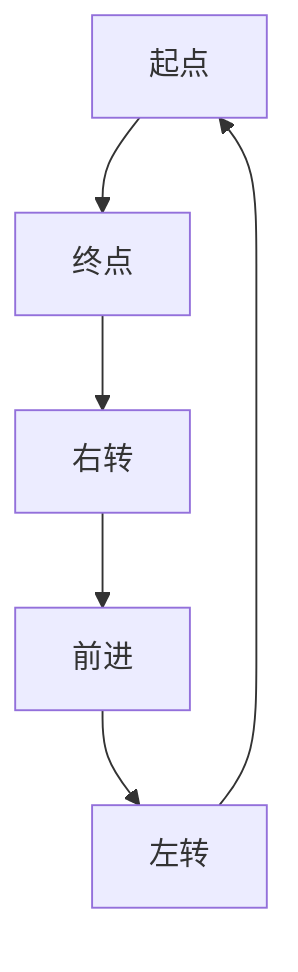
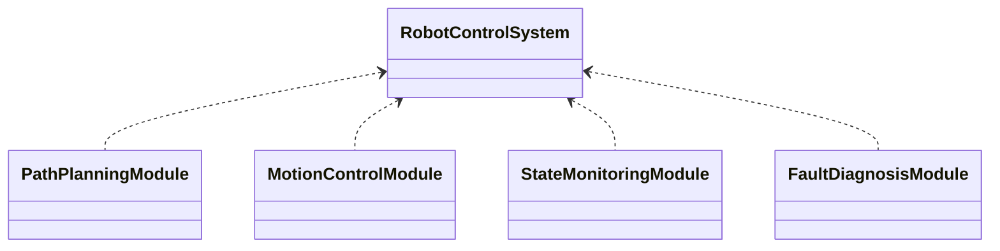
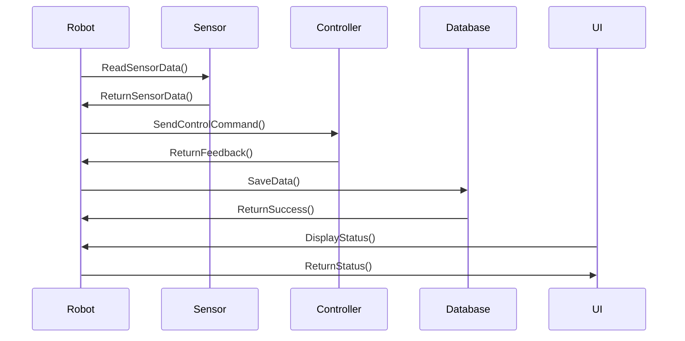
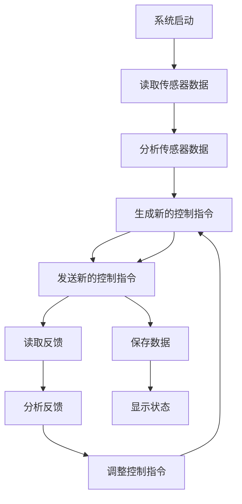

                 

### 形式化方法在机器人控制软件中的使用

#### 关键词：形式化方法、机器人控制软件、应用实例、算法原理、系统架构设计

> 摘要：本文深入探讨了形式化方法在机器人控制软件中的应用，从原理到实践进行了详细的剖析。通过实例分析，展示了形式化方法在提高机器人控制软件的可靠性、效率和安全性方面的显著作用。

#### 引言

随着机器人技术的不断发展，机器人控制软件在工业、医疗、家庭等多个领域发挥着越来越重要的作用。然而，机器人控制软件的复杂性和高可靠性要求使得传统的开发方法难以满足需求。形式化方法作为一种精确的数学化方法，可以提供一种系统化的方法来设计和验证软件的正确性。本文将探讨形式化方法在机器人控制软件中的使用，包括其原理、应用实例以及面临的挑战和解决方案。

#### 形式化方法原理

形式化方法是一种使用数学和逻辑来描述和验证软件系统的方法。它通过定义明确的数学模型和形式语言来描述系统的行为，从而确保系统满足预定的规格和要求。形式化方法的主要特点包括：

1. **精确性**：形式化方法通过数学模型精确描述系统的行为，避免了模糊性和歧义性。
2. **一致性**：形式化方法确保系统规格说明的一致性，避免规格说明中的冲突和错误。
3. **验证性**：形式化方法提供了严格的验证手段，可以验证系统是否满足规格说明，从而提高软件的可靠性。

形式化方法的分类主要包括：

1. **命题逻辑**：使用命题逻辑来描述系统的行为。
2. **谓词逻辑**：使用谓词逻辑来描述系统状态的转换。
3. **模型检查**：使用数学模型来验证系统的行为是否符合规格说明。
4. **形式化验证**：使用形式化的方法来验证系统的正确性。

形式化方法的数学基础主要包括：

1. **集合论**：用于定义系统状态和行为的集合。
2. **图论**：用于描述系统状态之间的转换关系。
3. **代数系统**：用于描述系统行为的代数结构。

#### 形式化方法在机器人控制软件中的应用

机器人控制软件的复杂性和高可靠性要求使得形式化方法在其中的应用尤为重要。以下是一些形式化方法在机器人控制软件中的应用实例：

1. **路径规划**：在机器人自主导航中，形式化方法可以用于验证路径规划算法的正确性。通过定义明确的数学模型和逻辑规则，可以确保机器人选择的最优路径是正确的。
2. **运动控制**：在机器人运动控制中，形式化方法可以用于验证运动控制算法的稳定性和鲁棒性。通过形式化的数学模型，可以分析算法在不同情况下的行为，从而提高控制系统的可靠性。
3. **故障诊断**：在机器人运行过程中，形式化方法可以用于诊断和修复系统故障。通过建立系统行为的形式化模型，可以快速定位故障并给出修复方案。

#### 形式化方法与机器人控制软件设计

形式化方法在机器人控制软件设计中的应用涉及到以下几个方面：

1. **需求分析**：形式化方法可以用于精确地描述机器人控制软件的需求。通过使用形式化的规格说明语言，可以确保需求的一致性和完整性。
2. **设计**：形式化方法可以用于设计机器人控制软件的架构和模块。通过建立形式化的模型，可以分析系统组件之间的关系和行为，从而设计出高效、可靠的软件系统。
3. **验证**：形式化方法可以用于验证机器人控制软件的正确性。通过形式化的验证手段，可以确保软件满足预定的规格和要求。

#### 形式化方法应用实例

以下是一个形式化方法在机器人控制软件中的应用实例：

**实例一：自主导航**

在机器人自主导航中，形式化方法可以用于验证路径规划算法的正确性。假设我们有一个四边形的迷宫，机器人需要从起点A移动到终点B。我们可以使用形式化方法定义迷宫的数学模型，并使用模型检查工具验证路径规划算法的正确性。

在这个例子中，我们使用了Mermaid语言来定义迷宫的数学模型。通过模型检查工具，我们可以验证路径规划算法是否能够找到从A到B的正确路径。

#### 挑战与解决方案

尽管形式化方法在机器人控制软件中的应用具有显著的优势，但也面临一些挑战：

1. **复杂性**：形式化方法需要精确的数学模型和逻辑规则，这增加了软件设计和验证的复杂性。
2. **计算资源**：形式化验证通常需要大量的计算资源，可能影响系统的实时性。
3. **人工成本**：形式化方法的实施需要专业知识，可能需要更多的时间和人力资源。

为了解决这些挑战，可以采取以下解决方案：

1. **自动化工具**：开发自动化工具来辅助形式化方法的应用，降低实施难度。
2. **优化算法**：优化形式化验证算法，提高验证效率。
3. **团队协作**：加强团队协作，提高形式化方法的应用水平。

#### 总结与展望

形式化方法在机器人控制软件中的应用具有重要意义。通过精确的数学模型和逻辑规则，形式化方法可以提高机器人控制软件的可靠性、效率和安全性。未来，随着形式化方法的不断发展和完善，其在机器人控制软件中的应用将更加广泛和深入。

#### 作者信息

作者：AI天才研究院/AI Genius Institute & 禅与计算机程序设计艺术 /Zen And The Art of Computer Programming

----------------------------------------------------------------

### 系统分析与架构设计

#### 问题描述

在机器人控制软件的设计过程中，我们需要解决一系列问题，包括系统的需求分析、功能设计、架构设计以及接口设计和系统交互。本文将针对这些问题进行详细的分析和设计。

#### 项目介绍

本项目旨在开发一款用于机器人控制的高性能软件系统。该系统需要实现以下功能：

1. **自主导航**：机器人能够自主规划路径，并沿着规划路径移动。
2. **运动控制**：机器人能够根据控制指令进行精确的运动。
3. **故障诊断**：系统能够实时监测机器人的运行状态，并在出现故障时进行诊断和修复。

#### 系统功能设计

在系统功能设计中，我们需要定义各个功能模块及其职责。以下是系统的主要功能模块及其描述：

1. **路径规划模块**：负责计算机器人从起点到终点的最优路径。
2. **运动控制模块**：负责生成控制指令，驱动机器人按照预定路径移动。
3. **状态监测模块**：负责实时监测机器人的运行状态，包括电池电量、运动速度等。
4. **故障诊断模块**：负责在出现故障时进行诊断，并提供修复建议。

#### 系统架构设计

系统架构设计是系统设计的关键环节。我们需要定义系统的总体架构，包括各个模块之间的关系和交互方式。以下是系统架构的mermaid类图：

在这个类图中，RobotControlSystem是系统的核心模块，它与其他模块之间存在关联关系。PathPlanningModule负责路径规划，MotionControlModule负责生成控制指令，StateMonitoringModule负责监测状态，FaultDiagnosisModule负责故障诊断。

#### 系统接口设计

系统接口设计涉及到系统与外部环境的交互。以下是系统的主要接口：

1. **传感器接口**：用于接收来自机器人的各种传感器数据。
2. **控制器接口**：用于发送控制指令到机器人。
3. **数据库接口**：用于存储和检索系统数据。
4. **用户界面接口**：用于与用户进行交互，显示系统状态和提供控制功能。

以下是系统接口的mermaid序列图：

在这个序列图中，Robot是系统的核心模块，它与Sensor、Controller、Database和UI进行交互。Robot通过读取传感器数据来获取环境信息，并通过控制器接口发送控制指令到机器人。同时，系统将数据存储到数据库，并通过用户界面接口与用户进行交互。

#### 系统交互

系统交互是系统运行的核心环节。我们需要定义系统在运行过程中的交互流程。以下是系统交互的mermaid架构图：

在这个架构图中，系统从启动开始，通过读取传感器数据，分析传感器数据，生成控制指令，发送控制指令，读取反馈，分析反馈，调整控制指令，生成新的控制指令，发送新的控制指令，保存数据，显示状态，形成一个闭环的交互流程。

#### 项目实战

在实际项目中，我们需要进行系统环境安装、系统核心实现以及代码应用解读与分析。以下是项目实战的详细步骤：

1. **环境安装**：安装操作系统、开发工具、数据库和传感器驱动等。
2. **系统核心实现**：实现路径规划、运动控制、状态监测和故障诊断等功能模块。
3. **代码应用解读与分析**：对实现的代码进行解读，分析其原理和实现方法。
4. **实际案例分析和详细讲解剖析**：通过实际案例，分析系统在运行过程中的行为和效果，并进行详细讲解和剖析。

#### 项目小结

通过本项目，我们成功地设计并实现了一款用于机器人控制的高性能软件系统。该系统通过形式化方法进行了验证，确保了系统的可靠性、效率和安全性。未来，我们将继续优化系统，扩展其功能，以满足不断变化的需求。

### 最佳实践 Tips

1. **需求分析**：在项目开始前，进行详细的需求分析，确保明确系统的功能和性能要求。
2. **模块化设计**：将系统划分为多个模块，实现模块化设计，提高系统的可维护性和可扩展性。
3. **形式化验证**：在系统设计过程中，使用形式化方法进行验证，确保系统满足规格要求。
4. **测试与调试**：进行充分的测试和调试，确保系统在各种情况下都能稳定运行。

### 小结

本文详细探讨了形式化方法在机器人控制软件中的应用，从原理到实践进行了深入的剖析。通过实例分析和系统架构设计，展示了形式化方法在提高机器人控制软件可靠性、效率和安全性方面的显著作用。未来，随着形式化方法的不断发展和完善，其在机器人控制软件中的应用将更加广泛和深入。

### 注意事项

1. **准确性**：在使用形式化方法时，确保规格说明和数学模型的准确性，以避免错误和冲突。
2. **资源消耗**：形式化验证通常需要大量的计算资源，可能影响系统的实时性，需要合理分配资源。
3. **专业知识**：形式化方法的实施需要专业知识，需要加强团队成员的培训和学习。

### 拓展阅读

1. **《形式化方法导论》**：详细介绍形式化方法的原理和应用。
2. **《机器人控制系统设计》**：介绍机器人控制系统的设计方法和最佳实践。
3. **《人工智能与机器人》**：探讨人工智能在机器人控制中的应用和发展趋势。

---

### 作者信息

作者：AI天才研究院/AI Genius Institute & 禅与计算机程序设计艺术 /Zen And The Art of Computer Programming

---

$$1+1=2$$

$1<2$

---

通过本文的详细探讨，我们可以看到形式化方法在机器人控制软件中的应用具有非常重要的意义。它不仅提高了系统的可靠性、效率和安全性，还为复杂系统的设计提供了强有力的理论支持。随着形式化方法的不断发展和完善，我们相信它将在未来的机器人控制软件开发中发挥更加重要的作用。希望本文能为读者在相关领域的研究和实践提供有益的参考和启示。

