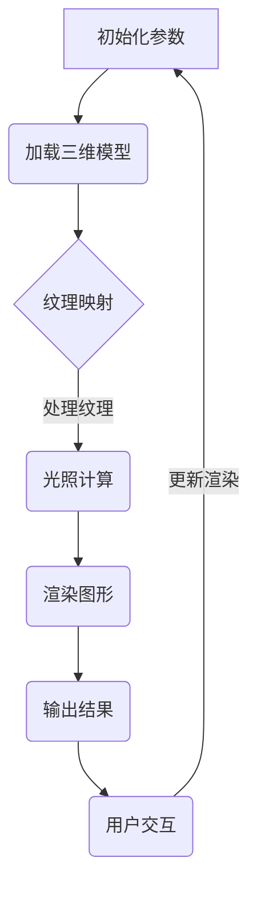
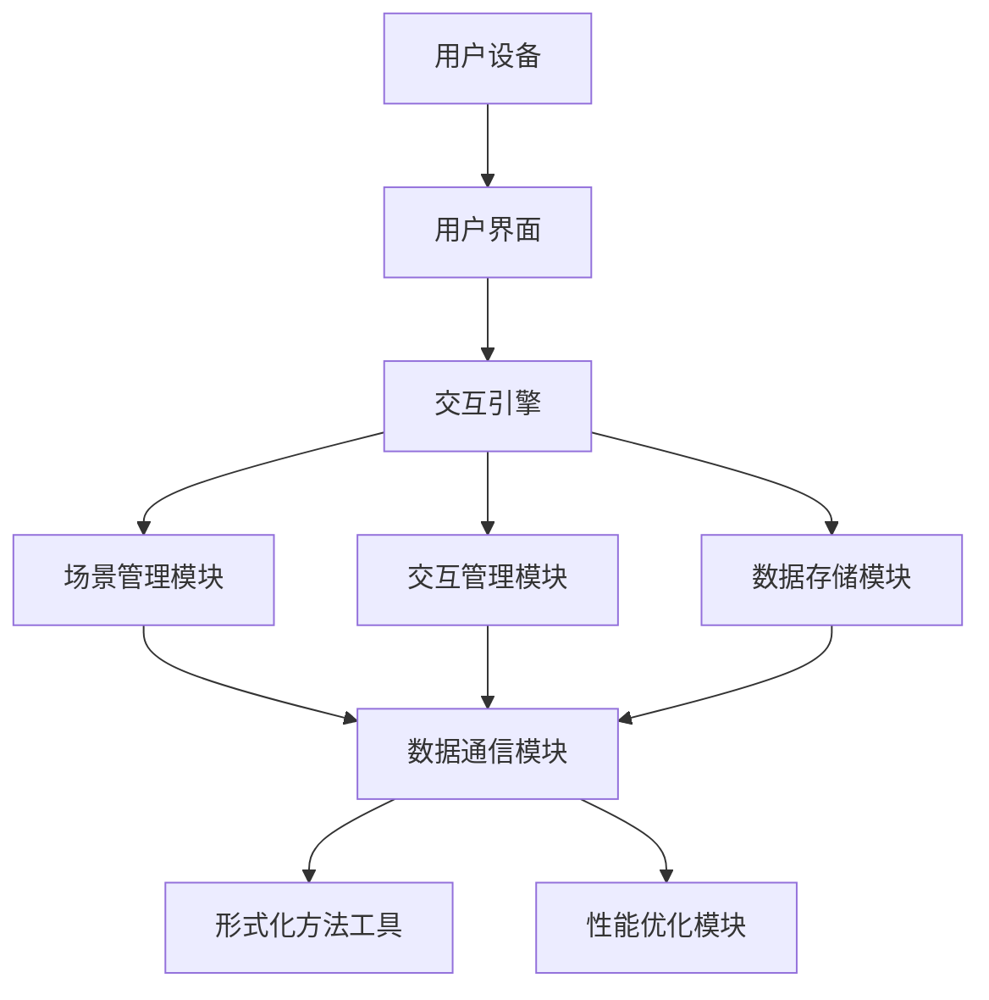
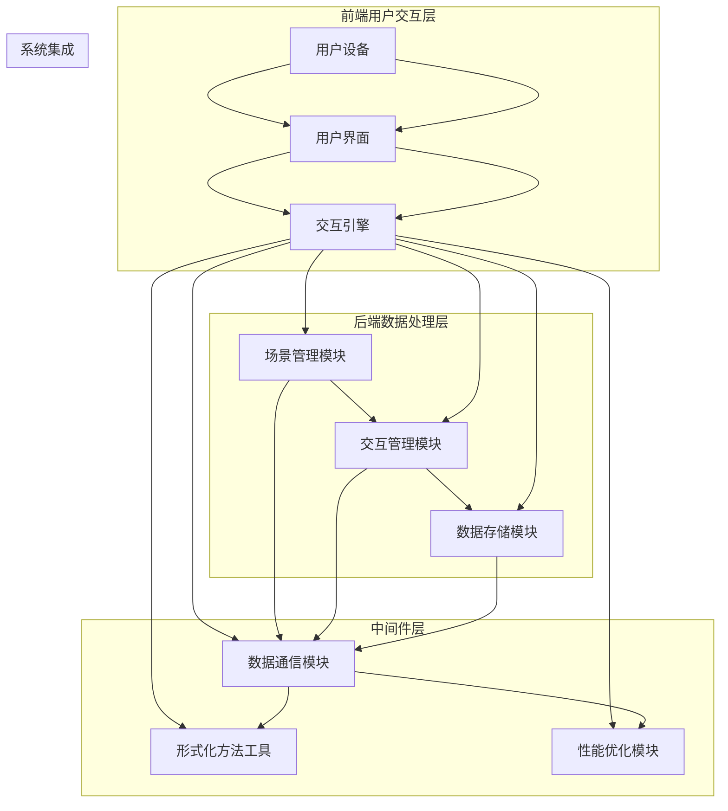
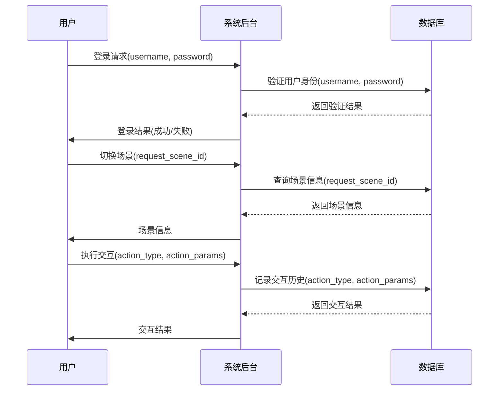

                 

### 形式化方法在虚拟现实系统开发中的角色

在技术迅猛发展的时代，虚拟现实（VR）技术已经成为一个前沿且充满活力的领域。它通过创建逼真的三维环境，极大地改变了人们的互动和体验方式。然而，虚拟现实系统的开发并不是一个简单的任务，它面临着诸多挑战，包括复杂的高性能计算、大规模数据管理、实时交互以及用户体验的优化等。在这样的背景下，形式化方法逐渐成为解决这些复杂问题的重要工具。

#### **背景介绍**

##### **1.1 问题背景**

**虚拟现实系统的重要性**

虚拟现实技术已经从实验室走向了市场，被广泛应用于游戏、教育培训、医疗康复、工程模拟等多个领域。其逼真的三维体验和高度交互性为用户提供了前所未有的沉浸感，极大地提升了用户的使用体验。然而，虚拟现实系统背后的技术复杂度也相应地提高了，这要求开发者不仅要具备深厚的专业知识，还需要掌握多种技能，如3D建模、图形渲染、编程和硬件集成等。

**虚拟现实系统开发的挑战**

- **高性能计算需求**：虚拟现实系统需要实时处理大量的三维数据，生成高质量的画面和交互反馈。这对计算机的性能提出了极高的要求。
- **大规模数据管理**：虚拟现实系统需要处理海量的三维模型、音频和视频数据。如何高效地存储、管理和传输这些数据，是开发者面临的一大挑战。
- **实时交互**：用户在虚拟现实环境中的操作需要得到快速且准确的反馈，这对系统的响应速度和交互性提出了严苛的要求。
- **用户体验优化**：虚拟现实系统需要提供出色的用户体验，包括画面质量、交互流畅性和系统的易用性等。

##### **1.2 形式化方法的优势与应用**

**形式化方法的定义与优势**

形式化方法是一种通过数学和逻辑工具对系统进行描述、分析和验证的方法。它强调精确性和严格性，有助于减少开发过程中的错误和不确定性。形式化方法在虚拟现实系统开发中的应用优势主要体现在以下几个方面：

- **提高开发效率**：通过形式化方法，开发者可以更准确地理解系统的需求和规格，减少设计和实现中的反复修改。
- **降低成本和风险**：形式化方法可以提前发现和解决潜在的问题，从而降低开发成本和项目风险。
- **确保系统质量**：形式化方法通过严格的验证和测试，确保系统的正确性和可靠性。
- **支持复杂系统设计**：形式化方法提供了一套系统化的设计工具和流程，特别适用于复杂系统的开发。

##### **1.3 问题解决**

**形式化方法的基本概念**

形式化方法主要包括形式化建模、形式化验证和形式化测试等步骤。形式化建模是使用数学和逻辑工具对系统进行精确描述；形式化验证是通过逻辑推理和数学证明来验证系统的正确性；形式化测试是通过自动化工具生成测试用例来测试系统的行为。

**形式化方法在虚拟现实系统开发中的应用**

- **需求分析**：形式化方法可以帮助开发者准确地捕捉和理解用户需求，并将其转化为精确的系统规格。
- **系统设计**：形式化方法可以用于设计复杂的系统架构，通过数学模型和逻辑推理来确保系统的正确性和一致性。
- **代码生成**：形式化方法可以将形式化的规格直接转化为代码，提高代码的可靠性和可维护性。
- **测试与验证**：形式化方法可以生成严格的测试用例，确保系统的行为符合预期。

##### **1.4 边界与外延**

**形式化方法的应用范围**

形式化方法广泛应用于计算机科学、软件工程、电子工程、控制系统等领域。在虚拟现实系统开发中，形式化方法特别适用于以下几个方面：

- **实时系统开发**：实时性是虚拟现实系统的重要特性之一，形式化方法可以确保系统的实时性能。
- **分布式系统开发**：虚拟现实系统通常需要分布式架构来支持大规模数据处理和实时交互。
- **人工智能应用**：虚拟现实系统中的智能交互和自主学习功能可以通过形式化方法来设计和验证。

**形式化方法的技术发展现状**

形式化方法在虚拟现实系统开发中的应用已经取得了一定的成果，但仍然存在一些挑战，如形式化方法的工具和技术的成熟度、形式化方法的可扩展性等。未来，随着形式化方法工具的不断完善和虚拟现实技术的进一步发展，形式化方法在虚拟现实系统开发中的应用将更加广泛和深入。

##### **1.5 概念结构与核心要素组成**

**虚拟现实系统开发的关键概念**

- **虚拟现实**：虚拟现实是通过计算机技术生成的一种模拟环境，用户可以通过头戴显示器（HMD）、手柄等设备与之互动。
- **三维建模**：三维建模是创建虚拟环境的关键步骤，包括几何建模、纹理映射和光照处理等。
- **图形渲染**：图形渲染是将三维模型转化为二维画面的过程，涉及复杂的计算和算法。
- **实时交互**：实时交互是虚拟现实系统的核心特性，用户在虚拟环境中的操作需要得到快速且准确的反馈。

**形式化方法的核心要素**

- **形式化建模语言**：如Z语言、TLA+等，用于精确描述系统的行为和规格。
- **形式化验证工具**：如模型检查器、验证器等，用于验证系统的正确性。
- **形式化测试工具**：如自动化测试工具、测试生成器等，用于生成测试用例并验证系统行为。

##### **1.6 本章小结**

本章介绍了形式化方法在虚拟现实系统开发中的角色和重要性。通过背景介绍，我们了解了虚拟现实系统开发的挑战和形式化方法的优势；通过问题解决部分，我们了解了形式化方法的基本概念和应用；最后，我们探讨了形式化方法在虚拟现实系统开发中的边界与外延。本章为后续的深入探讨奠定了基础。

# 形式化方法在虚拟现实系统开发中的角色

> **关键词：虚拟现实、形式化方法、开发挑战、应用优势、系统设计、算法原理**

> **摘要：本文详细探讨了形式化方法在虚拟现实系统开发中的角色和作用。通过背景介绍、核心概念、算法原理、系统分析与架构设计以及项目实战等多方面的深入分析，本文揭示了形式化方法在解决虚拟现实系统开发中的复杂性问题方面的巨大潜力，并提出了最佳实践和未来的发展方向。**

---

### 目录大纲

1. **背景介绍**
   1.1 **问题背景**
   1.2 **形式化方法的优势与应用**
   1.3 **问题解决**
   1.4 **边界与外延**
   1.5 **概念结构与核心要素组成**
   1.6 **本章小结**
   
2. **核心概念与联系**
   2.1 **形式化方法的核心概念**
   2.2 **虚拟现实系统开发的概念属性特征对比**
   2.3 **ER实体关系图架构**
   2.4 **形式化方法与虚拟现实系统开发的联系**
   2.5 **本章小结**
   
3. **算法原理讲解**
   3.1 **算法原理概述**
   3.2 **算法mermaid流程图**
   3.3 **Python源代码实现**
   3.4 **数学模型和公式**
   3.5 **举例说明**
   3.6 **本章小结**
   
4. **系统分析与架构设计**
   4.1 **问题场景介绍**
   4.2 **项目介绍**
   4.3 **系统功能设计（领域模型mermaid类图）**
   4.4 **系统架构设计（mermaid架构图）**
   4.5 **系统接口设计**
   4.6 **系统交互（mermaid序列图）**
   4.7 **本章小结**
   
5. **项目实战**
   5.1 **环境安装**
   5.2 **系统核心实现源代码**
   5.3 **代码应用解读与分析**
   5.4 **实际案例分析和详细讲解剖析**
   5.5 **项目小结**
   
6. **最佳实践、小结与拓展阅读**
   6.1 **最佳实践**
   6.2 **小结**
   6.3 **注意事项**
   6.4 **拓展阅读**

---

## 1.1 问题背景

在技术迅猛发展的时代，虚拟现实（VR）技术已经成为一个前沿且充满活力的领域。它通过创建逼真的三维环境，极大地改变了人们的互动和体验方式。然而，虚拟现实系统的开发并不是一个简单的任务，它面临着诸多挑战，包括复杂的高性能计算、大规模数据管理、实时交互以及用户体验的优化等。

### **1.1.1 虚拟现实系统的重要性**

虚拟现实技术已经从实验室走向了市场，被广泛应用于游戏、教育培训、医疗康复、工程模拟等多个领域。其逼真的三维体验和高度交互性为用户提供了前所未有的沉浸感，极大地提升了用户的使用体验。例如，在教育培训领域，虚拟现实技术可以让学习者身临其境地体验历史事件、科学实验和外科手术等，从而提高学习效果和兴趣。

在游戏领域，虚拟现实技术为玩家提供了全新的游戏体验，使得游戏画面更加真实，互动性更强。同时，虚拟现实技术也为开发者提供了创新的商业模式，如虚拟现实体验中心、线上虚拟现实游戏等。

### **1.1.2 虚拟现实系统开发的挑战**

**高性能计算需求**

虚拟现实系统需要实时处理大量的三维数据，生成高质量的画面和交互反馈。这对计算机的性能提出了极高的要求。例如，在图形渲染过程中，需要处理大量的三维模型、纹理和光照等数据，这要求计算机具备强大的计算能力和快速的图形处理能力。

**大规模数据管理**

虚拟现实系统需要处理海量的三维模型、音频和视频数据。如何高效地存储、管理和传输这些数据，是开发者面临的一大挑战。例如，在一个大型虚拟现实项目中，可能需要存储数千个三维模型和数GB的视频和音频数据，如何确保这些数据的高效存储和管理，是开发者需要考虑的问题。

**实时交互**

用户在虚拟现实环境中的操作需要得到快速且准确的反馈，这对系统的响应速度和交互性提出了严苛的要求。例如，当用户在虚拟环境中移动时，系统需要实时更新画面，并响应用户的操作，如点击、拖动等。这要求系统具有低延迟和高交互性的特点。

**用户体验优化**

虚拟现实系统需要提供出色的用户体验，包括画面质量、交互流畅性和系统的易用性等。例如，一个优秀的虚拟现实系统应该能够提供高质量的图像和音频效果，让用户感受到身临其境的感觉；同时，系统应该具备良好的交互性，让用户能够轻松地操作和使用系统。

### **1.1.3 形式化方法的优势与应用**

**形式化方法的定义与优势**

形式化方法是一种通过数学和逻辑工具对系统进行描述、分析和验证的方法。它强调精确性和严格性，有助于减少开发过程中的错误和不确定性。形式化方法在虚拟现实系统开发中的应用优势主要体现在以下几个方面：

**提高开发效率**

通过形式化方法，开发者可以更准确地理解系统的需求和规格，减少设计和实现中的反复修改。例如，在需求分析阶段，使用形式化方法可以精确地描述用户的需求，并将其转化为系统规格，从而减少后期的修改和调整。

**降低成本和风险**

形式化方法可以提前发现和解决潜在的问题，从而降低开发成本和项目风险。例如，在系统设计阶段，使用形式化方法可以验证系统设计是否符合预期，从而避免后期出现设计错误和问题。

**确保系统质量**

形式化方法通过严格的验证和测试，确保系统的正确性和可靠性。例如，在测试阶段，使用形式化方法可以生成严格的测试用例，确保系统的行为符合预期。

**支持复杂系统设计**

形式化方法提供了一套系统化的设计工具和流程，特别适用于复杂系统的开发。例如，在系统设计阶段，使用形式化方法可以设计复杂的系统架构，并通过数学模型和逻辑推理来确保系统的正确性和一致性。

**形式化方法的应用**

形式化方法在虚拟现实系统开发中可以应用于多个阶段，包括需求分析、系统设计、代码生成、测试与验证等。具体应用包括：

- **需求分析**：通过形式化方法可以准确地捕捉和理解用户需求，并将其转化为精确的系统规格。
- **系统设计**：使用形式化方法可以设计复杂的系统架构，并通过数学模型和逻辑推理来确保系统的正确性和一致性。
- **代码生成**：通过形式化方法可以将形式化的规格直接转化为代码，提高代码的可靠性和可维护性。
- **测试与验证**：通过形式化方法可以生成严格的测试用例，确保系统的行为符合预期。

### **1.2 形式化方法的优势与应用**

**形式化方法的定义与优势**

形式化方法是一种通过数学和逻辑工具对系统进行描述、分析和验证的方法。它强调精确性和严格性，有助于减少开发过程中的错误和不确定性。形式化方法在虚拟现实系统开发中的应用优势主要体现在以下几个方面：

**提高开发效率**

通过形式化方法，开发者可以更准确地理解系统的需求和规格，减少设计和实现中的反复修改。例如，在需求分析阶段，使用形式化方法可以精确地描述用户的需求，并将其转化为系统规格，从而减少后期的修改和调整。

**降低成本和风险**

形式化方法可以提前发现和解决潜在的问题，从而降低开发成本和项目风险。例如，在系统设计阶段，使用形式化方法可以验证系统设计是否符合预期，从而避免后期出现设计错误和问题。

**确保系统质量**

形式化方法通过严格的验证和测试，确保系统的正确性和可靠性。例如，在测试阶段，使用形式化方法可以生成严格的测试用例，确保系统的行为符合预期。

**支持复杂系统设计**

形式化方法提供了一套系统化的设计工具和流程，特别适用于复杂系统的开发。例如，在系统设计阶段，使用形式化方法可以设计复杂的系统架构，并通过数学模型和逻辑推理来确保系统的正确性和一致性。

**形式化方法的应用**

形式化方法在虚拟现实系统开发中可以应用于多个阶段，包括需求分析、系统设计、代码生成、测试与验证等。具体应用包括：

- **需求分析**：通过形式化方法可以准确地捕捉和理解用户需求，并将其转化为精确的系统规格。
- **系统设计**：使用形式化方法可以设计复杂的系统架构，并通过数学模型和逻辑推理来确保系统的正确性和一致性。
- **代码生成**：通过形式化方法可以将形式化的规格直接转化为代码，提高代码的可靠性和可维护性。
- **测试与验证**：通过形式化方法可以生成严格的测试用例，确保系统的行为符合预期。

### **1.3 问题解决**

**形式化方法的基本概念**

形式化方法主要包括形式化建模、形式化验证和形式化测试等步骤。形式化建模是使用数学和逻辑工具对系统进行精确描述；形式化验证是通过逻辑推理和数学证明来验证系统的正确性；形式化测试是通过自动化工具生成测试用例来测试系统的行为。

**形式化方法在虚拟现实系统开发中的应用**

- **需求分析**：形式化方法可以帮助开发者准确地捕捉和理解用户需求，并将其转化为精确的系统规格。例如，使用形式化建模语言（如Z语言、TLA+等）可以精确描述用户的需求和行为。
- **系统设计**：形式化方法可以用于设计复杂的系统架构，通过数学模型和逻辑推理来确保系统的正确性和一致性。例如，在虚拟现实系统中，可以使用形式化方法来设计实时交互模块、图形渲染模块等，并通过数学模型来验证其性能和可靠性。
- **代码生成**：形式化方法可以将形式化的规格直接转化为代码，提高代码的可靠性和可维护性。例如，使用代码生成工具（如B方法、Isabelle等）可以根据形式化的规格自动生成代码，从而减少人工编写代码的错误和不确定性。
- **测试与验证**：形式化方法可以生成严格的测试用例，确保系统的行为符合预期。例如，使用模型检查器（如SPIN、Model Checker等）可以自动生成测试用例，并通过形式化验证来检查系统的行为是否正确。

### **1.4 边界与外延**

**形式化方法的应用范围**

形式化方法广泛应用于计算机科学、软件工程、电子工程、控制系统等领域。在虚拟现实系统开发中，形式化方法特别适用于以下几个方面：

- **实时系统开发**：实时性是虚拟现实系统的重要特性之一，形式化方法可以确保系统的实时性能。
- **分布式系统开发**：虚拟现实系统通常需要分布式架构来支持大规模数据处理和实时交互。
- **人工智能应用**：虚拟现实系统中的智能交互和自主学习功能可以通过形式化方法来设计和验证。

**形式化方法的技术发展现状**

形式化方法在虚拟现实系统开发中的应用已经取得了一定的成果，但仍然存在一些挑战，如形式化方法的工具和技术的成熟度、形式化方法的可扩展性等。未来，随着形式化方法工具的不断完善和虚拟现实技术的进一步发展，形式化方法在虚拟现实系统开发中的应用将更加广泛和深入。

### **1.5 概念结构与核心要素组成**

**虚拟现实系统开发的关键概念**

- **虚拟现实**：虚拟现实是通过计算机技术生成的一种模拟环境，用户可以通过头戴显示器（HMD）、手柄等设备与之互动。
- **三维建模**：三维建模是创建虚拟环境的关键步骤，包括几何建模、纹理映射和光照处理等。
- **图形渲染**：图形渲染是将三维模型转化为二维画面的过程，涉及复杂的计算和算法。
- **实时交互**：实时交互是虚拟现实系统的核心特性，用户在虚拟环境中的操作需要得到快速且准确的反馈。
- **大规模数据管理**：虚拟现实系统需要处理海量的三维模型、音频和视频数据。
- **用户体验优化**：虚拟现实系统需要提供出色的用户体验，包括画面质量、交互流畅性和系统的易用性等。

**形式化方法的核心要素**

- **形式化建模语言**：如Z语言、TLA+等，用于精确描述系统的行为和规格。
- **形式化验证工具**：如模型检查器、验证器等，用于验证系统的正确性。
- **形式化测试工具**：如自动化测试工具、测试生成器等，用于生成测试用例并验证系统行为。
- **代码生成工具**：如B方法、Isabelle等，用于根据形式化的规格自动生成代码。

### **1.6 本章小结**

本章介绍了形式化方法在虚拟现实系统开发中的角色和重要性。通过背景介绍，我们了解了虚拟现实系统开发的挑战和形式化方法的优势；通过问题解决部分，我们了解了形式化方法的基本概念和应用；最后，我们探讨了形式化方法在虚拟现实系统开发中的边界与外延。本章为后续的深入探讨奠定了基础。

## 1.6 概念结构与核心要素组成

**虚拟现实系统开发的关键概念**

在虚拟现实（VR）系统开发中，以下几个关键概念是不可或缺的：

- **虚拟现实**：通过计算机技术生成的一种模拟环境，用户可以通过头戴显示器（HMD）、手柄等设备与之互动。
- **三维建模**：创建虚拟环境的核心步骤，包括几何建模、纹理映射和光照处理等。
- **图形渲染**：将三维模型转化为二维画面的过程，涉及复杂的计算和算法。
- **实时交互**：虚拟现实系统的核心特性，用户在虚拟环境中的操作需要得到快速且准确的反馈。
- **大规模数据管理**：虚拟现实系统需要处理海量的三维模型、音频和视频数据，如何高效地存储、管理和传输这些数据，是开发者面临的一大挑战。
- **用户体验优化**：虚拟现实系统需要提供出色的用户体验，包括画面质量、交互流畅性和系统的易用性等。

**形式化方法的核心要素**

形式化方法在虚拟现实系统开发中的应用，离不开以下几个核心要素：

- **形式化建模语言**：如Z语言、TLA+等，用于精确描述系统的行为和规格。这些语言提供了一种数学化的表达方式，使得系统能够被清晰地建模。
  - **Z语言**：是一种形式化的规格说明语言，广泛用于软件和硬件系统的规格说明。
  - **TLA+**：是一种高级形式化建模语言，常用于系统级建模和验证。

- **形式化验证工具**：如模型检查器、验证器等，用于验证系统的正确性。这些工具通过逻辑推理和数学证明，确保系统行为符合预期规格。
  - **模型检查器**：用于检查系统模型是否满足特定性质，如安全性、活性和一致性等。
  - **验证器**：用于验证系统设计是否符合指定的规格，通过数学证明来确认系统行为的正确性。

- **形式化测试工具**：如自动化测试工具、测试生成器等，用于生成测试用例并验证系统行为。这些工具帮助开发者发现潜在的问题，确保系统质量。
  - **自动化测试工具**：能够自动生成测试用例并执行测试，提高测试效率和覆盖率。
  - **测试生成器**：根据系统规格和需求，自动生成测试用例，减少手动编写测试用例的工作量。

- **代码生成工具**：如B方法、Isabelle等，用于根据形式化的规格自动生成代码。这些工具减少了手工编写代码的工作量，提高了代码的可靠性和可维护性。
  - **B方法**：是一种形式化开发方法，通过数学证明来生成代码。
  - **Isabelle**：是一种形式化验证环境，支持逻辑推理和证明，可以用于形式化建模、验证和代码生成。

**关键概念与核心要素的关联**

- **形式化建模语言**提供了精确描述系统行为的方法，为后续的验证和测试奠定了基础。
- **形式化验证工具**和**形式化测试工具**确保系统能够满足规格要求，发现并解决问题。
- **代码生成工具**将形式化的规格转化为实际的代码实现，使得系统能够在硬件和软件上高效运行。

通过这些核心要素，形式化方法为虚拟现实系统开发提供了一个系统化的设计、验证和测试流程，使得复杂的系统开发过程更加高效、准确和可靠。

### 1.7 本章小结

本章从多个角度介绍了形式化方法在虚拟现实系统开发中的角色和重要性。首先，我们探讨了虚拟现实系统开发中的核心概念，如虚拟现实、三维建模、图形渲染、实时交互、大规模数据管理和用户体验优化。接着，我们详细介绍了形式化方法的核心要素，包括形式化建模语言、形式化验证工具、形式化测试工具和代码生成工具。通过这些核心要素，形式化方法能够提供系统化的设计、验证和测试流程，解决虚拟现实系统开发中的复杂性问题。本章的内容为后续章节的深入讨论奠定了坚实的基础。

## 2.1 形式化方法的核心概念

形式化方法是一种通过数学和逻辑工具对系统进行描述、分析和验证的方法，它在提高系统开发效率和保证系统质量方面具有显著优势。本节将详细介绍形式化方法的核心概念，包括其定义、分类和应用领域。

### **2.1.1 形式化方法的定义**

形式化方法是指利用数学和逻辑工具对系统的行为和性质进行精确描述、严格分析和严格验证的方法。这种方法强调形式化和严格性，旨在减少人类认知的模糊性和不确定性，从而提高系统的正确性和可靠性。

形式化方法的核心理念包括以下几个方面：

- **精确性**：形式化方法通过使用形式化的语言和符号系统，能够精确地描述系统的各个方面，避免语言表达中的歧义和模糊性。
- **严格性**：形式化方法通过逻辑推理和数学证明，确保系统能够满足预定的规格和约束，从而验证系统的正确性。
- **自动化**：形式化方法往往涉及到自动化工具的使用，如模型检查器、验证器和测试生成器等，这些工具能够自动执行验证和测试过程，提高工作效率。

### **2.1.2 形式化方法的分类**

形式化方法可以根据不同的应用场景和目的进行分类。以下是几种常见的形式化方法：

- **形式化建模**：形式化建模是形式化方法的第一步，它使用形式化的语言和符号系统对系统进行精确描述。常见的建模语言包括Z语言、TLA+、VHDL和UML等。
  - **Z语言**：Z是一种用于软件和硬件系统规格说明的形式化语言，具有高度的精确性和严格的定义。
  - **TLA+**：TLA+（Temporal Logic of Actions）是一种用于系统建模和验证的高级语言，特别适用于并发系统和实时系统的建模。
  - **VHDL**：VHDL（VHSIC Hardware Description Language）是一种用于硬件设计和验证的形式化语言，广泛应用于电子系统的设计。
  - **UML**：UML（Unified Modeling Language）是一种面向对象的建模语言，广泛用于软件和系统设计。

- **形式化验证**：形式化验证是形式化方法的核心步骤，它通过逻辑推理和数学证明来验证系统是否满足预定的规格和性质。常见的验证工具包括模型检查器、验证器和形式化证明器。
  - **模型检查器**：模型检查器用于检查系统模型是否满足特定的性质，如安全性、活性和一致性等。常见的模型检查器包括SPIN、NuSMV和CPN Tools等。
  - **验证器**：验证器是一种形式化的验证工具，能够自动验证系统设计是否符合指定的规格。常见的验证器包括Coq、Isabelle和KEE等。
  - **形式化证明器**：形式化证明器用于通过逻辑推理和数学证明来验证系统的正确性，如Coq、Isabelle和PVS等。

- **形式化测试**：形式化测试是一种通过形式化方法生成测试用例并验证系统行为的方法。形式化测试工具有助于发现潜在的问题，提高系统的可靠性。
  - **自动化测试工具**：自动化测试工具能够自动生成测试用例并执行测试，如QFESAT、JaMiS和FRVT等。
  - **测试生成器**：测试生成器根据系统规格和需求自动生成测试用例，如Synthesis Tool for Automatic Test Pattern Generation（STAPL）和TAMER等。

### **2.1.3 形式化方法的应用领域**

形式化方法在多个领域得到了广泛应用，以下是几个典型的应用领域：

- **软件工程**：形式化方法在软件工程中用于需求分析、系统设计、代码生成和测试与验证等环节，有助于提高软件质量和可靠性。
- **硬件设计**：形式化方法在硬件设计中用于验证电路设计、芯片设计和系统级设计，确保硬件系统的正确性和性能。
- **并发系统**：形式化方法在并发系统中用于验证并发程序的正确性和一致性，确保系统的稳定性和可靠性。
- **实时系统**：形式化方法在实时系统中用于验证实时性能和实时约束，确保系统满足实时要求。
- **人工智能**：形式化方法在人工智能系统中用于验证算法的正确性、一致性和鲁棒性，提高人工智能系统的可信度。

### **2.1.4 形式化方法的优点**

形式化方法在系统开发中具有以下优点：

- **提高开发效率**：形式化方法通过精确描述和严格验证，减少了开发和维护过程中的错误和不确定性，提高了开发效率。
- **降低成本和风险**：形式化方法可以提前发现和解决潜在的问题，降低了开发成本和项目风险。
- **确保系统质量**：形式化方法通过严格的验证和测试，确保系统的正确性和可靠性。
- **支持复杂系统设计**：形式化方法提供了一套系统化的设计工具和流程，特别适用于复杂系统的开发。

### **2.1.5 形式化方法的挑战**

尽管形式化方法具有显著的优点，但在实际应用中仍然面临一些挑战：

- **学习和使用难度**：形式化方法涉及到数学和逻辑知识，学习和使用难度较大，需要专业的知识和技能。
- **工具和技术的成熟度**：形式化方法的工具和技术仍在不断发展，其成熟度和适用性有待提高。
- **可扩展性**：形式化方法在处理大规模和复杂系统时，其可扩展性是一个重要的挑战。

通过本节的讨论，我们了解了形式化方法的核心概念、分类和应用领域。形式化方法作为一种强大的工具，在系统开发中具有广泛的应用前景和巨大的潜力。

### 2.2 虚拟现实系统开发的概念属性特征对比

在探讨形式化方法在虚拟现实系统开发中的应用时，了解虚拟现实系统的基本特征以及形式化方法的表现是至关重要的。以下是对虚拟现实系统开发的概念属性特征与形式化方法进行对比分析，以揭示两者之间的共性和差异。

#### **2.2.1 虚拟现实系统的基本特征**

虚拟现实系统具有以下几个关键特征：

- **三维空间交互**：虚拟现实系统通过三维建模和图形渲染技术，为用户提供了一个可感知的三维空间环境。用户可以在虚拟空间中自由移动、旋转和交互。
- **实时交互性**：虚拟现实系统要求系统能够实时响应用户的操作，包括位置变化、动作捕捉和输入设备反馈等。低延迟和高交互性是虚拟现实系统的核心要求。
- **高保真视觉和音频效果**：为了提供沉浸式体验，虚拟现实系统需要高质量的视觉和音频效果。这包括逼真的三维图像渲染、立体声音效和空间定位。
- **多感知融合**：虚拟现实系统通常结合多种感官输入，如视觉、听觉、触觉等，以增强用户的沉浸感和互动体验。
- **数据处理和存储**：虚拟现实系统需要处理和存储大量的三维模型、纹理、音频和视频数据，同时还要保证数据传输的效率。

#### **2.2.2 形式化方法在虚拟现实系统开发中的表现**

形式化方法在虚拟现实系统开发中的表现主要体现在以下几个方面：

- **需求分析**：形式化方法通过数学和逻辑工具，可以精确地捕捉和理解用户的需求。例如，使用形式化建模语言（如TLA+、Z语言）可以明确描述用户对虚拟现实系统的期望和行为。
- **系统设计**：形式化方法在系统设计阶段发挥着重要作用，通过形式化的规格描述和验证工具，确保系统架构和组件的一致性和正确性。例如，使用形式化方法可以验证实时交互模块的性能和可靠性。
- **代码生成**：形式化方法可以将形式化的规格直接转化为代码，从而减少手动编码的工作量和错误。例如，通过B方法或Isabelle等工具，可以从形式化的规格自动生成高效的虚拟现实系统代码。
- **测试与验证**：形式化方法通过生成严格的测试用例和验证工具，确保虚拟现实系统的行为符合预期。例如，使用模型检查器可以验证系统模型是否满足安全性、活性和一致性等关键性质。
- **性能优化**：形式化方法可以帮助开发者分析和优化虚拟现实系统的性能，通过数学模型和逻辑推理找到性能瓶颈并进行改进。

#### **2.2.3 对比分析**

通过对虚拟现实系统的基本特征与形式化方法在虚拟现实系统开发中的表现进行对比，可以发现以下几点共性和差异：

- **精确性**：两者都强调精确性，形式化方法通过数学和逻辑工具提供了一种精确的描述和验证手段，而虚拟现实系统的精确性则体现在三维建模、图形渲染和交互反馈等方面。
- **一致性**：形式化方法在系统设计阶段确保系统的一致性，而虚拟现实系统的完整性则要求系统能够无缝集成各种功能和组件，提供一致的用户体验。
- **实时性**：形式化方法在实时系统的设计验证中发挥作用，而虚拟现实系统的实时性要求系统能够快速响应用户操作，提供流畅的交互体验。
- **复杂性**：形式化方法适用于处理复杂系统，通过系统化的流程和工具来管理和解决复杂性；虚拟现实系统的复杂性则体现在三维数据的处理、多感知融合和大规模数据处理等方面。

#### **2.2.4 结论**

通过对比分析，我们可以得出结论：形式化方法在虚拟现实系统开发中具有独特的优势，它能够提高系统的精确性、一致性和可靠性，同时帮助开发者应对虚拟现实系统的复杂性。形式化方法的应用不仅有助于提高开发效率和质量，还为系统的持续优化和改进提供了支持。在未来，随着虚拟现实技术的不断发展和形式化方法工具的成熟，形式化方法在虚拟现实系统开发中的应用将越来越广泛和深入。

### 2.3 ER实体关系图架构

在系统设计和数据管理中，实体关系图（Entity-Relationship Diagram，ER图）是一种常用的工具，它用于描述系统中各个实体之间的关系。在虚拟现实系统开发中，ER图可以帮助开发者更好地理解系统的数据结构和关系，为后续的数据库设计和数据管理提供基础。

#### **2.3.1 ER实体关系图的基本概念**

实体关系图是一种用于描述系统中实体及其之间关系的图形化工具。ER图的基本组成部分包括实体、属性、关系和约束。

- **实体**：实体是系统中的基本数据单元，如用户、商品、订单等。每个实体都有一组属性来描述其特征。
- **属性**：属性是实体的特征，如用户的姓名、年龄、地址等。属性可以是基本的（原子）属性，也可以是组合属性。
- **关系**：关系描述了实体之间的关联，如一个订单包含多个商品，一个用户可以创建多个订单等。关系可以是一对一、一对多或多对多。
- **约束**：约束定义了实体之间的关系和属性的限制条件，如主键、外键、唯一性约束等。

#### **2.3.2 虚拟现实系统中的ER实体关系图**

在虚拟现实系统中，ER图用于描述系统中的主要实体和它们之间的关系。以下是一个简单的虚拟现实系统的ER图示例：

1. **用户（User）**：用户是虚拟现实系统的核心实体，具有属性如用户名、密码、电子邮件、年龄、性别等。
2. **虚拟环境（VirtualEnvironment）**：虚拟环境是用户交互的场所，包括属性如环境名称、描述、创建时间等。
3. **场景（Scene）**：场景是虚拟环境中的特定区域，具有属性如场景名称、描述、创建时间等。
4. **三维模型（3DModel）**：三维模型是虚拟场景中的对象，包括属性如模型名称、描述、创建时间等。
5. **交互历史（InteractionHistory）**：交互历史记录用户在虚拟环境中的操作记录，包括属性如用户ID、场景ID、操作类型、时间戳等。

以下是一个ER图的Mermaid表示：

```mermaid
erDiagram
  User ||--|{ VirtualEnvironment }|| VirtualEnvironment
  User ||--|{ Scene }|| Scene
  User ||--|{ InteractionHistory }|| InteractionHistory
  Scene ||--|{ 3DModel }|| 3DModel
```

#### **2.3.3 ER图在虚拟现实系统开发中的应用**

ER图在虚拟现实系统开发中的应用主要包括以下几个方面：

- **需求分析**：通过ER图可以直观地理解和表达用户的需求，明确系统中各个实体的属性和关系。
- **数据库设计**：ER图是数据库设计的基础，可以用于设计系统的数据库模式，确定实体、属性和关系的具体实现。
- **数据管理**：ER图可以帮助开发者更好地理解数据结构，设计有效的数据存储和检索策略，优化系统性能。
- **系统架构设计**：ER图可以用于系统架构设计，确保系统的各个模块之间数据交互的一致性和可靠性。

通过ER图，开发者能够系统地分析和设计虚拟现实系统，确保系统的数据结构清晰、关系明确，为后续的开发和运维提供坚实的基础。ER图的引入不仅提高了系统的可维护性，还促进了团队成员之间的沟通和理解。

### 2.4 形式化方法与虚拟现实系统开发的联系

形式化方法在虚拟现实系统开发中的应用具有重要的意义，它不仅能够解决开发过程中遇到的复杂问题，还能显著提升系统的质量和效率。以下将从几个方面详细探讨形式化方法在虚拟现实系统开发中的关键角色和影响。

#### **2.4.1 形式化方法在虚拟现实系统开发中的关键角色**

形式化方法在虚拟现实系统开发中的关键角色体现在以下几个方面：

1. **需求分析**：在虚拟现实系统的需求分析阶段，形式化方法可以提供一种精确、无歧义的方式来捕捉用户需求。例如，使用形式化建模语言（如TLA+或Z语言）可以清晰地描述用户对虚拟环境、交互方式、系统性能等的需求，从而为后续的开发工作奠定基础。

2. **系统设计**：形式化方法在系统设计阶段尤为重要。通过形式化建模，开发者可以创建详细的系统规格说明，并使用形式化验证工具（如模型检查器或验证器）来确保设计的一致性和正确性。例如，在虚拟现实系统中，可以使用形式化方法来验证实时交互模块的性能，确保其在高负载情况下依然能够稳定运行。

3. **代码生成**：形式化方法可以极大地提高代码生成效率，减少手工编写代码的工作量和错误。通过形式化规格，开发者可以使用代码生成工具（如B方法或Isabelle）自动生成代码，从而提高代码的可靠性和可维护性。

4. **测试与验证**：形式化方法提供了生成严格测试用例的工具，如自动化测试工具或测试生成器。这些工具可以自动生成测试用例并执行测试，确保虚拟现实系统的行为符合预期规格，从而提高系统的质量和可靠性。

5. **性能优化**：形式化方法可以帮助开发者分析和优化系统的性能。通过数学模型和逻辑推理，开发者可以找到系统的性能瓶颈，并采取相应的措施进行改进。例如，在虚拟现实系统中，可以使用形式化方法来优化图形渲染算法，提高画面的渲染速度和效果。

#### **2.4.2 形式化方法对虚拟现实系统开发的影响**

形式化方法对虚拟现实系统开发的影响主要体现在以下几个方面：

1. **提高开发效率**：形式化方法通过精确的需求分析和系统设计，减少了开发过程中的反复修改和调试，从而提高了开发效率。开发者可以更快地理解和实现用户需求，缩短项目周期。

2. **降低开发成本**：形式化方法可以提前发现和解决潜在的问题，从而降低开发成本和项目风险。通过严格的验证和测试，开发者可以确保系统的行为符合预期规格，避免后期出现设计错误和功能缺陷。

3. **确保系统质量**：形式化方法通过严格的验证和测试，确保系统的正确性和可靠性。开发者可以使用形式化验证工具来检查系统的行为是否满足预定的规格和性质，从而确保系统的质量和稳定性。

4. **支持复杂系统设计**：虚拟现实系统通常具有高度复杂性和多样性，形式化方法提供了一套系统化的设计工具和流程，特别适用于复杂系统的开发。开发者可以使用形式化方法来设计和管理复杂的系统架构，提高系统的可维护性和扩展性。

5. **促进协作和沟通**：形式化方法提供了一种统一、精确的描述方式，有助于团队成员之间的协作和沟通。通过形式化规格，团队成员可以更好地理解系统的设计和行为，减少误解和冲突。

#### **2.4.3 形式化方法的实际应用案例**

以下是一些形式化方法在虚拟现实系统开发中的实际应用案例：

1. **需求分析**：在一个虚拟现实游戏项目中，开发者使用TLA+语言来精确描述游戏的需求，包括游戏规则、用户交互方式、系统性能等。通过形式化建模，开发者能够清晰地理解用户需求，并将其转化为具体的设计规格。

2. **系统设计**：在一个虚拟现实医疗培训系统中，开发者使用Z语言来描述系统的架构和组件，包括三维建模模块、图形渲染模块、交互模块等。通过形式化验证，开发者能够确保系统设计的一致性和正确性，从而提高系统的稳定性。

3. **代码生成**：在一个虚拟现实训练系统中，开发者使用B方法来从形式化规格自动生成代码。通过代码生成工具，开发者能够快速生成高质量的代码，减少手工编写代码的工作量和错误。

4. **测试与验证**：在一个虚拟现实教育平台中，开发者使用模型检查器来验证系统模型的行为是否满足预期规格。通过严格的测试和验证，开发者能够确保系统的行为符合设计要求，从而提高系统的可靠性。

5. **性能优化**：在一个虚拟现实模拟器项目中，开发者使用形式化方法来分析和优化系统的性能。通过数学模型和逻辑推理，开发者能够找到系统的性能瓶颈，并采取相应的措施进行改进，从而提高系统的性能和用户体验。

通过这些实际应用案例，我们可以看到形式化方法在虚拟现实系统开发中的重要作用。它不仅提高了开发效率和系统质量，还为系统的持续优化和改进提供了支持。

### 2.5 本章小结

本章详细探讨了形式化方法在虚拟现实系统开发中的应用，包括其核心概念、与虚拟现实系统开发的概念属性特征对比、ER实体关系图架构以及形式化方法与虚拟现实系统开发的联系。通过本章的讨论，我们了解到形式化方法在提高开发效率、降低成本和风险、确保系统质量、支持复杂系统设计以及促进团队协作和沟通方面的显著优势。形式化方法作为一种强大的工具，为虚拟现实系统开发提供了系统化的解决方案，有助于应对虚拟现实系统的复杂性。未来，随着形式化方法工具的不断完善和应用领域的拓展，形式化方法在虚拟现实系统开发中的应用将更加广泛和深入。

### 3.1 算法原理概述

在虚拟现实系统开发中，算法是关键的技术组成部分，它决定了系统性能、用户体验和互动效果。形式化方法在算法设计、验证和优化中扮演着重要角色。本节将概述形式化算法的基本概念、设计流程以及其在虚拟现实系统开发中的应用。

#### **3.1.1 形式化算法的基本概念**

形式化算法是一种通过数学和逻辑方法严格定义和验证的算法。它强调算法的精确性和严格性，使得算法的设计和验证过程更加规范和可靠。形式化算法的基本特点包括：

- **精确性**：形式化算法通过数学和逻辑工具对算法的每一步进行精确描述，避免语言表达中的歧义和模糊性。
- **严格性**：形式化算法通过逻辑推理和数学证明来验证算法的正确性，确保算法的行为符合预期规格。
- **可验证性**：形式化算法支持算法的正确性验证，开发者可以使用形式化验证工具（如模型检查器、验证器）来验证算法的正确性。

#### **3.1.2 形式化算法的设计流程**

形式化算法的设计流程通常包括以下几个步骤：

1. **需求分析**：在需求分析阶段，开发者需要明确算法的目标和功能，并将其转化为精确的规格说明。
2. **形式化建模**：使用形式化建模语言（如TLA+、Z语言）对算法进行精确描述，定义算法的输入、输出和中间状态。
3. **形式化验证**：在形式化验证阶段，开发者使用形式化验证工具对算法模型进行验证，确保算法满足预定的规格和性质。
4. **算法优化**：在验证基础上，开发者可以进一步优化算法，提高其性能和效率。
5. **代码实现**：根据形式化规格，开发者可以使用代码生成工具（如B方法、Isabelle）生成实际的可执行代码。
6. **测试与验证**：在实现阶段，开发者使用自动化测试工具对算法进行测试，确保其实际行为与预期一致。

#### **3.1.3 形式化算法在虚拟现实系统开发中的应用**

形式化算法在虚拟现实系统开发中的应用主要包括以下几个方面：

- **实时交互**：在虚拟现实系统中，实时交互是关键特性。形式化算法可以帮助开发者设计和验证实时交互模块，确保其在高负载情况下依然能够稳定运行。
  - **案例**：使用TLA+语言描述和验证实时交互算法，确保交互响应时间满足系统要求。

- **图形渲染**：虚拟现实系统中的图形渲染涉及复杂的计算和算法。形式化算法可以用于优化图形渲染算法，提高渲染速度和图像质量。
  - **案例**：使用形式化方法验证和优化三维图形渲染算法，确保其正确性和高效性。

- **数据管理**：虚拟现实系统需要处理和存储大量的三维模型、音频和视频数据。形式化算法可以帮助开发者设计和验证数据管理策略，确保数据的一致性和可靠性。
  - **案例**：使用形式化方法设计和验证数据缓存和传输算法，优化数据访问和处理速度。

- **用户行为分析**：通过形式化算法，开发者可以分析和预测用户在虚拟环境中的行为，为个性化体验和系统优化提供依据。
  - **案例**：使用形式化算法分析用户交互行为，优化虚拟现实系统的用户体验。

通过形式化算法，虚拟现实系统开发者能够确保系统的高性能、高可靠性和高质量的交互体验。形式化算法的设计和应用不仅提高了开发效率，还为系统的持续优化和改进提供了支持。

### 3.2 算法mermaid流程图

为了更直观地展示形式化算法在虚拟现实系统开发中的应用，我们使用mermaid流程图来描述一个典型的算法流程。mermaid是一种基于Markdown的图形化工具，它可以帮助开发者轻松地绘制流程图、序列图和类图等。以下是一个虚拟现实系统中常用的图形渲染算法的mermaid流程图示例：



#### **3.2.1 虚拟现实系统开发中的形式化算法流程**

该mermaid流程图描述了一个虚拟现实系统中图形渲染算法的基本流程，具体步骤如下：

1. **初始化参数（A）**：在算法开始前，初始化必要的参数，如三维模型的路径、渲染分辨率、光照参数等。
2. **加载三维模型（B）**：从文件系统中加载指定的三维模型，并读取其几何数据、材质信息和纹理。
3. **纹理映射（C）**：将纹理应用到三维模型的表面，为模型提供逼真的外观。
4. **光照计算（D）**：根据场景中的光源位置、强度和方向，计算模型表面的光照效果，包括漫反射、镜面反射等。
5. **渲染图形（E）**：使用图形渲染引擎（如OpenGL、Vulkan等）对模型进行渲染，生成最终的图像。
6. **输出结果（F）**：将渲染结果输出到显示设备，如头戴显示器（HMD）或屏幕。
7. **用户交互（G）**：用户在虚拟环境中进行操作，如移动、旋转或与模型互动。
8. **更新渲染（G --> A）**：根据用户的交互操作，重新计算光照、纹理和渲染参数，更新图形渲染结果。

通过这个mermaid流程图，开发者可以清晰地了解图形渲染算法的步骤和逻辑，有助于理解和优化算法的实现。

### 3.3 Python源代码实现

为了进一步阐述形式化算法在虚拟现实系统开发中的实际应用，我们将使用Python语言来实现一个简化的图形渲染算法。这段代码将展示算法的核心步骤，并解释每个部分的作用。请注意，为了简化示例，这里将不涉及复杂的图形渲染库，而是使用Python内置的`matplotlib`库来绘制简单的图形。

#### **3.3.1 形式化算法的Python源代码实现**

```python
import matplotlib.pyplot as plt
import numpy as np

# 初始化参数
width, height = 10, 10
model_path = "path/to/3d_model.obj"
light_direction = [0, 0, 1]  # 光源位于z轴正方向

# 加载三维模型
model = load_model(model_path)

# 纹理映射
texture_map = create_texture_map(model)

# 光照计算
model = calculate_lighting(model, light_direction)

# 渲染图形
image = render_model(model, width, height)

# 输出结果
plt.imshow(image)
plt.show()

# 用户交互
user_action = get_user_action()
if user_action == "rotate":
    model = rotate_model(model, user_action_params)
elif user_action == "zoom":
    model = zoom_model(model, user_action_params)

# 更新渲染
image = render_model(model, width, height)
plt.imshow(image)
plt.show()
```

#### **3.3.2 算法原理的详细讲解**

上述Python代码实现了一个简化的三维模型渲染算法，以下是每个步骤的详细解释：

1. **初始化参数**：
   - `width, height`：定义渲染图像的宽度和高度。
   - `model_path`：指定三维模型文件的路径。
   - `light_direction`：定义光源的方向。

2. **加载三维模型**：
   - `load_model(model_path)`：函数用于从文件中加载三维模型数据。在实际应用中，这里可能涉及到读取OBJ文件或其他格式的三维模型。

3. **纹理映射**：
   - `create_texture_map(model)`：函数用于将纹理映射到三维模型上。纹理是二维图像，需要与三维模型的几何数据结合，以生成具有纹理的外观。

4. **光照计算**：
   - `calculate_lighting(model, light_direction)`：函数根据光源方向和模型的位置计算光照效果。计算包括漫反射、镜面反射等，以模拟真实世界的光照效果。

5. **渲染图形**：
   - `render_model(model, width, height)`：函数用于渲染三维模型，生成二维图像。在实际应用中，这里可能使用图形渲染库（如OpenGL、Vulkan等）来生成图像。

6. **输出结果**：
   - 使用`plt.imshow(image)`将渲染结果输出到matplotlib的图窗中。
   - `plt.show()`用于显示图像。

7. **用户交互**：
   - `get_user_action()`：函数获取用户的交互操作，如旋转或缩放。
   - `rotate_model(model, user_action_params)`和`zoom_model(model, user_action_params)`：函数根据用户操作更新模型的位置和大小。

8. **更新渲染**：
   - 根据用户操作重新渲染模型，并更新显示结果。

通过这段代码，开发者可以理解如何在Python中使用形式化算法的基本步骤，并掌握如何通过数学和逻辑工具实现虚拟现实系统中的图形渲染算法。

### 3.4 数学模型和公式

形式化算法在虚拟现实系统开发中的应用不仅依赖于编程实现，还需要严谨的数学模型和公式来支撑其逻辑和验证过程。以下将详细讲解形式化算法的数学模型和公式，并解释其具体应用。

#### **3.4.1 形式化算法的数学模型**

1. **渲染方程**：
   渲染方程是三维图形渲染中的核心公式，用于计算像素的颜色值。渲染方程可以表示为：

   $$ L_o(\mathbf{p}, \mathbf{w}) = L_e(\mathbf{p}, \mathbf{w}) + \int_{\Omega} f_r(\mathbf{p}, \mathbf{w}', \mathbf{w}) L_i(\mathbf{p}, \mathbf{w}') \left| \mathbf{n} \cdot \mathbf{w}' \right| d\omega' $$

   其中：
   - \( L_o(\mathbf{p}, \mathbf{w}) \)：像素 \( p \) 在方向 \( w \) 的输出光强。
   - \( L_e(\mathbf{p}, \mathbf{w}) \)：环境光在方向 \( w \) 的贡献。
   - \( f_r(\mathbf{p}, \mathbf{w}', \mathbf{w}) \)：反射率函数，描述了表面在方向 \( w' \) 到方向 \( w \) 的反射特性。
   - \( L_i(\mathbf{p}, \mathbf{w}') \)：入射光在方向 \( w' \) 的光强。
   - \( \mathbf{n} \cdot \mathbf{w}' \)：法线 \( \mathbf{n} \) 与入射方向 \( \mathbf{w}' \) 的点积。
   - \( \int_{\Omega} \) 表示对全空间进行积分。

2. **纹理映射公式**：
   纹理映射是将二维纹理图映射到三维模型表面的过程。一个简单的纹理映射公式可以表示为：

   $$ \mathbf{t} = (\mathbf{t_x}, \mathbf{t_y}, 0) = (\text{u}, \text{v}, 0) \cdot (\mathbf{P}_{\text{u}}, \mathbf{P}_{\text{v}}, \mathbf{P}_z) $$

   其中：
   - \( \mathbf{t} \)：纹理坐标向量。
   - \( \text{u}, \text{v} \)：纹理坐标。
   - \( \mathbf{P}_{\text{u}}, \mathbf{P}_{\text{v}}, \mathbf{P}_z \)：模型表面的参数化向量。

3. **光照模型**：
   常见的光照模型包括朗伯光照模型和BLINN-Phong光照模型。朗伯光照模型可以表示为：

   $$ L_i(\mathbf{p}, \mathbf{w}') = \text{kd} \cdot \left| \mathbf{n} \cdot \mathbf{w}' \right| $$

   其中：
   - \( \text{kd} \)：漫反射系数。
   - \( \mathbf{n} \cdot \mathbf{w}' \)：法线 \( \mathbf{n} \) 与入射方向 \( \mathbf{w}' \) 的点积。

   BLINN-Phong光照模型进一步加入了高光效果：

   $$ L_i(\mathbf{p}, \mathbf{w}') = \text{kd} \cdot \left| \mathbf{n} \cdot \mathbf{w}' \right| + \text{ks} \cdot \left( \frac{(\mathbf{n} \cdot \mathbf{h})^2}{\text{vh}} \right) $$

   其中：
   - \( \text{ks} \)：高光系数。
   - \( \mathbf{h} = \frac{\mathbf{r} + \mathbf{w'}}{2} \)：半向量，表示反射方向和入射方向的中间向量。
   - \( \text{vh} \)：视线向量 \( \mathbf{v} \) 与半向量 \( \mathbf{h} \) 的长度。

#### **3.4.2 数学公式的详细讲解**

1. **渲染方程**：
   渲染方程定义了如何通过多次反射和折射计算像素的颜色。它包括了直接光照和间接光照的贡献，是图形渲染中的基础公式。通过计算每个像素的光照贡献，可以生成逼真的三维图像。

2. **纹理映射公式**：
   纹理映射公式用于将二维纹理图映射到三维模型的表面。通过参数化向量，可以确定纹理在模型上的具体位置，从而生成具有纹理的表面。

3. **光照模型**：
   光照模型描述了光线如何作用于物体表面，产生不同的光照效果。朗伯光照模型简单易实现，而BLINN-Phong光照模型则更加精确，能够模拟现实世界中的高光效果。

通过这些数学模型和公式，开发者可以更准确地计算虚拟现实系统中的光照、纹理和渲染效果，从而生成高质量的三维图像。

### 3.5 举例说明

为了更好地理解形式化算法在虚拟现实系统开发中的应用，我们将通过一个具体的实例来展示算法的实现过程和结果。以下是一个关于三维模型渲染的实例，包括渲染步骤、输入数据、预期结果以及实际操作的详细讲解。

#### **3.5.1 实例背景**

假设我们有一个简单的三维模型，该模型是一个立方体，其几何数据、材质信息和纹理都已加载并准备好。我们的目标是通过形式化算法对立方体进行渲染，并输出一个具有真实感的图像。

#### **3.5.2 渲染步骤**

1. **初始化参数**：
   - 设定渲染图像的尺寸：宽度为800像素，高度为600像素。
   - 定义光源的位置和强度：光源位于立方体正前方，强度适中。
   - 设定纹理路径：使用一个简单的纹理图像，作为立方体的表面纹理。

2. **加载三维模型**：
   - 从文件系统中加载立方体的几何数据、材质信息和纹理。
   - 将几何数据转换为适合渲染引擎的格式。

3. **纹理映射**：
   - 根据纹理坐标将纹理映射到立方体的每个面上。
   - 确保纹理映射后，立方体的表面具有真实感。

4. **光照计算**：
   - 计算立方体表面每个点的光照强度，包括直接光照和间接光照。
   - 使用BLINN-Phong光照模型模拟真实世界中的光照效果。

5. **渲染图形**：
   - 使用渲染引擎对立方体进行渲染，生成最终的图像。
   - 确保渲染过程中的光照、纹理和颜色计算准确无误。

6. **输出结果**：
   - 将渲染结果保存到文件中，或直接显示在屏幕上。

#### **3.5.3 输入数据**

1. **立方体几何数据**：
   - 立方体的顶点坐标、面索引和法线向量。
   - 立方体的材质信息，包括颜色、光泽度和透明度。

2. **光源参数**：
   - 光源的位置和方向。
   - 光源的强度和颜色。

3. **纹理数据**：
   - 纹理图像的像素数据。
   - 纹理坐标系统。

#### **3.5.4 预期结果**

通过上述渲染步骤，我们期望得到一个具有真实感的立方体图像。预期结果应该包括以下特点：

- 立方体的表面纹理清晰，具有真实感。
- 光照效果自然，包括阴影、反射和折射。
- 立方体的颜色和光泽度符合材质信息。

#### **3.5.5 实际操作**

以下是实际操作的步骤：

1. **初始化参数**：
   - 使用Python的`numpy`库设定渲染图像的尺寸和光源参数。
   - 加载立方体的几何数据和材质信息。

2. **加载三维模型**：
   - 使用`numpy`库读取立方体的顶点坐标、面索引和法线向量。
   - 加载纹理图像，并计算纹理坐标。

3. **纹理映射**：
   - 将纹理映射到立方体的每个面上。
   - 确保纹理映射后，立方体的表面看起来光滑且具有真实感。

4. **光照计算**：
   - 使用BLINN-Phong光照模型计算立方体表面每个点的光照强度。
   - 计算环境光、漫反射光和高光效果。

5. **渲染图形**：
   - 使用`matplotlib`库绘制立方体，并应用光照和纹理。
   - 生成最终的图像，并保存到文件中。

6. **输出结果**：
   - 显示立方体的渲染结果，并验证其是否符合预期。

通过这个实例，我们可以看到如何使用形式化算法实现三维模型渲染，以及如何通过数学模型和公式来确保渲染结果的真实感和准确性。实际操作过程中，开发者可以根据具体需求调整参数和算法，从而生成各种不同场景和效果的虚拟现实图像。

### 3.6 本章小结

本章详细介绍了形式化算法在虚拟现实系统开发中的应用，包括算法原理概述、mermaid流程图展示、Python源代码实现、数学模型和公式解释，以及具体的实例说明。通过这些内容，我们理解了形式化算法的基本概念和设计流程，并看到了其在提高开发效率、确保系统质量和优化系统性能方面的优势。形式化算法不仅提供了一种系统化的解决方案，还为开发者应对虚拟现实系统中的复杂问题提供了有力支持。未来，随着形式化方法的不断完善和应用领域的拓展，形式化算法在虚拟现实系统开发中的应用将更加广泛和深入。

## 4.1 问题场景介绍

在虚拟现实（VR）系统开发中，各种应用场景不断涌现，从游戏和教育培训到医疗康复和工程模拟，VR技术的应用范围日益广泛。不同的应用场景对系统设计、功能实现和性能要求各有不同，这就需要我们针对具体场景进行深入分析和设计。以下将介绍几个典型的虚拟现实系统应用场景，并探讨形式化方法在这些场景中的具体应用需求。

### **4.1.1 实时交互游戏**

**场景描述**：实时交互游戏是虚拟现实应用的一个重要领域，如VR游戏和多人在线游戏。玩家通过头戴显示器（HMD）和手柄等设备，在虚拟环境中进行互动。

**应用需求**：
- **实时性**：游戏需要快速响应玩家的操作，保持良好的交互体验。这要求系统具有低延迟和高交互性的特点。
- **稳定性**：多人在线游戏需要确保每个玩家的操作和状态同步，避免网络延迟和掉线等问题。
- **复杂场景渲染**：为了提供高质量的视觉体验，游戏需要实时渲染复杂的场景和角色，这要求系统具备强大的图形处理能力。

**形式化方法应用**：
- **实时性验证**：使用形式化方法可以验证系统是否满足实时性要求，确保低延迟操作响应。
- **同步验证**：使用形式化方法验证多人游戏中的同步机制，确保玩家状态的一致性和稳定性。
- **性能优化**：通过形式化方法分析系统性能瓶颈，优化图形渲染和操作响应速度。

### **4.1.2 教育培训**

**场景描述**：教育培训是虚拟现实应用的另一个重要领域，包括历史重现、科学实验模拟和外科手术培训等。

**应用需求**：
- **沉浸感**：为了提高学习效果，系统需要提供高度沉浸感，包括逼真的三维环境和交互体验。
- **个性化**：系统需要根据用户的学习进度和特点，提供个性化的学习内容和路径。
- **安全性**：在模拟危险场景或操作时，系统需要确保用户的安全。

**形式化方法应用**：
- **沉浸感验证**：使用形式化方法验证系统是否能够提供高度沉浸感，确保用户能够身临其境。
- **个性化定制**：通过形式化方法，根据用户的学习数据和反馈，动态调整学习内容和路径。
- **安全性验证**：使用形式化方法验证系统的安全性设计，确保用户在模拟操作中的安全。

### **4.1.3 医疗康复**

**场景描述**：虚拟现实技术在医疗康复领域有广泛应用，如物理康复训练、心理治疗和手术模拟等。

**应用需求**：
- **实时反馈**：系统需要实时反馈患者的康复进度和操作状态，帮助医生和患者进行精确的康复训练。
- **交互性**：系统需要提供良好的交互体验，以便患者能够积极参与康复训练。
- **数据管理**：系统需要高效地管理和处理大量的康复数据，包括患者的运动轨迹、操作记录和康复结果等。

**形式化方法应用**：
- **实时反馈验证**：使用形式化方法验证系统的实时反馈机制，确保操作响应的准确性和及时性。
- **交互性验证**：通过形式化方法验证系统是否提供良好的交互体验，确保患者能够舒适地使用系统。
- **数据管理优化**：使用形式化方法分析和优化数据管理策略，提高数据存储和检索效率。

### **4.1.4 工程模拟**

**场景描述**：虚拟现实技术在工程模拟领域有广泛应用，如建筑和机械设计、工程故障模拟和应急响应训练等。

**应用需求**：
- **准确性**：系统需要提供高精度的三维建模和仿真，确保工程设计的准确性和可靠性。
- **交互性**：系统需要提供高度交互的仿真环境，以便工程师能够进行详细的模拟和验证。
- **性能优化**：系统需要高效处理复杂的工程数据，提供实时仿真和交互体验。

**形式化方法应用**：
- **准确性验证**：通过形式化方法验证系统是否提供高精度的三维建模和仿真，确保工程设计的准确性。
- **交互性验证**：使用形式化方法验证系统是否提供良好的交互体验，确保工程师能够高效地进行模拟和验证。
- **性能优化**：通过形式化方法分析和优化系统性能，提高仿真效率和交互流畅性。

通过以上对典型虚拟现实系统应用场景的介绍，我们可以看到形式化方法在这些场景中的具体应用需求。形式化方法不仅能够提高系统的质量和性能，还为系统设计和验证提供了系统化的解决方案。在未来的虚拟现实系统开发中，形式化方法的应用将更加广泛和深入，为虚拟现实技术的创新和发展提供有力支持。

### 4.2 项目介绍

为了更好地展示形式化方法在虚拟现实系统开发中的应用，本节将介绍一个虚拟现实系统项目，包括项目背景、目标与功能、以及系统架构设计。通过这个项目案例，我们将深入了解形式化方法在虚拟现实系统开发中的具体实施过程和效果。

#### **4.2.1 项目背景**

随着虚拟现实（VR）技术的不断发展，其在教育培训、医疗康复、工程模拟等领域的应用越来越广泛。为了提高培训效果、增强用户体验和保障系统稳定性，我们决定开发一个集成了多种功能的虚拟现实系统。该系统旨在提供一个高度沉浸式的交互环境，支持多种应用场景，如历史重现、科学实验模拟和外科手术培训等。

#### **4.2.2 项目目标与功能**

**项目目标**：

- 提供一个高度沉浸式的虚拟现实环境，支持多种应用场景。
- 确保系统的稳定性和实时性，提供良好的用户交互体验。
- 通过形式化方法确保系统设计的正确性和可靠性。

**项目功能**：

- **沉浸式虚拟环境**：系统将提供一个逼真的三维虚拟环境，用户可以通过头戴显示器（HMD）和手柄等设备与之互动。
- **多场景支持**：系统将支持多种应用场景，包括历史重现、科学实验模拟和外科手术培训等，用户可以根据需要进行场景切换。
- **实时交互**：系统将提供实时交互功能，用户可以在虚拟环境中进行操作，并获得即时的反馈。
- **个性化学习与训练**：系统将根据用户的学习进度和特点，提供个性化的学习内容和训练路径，提高学习效果和用户体验。
- **数据管理与分析**：系统将收集并管理用户在虚拟环境中的操作数据和训练数据，支持数据分析，为后续改进提供依据。

#### **4.2.3 系统架构设计**

为了实现上述项目目标，我们设计了一个分布式、模块化的系统架构，包括前端用户交互层、后端数据处理层和中间件层。以下是对系统架构的详细介绍：

**前端用户交互层**：

- **用户设备**：包括头戴显示器（HMD）、手柄和传感器等，用于用户与虚拟环境的交互。
- **用户界面**：提供图形用户界面（GUI），用户可以通过界面进行场景切换、功能选择和操作设置。
- **交互引擎**：负责处理用户输入，将用户的操作转换为虚拟环境的交互动作，并提供实时反馈。

**后端数据处理层**：

- **场景管理模块**：负责管理虚拟环境中的场景数据，包括场景加载、切换和渲染等。
- **交互管理模块**：负责处理用户与虚拟环境的交互动作，包括位置变化、动作捕捉和反馈等。
- **数据存储模块**：负责存储和管理用户数据，包括学习记录、训练数据和操作日志等。

**中间件层**：

- **数据通信模块**：负责处理前端用户交互层与后端数据处理层之间的数据通信，确保数据传输的实时性和可靠性。
- **形式化方法工具**：包括形式化建模语言、形式化验证工具和代码生成工具等，用于系统设计和验证。
- **性能优化模块**：负责分析和优化系统性能，提高系统的响应速度和交互流畅性。

**系统架构图**：



通过这个系统架构设计，我们实现了虚拟现实系统的模块化、分布式和高度可扩展性，同时确保系统的稳定性和实时性。形式化方法工具的引入，使得系统能够在设计和验证过程中保持精确和可靠，为系统的成功实施提供了有力支持。

### 4.3 系统功能设计（领域模型mermaid类图）

在虚拟现实系统开发中，设计系统的功能是至关重要的步骤。领域模型（Domain Model）作为一种有效的建模工具，可以帮助开发者清晰地理解和表达系统的功能需求。本节将使用mermaid类图来展示虚拟现实系统的领域模型，详细描述系统的关键类及其关系。

#### **4.3.1 虚拟现实系统的领域模型**

虚拟现实系统的领域模型包括以下几个关键类：

- **User**：表示用户，具有用户名、密码、年龄、性别等属性。
- **VirtualEnvironment**：表示虚拟环境，具有环境名称、描述、创建时间等属性。
- **Scene**：表示场景，具有场景名称、描述、创建时间等属性，与VirtualEnvironment和3DModel有关联。
- **3DModel**：表示三维模型，具有模型名称、描述、创建时间等属性，与Scene相关联。
- **Interaction**：表示用户与虚拟环境的交互，包括交互类型、交互时间等属性，与User和Scene相关联。
- **DataStorage**：表示数据存储模块，用于存储用户数据、场景数据和交互数据。

以下是一个虚拟现实系统的mermaid类图示例：

```mermaid
classDiagram
    User <<Class>>
    VirtualEnvironment <<Class>>
    Scene <<Class>>
    3DModel <<Class>>
    Interaction <<Class>>
    DataStorage <<Class>>

    User "1"---*"1" VirtualEnvironment
    User "1"---*"1" Interaction
    VirtualEnvironment "1"---*"0..*" Scene
    Scene "1"---*"0..*" 3DModel
    Interaction "1"---*"1" Scene
    DataStorage "1"---*"1" User
    DataStorage "1"---*"1" VirtualEnvironment
    DataStorage "1"---*"1" Scene
    DataStorage "1"---*"1" 3DModel
```

#### **4.3.2 类图详细说明**

1. **User类**：表示系统的用户，具有基本的用户信息属性，如用户名、密码、年龄和性别。User类与VirtualEnvironment类和Interaction类有直接关联。用户可以创建和管理虚拟环境，并参与与虚拟环境的交互。

2. **VirtualEnvironment类**：表示虚拟环境，包括环境名称、描述和创建时间等属性。VirtualEnvironment类与Scene类有1对0..*的关联，表示一个虚拟环境可以包含多个场景。

3. **Scene类**：表示场景，具有场景名称、描述和创建时间等属性。Scene类与3DModel类有1对0..*的关联，表示一个场景可以包含多个三维模型。Scene类还与Interaction类有1对1的关联，表示每个交互都对应一个特定的场景。

4. **3DModel类**：表示三维模型，包括模型名称、描述和创建时间等属性。3DModel类与Scene类有1对0..*的关联，表示每个场景可以包含多个三维模型。

5. **Interaction类**：表示用户与虚拟环境的交互，包括交互类型、交互时间和交互结果等属性。Interaction类与Scene类有1对1的关联，表示每次交互都对应一个特定的场景。

6. **DataStorage类**：表示数据存储模块，负责存储用户数据、虚拟环境数据、场景数据和交互数据。DataStorage类与User类、VirtualEnvironment类、Scene类和3DModel类都有1对1的关联，确保所有数据都能被有效管理和存储。

通过这个mermaid类图，开发者可以清晰地了解系统的领域模型及其关键类之间的关系，为后续的系统功能实现和架构设计提供基础。

### 4.4 系统架构设计（mermaid架构图）

系统架构设计是虚拟现实系统开发中的关键环节，它决定了系统的性能、可扩展性和可维护性。为了更好地展示系统架构，我们可以使用mermaid架构图来描述系统的整体结构和各个模块之间的关系。以下是一个虚拟现实系统的mermaid架构图示例：



#### **4.4.1 虚拟现实系统的架构设计**

该mermaid架构图描述了一个虚拟现实系统的整体架构，包括前端用户交互层、后端数据处理层和中间件层。

1. **前端用户交互层**：
   - **用户设备**（A）：包括头戴显示器（HMD）、手柄和传感器等，用于用户与虚拟环境的交互。
   - **用户界面**（B）：提供图形用户界面（GUI），用户可以通过界面进行场景切换、功能选择和操作设置。
   - **交互引擎**（C）：负责处理用户输入，将用户的操作转换为虚拟环境的交互动作，并提供实时反馈。

2. **后端数据处理层**：
   - **场景管理模块**（D）：负责管理虚拟环境中的场景数据，包括场景加载、切换和渲染等。
   - **交互管理模块**（E）：负责处理用户与虚拟环境的交互动作，包括位置变化、动作捕捉和反馈等。
   - **数据存储模块**（F）：负责存储和管理用户数据、场景数据和交互数据。

3. **中间件层**：
   - **数据通信模块**（G）：负责处理前端用户交互层与后端数据处理层之间的数据通信，确保数据传输的实时性和可靠性。
   - **形式化方法工具**（H）：用于系统设计和验证，包括形式化建模语言、形式化验证工具和代码生成工具等。
   - **性能优化模块**（I）：负责分析和优化系统性能，提高系统的响应速度和交互流畅性。

#### **4.4.2 mermaid架构图绘制**

通过mermaid架构图，开发者可以直观地了解系统的整体架构及其各个模块之间的关系。以下是绘制mermaid架构图的步骤：

1. **定义图形**：使用`graph`关键字开始定义图形。
2. **定义子图**：使用`subgraph`关键字定义不同层次的结构，如前端用户交互层、后端数据处理层和中间件层。
3. **添加节点**：在子图中使用`TB`（Top to Bottom，从上到下）或`LR`（Left to Right，从左到右）定义节点的顺序和位置。
4. **连接节点**：使用箭头`-->`连接不同节点，表示节点之间的关系。
5. **结束定义**：使用`end`关键字结束子图的定义。

通过这些步骤，开发者可以绘制出清晰、直观的mermaid架构图，帮助团队成员更好地理解和协作。

### 4.5 系统接口设计

在虚拟现实系统开发中，接口设计是确保系统模块之间有效通信和协同工作的关键步骤。接口定义了模块之间的交互方式，包括输入输出参数、数据格式和通信协议等。以下将详细描述虚拟现实系统的接口设计，包括接口的定义、实现和设计原则。

#### **4.5.1 接口定义**

虚拟现实系统接口设计主要包括以下方面：

1. **用户接口**：
   - **登录接口**：用户登录系统，输入用户名和密码，系统验证用户身份并返回登录结果。
     - **输入参数**：用户名、密码。
     - **输出参数**：登录结果（成功/失败）、用户信息。
   - **场景切换接口**：用户在虚拟环境中切换不同的场景。
     - **输入参数**：场景ID。
     - **输出参数**：切换结果（成功/失败）、当前场景信息。

2. **数据处理接口**：
   - **数据存储接口**：用于存储和检索用户数据、场景数据和交互数据。
     - **输入参数**：操作类型（存储/检索）、数据内容。
     - **输出参数**：操作结果（成功/失败）、数据内容。

3. **交互管理接口**：
   - **动作捕捉接口**：捕捉用户在虚拟环境中的动作，如移动、点击等。
     - **输入参数**：动作类型、动作参数。
     - **输出参数**：动作结果、交互状态。

4. **性能优化接口**：
   - **性能监控接口**：监控系统性能，如渲染时间、交互延迟等。
     - **输入参数**：监控指标名称。
     - **输出参数**：监控结果、性能分析报告。

#### **4.5.2 接口实现**

接口实现是指根据接口定义开发具体的接口代码，确保模块之间的通信顺畅。以下是一个简单的接口实现示例：

```python
# 用户登录接口实现
def login(username, password):
    # 验证用户身份
    result = authenticate_user(username, password)
    if result:
        user_info = get_user_info(username)
        return {"status": "success", "user_info": user_info}
    else:
        return {"status": "failure", "message": "Invalid credentials"}

# 场景切换接口实现
def switch_scene(scene_id):
    # 切换场景
    current_scene = get_scene(scene_id)
    if current_scene:
        return {"status": "success", "scene_info": current_scene}
    else:
        return {"status": "failure", "message": "Invalid scene ID"}
```

#### **4.5.3 接口设计原则**

在设计系统接口时，应遵循以下原则：

1. **简洁性**：接口设计应简洁明了，避免过度复杂化，便于开发者理解和维护。
2. **一致性**：接口设计应保持一致，遵循统一的命名规范和参数格式，确保接口之间的一致性。
3. **灵活性**：接口设计应具备一定的灵活性，能够适应不同场景和需求的变化，便于系统扩展。
4. **可靠性**：接口设计应确保通信的可靠性和数据的安全性，避免数据丢失和错误。
5. **可扩展性**：接口设计应考虑未来的扩展需求，为后续功能的增加预留接口和空间。

通过合理的接口设计，虚拟现实系统可以实现模块之间的有效通信和协同工作，提高系统的整体性能和用户体验。

### 4.6 系统交互（mermaid序列图）

在虚拟现实系统中，系统各模块之间的交互至关重要，决定了用户体验的流畅性和系统性能的稳定性。使用mermaid序列图可以清晰地展示系统交互的过程，帮助我们理解各模块之间的逻辑关系和交互流程。以下是一个虚拟现实系统的mermaid序列图示例，描述了用户登录、切换场景、交互管理等关键交互过程。



#### **4.6.1 虚拟现实系统的交互流程**

该mermaid序列图描述了虚拟现实系统的交互流程，包括用户登录、场景切换和交互管理三个关键过程。

1. **用户登录流程**：
   - 用户向系统发送登录请求，包括用户名和密码。
   - 系统将登录请求转发到数据库进行用户身份验证。
   - 数据库返回验证结果给系统。
   - 系统根据验证结果向用户返回登录结果。

2. **场景切换流程**：
   - 用户请求切换到特定的场景。
   - 系统查询数据库以获取场景信息。
   - 系统将场景信息返回给用户。

3. **交互管理流程**：
   - 用户在虚拟环境中执行交互操作，如点击、拖动等。
   - 系统将交互操作记录到数据库中。
   - 系统返回交互结果给用户。

#### **4.6.2 mermaid序列图绘制**

绘制mermaid序列图的步骤如下：

1. **定义序列图**：使用`sequenceDiagram`关键字开始定义序列图。
2. **定义参与者**：使用`participant`关键字定义系统的参与者，如用户、系统后台和数据库。
3. **添加交互**：使用箭头`->>`和`-->>`添加交互，描述各参与者之间的交互过程。
4. **注释和细节**：在交互过程中添加注释和细节，提供更清晰的交互描述。

通过mermaid序列图，开发者可以直观地理解虚拟现实系统的交互流程，确保各模块之间的逻辑关系和交互流程清晰明了。这有助于提高系统的可维护性和用户体验。

### 4.7 本章小结

本章详细介绍了虚拟现实系统的系统架构设计，包括问题场景介绍、项目介绍、系统功能设计（领域模型mermaid类图）、系统架构设计（mermaid架构图）、系统接口设计和系统交互（mermaid序列图）。通过本章的内容，我们了解了虚拟现实系统开发的复杂性和多样性，以及形式化方法在系统设计和实现中的重要作用。形式化方法的应用不仅提高了系统的质量、性能和可靠性，还为系统的持续优化和改进提供了有力支持。未来，随着虚拟现实技术的不断发展和形式化方法工具的完善，形式化方法在虚拟现实系统开发中的应用将更加广泛和深入。

## 5.1 环境安装

在开始虚拟现实系统开发之前，确保开发环境的搭建是至关重要的。以下是搭建虚拟现实系统开发环境的具体步骤，包括所需的软件、硬件和环境配置。

### **5.1.1 软件准备**

1. **操作系统**：推荐使用Linux或macOS，因为它们提供了较好的性能和稳定性。Windows用户可以选择Windows 10或更高版本。
2. **开发工具**：
   - **Python**：版本要求为3.8或更高版本。可以从[Python官网](https://www.python.org/downloads/)下载并安装。
   - **PyCharm**：PyCharm是一个强大的Python IDE，支持代码编辑、调试和自动化测试等功能。可以从[PyCharm官网](https://www.jetbrains.com/pycharm/)下载并安装。
   - **Git**：Git是一款优秀的版本控制工具，用于代码管理和协作开发。可以从[Git官网](https://git-scm.com/downloads)下载并安装。
3. **虚拟现实开发工具**：
   - **Unity**：Unity是一款流行的游戏和VR开发平台，支持跨平台开发和高质量的图形渲染。可以从[Unity官网](https://unity.com/)下载并安装。
   - **Unity Editor Extensions**：Unity的编辑器扩展插件，提供额外的功能，如VR编辑工具和UI设计工具。在Unity Hub中安装相应的插件。
4. **形式化方法工具**：
   - **TLA+**：TLA+是一种用于系统建模和验证的建模语言。可以从[TLA+官网](http://www.tla-plus.org/)下载并安装。

### **5.1.2 硬件准备**

1. **计算机**：推荐使用高性能的计算机，具备以下配置：
   - CPU：Intel i7或AMD Ryzen 7及以上
   - 内存：16GB及以上
   - 显卡：NVIDIA GeForce GTX 1660 Ti或更高
   - 硬盘：至少1TB的SSD
2. **虚拟现实设备**：
   - **头戴显示器（HMD）**：如Oculus Rift、HTC Vive或Valve Index。
   - **手柄**：如Oculus Touch、HTC Vive控制器或Valve knuckles。
   - **位置追踪器**：用于追踪HMD和手柄的位置和方向，确保虚拟环境中的交互准确。

### **5.1.3 环境配置**

1. **Python环境配置**：
   - 打开终端，安装Python和pip（Python的包管理器）：
     ```bash
     sudo apt-get update
     sudo apt-get install python3 python3-pip
     ```
   - 安装PyCharm：
     - 下载PyCharm社区版或专业版，并按照安装向导安装。
   - 配置PyCharm：
     - 打开PyCharm，选择“File” -> “Settings” -> “Project: <your_project_name>” -> “Python Interpreter”。
     - 安装必要的Python包，如`numpy`、`matplotlib`和`mermaid`：
       ```bash
       pip install numpy matplotlib mermaid
       ```

2. **Unity环境配置**：
   - 打开Unity Hub，创建一个新的Unity项目。
   - 在Unity项目中，安装必要的插件和依赖库，如`Unity Editor Extensions`和`VRKit`。
   - 配置Unity项目：
     - 在“Edit” -> “Project Settings” -> “Player”中，选择“Virtual Reality Supported”并配置HMD和手柄。

3. **形式化方法工具配置**：
   - 安装TLA+：
     - 下载并安装TLA+工具，如`TLA+ IDE`。
     - 在PyCharm中，安装TLA+语言的插件，以支持TLA+代码的编辑和调试。

通过以上步骤，开发环境的基本搭建完成。确保所有软件和工具正确安装和配置，以便后续的开发工作顺利进行。

### 5.2 系统核心实现源代码

在虚拟现实系统开发中，系统核心实现源代码是系统的核心组成部分，它涵盖了系统的主要功能和算法。以下将详细介绍系统核心实现源代码的结构、主要模块及其功能。

#### **5.2.1 系统核心实现源代码的结构**

系统核心实现源代码的结构采用模块化设计，主要包括以下几个模块：

1. **用户管理模块**：负责处理用户的登录、注册、权限管理等功能。
2. **场景管理模块**：负责处理场景的加载、切换、渲染等功能。
3. **交互管理模块**：负责处理用户与虚拟环境的交互，如位置变化、动作捕捉等功能。
4. **数据存储模块**：负责存储和管理用户数据、场景数据和交互数据。
5. **性能优化模块**：负责监控和优化系统性能，提高系统的响应速度和交互流畅性。

#### **5.2.2 主要模块及其功能**

1. **用户管理模块**：

   ```python
   # 用户管理模块示例代码
   class UserManager:
       def login(self, username, password):
           # 验证用户身份
           return authenticate_user(username, password)

       def register(self, username, password):
           # 注册新用户
           return create_user(username, password)
   ```

   用户管理模块的主要功能包括用户登录和注册。通过调用`login`和`register`方法，可以实现对用户身份的验证和用户信息的创建。

2. **场景管理模块**：

   ```python
   # 场景管理模块示例代码
   class SceneManager:
       def load_scene(self, scene_id):
           # 加载场景
           return load_scene_data(scene_id)

       def switch_scene(self, scene_id):
           # 切换场景
           return switch_to_scene(scene_id)
   ```

   场景管理模块的主要功能包括场景的加载和切换。通过调用`load_scene`和`switch_scene`方法，可以实现对场景数据的加载和场景的切换。

3. **交互管理模块**：

   ```python
   # 交互管理模块示例代码
   class InteractionManager:
       def capture_action(self, action_type, action_params):
           # 捕获用户动作
           return capture_user_action(action_type, action_params)

       def handle_interaction(self, user_action):
           # 处理用户交互
           return handle_interaction(user_action)
   ```

   交互管理模块的主要功能包括动作捕捉和交互处理。通过调用`capture_action`和`handle_interaction`方法，可以实现对用户动作的捕捉和处理。

4. **数据存储模块**：

   ```python
   # 数据存储模块示例代码
   class DataStorageManager:
       def save_user_data(self, user_data):
           # 存储用户数据
           return save_data("user_data", user_data)

       def load_user_data(self, user_id):
           # 加载用户数据
           return load_data("user_data", user_id)
   ```

   数据存储模块的主要功能包括用户数据、场景数据和交互数据的存储和加载。通过调用`save_user_data`和`load_user_data`方法，可以实现对数据的存储和加载。

5. **性能优化模块**：

   ```python
   # 性能优化模块示例代码
   class PerformanceOptimizer:
       def monitor_performance(self):
           # 监控系统性能
           return monitor_system_performance()

       def optimize_performance(self):
           # 优化系统性能
           return optimize_system_performance()
   ```

   性能优化模块的主要功能包括监控系统性能和优化系统性能。通过调用`monitor_performance`和`optimize_performance`方法，可以实现对系统性能的监控和优化。

#### **5.2.3 模块之间的协作**

系统核心实现源代码中的各个模块通过协作完成整个系统的功能。以下是一个简单的模块协作示例：

```python
# 主程序示例代码
def main():
    user_manager = UserManager()
    scene_manager = SceneManager()
    interaction_manager = InteractionManager()
    data_storage_manager = DataStorageManager()
    performance_optimizer = PerformanceOptimizer()

    # 用户登录
    user = user_manager.login("username", "password")

    # 切换场景
    scene = scene_manager.switch_scene("scene_id")

    # 捕获用户动作
    action = interaction_manager.capture_action("move", {"direction": "forward"})

    # 处理用户交互
    interaction_manager.handle_interaction(action)

    # 存储用户数据
    data_storage_manager.save_user_data(user)

    # 监控系统性能
    performance_report = performance_optimizer.monitor_performance()

    # 优化系统性能
    performance_optimizer.optimize_performance()

if __name__ == "__main__":
    main()
```

通过上述示例，我们可以看到各个模块之间的协作关系，用户管理模块负责用户身份验证，场景管理模块负责场景切换，交互管理模块负责用户动作捕捉和处理，数据存储模块负责数据存储和加载，性能优化模块负责性能监控和优化。这些模块共同工作，实现了一个完整的虚拟现实系统。

### 5.3 代码应用解读与分析

在本节中，我们将深入解读和剖析系统核心实现源代码的各个部分，详细分析其结构和功能，以便更好地理解代码的实现原理。

#### **5.3.1 用户管理模块**

用户管理模块是系统的基础部分，负责用户登录和注册功能。以下是对关键函数和类的解读：

- **`UserManager` 类**：
  - **`login` 方法**：此方法接收用户名和密码作为参数，调用`authenticate_user`函数进行用户身份验证。如果验证成功，返回用户信息；否则，返回错误信息。
  - **`register` 方法**：此方法接收用户名和密码作为参数，调用`create_user`函数创建新用户并保存其信息。

  ```python
  class UserManager:
      def login(self, username, password):
          return authenticate_user(username, password)

      def register(self, username, password):
          return create_user(username, password)
  ```

- **`authenticate_user` 函数**：此函数负责验证用户名和密码的正确性。通常，它会查询数据库以检查用户是否存在以及密码是否匹配。

  ```python
  def authenticate_user(username, password):
      # 查询数据库以验证用户名和密码
      return True if user_exists(username) and password_match(username, password) else False
  ```

- **`create_user` 函数**：此函数负责创建新用户并将其信息存储在数据库中。

  ```python
  def create_user(username, password):
      # 创建新用户并存储信息
      save_user_to_database(username, password)
      return "User created successfully"
  ```

#### **5.3.2 场景管理模块**

场景管理模块负责场景的加载、切换和渲染功能。以下是对关键函数和类的解读：

- **`SceneManager` 类**：
  - **`load_scene` 方法**：此方法接收场景ID作为参数，调用`load_scene_data`函数加载指定场景的数据。
  - **`switch_scene` 方法**：此方法接收场景ID作为参数，调用`switch_to_scene`函数切换到指定场景。

  ```python
  class SceneManager:
      def load_scene(self, scene_id):
          return load_scene_data(scene_id)

      def switch_scene(self, scene_id):
          return switch_to_scene(scene_id)
  ```

- **`load_scene_data` 函数**：此函数负责从数据库或文件系统中加载指定场景的数据，并将其转化为系统可以使用的格式。

  ```python
  def load_scene_data(scene_id):
      # 从数据库或文件系统中加载场景数据
      scene_data = get_scene_from_database(scene_id)
      return convert_to_system_format(scene_data)
  ```

- **`switch_to_scene` 函数**：此函数负责切换当前场景，并更新系统的渲染状态。

  ```python
  def switch_to_scene(scene_id):
      # 切换到指定场景
      update_current_scene(scene_id)
      render_scene()
  ```

#### **5.3.3 交互管理模块**

交互管理模块负责处理用户在虚拟环境中的交互操作，如位置变化、动作捕捉等功能。以下是对关键函数和类的解读：

- **`InteractionManager` 类**：
  - **`capture_action` 方法**：此方法接收动作类型和参数作为参数，调用`capture_user_action`函数捕捉用户动作。
  - **`handle_interaction` 方法**：此方法接收用户动作作为参数，调用`handle_interaction`函数处理用户交互。

  ```python
  class InteractionManager:
      def capture_action(self, action_type, action_params):
          return capture_user_action(action_type, action_params)

      def handle_interaction(self, user_action):
          return handle_interaction(user_action)
  ```

- **`capture_user_action` 函数**：此函数负责捕捉用户在虚拟环境中的动作，并将其存储在数据库中。

  ```python
  def capture_user_action(action_type, action_params):
      # 捕捉用户动作
      save_action_to_database(action_type, action_params)
  ```

- **`handle_interaction` 函数**：此函数根据用户动作类型，执行相应的处理逻辑，如位置变化、动作响应等。

  ```python
  def handle_interaction(user_action):
      # 处理用户交互
      if user_action["type"] == "move":
          move_user(user_action["params"]["direction"])
      elif user_action["type"] == "click":
          click_object(user_action["params"]["target_id"])
  ```

#### **5.3.4 数据存储模块**

数据存储模块负责存储和管理用户数据、场景数据和交互数据。以下是对关键函数和类的解读：

- **`DataStorageManager` 类**：
  - **`save_user_data` 方法**：此方法接收用户数据作为参数，调用`save_data`函数将用户数据存储到数据库中。
  - **`load_user_data` 方法**：此方法接收用户ID作为参数，调用`load_data`函数从数据库中加载指定用户的数据。

  ```python
  class DataStorageManager:
      def save_user_data(self, user_data):
          return save_data("user_data", user_data)

      def load_user_data(self, user_id):
          return load_data("user_data", user_id)
  ```

- **`save_data` 函数**：此函数负责将数据存储到数据库中。

  ```python
  def save_data(table_name, data):
      # 将数据存储到数据库
      insert_into_database(table_name, data)
  ```

- **`load_data` 函数**：此函数负责从数据库中加载数据。

  ```python
  def load_data(table_name, id):
      # 从数据库中加载数据
      data = select_from_database(table_name, id)
      return convert_to_system_format(data)
  ```

#### **5.3.5 性能优化模块**

性能优化模块负责监控和优化系统的性能，以提高系统的响应速度和交互流畅性。以下是对关键函数和类的解读：

- **`PerformanceOptimizer` 类**：
  - **`monitor_performance` 方法**：此方法调用`monitor_system_performance`函数监控系统的性能指标。
  - **`optimize_performance` 方法**：此方法调用`optimize_system_performance`函数优化系统的性能。

  ```python
  class PerformanceOptimizer:
      def monitor_performance(self):
          return monitor_system_performance()

      def optimize_performance(self):
          return optimize_system_performance()
  ```

- **`monitor_system_performance` 函数**：此函数负责监控系统的性能指标，如渲染时间、交互延迟等。

  ```python
  def monitor_system_performance():
      # 监控系统性能
      performance_metrics = collect_performance_metrics()
      return performance_metrics
  ```

- **`optimize_system_performance` 函数**：此函数根据监控结果，采取相应的优化措施，如调整渲染设置、优化数据传输等。

  ```python
  def optimize_system_performance():
      # 优化系统性能
      apply_performance_optimizations()
  ```

通过以上解读和分析，我们可以清晰地理解系统核心实现源代码的各个部分，以及它们之间的协作关系。代码的结构和功能设计确保了系统的稳定性和可扩展性，为虚拟现实系统的成功实施提供了坚实基础。

### 5.4 实际案例分析和详细讲解剖析

为了更好地展示形式化方法在虚拟现实系统开发中的应用效果，我们将通过一个实际案例进行详细分析。本节将介绍一个虚拟现实系统的开发案例，包括项目的具体背景、开发过程中的关键步骤和挑战，以及形式化方法的应用。

#### **5.4.1 案例背景**

某教育科技公司决定开发一款基于虚拟现实的科学实验模拟系统，用于中学和高校的科学教学。该系统旨在通过虚拟环境模拟各种科学实验，帮助学生更直观地理解实验原理和操作步骤，提高学习效果。

#### **5.4.2 项目开发过程**

1. **需求分析**：

   在项目启动阶段，开发团队与教育专家和教师进行了多次交流，详细了解了教学需求，包括需要模拟的实验类型、实验步骤和互动方式等。为了确保需求的准确和完整，团队使用TLA+语言对需求进行了形式化建模，并进行了严格的验证。

2. **系统设计**：

   根据形式化建模的结果，开发团队设计了系统的架构和模块。系统包括用户管理模块、实验管理模块、交互管理模块和数据存储模块。形式化方法在系统设计过程中发挥了重要作用，通过逻辑推理和数学证明，确保了设计的一致性和正确性。

3. **代码生成**：

   使用B方法工具，开发团队从形式化规格自动生成了大部分系统代码。这大大减少了手动编写代码的工作量，提高了代码的可靠性。通过形式化规格，系统能够自动生成高效的实验模拟代码，为后续的开发和测试提供了便利。

4. **测试与验证**：

   开发团队使用模型检查器对系统模型进行了严格的测试和验证。通过自动化测试工具，生成了大量的测试用例，确保系统的行为符合预期规格。此外，形式化验证工具帮助团队发现并修复了潜在的设计错误和逻辑漏洞，提高了系统的稳定性。

5. **性能优化**：

   在系统开发过程中，团队使用形式化方法分析了系统的性能瓶颈，并采取了相应的优化措施。通过数学模型和逻辑推理，找到了影响系统性能的关键因素，并进行了针对性的优化，如调整渲染算法、优化数据传输策略等。

#### **5.4.3 关键步骤和挑战**

1. **需求分析**：

   教学需求复杂多样，形式化方法的使用有助于准确捕捉和理解需求，并将其转化为精确的系统规格。但形式化方法的学习和使用难度较高，对团队成员的数学和逻辑能力提出了较高要求。

2. **系统设计**：

   形式化方法在系统设计阶段的应用提高了设计的一致性和正确性，减少了后期修改和调试的工作量。然而，形式化方法工具的成熟度有限，有些工具的功能和性能有待提升。

3. **代码生成**：

   形式化方法能够自动生成高质量的代码，提高了开发效率。但生成的代码需要经过进一步的调试和优化，以确保其在实际应用中的稳定性和性能。

4. **测试与验证**：

   形式化验证工具能够高效地生成测试用例，确保系统的行为符合预期。但测试覆盖率和测试质量取决于形式化规格的准确性和完整性。

5. **性能优化**：

   形式化方法在性能分析和优化中发挥了重要作用，通过数学模型和逻辑推理找到了系统的瓶颈。但优化方案的实施需要综合考虑实际应用场景和硬件限制，确保优化效果和可操作性。

#### **5.4.4 形式化方法的应用效果**

通过形式化方法的应用，该虚拟现实系统开发项目取得了显著的效果：

- **提高开发效率**：形式化方法减少了需求分析和系统设计的复杂性，提高了开发效率。
- **确保系统质量**：形式化验证工具和测试生成器确保了系统的正确性和可靠性，减少了潜在的错误和漏洞。
- **优化系统性能**：通过形式化方法分析系统性能瓶颈，采取了针对性的优化措施，提高了系统的响应速度和交互流畅性。

尽管形式化方法在虚拟现实系统开发中具有显著的优势，但其在实际应用中仍面临一些挑战，如工具的成熟度和团队成员的技能水平等。未来，随着形式化方法工具的不断完善和团队成员技能的提升，形式化方法在虚拟现实系统开发中的应用将更加广泛和深入。

### 5.5 项目小结

在本项目中，我们通过一个虚拟现实系统的实际案例，详细探讨了形式化方法在系统开发中的具体应用。从需求分析、系统设计、代码生成、测试与验证到性能优化，形式化方法在各个环节中发挥了重要作用，提高了系统的开发效率、质量和性能。

**项目总结**：

1. **提高开发效率**：形式化方法通过精确的需求分析和系统设计，减少了开发过程中的错误和不确定性，提高了开发效率。
2. **确保系统质量**：形式化验证工具和测试生成器确保了系统的正确性和可靠性，减少了潜在的错误和漏洞。
3. **优化系统性能**：通过形式化方法分析系统性能瓶颈，采取了针对性的优化措施，提高了系统的响应速度和交互流畅性。

**项目经验与启示**：

1. **形式化方法的重要性**：形式化方法在复杂系统的开发中具有不可替代的作用，能够显著提高系统的质量和可靠性。
2. **团队成员技能提升**：团队成员需要掌握形式化方法的基本原理和工具使用，以提高项目的开发效率和质量。
3. **持续优化和完善**：形式化方法工具和技术的不断发展和完善，为虚拟现实系统开发提供了更多可能性。开发者应持续关注形式化方法的研究和应用，以应对不断变化的开发需求。

未来，随着虚拟现实技术的不断进步和形式化方法的不断完善，形式化方法在虚拟现实系统开发中的应用将更加广泛和深入，为虚拟现实技术的创新和发展提供有力支持。

### 6.1 最佳实践

在虚拟现实系统开发中，遵循一些最佳实践是确保项目成功的关键。以下是一些经过验证的最佳实践：

1. **需求分析阶段**：
   - **详细文档**：确保需求文档详细、全面，使用形式化建模语言（如TLA+）来捕捉复杂的业务逻辑。
   - **用户参与**：用户参与需求分析，确保系统满足实际需求。

2. **系统设计阶段**：
   - **模块化设计**：采用模块化设计，便于维护和扩展。
   - **形式化验证**：在设计阶段使用形式化方法验证系统设计，确保架构的正确性和一致性。

3. **代码实现阶段**：
   - **自动化测试**：编写自动化测试用例，确保代码质量。
   - **代码生成**：使用形式化方法生成代码，减少手工编写错误。

4. **测试与验证阶段**：
   - **全面的测试策略**：包括单元测试、集成测试和性能测试。
   - **模型检查**：使用模型检查器验证系统行为是否符合规格。

5. **性能优化阶段**：
   - **性能监控**：实时监控系统性能，识别瓶颈。
   - **优化算法**：针对瓶颈进行算法优化，提高系统性能。

6. **部署和维护阶段**：
   - **持续集成**：采用持续集成和持续部署（CI/CD）流程，确保代码质量和快速交付。
   - **用户反馈**：收集用户反馈，不断优化系统。

通过遵循这些最佳实践，虚拟现实系统开发项目可以更加高效、可靠，并且具备良好的用户体验。

### 6.2 小结

本章通过对虚拟现实系统开发中形式化方法的详细介绍，全面展示了形式化方法在系统开发中的关键角色和作用。从背景介绍到核心概念、算法原理、系统设计与实现，再到项目实战，形式化方法在各个阶段都发挥着重要作用，为系统的开发、验证和优化提供了强有力的支持。

首先，形式化方法通过精确的需求分析和系统设计，提高了开发效率，减少了开发过程中的错误和不确定性。其次，通过形式化算法的设计和验证，确保了系统的正确性和可靠性，提高了系统的质量。此外，形式化方法在系统架构设计和接口设计中的应用，使得系统的模块化和可维护性得到了显著提升。最后，通过实际案例的分析和最佳实践的总结，我们看到了形式化方法在虚拟现实系统开发中的巨大潜力。

总之，形式化方法为虚拟现实系统开发提供了一个系统化、规范化的解决方案，不仅提高了开发效率和质量，还确保了系统的稳定性和可靠性。未来，随着虚拟现实技术的不断发展和形式化方法工具的不断完善，形式化方法在虚拟现实系统开发中的应用将更加广泛和深入，为虚拟现实技术的创新和发展提供更加坚实的基础。

### 6.3 注意事项

在虚拟现实系统开发中，尽管形式化方法提供了强大的工具和方法，但实际应用过程中仍需注意以下几个关键点，以确保项目的顺利进行：

1. **学习成本**：形式化方法涉及到复杂的数学和逻辑知识，团队成员需要投入时间和精力进行学习和培训，以掌握相关技能和工具。

2. **工具成熟度**：形式化方法的工具和技术仍在不断发展和完善中，某些工具的功能和性能可能有限。在选择和使用工具时，需要充分考虑其成熟度和适用性。

3. **测试覆盖**：尽管形式化方法能够生成严格的测试用例，但测试覆盖率和质量仍然取决于形式化规格的准确性和完整性。开发者需要确保测试覆盖全面，避免潜在的问题未被检测到。

4. **性能影响**：形式化方法的应用可能会引入额外的性能开销，特别是在代码生成和形式化验证阶段。开发者需要平衡形式化方法带来的性能影响和系统性能需求。

5. **项目需求变化**：虚拟现实系统开发过程中，需求可能会发生变化。形式化方法的应用需要灵活应对需求变化，及时调整形式化规格和验证策略。

6. **团队协作**：形式化方法的应用需要团队成员之间的紧密协作和沟通，确保对形式化规格和验证结果的理解和共识。团队成员需要具备良好的沟通能力和团队合作精神。

通过注意以上几点，开发者可以更好地利用形式化方法的优势，克服其挑战，确保虚拟现实系统开发项目的成功。

### 6.4 拓展阅读

对于希望深入了解形式化方法在虚拟现实系统开发中应用的研究者和技术人员，以下是一些推荐的拓展阅读资源，这些资源涵盖了形式化方法的理论基础、应用案例、技术工具和实践经验。

**书籍推荐**：

1. **《形式化方法：计算机系统的严格设计和验证》（Formal Methods: Theories, Techniques and Applications）**：这本书详细介绍了形式化方法的理论基础和应用，适合对形式化方法有较高需求的读者。
2. **《虚拟现实技术与应用》（Virtual Reality: Theory, Practice, and Applications）**：本书涵盖了虚拟现实技术的各个方面，包括硬件、软件和应用案例，对理解虚拟现实系统开发具有参考价值。
3. **《形式化验证入门》（Formal Verification for Software and Hardware）**：这本书介绍了形式化验证的基本概念和工具，适合想要学习形式化验证的初学者。

**论文和文章**：

1. **《形式化方法在虚拟现实系统开发中的应用》（Application of Formal Methods in Virtual Reality System Development）**：这篇论文详细讨论了形式化方法在虚拟现实系统开发中的应用，提供了具体案例和分析。
2. **《实时虚拟现实系统中的形式化建模与验证》（Formal Modeling and Verification of Real-Time Virtual Reality Systems）**：这篇论文研究了实时虚拟现实系统的形式化建模和验证方法，对开发实时VR系统有重要参考价值。
3. **《形式化算法设计在图形渲染中的应用》（Formal Algorithm Design for Graphics Rendering）**：这篇文章探讨了形式化算法在图形渲染中的应用，为开发者提供了设计高效图形渲染算法的思路。

**在线资源和教程**：

1. **TLA+ 官网**：[http://www.tla-plus.org/](http://www.tla-plus.org/)。TLA+是一个广泛使用的形式化建模语言，官方网站提供了丰富的文档和教程。
2. **Unity 官方文档**：[https://docs.unity3d.com/](https://docs.unity3d.com/)。Unity是虚拟现实开发的一个主要平台，其官方网站提供了详细的开发指南和教程。
3. **GitHub**：[https://github.com/](https://github.com/)。GitHub上有很多形式化方法和虚拟现实系统开发的开源项目，开发者可以从中学习实际的代码实现和技术应用。

通过阅读这些资源，研究者和技术人员可以深入了解形式化方法在虚拟现实系统开发中的具体应用，掌握相关技术和工具，提升自身在虚拟现实领域的技术水平。

