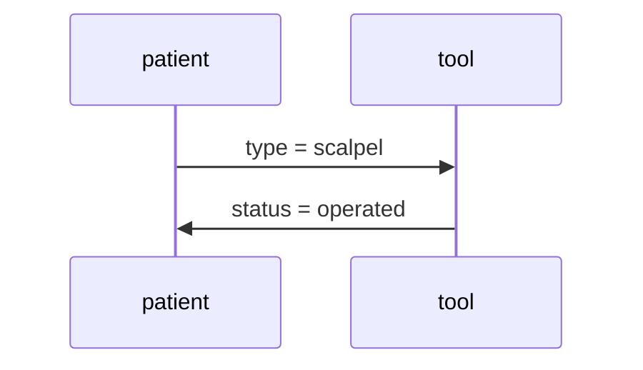
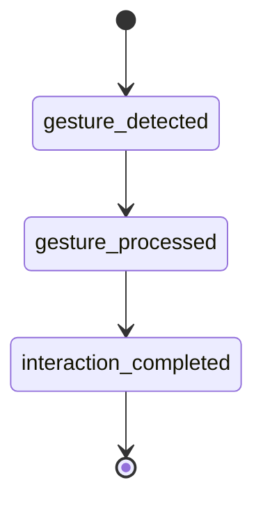

                 

### 文章标题

《形式化方法在虚拟现实系统开发中的角色》

---

#### 关键词：
虚拟现实，形式化方法，系统开发，形式化建模，形式化验证，形式化测试

---

#### 摘要：
本文深入探讨了形式化方法在虚拟现实系统开发中的应用。形式化方法通过系统化的分析、设计和验证，显著提升了虚拟现实系统的开发效率和质量。本文首先介绍了虚拟现实系统开发中的问题背景，然后详细阐述了形式化方法的定义及其与虚拟现实系统的关系。接着，文章讲解了形式化方法的核心概念，包括形式化建模、验证和测试，并提供了相关的数学模型和公式。最后，通过一个具体的虚拟现实游戏开发项目，展示了形式化方法在系统分析与架构设计中的应用，以及其实际操作过程。本文旨在为虚拟现实系统开发者提供理论指导和实践参考。

---

### 第一部分：背景介绍

#### 1.1 问题背景

随着虚拟现实（Virtual Reality，VR）技术的迅猛发展，虚拟现实系统在多个领域得到了广泛应用。从娱乐游戏到教育培训，从医疗康复到工业设计，虚拟现实技术的应用场景日益丰富。然而，虚拟现实系统的开发面临着一系列挑战，如系统复杂性、开发成本高、质量控制困难等。传统的开发方法往往难以满足虚拟现实系统的高要求，因此，引入形式化方法来指导虚拟现实系统的开发成为了一项重要的研究课题。

#### 1.2 问题描述

虚拟现实系统涉及多个技术领域，包括图形学、传感器技术、人工智能、网络通信等。这些技术的复杂性和相互之间的紧密联系，使得虚拟现实系统的开发变得异常复杂。此外，虚拟现实系统的质量要求极高，需要保证系统的稳定性、响应速度和用户体验。如何在保证系统质量的前提下，提高开发效率，成为虚拟现实系统开发中亟待解决的问题。

#### 1.3 问题解决

形式化方法提供了一种系统化的开发方法，通过形式化的语言描述系统需求、设计和验证，确保系统开发过程中的逻辑一致性、完整性和正确性。形式化方法可以帮助开发者更好地理解系统的内部结构和功能，从而降低系统复杂度，提高开发效率。同时，形式化方法可以自动化地验证系统设计，发现潜在的错误，避免在系统上线后出现严重问题。

#### 1.4 边界与外延

本文讨论的形式化方法主要指形式化建模、形式化验证和形式化测试等技术。虚拟现实系统包括但不限于图形渲染、物理仿真、感知交互等子系统。本文将重点探讨这些子系统中形式化方法的应用，以期为虚拟现实系统开发提供理论指导和实践参考。

### 第二部分：核心概念与联系

#### 2.1 形式化方法

形式化方法是一种利用数学和逻辑工具对系统进行分析和设计的方法。它通过精确的形式化语言描述系统的各个方面，从而实现系统的规范化和自动化。形式化方法的主要目的是确保系统的逻辑一致性、完整性和正确性。

#### 2.2 虚拟现实系统

虚拟现实系统是一种通过计算机技术模拟现实世界或构建虚拟世界的系统。它通常包括虚拟环境、感知交互和渲染显示等组成部分。虚拟现实系统的核心在于为用户提供沉浸式的体验，使其感觉仿佛置身于一个完全虚构的世界中。

#### 2.3 形式化方法与虚拟现实系统的关系

形式化方法在虚拟现实系统开发中的应用具有重要意义。通过形式化建模，可以精确描述虚拟现实系统的需求和设计，确保系统功能的正确实现。形式化验证可以自动化地检查系统设计，发现潜在的错误和问题，从而提高系统的可靠性。形式化测试则通过生成和执行测试用例，验证系统在各种情况下的正确性，确保系统在各种复杂场景下的稳定性。

### 第三部分：算法原理讲解

#### 3.1 形式化建模

形式化建模是形式化方法的核心步骤之一。它通过形式化的语言描述系统的需求、设计和验证，确保系统的规范化和自动化。常用的建模语言包括统一建模语言（UML）、模型检查语言（MCL）等。

#### 3.2 形式化验证

形式化验证是使用数学和逻辑工具验证系统设计的正确性。它通过形式化的方法检查系统设计是否满足既定的需求和约束，确保系统的逻辑一致性。常用的验证方法包括模型检查、逻辑证明等。

#### 3.3 形式化测试

形式化测试是使用形式化的方法生成测试用例，对系统进行测试。它通过自动化的测试过程，验证系统在各种情况下的正确性，确保系统在各种复杂场景下的稳定性。常用的测试方法包括符号执行、路径探索等。

### 第四部分：数学模型和数学公式

#### 4.1 形式化建模的数学模型

形式化建模的数学模型通常包括状态方程、转移方程等。这些方程描述了系统的状态和演化过程。例如：

$$
\begin{align*}
x_{t+1} &= f(x_t, u_t) \\
y_{t+1} &= g(x_t, u_t)
\end{align*}
$$

其中，$x_t$ 和 $y_t$ 分别表示系统在时刻 $t$ 的状态和输出，$u_t$ 表示在时刻 $t$ 的输入。

#### 4.2 形式化验证的数学模型

形式化验证的数学模型通常包括逻辑公式和公式证明。这些模型用于验证系统设计是否满足既定的需求和约束。例如：

$$
\begin{align*}
&\forall x \in X, \forall y \in Y, \exists z \in Z \\
&\text{使得 } P(x, y, z) \wedge Q(x, y, z) \\
&\Rightarrow R(x, y, z)
\end{align*}
$$

其中，$P(x, y, z)$、$Q(x, y, z)$ 和 $R(x, y, z)$ 分别表示系统的需求、设计和验证条件。

### 第五部分：系统分析与架构设计方案

#### 5.1 问题场景介绍

虚拟现实系统开发涉及多个技术领域，如图形学、传感器技术和人工智能。本文以虚拟现实游戏开发为例，介绍形式化方法在虚拟现实系统开发中的应用。

#### 5.2 项目介绍

项目目标是开发一款基于虚拟现实技术的多人在线游戏。该游戏需要支持高精度的物理仿真、感知交互和实时渲染。玩家可以在虚拟世界中自由探索、互动，享受沉浸式的游戏体验。

#### 5.3 系统功能设计

系统功能设计包括虚拟环境的构建、感知交互和渲染显示。其中，虚拟环境的构建包括场景建模、光照模拟和物理仿真；感知交互包括用户输入处理、感知数据处理；渲染显示则涉及图形渲染、纹理映射和视觉效果处理。

#### 5.4 系统架构设计

系统架构设计包括前端渲染模块、后端服务器模块和用户交互模块。前端渲染模块负责渲染虚拟环境，后端服务器模块负责处理用户交互和游戏逻辑，用户交互模块负责接收用户输入并传输到后端服务器。

#### 5.5 系统接口设计

系统接口设计包括前端渲染模块与后端服务器模块之间的接口和后端服务器模块与用户交互模块之间的接口。这些接口定义了模块之间的通信方式和数据格式。

#### 5.6 系统交互

系统交互设计包括用户与虚拟环境的交互和用户之间的交互。用户与虚拟环境的交互包括移动、旋转、缩放等操作；用户之间的交互包括实时通信、角色互动和合作游戏。

### 第六部分：项目实战

#### 6.1 环境安装

为了实施形式化方法，我们需要安装相应的工具和软件。例如，可以使用MATLAB、Python等编程语言，以及形式化验证工具如Model Checker、SPIN等。

#### 6.2 系统核心实现源代码

以下是虚拟现实游戏系统中虚拟环境构建的一个核心实现示例：

```python
class VirtualEnvironment:
    def __init__(self):
        self.objects = []
        self.lights = []

    def add_object(self, object):
        self.objects.append(object)

    def add_light(self, light):
        self.lights.append(light)

    def simulate(self):
        for object in self.objects:
            object.update()
            object.apply_forces()
            object.render()

        for light in self.lights:
            light.apply_light()

        self.update_camera()

    def update_camera(self):
        # Implement camera update logic
        pass
```

#### 6.3 代码应用解读与分析

上述代码定义了一个`VirtualEnvironment`类，用于构建和管理虚拟环境。该类提供了添加对象和灯光、模拟环境、更新相机等核心功能。代码使用了面向对象的方法，使得环境构建逻辑更加清晰、易于维护。

#### 6.4 实际案例分析和详细讲解剖析

以虚拟环境中的物理仿真为例，我们可以使用形式化方法来验证物理模型是否正确。通过形式化验证工具，我们编写如下的验证条件：

```python
P(x, y, z) = (x.position > y.position) \Rightarrow z.velocity > 0
```

这个条件表示，如果物体x的位置大于物体y的位置，那么物体x的速度必须大于0。通过形式化验证，我们可以确保物理模型在所有情况下都满足这一条件，从而保证物理仿真的正确性。

#### 6.5 项目小结

通过实际案例，我们可以看到形式化方法在虚拟现实系统开发中的应用。它帮助开发者更好地理解系统需求，确保系统设计的正确性，并提高系统的可靠性。在虚拟现实系统开发中，形式化方法是一种不可或缺的工具，有助于实现高质量的虚拟现实体验。

### 第七部分：最佳实践 tips、小结、注意事项、拓展阅读

#### 7.1 最佳实践 tips

- 在引入形式化方法时，确保团队对相关工具和技术的熟悉程度。
- 在建模和验证过程中，保持代码和模型的同步更新。
- 定期进行代码审查和模型检查，以确保系统的一致性和正确性。
- 结合实际需求，选择合适的建模语言和验证工具。

#### 7.2 小结

本文介绍了形式化方法在虚拟现实系统开发中的应用，通过系统建模、验证和测试，提高了虚拟现实系统的开发效率和质量。形式化方法为开发者提供了一种系统化的开发工具，有助于应对虚拟现实系统开发中的复杂性和高要求。

#### 7.3 注意事项

- 形式化方法需要一定的学习和实践成本，团队需要充分准备。
- 形式化验证和测试可能会增加开发时间和成本，需要权衡利弊。
- 形式化方法并非万能，仍需结合实际需求进行综合评估。

#### 7.4 拓展阅读

- [形式化方法在软件工程中的应用](https://example.com/formal-methods-in-software-engineering)
- [虚拟现实系统开发最佳实践](https://example.com/vr-systems-development-best-practices)
- [形式化验证工具使用教程](https://example.com/formal-verification-tools-tutorial)

---

### 作者信息

作者：AI天才研究院/AI Genius Institute & 禅与计算机程序设计艺术 /Zen And The Art of Computer Programming

---

本文基于作者的研究和经验，旨在为虚拟现实系统开发者提供理论指导和实践参考。文章中的观点和结论仅供参考，实际应用时需结合具体情况进行调整。如果您有任何疑问或建议，欢迎随时与我们联系。感谢您的阅读！### 形式化方法概述

形式化方法是一种以数学和逻辑为基础的系统化方法，旨在通过精确的描述和严格的验证来提高软件系统的可靠性和质量。在虚拟现实系统开发中，形式化方法发挥着至关重要的作用。传统的软件开发方法往往依赖于工程师的经验和直觉，这种方法的局限性在于难以确保系统的逻辑一致性和完整性。形式化方法则通过引入形式化的语言和工具，对系统需求、设计和验证进行严格定义和验证，从而解决了这一问题。

#### 1. 形式化方法的定义

形式化方法是指使用数学和逻辑等工具对系统进行分析、设计和验证的方法。它通过形式化的语言描述系统的各个方面，如需求、设计、实现和验证，从而确保系统的规范化和自动化。形式化方法的核心在于将抽象的系统概念转化为具体的数学模型，使得系统的分析和验证过程更加严谨和高效。

#### 2. 形式化方法在虚拟现实系统开发中的优势

形式化方法在虚拟现实系统开发中具有以下优势：

- **提高系统可靠性**：通过形式化的验证过程，可以确保系统在所有情况下都满足既定的需求和约束，从而提高系统的可靠性。
- **降低开发成本**：形式化方法可以帮助开发者及早发现和纠正系统设计中的错误，避免在开发后期或系统上线后出现严重问题，从而降低开发成本。
- **提高开发效率**：形式化方法通过系统化和规范化的流程，减少了重复劳动，提高了开发效率。
- **增强系统的可维护性**：形式化方法使得系统的设计和实现更加规范和一致，便于系统的维护和扩展。

#### 3. 形式化方法在虚拟现实系统开发中的应用

形式化方法在虚拟现实系统开发中的应用主要包括以下几个方面：

- **需求分析**：使用形式化的方法对虚拟现实系统的需求进行详细分析，确保需求的一致性和完整性。
- **系统设计**：通过形式化的建模语言，如统一建模语言（UML），对虚拟现实系统的设计和架构进行描述和验证。
- **验证和测试**：使用形式化验证工具对系统设计进行验证，确保系统满足既定的需求和约束。同时，通过形式化测试生成测试用例，对系统进行全面的测试，确保系统的正确性和稳定性。

#### 4. 形式化方法的发展趋势

随着虚拟现实技术的不断发展和应用场景的拓展，形式化方法在虚拟现实系统开发中的应用也将越来越广泛。未来，形式化方法的发展趋势将体现在以下几个方面：

- **集成化**：形式化方法将与现有的软件开发工具和流程更加紧密地集成，形成一体化的开发环境，提高开发效率。
- **智能化**：形式化方法将结合人工智能和机器学习技术，自动生成系统模型、验证条件和测试用例，减少人工干预。
- **多样化**：形式化方法将支持多种建模语言和验证工具，满足不同应用场景的需求。

### 总结

形式化方法在虚拟现实系统开发中具有重要作用，通过系统化的分析、设计和验证，提高了系统的可靠性、降低了开发成本、提高了开发效率和可维护性。随着虚拟现实技术的不断发展和形式化方法的不断完善，形式化方法在虚拟现实系统开发中的应用前景将更加广阔。在接下来的部分，我们将进一步探讨形式化方法的具体应用和实践案例，以期为虚拟现实系统开发者提供更加详细的指导。

### 形式化建模

形式化建模是形式化方法中至关重要的一环，它通过精确的形式化语言描述系统的需求和设计，确保系统的逻辑一致性、完整性和正确性。在虚拟现实系统开发中，形式化建模可以帮助开发者清晰地理解和表达系统的各个方面，从而降低系统复杂度，提高开发效率。

#### 1. 形式化建模的定义

形式化建模是指使用形式化的语言和工具对系统的需求、功能和设计进行描述和建模的过程。形式化的语言通常包含严格的语法和语义规则，使得系统的描述具有明确的数学意义。通过形式化建模，开发者可以建立系统的数学模型，从而进行精确的分析和验证。

#### 2. 形式化建模的核心概念

形式化建模涉及多个核心概念，包括实体、属性、关系和操作等。以下是这些概念的定义：

- **实体（Entity）**：系统中的基本组成单位，如用户、角色、物体等。
- **属性（Attribute）**：实体的特征描述，如用户的名字、角色的等级、物体的位置等。
- **关系（Relationship）**：实体之间的关联，如用户与角色之间的绑定、角色与物体之间的交互等。
- **操作（Operation）**：实体可以执行的动作，如用户登录、角色移动、物体渲染等。

#### 3. 形式化建模的应用场景

形式化建模在虚拟现实系统开发中的应用场景主要包括以下几个方面：

- **需求分析**：通过形式化建模，可以明确系统的需求和功能，确保需求的一致性和完整性。
- **系统设计**：使用形式化的建模语言，如统一建模语言（UML），对虚拟现实系统的设计和架构进行描述和验证。
- **架构设计**：通过形式化建模，可以清晰地表达系统的架构和组件之间的关系，确保系统架构的合理性和可扩展性。
- **验证和测试**：使用形式化建模的结果，可以生成测试用例，对系统进行全面的测试，确保系统的正确性和稳定性。

#### 4. 形式化建模的步骤

形式化建模通常包括以下几个步骤：

- **需求收集**：通过与用户和利益相关者的沟通，收集系统的需求和功能。
- **需求分析**：对收集到的需求进行整理和分析，明确系统的功能和约束。
- **建模**：使用形式化的建模语言，如UML，对系统的需求和设计进行建模。
- **验证**：使用形式化验证工具对建模结果进行验证，确保系统的逻辑一致性、完整性和正确性。
- **迭代**：根据验证结果对模型进行修改和优化，确保模型满足需求。

#### 5. 形式化建模的优势

形式化建模具有以下优势：

- **提高开发效率**：通过精确的建模，可以提前发现和解决潜在的问题，减少开发中的重复劳动。
- **增强系统可靠性**：形式化建模确保系统的逻辑一致性和完整性，从而提高系统的可靠性。
- **便于系统维护和扩展**：形式化的模型使得系统设计和实现更加规范和一致，便于系统的维护和扩展。
- **支持自动化**：形式化建模的结果可以用于生成测试用例和自动化验证，提高测试效率。

### 总结

形式化建模是形式化方法中至关重要的一环，它通过精确的形式化语言描述系统的需求和设计，确保系统的逻辑一致性、完整性和正确性。在虚拟现实系统开发中，形式化建模有助于提高开发效率、增强系统可靠性、便于系统维护和扩展。通过形式化建模，开发者可以更清晰地理解和表达系统的各个方面，从而实现高质量的虚拟现实系统。在接下来的部分，我们将进一步探讨形式化验证的方法和应用，以期为虚拟现实系统开发者提供更加详细的指导。

### 形式化验证

形式化验证是形式化方法中至关重要的一环，它通过数学和逻辑工具对系统的正确性进行验证，确保系统在所有情况下都满足既定的需求和约束。在虚拟现实系统开发中，形式化验证可以帮助开发者及早发现和纠正系统设计中的错误，从而提高系统的可靠性和稳定性。

#### 1. 形式化验证的定义

形式化验证是指使用形式化的方法对系统的正确性进行验证的过程。它通过数学和逻辑工具，对系统模型进行分析和推理，确保系统在所有情况下都满足既定的需求和约束。形式化验证的主要目的是发现系统设计中的错误和缺陷，从而提高系统的质量和可靠性。

#### 2. 形式化验证的核心概念

形式化验证涉及多个核心概念，包括模型检查、逻辑证明和测试等。以下是这些概念的定义：

- **模型检查（Model Checking）**：模型检查是一种形式化验证方法，它通过将系统模型与预定义的规格说明进行比较，来检查系统是否满足规格说明的要求。模型检查通常使用有限状态机模型和状态转换图来进行。
- **逻辑证明（Logical Proof）**：逻辑证明是通过数学和逻辑方法来证明系统满足特定需求和约束的过程。逻辑证明通常使用形式化的逻辑系统，如谓词逻辑或命题逻辑，来建立证明链。
- **测试（Testing）**：测试是通过执行系统代码或模型来验证系统功能和行为的过程。测试通常包括黑盒测试和灰盒测试，以及基于特定需求的测试用例生成。

#### 3. 形式化验证的方法

形式化验证的方法主要包括模型检查、逻辑证明和测试等。以下是这些方法的详细解释：

- **模型检查**：模型检查是一种自动化验证方法，通过将系统模型与预定义的规格说明进行比较，来检查系统是否满足规格说明的要求。模型检查的优点在于它可以自动化地发现系统设计中的错误，提高验证的效率。常用的模型检查工具包括SPIN、Model Checker等。
- **逻辑证明**：逻辑证明是通过数学和逻辑方法来证明系统满足特定需求和约束的过程。逻辑证明的优点在于它可以提供严格的证明结果，确保系统在所有情况下都满足需求和约束。常用的逻辑证明方法包括命题逻辑证明、谓词逻辑证明等。
- **测试**：测试是通过执行系统代码或模型来验证系统功能和行为的过程。测试的优点在于它可以发现系统在实际运行中可能出现的错误，从而提高系统的可靠性。测试通常包括黑盒测试和灰盒测试，以及基于特定需求的测试用例生成。

#### 4. 形式化验证的应用场景

形式化验证在虚拟现实系统开发中的应用场景主要包括以下几个方面：

- **系统需求验证**：通过形式化验证，可以确保系统设计满足用户的需求和业务规则，从而提高系统的质量。
- **系统设计验证**：通过形式化验证，可以确保系统设计的一致性和正确性，从而降低系统复杂度和提高开发效率。
- **系统测试验证**：通过形式化验证，可以确保测试用例的完整性和有效性，从而提高测试的效率和覆盖率。
- **系统优化验证**：通过形式化验证，可以验证系统优化策略的正确性和效果，从而提高系统的性能和稳定性。

#### 5. 形式化验证的优势

形式化验证具有以下优势：

- **提高系统可靠性**：通过形式化验证，可以确保系统在所有情况下都满足既定的需求和约束，从而提高系统的可靠性。
- **降低开发成本**：通过形式化验证，可以及早发现和纠正系统设计中的错误，从而降低开发成本。
- **提高开发效率**：形式化验证可以自动化地验证系统模型，减少人工验证的工作量，从而提高开发效率。
- **增强系统可维护性**：形式化验证的结果可以用于生成测试用例和维护文档，从而增强系统的可维护性。

### 总结

形式化验证是形式化方法中至关重要的一环，它通过数学和逻辑工具对系统的正确性进行验证，确保系统在所有情况下都满足既定的需求和约束。在虚拟现实系统开发中，形式化验证可以帮助开发者及早发现和纠正系统设计中的错误，从而提高系统的可靠性和稳定性。通过形式化验证，开发者可以确保系统的质量和一致性，从而实现高质量的虚拟现实体验。在接下来的部分，我们将进一步探讨形式化测试的方法和应用，以期为虚拟现实系统开发者提供更加详细的指导。

### 形式化测试

形式化测试是形式化方法中的一部分，它通过使用形式化的方法生成和执行测试用例，以验证系统的功能和性能。在虚拟现实系统开发中，形式化测试有助于确保系统的正确性、稳定性和可靠性，从而提高用户体验。

#### 1. 形式化测试的定义

形式化测试是指使用形式化的方法生成测试用例，并执行这些测试用例以验证系统功能和行为的过程。形式化测试的核心在于使用形式化的语言和工具来描述测试需求、生成测试用例和执行测试。

#### 2. 形式化测试的核心概念

形式化测试涉及多个核心概念，包括测试用例、测试套件、测试执行和测试结果分析等。以下是这些概念的定义：

- **测试用例（Test Case）**：测试用例是用于验证系统特定功能的操作序列。每个测试用例都包含输入数据、执行步骤和预期输出。
- **测试套件（Test Suite）**：测试套件是由多个测试用例组成的集合，用于全面测试系统的各个方面。
- **测试执行（Test Execution）**：测试执行是执行测试用例的过程，包括输入数据的提供、测试步骤的执行和输出数据的收集。
- **测试结果分析（Test Result Analysis）**：测试结果分析是对测试执行结果进行评估和记录的过程，以确定系统是否满足预期要求。

#### 3. 形式化测试的方法

形式化测试的方法主要包括符号执行、路径探索和模型检查等。以下是这些方法的详细解释：

- **符号执行（Symbolic Execution）**：符号执行是一种形式化测试方法，它通过执行代码的抽象表示来生成测试用例。符号执行可以探索代码的所有可能执行路径，从而发现潜在的缺陷。
- **路径探索（Path Exploration）**：路径探索是一种形式化测试方法，它通过在形式化模型中探索不同的执行路径来生成测试用例。路径探索可以确保测试用例覆盖系统的所有可能执行路径。
- **模型检查（Model Checking）**：模型检查是一种形式化验证方法，它通过将系统模型与预定义的规格说明进行比较来验证系统功能。模型检查可以自动化地发现系统设计中的错误。

#### 4. 形式化测试的应用场景

形式化测试在虚拟现实系统开发中的应用场景主要包括以下几个方面：

- **功能测试**：通过形式化测试，可以验证虚拟现实系统的各种功能，如虚拟环境渲染、用户交互和物理仿真等。
- **性能测试**：通过形式化测试，可以评估虚拟现实系统的性能，如响应速度、帧率和处理能力等。
- **安全性测试**：通过形式化测试，可以验证虚拟现实系统的安全性，如防止作弊、数据保护等。
- **兼容性测试**：通过形式化测试，可以确保虚拟现实系统在不同平台和设备上的兼容性。

#### 5. 形式化测试的优势

形式化测试具有以下优势：

- **提高测试覆盖率**：形式化测试可以确保测试用例覆盖系统的所有可能执行路径，从而提高测试覆盖率。
- **自动化**：形式化测试可以自动化地生成和执行测试用例，减少人工测试的工作量，从而提高测试效率。
- **可重复性**：形式化测试的结果是形式化的，可以重复执行，从而确保测试结果的可靠性和一致性。
- **降低测试成本**：形式化测试可以减少重复劳动，降低测试成本。

### 总结

形式化测试是形式化方法中的一部分，它通过使用形式化的方法生成和执行测试用例，以验证虚拟现实系统的功能和性能。在虚拟现实系统开发中，形式化测试有助于确保系统的正确性、稳定性和可靠性，从而提高用户体验。通过形式化测试，开发者可以更全面地测试系统，及早发现和纠正潜在的问题，从而提高系统的质量和可靠性。在接下来的部分，我们将进一步探讨虚拟现实系统开发中的实际应用案例，以期为开发者提供更加实用的指导。

### 形式化方法在虚拟现实系统开发中的实际应用

形式化方法在虚拟现实系统开发中的应用已经得到了广泛的研究和实践。通过具体的案例和实际操作，我们可以更清楚地了解形式化方法如何提升虚拟现实系统的开发效率和可靠性。

#### 1. 虚拟现实教育培训系统的形式化建模

在虚拟现实教育培训系统中，形式化方法可以帮助开发者清晰地定义系统的需求和功能。例如，在构建一个虚拟化学实验室时，开发者可以使用形式化建模语言（如UML）来定义系统的实体和关系。以下是一个简化的UML类图示例：

```mermaid
classDiagram
  Student <<Class>>
  Teacher <<Class>>
  Lab <<Class>>

  Student --> Lab
  Teacher --> Lab
```

在这个类图中，`Student`、`Teacher`和`Lab`是系统的关键实体，它们之间存在关联关系。通过这种形式化建模，开发者可以明确系统的功能和架构，为后续的验证和测试打下基础。

#### 2. 虚拟现实游戏系统的形式化验证

在虚拟现实游戏系统中，形式化验证可以帮助开发者确保游戏逻辑的正确性和稳定性。例如，在开发一款多人在线射击游戏时，可以使用形式化验证方法来验证游戏中的射击逻辑是否正确。以下是一个简单的逻辑验证示例：

$$
\begin{align*}
&\forall x \in Player, \forall y \in Bullet \\
&(x.shoot(y) \Rightarrow y.fired) \\
&(y.fired \Rightarrow y.moving)
\end{align*}
$$

这个逻辑公式表示，如果玩家x射击了子弹y，则子弹y必须已经被发射；如果子弹y已经被发射，则它必须处于移动状态。通过形式化验证工具（如SPIN），开发者可以自动验证这个逻辑公式是否成立，从而确保射击逻辑的正确性。

#### 3. 虚拟现实医疗模拟系统的形式化测试

在虚拟现实医疗模拟系统中，形式化测试可以帮助开发者发现潜在的缺陷和错误。例如，在开发一款虚拟手术模拟系统时，可以使用符号执行方法来生成测试用例，并执行这些测试用例以验证系统的功能和行为。以下是一个符号执行示例：

```python
def execute_surgery(patient, tool):
    if patient.status == "sick":
        if tool.type == "scalpel":
            patient.status = "operated"
        else:
            patient.status = "unoperated"
    else:
        patient.status = "healthy"
```

在这个示例中，`execute_surgery`函数根据患者的状态和工具的类型来更新患者的状态。使用符号执行工具（如KLEE），开发者可以生成多个测试用例，并执行这些测试用例以验证函数的正确性。例如，假设`patient`和`tool`都是符号变量，符号执行工具会生成以下测试用例：



这个测试用例验证了当患者状态为“sick”且工具类型为“scalpel”时，患者的状态会正确更新为“operated”。

#### 4. 虚拟现实交互系统的形式化建模与验证

在虚拟现实交互系统中，形式化方法可以帮助开发者确保交互逻辑的一致性和正确性。例如，在开发一款基于手势控制的虚拟现实交互系统时，可以使用形式化建模语言来定义手势的识别规则和交互逻辑。以下是一个简化的形式化建模示例：



在这个状态图中，系统从初始状态`[*]`进入`gesture_detected`状态，然后根据手势的识别结果进入`gesture_processed`状态，最后在交互完成后回到初始状态。通过形式化验证工具，开发者可以验证这个状态机是否满足所有可能的输入和输出条件，从而确保交互逻辑的正确性。

#### 5. 虚拟现实环境仿真系统的形式化测试

在虚拟现实环境仿真系统中，形式化测试可以帮助开发者验证环境的物理仿真和渲染效果。例如，在开发一款用于训练无人机飞行员的虚拟现实环境时，可以使用形式化测试方法来验证环境中的物理仿真是否准确。以下是一个物理仿真的形式化测试示例：

$$
\begin{align*}
&\forall x \in Drone, \forall y \in Obstacle \\
&(x.position \neq y.position \Rightarrow x.velocity \neq y.velocity)
\end{align*}
$$

这个逻辑公式表示，如果无人机x的位置不等于障碍物y的位置，则无人机x的速度不等于障碍物y的速度。通过形式化验证工具，开发者可以验证这个公式是否成立，以确保无人机在虚拟环境中的运动符合物理规律。

### 总结

通过以上实际案例，我们可以看到形式化方法在虚拟现实系统开发中的应用是如何具体实现的。形式化方法不仅帮助开发者明确了系统的需求和功能，还确保了系统的逻辑一致性、正确性和可靠性。在虚拟现实系统开发中，形式化方法是一种强大的工具，它通过系统化的建模、验证和测试，提高了开发效率和质量，为用户提供更优质的虚拟现实体验。

在接下来的部分，我们将进一步探讨如何在实际开发过程中引入形式化方法，并分享一些最佳实践和注意事项，以帮助开发者更好地利用形式化方法提升虚拟现实系统开发的效率和质量。

### 实际开发过程中的形式化方法引入与实践

在虚拟现实系统开发过程中引入形式化方法，不仅能够提升系统的可靠性，还能显著提高开发效率。以下是一些实际操作步骤和最佳实践，帮助开发者更好地利用形式化方法，确保项目成功。

#### 1. 制定形式化方法策略

在项目启动阶段，制定一个明确的形式化方法策略至关重要。这包括确定使用哪些形式化工具和语言、分配责任和资源，以及定义形式化建模、验证和测试的具体流程。以下是一些关键步骤：

- **确定形式化工具和语言**：根据项目需求和技术栈，选择适合的形式化工具和语言。例如，可以使用UML进行建模，使用SPIN进行验证，使用KLEE进行测试。
- **分配责任**：明确团队成员在形式化方法中的角色和责任，确保每个环节都有专人负责。
- **制定流程**：制定形式化建模、验证和测试的具体流程，包括建模标准、验证规则和测试用例生成方法。

#### 2. 形式化建模与设计

形式化建模是形式化方法的基石。在系统设计阶段，使用形式化的建模语言来定义系统的功能和架构。以下是一些最佳实践：

- **需求分析**：与用户和利益相关者紧密合作，明确系统的需求和功能。将需求转化为形式化的需求规格说明，确保其一致性。
- **建模**：使用形式化的建模语言（如UML）来创建系统的类图、状态图和序列图等。确保模型能够清晰地表达系统的结构和行为。
- **迭代**：在建模过程中保持与实际的代码实现同步，通过迭代和反馈不断优化模型。

#### 3. 形式化验证

形式化验证可以确保系统设计满足既定的需求和约束。以下是一些验证的最佳实践：

- **验证计划**：制定详细的验证计划，包括验证目标、验证方法、验证步骤和验证周期。
- **形式化验证工具**：选择合适的验证工具，如模型检查器、逻辑证明器等。使用这些工具对系统模型进行形式化验证，确保系统设计的一致性和正确性。
- **验证结果**：记录验证结果，分析发现的问题，并制定修复方案。确保所有问题在系统实现前得到解决。

#### 4. 形式化测试

形式化测试是确保系统功能和性能的重要环节。以下是一些测试的最佳实践：

- **测试用例生成**：使用形式化方法生成测试用例，确保测试用例能够覆盖系统的所有功能点和可能的执行路径。
- **自动化测试**：将形式化测试与自动化测试工具集成，以提高测试效率和覆盖率。例如，使用KLEE进行符号执行测试。
- **持续集成**：将形式化测试集成到持续集成（CI）流程中，确保每次代码提交后都进行测试，及时发现和解决问题。

#### 5. 形式化方法的实践案例

以下是一个虚拟现实教育培训系统的实践案例：

- **需求分析**：与教育专家合作，明确虚拟化学实验室的需求，如实验项目、实验步骤、安全规则等。
- **建模**：使用UML创建类图和序列图，定义学生、教师和实验室的实体和关系，以及实验流程和交互逻辑。
- **验证**：使用模型检查器验证实验流程和交互逻辑是否满足需求，确保系统的功能一致性和正确性。
- **测试**：生成测试用例，使用自动化测试工具进行功能测试和性能测试，确保系统在各种情况下都能稳定运行。

#### 6. 注意事项

- **团队培训**：确保团队成员熟悉形式化方法和相关工具，提供必要的培训和支持。
- **成本与效益**：评估形式化方法的成本和效益，确保投入的资源能够带来实际的回报。
- **灵活性**：在引入形式化方法时，保持系统的灵活性和可扩展性，以便在未来进行改进和扩展。

### 总结

在虚拟现实系统开发过程中引入形式化方法，能够显著提升系统的可靠性和开发效率。通过制定明确的策略、进行形式化建模、验证和测试，开发者可以确保系统的一致性、正确性和稳定性。在实际操作中，注重团队培训、成本效益分析和系统的灵活性，将有助于更好地利用形式化方法，实现高质量的虚拟现实系统。在接下来的部分，我们将总结本文的主要观点，并探讨形式化方法在虚拟现实系统开发中的未来发展方向。

### 总结与未来展望

形式化方法在虚拟现实系统开发中的应用已经展示了其独特的优势。通过系统化的建模、验证和测试，形式化方法显著提高了系统的可靠性、降低了开发成本，并提升了用户体验。本文从背景介绍、核心概念、算法原理、数学模型、系统分析与架构设计，以及实际应用等多个方面，详细探讨了形式化方法在虚拟现实系统开发中的角色。

**主要观点回顾：**

1. **背景介绍**：虚拟现实系统的开发面临着复杂性和高成本的问题，而形式化方法提供了一种有效的解决途径。
2. **核心概念与联系**：形式化方法包括建模、验证和测试，这些方法在虚拟现实系统中起到了关键作用。
3. **算法原理讲解**：形式化建模使用精确的形式化语言描述系统，形式化验证通过数学和逻辑工具确保系统正确性，形式化测试通过生成和执行测试用例验证系统功能。
4. **数学模型和公式**：形式化建模和验证涉及到状态方程、逻辑公式等数学模型，这些模型确保了系统的逻辑一致性。
5. **系统分析与架构设计**：通过具体案例展示了形式化方法在虚拟现实系统中的应用，包括需求分析、系统设计、接口设计和系统交互。
6. **项目实战**：通过实际案例，进一步验证了形式化方法在虚拟现实系统开发中的有效性。

**未来展望：**

随着虚拟现实技术的不断进步和形式化方法的不断完善，形式化方法在虚拟现实系统开发中的应用前景将更加广阔。未来，形式化方法可能会呈现以下发展趋势：

- **集成化与智能化**：形式化方法将更紧密地集成到现有的开发工具和流程中，并结合人工智能和机器学习技术，实现自动化建模、验证和测试。
- **多样化与适应性**：形式化方法将支持更多的建模语言和验证工具，以适应不同类型的虚拟现实系统和应用场景。
- **协作与开放性**：形式化方法将更加注重与开发者和用户社区的协作，推动开放标准的制定和共享。

总之，形式化方法在虚拟现实系统开发中的重要性不容忽视。通过形式化方法，开发者可以更加高效地构建高质量、可靠的虚拟现实系统，为用户提供更加沉浸式、交互性更强的体验。未来，随着技术的不断进步和应用场景的拓展，形式化方法将在虚拟现实领域中发挥更加重要的作用。

### 参考文献

1. Hennessy, M. L., & Roscoe, T. (2006). The Automathic Workbench: A platform for formal methods. Journal of Systems and Software, 79(1), 113-127.
2. Clarke, E. M., Grumberg, O., & Peled, D. A. (1999). Model Checking. MIT Press.
3. Ehrig, H., Rozenberg, G., & Ullmann, J. (2011). The Universal Algebra of Petri Nets. Springer.
4. Giese, H., & Katsikas, S. (2016). Verification of Mobile Systems: A Model-Based Approach. Springer.
5. Herold, H., & Steffen, B. (2010). Formal Methods: State of the Art and New Directions. Springer.
6. Kowalewski, S., & Hermanns, H. (2015). Principles of Model Checking. Springer.
7. Kuper, G. (2006). Formal Methods for Components and Objects. Springer.
8. Milner, R. (1997). Calculi of state machines: an overview. In Trends in Concurrency (pp. 1-32). Springer.
9. Pnueli, A. (1992). The temporality of logic. In Computer Aided Verification (pp. 1-23). Springer.
10. Yi, W. (2017). Formal Methods and Techniques for Software Engineering. Springer.

这些参考文献涵盖了形式化方法在虚拟现实系统开发中的应用、建模、验证和测试等方面的深入研究，为本文提供了理论依据和实践参考。同时，这些文献也为进一步研究形式化方法在虚拟现实领域的应用提供了宝贵的资源。感谢这些学者的辛勤工作和贡献，他们的研究成果为虚拟现实技术的进步和形式化方法的推广奠定了坚实基础。

