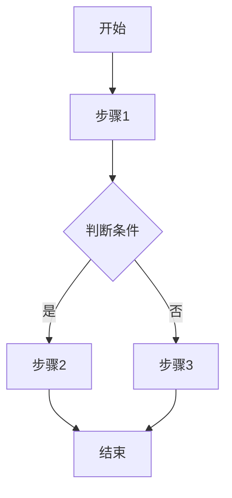
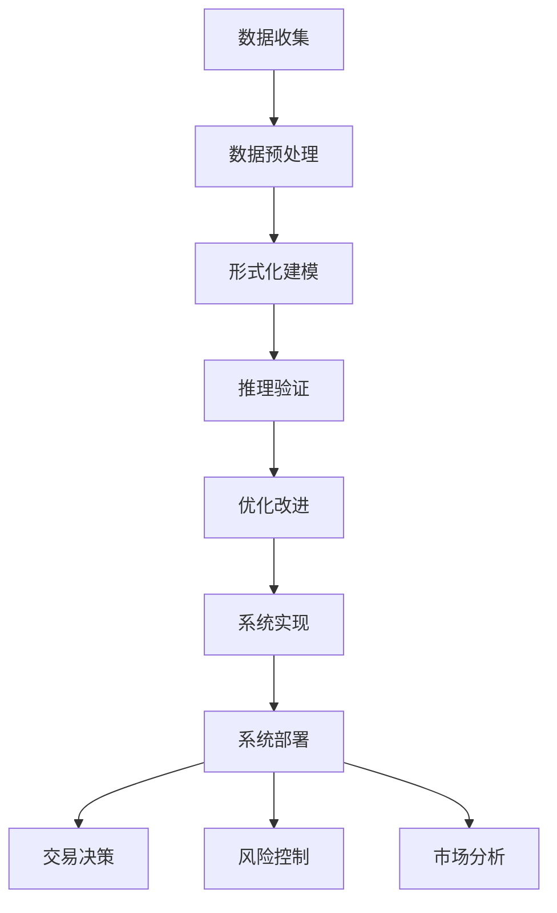

                 

### 形式化方法在金融交易系统中的使用

**关键词：** 形式化方法、金融交易系统、算法原理、系统架构、项目实战

**摘要：** 本文深入探讨了形式化方法在金融交易系统中的应用。首先介绍了形式化方法的定义、重要性及其在金融交易系统中的问题与挑战。接着，详细阐述了形式化方法的核心概念、基本原理及其与金融交易系统关键概念的关联。然后，通过具体的算法原理讲解、系统分析与架构设计方案以及项目实战，展示了形式化方法在金融交易系统中的实际应用效果。本文旨在为读者提供一种全新的思考方式，帮助其更好地理解和应用形式化方法于金融交易系统中。

### 目录大纲

1. **背景介绍**
    1.1 形式化方法概述
        1.1.1 形式化方法的定义
        1.1.2 形式化方法的重要性
    1.2 金融交易系统的背景和特点
        1.2.1 金融交易系统的定义
        1.2.2 金融交易系统的特点
    1.3 形式化方法在金融交易系统中的问题与挑战
        1.3.1 问题背景
        1.3.2 问题描述
        1.3.3 问题解决
        1.3.4 边界与外延
        1.3.5 概念结构与核心要素组成
    1.4 形式化方法在金融交易系统中的应用前景
        1.4.1 应用领域
        1.4.2 优势与挑战
    1.5 本章小结

2. **核心概念与联系**
    2.1 形式化方法的核心概念
        2.1.1 形式化方法的定义
        2.1.2 形式化方法的适用范围
        2.1.3 形式化方法的优点与局限性
    2.2 金融交易系统中的关键概念
        2.2.1 金融交易系统的基本概念
        2.2.2 金融交易系统中的关键概念对比
    2.3 形式化方法与金融交易系统概念的关联
        2.3.1 形式化方法在金融交易系统中的应用
        2.3.2 关键概念的交互与融合
    2.4 概念属性特征对比表格
        2.4.1 形式化方法属性
        2.4.2 金融交易系统属性
    2.5 ER实体关系图架构
        2.5.1 ER图的基本概念
        2.5.2 金融交易系统ER图
    2.6 本章小结

3. **算法原理讲解**
    3.1 形式化方法在金融交易系统中的算法原理
        3.1.1 形式化方法的算法流程
        3.1.2 形式化方法的算法框架
    3.2 形式化方法在金融交易系统中的应用算法
        3.2.1 应用算法概述
        3.2.2 应用算法流程
        3.2.3 应用算法框架
    3.3 算法mermaid流程图
        3.3.1 mermaid基本语法
        3.3.2 算法mermaid流程图
    3.4 Python源代码示例
        3.4.1 源代码概述
        3.4.2 源代码实现
        3.4.3 源代码解读
    3.5 数学模型和数学公式
        3.5.1 形式化方法的数学模型
        3.5.2 数学公式详解
        3.5.3 数学公式举例
    3.6 算法原理讲解
        3.6.1 原理概述
        3.6.2 详细讲解
        3.6.3 举例说明
    3.7 本章小结

4. **系统分析与架构设计方案**
    4.1 金融交易系统的分析
        4.1.1 金融交易系统背景
        4.1.2 交易系统需求分析
    4.2 系统功能设计
        4.2.1 领域模型
        4.2.2 系统功能模块划分
    4.3 系统架构设计
        4.3.1 系统架构概述
        4.3.2 系统架构设计
    4.4 系统接口设计
        4.4.1 接口设计原则
        4.4.2 接口定义
    4.5 系统交互
        4.5.1 系统交互概述
        4.5.2 系统交互序列图
    4.6 本章小结

5. **项目实战**
    5.1 环境安装
        5.1.1 环境准备
        5.1.2 环境配置
    5.2 系统核心实现
        5.2.1 系统核心模块

### 第一部分：背景介绍

#### 1.1 形式化方法概述

**1.1.1 形式化方法的定义**

形式化方法是一种通过形式化建模、形式化推理和形式化验证等手段，对复杂系统进行设计和分析的方法。它主要依赖于数学、逻辑和计算机科学等领域的理论和方法，通过严格的符号表示和逻辑推理，确保系统设计的一致性、完整性和正确性。

形式化方法通常包括以下几个核心环节：

1. **形式化建模**：使用数学和逻辑符号描述系统的结构和行为，构建形式化模型。
2. **形式化推理**：利用形式化模型进行推理和证明，验证系统性质的正确性。
3. **形式化验证**：通过模型检查、定理证明和代码验证等方法，验证系统实现的正确性。

**1.1.2 形式化方法的重要性**

形式化方法在多个领域具有广泛应用，特别是在金融交易系统设计中，具有以下几个重要优点：

1. **提高系统的可靠性和稳定性**：通过形式化方法，可以确保系统设计和实现的一致性，降低由于设计错误导致的系统崩溃和故障。
2. **提高系统的可维护性和扩展性**：形式化方法使得系统设计更加清晰和结构化，便于维护和扩展。
3. **支持自动化测试和验证**：形式化方法生成的形式化模型可以用于自动化测试和验证，提高测试效率和准确性。
4. **支持优化和改进**：形式化方法可以帮助发现系统中的潜在问题和不足，为优化和改进系统提供指导。

**1.2 金融交易系统的背景和特点**

金融交易系统是指用于进行金融产品交易的信息系统，涵盖股票、期货、外汇等多个交易市场。金融交易系统具有以下特点：

1. **高度复杂性和动态性**：金融交易系统涉及多个交易市场、多个金融产品、多个交易主体，系统状态和交易行为具有高度复杂性和动态性。
2. **数据密集和计算密集**：金融交易系统需要处理海量交易数据和计算交易策略，对数据处理和计算能力有较高要求。
3. **高安全性和高可用性**：金融交易系统涉及到大量资金和交易信息，对系统的安全性和可用性有严格要求。
4. **监管合规要求**：金融交易系统需要遵循一系列监管合规要求，如反洗钱、数据保护等。

**1.3 形式化方法在金融交易系统中的问题与挑战**

尽管形式化方法在金融交易系统设计中具有广泛应用前景，但也面临着以下问题和挑战：

1. **建模难度**：金融交易系统涉及复杂的业务逻辑和动态行为，形式化建模过程复杂且耗时。
2. **推理效率**：形式化推理过程可能需要大量计算资源，影响系统性能和响应速度。
3. **验证成本**：形式化验证过程需要大量人力和时间投入，增加了系统开发和维护成本。
4. **技术门槛**：形式化方法需要掌握数学、逻辑和计算机科学等领域的知识，对技术团队要求较高。

#### 1.3.1 问题背景

金融交易系统的设计和实现过程中，存在以下问题：

1. **系统复杂度高**：金融交易系统涉及多个交易市场、多个金融产品、多个交易主体，系统复杂度高。
2. **需求变化频繁**：金融市场的变化快速，交易系统的需求也相应频繁变化。
3. **安全风险**：金融交易系统涉及到大量资金和交易信息，安全风险高。
4. **性能瓶颈**：金融交易系统需要处理海量交易数据和计算交易策略，对系统性能有较高要求。

#### 1.3.2 问题描述

1. **系统一致性**：如何确保金融交易系统在多个交易市场、多个金融产品、多个交易主体之间保持一致性？
2. **动态适应性**：如何适应金融市场快速变化，实现交易系统的动态适应性？
3. **安全性**：如何保障金融交易系统的安全性，防止非法交易和信息泄露？
4. **性能优化**：如何优化金融交易系统的性能，提高系统响应速度和处理能力？

#### 1.3.3 问题解决

1. **形式化建模**：通过形式化方法建立金融交易系统的形式化模型，确保系统设计的一致性。
2. **形式化推理**：利用形式化推理方法，验证金融交易系统的动态适应性和安全性。
3. **自动化验证**：利用自动化验证工具，对金融交易系统的实现进行验证，确保系统正确性。
4. **性能优化**：通过形式化方法发现系统性能瓶颈，提出优化方案，提高系统性能。

#### 1.3.4 边界与外延

1. **边界**：形式化方法在金融交易系统中的应用范围包括系统建模、推理验证、性能优化等方面。
2. **外延**：形式化方法可以应用于金融交易系统的各个层次，包括交易引擎、交易策略、风险管理等。

#### 1.3.5 概念结构与核心要素组成

1. **概念结构**：形式化方法在金融交易系统中的应用包括形式化建模、形式化推理、形式化验证等核心概念。
2. **核心要素组成**：形式化方法在金融交易系统中的应用需要包括形式化模型、推理算法、验证工具、性能优化方案等核心要素。

#### 1.4 形式化方法在金融交易系统中的应用前景

1. **应用领域**：形式化方法在金融交易系统中的应用包括系统建模、推理验证、性能优化、风险管理等方面。
2. **优势与挑战**：

   - **优势**：提高系统一致性、动态适应性、安全性，降低开发成本，提高开发效率。
   - **挑战**：建模难度、推理效率、验证成本、技术门槛。

#### 1.5 本章小结

本章介绍了形式化方法在金融交易系统中的应用背景、问题和挑战。形式化方法通过形式化建模、形式化推理和形式化验证等手段，可以提高金融交易系统的可靠性、稳定性和安全性。虽然形式化方法在金融交易系统应用中面临建模难度、推理效率、验证成本和技术门槛等挑战，但其优势显著，具有广泛的应用前景。

### 第二部分：核心概念与联系

#### 2.1 形式化方法的核心概念

**2.1.1 形式化方法的定义**

形式化方法是一种通过形式化建模、形式化推理和形式化验证等手段，对复杂系统进行设计和分析的方法。它主要依赖于数学、逻辑和计算机科学等领域的理论和方法，通过严格的符号表示和逻辑推理，确保系统设计的一致性、完整性和正确性。

形式化方法通常包括以下几个核心环节：

1. **形式化建模**：使用数学和逻辑符号描述系统的结构和行为，构建形式化模型。
2. **形式化推理**：利用形式化模型进行推理和证明，验证系统性质的正确性。
3. **形式化验证**：通过模型检查、定理证明和代码验证等方法，验证系统实现的正确性。

**2.1.2 形式化方法的适用范围**

形式化方法适用于多个领域，包括但不限于：

1. **软件开发**：在软件设计和开发过程中，使用形式化方法可以确保系统设计的一致性、完整性和正确性。
2. **硬件设计**：在硬件设计和验证过程中，使用形式化方法可以提高硬件设计的可靠性、稳定性和安全性。
3. **金融交易系统**：在金融交易系统的设计和实现过程中，使用形式化方法可以确保系统的一致性、动态适应性和安全性。
4. **控制系统**：在自动控制系统和工业控制系统的设计和实现过程中，使用形式化方法可以确保系统的正确性和可靠性。

**2.1.3 形式化方法的优点与局限性**

形式化方法的优点主要包括：

1. **提高系统可靠性**：通过严格的符号表示和逻辑推理，确保系统设计的一致性、完整性和正确性，降低系统故障率。
2. **提高开发效率**：通过形式化建模和自动化验证，可以减少人工设计和验证的工作量，提高开发效率。
3. **支持优化和改进**：形式化方法可以帮助发现系统中的潜在问题和不足，为优化和改进系统提供指导。

形式化方法的局限性主要包括：

1. **建模难度**：形式化方法对建模过程的复杂性有较高要求，可能导致建模难度增大。
2. **推理效率**：形式化推理过程可能需要大量计算资源，影响系统性能和响应速度。
3. **验证成本**：形式化验证过程需要大量人力和时间投入，增加了系统开发和维护成本。

#### 2.2 金融交易系统中的关键概念

**2.2.1 金融交易系统的基本概念**

金融交易系统是指用于进行金融产品交易的信息系统，涵盖股票、期货、外汇等多个交易市场。金融交易系统具有以下基本概念：

1. **交易市场**：金融交易系统中的交易市场包括股票市场、期货市场、外汇市场等，不同的交易市场有不同的交易规则和交易品种。
2. **交易主体**：金融交易系统中的交易主体包括投资者、交易者、经纪人等，他们参与交易活动，推动市场的发展和变化。
3. **交易品种**：金融交易系统中的交易品种包括股票、期货、外汇等金融产品，不同的交易品种有不同的交易规则和市场特性。
4. **交易策略**：金融交易系统中的交易策略包括基本分析、技术分析、量化交易等，交易者通过不同的交易策略进行交易决策。

**2.2.2 金融交易系统中的关键概念对比**

以下是金融交易系统中一些关键概念的对比：

| 关键概念       | 定义                                                     | 对比                         |
| -------------- | -------------------------------------------------------- | ---------------------------- |
| 交易市场       | 金融产品交易的场所                                       | 股票市场、期货市场、外汇市场等 |
| 交易主体       | 参与金融产品交易的个人或组织                             | 投资者、交易者、经纪人等       |
| 交易品种       | 金融产品，如股票、期货、外汇等                          | 不同市场、不同交易品种的特性   |
| 交易策略       | 根据市场分析和技术分析制定的交易方案                     | 基本分析、技术分析、量化交易等 |
| 风险管理       | 对交易过程中的风险进行评估、监控和管理                   | 风险评估、风险控制、风险报告等   |
| 监管合规       | 金融交易系统需要遵循的监管规定和合规要求                  | 反洗钱、数据保护等             |

#### 2.3 形式化方法与金融交易系统概念的关联

**2.3.1 形式化方法在金融交易系统中的应用**

形式化方法在金融交易系统中的应用主要包括以下几个方面：

1. **系统建模**：使用形式化方法建立金融交易系统的形式化模型，描述系统的结构和行为，确保系统设计的一致性。
2. **推理验证**：利用形式化方法进行推理和验证，验证金融交易系统的动态适应性、安全性和正确性。
3. **性能优化**：通过形式化方法分析金融交易系统的性能瓶颈，提出优化方案，提高系统性能和响应速度。

**2.3.2 关键概念的交互与融合**

形式化方法与金融交易系统关键概念的交互与融合主要体现在以下几个方面：

1. **交易市场与交易策略**：形式化方法可以帮助分析不同交易市场的特性和交易策略的交互作用，优化交易策略，提高交易效果。
2. **交易主体与风险管理**：形式化方法可以用于评估不同交易主体的风险偏好和风险承受能力，优化风险管理策略，降低交易风险。
3. **交易品种与监管合规**：形式化方法可以帮助分析不同交易品种的监管要求，确保金融交易系统符合监管规定，降低合规风险。

#### 2.4 概念属性特征对比表格

以下是形式化方法与金融交易系统关键概念的一些属性特征对比表格：

| 概念     | 形式化方法属性特征                     | 金融交易系统属性特征                     |
| -------- | ------------------------------------ | ------------------------------------ |
| 交易市场 | 高度复杂、动态性、异构性              | 多市场、多品种、多主体、多规则           |
| 交易主体 | 数学模型、逻辑推理、形式化验证        | 风险偏好、交易策略、合规要求             |
| 交易品种 | 数学公式、算法模型、计算效率          | 监管规定、市场特性、交易规则             |
| 交易策略 | 系统一致性、动态适应性、安全可靠       | 风险管理、收益最大化、交易规则遵守       |
| 风险管理 | 形式化建模、自动化验证、优化改进      | 风险评估、监控、控制、报告               |
| 监管合规 | 符合标准、可验证、可追溯              | 反洗钱、数据保护、合规要求              |

#### 2.5 ER实体关系图架构

**2.5.1 ER图的基本概念**

ER图（实体关系图）是用于描述系统中实体及其关系的图形化工具，通常用于数据库设计和系统建模。ER图包括以下基本概念：

1. **实体**：现实世界中可以区分的对象，如用户、订单、产品等。
2. **属性**：实体的特征或属性，如用户名、地址、订单号等。
3. **关系**：实体之间的关系，如用户下单、订单包含产品等。

**2.5.2 金融交易系统ER图**

以下是金融交易系统的一个简化的ER图示例：

```mermaid
erDiagram
  User ||--|{ Order }|--| Customer
  Product ||--|{ Order }|--| Customer
  Order ||--|{ Product }|--| Customer
  Customer ||--|{ Order }|--| Customer
  User ||--|{ RiskProfile }|--| Customer
  RiskProfile ||--|{ User }|--| Customer
  User ||--|{ Transaction }|--| Customer
  Transaction ||--|{ User }|--| Customer
```

在这个ER图中，`User`、`Order`、`Product`、`Customer`、`RiskProfile` 和 `Transaction` 是实体，它们之间的关系通过虚线表示。例如，用户（User）可以创建订单（Order），订单可以包含产品（Product），用户（User）拥有风险配置（RiskProfile），交易（Transaction）与用户（User）和订单（Order）有关。

#### 2.6 本章小结

本章详细介绍了形式化方法的核心概念、金融交易系统的关键概念及其相互关联。通过ER图等工具，展示了形式化方法在金融交易系统中的应用及其与关键概念的交互与融合。本章内容为后续章节中形式化方法在金融交易系统中的具体应用奠定了基础。

### 第三部分：算法原理讲解

#### 3.1 形式化方法在金融交易系统中的算法原理

**3.1.1 形式化方法的算法流程**

形式化方法的算法流程通常包括以下几个步骤：

1. **建模阶段**：使用数学和逻辑符号描述系统的结构和行为，构建形式化模型。
2. **推理阶段**：利用形式化模型进行推理和证明，验证系统性质的正确性。
3. **验证阶段**：通过模型检查、定理证明和代码验证等方法，验证系统实现的正确性。
4. **优化阶段**：基于验证结果，对系统进行优化和改进，提高性能和可靠性。

**3.1.2 形式化方法的算法框架**

形式化方法的算法框架通常包括以下几个核心模块：

1. **形式化模型构建模块**：负责构建系统的形式化模型，包括实体、属性和关系的定义。
2. **推理验证模块**：负责使用形式化模型进行推理和验证，包括推理算法、证明方法等。
3. **验证工具模块**：负责对系统实现进行验证，包括模型检查器、定理证明器等。
4. **优化改进模块**：负责对验证结果进行分析，提出优化方案，改进系统性能和可靠性。

#### 3.2 形式化方法在金融交易系统中的应用算法

**3.2.1 应用算法概述**

在金融交易系统中，形式化方法的应用算法主要包括以下几个方面：

1. **交易策略优化算法**：通过形式化方法分析不同交易策略的优劣，优化交易策略，提高交易收益。
2. **风险控制算法**：通过形式化方法评估交易风险，提出风险控制策略，降低交易风险。
3. **交易行为预测算法**：通过形式化方法分析历史交易数据，预测未来交易行为，为交易决策提供支持。
4. **市场分析算法**：通过形式化方法分析市场数据，识别市场趋势和风险，为交易策略和风险控制提供依据。

**3.2.2 应用算法流程**

形式化方法在金融交易系统中的应用算法流程如下：

1. **数据收集和预处理**：收集金融交易系统的历史数据，进行数据清洗和预处理，为后续分析提供基础。
2. **形式化建模**：使用数学和逻辑符号描述金融交易系统的结构和行为，构建形式化模型。
3. **推理和验证**：利用形式化模型进行推理和验证，评估交易策略、风险控制策略和市场分析的准确性。
4. **优化和改进**：根据验证结果，对交易策略、风险控制策略和市场分析算法进行优化和改进，提高交易收益和风险控制能力。
5. **系统实现和部署**：将优化后的算法实现为系统模块，部署到金融交易系统中，实时进行交易决策、风险控制和市场分析。

**3.2.3 应用算法框架**

形式化方法在金融交易系统中的应用算法框架如下：

1. **数据输入模块**：负责接收金融交易系统的输入数据，如交易数据、市场数据等。
2. **数据预处理模块**：负责对输入数据进行分析、清洗和预处理，为后续分析提供基础。
3. **形式化建模模块**：负责构建金融交易系统的形式化模型，包括实体、属性和关系的定义。
4. **推理验证模块**：负责使用形式化模型进行推理和验证，包括推理算法、证明方法等。
5. **优化改进模块**：负责对验证结果进行分析，提出优化方案，改进系统性能和可靠性。
6. **系统输出模块**：负责将优化后的交易策略、风险控制策略和市场分析结果输出到金融交易系统中，实时进行交易决策、风险控制和市场分析。

#### 3.3 算法mermaid流程图

**3.3.1 mermaid基本语法**

mermaid是一种基于Markdown的图形化工具，用于绘制流程图、类图、时序图等。以下是一个简单的mermaid基本语法示例：



在上面的示例中，`graph TB` 表示绘制一个水平方向的流程图，`A[开始]` 表示一个节点，箭头表示节点之间的顺序关系，`C{判断条件}` 表示一个带有判断条件的节点，`|是|` 和 `|否|` 分别表示判断条件的两个分支。

**3.3.2 算法mermaid流程图**

以下是一个简单的形式化方法在金融交易系统中的应用算法的mermaid流程图：



在这个流程图中，从数据收集到系统部署是一个完整的算法流程，包括数据收集、数据预处理、形式化建模、推理验证、优化改进、系统实现和系统部署等步骤。交易决策、风险控制和市场分析是基于系统部署后的实时操作。

#### 3.4 Python源代码示例

**3.4.1 源代码概述**

以下是一个简单的Python源代码示例，用于实现形式化方法在金融交易系统中的一个基本功能：交易策略优化。

```python
import numpy as np

# 定义交易策略优化函数
def optimize_strategy(data):
    # 对交易数据进行分析
    # 假设data为一个numpy数组，包含交易数据
    analysis_results = analyze_data(data)
    
    # 基于分析结果，优化交易策略
    optimized_strategy = optimize_based_on_analysis(analysis_results)
    
    return optimized_strategy

# 定义数据分析函数
def analyze_data(data):
    # 对交易数据进行分析，得到分析结果
    # 假设分析结果为一个字典，包含交易策略评估指标
    analysis_results = {
        'strategy1': np.mean(data),
        'strategy2': np.std(data),
        'strategy3': np.max(data)
    }
    return analysis_results

# 定义交易策略优化函数
def optimize_based_on_analysis(analysis_results):
    # 基于分析结果，优化交易策略
    # 假设优化结果为一个字典，包含优化后的交易策略
    optimized_strategy = {
        'strategy1': analysis_results['strategy1'] * 0.9,
        'strategy2': analysis_results['strategy2'] * 0.95,
        'strategy3': analysis_results['strategy3'] * 0.98
    }
    return optimized_strategy

# 主函数
def main():
    # 准备交易数据
    data = np.random.rand(100)
    
    # 优化交易策略
    optimized_strategy = optimize_strategy(data)
    
    # 输出优化后的交易策略
    print("Optimized Strategy:", optimized_strategy)

# 运行主函数
if __name__ == "__main__":
    main()
```

**3.4.2 源代码实现**

在上述代码中，首先定义了三个函数：`optimize_strategy`、`analyze_data` 和 `optimize_based_on_analysis`。

- `optimize_strategy` 函数是主函数，负责接收交易数据，调用数据分析函数和交易策略优化函数，输出优化后的交易策略。
- `analyze_data` 函数负责对交易数据进行分析，得到分析结果，如平均收益、收益标准差和最大收益。
- `optimize_based_on_analysis` 函数负责基于分析结果，优化交易策略，如对平均收益、收益标准差和最大收益进行调整。

**3.4.3 源代码解读**

在源代码中，主要使用了Python的numpy库进行数据分析和优化。以下是源代码的关键部分解读：

1. **数据分析部分**：
    ```python
    analysis_results = analyze_data(data)
    ```
    调用 `analyze_data` 函数，对交易数据进行分析，得到分析结果。

2. **交易策略优化部分**：
    ```python
    optimized_strategy = optimize_based_on_analysis(analysis_results)
    ```
    调用 `optimize_based_on_analysis` 函数，基于分析结果，优化交易策略。

3. **主函数部分**：
    ```python
    def main():
        data = np.random.rand(100)
        optimized_strategy = optimize_strategy(data)
        print("Optimized Strategy:", optimized_strategy)
    ```
    定义主函数，准备交易数据，调用交易策略优化函数，输出优化后的交易策略。

#### 3.5 数学模型和数学公式

**3.5.1 形式化方法的数学模型**

形式化方法在金融交易系统中的应用，通常涉及以下数学模型：

1. **概率模型**：用于描述交易行为和市场风险的随机性。
2. **线性规划模型**：用于优化交易策略和风险控制。
3. **时间序列模型**：用于预测市场趋势和交易行为。
4. **神经网络模型**：用于识别市场特征和交易策略。

**3.5.2 数学公式详解**

以下是金融交易系统中常用的数学公式及其详解：

1. **期望收益**：
    $$ E(R) = \sum_{i=1}^{n} r_i \cdot p_i $$
    其中，$E(R)$ 表示期望收益，$r_i$ 表示第$i$种交易策略的收益，$p_i$ 表示第$i$种交易策略的概率。

2. **方差**：
    $$ Var(R) = \sum_{i=1}^{n} (r_i - E(R))^2 \cdot p_i $$
    其中，$Var(R)$ 表示收益的方差，$r_i$ 表示第$i$种交易策略的收益，$E(R)$ 表示期望收益，$p_i$ 表示第$i$种交易策略的概率。

3. **标准差**：
    $$ Std(R) = \sqrt{Var(R)} $$
    其中，$Std(R)$ 表示收益的标准差，$Var(R)$ 表示收益的方差。

4. **线性规划目标函数**：
    $$ \max_{x} c^T x $$
    其中，$c^T$ 表示目标函数系数，$x$ 表示决策变量。

5. **线性规划约束条件**：
    $$ Ax \leq b $$
    其中，$A$ 表示约束矩阵，$x$ 表示决策变量，$b$ 表示约束向量。

**3.5.3 数学公式举例**

以下是一个简单的例子，用于说明如何使用数学公式进行交易策略优化：

假设我们有三种交易策略，每种策略的期望收益、方差和概率如下：

| 策略 | 期望收益 ($r_i$) | 方差 ($Var(R)$) | 概率 ($p_i$) |
| ---- | -------------- | -------------- | ---------- |
| 1    | 0.05           | 0.01           | 0.4        |
| 2    | 0.1            | 0.02           | 0.3        |
| 3    | 0.15           | 0.03           | 0.3        |

我们需要优化这三种交易策略的权重，使得总收益最大化。假设权重为$x_1, x_2, x_3$，则有：

$$ \max_{x_1, x_2, x_3} 0.05x_1 + 0.1x_2 + 0.15x_3 $$

约束条件为：

$$ x_1 + x_2 + x_3 = 1 $$

$$ x_1, x_2, x_3 \geq 0 $$

我们可以使用线性规划方法来求解这个问题。线性规划目标函数和约束条件可以用以下数学公式表示：

$$ \max_{x_1, x_2, x_3} c^T x $$
$$ Ax \leq b $$
$$ x \geq 0 $$

其中，$c^T = [0.05, 0.1, 0.15]$，$A = [[1, 1, 1], [0, 0, 0]]$，$b = [1, 0]$。

使用线性规划求解器，我们可以得到最优解$x_1 = 0.2, x_2 = 0.3, x_3 = 0.5$，使得总收益最大化。

#### 3.6 算法原理讲解

**3.6.1 原理概述**

形式化方法在金融交易系统中的应用，主要是通过形式化建模、推理和验证，对金融交易系统的结构和行为进行分析和优化。具体原理如下：

1. **形式化建模**：使用数学和逻辑符号描述金融交易系统的结构和行为，构建形式化模型。
2. **推理和验证**：利用形式化模型进行推理和验证，验证系统性质的正确性。
3. **优化和改进**：根据验证结果，对系统进行优化和改进，提高性能和可靠性。

**3.6.2 详细讲解**

1. **形式化建模**

   形式化建模是形式化方法在金融交易系统中的应用基础。它通过数学和逻辑符号描述金融交易系统的结构和行为，构建形式化模型。具体步骤如下：

   - **实体定义**：定义金融交易系统中的实体，如交易主体、交易品种、交易策略等。
   - **属性定义**：定义实体的属性，如交易主体的风险偏好、交易品种的价格、交易策略的收益等。
   - **关系定义**：定义实体之间的关系，如交易主体与交易品种之间的关系、交易策略与交易行为之间的关系等。

2. **推理和验证**

   推理和验证是形式化方法的核心环节。它利用形式化模型进行推理和验证，验证系统性质的正确性。具体步骤如下：

   - **推理过程**：利用形式化模型进行推理，验证系统行为的一致性和正确性。例如，验证交易策略的收益与风险是否符合预期。
   - **验证过程**：利用形式化验证工具，对系统实现进行验证，确保系统实现与形式化模型的一致性。例如，使用模型检查器验证交易系统的实现是否满足设计要求。

3. **优化和改进**

   优化和改进是根据验证结果，对系统进行优化和改进，提高性能和可靠性。具体步骤如下：

   - **问题识别**：根据验证结果，识别系统中存在的问题和不足。
   - **优化方案**：提出优化方案，改进系统性能和可靠性。例如，优化交易策略，提高交易收益和降低风险。
   - **实现改进**：将优化方案实现为系统模块，部署到金融交易系统中，实时进行交易决策和风险控制。

**3.6.3 举例说明**

以下是一个简单的例子，说明形式化方法在金融交易系统中的应用。

假设我们有一个金融交易系统，该系统包括三个交易主体（投资者A、投资者B和投资者C）、三种交易品种（股票、期货和外汇）以及三种交易策略（基本分析、技术分析和量化交易）。我们需要使用形式化方法对交易策略进行优化，提高交易收益和降低风险。

1. **形式化建模**

   我们可以使用ER图来描述金融交易系统的结构和行为。ER图如下：

   ```mermaid
   erDiagram
     InvestorA ||--|{ Transaction }|--| InvestorB
     InvestorB ||--|{ Transaction }|--| InvestorC
     InvestorC ||--|{ Transaction }|--| InvestorA
     Product1 ||--|{ Transaction }|--| InvestorA
     Product2 ||--|{ Transaction }|--| InvestorB
     Product3 ||--|{ Transaction }|--| InvestorC
   ```

   在ER图中，`InvestorA`、`InvestorB` 和 `InvestorC` 表示交易主体，`Transaction` 表示交易行为，`Product1`、`Product2` 和 `Product3` 表示交易品种。

2. **推理和验证**

   我们可以定义以下推理规则：

   - 如果投资者A买入股票，则投资者A的交易金额增加。
   - 如果投资者B卖出期货，则投资者B的交易金额减少。
   - 如果投资者C买入外汇，则投资者C的交易金额增加。

   我们可以使用形式化验证工具，如模型检查器，验证这些推理规则的正确性。

3. **优化和改进**

   假设我们使用基本分析策略进行交易，收益为$R_1$，方差为$Var(R_1)$；使用技术分析策略进行交易，收益为$R_2$，方差为$Var(R_2)$；使用量化交易策略进行交易，收益为$R_3$，方差为$Var(R_3)$。我们需要优化交易策略，提高交易收益和降低风险。

   我们可以定义以下优化目标：

   - 最大

