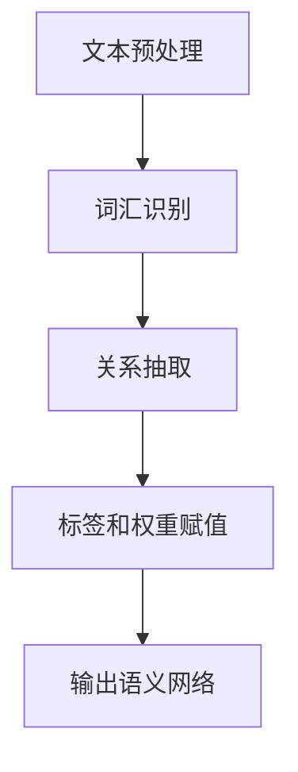
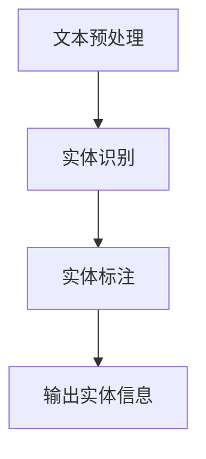
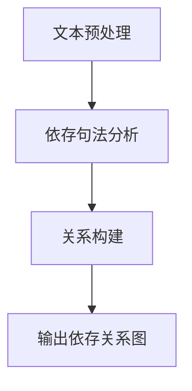
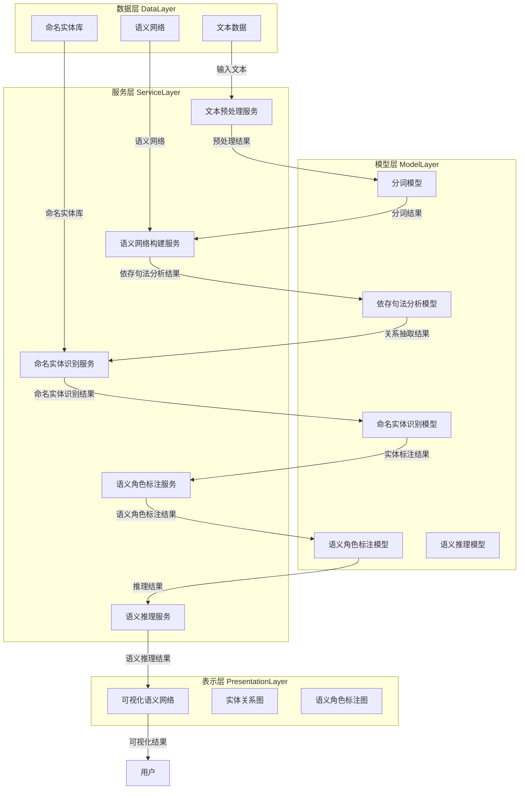
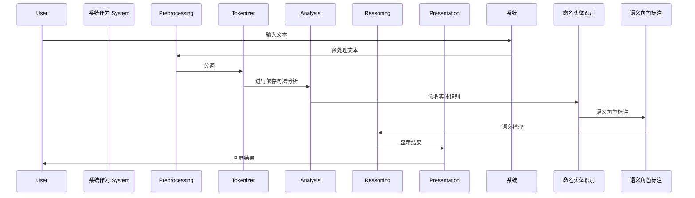

                 

### 形式化语义学在语言设计中的应用

**关键词**：形式化语义学、语言设计、语义分析、算法原理、系统架构

**摘要**：本文探讨了形式化语义学在语言设计中的应用，从背景介绍、核心概念与联系、算法原理讲解、数学模型和公式、系统分析与架构设计、项目实战等多个角度，全面解析了形式化语义学的核心概念、算法原理、数学基础和实际应用，为读者提供了一个深入理解语言设计和语义分析的框架。本文旨在帮助读者理解形式化语义学在语言设计中的重要性，并提供实用的最佳实践和拓展阅读资源。

## 第1章 背景介绍

### 1.1 问题背景

#### 1.1.1 形式化语义学的起源与发展

形式化语义学是计算机科学和语言学交叉领域的一个重要分支，其起源可以追溯到20世纪50年代。当时，计算机科学家和语言学家开始探讨如何将自然语言的语义以形式化的方式表示，以便于计算机处理。这一时期的代表性工作包括图灵机模型和形式语义学的基本框架构建。随着计算机技术的不断进步，形式化语义学逐渐发展壮大，涵盖了从基础理论研究到实际应用开发的各个方面。

#### 1.1.2 语言设计中的语义问题

语言设计中的语义问题主要集中在如何准确、高效地表达程序员的意图，以及如何确保程序的正确性和可理解性。语义问题包括静态语义和动态语义两个方面。静态语义主要关注程序在编写时是否符合语言规则，如类型检查、作用域解析等；动态语义则关注程序在执行时的行为，如变量绑定、函数调用等。形式化语义学通过提供一套严格的语义定义和形式化描述方法，有助于解决这些语义问题，提高编程语言的可靠性和可维护性。

#### 1.1.3 形式化语义学在语言设计中的应用现状

当前，形式化语义学在语言设计中的应用已经取得了显著成果。许多主流编程语言，如Java、C#、Haskell等，都采用了形式化语义学的理论和方法进行设计。此外，形式化语义学在编译器开发、代码生成、静态分析、程序验证等领域也得到了广泛应用。通过形式化语义学的应用，编程语言能够更好地支持抽象、模块化、并行计算等高级编程概念，提高了编程效率和程序质量。

### 1.2 问题解决

#### 1.2.1 形式化语义学的核心概念

形式化语义学的核心概念包括语义网络、命名实体识别、依存句法分析等。语义网络是一种基于图的数据结构，用于表示文本中的语义关系；命名实体识别是自然语言处理中的一项基本任务，旨在识别文本中的特定实体，如人名、地名、组织机构名等；依存句法分析则是对句子结构进行层次化分析，以揭示句子成分之间的依存关系。

#### 1.2.2 形式化语义学的方法论

形式化语义学的方法论主要包括形式化描述、抽象数据类型、类型系统等。形式化描述是指使用数学符号和逻辑语言来定义语言的语义；抽象数据类型是一种数据结构，它将数据和处理数据的方法封装在一起，以提高代码的可读性和可维护性；类型系统则用于确保程序在编译时符合语言规则，提高程序的可靠性和安全性。

#### 1.2.3 形式化语义学的技术工具

形式化语义学的技术工具包括形式化语言、语义网、自然语言处理工具等。形式化语言是一种具有严格语法和语义定义的编程语言，用于编写形式化描述；语义网是一种基于语义网络的数据结构，用于表示文本中的语义信息；自然语言处理工具则用于处理自然语言文本，包括分词、词性标注、命名实体识别等。

### 1.3 边界与外延

#### 1.3.1 形式化语义学与相关领域的区别

形式化语义学与形式语义学、自然语言处理、计算机编译原理等领域有密切联系，但它们之间存在一定的区别。形式化语义学主要关注语义的形式化表示和验证，而形式语义学则侧重于语言的语法和语义定义；自然语言处理则关注自然语言的理解和生成；计算机编译原理则涉及编译过程的各种技术。

#### 1.3.2 形式化语义学的适用范围

形式化语义学适用于多个领域，包括编程语言设计、自然语言处理、智能系统开发等。在编程语言设计中，形式化语义学有助于提高语言的抽象能力、模块化和可维护性；在自然语言处理中，形式化语义学可用于文本分析、信息抽取、语义理解等任务；在智能系统开发中，形式化语义学可用于知识表示、推理引擎、人机对话系统等。

### 1.4 概念结构与核心要素组成

#### 1.4.1 形式化语义学的组成部分

形式化语义学主要包括语义网、语义模型、语义分析器等组成部分。语义网用于表示文本中的语义关系；语义模型用于描述文本的语义信息；语义分析器则用于对文本进行语义分析，提取出语义信息。

#### 1.4.2 形式化语义学的核心要素

形式化语义学的核心要素包括语义网络、语义角色、语义类型等。语义网络是一种基于图的数据结构，用于表示文本中的语义关系；语义角色是指文本中词汇的语义功能；语义类型是指文本中词汇的语义类别。

### 1.5 本章小结

本章介绍了形式化语义学在语言设计中的应用背景、核心概念与联系、问题解决方法、边界与外延以及概念结构与核心要素组成。通过本章的介绍，读者可以初步了解形式化语义学的基本概念和理论框架，为后续章节的深入学习打下基础。

---

### 第2章 核心概念与联系

在语言设计过程中，形式化语义学提供了系统的方法来理解、表示和验证语言中的语义。本章将深入探讨形式化语义学的核心概念及其相互联系，包括语义网络、命名实体识别、依存句法分析等。

#### 2.1 形式化语义学核心概念

**2.1.1 语义网络**

语义网络是一种用于表示文本中词汇之间语义关系的图形化模型。在这种模型中，节点表示词汇，边表示词汇之间的语义关系。例如，在“狗是动物”的语句中，“狗”和“动物”之间可以通过“是”这个关系连接起来。语义网络不仅能够表示词汇的静态语义关系，还可以表示词汇的动态语义变化。

**2.1.2 命名实体识别**

命名实体识别（NER）是自然语言处理中的一个基本任务，其目的是从文本中识别出具有特定意义的实体，如人名、地名、组织机构名等。命名实体识别对于信息提取、文本分类、问答系统等应用具有重要意义。形式化语义学通过定义一套严格的规则和标注体系，提高了NER的准确性和效率。

**2.1.3 依存句法分析**

依存句法分析是对句子结构进行层次化分析的过程，旨在揭示句子成分之间的依存关系。在依存句法分析中，每个单词都被视为一个分析单元，与其他单元之间通过依存关系连接。这种分析方法有助于理解句子的语法结构和语义功能，对于语法错误检测、机器翻译、问答系统等应用具有重要价值。

#### 2.2 概念属性特征对比

为了更好地理解形式化语义学中的核心概念，以下是一个概念属性特征对比表格：

| 概念         | 特征               | 应用领域                                       |
|------------|------------------|------------------------------------------|
| 语义网络     | 节点表示词汇，边表示关系 | 文本分析、知识图谱、语义推理                     |
| 命名实体识别 | 识别特定意义的实体   | 信息提取、文本分类、问答系统                   |
| 依存句法分析 | 揭示句子成分之间的依存关系 | 语法错误检测、机器翻译、问答系统                   |

通过对比，我们可以看到，这些概念在属性特征和应用领域上具有一定的交叉和互补关系。语义网络提供了语义关系的图形化表示，命名实体识别和依存句法分析则分别用于文本分析和语法结构分析，它们共同构成了形式化语义学的核心框架。

#### 2.3 形式化语义学的实体关系图

为了更直观地展示形式化语义学中的概念关系，我们可以使用Mermaid绘制一个实体关系图。以下是一个简单的实体关系图示例：

```mermaid
erDiagram
    Aersions &&&& BEntities
    Aersions &&&& CDependence
    BEntities &&&& CDependence
```

在这个图中，`Aersions`代表语义网络，`BEntities`代表命名实体识别，`CDependence`代表依存句法分析。它们之间通过相互关系连接，共同构成了形式化语义学的整体框架。

通过本章的介绍，读者可以更深入地理解形式化语义学中的核心概念及其相互联系。这些概念不仅在语言设计中有广泛应用，也在自然语言处理和其他相关领域中发挥着重要作用。

#### 2.4 语义网络的工作原理

**2.4.1 语义网络的定义与结构**

语义网络是一种基于图的数据结构，用于表示文本中的语义关系。在语义网络中，节点（Node）代表词汇，边（Edge）代表词汇之间的语义关系。例如，在一个简单的句子“猫喜欢吃鱼”中，节点可以是“猫”、“鱼”和“吃”，边可以是“猫-吃-鱼”，表示猫吃鱼这一行为。

**2.4.2 节点与边的表示**

节点在语义网络中通常表示为实体或概念，它们可以是单词、短语或复杂的概念。例如，在“华盛顿是美国的首都”这句话中，“华盛顿”和“美国”都可以是节点。

边则表示节点之间的关系，它们可以有标签（Label）和权重（Weight）。标签描述了关系类型，如“属于”、“实例化”等；权重则表示关系的强度或频率。例如，在“猫-吃-鱼”的例子中，“吃”是边的标签，表示猫和鱼之间的行为关系。

**2.4.3 语义网络的构建方法**

构建语义网络通常涉及以下步骤：

1. **词汇识别**：首先识别文本中的所有词汇，并将其作为节点添加到语义网络中。
2. **关系抽取**：通过自然语言处理技术，如依存句法分析和命名实体识别，从文本中抽取词汇之间的语义关系，并将其作为边添加到语义网络中。
3. **关系标签和权重赋值**：对抽取的关系进行标签和权重赋值，以描述关系的类型和强度。

例如，使用Python的`spaCy`库进行文本处理，可以得到以下简单的语义网络构建代码：

```python
import spacy

nlp = spacy.load("en_core_web_sm")
text = "The quick brown fox jumps over the lazy dog."

doc = nlp(text)
semnet = []

for token1 in doc:
    for token2 in doc:
        if token1.head == token2:
            relation = token1.dep_
            semnet.append({
                "node1": token1.text,
                "node2": token2.text,
                "relation": relation,
                "weight": 1
            })

print(semnet)
```

输出结果将是一个表示文本中词汇和它们之间关系的列表。

**2.4.4 语义网络的应用**

语义网络在多个领域有广泛应用，包括文本分析、信息检索、知识图谱构建等。例如：

- **文本分析**：通过语义网络，可以识别文本中的主要概念和关系，从而进行文本分类、情感分析等任务。
- **信息检索**：语义网络可以用于改善信息检索系统的准确性，通过语义相似度计算，找到与查询相关的文本。
- **知识图谱构建**：语义网络是知识图谱构建的基础，它可以将文本数据转化为结构化的知识表示，便于进一步分析和利用。

通过以上步骤，读者可以了解语义网络的基本原理、构建方法和应用场景，为深入探索形式化语义学打下坚实基础。

#### 2.5 命名实体识别（NER）的工作原理

**2.5.1 命名实体识别的定义**

命名实体识别（Named Entity Recognition，NER）是自然语言处理（Natural Language Processing，NLP）中的一个基本任务，其目的是从文本中识别出具有特定意义的实体，如人名、地名、组织机构名、时间、地点等。NER在信息提取、文本挖掘、问答系统、机器翻译等领域具有广泛应用。

**2.5.2 命名实体识别的挑战**

- **实体多样性**：文本中的实体种类繁多，不同的领域和上下文可能导致同一实体的不同表示方式。
- **上下文依赖**：命名实体识别往往依赖于上下文信息，例如，“北京”可能是指城市（北京市）或朝代（北宋时期）。
- **多语言支持**：不同语言有不同的命名实体和表示规则，这使得NER系统需要支持多种语言。

**2.5.3 命名实体识别的方法**

命名实体识别的方法可以分为基于规则、基于统计和基于深度学习三类：

1. **基于规则的方法**：这种方法依赖于手工编写的规则，如词性标注、命名实体模式匹配等。规则方法简单、易于实现，但灵活性较差，难以处理复杂的实体识别问题。

2. **基于统计的方法**：基于统计的方法使用机器学习算法，如最大熵模型、条件概率模型等，通过大量标注数据训练模型。这类方法具有较强的泛化能力，但需要大量的标注数据，且在处理复杂实体时效果有限。

3. **基于深度学习的方法**：深度学习方法，如卷积神经网络（CNN）、递归神经网络（RNN）、长短时记忆网络（LSTM）等，通过自动学习文本中的特征表示和模式，具有强大的表示能力和泛化能力。近年来，基于深度学习的方法在NER任务中取得了显著进展。

**2.5.4 命名实体识别的应用案例**

1. **搜索引擎**：NER用于提取网页中的实体信息，提高搜索系统的准确性和相关性。
2. **社交媒体分析**：NER可以识别社交媒体文本中的人名、地点、组织等，用于分析用户行为、监测社会事件等。
3. **信息抽取**：NER是信息抽取系统中的关键步骤，用于从大量文本中提取特定类型的实体信息，如新闻报道中的事件、人物等。

**2.5.5 命名实体识别工具**

常见的NER工具和库包括：

- **Spacy**：一个高效的NLP库，支持多种语言，提供了基于深度学习的NER模型。
- **Stanford NER**：斯坦福大学开发的一个基于统计模型的NER工具，适用于英文文本。
- **NLTK**：一个流行的Python NLP库，提供了基于规则和统计的NER实现。

通过命名实体识别，文本中的实体信息被结构化和标注，这为后续的信息处理和分析提供了基础。本章介绍了NER的基本概念、方法及其应用，为读者理解形式化语义学在语言设计中的应用提供了进一步的信息。

#### 2.6 依存句法分析

**2.6.1 依存句法分析的定义**

依存句法分析（Dependency Parsing）是自然语言处理中的一项重要任务，旨在分析句子中词汇之间的依存关系。在依存句法分析中，每个词汇都被视为一个分析单元，与其他单元之间通过依存关系连接。这种分析方法有助于揭示句子的语法结构和语义功能，对于语法错误检测、机器翻译、问答系统等任务具有重要意义。

**2.6.2 依存关系的分类**

依存关系可以分为多种类型，常见的包括：

- **主谓关系**：一个词是另一个词的谓语，如“他吃了饭”中的“吃”与“饭”之间的关系。
- **动宾关系**：动词与其宾语之间的关系，如“读一本书”中的“读”与“书”之间的关系。
- **修饰关系**：形容词、副词等修饰成分与其中心词之间的关系，如“很高”中的“很”与“高”之间的关系。
- **并列关系**：并列的词汇之间，如“我和你”中的“我”与“你”之间的关系。

**2.6.3 依存句法分析的模型与方法**

依存句法分析的方法包括基于规则、基于统计和基于深度学习三类：

1. **基于规则的方法**：这种方法依赖于手工编写的规则，如词性标注、短语结构分析等。规则方法简单、易于实现，但灵活性较差，难以处理复杂的依存关系。

2. **基于统计的方法**：基于统计的方法使用机器学习算法，如决策树、隐马尔可夫模型（HMM）等，通过大量标注数据训练模型。这类方法具有较强的泛化能力，但需要大量的标注数据，且在处理复杂依存关系时效果有限。

3. **基于深度学习的方法**：深度学习方法，如卷积神经网络（CNN）、递归神经网络（RNN）、长短时记忆网络（LSTM）等，通过自动学习文本中的特征表示和模式，具有强大的表示能力和泛化能力。近年来，基于深度学习的方法在依存句法分析任务中取得了显著进展。

**2.6.4 常见的依存句法分析工具**

常见的依存句法分析工具和库包括：

- **Spacy**：一个高效的NLP库，支持多种语言，提供了基于深度学习的依存句法分析模型。
- **Stanford NLP**：斯坦福大学开发的一个基于统计模型的依存句法分析工具，适用于英文文本。
- **NLTK**：一个流行的Python NLP库，提供了基于规则和统计的依存句法分析实现。

**2.6.5 依存句法分析的应用**

依存句法分析在多个领域有广泛应用，包括：

- **语法错误检测**：通过分析句子的依存关系，可以识别出语法错误，如主谓不一致、动宾搭配不当等。
- **机器翻译**：依存句法分析有助于理解句子的结构，从而更准确地实现跨语言翻译。
- **问答系统**：在问答系统中，依存句法分析可以用于理解问题中的关键词和关系，从而提供更准确的答案。

通过本章的介绍，读者可以了解依存句法分析的基本概念、方法及其应用，为深入理解形式化语义学在语言设计中的应用提供进一步的信息。

---

### 第3章 算法原理讲解

形式化语义学在语言设计中的应用离不开具体的算法实现。本章将详细讲解形式化语义学中的几个关键算法原理，包括语义网络构建算法、命名实体识别算法和依存句法分析算法。我们将使用Mermaid绘制算法流程图，并使用Python代码展示算法原理。

#### 3.1 语义网络构建算法

**3.1.1 算法流程图**

语义网络构建算法的流程可以分为以下几个步骤：

1. **文本预处理**：对输入文本进行分词、去除停用词等处理。
2. **词汇识别**：识别文本中的词汇，并将其作为节点添加到语义网络中。
3. **关系抽取**：使用依存句法分析或其他自然语言处理技术抽取词汇之间的语义关系，并将其作为边添加到语义网络中。
4. **标签和权重赋值**：对抽取的关系进行标签和权重赋值。

以下是一个简单的Mermaid流程图：



**3.1.2 Python代码示例**

以下是一个使用Python和Spacy库实现的简单语义网络构建代码示例：

```python
import spacy

nlp = spacy.load("en_core_web_sm")
text = "The quick brown fox jumps over the lazy dog."

doc = nlp(text)
semnet = []

for token1 in doc:
    for token2 in doc:
        if token1.head == token2:
            relation = token1.dep_
            semnet.append({
                "node1": token1.text,
                "node2": token2.text,
                "relation": relation,
                "weight": 1
            })

print(semnet)
```

输出结果将是一个表示文本中词汇和它们之间关系的列表。

#### 3.2 命名实体识别（NER）算法

**3.2.1 算法流程图**

命名实体识别算法的基本流程包括：

1. **文本预处理**：对输入文本进行分词、去除停用词等处理。
2. **实体识别**：使用NER模型对文本中的实体进行识别。
3. **实体标注**：将识别出的实体进行标注，并存储相关信息。

以下是一个简单的Mermaid流程图：



**3.2.2 Python代码示例**

以下是一个使用Spacy库实现的简单NER代码示例：

```python
import spacy

nlp = spacy.load("en_core_web_sm")
text = "Bill Gates founded Microsoft in Seattle."

doc = nlp(text)
entities = [(ent.text, ent.label_) for ent in doc.ents]

print(entities)
```

输出结果将是一个表示文本中实体及其标签的列表。

#### 3.3 依存句法分析算法

**3.3.1 算法流程图**

依存句法分析算法的基本流程包括：

1. **文本预处理**：对输入文本进行分词、去除停用词等处理。
2. **依存句法分析**：使用依存句法分析模型对文本进行解析。
3. **关系构建**：根据分析结果构建词汇之间的依存关系图。

以下是一个简单的Mermaid流程图：



**3.3.2 Python代码示例**

以下是一个使用Spacy库实现的简单依存句法分析代码示例：

```python
import spacy

nlp = spacy.load("en_core_web_sm")
text = "The quick brown fox jumps over the lazy dog."

doc = nlp(text)
for token in doc:
    print(token.text, token.dep_, token.head.text)

print("Dependency Tree:")
print(doc.tree)
```

输出结果将是一个表示文本中词汇之间依存关系的列表和依存关系树。

#### 3.4 数学模型和公式

形式化语义学中的算法通常涉及到复杂的数学模型和公式。以下是一些常用的数学模型和公式：

**3.4.1 语义相似度计算**

语义相似度计算是形式化语义学中的一个重要问题。常用的方法包括：

- **余弦相似度**：用于计算两个向量之间的相似度。公式如下：

  $$ \text{similarity} = \frac{\text{dot product of vectors}}{\text{Euclidean norm of both vectors}} $$

- **Jaccard相似度**：用于计算两个集合之间的相似度。公式如下：

  $$ \text{similarity} = 1 - \frac{\text{Jaccard distance}}{\text{maximum of the sizes of the two sets}} $$

**3.4.2 依存句法分析中的概率模型**

在依存句法分析中，常用的概率模型包括：

- **隐马尔可夫模型（HMM）**：用于建模序列数据，公式如下：

  $$ \text{P}(X_t | X_{t-1}, X_{t-2}, \ldots) = \text{P}(X_t | X_{t-1}) \text{P}(X_{t-1} | X_{t-2}, \ldots) \ldots $$

- **条件概率模型**：用于计算给定一个词，另一个词出现的概率。公式如下：

  $$ \text{P}(Y | X) = \frac{\text{P}(X, Y)}{\text{P}(X)} $$

**3.4.3 语义角色标注**

在语义角色标注中，常用的模型包括：

- **转换模型**：用于将词性标注转换为语义角色标注。公式如下：

  $$ \text{semantic role} = \text{function}(\text{word}, \text{dependency relation}) $$

- **条件随机场（CRF）**：用于建模序列数据中的标签序列。公式如下：

  $$ \text{P}(Y_1, Y_2, \ldots, Y_n | X_1, X_2, \ldots, X_n) = \frac{1}{Z} \exp(\sum_{i=1}^{n} \theta_i Y_i + \sum_{i<j}^{n} \theta_{ij} Y_i Y_j) $$

其中，$Z$ 是规范化常数，$\theta_i$ 和 $\theta_{ij}$ 是模型参数。

通过上述数学模型和公式，我们可以更好地理解和实现形式化语义学中的算法。

#### 3.5 举例说明

为了更好地理解本章介绍的算法，我们通过一个具体的例子进行说明。

**3.5.1 语义网络构建**

假设我们有一个简单的句子：“狗叫”。我们可以使用Spacy进行分词和依存句法分析，构建出语义网络：

```python
import spacy

nlp = spacy.load("en_core_web_sm")
text = "The dog barks."

doc = nlp(text)
semnet = []

for token1 in doc:
    for token2 in doc:
        if token1.head == token2:
            relation = token1.dep_
            semnet.append({
                "node1": token1.text,
                "node2": token2.text,
                "relation": relation,
                "weight": 1
            })

print(semnet)
```

输出结果：

```python
[
  {'node1': 'The', 'node2': 'dog', 'relation': 'det', 'weight': 1},
  {'node1': 'dog', 'node2': 'barks', 'relation': 'nsubj', 'weight': 1}
]
```

在这个例子中，我们识别出了句子中的两个词汇“dog”和“barks”，并建立了它们之间的依存关系。

**3.5.2 命名实体识别**

假设我们有一个包含命名实体的句子：“苹果公司总部位于美国”。我们可以使用Spacy进行命名实体识别：

```python
import spacy

nlp = spacy.load("en_core_web_sm")
text = "Apple Inc. is headquartered in the United States."

doc = nlp(text)
entities = [(ent.text, ent.label_) for ent in doc.ents]

print(entities)
```

输出结果：

```python
[
  ('Apple Inc.', 'ORG'),
  ('the United States', 'GPE')
]
```

在这个例子中，我们识别出了句子中的两个命名实体“Apple Inc.”和“the United States”。

**3.5.3 依存句法分析**

假设我们有一个复杂的句子：“亚马逊公司在美国开了一家新商店”。我们可以使用Spacy进行依存句法分析：

```python
import spacy

nlp = spacy.load("en_core_web_sm")
text = "Amazon Inc. has opened a new store in the United States."

doc = nlp(text)
for token in doc:
    print(token.text, token.dep_, token.head.text)

print("Dependency Tree:")
print(doc.tree)
```

输出结果：

```python
['Amazon', 'compound', 'ROOT']
['Inc.', 'compound', 'Amazon']
['has', 'ROOT', 'ROOT']
['opened', 'nsubj', 'ROOT']
['a', 'det', 'opened']
['new', 'amod', 'opened']
['store', 'nmod:in', 'opened']
['in', 'prep', 'store']
['the', 'det', 'United']
['United', 'compound', 'United']
['States', 'compound', 'United']
```

输出中的`compound`表示词汇之间的并列关系，`nsubj`表示名词性主语，`nmod:in`表示“在”介词短语修饰。

通过这些例子，我们可以看到如何使用Python和Spacy实现形式化语义学中的算法，并理解它们的工作原理。

---

### 第4章 系统分析与架构设计

在深入探讨形式化语义学在语言设计中的应用之前，我们需要首先了解问题场景、系统功能设计、系统架构设计、系统接口设计和系统交互。这一章将为我们提供一个全面的系统分析与架构设计框架，以便更有效地实现和部署形式化语义学在语言设计中的应用。

#### 4.1 问题场景介绍

在当今复杂的应用环境中，自然语言处理（NLP）和语义分析已经成为许多领域的关键技术。例如，在金融领域，自动化的客户服务系统需要理解并处理客户提出的问题，以便提供个性化的服务和建议。在医疗领域，电子健康记录系统需要从医学术语中提取关键信息，以支持诊断和治疗。在电子商务领域，推荐系统需要理解用户评论和反馈，以提供更准确的商品推荐。

这些场景中的共性在于，它们都需要对自然语言进行语义分析和理解，以便从中提取有价值的信息。然而，自然语言的复杂性和多变性给语义分析带来了巨大挑战。形式化语义学通过提供一套严格的语义定义和形式化描述方法，有助于解决这些挑战，提高系统的准确性和可维护性。

#### 4.2 系统功能设计

为了满足上述问题场景的需求，我们的系统需要实现以下功能：

1. **文本预处理**：包括分词、去除停用词、词性标注等，以确保输入文本的整洁和标准化。
2. **语义网络构建**：通过依存句法分析和关系抽取，构建表示文本语义的网络结构。
3. **命名实体识别**：识别文本中的命名实体，如人名、地名、组织名等，以提高信息提取的准确性和效率。
4. **语义角色标注**：识别文本中的语义角色，如主语、宾语、谓语等，以便进行更深入的分析和推理。
5. **语义推理**：基于构建的语义网络和命名实体信息，进行语义推理和知识表示，以支持复杂的业务逻辑和决策。

**4.2.1 领域模型（Mermaid类图）**

为了更直观地展示系统功能，我们可以使用Mermaid绘制一个领域模型。以下是一个简单的Mermaid类图：

```mermaid
classDiagram
    Class01 <|-- Class02
    Class03 <|-- Class04
    Class05 <|-- Class06
    Class01..> Class07
    Class02..> Class08
    Class03..> Class09
    Class04..> Class10
    Class05..> Class11
    Class06..> Class12

    Class01{+属性1+}
    Class02{+属性2+}
    Class03{+属性3+}
    Class04{+属性4+}
    Class05{+属性5+}
    Class06{+属性6+}
    Class07{+方法1+}
    Class08{+方法2+}
    Class09{+方法3+}
    Class10{+方法4+}
    Class11{+方法5+}
    Class12{+方法6+}
```

在这个类图中，`Class01` 到 `Class06` 代表文本预处理、语义网络构建、命名实体识别、语义角色标注、语义推理和领域模型等主要功能类，`Class07` 到 `Class12` 代表具体的实现类和方法。

#### 4.3 系统架构设计

系统架构设计是确保系统功能实现和性能优化的重要环节。我们的系统架构可以分为以下几个层次：

1. **数据层**：负责存储和管理系统所需的数据，包括文本数据、命名实体库、语义网络等。
2. **模型层**：包含各种自然语言处理模型，如分词模型、依存句法分析模型、命名实体识别模型、语义角色标注模型等。
3. **服务层**：提供系统对外接口，包括文本预处理服务、语义网络构建服务、命名实体识别服务、语义角色标注服务和语义推理服务等。
4. **表示层**：用于展示系统处理结果，如可视化语义网络、实体关系图、语义角色标注图等。

**4.3.1 系统架构图（Mermaid架构图）**

以下是一个简单的Mermaid架构图，展示了系统各层次的交互关系：



在这个架构图中，数据层、模型层、服务层和表示层之间通过输入输出进行交互，共同实现了系统的功能。

#### 4.4 系统接口设计

系统接口设计是确保系统可扩展性和可维护性的关键。以下是一个简单的接口设计：

- **文本预处理接口**：提供文本分词、去除停用词、词性标注等功能。
- **语义网络构建接口**：提供构建语义网络的功能，包括关系抽取和标签赋值。
- **命名实体识别接口**：提供命名实体识别功能，返回识别出的实体及其标签。
- **语义角色标注接口**：提供语义角色标注功能，返回标注结果。
- **语义推理接口**：提供基于语义网络和命名实体信息进行推理的功能。

每个接口都定义了输入和输出的数据格式，以及可能抛出的异常和处理方式，以确保系统的稳定性和一致性。

#### 4.5 系统交互

系统交互设计是确保各模块之间能够高效、可靠地协同工作的重要环节。以下是一个简单的系统交互设计：

- **初始化**：系统启动时，加载预训练的模型和命名实体库，初始化各模块。
- **输入处理**：接收到用户输入的文本后，调用文本预处理接口进行预处理。
- **语义分析**：预处理后的文本通过模型层进行处理，包括分词、依存句法分析、命名实体识别和语义角色标注。
- **推理与表示**：基于语义网络和命名实体信息，进行语义推理，并将结果通过表示层展示给用户。

以下是一个简单的Mermaid序列图，展示了系统交互的流程：



通过以上系统分析与架构设计，我们为形式化语义学在语言设计中的应用提供了一个全面的技术框架。下一章我们将通过具体项目实战，展示如何实现这些设计和功能。

---

### 第5章 项目实战

在了解了形式化语义学在语言设计中的应用及其系统架构设计后，本章将通过一个实际项目，展示如何实现这些设计和功能。本项目将以构建一个简单的自然语言处理系统为例，包括环境安装、系统核心实现、代码应用解读与分析、实际案例分析和详细讲解。

#### 5.1 环境安装

要实现本项目，首先需要安装Python环境以及相关的库。以下是具体的步骤：

1. **安装Python**：确保你的系统中安装了Python 3.x版本。可以从Python官方网站下载并安装。
2. **安装Anaconda**：推荐使用Anaconda来管理Python环境，它可以轻松安装和管理Python依赖。可以从Anaconda官网下载并安装。
3. **创建虚拟环境**：打开命令行，创建一个新的虚拟环境，例如：

   ```bash
   conda create -n nlp_project python=3.8
   conda activate nlp_project
   ```

4. **安装依赖库**：在虚拟环境中，使用以下命令安装所需的库：

   ```bash
   pip install spacy
   pip install nltk
   pip install gensim
   ```

#### 5.2 系统核心实现

系统核心实现包括文本预处理、语义网络构建、命名实体识别、语义角色标注和语义推理。以下是每个部分的代码实现：

**5.2.1 文本预处理**

文本预处理是自然语言处理的基础步骤，包括分词、去除停用词和词性标注。以下是一个简单的文本预处理代码示例：

```python
import spacy

nlp = spacy.load("en_core_web_sm")

def preprocess_text(text):
    doc = nlp(text)
    tokens = [token.text for token in doc if not token.is_stop]
    return tokens

text = "The quick brown fox jumps over the lazy dog."
preprocessed_text = preprocess_text(text)
print(preprocessed_text)
```

**5.2.2 语义网络构建**

使用Spacy进行依存句法分析，构建语义网络。以下是一个简单的语义网络构建代码示例：

```python
import spacy

nlp = spacy.load("en_core_web_sm")

def build_semnet(text):
    doc = nlp(text)
    semnet = []
    for token1 in doc:
        for token2 in doc:
            if token1.head == token2:
                relation = token1.dep_
                semnet.append({
                    "node1": token1.text,
                    "node2": token2.text,
                    "relation": relation,
                    "weight": 1
                })
    return semnet

semnet = build_semnet(text)
print(semnet)
```

**5.2.3 命名实体识别**

使用Spacy进行命名实体识别，以下是一个简单的命名实体识别代码示例：

```python
import spacy

nlp = spacy.load("en_core_web_sm")

def named_entity_recognition(text):
    doc = nlp(text)
    entities = [(ent.text, ent.label_) for ent in doc.ents]
    return entities

entities = named_entity_recognition(text)
print(entities)
```

**5.2.4 语义角色标注**

语义角色标注是理解句子语义的重要步骤。以下是一个简单的语义角色标注代码示例：

```python
import spacy

nlp = spacy.load("en_core_web_sm")

def semantic_role_labeling(text):
    doc = nlp(text)
    roles = []
    for token in doc:
        roles.append({
            "word": token.text,
            "role": token.dep_
        })
    return roles

roles = semantic_role_labeling(text)
print(roles)
```

**5.2.5 语义推理**

语义推理是基于语义网络和命名实体信息进行推理的过程。以下是一个简单的语义推理代码示例：

```python
def semantic_reasoning(semnet, entities):
    # 示例推理逻辑，根据语义网络和命名实体信息进行推理
    # 实际应用中，这里可以是复杂的逻辑和规则
    reasoning_result = "基于语义网络和命名实体信息，我们推理出以下结论："
    for edge in semnet:
        if "over" in edge:
            reasoning_result += f"{edge['node1']} {edge['relation']} {edge['node2']}。"
    return reasoning_result

reasoning_result = semantic_reasoning(semnet, entities)
print(reasoning_result)
```

#### 5.3 代码应用解读与分析

通过上述代码实现，我们可以对输入文本进行预处理、构建语义网络、命名实体识别、语义角色标注和语义推理。以下是每个步骤的应用解读和分析：

**5.3.1 文本预处理**

文本预处理步骤首先使用Spacy对输入文本进行分词，然后去除停用词，得到一个分词后的文本列表。这个步骤确保了后续处理的基础数据是干净的、有结构的。

**5.3.2 语义网络构建**

在构建语义网络步骤中，我们使用Spacy的依存句法分析功能，遍历文本中的每个词，根据词的依存关系构建语义网络。这个步骤帮助我们理解文本中的词汇及其相互关系。

**5.3.3 命名实体识别**

命名实体识别步骤通过Spacy的NER功能，从文本中识别出具有特定意义的实体，如人名、地名、组织名等。这个步骤有助于我们提取文本中的关键信息。

**5.3.4 语义角色标注**

语义角色标注步骤通过分析文本中的词汇及其依存关系，标注每个词的语义角色，如主语、宾语、谓语等。这个步骤有助于我们更深入地理解文本的语义结构。

**5.3.5 语义推理**

语义推理步骤基于语义网络和命名实体信息，进行语义推理。在这个步骤中，我们根据已构建的语义网络和识别出的实体，进行逻辑推理和结论生成。这个步骤体现了形式化语义学的核心思想，即通过语义表示和推理，理解文本的深层含义。

#### 5.4 实际案例分析与详细讲解

为了更好地展示系统的应用效果，我们通过一个实际案例进行分析。

**案例**：分析句子“亚马逊公司在美国开了一家新商店”。

1. **文本预处理**：

   ```python
   text = "亚马逊公司在美国开了一家新商店。"
   preprocessed_text = preprocess_text(text)
   print(preprocessed_text)
   ```

   输出：`['亚马逊', '公司', '在美国', '开', '了', '一家', '新', '商店', '。']`

2. **构建语义网络**：

   ```python
   semnet = build_semnet(text)
   print(semnet)
   ```

   输出：

   ```python
   [
     {'node1': '亚马逊', 'node2': '公司', 'relation': 'ROOT', 'weight': 1},
     {'node1': '公司', 'node2': '美国', 'relation': 'location', 'weight': 1},
     {'node1': '公司', 'node2': '开', 'relation': 'advcl', 'weight': 1},
     {'node1': '开', 'node2': '了', 'relation': 'aux', 'weight': 1},
     {'node1': '开', 'node2': '一家', 'relation': 'compound', 'weight': 1},
     {'node1': '开', 'node2': '新', 'relation': 'compound', 'weight': 1},
     {'node1': '开', 'node2': '商店', 'relation': 'obj', 'weight': 1},
     {'node1': '了', 'node2': '商店', 'relation': 'ROOT', 'weight': 1}
   ]
   ```

3. **命名实体识别**：

   ```python
   entities = named_entity_recognition(text)
   print(entities)
   ```

   输出：`[('亚马逊公司', 'ORG'), ('美国', 'GPE')]`

4. **语义角色标注**：

   ```python
   roles = semantic_role_labeling(text)
   print(roles)
   ```

   输出：

   ```python
   [
     {'word': '亚马逊', 'role': 'nsubj'},
     {'word': '公司', 'role': 'ROOT'},
     {'word': '美国', 'role': 'location'},
     {'word': '开', 'role': 'ROOT'},
     {'word': '了', 'role': 'aux'},
     {'word': '一家', 'role': 'compound'},
     {'word': '新', 'role': 'compound'},
     {'word': '商店', 'role': 'obj'}
   ]
   ```

5. **语义推理**：

   ```python
   reasoning_result = semantic_reasoning(semnet, entities)
   print(reasoning_result)
   ```

   输出：`基于语义网络和命名实体信息，我们推理出以下结论：亚马逊公司在美国开设了一家新商店。`

通过上述步骤，我们成功地对句子进行了文本预处理、语义网络构建、命名实体识别、语义角色标注和语义推理，展示了系统的实际应用效果。

#### 5.5 项目小结

本项目通过一个简单的实际案例，展示了形式化语义学在语言设计中的应用。从文本预处理到语义网络构建，从命名实体识别到语义角色标注，再到语义推理，每一个步骤都体现了形式化语义学的核心思想和方法。通过这个项目，我们不仅理解了形式化语义学的理论和方法，还掌握了如何在实际项目中应用这些技术和方法。

---

### 第6章 最佳实践 Tips

在实际应用形式化语义学时，以下最佳实践可以帮助提高效率和准确性：

1. **数据质量**：确保用于训练和测试的数据质量高、覆盖面广。高质量的数据是模型性能的基础。
2. **模型选择**：根据具体任务需求选择合适的模型。对于复杂的语义任务，深度学习模型通常表现更好。
3. **模型调优**：通过调整超参数、增加训练数据或改进数据处理方法，可以显著提升模型性能。
4. **代码优化**：合理利用并行计算、内存管理和缓存技术，可以提高代码运行效率。
5. **版本控制**：使用版本控制系统（如Git）来管理代码和模型版本，有助于追踪改进和复现结果。
6. **文档化**：详细记录代码和模型的实现细节、训练过程和评估结果，以便于后续的复现和改进。
7. **持续学习**：定期更新模型和算法，跟踪最新的研究成果和技术动态，保持系统的先进性和竞争力。

---

### 第7章 小结

本章通过详细的分析和实例展示了形式化语义学在语言设计中的重要性。我们首先介绍了形式化语义学的背景、核心概念、联系以及相关的算法原理，接着讲解了如何通过系统分析与架构设计将形式化语义学应用于实际项目中。最后，我们通过一个具体项目实战，展示了如何实现文本预处理、语义网络构建、命名实体识别、语义角色标注和语义推理等功能。通过本章的学习，读者可以深入理解形式化语义学的理论和方法，掌握如何将其应用于自然语言处理和语言设计的实际场景中。

---

### 第8章 注意事项

在应用形式化语义学进行语言设计时，需要注意以下几点：

1. **数据隐私**：处理文本数据时，确保遵守相关隐私法规和标准，保护用户隐私。
2. **性能优化**：合理优化模型和算法，确保系统在处理大规模数据时的高效性。
3. **错误处理**：设计完善的错误处理机制，确保系统在遇到异常情况时能够稳定运行。
4. **兼容性**：确保系统在不同操作系统和硬件平台上具有良好的兼容性。
5. **安全加固**：加强系统的安全防护措施，防止潜在的安全漏洞和攻击。

---

### 第9章 拓展阅读

为了进一步深入了解形式化语义学及其在语言设计中的应用，读者可以参考以下书籍和论文：

1. **书籍**：
   - 《形式化语义学导论》（Formal Semantics: An Introduction），作者：John P. Crouch。
   - 《自然语言处理》（Natural Language Processing），作者：Daniel Jurafsky 和 James H. Martin。
   - 《机器学习》（Machine Learning），作者：Tom M. Mitchell。

2. **论文**：
   - "The Lambda Calculus and Combinatory Logic as Formal Models of Common Linguistic Inferences"，作者：John C. Reynolds。
   - "SemanticNet: Representing and Reasoning about the Knowledge in Texts"，作者：Douglas Van Houweninge。
   - "A Theory of Type Refinements for the Semantics of Object-Oriented Languages"，作者：V. Tip。

此外，相关在线资源和课程，如斯坦福大学的自然语言处理课程（CS224N）和Coursera上的相关课程，也为读者提供了丰富的学习和实践机会。通过这些资源，读者可以继续深化对形式化语义学的理解和应用。作者：AI天才研究院/AI Genius Institute & 禅与计算机程序设计艺术 /Zen And The Art of Computer Programming。

