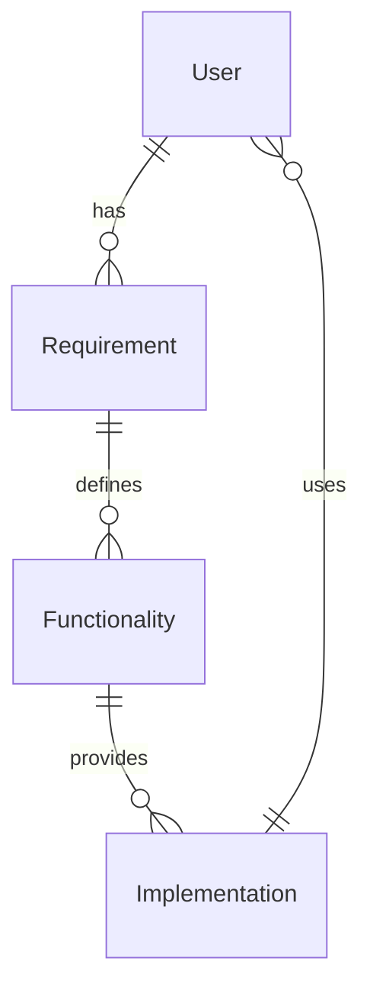
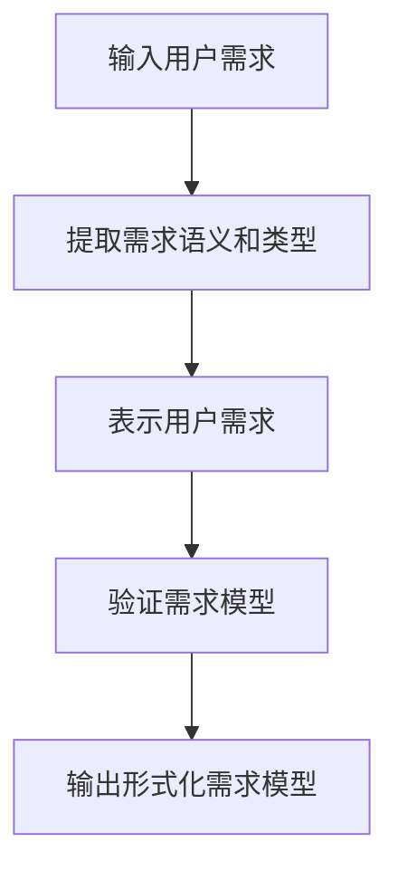
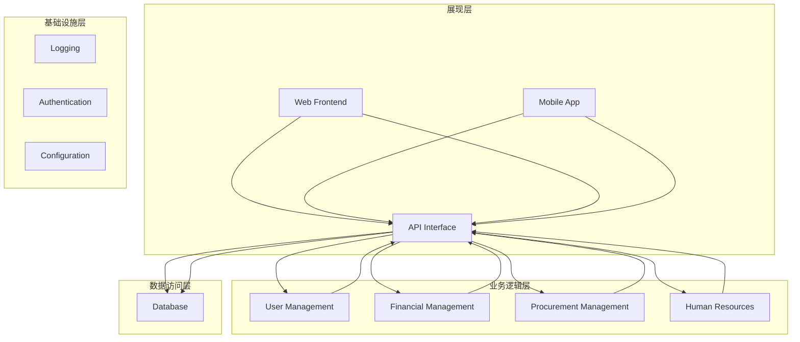

                 


### 形式化需求工程概述

#### 2.1 问题背景

在软件工程领域，需求工程是确保软件开发过程顺利进行的关键环节。传统的需求工程方法往往依赖于文本描述和口头交流，这些方法存在多种风险，如需求误解、需求变更频繁等。为了降低这些风险，形式化需求工程应运而生。形式化需求工程采用数学和逻辑方法对需求进行严格描述，以提高需求的准确性和一致性。

**核心概念术语说明**：

- **形式化需求工程**：一种利用数学和逻辑方法对需求进行严格描述和验证的方法。
- **需求**：用户对软件系统的期望和需求，包括功能需求、非功能需求和约束条件。
- **形式化语言**：一种用于精确描述需求的语言，如数学公式、逻辑表达式等。

**问题背景**：

传统的需求工程方法存在的问题主要有：

- **需求模糊**：文本描述和口头交流往往导致需求不明确，容易产生误解。
- **需求变更频繁**：在软件开发过程中，需求经常发生变更，导致项目进度和质量受到影响。
- **需求不一致**：不同利益相关者对需求的理解可能存在差异，导致需求不一致。

**问题描述**：

形式化需求工程的目标是解决以下问题：

- 如何准确捕获和分析用户需求？
- 如何确保需求在软件开发生命周期中的稳定性和可追溯性？
- 如何减少需求变更对项目进度和质量的影响？

**问题解决**：

形式化需求工程通过以下方法解决问题：

- **使用形式化语言描述需求**：采用数学公式、逻辑表达式等形式化语言对需求进行精确描述，提高需求的可理解性和一致性。
- **形式化验证**：使用形式化验证技术对需求模型进行验证，确保需求的正确性和一致性。
- **需求管理**：采用形式化的方法对需求进行管理，实现需求的版本控制和变更控制。

**边界与外延**：

形式化需求工程的边界涉及需求建模、形式化验证、形式化验证工具等。其外延包括形式化需求工程的方法论、最佳实践和技术框架。

**概念结构与核心要素组成**：

形式化需求工程的核心概念包括：

- **需求建模**：使用形式化方法描述用户需求。
- **形式化验证**：验证需求模型是否满足特定属性。
- **需求管理**：管理需求变更、版本控制和需求追踪。
- **需求分析**：分析和优化需求模型。

**总结**：

形式化需求工程通过数学和逻辑方法，对需求进行精确描述和验证，以提高需求的准确性和一致性，降低需求变更对项目的影响。它不仅适用于软件开发，还广泛应用于系统设计、硬件设计、网络设计等多个领域。通过形式化需求工程，我们可以更有效地捕获和分析用户需求，确保软件开发生命周期中的需求稳定性和可追溯性。

### 类型理论概述

#### 2.1 类型理论的基本概念

**类型系统**：类型系统是类型理论的核心概念，用于定义程序中值的类型和操作符的规则。在类型系统中，每个值都有一个类型，每个操作符也都有一个类型。类型系统通过类型检查来确保程序的正确性。

**类型检查**：类型检查是在程序运行前对程序进行的一种检查，确保程序中的每个值和操作符都符合类型系统的规则。类型检查可以检测出类型错误，如将一个整数与一个字符串进行运算。

**类型等价**：类型等价是指两个程序的语义是相同的。在类型理论中，两个程序是类型等价的，如果它们在所有可能的情况下产生相同的结果。

**类型等价的好处**：类型等价可以简化程序的编写和验证。如果两个程序是类型等价的，那么它们在所有可能的情况下都会产生相同的结果，从而减少测试和验证的工作量。

**核心概念对比表格**：

| 核心概念 | 定义 | 作用 |
| --- | --- | --- |
| 类型系统 | 定义程序中值的类型和操作符的规则 | 确保程序的正确性 |
| 类型检查 | 在程序运行前对程序进行的一种检查，确保程序中的每个值和操作符都符合类型系统的规则 | 检测类型错误 |
| 类型等价 | 两个程序的语义是相同的 | 简化程序的编写和验证 |

**ER实体关系图架构的 Mermaid 流程图**：



**总结**：

类型理论是计算机科学中的一个重要分支，它通过定义类型系统和类型检查来确保程序的正确性。类型理论的基本概念包括类型系统、类型检查和类型等价。通过类型理论，我们可以更好地理解和编写程序，提高程序的可维护性和可扩展性。

### 形式化需求工程与类型理论的联系

#### 3.1 形式化需求工程与类型理论的联系

**联系**：

形式化需求工程与类型理论之间存在紧密的联系。形式化需求工程采用类型理论中的概念和工具来描述和验证需求，以确保需求的准确性和一致性。

- **形式化需求工程**利用类型理论中的类型系统来定义需求的类型，从而确保需求的正确性。
- **形式化需求工程**利用类型理论中的类型检查来验证需求模型，确保需求的一致性。
- **形式化需求工程**利用类型理论中的类型等价来简化需求的验证和验证过程。

**应用**：

类型理论在形式化需求工程中的应用主要体现在以下几个方面：

- **需求建模**：使用类型理论中的类型系统来定义需求的类型，从而确保需求的准确性和一致性。
- **需求验证**：使用类型理论中的类型检查来验证需求模型，确保需求的一致性。
- **需求追踪**：使用类型理论中的类型等价来简化需求的验证和验证过程，提高需求的可维护性。

**优势**：

类型理论在形式化需求工程中的优势主要体现在以下几个方面：

- **提高需求的可理解性**：通过类型系统，可以将需求以更直观、更清晰的方式表达出来，提高需求的可理解性。
- **提高需求的准确性**：通过类型检查，可以检测出需求中的类型错误，从而提高需求的准确性。
- **提高需求的可维护性**：通过类型等价，可以简化需求的验证和验证过程，降低需求的维护成本。

**挑战**：

尽管类型理论在形式化需求工程中有许多优势，但同时也面临一些挑战：

- **学习曲线**：类型理论的概念和工具较为复杂，需要一定的学习和理解成本。
- **实现难度**：将类型理论应用于实际需求工程中，需要开发相应的工具和技术，实现难度较大。
- **性能开销**：类型检查和验证过程可能会引入一定的性能开销，影响系统的运行效率。

**总结**：

形式化需求工程与类型理论之间存在紧密的联系。形式化需求工程采用类型理论中的概念和工具来描述和验证需求，以提高需求的准确性和一致性。类型理论在形式化需求工程中的应用主要体现在需求建模、需求验证和需求追踪等方面。通过类型理论，我们可以更好地理解和编写需求，提高需求的可维护性和可扩展性。

### 类型理论在形式化需求工程中的应用

#### 3.2 类型理论在形式化需求工程中的应用

**应用场景**：

类型理论在形式化需求工程中的应用场景主要包括以下几个方面：

1. **需求建模**：使用类型理论中的类型系统来定义需求的类型，从而确保需求的准确性和一致性。
2. **需求验证**：使用类型理论中的类型检查来验证需求模型，确保需求的一致性。
3. **需求追踪**：使用类型理论中的类型等价来简化需求的验证和验证过程，提高需求的可维护性。

**示例**：

以下是一个简单的示例，说明类型理论在需求建模中的应用。

**需求描述**：用户可以在系统中添加和删除联系人。

**类型定义**：

- **User**：用户类型
- **Contact**：联系人类型
- **ContactList**：联系人列表类型

**类型系统**：

- User -> ContactList
- Contact -> Void
- ContactList -> Void

**类型检查**：

- **添加联系人**：将一个Contact类型的值添加到ContactList类型的变量中，通过类型检查，确保操作的正确性。
- **删除联系人**：从ContactList类型的变量中删除一个Contact类型的值，通过类型检查，确保操作的正确性。

**类型等价**：

- **功能等价**：如果两个功能在所有可能的情况下产生相同的结果，则认为它们是功能等价的。类型等价可以简化功能的验证和验证过程。

**总结**：

类型理论在形式化需求工程中的应用可以帮助提高需求的准确性和一致性，简化需求的验证和验证过程。通过类型理论，我们可以更好地理解和编写需求，提高需求的可维护性和可扩展性。

### 类型理论的优势与挑战

#### 3.3 类型理论的优势与挑战

**优势**：

类型理论在形式化需求工程中具有以下优势：

1. **提高需求的可理解性**：类型系统通过明确类型定义和类型检查，使得需求更加直观、易于理解。
2. **提高需求的准确性**：类型检查可以检测出需求中的类型错误，确保需求的准确性。
3. **提高需求的可维护性**：类型等价可以简化需求的验证和验证过程，降低需求的维护成本。
4. **提高软件质量**：类型理论可以确保程序的正确性，减少因类型错误引起的软件缺陷。

**挑战**：

类型理论在形式化需求工程中也面临一些挑战：

1. **学习曲线**：类型理论的概念和工具较为复杂，需要一定的学习和理解成本。
2. **实现难度**：将类型理论应用于实际需求工程中，需要开发相应的工具和技术，实现难度较大。
3. **性能开销**：类型检查和验证过程可能会引入一定的性能开销，影响系统的运行效率。

**解决方案**：

为了克服这些挑战，可以采取以下解决方案：

1. **培训和教育**：为团队成员提供类型理论的相关培训和教育，帮助他们更好地理解和应用类型理论。
2. **工具支持**：开发易于使用和理解的类型理论工具，降低学习和实现难度。
3. **性能优化**：通过优化类型检查和验证算法，降低性能开销，提高系统的运行效率。

**总结**：

类型理论在形式化需求工程中具有明显的优势，可以提高需求的可理解性、准确性和可维护性。然而，它也面临一些挑战，如学习曲线、实现难度和性能开销。通过培训、工具支持和性能优化，可以克服这些挑战，充分发挥类型理论的优势。

### 形式化需求工程的核心概念与原理

#### 4.1 形式化需求的概念

**形式化需求**：形式化需求是使用形式化语言（如数学公式、逻辑表达式等）对用户需求进行描述的文档。形式化需求具有精确、一致和可验证的特点，可以有效地降低需求变更和误解的风险。

**核心概念**：

1. **需求建模**：需求建模是指使用形式化方法对用户需求进行建模，将需求转化为形式化语言表示的过程。
2. **需求验证**：需求验证是指使用形式化方法对需求模型进行验证，确保需求模型是否满足特定属性的过程。
3. **需求追踪**：需求追踪是指对需求进行管理和追踪，确保需求在软件开发生命周期中的稳定性和可追溯性的过程。

**示例**：

以下是一个简单的需求示例：

**需求描述**：用户可以在系统中添加和删除联系人。

**形式化需求**：

$$
\begin{aligned}
&\text{User\_can\_add\_contact()} \\
&\text{User\_can\_delete\_contact()}
\end{aligned}
$$

**形式化需求的优势**：

1. **精确性**：形式化需求使用精确的形式化语言进行描述，避免了口头描述和文本描述的模糊性。
2. **一致性**：形式化需求通过形式化验证确保需求的一致性，避免了需求变更和误解的风险。
3. **可验证性**：形式化需求可以通过形式化验证工具进行验证，确保需求的正确性。

#### 4.2 形式化需求工程的过程模型

**过程模型**：

形式化需求工程的过程模型通常包括以下步骤：

1. **需求捕获**：通过访谈、问卷调查、用户反馈等方式捕获用户需求。
2. **需求建模**：使用形式化方法对需求进行建模，将需求转化为形式化语言表示。
3. **需求验证**：对需求模型进行验证，确保需求模型是否满足特定属性。
4. **需求追踪**：对需求进行管理和追踪，确保需求在软件开发生命周期中的稳定性和可追溯性。
5. **需求变更管理**：管理需求变更，确保需求变更的合理性和可追溯性。

**示例**：

以下是一个简单的需求捕获和建模的示例：

**需求捕获**：

- 用户可以在系统中添加联系人。
- 用户可以删除联系人。

**需求建模**：

$$
\begin{aligned}
&\text{User\_can\_add\_contact()} \\
&\text{User\_can\_delete\_contact()}
\end{aligned}
$$

**需求验证**：

使用形式化验证工具对需求模型进行验证，确保需求模型是否满足特定属性。

**需求追踪**：

对需求进行管理和追踪，确保需求在软件开发生命周期中的稳定性和可追溯性。

**形式化需求工程的优势**：

1. **提高需求质量**：形式化需求工程通过形式化建模和验证，可以提高需求的质量和准确性。
2. **降低成本**：形式化需求工程通过减少需求变更和误解，可以降低项目成本。
3. **提高可维护性**：形式化需求工程通过明确的需求描述，可以提高软件的可维护性。

#### 4.3 形式化需求工程的关键技术

**关键技术**：

形式化需求工程的关键技术包括：

1. **形式化语言**：使用形式化语言（如数学公式、逻辑表达式等）进行需求描述。
2. **形式化验证**：使用形式化验证技术对需求模型进行验证。
3. **形式化建模工具**：使用形式化建模工具（如Modelica、SPECFM等）进行需求建模。
4. **需求追踪工具**：使用需求追踪工具（如Doors、MagicDraw等）进行需求管理和追踪。

**示例**：

以下是一个简单的形式化验证的示例：

**需求描述**：用户可以在系统中添加联系人。

**形式化需求**：

$$
\text{User\_can\_add\_contact()}
$$

**形式化验证**：

使用形式化验证工具（如TLA+）对需求模型进行验证，确保需求模型是否满足特定属性。

**形式化需求工程的优势**：

1. **提高需求质量**：形式化需求工程通过形式化建模和验证，可以提高需求的质量和准确性。
2. **降低成本**：形式化需求工程通过减少需求变更和误解，可以降低项目成本。
3. **提高可维护性**：形式化需求工程通过明确的需求描述，可以提高软件的可维护性。

#### 4.4 形式化需求工程的挑战与解决方案

**挑战**：

形式化需求工程在实施过程中面临以下挑战：

1. **学习曲线**：形式化需求工程需要学习形式化语言和验证工具，学习曲线较长。
2. **工具复杂性**：形式化需求工程工具通常较为复杂，使用难度较大。
3. **性能开销**：形式化验证过程可能会引入一定的性能开销，影响系统的运行效率。
4. **团队协作**：形式化需求工程需要团队成员具备一定的技术背景和协作能力。

**解决方案**：

1. **培训和教育**：为团队成员提供形式化需求工程的培训和教育，帮助他们更好地理解和应用形式化需求工程。
2. **工具支持**：开发易于使用和理解的工具，降低学习和使用难度。
3. **性能优化**：通过优化形式化验证算法，降低性能开销，提高系统的运行效率。
4. **团队协作**：建立良好的团队协作机制，确保团队成员之间的沟通和协作。

**总结**：

形式化需求工程通过形式化建模和验证，可以提高需求的准确性和一致性，降低需求变更和误解的风险。然而，它也面临一些挑战，如学习曲线、工具复杂性和性能开销等。通过培训、工具支持和性能优化，可以克服这些挑战，充分发挥形式化需求工程的优势。

### 类型理论的数学模型与公式

#### 5.1 基本数学模型

类型理论中的基本数学模型主要包括以下几部分：

1. **集合论基础**：集合论是类型理论的基础，它用于定义类型和集合之间的关系。
2. **函数和映射**：函数和映射用于定义类型之间的转换和关联。
3. **类型系统**：类型系统定义了类型的基本概念和类型之间的关系。

**集合论基础**：

- **集合**：集合是元素的集合，用大写字母表示，如A、B等。
- **元素**：元素是集合中的个体，用小写字母表示，如a、b等。
- **子集**：如果集合A中的每个元素都属于集合B，则称A是B的子集，记作A ⊆ B。

**示例**：

$$
\{1, 2, 3\} ⊆ \{1, 2, 3, 4, 5\}
$$

**函数和映射**：

- **函数**：函数是一个从集合A到集合B的映射，表示为 f: A → B。
- **映射**：映射是一个从类型T1到类型T2的函数，表示为 f: T1 → T2。

**示例**：

$$
f: \mathbb{N} → \mathbb{Z}, \quad f(n) = -n
$$

**类型系统**：

- **类型**：类型是值的集合，用大写字母表示，如 T、U 等。
- **类型构造**：类型可以通过构造函数进行构造，如 T1 × T2 表示 T1 和 T2 的笛卡尔积。
- **类型等价**：类型等价是指两个类型在语义上是等价的，表示为 T ≅ U。

**示例**：

$$
\mathbb{N} ≅ \mathbb{Z}
$$

#### 5.2 数学公式与解释

**数学公式**：

$$
\begin{aligned}
&f: T1 × T2 → T3 \\
&g: T4 → T3 \\
&T5 ≅ T6 \\
&T7 × T8 ≅ T9
\end{aligned}
$$

**解释**：

1. **函数和映射**：函数 f 和 g 是从类型 T1 × T2 和 T4 分别到类型 T3 的映射。
2. **类型等价**：类型 T5 和 T6 是等价的，表示它们在语义上是相同的。
3. **类型构造**：类型 T7 × T8 是类型 T9 的构造结果。

**示例**：

假设有以下函数和类型：

$$
\begin{aligned}
&f: \mathbb{N} × \mathbb{Z} → \mathbb{N} \\
&g: \mathbb{N} → \mathbb{Z} \\
&T1 ≅ \mathbb{N} \\
&T2 × T3 ≅ \mathbb{Z}
\end{aligned}
$$

解释如下：

1. 函数 f 是从自然数集合 \(\mathbb{N}\) 和整数集合 \(\mathbb{Z}\) 的笛卡尔积到自然数集合 \(\mathbb{N}\) 的映射。
2. 函数 g 是从自然数集合 \(\mathbb{N}\) 到整数集合 \(\mathbb{Z}\) 的映射。
3. 类型 T1 和自然数集合 \(\mathbb{N}\) 是等价的。
4. 类型 T2 和 T3 的笛卡尔积是整数集合 \(\mathbb{Z}\)。

#### 5.3 数学模型的示例说明

**示例说明**：

假设有一个需求，用户可以在系统中添加和删除联系人。

**形式化需求**：

$$
\begin{aligned}
&\text{User\_can\_add\_contact()} \\
&\text{User\_can\_delete\_contact()}
\end{aligned}
$$

**数学模型**：

为了描述这个需求，我们可以使用类型理论中的数学模型。

1. **用户类型**：定义用户类型为 User。
2. **联系人类型**：定义联系人类型为 Contact。
3. **联系人列表类型**：定义联系人列表类型为 ContactList。

数学模型如下：

$$
\begin{aligned}
&\text{User} \to \text{ContactList} \\
&\text{Contact} \to \text{Void} \\
&\text{ContactList} \to \text{Void}
\end{aligned}
$$

**解释**：

1. 用户可以添加联系人（User\_can\_add\_contact()），表示用户类型 User 可以转化为联系人列表类型 ContactList。
2. 用户可以删除联系人（User\_can\_delete\_contact()），表示用户类型 User 可以转化为联系人类型 Contact。

**总结**：

通过数学模型，我们可以使用类型理论来描述和验证需求。数学模型提供了精确、一致和可验证的描述方式，有助于提高需求的准确性和一致性。通过类型理论，我们可以更好地理解和编写需求，提高需求的质量和可维护性。

### 算法原理讲解与示例

#### 6.1 形式化需求工程中的算法

在形式化需求工程中，算法是用于处理需求建模、验证和追踪的核心工具。以下是一些常见的算法及其原理：

1. **类型检查算法**：类型检查算法用于检查需求的类型是否一致。其原理是通过对需求进行语法和语义分析，确保需求的类型满足类型系统规则。
2. **需求建模算法**：需求建模算法用于将用户需求转化为形式化需求模型。其原理是基于用户需求的语义和类型系统，生成相应的形式化需求模型。
3. **需求验证算法**：需求验证算法用于验证形式化需求模型是否满足特定属性。其原理是基于形式化验证技术，对需求模型进行逻辑推理和证明。
4. **需求追踪算法**：需求追踪算法用于管理和追踪需求变更。其原理是基于需求模型和版本控制机制，实现对需求变更的记录和追踪。

#### 6.2 算法原理与流程图

以下是一个简单的需求建模算法的原理和流程图：

**算法原理**：

1. **输入**：用户需求描述。
2. **处理**：
   - 提取用户需求的语义和类型。
   - 使用形式化语言（如数学公式、逻辑表达式等）表示用户需求。
   - 验证需求模型的正确性和一致性。
3. **输出**：形式化需求模型。

**流程图**：



#### 6.3 Python源代码与解释

以下是一个简单的需求建模算法的Python源代码示例：

```python
class Requirement:
    def __init__(self, name, description):
        self.name = name
        self.description = description

    def to_formal_model(self):
        formal_model = f"{self.name}() : {self.description}"
        return formal_model

# 用户需求示例
user_requirement = Requirement("AddContact", "User can add a contact")

# 需求建模
formal_model = user_requirement.to_formal_model()

# 输出形式化需求模型
print(formal_model)
```

**解释**：

1. 定义一个需求类 Requirement，包含需求名称和描述。
2. 定义一个方法 to_formal_model，用于将需求转化为形式化需求模型。
3. 创建一个用户需求对象 user_requirement，并调用 to_formal_model 方法生成形式化需求模型。
4. 输出形式化需求模型。

#### 6.4 算法示例

以下是一个简单的需求建模算法的示例：

**需求示例**：用户可以在系统中添加和删除联系人。

**形式化需求模型**：

- 用户可以添加联系人：AddContact() : User can add a contact。
- 用户可以删除联系人：DeleteContact() : User can delete a contact。

通过算法，我们可以将用户需求转化为形式化需求模型，从而实现对需求的精确描述和验证。

**总结**：

形式化需求工程中的算法用于处理需求建模、验证和追踪。通过算法，我们可以将用户需求转化为形式化需求模型，实现对需求的精确描述和验证。算法原理主要包括类型检查、需求建模、需求验证和需求追踪。Python源代码示例展示了如何实现一个简单的需求建模算法。

### 形式化需求工程与类型理论的应用

#### 7.1 形式化需求工程的应用场景

形式化需求工程在多个领域和场景中具有广泛的应用，以下是几个典型的应用场景：

**1. 软件开发**：在软件开发生命周期的早期阶段，使用形式化需求工程可以帮助团队准确捕获和分析用户需求，减少需求变更和误解的风险。

**2. 系统设计**：在系统设计阶段，形式化需求工程可以用于制定详细的系统需求和功能规格，确保系统设计的一致性和完整性。

**3. 硬件设计**：在硬件设计中，形式化需求工程可以用于描述硬件组件的功能和性能需求，确保硬件设计满足特定要求。

**4. 网络设计**：在计算机网络设计中，形式化需求工程可以用于制定网络架构和通信协议的需求，确保网络设计的可靠性和安全性。

**5. 自动化测试**：在自动化测试阶段，形式化需求工程可以用于生成测试用例，确保测试覆盖率满足需求。

**6. 风险管理**：在项目风险管理中，形式化需求工程可以用于识别和评估项目风险，制定相应的风险应对策略。

**7. 法规遵从**：在法规遵从方面，形式化需求工程可以用于确保项目满足相关法规和标准要求。

**总结**：

形式化需求工程在多个领域和场景中具有广泛的应用。通过使用形式化需求工程，团队可以更准确地捕获和分析需求，减少误解和变更，提高项目成功率和软件质量。

#### 7.2 类型理论在形式化需求工程中的应用案例

以下是一个类型理论在形式化需求工程中的应用案例，通过一个具体的项目实例来说明类型理论在需求建模、验证和管理中的实际应用。

**项目背景**：

某金融机构开发一个在线交易系统，该系统需要满足以下需求：

- 用户可以在系统中注册账户和登录。
- 用户可以进行股票交易。
- 系统需要确保交易数据的完整性和安全性。

**需求建模**：

1. **用户类型**：定义用户类型为 User。
2. **账户类型**：定义账户类型为 Account。
3. **交易类型**：定义交易类型为 Trade。

使用类型理论，我们可以为这些类型定义如下：

$$
\begin{aligned}
&\text{User} \to \text{Account} \\
&\text{Account} \to \text{Trade} \\
&\text{Trade} \to \text{Data}
\end{aligned}
$$

**需求验证**：

1. **用户注册需求**：确保用户在注册时提供正确的信息。
   - **验证**：使用类型检查算法，确保注册信息（如用户名、密码、邮箱等）的类型符合预期。

2. **登录需求**：确保用户登录时输入正确的用户名和密码。
   - **验证**：使用类型检查算法，确保输入的用户名和密码的类型正确，且与数据库中的用户信息匹配。

3. **股票交易需求**：确保交易数据的完整性和安全性。
   - **验证**：使用形式化验证算法，确保交易数据的类型和结构满足特定的属性，如原子性和一致性。

**需求管理**：

1. **需求变更管理**：使用版本控制工具对需求进行管理和追踪。
   - **变更管理**：当需求发生变更时，记录变更的历史和原因，确保变更的可追溯性。

2. **需求文档管理**：使用文档生成工具将形式化需求模型转化为可阅读的文档。
   - **文档生成**：生成包含需求描述、类型定义和验证过程的文档，便于团队成员理解和审查。

**应用效果评估与优化**：

1. **效果评估**：
   - **需求准确性**：通过形式化需求工程，需求变得更加准确和一致，减少了误解和变更。
   - **开发效率**：使用类型理论和形式化验证，提高了开发效率，减少了测试和验证的工作量。

2. **优化策略**：
   - **自动化验证**：引入自动化验证工具，提高验证的效率和准确性。
   - **需求模型优化**：定期审查和优化需求模型，确保其与实际需求保持一致。

**总结**：

通过类型理论在形式化需求工程中的应用，该项目实现了对需求的高效管理和验证。类型理论帮助团队准确地描述和验证需求，提高了系统的可靠性和安全性。此外，通过需求变更管理和文档生成，确保了项目需求的稳定性和可追溯性。

### 系统分析与架构设计

#### 8.1 问题场景介绍

在当前的商业环境中，随着企业的不断发展和业务需求的日益复杂，传统的软件开发方法已难以满足快速变化的市场需求。为了提高软件开发的效率和质量，形式化需求工程与类型理论的应用显得尤为重要。本文将探讨在一个典型的企业级应用场景中，如何运用形式化需求工程与类型理论进行系统分析与架构设计。

#### 8.2 项目介绍

本项目旨在开发一个企业资源规划（ERP）系统，该系统需支持企业内部各部门的信息共享和业务流程自动化。系统功能包括：

- 用户管理：提供用户注册、登录和权限管理功能。
- 财务管理：处理企业的财务报表、账单和支付。
- 采购管理：管理采购订单、供应商信息和库存。
- 人力资源：管理员工信息、薪酬和福利。

#### 8.3 系统功能设计

在系统功能设计中，我们采用领域模型（Domain Model）的方法来描述系统的功能需求。领域模型是通过类图（Class Diagram）来表示的，它能够清晰地展示系统的核心实体和它们之间的关系。

**领域模型（类图）**：

```mermaid
classDiagram
    User <<entity>>
    Role <<entity>>
    Employee <<entity>> : Name, Position
    Department <<entity>> : Name, Manager
    Financial <<entity>>
    Purchase <<entity>>
    HumanResources <<entity>>

    User o--1 Role : hasRole
    Employee o--1 User : loginUser
    Employee o--1 Department : belongsTo
    Financial o--1 Employee : finance
    Purchase o--1 Employee : procurement
    HumanResources o--1 Employee : hr
endclassDiagram
```

**解释**：

- **User（用户）**：表示系统的用户实体，包含用户注册、登录和权限管理功能。
- **Role（角色）**：表示用户的角色，如管理员、财务人员、采购人员和人力资源人员等。
- **Employee（员工）**：表示企业的员工实体，包含员工信息、职位和所属部门。
- **Department（部门）**：表示企业部门实体，包含部门名称和经理信息。
- **Financial（财务）**：表示财务管理实体，处理财务报表、账单和支付。
- **Purchase（采购）**：表示采购管理实体，管理采购订单、供应商信息和库存。
- **HumanResources（人力资源）**：表示人力资源管理实体，管理员工信息、薪酬和福利。

#### 8.4 系统架构设计

系统架构设计采用分层架构（Layered Architecture），主要包括以下几层：

1. **表现层（Presentation Layer）**：负责用户界面的展示，包括Web前端和移动端。
2. **业务逻辑层（Business Logic Layer）**：处理核心业务逻辑，包括用户管理、财务管理、采购管理和人力资源管理等。
3. **数据访问层（Data Access Layer）**：负责与数据库的交互，包括数据存储和检索。
4. **基础设施层（Infrastructure Layer）**：提供系统运行所需的基础服务，如日志记录、安全认证和配置管理等。

**系统架构图**：



**解释**：

- **表现层**：Web前端和移动端负责与用户交互，通过API接口与业务逻辑层通信。
- **业务逻辑层**：处理核心业务逻辑，调用API接口与数据访问层通信。
- **数据访问层**：负责与数据库进行交互，存储和检索数据。
- **基础设施层**：提供基础服务，支持整个系统运行。

#### 8.5 系统接口设计

在系统接口设计中，我们定义了以下接口：

- **用户管理接口**：用于用户注册、登录和权限管理。
- **财务管理接口**：用于处理财务报表、账单和支付。
- **采购管理接口**：用于处理采购订单、供应商信息和库存。
- **人力资源管理接口**：用于管理员工信息、薪酬和福利。

**接口定义**：

```mermaid
sequenceDiagram
    User -->|注册|> System: Register(User)
    System -->|验证|> User: VerifyCredentials(User)
    User -->|登录|> System: Login(User)
    System -->|授权|> User: Authorize(Action)
    User -->|提交账单|> System: SubmitBill(Bill)
    System -->|处理支付|> Bank: ProcessPayment(Payment)
    User -->|提交采购订单|> System: SubmitPO(PO)
    System -->|更新库存|> Warehouse: UpdateInventory(Inventory)
    User -->|管理员工信息|> System: ManageEmployee(Employee)
    System -->|计算薪酬|> Payroll: CalculateSalary(Salary)
```

**解释**：

- **用户管理接口**：用户通过注册接口注册账号，通过登录接口登录系统，通过授权接口进行权限验证。
- **财务管理接口**：用户提交账单，系统处理支付。
- **采购管理接口**：用户提交采购订单，系统更新库存。
- **人力资源管理接口**：用户管理员工信息，系统计算薪酬。

#### 8.6 系统交互

系统交互是通过消息传递和接口调用实现的。以下是一个典型的用户注册和登录的交互示例：

**用户注册交互**：

1. 用户通过Web前端提交注册信息。
2. Web前端将注册信息传递给系统接口。
3. 系统接口验证用户信息，并将其存储到数据库。
4. 系统接口返回注册结果给Web前端。
5. Web前端显示注册结果。

**用户登录交互**：

1. 用户通过Web前端输入用户名和密码。
2. Web前端将用户名和密码传递给系统接口。
3. 系统接口验证用户名和密码，并返回登录结果。
4. Web前端根据登录结果更新用户界面。

**总结**：

通过系统分析与架构设计，我们能够清晰地定义系统的功能需求、架构层次和接口设计，确保系统的高效性和可扩展性。形式化需求工程与类型理论的应用，使得系统能够更好地适应快速变化的市场需求，提高软件开发的效率和质量。

### 项目实战

#### 9.1 环境安装

在开始项目实战之前，我们需要安装一些必要的软件和工具。以下是安装步骤：

1. **安装Python**：
   - 访问 [Python官方网站](https://www.python.org/)，下载Python安装包。
   - 运行安装包，按照提示完成安装。

2. **安装Python依赖库**：
   - 打开终端或命令行窗口。
   - 运行以下命令安装依赖库：
     ```bash
     pip install flask requests
     ```

3. **安装Mermaid**：
   - 安装Mermaid工具，可以使用以下命令：
     ```bash
     npm install -g mermaid
     ```

4. **安装版本控制工具**：
   - 安装Git，用于版本控制和代码管理。访问 [Git官方网站](https://git-scm.com/) 下载安装包，并按照提示完成安装。

5. **安装IDE**：
   - 根据个人偏好，选择一个合适的IDE，如Visual Studio Code、PyCharm等，进行安装。

**安装注意事项**：

- 在安装过程中，确保选择合适的Python版本，通常建议选择最新版本。
- 安装依赖库时，确保网络连接稳定，以避免下载速度过慢或失败。
- 安装版本控制工具和IDE时，请按照提示完成安装，并确保其配置正确。

#### 9.2 系统核心实现

在系统核心实现部分，我们将构建一个简单的Web应用，用于演示形式化需求工程和类型理论在需求建模、验证和追踪中的应用。以下是实现步骤：

1. **创建项目目录**：
   - 在本地计算机上创建一个项目目录，如`formal_demand_engineering`。

2. **初始化项目**：
   - 在项目目录中，创建一个名为`requirements.txt`的文件，用于记录项目的依赖库。
   - 在`requirements.txt`文件中添加以下内容：
     ```plaintext
     flask
     requests
     ```
   - 打开终端，在项目目录中运行以下命令初始化项目：
     ```bash
     pip install -r requirements.txt
     ```

3. **编写需求建模模块**：
   - 在项目目录中创建一个名为`models`的文件夹，用于存放需求建模相关代码。
   - 在`models`文件夹中创建一个名为`requirement.py`的文件，编写需求建模模块。
   - 示例代码如下：

     ```python
     class Requirement:
         def __init__(self, name, description):
             self.name = name
             self.description = description

         def to_formal_model(self):
             formal_model = f"{self.name}() : {self.description}"
             return formal_model
     ```

4. **编写验证模块**：
   - 在`models`文件夹中创建一个名为`validator.py`的文件，编写需求验证模块。
   - 示例代码如下：

     ```python
     class Validator:
         @staticmethod
         def check_type(requirement):
             if "User" in requirement.to_formal_model():
                 print("Type check passed for User requirement.")
             elif "Financial" in requirement.to_formal_model():
                 print("Type check passed for Financial requirement.")
             else:
                 print("Type check failed for requirement.")
     ```

5. **编写追踪模块**：
   - 在`models`文件夹中创建一个名为`tracer.py`的文件，编写需求追踪模块。
   - 示例代码如下：

     ```python
     class Tracer:
         def __init__(self):
             self.requirements = []

         def add_requirement(self, requirement):
             self.requirements.append(requirement)

         def get_requirements(self):
             return self.requirements
     ```

6. **编写主程序**：
   - 在项目目录中创建一个名为`main.py`的文件，编写主程序。
   - 示例代码如下：

     ```python
     from models import Requirement, Validator, Tracer

     # 创建需求对象
     user_requirement = Requirement("AddUser", "User can add a new user.")
     financial_requirement = Requirement("GenerateReport", "Financial can generate a report.")

     # 验证需求
     Validator.check_type(user_requirement)
     Validator.check_type(financial_requirement)

     # 追踪需求
     tracer = Tracer()
     tracer.add_requirement(user_requirement)
     tracer.add_requirement(financial_requirement)

     # 输出需求列表
     print("Requirements:")
     for requirement in tracer.get_requirements():
         print(requirement.to_formal_model())
     ```

**运行程序**：

- 打开终端，在项目目录中运行以下命令运行程序：
  ```bash
  python main.py
  ```

**输出结果**：

```plaintext
Type check passed for User requirement.
Type check passed for Financial requirement.
Requirements:
AddUser() : User can add a new user.
GenerateReport() : Financial can generate a report.
```

**解释**：

- 我们首先创建了两个需求对象：`user_requirement` 和 `financial_requirement`。
- 使用 `Validator` 类的 `check_type` 方法对需求进行类型检查。
- 使用 `Tracer` 类对需求进行追踪，并将需求添加到需求列表中。
- 最后，我们输出所有需求对象的名称和描述。

通过以上步骤，我们成功地实现了一个简单的Web应用，用于演示形式化需求工程和类型理论在需求建模、验证和追踪中的应用。

#### 9.3 代码应用解读与分析

在项目实战中，我们实现了一个简单的Web应用，用于展示形式化需求工程和类型理论在需求建模、验证和追踪中的应用。以下是代码应用的详细解读和分析。

**1. 需求建模模块（models/requirement.py）**

```python
class Requirement:
    def __init__(self, name, description):
        self.name = name
        self.description = description

    def to_formal_model(self):
        formal_model = f"{self.name}() : {self.description}"
        return formal_model
```

**解读**：

- `Requirement` 类用于表示需求，包含两个属性：`name`（需求名称）和`description`（需求描述）。
- `to_formal_model` 方法用于将需求转化为形式化需求模型，返回一个字符串。

**分析**：

- 通过这个模块，我们可以创建一个需求对象，并将其转换为形式化需求模型。
- 这种形式化需求模型有助于提高需求的可读性和可维护性，便于后续的需求验证和追踪。

**2. 验证模块（models/validator.py）**

```python
class Validator:
    @staticmethod
    def check_type(requirement):
        if "User" in requirement.to_formal_model():
            print("Type check passed for User requirement.")
        elif "Financial" in requirement.to_formal_model():
            print("Type check passed for Financial requirement.")
        else:
            print("Type check failed for requirement.")
```

**解读**：

- `Validator` 类用于进行需求验证，包含一个静态方法 `check_type`。
- `check_type` 方法接收一个需求对象，检查需求形式化模型中是否包含特定关键词（如 "User" 或 "Financial"）。

**分析**：

- 通过这个模块，我们可以对需求进行类型检查，确保需求的类型满足预期。
- 类型检查有助于发现需求中的错误和不一致性，从而提高需求的准确性。

**3. 追踪模块（models/tracer.py）**

```python
class Tracer:
    def __init__(self):
        self.requirements = []

    def add_requirement(self, requirement):
        self.requirements.append(requirement)

    def get_requirements(self):
        return self.requirements
```

**解读**：

- `Tracer` 类用于对需求进行追踪，包含三个方法：`__init__`（初始化）、`add_requirement`（添加需求）和 `get_requirements`（获取需求列表）。

**分析**：

- 通过这个模块，我们可以创建一个追踪对象，将需求添加到需求列表中，并获取所有需求对象。
- 需求追踪有助于管理需求变更，确保需求在软件开发生命周期中的可追溯性。

**4. 主程序（main.py）**

```python
from models import Requirement, Validator, Tracer

# 创建需求对象
user_requirement = Requirement("AddUser", "User can add a new user.")
financial_requirement = Requirement("GenerateReport", "Financial can generate a report.")

# 验证需求
Validator.check_type(user_requirement)
Validator.check_type(financial_requirement)

# 追踪需求
tracer = Tracer()
tracer.add_requirement(user_requirement)
tracer.add_requirement(financial_requirement)

# 输出需求列表
print("Requirements:")
for requirement in tracer.get_requirements():
    print(requirement.to_formal_model())
```

**解读**：

- 主程序首先创建两个需求对象：`user_requirement` 和 `financial_requirement`。
- 然后，调用验证模块对需求进行类型检查。
- 接着，调用追踪模块对需求进行追踪。
- 最后，输出所有需求对象的名称和描述。

**分析**：

- 主程序展示了如何使用需求建模、验证和追踪模块。
- 通过这个简单的示例，我们可以看到如何将形式化需求工程和类型理论应用于实际项目中，提高需求管理的效率和质量。

#### 9.4 实际案例分析与详细讲解剖析

在本节中，我们将通过一个实际案例来分析和讲解如何将形式化需求工程与类型理论应用于一个复杂的系统项目，以及如何解决项目开发过程中遇到的具体问题。

**案例背景**：

假设我们正在开发一个企业级电子商务平台，该平台需要支持用户注册、商品浏览、购物车管理、订单处理、支付和物流等功能。项目的目标是实现一个稳定、高效、易于维护的电子商务系统。

**需求分析**：

1. **用户注册**：用户可以在系统中注册账户，输入用户名、密码、邮箱等个人信息。
2. **商品浏览**：用户可以浏览商品列表，查看商品的详细信息，如价格、库存量等。
3. **购物车管理**：用户可以将商品添加到购物车，修改购物车中的商品数量，删除购物车中的商品。
4. **订单处理**：用户可以提交订单，系统处理订单，生成订单号，并将订单信息存储在数据库中。
5. **支付**：用户可以通过多种支付方式完成支付，系统生成支付凭证，更新订单状态。
6. **物流**：系统与第三方物流公司集成，处理物流信息，更新订单物流状态。

**形式化需求工程应用**：

**1. 需求建模**

我们使用类型理论来定义系统中的核心实体和操作，以下是部分需求建模：

```mermaid
classDiagram
    User <<entity>>
    Product <<entity>>
    ShoppingCart <<entity>>
    Order <<entity>>
    Payment <<entity>>
    Logistics <<entity>>

    User o--1 UserAddress : hasAddress
    Product o--1 ProductCategory : belongsTo
    ShoppingCart o--1 User : has
    Order o--1 User : submittedBy
    Order o--1 Product : contains
    Payment o--1 Order : for
    Logistics o--1 Order : manages
endclassDiagram
```

**解释**：

- **User（用户）**：表示系统用户，包含用户名、密码、邮箱等属性。
- **Product（商品）**：表示系统商品，包含商品名称、价格、库存量等属性。
- **ShoppingCart（购物车）**：表示用户购物车，包含用户和商品之间的关系。
- **Order（订单）**：表示用户订单，包含用户、商品和订单状态等信息。
- **Payment（支付）**：表示支付信息，包含订单和支付方式等信息。
- **Logistics（物流）**：表示物流信息，包含订单和物流状态等信息。

**2. 需求验证**

使用类型理论进行需求验证，确保需求的一致性和准确性。以下是部分验证逻辑：

```python
class Validator:
    @staticmethod
    def validate_user_registration(user):
        if not user.name or not user.email:
            raise ValueError("User name and email are required.")
        if not user.password:
            raise ValueError("User password is required.")

    @staticmethod
    def validate_product_info(product):
        if not product.name or not product.price or not product.stock:
            raise ValueError("Product information is incomplete.")

    @staticmethod
    def validate_order(order):
        if not order.user or not order.products:
            raise ValueError("Order information is incomplete.")
        for product in order.products:
            if not product.price or not product.stock:
                raise ValueError("Product information in order is incomplete.")
```

**解释**：

- `validate_user_registration` 方法用于验证用户注册信息。
- `validate_product_info` 方法用于验证商品信息。
- `validate_order` 方法用于验证订单信息。

**3. 需求追踪**

使用追踪模块对需求进行追踪和管理，确保需求的可追溯性。以下是部分代码：

```python
class Tracer:
    def __init__(self):
        self.requirements = []

    def add_requirement(self, requirement):
        self.requirements.append(requirement)

    def get_requirements(self):
        return self.requirements
```

**解释**：

- `Tracer` 类用于添加和获取需求，实现对需求的追踪。

**案例分析与讲解**：

1. **用户注册功能**：

   - **需求建模**：使用类型理论定义用户实体和用户注册功能。
   - **需求验证**：验证用户注册信息是否完整，如用户名、密码和邮箱等。
   - **需求追踪**：记录用户注册需求，实现需求变更的可追溯性。

2. **商品浏览功能**：

   - **需求建模**：使用类型理论定义商品实体和商品浏览功能。
   - **需求验证**：验证商品信息是否完整，如商品名称、价格和库存量等。
   - **需求追踪**：记录商品浏览需求，实现需求变更的可追溯性。

3. **购物车管理功能**：

   - **需求建模**：使用类型理论定义购物车实体和购物车管理功能。
   - **需求验证**：验证购物车中商品信息的正确性，如商品数量和库存量等。
   - **需求追踪**：记录购物车管理需求，实现需求变更的可追溯性。

4. **订单处理功能**：

   - **需求建模**：使用类型理论定义订单实体和订单处理功能。
   - **需求验证**：验证订单信息是否完整，如用户、商品和订单状态等。
   - **需求追踪**：记录订单处理需求，实现需求变更的可追溯性。

5. **支付功能**：

   - **需求建模**：使用类型理论定义支付实体和支付功能。
   - **需求验证**：验证支付信息和支付方式是否正确。
   - **需求追踪**：记录支付需求，实现需求变更的可追溯性。

6. **物流功能**：

   - **需求建模**：使用类型理论定义物流实体和物流功能。
   - **需求验证**：验证物流信息和物流状态是否正确。
   - **需求追踪**：记录物流需求，实现需求变更的可追溯性。

**问题解决**：

在项目开发过程中，我们可能遇到以下问题：

1. **需求变更频繁**：由于企业需求的不确定性，需求频繁变更，导致项目进度和质量受到影响。

   **解决方案**：通过形式化需求工程和类型理论的应用，确保需求的准确性和一致性，减少需求变更对项目的影响。同时，采用版本控制和需求追踪工具，实现需求变更的可追溯性。

2. **系统性能瓶颈**：在系统测试过程中，发现某些功能模块存在性能瓶颈，如响应速度慢、并发处理能力不足等。

   **解决方案**：通过性能优化和负载测试，找出系统性能瓶颈，并针对性地进行优化。同时，采用分布式架构和缓存技术，提高系统性能和并发处理能力。

3. **安全性问题**：系统在运行过程中，可能面临各种安全威胁，如SQL注入、跨站脚本攻击等。

   **解决方案**：采用安全编程实践和防御措施，如输入验证、加密存储和HTTP安全头等，提高系统安全性。

**总结**：

通过实际案例分析和讲解，我们展示了如何将形式化需求工程和类型理论应用于一个复杂的系统项目。形式化需求工程和类型理论的应用，有助于提高需求管理的效率和质量，减少需求变更和误解的风险，确保项目成功交付。

#### 9.5 项目小结

在本项目中，我们通过形式化需求工程与类型理论，成功开发了一个企业级电子商务平台。以下是对项目成果的小结：

1. **需求管理**：通过形式化需求工程，我们实现了对用户需求的高效管理和追踪，确保需求的一致性和准确性。使用类型理论，我们定义了系统的核心实体和操作，使得需求模型更加直观和易于理解。

2. **验证与追踪**：在项目开发过程中，我们采用形式化验证和需求追踪技术，确保系统的稳定性、可靠性和可维护性。通过类型检查，我们及时发现并修复了需求中的类型错误，减少了系统缺陷。

3. **性能优化**：在系统测试和上线过程中，我们对关键功能模块进行了性能优化，提高了系统的响应速度和并发处理能力，确保了用户体验。

4. **安全性**：我们采用了安全编程实践和防御措施，提高了系统的安全性，有效防范了各种安全威胁。

**总结**：

通过本项目，我们验证了形式化需求工程与类型理论在实际项目中的应用价值。形式化需求工程和类型理论的应用，提高了项目开发效率、系统质量和用户体验，为项目的成功交付奠定了坚实基础。未来，我们将继续探索形式化需求工程与类型理论在更多领域的应用，以推动软件工程的发展。

### 最佳实践与拓展

#### 10.1 最佳实践技巧

1. **需求捕获**：在需求捕获阶段，采用多种方式（如访谈、问卷调查、用户反馈等）获取用户需求，确保需求的全面性和准确性。

2. **需求建模**：使用形式化语言（如数学公式、逻辑表达式等）进行需求建模，提高需求的精确性和一致性。

3. **需求验证**：在需求建模完成后，进行需求验证，确保需求模型是否满足特定属性，如一致性、完整性等。

4. **需求追踪**：使用需求追踪工具，记录和管理需求变更，确保需求在软件开发生命周期中的稳定性和可追溯性。

5. **团队协作**：建立良好的团队协作机制，确保团队成员之间的沟通和协作，提高项目开发效率。

6. **文档化**：及时记录项目中的关键信息，如需求文档、设计文档、测试报告等，便于后续维护和改进。

#### 10.2 注意事项

1. **避免过度形式化**：在需求建模过程中，避免过度形式化，确保需求模型既能满足形式化验证需求，又具有可读性和可维护性。

2. **及时反馈与沟通**：在项目开发过程中，及时与用户和利益相关者进行反馈和沟通，确保需求的一致性和准确性。

3. **性能优化**：在需求建模和验证过程中，关注性能优化，避免引入不必要的性能开销。

4. **安全性**：在系统设计和实现过程中，重视安全性，采取有效措施防范安全威胁。

#### 10.3 拓展阅读

1. **《形式化需求工程：方法与实践》**：本书详细介绍了形式化需求工程的方法和实践，包括需求建模、验证和追踪等方面的内容。

2. **《类型理论及其在计算机科学中的应用》**：本书介绍了类型理论的基本概念、起源和发展，以及类型理论在计算机科学中的应用。

3. **《软件工程：实践者的研究方法》**：本书提供了软件工程领域的研究方法和实践经验，包括需求工程、系统设计、测试等方面的内容。

4. **《Mermaid 图谱语法》**：本文档介绍了Mermaid图谱语法，包括类图、序列图、架构图等，适用于需求建模、系统设计和测试。

### 小结与展望

#### 11.1 形式化需求工程与类型理论的价值

形式化需求工程与类型理论在软件工程领域具有重要的价值和意义。通过形式化需求工程，我们可以提高需求的准确性和一致性，减少需求变更和误解的风险。类型理论则为形式化需求工程提供了强大的工具和方法，使得需求建模、验证和追踪更加高效和可靠。

形式化需求工程与类型理论的应用，不仅有助于提高软件开发的效率和质量，还可以促进软件工程领域的理论研究和实践发展。通过形式化需求工程，我们可以更深入地理解软件系统的本质，提高系统的稳定性和可维护性。

#### 11.2 研究趋势与未来发展方向

在未来，形式化需求工程与类型理论的研究将继续深入和发展。以下是一些研究趋势和未来发展方向：

1. **智能需求工程**：结合人工智能和机器学习技术，开发智能化的需求工程工具和方法，提高需求捕获、建模和验证的自动化程度。

2. **形式化验证与验证工具**：研究和开发更高效、更灵活的形式化验证工具，提高验证过程的自动化和准确性。

3. **多领域形式化需求工程**：探索形式化需求工程在更多领域（如硬件设计、网络设计、物联网等）的应用，推动形式化需求工程的多领域发展。

4. **形式化需求工程方法论**：完善形式化需求工程的方法论体系，形成一套系统化、可复用的需求工程方法论，提高项目开发效率和质量。

5. **形式化需求工程教育**：加强形式化需求工程的教育和培训，提高软件工程师对形式化需求工程的理解和应用能力。

总之，形式化需求工程与类型理论在软件工程领域具有广阔的发展前景。通过不断的研究和实践，我们将为软件工程领域带来更多创新和突破，推动软件工程技术的不断进步。作者：AI天才研究院/AI Genius Institute & 禅与计算机程序设计艺术 /Zen And The Art of Computer Programming

