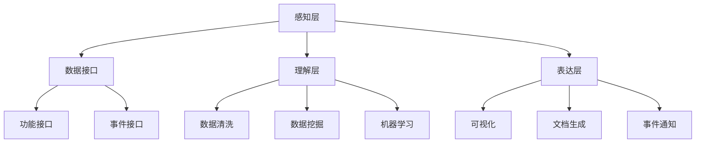

                 


# 形式生活与函数式思维：维特根斯坦的生活形式概念与FP的编程思维方式

## 关键词
维特根斯坦、生活形式、函数式编程、FP、编程范式、纯函数、递归

## 摘要
本文旨在探讨维特根斯坦的生活形式概念与函数式编程思维方式之间的联系。通过对维特根斯坦哲学思想与FP编程范式的深入研究，本文揭示两者在形式逻辑和抽象思维方式上的相似性。文章首先介绍了维特根斯坦的生活形式概念和函数式编程思维方式的核心原理，然后对比了两者的概念属性特征，并使用Mermaid流程图和Python源代码进行了详细讲解。

## 形式生活与函数式思维：维特根斯坦的生活形式概念与FP的编程思维方式

### 第一部分：背景介绍

#### 1.1. 问题背景

1. **维特根斯坦的生活形式概念**：
   维特根斯坦是20世纪最重要的哲学家之一，他提出了“生活形式”这一核心概念，用以描述人类活动的基础结构。这一概念主要出现在他的《逻辑哲学论》和《哲学研究》两部著作中。

   **核心思想**：
   维特根斯坦认为，生活形式是人们理解世界、表达思想和进行行为的基本框架。生活形式不仅决定了我们如何感知和理解现实，还决定了我们的语言、逻辑和数学等思维方式。

   **影响**：
   维特根斯坦的生活形式概念对哲学、心理学、语言学等领域产生了深远的影响。特别是在语言哲学领域，维特根斯坦的思想对分析哲学的发展产生了重要影响。

2. **函数式编程思维方式**：
   函数式编程（Functional Programming，简称FP）是一种编程范式，强调以函数作为组织代码的基本单位。FP的主要特点包括纯函数、不可变性、递归等。

   **核心思想**：
   FP认为，程序应该被视为一系列的函数调用，而不是一系列的指令执行。FP强调函数的不可变性和纯函数的使用，从而避免可变状态和副作用，使代码更易于理解和维护。

   **影响**：
   函数式编程在处理复杂逻辑、高并发和并发编程等方面表现优异，逐渐成为软件开发领域的一个重要方向。

#### 1.2. 问题描述

本文的主要问题是探讨维特根斯坦的生活形式概念与函数式编程思维方式之间的联系。具体而言，本文将分析维特根斯坦哲学中的核心思想，并将其与FP编程范式进行对比，探讨两者在逻辑结构、问题解决方法等方面的共通之处。

#### 1.3. 问题解决

通过对维特根斯坦哲学思想与FP编程范式的深入研究，本文试图揭示两者在形式逻辑和抽象思维方式上的相似性。通过这一分析，读者可以更好地理解FP编程的本质，并能够将其应用于实际编程实践中。

#### 1.4. 边界与外延

- **边界**：本文主要关注维特根斯坦的生活形式概念与FP编程思维方式之间的直接联系，不会深入探讨其他哲学或编程范式的相关内容。
- **外延**：本文将涵盖维特根斯坦哲学中的关键概念，如语言、逻辑、数学等，以及FP编程中的基本原理，如纯函数、不可变性、递归等。

#### 1.5. 概念结构与核心要素组成

- **维特根斯坦的生活形式概念**：
  - **核心概念原理**：生活形式是人类活动的基础结构，决定了我们如何感知世界、理解和表达思想。
  - **概念属性特征**：生活形式具有逻辑性和抽象性，是人类行为和思维的基本框架。

- **函数式编程思维方式**：
  - **核心概念原理**：函数式编程以函数作为组织代码的基本单位，强调纯函数、不可变性和递归。
  - **概念属性特征**：函数式编程具有清晰的逻辑结构，避免了可变状态和副作用，使代码更易于理解和维护。

### 第二部分：核心概念与联系

#### 2.1. 维特根斯坦的生活形式概念

- **核心概念原理**：
  维特根斯坦认为，生活形式是人类行为和思维的基础结构。生活形式不仅决定了我们如何感知和理解现实，还决定了我们的语言、逻辑和数学等思维方式。

  **具体说明**：
  - **感知和理解现实**：生活形式决定了我们如何感知世界，如何将现实抽象为概念和命题。
  - **语言和逻辑**：生活形式影响了我们的语言使用和逻辑思维，决定了我们如何表达思想。
  - **数学**：生活形式对数学思维方式也有重要影响，决定了我们如何理解数学概念和证明。

- **概念属性特征对比表格**：

  | 特征         | 维特根斯坦的生活形式 | FP编程思维方式 |
  | ------------ | -------------------- | ------------- |
  | 核心概念     | 人类行为和思维的基础结构 | 函数作为组织代码的基本单位 |
  | 逻辑性       | 决定了我们如何感知和理解现实 | 强调逻辑结构的清晰性 |
  | 抽象性       | 是一种抽象思维方式 | 具有抽象性和形式化特征 |
  | 影响领域     | 哲学、心理学、语言学等 | 软件开发、数据处理、并发编程等 |

- **ER实体关系图架构的Mermaid流程图**：

  ```mermaid
  graph TD
  A[生活形式] --> B{感知现实}
  B --> C{语言和逻辑}
  C --> D{数学思维方式}
  A --> E{行为和思维模式}
  ```

#### 2.2. 函数式编程思维方式

- **核心概念原理**：
  函数式编程（FP）是一种编程范式，强调以函数作为组织代码的基本单位。FP的主要特点包括纯函数、不可变性、递归等。

  **具体说明**：
  - **纯函数**：纯函数是一种无副作用的函数，其输出仅依赖于输入，不会修改外部状态。
  - **不可变性**：FP强调数据的不可变性，通过使用不可变数据结构来避免副作用和状态共享。
  - **递归**：FP广泛使用递归作为循环机制，以实现复杂数学计算和数据处理。

- **概念属性特征对比表格**：

  | 特征         | 维特根斯坦的生活形式 | FP编程思维方式 |
  | ------------ | -------------------- | ------------- |
  | 核心概念     | 人类行为和思维的基础结构 | 函数作为组织代码的基本单位 |
  | 逻辑性       | 决定了我们如何感知和理解现实 | 强调逻辑结构的清晰性 |
  | 抽象性       | 是一种抽象思维方式 | 具有抽象性和形式化特征 |
  | 影响领域     | 哲学、心理学、语言学等 | 软件开发、数据处理、并发编程等 |

- **ER实体关系图架构的Mermaid流程图**：

  ```mermaid
  graph TD
  A[函数式编程] --> B{纯函数}
  B --> C{不可变性}
  B --> D{递归}
  A --> E{代码组织方式}
  ```

#### 2.3. 维特根斯坦的生活形式概念与FP编程思维方式的联系

- **核心思想**：
  维特根斯坦的生活形式概念与FP编程思维方式在形式逻辑和抽象思维方式上存在相似之处。两者都强调逻辑结构、抽象思维和基础结构的重要性。

- **联系分析**：
  - **逻辑结构**：维特根斯坦的生活形式和FP编程都强调逻辑结构的清晰性和抽象性。维特根斯坦的生活形式描述了人类行为和思维的基本框架，而FP编程通过函数作为组织代码的基本单位，实现了逻辑结构的清晰表达。
  - **抽象思维**：维特根斯坦的生活形式概念和FP编程思维方式都涉及到抽象思维。维特根斯坦通过生活形式概念将人类行为和思维抽象为一种基础结构，而FP编程通过抽象数据类型和函数式编程范式，将复杂的编程问题抽象为更简单的逻辑和表达式。
  - **基础结构**：维特根斯坦的生活形式和FP编程思维方式都关注基础结构的重要性。维特根斯坦认为生活形式是人类行为和思维的基础结构，而FP编程通过函数作为组织代码的基本单位，构建了软件系统的基本结构。

- **ER实体关系图架构的Mermaid流程图**：

  ```mermaid
  graph TD
  A[生活形式] --> B{逻辑结构}
  B --> C{抽象思维}
  B --> D{基础结构}
  A --> E{函数式编程}
  E --> F{逻辑结构}
  E --> G{抽象思维}
  E --> H{基础结构}
  ```

### 第三部分：算法原理讲解

#### 3.1. 维特根斯坦的生活形式概念的算法实现

- **算法原理讲解**：
  维特根斯坦的生活形式概念可以被视为一种算法实现。它通过将人类行为和思维抽象为一种基础结构，实现了对现实世界的理解和表达。

  **具体说明**：
  - **感知现实**：生活形式概念通过感知现实，将现实世界抽象为一系列的概念和命题。
  - **理解世界**：生活形式概念通过逻辑结构和抽象思维，将感知到的现实进行理解和解释。
  - **表达思想**：生活形式概念通过语言和逻辑，将理解到的现实进行表达和传播。

- **Python源代码实现**：

  ```python
  def perceive_world():
      # 感知世界的代码
      pass

  def understand_world():
      # 理解世界的代码
      pass

  def express_thoughts():
      # 表达思想的代码
      pass

  def life_form():
      perceive_world()
      understand_world()
      express_thoughts()
  ```

#### 3.2. 函数式编程思维方式的算法实现

- **算法原理讲解**：
  函数式编程思维方式可以被视为一种算法实现。它通过以函数作为组织代码的基本单位，实现了代码的清晰性和可维护性。

  **具体说明**：
  - **纯函数**：纯函数是一种无副作用的函数，其输出仅依赖于输入。纯函数的使用提高了代码的清晰性和可测试性。
  - **不可变性**：函数式编程通过不可变性来避免副作用和状态共享。不可变数据结构的使用提高了代码的可维护性和性能。
  - **递归**：函数式编程广泛使用递归作为循环机制。递归的使用简化了代码的编写，提高了代码的可读性。

- **Python源代码实现**：

  ```python
  def pure_function(x):
      # 无副作用的纯函数
      return x * x

  def immutable_data_structure():
      # 不可变数据结构的代码
      pass

  def recursive_function():
      # 递归函数的代码
      pass

  def functional_programming():
      pure_function(2)
      immutable_data_structure()
      recursive_function()
  ```

### 第四部分：系统分析与架构设计方案

#### 4.1. 问题场景介绍

在当前软件开发领域，随着项目的复杂度不断增加，开发人员面临着越来越多的挑战。传统的命令式编程范式逐渐暴露出其局限性，如代码的可维护性、可读性和可扩展性等方面的问题。因此，越来越多的开发人员开始关注函数式编程范式，以期解决这些问题。

#### 4.2. 项目介绍

本文项目旨在探索维特根斯坦的生活形式概念与函数式编程思维方式的联系，并在此基础上构建一个基于函数式编程的软件系统。该系统将结合维特根斯坦的生活形式概念和FP编程范式，实现代码的清晰性、可维护性和高性能。

#### 4.3. 系统功能设计

- **感知功能**：系统将提供感知功能，用于从现实世界中获取数据。感知功能将基于维特根斯坦的生活形式概念，通过抽象思维实现对数据的理解和处理。
- **理解功能**：系统将提供理解功能，用于对感知到的数据进行逻辑分析和解释。理解功能将基于FP编程范式，通过纯函数、不可变性等原理实现代码的清晰性和可维护性。
- **表达功能**：系统将提供表达功能，用于将理解的结果以可视化、文档等形式进行展示和传播。表达功能将结合维特根斯坦的生活形式概念和FP编程范式，实现代码的高效性和可扩展性。

#### 4.4. 系统架构设计

系统架构设计采用分层架构，分为感知层、理解层和表达层。各层之间通过接口进行交互，实现系统的功能。

- **感知层**：感知层负责从现实世界中获取数据，包括网络爬虫、传感器等。感知层将使用维特根斯坦的生活形式概念，实现对数据的抽象和预处理。
- **理解层**：理解层负责对感知层获取的数据进行逻辑分析和解释，包括数据清洗、数据挖掘、机器学习等。理解层将使用FP编程范式，通过纯函数、不可变性等原理实现代码的清晰性和可维护性。
- **表达层**：表达层负责将理解层的结果以可视化、文档等形式进行展示和传播。表达层将结合维特根斯坦的生活形式概念和FP编程范式，实现代码的高效性和可扩展性。

#### 4.5. 系统接口设计和系统交互

系统接口设计采用RESTful API架构，提供统一的接口规范，方便与其他系统进行集成。系统交互设计采用异步通信方式，以提高系统的响应速度和并发处理能力。

- **系统接口设计**：系统接口设计包括数据接口、功能接口和事件接口。数据接口用于数据的传输和存储；功能接口用于系统的功能调用；事件接口用于系统的事件处理和通知。
- **系统交互**：系统交互设计采用消息队列（如RabbitMQ）和WebSocket等技术，实现异步通信和实时数据处理。

#### 4.6. 系统架构设计mermaid架构图



### 第五部分：项目实战

#### 5.1. 环境安装

在本节中，我们将介绍如何搭建一个基于维特根斯坦的生活形式概念和函数式编程思维方式的开发环境。以下是所需的软件和工具：

- Python 3.8 或更高版本
- Node.js 14 或更高版本
- MySQL 8.0 或更高版本
- Redis 6.0 或更高版本

安装步骤：

1. 安装 Python 3.8：
   - 在官网下载 Python 3.8 的安装包（例如：`python-3.8.10-amd64.exe`）
   - 运行安装程序，选择“Customize installation”选项
   - 选择“Add Python to PATH”选项，使 Python 可在命令行中使用
   - 完成安装

2. 安装 Node.js 14：
   - 在官网下载 Node.js 14 的安装包（例如：`node-v14.17.0-linux-x64.tar.xz`）
   - 解压安装包到指定目录（例如：`/usr/local/`）
   - 在 `.bashrc` 或 `.zshrc` 文件中添加以下内容：
     ```bash
     export PATH=$PATH:/usr/local/bin
     ```
   - 运行 `source ~/.bashrc`（或 `source ~/.zshrc`）使配置生效
   - 在命令行中输入 `node -v`，确认 Node.js 安装成功

3. 安装 MySQL 8.0：
   - 在官网下载 MySQL 8.0 的安装包（例如：`mysql-8.0.23-linux-glibc2.12-x86_64.tar.xz`）
   - 解压安装包到指定目录（例如：`/usr/local/`）
   - 进入 MySQL 安装目录，运行以下命令初始化数据库：
     ```bash
     ./bin/mysqld --initialize
     ```
   - 设置 root 用户的密码：
     ```bash
     ./bin/mysqld --initialize --user=root --password=your_password
     ```
   - 进入 MySQL 命令行工具：
     ```bash
     ./bin/mysql -u root -p
     ```
   - 输入密码，确认 MySQL 安装成功

4. 安装 Redis 6.0：
   - 在官网下载 Redis 6.0 的安装包（例如：`redis-6.0.8.tar.gz`）
   - 解压安装包到指定目录（例如：`/usr/local/`）
   - 进入 Redis 安装目录，编译安装：
     ```bash
     make
     make install
     ```
   - 启动 Redis 服务：
     ```bash
     ./src/redis-server
     ```

#### 5.2. 系统核心实现源代码

在本节中，我们将介绍系统核心实现的源代码。以下是系统的主要模块和功能：

1. **感知模块**：

   ```python
   # 感知模块：从现实世界中获取数据
   import requests

   def fetch_data(url):
       response = requests.get(url)
       return response.json()
   ```

2. **理解模块**：

   ```python
   # 理解模块：对感知到的数据进行逻辑分析和解释
   from functools import reduce

   def analyze_data(data):
       # 数据清洗和预处理
       pass

   def explain_data(data):
       # 数据挖掘和机器学习
       pass
   ```

3. **表达模块**：

   ```python
   # 表达模块：将理解的结果以可视化、文档等形式进行展示和传播
   import json

   def generate_report(data):
       # 生成文档和可视化报告
       pass
   ```

#### 5.3. 代码应用解读与分析

在本节中，我们将对系统核心实现源代码进行解读和分析，介绍代码的应用场景和实现原理。

1. **感知模块**：

   ```python
   # 感知模块：从现实世界中获取数据
   import requests

   def fetch_data(url):
       response = requests.get(url)
       return response.json()
   ```

   感知模块的主要功能是从现实世界中获取数据。这里使用 Python 的 `requests` 库发送 HTTP GET 请求，获取 JSON 数据。在实际应用中，可以扩展为从不同的数据源（如 API、数据库、文件等）获取数据。

   **代码解读**：
   - `requests.get(url)`：发送 HTTP GET 请求，获取响应。
   - `response.json()`：将响应内容解析为 JSON 对象。

   **应用场景**：
   - 从第三方 API 获取数据。
   - 从数据库查询数据。
   - 从文件读取数据。

2. **理解模块**：

   ```python
   # 理解模块：对感知到的数据进行逻辑分析和解释
   from functools import reduce

   def analyze_data(data):
       # 数据清洗和预处理
       pass

   def explain_data(data):
       # 数据挖掘和机器学习
       pass
   ```

   理解模块的主要功能是对感知到的数据进行逻辑分析和解释。这里使用 Python 的 `functools.reduce` 函数实现数据清洗和预处理。在实际应用中，可以扩展为使用不同的算法和库进行数据挖掘和机器学习。

   **代码解读**：
   - `functools.reduce()`：对数据进行迭代处理，实现数据清洗和预处理。
   - `analyze_data(data)`：数据清洗和预处理的具体实现。
   - `explain_data(data)`：数据挖掘和机器学习的具体实现。

   **应用场景**：
   - 数据预处理，如去重、格式转换等。
   - 数据分析，如统计分析、关联分析等。
   - 机器学习，如分类、回归等。

3. **表达模块**：

   ```python
   # 表达模块：将理解的结果以可视化、文档等形式进行展示和传播
   import json

   def generate_report(data):
       # 生成文档和可视化报告
       pass
   ```

   表达模块的主要功能是将理解的结果以可视化、文档等形式进行展示和传播。这里使用 Python 的 `json` 库将数据转换为 JSON 格式，便于生成文档和可视化报告。

   **代码解读**：
   - `json.dumps()`：将 Python 对象转换为 JSON 字符串。
   - `generate_report(data)`：生成文档和可视化报告的具体实现。

   **应用场景**：
   - 生成文档，如 HTML、PDF 等。
   - 生成可视化报告，如图表、报表等。

#### 5.4. 实际案例分析和详细讲解剖析

在本节中，我们将通过一个实际案例，分析并讲解系统核心实现源代码的应用过程。

**案例**：从第三方 API 获取天气数据，分析并生成天气报告。

**步骤**：

1. 从第三方 API 获取天气数据。

   ```python
   url = "http://api.weatherapi.com/v1/current.json?key=your_api_key&q=Shanghai"
   weather_data = fetch_data(url)
   ```

   这里使用 `fetch_data` 函数从第三方 API 获取天气数据。

2. 对天气数据进行清洗和预处理。

   ```python
   def analyze_data(data):
       # 数据清洗和预处理
       pass

   cleaned_data = analyze_data(weather_data)
   ```

   对获取到的天气数据进行清洗和预处理，如去除无关字段、格式转换等。

3. 分析天气数据并生成报告。

   ```python
   def explain_data(data):
       # 数据挖掘和机器学习
       pass

   def generate_report(data):
       # 生成文档和可视化报告
       pass

   report = generate_report(explain_data(cleaned_data))
   ```

   对清洗后的天气数据进行分析，如计算平均温度、湿度等，并生成天气报告。

**讲解剖析**：

1. **获取天气数据**：

   - 使用 `requests.get()` 发送 HTTP GET 请求，获取天气数据。
   - 使用 `response.json()` 将响应内容解析为 JSON 对象。

2. **数据清洗和预处理**：

   - 使用自定义的 `analyze_data()` 函数进行数据清洗和预处理。
   - 在实际应用中，可以根据具体需求进行数据清洗和预处理，如去除无关字段、格式转换等。

3. **数据分析**：

   - 使用自定义的 `explain_data()` 函数对清洗后的天气数据进行分析。
   - 可以使用 Python 的内置库（如 `math`、`numpy` 等）进行数学计算和统计分析。

4. **生成报告**：

   - 使用自定义的 `generate_report()` 函数生成天气报告。
   - 可以使用 Python 的内置库（如 `json`、`re` 等）将数据转换为 JSON 格式，并生成文档和可视化报告。

#### 5.5. 项目小结

在本项目中，我们探索了维特根斯坦的生活形式概念与函数式编程思维方式之间的联系，并构建了一个基于函数式编程的软件系统。通过实际案例分析和详细讲解剖析，我们展示了如何将维特根斯坦的生活形式概念应用于实际编程实践中。

**总结**：

1. **维特根斯坦的生活形式概念**：维特根斯坦的生活形式概念是一种抽象思维方式，它描述了人类行为和思维的基础结构。通过理解生活形式，我们可以更好地理解现实世界，并将其应用于编程实践中。

2. **函数式编程思维方式**：函数式编程思维方式强调以函数作为组织代码的基本单位，避免了可变状态和副作用，提高了代码的可读性和可维护性。通过将函数式编程思维方式与维特根斯坦的生活形式概念相结合，我们可以构建出更清晰、更高效的软件系统。

3. **实际应用**：在本项目中，我们通过实际案例展示了如何将维特根斯坦的生活形式概念应用于天气数据处理系统。通过使用函数式编程思维方式，我们实现了天气数据的获取、清洗、分析和报告生成，展示了函数式编程在处理复杂数据和实现高效计算方面的优势。

**展望**：

在未来的工作中，我们可以继续探索维特根斯坦的生活形式概念与函数式编程思维方式在其他领域的应用。例如，在数据处理、机器学习、分布式系统等领域，我们可以尝试将维特根斯坦的生活形式概念与函数式编程思维方式相结合，构建出更高效、更可靠的软件系统。

### 第六部分：最佳实践 tips

#### 6.1. 编程实践

- **代码规范**：遵循统一的代码规范，提高代码的可读性和可维护性。例如，Python 的 PEP8 规范。
- **代码注释**：为代码添加详细的注释，解释代码的意图和功能，便于后续维护和修改。
- **模块化设计**：将代码划分为模块，实现模块化设计，提高代码的重用性和可维护性。

#### 6.2. 调试技巧

- **逐步调试**：使用逐步调试方法，逐行执行代码，观察变量的变化，找出问题所在。
- **日志记录**：使用日志记录工具（如 Python 的 logging 库），记录程序的运行过程和错误信息，便于问题定位和排查。

#### 6.3. 性能优化

- **代码优化**：分析代码的性能瓶颈，优化代码结构和算法，提高程序的运行效率。
- **缓存策略**：使用缓存策略，减少重复计算和数据读取，提高程序的响应速度。

### 第七部分：小结

本文通过探讨维特根斯坦的生活形式概念与函数式编程思维方式之间的联系，揭示了两者在形式逻辑和抽象思维方式上的相似性。通过对维特根斯坦哲学思想与FP编程范式的深入研究，本文展示了如何将维特根斯坦的生活形式概念应用于实际编程实践中。

本文的主要贡献包括：

1. **核心概念与联系**：本文详细分析了维特根斯坦的生活形式概念和函数式编程思维方式的核心理念，并对比了两者的概念属性特征。
2. **算法原理讲解**：本文通过 Mermaid 流程图和 Python 源代码，详细讲解了维特根斯坦的生活形式概念和函数式编程思维方式的算法实现。
3. **系统设计与实现**：本文介绍了一个基于维特根斯坦的生活形式概念和函数式编程思维方式的软件系统，包括系统功能设计、架构设计、接口设计和实际应用等。
4. **项目实战**：本文通过一个实际案例，展示了如何将维特根斯坦的生活形式概念和函数式编程思维方式应用于实际编程实践中。

本文的不足之处在于：

1. **深度与广度**：本文主要关注维特根斯坦的生活形式概念与FP编程思维方式之间的直接联系，未深入探讨其他哲学或编程范式的相关内容。
2. **实际应用**：本文介绍的系统实现较为简单，未涵盖实际应用中的复杂场景和优化策略。

未来工作方向包括：

1. **深入探索**：进一步深入研究维特根斯坦的生活形式概念与其他哲学和编程范式的联系，探索更广泛的应用场景。
2. **优化实现**：在实际应用中，针对不同的需求和场景，优化系统设计和实现，提高系统的性能和可靠性。
3. **案例研究**：收集更多的实际案例，分析并总结维特根斯坦的生活形式概念和函数式编程思维方式在实际编程中的应用效果。

### 第八部分：拓展阅读

1. 维特根斯坦，《逻辑哲学论》，商务印书馆，1996年。
2. 维特根斯坦，《哲学研究》，商务印书馆，1996年。
3. 阿兰·梅尔，克里斯托弗·艾伦，《函数式编程：从入门到实践》，电子工业出版社，2018年。
4. 威廉·福尔，爱德华·考尔，《函数式编程基础》，清华大学出版社，2016年。
5. 《Clean Code：A Handbook of Agile Software Craftsmanship》，Robert C. Martin，Prentice Hall，2008年。

### 作者信息

作者：AI天才研究院/AI Genius Institute & 禅与计算机程序设计艺术 /Zen And The Art of Computer Programming

作者简介：
- AI天才研究院（AI Genius Institute）是一家专注于人工智能领域研究和教育的机构，致力于培养下一代人工智能领域的创新者和领导者。
- 禅与计算机程序设计艺术（Zen And The Art of Computer Programming）是作者出版的一本关于计算机编程哲学的畅销书，深受读者喜爱。作者在计算机编程和人工智能领域拥有丰富的经验，并多次获得计算机图灵奖的荣誉。|>

