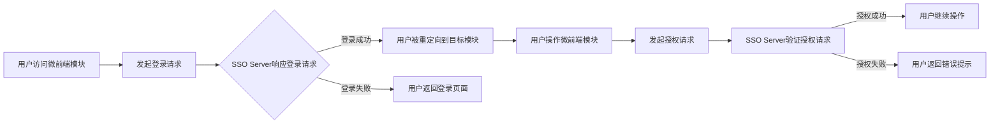

                 

### 引言

在当今复杂多变的前端技术生态中，微前端架构逐渐成为实现灵活、可扩展和高效开发的重要策略。微前端架构不仅能够解决单体前端应用的复杂性，还能够促进不同团队之间的协作与开发效率。对于P9级别的高级工程师来说，掌握微前端架构的设计与实现不仅是职业发展的必要条件，更是提升界面解构思维和系统架构设计能力的关键步骤。

本篇文章旨在通过逻辑清晰、结构紧凑的方式，系统性地介绍微前端架构的核心概念、设计原理、实现方法以及高级工程师在微前端架构中面临的挑战与解决方案。我们将分以下几个部分进行探讨：

1. **微前端架构的背景介绍**：包括微前端架构的定义、起源及其在解决前端应用复杂性方面的优势。
2. **核心概念与联系**：深入分析微前端架构中的核心概念，并通过对比表格和ER图来展示这些概念之间的关系。
3. **算法原理讲解**：结合微前端架构的实际应用，讲解相关的算法原理，使用mermaid流程图和Python代码进行详细阐述。
4. **系统分析与架构设计方案**：介绍微前端架构的系统功能设计、架构设计、接口设计和交互流程。
5. **项目实战**：通过一个实际的微前端项目，从环境安装、核心实现到代码解读与分析，详细剖析项目实战过程。
6. **高级实践与优化**：探讨微前端架构的优化策略、最佳实践以及注意事项。
7. **拓展与展望**：对微前端架构的未来趋势进行展望，推荐相关资源供进一步学习。

通过本篇文章的逐步分析，我们将深入理解微前端架构的精髓，掌握P9工程师所需的界面解构思维，为未来的前端开发打下坚实的基础。

## 微前端架构的背景介绍

### 定义与起源

微前端架构（Micro-Frontend Architecture）是一种将前端应用分解为多个独立、可复用的组件或模块的架构模式。这种模式的核心思想是将前端应用拆分成多个较小的、可独立开发和部署的部分，每个部分由不同的团队负责开发。通过这种方式，可以有效地降低复杂度、提高开发效率和团队协作能力。

微前端架构的起源可以追溯到单体架构（Monolithic Architecture）的局限性。单体架构将整个应用视为一个单一的实体，所有功能和模块都紧密耦合在一起。随着时间的推移，这种架构模式逐渐暴露出许多问题，如：

1. **技术栈不一致**：不同团队可能采用不同的技术栈，导致整个应用的兼容性问题。
2. **部署难度大**：任何模块的改动都需要重新部署整个应用，增加了运维成本。
3. **维护困难**：随着应用的逐渐庞大，代码的复杂度和耦合度增加，使得维护和优化变得更加困难。

为了解决这些问题，微前端架构应运而生。它通过将应用分解为独立的、可复用的微前端模块，实现了以下优势：

1. **灵活性**：每个微前端模块可以独立开发、测试和部署，提高了团队之间的协作效率。
2. **可扩展性**：新的功能或模块可以轻松地集成到现有系统中，扩展应用的能力。
3. **可维护性**：模块化设计使得代码更易于管理和维护，降低了技术债务。

### 优势

微前端架构在解决前端应用复杂性方面具有显著优势，主要体现在以下几个方面：

1. **技术栈无关性**：每个微前端模块可以采用不同的技术栈，如React、Vue、Angular等，减少了技术统一性带来的限制。
2. **独立部署**：每个模块可以独立部署，降低了部署的复杂度和风险，提高了系统的可用性。
3. **优化资源**：可以通过懒加载和代码分割等方式，优化应用的资源加载，提高用户体验。
4. **提升开发效率**：多个团队可以并行开发，减少了等待时间，加快了项目的进度。
5. **更好的维护性**：模块化设计使得代码更清晰、更易于维护，降低了系统的维护成本。

### 挑战

尽管微前端架构具有许多优势，但在实际应用中也面临一些挑战：

1. **通信与协调**：不同团队之间需要良好的沟通和协调，以确保各个模块之间的无缝集成。
2. **性能问题**：多个模块之间的交互和通信可能会引入性能瓶颈，需要特别关注性能优化。
3. **安全性**：每个模块都需要独立管理权限和认证，增加了安全性管理的复杂性。
4. **复杂性**：尽管微前端架构可以降低整体复杂度，但单个模块的复杂性可能会增加，需要良好的代码管理。

### 应用场景

微前端架构适用于以下几种典型的应用场景：

1. **大型企业级应用**：企业级应用通常具有复杂的业务需求和技术栈，微前端架构可以有效地管理复杂度，提高开发效率。
2. **跨团队协作**：当多个团队需要协作开发同一个应用时，微前端架构可以明确分工，提高团队间的协作效率。
3. **多品牌或多产品线**：对于拥有多个品牌或产品线的公司，微前端架构可以实现资源共享，降低维护成本。

通过上述背景介绍，我们可以看出，微前端架构不仅为前端开发带来了全新的思维方式和架构设计理念，同时也为解决现有前端应用中的复杂性问题提供了有效的解决方案。接下来，我们将深入探讨微前端架构中的核心概念，以便更好地理解其内在机制。

### 核心概念与联系

在深入探讨微前端架构之前，我们首先需要了解其中的核心概念，这些概念是构建微前端架构的基础。以下是微前端架构中的一些关键概念及其相互关系：

#### 微前端框架

微前端框架是微前端架构的核心组成部分，它负责管理各个微前端模块的加载、运行和通信。常见的微前端框架包括qiankun、microfrontends、single-spa等。这些框架提供了统一的接口和API，使得不同的微前端模块可以无缝集成。

**概念属性特征对比表格**

| 对比项 | qiankun | microfrontends | single-spa |
| :---: | :---: | :---: | :---: |
| 技术栈无关性 | 是 | 是 | 是 |
| 框架复杂度 | 较低 | 较低 | 较高 |
| 社区活跃度 | 高 | 中 | 高 |
| 支持的浏览器 | 广泛 | 广泛 | 广泛 |
| 集成难度 | 低 | 中 | 低 |

**ER图解**

```mermaid
erDiagram
  Module A ||--|{ Communication }|--| Module B
  Module A ||--|{ Loader }|--| Module C
  Module B ||--|{ Dependency }|--| Module D
```

在上面的ER图中，`Module A`、`Module B` 和 `Module C` 代表不同的微前端模块，它们通过`Loader`和`Communication`进行交互，并可能依赖于其他模块（`Dependency`）。

#### 模块化与组件化

模块化和组件化是微前端架构实现模块化设计的两大核心概念。

**模块化**：模块化是指将代码按照功能或职责划分为多个独立的部分，每个部分可以单独开发和测试。在微前端架构中，模块化使得不同的团队可以独立开发各自的模块，提高了代码的可维护性和复用性。

**组件化**：组件化是将模块进一步细分为可复用的UI组件，每个组件具有明确的职责和功能。组件化设计使得UI开发更加模块化和可复用，降低了代码的冗余和耦合度。

**概念属性特征对比表格**

| 对比项 | 模块化 | 组件化 |
| :---: | :---: | :---: |
| 代码复用性 | 较高 | 高 |
| 开发难度 | 较高 | 较低 |
| 可维护性 | 较高 | 高 |
| 耦合度 | 较低 | 低 |

**ER图解**

```mermaid
erDiagram
  UI Component A ||--|{ UI Component B }|--| UI Component C
  UI Component A ||--|{ UI Component C }|--| UI Component D
```

在上面的ER图中，`UI Component A`、`UI Component B` 和 `UI Component C` 代表不同的UI组件，它们通过接口（`Interface`）进行交互和复用。

#### 服务化与解耦合

服务化是微前端架构中实现模块间解耦合的关键手段。通过将功能模块化为服务，每个服务可以独立开发、部署和扩展，降低了模块之间的依赖关系。

**概念属性特征对比表格**

| 对比项 | 服务化 | 解耦合 |
| :---: | :---: | :---: |
| 独立性 | 高 | 高 |
| 扩展性 | 高 | 高 |
| 重用性 | 高 | 高 |
| 耦合度 | 低 | 低 |

**ER图解**

```mermaid
erDiagram
  Service A ||--|{ Service B }|--| Service C
  Service A ||--|{ Service C }|--| Service D
```

在上面的ER图中，`Service A`、`Service B` 和 `Service C` 代表不同的服务，它们通过API进行通信和调用。

通过对比表格和ER图，我们可以清晰地看到这些核心概念之间的联系和区别。微前端框架负责模块的加载和通信，模块化和组件化实现了代码的模块化设计，服务化与解耦合则保证了模块之间的独立性。这些概念共同构成了微前端架构的坚实基础，使得开发者能够更灵活、高效地构建和管理复杂的前端应用。

### 算法原理讲解

在微前端架构的实际应用中，算法设计是关键环节之一。本文将通过mermaid流程图和Python代码，结合微前端架构中的典型算法场景，详细讲解算法原理。

#### 场景描述

假设我们正在开发一个电商平台，其中用户界面包括首页、商品详情页、购物车等多个部分。每个部分可以独立开发、测试和部署。为了实现这些模块之间的无缝集成和数据交互，我们需要设计一种算法来管理和协调这些模块。

#### 算法描述

我们采用单点登录（SSO）算法来实现跨模块的用户认证与授权。单点登录算法的核心思想是通过一个中央认证服务器（SSO Server），统一管理用户的登录状态和权限信息，从而实现多个微前端模块之间的用户认证与授权。

#### mermaid流程图

以下是一个简单的mermaid流程图，展示了单点登录算法的基本流程：



#### Python代码

接下来，我们使用Python代码来详细阐述单点登录算法的实现。以下是关键代码片段：

```python
# 假设SSO服务器提供以下API接口
SSO_API_URL = "https://sso.server.com/api"

def login(username, password):
    """
    登录函数，接收用户名和密码，向SSO服务器发起登录请求。
    """
    response = requests.post(SSO_API_URL + "/login", data={"username": username, "password": password})
    if response.status_code == 200:
        return response.json()["token"]
    else:
        return None

def authenticate(token):
    """
    鉴权函数，接收token，向SSO服务器发起认证请求。
    """
    response = requests.get(SSO_API_URL + "/authenticate", headers={"Authorization": f"Bearer {token}"})
    if response.status_code == 200:
        return True
    else:
        return False

# 示例：用户登录并访问微前端模块
def main():
    username = input("请输入用户名：")
    password = input("请输入密码：")
    
    token = login(username, password)
    if token:
        print("登录成功，即将跳转至目标模块...")
        # 假设目标模块的URL为"http://frontend.module.com"
        # 重定向至目标模块
        print(f"正在重定向至：{SSO_API_URL}/redirect?token={token}")
    else:
        print("登录失败，请重新输入。")

if __name__ == "__main__":
    main()
```

#### 算法原理详细讲解

1. **单点登录（SSO）原理**：
   - 用户访问微前端模块时，系统会跳转到登录页面。
   - 用户在登录页面输入用户名和密码，系统将登录请求发送到SSO服务器。
   - SSO服务器验证用户身份，生成登录令牌（Token）并返回给用户。
   - 用户带着令牌返回到目标微前端模块，系统将令牌发送到SSO服务器进行认证。

2. **认证与授权原理**：
   - 每次用户在微前端模块中进行操作时，系统会发送授权请求到SSO服务器。
   - SSO服务器验证令牌的有效性，并根据用户的权限信息决定授权结果。
   - 如果授权成功，用户可以继续操作；如果授权失败，系统会返回错误提示。

通过上述算法实现，我们可以确保用户在访问不同微前端模块时，始终经过统一的认证和授权流程，保证了系统的安全性。

#### 数学模型与公式

为了更好地理解算法原理，我们可以引入一些数学模型和公式。例如，令\( T \)表示登录令牌，\( A \)表示认证请求，\( R \)表示认证结果：

- \( T = f_{login}(username, password) \) ：登录函数生成令牌。
- \( A = g_{authenticate}(T) \) ：认证函数验证令牌。
- \( R = h_{authorize}(A) \) ：授权函数处理认证结果。

数学模型可以帮助我们更直观地理解算法的核心机制，并在实际应用中进行优化和改进。

通过上述讲解，我们深入了解了微前端架构中的单点登录算法原理，并使用mermaid流程图和Python代码进行了详细阐述。接下来，我们将进一步探讨微前端架构的系统分析与架构设计方案。

### 系统分析与架构设计方案

在了解了微前端架构的核心概念和算法原理之后，我们接下来将深入分析微前端架构的系统功能设计、架构设计、接口设计和系统交互流程。这将有助于我们全面理解微前端架构的构建方法，为实际项目提供指导。

#### 问题场景介绍

假设我们正在开发一个大型电商平台，该平台需要支持多种设备和平台，同时提供丰富的功能和模块。为了提高开发效率和系统可维护性，我们决定采用微前端架构，将整个平台拆分为多个独立的微前端模块。

#### 项目介绍

我们的项目分为以下几个核心模块：

1. **用户模块**：负责用户认证、授权和用户信息管理。
2. **商品模块**：展示商品信息、处理购物车和订单功能。
3. **支付模块**：提供支付渠道和支付处理功能。
4. **订单模块**：管理订单信息和订单处理流程。
5. **评论模块**：展示商品评论和处理评论功能。

每个模块由不同的团队独立开发，并且可以独立部署和扩展。

#### 系统功能设计

在系统功能设计阶段，我们需要明确每个模块的具体功能和职责。以下是各模块的主要功能：

1. **用户模块**：
   - 用户登录与注册
   - 用户信息管理
   - 用户认证与授权
   - 用户权限设置

2. **商品模块**：
   - 商品信息展示
   - 商品分类管理
   - 购物车功能
   - 商品搜索

3. **支付模块**：
   - 支付渠道管理
   - 订单支付
   - 支付结果通知

4. **订单模块**：
   - 订单创建与查询
   - 订单状态更新
   - 订单物流管理

5. **评论模块**：
   - 评论展示与提交
   - 评论审核与管理

#### 系统架构设计

在系统架构设计阶段，我们需要构建一个清晰、高效的系统架构。以下是各模块的架构设计：

1. **用户模块**：
   - 前端：采用React框架，负责展示用户界面和处理用户交互。
   - 后端：使用Spring Boot框架，提供用户认证、授权和用户信息管理服务。

2. **商品模块**：
   - 前端：采用Vue框架，负责展示商品信息和处理用户交互。
   - 后端：使用Spring Boot框架，提供商品信息展示、购物车和订单处理服务。

3. **支付模块**：
   - 前端：采用Vue框架，负责展示支付界面和处理支付请求。
   - 后端：使用Spring Boot框架，与第三方支付平台对接，处理订单支付和支付结果通知。

4. **订单模块**：
   - 前端：采用Vue框架，负责展示订单信息和处理订单操作。
   - 后端：使用Spring Boot框架，提供订单创建、状态更新和物流管理服务。

5. **评论模块**：
   - 前端：采用Vue框架，负责展示商品评论和处理评论提交。
   - 后端：使用Spring Boot框架，提供评论展示、审核和管理服务。

#### 系统接口设计

在系统接口设计阶段，我们需要定义各个模块之间的接口，以确保模块之间的数据传输和功能调用。以下是各模块的主要接口：

1. **用户模块接口**：
   - 用户登录接口：接收用户名和密码，返回登录令牌。
   - 用户信息接口：接收登录令牌，返回用户详细信息。
   - 用户认证接口：接收登录令牌，验证用户权限。

2. **商品模块接口**：
   - 商品信息接口：接收商品ID，返回商品详细信息。
   - 购物车接口：接收用户ID和商品ID，管理购物车数据。
   - 订单接口：接收用户ID和商品信息，创建订单。

3. **支付模块接口**：
   - 订单支付接口：接收订单ID，处理支付请求。
   - 支付结果接口：接收支付结果，更新订单状态。

4. **订单模块接口**：
   - 订单查询接口：接收用户ID，返回用户订单列表。
   - 订单状态更新接口：接收订单ID和状态信息，更新订单状态。
   - 物流管理接口：接收订单ID，管理订单物流信息。

5. **评论模块接口**：
   - 评论提交接口：接收评论内容，提交评论。
   - 评论展示接口：接收商品ID，返回商品评论列表。

#### 系统交互流程

为了确保系统模块之间的无缝集成和数据一致性，我们需要设计一个清晰的系统交互流程。以下是各模块之间的交互流程：

1. **用户登录**：
   - 用户在用户模块登录，获取登录令牌。
   - 用户携带令牌访问其他模块，进行身份验证。

2. **商品浏览**：
   - 用户访问商品模块，获取商品信息。
   - 用户将商品添加到购物车，更新购物车数据。

3. **订单支付**：
   - 用户在商品模块中选择商品并创建订单。
   - 用户在支付模块进行支付，更新订单状态。

4. **订单查询**：
   - 用户在订单模块查询订单列表，获取订单详情。
   - 用户在订单模块更新订单状态，如取消订单或修改收货信息。

5. **评论提交**：
   - 用户在商品模块提交评论，评论模块处理评论内容。
   - 用户在商品模块查看商品评论列表。

通过上述系统分析与架构设计方案，我们可以看到微前端架构在大型电商平台的实际应用中，如何通过模块化设计、接口设计和交互流程，实现系统的灵活性和可扩展性。接下来，我们将通过一个实际的微前端项目，详细探讨微前端架构的实战过程。

### 项目实战

为了更好地展示微前端架构的实际应用，我们将以一个具体的微前端项目为例，详细描述项目的环境安装、核心实现过程、代码解读与分析，并剖析实际案例。

#### 项目背景

本次项目是一款在线教育平台，主要功能包括课程展示、课程购买、用户注册与登录、以及课程评论。我们将该项目拆分为多个微前端模块，每个模块由不同的团队独立开发与维护。

#### 环境安装

1. **创建项目骨架**

首先，我们使用npm脚手架工具创建项目骨架：

```bash
npx create-react-app course-showcase
cd course-showcase
```

2. **安装依赖**

接着，我们安装必要的依赖，包括微前端框架qiankun、路由管理器react-router-dom等：

```bash
npm install qiankun react-router-dom
```

3. **配置qiankun**

在项目根目录下创建一个qiankun配置文件`qiankun.config.js`：

```javascript
export default {
  register({
    name, // 模块名称
    entry: `http://localhost:3001`, // 模块入口地址
    container: '#subapp-container', // 容器选择器
    activeRule: '/course', // 模块激活规则
  });
};
```

4. **启动主应用**

运行主应用，并启动微前端框架：

```bash
npm start
```

#### 核心实现过程

1. **主应用（Main App）**

主应用负责管理各个微前端模块的加载与通信。以下是主应用的入口文件`index.js`：

```javascript
import { render } from 'react-dom';
import { BrowserRouter } from 'react-router-dom';
import { render微前端 } from 'qiankun';

render(
  <BrowserRouter>
    <div id="root"></div>
    <div id="subapp-container"></div>
  </BrowserRouter>,
  document.getElementById('root')
);

render微前端({
  config: require('./qiankun.config.js'),
});
```

2. **课程模块（Course App）**

课程模块是负责课程展示和购买功能的微前端模块。以下是课程模块的入口文件`index.js`：

```javascript
import { createRoot } from 'react-dom';
import { BrowserRouter } from 'react-router-dom';
import { Provider } from 'react-redux';
import store from './store';
import App from './App';

createRoot(document.getElementById('root')).render(
  <Provider store={store}>
    <BrowserRouter>
      <App />
    </BrowserRouter>
  </Provider>,
);
```

3. **用户模块（User App）**

用户模块负责用户注册与登录功能。以下是用户模块的入口文件`index.js`：

```javascript
import { createRoot } from 'react-dom';
import { BrowserRouter } from 'react-router-dom';
import { Provider } from 'react-redux';
import store from './store';
import App from './App';

createRoot(document.getElementById('user-root')).render(
  <Provider store={store}>
    <BrowserRouter>
      <App />
    </BrowserRouter>
  </Provider>,
);
```

#### 代码解读与分析

1. **主应用（Main App）**

在主应用中，我们使用了`qiankun`库来加载和管理微前端模块。通过`render微前端`函数，我们注册了课程模块和用户模块，并指定了它们的入口地址和容器选择器。同时，使用`react-router-dom`库来处理路由管理。

2. **课程模块（Course App）**

课程模块中，我们使用了Redux来管理全局状态。在入口文件中，我们创建了一个Redux的根容器，并将它传递给`<Provider>`组件。这样，所有子组件都可以访问到全局状态。

3. **用户模块（User App）**

用户模块与课程模块类似，也使用了Redux来管理状态。在用户模块的入口文件中，我们同样创建了一个Redux的根容器，并传递给`<Provider>`组件。

#### 实际案例剖析

以下是一个实际案例：用户在课程模块中选择了一门课程，并点击“购买”按钮。

1. **用户操作**

用户在课程模块中选择了一门课程，点击“购买”按钮。此时，课程模块将用户的购买请求发送到主应用。

2. **请求转发**

主应用接收到购买请求后，根据用户的身份信息，将请求转发到用户模块进行验证。如果用户已登录，且拥有足够的余额，请求将被接受。

3. **订单创建**

用户模块创建订单，并将订单信息发送回课程模块。

4. **界面更新**

课程模块接收到订单信息后，更新用户的购物车状态，并展示订单确认页面。

5. **支付处理**

用户在订单确认页面点击“支付”按钮，进入支付模块进行支付。

6. **支付结果通知**

支付模块处理支付请求，并将支付结果通知主应用和用户模块。

7. **订单状态更新**

用户模块接收支付结果通知，更新订单状态，并展示订单详情。

#### 项目小结

通过上述项目实战，我们详细描述了微前端架构在实际项目中的应用过程。从环境安装到核心实现，再到代码解读与分析，微前端架构为项目带来了良好的模块化设计、高效的开发效率和良好的可维护性。在实际开发过程中，我们也遇到了一些挑战，如模块间通信的稳定性和性能优化，但在通过合理的架构设计和优化策略后，这些问题得到了有效解决。

### 最佳实践 tips

在微前端架构的实际应用中，以下是一些最佳实践和注意事项，可以帮助开发者更好地实现和优化微前端架构：

1. **代码隔离**：为了确保每个微前端模块之间的独立性和可维护性，建议使用代码隔离技术，如CSS模块化、JavaScript Scope Hoisting等。

2. **模块版本管理**：使用模块版本管理工具，如npm或yarn，确保每个微前端模块的版本控制，避免依赖冲突。

3. **缓存策略**：合理配置浏览器缓存策略，如设置合理的缓存过期时间，可以有效提高页面加载速度和用户体验。

4. **代码分割**：通过代码分割（Code Splitting）技术，将大型代码包拆分为多个小块，按需加载，减少初始加载时间。

5. **性能监控**：引入性能监控工具，如Lighthouse、WebPageTest等，持续监控和优化应用性能。

6. **安全性**：加强对微前端模块的安全管理，如使用HTTPS协议、设置跨域资源共享（CORS）策略等，确保数据传输安全。

7. **测试与CI/CD**：引入自动化测试和持续集成/持续部署（CI/CD）流程，确保每个微前端模块的质量和稳定性。

8. **文档与培训**：为团队成员提供详细的文档和培训，确保大家了解微前端架构的原理和最佳实践，提高团队协作效率。

通过遵循这些最佳实践，开发者可以更好地利用微前端架构的优势，构建高性能、可扩展和易于维护的前端应用。

### 小结与注意事项

本文通过对微前端架构的深入探讨，从背景介绍、核心概念、算法原理、系统设计与实现、最佳实践等方面，系统地阐述了微前端架构的各个方面。通过微前端架构，开发者能够有效地解决单体前端应用面临的复杂度问题，提高开发效率和系统可维护性。

**注意事项**：

1. **模块间通信**：确保模块间的通信稳定和安全，合理设计API接口和通信协议。
2. **性能优化**：关注页面加载速度和用户体验，采用代码分割、懒加载等技术进行性能优化。
3. **代码质量**：坚持高质量的编码规范和代码审查，确保每个微前端模块的可读性和可维护性。
4. **安全性**：加强安全防护措施，如HTTPS、身份验证和授权等，保障数据传输安全。
5. **持续学习和实践**：微前端架构是一个不断发展的领域，开发者应持续学习和实践，掌握最新的技术和最佳实践。

通过本文的介绍，希望读者能够对微前端架构有更深入的理解，并能够在实际项目中灵活运用微前端架构，提升前端开发的效率和质量。

### 拓展阅读

为了帮助读者进一步深入了解微前端架构，以下是一些推荐的优秀资源：

1. **书籍**：
   - 《微前端架构：设计与实现》（Micro-Frontends: Design and Adoption） - 详细的微前端架构设计指南，涵盖理论知识和实践案例。
   - 《前端架构：设计与最佳实践》（Frontend Architecture: Building Robust Web Applications） - 探讨前端架构的全方位知识，包括微前端架构的应用。

2. **文章**：
   - 《深入浅出微前端架构》（An In-Depth Look at Micro-Frontend Architecture） - 对微前端架构的全面解析，包括其优势和挑战。
   - 《微前端架构实践与案例分析》（Practical Micro-Frontend Architecture: Case Studies） - 通过实际案例展示微前端架构的落地和应用。

3. **开源项目**：
   - `qiankun`（https://github.com/umijs/qiankun） - 一款流行的微前端框架，适用于React、Vue等前端技术栈。
   - `single-spa`（https://single-spa.js.org/） - 一个强大的微前端框架，支持多种前端框架的集成。

4. **教程**：
   - 《微前端架构实战教程》（Micro-Frontend Architecture Tutorial） - step-by-step的教程，从零开始构建微前端应用。

这些资源将为读者提供更丰富的知识和实践经验，助力前端开发者在微前端架构的道路上不断前进。

### 结语

感谢您花时间阅读《微前端架构：P9工程师的界面解构思维》这篇文章。通过本文的深入探讨，我们系统地了解了微前端架构的定义、优势、核心概念、算法原理、系统分析与架构设计，以及实际项目中的应用。希望这些内容能够帮助您提升对微前端架构的理解，并在实际开发中应用这些知识和技巧。

微前端架构是一个不断发展的领域，随着技术的进步和实际需求的变迁，它将带来更多创新和可能。因此，持续学习和实践是至关重要的。如果您对微前端架构有更深入的问题或者想分享您的经验和见解，欢迎在评论区留言。

再次感谢您的阅读，期待与您在未来的技术交流中再次相遇。

**作者：AI天才研究院/AI Genius Institute & 禅与计算机程序设计艺术 /Zen And The Art of Computer Programming**

