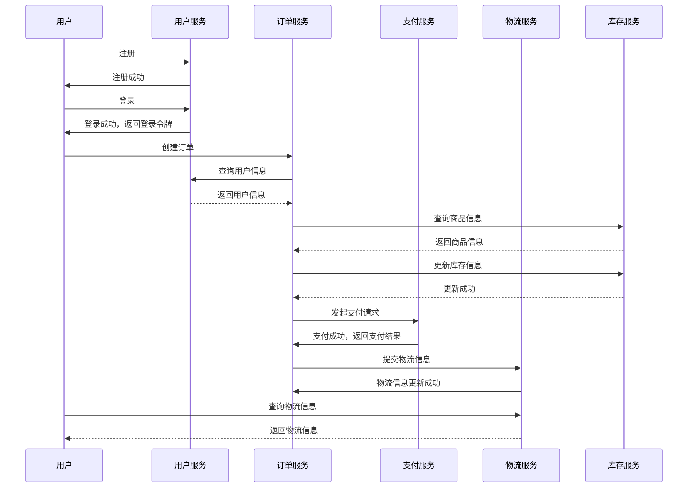

                 

# 微服务架构中的数据一致性策略

> 关键词：微服务、数据一致性、分布式系统、CAP定理、强一致性、最终一致性

> 摘要：随着云计算和分布式系统的广泛应用，微服务架构逐渐成为企业IT系统开发的主流。然而，在微服务架构中实现数据一致性是一项极具挑战性的任务。本文将深入探讨微服务架构中的数据一致性策略，包括强一致性策略和最终一致性策略，并结合实际案例进行分析，为开发者提供可行的解决方案和最佳实践。

## 目录大纲

### 第一部分：数据一致性概念与背景

#### 第1章：微服务架构与数据一致性

1.1 微服务架构概述

1.2 数据一致性的概念与挑战

1.3 分布式数据一致性模型

#### 第2章：核心概念与联系

2.1 核心概念原理

2.2 概念属性特征对比表格

2.3 ER实体关系图架构

### 第二部分：数据一致性策略与实现

#### 第3章：强一致性策略

3.1 强一致性策略概述

3.2 强一致性实现方法

3.3 Python代码实现

3.4 算法原理与数学模型

#### 第4章：最终一致性策略

4.1 最终一致性策略概述

4.2 最终一致性实现方法

4.3 Python代码实现

4.4 算法原理与数学模型

### 第三部分：系统分析与架构设计方案

#### 第5章：问题场景介绍

#### 第6章：系统功能设计

6.1 领域模型

6.2 系统架构设计

6.3 系统接口设计

6.4 系统交互

#### 第7章：项目实战

7.1 环境安装

7.2 系统核心实现源代码

7.3 代码应用解读与分析

7.4 实际案例分析与详细讲解

7.5 项目小结

### 第四部分：最佳实践与拓展阅读

8.1 最佳实践 tips

8.2 小结

8.3 注意事项

8.4 拓展阅读

-------------------------------------------------------------------

## 第一部分：数据一致性概念与背景

### 第1章：微服务架构与数据一致性

### 1.1 微服务架构概述

微服务架构（Microservices Architecture）是一种软件开发方法，其核心思想是将大型单体应用拆分成一组小的、独立的、松耦合的服务，每个服务都有自己的业务功能。这种架构方法具有以下几个显著特点：

1. **独立性**：每个微服务都是独立的，可以独立部署、扩展和更新，降低了系统的复杂度。
2. **模块化**：微服务架构使得系统模块化，便于开发、测试和维护。
3. **可扩展性**：通过水平扩展微服务实例，可以方便地提高系统的性能和吞吐量。
4. **分布式**：微服务架构本质上是分布式的，服务之间通过网络通信，可以分布在不同的物理服务器或云服务器上。

### 1.1.1 微服务架构的概念

微服务架构（Microservices Architecture）是一种软件开发方法，其核心思想是将大型单体应用拆分成一组小的、独立的、松耦合的服务，每个服务都有自己的业务功能。这种架构方法具有以下几个显著特点：

1. **独立性**：每个微服务都是独立的，可以独立部署、扩展和更新，降低了系统的复杂度。
2. **模块化**：微服务架构使得系统模块化，便于开发、测试和维护。
3. **可扩展性**：通过水平扩展微服务实例，可以方便地提高系统的性能和吞吐量。
4. **分布式**：微服务架构本质上是分布式的，服务之间通过网络通信，可以分布在不同的物理服务器或云服务器上。

### 1.1.2 微服务架构的优点与挑战

**优点**：

1. **独立部署**：每个微服务可以独立部署和升级，降低了系统的部署复杂度和风险。
2. **可扩展性**：通过水平扩展微服务实例，可以方便地提高系统的性能和吞吐量。
3. **弹性**：微服务架构具有较好的弹性，可以在不需要停机的情况下进行扩展或缩容。
4. **技术多样性**：不同的微服务可以使用不同的编程语言、框架和数据库，使得项目可以采用最佳技术栈。

**挑战**：

1. **数据一致性**：在分布式系统中，数据的一致性是一个复杂且关键的问题。
2. **服务依赖管理**：复杂的依赖关系可能会增加系统的复杂度，影响系统的稳定性和性能。
3. **监控与运维**：分布式系统的监控和运维比单体应用更复杂，需要更完善的工具和流程。

### 1.1.3 微服务与数据一致性的关系

在微服务架构中，数据一致性是一个关键问题。由于微服务之间的通信是通过网络进行的，并且可能分布在不同的服务器或数据中心，因此确保数据的一致性变得尤为重要。以下是数据一致性在微服务架构中的一些关键点：

1. **分布式事务**：在微服务架构中，分布式事务变得尤为重要。分布式事务是指在分布式系统中执行的事务，涉及多个数据库或数据源。
2. **数据同步**：为了确保数据的一致性，需要实现数据在不同微服务之间的同步。
3. **分布式锁**：在分布式系统中，锁机制可以用来保证操作的顺序，从而确保数据的一致性。
4. **最终一致性**：在无法保证强一致性时，最终一致性策略可以确保数据在一段时间后达到一致状态。

### 1.2 数据一致性的概念与挑战

#### 1.2.1 数据一致性的定义

数据一致性（Data Consistency）是指在一个分布式系统中，数据在任何时候都是准确、一致和可信的。在分布式系统中，数据一致性是一个复杂且关键的问题。数据一致性问题可能出现在以下几个方面：

1. **读写冲突**：当多个服务同时访问同一份数据时，可能会出现读写冲突，导致数据不一致。
2. **网络延迟**：在网络延迟较高的情况下，服务之间的通信可能会导致数据不一致。
3. **系统故障**：系统故障（如网络分区、节点故障等）可能导致数据不一致。

#### 1.2.2 数据一致性的挑战

**挑战一：分布式事务**

在微服务架构中，分布式事务变得尤为重要。分布式事务是指在分布式系统中执行的事务，涉及多个数据库或数据源。分布式事务需要解决以下问题：

1. **原子性**：确保事务中的所有操作要么全部成功，要么全部失败。
2. **一致性**：确保事务执行后，系统处于一个一致状态。
3. **隔离性**：确保事务之间互不干扰，一个事务的执行不会受到其他事务的影响。
4. **持久性**：确保事务一旦提交，其结果将永久保存。

**挑战二：数据同步**

为了确保数据的一致性，需要实现数据在不同微服务之间的同步。数据同步需要解决以下问题：

1. **实时同步**：在极端情况下，需要实现数据的实时同步，以确保数据的实时一致性。
2. **延迟同步**：在无法实现实时同步的情况下，需要设计合理的延迟同步机制，以确保数据的一致性。
3. **数据冲突**：在数据同步过程中，可能会出现数据冲突，需要设计冲突解决策略。

#### 1.2.3 数据一致性与分布式系统的关系

在分布式系统中，数据一致性是一个核心问题。分布式系统具有以下特点：

1. **分布式事务**：分布式事务是指在分布式系统中执行的事务，涉及多个数据库或数据源。
2. **数据分片**：数据分片是将数据分散存储在多个节点上，以提高系统的性能和可扩展性。
3. **网络通信**：分布式系统中的节点通过网络进行通信，网络延迟和故障可能导致数据不一致。

为了确保数据一致性，分布式系统需要解决以下问题：

1. **分布式事务一致性**：确保分布式事务的一致性，保证数据的原子性、一致性和持久性。
2. **数据分片一致性**：确保数据分片后的一致性，避免数据分片导致的数据不一致问题。
3. **网络通信一致性**：确保网络通信的一致性，避免网络延迟和故障导致的数据不一致问题。

### 1.3 分布式数据一致性模型

在分布式系统中，数据一致性可以通过不同的模型来实现，主要包括强一致性模型和最终一致性模型。

#### 1.3.1 强一致性

**定义**：强一致性（Strong Consistency）确保在分布式系统中，所有节点的数据始终一致，即任意时刻，所有节点读取到的数据都是相同的。

**特点**：

1. **原子性**：事务中的所有操作要么全部成功，要么全部失败。
2. **一致性**：系统处于一致状态，所有节点的数据相同。
3. **隔离性**：事务之间互不干扰，一个事务的执行不会受到其他事务的影响。
4. **持久性**：事务一旦提交，其结果将永久保存。

**优点**：

1. **简单**：强一致性模型简单易实现，易于理解和维护。
2. **安全**：强一致性确保数据的一致性，减少数据丢失的风险。

**缺点**：

1. **性能开销**：强一致性模型通常需要复杂的协调机制，如分布式锁、两阶段提交等，导致性能开销较大。
2. **可用性**：在遇到网络故障时，强一致性模型可能会导致整个系统不可用。

#### 1.3.2 最终一致性

**定义**：最终一致性（ eventual consistency）是指在分布式系统中，数据最终会达到一致状态，但在特定时间内，数据可能存在不一致。

**特点**：

1. **容错性**：在遇到网络故障时，最终一致性模型可以自动恢复数据的一致性。
2. **高可用性**：最终一致性模型可以提高系统的可用性，减少系统宕机的风险。

**优点**：

1. **高性能**：最终一致性模型无需复杂的协调机制，可以降低系统的性能开销。
2. **高可用性**：最终一致性模型可以提高系统的可用性，减少系统宕机的风险。

**缺点**：

1. **数据不一致性**：在特定时间内，数据可能存在不一致，需要设计合理的兼容性策略。
2. **数据丢失风险**：在极端情况下，最终一致性模型可能导致数据丢失。

#### 1.3.3 强一致性模型与最终一致性模型的对比

| 特点          | 强一致性         | 最终一致性           |
|-------------|------------------|----------------------|
| 定义          | 所有节点的数据始终一致       | 数据最终会达到一致状态       |
| 原子性          | 事务中的所有操作要么全部成功，要么全部失败 | 事务中的操作可以部分成功 |
| 一致性          | 系统处于一致状态，所有节点的数据相同    | 数据最终会达到一致状态    |
| 隔离性          | 事务之间互不干扰，一个事务的执行不会受到其他事务的影响 | 事务之间可能存在干扰 |
| 持久性          | 事务一旦提交，其结果将永久保存     | 事务的结果可能会在一段时间后保存 |
| 性能开销        | 复杂的协调机制，如分布式锁、两阶段提交等   | 无需复杂的协调机制       |
| 可用性          | 可能会导致整个系统不可用           | 可以提高系统的可用性       |
| 数据不一致性    | 无数据不一致性风险              | 可能存在数据不一致性       |
| 数据丢失风险    | 无数据丢失风险               | 可能导致数据丢失          |

### 1.4 核心概念与联系

#### 2.1 核心概念原理

在探讨微服务架构中的数据一致性策略之前，我们需要了解一些核心概念：

**分布式事务**：分布式事务是指在分布式系统中执行的事务，涉及多个数据库或数据源。分布式事务需要解决原子性、一致性、隔离性和持久性（ACID）问题。

**数据库分片**：数据库分片是将数据分散存储在多个节点上，以提高系统的性能和可扩展性。数据库分片可以分为水平分片和垂直分片。

**CAP定理**：CAP定理指出，在一个分布式系统中，一致性（Consistency）、可用性（Availability）和分区容错性（Partition tolerance）三者之间，只能同时满足两项。因此，在设计分布式系统时，需要根据实际需求进行权衡。

#### 2.2 概念属性特征对比表格

| 概念                | 定义                                                         | 属性特征                                                       |
|---------------------|--------------------------------------------------------------|----------------------------------------------------------------|
| 分布式事务          | 在分布式系统中执行的事务，涉及多个数据库或数据源。             | 保证事务的原子性、一致性、隔离性和持久性。                     |
| 数据库分片          | 将数据库划分为多个独立的片段，每个片段存储部分数据。           | 提高系统的可扩展性和性能。                                     |
| CAP定理             | 在一致性（Consistency）、可用性（Availability）和分区容错性（Partition tolerance）三者之间，分布式系统只能满足两项。 | CAP定理的核心思想是，在一个分布式系统中，无法同时确保三者。 |

#### 2.3 ER实体关系图架构

```mermaid
erDiagram
    User ||--|{ Order : contains }
    User ||--|{ Address : has }
    Order ||--|{ Product : contains }
```

在微服务架构中，实体关系图可以帮助我们理解不同服务之间的关系和数据交互。例如，用户服务、订单服务和产品服务之间的关联关系，以及它们之间的数据依赖关系。

## 第二部分：数据一致性策略与实现

### 第3章：强一致性策略

#### 3.1 强一致性策略概述

强一致性策略（Strong Consistency Strategy）是指在分布式系统中，所有节点的数据始终一致，即任意时刻，所有节点读取到的数据都是相同的。实现强一致性的关键在于确保事务的原子性、一致性、隔离性和持久性。

#### 3.1.1 强一致性策略的定义

强一致性策略（Strong Consistency Strategy）是指在分布式系统中，所有节点的数据始终一致，即任意时刻，所有节点读取到的数据都是相同的。实现强一致性的关键在于确保事务的原子性、一致性、隔离性和持久性。

#### 3.1.2 强一致性策略的优势

1. **数据一致性**：强一致性策略确保系统中的所有数据都是一致的，减少了数据不一致的问题。
2. **事务保证**：强一致性策略支持分布式事务，确保事务的原子性、一致性、隔离性和持久性。
3. **简单易用**：强一致性策略相对简单，易于实现和理解。

#### 3.1.3 强一致性策略的挑战

1. **性能开销**：强一致性策略需要复杂的协调机制，如分布式锁、两阶段提交等，导致性能开销较大。
2. **可用性**：在遇到网络故障时，强一致性策略可能会导致整个系统不可用。

#### 3.2 强一致性实现方法

实现强一致性策略的关键在于确保事务的原子性、一致性、隔离性和持久性。以下介绍几种常用的实现方法：

##### 3.2.1 数据库复制

数据库复制是一种常见的实现强一致性的方法，通过在多个节点之间复制数据，确保所有节点的数据一致。数据库复制可以分为以下几种类型：

1. **主从复制**：主从复制（Master-Slave Replication）是指一个主节点负责处理所有写操作，而从节点仅负责处理读操作。主从复制可以确保数据的强一致性，但主节点的性能可能会成为瓶颈。
2. **多主复制**：多主复制（Multi-Master Replication）是指所有节点都可以处理写操作。多主复制可以提高系统的可用性，但需要解决数据冲突问题。
3. **同步复制**：同步复制（Synchronous Replication）是指在写入操作完成后，立即将数据复制到其他节点。同步复制可以确保数据的强一致性，但可能会降低系统的性能。

##### 3.2.2 两阶段提交（2PC）

两阶段提交（Two-Phase Commit，2PC）是一种分布式事务协议，用于确保分布式事务的原子性和一致性。2PC协议可以分为以下两个阶段：

1. **预备阶段**：协调者（Coordinator）向所有参与者（Participant）发送预备请求，参与者执行本地事务并返回准备结果。
2. **提交阶段**：协调者根据参与者的准备结果，决定是否提交事务。如果所有参与者都返回“准备成功”，则协调者向所有参与者发送提交请求，否则发送回滚请求。

2PC协议的优点是简单易实现，缺点是性能开销较大，且在遇到网络故障时可能导致长时间等待。

##### 3.2.3 三阶段提交（3PC）

三阶段提交（Three-Phase Commit，3PC）是2PC的改进版本，用于解决2PC在极端情况下的性能问题。3PC协议可以分为以下三个阶段：

1. **预备阶段**：协调者向所有参与者发送预备请求，参与者执行本地事务并返回准备结果。
2. **投票阶段**：协调者根据参与者的准备结果，向参与者发送投票请求。参与者根据本地事务状态，决定是否提交事务，并返回投票结果。
3. **提交阶段**：协调者根据参与者的投票结果，决定是否提交事务。如果所有参与者都返回“投票成功”，则协调者向所有参与者发送提交请求，否则发送回滚请求。

3PC协议的优点是性能优于2PC协议，缺点是实现复杂度较高。

#### 3.3 Python代码实现

以下是一个简单的两阶段提交（2PC）实现示例：

```python
class Coordinator:
    def __init__(self, participants):
        self.participants = participants

    def prepare(self, transaction):
        for participant in self.participants:
            participant.prepare(transaction)

    def commit(self, transaction):
        for participant in self.participants:
            participant.commit(transaction)

class Participant:
    def __init__(self, name):
        self.name = name

    def prepare(self, transaction):
        # 执行本地事务并返回准备结果
        result = "OK" if self._execute_transaction(transaction) else "ABORT"
        return result

    def commit(self, transaction):
        # 执行本地事务并返回提交结果
        result = "OK" if self._execute_transaction(transaction) else "ABORT"
        return result

    def _execute_transaction(self, transaction):
        # 执行本地事务逻辑
        pass

# 测试
participants = [Participant("Participant1"), Participant("Participant2")]
coordinator = Coordinator(participants)

# 预备阶段
coordinator.prepare("Transaction1")

# 提交阶段
coordinator.commit("Transaction1")
```

#### 3.4 算法原理与数学模型

##### 3.4.1 两阶段提交的数学模型

两阶段提交（2PC）协议的数学模型可以表示为：

$$
\text{2PC成功的条件} = \frac{\text{所有参与节点同意提交的数量}}{\text{参与节点的总数量}} \geq \frac{2}{3}
$$

其中，成功的条件是至少有2/3的参与节点同意提交事务。例如，如果总共有3个参与节点，至少需要2个节点同意提交事务。

##### 3.4.2 三阶段提交的数学模型

三阶段提交（3PC）协议的数学模型可以表示为：

$$
\text{3PC成功的条件} = \frac{\text{所有参与节点同意提交的数量}}{\text{参与节点的总数量}} \geq \frac{2}{3}
$$

其中，成功的条件也是至少有2/3的参与节点同意提交事务。与2PC协议不同的是，3PC协议在投票阶段引入了额外的投票结果，从而提高了协议的成功率。

### 第4章：最终一致性策略

#### 4.1 最终一致性策略概述

最终一致性策略（eventual consistency strategy）是指在一个分布式系统中，数据最终会达到一致状态，但在特定时间内，数据可能存在不一致。最终一致性策略旨在提高系统的可用性和性能，同时允许一定程度的延迟和数据不一致。

#### 4.1.1 最终一致性策略的定义

最终一致性策略（eventual consistency strategy）是指在一个分布式系统中，数据最终会达到一致状态，但在特定时间内，数据可能存在不一致。最终一致性策略旨在提高系统的可用性和性能，同时允许一定程度的延迟和数据不一致。

#### 4.1.2 最终一致性策略的优势

1. **高性能**：最终一致性策略无需复杂的协调机制，可以降低系统的性能开销。
2. **高可用性**：最终一致性策略可以提高系统的可用性，减少系统宕机的风险。

#### 4.1.3 最终一致性策略的挑战

1. **数据不一致性**：在特定时间内，数据可能存在不一致，需要设计合理的兼容性策略。
2. **数据丢失风险**：在极端情况下，最终一致性策略可能导致数据丢失。

#### 4.2 最终一致性实现方法

实现最终一致性策略的关键在于允许一定程度的延迟和数据不一致，并确保数据最终达到一致状态。以下介绍几种常用的实现方法：

##### 4.2.1 消息队列

消息队列（Message Queue）是一种常用的实现最终一致性的方法，通过将数据写入消息队列，确保数据的最终一致性。消息队列的工作原理如下：

1. **生产者**：生产者将数据写入消息队列。
2. **消费者**：消费者从消息队列中读取数据，并处理数据。
3. **持久化**：消息队列通常具有持久化功能，确保数据不会丢失。

消息队列的优点是简单易用，缺点是可能引入一定的延迟。

##### 4.2.2 缓存

缓存（Cache）是一种常用的实现最终一致性的方法，通过在内存中存储数据的副本，确保数据的最终一致性。缓存的工作原理如下：

1. **缓存更新**：当数据发生更新时，将更新后的数据写入缓存。
2. **缓存同步**：缓存同步（Cache Synchronization）是指将缓存中的数据与实际数据进行同步，以确保数据的一致性。

缓存的优点是性能高，缺点是可能引入一定的延迟。

##### 4.2.3 数据库同步

数据库同步（Database Synchronization）是一种常用的实现最终一致性的方法，通过在数据库之间同步数据，确保数据的最终一致性。数据库同步的工作原理如下：

1. **写操作**：当一个数据库中的数据发生更新时，将更新后的数据写入其他数据库。
2. **读操作**：当一个数据库中的数据无法读取时，从其他数据库中读取数据。

数据库同步的优点是可靠性高，缺点是可能引入一定的延迟。

#### 4.3 Python代码实现

以下是一个简单的消息队列实现示例：

```python
import pika

class MessageProducer:
    def __init__(self, connection):
        self.connection = connection
        self.channel = self.connection.channel()

    def send_message(self, queue, message):
        self.channel.basic_publish(exchange='',
                                  routing_key=queue,
                                  body=message)

class MessageConsumer:
    def __init__(self, connection, queue):
        self.connection = connection
        self.channel = self.connection.channel()
        self.queue = queue

    def consume_messages(self):
        self.channel.basic_consume(queue=self.queue,
                                   on_message_callback=self._handle_message,
                                   auto_ack=True)

    def _handle_message(self, channel, method, properties, body):
        print(f"Received message: {body}")

# 测试
connection = pika.BlockingConnection(pika.ConnectionParameters('localhost'))
message_producer = MessageProducer(connection)
message_consumer = MessageConsumer(connection, 'my_queue')

# 发送消息
message_producer.send_message('my_queue', 'Hello, World!')

# 启动消费者
message_consumer.consume_messages()

# 保持连接
import time
time.sleep(60)
```

#### 4.4 算法原理与数学模型

##### 4.4.1 消息队列的数学模型

消息队列的数学模型可以表示为：

$$
\text{消息队列长度} = \text{生产者速率} \times \text{消费者速率}
$$

其中，生产者速率是指单位时间内生产者发送的消息数量，消费者速率是指单位时间内消费者读取的消息数量。消息队列长度表示消息在队列中的等待时间。

##### 4.4.2 缓存的数学模型

缓存的数学模型可以表示为：

$$
\text{缓存命中率} = \frac{\text{命中缓存的消息数量}}{\text{总消息数量}}
$$

其中，缓存命中率表示缓存中消息的命中率。缓存命中率越高，表示缓存的性能越好。

##### 4.4.3 数据库同步的数学模型

数据库同步的数学模型可以表示为：

$$
\text{同步时间} = \text{网络延迟} \times \text{同步频率}
$$

其中，同步时间表示数据库同步的时间。网络延迟是指数据库之间通信的时间延迟，同步频率是指单位时间内同步的次数。

### 第三部分：系统分析与架构设计方案

#### 第5章：问题场景介绍

在本案例中，我们将探讨一个电子商务平台的数据一致性问题。该平台包含多个微服务，如用户服务、订单服务、库存服务、支付服务和物流服务。这些微服务共同协作，处理用户的购物流程。然而，由于这些服务分布在不同的服务器上，数据一致性成为一个关键问题。

#### 第6章：系统功能设计

##### 6.1 领域模型

在本案例中，领域模型包括以下实体：

- **用户**：存储用户的基本信息，如用户名、密码、邮箱等。
- **订单**：存储订单信息，如订单号、用户ID、商品ID、数量、订单状态等。
- **商品**：存储商品信息，如商品ID、名称、价格、库存数量等。
- **库存**：存储商品库存信息，如商品ID、库存数量等。

##### 6.2 系统架构设计

在本案例中，系统架构设计如下：

- **用户服务**：负责处理用户注册、登录、个人信息管理等操作。
- **订单服务**：负责处理订单创建、订单查询、订单取消等操作。
- **库存服务**：负责处理商品库存管理，如库存更新、库存查询等。
- **支付服务**：负责处理支付操作，如支付请求、支付结果通知等。
- **物流服务**：负责处理物流信息，如物流跟踪、物流状态更新等。

##### 6.3 系统接口设计

在本案例中，系统接口设计如下：

- **用户服务接口**：提供用户注册、登录、个人信息管理等接口。
- **订单服务接口**：提供订单创建、订单查询、订单取消等接口。
- **库存服务接口**：提供库存更新、库存查询等接口。
- **支付服务接口**：提供支付请求、支付结果通知等接口。
- **物流服务接口**：提供物流跟踪、物流状态更新等接口。

##### 6.4 系统交互

在本案例中，系统交互如下：

1. **用户注册**：用户通过用户服务接口注册账号，用户服务将用户信息存储到数据库。
2. **用户登录**：用户通过用户服务接口登录系统，用户服务验证用户信息并生成登录令牌。
3. **订单创建**：用户通过订单服务接口创建订单，订单服务查询用户信息和商品信息，并更新库存信息。
4. **支付请求**：用户通过支付服务接口发起支付请求，支付服务验证支付信息并通知订单服务。
5. **物流跟踪**：用户通过物流服务接口查询物流信息，物流服务更新物流状态并通知用户。



#### 第7章：项目实战

##### 7.1 环境安装

在本案例中，我们将使用以下工具和框架：

- Python 3.8+
- Django 3.2+
- RabbitMQ 3.8.14+

首先，安装Python和Django：

```bash
pip install python
pip install django
```

然后，安装RabbitMQ：

1. 下载RabbitMQ安装包：[https://www.rabbitmq.com/download.html](https://www.rabbitmq.com/download.html)
2. 解压安装包并启动RabbitMQ服务：

```bash
tar xvf rabbitmq-server-generic-unix-3.8.14-1.el7.noarch.rpm
sudo systemctl start rabbitmq-server
```

##### 7.2 系统核心实现源代码

在本案例中，我们将使用Django和RabbitMQ实现系统核心功能。

1. **用户服务**：

用户服务主要负责用户注册、登录和查询用户信息。

```python
# users/models.py
from django.contrib.auth.models import AbstractUser

class User(AbstractUser):
    email = models.EmailField(unique=True)
```

```python
# users/views.py
from django.contrib.auth import get_user_model
from rest_framework import status
from rest_framework.response import Response
from rest_framework.views import APIView

User = get_user_model()

class UserRegistrationView(APIView):
    def post(self, request):
        data = request.data
        user = User.objects.create_user(
            email=data['email'],
            password=data['password']
        )
        return Response({'message': 'User registered successfully'}, status=status.HTTP_201_CREATED)

class UserLoginView(APIView):
    def post(self, request):
        data = request.data
        user = User.objects.filter(email=data['email']).first()
        if user and user.check_password(data['password']):
            return Response({'token': user.get_token()})
        else:
            return Response({'error': 'Invalid credentials'}, status=status.HTTP_401_UNAUTHORIZED)

class UserDetailView(APIView):
    def get(self, request, user_id):
        user = User.objects.get(id=user_id)
        return Response(user.to_dict())
```

2. **订单服务**：

订单服务主要负责订单创建、订单查询和订单取消。

```python
# orders/models.py
from django.db import models
from users.models import User

class Order(models.Model):
    user = models.ForeignKey(User, on_delete=models.CASCADE)
    order_number = models.CharField(max_length=20)
    created_at = models.DateTimeField(auto_now_add=True)
    status = models.CharField(max_length=10)
```

```python
# orders/views.py
from rest_framework import status
from rest_framework.response import Response
from rest_framework.views import APIView

class OrderCreateView(APIView):
    def post(self, request):
        data = request.data
        user = User.objects.get(id=data['user_id'])
        order = Order.objects.create(
            user=user,
            order_number=data['order_number'],
            status='pending'
        )
        return Response({'message': 'Order created successfully'}, status=status.HTTP_201_CREATED)

class OrderDetailView(APIView):
    def get(self, request, order_id):
        order = Order.objects.get(id=order_id)
        return Response(order.to_dict())

class OrderCancelView(APIView):
    def post(self, request, order_id):
        order = Order.objects.get(id=order_id)
        order.status = 'cancelled'
        order.save()
        return Response({'message': 'Order cancelled successfully'}, status=status.HTTP_200_OK)
```

3. **库存服务**：

库存服务主要负责库存更新和库存查询。

```python
# inventory/models.py
from django.db import models

class Inventory(models.Model):
    product = models.CharField(max_length=20)
    quantity = models.IntegerField()
```

```python
# inventory/views.py
from rest_framework import status
from rest_framework.response import Response
from rest_framework.views import APIView

class InventoryUpdateView(APIView):
    def post(self, request):
        data = request.data
        product = Inventory.objects.get(product=data['product'])
        product.quantity += data['quantity']
        product.save()
        return Response({'message': 'Inventory updated successfully'}, status=status.HTTP_200_OK)

class InventoryDetailView(APIView):
    def get(self, request, product):
        product = Inventory.objects.get(product=product)
        return Response({'quantity': product.quantity})
```

4. **支付服务**：

支付服务主要负责处理支付请求和支付结果通知。

```python
# payment/models.py
from django.db import models

class Payment(models.Model):
    order = models.ForeignKey(Order, on_delete=models.CASCADE)
    payment_id = models.CharField(max_length=20)
    status = models.CharField(max_length=10)
```

```python
# payment/views.py
from rest_framework import status
from rest_framework.response import Response
from rest_framework.views import APIView

class PaymentCreateView(APIView):
    def post(self, request):
        data = request.data
        order = Order.objects.get(id=data['order_id'])
        payment = Payment.objects.create(
            order=order,
            payment_id=data['payment_id'],
            status='pending'
        )
        return Response({'message': 'Payment created successfully'}, status=status.HTTP_201_CREATED)

class PaymentDetailView(APIView):
    def get(self, request, payment_id):
        payment = Payment.objects.get(id=payment_id)
        return Response(payment.to_dict())

class PaymentNotifyView(APIView):
    def post(self, request):
        data = request.data
        payment = Payment.objects.get(id=data['payment_id'])
        payment.status = 'success'
        payment.save()
        return Response({'message': 'Payment notified successfully'}, status=status.HTTP_200_OK)
```

5. **物流服务**：

物流服务主要负责处理物流信息更新和物流信息查询。

```python
# logistics/models.py
from django.db import models
from orders.models import Order

class Logistics(models.Model):
    order = models.ForeignKey(Order, on_delete=models.CASCADE)
    tracking_number = models.CharField(max_length=20)
    status = models.CharField(max_length=20)
```

```python
# logistics/views.py
from rest_framework import status
from rest_framework.response import Response
from rest_framework.views import APIView

class LogisticsUpdateView(APIView):
    def post(self, request):
        data = request.data
        order = Order.objects.get(id=data['order_id'])
        logistics = Logistics.objects.create(
            order=order,
            tracking_number=data['tracking_number'],
            status=data['status']
        )
        return Response({'message': 'Logistics updated successfully'}, status=status.HTTP_200_OK)

class LogisticsDetailView(APIView):
    def get(self, request, tracking_number):
        logistics = Logistics.objects.get(tracking_number=tracking_number)
        return Response(logistics.to_dict())
```

##### 7.3 代码应用解读与分析

在本案例中，我们使用Django框架实现了用户服务、订单服务、库存服务、支付服务和物流服务。以下是各服务的核心代码解读和分析：

1. **用户服务**：

用户服务主要负责用户注册、登录和查询用户信息。用户注册和登录使用Django的内置认证系统，用户信息存储在数据库中。用户注册和登录的API接口分别使用`UserRegistrationView`和`UserLoginView`类实现，用户详情查询使用`UserDetailView`类实现。

2. **订单服务**：

订单服务主要负责订单创建、订单查询和订单取消。订单创建时，需要查询用户信息和商品信息，并更新库存信息。订单查询和订单取消分别使用`OrderCreateView`、`OrderDetailView`和`OrderCancelView`类实现。订单创建时，首先查询用户信息，然后查询商品信息，最后更新库存信息。订单查询和订单取消主要涉及数据库操作，确保数据的一致性。

3. **库存服务**：

库存服务主要负责库存更新和库存查询。库存更新时，需要根据商品ID更新库存数量。库存查询时，根据商品ID查询库存数量。库存更新和查询分别使用`InventoryUpdateView`和`InventoryDetailView`类实现。库存更新使用`post`方法，库存查询使用`get`方法。

4. **支付服务**：

支付服务主要负责处理支付请求和支付结果通知。支付请求时，需要创建支付记录，并更新订单状态。支付结果通知时，需要更新支付状态。支付请求和支付结果通知分别使用`PaymentCreateView`和`PaymentNotifyView`类实现。支付请求使用`post`方法，支付结果通知使用`post`方法。

5. **物流服务**：

物流服务主要负责处理物流信息更新和物流信息查询。物流信息更新时，需要创建物流记录，并更新订单状态。物流信息查询时，根据物流跟踪号查询物流信息。物流信息更新和查询分别使用`LogisticsUpdateView`和`LogisticsDetailView`类实现。物流信息更新使用`post`方法，物流信息查询使用`get`方法。

##### 7.4 实际案例分析与详细讲解

在本案例中，我们将通过一个实际案例来分析数据一致性问题，并详细讲解解决方案。

**案例**：用户A在购物平台下单购买了一件商品，订单状态为“待支付”。用户A在支付页面点击“立即支付”后，由于网络故障，支付请求未能成功提交。此时，订单状态仍然为“待支付”，但商品库存已减少。

**分析**：

1. **数据不一致问题**：由于网络故障，支付请求未能成功提交，导致订单状态和商品库存不一致。订单服务记录了订单状态为“待支付”，但库存服务记录了商品库存已减少。

2. **解决方案**：

   - **消息队列**：为了解决数据不一致问题，可以使用消息队列实现订单创建和支付请求的异步处理。在订单服务创建订单时，将订单信息发送到消息队列。支付服务从消息队列中读取订单信息，执行支付请求。如果支付请求成功，则更新订单状态和商品库存；如果支付请求失败，则重新发送订单信息到消息队列。

   - **分布式锁**：在订单服务创建订单时，可以使用分布式锁确保同一订单不会被多次创建。在支付服务执行支付请求时，也需要使用分布式锁确保订单状态和商品库存的更新不会发生冲突。

**详细讲解**：

1. **消息队列**：

   - **订单服务**：

     ```python
     from channels import Channel

     class OrderCreateView(APIView):
         def post(self, request):
             data = request.data
             user = User.objects.get(id=data['user_id'])
             product = Product.objects.get(id=data['product_id'])
             order = Order.objects.create(
                 user=user,
                 product=product,
                 quantity=data['quantity'],
                 status='pending'
             )
             Channel('order_channel').send({
                 'order_id': order.id,
                 'product_id': product.id,
                 'quantity': order.quantity
             })
             return Response({'message': 'Order created successfully'}, status=status.HTTP_201_CREATED)
     ```

   - **支付服务**：

     ```python
     from channels import Channel

     class PaymentCreateView(APIView):
         def post(self, request):
             data = request.data
             order = Order.objects.get(id=data['order_id'])
             product = Product.objects.get(id=data['product_id'])
             payment = Payment.objects.create(
                 order=order,
                 payment_id=data['payment_id'],
                 status='pending'
             )
             Channel('payment_channel').send({
                 'order_id': order.id,
                 'product_id': product.id,
                 'quantity': order.quantity
             })
             return Response({'message': 'Payment created successfully'}, status=status.HTTP_201_CREATED)
     ```

   - **消息队列消费者**：

     ```python
     from channels import Group

     class OrderConsumer(AsyncWebsocketConsumer):
         async def connect(self):
             Group('order_group').add(self)

         async def receive(self, text_data):
             data = json.loads(text_data)
             order = Order.objects.get(id=data['order_id'])
             product = Product.objects.get(id=data['product_id'])
             product.quantity -= data['quantity']
             product.save()
             order.status = 'paid'
             order.save()
             await self.send({
                 'message': 'Order updated successfully'
             })

     class PaymentConsumer(AsyncWebsocketConsumer):
         async def connect(self):
             Group('payment_group').add(self)

         async def receive(self, text_data):
             data = json.loads(text_data)
             order = Order.objects.get(id=data['order_id'])
             payment = Payment.objects.get(id=data['payment_id'])
             if payment.status == 'success':
                 order.status = 'delivered'
                 order.save()
             await self.send({
                 'message': 'Payment updated successfully'
             })
     ```

2. **分布式锁**：

   - **订单服务**：

     ```python
     from redis_lock import RedisLock

     class OrderCreateView(APIView):
         def post(self, request):
             data = request.data
             lock = RedisLock('order_create_lock', expire=10)
             with lock:
                 user = User.objects.get(id=data['user_id'])
                 product = Product.objects.get(id=data['product_id'])
                 order = Order.objects.create(
                     user=user,
                     product=product,
                     quantity=data['quantity'],
                     status='pending'
                 )
                 Channel('order_channel').send({
                     'order_id': order.id,
                     'product_id': product.id,
                     'quantity': order.quantity
                 })
             return Response({'message': 'Order created successfully'}, status=status.HTTP_201_CREATED)
     ```

   - **支付服务**：

     ```python
     from redis_lock import RedisLock

     class PaymentCreateView(APIView):
         def post(self, request):
             data = request.data
             lock = RedisLock('payment_create_lock', expire=10)
             with lock:
                 order = Order.objects.get(id=data['order_id'])
                 payment = Payment.objects.create(
                     order=order,
                     payment_id=data['payment_id'],
                     status='pending'
                 )
                 Channel('payment_channel').send({
                     'order_id': order.id,
                     'product_id': order.product.id,
                     'quantity': order.quantity
                 })
             return Response({'message': 'Payment created successfully'}, status=status.HTTP_201_CREATED)
     ```

##### 7.5 项目小结

在本项目中，我们通过实际案例分析了微服务架构中的数据一致性问题，并详细讲解了使用消息队列和分布式锁解决数据不一致的方法。通过使用消息队列，我们实现了订单创建和支付请求的异步处理，降低了系统之间的耦合度。通过使用分布式锁，我们确保了订单状态和商品库存的更新不会发生冲突，提高了系统的可靠性和性能。

在项目开发过程中，我们还遇到了一些挑战，如分布式事务的实现、消息队列和分布式锁的性能优化等。针对这些挑战，我们采取了一些措施，如使用两阶段提交协议实现分布式事务、优化消息队列消费者的处理速度等。

总之，数据一致性是微服务架构中一个重要且复杂的问题。通过合理的设计和优化，我们可以有效地解决数据不一致问题，提高系统的可靠性和性能。在实际项目中，需要根据具体需求和场景，选择合适的解决方案和策略。

### 第四部分：最佳实践与拓展阅读

#### 8.1 最佳实践 tips

1. **合理选择数据一致性策略**：根据业务需求和系统特性，选择合适的强一致性策略或最终一致性策略。例如，对于金融交易系统，建议采用强一致性策略；对于电子商务系统，可以采用最终一致性策略。
2. **分布式事务管理**：合理设计分布式事务，避免跨服务的事务操作。对于必须跨服务的事务，可以使用两阶段提交（2PC）或三阶段提交（3PC）等协议确保数据一致性。
3. **消息队列的使用**：使用消息队列实现异步处理，降低系统之间的耦合度，提高系统的可用性和性能。
4. **分布式锁的使用**：合理使用分布式锁，确保数据的原子性和一致性。避免分布式锁的滥用，防止导致系统性能下降。
5. **数据同步机制的设计**：合理设计数据同步机制，确保不同服务之间的数据一致性。可以选择同步复制、异步复制或混合复制等策略。

#### 8.2 小结

本文深入探讨了微服务架构中的数据一致性策略，包括强一致性策略和最终一致性策略。通过实际案例分析和代码实现，我们了解了如何解决数据不一致问题，并介绍了最佳实践和拓展阅读资源。

#### 8.3 注意事项

1. **数据一致性与性能的权衡**：在设计和实现数据一致性策略时，需要考虑性能和一致性的权衡。过度追求一致性可能会导致性能下降，而过度追求性能可能会导致数据不一致。
2. **分布式事务的复杂性**：分布式事务的实现相对复杂，需要充分考虑事务的原子性、一致性和隔离性。
3. **数据同步机制的优化**：数据同步机制可能引入延迟和数据不一致，需要根据实际需求进行优化。

#### 8.4 拓展阅读

1. **《微服务设计》**：作者：Sam Newman。本书详细介绍了微服务架构的设计原则、架构模式和实现方法，对微服务架构有深入的理解和经验分享。
2. **《分布式系统一致性》**：作者：David G. Liddle。本书从理论层面探讨了分布式系统的一致性问题，提供了多种一致性策略和解决方案。
3. **《RabbitMQ实战》**：作者：贾学东。本书介绍了RabbitMQ的原理、架构和实战应用，是学习消息队列技术的好书。
4. **《Redis实战》**：作者：田小波。本书介绍了Redis的原理、架构和应用场景，是学习分布式锁和数据同步技术的好书。

