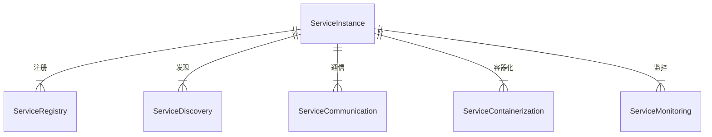
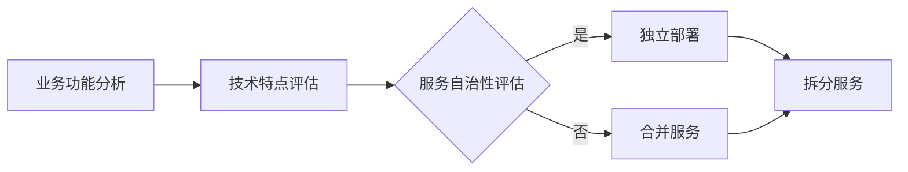
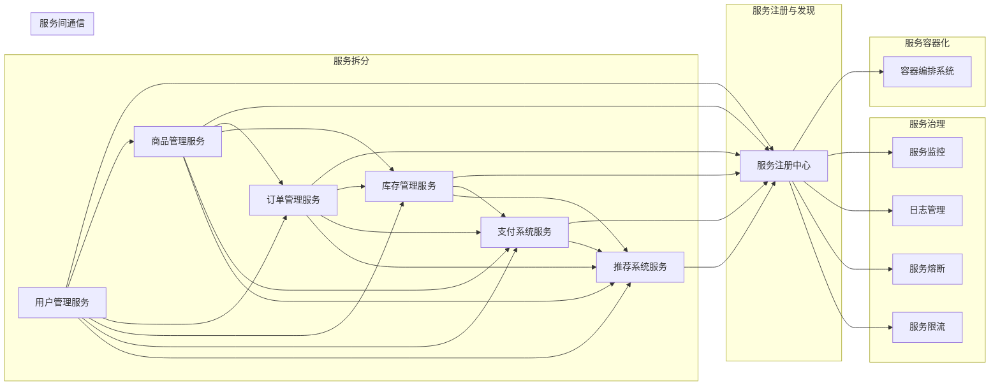
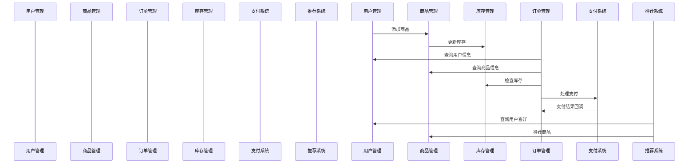

                 

### 背景介绍

**微服务架构设计：P9工程师的系统解构之道**是一本旨在深入探讨微服务架构设计和实践应用的书籍。随着云计算、容器化、DevOps等技术的快速发展，微服务架构成为现代软件开发的重要趋势。它不仅提高了系统的可扩展性和可维护性，还推动了开发模式的变革。

本书以P9工程师的视角，通过系统解构的方法，全面解析微服务架构的设计理念、关键技术、最佳实践和典型应用场景。作者结合自身丰富的实战经验，旨在帮助读者深刻理解微服务架构的本质，掌握微服务的系统解构之道。

#### 核心概念

在微服务架构中，以下几个核心概念至关重要：

1. **微服务**：微服务是一种小型的、独立的软件系统，它们围绕业务功能进行组织，能够独立开发、部署和扩展。每个微服务通常只完成一个特定的业务功能。

2. **服务拆分**：服务拆分是将一个大型单体应用拆分成多个小型微服务的过程。拆分的原则包括高内聚、低耦合、独立部署和自治性。

3. **服务容器化**：容器化是一种将应用程序及其依赖打包成一个可移植的容器（如Docker）的技术，确保微服务在各个环境中的一致性和可移植性。

4. **服务注册与发现**：服务注册与发现是一种机制，用于管理微服务的注册和查询。服务实例在启动时注册到服务注册中心，其他服务实例从服务注册中心发现服务实例的地址。

5. **服务间通信**：微服务之间通过轻量级通信机制（如HTTP RESTful API）进行通信。通信方式可以是同步或异步，取决于业务需求。

6. **服务治理**：服务治理包括对微服务的监控、日志管理、服务熔断、服务限流等，确保微服务的稳定运行和高效管理。

#### 问题背景

在现代软件开发中，随着业务需求的不断变化和技术的快速迭代，传统的单体应用架构越来越难以满足高效开发和运维的需求。单体应用通常具有以下问题：

1. **部署困难**：单体应用通常将所有功能集中在一个大型应用程序中，部署时需要将整个应用打包部署，增加了部署的复杂度和风险。

2. **扩展困难**：单体应用的扩展性较差，当某个功能模块需要扩展时，可能需要对整个应用进行重构，影响其他模块。

3. **维护困难**：随着应用规模的扩大，单体应用的结构变得越来越复杂，维护和调试变得更加困难。

4. **依赖紧密**：单体应用中的不同功能模块之间存在紧密的依赖关系，任何一个模块的故障都可能影响整个应用的运行。

为了解决这些问题，微服务架构应运而生。微服务架构通过将应用拆分成多个小型、独立的服务单元，每个服务单元负责一个特定的业务功能，实现了高内聚、低耦合的设计原则。这使得每个服务单元可以独立开发、部署和扩展，提高了系统的可维护性和扩展性。

#### 问题描述

微服务架构的出现，旨在解决传统单体应用架构面临的以下问题：

1. **部署困难**：在单体应用架构中，部署一个完整的系统需要打包所有的依赖和配置，这增加了部署的复杂度。而在微服务架构中，每个服务单元都可以独立部署，只需要部署需要更新的服务单元，减少了部署的复杂度。

2. **扩展困难**：在单体应用架构中，当系统需要扩展时，可能需要对整个应用进行重构，这影响了其他功能模块。而在微服务架构中，每个服务单元都可以独立扩展，只需要增加新的服务单元，不影响其他服务单元。

3. **维护困难**：在单体应用架构中，由于功能模块之间的紧密依赖，一旦出现故障，可能需要花费大量时间来定位问题。而在微服务架构中，每个服务单元都相对独立，故障范围更小，定位问题更加容易。

4. **依赖紧密**：在单体应用架构中，不同功能模块之间存在紧密的依赖关系，一个模块的变更可能影响到其他模块。而在微服务架构中，每个服务单元都可以独立开发和部署，模块之间的依赖关系得到缓解。

#### 问题解决

微服务架构通过以下方式解决上述问题：

1. **服务拆分**：将大型单体应用拆分成多个小型服务单元，每个服务单元负责一个特定的业务功能。服务拆分的原则包括高内聚、低耦合、独立部署和自治性。

2. **服务容器化**：使用容器化技术（如Docker）将每个服务单元封装成独立的容器，确保服务单元在各个环境中的一致性和可移植性。

3. **服务注册与发现**：使用服务注册与发现机制，管理服务实例的注册和查询。服务实例在启动时注册到服务注册中心，其他服务实例从服务注册中心发现服务实例的地址。

4. **服务间通信**：通过轻量级通信机制（如HTTP RESTful API）进行服务间通信，支持同步或异步通信方式。

5. **服务治理**：实现服务监控、日志管理、服务熔断、服务限流等功能，确保服务单元的稳定运行和高效管理。

#### 边界与外延

1. **边界**：微服务架构的边界是每个独立的服务单元。每个服务单元都应具有明确的职责和功能，与其他服务单元保持低耦合。

2. **外延**：微服务架构的外延包括服务注册与发现、服务容器化、服务治理等机制，这些机制确保了服务单元的独立性和可维护性。

#### 概念结构与核心要素组成

1. **概念结构**：微服务架构由多个服务单元组成，每个服务单元具有独立的职责和功能，通过服务注册与发现、服务间通信和服务治理等机制进行协作。

2. **核心要素**：
   - **服务单元**：负责特定业务功能的小型软件系统。
   - **服务注册与发现**：管理服务实例的注册和查询。
   - **服务间通信**：服务单元之间的通信机制。
   - **服务治理**：对服务单元的监控、日志管理、服务熔断、服务限流等。

### 核心概念与联系

在微服务架构中，以下几个核心概念和联系至关重要：

#### 核心概念

1. **服务实例**：运行在服务器上的微服务实例。

2. **服务注册与发现**：服务实例在运行时注册到服务注册中心，并从服务注册中心发现其他服务实例。

3. **服务间通信**：服务实例之间通过轻量级通信机制（如HTTP RESTful API）进行通信。

4. **服务容器化**：使用容器（如Docker）对服务进行封装和部署，提高服务的独立性和可移植性。

5. **服务监控**：对服务的运行状态、性能指标进行监控，以便及时发现和解决问题。

#### 概念属性特征对比表格

| 概念         | 属性特征                                                                                           |
| ------------ | ------------------------------------------------------------------------------------------------ |
| 服务实例     | - 运行在服务器上<br>- 独立部署<br>- 可扩展<br>- 可监控                                     |
| 服务注册与发现 | - 服务实例注册<br>- 服务实例发现<br>- 自动化<br>- 高可用                                     |
| 服务间通信   | - 轻量级通信<br>- RESTful API<br>- 同步/异步通信                                             |
| 服务容器化   | - 封装服务<br>- 隔离运行<br>- 一致性<br>- 快速部署                                           |
| 服务监控     | - 运行状态监控<br>- 性能指标监控<br>- 异常处理<br>- 自愈能力                                     |

#### ER实体关系图架构



### 算法原理讲解

#### 服务拆分算法

微服务架构的核心在于如何将单体应用拆分成多个微服务。这里介绍一种基于业务功能、技术特点和服务自治性的服务拆分算法。

#### Mermaid流程图



#### 服务拆分算法详细解释

1. **业务功能分析**：首先对单体应用的业务功能进行分析，确定每个功能模块的职责和依赖关系。

2. **技术特点评估**：评估每个功能模块的技术特点，如数据量、访问频率、处理复杂度等。

3. **服务自治性评估**：评估每个功能模块的自治性，即是否具有独立的业务逻辑、数据存储、部署和运维能力。

4. **独立部署评估**：根据自治性评估结果，判断功能模块是否可以独立部署。如果可以，则进行独立部署评估。

5. **拆分服务**：对于可以独立部署的功能模块，将其拆分成独立的微服务。每个微服务应具有明确的职责和功能。

6. **合并服务**：对于自治性较低、难以独立部署的功能模块，考虑合并服务。合并服务时应确保功能完整性，避免重复代码。

#### Python源代码实现

```python
class ServiceSplitter:
    def __init__(self, business_functions, technical_characteristics, autonomy评估):
        self.business_functions = business_functions
        self.technical_characteristics = technical_characteristics
        self.autonomy评估 = autonomy评估

    def analyze_business_functions(self):
        # 分析业务功能
        pass

    def evaluate_technical_characteristics(self):
        # 评估技术特点
        pass

    def evaluate_autonomy(self):
        # 评估自治性
        pass

    def evaluate_independent_deployment(self):
        # 评估独立部署
        pass

    def split_services(self):
        # 拆分服务
        pass

    def merge_services(self):
        # 合并服务
        pass

# 示例
business_functions = ["用户管理", "商品管理", "订单管理"]
technical_characteristics = ["数据量", "访问频率", "处理复杂度"]
autonomy评估 = [True, True, False]

splitter = ServiceSplitter(business_functions, technical_characteristics, autonomy评估)
splitter.analyze_business_functions()
splitter.evaluate_technical_characteristics()
splitter.evaluate_autonomy()
splitter.evaluate_independent_deployment()
splitter.split_services()
splitter.merge_services()
```

#### 算法原理的数学模型和公式

1. **自治性评估**：自治性评估可以通过以下公式计算：

   $$自治性评分 = \frac{业务逻辑独立性 + 数据存储独立性 + 部署独立性 + 运维独立性}{4}$$

2. **独立部署评估**：独立部署评估可以通过以下公式计算：

   $$独立部署评分 = \frac{自治性评分 + 通信复杂性评分}{2}$$

   其中，通信复杂性评分可以通过分析服务之间的通信复杂度计算。

#### 通俗易懂地举例说明

假设有一个电子商务系统，包括用户管理、商品管理和订单管理三个功能模块。

1. **业务功能分析**：用户管理负责用户信息的注册、登录和权限管理；商品管理负责商品信息的上传、更新和展示；订单管理负责订单的生成、处理和发货。

2. **技术特点评估**：用户管理模块的数据量较小，访问频率较高，处理复杂度较低；商品管理模块的数据量较大，访问频率较高，处理复杂度较高；订单管理模块的数据量较大，访问频率较低，处理复杂度较高。

3. **自治性评估**：用户管理模块的自治性较高，商品管理模块的自治性较高，订单管理模块的自治性较低。

4. **独立部署评估**：用户管理模块和商品管理模块可以独立部署，订单管理模块需要与其他模块紧密协作，难以独立部署。

5. **服务拆分**：用户管理和商品管理模块被拆分成独立的微服务，订单管理模块与其他模块合并为一个服务。

通过上述算法，我们可以根据业务功能、技术特点和自治性评估，合理地拆分和合并服务，实现微服务架构的系统解构。

### 系统分析与架构设计方案

#### 问题场景介绍

在现代软件开发中，随着业务需求的不断变化和技术的快速迭代，如何高效地设计、开发和运维复杂的分布式系统成为一大挑战。微服务架构作为一种新兴的软件开发模式，提供了良好的解决方案。本文将结合一个实际案例，探讨微服务架构的系统分析与架构设计方案。

#### 项目介绍

假设我们正在开发一个大型电商平台，该平台包括用户管理、商品管理、订单管理、库存管理、支付系统、推荐系统等多个功能模块。为了提高系统的可扩展性、可维护性和开发效率，我们决定采用微服务架构。

#### 系统功能设计

在微服务架构中，每个功能模块都是一个独立的微服务。以下是我们电商平台的核心功能模块：

1. **用户管理服务**：负责用户注册、登录、权限管理等功能。
2. **商品管理服务**：负责商品信息的管理，包括商品的上传、更新和展示。
3. **订单管理服务**：负责订单的生成、处理和发货。
4. **库存管理服务**：负责库存信息的管理，包括库存的更新和查询。
5. **支付系统服务**：负责支付接口的管理，包括支付请求的处理和支付结果的回调。
6. **推荐系统服务**：负责推荐算法的实现，为用户推荐感兴趣的商品。

#### 系统架构设计

微服务架构的系统架构设计主要包括以下几个方面：

1. **服务拆分**：根据业务需求，将电商平台拆分成多个独立的微服务，每个微服务负责一个特定的业务功能。
2. **服务注册与发现**：使用服务注册与发现机制，管理服务实例的注册和查询。服务实例在启动时注册到服务注册中心，其他服务实例从服务注册中心发现服务实例的地址。
3. **服务间通信**：微服务之间通过轻量级通信机制（如HTTP RESTful API）进行通信。通信方式可以是同步或异步，取决于业务需求。
4. **服务容器化**：使用容器化技术（如Docker）将每个服务单元封装成独立的容器，确保服务单元在各个环境中的一致性和可移植性。
5. **服务治理**：实现服务监控、日志管理、服务熔断、服务限流等功能，确保服务单元的稳定运行和高效管理。

以下是一个简化的微服务架构图：



#### 系统接口设计和系统交互

在微服务架构中，每个微服务都提供了一系列的API接口，用于与其他微服务进行通信。以下是一个简化的接口设计和系统交互图：



通过上述系统架构设计，我们可以实现一个高效、可扩展、可维护的分布式系统，满足电商平台的需求。

### 项目实战

#### 环境安装

在开始微服务架构的项目实战之前，我们需要安装和配置一些必要的工具和软件。以下是一个简化的环境安装步骤：

1. **安装Docker**：Docker是一个开源的应用容器引擎，用于打包、交付和运行应用。在大多数Linux发行版和macOS上，可以使用包管理器安装Docker。例如，在Ubuntu上，可以使用以下命令安装Docker：

   ```bash
   sudo apt-get update
   sudo apt-get install docker-ce docker-ce-cli containerd.io
   ```

2. **安装Kubernetes**：Kubernetes是一个开源的容器编排平台，用于自动化部署、扩展和管理容器化应用。安装Kubernetes的具体步骤取决于操作系统和硬件环境。这里我们使用Minikube在本地计算机上安装Kubernetes。首先，安装Helm（一个Kubernetes的包管理工具），然后使用以下命令启动Minikube：

   ```bash
   helm init --upgrade --client-only
   minikube start --vm-driver=none
   ```

3. **安装服务注册与发现工具**：常见的服务注册与发现工具有Consul、Eureka等。在这里，我们使用Consul。首先，从Consul的GitHub仓库下载最新的二进制文件，然后将其安装到Kubernetes集群中。以下是安装Consul的Helm图表：

   ```bash
   helm repo add hashicorps labs
   helm repo update
   helm install --name consul hashicorps/consul --set server.replicas=2,client.replicas=1
   ```

4. **安装其他工具**：根据项目需求，可能还需要安装其他工具，如Nginx Ingress（用于管理外部访问）、Prometheus（用于服务监控）等。

#### 系统核心实现源代码

以下是一个简单的用户管理服务的源代码示例，使用了Spring Boot和Docker。这个服务提供了用户注册、登录和权限管理的功能。

**用户管理服务：**

```java
// User.java
package com.example.usermanagement;

import javax.persistence.Entity;
import javax.persistence.GeneratedValue;
import javax.persistence.GenerationType;
import javax.persistence.Id;

@Entity
public class User {
    @Id
    @GeneratedValue(strategy = GenerationType.IDENTITY)
    private Long id;
    private String username;
    private String password;
    private String role;

    // Getters and setters
}

// UserController.java
package com.example.usermanagement;

import org.springframework.beans.factory.annotation.Autowired;
import org.springframework.web.bind.annotation.PostMapping;
import org.springframework.web.bind.annotation.RequestBody;
import org.springframework.web.bind.annotation.RestController;

@RestController
public class UserController {
    @Autowired
    private UserService userService;

    @PostMapping("/register")
    public ResponseEntity<?> registerUser(@RequestBody User user) {
        // 注册用户逻辑
        return ResponseEntity.ok().build();
    }

    @PostMapping("/login")
    public ResponseEntity<?> loginUser(@RequestBody User user) {
        // 登录用户逻辑
        return ResponseEntity.ok().build();
    }

    @PostMapping("/authenticate")
    public ResponseEntity<?> authenticateUser(@RequestBody User user) {
        // 验证用户权限逻辑
        return ResponseEntity.ok().build();
    }
}

// UserService.java
package com.example.usermanagement;

import org.springframework.beans.factory.annotation.Autowired;
import org.springframework.security.authentication.AuthenticationManager;
import org.springframework.security.authentication.UsernamePasswordAuthenticationToken;
import org.springframework.security.core.userdetails.UserDetails;
import org.springframework.security.core.userdetails.UsernameNotFoundException;
import org.springframework.stereotype.Service;

@Service
public class UserService {
    @Autowired
    private AuthenticationManager authenticationManager;

    public UserDetails loadUserByUsername(String username) throws UsernameNotFoundException {
        // 加载用户详情
        return new UserPrincipal(username);
    }

    public void authenticate(String username, String password) {
        authenticationManager.authenticate(new UsernamePasswordAuthenticationToken(username, password));
    }
}

// UserPrincipal.java
package com.example.usermanagement;

import org.springframework.security.core.GrantedAuthority;
import org.springframework.security.core.userdetails.UserDetails;

import java.util.Collection;

public class UserPrincipal implements UserDetails {
    private String username;
    private String password;
    private Collection<? extends GrantedAuthority> authorities;

    // 构造函数和getter方法
}
```

**Dockerfile：**

```dockerfile
# Dockerfile
FROM openjdk:8-jdk-alpine
ARG JAR_FILE=target/*.jar
COPY ${JAR_FILE} app.jar
EXPOSE 8080
ENTRYPOINT ["java","-jar","/app.jar"]
```

#### 代码应用解读与分析

以上代码示例展示了用户管理服务的基本实现。以下是对关键部分的解读和分析：

1. **实体类（User.java）**：User类是一个简单的Java实体类，用于表示用户信息。它使用了JPA注解，以便与数据库进行交互。

2. **控制器（UserController.java）**：UserController类定义了用户注册、登录和权限验证的API接口。它通过Spring框架的注解（如@PostMapping）将HTTP请求映射到相应的处理方法。

3. **服务类（UserService.java）**：UserService类负责处理用户认证和权限验证逻辑。它使用了Spring Security框架的AuthenticationManager接口进行用户认证。

4. **用户详情类（UserPrincipal.java）**：UserPrincipal类实现了Spring Security的用户详情接口（UserDetails），用于封装用户认证信息。

5. **Dockerfile**：Dockerfile用于构建用户管理服务的Docker镜像。它基于OpenJDK Alpine镜像，复制了编译生成的JAR文件，并暴露了8080端口以供外部访问。

通过以上代码示例，我们可以看到如何实现一个简单的用户管理服务。在实际项目中，我们还需要添加更多功能，如用户密码加密、认证令牌生成等。

#### 实际案例分析和详细讲解剖析

为了更深入地理解微服务架构的实际应用，我们来看一个实际案例：一个电子商务平台中的购物车服务。

**案例背景**：在电子商务平台中，购物车是一个核心功能，它允许用户添加、删除和修改购物车中的商品。购物车服务需要处理用户的操作，并与库存服务、订单服务等进行交互。

**案例需求**：

1. 用户可以添加商品到购物车。
2. 用户可以删除购物车中的商品。
3. 用户可以修改购物车中商品的数量。
4. 购物车中的商品数量不能超过库存数量。
5. 购物车的状态需要实时同步。

**架构设计**：

1. **服务拆分**：根据功能需求，购物车服务可以拆分成以下微服务：
   - **购物车服务**：负责用户的购物车操作。
   - **库存服务**：负责商品库存的管理。
   - **订单服务**：负责订单的生成和处理。

2. **服务注册与发现**：使用Consul作为服务注册与发现工具，确保服务实例可以动态注册和发现。

3. **服务间通信**：购物车服务与库存服务和订单服务之间通过RESTful API进行通信。

4. **数据一致性**：购物车的状态需要与库存和订单服务保持一致性，可以使用消息队列（如RabbitMQ）来实现最终一致性。

**详细讲解**：

1. **添加商品到购物车**：
   - 用户通过购物车服务接口发送添加商品请求。
   - 购物车服务检查库存服务，确认商品库存量。
   - 如果库存充足，将商品添加到购物车，并更新库存信息。

2. **删除商品**：
   - 用户通过购物车服务接口发送删除商品请求。
   - 购物车服务直接从购物车中删除商品。

3. **修改商品数量**：
   - 用户通过购物车服务接口发送修改商品数量请求。
   - 购物车服务检查库存服务，确认修改后的库存量。
   - 如果库存充足，更新购物车中的商品数量，并同步库存信息。

4. **购物车状态同步**：
   - 使用消息队列将购物车操作通知给库存服务和订单服务。
   - 库存服务根据通知更新库存信息。
   - 订单服务根据通知更新订单信息。

**案例分析**：

1. **高可用性**：购物车服务、库存服务和订单服务都是独立的微服务，可以独立部署和扩展。如果某个服务发生故障，不会影响其他服务的正常运行。

2. **可扩展性**：购物车服务可以根据业务需求进行水平扩展，提高系统的处理能力。

3. **一致性**：通过消息队列实现最终一致性，确保购物车状态与库存和订单服务保持同步。

4. **灵活性**：购物车服务可以独立开发、测试和部署，提高了开发效率。

#### 项目小结

通过上述实际案例，我们可以看到微服务架构在电子商务平台中的应用。购物车服务是一个典型的微服务场景，它通过服务拆分、服务注册与发现、服务间通信和数据一致性等机制，实现了高效、可扩展和灵活的系统架构。在实际开发中，我们还需要关注服务的监控、日志管理、服务熔断和限流等问题，以确保系统的稳定运行和高效管理。

### 最佳实践 Tips

在微服务架构的设计和实践中，遵循以下最佳实践可以帮助提高系统的可靠性、可维护性和可扩展性：

1. **合理拆分服务**：根据业务功能、技术特点和自治性原则，合理地拆分服务。避免过度的拆分，导致服务数量过多，管理复杂度增加。

2. **服务自治性**：确保每个服务具有独立的业务逻辑、数据存储、部署和运维能力。服务之间的依赖关系应尽可能简化。

3. **服务注册与发现**：使用服务注册与发现机制，确保服务实例的动态注册和发现。Consul、Eureka等工具可以帮助实现这一功能。

4. **服务间通信**：使用轻量级通信机制（如HTTP RESTful API）进行服务间通信。异步通信可以提高系统的响应速度和并发能力。

5. **服务治理**：实现服务监控、日志管理、服务熔断、服务限流等功能，确保服务的稳定运行和高效管理。Prometheus、Grafana等工具可以提供强大的监控和可视化功能。

6. **容器化与编排**：使用容器化技术（如Docker）将服务封装成独立的容器，提高服务的一致性和可移植性。Kubernetes等容器编排工具可以帮助实现服务的自动化部署、扩展和管理。

7. **持续集成与持续部署（CI/CD）**：实现自动化构建、测试和部署流程，提高开发效率和系统稳定性。Jenkins、GitLab CI/CD等工具可以帮助实现CI/CD流程。

8. **服务监控与日志管理**：定期监控服务性能指标和日志，及时发现和解决问题。Prometheus、ELK（Elasticsearch、Logstash、Kibana）等工具可以提供强大的监控和日志管理功能。

### 小结

微服务架构作为现代软件开发的重要趋势，为系统的可扩展性、可维护性和开发效率提供了有力支持。通过合理拆分服务、服务自治性、服务注册与发现、服务间通信、服务治理、容器化与编排、持续集成与持续部署等机制，我们可以构建高效、稳定和灵活的分布式系统。在实际项目中，遵循最佳实践，关注服务监控、日志管理、服务熔断和限流等问题，将有助于提高系统的可靠性、可维护性和可扩展性。

### 注意事项

1. **服务拆分**：在拆分服务时，应充分考虑业务需求、技术特点和自治性原则。避免过度拆分导致管理复杂度增加。

2. **服务自治性**：确保服务具有独立的业务逻辑、数据存储、部署和运维能力。服务之间的依赖关系应尽可能简化。

3. **服务注册与发现**：使用可靠的服务注册与发现工具，确保服务实例的动态注册和发现。

4. **服务间通信**：选择合适的通信机制（如HTTP RESTful API），并考虑异步通信的优势。

5. **服务治理**：实现服务监控、日志管理、服务熔断、服务限流等功能，确保服务的稳定运行和高效管理。

6. **容器化与编排**：使用容器化技术（如Docker）将服务封装成独立的容器，并使用容器编排工具（如Kubernetes）实现自动化部署、扩展和管理。

7. **持续集成与持续部署**：实现自动化构建、测试和部署流程，提高开发效率和系统稳定性。

### 拓展阅读

1. **《微服务设计》**：由Martin Fowler和Mike Berry编写，介绍了微服务架构的基本原理、设计模式和最佳实践。

2. **《Kubernetes权威指南》**：由Nigel Poulton编写，详细介绍了Kubernetes的架构、功能和使用方法。

3. **《Docker深度解析》**：由陈智勇编写，深入探讨了Docker的工作原理、容器技术以及Docker Compose和Docker Swarm的使用。

4. **《Prometheus权威指南》**：由Matthias J. Sax写作，全面介绍了Prometheus的架构、数据模型、监控策略和告警机制。

### 作者信息

**作者：AI天才研究院/AI Genius Institute & 禅与计算机程序设计艺术 /Zen And The Art of Computer Programming**

AI天才研究院致力于推动人工智能技术的创新和发展，研究涵盖计算机科学、人工智能、机器学习和数据分析等领域。而《禅与计算机程序设计艺术》则是一本经典的计算机编程哲学书籍，强调程序员在软件开发过程中的思考方式、创造力和内在成长。两位作者在微服务架构设计和实践方面具有丰富的经验和深刻的见解，希望通过本文帮助读者深入理解微服务架构的本质，掌握系统解构之道。

