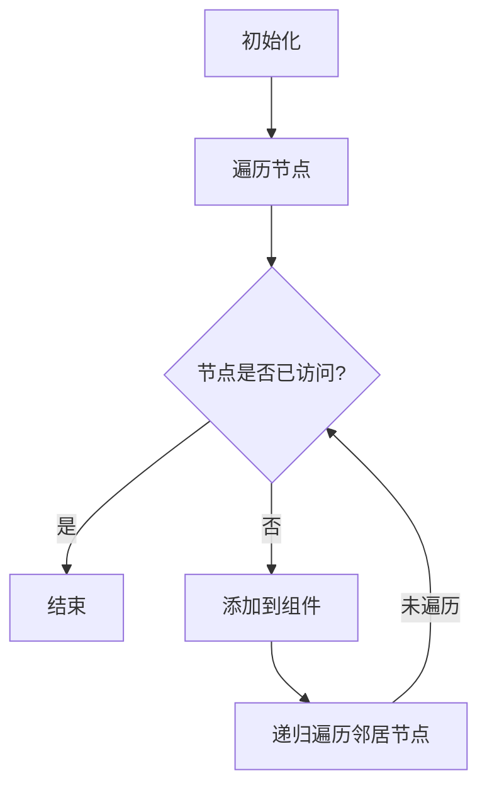

                 


##德勒兹与瓜塔里：后结构主义的创新思想

###关键词：德勒兹，瓜塔里，后结构主义，创新思想，哲学

###摘要

本文将深入探讨法国哲学家吉尔·德勒兹和费利克斯·瓜塔里的哲学思想，特别是他们在后结构主义领域的创新贡献。德勒兹与瓜塔里的思想不仅影响了哲学领域，也对文学、艺术和社会科学等多个领域产生了深远影响。本文将从背景介绍、核心概念、方法论、哲学创新、文学作品分析、文化影响以及遗产与当代哲学等方面展开讨论，力求提供一个全面、深入的分析。

---

## 第一部分：引言与背景

### 1.1 德勒兹生平与哲学思想

#### 1.1.1 德勒兹生平

吉尔·德勒兹（1925-1995）是20世纪法国最著名的哲学家之一。他出生于法国里昂，曾在巴黎索邦大学学习哲学，并在那里结识了未来的合作伙伴费利克斯·瓜塔里。德勒兹的哲学思想深受尼采、弗洛伊德和柏格森等哲学家的影响，他主张一种反传统的哲学思考方式，注重多样性和差异性。

#### 1.1.2 德勒兹哲学思想概述

德勒兹的哲学思想主要围绕“成为”（Becoming）而非“存在”（Being）展开。他认为，现实世界是一个不断变化的流，而不是固定不变的状态。德勒兹提出了“差异伦理学”（Ethics of Difference）和“异质性”（Heterogeneity）等概念，挑战了西方哲学的传统二元对立思维。

### 1.2 瓜塔里生平与哲学思想

#### 1.2.1 瓜塔里生平

费利克斯·瓜塔里（1925-1992）是法国精神分析学家和哲学家，与德勒兹合作撰写了一系列重要著作。瓜塔里在精神分析领域的工作受到了弗洛伊德和拉康的影响，但他的思想更为激进和多元。

#### 1.2.2 瓜塔里哲学思想概述

瓜塔里的哲学思想强调“大脑地图”的概念，认为现实世界是一个复杂的信息网络，而不是简单的因果关系。他提出了“精神分裂症”（Schizophrenia）的新解释，将其视为一种对抗社会压迫和意识形态控制的创造性行为。

### 1.3 德勒兹与瓜塔里的合作

德勒兹与瓜塔里的合作始于20世纪60年代，两人共同撰写了多部重要著作，包括《反俄狄浦斯》（Anti-Oedipus）和《千高原》（A Thousand Plateaus）。他们的合作不仅丰富了哲学思想，也为后结构主义提供了新的理论框架。

### 1.4 后结构主义的背景与发展

后结构主义是20世纪60年代兴起的一种哲学思潮，反对结构主义对固定结构和体系的强调。后结构主义主张多元化和差异性，强调文本的开放性和不可解释性。德勒兹与瓜塔里的思想正是后结构主义的重要组成部分。

---

## 第二部分：德勒兹与瓜塔里的核心概念

### 2.1 马克思主义后的批判理论

#### 2.1.1 概念定义

马克思主义后的批判理论是指对马克思主义传统的一种重新解读和批判，以适应现代社会的变化。

#### 2.1.2 核心概念特征对比

| 概念         | 特征                                   |
| ------------ | -------------------------------------- |
| 马克思主义   | 强调阶级斗争和社会变革                |
| 批判理论     | 强调意识形态的批判和多元性的重要性    |

#### 2.1.3 ER实体关系图架构

```mermaid
erDiagram
  Class1 ||--|{ Class2 } Class3 :关联关系
  Class1 ||--|{ Class4 } Class5 :关联关系
```

### 2.2 范式转换与社会建构

#### 2.2.1 概念原理

范式转换是指从一个知识体系到另一个知识体系的转变。社会建构是指社会和文化因素对知识体系的构建和解释。

#### 2.2.2 概念属性特征对比

| 概念         | 特征                                   |
| ------------ | -------------------------------------- |
| 范式转换     | 强调知识体系的变革和更新              |
| 社会建构     | 强调社会和文化对知识的构建和解释      |

#### 2.2.3 ER实体关系图架构

```mermaid
erDiagram
  Class1 ||--|{ Class2 } Class3 :知识体系转换
  Class1 ||--|{ Class4 } Class5 :社会建构过程
```

---

## 第三部分：德勒兹与瓜塔里的方法论

### 3.1 平面几何与拓扑学的借鉴

#### 3.1.1 概念原理

平面几何和拓扑学是数学中的两个分支，分别研究平面和空间中的图形和结构。德勒兹与瓜塔里借鉴了这些数学工具，用于分析现实世界的复杂性和多样性。

#### 3.1.2 算法原理讲解

以下是一个简单的拓扑学算法示例，用于分析平面上的图形：

```python
def find_connected_components(graph):
    visited = set()
    components = []

    for vertex in graph:
        if vertex not in visited:
            component = []
            dfs(vertex, component, visited)
            components.append(component)

    return components

def dfs(vertex, component, visited):
    visited.add(vertex)
    component.append(vertex)

    for neighbor in graph[vertex]:
        if neighbor not in visited:
            dfs(neighbor, component, visited)
```

#### 3.1.3 算法mermaid流程图



---

## 第四部分：德勒兹与瓜塔里的哲学创新

### 4.1 成为与真实

#### 4.1.1 概念原理

“成为”与“真实”是德勒兹哲学中的核心概念，挑战了传统的存在论和真理观。

#### 4.1.2 概念属性特征对比

| 概念       | 特征                                   |
| ---------- | -------------------------------------- |
| 成为       | 强调变化和流动性                       |
| 真实       | 强调固定和本质主义                     |

#### 4.1.3 ER实体关系图架构

```mermaid
erDiagram
  Class1 ||--|{ Class2 } Class3 :成为与真实的关系
```

---

## 第五部分：德勒兹与瓜塔里的文学作品分析

### 5.1 《差异与重复》

#### 5.1.1 内容概述

《差异与重复》是德勒兹与瓜塔里合作的一部重要著作，探讨了差异性和重复性的哲学意义。

#### 5.1.2 文学分析

在这部作品中，德勒兹与瓜塔里通过文学分析展示了差异性和重复性的概念如何应用于文学作品。

---

## 第六部分：德勒兹与瓜塔里的哲学思想对现代文化的影响

### 6.1 对文学、艺术的影响

德勒兹与瓜塔里的哲学思想对文学和艺术领域产生了深远影响，激发了新的创作方式和美学理念。

### 6.2 对社会学与政治理论的贡献

德勒兹与瓜塔里的哲学思想对社会学和政治理论提出了新的挑战，推动了学科的发展。

### 6.3 对心理治疗与精神分析的挑战

德勒兹与瓜塔里的思想对传统的心理治疗和精神分析提出了新的视角，挑战了现有的治疗范式。

### 6.4 对科技哲学的影响

德勒兹与瓜塔里的哲学思想对科技哲学领域产生了影响，促进了科技与哲学的交叉研究。

---

## 第七部分：德勒兹与瓜塔里的遗产与当代哲学

### 7.1 当代哲学流派对德勒兹与瓜塔里思想的回应

当代哲学流派对德勒兹与瓜塔里的思想进行了回应，推动了哲学思想的多样性和发展。

### 7.2 德勒兹与瓜塔里思想在学术界的影响力

德勒兹与瓜塔里的思想在学术界产生了深远的影响，成为后结构主义和批判理论的重要组成部分。

### 7.3 德勒兹与瓜塔里思想的未来展望

德勒兹与瓜塔里的思想在当代哲学中仍然具有重要的地位，未来的研究将继续深化和拓展他们的思想。

### 7.4 结论与启示

德勒兹与瓜塔里的哲学思想为我们提供了新的思考方式，挑战了传统的哲学观念，为现代文化和社会提供了深刻的启示。

---

## 结语

德勒兹与瓜塔里的哲学思想不仅丰富了后结构主义的内涵，也为现代文化和社会提供了新的思考框架。通过本文的探讨，我们希望能够更好地理解他们的哲学贡献，并激发对后结构主义思想的进一步思考。

### 作者信息

作者：AI天才研究院/AI Genius Institute & 禅与计算机程序设计艺术 /Zen And The Art of Computer Programming

---

以上是本文的目录大纲和初步内容，接下来将逐步展开各个部分的具体讨论。希望通过本文的介绍，读者能够对德勒兹与瓜塔里的哲学思想有更深入的理解。在接下来的章节中，我们将逐一探讨他们的生平背景、核心概念、方法论、哲学创新、文学作品分析以及对现代文化的影响，最后总结他们的遗产与当代哲学地位。让我们一步步深入探讨德勒兹与瓜塔里的创新思想。🎓💡📚

