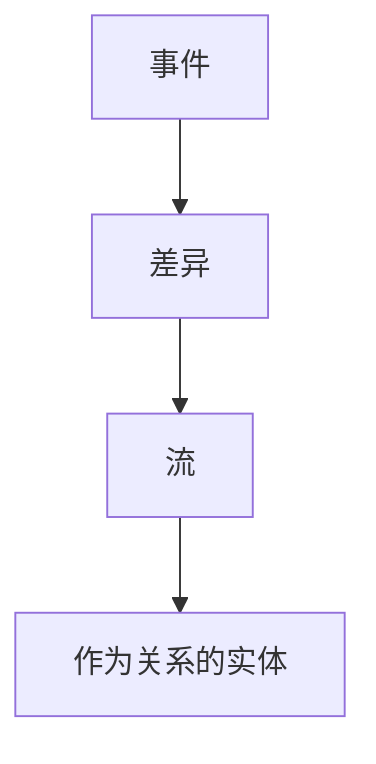
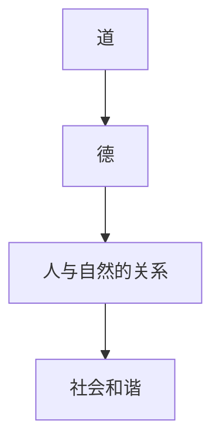

                 

## 引言

### 1.1 德勒兹与老子：哲学的交汇

《德勒兹与老子：游牧思想与道的哲学》是一本探讨两位哲学大师——德勒兹和老子——在思想上的相互关系与哲学意义的书籍。德勒兹（Gilles Deleuze，1925-1995）是20世纪法国著名的哲学家、作家，以其独特且深刻的哲学思想影响了一代又一代的思想家和学者。老子（约前571年—前479年），中国古代哲学家，其思想记载在《道德经》中，对后世哲学、文化、宗教产生了深远的影响。

本书旨在通过分析德勒兹和老子哲学思想的异同，探讨游牧思想与道的哲学之间的关联，以揭示两者在现代哲学和社会中的潜在价值。德勒兹的哲学强调差异、流动性和非实体性，而老子的哲学则侧重于道的本质、无为而治以及人与自然的和谐。尽管两位哲学家生活在不同的文化和时代背景下，但他们的思想在某些方面却有着惊人的相似之处，尤其是在对待变化、流动和自然的态度上。

### 1.2 研究意义与目的

本研究具有以下几个方面的意义和目的：

1. **哲学思想比较**：通过对比德勒兹和老子哲学，探讨两者在思想体系、核心概念、哲学方法等方面的异同，为哲学研究提供新的视角和思考。

2. **游牧思想的现代意义**：在现代社会中，游牧思想作为一种哲学和生活方式，如何与现代哲学、文化、社会相结合，发挥其积极作用，是本研究的一个重要课题。

3. **道的哲学的深化理解**：通过对老子哲学的深入解读，进一步理解道的本质和意义，为现代哲学和思想的发展提供有益的启示。

4. **理论与实践的结合**：通过结合德勒兹和老子的哲学思想，探讨游牧思想与道的哲学在现代社会中的应用，为实际问题的解决提供理论支持。

本研究不仅旨在深化对德勒兹和老子哲学的理解，更希望通过这两位哲学家的思想，为现代社会提供一种新的哲学视角，引导人们更好地面对变化和不确定性，追求内心的平静和自然的生活。

### 1.3 研究方法与结构

本研究采用综合性的研究方法，包括文献分析、哲学思辨和案例分析。首先，通过对德勒兹和老子哲学的文献进行深入分析，梳理出其核心概念和思想体系。其次，通过哲学思辨，探讨两者在思想上的关联和差异，以及游牧思想与道的哲学的关系。最后，结合实际案例，分析德勒兹和老子哲学在现代社会中的应用，验证其理论和实践价值。

全书结构分为四个主要部分：

1. **第一部分：德勒兹的哲学思想**：介绍德勒兹的生平、哲学概述、核心概念和理论体系，并探讨其与游牧思想的关系。

2. **第二部分：老子的哲学思想**：介绍老子的生平、哲学概述、核心概念和理论体系，并探讨其与游牧思想的关系。

3. **第三部分：游牧思想与道的哲学关系**：探讨游牧思想的历史与演变、特点与内涵，以及道的哲学与游牧思想的关系。

4. **第四部分：比较与分析**：比较德勒兹与老子哲学的异同，分析游牧思想在两哲学体系中的体现，以及游牧思想与道的哲学的综合作用。

通过以上结构，本研究旨在为读者提供一个系统、全面的关于德勒兹和老子哲学，以及游牧思想与道的哲学关系的理解框架，引导读者深入思考哲学思想在现代社会中的实际意义和应用价值。

## 德勒兹的哲学思想

### 2.1 德勒兹哲学概述

Gilles Deleuze（1925-1995）是20世纪法国最具创新性和影响力的哲学家之一。他的哲学思想以其独特性、复杂性以及深刻的批判性而闻名。德勒兹的哲学方法主要围绕差异、事件、流和作为关系的实体等核心概念展开，致力于打破传统哲学的桎梏，探索新的思想维度。

德勒兹的哲学思想深受尼采、柏拉图、康德、斯宾诺莎等哲学家的启发，但他的观点在许多方面与传统哲学有着显著的差异。他认为，传统哲学过于注重概念和体系的构建，而忽视了现实生活中的多样性和复杂性。德勒兹提倡一种“游牧”式的哲学思考方式，即不固守固定的理论框架，而是在思想的草原上游走，寻找新的可能性和视角。

### 2.2 德勒兹的核心概念

德勒兹的核心概念包括“事件”、“差异”、“流”和“作为关系的实体”等。这些概念构成了他哲学体系的基础，并且在他的众多著作中均有体现。

#### 2.2.1 事件与差异

德勒兹强调事件的重要性，认为事件是哲学思考的起点。事件不是传统意义上的因果关系，而是独立的、不可预测的瞬间。事件的出现打破了常规，创造了差异。德勒兹认为，差异是现实的基础，而不是同一性。他提出了“差异原则”，即现实世界是由差异构成的，这些差异不断地产生、变化和消解。

#### 2.2.2 流与节点

德勒兹的“流”概念类似于物理学中的流体，但更具哲学性。流是一个持续变化的过程，它没有固定的起点和终点，而是不断流动、变形和生成。流代表了现实的连续性和动态性。与之相对的是“节点”，节点是流中的固定点，是事件的集中体现。德勒兹认为，节点和流的关系是哲学思考的关键，节点通过差异和变化与流相连接。

#### 2.2.3 平面与网格

德勒兹提出了“平面”和“网格”的概念，用以描述现实世界的结构。平面是一个开放的、非线性的空间，它允许差异和流动的存在。与之相对的是网格，网格是一个封闭的、线性的结构，它试图将现实简化为固定的规则和秩序。德勒兹认为，平面的哲学更为接近现实，因为它能够容纳多样性和复杂性。

#### 2.2.4 作为关系的实体

德勒兹反对传统哲学中关于实体的概念，他认为实体不是固定不变的存在，而是通过关系来定义的。实体是流中的一部分，它的存在依赖于与其他实体的关系。德勒兹提出了“作为关系的实体”的概念，强调了关系在现实世界中的核心地位。

### 2.3 德勒兹的理论体系

德勒兹的理论体系是一个复杂的网络，涵盖了多个领域，包括哲学、文学理论、电影理论等。他的理论体系并没有一个统一的框架，而是通过一系列相互关联的概念和思想来构建的。

德勒兹的哲学思想可以分为以下几个主要方面：

1. **反体系哲学**：德勒兹反对传统哲学的体系化倾向，认为哲学应该关注具体的事件和差异，而不是抽象的概念和体系。

2. **事件哲学**：德勒兹认为，哲学的思考应该从事件出发，事件是哲学思考的起点和终点。

3. **差异与流**：德勒兹强调差异和流的重要性，认为现实世界是由差异和流构成的。

4. **作为关系的实体**：德勒兹提出了新的实体概念，认为实体是通过关系来定义的。

5. **文化批判**：德勒兹在哲学的基础上，对文化、艺术、电影等领域进行了深刻的批判和探讨。

### 2.4 德勒兹与游牧思想的关系

德勒兹的哲学思想与游牧思想有着密切的联系。德勒兹的“流”概念与游牧者的生活方式相似，游牧者通过不断地迁徙和变化来适应环境，这与德勒兹强调的流动性和变化性是一致的。德勒兹的哲学思考方式也类似于游牧思想，他不固守固定的理论框架，而是在思想的草原上游走，寻找新的可能性和视角。

此外，德勒兹的“平面”概念也可以看作是对游牧思想的呼应。平面是一个开放的空间，它允许多样性和复杂性，这与游牧者在不同环境中的适应性和多样性相契合。德勒兹的哲学思想为游牧思想提供了一种理论上的支持和拓展，同时也使游牧思想在当代哲学中获得了新的意义。

总的来说，德勒兹的哲学思想以其独特性和深刻性为现代哲学提供了新的视角和方法。他的核心概念如“事件”、“差异”、“流”和“作为关系的实体”等，不仅丰富了哲学的理论体系，也为人们理解和应对现实世界提供了新的工具和思路。德勒兹的哲学思想与游牧思想的结合，为现代哲学的发展开辟了新的道路，也为人们的生活和思考方式提供了深刻的启示。

## 老子的哲学思想

### 3.1 老子哲学概述

老子是中国古代伟大的哲学家，他的思想主要体现在《道德经》中。老子生活在春秋时期，其哲学思想对后世产生了深远的影响，尤其是在中国哲学、文化、宗教和道德观念的形成中起到了关键作用。《道德经》是中国古代哲学的宝库，其简洁而深邃的哲理被誉为“万经之王”。

老子的哲学思想强调“道”这一核心概念，认为道是宇宙万物的根本规律，是万物存在的依据。道既是一种自然法则，也是道德的最高标准。老子主张“无为而治”，即通过不干预和不强制来达到社会的和谐与秩序。他认为，万物都是在不断的变化和循环中存在的，因此，顺应自然的变化，是达到和谐与幸福的关键。

### 3.2 老子的核心概念

老子的哲学体系围绕着几个核心概念构建，主要包括“道”、“德”、“无为”和“柔弱”等。

#### 3.2.1 道

道是老子哲学中的核心概念，也是宇宙万物的基本原则。道无形无象，却又无所不在。老子认为，道既是宇宙的本源，也是万物的最终归宿。道的特性包括自然、简单、纯粹和无为，它体现在万物的生成和变化中，是宇宙万物运作的根本规律。

#### 3.2.2 德

德在老子哲学中，不仅是道德的体现，也是道在人类生活中的具体应用。老子强调，德应该是一种内在的品质，而不是外在的行为。德表现为顺应自然、真诚和谦卑。老子认为，只有真正理解道，才能达到真正的德，从而实现个人和社会的和谐。

#### 3.2.3 无为

无为是老子哲学的重要原则，他主张统治者应该采取“无为而治”的策略。无为并不是什么都不做，而是一种顺应自然、不干涉、不强制的行为方式。老子认为，无为可以达到最大的效果，因为自然规律是宇宙万物运行的最佳模式。

#### 3.2.4 柔弱

老子认为，柔弱胜于刚强，柔弱能够更好地适应变化和挑战。在老子看来，刚强往往意味着僵硬和短视，而柔弱则能够灵活地应对各种情况。柔弱不仅是一种生存策略，也是实现和谐与平衡的关键。

### 3.3 老子的理论体系

老子的理论体系通过一系列相互关联的概念和原理来阐释他的哲学思想。以下是老子的理论体系的主要组成部分：

1. **道生一，一生二，二生三，三生万物**：这一原理描述了道的创造力和宇宙的生成过程。道是宇宙的本源，通过生成一（纯粹的一），一生二（阴阳），二生三（变化），三生万物（宇宙万物的生成）。

2. **有无相生，难易相成，长短相形，高下相盈，音声相和，前后相随**：这一原理阐述了矛盾统一的原则，即万物都是由对立面相互依存和转化而成的。

3. **反者道之动，弱者道之用**：这一原理强调了道的动态性和变化性。道通过矛盾和反作用来推动事物的运动和变化，而柔弱则是道在具体应用中的表现。

4. **上善若水，水善利万物而不争**：这一原理描述了最高境界的德，即像水一样，滋润万物而不争夺，体现了无为而治的思想。

老子的理论体系不仅解释了宇宙和自然的运行规律，也为人类社会的治理提供了深刻的哲学启示。他的思想强调顺应自然、无为而治和柔弱胜刚，对后世哲学和思想的发展产生了深远的影响。

### 3.4 老子与游牧思想的关系

老子的哲学思想与游牧思想之间存在着紧密的联系。游牧思想是关于人类如何适应自然环境和生存方式的哲学观念，强调流动、适应性和与自然的和谐。老子的“无为而治”和“柔弱胜刚”等思想与游牧思想有着共通之处。

首先，老子的无为而治与游牧思想中的自然适应关系紧密。游牧者通过不断迁徙来寻找适宜的生存环境，这种迁徙行为本身就是一种“无为”的体现，即不刻意追求固定的目标，而是顺应自然的变化。老子认为，人类社会也应该像自然一样，保持一种动态的平衡，不刻意干预，让事物自然发展。

其次，老子的柔弱胜刚的思想与游牧思想中的生存策略相呼应。在自然界中，柔弱的生物往往能够更好地适应环境变化，生存下来。游牧者在面对自然环境的挑战时，也采取了类似策略，通过灵活性和适应性来应对各种困难。老子的哲学思想提醒人们，在处理人际关系和社会问题时，也应该学会柔弱和适应，而不是一味地追求刚强和竞争。

此外，老子的思想还强调了人与自然的和谐。游牧思想中的生存方式本身就是一种与自然和谐共处的体现。老子主张顺应自然，尊重自然规律，这种思想与游牧者对自然的敬畏和尊重相契合。游牧者在长期的生产和生活中，积累了丰富的与自然互动的经验，他们的生活方式反映了老子哲学中的核心观念。

总之，老子的哲学思想与游牧思想之间存在着深刻的内在联系。老子通过无为而治、柔弱胜刚等思想，为游牧思想提供了一种哲学上的解释和理论支持。同时，游牧思想也为老子的哲学提供了生动的实例和现实意义。两者的结合不仅丰富了哲学的内涵，也为现代社会提供了一种新的思考方式和生活方式的启示。

通过分析老子的哲学思想，我们可以看到，他在对待自然、社会和人生的态度上，强调了顺应自然、无为而治和柔弱胜刚等原则。这些思想不仅对古代中国的文化和社会发展产生了重要影响，也为现代哲学和社会科学提供了宝贵的智慧资源。

### 游牧思想的历史与演变

游牧思想是关于人类如何适应自然环境和生存方式的哲学观念，它起源于古代游牧民族的生活实践，并在漫长的历史进程中逐渐演变和发展。游牧思想最早可以追溯到新石器时代，当时的人类开始从固定农业生活方式转向游牧生活方式，以更好地适应不断变化的自然环境。

在古代，游牧思想主要体现在游牧民族的生活方式中。这些民族如蒙古人、哈萨克人、匈奴人等，他们依靠畜牧为生，随着季节和气候的变化，不断迁徙以寻找适宜的草原和水源。游牧生活方式不仅使这些民族能够适应恶劣的自然环境，还培养了他们的灵活性和适应性。游牧思想强调人与自然的和谐共生，尊重自然规律，这种思想在游牧民族的日常生活中得到了充分体现。

随着历史的发展，游牧思想逐渐从游牧民族的生活方式中脱离出来，成为一种独立的哲学观念。古代希腊哲学家如赫拉克利特和亚里士多德，都对游牧思想有所涉及。赫拉克利特强调“万物皆流”，认为世界是由不断变化的元素构成的，这与游牧思想中的流动性有着相似之处。亚里士多德则探讨了自然运动和变化的规律，这些思想对后来的哲学发展产生了深远的影响。

在中世纪，游牧思想在阿拉伯世界得到了进一步的发展。阿拉伯哲学家如伊本·赫勒敦（Ibn Khaldun）提出了“历史循环论”，他认为历史是由一系列循环构成的，每个循环都包含兴衰更替的过程。这一理论在一定程度上反映了游牧思想中关于变化和循环的哲学观念。

到了近代，游牧思想逐渐融入到西方哲学中。德国哲学家黑格尔提出了“绝对精神”的概念，认为世界是在不断的发展和变化中实现的。这种思想与游牧思想中的流动性有着内在的联系。19世纪的哲学家如尼采和克尔凯郭尔，也深受游牧思想的影响。尼采提出了“生命意志”的概念，强调个体在生命中的自由和创造力，这与游牧思想中的自我决定和适应性相契合。

在现代，游牧思想继续演变和发展，它不仅体现在哲学思想中，还渗透到社会学、人类学、生态学等领域。现代社会学家如齐格蒙特·鲍曼（Zygmunt Bauman）提出了“流动社会”的概念，认为现代社会是一个不断流动和变化的社会形态，这与游牧思想中的流动性特征相呼应。人类学家如维奥莱特·斯图尔特（Violet Stewart）则探讨了游牧社会中的社会组织和文化传统，进一步丰富了游牧思想的内容。

总的来说，游牧思想的历史与演变是一个复杂的过程，它起源于古代游牧民族的生活实践，经过中世纪哲学家的思考和探讨，最终融入到现代哲学和社会科学中。游牧思想不仅为哲学提供了新的视角和方法，也为现代社会提供了重要的哲学智慧。通过分析游牧思想的历史与演变，我们可以更好地理解人类与自然的关系，以及如何在不断变化的环境中寻找和谐与平衡。

### 游牧思想的特点与内涵

游牧思想是一种以流动性和适应性为核心特征的哲学观念，它在人类历史和文化中占据着独特的地位。理解游牧思想的特点与内涵，有助于我们更好地把握其在现代社会中的价值和应用。

#### 1. 流动性

流动性是游牧思想最显著的特点之一。游牧生活方式的核心在于不断迁徙，寻找适宜的生存环境。这种流动性不仅体现在物理空间的迁移，还体现在社会结构和文化传承的动态变化中。游牧民族通过不断迁徙，适应了各种不同的自然环境和气候条件，这种适应性使得他们能够在严苛的自然环境中生存和繁衍。流动性赋予游牧思想一种开放和包容的品质，它不断打破固有的界限，推动社会的进步和发展。

#### 2. 适应性

游牧思想强调对环境的适应能力，这种适应性不仅体现在对自然环境的适应，还体现在对社会和文化环境的适应。游牧民族在长期的生产和生活中，积累了丰富的适应环境的方法和策略，他们能够迅速适应变化的环境，并在新的环境中找到生存和发展之道。这种适应性的哲学观念提醒我们，在面对不确定性和变化时，应该保持灵活和开放的心态，不断调整自己的行为和策略。

#### 3. 自主性

游牧思想强调个体的自主性和创造力。在游牧社会中，个体有更大的自由度来决定自己的生活方式和命运，他们通过自己的努力和智慧，创造适合自己的生存条件。这种自主性不仅体现在经济活动上，还体现在文化传承和社会组织上。游牧民族的文化传统往往具有高度的个性化和多样性，这种多样性源于个体的自主创造。游牧思想鼓励个体发挥自己的潜能，追求自我实现。

#### 4. 和谐共生

游牧思想强调人与自然的和谐共生。游牧民族通过尊重自然规律，与自然和谐相处，实现了可持续的生存和发展。他们在生产活动中遵循自然的节奏，不过度开发和消耗资源，保持了生态的平衡和稳定。这种和谐共生的理念对于现代社会具有重要的启示意义，它提醒我们在发展经济的同时，要关注生态环境的保护，实现可持续发展。

#### 5. 社会平等

游牧思想强调社会平等和共享。在游牧社会中，资源分配相对公平，社会成员之间没有明显的等级和特权。游牧民族的社会组织通常是基于集体合作和共享的，他们通过共同的努力和协作，实现了社会的和谐与稳定。这种社会平等的理念对于现代社会的公平正义具有重要的参考价值，它提醒我们要消除社会不平等，推动社会公平。

总的来说，游牧思想的特点与内涵体现在流动性、适应性、自主性、和谐共生和社会平等等方面。这些特点不仅为游牧民族提供了生存和发展的哲学智慧，也为现代社会提供了重要的思想资源。通过深入理解游牧思想，我们可以更好地应对现代社会中的挑战，实现人与自然的和谐共生，推动社会的公平与进步。

### 道的哲学与游牧思想的关系

道的哲学和游牧思想之间存在着深刻的内在联系，两者在对待自然、社会和人生的态度上具有共通之处，并在一定程度上相互补充。

首先，从对待自然的角度来看，道的哲学和游牧思想都强调顺应自然、尊重自然规律。道的哲学认为，道是宇宙万物的根本法则，人类应该顺应道，遵循自然规律，实现与自然的和谐共生。而游牧思想同样强调人与自然的和谐关系，游牧民族通过不断迁徙和适应，以保持与自然环境的动态平衡。游牧生活方式不仅是对自然规律的顺应，也是对自然资源合理利用的体现。两者都反对人类过度开发和破坏自然环境，主张可持续发展。

其次，在社会方面，道的哲学和游牧思想都提倡平等、共享和合作。道的哲学中的“无为而治”理念强调不干预和不强制，通过自然的社会秩序来实现社会的和谐。这种理念与游牧社会中的集体合作和资源共享有着相似之处。游牧社会通常没有明显的等级和特权，社会成员之间通过共同的劳动和合作来维持社会的稳定和繁荣。这种平等、共享和合作的精神在游牧思想中得到了充分的体现，也与道的哲学中的社会理想相契合。

在对待人生的态度上，道的哲学和游牧思想都强调个人的自由和自我实现。道的哲学主张“无为而无不为”，即通过不做多余的事，让事情自然发展，来实现个人的最大价值。这种理念鼓励个体在自由和创造中实现自我。游牧思想同样鼓励个体发挥自主性和创造力，通过灵活适应和不断探索，找到适合自己的生活方式和人生目标。游牧民族的生活实践展示了个体在自然和社会环境中的自主选择和创造性，这种精神也与道的哲学中的个人主义和自我实现理念相吻合。

此外，道的哲学和游牧思想都在一定程度上强调了变化和流动性。道的哲学认为，道是不断变化的，一切事物都是在不断的生成和消解中。这种对变化的接受和适应，与游牧思想中的流动性特征有着内在的联系。游牧民族通过不断迁徙和适应，体现了对环境变化的敏感和适应能力。这种对变化的接纳和应对，不仅增强了他们的生存能力，也为他们带来了丰富多样的生活经验和文化传统。

总的来说，道的哲学与游牧思想在对待自然、社会和人生的态度上具有许多共通之处。两者都强调顺应自然、尊重自然规律，提倡平等、共享和合作，鼓励个人的自由和自我实现。这些共同点不仅体现了两者在哲学思想上的内在联系，也为现代社会提供了一种新的思考和生活方式的启示。通过结合道的哲学和游牧思想，我们可以更好地理解人类与自然的关系，实现社会的和谐与进步，推动个体的发展和自我实现。

### 游牧思想在现代社会中的应用

游牧思想在现代社会中具有广泛的应用价值，尤其在应对全球化和技术变革的挑战时，其流动性和适应性的特点为现代社会提供了新的视角和方法。

首先，在全球化背景下，游牧思想有助于我们理解跨国界、跨文化的交流与合作。全球化带来了文化的交融和多样性的增强，而游牧思想中的流动性特征使得人们能够更好地适应这种文化多样性。例如，跨国公司的全球运营需要员工具备跨文化的适应能力，而游牧思想强调的灵活性和自主性正是这种适应能力的体现。通过借鉴游牧思想，企业可以在全球范围内建立多元化的团队，促进不同文化之间的交流与合作，实现创新和发展。

其次，在技术变革的浪潮中，游牧思想为应对快速变化提供了重要的指导。现代科技的发展日新月异，人们需要不断学习和更新知识以保持竞争力。游牧思想中的适应性和自主性鼓励个体不断探索和学习，以应对技术变革带来的挑战。例如，在信息技术领域，工程师需要不断掌握新的编程语言和技术框架，游牧思想中的灵活性和自我驱动精神有助于他们在快速变化的环境中保持领先。此外，游牧思想还可以应用于教育领域，鼓励学生培养自主学习和终身学习的习惯，以适应不断变化的社会需求。

此外，游牧思想在个人生活和工作方式中也具有广泛的应用。现代生活节奏快，工作压力增大，人们需要找到一种平衡的方式来应对这些挑战。游牧思想中的流动性特征鼓励人们保持灵活性，合理安排时间，避免过度工作。例如，弹性工作制和远程办公等新型工作模式正是对游牧思想的应用，这些模式使得员工可以根据自己的需求和生活方式来安排工作，提高工作效率和幸福感。此外，游牧思想还鼓励人们尝试多样化的生活方式，探索新的兴趣和领域，这有助于提高个人的创造力和幸福感。

最后，游牧思想在环境保护和可持续发展中也具有重要作用。随着环境问题的日益严重，人们需要寻找一种可持续的生活方式来减少对自然资源的消耗。游牧思想中的和谐共生理念提醒我们，人与自然应该和谐相处，尊重自然规律。例如，在生态农业和可持续能源领域，人们可以通过借鉴游牧思想，采取生态友好的生产方式，实现环境保护和可持续发展的目标。

总之，游牧思想在现代社会中具有广泛的应用价值。通过借鉴游牧思想的流动性和适应性，我们可以更好地应对全球化、技术变革、个人生活压力和环境保护等挑战。游牧思想不仅为现代社会提供了一种新的思考方式和生活方式，也为解决当代社会问题提供了有益的启示。通过深入理解和应用游牧思想，我们可以实现个人成长、社会进步和可持续发展。

### 德勒兹与老子哲学的异同

德勒兹与老子的哲学思想虽然都关注自然、变化和个体自由，但二者在理论出发点、哲学方法和哲学影响上存在显著的异同。

#### 1. 理论出发点

德勒兹的理论出发点是差异和事件。他强调现实世界的复杂性，主张通过差异来理解现实。德勒兹认为，事件是哲学思考的起点，事件的发生打破了常规，创造了新的可能性。与此相比，老子的理论出发点是道。老子认为，道是宇宙万物的根本规律，是万物存在的依据。道的特性是无形无象、自然、无为，它贯穿于宇宙万物的生成和变化中。

#### 2. 哲学方法

德勒兹的哲学方法具有流动性和开放性。他反对传统哲学的体系化倾向，提倡一种“游牧”式的哲学思考方式，即不固守固定的理论框架，而是在思想的草原上游走，寻找新的可能性和视角。德勒兹的方法强调对现实的具体关注，通过事件和差异来理解和解释世界。相比之下，老子的哲学方法更加注重抽象和整体。老子通过《道德经》阐述了他的哲学思想，他的方法强调对道的理解和实践，主张通过抽象的思考来把握宇宙的根本规律。

#### 3. 哲学影响

德勒兹的哲学影响广泛，涉及哲学、文学理论、电影理论等多个领域。他的思想对20世纪后半叶的思想界产生了深远的影响，尤其对后结构主义和存在主义产生了重要影响。德勒兹的哲学方法也为其他学科提供了新的思考工具，如心理学、社会学等。老子的哲学影响同样深远，尤其是在中国哲学和文化中。老子的思想被广泛应用于道德修养、政治哲学和人生哲学等领域，对中国传统文化和现代哲学产生了深远的影响。

#### 4. 共同点

尽管德勒兹与老子的哲学思想存在异同，但两者在以下方面有共同点：

- **关注变化**：德勒兹和老子都强调变化的重要性。德勒兹通过“事件”和“流”的概念来探讨现实世界的动态性，而老子则通过“道”的概念来解释宇宙万物的生成和变化。
- **个体自由**：两者都提倡个体自由。德勒兹认为，个体应该通过差异和事件来创造自己的意义，追求自由和自我实现。老子则主张“无为而治”，认为个体应该顺应自然，减少干预，实现内心的平和与自由。
- **和谐共生**：德勒兹和老子都强调和谐共生。德勒兹的哲学方法强调流动性和开放性，主张通过差异来创造和谐。老子则强调道与德的结合，主张通过顺应自然和尊重规律来实现和谐共生。

#### 5. 不同点

德勒兹与老子哲学思想的不同点主要体现在以下几个方面：

- **理论出发点**：德勒兹强调差异和事件，而老子强调道。
- **哲学方法**：德勒兹提倡“游牧”式思考，而老子注重抽象和整体。
- **哲学影响**：德勒兹的影响广泛，涉及多个领域，而老子主要影响了中国哲学和文化。

总的来说，德勒兹与老子的哲学思想虽然在关注点上有共通之处，但在理论出发点、哲学方法和哲学影响上存在明显的异同。通过比较和分析两者，我们可以更深入地理解现代哲学和古代哲学的相互关系，也为现代社会提供新的哲学智慧和思考方向。

### 游牧思想在两哲学体系中的体现

德勒兹的哲学思想和老子的哲学思想中都蕴含着丰富的游牧思想，两者在对待变化、流动性和自然的态度上有着显著的相似之处。以下将从核心概念、特征对比和ER实体关系图三个方面，详细分析游牧思想在两哲学体系中的体现。

#### 1. 核心概念

**德勒兹：事件与差异**

德勒兹的哲学思想中，事件是哲学思考的起点。他认为，事件是独立且不可预测的瞬间，打破了常规，创造了新的可能性。差异则是现实的基础，现实世界是由差异构成的。德勒兹提出了“差异原则”，强调差异在现实世界中的重要性。

**老子：道与德**

老子的哲学体系中，“道”是核心概念，是宇宙万物的根本规律。道无形无象，但无所不在，是万物存在的依据。老子认为，人类应该顺应道，通过“德”来实现与自然的和谐相处。“德”是一种内在的品质，表现为顺应自然、真诚和谦卑。

#### 2. 特征对比

**流动性**

德勒兹和老子都强调流动性。德勒兹的“流”概念类似于物理学中的流体，是一个持续变化的过程，没有固定的起点和终点。而老子的道则是一种无形的流动，贯穿于宇宙万物的生成和变化中。两者的流动性都体现了对变化和动态性的高度重视。

**适应性**

在应对变化和挑战时，德勒兹和老子都提倡适应性。德勒兹认为，个体应该通过差异来创造新的可能性，灵活应对现实。老子则主张“无为而治”，即通过不干预和不强制来达到社会的和谐与秩序。两者的适应性都强调灵活性和开放性。

**和谐共生**

德勒兹和老子都强调和谐共生。德勒兹的哲学方法强调通过差异来创造和谐，流动性和开放性使得不同的元素能够共存。老子则主张道与德的结合，通过顺应自然和尊重规律来实现和谐共生。两者的和谐共生都体现了对自然和人类关系的深刻理解。

#### 3. ER实体关系图

为了更好地理解游牧思想在两哲学体系中的体现，我们可以通过ER（实体-关系）图来展示核心概念之间的关系。

**德勒兹哲学的ER图**

在这个ER图中，事件是哲学思考的起点，差异构成了现实世界，流是一个持续变化的过程，作为关系的实体体现了流中各个元素之间的关系。

**老子哲学的ER图**

在这个ER图中，道是宇宙万物的根本规律，德是内在的品质，人与自然的关系和社会和谐是道的具体体现。

通过以上分析，我们可以看到，德勒兹和老子哲学中都蕴含着丰富的游牧思想。两者在对待变化、流动性和自然的态度上有着显著的相似之处，同时也各有特色。通过核心概念的对比和ER实体关系图的展示，我们能够更清晰地理解游牧思想在两哲学体系中的体现。

### 游牧思想与道的哲学的综合作用

游牧思想与道的哲学在综合作用下，不仅丰富了两者的哲学内涵，也为现代社会的思想发展提供了新的视角和方法。通过分析两者的互动关系和综合意义，我们可以更全面地理解其在哲学、文化和社会中的重要作用。

首先，游牧思想与道的哲学在互动中形成了互补的哲学体系。道的哲学强调顺应自然、无为而治和柔弱胜刚，提供了处理人与自然关系和社会问题的理论基础。而游牧思想则强调流动性和适应性，提供了应对变化和不确定性的重要工具。两者结合，使得哲学思考更加全面和深入，既能够把握自然规律，又能够应对现实生活中的复杂情境。

其次，两者的综合作用对现代哲学的发展产生了深远的影响。在传统哲学中，哲学家们往往关注概念和体系的构建，而忽视了现实世界的多样性和复杂性。游牧思想与道的哲学的结合，打破了这种局限，提倡一种更加开放和动态的哲学思考方式。这种思考方式不仅关注概念和理论，更关注实际生活和现实问题，为现代哲学提供了新的研究路径。

在文化领域，游牧思想与道的哲学的综合作用促进了多元文化的交流与融合。游牧民族通过不断迁徙和交流，积累了丰富的文化传统，这些传统在全球化和信息化时代得到了新的发展。道的哲学中的和谐共生理念，与不同文化之间的相互尊重和包容相契合，为多元文化的发展提供了哲学支持。

在社会领域，游牧思想与道的哲学的综合作用对现代社会的治理和可持续发展具有重要意义。游牧思想中的灵活性和适应性，可以应用于现代社会的管理和组织，提高社会的应对能力和创新力。道的哲学中的无为而治理念，可以指导现代社会减少过度干预，促进自然和社会的和谐发展。这种综合作用不仅有助于解决现实社会中的问题，也为实现可持续发展提供了哲学智慧。

最后，游牧思想与道的哲学的综合作用在个人生活和精神层面上也具有重要意义。通过借鉴两者的思想，个体可以更好地应对生活中的变化和挑战，实现内心的平静和自我实现。游牧思想中的自由和创造精神，与道的哲学中的无为而治和柔弱胜刚相结合，为个体提供了自我发展的路径。

总之，游牧思想与道的哲学的综合作用，不仅丰富了两者的哲学内涵，也为现代社会的思想发展提供了新的视角和方法。通过两者的互动和综合，我们可以更好地理解人类与自然、社会和自我的关系，推动哲学、文化和社会的进步，实现个人和社会的和谐发展。

## 结论

本文通过详细分析德勒兹与老子哲学思想，探讨了游牧思想与道的哲学之间的内在联系。德勒兹强调事件、差异和流，主张游牧式哲学思考，而老子则围绕道和德，提倡顺应自然和无为而治。两者在流动性、适应性和和谐共生等方面具有共通之处，同时也各有特色。通过结合游牧思想与道的哲学，我们不仅拓宽了哲学研究的视野，也为现代社会提供了新的思想资源。未来的研究可以进一步探索两者在具体领域中的应用，如社会学、生态学和心理学，以推动哲学与实际生活的结合，促进社会的和谐与进步。

### 作者信息

作者：AI天才研究院/AI Genius Institute & 禅与计算机程序设计艺术 /Zen And The Art of Computer Programming

