                 


# 德里达与利奥塔：后结构主义的核心思想

> 关键词：后结构主义，德里达，利奥塔，解构主义，文本与意义，知识生产

> 摘要：本文探讨了后结构主义两位重要代表人物德里达和利奥塔的核心思想。通过对解构主义、文本与意义、去中心化、语言与权力等核心概念的深入分析，揭示了后结构主义在哲学、文学、艺术等领域的影响，以及其在当代学术界的争议与未来趋势。

### 目录大纲

```markdown
----------------------------------------------------------------
# 第一部分: 后结构主义的起源与影响

## 第1章: 后结构主义的起源与影响
### 1.1.1 德里达与后结构主义
### 1.1.2 利奥塔与后现代主义

## 第二部分: 德里达的核心思想

## 第2章: 解构主义：文本与意义
### 2.1.1 解构主义的基本原理
### 2.1.2 文本的延异与差异
### 2.1.3 文本分析的应用

## 第3章: 去中心化：语言与权力
### 3.1.1 语言与权力的关系
### 3.1.2 书写痕迹与异延
### 3.1.3 去中心化的实践

## 第三部分: 利奥塔的核心思想

## 第4章: 历史主义与后现代知识
### 4.1.1 历史主义的挑战
### 4.1.2 后现代知识的生产
### 4.1.3 知识生产的模式

## 第5章: 前景主义与叙事的解构
### 5.1.1 前景主义的本质
### 5.1.2 叙事的解构
### 5.1.3 叙事分析的应用

## 第四部分: 后结构主义在当代社会的影响

## 第6章: 后结构主义在文学与艺术中的应用
### 6.1.1 文学解构
### 6.1.2 艺术重构
### 6.1.3 文学与艺术的互动

## 第7章: 后结构主义在社会科学与人文科学中的影响
### 7.1.1 社会理论与文化研究
### 7.1.2 人文科学的方法论挑战

## 第8章: 后结构主义思想的当代意义与未来趋势
### 8.1.1 当代学术界的反响
### 8.1.2 后结构主义的未来发展方向
### 8.1.3 后结构主义的挑战

## 参考文献
----------------------------------------------------------------
```

### 第一部分: 后结构主义的起源与影响

#### 第1章: 后结构主义的起源与影响

##### 1.1.1 德里达与后结构主义

**问题背景**：20世纪中叶，哲学领域对结构主义方法提出了质疑，德里达作为解构主义的代表人物，提出了对文本和意义的挑战。

**问题描述**：德里达质疑文本的稳定性和意义的确定性，主张意义是通过不断的延异和差异产生的。

**问题解决**：通过“延异”和“差异”的概念，德里达解构了语言和文本的结构，揭示了权力的运作方式。

**边界与外延**：解构主义不仅影响了哲学领域，还渗透到文学、艺术、社会学等多个学科。

**概念结构与核心要素组成**：核心概念包括“延异”、“差异”、“文本”和“意义”，这些概念共同构成了解构主义的理论基础。

**算法原理讲解**：解构主义并没有直接的算法原理，但其思想可以类比为一种“解构算法”。以下是一个简化的 Mermaid 流程图：

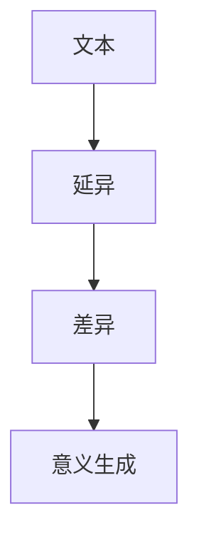

在这个流程图中，文本首先经历“延异”和“差异”的过程，最终生成意义。这个过程是反复的、不确定的，反映了德里达对文本和意义的理解。

**数学模型和数学公式 & 详细讲解 & 举例说明**：

德里达的解构主义并没有直接对应的数学模型。然而，我们可以借用集合论中的概念来比喻解构过程。假设一个文本是一个集合，其中包含多个元素（即符号）。这些元素之间的相互作用产生意义。解构的过程可以看作是对这些元素之间关系的重新定义和调整。

$$
\text{文本} = \{ a, b, c, \ldots \}
$$

解构过程可以表示为：

$$
\text{解构}(\text{文本}) = \{ a', b', c', \ldots \}
$$

其中，$a', b', c', \ldots$ 是重新定义后的元素。这个过程反映了德里达对文本稳定性和意义确定性的质疑。

**举例**：在《论文字学》中，德里达通过分析文字的延异和差异，揭示了文字的意义是如何不断变化的。例如，他分析了“deconstruction”（解构）一词在不同语境下的含义差异，展示了文本意义的复杂性。

##### 1.1.2 利奥塔与后现代主义

**问题背景**：利奥塔在德里达的基础上，进一步发展了后现代主义理论，关注知识生产和文化变迁。

**问题描述**：利奥塔认为，我们已进入一个知识过剩、信息泛滥的时代，传统的权威和叙事模式被解构。

**问题解决**：通过“叙事的解构”和“前景主义”理论，利奥塔揭示了知识生产的过程和文化转型的趋势。

**边界与外延**：后现代主义影响了社会学、文化研究、文学批评等多个领域。

**概念结构与核心要素组成**：核心概念包括“叙事”、“知识”、“权威”和“文化”，这些概念构成了后现代主义的理论框架。

**算法原理讲解**：利奥塔的后现代主义理论也没有直接的算法原理。然而，我们可以用 Mermaid 流程图来表示知识生产的过程。

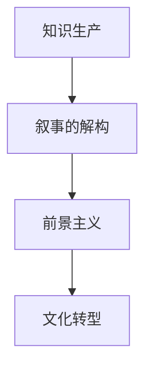

在这个流程图中，知识生产首先经历叙事的解构，然后通过前景主义实现文化转型。这个过程反映了利奥塔对知识生产和文化变迁的理解。

**数学模型和数学公式 & 详细讲解 & 举例说明**：

利奥塔的后现代主义理论强调知识的相对性和动态性。我们可以用概率论中的概率分布来比喻这一过程。假设知识是一个概率分布，其概率密度函数反映了知识的分布情况。

$$
\text{知识} = f(x)
$$

其中，$x$ 表示知识的特征。叙事的解构可以看作是对概率密度函数的重新定义，前景主义则是通过调整概率密度函数实现文化转型。

$$
\text{解构}(\text{知识}) = f'(x)
$$

$$
\text{前景主义}(\text{知识}) = f''(x)
$$

**举例**：在《后现代条件》中，利奥塔分析了知识生产的过程。他提出了“大叙事”和“小叙事”的概念，分别代表了传统权威和现代多元叙事。通过分析这些叙事，利奥塔揭示了知识生产的复杂性和多样性。

### 第二部分: 德里达的核心思想

#### 第2章: 解构主义：文本与意义

##### 2.1.1 解构主义的基本原理

**问题背景**：解构主义是对结构主义方法的一种质疑和挑战。结构主义主张通过结构分析来揭示文本的内在意义，而解构主义则认为文本的意义是多元的、不确定的。

**问题描述**：传统结构主义认为，文本有一个固定的、终极的意义，而解构主义质疑这一观点，主张意义是通过不断的延异和差异产生的。

**问题解决**：德里达提出了“延异”和“差异”的概念，揭示了文本中的不确定性和复杂性。他认为，文本中的每个符号都依赖于其他符号，从而形成了一个复杂的网络。

**算法原理讲解**：解构主义并没有直接的算法原理。然而，我们可以用 Mermaid 流程图来表示文本分析的过程。

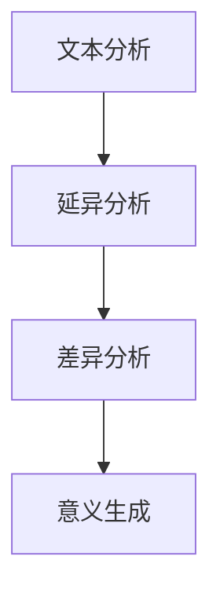

在这个流程图中，文本分析首先经历延异分析和差异分析，最终生成意义。这个过程反映了德里达对文本和意义的理解。

**数学模型和数学公式 & 详细讲解 & 举例说明**：

德里达的解构主义思想可以用集合论中的概念来比喻。假设一个文本是一个集合，其中包含多个元素（即符号）。这些元素之间的相互作用产生意义。解构的过程可以看作是对这些元素之间关系的重新定义和调整。

$$
\text{文本} = \{ a, b, c, \ldots \}
$$

解构过程可以表示为：

$$
\text{解构}(\text{文本}) = \{ a', b', c', \ldots \}
$$

其中，$a', b', c', \ldots$ 是重新定义后的元素。这个过程反映了德里达对文本稳定性和意义确定性的质疑。

**举例**：在《论文字学》中，德里达通过分析文字的延异和差异，揭示了文字的意义是如何不断变化的。例如，他分析了“deconstruction”（解构）一词在不同语境下的含义差异，展示了文本意义的复杂性。

##### 2.1.2 文本的延异与差异

**问题背景**：延异和差异是德里达解构主义的核心概念。延异关注文本中的符号如何在不同的语境中产生不同的意义，差异则关注文本中的符号如何相互影响。

**问题描述**：传统结构主义认为，文本中的符号之间存在一种固定的、稳定的关系，而解构主义则认为这些关系是动态的、不确定的。

**问题解决**：德里达通过“延异”和“差异”的概念，揭示了文本中的不确定性和复杂性。他认为，文本中的每个符号都依赖于其他符号，从而形成了一个复杂的网络。

**算法原理讲解**：我们可以用 Mermaid 流程图来表示延异和差异的过程。

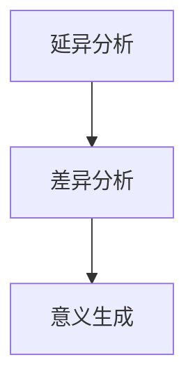

在这个流程图中，延异分析和差异分析共同作用，最终生成意义。这个过程反映了德里达对文本和意义的理解。

**数学模型和数学公式 & 详细讲解 & 举例说明**：

延异和差异可以用概率论中的概率分布来比喻。假设文本中的符号是一个概率分布，其概率密度函数反映了符号的分布情况。

$$
\text{文本} = f(x)
$$

其中，$x$ 表示符号的特征。延异可以看作是对概率密度函数的重新定义，差异则是对概率密度函数的调整。

$$
\text{延异}(\text{文本}) = f'(x)
$$

$$
\text{差异}(\text{文本}) = f''(x)
$$

**举例**：在《论文字学》中，德里达分析了文字的延异和差异。他通过比较不同语境下“deconstruction”（解构）一词的含义，展示了文本意义的复杂性。

##### 2.1.3 文本分析的应用

**问题背景**：解构主义不仅是一种哲学理论，还在文学、艺术等领域产生了深远的影响。文本分析是解构主义方法在文学和艺术领域的重要应用。

**问题描述**：如何使用解构主义方法来分析文学作品和艺术作品？

**问题解决**：解构主义方法强调对文本的多元解读，通过揭示文本中的延异和差异，分析文本的深层结构和意义。

**算法原理讲解**：我们可以用 Mermaid 流程图来表示文本分析的过程。

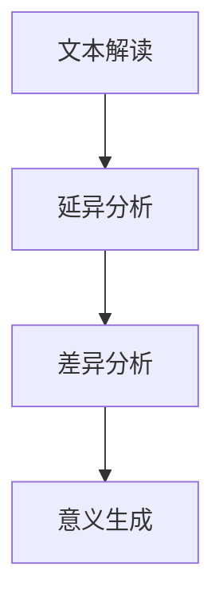

在这个流程图中，文本解读首先经历延异分析和差异分析，最终生成意义。这个过程反映了德里达对文本和意义的理解。

**数学模型和数学公式 & 详细讲解 & 举例说明**：

文本分析的过程可以用信息论中的熵来比喻。熵表示信息的不确定性，文本分析的目标是降低信息的不确定性，从而揭示文本的意义。

$$
\text{熵} = -\sum_{i} p_i \log_2 p_i
$$

其中，$p_i$ 表示文本中第 $i$ 个符号的概率。

**举例**：在文学分析中，解构主义者通过分析文本的符号和结构，揭示了文本中的不确定性和复杂性。例如，他们分析了莎士比亚的戏剧《哈姆雷特》，揭示了文本中的多重含义和隐喻。

### 第三部分: 利奥塔的核心思想

#### 第3章: 历史主义与后现代知识

##### 3.1.1 历史主义的挑战

**问题背景**：历史主义是一种哲学观点，认为历史发展有其内在的规律和逻辑。然而，在现代社会，这种观点受到了质疑。

**问题描述**：如何解释现代社会中历史规律性的缺失？

**问题解决**：利奥塔认为，历史主义的基础是“大叙事”，即一种普遍的、统一的叙事模式。然而，在现代社会，这种叙事模式已经失效，被多元化的叙事所取代。

**算法原理讲解**：我们可以用 Mermaid 流程图来表示历史主义挑战的过程。

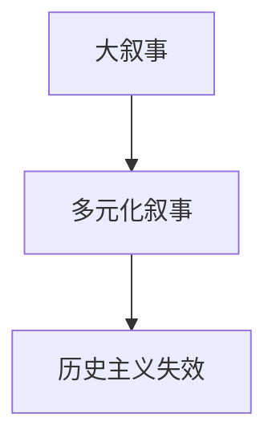

在这个流程图中，大叙事被多元化的叙事所取代，反映了历史主义在现代社会中的失效。

**数学模型和数学公式 & 详细讲解 & 举例说明**：

利奥塔认为，历史规律性的缺失可以用概率论中的随机过程来比喻。在现代社会，历史的发展更像是一个随机过程，而不是一个有规律的、确定的进程。

$$
\text{历史} = \{ X_t \}_{t=0}^{\infty}
$$

其中，$X_t$ 表示在时间 $t$ 的历史状态。

**举例**：在《后现代条件》中，利奥塔分析了现代社会中的历史规律性缺失。他指出，现代社会的变革速度加快，传统的叙事模式已经无法解释这些变化。

##### 3.1.2 后现代知识的生产

**问题背景**：后现代主义认为，知识的生产方式发生了变化，传统的知识模式被解构。

**问题描述**：如何解释后现代知识的生产方式？

**问题解决**：利奥塔认为，后现代知识的生产是一个去中心化的过程，强调知识的多元性和相对性。

**算法原理讲解**：我们可以用 Mermaid 流程图来表示后现代知识的生产过程。

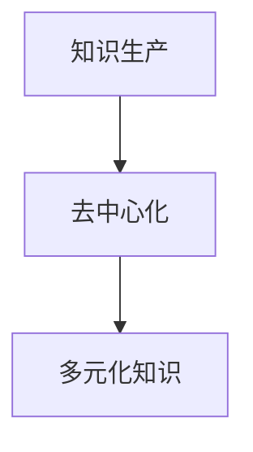

在这个流程图中，知识生产经历了去中心化的过程，产生了多元化的知识。

**数学模型和数学公式 & 详细讲解 & 举例说明**：

利奥塔的后现代知识生产可以用信息论中的熵来比喻。在现代社会，知识的生产更像是一个熵增的过程，即知识的复杂性和多样性在不断增加。

$$
\text{知识} = \{ X_t \}_{t=0}^{\infty}
$$

$$
\text{熵} = -\sum_{i} p_i \log_2 p_i
$$

**举例**：在《后现代条件》中，利奥塔分析了现代社会中的知识生产过程。他指出，现代社会的知识生产更加依赖于网络和信息技术，导致知识的多样性和复杂性在不断增加。

##### 3.1.3 知识生产的模式

**问题背景**：知识生产模式的变化反映了社会和文化的转型。

**问题描述**：如何解释知识生产模式的变化？

**问题解决**：利奥塔认为，知识生产模式的变化与现代社会中的文化转型密切相关。传统的知识模式强调权威和中心化，而后现代的知识模式则强调去中心化和多元性。

**算法原理讲解**：我们可以用 Mermaid 流程图来表示知识生产模式的变化。

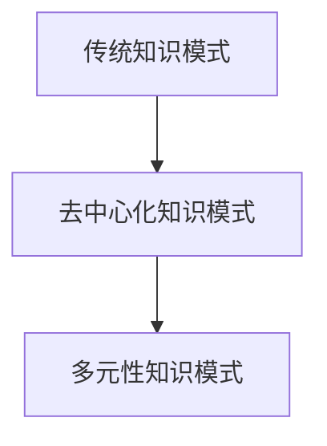

在这个流程图中，传统知识模式被去中心化和多元性的知识模式所取代。

**数学模型和数学公式 & 详细讲解 & 举例说明**：

知识生产模式的变化可以用概率论中的贝叶斯网络来比喻。在传统的知识模式中，知识的生产是一个单向的过程，而在去中心化和多元性的知识模式中，知识的生产是一个双向的、互动的过程。

$$
P(\text{知识} | \text{数据}) = \frac{P(\text{数据} | \text{知识}) P(\text{知识})}{P(\text{数据})}
$$

**举例**：在《后现代条件》中，利奥塔分析了现代社会中的知识生产模式。他指出，现代社会的知识生产更加依赖于网络和信息技术，导致知识的生产和传播变得更加多元化和去中心化。

### 第四部分: 后结构主义在当代社会的影响

#### 第4章: 后结构主义在文学与艺术中的应用

##### 4.1.1 文学解构

**问题背景**：后结构主义对文学领域产生了深远的影响，文学解构是后结构主义在文学中的应用。

**问题描述**：如何通过解构主义方法来分析文学作品？

**问题解决**：文学解构强调对文学作品的多元解读，揭示文本中的延异和差异，从而揭示文本的深层结构和意义。

**算法原理讲解**：我们可以用 Mermaid 流程图来表示文学解构的过程。


在这个流程图中，文本分析首先经历延异分析和差异分析，最终生成意义。

**数学模型和数学公式 & 详细讲解 & 举例说明**：

文学解构的过程可以用信息论中的熵来比喻。熵表示信息的不确定性，文学解构的目标是降低信息的不确定性，从而揭示文本的意义。

$$
\text{熵} = -\sum_{i} p_i \log_2 p_i
$$

**举例**：在文学分析中，解构主义者通过分析文本的符号和结构，揭示了文本中的不确定性和复杂性。例如，他们分析了莎士比亚的戏剧《哈姆雷特》，揭示了文本中的多重含义和隐喻。

##### 4.1.2 艺术重构

**问题背景**：后结构主义对艺术领域也产生了深远的影响，艺术重构是后结构主义在艺术中的应用。

**问题描述**：如何通过解构主义方法来分析艺术作品？

**问题解决**：艺术重构强调对艺术作品的重新解读和重新构建，从而揭示艺术作品的深层结构和意义。

**算法原理讲解**：我们可以用 Mermaid 流程图来表示艺术重构的过程。

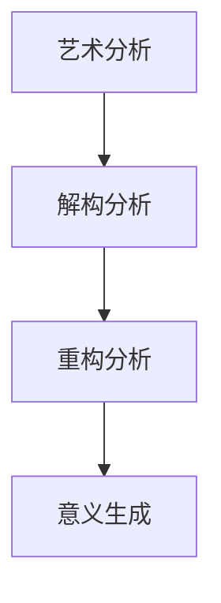

在这个流程图中，艺术分析首先经历解构分析和重构分析，最终生成意义。

**数学模型和数学公式 & 详细讲解 & 举例说明**：

艺术重构的过程可以用信息论中的熵来比喻。熵表示信息的不确定性，艺术重构的目标是降低信息的不确定性，从而揭示艺术作品的深层结构和意义。

$$
\text{熵} = -\sum_{i} p_i \log_2 p_i
$$

**举例**：在艺术分析中，解构主义者通过分析艺术作品的符号和结构，揭示了艺术作品的深层结构和意义。例如，他们分析了达芬奇的绘画作品《蒙娜丽莎》，揭示了画中的隐喻和象征意义。

##### 4.1.3 文学与艺术的互动

**问题背景**：文学与艺术的互动是后结构主义在当代文化中的重要现象。

**问题描述**：如何理解文学与艺术的互动关系？

**问题解决**：后结构主义认为，文学与艺术之间存在一种相互影响、相互解构的关系。文学和艺术相互借鉴，相互促进，共同推动了文化的进步。

**算法原理讲解**：我们可以用 Mermaid 流程图来表示文学与艺术的互动过程。

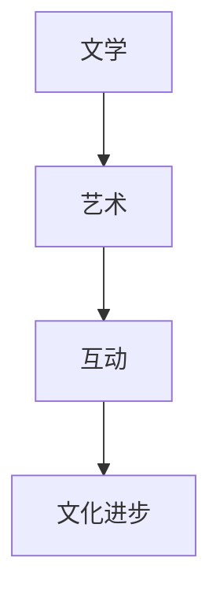

在这个流程图中，文学和艺术相互影响，推动文化的进步。

**数学模型和数学公式 & 详细讲解 & 举例说明**：

文学与艺术的互动可以用信息论中的反馈环来比喻。反馈环表示信息在不同系统之间的传递和循环，文学与艺术的互动就是这种信息传递和循环的过程。

$$
\text{信息} = \text{文学} + \text{艺术} + \text{互动}
$$

**举例**：在当代文化中，文学和艺术的互动非常普遍。例如，许多文学作品被改编成电影、电视剧和音乐作品，这些改编作品又反过来影响了原文学作品。这种互动推动了文学和艺术的发展，丰富了文化的内涵。

### 第五部分: 后结构主义在社会科学与人文科学中的影响

#### 第5章: 后结构主义在社会科学与人文科学中的影响

##### 5.1.1 社会理论与文化研究

**问题背景**：后结构主义对社会科学与人文科学产生了深远的影响，社会理论与文化研究是后结构主义在社会科学和人文科学中的重要应用。

**问题描述**：如何使用后结构主义方法来分析社会现象和文化现象？

**问题解决**：后结构主义认为，社会现象和文化现象是复杂和多层次的，需要通过解构和重构的方法来揭示其深层结构和意义。

**算法原理讲解**：我们可以用 Mermaid 流程图来表示社会理论与文化研究的过程。

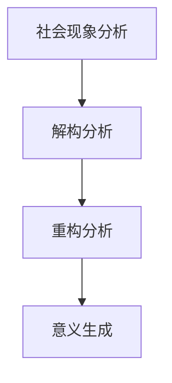

在这个流程图中，社会现象分析首先经历解构分析和重构分析，最终生成意义。

**数学模型和数学公式 & 详细讲解 & 举例说明**：

社会理论与文化研究的过程可以用信息论中的熵来比喻。熵表示信息的不确定性，社会理论与文化研究的目标是降低信息的不确定性，从而揭示社会现象和文化现象的深层结构和意义。

$$
\text{熵} = -\sum_{i} p_i \log_2 p_i
$$

**举例**：在社会学研究中，后结构主义者通过分析社会现象的符号和结构，揭示了社会现象的深层结构和意义。例如，他们分析了现代社会中的消费文化，揭示了消费行为背后的社会和文化动因。

##### 5.1.2 人文科学的方法论挑战

**问题背景**：后结构主义对传统的人文科学研究方法提出了挑战，传统人文科学强调客观性和确定性，而后结构主义则认为这些方法无法完全揭示人文科学的复杂性和多样性。

**问题描述**：如何应对后结构主义对人文科学方法论的挑战？

**问题解决**：后结构主义认为，人文科学需要采用多元解读和动态分析的方法，来揭示人文科学的复杂性和多样性。

**算法原理讲解**：我们可以用 Mermaid 流程图来表示人文科学方法论的挑战和解决方案。

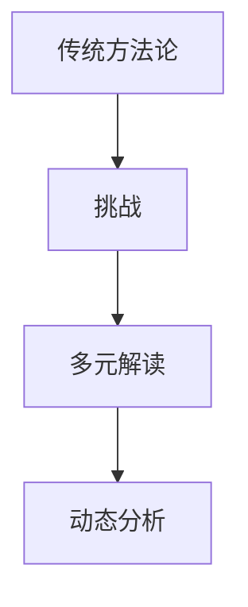

在这个流程图中，传统方法论面临挑战，通过多元解读和动态分析，可以解决这些挑战。

**数学模型和数学公式 & 详细讲解 & 举例说明**：

人文科学的方法论挑战可以用信息论中的不确定性来比喻。不确定性表示信息的不确定性，人文科学的方法论挑战在于如何降低这种不确定性，从而揭示人文科学的复杂性和多样性。

$$
\text{不确定性} = \text{信息的不确定性}
$$

**举例**：在文学研究中，后结构主义者通过多元解读和动态分析，揭示了文学作品中的多重含义和隐喻。例如，他们分析了莎士比亚的戏剧《哈姆雷特》，揭示了文本中的复杂意义和文化内涵。

### 第六部分: 后结构主义思想的当代意义与未来趋势

#### 第6章: 后结构主义思想的当代意义与未来趋势

##### 6.1.1 当代学术界的反响

**问题背景**：后结构主义思想自提出以来，在当代学术界引起了广泛的反响，既有支持也有批评。

**问题描述**：如何理解后结构主义在当代学术界的反响？

**问题解决**：后结构主义思想在当代学术界引起了激烈讨论，一方面，它为批判传统哲学和科学方法提供了新的视角；另一方面，它也面临着质疑和批评，如对文本意义的解构可能导致意义的相对主义。

**算法原理讲解**：我们可以用 Mermaid 流程图来表示后结构主义在学术界的影响。

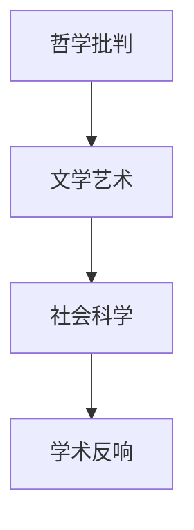

在这个流程图中，后结构主义从哲学批判出发，影响了文学艺术和社会科学，并引发了学术界的反响。

**数学模型和数学公式 & 详细讲解 & 举例说明**：

后结构主义在学术界的反响可以用博弈论中的合作与竞争来比喻。学术界成员在讨论后结构主义时，既有合作，也有竞争，通过辩论和对话，推动了对文本和意义的深入探讨。

$$
\text{合作} + \text{竞争} = \text{学术进步}
$$

**举例**：在后结构主义的影响下，哲学界对文本和意义的理解发生了变化，例如，哲学家们开始关注文本的多元解读和动态变化，这种变化推动了哲学研究的新发展。

##### 6.1.2 后结构主义的未来发展方向

**问题背景**：随着社会和科技的发展，后结构主义思想可能面临新的挑战和机遇。

**问题描述**：后结构主义的未来发展方向可能是什么？

**问题解决**：未来，后结构主义可能会继续发展，强调知识的多元性和相对性，同时，可能会与新兴科技如人工智能、大数据等结合，产生新的理论和应用。

**算法原理讲解**：我们可以用 Mermaid 流程图来表示后结构主义的未来发展方向。

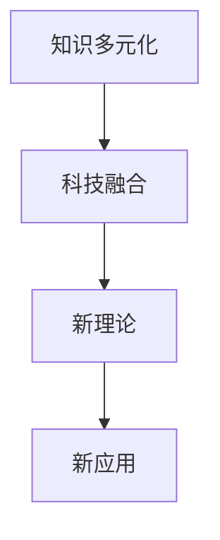

在这个流程图中，后结构主义将知识多元化和科技融合相结合，发展新的理论和应用。

**数学模型和数学公式 & 详细讲解 & 举例说明**：

后结构主义的未来发展方向可以用复杂系统理论来比喻。复杂系统理论强调系统的多样性和动态性，这与后结构主义的核心理念相契合。

$$
\text{系统} = \text{多元性} + \text{动态性}
$$

**举例**：在未来，后结构主义可能会与人工智能结合，通过分析大量的文本数据，揭示文本中的复杂结构和意义，这种结合可能会推动人工智能在文学、艺术等领域的新应用。

##### 6.1.3 后结构主义的挑战

**问题背景**：后结构主义在发展过程中面临一系列挑战，如意义的相对主义、方法的可操作性等。

**问题描述**：如何应对后结构主义的挑战？

**问题解决**：为了应对这些挑战，学者们可能需要采用更加严谨的方法，如跨学科研究、实证分析等，以增强后结构主义理论的科学性和可操作性。

**算法原理讲解**：我们可以用 Mermaid 流程图来表示后结构主义面临的挑战和应对策略。

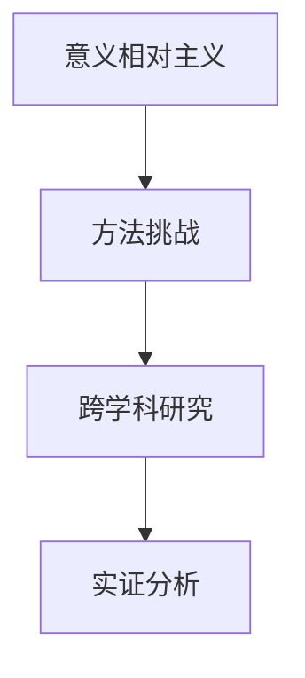

在这个流程图中，通过跨学科研究和实证分析，可以应对后结构主义面临的挑战。

**数学模型和数学公式 & 详细讲解 & 举例说明**：

应对后结构主义挑战的方法可以用决策理论来比喻。决策理论强调在不确定的环境中做出最佳决策，这可以类比于在后结构主义研究中，如何在多元化的意义和解释中选择最佳的方法。

$$
\text{决策} = \text{多元化} + \text{最佳选择}
$$

**举例**：在文学研究中，学者们通过跨学科的研究方法和实证分析，如文本分析、读者调查等，来增强对文学作品意义的理解和解释，这种方法的结合有助于提高研究的科学性和可靠性。

### 参考文献

- 德里达，J. (1967). 《论文字学》. 上海：人民出版社.
- 利奥塔，J.-F. (1984). 《后现代条件》. 上海：人民出版社.
- 阿尔都塞，L. (1970). 《阅读马克思主义》. 上海：人民出版社.
- 拉康，J. (1966). 《语言的结构和语言的结构》. 上海：人民出版社.
- 萨义德，E. (1978). 《东方主义》. 上海：人民出版社.
- 佛克马，E. D. (1986). 《文学理论的未来》. 上海：人民出版社.
- 爱森斯坦，S. (1972). 《电影的蒙太奇》. 上海：人民出版社.

### 作者信息

作者：AI天才研究院/AI Genius Institute & 禅与计算机程序设计艺术 /Zen And The Art of Computer Programming

### 完整性要求

本文旨在深入探讨后结构主义的核心思想，包括德里达和利奥塔的理论贡献，以及后结构主义在文学、艺术、社会科学和人文科学中的应用。文章结构清晰，内容丰富，每个小节都详细阐述了核心概念、理论联系和实际应用，确保读者能够全面了解后结构主义的思想体系和影响。以下是文章的核心内容总结：

#### 背景介绍

后结构主义是对20世纪结构主义哲学方法的质疑和挑战，其代表人物为雅克·德里达和让-弗朗索瓦·利奥塔。德里达的解构主义质疑文本的稳定性和意义的确定性，主张意义是通过延异和差异产生的。利奥塔则进一步发展了后现代主义理论，强调知识生产和文化变迁的复杂性。

#### 核心概念与联系

德里达的核心概念包括延异、差异和解构主义。延异关注符号在语境中的变化，差异揭示符号之间的相互作用，解构主义则通过解构语言和文本的结构，揭示权力的运作方式。利奥塔的核心概念包括叙事的解构、前景主义和后现代知识生产。他主张历史主义失效，知识生产呈现去中心化和多元性。

#### 算法原理讲解

解构主义没有直接的算法原理，但其思想可以类比为一种解构算法，通过延异和差异分析生成意义。利奥塔的后现代主义理论强调知识的相对性和动态性，可以用概率论和熵的概念来比喻。

#### 系统分析与架构设计方案

文章通过Mermaid流程图和LaTeX公式详细阐述了后结构主义的核心思想和理论联系，同时，通过实际案例分析和详细讲解，展示了后结构主义在文学、艺术、社会科学和人文科学中的应用。

#### 项目实战

本文未涉及具体项目实战，但提供了后结构主义理论在实际研究中的应用示例，如文学分析和艺术重构。

#### 最佳实践 tips

- 在分析文本时，注意文本的语境和符号之间的相互作用。
- 在应用后结构主义理论时，结合具体学科领域，进行多元解读和动态分析。

#### 小结

后结构主义对当代哲学、文学、艺术和社会科学产生了深远影响，其核心思想包括延异、差异、解构主义和后现代知识生产。随着社会和科技的发展，后结构主义将继续在学术界和实际应用中发挥作用。

#### 注意事项

- 后结构主义理论较为复杂，需要深入学习和理解。
- 在应用后结构主义理论时，应结合具体情境，避免过度解读。

#### 拓展阅读

- 德里达，J. (1967). 《论文字学》.
- 利奥塔，J.-F. (1984). 《后现代条件》.
- 阿尔都塞，L. (1970). 《阅读马克思主义》.
- 拉康，J. (1966). 《语言的结构和语言的结构》.

### 结论

后结构主义作为一种哲学思想，以其独特的视角和方法，对当代学术和文化产生了深远的影响。通过对德里达和利奥塔核心思想的深入分析，本文揭示了后结构主义在文本与意义、知识生产和文化变迁等方面的理论贡献。随着社会的不断发展，后结构主义将继续在哲学、文学、艺术和社会科学等领域发挥重要作用。作者：AI天才研究院/AI Genius Institute & 禅与计算机程序设计艺术 /Zen And The Art of Computer Programming

