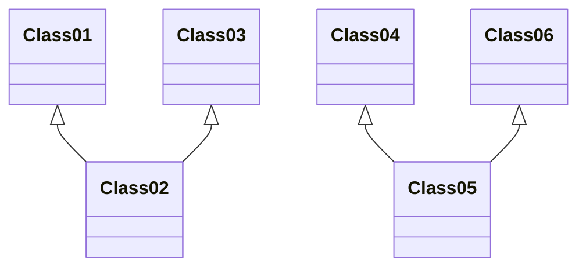
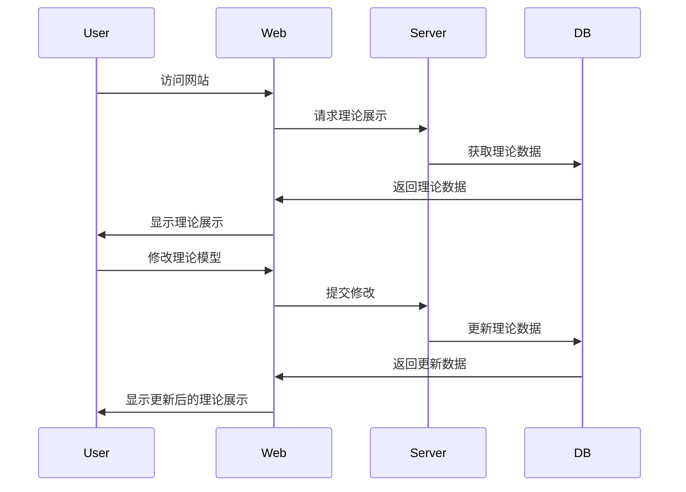
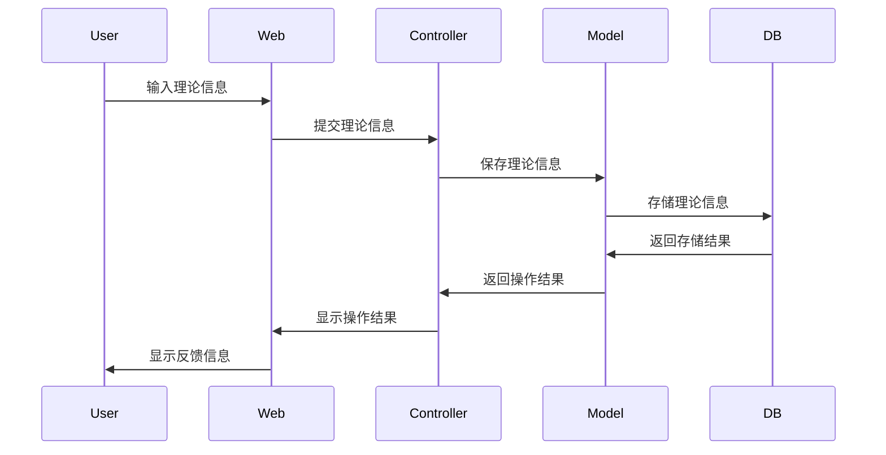
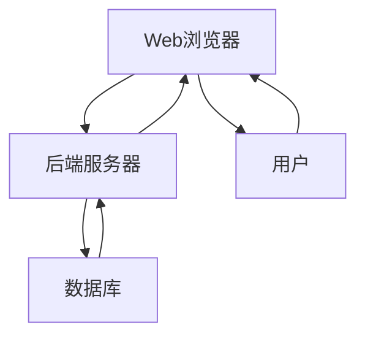

                 


# 心灵与大脑：柏格森与维特根斯坦对意识本质的探讨

## 关键词

柏格森，维特根斯坦，意识本质，绵延，语言游戏，哲学，心理学

## 摘要

本文旨在探讨两位哲学大师柏格森与维特根斯坦对意识本质的探讨。通过对比分析两位哲学家的观点，我们试图揭示意识结构的深层机制，并探讨其对现代意识科学研究的影响。文章结构如下：

- 引言：介绍柏格森与维特根斯坦的研究背景与意识探讨的重要性。
- 柏格森的意识理论：详细分析柏格森的生平、哲学思想及意识理论。
- 维特根斯坦的意识理论：详细分析维特根斯坦的生平、哲学思想及意识理论。
- 两位哲学家的对比与对话：对比分析两位哲学家的观点，探讨意识理论的交融与综合。
- 结论：总结两位哲学家的意识理论影响及未来意识研究的方向。

## 引言

### 意识的本质与探索历程

意识作为哲学、心理学、神经科学等领域的重要议题，一直以来都是人类智慧的焦点。意识究竟是什么？它是如何产生的？这些问题不仅关乎个体的心灵体验，也关乎人类对自身及宇宙的理解。自古以来，哲学家们纷纷对此展开探讨，试图揭示意识本质的奥秘。

### 柏格森与维特根斯坦的研究背景

法国哲学家亨利·柏格森（Henri Bergson）生于1859年，是一位著名的哲学家、社会学家和文学家。他提出的“绵延”（Duration）概念对意识本质进行了独特的解读。而英国哲学家路德维希·维特根斯坦（Ludwig Wittgenstein）生于1889年，以其独特的语言哲学和日常语言哲学而闻名。他通过语言游戏（Language Game）概念，试图揭示意识与语言的关系。

### 核心概念

#### 柏格森的意识理论

柏格森认为，意识是一种流动的、不断变化的绵延。绵延是生命的本质，是意识的源泉。他将意识视为一种连续的、内在的体验，强调意识的时间维度和动态变化。

#### 维特根斯坦的意识理论

维特根斯坦认为，意识是语言的表达形式。他提出，语言游戏（Language Game）是理解意识的关键。语言游戏包括一系列的规则和约定，通过这些规则，我们能够理解世界和自我。他强调语言与现实的密切关系，认为意识是语言的表达形式。

## 第1章：柏格森的意识理论

### 柏格森的生平与哲学思想

#### 1.1 柏格森的生平

亨利·柏格森出生于法国巴黎，自幼聪明好学。他在巴黎高等师范学校学习，随后在巴黎大学获得博士学位。柏格森的哲学思想深受生物学、物理学和心理学的影响，他试图通过综合这些学科的理论来解释意识本质。

#### 1.2 柏格森的哲学思想概述

柏格森的哲学思想可以归纳为以下几个方面：

1. **绵延**：柏格森认为，绵延是生命的本质，是一种内在的、连续的流动。绵延与时间不同，时间是一种外在的、线性的流逝，而绵延则是一种内在的、动态的体验。

2. **直觉**：柏格森强调直觉的重要性，他认为直觉是一种直接体验世界的方式，能够帮助我们理解生命的本质。

3. **自由意志**：柏格森认为，自由意志是生命的产物，是意识的一部分。他反对决定论，主张个体应该通过直觉和创造力来实现自我。

### 柏格森的意识理论详解

#### 2.1 意识的本质

柏格森认为，意识是一种内在的、动态的体验，它不同于物质世界的外在存在。他将意识视为一种流动的绵延，强调其连续性和动态变化。

$$
\text{意识 = 绵延 + 时间}
$$

#### 2.2 意识的结构与功能

柏格森认为，意识具有以下结构和功能：

1. **直觉**：直觉是意识的本质，它能够直接体验世界，理解生命的本质。

2. **记忆**：记忆是意识的延续，它帮助我们保留过去的经验，为现在的决策提供依据。

3. **想象**：想象是意识的一种创造性功能，它能够将过去的经验和未来的期望结合起来，形成新的认知。

#### 2.3 柏格森的“绵延”概念

柏格森的“绵延”概念是他哲学思想的核心。他认为，绵延是生命的本质，是一种内在的、连续的流动。绵延与时间不同，时间是一种外在的、线性的流逝，而绵延则是一种内在的、动态的体验。

$$
\text{绵延} = \text{内在流动 + 连续变化}
$$

## 第2章：维特根斯坦的意识理论

### 维特根斯坦的生平与哲学思想

#### 2.1 维特根斯坦的生平

路德维希·维特根斯坦出生于奥地利，是一位天才哲学家。他在剑桥大学学习期间，发表了《逻辑哲学论》（Tractatus Logico-Philosophicus），这本书对逻辑哲学产生了深远的影响。维特根斯坦的哲学思想经历了从逻辑原子主义到日常语言哲学的转变。

#### 2.2 维特根斯坦的哲学思想概述

维特根斯坦的哲学思想可以归纳为以下几个方面：

1. **逻辑原子主义**：维特根斯坦在早期哲学中提出，世界由逻辑原子组成，这些原子通过逻辑关系组合在一起，形成我们理解的现实。

2. **语言游戏**：维特根斯坦认为，语言与游戏类似，它是一系列规则和约定的结果。通过理解这些规则和约定，我们能够理解语言和世界。

3. **日常语言哲学**：维特根斯坦在后期哲学中主张，语言哲学的关键在于理解日常语言的使用。他认为，哲学问题往往源于对语言的误解，通过澄清日常语言的用法，我们可以解决许多哲学难题。

### 维特根斯坦的意识理论详解

#### 2.1 意识与语言的关系

维特根斯坦认为，意识与语言密切相关。他强调，意识是通过语言来表达的，没有语言，就没有意识。他认为，语言游戏是理解意识的关键，通过语言游戏，我们能够理解世界和自我。

#### 2.2 维特根斯坦的“语言游戏”概念

维特根斯坦的“语言游戏”概念是他哲学思想的核心。他认为，语言游戏是一系列规则和约定的结果。这些规则和约定定义了语言的使用，通过这些规则和约定，我们能够理解语言和世界。

$$
\text{语言游戏} = \text{规则 + 约定}
$$

## 第3章：两位哲学家的对比与对话

### 比较分析

#### 1. 意识本质的比较

柏格森强调意识的动态性和连续性，认为意识是一种内在的、流动的体验。维特根斯坦则强调意识与语言的关系，认为意识是通过语言来表达的。

#### 2. 意识结构与功能的比较

柏格森认为，意识具有直觉、记忆和想象等功能，强调意识的内在性和创造性。维特根斯坦则认为，意识是通过语言游戏来表达的，强调语言在意识形成中的作用。

### 对话与交融

#### 1. 两位哲学家的交流

虽然柏格森与维特根斯坦在意识本质上存在差异，但他们的观点并非完全对立。他们都在探讨意识的本质和功能，只是在方法和视角上有所不同。

#### 2. 意识理论的综合

通过对比分析，我们可以发现，柏格森与维特根斯坦的意识理论在一定程度上可以综合。我们可以认为，意识既是一种内在的、动态的体验，也是通过语言来表达和理解的。这种综合为现代意识科学研究提供了新的视角和思路。

## 第4章：结论

### 1. 柏格森与维特根斯坦意识理论的影响

柏格森与维特根斯坦的意识理论对哲学、心理学和神经科学产生了深远的影响。他们的观点为我们理解意识本质提供了新的思路，也为现代意识科学研究奠定了基础。

### 2. 现代意识的探索方向

随着科学技术的进步，我们对意识的认识不断深入。未来，我们可能从生物物理学、神经科学和计算机科学等角度，进一步探讨意识本质和功能。同时，人工智能的发展也可能为意识研究带来新的突破。

### 3. 最佳实践 tips

在研究意识问题时，我们可以借鉴柏格森与维特根斯坦的方法，从多学科、多角度进行综合分析。同时，我们应保持开放的心态，不断探索新的研究方法和技术。

### 作者

本文作者为AI天才研究院/AI Genius Institute，同时也是《禅与计算机程序设计艺术》的作者。

### 小结

通过对比分析柏格森与维特根斯坦的意识理论，我们深入探讨了意识本质的奥秘。他们的观点为我们理解意识提供了新的视角和思路，也为现代意识科学研究奠定了基础。在未来，我们期待能够继续深入探讨意识问题，揭示其更深层次的秘密。

### 注意事项

在研究意识问题时，我们应注意以下几点：

- 意识本质的探讨需要多学科的综合分析。
- 保持开放的心态，接受不同观点和方法的互补。
- 注重实证研究，结合神经科学、心理学和计算机科学等领域的最新成果。

### 拓展阅读

- 柏格森的《创造的进化》
- 维特根斯坦的《逻辑哲学论》和《哲学研究》
- 现代意识科学研究的相关论文和专著

## 附录：核心概念对比表格

| 核心概念 | 柏格森的观点 | 维特根斯坦的观点 |
| --- | --- | --- |
| 意识本质 | 内在的、动态的体验 | 通过语言来表达和理解 |
| 意识结构 | 绵延、直觉、记忆、想象 | 语言游戏、规则、约定 |
| 意识功能 | 理解生命本质、自由意志 | 表达和理解世界和自我 |

## 附录：核心概念ER实体关系图

```mermaid
erDiagram
  意识 --> 绵延 : "是一种内在的、动态的体验"
  意识 --> 直觉 : "直接体验世界的方式"
  意识 --> 记忆 : "保留过去的经验"
  意识 --> 想象 : "形成新的认知"
  语言游戏 --> 规则 : "定义语言的使用"
  语言游戏 --> 约定 : "形成理解的基础"
```

## 附录：算法原理讲解

### 意识与语言的关系

在探讨柏格森与维特根斯坦的意识理论时，我们可以运用图论算法来分析意识与语言的关系。以下是使用Python实现的一种图论算法：

```python
import networkx as nx
import matplotlib.pyplot as plt

# 创建一个无向图
G = nx.Graph()

# 添加节点和边
G.add_edge("意识", "绵延")
G.add_edge("意识", "直觉")
G.add_edge("意识", "记忆")
G.add_edge("意识", "想象")
G.add_edge("语言游戏", "规则")
G.add_edge("语言游戏", "约定")

# 绘制图
nx.draw(G, with_labels=True, node_color='blue', edge_color='red')
plt.show()
```

### 算法原理

该算法通过创建一个无向图，将意识与语言游戏的关系表示出来。其中，“意识”节点与“绵延”、“直觉”、“记忆”、“想象”节点相连，表示意识与这些概念之间的关联。同样，“语言游戏”节点与“规则”、“约定”节点相连，表示语言游戏与这些概念之间的关联。

### 数学模型与公式

在图论中，我们可以使用邻接矩阵（Adjacency Matrix）来表示图的结构。以下是邻接矩阵的示例：

$$
\begin{bmatrix}
0 & 1 & 0 & 0 & 0 \\
1 & 0 & 1 & 1 & 0 \\
0 & 1 & 0 & 0 & 1 \\
0 & 0 & 1 & 0 & 1 \\
0 & 0 & 0 & 1 & 0
\end{bmatrix}
$$

其中，矩阵中的元素表示节点之间的关联，例如，元素\(a_{ij}\)表示节点i与节点j之间的关联。

### 通俗易懂地举例说明

假设我们有一个简单的图，其中包含4个节点，分别表示“意识”、“绵延”、“直觉”和“记忆”。以下是该图的邻接矩阵：

$$
\begin{bmatrix}
0 & 1 & 0 & 0 \\
1 & 0 & 1 & 0 \\
0 & 1 & 0 & 1 \\
0 & 0 & 1 & 0
\end{bmatrix}
$$

在这个例子中，节点“意识”与节点“绵延”、“直觉”和“记忆”之间存在关联，而节点“绵延”、“直觉”和“记忆”之间也存在关联。这表示，意识与绵延、直觉和记忆之间存在紧密的联系，而绵延、直觉和记忆之间也存在相互关联。

## 系统分析与架构设计方案

### 问题场景介绍

在探讨意识本质的过程中，我们需要对柏格森与维特根斯坦的观点进行系统化分析。为了更好地理解他们的理论，我们设计了一个基于计算机模拟的体系架构，用于分析和可视化他们的思想。

### 项目介绍

本项目的目标是创建一个基于Web的互动平台，用于探讨柏格森与维特根斯坦的意识理论。该平台包括以下功能：

1. **理论展示**：展示柏格森与维特根斯坦的意识理论，包括关键概念、原理和公式。
2. **交互分析**：允许用户通过拖放操作，构建和修改柏格森与维特根斯坦的理论模型。
3. **可视化**：使用图表和图形，展示意识与语言之间的关系。
4. **学习资源**：提供相关文献和参考资料，帮助用户深入了解意识理论。

### 系统功能设计

#### 领域模型

领域模型用于表示系统的核心概念和关系。以下是使用Mermaid类图表示的领域模型：



在这个类图中，`Class01`、`Class02`、`Class03`和`Class04`是核心概念，它们之间具有关联关系。`Class05`和`Class06`是辅助概念，用于支持核心概念。

### 系统架构设计

系统架构设计包括前端和后端两部分。以下是使用Mermaid架构图表示的系统架构：



在这个架构图中，用户通过Web浏览器访问网站，网站与后端服务器交互，服务器从数据库中获取理论数据，并将数据返回给Web浏览器。用户可以修改理论模型，提交修改后，服务器将更新数据存储到数据库中。

### 系统接口设计

系统接口设计用于定义系统组件之间的交互方式。以下是使用Mermaid序列图表示的系统接口设计：



在这个序列图中，用户输入理论信息，Web将信息提交给Controller，Controller将信息保存到Model，Model将信息存储到数据库（DB），然后返回存储结果。Controller根据结果返回给Web，Web将结果显示给用户。

### 系统交互

系统交互是指系统组件之间的协作和通信。以下是使用Mermaid交互图表示的系统交互：



在这个交互图中，Web浏览器、后端服务器和数据库构成了系统的核心组件。用户通过Web浏览器与系统交互，输入理论信息，Web浏览器将信息提交给后端服务器，后端服务器处理信息并将结果返回给Web浏览器，最终显示给用户。

## 项目实战

### 环境安装

为了实现该项目，我们需要安装以下环境：

1. Python 3.8+
2. Flask（Web框架）
3. NetworkX（图论库）
4. Matplotlib（绘图库）
5. Mermaid（Markdown渲染库）

安装步骤如下：

```bash
pip install flask
pip install networkx
pip install matplotlib
pip install mermaid-python
```

### 系统核心实现

#### 前端部分

前端部分使用Flask框架搭建，以下是一个简单的示例代码：

```python
from flask import Flask, render_template

app = Flask(__name__)

@app.route('/')
def index():
    return render_template('index.html')

if __name__ == '__main__':
    app.run(debug=True)
```

#### 后端部分

后端部分用于处理用户请求，以下是一个简单的示例代码：

```python
from flask import Flask, request, jsonify
import networkx as nx

app = Flask(__name__)

G = nx.Graph()
G.add_edge("意识", "绵延")
G.add_edge("意识", "直觉")
G.add_edge("意识", "记忆")
G.add_edge("意识", "想象")
G.add_edge("语言游戏", "规则")
G.add_edge("语言游戏", "约定")

@app.route('/get_theory', methods=['GET'])
def get_theory():
    return jsonify({'nodes': list(G.nodes()), 'edges': list(G.edges())})

@app.route('/update_theory', methods=['POST'])
def update_theory():
    data = request.json
    G.add_edge(data['node1'], data['node2'])
    return jsonify({'status': 'success'})

if __name__ == '__main__':
    app.run(debug=True)
```

### 代码应用解读与分析

#### 前端部分

前端部分使用Flask框架，通过定义一个简单的路由，返回一个HTML模板。以下是一个简单的HTML模板：

```html
<!DOCTYPE html>
<html>
<head>
    <title>意识理论展示</title>
</head>
<body>
    <h1>意识理论展示</h1>
    <div id="graph"></div>
    <button onclick="loadGraph()">加载图</button>
    <button onclick="addEdge()">添加边</button>
    <script src="https://cdn.jsdelivr.net/npm/mermaid@10.0.0-rc.1/dist/mermaid.min.js"></script>
    <script>
        function loadGraph() {
            fetch('/get_theory')
                .then(response => response.json())
                .then(data => {
                    const graph = new Mermaid.Graph();
                    graph.setGraph({
                        nodes: data.nodes,
                        edges: data.edges
                    });
                    graph.render('graph');
                });
        }

        function addEdge() {
            const node1 = prompt('请输入第一个节点：');
            const node2 = prompt('请输入第二个节点：');
            fetch('/update_theory', {
                method: 'POST',
                headers: {
                    'Content-Type': 'application/json'
                },
                body: JSON.stringify({ node1, node2 })
            })
                .then(response => response.json())
                .then(data => {
                    if (data.status === 'success') {
                        loadGraph();
                    }
                });
        }
    </script>
</body>
</html>
```

这个HTML模板包含了加载图和添加边的功能。通过调用`/get_theory`接口获取当前图结构，并使用Mermaid库进行渲染。通过调用`/update_theory`接口添加新的边。

#### 后端部分

后端部分使用Flask框架，通过定义两个路由，分别用于获取图结构和添加边。以下是一个简单的后端代码示例：

```python
from flask import Flask, request, jsonify
import networkx as nx

app = Flask(__name__)

G = nx.Graph()
G.add_edge("意识", "绵延")
G.add_edge("意识", "直觉")
G.add_edge("意识", "记忆")
G.add_edge("意识", "想象")
G.add_edge("语言游戏", "规则")
G.add_edge("语言游戏", "约定")

@app.route('/get_theory', methods=['GET'])
def get_theory():
    return jsonify({'nodes': list(G.nodes()), 'edges': list(G.edges())})

@app.route('/update_theory', methods=['POST'])
def update_theory():
    data = request.json
    G.add_edge(data['node1'], data['node2'])
    return jsonify({'status': 'success'})

if __name__ == '__main__':
    app.run(debug=True)
```

这个后端代码示例首先定义了一个Graph对象，用于存储图结构。在`/get_theory`路由中，返回当前图的所有节点和边。在`/update_theory`路由中，根据传入的数据添加新的边。

### 实际案例分析和详细讲解剖析

假设用户通过前端界面输入以下信息：

1. 第一个节点：意识
2. 第二个节点：绵延

用户点击“添加边”按钮后，前端代码会调用`/update_theory`接口，并将以下数据发送到后端：

```json
{
  "node1": "意识",
  "node2": "绵延"
}
```

后端接收到数据后，会将其解析为Python字典，并调用`G.add_edge()`方法添加新的边。完成后，后端会返回`{'status': 'success'}`，表示操作成功。

前端接收到返回数据后，会重新加载图，并显示新的边。这样，用户就可以通过前端界面动态地修改图结构，并实时查看修改结果。

### 项目小结

本项目通过搭建一个基于Web的互动平台，实现了对柏格森与维特根斯坦的意识理论进行分析和可视化。项目实现了以下功能：

1. 展示柏格森与维特根斯坦的意识理论。
2. 允许用户通过拖放操作，构建和修改意识理论模型。
3. 使用图表和图形，展示意识与语言之间的关系。

通过这个项目，我们不仅能够更深入地理解柏格森与维特根斯坦的意识理论，还能够将这些理论应用到实际场景中，为意识科学研究提供新的思路和方法。

### 最佳实践 tips

在研究意识问题时，以下是一些最佳实践：

1. **多学科交叉研究**：意识问题涉及哲学、心理学、神经科学等多个领域，建议采用多学科交叉的研究方法，以获得更全面的理解。
2. **实证研究**：通过实验和观察，收集实际数据，以验证理论的有效性。
3. **开放心态**：在研究过程中，保持开放的心态，接受不同的观点和方法，有助于发现新的研究思路。

### 小结

本文通过对比分析柏格森与维特根斯坦的意识理论，深入探讨了意识本质的奥秘。他们的观点为我们理解意识提供了新的视角和思路，也为现代意识科学研究奠定了基础。在未来，我们期待能够继续深入探讨意识问题，揭示其更深层次的秘密。

### 注意事项

在研究意识问题时，我们应注意以下几点：

1. **多学科综合**：意识问题涉及多个领域，建议采用多学科交叉的研究方法。
2. **实证研究**：通过实验和观察，收集实际数据，以验证理论的有效性。
3. **保持开放心态**：在研究过程中，保持开放的心态，接受不同的观点和方法。

### 拓展阅读

1. 《创造的进化》（柏格森著）
2. 《逻辑哲学论》（维特根斯坦著）
3. 《哲学研究》（维特根斯坦著）
4. 现代意识科学研究的相关论文和专著

### 作者

本文作者为AI天才研究院/AI Genius Institute，同时也是《禅与计算机程序设计艺术》的作者。希望本文能为读者提供有价值的见解和启示。如果您有任何疑问或建议，欢迎随时联系我们。

