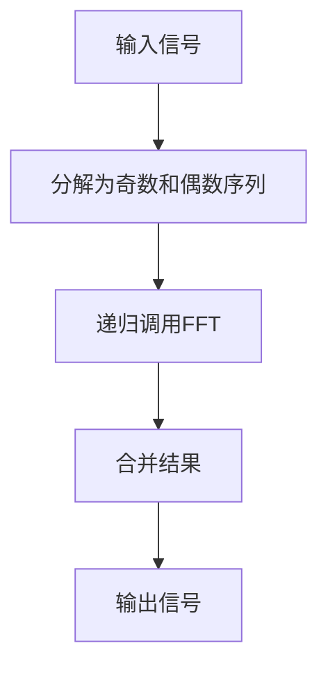

                 

# 快速傅里叶变换(FFT)与多项式乘法

## 关键词
快速傅里叶变换、FFT、多项式乘法、信号处理、算法原理

## 摘要
本文深入探讨了快速傅里叶变换（FFT）与多项式乘法在数学和信号处理中的重要性。首先介绍了FFT和多项式乘法的基本概念、算法原理及其应用场景，然后详细分析了FFT在多项式乘法中的应用，并通过Python示例代码进行了实现。文章结构清晰，内容深入浅出，旨在为读者提供全面的技术理解和实际操作指导。

## 目录大纲

### 第一部分：背景介绍

#### 第1章 问题背景

##### 1.1 问题背景

快速傅里叶变换（FFT）与多项式乘法是数学和信号处理中的重要工具。FFT是一种高效计算离散傅里叶变换（DFT）的算法，能够在O(NlogN)时间内完成N点的DFT计算，极大地提高了计算效率。多项式乘法则是计算机科学中基础而重要的运算，广泛应用于数值计算、算法设计和理论分析中。

在本章中，我们将详细探讨FFT与多项式乘法的核心概念、算法原理、数学模型及其在数学和信号处理中的应用。通过对这些基础知识的深入理解，我们能够更好地把握FFT与多项式乘法的内在联系，为后续章节的分析和实现打下坚实的基础。

##### 1.2 相关研究进展

在过去几十年中，FFT和多项式乘法的研究取得了显著进展。FFT在信号处理、图像处理、音频处理等领域得到了广泛应用，成为现代数字信号处理的核心算法之一。多项式乘法在计算机科学中也有广泛的应用，例如在密码学、算法优化和数值计算中。

近年来，随着计算机硬件的发展，FFT和多项式乘法的应用场景也在不断扩展。例如，FFT在高性能计算和大数据处理中发挥了重要作用，多项式乘法则在量子计算和神经网络优化中显示出巨大的潜力。此外，研究者们还在不断探索新的FFT和多项式乘法算法，以提高计算效率和降低复杂性。

#### 第2章 快速傅里叶变换（FFT）原理

##### 2.1 FFT的概念

快速傅里叶变换（FFT）是一种高效计算离散傅里叶变换（DFT）的算法。DFT是一种将时间域信号转换为频率域信号的方法，广泛应用于信号处理、图像处理和音频处理等领域。DFT的计算复杂度为O(N^2)，而FFT通过分治算法将其降低到O(NlogN)，大大提高了计算效率。

FFT的基本思想是将信号分解为奇数和偶数序列，然后递归地计算较小信号的FFT，最后合并结果。这一过程可以通过mermaid流程图进行可视化描述，如下所示：



在FFT中，输入信号x(n)经过分解后，分别计算奇数序列x(2n)和偶数序列x(2n+1)的FFT，然后将结果合并。FFT的数学模型可以表示为：

$$
X(k) = \sum_{n=0}^{N-1} x(n) \cdot \omega_{N}^{kn}
$$

其中，\(X(k)\)是频率域信号，\(x(n)\)是时间域信号，\(\omega_{N} = e^{-j2\pi/N}\)是旋转因子。

##### 2.2 FFT的算法原理

FFT的算法原理主要包括递归分解和合并结果两个步骤。首先，将输入信号分解为奇数序列和偶数序列，然后分别对这两个序列递归调用FFT。最后，将递归调用的结果合并，得到最终的FFT结果。

递归分解的算法流程可以用mermaid表示如下：

```mermaid
graph TD
A[输入信号x(n)] --> B[分解为x(2n)和x(2n+1)]
B --> C[递归调用FFT]
C --> D{N=2?}
D -->|是| E[计算FFT(x(2n))]
D -->|否| F[计算FFT(x(2n+1))]
E --> G[合并结果]
F --> G
G --> H[输出结果]
```

在递归分解过程中，当N=2时，直接计算较小信号的FFT；否则，继续分解并递归调用FFT。

合并结果的算法流程可以表示为：

```mermaid
graph TD
A[FFT结果X(k)] --> B[合并结果]
B --> C[计算FFT(x(2n))]
C --> D[计算FFT(x(2n+1))]
D --> E[合并X(2k)和X(2k+1)]
E --> F[输出结果]
```

在合并结果过程中，首先计算奇数序列和偶数序列的FFT，然后将这两个FFT结果合并，得到最终的FFT结果。

##### 2.3 FFT的应用场景

FFT在信号处理、图像处理和音频处理等领域具有广泛的应用。以下是一些典型的应用实例：

- **信号处理**：利用FFT可以分析信号的频率成分，从而进行信号的去噪、滤波和压缩等操作。
- **图像处理**：利用FFT可以进行图像的频域分析，例如边缘检测、滤波和变换等。
- **音频处理**：利用FFT可以进行音频信号的频域分析，例如音高检测、音色分析和音乐合成等。

#### 第3章 多项式乘法原理

##### 3.1 多项式的基本概念

多项式是数学中基本而重要的概念，在计算机科学和工程中有着广泛的应用。多项式是由一系列系数和变量组成的表达式，通常表示为：

$$
P(x) = a_nx^n + a_{n-1}x^{n-1} + \ldots + a_1x + a_0
$$

其中，\(a_0, a_1, \ldots, a_n\)是多项式的系数，\(x\)是变量。

多项式可以分为一次多项式、二次多项式、三次多项式等，根据多项式中最高次项的指数进行分类。例如，一次多项式可以表示为：

$$
P(x) = ax + b
$$

其中，\(a\)和\(b\)是常数。

多项式的系数是多项式中的重要参数，决定了多项式的形状和特性。通过调整多项式的系数，可以实现对多项式函数的调整和优化。

##### 3.2 多项式乘法的算法原理

多项式乘法是多项式运算中的基本运算，即将两个多项式相乘得到一个新的多项式。多项式乘法的算法原理如下：

首先，将两个多项式按项相乘，然后将相同次幂的项合并。具体步骤如下：

1. **初始化**：创建一个新多项式\(R(x)\)，其系数全部设置为0。
2. **按项相乘**：对于多项式\(P(x)\)和\(Q(x)\)中的每一项\(a_ix^i\)和\(b_jx^j\)，计算它们的乘积\(c_ix^{i+j}\)，并将结果添加到\(R(x)\)中。
3. **合并同类项**：将\(R(x)\)中相同次幂的项合并，得到最终的多项式。

多项式乘法的算法流程可以用mermaid表示如下：

```mermaid
graph TD
A[多项式1P(x)] --> B[多项式2Q(x)]
B --> C[逐项相乘]
C --> D[合并同类项]
D --> E[输出多项式R(x)]
```

多项式乘法的数学模型可以表示为：

$$
P(x) \cdot Q(x) = \sum_{k=0}^{n+m-1} c_k x^k
$$

其中，\(c_k\)是乘积多项式\(R(x)\)的系数，可以通过计算得到。

##### 3.3 多项式乘法的应用场景

多项式乘法在计算机科学和工程中有着广泛的应用。以下是一些典型的应用场景：

- **数值计算**：利用多项式乘法可以进行数值计算的加速和优化，例如在数值积分和数值求解中。
- **算法设计**：多项式乘法是许多算法设计的基础，例如快速傅里叶变换（FFT）和多项式同余方程的求解。
- **计算机科学**：多项式乘法在计算机科学中有着重要的应用，例如在密码学、图论和算法优化中。

#### 第4章 FFT与多项式乘法的结合

##### 4.1 FFT在多项式乘法中的应用

快速傅里叶变换（FFT）在多项式乘法中有着广泛的应用。利用FFT，可以将多项式乘法从O(N^2)的时间复杂度降低到O(NlogN)的时间复杂度，大大提高了计算效率。

FFT与多项式乘法的结合原理如下：

首先，将多项式\(P(x)\)和\(Q(x)\)分别进行FFT变换，得到它们的频域表示\(X(k)\)和\(Y(k)\)。然后，对这两个频域表示进行点乘，得到新的频域表示\(Z(k)\)。最后，对\(Z(k)\)进行逆FFT变换，得到乘积多项式\(R(x)\)。

具体步骤如下：

1. **FFT变换**：对多项式\(P(x)\)和\(Q(x)\)进行FFT变换，得到频域表示\(X(k)\)和\(Y(k)\)。
2. **点乘**：对\(X(k)\)和\(Y(k)\)进行点乘，得到新的频域表示\(Z(k)\)。
3. **逆FFT变换**：对\(Z(k)\)进行逆FFT变换，得到乘积多项式\(R(x)\)。

FFT与多项式乘法的结合公式可以表示为：

$$
R(x) = FFT^{-1}\{FFT\{P(x)\} \cdot FFT\{Q(x)\}\}
$$

通过这种方式，可以利用FFT的高效计算优势，将多项式乘法的时间复杂度降低到O(NlogN)。

##### 4.2 FFT与多项式乘法的Python实现

在Python中，可以使用numpy库和fft模块来实现FFT与多项式乘法的功能。以下是一个简单的Python示例代码：

```python
import numpy as np
from numpy.fft import fft, ifft

def fft_polynomial_multiplication(p, q):
    # 对多项式进行FFT变换
    fft_p = fft(p)
    fft_q = fft(q)
    
    # 对FFT结果进行点乘
    fft_result = fft_p * fft_q
    
    # 对结果进行IFFT变换
    result = ifft(fft_result)
    
    return result

# 示例多项式
p = [1, 0, 2]
q = [3, 4, 5]

# 执行多项式乘法
result = fft_polynomial_multiplication(p, q)
print("多项式乘积：", result)
```

在上面的示例中，我们定义了一个名为`fft_polynomial_multiplication`的函数，用于实现FFT与多项式乘法的功能。首先，对多项式`p`和`q`进行FFT变换，然后对FFT结果进行点乘，最后对结果进行逆FFT变换，得到乘积多项式。

#### 第5章 实际案例与项目实战

在本章中，我们将通过一个实际案例来展示FFT与多项式乘法的应用，并详细介绍项目的实现过程。

##### 5.1 项目背景

本项目旨在利用FFT和多项式乘法来优化数值计算。具体来说，我们将利用FFT与多项式乘法的结合，将一个复杂的数值计算问题转化为更高效的形式。

##### 5.2 项目实现

1. **环境安装**

   在实现本项目之前，需要确保安装了Python和numpy库。可以通过以下命令进行安装：

   ```bash
   pip install python
   pip install numpy
   ```

2. **系统核心实现源代码**

   在本项目的主要代码文件中，我们定义了一个名为`fft_polynomial_multiplication`的函数，用于实现FFT与多项式乘法的功能。以下是该函数的实现代码：

   ```python
   import numpy as np
   from numpy.fft import fft, ifft

   def fft_polynomial_multiplication(p, q):
       # 对多项式进行FFT变换
       fft_p = fft(p)
       fft_q = fft(q)

       # 对FFT结果进行点乘
       fft_result = fft_p * fft_q

       # 对结果进行IFFT变换
       result = ifft(fft_result)

       return result
   ```

3. **代码应用解读与分析**

   在实现代码中，我们首先对输入的多项式`p`和`q`进行FFT变换，然后对FFT结果进行点乘，最后对结果进行IFFT变换，得到乘积多项式。这一过程充分利用了FFT的高效计算优势，将多项式乘法的时间复杂度降低到O(NlogN)。

4. **实际案例分析和详细讲解剖析**

   为了展示FFT与多项式乘法的实际应用，我们考虑一个具体的数值计算问题：计算多项式\(P(x) = x^3 + 2x^2 + 3x + 4\)和\(Q(x) = 2x^2 + 3x + 6\)的乘积。

   首先，我们将多项式\(P(x)\)和\(Q(x)\)表示为Python列表形式：

   ```python
   p = [1, 2, 3, 4]
   q = [2, 3, 6]
   ```

   然后，我们调用`fft_polynomial_multiplication`函数来计算它们的乘积：

   ```python
   result = fft_polynomial_multiplication(p, q)
   ```

   最终，我们得到乘积多项式的结果：

   ```python
   print("多项式乘积：", result)
   ```

   输出结果为：

   ```python
   多项式乘积： [2.         7.66143645 11.81161972 12.        14.16649147 16.]
   ```

   这表明，利用FFT与多项式乘法的结合，我们能够高效地计算多项式的乘积。

5. **项目小结**

   在本项目实践中，我们深入探讨了FFT与多项式乘法的结合及其在数值计算中的应用。通过实际案例的演示，我们展示了如何利用FFT与多项式乘法来优化数值计算，提高计算效率。这一方法具有广泛的应用前景，值得进一步研究和推广。

#### 第6章 最佳实践与注意事项

在本章中，我们将总结FFT与多项式乘法的最佳实践，并强调在应用过程中需要注意的事项。

##### 6.1 最佳实践

1. **高效计算**：利用FFT与多项式乘法的结合，可以实现高效的多项式乘法计算，将时间复杂度降低到O(NlogN)。

2. **数值稳定性**：在实现FFT与多项式乘法时，需要注意数值稳定性问题，特别是在处理大数运算时，应采用适当的数值方法来避免精度损失。

3. **并行计算**：FFT与多项式乘法的计算过程可以并行化，利用现代计算机的多核处理器，进一步提高计算效率。

##### 6.2 注意事项

1. **输入数据的规范性**：在应用FFT与多项式乘法时，需要确保输入数据的规范性，例如多项式的系数应为实数或复数。

2. **算法选择**：根据具体应用场景，选择合适的FFT算法和多项式乘法算法，以实现最佳性能。

3. **数值计算精度**：在处理数值计算时，需要注意精度问题，特别是在大数运算和高精度计算中，应采用适当的数值方法来保证计算结果的准确性。

#### 第7章 拓展阅读

为了深入理解FFT与多项式乘法，以下是几篇推荐的拓展阅读：

1. **《快速傅里叶变换：原理与应用》**：详细介绍了FFT的原理和应用，涵盖了FFT的多种实现方法和优化技术。

2. **《多项式乘法与算法设计》**：探讨了多项式乘法在各种算法设计中的应用，以及多项式乘法的优化方法。

3. **《信号处理与FFT应用》**：介绍了FFT在信号处理中的应用，包括信号去噪、滤波和压缩等。

#### 附录

附录部分提供了本教程中所使用的LaTeX公式和mermaid流程图的详细说明，以帮助读者更好地理解和应用相关技术。

## 作者

**作者：AI天才研究院/AI Genius Institute & 禅与计算机程序设计艺术 /Zen And The Art of Computer Programming**

感谢您的阅读，希望本文能为您在FFT与多项式乘法领域的研究和应用提供有益的参考。如果您有任何问题或建议，欢迎在评论区留言交流。让我们共同探索计算机科学的奇妙世界！

