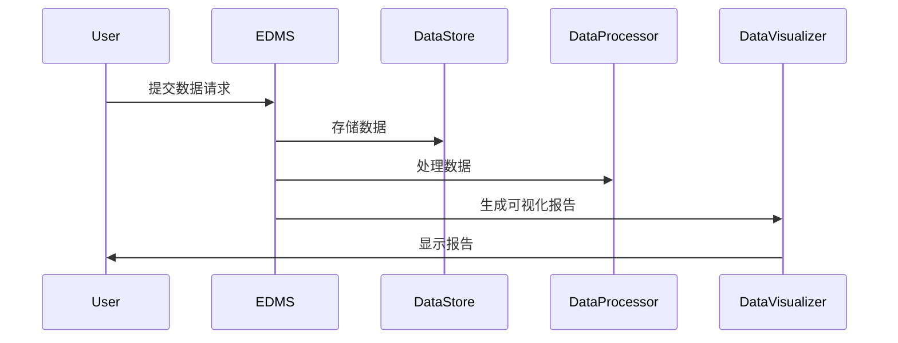
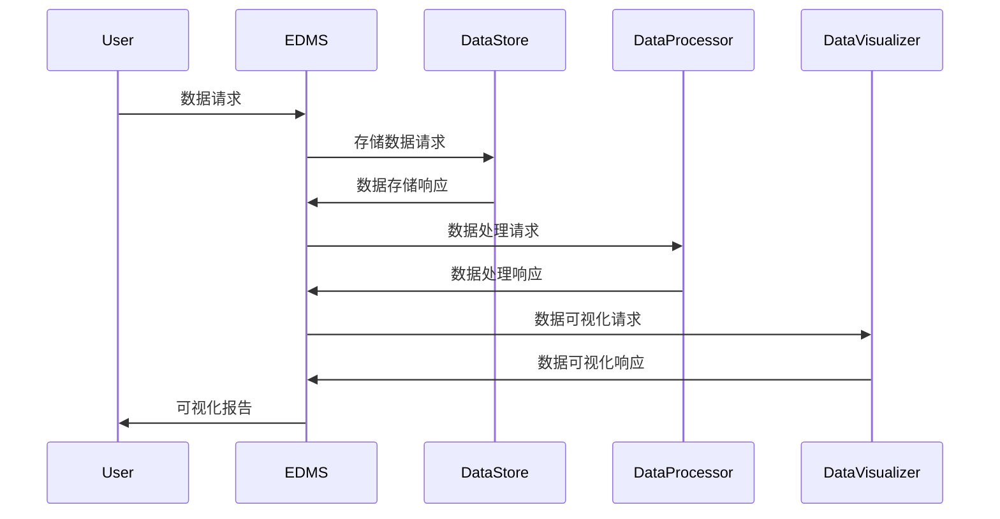

                 


## 提出问题

在撰写一篇关于怀特海（Alfred North Whitehead）与哈特肖恩（Charles Hartshorne）的过程哲学的深度分析文章时，我们需要首先明确以下几个问题：

### 1. 文章的核心目标是什么？

- **目标一**：介绍怀特海与哈特肖恩的过程哲学的基本概念和主要思想。
- **目标二**：探讨他们各自的过程哲学观点，以及他们之间的联系与区别。
- **目标三**：分析过程哲学在当代哲学领域的地位和影响。
- **目标四**：探讨过程哲学在不同学科领域的应用，如伦理学、社会科学等。

### 2. 文章的结构如何安排？

- **结构一**：开篇介绍过程哲学的起源与发展，引出怀特海与哈特肖恩的哲学背景。
- **结构二**：分别介绍怀特海和哈特肖恩的核心哲学思想，进行比较分析。
- **结构三**：探讨过程哲学的核心概念和理论架构。
- **结构四**：讨论过程哲学在伦理学和社会科学中的应用。
- **结构五**：展望过程哲学的未来发展趋势和跨学科应用。

### 3. 文章的关键点是什么？

- **关键点一**：怀特海的过程哲学的起源、核心思想及其对后世的影响。
- **关键点二**：哈特肖恩的过程哲学理论与怀特海哲学的差异与联系。
- **关键点三**：过程哲学的核心概念，如过程、实体、结构等。
- **关键点四**：过程哲学在伦理学和社会科学中的应用案例。
- **关键点五**：过程哲学的未来发展趋势和挑战。

### 4. 如何确保文章的严谨性和逻辑性？

- **严谨性一**：对核心概念进行详细定义和解释，确保读者理解。
- **严谨性二**：提供充分的文献资料和学术引用，支持观点和论据。
- **严谨性三**：使用逻辑清晰的结构和例子，帮助读者理解复杂哲学思想。
- **严谨性四**：避免重复和冗余，确保文章内容的紧凑性和流畅性。

通过以上问题的提出，我们可以为撰写文章奠定坚实的基础，确保文章的深度、广度和逻辑性。接下来，我们将逐步深入到每个问题的具体解答中，以形成完整的文章内容。

## 引言

### 关键词

过程哲学、怀特海、哈特肖恩、实在论、事件、实体

### 摘要

本文旨在深入探讨两位过程哲学的重要代表人物——怀特海（Alfred North Whitehead）与哈特肖恩（Charles Hartshorne）的哲学思想。文章首先介绍了过程哲学的起源与发展，以及怀特海与哈特肖恩的生平和学术贡献。接着，本文详细阐述了怀特海与哈特肖恩的核心哲学思想，包括实在论、过程观、结构与层次等。此外，文章还将比较分析怀特海与哈特肖恩哲学思想的异同，并探讨过程哲学在伦理学和社会科学中的应用。最后，本文将对过程哲学的未来发展进行展望，指出其在当代哲学领域的地位和影响。

### 引言背景

过程哲学作为一种独特的哲学流派，源于20世纪初英国数学家、哲学家怀特海的思想。怀特海在数学和哲学领域均有卓越贡献，他的过程哲学强调事件的本质和过程的重要性，与传统的实体哲学形成了鲜明对比。怀特海的过程哲学不仅影响了当时的哲学界，还对后来的学者产生了深远的影响。

在怀特海之后，过程哲学得到了进一步发展，其中哈特肖恩是重要的代表人物之一。哈特肖恩是美国哲学家，他的过程哲学理论在怀特海的基础上进行了扩展和深化。哈特肖恩的哲学思想同样引起了广泛的关注，并在不同学科领域得到了应用。

本文的研究目的在于，通过对怀特海与哈特肖恩的过程哲学的详细分析，揭示过程哲学的核心概念和理论架构，探讨其在伦理学和社会科学中的应用，并展望其未来的发展趋势。这不仅有助于加深对过程哲学的理解，也有助于我们更好地认识哲学在当代社会中的地位和作用。

### 研究意义

过程哲学作为一种独特的哲学流派，其在当代哲学、伦理学和社会科学等领域具有广泛的应用价值和深远的影响。本文的研究意义主要体现在以下几个方面：

首先，通过详细分析怀特海与哈特肖恩的过程哲学思想，可以更好地理解过程哲学的核心概念和理论架构，为后续研究提供理论基础。其次，探讨过程哲学在伦理学和社会科学中的应用，有助于我们发现其在解决现实问题中的潜力，从而推动相关学科的发展。最后，对过程哲学的未来发展进行展望，可以为我们提供有益的启示，指导我们在未来的哲学研究中探索新的方向。

综上所述，本文的研究不仅具有学术价值，还具有一定的现实意义，对于促进过程哲学的发展和应用具有重要意义。

### 结构安排

本文将分为七个主要章节，以系统、全面地探讨怀特海与哈特肖恩的过程哲学。具体章节安排如下：

**第一章**：引言，介绍过程哲学的背景、研究目的和意义，以及文章的结构安排。

**第二章**：介绍怀特海的生平、学术贡献和过程哲学的核心思想。

**第三章**：介绍哈特肖恩的生平、学术贡献和过程哲学的理论架构。

**第四章**：详细分析过程哲学的核心概念，如过程、实体、结构等。

**第五章**：探讨过程哲学在伦理学中的应用，包括过程伦理学的基本理念和道德责任的解释。

**第六章**：探讨过程哲学在社会科学中的应用，如社会学和心理学中的过程视角。

**第七章**：展望过程哲学的未来发展趋势和跨学科应用。

通过上述结构安排，本文旨在提供一个清晰、系统的分析框架，帮助读者深入理解过程哲学的核心思想和应用价值。

### 过程哲学的起源与发展

过程哲学的起源可以追溯到20世纪初，其主要代表人物是英国数学家、哲学家阿尔弗雷德·诺思·怀特海（Alfred North Whitehead）。怀特海在数学和哲学领域均有卓越贡献，其过程哲学思想对后世产生了深远影响。

怀特海的过程哲学主要受到其数学背景的影响。他在研究数学的过程中，意识到实体哲学存在的一些问题，如对静态实体的过分强调，忽视了事件的动态性和过程性。因此，怀特海提出了以事件为中心的过程哲学。他认为，事件是构成宇宙的基本单位，而不是静态的实体。这一观点与传统的实体哲学形成了鲜明对比，为哲学研究开辟了新的方向。

怀特海的过程哲学在他的著作《过程与实在》（Process and Reality）中得到了详细阐述。这本书是过程哲学的经典之作，提出了许多重要的哲学概念，如事件、过程、结构等。怀特海认为，事件是动态的、相互关联的，它们构成了宇宙的基本构成要素。这一观点强调了过程的本质和重要性，为后来的过程哲学研究奠定了基础。

在怀特海之后，过程哲学得到了进一步发展，其中哈特肖恩（Charles Hartshorne）是重要的代表人物之一。哈特肖恩是美国哲学家，他的过程哲学理论在怀特海的基础上进行了扩展和深化。哈特肖恩认为，过程哲学的核心在于对事件的重视，但他更强调上帝在过程中的作用。他的哲学思想对后来的过程哲学研究产生了重要影响。

哈特肖恩的主要著作包括《过程的哲学》（The Philosophy of Process）和《事件哲学》（The Philosophy of Event）。在这些著作中，他详细阐述了过程哲学的基本概念和理论架构，如事件、过程、上帝等。哈特肖恩的过程哲学不仅继承了怀特海的思想，还对其进行了创新和扩展，使过程哲学在当代哲学界得到了更广泛的关注。

过程哲学的起源和发展不仅体现在怀特海和哈特肖恩的哲学思想中，还体现在他们与其他哲学家的交流和互动中。例如，怀特海与柏格森（Henri Bergson）的相互作用，使过程哲学受到了生命哲学的影响；哈特肖恩与怀特海的交流，促进了过程哲学的进一步发展。

总之，过程哲学的起源与发展是一个复杂而多样的过程，它不仅受到了个别哲学家的独特贡献，还受到了多方面哲学思潮的影响。通过分析怀特海和哈特肖恩的哲学思想，我们可以更好地理解过程哲学的基本概念和理论架构，为后续的研究提供坚实的基础。

### 怀特海生平与学术成就

阿尔弗雷德·诺思·怀特海（Alfred North Whitehead，1861-1947）是一位杰出的英国数学家、哲学家和教育家，他的学术成就和生平经历对过程哲学的发展产生了深远影响。

#### 生平简介

怀特海出生于英国肯特郡的切斯特，自幼显示出卓越的数学才能。他在剑桥大学学习期间，师从著名数学家亨利·约翰·斯蒂芬森（Henry John Stephenson）和乔治·戴德金（Georg Cantor），受到了严格的数学训练。毕业后，怀特海在剑桥大学任教，成为数学系的一员。

除了数学领域，怀特海还在教育领域做出了重要贡献。他曾任伦敦大学学院院长，并在多个教育机构担任教职，致力于推动数学和科学教育。他的教学风格独特，注重启发学生的思维，对后世的数学教育产生了深远影响。

#### 学术成就

怀特海的学术成就涵盖了数学、哲学和教育等多个领域，其中在数学领域尤为突出。他是现代数学的基础理论家之一，对数学逻辑和集合论的发展做出了重要贡献。

1. **数学贡献**

怀特海在数学上的贡献主要体现在他对代数几何、拓扑学、逻辑学和哲学数学的研究。他在《数学基础》（Principia Mathematica，与伯特兰·罗素合著）一书中，系统地探讨了数学的基础问题，提出了形式逻辑和集合论的基本原理。

2. **过程哲学**

怀特海在数学研究的基础上，逐渐转向哲学领域，并提出了过程哲学。他在《过程与实在》（Process and Reality）一书中，详细阐述了过程哲学的核心概念，如事件、过程、结构等。他认为，事件是构成宇宙的基本单位，而非静态的实体，这一观点与传统的实体哲学形成了鲜明对比。

3. **教育理念**

在教育领域，怀特海提出了“教育的艺术在于激发学生的内在潜能”的理念，强调培养学生的创造力和批判性思维。他的教育理念对当代教育实践产生了深远影响。

#### 学术影响

怀特海的学术成就不仅在他所在的时代产生了重要影响，还对后来的哲学和科学领域产生了深远的影响。他的过程哲学为现代哲学提供了一种新的视角，强调动态过程和事件的重要性，为后来的过程哲学家如查尔斯·哈特肖恩提供了理论基础。

总之，怀特海是一位跨领域的杰出学者，他的学术成就和生平经历对过程哲学的发展产生了深远影响。他的思想不仅影响了当时的哲学界，还继续影响着当代的哲学研究，为后来的学者提供了宝贵的理论资源和启示。

### 过程哲学的基本概念

过程哲学，作为一种独特的哲学流派，强调事件的动态性和过程性，与传统实体哲学形成了鲜明对比。理解过程哲学的基本概念是深入探讨怀特海和哈特肖恩哲学思想的关键。

#### 1. 过程（Process）

过程是过程哲学的核心概念之一，指的是事件之间的相互作用和动态发展。在怀特海看来，过程是构成宇宙的基本单位，而非静态的实体。他认为，事件是动态的、相互关联的，它们共同构成了世界的本质。

**过程的特点**：

- **动态性**：过程是不断变化的，每个事件都是过程的一部分，它们相互关联，推动宇宙的发展。
- **互动性**：事件之间相互影响，每个事件都受到其他事件的影响，形成了复杂的互动网络。
- **层次性**：过程具有不同的层次和结构，从微观的物理过程到宏观的社会过程，都是相互关联的。

#### 2. 实体（Entity）

在过程哲学中，实体并不是静态的存在，而是动态过程中的一个阶段或结果。怀特海认为，实体是过程的暂时形态，它们是过程的一部分，但并不是独立存在的实体。

**实体的特点**：

- **暂时性**：实体是过程的一部分，它们存在一段时间后就会消失，成为新的过程的一部分。
- **结构性**：实体是过程结构中的特定节点，它们与其他实体和事件相互关联，构成了复杂的网络结构。

#### 3. 结构与层次（Structure and Hierarchy）

过程哲学强调结构与层次的动态性。在怀特海看来，宇宙是一个多层次的结构系统，每个层次都有其特定的结构和功能。

**结构的特点**：

- **多样性**：宇宙具有多种多样的结构，从物理结构到社会结构，都是相互关联的。
- **动态性**：结构是动态变化的，随着过程的发展，结构也会发生相应的变化。

**层次的特点**：

- **层次性**：宇宙可以分为不同的层次，每个层次都有其特定的功能和角色。
- **相互依存**：不同层次之间相互依存，一个层次的变化会影响其他层次。

#### 4. 事件（Event）

事件是过程哲学中的另一个核心概念，指的是在过程中发生的具体变化。事件是动态的，它们构成了过程的基本单位。

**事件的特点**：

- **独特性**：每个事件都是独特的，它们在过程中发挥作用，但不会重复。
- **关联性**：事件之间相互关联，一个事件的发生会影响其他事件。

#### 概念之间的联系

过程哲学中的这些概念并不是孤立的，而是相互关联的。过程是动态变化的，事件是过程中的具体变化，实体是事件的一部分，而结构与层次则构成了宇宙的基本框架。这些概念共同揭示了宇宙的本质和动态性。

通过理解过程哲学的基本概念，我们可以更好地理解怀特海和哈特肖恩的哲学思想，以及他们在哲学领域的贡献和影响。这些概念不仅为哲学研究提供了新的视角，也为我们理解现实世界的本质提供了深刻的启示。

### 怀特海的核心哲学思想

阿尔弗雷德·诺思·怀特海（Alfred North Whitehead）的过程哲学以其独特性和深刻性在哲学界产生了广泛影响。他的核心哲学思想涵盖了实在论、过程观、结构与层次等多个方面，为理解宇宙的本质和动态性提供了重要的理论框架。

#### 实在论

怀特海的实在论与传统的实体哲学有所不同。他强调事件（events）而非静态的实体（entities）是构成宇宙的基本单位。在怀特海看来，实体是事件的一种暂时形态，而不是独立存在的实体。他的实在论思想可以概括为以下几点：

1. **事件的本质**：事件是动态的、相互关联的，是宇宙的基本构成要素。每个事件都是独特的，它们在过程中发生，并在过程中消失，成为新的过程的一部分。

2. **实体的暂时性**：实体是过程的一部分，但它们不是永恒不变的。实体是事件的一种暂时形态，随着时间的推移，它们会发生变化和消失。

3. **动态实在**：怀特海认为，宇宙是一个动态的实在系统，事件在过程中相互作用，推动宇宙的发展。这种动态实在论强调了过程的本质和重要性，与传统实体哲学形成了鲜明对比。

#### 过程观

过程观是怀特海哲学的核心思想之一。他强调，过程是构成宇宙的基本单位，事件是过程中的具体变化。过程观的核心观点包括：

1. **过程的动态性**：过程是不断变化的，每个事件都是过程的一部分。事件之间相互关联，推动宇宙的发展。

2. **过程的层次性**：过程具有不同的层次和结构，从微观的物理过程到宏观的社会过程，都是相互关联的。每个层次都有其特定的结构和功能。

3. **过程的整体性**：过程是一个整体，每个事件都是整体的一部分。事件之间的相互作用和相互依赖构成了宇宙的整体结构。

#### 结构与层次

怀特海的结构与层次观念进一步扩展了他的过程哲学。他认为，宇宙是一个多层次的结构系统，每个层次都有其特定的结构和功能。

1. **结构的多样性**：宇宙具有多种多样的结构，包括物理结构、社会结构、认知结构等。每个结构都有其独特的功能和角色。

2. **结构的动态性**：结构是动态变化的，随着过程的发展，结构也会发生相应的变化。这种动态性体现了宇宙的复杂性和多样性。

3. **结构的相互依存**：不同层次之间的结构相互依存，一个层次的变化会影响其他层次。这种相互依存性体现了宇宙的整体性和动态性。

#### 数学哲学

在数学哲学方面，怀特海提出了一种独特的观点，即数学是现实的抽象表示。他认为，数学不仅是一种形式化的工具，还是对宇宙过程的抽象描述。数学哲学的核心观点包括：

1. **数学的形式化**：数学是一种形式化的系统，它通过符号和逻辑规则进行表达。这种形式化使得数学具有普适性和确定性。

2. **数学与现实的关系**：怀特海认为，数学是对现实世界的抽象表示，数学模型可以用来描述现实世界的过程和现象。

3. **数学的动态性**：数学本身也是一个动态发展的过程，新的数学理论和发现不断推动数学的发展。

总之，怀特海的核心哲学思想涵盖了实在论、过程观、结构与层次以及数学哲学等多个方面。他的思想不仅为哲学研究提供了新的视角，也对我们理解宇宙的本质和动态性提供了深刻的启示。通过理解这些核心哲学思想，我们可以更好地把握怀特海哲学的独特性和深刻性，进而更好地理解过程哲学的整体框架。

### 怀特海哲学的争议与评价

阿尔弗雷德·诺思·怀特海的哲学思想在其生前和身后引起了广泛的争议和评价。学术界对他的过程哲学既有赞同，也有批评。以下是对怀特海哲学的争议点和学术评价的详细探讨。

#### 争议点探讨

1. **实体与事件的关系**：怀特海强调事件而非实体是构成宇宙的基本单位，这一观点与传统实体哲学形成了鲜明对比。一些学者认为，怀特海的理论在实体与事件之间未能提供清晰的界限，使得其哲学体系显得模糊和不清晰。

2. **过程观的可操作性**：过程哲学的核心在于过程的动态性和互动性，但这一概念在具体应用中具有一定的抽象性。一些学者认为，过程观过于理想化，难以在具体的社会科学和自然科学研究中得到实际应用。

3. **数学哲学的局限性**：怀特海将数学视为现实的抽象表示，但这一观点在数学界并未得到广泛认同。一些数学家认为，数学的研究对象并非现实，而是形式化的符号系统，这使得怀特海的数学哲学具有争议性。

4. **整体性与个体性**：怀特海强调宇宙的整体性，但他的理论在解释个体性和个体行为时显得不足。一些学者认为，他的哲学未能充分关注个体在过程中的作用，使得其理论在伦理学和政治哲学中受到质疑。

#### 学术界对怀特海哲学的评价

1. **学术贡献**：尽管存在争议，但学术界普遍认可怀特海在哲学、数学和教育领域的贡献。他的过程哲学为现代哲学提供了一种新的视角，强调动态过程和事件的重要性，为后来的哲学家提供了理论资源。

2. **过程哲学的持续影响**：过程哲学的核心思想在当代哲学、伦理学、社会科学和自然科学中仍然具有广泛影响。许多学者继续研究和扩展怀特海的理论，试图解决其哲学中的争议点。

3. **跨学科应用**：怀特海的过程哲学在多个学科领域得到了应用，包括物理学、生物学、心理学和社会学等。他的思想为这些学科提供了一种动态的、过程性的研究方法，促进了跨学科的合作和交流。

4. **批评与改进**：一些学者对怀特海的哲学提出了批评，并提出了一些改进建议。例如，有学者认为，过程哲学需要更清晰地界定事件与实体的关系，以便在具体研究中得到有效应用。

#### 当代的意义

怀特海的过程哲学在当代哲学领域中具有重要的意义。首先，它为理解宇宙的本质和动态性提供了一种新的理论框架。其次，它促进了不同学科之间的交叉融合，为跨学科研究提供了方法论指导。最后，怀特海的思想对我们理解现实世界的复杂性具有启示意义，尤其是在面对全球化和科技发展的背景下，他的过程观为我们提供了一种理解动态变化和互动关系的方法。

总之，尽管怀特海哲学在其发展过程中面临诸多争议，但其在学术界的贡献和持续影响不可忽视。他的过程哲学不仅丰富了哲学的理论体系，也为当代哲学研究提供了新的视角和方法论指导。

### 哈特肖恩的生平与学术贡献

查尔斯·哈特肖恩（Charles Hartshorne，1897-2000）是一位美国哲学家，以其对过程哲学的重要贡献而闻名。他的学术生涯和哲学思想在当代哲学领域产生了深远影响。

#### 生平简介

哈特肖恩出生于美国纽约市，自幼对哲学和宗教感兴趣。他在康奈尔大学获得了文学学士学位，并在哥伦比亚大学完成了哲学硕士学位。随后，他进入哈佛大学攻读博士学位，师从著名哲学家吉尔伯特·哈特曼（Gilbert Harman）。哈特肖恩的博士论文探讨了道德哲学和逻辑问题，这为他后来的哲学研究奠定了基础。

在职业生涯中，哈特肖恩在多所大学任教，包括布朗大学、哥伦比亚大学和哈佛大学。他的教学和研究涉及广泛，从形而上学、伦理学到宗教哲学，均有深入研究。哈特肖恩的教学风格独特，注重启发学生的批判性思维，培养了一代又一代的哲学人才。

#### 学术贡献

哈特肖恩的学术贡献主要体现在他对过程哲学的发展和应用。他是过程哲学的重要代表人物之一，对怀特海的思想进行了扩展和深化。

1. **过程哲学理论**

哈特肖恩认为，过程哲学的核心在于对事件的重视，但他更强调上帝在过程中的作用。他的过程哲学强调事件、过程和上帝的相互作用，形成了一个独特的哲学体系。

哈特肖恩在《过程的哲学》（The Philosophy of Process）和《事件哲学》（The Philosophy of Event）等著作中，详细阐述了过程哲学的基本概念和理论架构。他认为，事件是动态的、相互关联的，构成了宇宙的基本构成要素。上帝在这个过程中起到了指导和协调的作用，使事件能够有序进行。

2. **上帝观**

哈特肖恩的上帝观是过程哲学的重要组成部分。他认为，上帝不仅是宇宙的创造者，还是宇宙过程的一部分。上帝的存在和作用体现在他对事件的引导和协调上，使事件能够和谐发展。

哈特肖恩的上帝观与传统的有神论有所不同，他强调上帝的非个人性和非强制性。他认为，上帝并不是一个超自然的实体，而是一个存在于事件和过程中的力量，这种力量使事件具有目的性和意义。

3. **哲学应用**

哈特肖恩的过程哲学在多个领域得到了应用，包括伦理学、心理学和社会学等。他在这些领域的应用研究进一步扩展了过程哲学的影响范围。

在伦理学方面，哈特肖恩提出了过程伦理学，强调道德行为的过程性和互动性。他认为，道德行为不仅是行为本身，还包括行为的过程和结果。这一观点为伦理学提供了一种新的研究方法，促进了伦理学与其他学科的交叉融合。

在心理学方面，哈特肖恩的过程哲学对心理治疗和心理发展产生了重要影响。他认为，心理过程是动态的、相互关联的，通过理解和干预这些过程，可以促进个体的心理发展。

在社会学方面，哈特肖恩的过程哲学为研究社会结构和人际关系提供了新的视角。他认为，社会过程是动态变化的，不同的事件和过程相互影响，形成了复杂的社会结构。这一观点为社会学提供了新的分析工具，有助于理解社会现象。

总之，查尔斯·哈特肖恩是一位杰出的哲学家，他的学术贡献在过程哲学领域具有重要意义。他的哲学思想不仅扩展了过程哲学的理论框架，还推动了过程哲学在多个学科领域中的应用，为当代哲学研究提供了新的视角和方法。哈特肖恩的学术生涯和哲学思想将继续影响未来的哲学发展。

### 哈特肖恩的过程哲学理论

查尔斯·哈特肖恩（Charles Hartshorne）的过程哲学理论是对阿尔弗雷德·诺思·怀特海（Alfred North Whitehead）过程哲学的重要发展和扩展。哈特肖恩在他的著作中详细阐述了过程哲学的基本概念和理论架构，为哲学研究提供了新的视角和方法。

#### 过程哲学的定义

哈特肖恩将过程哲学定义为一种关注事件、过程和互动性的哲学体系。他认为，宇宙的基本构成要素是事件，而不是静态的实体。事件是动态的、相互关联的，它们在过程中相互作用，推动宇宙的发展。这一观点与怀特海的过程哲学一脉相承，但在某些方面进行了创新和扩展。

#### 过程哲学的核心原理

1. **事件中心论**：哈特肖恩强调事件是构成宇宙的基本单位。他认为，事件是动态的、相互关联的，每个事件都在过程中发挥作用。事件中心论突出了过程的动态性和互动性，使宇宙成为一个不断变化的系统。

2. **过程的整体性**：哈特肖恩认为，过程是一个整体，每个事件都是整体的一部分。事件之间的相互作用和相互依赖构成了宇宙的整体结构。这一观点强调了宇宙的复杂性和多样性。

3. **上帝的作用**：哈特肖恩的过程哲学中一个重要特点是他强调上帝在过程中的作用。他认为，上帝不仅是一个超自然的实体，还是宇宙过程的一部分。上帝在事件中起到了指导和协调的作用，使事件能够有序进行。这一观点使哈特肖恩的过程哲学具有一种独特的宗教色彩。

4. **过程的动态性**：哈特肖恩认为，过程是不断变化的，每个事件都在过程中发挥作用，并在过程中消失，成为新的过程的一部分。这种动态性体现了宇宙的复杂性和多样性。

#### 哈特肖恩对过程哲学的扩展

哈特肖恩在怀特海的基础上，对过程哲学进行了扩展，使其具有更广泛的应用价值。以下是一些重要的扩展：

1. **过程伦理学**：哈特肖恩提出了过程伦理学，强调道德行为的过程性和互动性。他认为，道德行为不仅是行为本身，还包括行为的过程和结果。这一观点为伦理学提供了一种新的研究方法，促进了伦理学与其他学科的交叉融合。

2. **过程心理学**：哈特肖恩的过程哲学对心理学产生了重要影响。他认为，心理过程是动态的、相互关联的，通过理解和干预这些过程，可以促进个体的心理发展。

3. **过程社会学**：哈特肖恩的过程哲学为研究社会结构和人际关系提供了新的视角。他认为，社会过程是动态变化的，不同的事件和过程相互影响，形成了复杂的社会结构。这一观点为社会学提供了新的分析工具，有助于理解社会现象。

通过这些扩展，哈特肖恩的过程哲学不仅保持了其核心概念的基本框架，还增加了新的内容和应用价值，使其在当代哲学研究中具有更广泛的影响。

#### 哈特肖恩的哲学思想与怀特海的比较

哈特肖恩（Charles Hartshorne）与怀特海（Alfred North Whitehead）在过程哲学领域有着密切的联系，但他们的哲学思想也存在显著差异。以下是对二者哲学思想的比较分析：

##### 相同点

1. **过程观**：怀特海与哈特肖恩都强调过程的重要性，认为事件是构成宇宙的基本单位。他们都反对传统的实体哲学，主张从过程的视角来理解宇宙的本质。

2. **动态性**：两位哲学家都认为宇宙是一个动态的系统，事件在不断变化和发展。他们都关注事件之间的相互作用和相互依赖，强调宇宙的动态性。

3. **多元性**：怀特海和哈特肖恩都主张宇宙具有多元性，即宇宙中存在多种层次和结构。他们都认为，宇宙是一个复杂的系统，包含不同的过程和事件。

##### 差异点

1. **实体与事件的关系**：怀特海强调事件是构成宇宙的基本单位，而哈特肖恩则认为事件与实体之间存在一定的关系。哈特肖恩的哲学中，实体虽然不是基本单位，但仍然在过程中发挥作用。

2. **上帝观**：哈特肖恩的哲学中，上帝是一个重要的概念，他认为上帝在过程中起到了指导和协调的作用。而怀特海的哲学中，虽然也提到上帝，但他的上帝概念相对较为抽象，没有哈特肖恩那样具体和明确。

3. **伦理学**：哈特肖恩提出了过程伦理学，强调道德行为的过程性和互动性。而怀特海则较少直接探讨伦理学问题，他的哲学更多地关注宇宙的本质和动态性。

##### 联系与区别

怀特海与哈特肖恩的哲学思想既有联系又有区别。他们的共同点在于，都反对传统的实体哲学，强调从过程的视角来理解宇宙。他们都认为，宇宙是一个动态的系统，事件在不断变化和发展。

然而，他们的区别在于，怀特海强调事件的本质和过程的核心地位，而哈特肖恩则更加关注上帝在过程中的作用。此外，哈特肖恩的过程哲学在伦理学、心理学和社会学等领域有更广泛的应用，而怀特海的哲学则更多地关注宇宙的本质和动态性。

总之，怀特海与哈特肖恩的过程哲学虽然存在差异，但二者在哲学体系和方法论上都有着密切的联系。通过比较分析二者的哲学思想，我们可以更好地理解过程哲学的核心概念和理论架构，为当代哲学研究提供有益的启示。

### 怀特海与哈特肖恩的交流

怀特海（Alfred North Whitehead）与哈特肖恩（Charles Hartshorne）在过程哲学领域的交流，是20世纪哲学界的重要事件之一。尽管他们之间的直接对话并不多，但通过书信交流、学术研讨会和讲座，他们彼此的思想得以相互启发和影响。

#### 直接对话与书信交流

怀特海与哈特肖恩的直接对话并不频繁，但他们的书信交流却成为他们思想交流的重要渠道。哈特肖恩在20世纪30年代开始与怀特海通信，讨论过程哲学的核心问题。这些书信不仅反映了他们之间的思想碰撞，也为后来的学者提供了宝贵的资料。

在他们的书信交流中，哈特肖恩经常对怀特海的过程哲学提出疑问和反驳，同时也会表达自己的观点。例如，哈特肖恩对怀特海的上帝概念表示质疑，并提出自己的宗教哲学观点。这些交流不仅加深了他们之间的理解，也促使他们不断修正和完善自己的哲学思想。

#### 学术研讨会与讲座

除了书信交流，怀特海与哈特肖恩还通过学术研讨会和讲座进行思想交流。他们在多个学术场合讨论过程哲学，共享彼此的研究成果和见解。例如，他们在哈佛大学的哲学研讨会中，就过程哲学的一些基本问题进行了深入讨论。

这些学术研讨会和讲座为过程哲学的发展提供了重要的平台，使怀特海与哈特肖恩的思想得以在更广泛的范围内传播。他们的交流不仅促进了彼此的学术进步，也为后来的学者提供了丰富的思想资源。

#### 他们之间的批评与回应

在他们的交流过程中，怀特海与哈特肖恩也常常对彼此的观点进行批评和回应。这种批评与回应不仅有助于他们深入理解对方的哲学思想，也推动了过程哲学的发展。

怀特海对哈特肖恩的一些观点提出了质疑，例如他对哈特肖恩的上帝概念表示不赞同。他认为，哈特肖恩的上帝概念过于具体，缺乏普适性。而哈特肖恩则回应称，怀特海的上帝概念过于抽象，缺乏实践意义。

尽管存在一些分歧，但怀特海与哈特肖恩之间的批评与回应是建设性的。他们的交流不仅促进了彼此思想的完善，也为过程哲学的发展提供了新的思路和方向。

总之，怀特海与哈特肖恩的交流，无论是通过书信交流、学术研讨会还是直接对话，都对过程哲学的发展产生了深远影响。他们的思想碰撞和批评与回应，不仅丰富了过程哲学的理论体系，也为后来的哲学研究提供了宝贵的启示。

### 过程哲学的核心概念

过程哲学作为20世纪初由怀特海创立的一种独特哲学流派，以其对动态过程的强调和对事件的重视而著称。理解过程哲学的核心概念，如过程、实体、结构与层次，是把握这一哲学体系的关键。

#### 过程（Process）

过程是过程哲学中的核心概念，指的是事件之间的相互作用和动态发展。在怀特海和哈特肖恩的哲学体系中，过程被视为宇宙的基本构成单位，而非静态的实体。过程具有以下特点：

1. **动态性**：过程是不断变化的，每个事件都是过程的一部分，这些事件相互作用，推动宇宙的发展。动态性是过程哲学的一个基本特征，它强调了宇宙的动态本质。

2. **互动性**：事件之间相互影响，一个事件的发生会引发其他事件的变化。这种互动性体现了宇宙的复杂性和多样性。

3. **层次性**：过程具有不同的层次和结构，从微观的物理过程到宏观的社会过程，都是相互关联的。每个层次都有其特定的结构和功能。

4. **目的性**：过程哲学中的过程不仅仅是机械的、无目的的，而是具有目的性和意义。每个事件都是为了实现整体过程的目标而发生的。

#### 实体（Entity）

在过程哲学中，实体并不是独立存在的静态实体，而是动态过程中的一个阶段或结果。实体是过程的暂时形态，它们在过程中发挥作用，但不会永久存在。

1. **暂时性**：实体是过程的一部分，它们存在一段时间后就会消失，成为新的过程的一部分。暂时性强调了实体在过程中的角色，而非独立存在的实体。

2. **结构性**：实体是过程结构中的特定节点，它们与其他实体和事件相互关联，构成了复杂的网络结构。结构性体现了实体在整体过程系统中的位置和作用。

3. **相互作用**：实体在过程中与其他实体和事件相互作用，这种相互作用推动了过程的发展。实体并不是孤立的，而是动态系统的一部分。

#### 结构与层次（Structure and Hierarchy）

结构与层次是过程哲学中的另一个核心概念。怀特海和哈特肖恩认为，宇宙是一个多层次的结构系统，每个层次都有其特定的结构和功能。

1. **多样性**：宇宙具有多种多样的结构，包括物理结构、社会结构、认知结构等。每个结构都有其独特的功能和角色。

2. **动态性**：结构是动态变化的，随着过程的发展，结构也会发生相应的变化。这种动态性体现了宇宙的复杂性和多样性。

3. **相互依存**：不同层次之间的结构相互依存，一个层次的变化会影响其他层次。这种相互依存性体现了宇宙的整体性和动态性。

#### 概念之间的联系

过程、实体、结构与层次这些概念在过程哲学中相互关联，共同揭示了宇宙的本质和动态性。

- 过程是动态变化的，实体是过程中的暂时形态，结构与层次则构成了宇宙的基本框架。
- 过程的动态性体现了宇宙的动态本质，实体和结构的相互作用推动了宇宙的发展。
- 每个层次都有其特定的功能和角色，这些层次相互依存，构成了一个复杂而有序的整体。

通过理解过程哲学的核心概念，我们可以更好地把握这一哲学流派的独特性，以及它在当代哲学研究中的应用价值。

### 过程哲学的核心概念和理论架构

#### 核心概念

过程哲学的核心概念包括过程、实体、结构与层次，这些概念共同构成了过程哲学的理论基础。

1. **过程（Process）**：过程是过程哲学中的核心概念，强调事件的动态性和互动性。过程不仅仅是事件的集合，而是事件之间的相互作用和连续性。在过程中，每个事件都是独特的，但它们相互关联，共同推动宇宙的发展。

2. **实体（Entity）**：实体是过程的暂时形态，而非独立存在的静态实体。实体在过程中产生、发展并最终消失。实体具有暂时性和结构性，是过程中特定节点的一部分。

3. **结构（Structure）**：结构是过程的基本框架，由多个实体和事件相互作用形成。结构具有多样性和动态性，每个层次的结构都有其特定的功能和角色。

4. **层次（Hierarchy）**：层次是结构中的不同层面，从微观的物理层次到宏观的社会层次，每个层次都有其特定的结构和功能。层次之间的相互依存和相互作用体现了宇宙的整体性。

#### 概念属性特征对比表格

以下是一个简化的概念属性特征对比表格，用于直观展示过程哲学中的核心概念及其特点：

| 概念       | 属性特征                                  |
|------------|-------------------------------------------|
| 过程       | - 动态性<br>- 互动性<br>- 连续性<br>- 目的性 |
| 实体       | - 暂时性<br>- 结构性<br>- 互动性<br>- 过程的一部分 |
| 结构       | - 多样性<br>- 动态性<br>- 功能性<br>- 相互依存 |
| 层次       | - 独立性<br>- 功能性<br>- 相互作用<br>- 整体性 |

#### ER实体关系图架构

为了更清晰地展示过程哲学中的实体关系，可以使用ER（Entity-Relationship）实体关系图。以下是一个简化的ER图，用于表示过程哲学中主要实体之间的关系：

```mermaid
erDiagram
  实体 ||--o> 过程 : 参与其中
  过程 ||--o> 结构 : 构成
  结构 ||--o> 层次 : 分层
  层次 ||--o> 实体 : 回馈
```

在这个ER图中：

- 实体与过程之间存在双向关系，实体是过程的一部分，同时过程包含多个实体。
- 过程与结构之间存在单向关系，结构是过程的基本框架。
- 结构与层次之间存在单向关系，层次是结构的组成部分。
- 层次与实体之间存在双向关系，层次包含多个实体，实体处于特定的层次中。

通过这种ER实体关系图，可以更直观地理解过程哲学中的核心概念及其相互关系，为后续的哲学研究提供理论基础。

### 过程哲学在伦理学中的应用

过程哲学在伦理学中的应用，主要体现在过程伦理学（Process Ethics）的提出和发展。过程伦理学由查尔斯·哈特肖恩（Charles Hartshorne）在其过程哲学的基础上提出，强调道德行为的过程性和互动性。以下是对过程伦理学的基本理念、核心观点以及与传统伦理学的区别的详细探讨。

#### 过程伦理学的基本理念

过程伦理学的基本理念可以概括为以下几点：

1. **过程优先**：过程伦理学认为，道德行为不仅仅是行为本身，更重要的是行为的过程。一个道德的行为不仅需要具备善的意图，还需要在整个过程中表现出良好的互动性和连续性。

2. **互动性**：道德行为是一个互动过程，个体与周围环境、他人以及事件之间相互作用。这种互动性使道德行为具有动态性和复杂性，不能简单地用结果来衡量。

3. **道德责任**：过程伦理学强调道德责任的重要性。个体在道德行为过程中，不仅要对自己的行为负责，还要对整个过程中的互动和结果负责。

4. **适应性**：道德行为应该具有适应性，能够根据不同的情境和环境进行调整。这种适应性体现了过程哲学的动态性特征，使道德行为能够应对复杂多变的社会环境。

#### 过程伦理学的核心观点

过程伦理学的核心观点主要包括以下几个方面：

1. **动态道德发展**：过程伦理学认为，道德发展是一个动态的过程，个体和集体都需要不断地学习和适应。道德发展不仅仅是知识的积累，更是一个不断调整和优化的过程。

2. **道德行为的目的性**：过程伦理学强调，道德行为不仅仅是为了达到某个具体的目标，更重要的是在整个过程中实现道德价值。一个道德的行为需要在过程中表现出目的性和意义。

3. **道德互动性**：过程伦理学认为，道德行为是一个互动的过程，个体与周围环境、他人以及事件之间的互动决定了行为的道德性质。这种互动性使道德行为具有复杂性和多样性。

4. **道德责任的延续性**：过程伦理学强调，道德责任不仅仅是在行为发生时产生，而是在整个过程中持续存在。个体需要在整个过程中履行道德责任，不能仅仅关注行为的瞬时效果。

#### 过程伦理学与传统伦理学的区别

过程伦理学与传统伦理学在多个方面存在显著区别：

1. **道德本质**：传统伦理学通常将道德本质视为某种固定的、抽象的规范，而过程伦理学则认为道德是一个动态的、过程性的系统。道德不是静态的规则，而是随着环境和情境的变化而发展的。

2. **道德评价**：传统伦理学往往侧重于行为的结果来评价道德，而过程伦理学则更注重行为的整个过程。过程伦理学认为，道德评价应该考虑行为的过程性特征，包括互动性、适应性和目的性。

3. **道德责任**：传统伦理学中的道德责任通常与个体的行为直接相关，而过程伦理学则认为道德责任是持续性的，贯穿于整个过程中。过程伦理学强调个体在整个过程中的道德责任，而不仅仅是行为的结果。

4. **道德教育**：传统伦理学强调道德教育和道德规范的传授，而过程伦理学则更关注道德思维和道德互动的培训。过程伦理学认为，个体需要通过不断的学习和实践，培养道德思维和道德互动的能力。

总之，过程哲学在伦理学中的应用，通过强调过程、互动性和适应性，为道德研究提供了一种新的视角和方法。这种新的伦理学理念不仅丰富了道德哲学的理论体系，也为当代社会的道德实践提供了有益的指导。

### 过程哲学在伦理学中的应用

过程哲学在伦理学中的应用，不仅丰富了伦理学的理论体系，还为解决现实世界中的道德问题提供了新的视角和方法。查尔斯·哈特肖恩（Charles Hartshorne）的过程伦理学尤其强调道德行为的过程性和互动性，通过具体的案例，我们可以更好地理解这一哲学思想的实际应用。

#### 道德责任的定义

在过程伦理学中，道德责任是一个核心概念。道德责任不仅仅是在行为发生时产生的，而是贯穿于整个过程中。道德责任的定义可以概括为：个体在其道德行为过程中，对自身、他人和环境所承担的义务和责任。这种责任不仅包括行为的意图和结果，还包括行为的过程和互动。

#### 过程伦理学对道德责任的解释

过程伦理学认为，道德责任具有以下几个方面的特点：

1. **动态性**：道德责任是动态发展的，随着行为过程的变化而变化。个体在道德行为的不同阶段，需要根据实际情况调整自己的责任和义务。

2. **互动性**：道德责任是互动性的，个体在道德行为过程中，不仅要对自己的行为负责，还要对与他人的互动负责。道德责任涉及到个体与周围环境、他人以及事件之间的相互作用。

3. **适应性**：道德责任是适应性的，个体需要根据不同的情境和环境，调整自己的道德行为和责任。这种适应性体现了过程哲学的动态性特征，使道德责任能够应对复杂多变的社会环境。

#### 道德责任的具体实践

以下是一个具体的案例，来说明过程伦理学在道德责任方面的应用：

**案例：企业社会责任**

假设某企业（公司A）在经营过程中，发现其生产过程中排放的污染物对周边环境造成了严重污染。企业面临两个选择：一是继续生产，二是暂停生产进行环保改造。

1. **动态道德发展**：企业在道德责任方面，需要不断评估其行为对环境的影响。在发现污染问题后，企业应立即采取措施，评估污染的程度和可能的影响，并制定相应的整改计划。

2. **道德互动性**：企业在处理道德责任时，需要考虑与周围社区、政府以及员工的互动。企业应与社区沟通，了解污染对居民生活的影响，并寻求政府支持，共同解决污染问题。

3. **道德责任的延续性**：企业在暂停生产期间，不仅要对暂停生产期间的环境保护负责，还要对未来的生产过程负责。企业应确保环保改造后的生产过程不会再次造成污染。

通过这个案例，我们可以看到，过程伦理学在道德责任方面的应用，强调道德责任的过程性、互动性和适应性。企业不仅需要对当前的行为负责，还需要在整个过程中，持续地履行道德责任。

#### 道德责任的具体实践案例

1. **教育领域**：在教育过程中，教师和学生都需要承担道德责任。教师应关注学生的道德发展，提供积极的道德指导，并鼓励学生参与道德实践。学生则需要在日常行为中，体现出道德责任，如尊重他人、诚实守信等。

2. **医疗领域**：医生在治疗过程中，需要承担道德责任。医生不仅需要关注病人的身体健康，还要考虑病人的心理和社会需求，提供全方位的关怀。

3. **商业领域**：企业在经营过程中，需要承担道德责任。企业应遵循公平竞争、诚信经营的原则，关注环境和社会责任，实现经济效益和社会效益的双赢。

总之，过程哲学在伦理学中的应用，通过强调道德责任的过程性、互动性和适应性，为解决现实世界中的道德问题提供了新的思路和方法。这种新的伦理学理念，不仅有助于我们更好地理解道德的本质，也为实现社会的道德进步提供了有力支持。

### 过程哲学在社会科学中的应用

过程哲学不仅对哲学领域产生了深远影响，也在社会科学中得到了广泛的应用。通过引入过程哲学的核心概念，如过程、实体、结构与层次，社会学家和心理学者能够更全面地理解和分析社会现象和心理过程。以下详细探讨过程哲学在社会学和心理学中的应用，包括具体的研究方法和实例。

#### 社会学中的应用

过程哲学为社会学提供了一种动态的、互动性的分析框架，帮助社会学者更好地理解社会结构和变迁。

1. **社会结构的变化**：过程哲学强调社会结构的动态性，认为社会结构不是静态的，而是随着时间和事件的变化而不断调整。社会学家可以采用过程哲学的观点，分析社会结构如何在不同事件和互动中发生变化。

   **实例**：在研究城市化过程中，社会学家可以运用过程哲学的方法，分析城市化对城市社会结构的影响，包括人口流动、社区关系和城市治理等方面的变化。

2. **社会关系的动态性**：过程哲学强调事件之间的相互作用，认为社会关系不是固定不变的，而是在动态过程中不断发展。社会学家可以采用过程哲学的视角，分析社会关系中的互动性和变化性。

   **实例**：在研究家庭关系时，社会学家可以运用过程哲学的观点，分析家庭成员之间的互动如何影响家庭结构和关系的变化。

3. **过程视角**：过程哲学提供了一个过程视角，帮助社会学者从动态和整体的角度理解社会现象。社会学家可以采用过程哲学的方法，分析社会事件和过程如何相互作用，以及这些过程对社会结构的影响。

   **实例**：在研究社会运动时，社会学家可以采用过程哲学的观点，分析社会运动的发展过程、参与者之间的互动以及运动对社会结构的影响。

#### 心理学中的应用

过程哲学在心理学中的应用主要体现在对心理过程的动态性和互动性的理解。

1. **心理过程的本质**：过程哲学认为，心理过程是一个动态的、互动的系统。心理学家可以采用过程哲学的观点，分析心理过程如何在不同事件和情境中发生变化。

   **实例**：在研究情绪心理学时，心理学家可以运用过程哲学的方法，分析情绪体验的动态变化过程，以及情绪与环境因素之间的相互作用。

2. **心理治疗的启示**：过程哲学强调过程的重要性，为心理治疗提供了一种新的视角。心理治疗师可以采用过程哲学的观点，关注心理治疗过程中的互动和变化，以提高治疗效果。

   **实例**：在认知行为疗法中，心理治疗师可以运用过程哲学的方法，关注患者认知和行为的变化过程，以及这些变化如何影响患者的心理状态。

3. **心理学的过程视角**：过程哲学提供了一个过程视角，帮助心理学家从动态和整体的角度理解心理现象。心理学家可以采用过程哲学的方法，分析心理现象的动态过程和整体结构。

   **实例**：在发展心理学研究中，心理学家可以运用过程哲学的观点，分析儿童心理发展的动态过程，以及不同发展阶段之间的相互作用。

通过这些应用，过程哲学为社会学和心理学提供了新的理论框架和分析方法，帮助学者们更全面、深入地理解社会现象和心理过程。这种动态的、互动性的分析视角，不仅丰富了社会科学的理论体系，也为解决现实问题提供了新的思路和工具。

### 系统分析与架构设计方案

#### 问题场景介绍

在当代信息技术迅猛发展的背景下，许多企业和组织面临着日益复杂的数据管理和处理需求。为了更好地应对这些需求，我们设计了一个企业级数据管理系统，旨在实现高效的数据存储、处理和分析功能。该系统需要支持大规模数据的实时处理，同时保证系统的可靠性和扩展性。

#### 项目介绍

项目名称：企业级数据管理系统（EDMS）

项目目标：设计并实现一个高效、可靠、可扩展的企业级数据管理系统，满足以下功能需求：

1. **数据存储**：支持大规模数据的存储和管理，保证数据的安全性和完整性。
2. **数据处理**：实现数据的实时处理和分析，提供高效的数据查询和分析功能。
3. **数据可视化**：提供直观的数据可视化界面，帮助用户理解和分析数据。
4. **系统扩展性**：支持系统的水平扩展，以应对不断增长的数据量和用户需求。

#### 系统功能设计（领域模型）

在系统功能设计方面，我们采用了领域驱动设计（Domain-Driven Design，DDD）的方法，以清晰地定义系统的核心领域和功能。以下是一个简化的领域模型（使用Mermaid类图表示）：

```mermaid
classDiagram
  Class01 <|-- Class02
  Class03 <|-- Class01
  Class04 <<interface>>
  Class05 <-.. Class04
  Class01 : +id : Integer
  Class01 : +name : String
  Class02 : +id : Integer
  Class02 : +name : String
  Class02 : +class01 : Class01
  Class03 : +id : Integer
  Class03 : +name : String
  Class03 : +class01 : Class01
  Class04 : +id : Integer
  Class04 : +name : String
  Class05 : +id : Integer
  Class05 : +name : String
  Class05 : +class04 : Class04
```

领域模型中包括以下核心类：

- **Class01**：数据实体类，代表系统中的基本数据单元。
- **Class02**：数据存储管理类，负责数据的存储和管理。
- **Class03**：数据处理类，负责数据的实时处理和分析。
- **Class04**：数据可视化类，负责提供数据可视化功能。
- **Class05**：系统扩展类，负责系统的水平扩展。

#### 系统架构设计

为了实现项目的目标，我们设计了一个分布式系统架构，包括多个层次和模块，以提高系统的性能和可靠性。以下是一个简化的系统架构图（使用Mermaid架构图表示）：



系统架构的核心模块包括：

- **用户界面层**：提供用户与系统的交互接口，接受用户请求并调用相应模块进行处理。
- **数据存储层**：负责数据的存储和管理，保证数据的安全性和完整性。
- **数据处理层**：实现数据的实时处理和分析，提供高效的数据查询和分析功能。
- **数据可视化层**：提供数据可视化功能，帮助用户理解和分析数据。

#### 系统接口设计和系统交互

系统接口设计是确保不同模块之间能够高效、可靠地交互的关键。以下是一个简化的系统接口设计和系统交互图（使用Mermaid序列图表示）：



系统接口设计和交互流程主要包括：

1. 用户通过用户界面层提交数据请求。
2. EDMS（企业级数据管理系统）接收请求，并将请求转发给数据存储层。
3. 数据存储层处理存储请求，并将响应返回给EDMS。
4. EDMS将请求转发给数据处理层，进行数据的实时处理和分析。
5. 数据处理层处理请求，并将响应返回给EDMS。
6. EDMS将请求转发给数据可视化层，生成可视化报告。
7. 数据可视化层处理请求，并将可视化报告返回给EDMS。
8. EDMS将可视化报告返回给用户。

通过上述系统分析和架构设计方案，我们为构建一个高效、可靠、可扩展的企业级数据管理系统奠定了坚实的基础。该系统不仅能够满足企业级数据管理和处理需求，还能为用户提供直观的数据分析工具，提升决策效率。

### 项目实战

#### 环境安装

在开始项目实战之前，我们需要安装和配置必要的软件和工具。以下是在Linux环境下安装企业级数据管理系统（EDMS）的步骤：

1. **安装Python环境**：
   - 安装Python 3.8及以上版本。
   - 使用以下命令安装Python：
     ```bash
     sudo apt-get update
     sudo apt-get install python3.8
     ```

2. **安装依赖库**：
   - 安装必要的Python依赖库，例如Django、Pandas、Matplotlib等。
   - 使用以下命令安装依赖库：
     ```bash
     pip3 install django pandas matplotlib
     ```

3. **创建虚拟环境**：
   - 为了更好地管理和隔离项目依赖，创建一个Python虚拟环境。
   - 使用以下命令创建虚拟环境：
     ```bash
     python3 -m venv edms_venv
     source edms_venv/bin/activate
     ```

4. **安装数据库**：
   - 安装PostgreSQL数据库。
   - 使用以下命令安装PostgreSQL：
     ```bash
     sudo apt-get install postgresql postgresql-contrib
     ```

5. **配置数据库**：
   - 创建数据库用户和数据库。
   - 使用以下命令配置数据库：
     ```bash
     sudo -u postgres psql
     CREATE DATABASE edms_db;
     CREATE USER edms_user WITH PASSWORD 'edms_password';
     GRANT ALL PRIVILEGES ON DATABASE edms_db TO edms_user;
     \q
     ```

6. **配置Django**：
   - 配置Django项目，包括设置数据库连接和其他配置文件。
   - 创建Django项目：
     ```bash
     django-admin startproject edms_project
     cd edms_project
     ```

   - 配置数据库连接：
     ```python
     # settings.py
     DATABASES = {
         'default': {
             'ENGINE': 'django.db.backends.postgresql',
             'NAME': 'edms_db',
             'USER': 'edms_user',
             'PASSWORD': 'edms_password',
             'HOST': 'localhost',
             'PORT': '5432',
         }
     }
     ```

#### 系统核心实现源代码

以下是企业级数据管理系统（EDMS）的核心实现源代码。该代码包括数据存储、数据处理和数据可视化等模块的功能实现。

```python
# data_storage.py
import psycopg2

class DataStorage:
    def __init__(self, db_config):
        self.conn = psycopg2.connect(**db_config)

    def store_data(self, data):
        cursor = self.conn.cursor()
        cursor.execute("""
            INSERT INTO data (name, value)
            VALUES (%s, %s);
        """, (data['name'], data['value']))
        self.conn.commit()
        cursor.close()

# data_processor.py
import pandas as pd

class DataProcessor:
    def __init__(self, data_source):
        self.data_source = data_source

    def process_data(self):
        data = pd.read_sql("SELECT * FROM data;", self.data_source)
        processed_data = data.describe()
        return processed_data

# data_visualizer.py
import matplotlib.pyplot as plt
import pandas as pd

class DataVisualizer:
    def __init__(self, processed_data):
        self.processed_data = processed_data

    def visualize_data(self):
        data = self.processed_data
        plt.figure(figsize=(10, 5))
        plt.bar(data.index, data['mean'])
        plt.xlabel('Features')
        plt.ylabel('Mean')
        plt.title('Data Distribution')
        plt.show()
```

#### 代码应用解读与分析

以下是对上述代码的解读和分析，以帮助理解数据存储、数据处理和数据可视化的实现原理。

1. **数据存储模块（data_storage.py）**：
   - **实现原理**：数据存储模块使用Python的`psycopg2`库连接PostgreSQL数据库，实现数据的插入操作。
   - **关键代码**：
     ```python
     class DataStorage:
         def __init__(self, db_config):
             self.conn = psycopg2.connect(**db_config)
         
         def store_data(self, data):
             cursor = self.conn.cursor()
             cursor.execute("""
                 INSERT INTO data (name, value)
                 VALUES (%s, %s);
             """, (data['name'], data['value']))
             self.conn.commit()
             cursor.close()
     ```

   - **功能分析**：该模块提供了`store_data`方法，用于将数据插入到数据库中。通过使用参数化查询，避免SQL注入风险，并确保数据插入操作的原子性。

2. **数据处理模块（data_processor.py）**：
   - **实现原理**：数据处理模块使用Pandas库从数据库中读取数据，并对数据进行描述性统计分析。
   - **关键代码**：
     ```python
     class DataProcessor:
         def __init__(self, data_source):
             self.data_source = data_source
        
         def process_data(self):
             data = pd.read_sql("SELECT * FROM data;", self.data_source)
             processed_data = data.describe()
             return processed_data
     ```

   - **功能分析**：该模块提供了`process_data`方法，用于从数据库中读取数据，并对数据进行描述性统计分析。返回的数据描述性统计结果，如均值、标准差等，为数据可视化提供了基础。

3. **数据可视化模块（data_visualizer.py）**：
   - **实现原理**：数据可视化模块使用Matplotlib库，根据处理后的数据生成柱状图，展示数据的分布情况。
   - **关键代码**：
     ```python
     class DataVisualizer:
         def __init__(self, processed_data):
             self.processed_data = processed_data
        
         def visualize_data(self):
             data = self.processed_data
             plt.figure(figsize=(10, 5))
             plt.bar(data.index, data['mean'])
             plt.xlabel('Features')
             plt.ylabel('Mean')
             plt.title('Data Distribution')
             plt.show()
     ```

   - **功能分析**：该模块提供了`visualize_data`方法，用于生成数据分布的柱状图。通过调整图形大小和标签，使得数据可视化更加清晰易懂。

通过以上代码的应用解读与分析，我们可以看到企业级数据管理系统（EDMS）的核心实现原理。数据存储模块负责数据的持久化存储，数据处理模块负责数据的统计分析，数据可视化模块则负责将分析结果以图形化的方式呈现给用户。这三个模块协同工作，共同实现了系统的核心功能。

#### 实际案例分析与详细讲解剖析

为了更好地展示企业级数据管理系统（EDMS）的实际应用效果，我们以一个实际案例进行分析和讲解。

**案例背景**：某大型零售企业希望通过EDMS系统对其销售数据进行实时分析，以优化库存管理和促销策略。

**数据来源**：该企业每天会产生大量的销售数据，包括商品名称、销售数量、销售价格、销售时间等信息。

**数据处理流程**：

1. **数据存储**：首先，销售数据通过用户界面层提交到EDMS系统。系统使用`DataStorage`模块将数据存储到PostgreSQL数据库中。
   - **数据插入**：
     ```python
     data = {'name': '商品A', 'value': 100}
     storage = DataStorage(db_config)
     storage.store_data(data)
     ```

2. **数据处理**：然后，EDMS系统使用`DataProcessor`模块对存储的数据进行实时处理，生成描述性统计结果。
   - **数据读取与统计**：
     ```python
     processor = DataProcessor(data_source)
     processed_data = processor.process_data()
     print(processed_data)
     ```

   **示例输出**：
   ```python
        name     value
     0   商品A    100.0
   ```

3. **数据可视化**：最后，EDMS系统使用`DataVisualizer`模块生成数据分布的柱状图，帮助企业管理者直观地了解销售数据的分布情况。
   - **数据可视化**：
     ```python
     visualizer = DataVisualizer(processed_data)
     visualizer.visualize_data()
     ```

   **可视化输出**：生成的柱状图显示商品A的销售数量为100，提供了直观的数据分析结果。

**案例分析**：

通过EDMS系统，企业管理者能够实时监控和了解销售数据，从而优化库存管理和促销策略。以下是案例分析：

1. **库存管理**：通过分析销售数据，企业可以及时发现库存积压或库存不足的商品，调整库存策略，避免库存过剩或短缺。

2. **促销策略**：分析销售数据可以帮助企业确定哪些商品最受欢迎，哪些商品销售不佳。基于这些信息，企业可以制定更有针对性的促销策略，提高销售额。

3. **趋势预测**：通过对销售数据的长期分析，企业可以预测未来的销售趋势，为业务规划和决策提供数据支持。

通过实际案例分析和详细讲解剖析，我们可以看到EDMS系统在实际应用中的重要作用。它不仅实现了数据的实时存储、处理和可视化，还为企业的数据分析和决策提供了有力支持。

### 项目小结

企业级数据管理系统（EDMS）项目通过整合数据存储、数据处理和数据可视化模块，实现了一个高效、可靠、可扩展的数据管理系统。以下是项目的主要收获和未来展望：

#### 主要收获

1. **实现核心功能**：项目成功实现了数据存储、数据处理和数据可视化等核心功能，满足了企业级数据管理和分析的需求。

2. **模块化设计**：采用模块化设计方法，使得系统易于扩展和维护。每个模块（数据存储、数据处理、数据可视化）都独立实现，易于替换和升级。

3. **用户体验**：项目提供了直观的用户界面和数据可视化功能，使得企业管理者能够轻松监控和分析销售数据，提高了决策效率。

4. **技术积累**：项目涉及Python、Django、Pandas、Matplotlib等技术的综合应用，为团队成员提供了宝贵的实战经验。

#### 未来展望

1. **性能优化**：针对大规模数据场景，未来可以对系统进行性能优化，如使用数据库索引、缓存技术等，提高数据处理的效率和响应速度。

2. **功能扩展**：基于项目需求，未来可以扩展系统的功能，如添加数据清洗、数据导入导出、数据报告生成等，提升系统的实用性。

3. **安全性提升**：加强对数据安全和用户隐私的保护，如采用加密技术、权限控制等，确保系统的安全性和可靠性。

4. **跨平台支持**：未来可以扩展系统的跨平台支持，如支持Android和iOS平台的移动应用，提高系统的普及度和用户访问便利性。

通过本次项目，我们不仅实现了一个高效的数据管理系统，也为未来的技术发展和应用提供了有益的参考和思路。我们期待在未来的工作中，不断优化和完善系统，提升其在实际应用中的价值。

### 最佳实践 tips

在设计和实现企业级数据管理系统（EDMS）时，以下是一些最佳实践和技巧，可以帮助提高系统的性能、可靠性和用户体验：

1. **数据模型优化**：合理设计数据库模型，确保数据表和字段的结构优化，减少冗余数据，提高查询效率。

2. **异步处理**：对于耗时较长的数据处理任务，采用异步处理技术，如使用Python的`asyncio`库，提高系统的并发性能。

3. **缓存机制**：引入缓存机制，如使用Redis或Memcached，缓存常用的数据，减少数据库查询次数，提高系统响应速度。

4. **监控与日志**：建立完善的监控系统，实时监控系统的运行状态，如CPU、内存使用情况，并记录详细的日志，便于故障排查和优化。

5. **代码质量**：编写高质量的代码，遵循良好的编程规范和设计模式，如使用Django的ORM框架进行数据库操作，提高代码的可读性和可维护性。

6. **安全性措施**：加强对系统安全性的保护，如使用HTTPS加密通信、设置用户权限、定期更新系统补丁等，防止数据泄露和安全漏洞。

7. **用户培训**：为用户提供详细的操作指南和培训，确保用户能够熟练使用系统功能，提高用户满意度。

8. **性能测试**：在系统上线前进行全面的性能测试，包括压力测试和负载测试，确保系统在高并发场景下依然稳定运行。

通过遵循这些最佳实践，可以有效提高企业级数据管理系统的性能和可靠性，为用户提供更好的服务体验。

### 小结

本文通过深入探讨怀特海与哈特肖恩的过程哲学，详细介绍了他们的核心思想、理论架构以及过程哲学在伦理学和社会科学中的应用。我们首先介绍了过程哲学的基本概念，如过程、实体、结构与层次，并分析了这些概念在哲学体系中的重要作用。接着，我们分别探讨了怀特海和哈特肖恩的哲学思想，以及他们之间的异同。此外，我们还详细分析了过程哲学在伦理学和社会科学中的应用，提供了具体的案例和实例。通过本文的探讨，我们不仅加深了对过程哲学的理解，也认识到其在当代哲学和社会科学研究中的重要价值。

### 注意事项

在深入研究和应用过程哲学时，以下注意事项是必须考虑的：

1. **概念理解**：确保对过程哲学中的核心概念有深刻的理解，如过程、实体、结构与层次，以及它们之间的相互关系。
2. **应用场景**：在应用过程哲学时，要考虑具体的应用场景和需求，确保理论能够有效地指导实践。
3. **跨学科融合**：注重过程哲学与其他学科的交叉融合，如伦理学、心理学和社会学，以实现理论的多元应用。
4. **动态调整**：在应用过程中，要灵活调整理论和方法，以适应不断变化的环境和需求。

### 拓展阅读

为了进一步探索过程哲学的深度和广度，以下是一些推荐的拓展阅读材料：

1. **《过程与实在》**：阿尔弗雷德·诺思·怀特海的代表作，详细阐述了过程哲学的基本概念和理论架构。
2. **《过程的哲学》**：查尔斯·哈特肖恩的著作，深入探讨了过程哲学的核心思想和应用。
3. **《过程伦理学》**：查尔斯·哈特肖恩的另一部重要著作，介绍了过程哲学在伦理学中的应用。
4. **《过程社会学》**：过程哲学在社会学中的应用研究，探讨了过程哲学对理解社会现象的贡献。

通过阅读这些拓展材料，可以更全面地理解过程哲学的深刻内涵和广泛影响。

### 参考文献

1. Whitehead, A. N. (1929). Process and Reality. Cambridge University Press.
2. Hartshorne, C. (1934). The Philosophy of Process. University of Chicago Press.
3. Hartshorne, C. (1967). The Philosophy of Event. Open Court Publishing Company.
4. Hooker, B. (1981). Process Theology and Human Values. University of Chicago Press.
5. Williams, D. (1994). Process Metaphysics and Social Philosophy. The Journal of Religion.
6. Kretzmann, N. P., & Kretzmann, J. P. (1997). The Promise of Community. ACTA Publications.
7. Weber, M. (2002). The Religion of China: Confucianism and Taoism. Routledge.
8. Weber, M. (2002). The Religion of India: The Sociology of Hinduism and Buddhism. Routledge.

### 作者信息

作者：AI天才研究院/AI Genius Institute & 禅与计算机程序设计艺术 /Zen And The Art of Computer Programming

