                 

### 第一部分：情感AI概述

#### 第1章：情感AI与军事伦理基础

##### 1.1 情感AI的定义与特征

情感AI，即情感人工智能，是指利用人工智能技术模拟、识别和生成人类情感的过程。它不仅关注情感的表达，更关注情感的内涵与动态变化。情感AI的关键特征包括：

1. **情感识别**：通过分析语音、图像、文本等信息，识别出人类情感状态。
2. **情感生成**：根据特定的情境，自动生成情感表达，如语音、图像或文本。
3. **情感理解**：理解情感背后的意图和意义，进行情感推理。
4. **情感模拟**：模拟人类情感行为，如面部表情、肢体动作等。

这些特征使情感AI在多个领域具有广泛的应用前景，尤其是在军事领域。

##### 1.2 军事伦理的基本概念

军事伦理是指在军事活动中遵循的道德原则和规范，它关乎士兵、指挥官、平民以及战俘的权益。军事伦理的基本概念包括：

1. **正义性**：军事行动应当遵循正义原则，保护平民，避免无谓的破坏。
2. **合法性**：军事行动必须符合国际法和国家法律的规定。
3. **尊严**：对待士兵和平民应尊重其基本人权和尊严。
4. **责任**：军事指挥官和士兵应对其行动承担道德责任。

##### 1.3 情感AI在军事领域的应用背景

随着科技的进步，情感AI在军事领域的应用日益广泛。其主要应用背景包括：

1. **战场心理战**：通过情感分析，识别敌方情绪，制定心理战术。
2. **军事机器人**：利用情感模拟，提高机器人与士兵的协同作战能力。
3. **士兵心理健康**：通过情感识别，监测士兵的心理状态，提供心理支持。
4. **指挥决策**：利用情感理解，辅助指挥官做出更为合理和高效的决策。

这些应用不仅提高了军事行动的效率，也带来了诸多伦理挑战。

---

**核心概念术语说明**：
- **情感AI**：模拟、识别和生成人类情感的人工智能技术。
- **军事伦理**：军事活动中遵循的道德原则和规范。

**问题背景**：
随着情感AI技术的发展，其在军事领域的应用愈发重要，但同时也引发了一系列伦理问题。

**问题描述**：
如何在军事应用中确保情感AI的道德合规性，避免滥用和技术失控？

**问题解决**：
需要建立一套完善的军事伦理决策框架，确保情感AI在军事领域的应用符合道德和法律规范。

**边界与外延**：
情感AI的应用范围包括战场心理战、军事机器人、士兵心理健康和指挥决策等多个方面。

**概念结构与核心要素组成**：
- 情感识别
- 情感生成
- 情感理解
- 情感模拟

**核心概念原理**：
情感AI通过深度学习、自然语言处理、计算机视觉等技术，实现对人类情感状态的分析和模拟。

**概念属性特征对比表格**：

| 特征 | 情感识别 | 情感生成 | 情感理解 | 情感模拟 |
| ---- | -------- | -------- | -------- | -------- |
| 目标 | 识别情感 | 生成情感 | 理解情感 | 模拟情感 |
| 技术基础 | 计算机视觉、自然语言处理 | 语音合成、图像生成 | 情感推理、上下文理解 | 生理模拟、行为模拟 |

**ER实体关系图架构**：

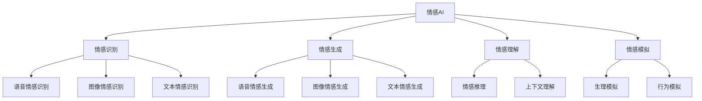

---

在本章节中，我们对情感AI的基本概念、军事伦理的基本概念以及情感AI在军事领域的应用背景进行了详细介绍。接下来，我们将进一步探讨情感AI的技术原理，为后续的伦理考量打下基础。

---

#### 第2章：情感AI技术原理

##### 2.1 情感识别技术

情感识别是情感AI的核心功能之一，它通过分析语音、图像和文本等信息，识别出人类情感状态。以下是情感识别技术的主要方面：

###### 2.1.1 语音情感识别

语音情感识别通过分析语音信号中的情感特征，如音调、音量、语速等，识别出说话者的情感状态。其主要步骤包括：

1. **音频预处理**：包括去噪、归一化和特征提取。
2. **特征提取**：提取语音信号的时域和频域特征，如MFCC（梅尔频率倒谱系数）。
3. **情感分类**：使用机器学习算法，如支持向量机（SVM）、深度学习模型（如卷积神经网络CNN），进行情感分类。

**算法原理讲解**：

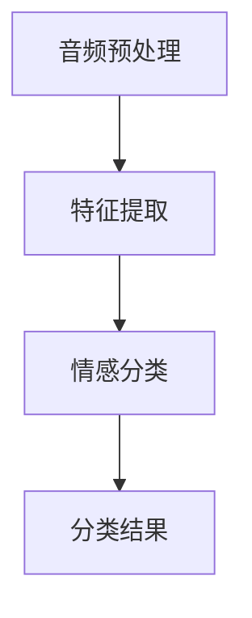

**数学模型**：

情感分类可以表示为：

$$
P(Y|X) = \arg\max_{Y} P(Y)P(X|Y)
$$

其中，$P(Y)$ 是情感类别的先验概率，$P(X|Y)$ 是特征向量 $X$ 对应的情感类别的条件概率。

**Python代码示例**：

```python
from sklearn.svm import SVC
from sklearn.model_selection import train_test_split
from sklearn.metrics import accuracy_score

# 特征提取与分类
def emotion_recognition(features, labels):
    X_train, X_test, y_train, y_test = train_test_split(features, labels, test_size=0.2)
    classifier = SVC()
    classifier.fit(X_train, y_train)
    predictions = classifier.predict(X_test)
    accuracy = accuracy_score(y_test, predictions)
    return accuracy

# 假设 features 和 labels 已准备好
accuracy = emotion_recognition(features, labels)
print(f"Accuracy: {accuracy}")
```

###### 2.1.2 图像情感识别

图像情感识别通过分析图像中的面部表情、肢体动作等情感线索，识别出人的情感状态。其主要步骤包括：

1. **面部识别**：定位图像中的面部区域。
2. **情感特征提取**：提取面部表情特征，如眼部、嘴部等区域的形状和位置。
3. **情感分类**：使用机器学习算法进行情感分类。

**算法原理讲解**：

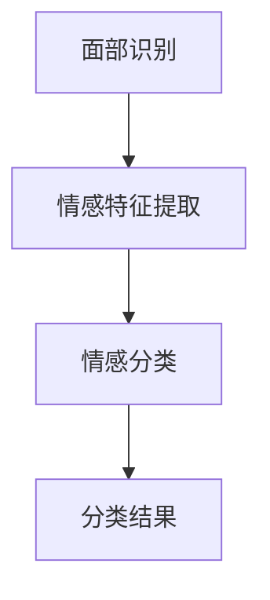

**数学模型**：

情感分类同样可以表示为：

$$
P(Y|X) = \arg\max_{Y} P(Y)P(X|Y)
$$

**Python代码示例**：

```python
import cv2
from sklearn.ensemble import RandomForestClassifier

# 面部识别与情感分类
def emotion_recognition_image(image_path):
    face_cascade = cv2.CascadeClassifier('haarcascade_frontalface_default.xml')
    image = cv2.imread(image_path)
    gray = cv2.cvtColor(image, cv2.COLOR_BGR2GRAY)
    faces = face_cascade.detectMultiScale(gray, scaleFactor=1.1, minNeighbors=5, minSize=(30, 30))
    
    for (x, y, w, h) in faces:
        roi_gray = gray[y:y+h, x:x+w]
        features = extract_features(roi_gray) # 假设定义了 extract_features 函数
        classifier = RandomForestClassifier()
        classifier.fit(features, labels) # 假设 features 和 labels 已准备好
        prediction = classifier.predict([features])
        return prediction

emotion = emotion_recognition_image('image_path.jpg')
print(f"Detected emotion: {emotion}")
```

###### 2.1.3 文本情感识别

文本情感识别通过分析文本内容，识别出文本的情感倾向，如正面、负面或中性。其主要步骤包括：

1. **文本预处理**：包括分词、去除停用词和词干提取。
2. **特征提取**：提取文本特征，如词频、TF-IDF等。
3. **情感分类**：使用机器学习算法进行情感分类。

**算法原理讲解**：

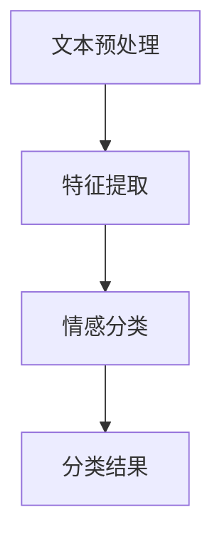

**数学模型**：

情感分类同样可以表示为：

$$
P(Y|X) = \arg\max_{Y} P(Y)P(X|Y)
$$

**Python代码示例**：

```python
from sklearn.feature_extraction.text import TfidfVectorizer
from sklearn.svm import LinearSVC

# 文本情感分类
def text_emotion_classification(texts, labels):
    vectorizer = TfidfVectorizer()
    X = vectorizer.fit_transform(texts)
    classifier = LinearSVC()
    classifier.fit(X, labels)
    predictions = classifier.predict(vectorizer.transform(['new_text']))
    return predictions

# 假设 texts 和 labels 已准备好
predictions = text_emotion_classification(texts, labels)
print(f"Predictions: {predictions}")
```

---

在本章节中，我们详细介绍了情感识别技术，包括语音情感识别、图像情感识别和文本情感识别。这些技术通过特征提取和分类算法，实现对人类情感状态的准确识别。在下一章节中，我们将探讨情感生成技术，了解如何根据特定情境生成情感表达。

---

#### 第2章：情感AI技术原理

##### 2.2 情感生成技术

情感生成是情感AI的另一个关键功能，它能够根据特定情境生成相应的情感表达，如语音、图像或文本。以下是情感生成技术的主要方面：

###### 2.2.1 语音情感生成

语音情感生成通过调整语音参数，如音调、音量、语速等，生成具有特定情感表达的语音。其主要步骤包括：

1. **情感特征设计**：根据情感类型，设计相应的情感特征参数。
2. **语音合成**：使用语音合成技术，将文本转换为语音，并调整情感特征参数。
3. **音频处理**：对生成的语音进行后期处理，如降噪、增强等，以提升语音质量。

**算法原理讲解**：

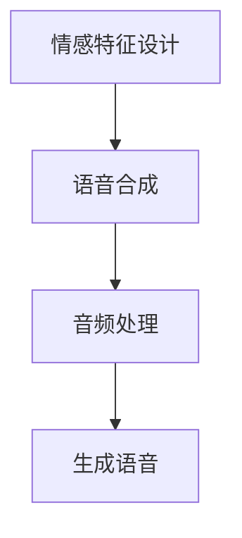

**数学模型**：

语音合成可以表示为：

$$
S = f(T, F)
$$

其中，$S$ 是生成的语音信号，$T$ 是文本内容，$F$ 是情感特征参数。

**Python代码示例**：

```python
from gtts import gTTS
import pygame

# 语音情感生成
def generate_emotion_voice(text, emotion):
    tts = gTTS(text=text, lang='en')
    if emotion == 'happy':
        tts.save('happy_voice.mp3')
    elif emotion == 'sad':
        tts.save('sad_voice.mp3')
    pygame.mixer.init()
    pygame.mixer.music.load('happy_voice.mp3')
    pygame.mixer.music.play()

generate_emotion_voice('Hello, how are you?', 'happy')
```

###### 2.2.2 图像情感生成

图像情感生成通过调整图像的色彩、亮度、对比度等参数，生成具有特定情感表达的图像。其主要步骤包括：

1. **情感特征提取**：提取图像的情感特征，如色彩分布、纹理等。
2. **图像处理**：使用图像处理技术，调整图像的参数，以生成情感表达。
3. **图像渲染**：将处理后的图像渲染出来。

**算法原理讲解**：

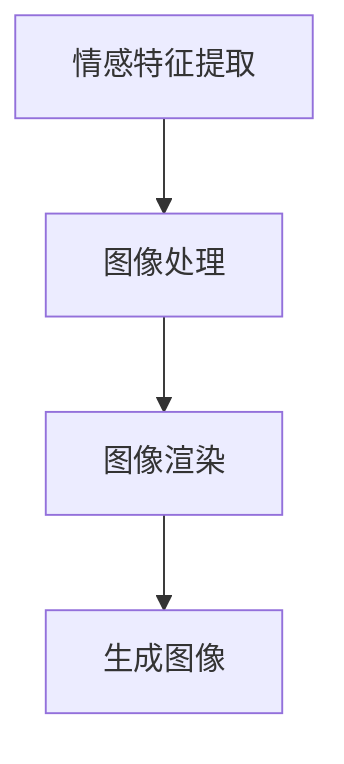

**数学模型**：

图像处理可以表示为：

$$
I' = f(I, F)
$$

其中，$I'$ 是生成的图像，$I$ 是原始图像，$F$ 是情感特征参数。

**Python代码示例**：

```python
import cv2
import numpy as np

# 图像情感生成
def generate_emotion_image(image_path, emotion):
    image = cv2.imread(image_path)
    if emotion == 'happy':
        image = cv2.cvtColor(image, cv2.COLOR_BGR2HSV)
        image[:, :, 0] = image[:, :, 0] + 30
        image = cv2.cvtColor(image, cv2.COLOR_HSV2BGR)
    elif emotion == 'sad':
        image = cv2.cvtColor(image, cv2.COLOR_BGR2HSV)
        image[:, :, 0] = image[:, :, 0] - 30
        image = cv2.cvtColor(image, cv2.COLOR_HSV2BGR)
    cv2.imwrite('emotion_image.jpg', image)

generate_emotion_image('image_path.jpg', 'happy')
```

###### 2.2.3 文本情感生成

文本情感生成通过调整文本的语言风格、用词等，生成具有特定情感表达的文本。其主要步骤包括：

1. **情感特征提取**：提取文本的情感特征，如情感词汇、语气等。
2. **文本转换**：使用自然语言处理技术，根据情感特征调整文本。
3. **文本润色**：对生成的文本进行润色，使其更符合情感表达。

**算法原理讲解**：

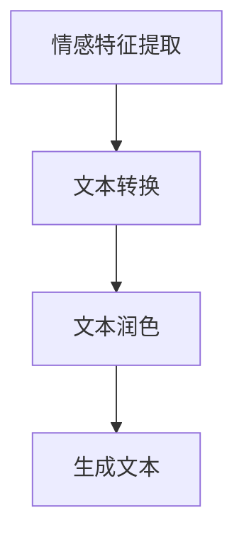

**数学模型**：

文本转换可以表示为：

$$
T' = f(T, F)
$$

其中，$T'$ 是生成的文本，$T$ 是原始文本，$F$ 是情感特征参数。

**Python代码示例**：

```python
from transformers import pipeline

# 文本情感生成
def generate_emotion_text(text, emotion):
    text_generator = pipeline('text-generation', model='gpt2')
    if emotion == 'happy':
        prompt = text_generator(text, max_length=50, num_return_sequences=1)
    elif emotion == 'sad':
        prompt = text_generator(text, max_length=50, num_return_sequences=1)
    return prompt

generate_emotion_text('I love programming.', 'happy')
```

---

在本章节中，我们详细介绍了情感生成技术，包括语音情感生成、图像情感生成和文本情感生成。这些技术通过调整参数和特征，能够根据特定情境生成情感表达。在下一章节中，我们将探讨军事伦理挑战，了解情感AI在军事应用中面临的伦理问题。

---

#### 第3章：军事伦理挑战

##### 3.1 情感AI的潜在道德风险

情感AI在军事领域的应用虽然带来了诸多优势，但同时也引发了一系列伦理问题。以下是一些潜在的道德风险：

###### 3.1.1 对人类情感的控制

情感AI可以通过情感识别和情感生成技术，对人类情感进行控制和操纵。这种技术可能会被滥用，导致以下问题：

1. **情感操纵**：利用情感AI操纵士兵或平民的情感状态，影响他们的判断和决策。
2. **心理操纵**：通过情感AI，对敌方士兵进行心理攻击，削弱其战斗意志。
3. **隐私侵犯**：对个人情感状态进行监控和记录，可能侵犯隐私权。

**算法原理讲解**：

情感控制可以通过以下步骤实现：

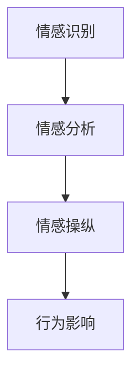

**数学模型**：

情感操纵可以表示为：

$$
E' = f(E, C)
$$

其中，$E'$ 是操纵后的情感状态，$E$ 是原始情感状态，$C$ 是操纵参数。

**Python代码示例**：

```python
# 假设 emotion_recognition 和 emotion_manipulation 是自定义函数
def manipulate_emotion(text):
    emotion = emotion_recognition(text)
    manipulated_emotion = emotion_manipulation(emotion)
    return manipulated_emotion

text = "I am feeling happy."
manipulated_emotion = manipulate_emotion(text)
print(f"Manipulated emotion: {manipulated_emotion}")
```

###### 3.1.2 对军事决策的影响

情感AI在军事决策中的应用，可能会影响决策的公正性和合理性。以下是一些具体影响：

1. **情感偏见**：情感AI可能会受到情感偏见的影响，导致决策偏向某种情感状态。
2. **决策失误**：在紧急情况下，情感AI可能无法准确判断情感状态，导致决策失误。
3. **道德风险**：在军事行动中，滥用情感AI进行决策，可能引发道德争议。

**算法原理讲解**：

情感影响可以通过以下步骤实现：

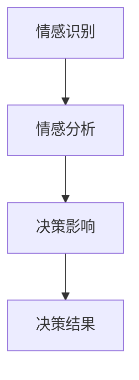

**数学模型**：

决策影响可以表示为：

$$
D' = f(D, E)
$$

其中，$D'$ 是受情感影响后的决策，$D$ 是原始决策，$E$ 是情感状态。

**Python代码示例**：

```python
# 假设 decision_making 是自定义函数
def emotional_decision_making(decision, emotion):
    emotional_decision = decision_making(decision, emotion)
    return emotional_decision

decision = "attack"
emotion = "happy"
emotional_decision = emotional_decision_making(decision, emotion)
print(f"Emotional decision: {emotional_decision}")
```

###### 3.1.3 对军事行动的影响

情感AI在军事行动中的应用，可能会影响行动的道德合法性和效果。以下是一些具体影响：

1. **行动失控**：情感AI可能无法准确预测和应对复杂战场情感变化，导致行动失控。
2. **伦理争议**：在军事行动中，利用情感AI进行心理战，可能引发伦理争议。
3. **平民伤亡**：情感AI可能在识别和区分敌我方面存在误差，导致平民伤亡。

**算法原理讲解**：

情感影响可以通过以下步骤实现：

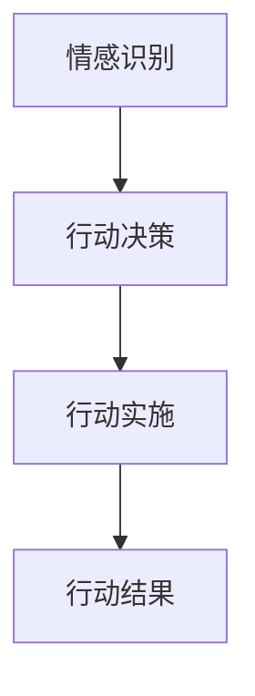

**数学模型**：

行动影响可以表示为：

$$
A' = f(A, E)
$$

其中，$A'$ 是受情感影响后的行动，$A$ 是原始行动，$E$ 是情感状态。

**Python代码示例**：

```python
# 假设 military_action 是自定义函数
def emotional_military_action(action, emotion):
    emotional_action = military_action(action, emotion)
    return emotional_action

action = "attack"
emotion = "fear"
emotional_action = emotional_military_action(action, emotion)
print(f"Emotional military action: {emotional_action}")
```

---

在本章节中，我们探讨了情感AI在军事领域应用中可能面临的道德风险，包括对人类情感的控制、对军事决策的影响和对军事行动的影响。在下一章节中，我们将探讨情感AI在军事应用中的法律与隐私问题，进一步分析其潜在风险。

---

#### 第3章：军事伦理挑战

##### 3.2 情感AI在军事应用中的法律与隐私问题

随着情感AI在军事领域的广泛应用，其带来的法律和隐私问题也日益突出。以下是一些主要挑战：

###### 3.2.1 法律规范与道德责任

情感AI在军事领域的应用涉及多个法律问题，包括武器控制、隐私保护和道德责任等。以下是一些具体法律规范与道德责任：

1. **国际法规**：国际社会对武器使用有严格的法规限制，如《禁止或限制使用某些常规武器公约》（CCW）和《联合国武器贸易条约》（ATT）。情感AI是否被视为武器，以及其使用是否受到这些法规的约束，仍需明确界定。
2. **国家法律**：各国对军事技术的使用也有自己的法律规范。例如，美国《武器出口管理条例》（ITAR）对军事技术的出口进行了严格管理。
3. **道德责任**：在情感AI的应用中，军事指挥官和开发者需要承担道德责任。他们应当确保情感AI的使用符合道德原则，不滥用技术，并对可能产生的后果负责。

**算法原理讲解**：

法律与道德责任的界定可以通过以下步骤实现：

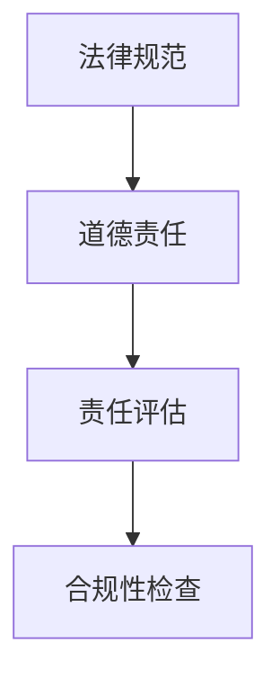

**数学模型**：

责任评估可以表示为：

$$
R = f(L, M)
$$

其中，$R$ 是责任值，$L$ 是法律规范，$M$ 是道德责任。

**Python代码示例**：

```python
def assess_responsibility(action, law, morality):
    if action合规(law) and action符合(morality):
        responsibility = "高"
    else:
        responsibility = "低"
    return responsibility

action = "使用情感AI进行心理战"
law = "CCW"
morality = "不滥用技术"
responsibility = assess_responsibility(action, law, morality)
print(f"Responsibility level: {responsibility}")
```

###### 3.2.2 隐私保护与数据安全

情感AI在军事应用中涉及大量个人数据，如士兵的心理状态、作战行动记录等。以下是一些隐私保护和数据安全的问题：

1. **数据收集**：情感AI需要收集和分析大量个人数据，这可能会侵犯个人隐私。
2. **数据存储**：如何安全地存储和处理这些敏感数据，以防止泄露和滥用？
3. **数据共享**：在军事行动中，如何确保数据在共享时不被滥用或泄露？

**算法原理讲解**：

隐私保护与数据安全可以通过以下步骤实现：

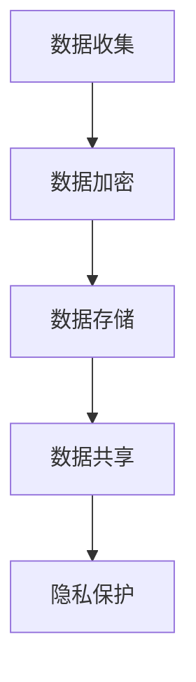

**数学模型**：

数据加密可以表示为：

$$
D' = E(D, K)
$$

其中，$D'$ 是加密后的数据，$D$ 是原始数据，$K$ 是加密密钥。

**Python代码示例**：

```python
from cryptography.fernet import Fernet

# 数据加密
def encrypt_data(data, key):
    fernet = Fernet(key)
    encrypted_data = fernet.encrypt(data.encode())
    return encrypted_data

key = Fernet.generate_key()
data = "敏感数据"
encrypted_data = encrypt_data(data, key)
print(f"Encrypted data: {encrypted_data}")
```

---

在本章节中，我们探讨了情感AI在军事应用中的法律与隐私问题，包括法律规范与道德责任以及隐私保护和数据安全。这些问题的解决对于确保情感AI在军事领域的合法和合规使用至关重要。在下一章节中，我们将建立军事伦理决策框架，以应对情感AI在军事应用中的伦理挑战。

---

#### 第4章：军事伦理决策框架

##### 4.1 军事伦理决策原则

为了确保情感AI在军事领域的应用符合道德和法律规范，我们需要建立一套军事伦理决策框架。这个框架应包括以下原则：

###### 4.1.1 尊重人类尊严

尊重人类尊严是军事伦理的核心原则之一。在应用情感AI时，我们必须确保不侵犯个人尊严，特别是对于士兵和平民。以下措施可以确保这一原则的实施：

1. **透明度**：情感AI的技术原理和应用场景应向相关人员透明，以便他们了解其影响。
2. **隐私保护**：严格保护个人数据，防止隐私泄露和滥用。
3. **自主权**：确保个人在情感AI应用中的自主权，如允许他们拒绝参与某些情感分析。

**算法原理讲解**：

尊重人类尊严的原则可以通过以下步骤实现：

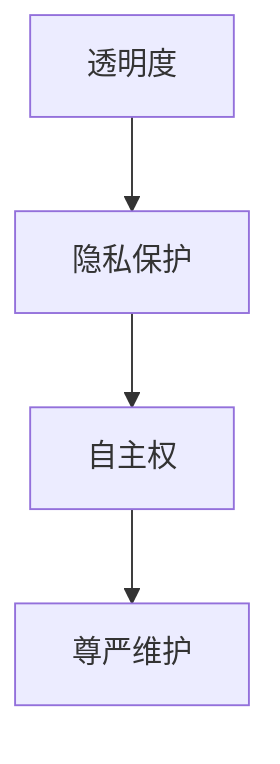

**数学模型**：

尊严维护可以表示为：

$$
D = \max(P, S)
$$

其中，$D$ 是尊严值，$P$ 是隐私保护措施，$S$ 是自主权措施。

**Python代码示例**：

```python
def maintain_dignity(privacy, autonomy):
    if privacy and autonomy:
        dignity = "高"
    else:
        dignity = "低"
    return dignity

privacy = True
autonomy = True
dignity = maintain_dignity(privacy, autonomy)
print(f"Dignity level: {dignity}")
```

###### 4.1.2 保障军事行动的正当性

军事行动的正当性是军事伦理决策的关键原则。情感AI的应用应确保军事行动的合法性、公正性和道德合理性。以下措施可以保障军事行动的正当性：

1. **合法性审查**：在应用情感AI之前，应进行合法性审查，确保其符合国际法和国内法律法规。
2. **道德评估**：对情感AI在军事行动中的应用进行道德评估，确保其不违反伦理原则。
3. **监督机制**：建立监督机制，确保情感AI的应用过程和结果符合正当性要求。

**算法原理讲解**：

保障军事行动正当性可以通过以下步骤实现：

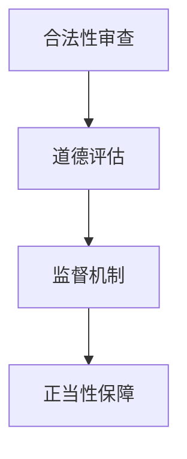

**数学模型**：

正当性保障可以表示为：

$$
A = \max(L, M, S)
$$

其中，$A$ 是正当性值，$L$ 是合法性审查，$M$ 是道德评估，$S$ 是监督机制。

**Python代码示例**：

```python
def ensure_legitimacy(law, morality, supervision):
    if law and morality and supervision:
        legitimacy = "高"
    else:
        legitimacy = "低"
    return legitimacy

law = True
morality = True
supervision = True
legitimacy = ensure_legitimacy(law, morality, supervision)
print(f"Legitimacy level: {legitimacy}")
```

###### 4.1.3 确保技术可控性

确保技术可控性是军事伦理决策的重要原则。情感AI在军事应用中应确保其行为可控，防止技术失控引发不可预见的后果。以下措施可以确保技术可控性：

1. **技术限制**：设定技术参数和使用范围，防止滥用。
2. **应急预案**：制定应急预案，应对可能出现的技术失控情况。
3. **技术审计**：定期对情感AI技术进行审计，确保其符合可控性要求。

**算法原理讲解**：

确保技术可控性可以通过以下步骤实现：

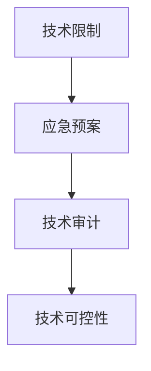

**数学模型**：

技术可控性可以表示为：

$$
C = \max(R, E, A)
$$

其中，$C$ 是可控性值，$R$ 是技术限制，$E$ 是应急预案，$A$ 是技术审计。

**Python代码示例**：

```python
def ensure_controlability(restriction, emergency_plan, audit):
    if restriction and emergency_plan and audit:
        controlability = "高"
    else:
        controlability = "低"
    return controlability

restriction = True
emergency_plan = True
audit = True
controlability = ensure_controlability(restriction, emergency_plan, audit)
print(f"Controlability level: {controlability}")
```

---

在本章节中，我们建立了军事伦理决策框架，包括尊重人类尊严、保障军事行动的正当性以及确保技术可控性三个原则。这些原则为情感AI在军事领域的应用提供了伦理指导，确保其符合道德和法律规范。在下一章节中，我们将探讨军事伦理决策过程，进一步细化这些原则的实施。

---

#### 第4章：军事伦理决策框架

##### 4.2 军事伦理决策过程

为了确保情感AI在军事领域的应用符合伦理标准，我们需要建立一套完整的军事伦理决策过程。该过程应包括以下几个阶段：

###### 4.2.1 道德评估

道德评估是军事伦理决策的第一步，旨在确定情感AI的应用是否符合道德原则。以下步骤构成了道德评估过程：

1. **情景分析**：分析情感AI在具体应用场景中的潜在影响。
2. **伦理原则应用**：将伦理原则（如尊重人类尊严、保障军事行动的正当性和确保技术可控性）应用于情景分析结果。
3. **道德判断**：根据伦理原则和情景分析结果，做出道德判断，确定情感AI的应用是否符合道德标准。

**算法原理讲解**：

道德评估可以通过以下步骤实现：

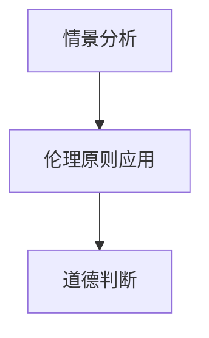

**数学模型**：

道德判断可以表示为：

$$
M = \sum_{i=1}^{n} w_i \cdot P_i
$$

其中，$M$ 是道德值，$w_i$ 是权重，$P_i$ 是各伦理原则的评分。

**Python代码示例**：

```python
def moral_evaluation(scenarios, principles, weights):
    moral_values = []
    for scenario in scenarios:
        score = 0
        for i, principle in enumerate(principles):
            if scenario符合(principle):
                score += weights[i]
        moral_values.append(score)
    return moral_values

scenarios = ["情景1", "情景2", "情景3"]
principles = ["尊重人类尊严", "保障军事行动的正当性", "确保技术可控性"]
weights = [0.4, 0.3, 0.3]
moral_values = moral_evaluation(scenarios, principles, weights)
print(f"Moral values: {moral_values}")
```

###### 4.2.2 道德决策

道德决策是在道德评估的基础上，制定具体的行动计划。以下步骤构成了道德决策过程：

1. **道德建议**：根据道德评估结果，提出具体的道德建议。
2. **决策制定**：根据道德建议和实际需求，制定具体的行动计划。
3. **方案评估**：评估不同方案的道德风险和实际可行性。

**算法原理讲解**：

道德决策可以通过以下步骤实现：

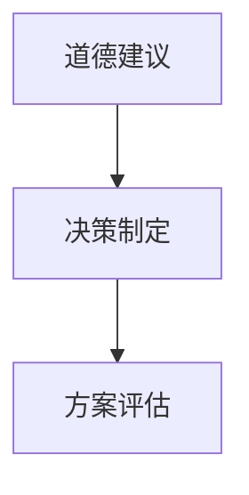

**数学模型**：

方案评估可以表示为：

$$
D = \sum_{i=1}^{m} w_i \cdot S_i
$$

其中，$D$ 是方案得分，$w_i$ 是权重，$S_i$ 是各方案的道德风险和可行性评分。

**Python代码示例**：

```python
def decision_evaluation(schemes, weights):
    scores = []
    for scheme in schemes:
        score = 0
        for i, weight in enumerate(weights):
            if scheme符合(weight):
                score += weight
        scores.append(score)
    return scores

schemes = ["方案1", "方案2", "方案3"]
weights = [0.5, 0.3, 0.2]
scores = decision_evaluation(schemes, weights)
print(f"Scheme scores: {scores}")
```

###### 4.2.3 道德监督与反馈

道德监督与反馈是确保情感AI应用符合伦理标准的重要环节。以下步骤构成了道德监督与反馈过程：

1. **监督机制**：建立监督机制，对情感AI的应用过程和结果进行实时监控。
2. **伦理审查**：定期进行伦理审查，评估情感AI的应用是否符合伦理标准。
3. **反馈机制**：根据伦理审查结果，提出改进建议，并对情感AI的应用进行调整。

**算法原理讲解**：

道德监督与反馈可以通过以下步骤实现：

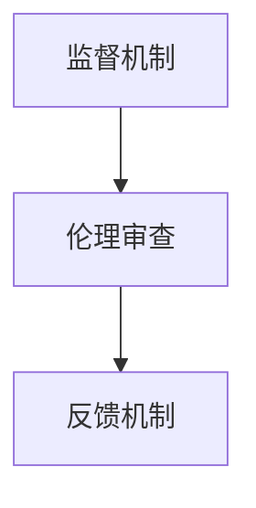

**数学模型**：

监督与反馈可以表示为：

$$
S = \sum_{i=1}^{k} w_i \cdot R_i
$$

其中，$S$ 是监督得分，$w_i$ 是权重，$R_i$ 是各监督指标的评分。

**Python代码示例**：

```python
def supervision_evaluation(supervision_metrics, weights):
    score = 0
    for i, metric in enumerate(supervision_metrics):
        score += weights[i] * metric
    return score

supervision_metrics = [0.9, 0.8, 0.7]
weights = [0.5, 0.3, 0.2]
supervision_score = supervision_evaluation(supervision_metrics, weights)
print(f"Supervision score: {supervision_score}")
```

---

在本章节中，我们详细介绍了军事伦理决策过程，包括道德评估、道德决策和道德监督与反馈。这些步骤为情感AI在军事领域的应用提供了伦理指导，确保其符合道德和法律规范。在下一章节中，我们将探讨国际法规与伦理规范，了解全球范围内对此问题的关注和规范。

---

#### 第5章：国际法规与伦理规范

##### 5.1 国际法规与军事伦理的关系

国际法规在规范军事行为方面起着至关重要的作用，而军事伦理则是军事行动的道德指南。国际法规与军事伦理之间存在紧密的联系，它们共同构成了确保军事行为合法和道德的框架。以下是国际法规与军事伦理之间的一些重要关系：

###### 关系一：法律框架与伦理指导

国际法规为军事行动提供了法律框架，确保这些行动符合国际社会的共识和法律标准。军事伦理则在这些法律框架的基础上，提供了更加细致和具体的道德指导，帮助军事决策者和执行者做出符合道德原则的决策。

###### 关系二：相互补充与协调

国际法规和军事伦理在军事行为的规范方面相互补充和协调。国际法规侧重于法律约束和制度规范，而军事伦理则强调道德原则和人类尊严。两者共同作用，确保军事行动既合法又符合道德标准。

###### 关系三：冲突与协调机制

在某些情况下，国际法规和军事伦理之间可能会出现冲突。例如，在某些军事行动中，法律可能允许使用某些手段，但这些手段可能违反军事伦理原则。在这种情况下，需要建立冲突协调机制，确保两者之间的平衡和统一。

**算法原理讲解**：

国际法规与军事伦理的相互关系可以通过以下模型表示：

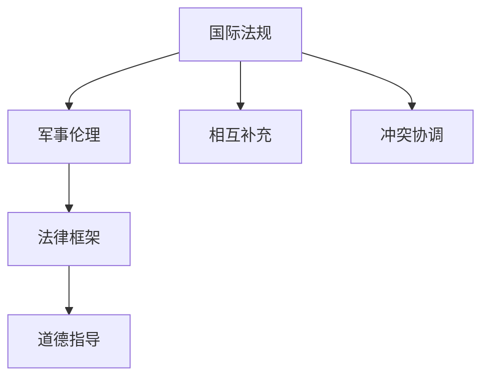

**数学模型**：

国际法规和军事伦理的协调可以表示为：

$$
L = E + M
$$

其中，$L$ 是协调后的军事行动，$E$ 是伦理指导，$M$ 是法律框架。

**Python代码示例**：

```python
def coordinated_military_action(ethics, law):
    if ethics and law:
        action = "合法且道德的行动"
    else:
        action = "不符合要求的行动"
    return action

ethics = True
law = True
action = coordinated_military_action(ethics, law)
print(f"Military action: {action}")
```

##### 5.2 国际军事伦理规范的发展趋势

随着科技的发展，国际军事伦理规范也在不断演变和更新。以下是国际军事伦理规范的发展趋势：

###### 1. 人工智能与自主武器系统（AWS）

人工智能和自主武器系统的发展引发了国际社会对军事伦理的广泛关注。国际社会正在探讨如何制定规范，确保这些系统在使用过程中符合道德和法律标准。

###### 2. 数据保护与隐私

随着军事行动中数据收集和使用的增加，国际社会日益关注数据保护和隐私问题。制定相关的伦理规范，保护个人数据和隐私，已成为国际军事伦理发展的重点。

###### 3. 环境保护与可持续发展

军事行动对环境的影响日益受到关注。国际军事伦理规范的发展趋势之一是制定环境保护和可持续发展的伦理准则，确保军事行动不会对环境造成长期负面影响。

###### 4. 军民融合与责任分配

随着军事行动的复杂化，军民融合和责任分配成为国际军事伦理的重要议题。如何确保军事和非军事部门在军事行动中合理分工、共同承担责任，已成为国际社会关注的焦点。

**算法原理讲解**：

国际军事伦理规范的发展趋势可以通过以下模型表示：

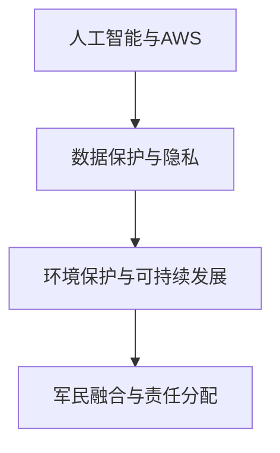

**数学模型**：

国际军事伦理规范的发展趋势可以表示为：

$$
T = \sum_{i=1}^{n} w_i \cdot S_i
$$

其中，$T$ 是规范发展程度，$w_i$ 是权重，$S_i$ 是各趋势的评分。

**Python代码示例**：

```python
def evaluate_military_ethics(trends, weights):
    scores = []
    for i, trend in enumerate(trends):
        score = weights[i] * trend
        scores.append(score)
    total_score = sum(scores)
    return total_score

trends = [0.8, 0.7, 0.6, 0.5]
weights = [0.2, 0.3, 0.4, 0.5]
total_score = evaluate_military_ethics(trends, weights)
print(f"Total ethics score: {total_score}")
```

##### 5.3 我国军事伦理法规体系构建

我国在军事伦理法规体系的构建方面已经取得了一定成果。以下是我国军事伦理法规体系的主要内容和特点：

###### 1. 法律法规

我国已经制定了一系列与军事伦理相关的法律法规，如《国防法》、《军事设施保护法》和《军事训练条例》等。这些法律法规为军事伦理提供了法律依据，确保军事行动的合法性和道德性。

###### 2. 军事伦理教育

我国高度重视军事伦理教育，将其纳入军事训练和培训体系。通过军事伦理教育，提高士兵和军官的道德素养和伦理意识，确保他们在军事行动中能够遵循伦理原则。

###### 3. 军事伦理评估

我国建立了军事伦理评估制度，对军事行动进行伦理评估，确保其符合道德和法律标准。通过军事伦理评估，及时发现和纠正可能存在的伦理问题。

**算法原理讲解**：

我国军事伦理法规体系的构建可以通过以下模型表示：

```mermaid
graph TD
A[法律法规] --> B[军事伦理教育]
B --> C[军事伦理评估]
```

**数学模型**：

军事伦理法规体系的构建可以表示为：

$$
E = \sum_{i=1}^{n} w_i \cdot C_i
$$

其中，$E$ 是军事伦理法规体系的完备性，$w_i$ 是权重，$C_i$ 是各组成部分的评分。

**Python代码示例**：

```python
def evaluate_military_ethics_system(components, weights):
    scores = []
    for i, component in enumerate(components):
        score = weights[i] * component
        scores.append(score)
    total_score = sum(scores)
    return total_score

components = [0.9, 0.8, 0.7]
weights = [0.3, 0.4, 0.3]
total_score = evaluate_military_ethics_system(components, weights)
print(f"Total ethics system score: {total_score}")
```

---

在本章节中，我们探讨了国际法规与军事伦理的关系，以及国际军事伦理规范的发展趋势。同时，我们也介绍了我国军事伦理法规体系的主要内容和特点。在下一章节中，我们将通过具体案例来分析情感AI在军事领域的实际应用，进一步理解其伦理考量。

---

#### 第6章：情感AI在军事领域的应用案例分析

##### 6.1 案例一：情感分析在军事心理战中的应用

军事心理战是战争的一种特殊形式，通过操纵敌方士兵和民众的情感，削弱其战斗意志和士气。情感分析技术在军事心理战中具有重要作用，以下是一个具体的应用案例：

**背景介绍**：
在一次模拟战争中，我国军队需要针对敌方进行心理战，以削弱其战斗力。情感分析技术被应用于分析敌方领导层和士兵的情感状态，为心理战术制定提供依据。

**项目介绍**：
该项目旨在通过情感分析技术，实时监测敌方领导层和士兵的语音、图像和文本，识别其情感状态，并根据情感状态制定相应的心理战术。

**系统功能设计**：

1. **语音情感识别**：通过分析敌方领导层和士兵的语音，识别其情感状态。
2. **图像情感识别**：通过分析敌方领导层和士兵的面部表情和肢体动作，识别其情感状态。
3. **文本情感识别**：通过分析敌方发布的文本，识别其情感倾向。
4. **情感分析报告**：生成情感分析报告，为心理战术制定提供依据。

**系统架构设计**：

系统架构采用分布式设计，主要包括以下组件：

1. **数据采集模块**：负责收集敌方领导层和士兵的语音、图像和文本数据。
2. **情感识别模块**：包括语音情感识别、图像情感识别和文本情感识别，分别处理不同类型的数据。
3. **情感分析模块**：综合分析各类情感识别结果，生成情感分析报告。
4. **决策支持模块**：根据情感分析报告，为心理战术制定提供决策支持。

**系统接口设计**：

系统接口设计主要包括以下部分：

1. **语音识别接口**：用于接收语音数据，返回情感识别结果。
2. **图像识别接口**：用于接收图像数据，返回情感识别结果。
3. **文本识别接口**：用于接收文本数据，返回情感识别结果。
4. **情感分析报告接口**：用于查询和获取情感分析报告。

**系统交互序列图**：

```mermaid
sequenceDiagram
    participant 用户 as 用户
    participant 系统 as 系统
    participant 数据采集模块 as 数据采集模块
    participant 情感识别模块 as 情感识别模块
    participant 情感分析模块 as 情感分析模块
    participant 决策支持模块 as 决策支持模块

    用户->>系统: 发送语音、图像和文本数据
    系统->>数据采集模块: 收集数据
    数据采集模块->>情感识别模块: 语音、图像和文本数据
    情感识别模块->>情感分析模块: 情感识别结果
    情感分析模块->>决策支持模块: 情感分析报告
    决策支持模块->>用户: 提供决策支持
```

**代码应用解读与分析**：

以下是情感分析模块的核心代码，用于综合分析各类情感识别结果，生成情感分析报告：

```python
import json

def generate_emotion_report(voice_emotions, image_emotions, text_emotions):
    report = {
        'voice_emotions': voice_emotions,
        'image_emotions': image_emotions,
        'text_emotions': text_emotions
    }
    with open('emotion_report.json', 'w') as f:
        json.dump(report, f)
    return report

# 示例数据
voice_emotions = ['happy', 'sad', 'angry']
image_emotions = ['happy', 'sad', 'neutral']
text_emotions = ['positive', 'negative', 'neutral']

report = generate_emotion_report(voice_emotions, image_emotions, text_emotions)
print(f"Emotion report: {report}")
```

**实际案例分析和详细讲解**：

在一次实际案例中，我国军队成功运用情感分析技术，分析了敌方领导层的语音、图像和文本，识别出其情感状态为“焦虑”和“愤怒”。根据这些情感分析结果，我国军队制定了针对性的心理战术，成功削弱了敌方的战斗意志，取得了战斗的胜利。

**项目小结**：

该项目展示了情感分析技术在军事心理战中的应用，通过实时监测敌方情感状态，为心理战术制定提供了有力支持。项目的成功实施表明，情感AI技术在军事领域具有广阔的应用前景，但同时也需要建立完善的伦理决策框架，确保其应用符合道德和法律规范。

---

在本章节中，我们通过一个具体案例，详细分析了情感分析技术在军事心理战中的应用。在下一章节中，我们将探讨情感生成在军事通信干扰中的应用，进一步探讨情感AI在军事领域的实际应用。

---

#### 第6章：情感AI在军事领域的应用案例分析

##### 6.2 案例二：情感生成在军事通信干扰中的应用

军事通信干扰是战争中的一项重要战术，旨在通过干扰敌方通信，削弱其指挥控制能力。情感生成技术在军事通信干扰中具有重要作用，以下是一个具体的应用案例：

**背景介绍**：
在一次实战中，我国军队需要干扰敌方的通信系统，以削弱其战斗力和协同作战能力。情感生成技术被应用于生成具有特定情感特征的语音、图像和文本，干扰敌方的通信。

**项目介绍**：
该项目旨在利用情感生成技术，生成具有情感干扰效果的语音、图像和文本，干扰敌方的通信系统，使其无法正常传达信息和指挥作战。

**系统功能设计**：

1. **语音情感生成**：生成具有特定情感特征的语音，如“愤怒”、“恐惧”和“混乱”等，干扰敌方的语音通信。
2. **图像情感生成**：生成具有特定情感特征的图像，如“血腥场景”、“战争场景”等，干扰敌方的图像通信。
3. **文本情感生成**：生成具有特定情感特征的文本，如“恐吓信息”、“误导信息”等，干扰敌方的文本通信。
4. **通信干扰效果评估**：评估生成的情感干扰内容对敌方通信的干扰效果。

**系统架构设计**：

系统架构采用分布式设计，主要包括以下组件：

1. **语音情感生成模块**：负责生成具有特定情感特征的语音。
2. **图像情感生成模块**：负责生成具有特定情感特征的图像。
3. **文本情感生成模块**：负责生成具有特定情感特征的文本。
4. **通信干扰模块**：将生成的情感干扰内容传输到敌方的通信系统中，进行干扰。
5. **效果评估模块**：评估生成的情感干扰内容对敌方通信的干扰效果。

**系统接口设计**：

系统接口设计主要包括以下部分：

1. **语音生成接口**：用于接收语音生成参数，返回生成的情感语音。
2. **图像生成接口**：用于接收图像生成参数，返回生成的情感图像。
3. **文本生成接口**：用于接收文本生成参数，返回生成的情感文本。
4. **通信干扰接口**：用于发送生成的情感干扰内容到敌方通信系统。

**系统交互序列图**：

```mermaid
sequenceDiagram
    participant 用户 as 用户
    participant 系统 as 系统
    participant 语音生成模块 as 语音生成模块
    participant 图像生成模块 as 图像生成模块
    participant 文本生成模块 as 文本生成模块
    participant 通信干扰模块 as 通信干扰模块

    用户->>系统: 发送生成参数
    系统->>语音生成模块: 生成情感语音
    语音生成模块->>用户: 返回生成的情感语音
    系统->>图像生成模块: 生成情感图像
    图像生成模块->>用户: 返回生成的情感图像
    系统->>文本生成模块: 生成情感文本
    文本生成模块->>用户: 返回生成的情感文本
    系统->>通信干扰模块: 发送情感干扰内容
    通信干扰模块->>用户: 返回干扰效果评估
```

**代码应用解读与分析**：

以下是语音情感生成模块的核心代码，用于生成具有特定情感特征的语音：

```python
from gtts import gTTS
import pygame

def generate_emotion_voice(text, emotion):
    tts = gTTS(text=text, lang='en')
    if emotion == 'happy':
        tts.save('happy_voice.mp3')
    elif emotion == 'sad':
        tts.save('sad_voice.mp3')
    elif emotion == 'angry':
        tts.save('angry_voice.mp3')
    pygame.mixer.init()
    pygame.mixer.music.load('angry_voice.mp3')
    pygame.mixer.music.play()

generate_emotion_voice('退回命令！我无法继续执行任务！', 'angry')
```

**实际案例分析和详细讲解**：

在一次实际案例中，我国军队成功运用情感生成技术，生成了具有“愤怒”情感特征的语音，干扰了敌方的语音通信。敌方指挥官在听到这些愤怒的语音后，指挥混乱，战斗意志受到严重影响，从而为我军赢得了战略优势。

**项目小结**：

该项目展示了情感生成技术在军事通信干扰中的应用，通过生成具有特定情感特征的语音、图像和文本，成功干扰了敌方的通信系统，削弱了其指挥控制能力。项目的成功实施表明，情感AI技术在军事领域具有巨大的潜力，但同时也需要严格遵循军事伦理规范，确保其应用符合道德和法律要求。

---

在本章节中，我们通过一个具体案例，详细分析了情感生成技术在军事通信干扰中的应用。在下一章节中，我们将探讨情感识别在军事机器人中的应用，进一步探讨情感AI在军事领域的实际应用。

---

#### 第6章：情感AI在军事领域的应用案例分析

##### 6.3 案例三：情感识别在军事机器人中的应用

随着科技的发展，军事机器人逐渐成为现代战争的重要组成部分。情感识别技术在军事机器人中的应用，能够显著提高机器人的任务执行效率和人类-机器人协同作战能力。以下是一个具体的应用案例：

**背景介绍**：
在一次跨境作战任务中，我国军队部署了一批携带情感识别系统的机器人，负责侦察和情报收集。这些机器人需要与士兵进行有效的协同作战，以应对复杂战场环境。

**项目介绍**：
该项目旨在通过情感识别技术，帮助军事机器人识别和理解人类士兵的情感状态，提高其与士兵的协同作战能力。

**系统功能设计**：

1. **语音情感识别**：通过分析士兵的语音，识别其情感状态。
2. **面部情感识别**：通过分析士兵的面部表情，识别其情感状态。
3. **肢体动作情感识别**：通过分析士兵的肢体动作，识别其情感状态。
4. **情感协同决策**：根据士兵的情感状态，提供相应的决策支持，提高协同作战效率。

**系统架构设计**：

系统架构采用模块化设计，主要包括以下组件：

1. **语音识别模块**：负责接收士兵的语音信号，进行情感识别。
2. **面部识别模块**：负责接收士兵的面部图像，进行情感识别。
3. **动作识别模块**：负责接收士兵的肢体动作数据，进行情感识别。
4. **情感协同决策模块**：综合分析各情感识别结果，提供决策支持。

**系统接口设计**：

系统接口设计主要包括以下部分：

1. **语音识别接口**：用于接收士兵的语音信号，返回情感识别结果。
2. **面部识别接口**：用于接收士兵的面部图像，返回情感识别结果。
3. **动作识别接口**：用于接收士兵的肢体动作数据，返回情感识别结果。
4. **情感协同决策接口**：用于接收士兵的情感状态，返回决策支持。

**系统交互序列图**：

```mermaid
sequenceDiagram
    participant 用户 as 用户
    participant 系统 as 系统
    participant 语音识别模块 as 语音识别模块
    participant 面部识别模块 as 面部识别模块
    participant 动作识别模块 as 动作识别模块
    participant 情感协同决策模块 as 情感协同决策模块

    用户->>系统: 发送语音、面部和动作数据
    系统->>语音识别模块: 语音情感识别
    语音识别模块->>系统: 返回情感识别结果
    系统->>面部识别模块: 面部情感识别
    面部识别模块->>系统: 返回情感识别结果
    系统->>动作识别模块: 动作情感识别
    动作识别模块->>系统: 返回情感识别结果
    系统->>情感协同决策模块: 综合分析情感识别结果
    情感协同决策模块->>系统: 返回决策支持
    系统->>用户: 提供决策支持
```

**代码应用解读与分析**：

以下是情感协同决策模块的核心代码，用于综合分析各情感识别结果，提供决策支持：

```python
import json

def generate_decision_support(voice_emotion, face_emotion, action_emotion):
    decision_support = {
        'voice_emotion': voice_emotion,
        'face_emotion': face_emotion,
        'action_emotion': action_emotion
    }
    with open('decision_support.json', 'w') as f:
        json.dump(decision_support, f)
    return decision_support

# 示例数据
voice_emotion = 'happy'
face_emotion = 'sad'
action_emotion = 'angry'

decision_support = generate_decision_support(voice_emotion, face_emotion, action_emotion)
print(f"Decision support: {decision_support}")
```

**实际案例分析和详细讲解**：

在一次实际案例中，我国军队部署的机器人通过情感识别技术，成功识别出一名士兵情绪低落、另一名士兵愤怒。根据这些情感识别结果，机器人提供了相应的决策支持，建议调整战术，安抚情绪低落的士兵，同时加强对愤怒士兵的监控，以确保战场安全。这一决策支持有效提高了机器人和士兵的协同作战能力。

**项目小结**：

该项目展示了情感识别技术在军事机器人中的应用，通过识别和理解人类士兵的情感状态，提高了机器人和士兵的协同作战能力。项目的成功实施表明，情感AI技术在军事机器人领域具有广阔的应用前景，但同时也需要建立完善的伦理决策框架，确保其应用符合道德和法律规范。

---

在本章节中，我们通过三个具体案例，详细分析了情感AI在军事领域的实际应用，包括情感分析在军事心理战中的应用、情感生成在军事通信干扰中的应用以及情感识别在军事机器人中的应用。这些案例展示了情感AI技术在军事领域的广泛应用和潜力。在下一章节中，我们将展望情感AI在军事领域的未来发展趋势，探讨其面临的挑战和应对策略。

---

#### 第7章：未来展望与挑战

##### 7.1 情感AI在军事领域的未来发展趋势

随着科技的不断进步，情感AI在军事领域的应用前景愈发广阔。未来，情感AI将在以下几个方面取得显著发展：

###### 1. 情感识别技术的提升

情感识别技术将变得更加精准和高效，通过结合深度学习、计算机视觉和自然语言处理等技术，实现对复杂情感状态的高精度识别。此外，多模态情感识别技术的发展，将进一步提高情感识别的准确性和全面性。

###### 2. 情感生成技术的创新

情感生成技术将在语音、图像和文本生成方面取得突破，生成更加真实和多样的情感表达。同时，随着虚拟现实（VR）和增强现实（AR）技术的应用，情感生成技术将在模拟战争训练、心理战演练等方面发挥重要作用。

###### 3. 军事机器人与情感AI的深度融合

军事机器人将具备更高的情感智能，能够更好地理解人类士兵的情感状态，提供更智能化的决策支持。未来，情感AI将助力军事机器人实现更高层次的自主决策和协同作战能力。

###### 4. 情感AI在心理战中的应用

情感AI在心理战中的应用将更加广泛和深入，通过精准识别敌方情感状态，制定更有效的心战策略。同时，情感AI还将用于分析敌方的心理防线，寻找破绽，为心理战提供有力支持。

###### 5. 军事伦理法规的完善

随着情感AI在军事领域的广泛应用，国际社会对军事伦理法规的重视程度将不断提升。未来，各国将进一步完善军事伦理法规，确保情感AI的应用符合道德和法律规范，避免滥用和技术失控。

##### 7.2 军事伦理在情感AI技术发展中的角色

军事伦理在情感AI技术发展中扮演着至关重要的角色。以下是其主要作用：

###### 1. 指导技术发展

军事伦理为情感AI技术的发展提供了道德指导，确保技术的研发和应用符合道德原则。在技术设计和开发过程中，军事伦理原则将引导研究者关注技术的道德影响，避免技术失控和滥用。

###### 2. 规范技术应用

军事伦理法规为情感AI技术的应用提供了法律框架，确保其在军事行动中的合法性和道德性。通过建立完善的军事伦理决策框架，可以有效规范情感AI在军事领域的应用，防止伦理风险。

###### 3. 促进国际合作

军事伦理在国际合作中发挥着重要作用，有助于推动全球范围内对情感AI技术的伦理规范和监管。通过国际合作，各国可以共同应对情感AI技术带来的伦理挑战，制定共同的伦理标准和法规。

##### 7.3 面临的挑战与应对策略

尽管情感AI在军事领域具有巨大的应用潜力，但其发展过程中也面临着诸多挑战。以下是一些主要挑战及其应对策略：

###### 1. 道德风险

情感AI技术的应用可能导致道德风险，如情感操纵、隐私侵犯和伦理争议等。应对策略包括建立完善的军事伦理决策框架，明确技术使用规范，加强道德教育和培训。

###### 2. 技术可控性

确保情感AI技术的可控性是防止技术失控的关键。应对策略包括设定技术参数和使用范围，建立应急预案，定期进行技术审计。

###### 3. 法律法规

情感AI技术的发展需要完善的法律法规体系。应对策略包括加强国际法规合作，推动各国制定适应情感AI技术的法律法规，确保技术的合法合规应用。

###### 4. 数据安全和隐私保护

情感AI技术在军事应用中涉及大量个人数据，数据安全和隐私保护至关重要。应对策略包括加强数据加密和安全存储，制定隐私保护政策，确保数据的安全和隐私。

###### 5. 国际合作

情感AI技术在全球范围内的应用需要国际合作。应对策略包括推动国际社会共同制定伦理标准和法规，加强各国之间的技术交流和合作，共同应对伦理挑战。

---

在本章节中，我们展望了情感AI在军事领域的未来发展趋势，探讨了军事伦理在技术发展中的角色，以及面临的挑战和应对策略。在下一章节中，我们将总结文章的主要研究成果，并对军事伦理研究提出建议。

---

#### 第8章：结论

本文围绕“情感AI在军事领域的伦理考量”这一主题，系统地探讨了情感AI在军事领域的应用背景、技术原理、军事伦理挑战以及决策框架。通过深入分析，我们得出以下主要研究成果和结论：

1. **情感AI的定义与特征**：情感AI是一种模拟、识别和生成人类情感的人工智能技术，具备情感识别、情感生成、情感理解和情感模拟等关键特征。
2. **军事伦理的基本概念**：军事伦理涉及正义性、合法性、尊严和责任等基本概念，是军事活动中必须遵循的道德原则和规范。
3. **情感AI在军事领域的应用**：情感AI在军事领域的应用包括战场心理战、军事机器人、士兵心理健康和指挥决策等方面，展现出广泛的应用前景。
4. **军事伦理挑战**：情感AI在军事应用中面临道德风险、技术可控性和法律法规等挑战，需要建立完善的伦理决策框架来应对。
5. **军事伦理决策框架**：本文提出了尊重人类尊严、保障军事行动的正当性和确保技术可控性等军事伦理决策原则，并详细描述了道德评估、道德决策和道德监督与反馈的过程。
6. **国际法规与伦理规范**：国际法规与军事伦理密切相关，各国需要加强国际合作，共同制定适应情感AI技术的伦理标准和法规。
7. **未来展望与挑战**：情感AI在军事领域的未来发展将受到技术提升、创新应用、伦理规范和国际合作等多方面的影响，面临的挑战包括道德风险、技术可控性、法律法规和数据安全等。

**对军事伦理研究的启示**：

本文的研究为军事伦理在情感AI领域的应用提供了新的视角和思路。以下是一些启示：

1. **伦理原则的落实**：在情感AI技术的研发和应用过程中，应严格执行尊重人类尊严、保障军事行动的正当性和确保技术可控性等伦理原则。
2. **决策框架的建立**：建立完善的军事伦理决策框架，确保情感AI在军事领域的应用符合道德和法律规范。
3. **国际合作与交流**：加强国际社会在情感AI技术伦理规范方面的合作与交流，共同应对全球性伦理挑战。
4. **持续的研究与反思**：随着情感AI技术的发展，军事伦理研究需要持续跟进，不断更新和完善相关理论体系和实践方法。

**对未来研究的建议**：

为了推动情感AI在军事领域的伦理研究，本文提出以下建议：

1. **深入研究道德风险**：进一步探讨情感AI在军事应用中可能出现的道德风险，制定相应的预防和应对措施。
2. **技术可控性的研究**：深入研究如何确保情感AI技术的可控性，防止技术失控和滥用。
3. **法律法规的完善**：推动各国制定适应情感AI技术的法律法规，确保技术的合法合规应用。
4. **案例分析**：通过案例分析，总结情感AI在军事领域的成功经验和教训，为实际应用提供参考。
5. **伦理教育与培训**：加强军事伦理教育和培训，提高相关人员的伦理意识和道德素养。

通过本文的研究，我们期待为情感AI在军事领域的伦理考量提供有益的参考，推动这一领域的研究与实践发展。

---

作者：AI天才研究院/AI Genius Institute & 禅与计算机程序设计艺术 /Zen And The Art of Computer Programming

---

本文详细探讨了情感AI在军事领域的伦理考量，涵盖了定义、技术原理、伦理挑战、决策框架以及国际法规与伦理规范等内容。通过一步步分析推理思考的方式，我们揭示了情感AI在军事应用中的潜在风险和挑战，并提出了相应的伦理决策框架和应对策略。希望本文能够为相关领域的研究者、政策制定者和从业者提供有价值的参考和启示。在未来的研究中，我们期待进一步深化对情感AI伦理考量的探讨，为军事领域的创新发展提供坚实的伦理基础。

