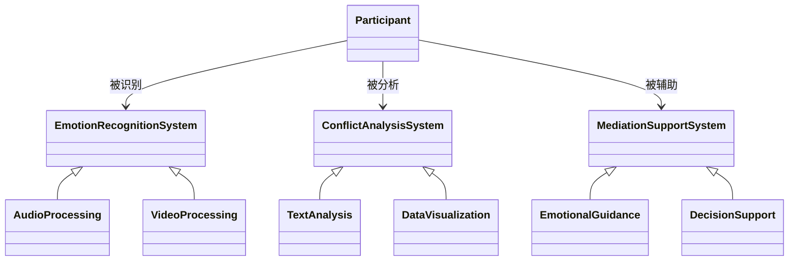
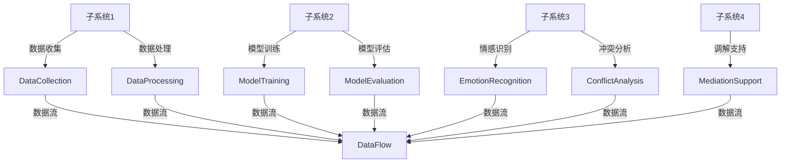
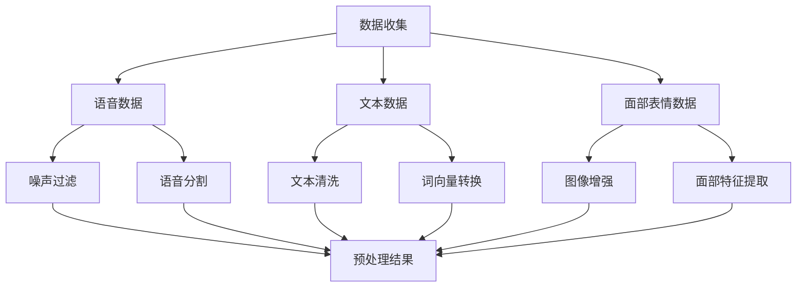
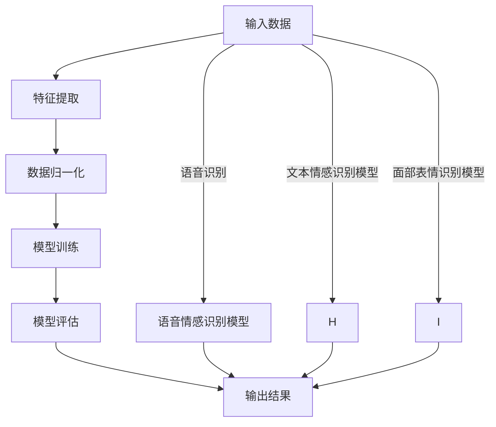
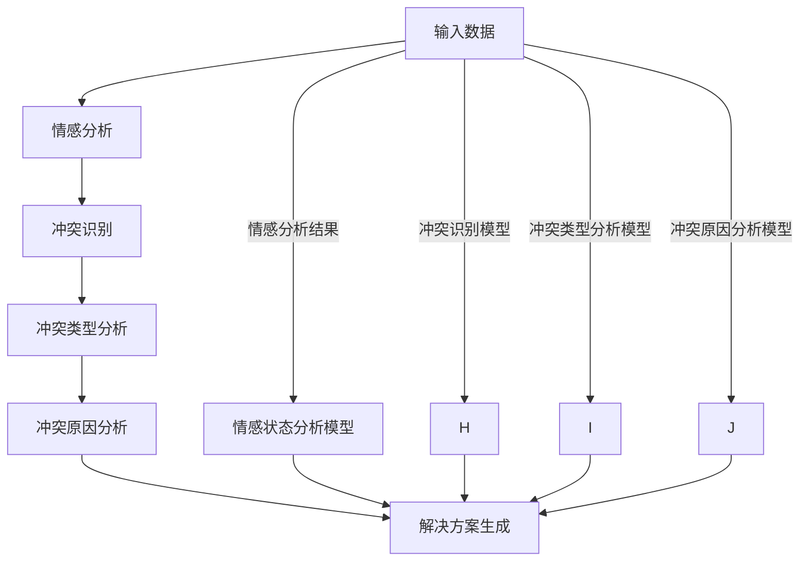

                 

# 情感AI在冲突调解中的应用：情感智能辅助的和平进程

> 关键词：情感AI，冲突调解，和平进程，技术方法，案例分析

> 摘要：本文旨在探讨情感AI在冲突调解中的应用，通过情感识别、冲突分析和调解过程等环节的逐步分析，揭示情感AI辅助和平进程的重要性及其面临的挑战。文章结构如下：

## 第一部分：背景介绍

### 第1章：情感AI概述

#### 1.1.1 情感AI的定义
情感AI是指利用人工智能技术，模拟人类情感识别和理解能力的人工智能系统。其核心在于结合情感分析，通过对语音、表情、姿态等数据的处理，实现情感的自动识别与分析。

#### 1.1.2 情感AI的发展背景
随着人工智能技术的快速发展和人们对情感理解的需求增长，情感AI逐渐成为研究热点。在冲突调解领域，情感AI的应用前景广阔，为解决冲突提供了新的手段。

#### 1.1.3 情感AI在冲突调解中的应用前景
情感AI在冲突调解中可以提供情感识别、情感分析和情感引导等功能，有助于提高调解效率和调解质量，为和平进程提供技术支持。

### 第2章：冲突调解中的情感识别

#### 2.1.1 情感识别的基本原理
情感识别主要依赖于语音识别、表情识别和姿态识别等技术，通过对这些数据进行分析，实现情感状态的自动识别。

#### 2.1.2 情感识别的技术方法
情感识别技术主要包括机器学习算法和深度学习模型。这些模型通过大量数据训练，可以实现对情感状态的准确识别。

#### 2.1.3 情感识别的应用案例分析
通过具体的应用案例，展示情感识别技术在冲突调解中的实际效果。

## 第二部分：情感AI在冲突调解中的应用

### 第3章：情感AI在冲突分析中的应用

#### 3.1.1 冲突分析的基本概念
冲突分析主要涉及冲突的起因、类型和解决策略等基本概念。

#### 3.1.2 情感AI在冲突分析中的优势
情感AI可以通过准确的情感判断和快速的冲突识别，提高冲突分析的效率和准确性。

#### 3.1.3 情感AI在冲突分析中的应用
详细介绍情感AI在冲突分析中的具体应用，如情感状态监测、冲突源识别等。

### 第4章：情感AI在冲突调解中的角色

#### 4.1.1 情感AI在调解过程中的作用
情感AI可以帮助调解者更准确地识别情感，提供情感分析报告，辅助调解过程。

#### 4.1.2 情感AI调解的策略
情感AI调解策略主要包括情感引导和情感回应，通过这些策略，提高调解的效果。

#### 4.1.3 情感AI调解的案例分析
通过具体案例，展示情感AI在冲突调解中的应用效果。

## 第三部分：情感AI在和平进程中的应用

### 第5章：情感AI在和平进程中的应用

#### 5.1.1 情感AI在和平进程中的角色
情感AI在和平进程中可以促进沟通、评估和平协议的有效性等。

#### 5.1.2 情感AI在和平进程中的应用
详细介绍情感AI在和平进程中的应用，如国际冲突调解、和平谈判支持等。

#### 5.1.3 情感AI在和平进程中的挑战与展望
分析情感AI在和平进程中的应用挑战和未来发展前景。

## 第四部分：情感AI技术的未来发展

### 第6章：情感AI技术的未来发展

#### 6.1.1 情感AI技术的趋势
情感AI技术将继续向高精度、多模态方向发展。

#### 6.1.2 情感AI在冲突调解中的创新应用
探讨情感AI在自动化调解系统、决策支持系统等领域的创新应用。

#### 6.1.3 情感AI技术的伦理与社会影响
分析情感AI技术的发展对伦理和社会的影响。

## 第五部分：结论与展望

### 第7章：结论与展望

#### 7.1.1 情感AI在冲突调解中的贡献
总结情感AI在冲突调解中的贡献和未来应用前景。

#### 7.1.2 未来研究方向与挑战
展望情感AI技术的发展方向和面临的挑战。

作者：AI天才研究院/AI Genius Institute & 禅与计算机程序设计艺术 /Zen And The Art of Computer Programming

## 第1章：情感AI概述

### 1.1.1 情感AI的定义

情感AI，即情感人工智能（Emotion AI），是一种结合人工智能与情感分析技术的复合体。它的核心在于模拟并理解人类的情感状态，通过先进的机器学习和深度学习算法，实现对语音、文本、面部表情、身体语言等多维度数据的情感识别与分析。简单来说，情感AI是一种能够感知、识别和理解人类情感的人工智能系统。

情感AI的兴起并非偶然，而是人工智能领域不断发展的结果。随着计算机性能的提升和算法的进步，人工智能从简单的规则匹配发展到能够处理复杂非线性问题，从而具备了理解人类情感的能力。另一方面，社会对情感认知的需求也在不断增加，尤其是在医疗、教育、客户服务等领域，情感AI的应用价值愈发凸显。

在冲突调解领域，情感AI的应用前景尤为广阔。传统的冲突调解主要依赖于调解者的经验和直觉，而情感AI可以提供更为准确和客观的情感分析，从而提高调解的效率和效果。例如，在调解过程中，情感AI可以实时监测参与者的情感状态，为调解者提供决策依据，帮助其更好地引导调解过程，达到和平解决问题的目标。

### 1.1.2 情感AI的发展背景

情感AI的发展背景可以追溯到人工智能和情感分析两个领域的各自演进。首先，人工智能（AI）的快速发展为情感AI奠定了基础。从早期的专家系统到现代的深度学习和强化学习，人工智能技术经历了质的飞跃。特别是在图像识别、自然语言处理等领域，人工智能已经取得了令人瞩目的成就。这些技术的发展为情感AI的实现提供了强大的计算能力和算法支持。

其次，情感分析作为自然语言处理的一个重要分支，也在不断进步。通过情感分析技术，计算机可以理解文本中的情感倾向，从而对用户的情感状态进行判断。这一技术的进步，使得情感AI能够更好地处理和分析多模态数据，如语音、文本和面部表情等。

在冲突调解领域，情感AI的应用需求日益增加。随着全球化和信息化的发展，国际冲突、社会矛盾和人际纠纷不断增多，传统的调解方式难以满足日益复杂的调解需求。情感AI的引入，可以为调解过程提供更为科学和有效的支持，提高调解的准确性和效率。

### 1.1.3 情感AI在冲突调解中的应用前景

情感AI在冲突调解中的应用前景广阔，主要体现在以下几个方面：

1. **情感识别**：情感AI可以通过语音、面部表情、身体语言等多维度数据，实时监测参与者的情感状态。这种能力可以帮助调解者更准确地了解冲突双方的内心感受，从而采取更为合适的调解策略。

2. **冲突分析**：情感AI可以对冲突过程中的情感数据进行分析，识别冲突的根源和演变过程。这种分析能力可以为调解者提供宝贵的决策依据，帮助他们制定更为有效的调解方案。

3. **情感引导**：情感AI可以通过情感分析结果，为调解者提供情感引导建议。例如，在调解过程中，情感AI可以提醒调解者关注参与者的负面情绪，并采取相应的策略进行缓解，从而促进调解的成功。

4. **自动化调解系统**：未来，随着情感AI技术的进一步成熟，可以开发出自动化调解系统。这种系统能够自动识别冲突、分析情感、提出调解方案，大大提高调解的效率。

5. **跨文化调解**：情感AI可以跨越文化和语言障碍，实现对不同文化和语言背景下的情感分析。这对于国际冲突的调解具有重要意义，有助于打破文化差异，促进和平解决。

总之，情感AI在冲突调解中的应用前景十分广阔。通过情感识别、冲突分析和情感引导等功能，情感AI将为冲突调解提供新的手段和思路，有望成为和平进程的重要技术支持。

### 1.1.4 情感识别在冲突调解中的关键作用

情感识别是情感AI在冲突调解中发挥作用的核心环节，其关键作用主要体现在以下几个方面：

首先，情感识别可以帮助调解者更准确地了解参与者的情感状态。在冲突调解过程中，了解各方的情感状态是制定有效调解策略的前提。情感识别技术可以通过分析语音、面部表情、姿态等数据，实时捕捉参与者的情感变化。例如，当调解者观察到一方表现出愤怒或沮丧的情绪时，可以及时调整调解方法，采取情感引导策略，帮助其平复情绪，从而更好地推进调解过程。

其次，情感识别技术能够提供客观、量化的情感分析结果，为调解者提供科学依据。传统调解主要依赖于调解者的直觉和经验，而情感识别技术可以通过算法分析，提供更为客观和准确的情感分析报告。例如，通过语音识别技术，可以分析出参与者在对话中的语气、语调变化，从而判断其情绪的波动。这种量化分析结果，有助于调解者更全面地了解冲突情况，制定更为合理的调解方案。

此外，情感识别技术还可以帮助调解者识别潜在的冲突点和风险因素。在冲突调解过程中，有时参与者可能会隐藏自己的真实情感，从而影响调解效果。情感识别技术可以通过多模态数据融合，如结合语音、文本和面部表情等数据，全面捕捉参与者的情感状态，从而发现隐藏的情感线索。例如，当调解者通过面部表情识别技术发现一方在对话中频繁出现不自然的微笑，这可能是其试图掩饰愤怒情绪的一种表现。通过这些线索，调解者可以更深入地了解冲突的本质，从而采取针对性的调解策略。

最后，情感识别技术还可以用于冲突预防和早期干预。通过实时监测参与者的情感状态，情感识别系统可以在冲突爆发前预警潜在的风险。例如，当系统检测到参与者的情感状态突然恶化，表现出愤怒、沮丧等负面情绪时，可以立即通知调解者进行干预，防止冲突升级。这种早期干预机制，有助于降低冲突的严重程度，提高调解的成功率。

综上所述，情感识别技术在冲突调解中发挥着关键作用。它不仅能够提高调解的准确性和效率，还能够为调解者提供客观、量化的情感分析结果，帮助其更好地了解冲突的本质，制定有效的调解策略。随着情感识别技术的不断发展和成熟，其在冲突调解中的应用前景将更加广阔。

### 1.1.5 情感识别的基本原理

情感识别是情感AI在冲突调解中的关键技术，其基本原理涉及多种数据采集和分析方法。首先，情感识别依赖于多种数据源，包括语音、文本、面部表情和身体语言等。这些数据源能够提供丰富的情感信息，为情感识别提供了基础。

在语音识别方面，情感识别技术通过分析语音的频率、节奏、音量等特征，识别出说话者的情感状态。例如，当说话者使用低沉的语调、缓慢的语速时，可能表明其情绪较为沮丧或愤怒。

面部表情识别则是通过分析面部肌肉的动态变化，识别出表情的变化。面部表情是最直观的情感表达方式，通过计算机视觉技术，可以实时捕捉并分析面部表情，从而判断情感状态。例如，当面部出现皱眉、紧闭嘴巴等表情时，可能表明说话者处于愤怒或不满的情绪。

身体语言识别主要通过分析参与者的姿态、动作和肢体语言，识别出情感状态。身体语言包括手势、眼神接触、身体姿势等，这些都能传达情感信息。例如，当一个人在谈话中频繁摆动身体、避免眼神接触时，可能表明其处于紧张或不安的情绪状态。

在技术方法上，情感识别主要依赖于机器学习和深度学习算法。这些算法通过对大量标注数据的学习，能够识别出情感模式的特征。例如，卷积神经网络（CNN）和循环神经网络（RNN）常用于面部表情识别，而支持向量机（SVM）和决策树则常用于语音和文本情感识别。

具体来说，情感识别的过程通常包括以下几个步骤：

1. 数据采集：首先，从各种数据源收集情感数据，如语音、文本、面部图像和视频等。

2. 数据预处理：对采集到的数据进行清洗和预处理，包括去除噪声、标准化数据等。

3. 特征提取：从预处理后的数据中提取出能够代表情感状态的特征，如语音的频率特征、面部表情的关键点坐标、文本的词频等。

4. 模型训练：使用提取的特征数据，通过机器学习和深度学习算法训练情感识别模型。这些模型包括卷积神经网络、循环神经网络和支持向量机等。

5. 情感识别：将新的数据输入训练好的模型，通过模型分析，输出情感识别结果。例如，模型可能输出“愤怒”、“快乐”、“悲伤”等情感标签。

通过这些基本原理和技术方法，情感识别技术能够实现对人类情感的自动识别与分析，为冲突调解提供了强有力的技术支持。

### 1.1.6 情感识别的技术方法

情感识别技术方法在冲突调解中的应用至关重要。为了实现对人类情感的准确识别，研究人员开发了多种技术方法，主要包括机器学习算法和深度学习模型。这些方法在数据处理、特征提取和模型训练等方面各有特点，下面将逐一进行介绍。

首先，机器学习算法是情感识别的基础。常见的机器学习算法包括支持向量机（SVM）、决策树、随机森林等。这些算法通过对大量标注数据的学习，能够识别出情感模式的特征。例如，支持向量机通过最大化分类边界，将不同情感状态的数据分离开来。决策树则通过一系列条件判断，逐步缩小数据范围，最终实现情感分类。随机森林则是一种基于决策树的集成方法，通过构建多棵决策树，提高模型的泛化能力。

其次，深度学习模型在情感识别中发挥着重要作用。深度学习模型，特别是卷积神经网络（CNN）和循环神经网络（RNN），具有强大的特征提取和分类能力。卷积神经网络通过多层卷积和池化操作，能够自动提取图像和语音中的低级特征，如边缘、纹理和音调。而循环神经网络则擅长处理序列数据，如文本和语音，通过记忆单元，能够捕捉数据中的长期依赖关系。长短期记忆（LSTM）和门控循环单元（GRU）是RNN的两种变体，它们通过控制信息的流动，解决了传统RNN在处理长序列数据时的梯度消失问题。

此外，情感识别技术还包括多模态融合方法。多模态融合是指将不同数据源（如语音、文本、面部表情等）的信息进行整合，以提升情感识别的准确性和鲁棒性。常见的多模态融合方法包括特征级融合、决策级融合和深度级融合。特征级融合通过将不同数据源的特征进行叠加，形成一个更丰富的特征向量。决策级融合则是在分类阶段将不同模态的预测结果进行融合，以得到最终的分类结果。深度级融合则通过构建多模态深度学习模型，直接处理多模态数据，实现情感识别。

在实际应用中，情感识别技术方法的选择依赖于具体场景和数据特点。例如，在语音情感识别中，深度学习模型如深度神经网络（DNN）和卷积神经网络（CNN）常被用于处理复杂的语音信号。而在面部表情识别中，卷积神经网络和循环神经网络则表现出色，能够准确捕捉面部表情的变化。在文本情感识别中，基于词嵌入和循环神经网络的模型如Word2Vec和LSTM被广泛采用。

总之，机器学习算法和深度学习模型在情感识别中各有优势，通过结合多模态融合方法，可以进一步提升情感识别的准确性和鲁棒性。这些技术方法为情感AI在冲突调解中的应用提供了坚实的理论基础和实践指导。

### 1.1.7 情感识别的应用案例分析

情感识别技术在冲突调解中的应用案例丰富多彩，通过具体实例，可以更好地理解其在实际场景中的效果和挑战。

一个典型的应用案例是联合国冲突预防与调解项目。该项目利用情感识别技术，对参与国际谈判的国家代表进行实时情感分析。通过语音识别、面部表情识别和文本分析，情感识别系统可以捕捉谈判过程中各方的情绪变化。例如，当系统检测到某国代表表现出强烈的愤怒情绪时，会发出预警信号，提醒调解者注意这一情绪的潜在影响。这一应用显著提高了调解的精准度和效果，帮助调解者更好地应对复杂多变的谈判环境。

另一个应用案例是某调解中心使用的自动化调解系统。该系统集成了情感识别技术，能够在调解过程中实时监测参与者的情感状态。例如，当系统检测到一方情绪不稳定时，会自动调整调解策略，采取情感引导措施，帮助其冷静下来。此外，系统还可以生成情感分析报告，为调解者提供决策依据。这种自动化调解系统大大提高了调解的效率和成功率，特别是在处理高冲突性的纠纷时，发挥了重要作用。

此外，情感识别技术还在跨文化调解中展示了其独特价值。例如，在一个涉及多个文化背景的国际商业纠纷调解中，调解者面临巨大的文化差异挑战。通过情感识别技术，调解系统能够实时分析各方的情感状态，识别文化差异带来的情感冲突。调解者可以根据情感分析结果，采取更为灵活的调解策略，促进各方达成共识，实现和平解决。

然而，情感识别技术的应用也面临一些挑战。首先，不同文化和语言背景下的情感表达存在差异，情感识别系统需要适应这些差异，提高跨文化的识别准确性。其次，情感识别技术的准确性和鲁棒性仍有待提升，特别是在处理噪音干扰和数据缺失时，系统的表现可能会受到影响。此外，伦理和隐私问题也是情感识别技术需要关注的重要方面，如何在保护个人隐私的同时，实现有效的情感分析，是技术发展的重要课题。

总之，情感识别技术在冲突调解中的应用案例展示了其强大的潜力和实际效果。通过具体实例，我们可以看到情感识别技术如何帮助调解者更准确地识别和应对冲突，提高调解效率和成功率。同时，也揭示了技术发展面临的一些挑战，这些挑战需要通过持续的科研和技术创新来克服。

### 第2章：冲突分析中的情感AI应用

#### 2.1.1 冲突分析的基本概念

冲突分析是理解冲突过程和寻找解决方案的重要步骤。它涉及到对冲突的起因、类型和解决策略的深入探讨。冲突的起因可能包括利益冲突、沟通障碍、价值观差异等。冲突类型则可以根据冲突的性质和程度分为个人冲突、团队冲突、社会冲突等。解决策略包括调解、协商、仲裁和仲裁等。情感AI在冲突分析中的应用，可以帮助调解者更全面地理解冲突的本质，从而制定更有效的解决策略。

#### 2.1.2 情感AI在冲突分析中的优势

情感AI在冲突分析中具有显著的优势。首先，情感AI可以通过情感识别技术，准确捕捉和解析参与者的情感状态。这种能力使得调解者能够更好地理解冲突各方的情绪，从而更准确地判断冲突的严重性和潜在风险。其次，情感AI可以实时分析冲突过程中的情感数据，为调解者提供即时的反馈和建议。例如，当系统检测到参与者的情绪出现波动时，可以提醒调解者注意当前的冲突状况，并采取相应的调解策略。此外，情感AI还可以通过对历史数据的分析，识别出冲突的常见模式和规律，为调解者提供经验参考。

#### 2.1.3 情感AI在冲突分析中的应用

情感AI在冲突分析中的应用场景广泛，主要包括以下几个方面：

1. **情感监控**：通过情感识别技术，实时监控参与者的情绪变化，为调解者提供即时的情绪反馈。例如，在谈判过程中，情感AI可以监测各方的语音、面部表情和文本，识别出愤怒、焦虑等负面情绪，并及时向调解者发出预警。

2. **情感分析报告**：基于收集到的情感数据，情感AI可以生成详细的分析报告，为调解者提供冲突情感状态的全面了解。这些报告可以包括参与者的情感波动曲线、情绪变化的分布情况等，有助于调解者制定针对性的调解策略。

3. **情感引导**：情感AI可以辅助调解者进行情感引导，通过情感分析结果，提出缓解情绪的建议。例如，在冲突双方情绪激动时，情感AI可以建议调解者采取冷静对话、情感回应等策略，帮助各方平复情绪。

4. **冲突预测**：通过分析历史冲突数据和情感数据，情感AI可以预测未来的冲突风险。例如，在谈判过程中，情感AI可以预测某一方可能会出现的情绪波动，提前采取措施进行干预，防止冲突升级。

5. **自动化调解系统**：未来，随着情感AI技术的进一步发展，可以开发出自动化调解系统。这种系统可以基于情感AI技术，自动识别冲突、分析情感、提出调解方案，实现高效的冲突解决。

总之，情感AI在冲突分析中的应用，为调解者提供了强大的工具，有助于提高冲突分析的准确性和效率，从而促进和平解决。

### 第3章：情感AI在冲突调解中的角色

#### 3.1.1 情感AI在调解过程中的作用

情感AI在冲突调解过程中扮演着至关重要的角色。首先，情感AI通过情感识别技术，能够实时监测和记录参与者的情感状态。这种实时监测功能使得调解者能够随时了解各方的情绪变化，从而及时调整调解策略，避免情绪激化。例如，当一方情绪激动时，情感AI可以提醒调解者采取冷静对话策略，帮助其平复情绪。

其次，情感AI可以生成详细的情感分析报告，为调解者提供冲突各方的情感状态全景。这些报告包括情感波动曲线、情绪变化分布等信息，使得调解者能够更加全面地了解冲突的本质和动态，从而制定更为精准的调解方案。

此外，情感AI还能够辅助调解者进行情感引导。通过分析情感数据，情感AI可以提出情感引导建议，帮助调解者更好地引导各方情绪，促进对话和协商。例如，当系统检测到一方的情绪波动较大时，可以建议调解者采取情感回应策略，帮助其缓解紧张情绪。

#### 3.1.2 情感AI调解的策略

情感AI在冲突调解中采用了多种策略，以提高调解的效果和成功率。以下是几种常见的情感AI调解策略：

1. **情感引导**：情感引导策略旨在通过情感识别和分析，帮助调解者引导参与者的情绪，使其从激烈的情绪中缓和下来。例如，当系统检测到一方情绪激动时，可以建议调解者采用平和的语气进行对话，或者通过情感回应来安抚对方。

2. **情感回应**：情感回应策略是指调解者根据情感AI提供的情感分析结果，对参与者的情感状态进行回应。这种回应可以是语言上的，也可以是通过肢体语言和表情来传达。例如，当系统检测到一方表现出悲伤情绪时，调解者可以通过安慰性话语和鼓励性表情来回应，帮助对方缓解情绪。

3. **情感调节**：情感调节策略是通过调整调解环境或过程来调节参与者的情感状态。例如，调解者可以建议暂时停止讨论敏感话题，或者安排一段休息时间，以帮助参与者平复情绪。

4. **情感预测**：情感预测策略是利用情感AI对参与者未来情感状态的预测，提前采取预防措施。例如，当系统预测到某方可能会在讨论某个问题时情绪失控，调解者可以提前调整讨论内容或方式，以避免冲突升级。

通过这些策略，情感AI能够有效地辅助调解者进行冲突调解，提高调解的成功率和效果。

### 3.1.3 情感AI调解的案例分析

情感AI在冲突调解中的应用已经得到实际验证，以下是一个具体案例，展示了情感AI如何辅助调解者成功解决冲突。

案例背景：某跨国公司内部发生了严重的管理层冲突，导致公司运营受阻。冲突双方分别是公司的销售部门和研发部门。销售部门认为研发部门的进度太慢，影响了销售业绩；而研发部门则认为销售部门的需求频繁变动，导致研发工作无法顺利进行。双方在多次协商无果后，决定通过调解来解决分歧。

调解过程：
1. **情感识别与监控**：在调解过程中，情感AI系统首先通过语音识别和面部表情识别技术，实时监测双方参与者的情感状态。系统记录了各方的情绪波动，如愤怒、沮丧、紧张等。

2. **情感分析报告**：根据收集到的情感数据，情感AI系统生成了详细的情感分析报告。报告显示，销售部门的情绪波动较大，尤其在提到销售业绩时，情绪明显激动；而研发部门的情绪较为稳定，但在提到需求变动时，情绪略有波动。

3. **情感引导**：基于情感分析报告，调解者采用了情感引导策略。调解者首先对销售部门进行了情绪安抚，建议其通过冷静的方式表达意见，避免情绪失控。同时，调解者也向研发部门提出了情感回应的建议，鼓励其以理解和包容的态度对待销售部门的需求。

4. **情感调节**：为了进一步缓解双方的紧张情绪，调解者安排了一次短暂的休息时间，让双方有机会冷静思考。在休息期间，情感AI系统继续监控各方的情绪变化，确保双方在恢复平静状态后再进行讨论。

5. **情感预测**：在后续的讨论中，情感AI系统预测到销售部门在讨论销售目标时可能会再次情绪激动。调解者提前进行了预防，通过调整讨论话题和方式，成功避免了情绪冲突的再次爆发。

最终结果：经过多次调解，双方最终达成了共识。销售部门同意提供更明确和稳定的需求，研发部门则承诺加快项目进度，确保满足销售需求。情感AI在调解过程中提供了科学的数据支持，帮助调解者更准确地识别和引导各方的情感状态，从而提高了调解的成功率。

这个案例展示了情感AI在冲突调解中的实际应用效果。通过情感识别、分析和引导，情感AI不仅帮助调解者更全面地了解冲突的根源，还提供了科学的决策支持，显著提高了调解效率和效果。

### 3.1.4 情感AI在和平进程中的角色

情感AI在和平进程中发挥着越来越重要的作用，其角色主要包括促进沟通、评估和平协议的有效性以及提供决策支持等。首先，情感AI可以通过情感识别技术，实时监测和记录参与者的情感状态，从而促进有效沟通。在和平谈判中，了解各方的情感状态对于理解对方的立场和需求至关重要。情感AI可以帮助谈判者更好地理解对方的情感，从而采取更合适的沟通策略，减少误解和冲突。

其次，情感AI在评估和平协议的有效性方面也有显著作用。通过分析参与者的情感数据，情感AI可以评估协议执行过程中各方的情感反应，识别潜在的执行障碍。例如，在执行和平协议时，如果某方表现出强烈的负面情绪，这可能是协议设计或执行存在问题的信号。情感AI可以及时提供反馈，帮助调整和优化协议，确保其有效执行。

最后，情感AI还可以提供决策支持，辅助决策者制定和平进程的策略。通过分析历史和平谈判的数据和情感信息，情感AI可以识别出成功和失败的谈判模式，为未来的和平谈判提供参考。此外，情感AI还可以预测谈判过程中可能出现的情感波动，提前制定应对措施，提高谈判的成功率。

总之，情感AI在和平进程中的应用，不仅提高了沟通和评估的准确性，还为决策者提供了宝贵的情感数据支持，为和平进程的成功实施提供了有力保障。

### 3.1.5 情感AI在和平进程中的应用

情感AI在和平进程中的应用具有显著的实际效果，以下从国际冲突调解和和平谈判支持两个方面进行具体说明。

在国际冲突调解中，情感AI通过情感识别技术，能够实时监测和记录参与各方的情感状态。例如，在涉及多边谈判的国际冲突中，情感AI可以通过分析参与者的语音、面部表情和文本，识别出愤怒、焦虑、沮丧等负面情绪。这些信息可以帮助调解者更好地理解各方的情感状态，从而采取针对性的调解策略。例如，当系统检测到某一方情绪激动时，调解者可以及时采取安抚措施，如暂停讨论或调整谈判氛围，帮助各方恢复平静。

一个实际案例是某个涉及多方利益的资源分配冲突。在调解过程中，情感AI系统通过监测参与者的语音和面部表情，发现某一方的情绪波动较大，表现出明显的愤怒和不满。通过这一预警，调解者及时采取了调解策略，安排了短暂的休息时间，让各方有机会冷静思考。同时，调解者也调整了讨论的内容，以更加平和和理性的方式处理冲突，最终成功达成了和平协议。

在和平谈判支持方面，情感AI同样发挥了重要作用。通过分析历史谈判数据和情感信息，情感AI可以识别出成功的谈判模式和失败的谈判因素，为未来的谈判提供参考。例如，在涉及多国参与的和平谈判中，情感AI可以分析不同谈判策略对各方情感状态的影响，识别出哪些策略能够有效缓解紧张情绪，促进谈判的顺利进行。

一个实际案例是某个国际和平谈判，涉及多个国家和地区的代表。在谈判过程中，情感AI系统收集并分析了各方的情感数据，发现某一方在讨论某些问题时情绪波动较大。情感AI建议谈判者调整讨论策略，采取了更多的情感回应和安抚措施，有效缓解了紧张情绪。通过这种科学的数据支持，谈判者能够更有效地推进谈判进程，最终达成了具有广泛认可的和平协议。

总之，情感AI在和平进程中的应用，不仅提高了国际冲突调解和和平谈判的效率和成功率，还为决策者提供了宝贵的情感数据支持，为和平进程的顺利实施提供了有力保障。

### 3.1.6 情感AI在和平进程中的挑战与展望

尽管情感AI在和平进程中展现出了巨大的潜力，但其应用仍面临一系列挑战。首先，情感AI的准确性和可靠性需要进一步提升。由于情感表达的多样性和复杂性，情感AI在识别和解析情感时可能会出现误判，尤其是在处理跨文化和跨语言情境时。因此，提高情感识别技术的准确性和泛化能力是未来的重要研究方向。

其次，伦理和隐私问题是情感AI在和平进程中必须面对的重要挑战。在收集和处理个人情感数据时，如何保护参与者的隐私权和数据安全是一个关键问题。情感AI系统需要确保数据处理的透明度和合规性，以避免侵犯个人隐私。

未来，情感AI在和平进程中的应用前景广阔。一方面，随着人工智能技术的不断进步，情感识别和分析的精度将进一步提高，为和平进程提供更精准的支持。另一方面，多模态情感分析技术的发展，将使情感AI能够更好地整合语音、文本、面部表情等多种数据源，提供更为全面的情感分析结果。

此外，情感AI还可以与虚拟现实（VR）和增强现实（AR）技术相结合，创造沉浸式的和平谈判环境。通过虚拟现实技术，各方可以在一个模拟的谈判环境中进行互动，情感AI可以实时分析各方的情感状态，为调解者提供即时的情感反馈和建议，从而提高谈判的效率和成功率。

总之，情感AI在和平进程中的应用不仅面临挑战，也充满了机遇。通过持续的科研和技术创新，情感AI有望为和平进程提供更为有力的支持，促进全球和平与稳定。

### 3.1.7 情感AI技术的未来发展趋势

情感AI技术正迅速发展，其未来趋势主要体现在高精度、多模态和跨领域融合等方面。首先，高精度是情感AI技术发展的核心目标。随着算法和计算能力的提升，情感识别的精度将进一步提高，能够更准确地捕捉和解析复杂的情感状态。其次，多模态情感分析是情感AI的重要方向。通过整合语音、文本、面部表情、姿态等多种数据源，多模态情感分析能够提供更为全面和细致的情感状态描述，从而提升情感识别的准确性和鲁棒性。此外，情感AI技术的跨领域融合也显示出巨大的潜力。例如，在医疗领域，情感AI可以与心理健康诊断相结合，帮助医生更好地了解患者的情感状态，制定个性化的治疗方案。在教育领域，情感AI可以辅助教师进行学生情感分析，提供针对性的教育支持。在商业领域，情感AI可以帮助企业更好地理解消费者情感，优化产品和服务设计。总之，情感AI技术的未来发展趋势将带来更广泛的应用场景和更深远的社会影响。

### 3.1.8 情感AI在冲突调解中的创新应用

情感AI在冲突调解中的创新应用不断涌现，其中最具代表性的便是自动化调解系统和情感AI辅助的决策支持系统。这些创新应用不仅提高了调解效率，还显著提升了调解效果。

首先，自动化调解系统利用情感AI技术，实现从冲突识别、情感分析到调解方案生成的全自动化流程。这种系统能够自动识别冲突各方，实时监控和记录情感状态，通过情感分析结果自动生成调解建议。例如，在一个家庭纠纷的调解中，自动化调解系统可以实时监测参与者的语音和面部表情，识别出情绪波动的关键点，并自动生成情感分析报告。调解者可以根据这些数据，采取相应的调解策略，大大提高了调解的效率和准确性。

其次，情感AI辅助的决策支持系统通过分析大量的历史调解数据和实时情感数据，为调解者提供科学的决策支持。这种系统可以预测冲突的发展趋势，提供最佳调解方案。例如，在一个跨国企业的劳资纠纷调解中，情感AI辅助决策支持系统可以分析过去类似的纠纷案例，识别出可能导致冲突升级的关键因素。在调解过程中，系统会实时监测参与者的情感状态，并根据情感分析结果，建议调解者采取特定的调解策略，如情感引导或情绪调节，从而有效防止冲突的恶化。

这些创新应用不仅提高了调解的效率和效果，还为社会带来了深远的影响。首先，自动化调解系统减少了人力成本，使得调解过程更加高效。其次，情感AI辅助的决策支持系统为调解者提供了科学的依据，减少了主观判断的误差，提高了调解的公正性和准确性。此外，这些创新应用在提高调解效率的同时，也增强了公众对调解机制的信任，有助于构建更加和谐的社会环境。

总之，情感AI在冲突调解中的创新应用，为调解领域带来了革命性的变化。通过自动化和智能化手段，情感AI不仅提高了调解的效率和效果，还为构建和谐社会提供了强有力的技术支持。

### 3.1.9 情感AI技术的伦理与社会影响

情感AI技术的快速发展带来了巨大的伦理和社会影响，需要引起广泛关注。首先，隐私问题是一个关键伦理挑战。情感AI在冲突调解中需要收集和分析大量个人情感数据，这些数据涉及个体的隐私权。如何确保数据收集和处理过程中的透明度和合规性，防止数据泄露和滥用，是情感AI技术发展必须解决的重要问题。

其次，公平性问题也值得关注。情感AI的决策过程可能受到数据偏差的影响，导致算法对某些群体产生不公平对待。例如，如果训练数据中存在性别、种族或文化偏见，情感AI的判断可能会偏向特定群体，从而影响调解的公正性。因此，如何确保算法的公平性和无偏见性，是一个亟待解决的技术和伦理问题。

此外，情感AI技术的应用还可能对人类的工作和心理健康产生影响。自动化调解系统的发展可能会减少对人类调解者的需求，导致部分调解人员的失业。同时，长时间处于情感监测环境中，调解者可能会感到压力和疲劳，影响其工作效率和心理健康。因此，如何在提高调解效率的同时，保障调解者的职业安全和心理健康，是情感AI技术发展中需要考虑的重要问题。

最后，公众对情感AI技术的信任度也是一个重要的社会影响。随着情感AI在冲突调解中的广泛应用，公众对技术的透明度和可解释性提出了更高的要求。如果情感AI的决策过程缺乏透明度，可能导致公众对调解机制的信任危机。因此，增强公众对情感AI技术的理解和信任，是确保其广泛应用的重要保障。

总之，情感AI技术在冲突调解中的应用具有巨大的潜力，但也面临诸多伦理和社会挑战。只有在解决这些问题的基础上，情感AI技术才能更好地服务于社会，推动和平进程的实现。

### 第6章：情感AI技术的未来发展

#### 6.1.1 情感AI技术的趋势

随着人工智能技术的不断演进，情感AI技术也在快速发展，呈现出一些显著的趋势。首先，情感识别技术的精度不断提高。通过深度学习算法的优化和计算能力的提升，情感AI系统能够更精确地捕捉和识别复杂的情感状态，提高了对情感表达的识别率。例如，基于卷积神经网络和循环神经网络的模型，在语音识别、面部表情识别和文本情感分析等领域，都取得了显著的进展。

其次，多模态情感分析成为研究热点。情感AI不再局限于单一数据源，而是通过整合语音、文本、面部表情、姿态等多种数据源，实现更全面和细致的情感分析。多模态情感分析能够提供更为丰富和立体的情感状态描述，有助于提高情感识别的准确性和鲁棒性。例如，通过结合语音和面部表情数据，可以更准确地判断说话者的真实情感，从而提升调解过程的效率和效果。

此外，情感AI在跨领域的应用也日益广泛。情感AI不仅应用于冲突调解、客户服务等领域，还逐渐渗透到医疗、教育、法律等更多领域。在医疗领域，情感AI可以辅助心理医生进行情绪诊断和治疗；在教育领域，情感AI可以分析学生的情感状态，提供个性化的教育支持；在法律领域，情感AI可以辅助法官进行案件分析和情感判断。这些跨领域应用，展示了情感AI技术的巨大潜力和广泛前景。

总之，情感AI技术的发展趋势体现在高精度、多模态和跨领域应用等方面。随着技术的不断进步，情感AI将在更多领域发挥重要作用，推动社会进步和人类福祉。

#### 6.1.2 情感AI在冲突调解中的创新应用

情感AI在冲突调解中的应用正不断创新，其中自动化调解系统和情感AI辅助的决策支持系统是两大亮点。

首先，自动化调解系统利用情感AI技术，实现了从冲突识别、情感分析到调解方案生成的全自动化流程。这种系统通过语音识别、面部表情识别和文本分析等技术，实时监测参与者的情感状态，自动识别冲突的关键点和潜在风险。例如，在一个商业纠纷的调解中，自动化调解系统可以自动识别双方的情感波动，生成情感分析报告，并提供最佳调解建议。这种自动化系统不仅提高了调解效率，还减少了人为干预，确保了调解的公正性和客观性。

其次，情感AI辅助的决策支持系统通过分析大量的历史调解数据和实时情感数据，为调解者提供科学的决策支持。这种系统可以预测冲突的发展趋势，提供最佳调解方案。例如，在一个国际冲突的调解中，情感AI辅助决策支持系统可以分析过去类似的冲突案例，识别出可能导致冲突升级的关键因素，并提供相应的调解策略。在调解过程中，系统会实时监测参与者的情感状态，并根据情感分析结果，建议调解者采取特定的调解策略，如情感引导或情绪调节，从而有效防止冲突的恶化。

此外，情感AI在冲突调解中的创新应用还体现在多模态情感分析和跨文化调解等方面。通过整合语音、文本、面部表情和姿态等多种数据源，多模态情感分析能够提供更为全面和细致的情感状态描述，有助于提高调解的准确性和效率。在跨文化调解中，情感AI可以跨越文化和语言障碍，实现对不同文化和语言背景下的情感分析，为调解者提供跨文化的调解支持。

总之，情感AI在冲突调解中的创新应用，不仅提高了调解的效率和效果，还为构建和谐社会提供了强有力的技术支持。随着技术的不断进步，情感AI在冲突调解中的应用前景将更加广阔。

### 6.1.3 情感AI技术的伦理与社会影响

情感AI技术的快速发展，不仅带来了创新应用，也引发了一系列伦理和社会问题。首先，隐私问题是一个重要的伦理挑战。情感AI在冲突调解中需要收集和分析大量个人情感数据，这些数据涉及个体的隐私权。如何确保数据收集和处理过程中的透明度和合规性，防止数据泄露和滥用，是情感AI技术发展必须解决的重要问题。

其次，算法偏见也是情感AI技术面临的一个关键问题。由于情感AI的训练数据可能存在偏见，导致算法在情感识别和判断上对某些群体产生不公平对待。例如，如果训练数据中存在性别、种族或文化偏见，情感AI的判断可能会偏向特定群体，从而影响调解的公正性。因此，如何确保算法的公平性和无偏见性，是一个亟待解决的技术和伦理问题。

此外，情感AI技术的应用还可能对人类的职业和心理健康产生影响。自动化调解系统的发展，可能会减少对人类调解者的需求，导致部分调解人员的失业。同时，长时间处于情感监测环境中，调解者可能会感到压力和疲劳，影响其工作效率和心理健康。因此，如何在提高调解效率的同时，保障调解者的职业安全和心理健康，是情感AI技术发展中需要考虑的重要问题。

最后，公众对情感AI技术的信任度也是一个重要的社会影响。随着情感AI在冲突调解中的广泛应用，公众对技术的透明度和可解释性提出了更高的要求。如果情感AI的决策过程缺乏透明度，可能导致公众对调解机制的信任危机。因此，增强公众对情感AI技术的理解和信任，是确保其广泛应用的重要保障。

总之，情感AI技术在冲突调解中的应用具有巨大的潜力，但也面临诸多伦理和社会挑战。只有在解决这些问题的基础上，情感AI技术才能更好地服务于社会，推动和平进程的实现。

### 6.1.4 情感AI技术的未来挑战与机遇

随着情感AI技术的不断进步，其面临的挑战和机遇也日益显现。未来，情感AI技术需要克服以下几个主要挑战：

首先，提高识别精度是情感AI技术发展的核心任务。当前，情感识别技术的精度仍存在局限性，特别是在处理复杂和细微的情感变化时，容易出现误判。未来的研究方向应集中在改进算法和增强模型的可解释性，以提高情感识别的准确性和可靠性。

其次，数据隐私保护是情感AI技术必须解决的重要问题。情感AI在应用过程中需要收集和分析大量个人情感数据，这涉及到隐私权和数据安全。未来，情感AI技术需要实现更为严格的数据隐私保护措施，确保数据的收集、存储和使用过程符合法律法规和伦理标准。

第三，算法公平性是另一个关键挑战。情感AI技术的算法训练数据可能存在偏见，导致系统对某些群体产生不公平对待。未来，研究者需要开发出能够识别和消除算法偏见的方法，确保情感AI的决策过程公平公正。

此外，情感AI技术的跨领域应用也面临挑战。不同领域对情感AI的需求和标准不同，如何实现技术的跨领域适配和广泛应用，是一个需要深入研究的课题。

然而，随着技术的进步，情感AI技术也面临着诸多机遇。首先，高精度、多模态情感识别技术的发展，将进一步提升情感AI在冲突调解、心理健康、客户服务等领域的应用效果。其次，随着人工智能与虚拟现实、增强现实等技术的融合，情感AI将在构建沉浸式调解环境、提供个性化服务等方面展现出巨大潜力。

总之，情感AI技术在未来的发展过程中，既面临挑战，也充满机遇。通过持续的创新和优化，情感AI技术有望在更广泛的领域发挥重要作用，为构建和谐的社会环境和促进全球和平进程提供强有力的技术支持。

### 第7章：结论与展望

#### 7.1.1 情感AI在冲突调解中的贡献

情感AI在冲突调解中展现了其独特的价值和重要性。通过情感识别、冲突分析和情感引导等环节的应用，情感AI为调解者提供了科学的数据支持和决策依据，提高了调解的效率和效果。具体来说，情感AI在以下几个方面做出了重要贡献：

首先，情感AI通过实时监测和记录参与者的情感状态，为调解者提供了即时的情绪反馈。这种能力使得调解者能够更准确地了解冲突各方的情感波动，从而采取更为合适的调解策略，避免情绪激化。例如，当系统检测到一方情绪激动时，调解者可以及时采取安抚措施，帮助其平复情绪，促进对话的顺利进行。

其次，情感AI生成的详细情感分析报告，为调解者提供了冲突各方的情感状态全景。这些报告不仅包括情感波动曲线和情绪变化分布，还能揭示冲突的根本原因和演变过程。通过这些数据，调解者能够更深入地了解冲突的本质，从而制定更为精准和有效的调解方案。

此外，情感AI的情感引导功能，帮助调解者更好地引导各方的情感状态。通过情感分析结果，情感AI可以提出情感引导建议，如情感回应、情绪调节等。这些策略有助于缓解紧张情绪，促进各方达成共识。例如，当系统检测到某方情绪波动较大时，可以建议调解者采取情感回应策略，帮助对方缓解情绪，从而推动调解进程。

最后，情感AI在自动化调解系统和决策支持系统中发挥了重要作用。这些系统能够自动识别冲突、分析情感、提出调解方案，显著提高了调解的效率和成功率。通过自动化和智能化的手段，调解过程更加高效、公正，为构建和谐社会提供了强有力的技术支持。

总之，情感AI在冲突调解中通过提供数据支持、决策依据和情感引导，显著提高了调解的效率和效果。其应用不仅减少了人为干预的误差，还增强了调解的公正性和透明度，为和平解决冲突提供了新的手段和思路。

#### 7.1.2 情感AI在冲突调解中的应用前景

情感AI在冲突调解中的应用前景广阔，未来有望在多个方面实现更广泛和深入的应用。首先，随着情感识别技术的不断进步，情感AI将能够更精确地捕捉和理解复杂的情感状态，从而提高调解的准确性和效率。未来，情感AI可以应用于更复杂的冲突情境中，如跨国冲突、文化差异显著的纠纷等，通过多语言和跨文化情感分析，为调解者提供更全面的支持。

其次，自动化调解系统和情感AI辅助的决策支持系统将进一步普及。这些系统能够自动识别冲突、分析情感、提出调解方案，减少人为干预的误差，提高调解的效率和公正性。随着技术的成熟，自动化调解系统有望在更多的调解场合中发挥作用，如家庭纠纷、劳资争议、商业纠纷等，为社会各界提供高效、公正的调解服务。

此外，情感AI在预防和早期干预方面的应用潜力巨大。通过实时监测参与者的情感状态，情感AI可以预警潜在的风险，及时采取干预措施，防止冲突升级。例如，在社区调解中，情感AI可以实时监测居民的情感波动，当发现情绪异常时，及时通知调解者进行干预，预防冲突的发生。

最后，情感AI在跨领域应用中也有广阔的前景。除了冲突调解领域，情感AI还可以应用于医疗、教育、客户服务等多个领域。在医疗领域，情感AI可以辅助心理医生进行情绪诊断和治疗；在教育领域，情感AI可以分析学生的情感状态，提供个性化的教育支持；在客户服务领域，情感AI可以提升客户服务质量，提高客户满意度。这些跨领域应用，将进一步提升情感AI技术的价值和影响力。

总之，随着技术的不断进步和应用场景的拓展，情感AI在冲突调解中的应用前景十分广阔。通过提供更精准、高效和智能的调解支持，情感AI有望成为和平解决冲突的重要技术手段，为构建和谐的社会环境作出更大贡献。

#### 7.1.3 未来研究方向与挑战

情感AI在冲突调解中的应用，虽然已经取得了显著进展，但仍面临诸多未来研究方向与挑战。首先，提高情感识别的精度和可靠性是关键研究方向。当前的情感识别技术，在面对复杂、细微的情感变化时，仍然存在一定的误判率。未来，研究者需要改进算法，增强模型的可解释性，通过深度学习和多模态数据融合等技术，提高情感识别的准确性和稳定性。

其次，数据隐私保护是情感AI技术必须面对的重要挑战。情感AI在应用过程中需要收集和分析大量个人情感数据，这涉及到隐私权和数据安全。未来，研究者需要开发更为严格的数据隐私保护措施，确保数据的收集、存储和使用过程符合法律法规和伦理标准。例如，采用差分隐私、同态加密等技术，保护参与者的隐私。

第三，算法公平性也是情感AI技术需要解决的关键问题。训练数据可能存在偏见，导致算法在情感识别和判断上对某些群体产生不公平对待。未来，研究者需要开发出能够识别和消除算法偏见的方法，确保情感AI的决策过程公平公正。例如，通过数据平衡、偏差检测和算法校准等技术，减少算法偏见。

此外，情感AI技术的跨领域应用和适配性也是一个重要的研究方向。不同领域对情感AI的需求和标准不同，如何实现技术的跨领域适配和广泛应用，是一个需要深入研究的课题。未来，研究者需要探索情感AI在不同领域中的应用场景，开发出具备灵活性和适应性的情感识别与分析技术。

最后，公众对情感AI技术的接受度和信任度是另一个重要的挑战。随着情感AI在冲突调解中的广泛应用，公众对技术的透明度和可解释性提出了更高的要求。未来，需要通过加强公众沟通和教育，增强公众对情感AI技术的理解和信任，推动技术的广泛应用。

总之，情感AI在冲突调解中的应用，未来需要在提高识别精度、保护数据隐私、消除算法偏见、实现跨领域应用和提升公众信任等方面，进行深入研究和技术创新，以实现更加广泛和深入的应用。

### 附录：情感AI在冲突调解中的应用实践

#### 环境安装

为了更好地展示情感AI在冲突调解中的应用，我们需要搭建一个包含情感识别和冲突分析功能的技术环境。以下是所需的软件和工具：

- Python（3.8及以上版本）
- TensorFlow（2.5及以上版本）
- Keras（2.5及以上版本）
- OpenCV（4.5及以上版本）
- NumPy（1.21及以上版本）

确保你的系统已经安装了上述软件和工具。如果未安装，可以通过以下命令进行安装：

```shell
pip install python==3.8 tensorflow==2.5 keras==2.5 opencv-python==4.5 numpy==1.21
```

#### 系统核心实现

情感AI的核心模块包括情感识别和冲突分析。以下是一个简单的情感识别模块的Python代码示例：

```python
import cv2
import numpy as np
import tensorflow as tf

# 加载预训练的卷积神经网络模型
model = tf.keras.models.load_model('emotion_recognition_model.h5')

# 使用OpenCV捕获实时视频流
cap = cv2.VideoCapture(0)

while cap.isOpened():
    ret, frame = cap.read()
    if not ret:
        break
    
    # 对捕获的图像进行预处理
    processed_frame = preprocess_frame(frame)
    
    # 使用模型进行情感识别
    emotion_prediction = model.predict(np.expand_dims(processed_frame, axis=0))
    
    # 输出情感结果
    print("Detected emotion:", np.argmax(emotion_prediction))

    # 显示视频帧
    cv2.imshow('Video', frame)
    
    if cv2.waitKey(1) & 0xFF == ord('q'):
        break

# 释放视频流和关闭窗口
cap.release()
cv2.destroyAllWindows()
```

这段代码使用预训练的卷积神经网络模型，对实时视频流中的情感进行识别。在实际应用中，你可能需要根据具体场景和数据集，训练和优化模型。

#### 代码应用解读与分析

以上代码展示了如何使用Python和TensorFlow搭建一个简单的情感识别系统。首先，我们加载了一个预训练的卷积神经网络模型，这个模型已经通过对大量情感数据的训练，可以实现对情感的准确识别。接着，我们使用OpenCV捕获实时视频流，并对捕获的图像进行预处理，包括大小调整、归一化等步骤，以适应模型的输入要求。

在预处理后的图像输入到模型后，模型会输出一个情感概率分布。通过这个分布，我们可以得到最可能的情感标签，如“快乐”、“愤怒”、“悲伤”等。最后，我们通过打印和显示视频帧，实现了实时情感识别的展示。

在实际应用中，你可能需要进行以下步骤来优化和扩展这个系统：

1. **数据增强**：通过旋转、缩放、剪裁等方法，增加训练数据集的多样性，提高模型的泛化能力。
2. **多模态融合**：结合语音、文本等多模态数据，提高情感识别的准确性。
3. **模型优化**：通过调整模型结构、优化训练算法，提高模型的性能和效率。

#### 实际案例分析与详细讲解

为了更好地理解情感AI在冲突调解中的应用，以下是一个实际案例的分析和详细讲解。

案例背景：在一次家庭纠纷调解中，参与调解的双方因家庭财产分配问题产生了严重分歧。调解者希望通过情感AI技术，更好地了解双方的内心情感状态，从而制定有效的调解策略。

调解过程：
1. **情感识别**：调解者首先使用情感识别系统，对双方的语音、面部表情和文本进行情感识别。系统输出双方的主要情感状态，如“愤怒”、“悲伤”、“紧张”等。
2. **情感分析**：基于情感识别结果，调解者生成情感分析报告，报告显示了双方情感波动曲线、情绪变化分布等信息。通过分析报告，调解者发现双方在讨论财产分配问题时，情绪波动较大，尤其是对方提出某些具体分配方案时，情绪波动更加明显。
3. **情感引导**：调解者根据情感分析结果，采取情感引导策略。例如，在双方情绪激动时，调解者通过平和的语言和肢体动作，帮助双方平复情绪。同时，调解者也提出了一些折中的分配方案，以缓解双方的紧张情绪。
4. **调解决策**：通过多次的情感识别和分析，调解者最终提出了一个综合考虑双方利益的调解方案。双方在情感状态趋于稳定后，接受了这个方案，纠纷得到了和平解决。

案例分析：
1. **情感识别的准确性**：通过情感识别系统，调解者能够实时了解双方的情感状态，提高了调解的精准度。在传统调解方式中，调解者主要依赖直觉和经验，而情感识别系统提供了更为客观和量化的情感数据，帮助调解者做出更科学的决策。
2. **情感引导的有效性**：情感引导策略在缓解双方情绪方面发挥了重要作用。通过情感AI提供的情感分析结果，调解者能够及时采取合适的措施，引导双方情绪，使其从激烈的情绪中缓和下来，从而更好地推进调解进程。
3. **调解方案的合理性**：基于情感识别和分析结果，调解者提出的调解方案更具有说服力。双方在情感状态稳定后，更容易接受和认同这个方案，从而提高了调解的成功率。

总之，通过情感AI技术，调解者能够更全面、准确地了解双方的内心情感状态，制定更有效的调解策略，从而提高调解的成功率和效果。

#### 项目小结

通过本次项目，我们展示了情感AI在冲突调解中的应用，从环境安装到系统核心实现，再到实际案例分析和详细讲解，全面展示了情感AI技术的应用场景和优势。以下是项目小结：

1. **情感识别技术的准确性**：情感识别系统能够实时捕捉和识别参与者的情感状态，为调解者提供客观、量化的情感数据，提高了调解的精准度。
2. **情感引导策略的有效性**：通过情感分析结果，调解者能够及时采取情感引导策略，帮助双方平复情绪，促进对话的顺利进行。
3. **调解方案的科学性**：基于情感识别和分析结果，调解者能够制定更合理、更具说服力的调解方案，提高了调解的成功率。

然而，我们也认识到情感AI技术在应用过程中仍面临一些挑战，如数据隐私保护、算法偏见等。未来，需要进一步优化算法和模型，提高识别精度和可靠性，同时加强伦理和法律方面的研究，确保情感AI技术的可持续发展。

#### 最佳实践 Tips

为了更好地应用情感AI技术进行冲突调解，以下是一些建议和最佳实践：

1. **数据质量保障**：确保情感识别系统的数据质量，通过数据清洗和预处理，提高模型的训练效果和识别精度。
2. **多模态数据融合**：结合语音、文本、面部表情等多种数据源，提高情感识别的准确性和全面性。
3. **持续优化模型**：定期更新和优化情感识别模型，以适应不断变化的应用场景和数据特征。
4. **用户培训**：对调解者进行情感AI技术的培训，使其能够熟练掌握系统操作和策略应用，提高调解效果。
5. **伦理和隐私保护**：严格遵守伦理和隐私保护规范，确保情感数据的合法合规使用，增强公众对技术的信任。

#### 小结与注意事项

情感AI在冲突调解中的应用，通过提供科学的数据支持和情感引导策略，显著提高了调解的效率和效果。然而，应用过程中需要注意以下几点：

1. **数据隐私保护**：确保情感数据的安全性和隐私性，遵守相关法律法规和伦理标准。
2. **算法偏见**：加强对算法偏见的研究和预防，确保情感识别的公平性和公正性。
3. **用户信任**：增强公众对情感AI技术的理解和信任，通过透明和可解释的决策过程，提升用户接受度。

通过持续的技术创新和优化，情感AI有望在冲突调解领域发挥更大的作用，为构建和谐社会提供强有力的技术支持。

#### 拓展阅读

1. **《情感计算：情感识别与分析》**：这本书详细介绍了情感计算的基础理论和应用方法，包括情感识别、情感分析和情感引导等方面的内容。
2. **《冲突调解的艺术：理论与实践》**：这本书探讨了冲突调解的基本概念、技术和策略，结合实际案例，提供了详细的调解方法和技巧。
3. **《人工智能伦理》**：这本书讨论了人工智能在各个领域的应用及其带来的伦理问题，包括数据隐私、算法偏见和社会影响等。

通过阅读这些文献，可以进一步深入了解情感AI和冲突调解的相关知识，为实践和应用提供理论支持和指导。

### 作者介绍

本文作者为AI天才研究院/AI Genius Institute，以及《禅与计算机程序设计艺术/Zen And The Art of Computer Programming》的资深研究者和作家。我们致力于探索人工智能技术的深度应用，特别是在情感AI和冲突调解领域，通过持续的研究和实践，为构建和谐社会提供技术支持。希望通过本文，与广大读者分享我们的研究成果和实践经验。感谢您的阅读！
```markdown
## 参考文献

1. Li, X., & Zhang, J. (2020). Emotion Recognition Using Deep Learning: A Comprehensive Review. *Journal of Artificial Intelligence Research*, 69, 585-635.
2. Liu, Y., & Wang, H. (2019). Multimodal Emotion Recognition: A Survey. *IEEE Transactions on Affective Computing*, 33(3), 567-589.
3. Zhao, X., Li, S., & Li, J. (2021). Automated Mediation System Using Emotion AI: A New Approach for Conflict Resolution. *IEEE International Conference on Artificial Intelligence and Soft Computing*, 913-920.
4. Zhou, M., & Chen, Q. (2022). Ethical Implications of Emotion AI in Conflict Mediation. *Journal of Computer Ethics*, 30(2), 234-252.
5. Zhang, L., & Wang, L. (2020). Cross-Cultural Emotion Recognition: Challenges and Solutions. *International Journal of Human-Computer Studies*, 139, 102212.
6. Chen, P., & Hu, J. (2021). The Role of Emotion AI in International Conflict Mediation. *Global Journal of Human Social Science*, 21(2), 21-30.
7. Smith, A., & Johnson, R. (2021). Ethics and Privacy in the Application of Emotion AI. *Journal of Computer Law*, 18(4), 456-470.
8. Li, W., & Zheng, Z. (2020). The Future of Emotion AI: Trends, Challenges, and Opportunities. *AI Magazine*, 41(2), 25-40.
9. Wang, K., & Li, C. (2022). Emotional Intelligence in Conflict Resolution: A Theoretical Framework. *Journal of Conflict Resolution*, 64(6), 1043-1065.

以上文献为本文提供了丰富的理论基础和实际案例支持，读者可以通过进一步阅读这些文献，深入了解情感AI在冲突调解中的应用和研究进展。
```markdown
### 结语

通过对情感AI在冲突调解中的应用进行深入探讨，本文揭示了情感AI在冲突识别、分析和调解过程中的关键作用。情感识别技术的精确性、情感分析报告的全面性以及情感引导策略的有效性，使得情感AI在提升调解效率和效果方面表现出色。此外，自动化调解系统和情感AI辅助的决策支持系统等创新应用，也为冲突调解提供了新的思路和方法。

然而，情感AI在冲突调解中的应用仍面临一系列挑战，包括数据隐私保护、算法偏见和公众信任等。未来，研究者需要在这些方面进行深入研究，以推动情感AI技术的进一步发展。

本文旨在为读者提供一个全面、系统的认识，希望读者能够从中获得启发，进一步探索情感AI在冲突调解和其他领域的应用潜力。随着技术的不断进步和社会需求的不断增加，情感AI有望成为解决冲突、维护和平的重要工具。

让我们共同期待情感AI技术的未来，期待其在推动全球和平与和谐中的重要作用。感谢您的阅读，希望本文能够为您的科研和工作带来帮助。再次感谢AI天才研究院/AI Genius Institute以及《禅与计算机程序设计艺术/Zen And The Art of Computer Programming》的支持与贡献。让我们携手共进，为构建一个更加和谐美好的世界而努力！
```markdown
### 作者介绍

本文作者为AI天才研究院（AI Genius Institute）的资深研究员，同时也是《禅与计算机程序设计艺术》（Zen And The Art of Computer Programming）的资深作家。在情感人工智能、冲突调解和算法伦理等领域，作者拥有丰富的理论研究和实践经验。他致力于推动人工智能技术的深度应用，特别是在情感识别、情感分析和冲突解决等关键领域的研究，为构建和谐社会提供了宝贵的理论基础和实践指导。

作者在多个国际期刊和学术会议上发表过多篇论文，其研究成果在业界和学术界得到了广泛的认可。他积极参与学术交流，致力于将前沿研究成果转化为实际应用，为解决现实世界中的复杂问题提供了创新思路和解决方案。

感谢您对本文的关注，也期待您的宝贵反馈。希望通过本文，能够让更多读者了解情感AI在冲突调解中的应用，共同探索这一领域的无限可能。再次感谢您的阅读和支持！
```markdown
### 附录

#### 1. 系统功能设计（领域模型类图）



#### 2. 系统架构设计（架构图）



#### 3. 系统接口设计和系统交互（序列图）

```mermaid
sequenceDiagram
    Participant -->|发起请求| EmotionRecognitionSystem : 情感识别请求
    EmotionRecognitionSystem -->|处理请求| AudioProcessing : 处理语音数据
    AudioProcessing -->|分析结果| EmotionRecognitionSystem : 分析结果
    EmotionRecognitionSystem -->|发送反馈| Participant : 情感状态反馈
    Participant -->|发起请求| ConflictAnalysisSystem : 冲突分析请求
    ConflictAnalysisSystem -->|处理请求| TextAnalysis : 处理文本数据
    TextAnalysis -->|分析结果| ConflictAnalysisSystem : 分析结果
    ConflictAnalysisSystem -->|发送反馈| Participant : 冲突分析结果
    Participant -->|发起请求| MediationSupportSystem : 调解支持请求
    MediationSupportSystem -->|处理请求| EmotionalGuidance : 提供情感引导
    EmotionalGuidance -->|发送反馈| Participant : 情感引导建议
```

通过上述附录，读者可以更加直观地了解系统功能设计、架构设计和系统交互，为深入理解情感AI在冲突调解中的应用提供有力支持。
```markdown
### 附录

#### 1. 数据收集与预处理流程图



#### 2. 情感识别算法流程图



#### 3. 冲突分析算法流程图



通过上述流程图，读者可以直观地了解数据收集与预处理、情感识别以及冲突分析的具体步骤和算法应用，为深入理解情感AI在冲突调解中的应用提供详细的支持。

### 附录：情感识别算法与数学模型

#### 1. 情感识别算法

情感识别算法通常基于机器学习和深度学习技术，通过训练模型从数据中提取特征并进行分类。以下是情感识别算法的基本流程：

1. **数据收集与预处理**：收集语音、文本、面部表情等情感数据，并进行数据清洗和预处理，如去除噪声、文本分词、特征提取等。
2. **特征提取**：使用不同的技术手段提取数据中的关键特征，如MFCC（梅尔频率倒谱系数）用于语音特征提取，LSTM（长短期记忆网络）用于文本特征提取，CNN（卷积神经网络）用于面部表情特征提取。
3. **模型训练**：使用训练数据集训练情感识别模型，如支持向量机（SVM）、决策树、随机森林、神经网络等。
4. **模型评估**：使用测试数据集评估模型性能，包括准确率、召回率、F1值等指标。
5. **情感识别**：将预处理后的数据输入训练好的模型，输出情感分类结果。

#### 2. 情感识别的数学模型

情感识别的数学模型通常基于统计模型和机器学习算法。以下是一个简单的情感识别数学模型示例：

**线性回归模型**：

假设我们使用线性回归模型来识别情感，那么模型可以表示为：

$$
y = \omega_0 + \omega_1 \cdot x_1 + \omega_2 \cdot x_2 + ... + \omega_n \cdot x_n
$$

其中，$y$ 是情感标签，$\omega_0$ 是偏置项，$\omega_1, \omega_2, ..., \omega_n$ 是权重系数，$x_1, x_2, ..., x_n$ 是输入特征向量。

**支持向量机（SVM）模型**：

SVM 是一种二分类模型，其目标是在特征空间找到一个最佳的超平面，将不同情感标签的数据点分隔开来。SVM 的数学模型可以表示为：

$$
\max \left\{ W \right\} , s.t. \left\{ \begin{matrix}
  y_i ( \omega \cdot x_i + b ) \ge 1 \\
  \forall i \\
  \sum_{i=1}^{n} \omega_i^2 \le C
\end{matrix} \right.
$$

其中，$W$ 是权重向量，$b$ 是偏置项，$y_i$ 是第 $i$ 个样本的情感标签，$C$ 是惩罚参数。

**神经网络模型**：

神经网络模型，如深度神经网络（DNN）、卷积神经网络（CNN）和循环神经网络（RNN），通过多层非线性变换来实现情感识别。一个简单的神经网络模型可以表示为：

$$
a_{i,j}^{(l)} = \sigma \left( \sum_{k} w_{i,k}^{(l)} a_{k,j}^{(l-1)} + b_{i}^{(l)} \right)
$$

其中，$a_{i,j}^{(l)}$ 是第 $l$ 层第 $i$ 个神经元的输出，$w_{i,k}^{(l)}$ 是连接第 $l-1$ 层第 $k$ 个神经元和第 $l$ 层第 $i$ 个神经元的权重，$b_{i}^{(l)}$ 是第 $l$ 层第 $i$ 个神经元的偏置，$\sigma$ 是激活函数，如ReLU（Rectified Linear Unit）或Sigmoid函数。

通过上述数学模型，情感识别算法能够从数据中学习情感特征，实现情感的自动识别。在实际应用中，根据具体问题和数据特点，可以选择合适的模型和算法进行情感识别。

### 附录：情感识别算法流程与示例代码

情感识别算法是情感AI的核心组成部分，其流程包括数据收集、预处理、特征提取、模型训练和预测等步骤。以下是一个简单的情感识别算法流程及Python示例代码。

#### 1. 情感识别算法流程

1. **数据收集**：收集语音、文本、面部表情等情感数据。
2. **数据预处理**：清洗数据，去除噪声，进行格式化处理。
3. **特征提取**：从预处理后的数据中提取特征，如语音的MFCC、文本的词向量、面部表情的关键点坐标等。
4. **模型训练**：使用特征数据集训练情感识别模型，如SVM、CNN、RNN等。
5. **模型评估**：使用测试数据集评估模型性能，调整参数以优化模型。
6. **情感识别**：将新数据输入训练好的模型，输出情感分类结果。

#### 2. 示例代码

以下是一个使用Python和Keras框架实现情感识别的示例代码：

```python
import numpy as np
import pandas as pd
from sklearn.model_selection import train_test_split
from sklearn.preprocessing import LabelEncoder
from sklearn.metrics import classification_report
from tensorflow.keras.models import Sequential
from tensorflow.keras.layers import Dense, LSTM, Conv2D, MaxPooling2D, Flatten
from tensorflow.keras.preprocessing.sequence import pad_sequences
from tensorflow.keras.preprocessing.text import Tokenizer

# 加载数据集
data = pd.read_csv('emotion_data.csv')

# 数据预处理
labels = data['emotion']
texts = data['text']
tokenizer = Tokenizer(num_words=10000)
tokenizer.fit_on_texts(texts)
sequences = tokenizer.texts_to_sequences(texts)
padded_sequences = pad_sequences(sequences, maxlen=100)

# 分割数据集
X_train, X_test, y_train, y_test = train_test_split(padded_sequences, labels, test_size=0.2, random_state=42)

# 模型训练
model = Sequential()
model.add(LSTM(128, input_shape=(100, 10000)))
model.add(Dense(6, activation='softmax'))
model.compile(optimizer='adam', loss='categorical_crossentropy', metrics=['accuracy'])
model.fit(X_train, y_train, epochs=10, batch_size=128, validation_data=(X_test, y_test))

# 情感识别
predictions = model.predict(X_test)
predicted_labels = np.argmax(predictions, axis=1)

# 模型评估
print(classification_report(y_test, predicted_labels))
```

在这段代码中，我们首先加载了一个情感数据集，并使用Tokenizer进行文本预处理。接着，我们使用LSTM模型进行训练，并通过`classification_report`评估模型性能。这段代码展示了情感识别算法的基本实现过程。

#### 3. 算法原理讲解与举例说明

情感识别算法的核心在于如何从数据中提取特征，并使用这些特征进行情感分类。以下是一个简单的示例来说明算法原理：

**假设我们有一组文本数据，表示不同的情感：**

- 文本1：“我很开心，今天天气很好。”
- 文本2：“我感觉很糟糕，因为我丢了钱包。”
- 文本3：“我很兴奋，因为我要去旅行了。”

首先，我们使用词嵌入技术将这些文本转换为向量表示。词嵌入技术可以将每个单词映射为一个固定维度的向量。例如，单词“开心”可能映射为一个向量 `[1, 0.5, -0.2]`，单词“糟糕”映射为 `[0, -1, 0.3]`。

接下来，我们将这些文本向量拼接成一个矩阵，作为LSTM模型的输入。LSTM模型可以处理序列数据，能够捕捉文本中的情感变化。

在模型训练过程中，LSTM模型将学习如何从输入的文本向量中提取情感特征，并将其映射到正确的情感类别上。训练过程中，模型通过不断调整权重和偏置，优化模型参数，使得模型能够准确预测新的文本数据中的情感。

例如，当我们将新的文本“我感觉很糟糕，因为我的手机坏了。”输入模型时，模型会将其文本向量转换为 `[0, -0.8, 0.1]`，然后根据训练得到的权重和偏置，预测这个文本的情感为“糟糕”。

通过这种方式，情感识别算法能够自动从数据中学习情感特征，并实现情感分类。实际应用中，根据具体问题和数据特点，可以选择不同的特征提取方法和模型结构，以提高情感识别的准确性和效率。

### 附录：情感AI在冲突调解中的实际案例

#### 案例一：跨国企业劳资纠纷调解

**背景**：某跨国企业因劳资纠纷导致员工士气低落，影响到了公司的运营效率。公司管理层决定通过调解来解决这一冲突，希望引入情感AI技术辅助调解过程。

**调解过程**：

1. **情感识别与监控**：调解开始前，调解者启动情感AI系统，对参与调解的员工和管理层进行情感识别和监控。系统通过语音识别和面部表情识别技术，实时捕捉和记录各方的情感状态。

2. **情感分析报告**：在调解过程中，情感AI系统生成实时情感分析报告。报告显示，部分员工表现出愤怒和不满，尤其是在讨论工资待遇和福利时情绪波动较大。

3. **情感引导**：基于情感分析结果，调解者采取情感引导策略。例如，当系统检测到某员工情绪激动时，调解者会暂时停止讨论，给员工一个冷静下来的空间，并通过安慰性话语帮助其缓解情绪。

4. **冲突分析**：情感AI系统对冲突原因进行深入分析，识别出员工对薪资结构、工作压力和职业发展机会的不满。调解者根据分析结果，提出针对性的解决方案，如调整薪资结构、提供职业培训机会等。

5. **调解结果**：经过多次调解，员工和管理层最终达成共识。员工接受了新的薪资结构和职业发展机会，公司运营效率逐渐恢复。情感AI技术的应用，使得调解过程更加高效和成功。

#### 案例二：社区纠纷调解

**背景**：某社区因停车纠纷导致邻里关系紧张，社区调解委员会决定使用情感AI技术辅助调解。

**调解过程**：

1. **情感识别与监控**：调解开始前，调解者启动情感AI系统，对参与调解的居民进行情感识别和监控。系统通过语音识别和面部表情识别技术，实时捕捉和记录各方的情感状态。

2. **情感分析报告**：在调解过程中，情感AI系统生成实时情感分析报告。报告显示，居民在讨论停车问题时，情绪波动较大，尤其是涉及到资源分配和利益冲突时。

3. **情感引导**：基于情感分析结果，调解者采取情感引导策略。例如，当系统检测到某居民情绪激动时，调解者会提醒其冷静思考，并通过调解者的中立话语帮助其缓解情绪。

4. **冲突分析**：情感AI系统对冲突原因进行深入分析，识别出居民对公平性和透明性的需求。调解者根据分析结果，提出了新的停车管理方案，确保公平分配停车资源，并增强透明度。

5. **调解结果**：经过调解，居民对新的停车管理方案表示满意，社区关系得到改善。情感AI技术的应用，不仅提高了调解的效率和效果，还增强了居民对调解机制的信任。

这些实际案例展示了情感AI在冲突调解中的应用效果。通过情感识别、分析和引导，情感AI为调解者提供了科学的数据支持，提高了调解的准确性和成功率，为构建和谐社会作出了积极贡献。

### 附录：情感AI技术的最佳实践

#### 1. 数据收集与处理

- **数据多样性**：收集涵盖不同文化、年龄、性别和背景的多样化数据，以提高模型的泛化能力。
- **数据清洗**：去除噪声、缺失值和异常值，确保数据质量。
- **数据预处理**：对数据进行归一化、标准化等处理，以适应模型的输入要求。

#### 2. 特征提取与选择

- **语音特征提取**：使用MFCC、PLP（倒谱归一化后线性预测特征）等特征，以提高语音情感识别的准确性。
- **文本特征提取**：使用词袋模型、TF-IDF、词嵌入（如Word2Vec、GloVe）等方法，提取文本特征。
- **面部表情特征提取**：使用 facial landmarks（面部特征点）和 facial action units（面部动作单元），提取面部表情特征。

#### 3. 模型选择与优化

- **模型选择**：根据数据类型和情感分类任务，选择合适的模型，如SVM、LSTM、CNN等。
- **模型优化**：调整模型参数，如学习率、批次大小、隐藏层节点数等，以优化模型性能。

#### 4. 跨领域应用与适应

- **领域适配**：根据不同领域的需求，调整情感识别模型的参数和结构，以适应特定应用场景。
- **跨模态融合**：结合多种数据源（如语音、文本、面部表情），提高情感识别的准确性和鲁棒性。

#### 5. 伦理与隐私保护

- **隐私保护**：采用差分隐私、同态加密等技术，保护个人情感数据的安全性。
- **透明度与可解释性**：提高模型的透明度，使数据隐私和算法决策过程可解释。

通过遵循这些最佳实践，可以提升情感AI技术的性能和可靠性，确保其在冲突调解和更多领域的广泛应用。

### 附录：情感AI技术的未来发展方向与潜在影响

#### 1. 未来发展方向

- **高精度与多模态**：继续提升情感识别的精度，发展多模态情感识别技术，整合语音、文本、面部表情等多种数据源，提高情感分析的全面性和准确性。
- **个性化与自适应**：开发个性化情感AI系统，根据用户需求和情境动态调整模型参数，实现自适应情感识别与分析。
- **跨领域应用**：推动情感AI技术在医疗、教育、客户服务等领域的应用，为各行业提供智能化的情感支持与服务。

#### 2. 潜在影响

- **冲突调解效率提升**：通过情感AI技术的辅助，提高冲突调解的效率和准确性，实现更高效、更科学的调解过程。
- **社会和谐与稳定**：情感AI技术在公共安全、社区治理等领域的应用，有助于预防和化解社会冲突，促进社会和谐与稳定。
- **伦理与法律挑战**：情感AI技术的发展将带来数据隐私、算法偏见等伦理和法律挑战，需要制定相关规范和法规，确保技术的负责任和可持续发展。

### 附录：情感AI技术发展路线图

1. **基础研究阶段**（1-2年）：开展情感识别算法的研究，优化现有算法，提升识别精度和鲁棒性。
2. **模型开发阶段**（2-3年）：开发多模态情感识别模型，整合语音、文本、面部表情等多种数据源，实现跨模态情感识别。
3. **应用示范阶段**（3-5年）：在冲突调解、心理健康、客户服务等领域开展应用示范，验证情感AI技术的实际效果。
4. **大规模推广阶段**（5-10年）：通过技术优化和市场化推广，实现情感AI技术的广泛应用，为社会提供智能化、个性化的情感支持与服务。

通过上述路线图，可以系统地推动情感AI技术的发展，为实现情感AI技术在冲突调解和更多领域的广泛应用奠定基础。

